# Opinion Poll by Megafon for Politiken and TV 2, 7 May 2019

<a href="#voting-intentions">Voting Intentions</a> | <a href="#seats">Seats</a> | <a href="#coalitions">Coalitions</a> | <a href="#technical-information">Technical Information</a>

## Voting Intentions

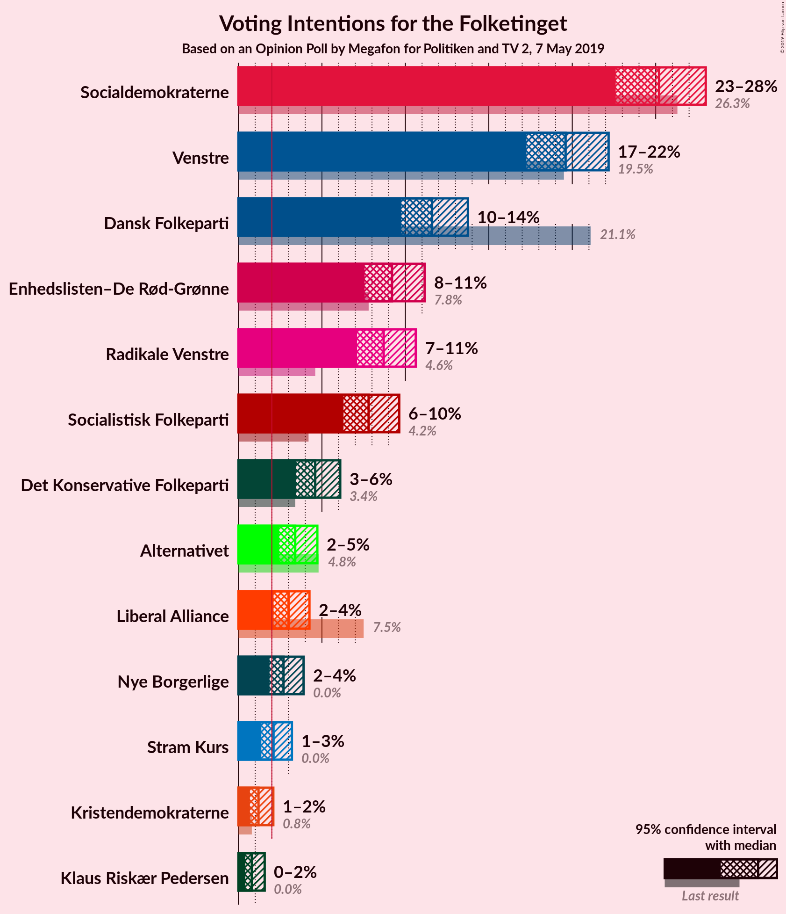

### Confidence Intervals

| Party | Last Result | Poll Result | 80% Confidence Interval | 90% Confidence Interval | 95% Confidence Interval | 99% Confidence Interval |
|:-----:|:-----------:|:-----------:|:-----------------------:|:-----------------------:|:-----------------------:|:-----------------------:|
| Socialdemokraterne | 26.3% | 25.2% | 23.5–27.0% |23.0–27.5% |22.6–28.0% |21.8–28.9% |
| Venstre | 19.5% | 19.6% | 18.1–21.3% |17.6–21.8% |17.3–22.2% |16.5–23.0% |
| Dansk Folkeparti | 21.1% | 11.6% | 10.4–13.0% |10.0–13.4% |9.8–13.7% |9.2–14.4% |
| Enhedslisten–De Rød-Grønne | 7.8% | 9.2% | 8.1–10.5% |7.8–10.8% |7.6–11.2% |7.1–11.8% |
| Radikale Venstre | 4.6% | 8.7% | 7.7–10.0% |7.3–10.3% |7.1–10.6% |6.6–11.2% |
| Socialistisk Folkeparti | 4.2% | 7.8% | 6.8–9.0% |6.5–9.3% |6.3–9.6% |5.8–10.2% |
| Det Konservative Folkeparti | 3.4% | 4.6% | 3.9–5.6% |3.6–5.9% |3.5–6.1% |3.1–6.6% |
| Alternativet | 4.8% | 3.4% | 2.8–4.3% |2.6–4.5% |2.4–4.7% |2.2–5.2% |
| Liberal Alliance | 7.5% | 3.0% | 2.4–3.8% |2.2–4.1% |2.1–4.3% |1.9–4.7% |
| Nye Borgerlige | 0.0% | 2.7% | 2.1–3.5% |2.0–3.7% |1.9–3.9% |1.6–4.3% |
| Stram Kurs | 0.0% | 2.1% | 1.6–2.8% |1.5–3.0% |1.4–3.2% |1.2–3.6% |
| Kristendemokraterne | 0.8% | 1.2% | 0.9–1.8% |0.8–1.9% |0.7–2.1% |0.5–2.4% |
| Klaus Riskær Pedersen | 0.0% | 0.8% | 0.5–1.3% |0.5–1.4% |0.4–1.6% |0.3–1.9% |

*Note:* The poll result column reflects the actual value used in the calculations. Published results may vary slightly, and in addition be rounded to fewer digits.

## Seats

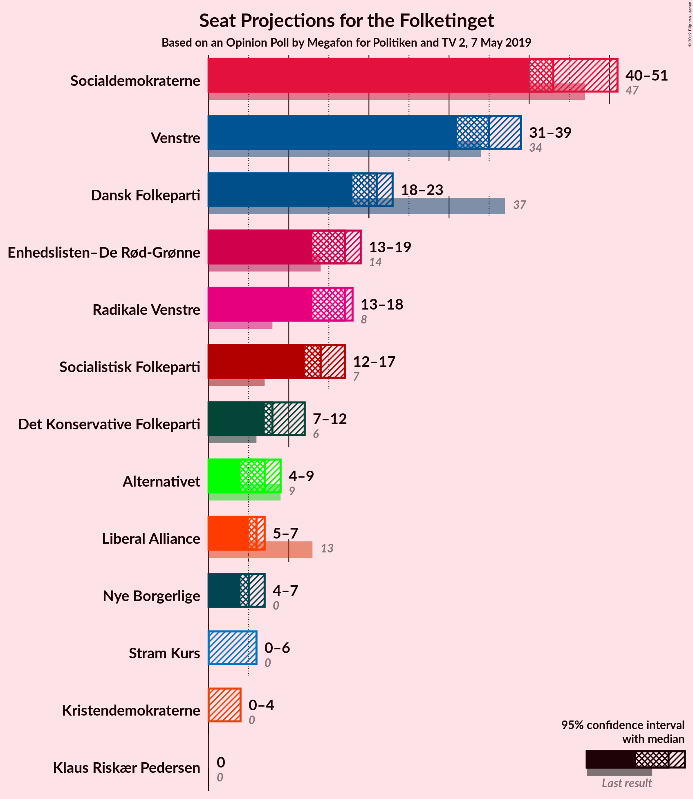

### Confidence Intervals

| Party | Last Result | Median | 80% Confidence Interval | 90% Confidence Interval | 95% Confidence Interval | 99% Confidence Interval |
|:-----:|:-----------:|:------:|:-----------------------:|:-----------------------:|:-----------------------:|:-----------------------:|
| <a href="#socialdemokraterne">Socialdemokraterne</a> | 47 | 43 | 43 |41–43 |41–44 |39–51 |
| <a href="#venstre">Venstre</a> | 34 | 35 | 35 |35 |33–39 |32–43 |
| <a href="#dansk-folkeparti">Dansk Folkeparti</a> | 37 | 21 | 21 |21 |20–23 |19–24 |
| <a href="#enhedslisten–de-rød-grønne">Enhedslisten–De Rød-Grønne</a> | 14 | 15 | 15 |15–16 |15–17 |13–20 |
| <a href="#radikale-venstre">Radikale Venstre</a> | 8 | 17 | 17 |16–17 |13–17 |13–17 |
| <a href="#socialistisk-folkeparti">Socialistisk Folkeparti</a> | 7 | 14 | 14 |13–14 |13–15 |12–18 |
| <a href="#det-konservative-folkeparti">Det Konservative Folkeparti</a> | 6 | 12 | 12 |9–12 |7–12 |7–12 |
| <a href="#alternativet">Alternativet</a> | 9 | 7 | 7 |7 |6–8 |5–9 |
| <a href="#liberal-alliance">Liberal Alliance</a> | 13 | 6 | 6 |6 |4–6 |4–8 |
| <a href="#nye-borgerlige">Nye Borgerlige</a> | 0 | 5 | 5 |5 |4–6 |0–7 |
| <a href="#stram-kurs">Stram Kurs</a> | 0 | 0 | 0 |0–4 |0–5 |0–5 |
| <a href="#kristendemokraterne">Kristendemokraterne</a> | 0 | 0 | 0 |0 |0 |0–4 |
| <a href="#klaus-riskær-pedersen">Klaus Riskær Pedersen</a> | 0 | 0 | 0 |0 |0 |0 |

### Socialdemokraterne

*For a full overview of the results for this party, see the [Socialdemokraterne](party-socialdemokraterne.html) page.*

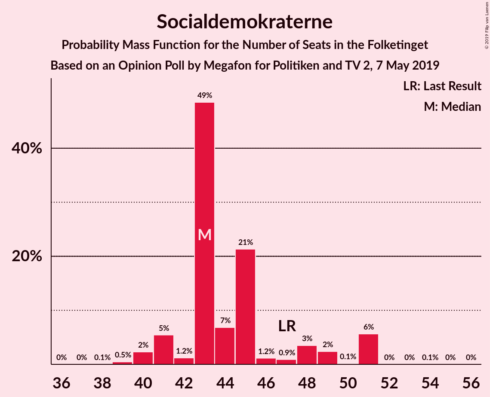

| Number of Seats | Probability | Accumulated | Special Marks |
|:---------------:|:-----------:|:-----------:|:-------------:|
| 38 | 0% | 100% |  |
| 39 | 2% | 99.9% |  |
| 40 | 0% | 98% |  |
| 41 | 3% | 98% |  |
| 42 | 1.0% | 95% |  |
| 43 | 91% | 94% | Median |
| 44 | 0.4% | 3% |  |
| 45 | 0.1% | 2% |  |
| 46 | 0% | 2% |  |
| 47 | 0.1% | 2% | Last Result |
| 48 | 0.1% | 2% |  |
| 49 | 0.3% | 2% |  |
| 50 | 0% | 2% |  |
| 51 | 2% | 2% |  |
| 52 | 0% | 0% |  |

### Venstre

*For a full overview of the results for this party, see the [Venstre](party-venstre.html) page.*

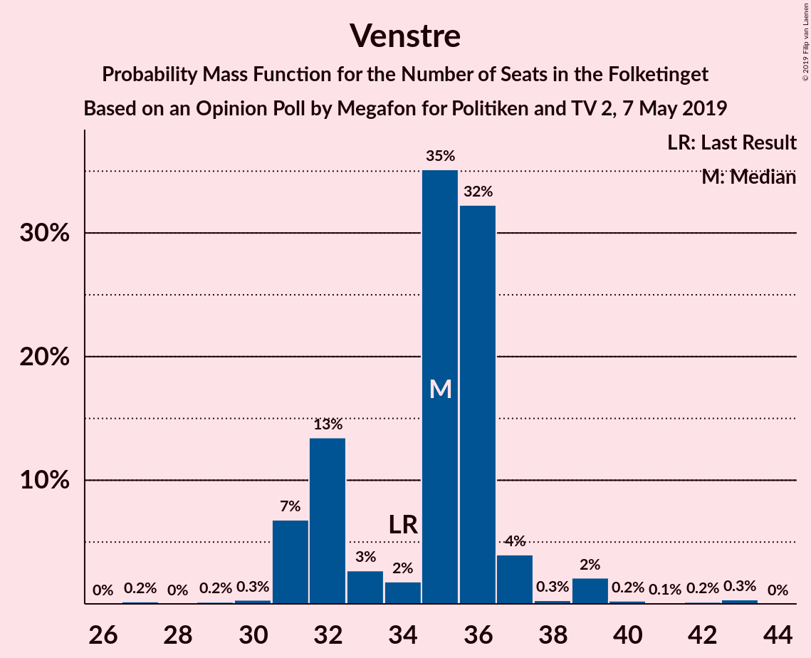

| Number of Seats | Probability | Accumulated | Special Marks |
|:---------------:|:-----------:|:-----------:|:-------------:|
| 28 | 0% | 100% |  |
| 29 | 0.2% | 99.9% |  |
| 30 | 0% | 99.7% |  |
| 31 | 0.2% | 99.7% |  |
| 32 | 0% | 99.5% |  |
| 33 | 3% | 99.5% |  |
| 34 | 0.2% | 96% | Last Result |
| 35 | 92% | 96% | Median |
| 36 | 2% | 5% |  |
| 37 | 0% | 3% |  |
| 38 | 0% | 3% |  |
| 39 | 0.9% | 3% |  |
| 40 | 0% | 2% |  |
| 41 | 0.1% | 2% |  |
| 42 | 0% | 2% |  |
| 43 | 2% | 2% |  |
| 44 | 0% | 0% |  |

### Dansk Folkeparti

*For a full overview of the results for this party, see the [Dansk Folkeparti](party-danskfolkeparti.html) page.*

| Number of Seats | Probability | Accumulated | Special Marks |
|:---------------:|:-----------:|:-----------:|:-------------:|
| 17 | 0.1% | 100% |  |
| 18 | 0.1% | 99.8% |  |
| 19 | 2% | 99.8% |  |
| 20 | 2% | 98% |  |
| 21 | 91% | 96% | Median |
| 22 | 0.9% | 5% |  |
| 23 | 2% | 4% |  |
| 24 | 2% | 2% |  |
| 25 | 0% | 0.3% |  |
| 26 | 0% | 0.2% |  |
| 27 | 0.2% | 0.2% |  |
| 28 | 0% | 0% |  |
| 29 | 0% | 0% |  |
| 30 | 0% | 0% |  |
| 31 | 0% | 0% |  |
| 32 | 0% | 0% |  |
| 33 | 0% | 0% |  |
| 34 | 0% | 0% |  |
| 35 | 0% | 0% |  |
| 36 | 0% | 0% |  |
| 37 | 0% | 0% | Last Result |

### Enhedslisten–De Rød-Grønne

*For a full overview of the results for this party, see the [Enhedslisten–De Rød-Grønne](party-enhedslisten–derød-grønne.html) page.*

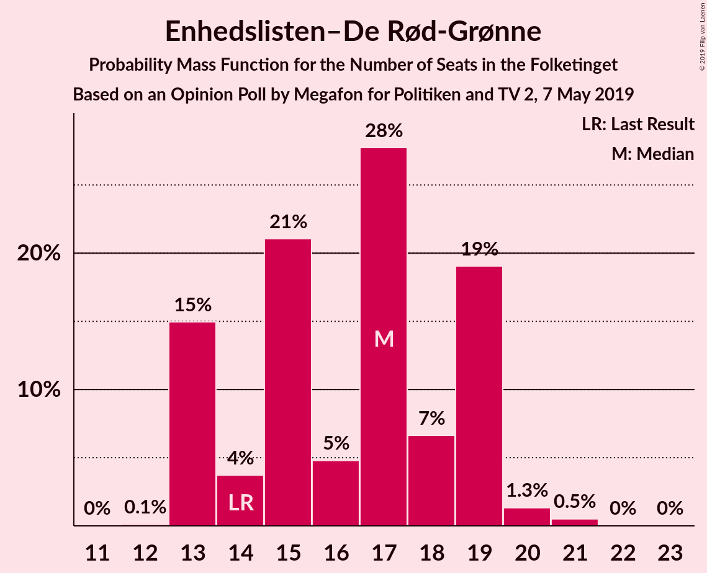

| Number of Seats | Probability | Accumulated | Special Marks |
|:---------------:|:-----------:|:-----------:|:-------------:|
| 12 | 0.2% | 100% |  |
| 13 | 0.9% | 99.8% |  |
| 14 | 0% | 99.0% | Last Result |
| 15 | 91% | 98.9% | Median |
| 16 | 4% | 7% |  |
| 17 | 2% | 3% |  |
| 18 | 0.1% | 1.4% |  |
| 19 | 0.1% | 1.3% |  |
| 20 | 1.2% | 1.3% |  |
| 21 | 0.1% | 0.1% |  |
| 22 | 0% | 0% |  |

### Radikale Venstre

*For a full overview of the results for this party, see the [Radikale Venstre](party-radikalevenstre.html) page.*

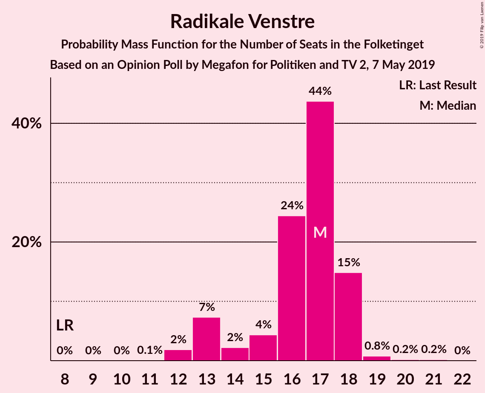

| Number of Seats | Probability | Accumulated | Special Marks |
|:---------------:|:-----------:|:-----------:|:-------------:|
| 8 | 0% | 100% | Last Result |
| 9 | 0% | 100% |  |
| 10 | 0% | 100% |  |
| 11 | 0.1% | 100% |  |
| 12 | 0.1% | 99.9% |  |
| 13 | 3% | 99.8% |  |
| 14 | 0.2% | 96% |  |
| 15 | 0.1% | 96% |  |
| 16 | 2% | 96% |  |
| 17 | 93% | 94% | Median |
| 18 | 0% | 0.4% |  |
| 19 | 0.1% | 0.4% |  |
| 20 | 0.2% | 0.2% |  |
| 21 | 0% | 0% |  |

### Socialistisk Folkeparti

*For a full overview of the results for this party, see the [Socialistisk Folkeparti](party-socialistiskfolkeparti.html) page.*

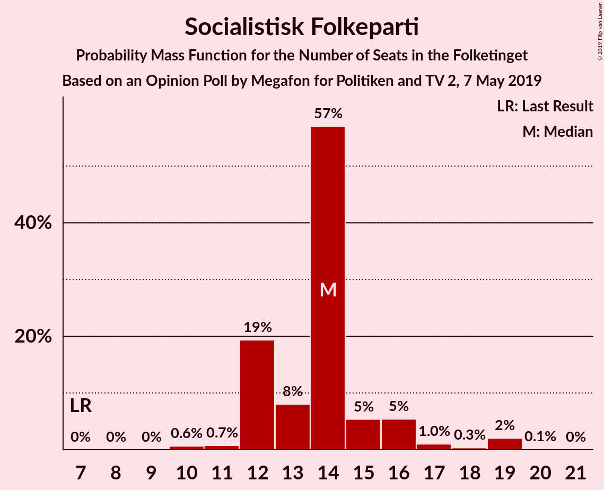

| Number of Seats | Probability | Accumulated | Special Marks |
|:---------------:|:-----------:|:-----------:|:-------------:|
| 7 | 0% | 100% | Last Result |
| 8 | 0% | 100% |  |
| 9 | 0% | 100% |  |
| 10 | 0% | 100% |  |
| 11 | 0.2% | 100% |  |
| 12 | 1.3% | 99.8% |  |
| 13 | 4% | 98% |  |
| 14 | 92% | 95% | Median |
| 15 | 2% | 3% |  |
| 16 | 0.1% | 0.8% |  |
| 17 | 0% | 0.7% |  |
| 18 | 0.6% | 0.7% |  |
| 19 | 0% | 0% |  |

### Det Konservative Folkeparti

*For a full overview of the results for this party, see the [Det Konservative Folkeparti](party-detkonservativefolkeparti.html) page.*

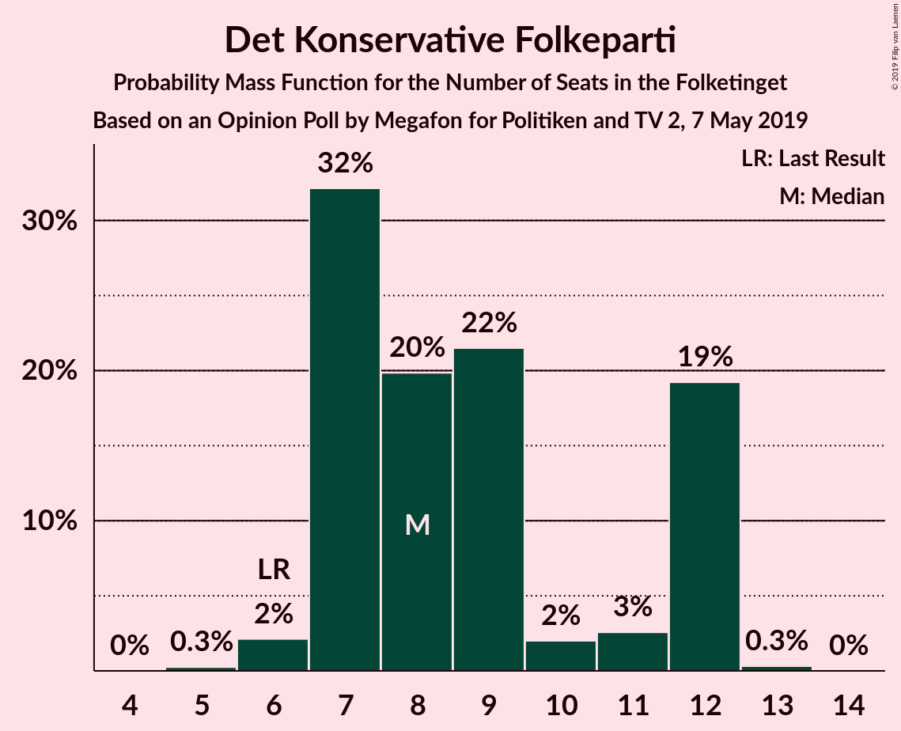

| Number of Seats | Probability | Accumulated | Special Marks |
|:---------------:|:-----------:|:-----------:|:-------------:|
| 6 | 0.2% | 100% | Last Result |
| 7 | 2% | 99.8% |  |
| 8 | 1.0% | 97% |  |
| 9 | 2% | 96% |  |
| 10 | 3% | 95% |  |
| 11 | 0.4% | 92% |  |
| 12 | 92% | 92% | Median |
| 13 | 0% | 0% |  |

### Alternativet

*For a full overview of the results for this party, see the [Alternativet](party-alternativet.html) page.*

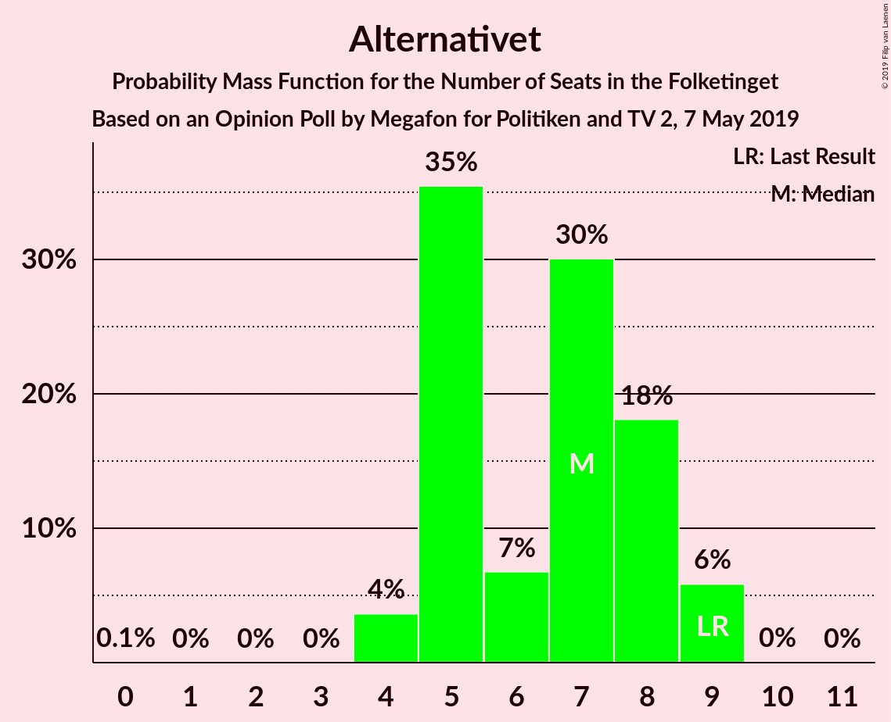

| Number of Seats | Probability | Accumulated | Special Marks |
|:---------------:|:-----------:|:-----------:|:-------------:|
| 4 | 0.4% | 100% |  |
| 5 | 2% | 99.6% |  |
| 6 | 2% | 98% |  |
| 7 | 93% | 96% | Median |
| 8 | 2% | 3% |  |
| 9 | 0.9% | 0.9% | Last Result |
| 10 | 0% | 0% |  |

### Liberal Alliance

*For a full overview of the results for this party, see the [Liberal Alliance](party-liberalalliance.html) page.*

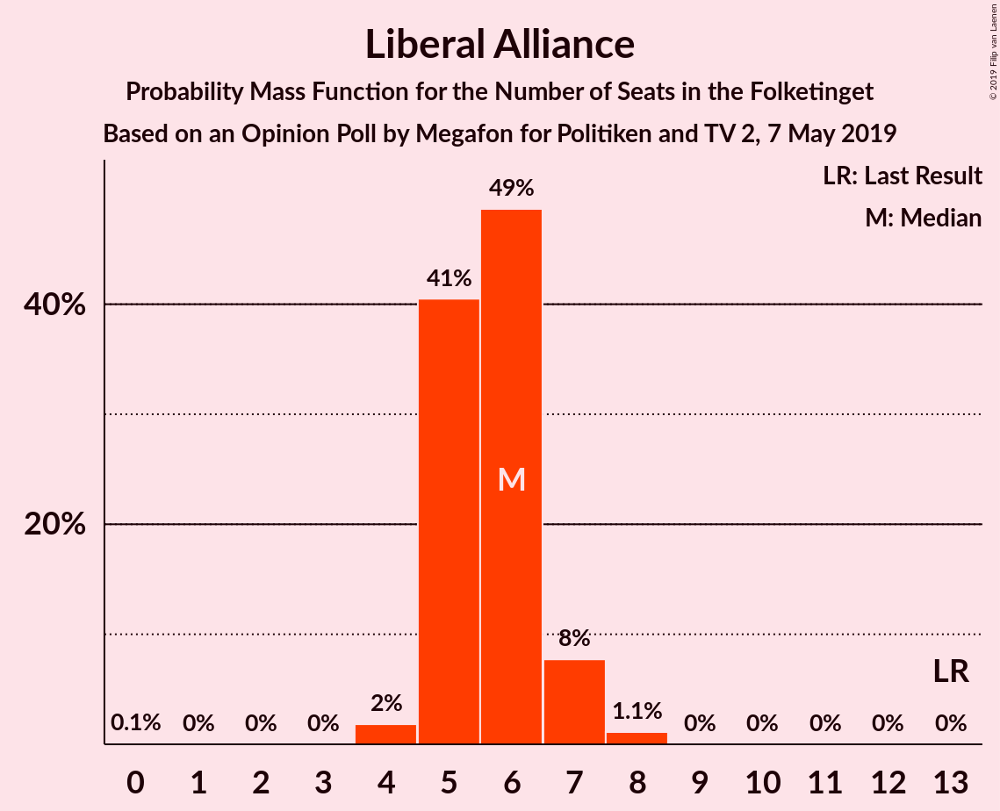

| Number of Seats | Probability | Accumulated | Special Marks |
|:---------------:|:-----------:|:-----------:|:-------------:|
| 0 | 0.1% | 100% |  |
| 1 | 0% | 99.9% |  |
| 2 | 0% | 99.9% |  |
| 3 | 0% | 99.9% |  |
| 4 | 2% | 99.9% |  |
| 5 | 2% | 97% |  |
| 6 | 94% | 96% | Median |
| 7 | 0.1% | 2% |  |
| 8 | 2% | 2% |  |
| 9 | 0% | 0% |  |
| 10 | 0% | 0% |  |
| 11 | 0% | 0% |  |
| 12 | 0% | 0% |  |
| 13 | 0% | 0% | Last Result |

### Nye Borgerlige

*For a full overview of the results for this party, see the [Nye Borgerlige](party-nyeborgerlige.html) page.*

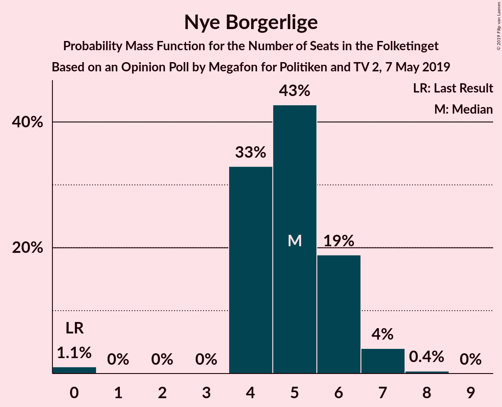

| Number of Seats | Probability | Accumulated | Special Marks |
|:---------------:|:-----------:|:-----------:|:-------------:|
| 0 | 1.3% | 100% | Last Result |
| 1 | 0% | 98.7% |  |
| 2 | 0% | 98.7% |  |
| 3 | 0% | 98.7% |  |
| 4 | 3% | 98.7% |  |
| 5 | 92% | 96% | Median |
| 6 | 1.4% | 3% |  |
| 7 | 2% | 2% |  |
| 8 | 0% | 0% |  |

### Stram Kurs

*For a full overview of the results for this party, see the [Stram Kurs](party-stramkurs.html) page.*

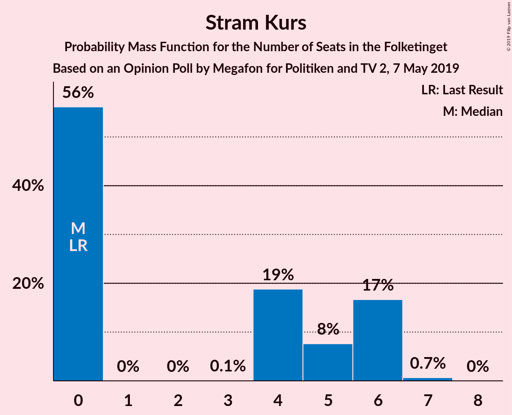

| Number of Seats | Probability | Accumulated | Special Marks |
|:---------------:|:-----------:|:-----------:|:-------------:|
| 0 | 95% | 100% | Last Result, Median |
| 1 | 0% | 5% |  |
| 2 | 0% | 5% |  |
| 3 | 0% | 5% |  |
| 4 | 2% | 5% |  |
| 5 | 3% | 3% |  |
| 6 | 0% | 0.3% |  |
| 7 | 0.2% | 0.3% |  |
| 8 | 0% | 0% |  |

### Kristendemokraterne

*For a full overview of the results for this party, see the [Kristendemokraterne](party-kristendemokraterne.html) page.*

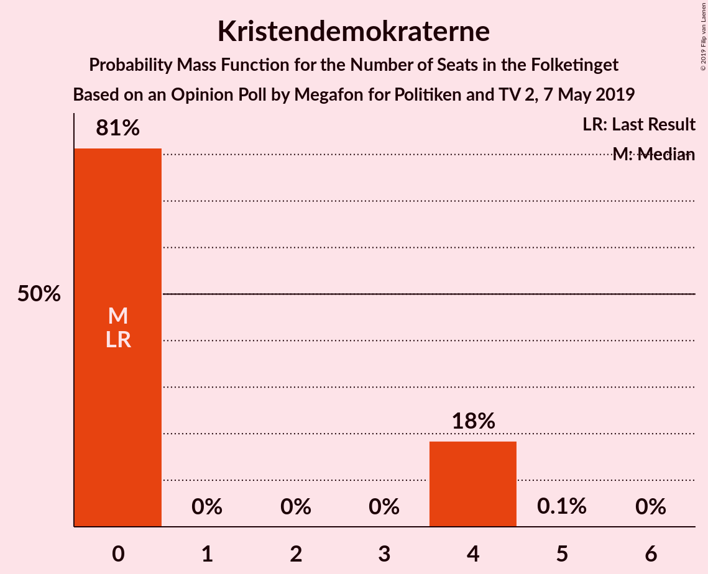

| Number of Seats | Probability | Accumulated | Special Marks |
|:---------------:|:-----------:|:-----------:|:-------------:|
| 0 | 99.0% | 100% | Last Result, Median |
| 1 | 0% | 1.0% |  |
| 2 | 0% | 1.0% |  |
| 3 | 0% | 1.0% |  |
| 4 | 1.0% | 1.0% |  |
| 5 | 0% | 0% |  |

### Klaus Riskær Pedersen

*For a full overview of the results for this party, see the [Klaus Riskær Pedersen](party-klausriskærpedersen.html) page.*

| Number of Seats | Probability | Accumulated | Special Marks |
|:---------------:|:-----------:|:-----------:|:-------------:|
| 0 | 100% | 100% | Last Result, Median |

## Coalitions

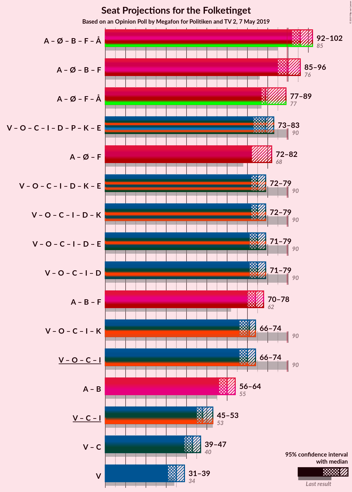

### Confidence Intervals

| Coalition | Last Result | Median | Majority? | 80% Confidence Interval | 90% Confidence Interval | 95% Confidence Interval | 99% Confidence Interval |
|:---------:|:-----------:|:------:|:---------:|:-----------------------:|:-----------------------:|:-----------------------:|:-----------------------:|
| Socialdemokraterne – Enhedslisten–De Rød-Grønne – Radikale Venstre – Socialistisk Folkeparti – Alternativet | 85 | 96 | 98% | 96 | 96 | 91–99 | 89–100 |
| Socialdemokraterne – Enhedslisten–De Rød-Grønne – Radikale Venstre – Socialistisk Folkeparti | 76 | 89 | 4% | 89 | 89 | 84–91 | 83–95 |
| Venstre – Dansk Folkeparti – Det Konservative Folkeparti – Liberal Alliance – Nye Borgerlige – Stram Kurs – Kristendemokraterne – Klaus Riskær Pedersen | 90 | 79 | 0% | 79 | 79 | 76–84 | 75–86 |
| Socialdemokraterne – Enhedslisten–De Rød-Grønne – Socialistisk Folkeparti – Alternativet | 77 | 79 | 0% | 79 | 79 | 76–82 | 75–87 |
| Venstre – Dansk Folkeparti – Det Konservative Folkeparti – Liberal Alliance – Nye Borgerlige – Kristendemokraterne – Klaus Riskær Pedersen | 90 | 79 | 0% | 79 | 79 | 75–82 | 71–82 |
| Venstre – Dansk Folkeparti – Det Konservative Folkeparti – Liberal Alliance – Nye Borgerlige – Kristendemokraterne | 90 | 79 | 0% | 79 | 79 | 75–82 | 71–82 |
| Venstre – Dansk Folkeparti – Det Konservative Folkeparti – Liberal Alliance – Nye Borgerlige – Klaus Riskær Pedersen | 90 | 79 | 0% | 79 | 79 | 73–82 | 70–82 |
| Venstre – Dansk Folkeparti – Det Konservative Folkeparti – Liberal Alliance – Nye Borgerlige | 90 | 79 | 0% | 79 | 79 | 73–82 | 70–82 |
| Venstre – Dansk Folkeparti – Det Konservative Folkeparti – Liberal Alliance – Kristendemokraterne | 90 | 74 | 0% | 74 | 73–74 | 71–75 | 69–77 |
| Venstre – Dansk Folkeparti – Det Konservative Folkeparti – Liberal Alliance | 90 | 74 | 0% | 74 | 73–74 | 71–75 | 66–77 |
| Socialdemokraterne – Enhedslisten–De Rød-Grønne – Socialistisk Folkeparti | 68 | 72 | 0% | 72 | 72 | 70–74 | 68–82 |
| Socialdemokraterne – Radikale Venstre – Socialistisk Folkeparti | 62 | 74 | 0% | 74 | 71–74 | 67–74 | 67–79 |
| Socialdemokraterne – Radikale Venstre | 55 | 60 | 0% | 60 | 58–60 | 55–60 | 54–64 |
| Venstre – Det Konservative Folkeparti – Liberal Alliance | 53 | 53 | 0% | 53 | 51–53 | 48–53 | 46–56 |
| Venstre – Det Konservative Folkeparti | 40 | 47 | 0% | 47 | 46–47 | 43–47 | 40–52 |
| Venstre | 34 | 35 | 0% | 35 | 35 | 33–39 | 32–43 |

### Socialdemokraterne – Enhedslisten–De Rød-Grønne – Radikale Venstre – Socialistisk Folkeparti – Alternativet

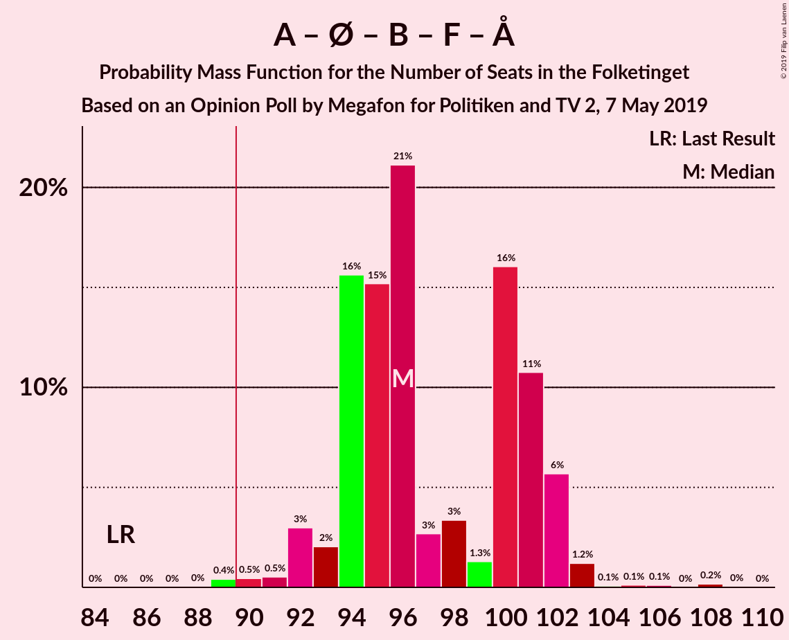

| Number of Seats | Probability | Accumulated | Special Marks |
|:---------------:|:-----------:|:-----------:|:-------------:|
| 85 | 0% | 100% | Last Result |
| 86 | 0% | 100% |  |
| 87 | 0% | 100% |  |
| 88 | 0% | 100% |  |
| 89 | 2% | 100% |  |
| 90 | 0% | 98% | Majority |
| 91 | 1.4% | 98% |  |
| 92 | 0% | 97% |  |
| 93 | 1.1% | 97% |  |
| 94 | 0.1% | 96% |  |
| 95 | 0.1% | 96% |  |
| 96 | 91% | 96% | Median |
| 97 | 0.3% | 4% |  |
| 98 | 0.9% | 4% |  |
| 99 | 1.2% | 3% |  |
| 100 | 2% | 2% |  |
| 101 | 0.2% | 0.4% |  |
| 102 | 0.1% | 0.1% |  |
| 103 | 0% | 0% |  |

### Socialdemokraterne – Enhedslisten–De Rød-Grønne – Radikale Venstre – Socialistisk Folkeparti

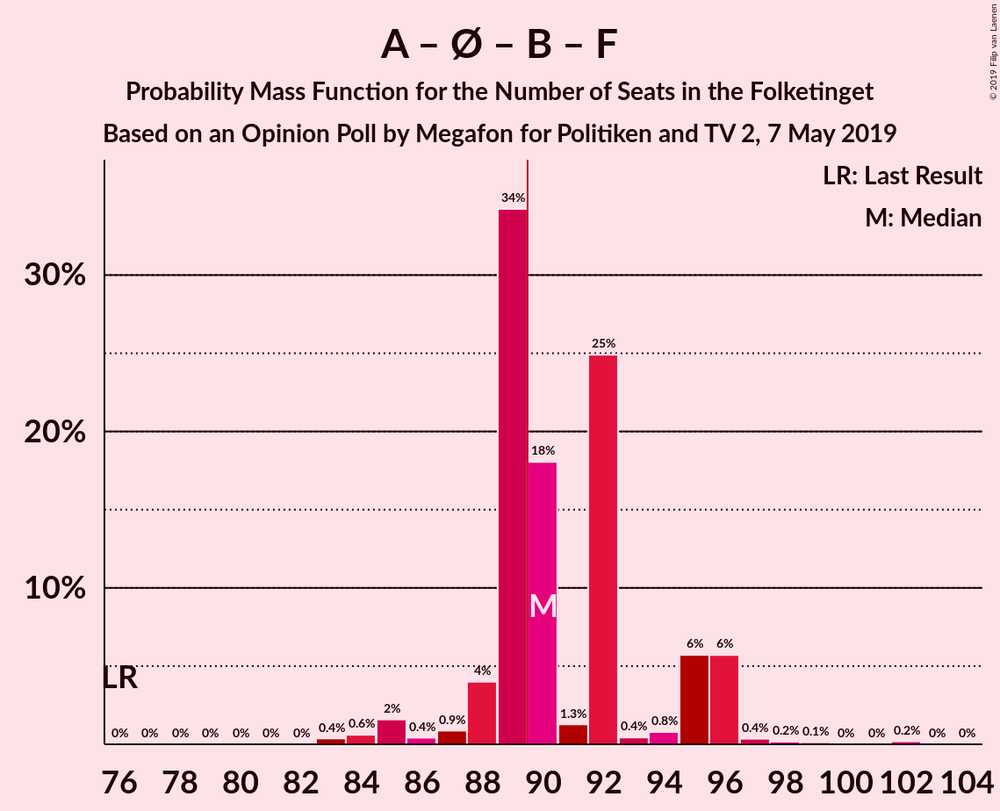

| Number of Seats | Probability | Accumulated | Special Marks |
|:---------------:|:-----------:|:-----------:|:-------------:|
| 76 | 0% | 100% | Last Result |
| 77 | 0% | 100% |  |
| 78 | 0% | 100% |  |
| 79 | 0% | 100% |  |
| 80 | 0% | 100% |  |
| 81 | 0% | 100% |  |
| 82 | 0% | 100% |  |
| 83 | 2% | 100% |  |
| 84 | 2% | 98% |  |
| 85 | 0.2% | 96% |  |
| 86 | 0.1% | 96% |  |
| 87 | 0.1% | 96% |  |
| 88 | 0% | 96% |  |
| 89 | 91% | 96% | Median |
| 90 | 0.9% | 4% | Majority |
| 91 | 1.2% | 4% |  |
| 92 | 0.1% | 2% |  |
| 93 | 0.2% | 2% |  |
| 94 | 0.3% | 2% |  |
| 95 | 1.5% | 2% |  |
| 96 | 0.1% | 0.2% |  |
| 97 | 0% | 0.1% |  |
| 98 | 0.1% | 0.1% |  |
| 99 | 0% | 0% |  |

### Venstre – Dansk Folkeparti – Det Konservative Folkeparti – Liberal Alliance – Nye Borgerlige – Stram Kurs – Kristendemokraterne – Klaus Riskær Pedersen

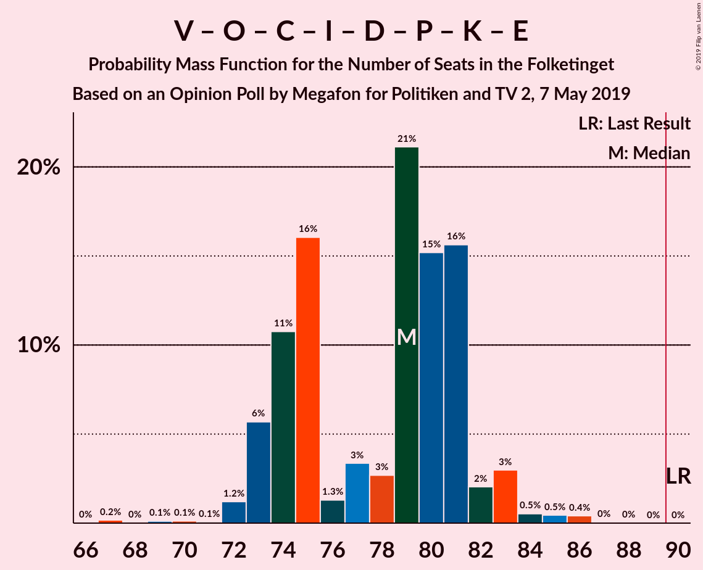

| Number of Seats | Probability | Accumulated | Special Marks |
|:---------------:|:-----------:|:-----------:|:-------------:|
| 73 | 0.1% | 100% |  |
| 74 | 0.2% | 99.9% |  |
| 75 | 2% | 99.6% |  |
| 76 | 1.2% | 98% |  |
| 77 | 0.9% | 97% |  |
| 78 | 0.3% | 96% |  |
| 79 | 91% | 96% | Median |
| 80 | 0.1% | 4% |  |
| 81 | 0.1% | 4% |  |
| 82 | 1.1% | 4% |  |
| 83 | 0% | 3% |  |
| 84 | 1.4% | 3% |  |
| 85 | 0% | 2% |  |
| 86 | 2% | 2% |  |
| 87 | 0% | 0% |  |
| 88 | 0% | 0% |  |
| 89 | 0% | 0% |  |
| 90 | 0% | 0% | Last Result, Majority |

### Socialdemokraterne – Enhedslisten–De Rød-Grønne – Socialistisk Folkeparti – Alternativet

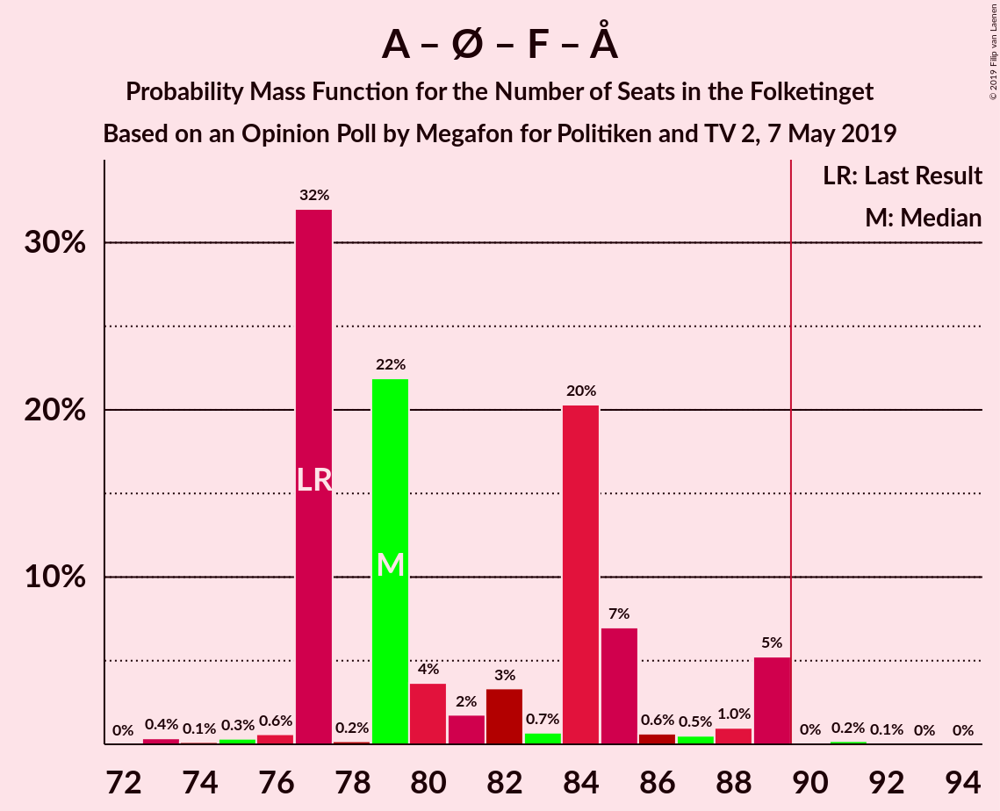

| Number of Seats | Probability | Accumulated | Special Marks |
|:---------------:|:-----------:|:-----------:|:-------------:|
| 75 | 1.3% | 100% |  |
| 76 | 2% | 98.7% |  |
| 77 | 1.1% | 97% | Last Result |
| 78 | 0% | 96% |  |
| 79 | 91% | 96% | Median |
| 80 | 0.3% | 5% |  |
| 81 | 0.8% | 4% |  |
| 82 | 1.5% | 3% |  |
| 83 | 0% | 2% |  |
| 84 | 0.3% | 2% |  |
| 85 | 0% | 2% |  |
| 86 | 0.1% | 2% |  |
| 87 | 1.5% | 2% |  |
| 88 | 0% | 0.1% |  |
| 89 | 0% | 0% |  |

### Venstre – Dansk Folkeparti – Det Konservative Folkeparti – Liberal Alliance – Nye Borgerlige – Kristendemokraterne – Klaus Riskær Pedersen

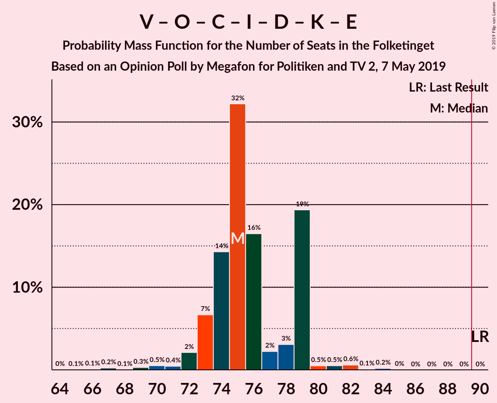

| Number of Seats | Probability | Accumulated | Special Marks |
|:---------------:|:-----------:|:-----------:|:-------------:|
| 70 | 0.2% | 100% |  |
| 71 | 1.3% | 99.8% |  |
| 72 | 0% | 98% |  |
| 73 | 0.1% | 98% |  |
| 74 | 0.4% | 98% |  |
| 75 | 2% | 98% |  |
| 76 | 0% | 96% |  |
| 77 | 0.8% | 96% |  |
| 78 | 0% | 95% |  |
| 79 | 93% | 95% | Median |
| 80 | 0.1% | 3% |  |
| 81 | 0.1% | 3% |  |
| 82 | 3% | 3% |  |
| 83 | 0% | 0% |  |
| 84 | 0% | 0% |  |
| 85 | 0% | 0% |  |
| 86 | 0% | 0% |  |
| 87 | 0% | 0% |  |
| 88 | 0% | 0% |  |
| 89 | 0% | 0% |  |
| 90 | 0% | 0% | Last Result, Majority |

### Venstre – Dansk Folkeparti – Det Konservative Folkeparti – Liberal Alliance – Nye Borgerlige – Kristendemokraterne

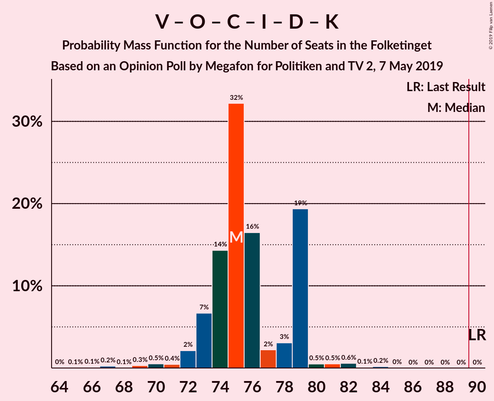

| Number of Seats | Probability | Accumulated | Special Marks |
|:---------------:|:-----------:|:-----------:|:-------------:|
| 69 | 0% | 100% |  |
| 70 | 0.2% | 99.9% |  |
| 71 | 1.3% | 99.8% |  |
| 72 | 0% | 98% |  |
| 73 | 0.1% | 98% |  |
| 74 | 0.4% | 98% |  |
| 75 | 2% | 98% |  |
| 76 | 0% | 96% |  |
| 77 | 0.8% | 96% |  |
| 78 | 0% | 95% |  |
| 79 | 93% | 95% | Median |
| 80 | 0.1% | 3% |  |
| 81 | 0.1% | 3% |  |
| 82 | 3% | 3% |  |
| 83 | 0% | 0% |  |
| 84 | 0% | 0% |  |
| 85 | 0% | 0% |  |
| 86 | 0% | 0% |  |
| 87 | 0% | 0% |  |
| 88 | 0% | 0% |  |
| 89 | 0% | 0% |  |
| 90 | 0% | 0% | Last Result, Majority |

### Venstre – Dansk Folkeparti – Det Konservative Folkeparti – Liberal Alliance – Nye Borgerlige – Klaus Riskær Pedersen

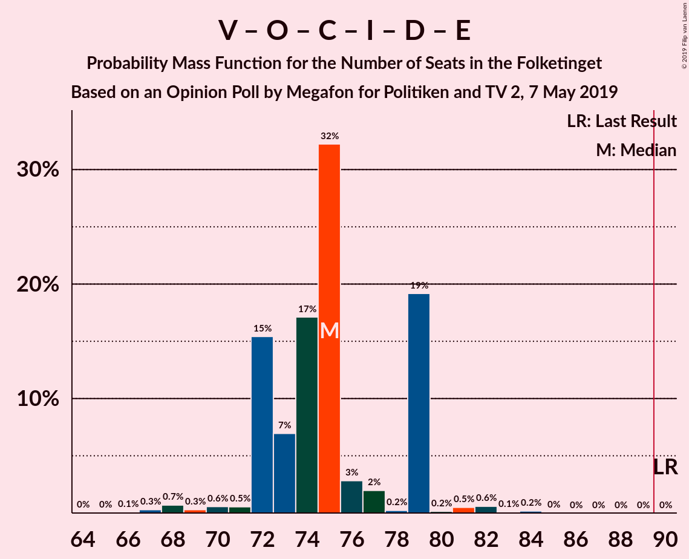

| Number of Seats | Probability | Accumulated | Special Marks |
|:---------------:|:-----------:|:-----------:|:-------------:|
| 67 | 0% | 100% |  |
| 68 | 0% | 99.9% |  |
| 69 | 0% | 99.9% |  |
| 70 | 0.4% | 99.9% |  |
| 71 | 1.3% | 99.5% |  |
| 72 | 0% | 98% |  |
| 73 | 0.7% | 98% |  |
| 74 | 0.2% | 97% |  |
| 75 | 2% | 97% |  |
| 76 | 0% | 95% |  |
| 77 | 0.2% | 95% |  |
| 78 | 0% | 95% |  |
| 79 | 93% | 95% | Median |
| 80 | 0% | 3% |  |
| 81 | 0.1% | 3% |  |
| 82 | 3% | 3% |  |
| 83 | 0% | 0% |  |
| 84 | 0% | 0% |  |
| 85 | 0% | 0% |  |
| 86 | 0% | 0% |  |
| 87 | 0% | 0% |  |
| 88 | 0% | 0% |  |
| 89 | 0% | 0% |  |
| 90 | 0% | 0% | Last Result, Majority |

### Venstre – Dansk Folkeparti – Det Konservative Folkeparti – Liberal Alliance – Nye Borgerlige

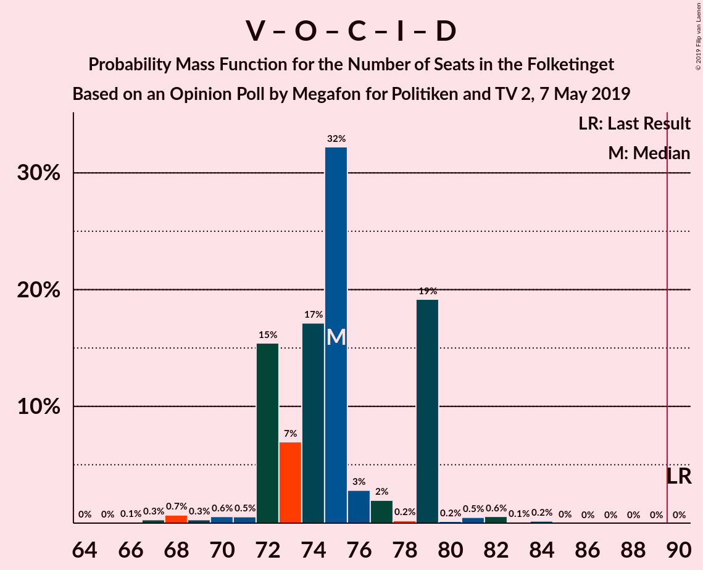

| Number of Seats | Probability | Accumulated | Special Marks |
|:---------------:|:-----------:|:-----------:|:-------------:|
| 67 | 0% | 100% |  |
| 68 | 0% | 99.9% |  |
| 69 | 0% | 99.9% |  |
| 70 | 0.4% | 99.9% |  |
| 71 | 1.3% | 99.5% |  |
| 72 | 0% | 98% |  |
| 73 | 0.7% | 98% |  |
| 74 | 0.2% | 97% |  |
| 75 | 2% | 97% |  |
| 76 | 0% | 95% |  |
| 77 | 0.2% | 95% |  |
| 78 | 0% | 95% |  |
| 79 | 93% | 95% | Median |
| 80 | 0% | 3% |  |
| 81 | 0.1% | 3% |  |
| 82 | 3% | 3% |  |
| 83 | 0% | 0% |  |
| 84 | 0% | 0% |  |
| 85 | 0% | 0% |  |
| 86 | 0% | 0% |  |
| 87 | 0% | 0% |  |
| 88 | 0% | 0% |  |
| 89 | 0% | 0% |  |
| 90 | 0% | 0% | Last Result, Majority |

### Venstre – Dansk Folkeparti – Det Konservative Folkeparti – Liberal Alliance – Kristendemokraterne

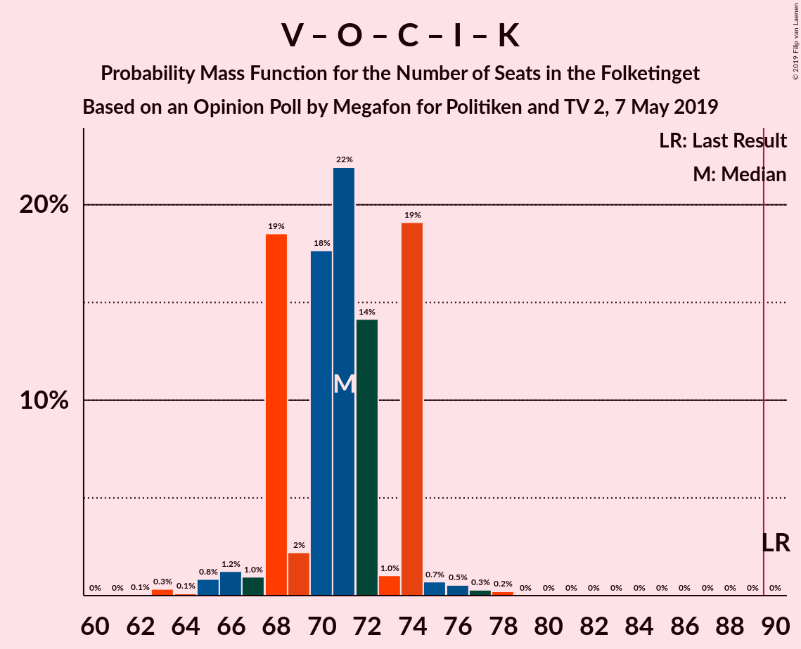

| Number of Seats | Probability | Accumulated | Special Marks |
|:---------------:|:-----------:|:-----------:|:-------------:|
| 65 | 0.2% | 100% |  |
| 66 | 0% | 99.8% |  |
| 67 | 0.2% | 99.7% |  |
| 68 | 0% | 99.5% |  |
| 69 | 0.1% | 99.5% |  |
| 70 | 0.4% | 99.4% |  |
| 71 | 3% | 99.1% |  |
| 72 | 0% | 96% |  |
| 73 | 2% | 96% |  |
| 74 | 91% | 94% | Median |
| 75 | 2% | 3% |  |
| 76 | 0% | 1.0% |  |
| 77 | 0.9% | 0.9% |  |
| 78 | 0% | 0.1% |  |
| 79 | 0% | 0.1% |  |
| 80 | 0% | 0% |  |
| 81 | 0% | 0% |  |
| 82 | 0% | 0% |  |
| 83 | 0% | 0% |  |
| 84 | 0% | 0% |  |
| 85 | 0% | 0% |  |
| 86 | 0% | 0% |  |
| 87 | 0% | 0% |  |
| 88 | 0% | 0% |  |
| 89 | 0% | 0% |  |
| 90 | 0% | 0% | Last Result, Majority |

### Venstre – Dansk Folkeparti – Det Konservative Folkeparti – Liberal Alliance

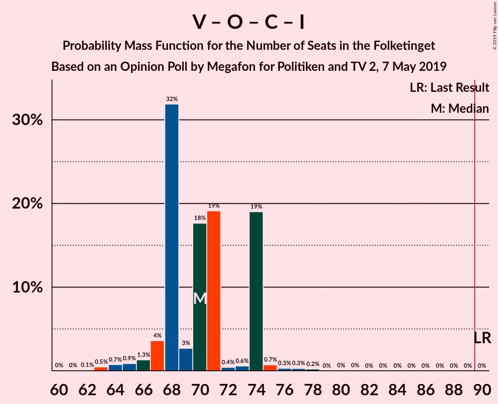

| Number of Seats | Probability | Accumulated | Special Marks |
|:---------------:|:-----------:|:-----------:|:-------------:|
| 64 | 0% | 100% |  |
| 65 | 0.2% | 99.9% |  |
| 66 | 0.2% | 99.7% |  |
| 67 | 0.2% | 99.5% |  |
| 68 | 0% | 99.3% |  |
| 69 | 0.7% | 99.3% |  |
| 70 | 0.2% | 98.6% |  |
| 71 | 3% | 98% |  |
| 72 | 0% | 95% |  |
| 73 | 1.5% | 95% |  |
| 74 | 91% | 94% | Median |
| 75 | 2% | 3% |  |
| 76 | 0% | 0.9% |  |
| 77 | 0.9% | 0.9% |  |
| 78 | 0% | 0.1% |  |
| 79 | 0% | 0% |  |
| 80 | 0% | 0% |  |
| 81 | 0% | 0% |  |
| 82 | 0% | 0% |  |
| 83 | 0% | 0% |  |
| 84 | 0% | 0% |  |
| 85 | 0% | 0% |  |
| 86 | 0% | 0% |  |
| 87 | 0% | 0% |  |
| 88 | 0% | 0% |  |
| 89 | 0% | 0% |  |
| 90 | 0% | 0% | Last Result, Majority |

### Socialdemokraterne – Enhedslisten–De Rød-Grønne – Socialistisk Folkeparti

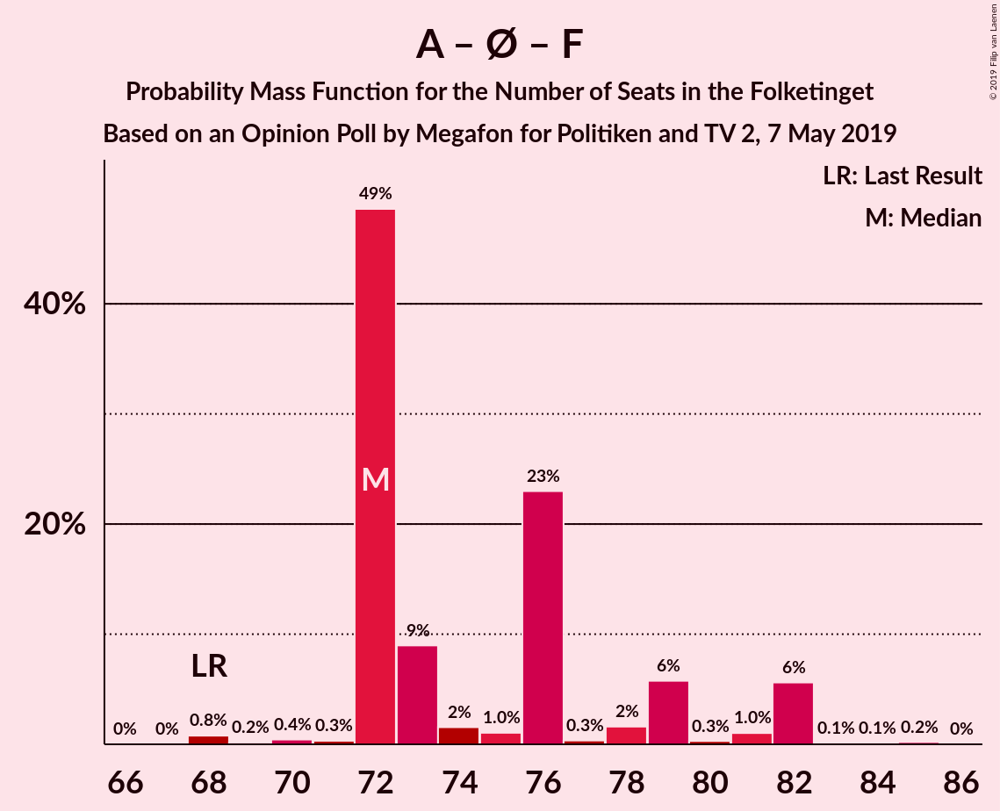

| Number of Seats | Probability | Accumulated | Special Marks |
|:---------------:|:-----------:|:-----------:|:-------------:|
| 68 | 2% | 100% | Last Result |
| 69 | 0% | 98% |  |
| 70 | 2% | 98% |  |
| 71 | 0% | 96% |  |
| 72 | 92% | 96% | Median |
| 73 | 0.9% | 5% |  |
| 74 | 1.5% | 4% |  |
| 75 | 0.2% | 2% |  |
| 76 | 0.1% | 2% |  |
| 77 | 0.2% | 2% |  |
| 78 | 0.1% | 2% |  |
| 79 | 0% | 2% |  |
| 80 | 0.1% | 2% |  |
| 81 | 0.1% | 2% |  |
| 82 | 1.5% | 2% |  |
| 83 | 0% | 0% |  |

### Socialdemokraterne – Radikale Venstre – Socialistisk Folkeparti

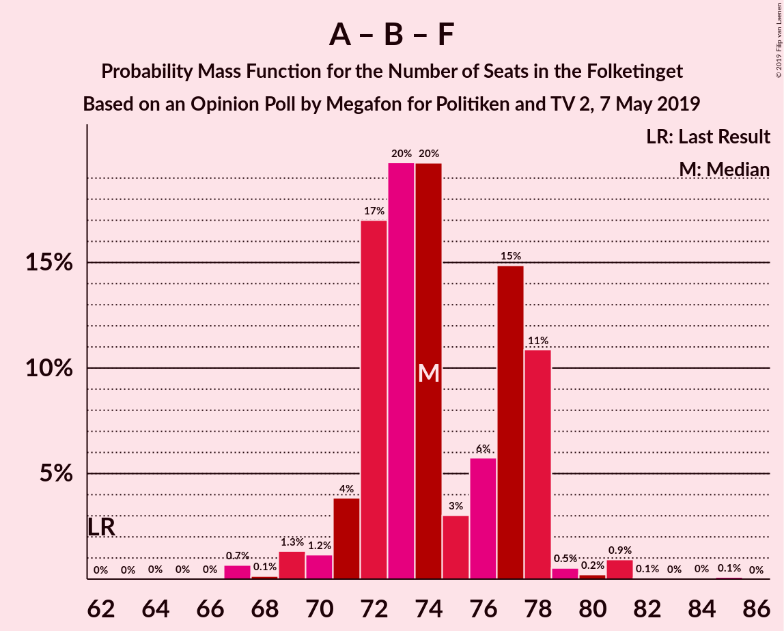

| Number of Seats | Probability | Accumulated | Special Marks |
|:---------------:|:-----------:|:-----------:|:-------------:|
| 62 | 0% | 100% | Last Result |
| 63 | 0% | 100% |  |
| 64 | 0% | 100% |  |
| 65 | 0% | 100% |  |
| 66 | 0% | 100% |  |
| 67 | 3% | 100% |  |
| 68 | 0.2% | 97% |  |
| 69 | 0% | 97% |  |
| 70 | 0% | 97% |  |
| 71 | 2% | 97% |  |
| 72 | 0.1% | 95% |  |
| 73 | 0.1% | 95% |  |
| 74 | 92% | 95% | Median |
| 75 | 0.1% | 2% |  |
| 76 | 0.2% | 2% |  |
| 77 | 0.3% | 2% |  |
| 78 | 0% | 2% |  |
| 79 | 1.5% | 2% |  |
| 80 | 0% | 0.2% |  |
| 81 | 0.1% | 0.2% |  |
| 82 | 0.1% | 0.2% |  |
| 83 | 0% | 0% |  |

### Socialdemokraterne – Radikale Venstre

| Number of Seats | Probability | Accumulated | Special Marks |
|:---------------:|:-----------:|:-----------:|:-------------:|
| 53 | 0% | 100% |  |
| 54 | 2% | 99.9% |  |
| 55 | 1.3% | 98% | Last Result |
| 56 | 0.7% | 97% |  |
| 57 | 0% | 96% |  |
| 58 | 2% | 96% |  |
| 59 | 0% | 94% |  |
| 60 | 92% | 94% | Median |
| 61 | 0% | 2% |  |
| 62 | 0.3% | 2% |  |
| 63 | 0% | 2% |  |
| 64 | 2% | 2% |  |
| 65 | 0% | 0.4% |  |
| 66 | 0.2% | 0.4% |  |
| 67 | 0% | 0.2% |  |
| 68 | 0.2% | 0.2% |  |
| 69 | 0% | 0% |  |

### Venstre – Det Konservative Folkeparti – Liberal Alliance

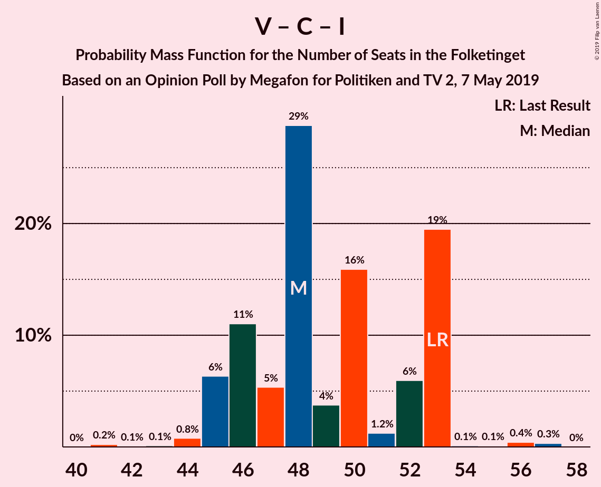

| Number of Seats | Probability | Accumulated | Special Marks |
|:---------------:|:-----------:|:-----------:|:-------------:|
| 41 | 0% | 100% |  |
| 42 | 0% | 99.9% |  |
| 43 | 0% | 99.9% |  |
| 44 | 0% | 99.9% |  |
| 45 | 0.1% | 99.9% |  |
| 46 | 0.5% | 99.8% |  |
| 47 | 0.9% | 99.3% |  |
| 48 | 2% | 98% |  |
| 49 | 1.3% | 97% |  |
| 50 | 0.1% | 96% |  |
| 51 | 1.5% | 96% |  |
| 52 | 0% | 94% |  |
| 53 | 92% | 94% | Last Result, Median |
| 54 | 0% | 2% |  |
| 55 | 0% | 2% |  |
| 56 | 2% | 2% |  |
| 57 | 0% | 0% |  |

### Venstre – Det Konservative Folkeparti

| Number of Seats | Probability | Accumulated | Special Marks |
|:---------------:|:-----------:|:-----------:|:-------------:|
| 37 | 0% | 100% |  |
| 38 | 0% | 99.9% |  |
| 39 | 0.2% | 99.9% |  |
| 40 | 2% | 99.8% | Last Result |
| 41 | 0.4% | 98% |  |
| 42 | 0.1% | 98% |  |
| 43 | 2% | 98% |  |
| 44 | 0% | 96% |  |
| 45 | 0.1% | 96% |  |
| 46 | 1.5% | 95% |  |
| 47 | 92% | 94% | Median |
| 48 | 0% | 2% |  |
| 49 | 0.1% | 2% |  |
| 50 | 0% | 2% |  |
| 51 | 0% | 2% |  |
| 52 | 2% | 2% |  |
| 53 | 0% | 0% |  |

### Venstre

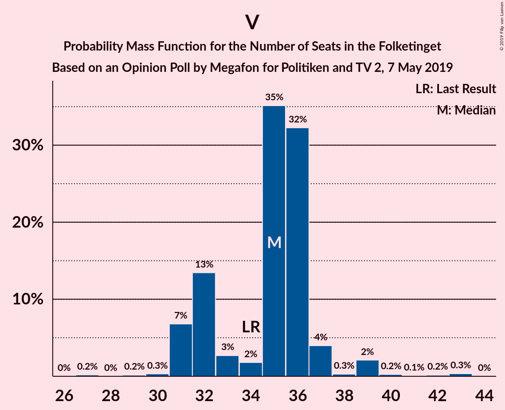

| Number of Seats | Probability | Accumulated | Special Marks |
|:---------------:|:-----------:|:-----------:|:-------------:|
| 28 | 0% | 100% |  |
| 29 | 0.2% | 99.9% |  |
| 30 | 0% | 99.7% |  |
| 31 | 0.2% | 99.7% |  |
| 32 | 0% | 99.5% |  |
| 33 | 3% | 99.5% |  |
| 34 | 0.2% | 96% | Last Result |
| 35 | 92% | 96% | Median |
| 36 | 2% | 5% |  |
| 37 | 0% | 3% |  |
| 38 | 0% | 3% |  |
| 39 | 0.9% | 3% |  |
| 40 | 0% | 2% |  |
| 41 | 0.1% | 2% |  |
| 42 | 0% | 2% |  |
| 43 | 2% | 2% |  |
| 44 | 0% | 0% |  |

## Technical Information

### Opinion Poll

+ **Polling firm:** Megafon
+ **Commissioner(s):** Politiken and TV 2
+ **Fieldwork period:** 7 May 2019

### Calculations

+ **Sample size:** 1000
+ **Simulations done:** 131,072
+ **Error estimate:** 2.19%

