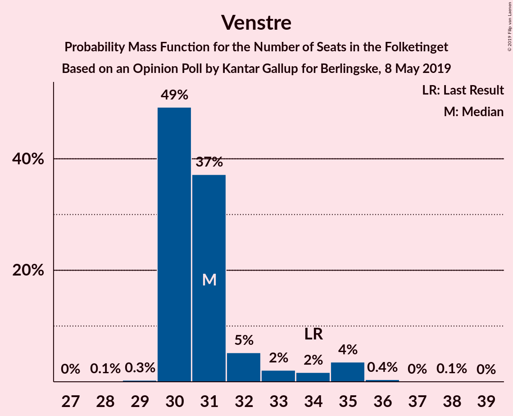
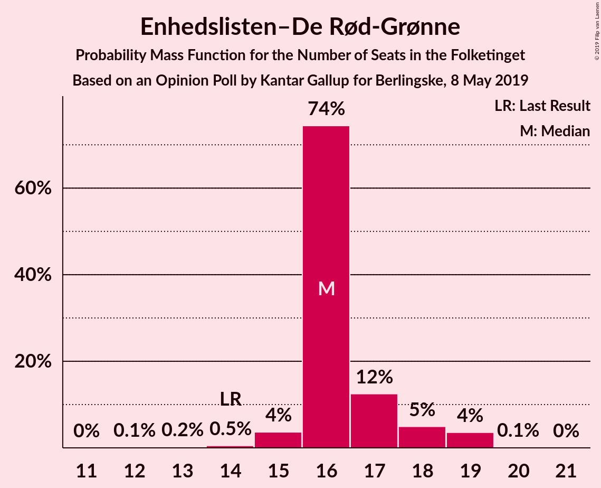
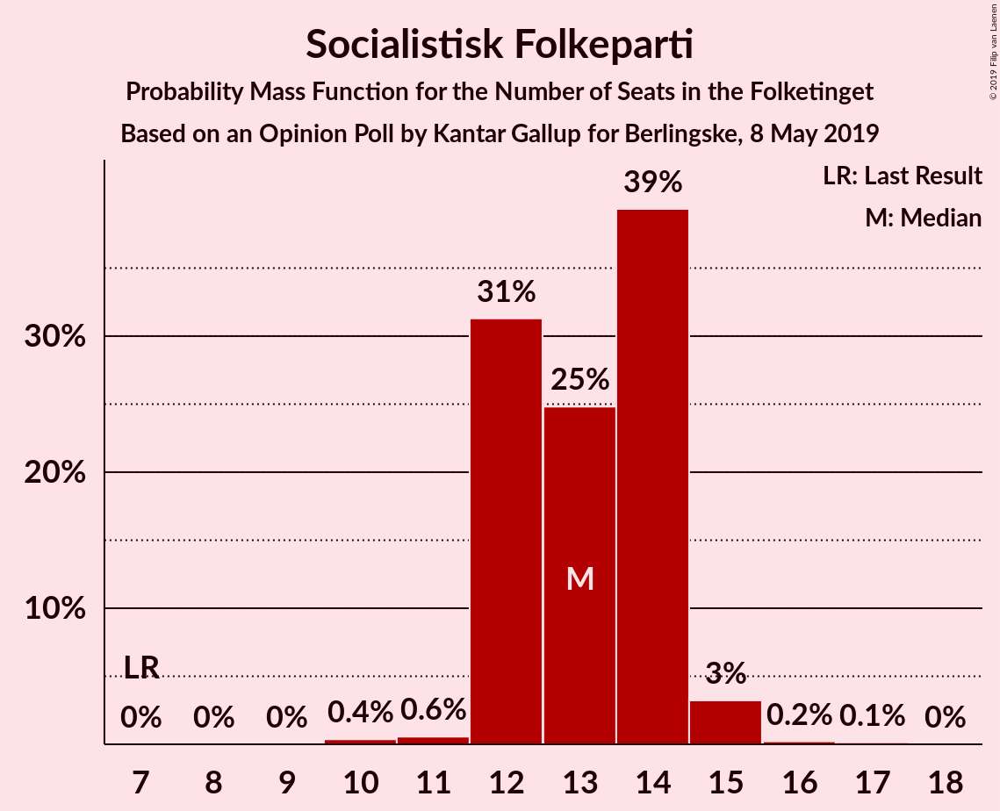
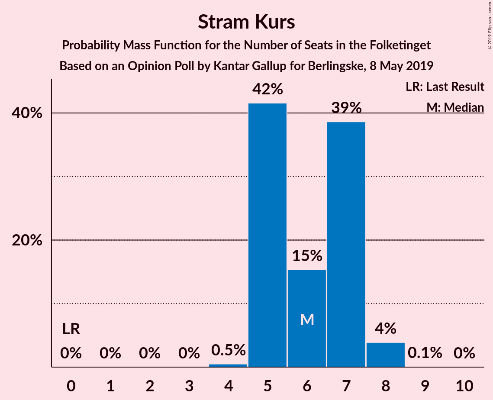
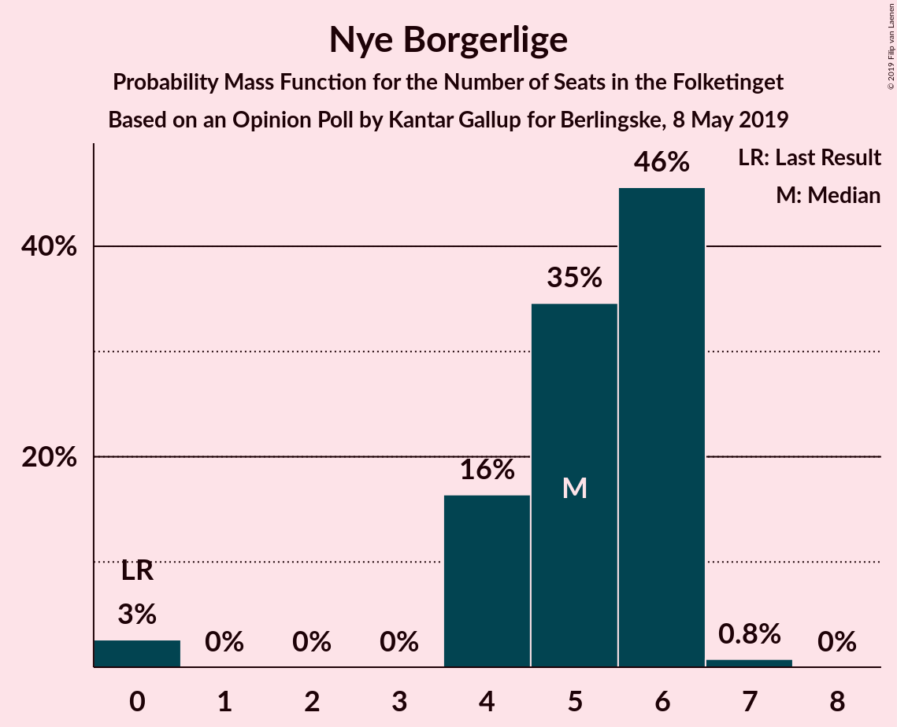
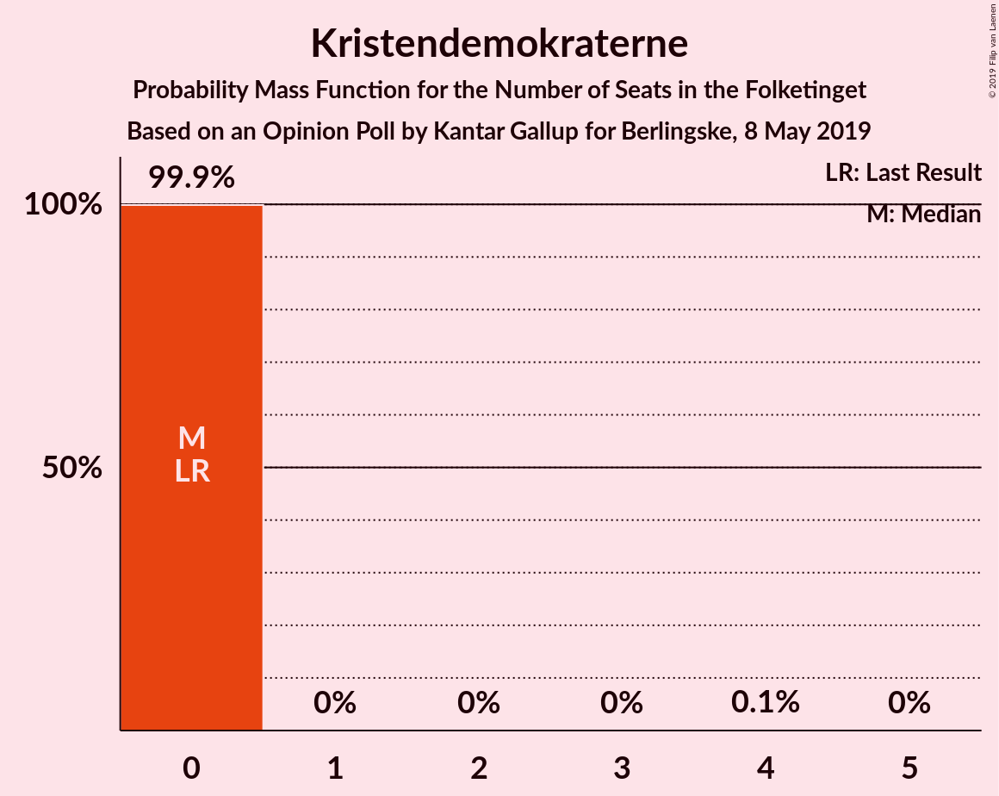
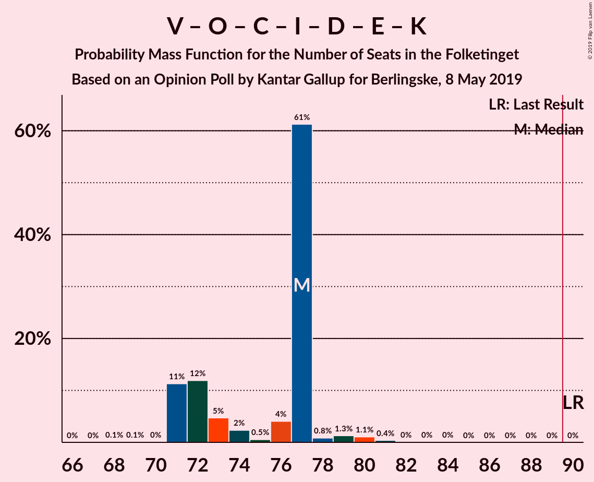
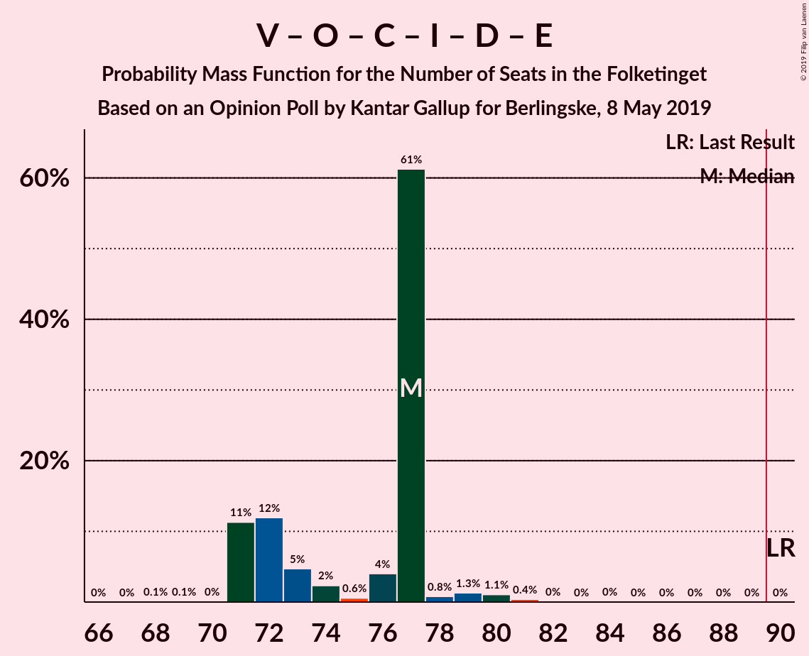
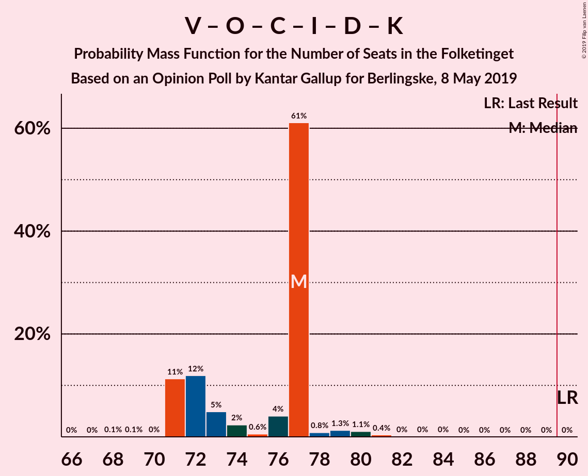
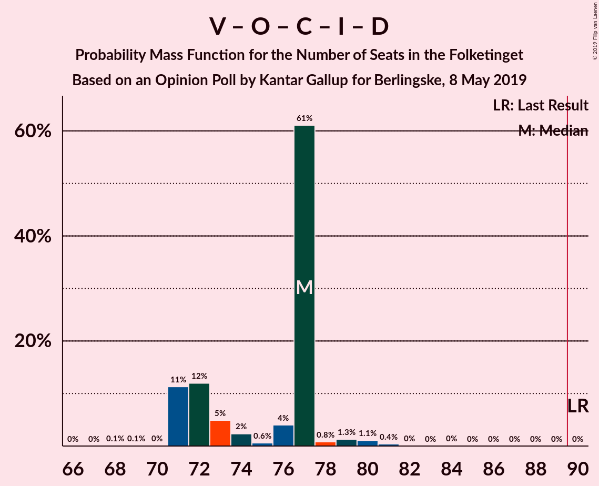

# Opinion Poll by Kantar Gallup for Berlingske, 8 May 2019

<a href="#voting-intentions">Voting Intentions</a> | <a href="#seats">Seats</a> | <a href="#coalitions">Coalitions</a> | <a href="#technical-information">Technical Information</a>

## Voting Intentions

### Confidence Intervals

| Party | Last Result | Poll Result | 80% Confidence Interval | 90% Confidence Interval | 95% Confidence Interval | 99% Confidence Interval |
|:-----:|:-----------:|:-----------:|:-----------------------:|:-----------------------:|:-----------------------:|:-----------------------:|
| Socialdemokraterne | 26.3% | 24.4% | 23.1–25.8% |22.7–26.2% |22.4–26.5% |21.8–27.2% |
| Venstre | 19.5% | 17.9% | 16.8–19.2% |16.4–19.5% |16.2–19.8% |15.6–20.5% |
| Dansk Folkeparti | 21.1% | 12.5% | 11.6–13.6% |11.3–13.9% |11.1–14.2% |10.6–14.8% |
| Enhedslisten–De Rød-Grønne | 7.8% | 9.2% | 8.4–10.2% |8.1–10.5% |7.9–10.7% |7.5–11.2% |
| Radikale Venstre | 4.6% | 8.4% | 7.6–9.3% |7.4–9.6% |7.2–9.8% |6.8–10.3% |
| Socialistisk Folkeparti | 4.2% | 7.2% | 6.5–8.1% |6.2–8.3% |6.1–8.6% |5.7–9.0% |
| Det Konservative Folkeparti | 3.4% | 4.8% | 4.2–5.5% |4.0–5.7% |3.9–5.9% |3.6–6.3% |
| Liberal Alliance | 7.5% | 4.1% | 3.5–4.8% |3.4–5.0% |3.2–5.1% |3.0–5.5% |
| Stram Kurs | 0.0% | 3.3% | 2.8–3.9% |2.7–4.1% |2.6–4.3% |2.3–4.6% |
| Alternativet | 4.8% | 3.1% | 2.7–3.7% |2.5–3.9% |2.4–4.1% |2.2–4.4% |
| Nye Borgerlige | 0.0% | 2.7% | 2.3–3.3% |2.1–3.5% |2.0–3.6% |1.8–3.9% |
| Kristendemokraterne | 0.8% | 1.1% | 0.9–1.5% |0.8–1.6% |0.7–1.8% |0.6–2.0% |
| Klaus Riskær Pedersen | 0.0% | 1.1% | 0.9–1.5% |0.8–1.6% |0.7–1.8% |0.6–2.0% |

*Note:* The poll result column reflects the actual value used in the calculations. Published results may vary slightly, and in addition be rounded to fewer digits.

## Seats

### Confidence Intervals

| Party | Last Result | Median | 80% Confidence Interval | 90% Confidence Interval | 95% Confidence Interval | 99% Confidence Interval |
|:-----:|:-----------:|:------:|:-----------------------:|:-----------------------:|:-----------------------:|:-----------------------:|
| <a href="#socialdemokraterne">Socialdemokraterne</a> | 47 | 39 | 38–48 |38–50 |38–50 |38–50 |
| <a href="#venstre">Venstre</a> | 34 | 29 | 29–34 |28–34 |28–37 |28–37 |
| <a href="#dansk-folkeparti">Dansk Folkeparti</a> | 37 | 22 | 20–22 |20–22 |17–23 |17–25 |
| <a href="#enhedslisten–de-rød-grønne">Enhedslisten–De Rød-Grønne</a> | 14 | 17 | 15–19 |15–19 |14–19 |14–19 |
| <a href="#radikale-venstre">Radikale Venstre</a> | 8 | 16 | 12–18 |12–18 |12–18 |12–18 |
| <a href="#socialistisk-folkeparti">Socialistisk Folkeparti</a> | 7 | 13 | 11–15 |10–17 |10–17 |10–17 |
| <a href="#det-konservative-folkeparti">Det Konservative Folkeparti</a> | 6 | 10 | 7–13 |6–13 |6–13 |5–13 |
| <a href="#liberal-alliance">Liberal Alliance</a> | 13 | 8 | 7–8 |6–9 |5–9 |5–9 |
| <a href="#stram-kurs">Stram Kurs</a> | 0 | 7 | 5–9 |5–9 |5–9 |5–9 |
| <a href="#alternativet">Alternativet</a> | 9 | 7 | 0–8 |0–8 |0–8 |0–8 |
| <a href="#nye-borgerlige">Nye Borgerlige</a> | 0 | 5 | 4–7 |4–7 |4–7 |4–7 |
| <a href="#kristendemokraterne">Kristendemokraterne</a> | 0 | 0 | 0–4 |0–4 |0–4 |0–4 |
| <a href="#klaus-riskær-pedersen">Klaus Riskær Pedersen</a> | 0 | 0 | 0–4 |0–4 |0–4 |0–4 |

### Socialdemokraterne

*For a full overview of the results for this party, see the [Socialdemokraterne](party-socialdemokraterne.html) page.*

| Number of Seats | Probability | Accumulated | Special Marks |
|:---------------:|:-----------:|:-----------:|:-------------:|
| 35 | 0.2% | 100% |  |
| 36 | 0% | 99.8% |  |
| 37 | 0% | 99.8% |  |
| 38 | 45% | 99.8% |  |
| 39 | 10% | 55% | Median |
| 40 | 16% | 45% |  |
| 41 | 0.1% | 29% |  |
| 42 | 0% | 29% |  |
| 43 | 0% | 29% |  |
| 44 | 16% | 29% |  |
| 45 | 0% | 13% |  |
| 46 | 0.3% | 13% |  |
| 47 | 0% | 13% | Last Result |
| 48 | 7% | 13% |  |
| 49 | 0% | 6% |  |
| 50 | 6% | 6% |  |
| 51 | 0% | 0% |  |

### Venstre

*For a full overview of the results for this party, see the [Venstre](party-venstre.html) page.*

| Number of Seats | Probability | Accumulated | Special Marks |
|:---------------:|:-----------:|:-----------:|:-------------:|
| 26 | 0.3% | 100% |  |
| 27 | 0% | 99.7% |  |
| 28 | 6% | 99.7% |  |
| 29 | 45% | 94% | Median |
| 30 | 0.3% | 49% |  |
| 31 | 10% | 49% |  |
| 32 | 18% | 39% |  |
| 33 | 0.2% | 21% |  |
| 34 | 16% | 21% | Last Result |
| 35 | 2% | 5% |  |
| 36 | 0% | 3% |  |
| 37 | 3% | 3% |  |
| 38 | 0% | 0% |  |

### Dansk Folkeparti

*For a full overview of the results for this party, see the [Dansk Folkeparti](party-danskfolkeparti.html) page.*

| Number of Seats | Probability | Accumulated | Special Marks |
|:---------------:|:-----------:|:-----------:|:-------------:|
| 17 | 3% | 100% |  |
| 18 | 0.1% | 97% |  |
| 19 | 0.1% | 97% |  |
| 20 | 26% | 97% |  |
| 21 | 20% | 71% |  |
| 22 | 49% | 51% | Median |
| 23 | 2% | 3% |  |
| 24 | 0% | 0.6% |  |
| 25 | 0.6% | 0.6% |  |
| 26 | 0% | 0% |  |
| 27 | 0% | 0% |  |
| 28 | 0% | 0% |  |
| 29 | 0% | 0% |  |
| 30 | 0% | 0% |  |
| 31 | 0% | 0% |  |
| 32 | 0% | 0% |  |
| 33 | 0% | 0% |  |
| 34 | 0% | 0% |  |
| 35 | 0% | 0% |  |
| 36 | 0% | 0% |  |
| 37 | 0% | 0% | Last Result |

### Enhedslisten–De Rød-Grønne

*For a full overview of the results for this party, see the [Enhedslisten–De Rød-Grønne](party-enhedslisten–derød-grønne.html) page.*

| Number of Seats | Probability | Accumulated | Special Marks |
|:---------------:|:-----------:|:-----------:|:-------------:|
| 14 | 3% | 100% | Last Result |
| 15 | 24% | 97% |  |
| 16 | 6% | 74% |  |
| 17 | 51% | 67% | Median |
| 18 | 0% | 17% |  |
| 19 | 16% | 17% |  |
| 20 | 0% | 0.3% |  |
| 21 | 0.3% | 0.3% |  |
| 22 | 0% | 0% |  |

### Radikale Venstre

*For a full overview of the results for this party, see the [Radikale Venstre](party-radikalevenstre.html) page.*

| Number of Seats | Probability | Accumulated | Special Marks |
|:---------------:|:-----------:|:-----------:|:-------------:|
| 8 | 0% | 100% | Last Result |
| 9 | 0% | 100% |  |
| 10 | 0% | 100% |  |
| 11 | 0% | 100% |  |
| 12 | 10% | 100% |  |
| 13 | 0.3% | 90% |  |
| 14 | 20% | 89% |  |
| 15 | 6% | 69% |  |
| 16 | 49% | 63% | Median |
| 17 | 0.3% | 14% |  |
| 18 | 14% | 14% |  |
| 19 | 0% | 0% |  |

### Socialistisk Folkeparti

*For a full overview of the results for this party, see the [Socialistisk Folkeparti](party-socialistiskfolkeparti.html) page.*

| Number of Seats | Probability | Accumulated | Special Marks |
|:---------------:|:-----------:|:-----------:|:-------------:|
| 7 | 0% | 100% | Last Result |
| 8 | 0% | 100% |  |
| 9 | 0.3% | 100% |  |
| 10 | 6% | 99.7% |  |
| 11 | 20% | 93% |  |
| 12 | 3% | 74% |  |
| 13 | 45% | 71% | Median |
| 14 | 16% | 26% |  |
| 15 | 0% | 10% |  |
| 16 | 0% | 10% |  |
| 17 | 10% | 10% |  |
| 18 | 0% | 0% |  |

### Det Konservative Folkeparti

*For a full overview of the results for this party, see the [Det Konservative Folkeparti](party-detkonservativefolkeparti.html) page.*

| Number of Seats | Probability | Accumulated | Special Marks |
|:---------------:|:-----------:|:-----------:|:-------------:|
| 5 | 2% | 100% |  |
| 6 | 6% | 98% | Last Result |
| 7 | 3% | 92% |  |
| 8 | 14% | 89% |  |
| 9 | 0% | 75% |  |
| 10 | 45% | 75% | Median |
| 11 | 0.3% | 30% |  |
| 12 | 16% | 30% |  |
| 13 | 14% | 14% |  |
| 14 | 0% | 0% |  |

### Liberal Alliance

*For a full overview of the results for this party, see the [Liberal Alliance](party-liberalalliance.html) page.*

| Number of Seats | Probability | Accumulated | Special Marks |
|:---------------:|:-----------:|:-----------:|:-------------:|
| 5 | 4% | 100% |  |
| 6 | 2% | 96% |  |
| 7 | 14% | 94% |  |
| 8 | 74% | 80% | Median |
| 9 | 6% | 6% |  |
| 10 | 0% | 0% |  |
| 11 | 0% | 0% |  |
| 12 | 0% | 0% |  |
| 13 | 0% | 0% | Last Result |

### Stram Kurs

*For a full overview of the results for this party, see the [Stram Kurs](party-stramkurs.html) page.*

| Number of Seats | Probability | Accumulated | Special Marks |
|:---------------:|:-----------:|:-----------:|:-------------:|
| 0 | 0% | 100% | Last Result |
| 1 | 0% | 100% |  |
| 2 | 0% | 100% |  |
| 3 | 0% | 100% |  |
| 4 | 0.3% | 100% |  |
| 5 | 14% | 99.7% |  |
| 6 | 12% | 86% |  |
| 7 | 25% | 74% | Median |
| 8 | 0.3% | 49% |  |
| 9 | 49% | 49% |  |
| 10 | 0% | 0% |  |

### Alternativet

*For a full overview of the results for this party, see the [Alternativet](party-alternativet.html) page.*

| Number of Seats | Probability | Accumulated | Special Marks |
|:---------------:|:-----------:|:-----------:|:-------------:|
| 0 | 16% | 100% |  |
| 1 | 0% | 84% |  |
| 2 | 0% | 84% |  |
| 3 | 0% | 84% |  |
| 4 | 14% | 84% |  |
| 5 | 15% | 70% |  |
| 6 | 0% | 55% |  |
| 7 | 10% | 55% | Median |
| 8 | 45% | 45% |  |
| 9 | 0% | 0% | Last Result |

### Nye Borgerlige

*For a full overview of the results for this party, see the [Nye Borgerlige](party-nyeborgerlige.html) page.*

| Number of Seats | Probability | Accumulated | Special Marks |
|:---------------:|:-----------:|:-----------:|:-------------:|
| 0 | 0% | 100% | Last Result |
| 1 | 0% | 100% |  |
| 2 | 0% | 100% |  |
| 3 | 0% | 100% |  |
| 4 | 15% | 100% |  |
| 5 | 63% | 85% | Median |
| 6 | 0% | 22% |  |
| 7 | 22% | 22% |  |
| 8 | 0.1% | 0.1% |  |
| 9 | 0% | 0% |  |

### Kristendemokraterne

*For a full overview of the results for this party, see the [Kristendemokraterne](party-kristendemokraterne.html) page.*

| Number of Seats | Probability | Accumulated | Special Marks |
|:---------------:|:-----------:|:-----------:|:-------------:|
| 0 | 90% | 100% | Last Result, Median |
| 1 | 0% | 10% |  |
| 2 | 0% | 10% |  |
| 3 | 0% | 10% |  |
| 4 | 10% | 10% |  |
| 5 | 0% | 0% |  |

### Klaus Riskær Pedersen

*For a full overview of the results for this party, see the [Klaus Riskær Pedersen](party-klausriskærpedersen.html) page.*

| Number of Seats | Probability | Accumulated | Special Marks |
|:---------------:|:-----------:|:-----------:|:-------------:|
| 0 | 88% | 100% | Last Result, Median |
| 1 | 0% | 12% |  |
| 2 | 0% | 12% |  |
| 3 | 0% | 12% |  |
| 4 | 12% | 12% |  |
| 5 | 0% | 0% |  |

## Coalitions

### Confidence Intervals

| Coalition | Last Result | Median | Majority? | 80% Confidence Interval | 90% Confidence Interval | 95% Confidence Interval | 99% Confidence Interval |
|:---------:|:-----------:|:------:|:---------:|:-----------------------:|:-----------------------:|:-----------------------:|:-----------------------:|
| Socialdemokraterne – Enhedslisten–De Rød-Grønne – Radikale Venstre – Socialistisk Folkeparti – Alternativet | 85 | 92 | 83% | 87–94 | 87–97 | 87–97 | 87–97 |
| Socialdemokraterne – Enhedslisten–De Rød-Grønne – Radikale Venstre – Socialistisk Folkeparti | 76 | 84 | 9% | 83–89 | 83–92 | 83–92 | 83–92 |
| Venstre – Dansk Folkeparti – Det Konservative Folkeparti – Liberal Alliance – Stram Kurs – Nye Borgerlige – Klaus Riskær Pedersen – Kristendemokraterne | 90 | 83 | 0% | 81–88 | 78–88 | 78–88 | 78–88 |
| Socialdemokraterne – Enhedslisten–De Rød-Grønne – Socialistisk Folkeparti – Alternativet | 77 | 76 | 0% | 73–80 | 73–82 | 73–82 | 73–82 |
| Venstre – Dansk Folkeparti – Det Konservative Folkeparti – Liberal Alliance – Nye Borgerlige – Klaus Riskær Pedersen – Kristendemokraterne | 90 | 74 | 0% | 73–81 | 71–81 | 71–81 | 71–81 |
| Venstre – Dansk Folkeparti – Det Konservative Folkeparti – Liberal Alliance – Nye Borgerlige – Klaus Riskær Pedersen | 90 | 74 | 0% | 73–81 | 71–81 | 71–81 | 71–81 |
| Venstre – Dansk Folkeparti – Det Konservative Folkeparti – Liberal Alliance – Nye Borgerlige – Kristendemokraterne | 90 | 74 | 0% | 73–81 | 71–81 | 71–81 | 71–81 |
| Venstre – Dansk Folkeparti – Det Konservative Folkeparti – Liberal Alliance – Nye Borgerlige | 90 | 74 | 0% | 71–81 | 71–81 | 71–81 | 71–81 |
| Socialdemokraterne – Enhedslisten–De Rød-Grønne – Socialistisk Folkeparti | 68 | 70 | 0% | 68–74 | 68–77 | 68–77 | 68–77 |
| Socialdemokraterne – Radikale Venstre – Socialistisk Folkeparti | 62 | 68 | 0% | 67–73 | 67–76 | 67–76 | 67–76 |
| Venstre – Dansk Folkeparti – Det Konservative Folkeparti – Liberal Alliance – Kristendemokraterne | 90 | 69 | 0% | 68–74 | 64–74 | 64–74 | 64–74 |
| Venstre – Dansk Folkeparti – Det Konservative Folkeparti – Liberal Alliance | 90 | 69 | 0% | 67–74 | 64–74 | 64–74 | 64–74 |
| Socialdemokraterne – Radikale Venstre | 55 | 54 | 0% | 52–62 | 51–65 | 51–65 | 51–65 |
| Venstre – Det Konservative Folkeparti – Liberal Alliance | 53 | 47 | 0% | 45–54 | 43–54 | 43–54 | 43–54 |
| Venstre – Det Konservative Folkeparti | 40 | 39 | 0% | 39–46 | 34–46 | 34–46 | 34–46 |
| Venstre | 34 | 29 | 0% | 29–34 | 28–34 | 28–37 | 28–37 |

### Socialdemokraterne – Enhedslisten–De Rød-Grønne – Radikale Venstre – Socialistisk Folkeparti – Alternativet

| Number of Seats | Probability | Accumulated | Special Marks |
|:---------------:|:-----------:|:-----------:|:-------------:|
| 85 | 0% | 100% | Last Result |
| 86 | 0% | 100% |  |
| 87 | 17% | 100% |  |
| 88 | 0% | 83% |  |
| 89 | 0% | 83% |  |
| 90 | 10% | 83% | Majority |
| 91 | 0.1% | 73% |  |
| 92 | 61% | 73% | Median |
| 93 | 0% | 13% |  |
| 94 | 4% | 13% |  |
| 95 | 3% | 9% |  |
| 96 | 0% | 6% |  |
| 97 | 6% | 6% |  |
| 98 | 0% | 0% |  |

### Socialdemokraterne – Enhedslisten–De Rød-Grønne – Radikale Venstre – Socialistisk Folkeparti

| Number of Seats | Probability | Accumulated | Special Marks |
|:---------------:|:-----------:|:-----------:|:-------------:|
| 76 | 0% | 100% | Last Result |
| 77 | 0% | 100% |  |
| 78 | 0% | 100% |  |
| 79 | 0% | 100% |  |
| 80 | 0% | 100% |  |
| 81 | 0% | 100% |  |
| 82 | 0.5% | 100% |  |
| 83 | 10% | 99.5% |  |
| 84 | 45% | 90% |  |
| 85 | 0% | 45% | Median |
| 86 | 0.1% | 45% |  |
| 87 | 18% | 44% |  |
| 88 | 14% | 26% |  |
| 89 | 4% | 13% |  |
| 90 | 3% | 9% | Majority |
| 91 | 0% | 6% |  |
| 92 | 6% | 6% |  |
| 93 | 0% | 0% |  |

### Venstre – Dansk Folkeparti – Det Konservative Folkeparti – Liberal Alliance – Stram Kurs – Nye Borgerlige – Klaus Riskær Pedersen – Kristendemokraterne

| Number of Seats | Probability | Accumulated | Special Marks |
|:---------------:|:-----------:|:-----------:|:-------------:|
| 78 | 6% | 100% |  |
| 79 | 0% | 94% |  |
| 80 | 3% | 94% |  |
| 81 | 4% | 91% | Median |
| 82 | 0% | 87% |  |
| 83 | 61% | 87% |  |
| 84 | 0.1% | 27% |  |
| 85 | 10% | 27% |  |
| 86 | 0% | 17% |  |
| 87 | 0% | 17% |  |
| 88 | 17% | 17% |  |
| 89 | 0% | 0% |  |
| 90 | 0% | 0% | Last Result, Majority |

### Socialdemokraterne – Enhedslisten–De Rød-Grønne – Socialistisk Folkeparti – Alternativet

| Number of Seats | Probability | Accumulated | Special Marks |
|:---------------:|:-----------:|:-----------:|:-------------:|
| 73 | 16% | 100% |  |
| 74 | 14% | 84% |  |
| 75 | 0% | 70% |  |
| 76 | 47% | 70% | Median |
| 77 | 0% | 23% | Last Result |
| 78 | 10% | 23% |  |
| 79 | 3% | 13% |  |
| 80 | 4% | 10% |  |
| 81 | 0% | 6% |  |
| 82 | 6% | 6% |  |
| 83 | 0% | 0% |  |

### Venstre – Dansk Folkeparti – Det Konservative Folkeparti – Liberal Alliance – Nye Borgerlige – Klaus Riskær Pedersen – Kristendemokraterne

| Number of Seats | Probability | Accumulated | Special Marks |
|:---------------:|:-----------:|:-----------:|:-------------:|
| 71 | 6% | 100% |  |
| 72 | 4% | 94% |  |
| 73 | 3% | 90% |  |
| 74 | 45% | 87% | Median |
| 75 | 0.1% | 43% |  |
| 76 | 0.1% | 43% |  |
| 77 | 2% | 43% |  |
| 78 | 14% | 41% |  |
| 79 | 10% | 27% |  |
| 80 | 0.5% | 17% |  |
| 81 | 16% | 16% |  |
| 82 | 0% | 0% |  |
| 83 | 0% | 0% |  |
| 84 | 0% | 0% |  |
| 85 | 0% | 0% |  |
| 86 | 0% | 0% |  |
| 87 | 0% | 0% |  |
| 88 | 0% | 0% |  |
| 89 | 0% | 0% |  |
| 90 | 0% | 0% | Last Result, Majority |

### Venstre – Dansk Folkeparti – Det Konservative Folkeparti – Liberal Alliance – Nye Borgerlige – Klaus Riskær Pedersen

| Number of Seats | Probability | Accumulated | Special Marks |
|:---------------:|:-----------:|:-----------:|:-------------:|
| 71 | 6% | 100% |  |
| 72 | 4% | 94% |  |
| 73 | 3% | 90% |  |
| 74 | 45% | 87% | Median |
| 75 | 10% | 43% |  |
| 76 | 0.3% | 33% |  |
| 77 | 2% | 32% |  |
| 78 | 14% | 30% |  |
| 79 | 0.3% | 17% |  |
| 80 | 0.2% | 16% |  |
| 81 | 16% | 16% |  |
| 82 | 0% | 0% |  |
| 83 | 0% | 0% |  |
| 84 | 0% | 0% |  |
| 85 | 0% | 0% |  |
| 86 | 0% | 0% |  |
| 87 | 0% | 0% |  |
| 88 | 0% | 0% |  |
| 89 | 0% | 0% |  |
| 90 | 0% | 0% | Last Result, Majority |

### Venstre – Dansk Folkeparti – Det Konservative Folkeparti – Liberal Alliance – Nye Borgerlige – Kristendemokraterne

| Number of Seats | Probability | Accumulated | Special Marks |
|:---------------:|:-----------:|:-----------:|:-------------:|
| 71 | 6% | 100% |  |
| 72 | 4% | 94% |  |
| 73 | 5% | 90% |  |
| 74 | 45% | 86% | Median |
| 75 | 10% | 41% |  |
| 76 | 0.3% | 30% |  |
| 77 | 0% | 30% |  |
| 78 | 14% | 30% |  |
| 79 | 0% | 17% |  |
| 80 | 0.3% | 17% |  |
| 81 | 16% | 16% |  |
| 82 | 0% | 0% |  |
| 83 | 0% | 0% |  |
| 84 | 0% | 0% |  |
| 85 | 0% | 0% |  |
| 86 | 0% | 0% |  |
| 87 | 0% | 0% |  |
| 88 | 0% | 0% |  |
| 89 | 0% | 0% |  |
| 90 | 0% | 0% | Last Result, Majority |

### Venstre – Dansk Folkeparti – Det Konservative Folkeparti – Liberal Alliance – Nye Borgerlige

| Number of Seats | Probability | Accumulated | Special Marks |
|:---------------:|:-----------:|:-----------:|:-------------:|
| 71 | 16% | 100% |  |
| 72 | 4% | 84% |  |
| 73 | 5% | 80% |  |
| 74 | 45% | 75% | Median |
| 75 | 0.3% | 31% |  |
| 76 | 0.6% | 30% |  |
| 77 | 0% | 30% |  |
| 78 | 14% | 30% |  |
| 79 | 0% | 16% |  |
| 80 | 0% | 16% |  |
| 81 | 16% | 16% |  |
| 82 | 0% | 0% |  |
| 83 | 0% | 0% |  |
| 84 | 0% | 0% |  |
| 85 | 0% | 0% |  |
| 86 | 0% | 0% |  |
| 87 | 0% | 0% |  |
| 88 | 0% | 0% |  |
| 89 | 0% | 0% |  |
| 90 | 0% | 0% | Last Result, Majority |

### Socialdemokraterne – Enhedslisten–De Rød-Grønne – Socialistisk Folkeparti

| Number of Seats | Probability | Accumulated | Special Marks |
|:---------------:|:-----------:|:-----------:|:-------------:|
| 65 | 0.2% | 100% |  |
| 66 | 0% | 99.8% |  |
| 67 | 0% | 99.8% |  |
| 68 | 45% | 99.8% | Last Result |
| 69 | 0.3% | 55% | Median |
| 70 | 14% | 55% |  |
| 71 | 12% | 41% |  |
| 72 | 0.3% | 29% |  |
| 73 | 16% | 29% |  |
| 74 | 3% | 13% |  |
| 75 | 4% | 10% |  |
| 76 | 0% | 6% |  |
| 77 | 6% | 6% |  |
| 78 | 0% | 0% |  |

### Socialdemokraterne – Radikale Venstre – Socialistisk Folkeparti

| Number of Seats | Probability | Accumulated | Special Marks |
|:---------------:|:-----------:|:-----------:|:-------------:|
| 61 | 0.3% | 100% |  |
| 62 | 0% | 99.7% | Last Result |
| 63 | 0% | 99.7% |  |
| 64 | 0% | 99.7% |  |
| 65 | 0.2% | 99.7% |  |
| 66 | 0% | 99.5% |  |
| 67 | 45% | 99.5% |  |
| 68 | 27% | 55% | Median |
| 69 | 0% | 28% |  |
| 70 | 2% | 28% |  |
| 71 | 0% | 26% |  |
| 72 | 4% | 26% |  |
| 73 | 14% | 22% |  |
| 74 | 0% | 9% |  |
| 75 | 0% | 9% |  |
| 76 | 9% | 9% |  |
| 77 | 0% | 0% |  |

### Venstre – Dansk Folkeparti – Det Konservative Folkeparti – Liberal Alliance – Kristendemokraterne

| Number of Seats | Probability | Accumulated | Special Marks |
|:---------------:|:-----------:|:-----------:|:-------------:|
| 64 | 6% | 100% |  |
| 65 | 0% | 94% |  |
| 66 | 0% | 94% |  |
| 67 | 4% | 94% |  |
| 68 | 0.1% | 90% |  |
| 69 | 49% | 90% | Median |
| 70 | 0.3% | 41% |  |
| 71 | 10% | 40% |  |
| 72 | 0% | 30% |  |
| 73 | 14% | 30% |  |
| 74 | 16% | 17% |  |
| 75 | 0% | 0.3% |  |
| 76 | 0.3% | 0.3% |  |
| 77 | 0% | 0% |  |
| 78 | 0% | 0% |  |
| 79 | 0% | 0% |  |
| 80 | 0% | 0% |  |
| 81 | 0% | 0% |  |
| 82 | 0% | 0% |  |
| 83 | 0% | 0% |  |
| 84 | 0% | 0% |  |
| 85 | 0% | 0% |  |
| 86 | 0% | 0% |  |
| 87 | 0% | 0% |  |
| 88 | 0% | 0% |  |
| 89 | 0% | 0% |  |
| 90 | 0% | 0% | Last Result, Majority |

### Venstre – Dansk Folkeparti – Det Konservative Folkeparti – Liberal Alliance

| Number of Seats | Probability | Accumulated | Special Marks |
|:---------------:|:-----------:|:-----------:|:-------------:|
| 63 | 0.1% | 100% |  |
| 64 | 6% | 99.9% |  |
| 65 | 0% | 94% |  |
| 66 | 0% | 94% |  |
| 67 | 14% | 94% |  |
| 68 | 0.1% | 80% |  |
| 69 | 49% | 80% | Median |
| 70 | 0.3% | 31% |  |
| 71 | 0.2% | 30% |  |
| 72 | 0.3% | 30% |  |
| 73 | 14% | 30% |  |
| 74 | 16% | 16% |  |
| 75 | 0% | 0% |  |
| 76 | 0% | 0% |  |
| 77 | 0% | 0% |  |
| 78 | 0% | 0% |  |
| 79 | 0% | 0% |  |
| 80 | 0% | 0% |  |
| 81 | 0% | 0% |  |
| 82 | 0% | 0% |  |
| 83 | 0% | 0% |  |
| 84 | 0% | 0% |  |
| 85 | 0% | 0% |  |
| 86 | 0% | 0% |  |
| 87 | 0% | 0% |  |
| 88 | 0% | 0% |  |
| 89 | 0% | 0% |  |
| 90 | 0% | 0% | Last Result, Majority |

### Socialdemokraterne – Radikale Venstre

| Number of Seats | Probability | Accumulated | Special Marks |
|:---------------:|:-----------:|:-----------:|:-------------:|
| 51 | 10% | 100% |  |
| 52 | 0.5% | 90% |  |
| 53 | 0% | 90% |  |
| 54 | 61% | 90% |  |
| 55 | 0% | 29% | Last Result, Median |
| 56 | 0% | 29% |  |
| 57 | 0% | 29% |  |
| 58 | 0.4% | 29% |  |
| 59 | 0% | 28% |  |
| 60 | 2% | 28% |  |
| 61 | 0% | 26% |  |
| 62 | 18% | 26% |  |
| 63 | 0% | 9% |  |
| 64 | 3% | 9% |  |
| 65 | 6% | 6% |  |
| 66 | 0% | 0% |  |

### Venstre – Det Konservative Folkeparti – Liberal Alliance

| Number of Seats | Probability | Accumulated | Special Marks |
|:---------------:|:-----------:|:-----------:|:-------------:|
| 43 | 6% | 100% |  |
| 44 | 0.1% | 94% |  |
| 45 | 4% | 94% |  |
| 46 | 2% | 90% |  |
| 47 | 55% | 88% | Median |
| 48 | 0.2% | 33% |  |
| 49 | 0% | 33% |  |
| 50 | 0.1% | 33% |  |
| 51 | 0% | 33% |  |
| 52 | 16% | 33% |  |
| 53 | 0% | 16% | Last Result |
| 54 | 16% | 16% |  |
| 55 | 0% | 0% |  |

### Venstre – Det Konservative Folkeparti

| Number of Seats | Probability | Accumulated | Special Marks |
|:---------------:|:-----------:|:-----------:|:-------------:|
| 34 | 6% | 100% |  |
| 35 | 0% | 94% |  |
| 36 | 0% | 94% |  |
| 37 | 0.4% | 94% |  |
| 38 | 0.3% | 94% |  |
| 39 | 55% | 93% | Median |
| 40 | 6% | 39% | Last Result |
| 41 | 0% | 33% |  |
| 42 | 0% | 33% |  |
| 43 | 0% | 33% |  |
| 44 | 3% | 33% |  |
| 45 | 14% | 30% |  |
| 46 | 16% | 16% |  |
| 47 | 0% | 0% |  |

### Venstre

| Number of Seats | Probability | Accumulated | Special Marks |
|:---------------:|:-----------:|:-----------:|:-------------:|
| 26 | 0.3% | 100% |  |
| 27 | 0% | 99.7% |  |
| 28 | 6% | 99.7% |  |
| 29 | 45% | 94% | Median |
| 30 | 0.3% | 49% |  |
| 31 | 10% | 49% |  |
| 32 | 18% | 39% |  |
| 33 | 0.2% | 21% |  |
| 34 | 16% | 21% | Last Result |
| 35 | 2% | 5% |  |
| 36 | 0% | 3% |  |
| 37 | 3% | 3% |  |
| 38 | 0% | 0% |  |

## Technical Information

### Opinion Poll

+ **Polling firm:** Kantar Gallup
+ **Commissioner(s):** Berlingske
+ **Fieldwork period:** 8 May 2019

### Calculations

+ **Sample size:** 1690
+ **Simulations done:** 1,024
+ **Error estimate:** 2.53%

