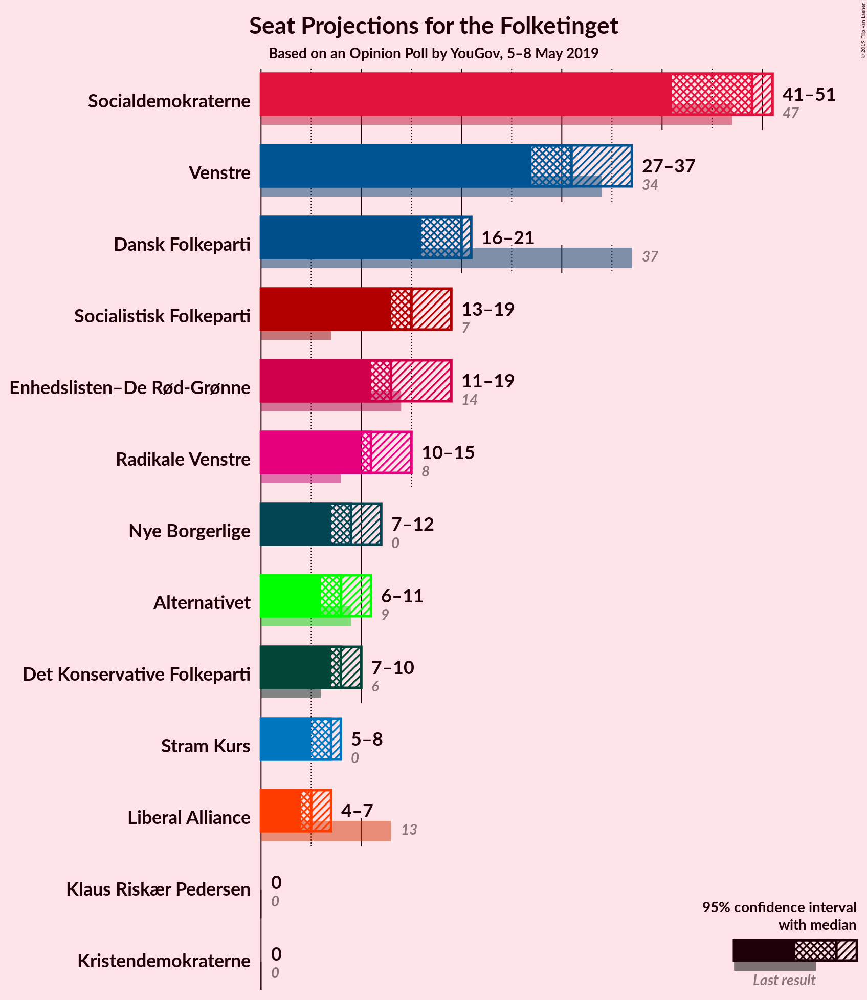
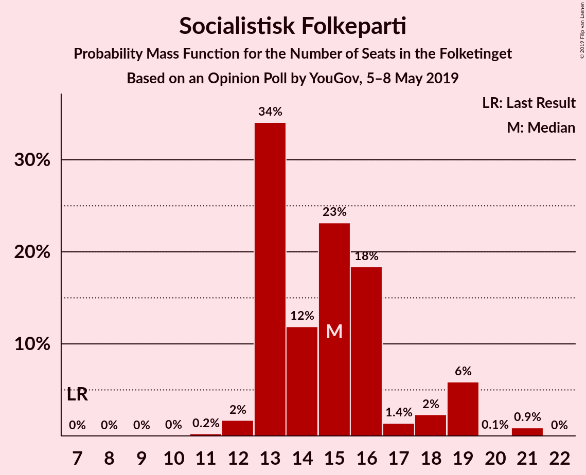
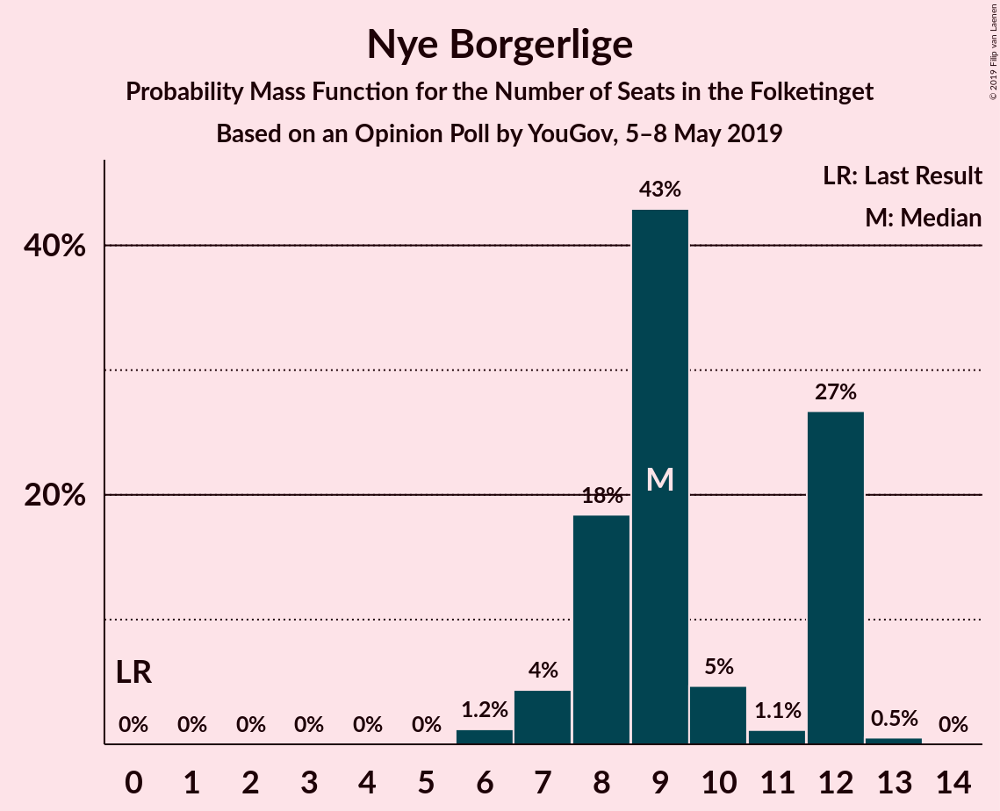
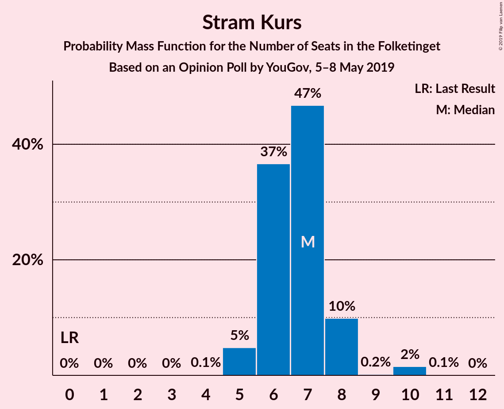
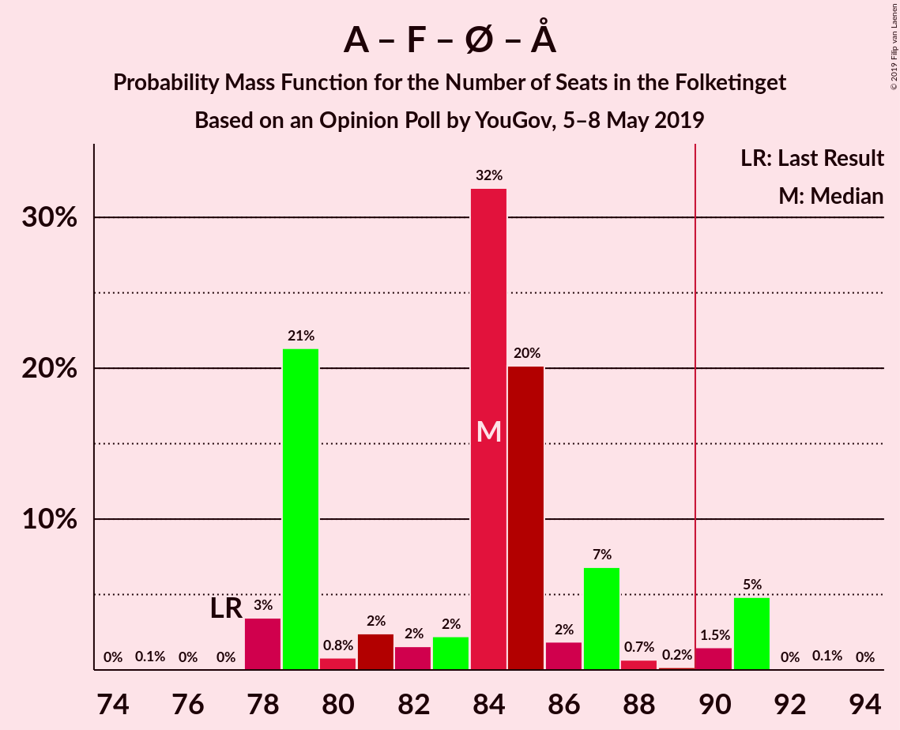
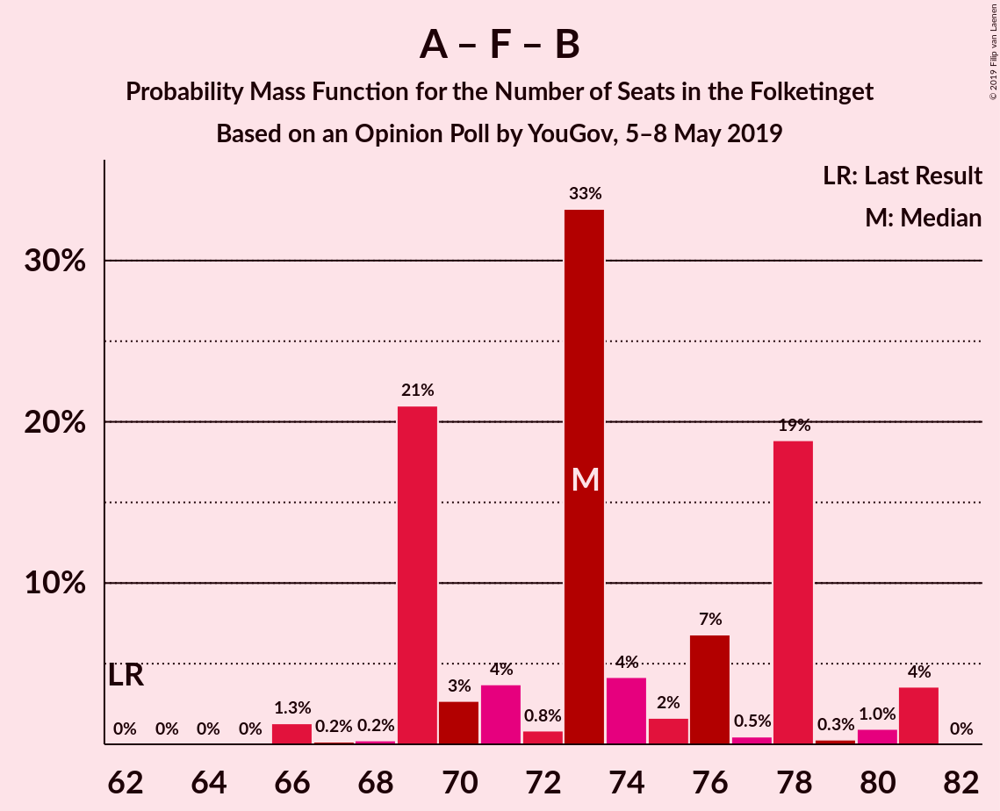

# Opinion Poll by YouGov, 5–8 May 2019

<a href="#voting-intentions">Voting Intentions</a> | <a href="#seats">Seats</a> | <a href="#coalitions">Coalitions</a> | <a href="#technical-information">Technical Information</a>

## Voting Intentions

### Confidence Intervals

| Party | Last Result | Poll Result | 80% Confidence Interval | 90% Confidence Interval | 95% Confidence Interval | 99% Confidence Interval |
|:-----:|:-----------:|:-----------:|:-----------------------:|:-----------------------:|:-----------------------:|:-----------------------:|
| Socialdemokraterne | 26.3% | 26.4% | 24.7–28.3% |24.2–28.8% |23.8–29.3% |23.0–30.2% |
| Venstre | 19.5% | 17.4% | 15.9–19.0% |15.5–19.5% |15.2–19.9% |14.5–20.7% |
| Dansk Folkeparti | 21.1% | 10.8% | 9.6–12.2% |9.3–12.5% |9.0–12.9% |8.5–13.6% |
| Socialistisk Folkeparti | 4.2% | 8.4% | 7.4–9.7% |7.1–10.0% |6.9–10.3% |6.4–11.0% |
| Enhedslisten–De Rød-Grønne | 7.8% | 7.9% | 6.9–9.2% |6.6–9.5% |6.4–9.8% |5.9–10.4% |
| Radikale Venstre | 4.6% | 6.5% | 5.6–7.6% |5.3–8.0% |5.1–8.2% |4.7–8.8% |
| Nye Borgerlige | 0.0% | 5.0% | 4.2–6.0% |4.0–6.3% |3.8–6.5% |3.4–7.1% |
| Alternativet | 4.8% | 4.7% | 3.9–5.7% |3.7–5.9% |3.5–6.2% |3.2–6.7% |
| Det Konservative Folkeparti | 3.4% | 4.6% | 3.8–5.6% |3.6–5.8% |3.4–6.1% |3.1–6.6% |
| Stram Kurs | 0.0% | 3.9% | 3.2–4.8% |3.0–5.0% |2.8–5.3% |2.5–5.7% |
| Liberal Alliance | 7.5% | 3.2% | 2.5–4.0% |2.4–4.2% |2.2–4.5% |2.0–4.9% |
| Klaus Riskær Pedersen | 0.0% | 0.6% | 0.4–1.1% |0.3–1.2% |0.3–1.3% |0.2–1.6% |
| Kristendemokraterne | 0.8% | 0.5% | 0.3–0.9% |0.3–1.1% |0.2–1.2% |0.2–1.4% |

*Note:* The poll result column reflects the actual value used in the calculations. Published results may vary slightly, and in addition be rounded to fewer digits.

## Seats

### Confidence Intervals

| Party | Last Result | Median | 80% Confidence Interval | 90% Confidence Interval | 95% Confidence Interval | 99% Confidence Interval |
|:-----:|:-----------:|:------:|:-----------------------:|:-----------------------:|:-----------------------:|:-----------------------:|
| <a href="#socialdemokraterne">Socialdemokraterne</a> | 47 | 50 | 42–51 |42–51 |42–51 |42–51 |
| <a href="#venstre">Venstre</a> | 34 | 33 | 31–34 |31–34 |31–34 |31–34 |
| <a href="#dansk-folkeparti">Dansk Folkeparti</a> | 37 | 19 | 17–19 |17–19 |17–19 |17–19 |
| <a href="#socialistisk-folkeparti">Socialistisk Folkeparti</a> | 7 | 12 | 12–15 |12–15 |12–15 |12–15 |
| <a href="#enhedslisten–de-rød-grønne">Enhedslisten–De Rød-Grønne</a> | 14 | 11 | 11–14 |11–14 |11–14 |11–14 |
| <a href="#radikale-venstre">Radikale Venstre</a> | 8 | 11 | 11–12 |11–12 |11–12 |11–12 |
| <a href="#nye-borgerlige">Nye Borgerlige</a> | 0 | 11 | 8–13 |8–13 |8–13 |8–13 |
| <a href="#alternativet">Alternativet</a> | 9 | 10 | 10 |10 |10 |10 |
| <a href="#det-konservative-folkeparti">Det Konservative Folkeparti</a> | 6 | 7 | 6–7 |6–7 |6–7 |6–7 |
| <a href="#stram-kurs">Stram Kurs</a> | 0 | 6 | 4–9 |4–9 |4–9 |4–9 |
| <a href="#liberal-alliance">Liberal Alliance</a> | 13 | 5 | 5–6 |5–6 |5–6 |5–6 |
| <a href="#klaus-riskær-pedersen">Klaus Riskær Pedersen</a> | 0 | 0 | 0 |0 |0 |0 |
| <a href="#kristendemokraterne">Kristendemokraterne</a> | 0 | 0 | 0 |0 |0 |0 |

### Socialdemokraterne

*For a full overview of the results for this party, see the [Socialdemokraterne](party-socialdemokraterne.html) page.*

| Number of Seats | Probability | Accumulated | Special Marks |
|:---------------:|:-----------:|:-----------:|:-------------:|
| 42 | 16% | 100% |  |
| 43 | 0% | 84% |  |
| 44 | 0% | 84% |  |
| 45 | 0% | 84% |  |
| 46 | 0.1% | 84% |  |
| 47 | 0.3% | 84% | Last Result |
| 48 | 0% | 83% |  |
| 49 | 0% | 83% |  |
| 50 | 64% | 83% | Median |
| 51 | 19% | 19% |  |
| 52 | 0% | 0% |  |

### Venstre

*For a full overview of the results for this party, see the [Venstre](party-venstre.html) page.*

| Number of Seats | Probability | Accumulated | Special Marks |
|:---------------:|:-----------:|:-----------:|:-------------:|
| 26 | 0.2% | 100% |  |
| 27 | 0.2% | 99.8% |  |
| 28 | 0% | 99.6% |  |
| 29 | 0% | 99.6% |  |
| 30 | 0% | 99.6% |  |
| 31 | 19% | 99.6% |  |
| 32 | 0% | 81% |  |
| 33 | 64% | 81% | Median |
| 34 | 16% | 16% | Last Result |
| 35 | 0% | 0% |  |

### Dansk Folkeparti

*For a full overview of the results for this party, see the [Dansk Folkeparti](party-danskfolkeparti.html) page.*

| Number of Seats | Probability | Accumulated | Special Marks |
|:---------------:|:-----------:|:-----------:|:-------------:|
| 17 | 19% | 100% |  |
| 18 | 0% | 81% |  |
| 19 | 81% | 81% | Median |
| 20 | 0% | 0.2% |  |
| 21 | 0.1% | 0.2% |  |
| 22 | 0.1% | 0.1% |  |
| 23 | 0% | 0% |  |
| 24 | 0% | 0% |  |
| 25 | 0% | 0% |  |
| 26 | 0% | 0% |  |
| 27 | 0% | 0% |  |
| 28 | 0% | 0% |  |
| 29 | 0% | 0% |  |
| 30 | 0% | 0% |  |
| 31 | 0% | 0% |  |
| 32 | 0% | 0% |  |
| 33 | 0% | 0% |  |
| 34 | 0% | 0% |  |
| 35 | 0% | 0% |  |
| 36 | 0% | 0% |  |
| 37 | 0% | 0% | Last Result |

### Socialistisk Folkeparti

*For a full overview of the results for this party, see the [Socialistisk Folkeparti](party-socialistiskfolkeparti.html) page.*

| Number of Seats | Probability | Accumulated | Special Marks |
|:---------------:|:-----------:|:-----------:|:-------------:|
| 7 | 0% | 100% | Last Result |
| 8 | 0% | 100% |  |
| 9 | 0% | 100% |  |
| 10 | 0% | 100% |  |
| 11 | 0.1% | 100% |  |
| 12 | 83% | 99.9% | Median |
| 13 | 0.2% | 16% |  |
| 14 | 0.1% | 16% |  |
| 15 | 16% | 16% |  |
| 16 | 0% | 0% |  |

### Enhedslisten–De Rød-Grønne

*For a full overview of the results for this party, see the [Enhedslisten–De Rød-Grønne](party-enhedslisten–derød-grønne.html) page.*

| Number of Seats | Probability | Accumulated | Special Marks |
|:---------------:|:-----------:|:-----------:|:-------------:|
| 11 | 65% | 100% | Median |
| 12 | 0% | 35% |  |
| 13 | 16% | 35% |  |
| 14 | 19% | 19% | Last Result |
| 15 | 0% | 0.2% |  |
| 16 | 0% | 0.1% |  |
| 17 | 0.1% | 0.1% |  |
| 18 | 0% | 0% |  |

### Radikale Venstre

*For a full overview of the results for this party, see the [Radikale Venstre](party-radikalevenstre.html) page.*

| Number of Seats | Probability | Accumulated | Special Marks |
|:---------------:|:-----------:|:-----------:|:-------------:|
| 8 | 0% | 100% | Last Result |
| 9 | 0% | 100% |  |
| 10 | 0% | 100% |  |
| 11 | 83% | 100% | Median |
| 12 | 16% | 17% |  |
| 13 | 0% | 0.3% |  |
| 14 | 0% | 0.2% |  |
| 15 | 0.1% | 0.2% |  |
| 16 | 0.1% | 0.1% |  |
| 17 | 0% | 0% |  |

### Nye Borgerlige

*For a full overview of the results for this party, see the [Nye Borgerlige](party-nyeborgerlige.html) page.*

| Number of Seats | Probability | Accumulated | Special Marks |
|:---------------:|:-----------:|:-----------:|:-------------:|
| 0 | 0% | 100% | Last Result |
| 1 | 0% | 100% |  |
| 2 | 0% | 100% |  |
| 3 | 0% | 100% |  |
| 4 | 0% | 100% |  |
| 5 | 0% | 100% |  |
| 6 | 0.1% | 100% |  |
| 7 | 0% | 99.9% |  |
| 8 | 19% | 99.9% |  |
| 9 | 0% | 81% |  |
| 10 | 0% | 81% |  |
| 11 | 64% | 81% | Median |
| 12 | 0.1% | 16% |  |
| 13 | 16% | 16% |  |
| 14 | 0% | 0% |  |

### Alternativet

*For a full overview of the results for this party, see the [Alternativet](party-alternativet.html) page.*

| Number of Seats | Probability | Accumulated | Special Marks |
|:---------------:|:-----------:|:-----------:|:-------------:|
| 4 | 0.1% | 100% |  |
| 5 | 0% | 99.9% |  |
| 6 | 0.2% | 99.9% |  |
| 7 | 0% | 99.7% |  |
| 8 | 0.1% | 99.6% |  |
| 9 | 0% | 99.5% | Last Result |
| 10 | 99.5% | 99.5% | Median |
| 11 | 0% | 0% |  |

### Det Konservative Folkeparti

*For a full overview of the results for this party, see the [Det Konservative Folkeparti](party-detkonservativefolkeparti.html) page.*

| Number of Seats | Probability | Accumulated | Special Marks |
|:---------------:|:-----------:|:-----------:|:-------------:|
| 6 | 19% | 100% | Last Result |
| 7 | 81% | 81% | Median |
| 8 | 0% | 0.4% |  |
| 9 | 0% | 0.4% |  |
| 10 | 0.3% | 0.4% |  |
| 11 | 0.2% | 0.2% |  |
| 12 | 0% | 0% |  |

### Stram Kurs

*For a full overview of the results for this party, see the [Stram Kurs](party-stramkurs.html) page.*

| Number of Seats | Probability | Accumulated | Special Marks |
|:---------------:|:-----------:|:-----------:|:-------------:|
| 0 | 0% | 100% | Last Result |
| 1 | 0% | 100% |  |
| 2 | 0% | 100% |  |
| 3 | 0% | 100% |  |
| 4 | 16% | 100% |  |
| 5 | 0% | 84% |  |
| 6 | 64% | 84% | Median |
| 7 | 0.1% | 19% |  |
| 8 | 0.2% | 19% |  |
| 9 | 19% | 19% |  |
| 10 | 0.2% | 0.2% |  |
| 11 | 0% | 0% |  |

### Liberal Alliance

*For a full overview of the results for this party, see the [Liberal Alliance](party-liberalalliance.html) page.*

| Number of Seats | Probability | Accumulated | Special Marks |
|:---------------:|:-----------:|:-----------:|:-------------:|
| 5 | 65% | 100% | Median |
| 6 | 35% | 35% |  |
| 7 | 0.1% | 0.1% |  |
| 8 | 0% | 0% |  |
| 9 | 0% | 0% |  |
| 10 | 0% | 0% |  |
| 11 | 0% | 0% |  |
| 12 | 0% | 0% |  |
| 13 | 0% | 0% | Last Result |

### Klaus Riskær Pedersen

*For a full overview of the results for this party, see the [Klaus Riskær Pedersen](party-klausriskærpedersen.html) page.*

| Number of Seats | Probability | Accumulated | Special Marks |
|:---------------:|:-----------:|:-----------:|:-------------:|
| 0 | 99.8% | 100% | Last Result, Median |
| 1 | 0% | 0.2% |  |
| 2 | 0% | 0.2% |  |
| 3 | 0% | 0.2% |  |
| 4 | 0.2% | 0.2% |  |
| 5 | 0% | 0% |  |

### Kristendemokraterne

*For a full overview of the results for this party, see the [Kristendemokraterne](party-kristendemokraterne.html) page.*

| Number of Seats | Probability | Accumulated | Special Marks |
|:---------------:|:-----------:|:-----------:|:-------------:|
| 0 | 100% | 100% | Last Result, Median |

## Coalitions

### Confidence Intervals

| Coalition | Last Result | Median | Majority? | 80% Confidence Interval | 90% Confidence Interval | 95% Confidence Interval | 99% Confidence Interval |
|:---------:|:-----------:|:------:|:---------:|:-----------------------:|:-----------------------:|:-----------------------:|:-----------------------:|
| Socialdemokraterne – Socialistisk Folkeparti – Enhedslisten–De Rød-Grønne – Radikale Venstre – Alternativet | 85 | 94 | 100% | 92–98 | 92–98 | 92–98 | 92–98 |
| Socialdemokraterne – Socialistisk Folkeparti – Enhedslisten–De Rød-Grønne – Radikale Venstre | 76 | 84 | 0.1% | 82–88 | 82–88 | 82–88 | 82–88 |
| Socialdemokraterne – Socialistisk Folkeparti – Enhedslisten–De Rød-Grønne – Alternativet | 77 | 83 | 0% | 80–87 | 80–87 | 80–87 | 80–87 |
| Venstre – Dansk Folkeparti – Nye Borgerlige – Det Konservative Folkeparti – Stram Kurs – Liberal Alliance – Klaus Riskær Pedersen – Kristendemokraterne | 90 | 81 | 0% | 77–83 | 77–83 | 77–83 | 77–83 |
| Venstre – Dansk Folkeparti – Nye Borgerlige – Det Konservative Folkeparti – Liberal Alliance – Klaus Riskær Pedersen – Kristendemokraterne | 90 | 75 | 0% | 68–79 | 68–79 | 68–79 | 68–79 |
| Venstre – Dansk Folkeparti – Nye Borgerlige – Det Konservative Folkeparti – Liberal Alliance – Klaus Riskær Pedersen | 90 | 75 | 0% | 68–79 | 68–79 | 68–79 | 68–79 |
| Venstre – Dansk Folkeparti – Nye Borgerlige – Det Konservative Folkeparti – Liberal Alliance – Kristendemokraterne | 90 | 75 | 0% | 68–79 | 68–79 | 68–79 | 68–79 |
| Venstre – Dansk Folkeparti – Nye Borgerlige – Det Konservative Folkeparti – Liberal Alliance | 90 | 75 | 0% | 68–79 | 68–79 | 68–79 | 68–79 |
| Socialdemokraterne – Socialistisk Folkeparti – Enhedslisten–De Rød-Grønne | 68 | 73 | 0% | 70–77 | 70–77 | 70–77 | 70–77 |
| Socialdemokraterne – Socialistisk Folkeparti – Radikale Venstre | 62 | 73 | 0% | 69–74 | 69–74 | 69–74 | 69–74 |
| Venstre – Dansk Folkeparti – Det Konservative Folkeparti – Liberal Alliance – Kristendemokraterne | 90 | 64 | 0% | 60–66 | 60–66 | 60–66 | 60–66 |
| Venstre – Dansk Folkeparti – Det Konservative Folkeparti – Liberal Alliance | 90 | 64 | 0% | 60–66 | 60–66 | 60–66 | 60–66 |
| Socialdemokraterne – Radikale Venstre | 55 | 61 | 0% | 54–62 | 54–62 | 54–62 | 54–62 |
| Venstre – Det Konservative Folkeparti – Liberal Alliance | 53 | 45 | 0% | 43–47 | 43–47 | 43–47 | 43–47 |
| Venstre – Det Konservative Folkeparti | 40 | 40 | 0% | 37–41 | 37–41 | 37–41 | 37–41 |
| Venstre | 34 | 33 | 0% | 31–34 | 31–34 | 31–34 | 31–34 |

### Socialdemokraterne – Socialistisk Folkeparti – Enhedslisten–De Rød-Grønne – Radikale Venstre – Alternativet

| Number of Seats | Probability | Accumulated | Special Marks |
|:---------------:|:-----------:|:-----------:|:-------------:|
| 85 | 0% | 100% | Last Result |
| 86 | 0% | 100% |  |
| 87 | 0% | 100% |  |
| 88 | 0% | 100% |  |
| 89 | 0% | 100% |  |
| 90 | 0% | 100% | Majority |
| 91 | 0.3% | 100% |  |
| 92 | 16% | 99.6% |  |
| 93 | 0% | 84% |  |
| 94 | 64% | 84% | Median |
| 95 | 0% | 19% |  |
| 96 | 0% | 19% |  |
| 97 | 0% | 19% |  |
| 98 | 19% | 19% |  |
| 99 | 0% | 0% |  |

### Socialdemokraterne – Socialistisk Folkeparti – Enhedslisten–De Rød-Grønne – Radikale Venstre

| Number of Seats | Probability | Accumulated | Special Marks |
|:---------------:|:-----------:|:-----------:|:-------------:|
| 76 | 0% | 100% | Last Result |
| 77 | 0% | 100% |  |
| 78 | 0% | 100% |  |
| 79 | 0% | 100% |  |
| 80 | 0% | 100% |  |
| 81 | 0% | 100% |  |
| 82 | 16% | 100% |  |
| 83 | 0% | 84% |  |
| 84 | 64% | 84% | Median |
| 85 | 0.2% | 19% |  |
| 86 | 0% | 19% |  |
| 87 | 0.1% | 19% |  |
| 88 | 19% | 19% |  |
| 89 | 0% | 0.1% |  |
| 90 | 0.1% | 0.1% | Majority |
| 91 | 0% | 0% |  |

### Socialdemokraterne – Socialistisk Folkeparti – Enhedslisten–De Rød-Grønne – Alternativet

| Number of Seats | Probability | Accumulated | Special Marks |
|:---------------:|:-----------:|:-----------:|:-------------:|
| 76 | 0.1% | 100% |  |
| 77 | 0% | 99.9% | Last Result |
| 78 | 0% | 99.9% |  |
| 79 | 0.2% | 99.8% |  |
| 80 | 16% | 99.7% |  |
| 81 | 0% | 84% |  |
| 82 | 0.1% | 84% |  |
| 83 | 64% | 83% | Median |
| 84 | 0% | 19% |  |
| 85 | 0% | 19% |  |
| 86 | 0% | 19% |  |
| 87 | 19% | 19% |  |
| 88 | 0% | 0% |  |

### Venstre – Dansk Folkeparti – Nye Borgerlige – Det Konservative Folkeparti – Stram Kurs – Liberal Alliance – Klaus Riskær Pedersen – Kristendemokraterne

| Number of Seats | Probability | Accumulated | Special Marks |
|:---------------:|:-----------:|:-----------:|:-------------:|
| 77 | 19% | 100% |  |
| 78 | 0% | 81% |  |
| 79 | 0% | 81% |  |
| 80 | 0% | 81% |  |
| 81 | 64% | 81% | Median |
| 82 | 0% | 16% |  |
| 83 | 16% | 16% |  |
| 84 | 0.3% | 0.4% |  |
| 85 | 0% | 0% |  |
| 86 | 0% | 0% |  |
| 87 | 0% | 0% |  |
| 88 | 0% | 0% |  |
| 89 | 0% | 0% |  |
| 90 | 0% | 0% | Last Result, Majority |

### Venstre – Dansk Folkeparti – Nye Borgerlige – Det Konservative Folkeparti – Liberal Alliance – Klaus Riskær Pedersen – Kristendemokraterne

| Number of Seats | Probability | Accumulated | Special Marks |
|:---------------:|:-----------:|:-----------:|:-------------:|
| 68 | 19% | 100% |  |
| 69 | 0% | 81% |  |
| 70 | 0.1% | 81% |  |
| 71 | 0% | 81% |  |
| 72 | 0% | 81% |  |
| 73 | 0% | 81% |  |
| 74 | 0.2% | 81% |  |
| 75 | 64% | 81% | Median |
| 76 | 0.2% | 16% |  |
| 77 | 0% | 16% |  |
| 78 | 0% | 16% |  |
| 79 | 16% | 16% |  |
| 80 | 0% | 0% |  |
| 81 | 0% | 0% |  |
| 82 | 0% | 0% |  |
| 83 | 0% | 0% |  |
| 84 | 0% | 0% |  |
| 85 | 0% | 0% |  |
| 86 | 0% | 0% |  |
| 87 | 0% | 0% |  |
| 88 | 0% | 0% |  |
| 89 | 0% | 0% |  |
| 90 | 0% | 0% | Last Result, Majority |

### Venstre – Dansk Folkeparti – Nye Borgerlige – Det Konservative Folkeparti – Liberal Alliance – Klaus Riskær Pedersen

| Number of Seats | Probability | Accumulated | Special Marks |
|:---------------:|:-----------:|:-----------:|:-------------:|
| 68 | 19% | 100% |  |
| 69 | 0% | 81% |  |
| 70 | 0.1% | 81% |  |
| 71 | 0% | 81% |  |
| 72 | 0% | 81% |  |
| 73 | 0% | 81% |  |
| 74 | 0.2% | 81% |  |
| 75 | 64% | 81% | Median |
| 76 | 0.2% | 16% |  |
| 77 | 0% | 16% |  |
| 78 | 0% | 16% |  |
| 79 | 16% | 16% |  |
| 80 | 0% | 0% |  |
| 81 | 0% | 0% |  |
| 82 | 0% | 0% |  |
| 83 | 0% | 0% |  |
| 84 | 0% | 0% |  |
| 85 | 0% | 0% |  |
| 86 | 0% | 0% |  |
| 87 | 0% | 0% |  |
| 88 | 0% | 0% |  |
| 89 | 0% | 0% |  |
| 90 | 0% | 0% | Last Result, Majority |

### Venstre – Dansk Folkeparti – Nye Borgerlige – Det Konservative Folkeparti – Liberal Alliance – Kristendemokraterne

| Number of Seats | Probability | Accumulated | Special Marks |
|:---------------:|:-----------:|:-----------:|:-------------:|
| 68 | 19% | 100% |  |
| 69 | 0% | 81% |  |
| 70 | 0.2% | 81% |  |
| 71 | 0% | 81% |  |
| 72 | 0% | 81% |  |
| 73 | 0% | 81% |  |
| 74 | 0% | 81% |  |
| 75 | 64% | 81% | Median |
| 76 | 0.1% | 16% |  |
| 77 | 0% | 16% |  |
| 78 | 0% | 16% |  |
| 79 | 16% | 16% |  |
| 80 | 0% | 0% |  |
| 81 | 0% | 0% |  |
| 82 | 0% | 0% |  |
| 83 | 0% | 0% |  |
| 84 | 0% | 0% |  |
| 85 | 0% | 0% |  |
| 86 | 0% | 0% |  |
| 87 | 0% | 0% |  |
| 88 | 0% | 0% |  |
| 89 | 0% | 0% |  |
| 90 | 0% | 0% | Last Result, Majority |

### Venstre – Dansk Folkeparti – Nye Borgerlige – Det Konservative Folkeparti – Liberal Alliance

| Number of Seats | Probability | Accumulated | Special Marks |
|:---------------:|:-----------:|:-----------:|:-------------:|
| 68 | 19% | 100% |  |
| 69 | 0% | 81% |  |
| 70 | 0.2% | 81% |  |
| 71 | 0% | 81% |  |
| 72 | 0% | 81% |  |
| 73 | 0% | 81% |  |
| 74 | 0% | 81% |  |
| 75 | 64% | 81% | Median |
| 76 | 0.1% | 16% |  |
| 77 | 0% | 16% |  |
| 78 | 0% | 16% |  |
| 79 | 16% | 16% |  |
| 80 | 0% | 0% |  |
| 81 | 0% | 0% |  |
| 82 | 0% | 0% |  |
| 83 | 0% | 0% |  |
| 84 | 0% | 0% |  |
| 85 | 0% | 0% |  |
| 86 | 0% | 0% |  |
| 87 | 0% | 0% |  |
| 88 | 0% | 0% |  |
| 89 | 0% | 0% |  |
| 90 | 0% | 0% | Last Result, Majority |

### Socialdemokraterne – Socialistisk Folkeparti – Enhedslisten–De Rød-Grønne

| Number of Seats | Probability | Accumulated | Special Marks |
|:---------------:|:-----------:|:-----------:|:-------------:|
| 68 | 0% | 100% | Last Result |
| 69 | 0% | 100% |  |
| 70 | 16% | 100% |  |
| 71 | 0% | 84% |  |
| 72 | 0.2% | 84% |  |
| 73 | 65% | 84% | Median |
| 74 | 0.1% | 19% |  |
| 75 | 0% | 19% |  |
| 76 | 0% | 19% |  |
| 77 | 19% | 19% |  |
| 78 | 0% | 0% |  |

### Socialdemokraterne – Socialistisk Folkeparti – Radikale Venstre

| Number of Seats | Probability | Accumulated | Special Marks |
|:---------------:|:-----------:|:-----------:|:-------------:|
| 62 | 0% | 100% | Last Result |
| 63 | 0% | 100% |  |
| 64 | 0% | 100% |  |
| 65 | 0% | 100% |  |
| 66 | 0% | 100% |  |
| 67 | 0% | 100% |  |
| 68 | 0% | 100% |  |
| 69 | 16% | 100% |  |
| 70 | 0% | 84% |  |
| 71 | 0% | 84% |  |
| 72 | 0.2% | 84% |  |
| 73 | 65% | 84% | Median |
| 74 | 19% | 19% |  |
| 75 | 0% | 0.1% |  |
| 76 | 0.1% | 0.1% |  |
| 77 | 0% | 0% |  |

### Venstre – Dansk Folkeparti – Det Konservative Folkeparti – Liberal Alliance – Kristendemokraterne

| Number of Seats | Probability | Accumulated | Special Marks |
|:---------------:|:-----------:|:-----------:|:-------------:|
| 60 | 19% | 100% |  |
| 61 | 0% | 81% |  |
| 62 | 0.2% | 81% |  |
| 63 | 0% | 81% |  |
| 64 | 65% | 81% | Median |
| 65 | 0% | 16% |  |
| 66 | 16% | 16% |  |
| 67 | 0% | 0% |  |
| 68 | 0% | 0% |  |
| 69 | 0% | 0% |  |
| 70 | 0% | 0% |  |
| 71 | 0% | 0% |  |
| 72 | 0% | 0% |  |
| 73 | 0% | 0% |  |
| 74 | 0% | 0% |  |
| 75 | 0% | 0% |  |
| 76 | 0% | 0% |  |
| 77 | 0% | 0% |  |
| 78 | 0% | 0% |  |
| 79 | 0% | 0% |  |
| 80 | 0% | 0% |  |
| 81 | 0% | 0% |  |
| 82 | 0% | 0% |  |
| 83 | 0% | 0% |  |
| 84 | 0% | 0% |  |
| 85 | 0% | 0% |  |
| 86 | 0% | 0% |  |
| 87 | 0% | 0% |  |
| 88 | 0% | 0% |  |
| 89 | 0% | 0% |  |
| 90 | 0% | 0% | Last Result, Majority |

### Venstre – Dansk Folkeparti – Det Konservative Folkeparti – Liberal Alliance

| Number of Seats | Probability | Accumulated | Special Marks |
|:---------------:|:-----------:|:-----------:|:-------------:|
| 60 | 19% | 100% |  |
| 61 | 0% | 81% |  |
| 62 | 0.2% | 81% |  |
| 63 | 0% | 81% |  |
| 64 | 65% | 81% | Median |
| 65 | 0% | 16% |  |
| 66 | 16% | 16% |  |
| 67 | 0% | 0% |  |
| 68 | 0% | 0% |  |
| 69 | 0% | 0% |  |
| 70 | 0% | 0% |  |
| 71 | 0% | 0% |  |
| 72 | 0% | 0% |  |
| 73 | 0% | 0% |  |
| 74 | 0% | 0% |  |
| 75 | 0% | 0% |  |
| 76 | 0% | 0% |  |
| 77 | 0% | 0% |  |
| 78 | 0% | 0% |  |
| 79 | 0% | 0% |  |
| 80 | 0% | 0% |  |
| 81 | 0% | 0% |  |
| 82 | 0% | 0% |  |
| 83 | 0% | 0% |  |
| 84 | 0% | 0% |  |
| 85 | 0% | 0% |  |
| 86 | 0% | 0% |  |
| 87 | 0% | 0% |  |
| 88 | 0% | 0% |  |
| 89 | 0% | 0% |  |
| 90 | 0% | 0% | Last Result, Majority |

### Socialdemokraterne – Radikale Venstre

| Number of Seats | Probability | Accumulated | Special Marks |
|:---------------:|:-----------:|:-----------:|:-------------:|
| 54 | 16% | 100% |  |
| 55 | 0% | 84% | Last Result |
| 56 | 0% | 84% |  |
| 57 | 0% | 84% |  |
| 58 | 0% | 84% |  |
| 59 | 0.2% | 84% |  |
| 60 | 0% | 84% |  |
| 61 | 64% | 84% | Median |
| 62 | 19% | 19% |  |
| 63 | 0% | 0% |  |

### Venstre – Det Konservative Folkeparti – Liberal Alliance

| Number of Seats | Probability | Accumulated | Special Marks |
|:---------------:|:-----------:|:-----------:|:-------------:|
| 42 | 0.1% | 100% |  |
| 43 | 19% | 99.9% |  |
| 44 | 0% | 81% |  |
| 45 | 64% | 81% | Median |
| 46 | 0% | 16% |  |
| 47 | 16% | 16% |  |
| 48 | 0% | 0% |  |
| 49 | 0% | 0% |  |
| 50 | 0% | 0% |  |
| 51 | 0% | 0% |  |
| 52 | 0% | 0% |  |
| 53 | 0% | 0% | Last Result |

### Venstre – Det Konservative Folkeparti

| Number of Seats | Probability | Accumulated | Special Marks |
|:---------------:|:-----------:|:-----------:|:-------------:|
| 37 | 19% | 100% |  |
| 38 | 0% | 81% |  |
| 39 | 0% | 81% |  |
| 40 | 64% | 81% | Last Result, Median |
| 41 | 16% | 16% |  |
| 42 | 0% | 0% |  |

### Venstre

| Number of Seats | Probability | Accumulated | Special Marks |
|:---------------:|:-----------:|:-----------:|:-------------:|
| 26 | 0.2% | 100% |  |
| 27 | 0.2% | 99.8% |  |
| 28 | 0% | 99.6% |  |
| 29 | 0% | 99.6% |  |
| 30 | 0% | 99.6% |  |
| 31 | 19% | 99.6% |  |
| 32 | 0% | 81% |  |
| 33 | 64% | 81% | Median |
| 34 | 16% | 16% | Last Result |
| 35 | 0% | 0% |  |

## Technical Information

### Opinion Poll

+ **Polling firm:** YouGov
+ **Commissioner(s):** —
+ **Fieldwork period:** 5–8 May 2019

### Calculations

+ **Sample size:** 983
+ **Simulations done:** 1,024
+ **Error estimate:** 3.14%

