# Opinion Poll by YouGov, 5–8 May 2019

<a href="#voting-intentions">Voting Intentions</a> | <a href="#seats">Seats</a> | <a href="#coalitions">Coalitions</a> | <a href="#technical-information">Technical Information</a>

## Voting Intentions

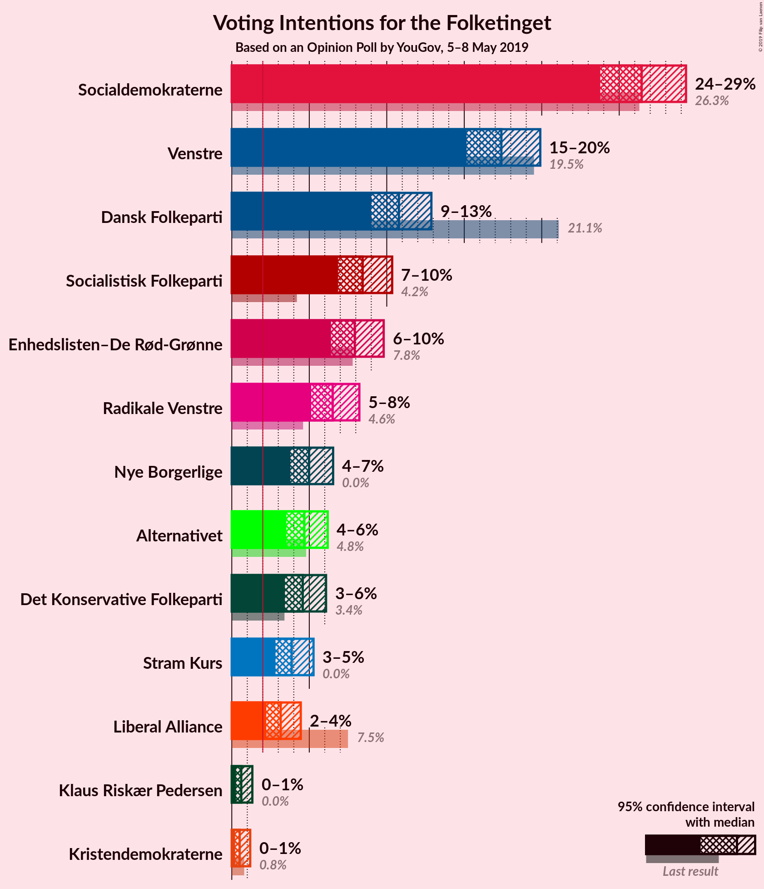

### Confidence Intervals

| Party | Last Result | Poll Result | 80% Confidence Interval | 90% Confidence Interval | 95% Confidence Interval | 99% Confidence Interval |
|:-----:|:-----------:|:-----------:|:-----------------------:|:-----------------------:|:-----------------------:|:-----------------------:|
| Socialdemokraterne | 26.3% | 26.4% | 24.7–28.3% |24.2–28.8% |23.8–29.3% |23.0–30.2% |
| Venstre | 19.5% | 17.4% | 15.9–19.0% |15.5–19.5% |15.2–19.9% |14.5–20.7% |
| Dansk Folkeparti | 21.1% | 10.8% | 9.6–12.2% |9.3–12.5% |9.0–12.9% |8.5–13.6% |
| Socialistisk Folkeparti | 4.2% | 8.4% | 7.4–9.7% |7.1–10.0% |6.9–10.3% |6.4–11.0% |
| Enhedslisten–De Rød-Grønne | 7.8% | 7.9% | 6.9–9.2% |6.6–9.5% |6.4–9.8% |5.9–10.4% |
| Radikale Venstre | 4.6% | 6.5% | 5.6–7.6% |5.3–8.0% |5.1–8.2% |4.7–8.8% |
| Nye Borgerlige | 0.0% | 5.0% | 4.2–6.0% |4.0–6.3% |3.8–6.5% |3.4–7.1% |
| Alternativet | 4.8% | 4.7% | 3.9–5.7% |3.7–5.9% |3.5–6.2% |3.2–6.7% |
| Det Konservative Folkeparti | 3.4% | 4.6% | 3.8–5.6% |3.6–5.8% |3.4–6.1% |3.1–6.6% |
| Stram Kurs | 0.0% | 3.9% | 3.2–4.8% |3.0–5.0% |2.8–5.3% |2.5–5.7% |
| Liberal Alliance | 7.5% | 3.2% | 2.5–4.0% |2.4–4.2% |2.2–4.5% |2.0–4.9% |
| Klaus Riskær Pedersen | 0.0% | 0.6% | 0.4–1.1% |0.3–1.2% |0.3–1.3% |0.2–1.6% |
| Kristendemokraterne | 0.8% | 0.5% | 0.3–0.9% |0.3–1.1% |0.2–1.2% |0.2–1.4% |

*Note:* The poll result column reflects the actual value used in the calculations. Published results may vary slightly, and in addition be rounded to fewer digits.

## Seats

### Confidence Intervals

| Party | Last Result | Median | 80% Confidence Interval | 90% Confidence Interval | 95% Confidence Interval | 99% Confidence Interval |
|:-----:|:-----------:|:------:|:-----------------------:|:-----------------------:|:-----------------------:|:-----------------------:|
| <a href="#socialdemokraterne">Socialdemokraterne</a> | 47 | 49 | 44–51 |43–51 |41–51 |41–52 |
| <a href="#venstre">Venstre</a> | 34 | 31 | 27–37 |27–37 |27–37 |26–37 |
| <a href="#dansk-folkeparti">Dansk Folkeparti</a> | 37 | 20 | 17–20 |16–21 |16–21 |16–24 |
| <a href="#socialistisk-folkeparti">Socialistisk Folkeparti</a> | 7 | 15 | 13–17 |13–19 |13–19 |12–21 |
| <a href="#enhedslisten–de-rød-grønne">Enhedslisten–De Rød-Grønne</a> | 14 | 13 | 12–17 |12–18 |11–19 |10–19 |
| <a href="#radikale-venstre">Radikale Venstre</a> | 8 | 11 | 10–14 |10–14 |10–15 |9–16 |
| <a href="#nye-borgerlige">Nye Borgerlige</a> | 0 | 9 | 8–12 |7–12 |7–12 |6–13 |
| <a href="#alternativet">Alternativet</a> | 9 | 8 | 6–9 |6–9 |6–11 |6–12 |
| <a href="#det-konservative-folkeparti">Det Konservative Folkeparti</a> | 6 | 8 | 7–10 |7–10 |7–10 |5–11 |
| <a href="#stram-kurs">Stram Kurs</a> | 0 | 7 | 6–8 |6–8 |5–8 |5–10 |
| <a href="#liberal-alliance">Liberal Alliance</a> | 13 | 5 | 4–6 |4–7 |4–7 |4–9 |
| <a href="#klaus-riskær-pedersen">Klaus Riskær Pedersen</a> | 0 | 0 | 0 |0 |0 |0 |
| <a href="#kristendemokraterne">Kristendemokraterne</a> | 0 | 0 | 0 |0 |0 |0 |

### Socialdemokraterne

*For a full overview of the results for this party, see the [Socialdemokraterne](party-socialdemokraterne.html) page.*

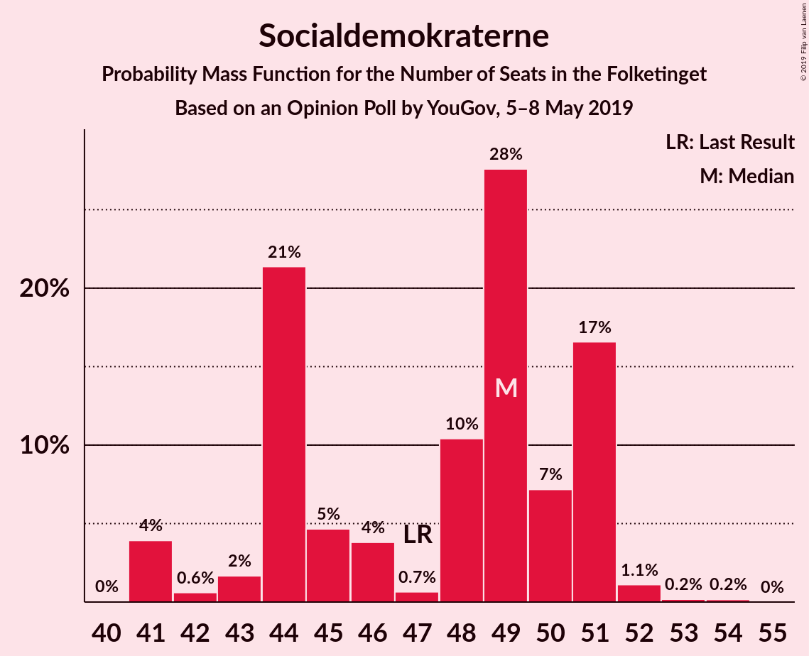

| Number of Seats | Probability | Accumulated | Special Marks |
|:---------------:|:-----------:|:-----------:|:-------------:|
| 40 | 0% | 100% |  |
| 41 | 4% | 99.9% |  |
| 42 | 0.6% | 96% |  |
| 43 | 2% | 95% |  |
| 44 | 21% | 94% |  |
| 45 | 5% | 72% |  |
| 46 | 4% | 68% |  |
| 47 | 0.7% | 64% | Last Result |
| 48 | 10% | 63% |  |
| 49 | 28% | 53% | Median |
| 50 | 7% | 25% |  |
| 51 | 17% | 18% |  |
| 52 | 1.1% | 1.5% |  |
| 53 | 0.2% | 0.4% |  |
| 54 | 0.2% | 0.2% |  |
| 55 | 0% | 0% |  |

### Venstre

*For a full overview of the results for this party, see the [Venstre](party-venstre.html) page.*

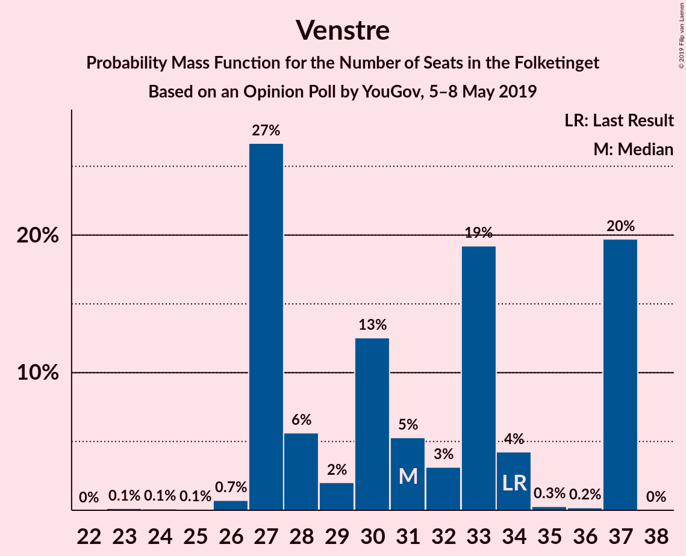

| Number of Seats | Probability | Accumulated | Special Marks |
|:---------------:|:-----------:|:-----------:|:-------------:|
| 23 | 0.1% | 100% |  |
| 24 | 0.1% | 99.9% |  |
| 25 | 0.1% | 99.7% |  |
| 26 | 0.7% | 99.7% |  |
| 27 | 27% | 99.0% |  |
| 28 | 6% | 72% |  |
| 29 | 2% | 67% |  |
| 30 | 13% | 65% |  |
| 31 | 5% | 52% | Median |
| 32 | 3% | 47% |  |
| 33 | 19% | 44% |  |
| 34 | 4% | 24% | Last Result |
| 35 | 0.3% | 20% |  |
| 36 | 0.2% | 20% |  |
| 37 | 20% | 20% |  |
| 38 | 0% | 0% |  |

### Dansk Folkeparti

*For a full overview of the results for this party, see the [Dansk Folkeparti](party-danskfolkeparti.html) page.*

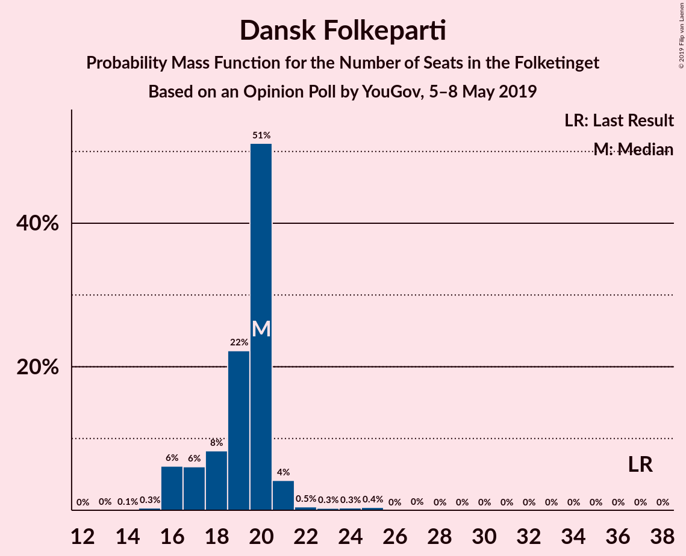

| Number of Seats | Probability | Accumulated | Special Marks |
|:---------------:|:-----------:|:-----------:|:-------------:|
| 14 | 0.1% | 100% |  |
| 15 | 0.3% | 99.9% |  |
| 16 | 6% | 99.6% |  |
| 17 | 6% | 93% |  |
| 18 | 8% | 87% |  |
| 19 | 22% | 79% |  |
| 20 | 51% | 57% | Median |
| 21 | 4% | 6% |  |
| 22 | 0.5% | 2% |  |
| 23 | 0.3% | 1.0% |  |
| 24 | 0.3% | 0.7% |  |
| 25 | 0.4% | 0.4% |  |
| 26 | 0% | 0% |  |
| 27 | 0% | 0% |  |
| 28 | 0% | 0% |  |
| 29 | 0% | 0% |  |
| 30 | 0% | 0% |  |
| 31 | 0% | 0% |  |
| 32 | 0% | 0% |  |
| 33 | 0% | 0% |  |
| 34 | 0% | 0% |  |
| 35 | 0% | 0% |  |
| 36 | 0% | 0% |  |
| 37 | 0% | 0% | Last Result |

### Socialistisk Folkeparti

*For a full overview of the results for this party, see the [Socialistisk Folkeparti](party-socialistiskfolkeparti.html) page.*

| Number of Seats | Probability | Accumulated | Special Marks |
|:---------------:|:-----------:|:-----------:|:-------------:|
| 7 | 0% | 100% | Last Result |
| 8 | 0% | 100% |  |
| 9 | 0% | 100% |  |
| 10 | 0% | 100% |  |
| 11 | 0.2% | 100% |  |
| 12 | 2% | 99.7% |  |
| 13 | 34% | 98% |  |
| 14 | 12% | 64% |  |
| 15 | 23% | 52% | Median |
| 16 | 18% | 29% |  |
| 17 | 1.4% | 11% |  |
| 18 | 2% | 9% |  |
| 19 | 6% | 7% |  |
| 20 | 0.1% | 0.9% |  |
| 21 | 0.9% | 0.9% |  |
| 22 | 0% | 0% |  |

### Enhedslisten–De Rød-Grønne

*For a full overview of the results for this party, see the [Enhedslisten–De Rød-Grønne](party-enhedslisten–derød-grønne.html) page.*

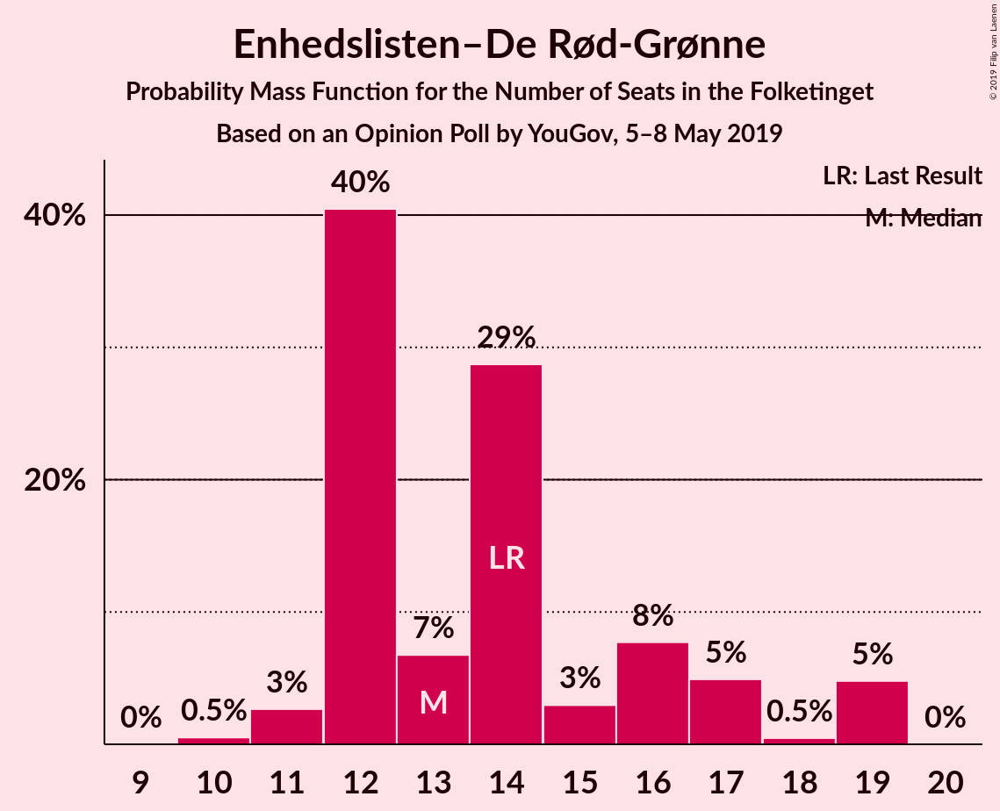

| Number of Seats | Probability | Accumulated | Special Marks |
|:---------------:|:-----------:|:-----------:|:-------------:|
| 10 | 0.5% | 100% |  |
| 11 | 3% | 99.5% |  |
| 12 | 40% | 97% |  |
| 13 | 7% | 56% | Median |
| 14 | 29% | 50% | Last Result |
| 15 | 3% | 21% |  |
| 16 | 8% | 18% |  |
| 17 | 5% | 10% |  |
| 18 | 0.5% | 5% |  |
| 19 | 5% | 5% |  |
| 20 | 0% | 0% |  |

### Radikale Venstre

*For a full overview of the results for this party, see the [Radikale Venstre](party-radikalevenstre.html) page.*

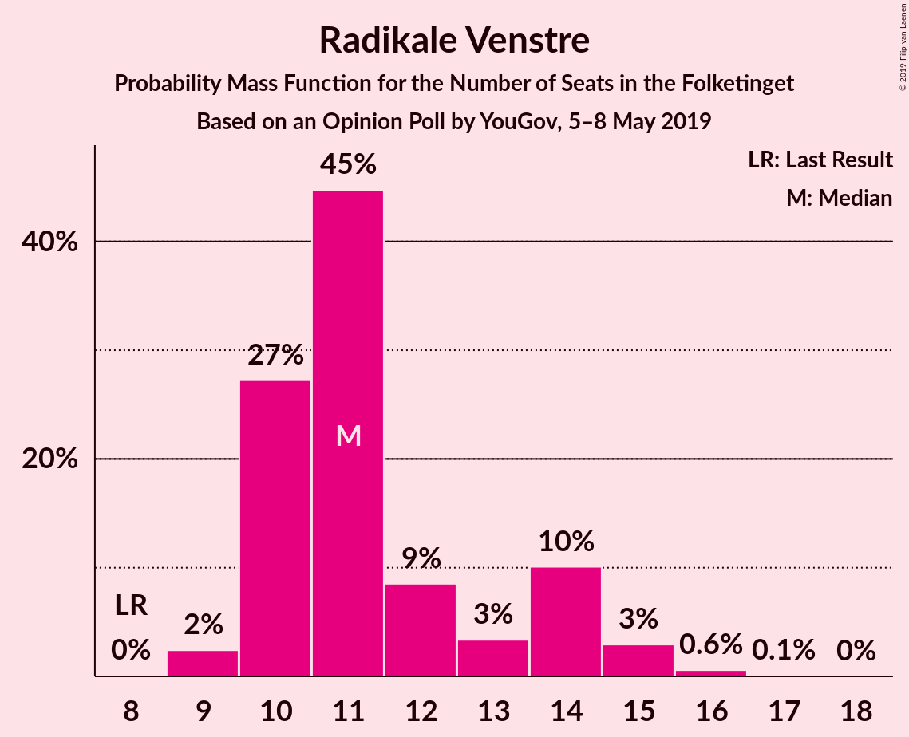

| Number of Seats | Probability | Accumulated | Special Marks |
|:---------------:|:-----------:|:-----------:|:-------------:|
| 8 | 0% | 100% | Last Result |
| 9 | 2% | 99.9% |  |
| 10 | 27% | 98% |  |
| 11 | 45% | 70% | Median |
| 12 | 9% | 26% |  |
| 13 | 3% | 17% |  |
| 14 | 10% | 14% |  |
| 15 | 3% | 4% |  |
| 16 | 0.6% | 0.7% |  |
| 17 | 0.1% | 0.1% |  |
| 18 | 0% | 0% |  |

### Nye Borgerlige

*For a full overview of the results for this party, see the [Nye Borgerlige](party-nyeborgerlige.html) page.*

| Number of Seats | Probability | Accumulated | Special Marks |
|:---------------:|:-----------:|:-----------:|:-------------:|
| 0 | 0% | 100% | Last Result |
| 1 | 0% | 100% |  |
| 2 | 0% | 100% |  |
| 3 | 0% | 100% |  |
| 4 | 0% | 100% |  |
| 5 | 0% | 100% |  |
| 6 | 1.2% | 100% |  |
| 7 | 4% | 98.8% |  |
| 8 | 18% | 94% |  |
| 9 | 43% | 76% | Median |
| 10 | 5% | 33% |  |
| 11 | 1.1% | 28% |  |
| 12 | 27% | 27% |  |
| 13 | 0.5% | 0.6% |  |
| 14 | 0% | 0% |  |

### Alternativet

*For a full overview of the results for this party, see the [Alternativet](party-alternativet.html) page.*

| Number of Seats | Probability | Accumulated | Special Marks |
|:---------------:|:-----------:|:-----------:|:-------------:|
| 5 | 0.2% | 100% |  |
| 6 | 26% | 99.8% |  |
| 7 | 4% | 74% |  |
| 8 | 55% | 70% | Median |
| 9 | 10% | 14% | Last Result |
| 10 | 1.0% | 4% |  |
| 11 | 2% | 3% |  |
| 12 | 0.6% | 0.7% |  |
| 13 | 0.1% | 0.1% |  |
| 14 | 0% | 0% |  |

### Det Konservative Folkeparti

*For a full overview of the results for this party, see the [Det Konservative Folkeparti](party-detkonservativefolkeparti.html) page.*

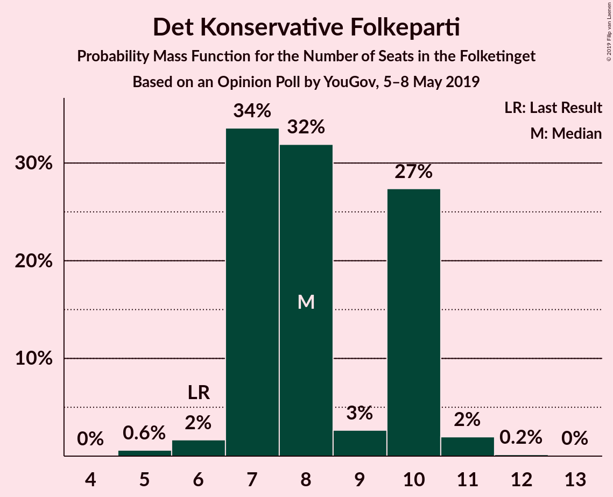

| Number of Seats | Probability | Accumulated | Special Marks |
|:---------------:|:-----------:|:-----------:|:-------------:|
| 5 | 0.6% | 100% |  |
| 6 | 2% | 99.4% | Last Result |
| 7 | 34% | 98% |  |
| 8 | 32% | 64% | Median |
| 9 | 3% | 32% |  |
| 10 | 27% | 30% |  |
| 11 | 2% | 2% |  |
| 12 | 0.2% | 0.2% |  |
| 13 | 0% | 0% |  |

### Stram Kurs

*For a full overview of the results for this party, see the [Stram Kurs](party-stramkurs.html) page.*

| Number of Seats | Probability | Accumulated | Special Marks |
|:---------------:|:-----------:|:-----------:|:-------------:|
| 0 | 0% | 100% | Last Result |
| 1 | 0% | 100% |  |
| 2 | 0% | 100% |  |
| 3 | 0% | 100% |  |
| 4 | 0.1% | 100% |  |
| 5 | 5% | 99.9% |  |
| 6 | 37% | 95% |  |
| 7 | 47% | 58% | Median |
| 8 | 10% | 12% |  |
| 9 | 0.2% | 2% |  |
| 10 | 2% | 2% |  |
| 11 | 0.1% | 0.1% |  |
| 12 | 0% | 0% |  |

### Liberal Alliance

*For a full overview of the results for this party, see the [Liberal Alliance](party-liberalalliance.html) page.*

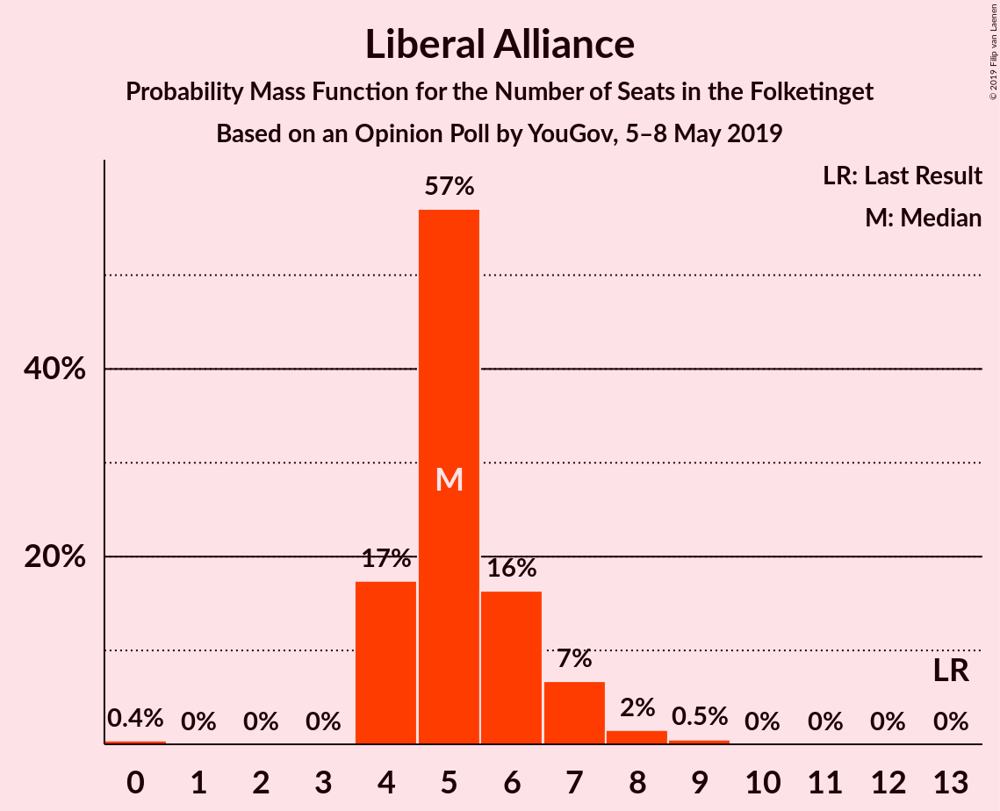

| Number of Seats | Probability | Accumulated | Special Marks |
|:---------------:|:-----------:|:-----------:|:-------------:|
| 0 | 0.4% | 100% |  |
| 1 | 0% | 99.6% |  |
| 2 | 0% | 99.6% |  |
| 3 | 0% | 99.6% |  |
| 4 | 17% | 99.6% |  |
| 5 | 57% | 82% | Median |
| 6 | 16% | 25% |  |
| 7 | 7% | 9% |  |
| 8 | 2% | 2% |  |
| 9 | 0.5% | 0.5% |  |
| 10 | 0% | 0% |  |
| 11 | 0% | 0% |  |
| 12 | 0% | 0% |  |
| 13 | 0% | 0% | Last Result |

### Klaus Riskær Pedersen

*For a full overview of the results for this party, see the [Klaus Riskær Pedersen](party-klausriskærpedersen.html) page.*

| Number of Seats | Probability | Accumulated | Special Marks |
|:---------------:|:-----------:|:-----------:|:-------------:|
| 0 | 100% | 100% | Last Result, Median |

### Kristendemokraterne

*For a full overview of the results for this party, see the [Kristendemokraterne](party-kristendemokraterne.html) page.*

| Number of Seats | Probability | Accumulated | Special Marks |
|:---------------:|:-----------:|:-----------:|:-------------:|
| 0 | 100% | 100% | Last Result, Median |

## Coalitions

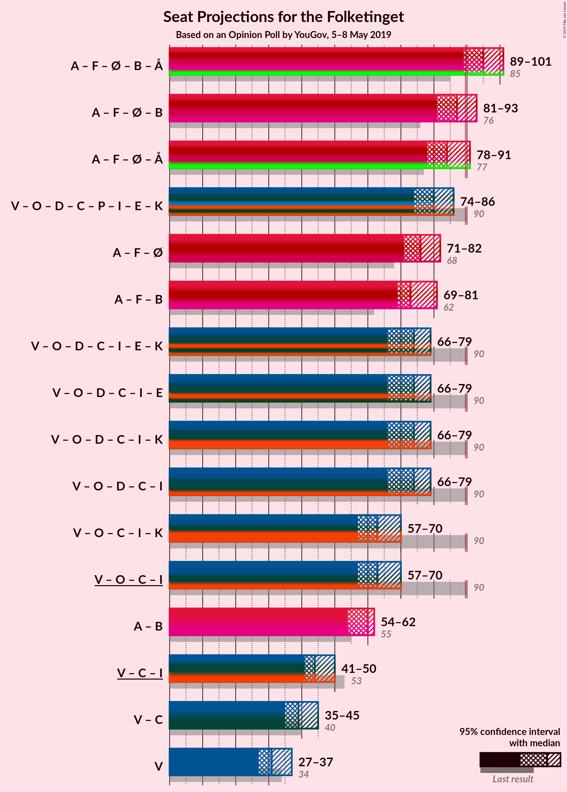

### Confidence Intervals

| Coalition | Last Result | Median | Majority? | 80% Confidence Interval | 90% Confidence Interval | 95% Confidence Interval | 99% Confidence Interval |
|:---------:|:-----------:|:------:|:---------:|:-----------------------:|:-----------------------:|:-----------------------:|:-----------------------:|
| Socialdemokraterne – Socialistisk Folkeparti – Enhedslisten–De Rød-Grønne – Radikale Venstre – Alternativet | 85 | 95 | 80% | 89–100 | 89–101 | 89–101 | 89–101 |
| Socialdemokraterne – Socialistisk Folkeparti – Enhedslisten–De Rød-Grønne – Radikale Venstre | 76 | 87 | 33% | 81–92 | 81–92 | 81–93 | 81–93 |
| Socialdemokraterne – Socialistisk Folkeparti – Enhedslisten–De Rød-Grønne – Alternativet | 77 | 84 | 6% | 79–87 | 79–90 | 78–91 | 78–91 |
| Venstre – Dansk Folkeparti – Nye Borgerlige – Det Konservative Folkeparti – Stram Kurs – Liberal Alliance – Klaus Riskær Pedersen – Kristendemokraterne | 90 | 80 | 0% | 75–86 | 74–86 | 74–86 | 74–86 |
| Socialdemokraterne – Socialistisk Folkeparti – Enhedslisten–De Rød-Grønne | 68 | 76 | 0% | 71–79 | 71–82 | 71–82 | 70–82 |
| Socialdemokraterne – Socialistisk Folkeparti – Radikale Venstre | 62 | 73 | 0% | 69–78 | 69–78 | 69–81 | 66–81 |
| Venstre – Dansk Folkeparti – Nye Borgerlige – Det Konservative Folkeparti – Liberal Alliance – Klaus Riskær Pedersen – Kristendemokraterne | 90 | 74 | 0% | 68–79 | 68–79 | 66–79 | 66–79 |
| Venstre – Dansk Folkeparti – Nye Borgerlige – Det Konservative Folkeparti – Liberal Alliance – Klaus Riskær Pedersen | 90 | 74 | 0% | 68–79 | 68–79 | 66–79 | 66–79 |
| Venstre – Dansk Folkeparti – Nye Borgerlige – Det Konservative Folkeparti – Liberal Alliance – Kristendemokraterne | 90 | 74 | 0% | 68–79 | 68–79 | 66–79 | 66–79 |
| Venstre – Dansk Folkeparti – Nye Borgerlige – Det Konservative Folkeparti – Liberal Alliance | 90 | 74 | 0% | 68–79 | 68–79 | 66–79 | 66–79 |
| Venstre – Dansk Folkeparti – Det Konservative Folkeparti – Liberal Alliance – Kristendemokraterne | 90 | 63 | 0% | 60–70 | 60–70 | 57–70 | 57–70 |
| Venstre – Dansk Folkeparti – Det Konservative Folkeparti – Liberal Alliance | 90 | 63 | 0% | 60–70 | 60–70 | 57–70 | 57–70 |
| Socialdemokraterne – Radikale Venstre | 55 | 60 | 0% | 54–62 | 54–62 | 54–62 | 53–64 |
| Venstre – Det Konservative Folkeparti – Liberal Alliance | 53 | 44 | 0% | 42–50 | 41–50 | 41–50 | 39–50 |
| Venstre – Det Konservative Folkeparti | 40 | 39 | 0% | 37–45 | 35–45 | 35–45 | 33–45 |
| Venstre | 34 | 31 | 0% | 27–37 | 27–37 | 27–37 | 26–37 |

### Socialdemokraterne – Socialistisk Folkeparti – Enhedslisten–De Rød-Grønne – Radikale Venstre – Alternativet

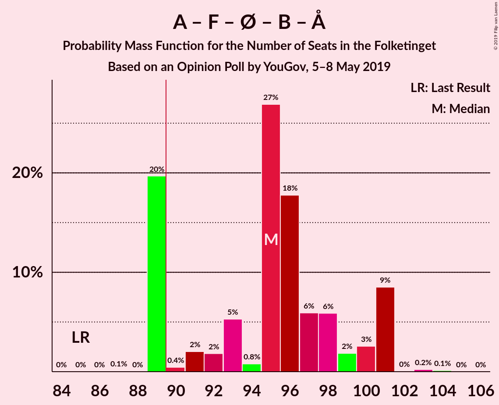

| Number of Seats | Probability | Accumulated | Special Marks |
|:---------------:|:-----------:|:-----------:|:-------------:|
| 85 | 0% | 100% | Last Result |
| 86 | 0% | 100% |  |
| 87 | 0.1% | 100% |  |
| 88 | 0% | 99.9% |  |
| 89 | 20% | 99.9% |  |
| 90 | 0.4% | 80% | Majority |
| 91 | 2% | 80% |  |
| 92 | 2% | 78% |  |
| 93 | 5% | 76% |  |
| 94 | 0.8% | 71% |  |
| 95 | 27% | 70% |  |
| 96 | 18% | 43% | Median |
| 97 | 6% | 25% |  |
| 98 | 6% | 19% |  |
| 99 | 2% | 13% |  |
| 100 | 3% | 11% |  |
| 101 | 9% | 9% |  |
| 102 | 0% | 0.4% |  |
| 103 | 0.2% | 0.4% |  |
| 104 | 0.1% | 0.2% |  |
| 105 | 0% | 0% |  |

### Socialdemokraterne – Socialistisk Folkeparti – Enhedslisten–De Rød-Grønne – Radikale Venstre

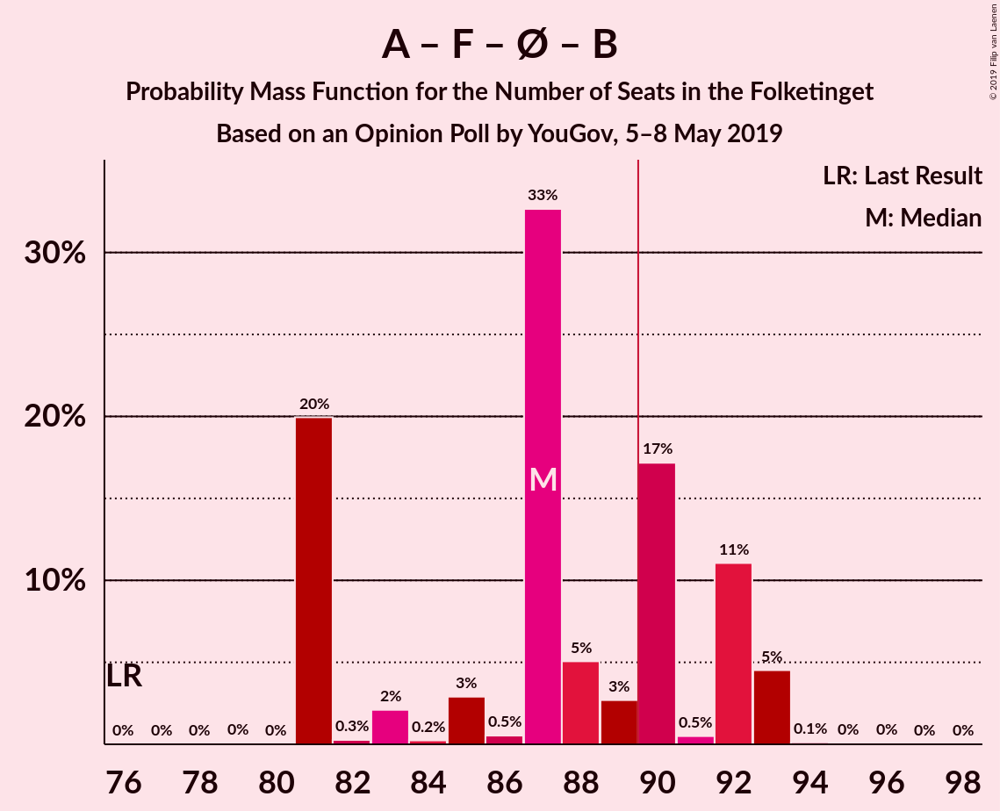

| Number of Seats | Probability | Accumulated | Special Marks |
|:---------------:|:-----------:|:-----------:|:-------------:|
| 76 | 0% | 100% | Last Result |
| 77 | 0% | 100% |  |
| 78 | 0% | 100% |  |
| 79 | 0% | 100% |  |
| 80 | 0% | 99.9% |  |
| 81 | 20% | 99.9% |  |
| 82 | 0.3% | 80% |  |
| 83 | 2% | 80% |  |
| 84 | 0.2% | 78% |  |
| 85 | 3% | 77% |  |
| 86 | 0.5% | 74% |  |
| 87 | 33% | 74% |  |
| 88 | 5% | 41% | Median |
| 89 | 3% | 36% |  |
| 90 | 17% | 33% | Majority |
| 91 | 0.5% | 16% |  |
| 92 | 11% | 16% |  |
| 93 | 5% | 5% |  |
| 94 | 0.1% | 0.2% |  |
| 95 | 0% | 0.1% |  |
| 96 | 0% | 0.1% |  |
| 97 | 0% | 0% |  |

### Socialdemokraterne – Socialistisk Folkeparti – Enhedslisten–De Rød-Grønne – Alternativet

| Number of Seats | Probability | Accumulated | Special Marks |
|:---------------:|:-----------:|:-----------:|:-------------:|
| 75 | 0.1% | 100% |  |
| 76 | 0% | 99.9% |  |
| 77 | 0% | 99.9% | Last Result |
| 78 | 3% | 99.9% |  |
| 79 | 21% | 96% |  |
| 80 | 0.8% | 75% |  |
| 81 | 2% | 74% |  |
| 82 | 2% | 72% |  |
| 83 | 2% | 70% |  |
| 84 | 32% | 68% |  |
| 85 | 20% | 36% | Median |
| 86 | 2% | 16% |  |
| 87 | 7% | 14% |  |
| 88 | 0.7% | 7% |  |
| 89 | 0.2% | 7% |  |
| 90 | 1.5% | 6% | Majority |
| 91 | 5% | 5% |  |
| 92 | 0% | 0.1% |  |
| 93 | 0.1% | 0.1% |  |
| 94 | 0% | 0% |  |

### Venstre – Dansk Folkeparti – Nye Borgerlige – Det Konservative Folkeparti – Stram Kurs – Liberal Alliance – Klaus Riskær Pedersen – Kristendemokraterne

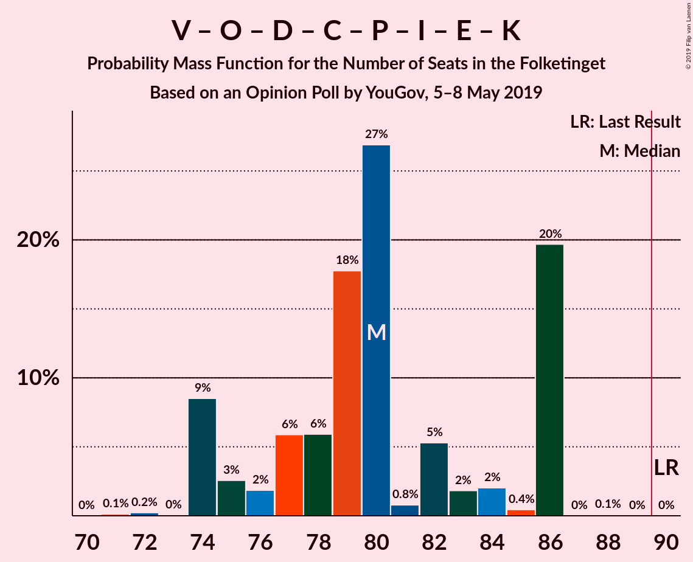

| Number of Seats | Probability | Accumulated | Special Marks |
|:---------------:|:-----------:|:-----------:|:-------------:|
| 71 | 0.1% | 100% |  |
| 72 | 0.2% | 99.8% |  |
| 73 | 0% | 99.6% |  |
| 74 | 9% | 99.6% |  |
| 75 | 3% | 91% |  |
| 76 | 2% | 89% |  |
| 77 | 6% | 87% |  |
| 78 | 6% | 81% |  |
| 79 | 18% | 75% |  |
| 80 | 27% | 57% | Median |
| 81 | 0.8% | 30% |  |
| 82 | 5% | 29% |  |
| 83 | 2% | 24% |  |
| 84 | 2% | 22% |  |
| 85 | 0.4% | 20% |  |
| 86 | 20% | 20% |  |
| 87 | 0% | 0.1% |  |
| 88 | 0.1% | 0.1% |  |
| 89 | 0% | 0% |  |
| 90 | 0% | 0% | Last Result, Majority |

### Socialdemokraterne – Socialistisk Folkeparti – Enhedslisten–De Rød-Grønne

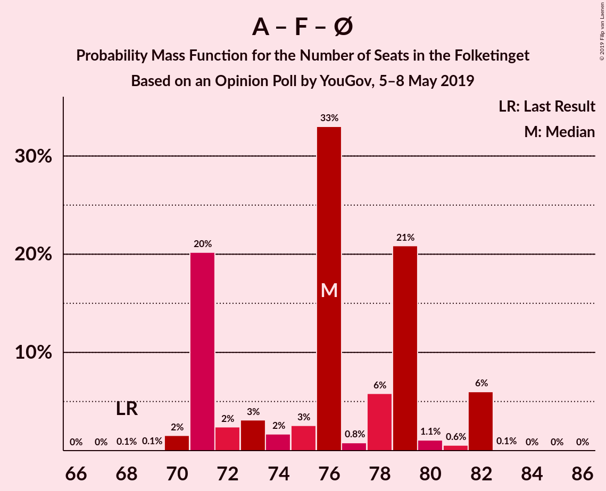

| Number of Seats | Probability | Accumulated | Special Marks |
|:---------------:|:-----------:|:-----------:|:-------------:|
| 68 | 0.1% | 100% | Last Result |
| 69 | 0.1% | 99.9% |  |
| 70 | 2% | 99.8% |  |
| 71 | 20% | 98% |  |
| 72 | 2% | 78% |  |
| 73 | 3% | 76% |  |
| 74 | 2% | 73% |  |
| 75 | 3% | 71% |  |
| 76 | 33% | 68% |  |
| 77 | 0.8% | 35% | Median |
| 78 | 6% | 34% |  |
| 79 | 21% | 29% |  |
| 80 | 1.1% | 8% |  |
| 81 | 0.6% | 7% |  |
| 82 | 6% | 6% |  |
| 83 | 0.1% | 0.2% |  |
| 84 | 0% | 0.1% |  |
| 85 | 0% | 0% |  |

### Socialdemokraterne – Socialistisk Folkeparti – Radikale Venstre

| Number of Seats | Probability | Accumulated | Special Marks |
|:---------------:|:-----------:|:-----------:|:-------------:|
| 62 | 0% | 100% | Last Result |
| 63 | 0% | 100% |  |
| 64 | 0% | 100% |  |
| 65 | 0% | 100% |  |
| 66 | 1.3% | 100% |  |
| 67 | 0.2% | 98.7% |  |
| 68 | 0.2% | 98.5% |  |
| 69 | 21% | 98% |  |
| 70 | 3% | 77% |  |
| 71 | 4% | 75% |  |
| 72 | 0.8% | 71% |  |
| 73 | 33% | 70% |  |
| 74 | 4% | 37% |  |
| 75 | 2% | 33% | Median |
| 76 | 7% | 31% |  |
| 77 | 0.5% | 24% |  |
| 78 | 19% | 24% |  |
| 79 | 0.3% | 5% |  |
| 80 | 1.0% | 5% |  |
| 81 | 4% | 4% |  |
| 82 | 0% | 0% |  |

### Venstre – Dansk Folkeparti – Nye Borgerlige – Det Konservative Folkeparti – Liberal Alliance – Klaus Riskær Pedersen – Kristendemokraterne

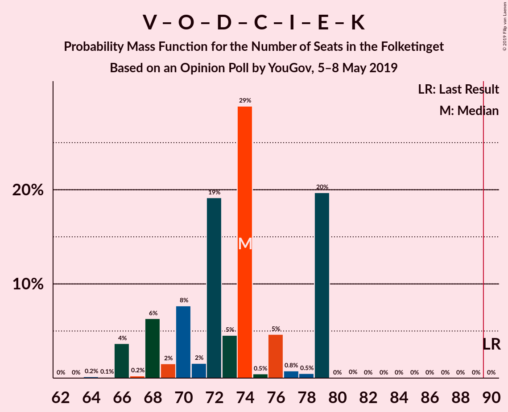

| Number of Seats | Probability | Accumulated | Special Marks |
|:---------------:|:-----------:|:-----------:|:-------------:|
| 64 | 0.2% | 100% |  |
| 65 | 0.1% | 99.8% |  |
| 66 | 4% | 99.7% |  |
| 67 | 0.2% | 96% |  |
| 68 | 6% | 96% |  |
| 69 | 2% | 89% |  |
| 70 | 8% | 88% |  |
| 71 | 2% | 80% |  |
| 72 | 19% | 79% |  |
| 73 | 5% | 60% | Median |
| 74 | 29% | 55% |  |
| 75 | 0.5% | 26% |  |
| 76 | 5% | 26% |  |
| 77 | 0.8% | 21% |  |
| 78 | 0.5% | 20% |  |
| 79 | 20% | 20% |  |
| 80 | 0% | 0.1% |  |
| 81 | 0% | 0.1% |  |
| 82 | 0% | 0% |  |
| 83 | 0% | 0% |  |
| 84 | 0% | 0% |  |
| 85 | 0% | 0% |  |
| 86 | 0% | 0% |  |
| 87 | 0% | 0% |  |
| 88 | 0% | 0% |  |
| 89 | 0% | 0% |  |
| 90 | 0% | 0% | Last Result, Majority |

### Venstre – Dansk Folkeparti – Nye Borgerlige – Det Konservative Folkeparti – Liberal Alliance – Klaus Riskær Pedersen

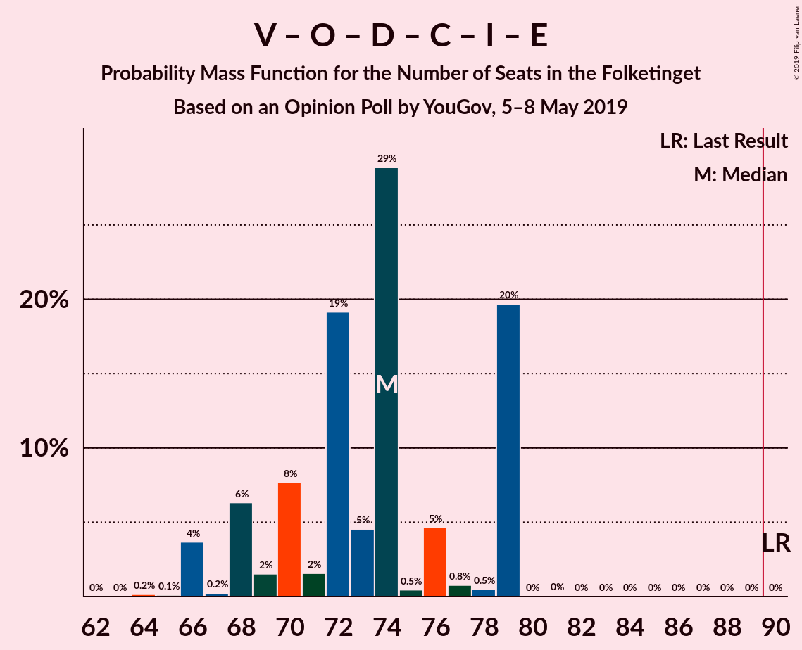

| Number of Seats | Probability | Accumulated | Special Marks |
|:---------------:|:-----------:|:-----------:|:-------------:|
| 64 | 0.2% | 100% |  |
| 65 | 0.1% | 99.8% |  |
| 66 | 4% | 99.7% |  |
| 67 | 0.2% | 96% |  |
| 68 | 6% | 96% |  |
| 69 | 2% | 89% |  |
| 70 | 8% | 88% |  |
| 71 | 2% | 80% |  |
| 72 | 19% | 79% |  |
| 73 | 5% | 60% | Median |
| 74 | 29% | 55% |  |
| 75 | 0.5% | 26% |  |
| 76 | 5% | 26% |  |
| 77 | 0.8% | 21% |  |
| 78 | 0.5% | 20% |  |
| 79 | 20% | 20% |  |
| 80 | 0% | 0.1% |  |
| 81 | 0% | 0.1% |  |
| 82 | 0% | 0% |  |
| 83 | 0% | 0% |  |
| 84 | 0% | 0% |  |
| 85 | 0% | 0% |  |
| 86 | 0% | 0% |  |
| 87 | 0% | 0% |  |
| 88 | 0% | 0% |  |
| 89 | 0% | 0% |  |
| 90 | 0% | 0% | Last Result, Majority |

### Venstre – Dansk Folkeparti – Nye Borgerlige – Det Konservative Folkeparti – Liberal Alliance – Kristendemokraterne

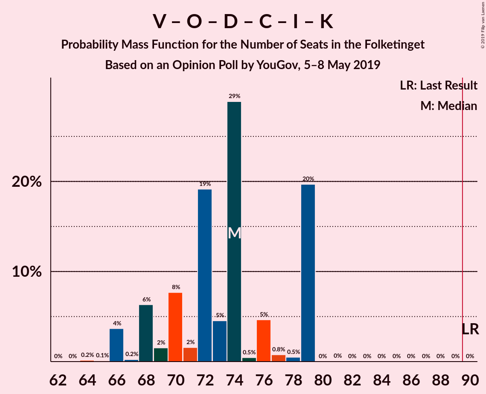

| Number of Seats | Probability | Accumulated | Special Marks |
|:---------------:|:-----------:|:-----------:|:-------------:|
| 64 | 0.2% | 100% |  |
| 65 | 0.1% | 99.8% |  |
| 66 | 4% | 99.7% |  |
| 67 | 0.2% | 96% |  |
| 68 | 6% | 96% |  |
| 69 | 2% | 89% |  |
| 70 | 8% | 88% |  |
| 71 | 2% | 80% |  |
| 72 | 19% | 79% |  |
| 73 | 5% | 60% | Median |
| 74 | 29% | 55% |  |
| 75 | 0.5% | 26% |  |
| 76 | 5% | 26% |  |
| 77 | 0.8% | 21% |  |
| 78 | 0.5% | 20% |  |
| 79 | 20% | 20% |  |
| 80 | 0% | 0.1% |  |
| 81 | 0% | 0.1% |  |
| 82 | 0% | 0% |  |
| 83 | 0% | 0% |  |
| 84 | 0% | 0% |  |
| 85 | 0% | 0% |  |
| 86 | 0% | 0% |  |
| 87 | 0% | 0% |  |
| 88 | 0% | 0% |  |
| 89 | 0% | 0% |  |
| 90 | 0% | 0% | Last Result, Majority |

### Venstre – Dansk Folkeparti – Nye Borgerlige – Det Konservative Folkeparti – Liberal Alliance

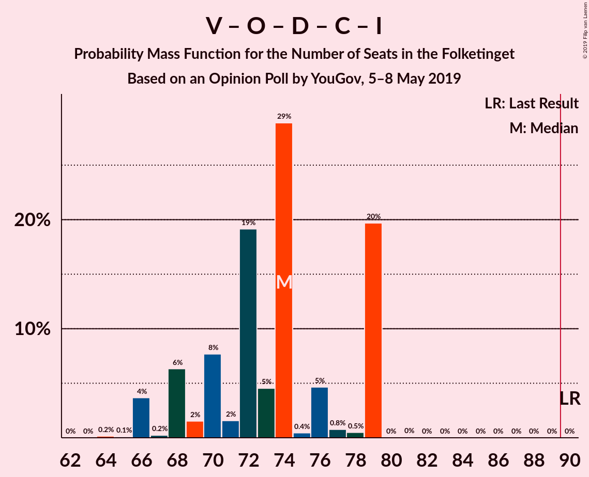

| Number of Seats | Probability | Accumulated | Special Marks |
|:---------------:|:-----------:|:-----------:|:-------------:|
| 64 | 0.2% | 100% |  |
| 65 | 0.1% | 99.8% |  |
| 66 | 4% | 99.7% |  |
| 67 | 0.2% | 96% |  |
| 68 | 6% | 96% |  |
| 69 | 2% | 89% |  |
| 70 | 8% | 88% |  |
| 71 | 2% | 80% |  |
| 72 | 19% | 79% |  |
| 73 | 5% | 60% | Median |
| 74 | 29% | 55% |  |
| 75 | 0.4% | 26% |  |
| 76 | 5% | 26% |  |
| 77 | 0.8% | 21% |  |
| 78 | 0.5% | 20% |  |
| 79 | 20% | 20% |  |
| 80 | 0% | 0.1% |  |
| 81 | 0% | 0.1% |  |
| 82 | 0% | 0% |  |
| 83 | 0% | 0% |  |
| 84 | 0% | 0% |  |
| 85 | 0% | 0% |  |
| 86 | 0% | 0% |  |
| 87 | 0% | 0% |  |
| 88 | 0% | 0% |  |
| 89 | 0% | 0% |  |
| 90 | 0% | 0% | Last Result, Majority |

### Venstre – Dansk Folkeparti – Det Konservative Folkeparti – Liberal Alliance – Kristendemokraterne

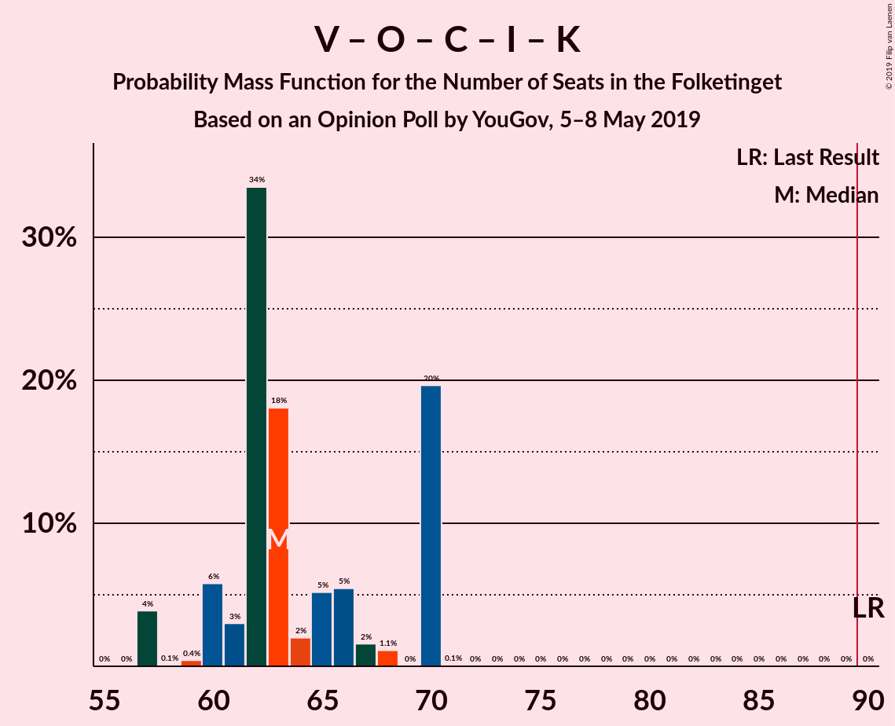

| Number of Seats | Probability | Accumulated | Special Marks |
|:---------------:|:-----------:|:-----------:|:-------------:|
| 57 | 4% | 100% |  |
| 58 | 0.1% | 96% |  |
| 59 | 0.4% | 96% |  |
| 60 | 6% | 96% |  |
| 61 | 3% | 90% |  |
| 62 | 34% | 87% |  |
| 63 | 18% | 53% |  |
| 64 | 2% | 35% | Median |
| 65 | 5% | 33% |  |
| 66 | 5% | 28% |  |
| 67 | 2% | 23% |  |
| 68 | 1.1% | 21% |  |
| 69 | 0% | 20% |  |
| 70 | 20% | 20% |  |
| 71 | 0.1% | 0.1% |  |
| 72 | 0% | 0% |  |
| 73 | 0% | 0% |  |
| 74 | 0% | 0% |  |
| 75 | 0% | 0% |  |
| 76 | 0% | 0% |  |
| 77 | 0% | 0% |  |
| 78 | 0% | 0% |  |
| 79 | 0% | 0% |  |
| 80 | 0% | 0% |  |
| 81 | 0% | 0% |  |
| 82 | 0% | 0% |  |
| 83 | 0% | 0% |  |
| 84 | 0% | 0% |  |
| 85 | 0% | 0% |  |
| 86 | 0% | 0% |  |
| 87 | 0% | 0% |  |
| 88 | 0% | 0% |  |
| 89 | 0% | 0% |  |
| 90 | 0% | 0% | Last Result, Majority |

### Venstre – Dansk Folkeparti – Det Konservative Folkeparti – Liberal Alliance

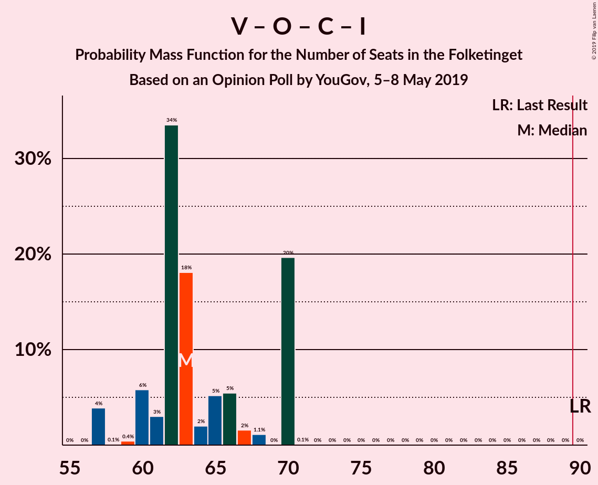

| Number of Seats | Probability | Accumulated | Special Marks |
|:---------------:|:-----------:|:-----------:|:-------------:|
| 57 | 4% | 100% |  |
| 58 | 0.1% | 96% |  |
| 59 | 0.4% | 96% |  |
| 60 | 6% | 96% |  |
| 61 | 3% | 90% |  |
| 62 | 34% | 87% |  |
| 63 | 18% | 53% |  |
| 64 | 2% | 35% | Median |
| 65 | 5% | 33% |  |
| 66 | 5% | 28% |  |
| 67 | 2% | 23% |  |
| 68 | 1.1% | 21% |  |
| 69 | 0% | 20% |  |
| 70 | 20% | 20% |  |
| 71 | 0.1% | 0.1% |  |
| 72 | 0% | 0% |  |
| 73 | 0% | 0% |  |
| 74 | 0% | 0% |  |
| 75 | 0% | 0% |  |
| 76 | 0% | 0% |  |
| 77 | 0% | 0% |  |
| 78 | 0% | 0% |  |
| 79 | 0% | 0% |  |
| 80 | 0% | 0% |  |
| 81 | 0% | 0% |  |
| 82 | 0% | 0% |  |
| 83 | 0% | 0% |  |
| 84 | 0% | 0% |  |
| 85 | 0% | 0% |  |
| 86 | 0% | 0% |  |
| 87 | 0% | 0% |  |
| 88 | 0% | 0% |  |
| 89 | 0% | 0% |  |
| 90 | 0% | 0% | Last Result, Majority |

### Socialdemokraterne – Radikale Venstre

| Number of Seats | Probability | Accumulated | Special Marks |
|:---------------:|:-----------:|:-----------:|:-------------:|
| 51 | 0.1% | 100% |  |
| 52 | 0.1% | 99.9% |  |
| 53 | 0.6% | 99.8% |  |
| 54 | 22% | 99.2% |  |
| 55 | 3% | 77% | Last Result |
| 56 | 3% | 74% |  |
| 57 | 4% | 71% |  |
| 58 | 1.4% | 67% |  |
| 59 | 3% | 65% |  |
| 60 | 32% | 62% | Median |
| 61 | 0.3% | 30% |  |
| 62 | 28% | 30% |  |
| 63 | 1.3% | 2% |  |
| 64 | 0.4% | 0.6% |  |
| 65 | 0.1% | 0.2% |  |
| 66 | 0% | 0.1% |  |
| 67 | 0% | 0% |  |

### Venstre – Det Konservative Folkeparti – Liberal Alliance

| Number of Seats | Probability | Accumulated | Special Marks |
|:---------------:|:-----------:|:-----------:|:-------------:|
| 37 | 0% | 100% |  |
| 38 | 0% | 99.9% |  |
| 39 | 0.9% | 99.9% |  |
| 40 | 0.2% | 99.0% |  |
| 41 | 4% | 98.7% |  |
| 42 | 27% | 94% |  |
| 43 | 8% | 68% |  |
| 44 | 28% | 60% | Median |
| 45 | 3% | 31% |  |
| 46 | 3% | 28% |  |
| 47 | 1.2% | 25% |  |
| 48 | 2% | 24% |  |
| 49 | 0.1% | 22% |  |
| 50 | 21% | 22% |  |
| 51 | 0.1% | 0.3% |  |
| 52 | 0.1% | 0.2% |  |
| 53 | 0.1% | 0.1% | Last Result |
| 54 | 0% | 0% |  |

### Venstre – Det Konservative Folkeparti

| Number of Seats | Probability | Accumulated | Special Marks |
|:---------------:|:-----------:|:-----------:|:-------------:|
| 32 | 0.1% | 100% |  |
| 33 | 0.4% | 99.9% |  |
| 34 | 0.7% | 99.5% |  |
| 35 | 4% | 98.8% |  |
| 36 | 3% | 95% |  |
| 37 | 36% | 92% |  |
| 38 | 4% | 56% |  |
| 39 | 5% | 52% | Median |
| 40 | 21% | 47% | Last Result |
| 41 | 2% | 26% |  |
| 42 | 2% | 23% |  |
| 43 | 0.2% | 22% |  |
| 44 | 0.1% | 22% |  |
| 45 | 21% | 21% |  |
| 46 | 0% | 0% |  |

### Venstre

| Number of Seats | Probability | Accumulated | Special Marks |
|:---------------:|:-----------:|:-----------:|:-------------:|
| 23 | 0.1% | 100% |  |
| 24 | 0.1% | 99.9% |  |
| 25 | 0.1% | 99.7% |  |
| 26 | 0.7% | 99.7% |  |
| 27 | 27% | 99.0% |  |
| 28 | 6% | 72% |  |
| 29 | 2% | 67% |  |
| 30 | 13% | 65% |  |
| 31 | 5% | 52% | Median |
| 32 | 3% | 47% |  |
| 33 | 19% | 44% |  |
| 34 | 4% | 24% | Last Result |
| 35 | 0.3% | 20% |  |
| 36 | 0.2% | 20% |  |
| 37 | 20% | 20% |  |
| 38 | 0% | 0% |  |

## Technical Information

### Opinion Poll

+ **Polling firm:** YouGov
+ **Commissioner(s):** —
+ **Fieldwork period:** 5–8 May 2019

### Calculations

+ **Sample size:** 983
+ **Simulations done:** 1,048,576
+ **Error estimate:** 3.60%

