# Opinion Poll by Voxmeter for Ritzau, 7–9 May 2019

<a href="#voting-intentions">Voting Intentions</a> | <a href="#seats">Seats</a> | <a href="#coalitions">Coalitions</a> | <a href="#technical-information">Technical Information</a>

## Voting Intentions

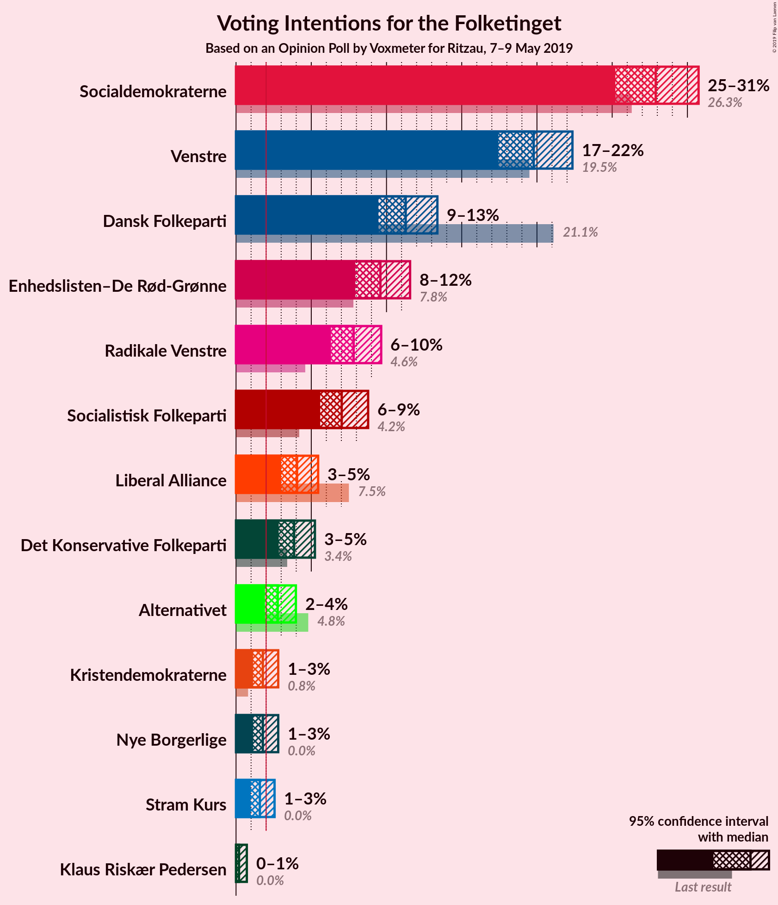

### Confidence Intervals

| Party | Last Result | Poll Result | 80% Confidence Interval | 90% Confidence Interval | 95% Confidence Interval | 99% Confidence Interval |
|:-----:|:-----------:|:-----------:|:-----------------------:|:-----------------------:|:-----------------------:|:-----------------------:|
| Socialdemokraterne | 26.3% | 27.9% | 26.1–29.8% |25.6–30.3% |25.2–30.7% |24.4–31.7% |
| Venstre | 19.5% | 19.8% | 18.2–21.5% |17.8–21.9% |17.4–22.4% |16.7–23.2% |
| Dansk Folkeparti | 21.1% | 11.3% | 10.1–12.7% |9.8–13.0% |9.5–13.4% |8.9–14.1% |
| Enhedslisten–De Rød-Grønne | 7.8% | 9.6% | 8.5–10.9% |8.2–11.2% |7.9–11.6% |7.4–12.2% |
| Radikale Venstre | 4.6% | 7.8% | 6.8–9.0% |6.5–9.3% |6.3–9.6% |5.9–10.2% |
| Socialistisk Folkeparti | 4.2% | 7.0% | 6.1–8.2% |5.8–8.5% |5.6–8.8% |5.2–9.3% |
| Liberal Alliance | 7.5% | 4.1% | 3.4–5.0% |3.2–5.2% |3.0–5.5% |2.7–5.9% |
| Det Konservative Folkeparti | 3.4% | 3.9% | 3.2–4.8% |3.0–5.0% |2.8–5.2% |2.5–5.7% |
| Alternativet | 4.8% | 2.8% | 2.2–3.6% |2.0–3.8% |1.9–4.0% |1.7–4.4% |
| Kristendemokraterne | 0.8% | 1.8% | 1.3–2.4% |1.2–2.6% |1.1–2.8% |0.9–3.2% |
| Nye Borgerlige | 0.0% | 1.8% | 1.3–2.4% |1.2–2.6% |1.1–2.8% |0.9–3.2% |
| Stram Kurs | 0.0% | 1.6% | 1.2–2.2% |1.1–2.4% |1.0–2.6% |0.8–2.9% |
| Klaus Riskær Pedersen | 0.0% | 0.2% | 0.1–0.5% |0.1–0.6% |0.1–0.7% |0.0–0.9% |

*Note:* The poll result column reflects the actual value used in the calculations. Published results may vary slightly, and in addition be rounded to fewer digits.

## Seats

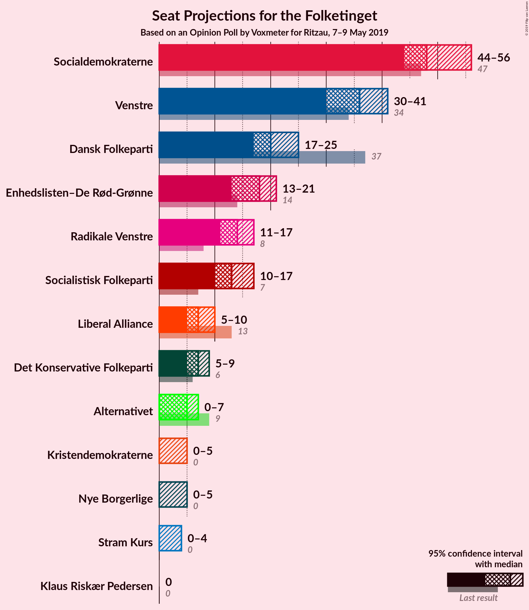

### Confidence Intervals

| Party | Last Result | Median | 80% Confidence Interval | 90% Confidence Interval | 95% Confidence Interval | 99% Confidence Interval |
|:-----:|:-----------:|:------:|:-----------------------:|:-----------------------:|:-----------------------:|:-----------------------:|
| <a href="#socialdemokraterne">Socialdemokraterne</a> | 47 | 48 | 45–55 |44–56 |44–56 |44–57 |
| <a href="#venstre">Venstre</a> | 34 | 36 | 33–39 |31–41 |30–41 |30–43 |
| <a href="#dansk-folkeparti">Dansk Folkeparti</a> | 37 | 20 | 18–24 |17–25 |17–25 |16–26 |
| <a href="#enhedslisten–de-rød-grønne">Enhedslisten–De Rød-Grønne</a> | 14 | 18 | 15–20 |14–21 |13–21 |12–22 |
| <a href="#radikale-venstre">Radikale Venstre</a> | 8 | 14 | 12–16 |11–16 |11–17 |10–19 |
| <a href="#socialistisk-folkeparti">Socialistisk Folkeparti</a> | 7 | 13 | 11–17 |10–17 |10–17 |9–17 |
| <a href="#liberal-alliance">Liberal Alliance</a> | 13 | 7 | 6–9 |5–9 |5–10 |5–11 |
| <a href="#det-konservative-folkeparti">Det Konservative Folkeparti</a> | 6 | 7 | 6–9 |5–9 |5–9 |4–11 |
| <a href="#alternativet">Alternativet</a> | 9 | 5 | 4–7 |4–7 |0–7 |0–8 |
| <a href="#kristendemokraterne">Kristendemokraterne</a> | 0 | 0 | 0–5 |0–5 |0–5 |0–6 |
| <a href="#nye-borgerlige">Nye Borgerlige</a> | 0 | 0 | 0–4 |0–5 |0–5 |0–7 |
| <a href="#stram-kurs">Stram Kurs</a> | 0 | 0 | 0–4 |0–4 |0–4 |0–6 |
| <a href="#klaus-riskær-pedersen">Klaus Riskær Pedersen</a> | 0 | 0 | 0 |0 |0 |0 |

### Socialdemokraterne

*For a full overview of the results for this party, see the [Socialdemokraterne](party-socialdemokraterne.html) page.*

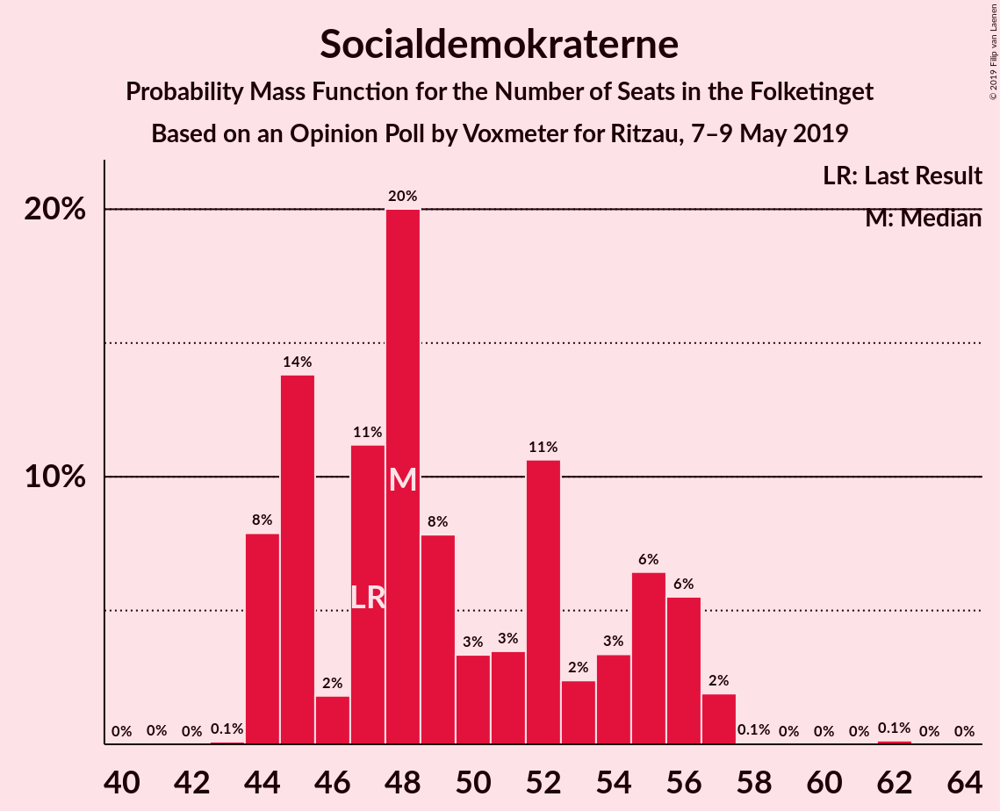

| Number of Seats | Probability | Accumulated | Special Marks |
|:---------------:|:-----------:|:-----------:|:-------------:|
| 41 | 0% | 100% |  |
| 42 | 0% | 99.9% |  |
| 43 | 0.1% | 99.9% |  |
| 44 | 8% | 99.8% |  |
| 45 | 14% | 92% |  |
| 46 | 2% | 78% |  |
| 47 | 11% | 76% | Last Result |
| 48 | 20% | 65% | Median |
| 49 | 8% | 45% |  |
| 50 | 3% | 37% |  |
| 51 | 3% | 34% |  |
| 52 | 11% | 30% |  |
| 53 | 2% | 20% |  |
| 54 | 3% | 17% |  |
| 55 | 6% | 14% |  |
| 56 | 6% | 8% |  |
| 57 | 2% | 2% |  |
| 58 | 0.1% | 0.2% |  |
| 59 | 0% | 0.2% |  |
| 60 | 0% | 0.2% |  |
| 61 | 0% | 0.1% |  |
| 62 | 0.1% | 0.1% |  |
| 63 | 0% | 0% |  |

### Venstre

*For a full overview of the results for this party, see the [Venstre](party-venstre.html) page.*

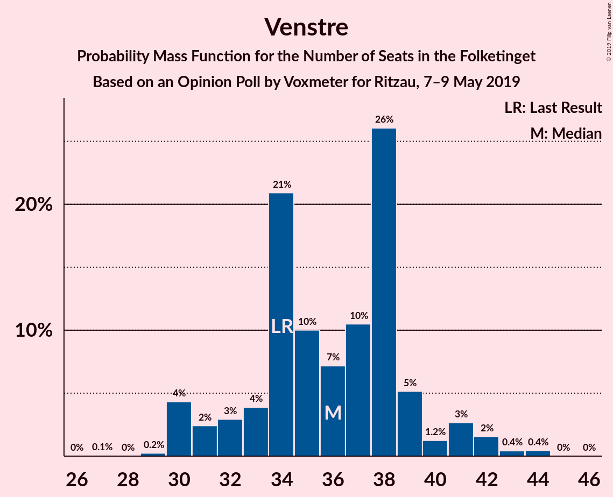

| Number of Seats | Probability | Accumulated | Special Marks |
|:---------------:|:-----------:|:-----------:|:-------------:|
| 27 | 0.1% | 100% |  |
| 28 | 0% | 99.9% |  |
| 29 | 0.2% | 99.9% |  |
| 30 | 4% | 99.7% |  |
| 31 | 2% | 95% |  |
| 32 | 3% | 93% |  |
| 33 | 4% | 90% |  |
| 34 | 21% | 86% | Last Result |
| 35 | 10% | 65% |  |
| 36 | 7% | 55% | Median |
| 37 | 10% | 48% |  |
| 38 | 26% | 38% |  |
| 39 | 5% | 11% |  |
| 40 | 1.2% | 6% |  |
| 41 | 3% | 5% |  |
| 42 | 2% | 2% |  |
| 43 | 0.4% | 0.9% |  |
| 44 | 0.4% | 0.5% |  |
| 45 | 0% | 0% |  |

### Dansk Folkeparti

*For a full overview of the results for this party, see the [Dansk Folkeparti](party-danskfolkeparti.html) page.*

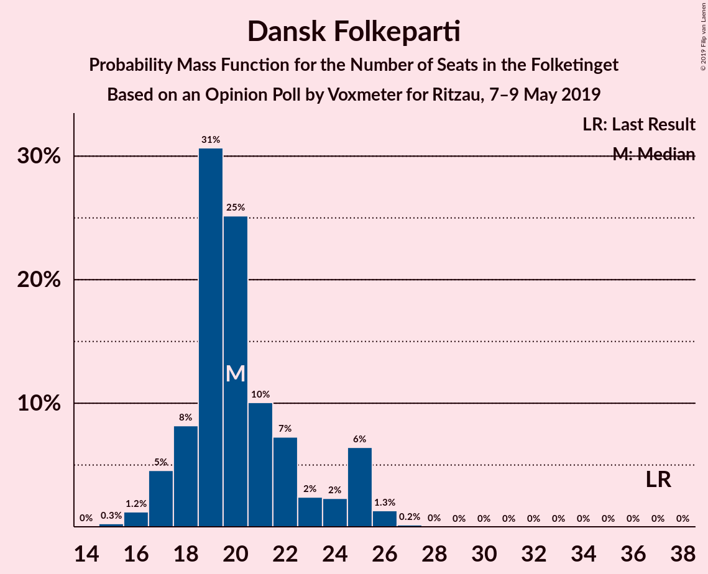

| Number of Seats | Probability | Accumulated | Special Marks |
|:---------------:|:-----------:|:-----------:|:-------------:|
| 15 | 0.3% | 100% |  |
| 16 | 1.2% | 99.7% |  |
| 17 | 5% | 98.5% |  |
| 18 | 8% | 94% |  |
| 19 | 31% | 86% |  |
| 20 | 25% | 55% | Median |
| 21 | 10% | 30% |  |
| 22 | 7% | 20% |  |
| 23 | 2% | 13% |  |
| 24 | 2% | 10% |  |
| 25 | 6% | 8% |  |
| 26 | 1.3% | 1.5% |  |
| 27 | 0.2% | 0.2% |  |
| 28 | 0% | 0% |  |
| 29 | 0% | 0% |  |
| 30 | 0% | 0% |  |
| 31 | 0% | 0% |  |
| 32 | 0% | 0% |  |
| 33 | 0% | 0% |  |
| 34 | 0% | 0% |  |
| 35 | 0% | 0% |  |
| 36 | 0% | 0% |  |
| 37 | 0% | 0% | Last Result |

### Enhedslisten–De Rød-Grønne

*For a full overview of the results for this party, see the [Enhedslisten–De Rød-Grønne](party-enhedslisten–derød-grønne.html) page.*

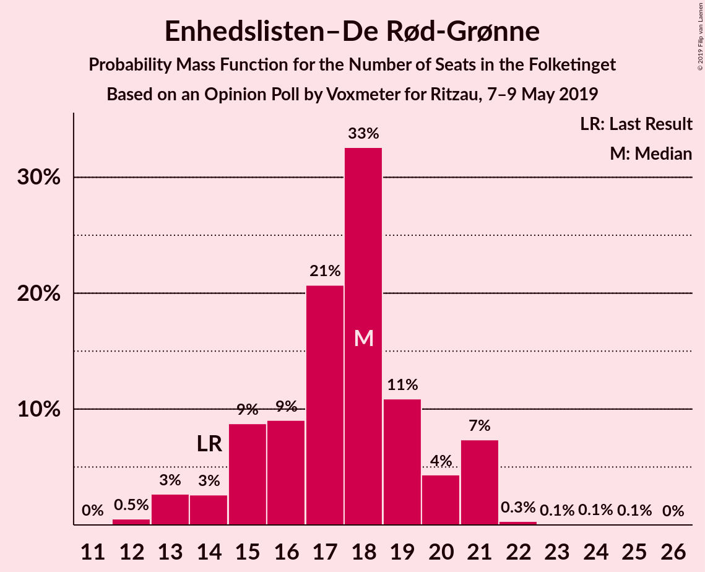

| Number of Seats | Probability | Accumulated | Special Marks |
|:---------------:|:-----------:|:-----------:|:-------------:|
| 12 | 0.5% | 100% |  |
| 13 | 3% | 99.4% |  |
| 14 | 3% | 97% | Last Result |
| 15 | 9% | 94% |  |
| 16 | 9% | 85% |  |
| 17 | 21% | 76% |  |
| 18 | 33% | 56% | Median |
| 19 | 11% | 23% |  |
| 20 | 4% | 12% |  |
| 21 | 7% | 8% |  |
| 22 | 0.3% | 0.5% |  |
| 23 | 0.1% | 0.2% |  |
| 24 | 0.1% | 0.1% |  |
| 25 | 0.1% | 0.1% |  |
| 26 | 0% | 0% |  |

### Radikale Venstre

*For a full overview of the results for this party, see the [Radikale Venstre](party-radikalevenstre.html) page.*

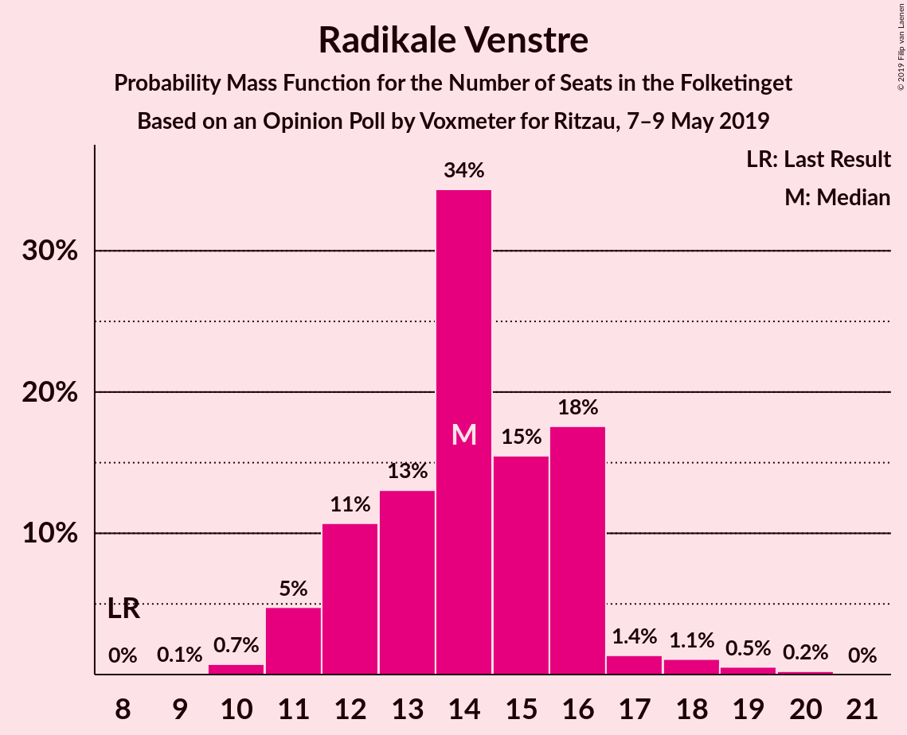

| Number of Seats | Probability | Accumulated | Special Marks |
|:---------------:|:-----------:|:-----------:|:-------------:|
| 8 | 0% | 100% | Last Result |
| 9 | 0.1% | 100% |  |
| 10 | 0.7% | 99.9% |  |
| 11 | 5% | 99.2% |  |
| 12 | 11% | 94% |  |
| 13 | 13% | 84% |  |
| 14 | 34% | 71% | Median |
| 15 | 15% | 36% |  |
| 16 | 18% | 21% |  |
| 17 | 1.4% | 3% |  |
| 18 | 1.1% | 2% |  |
| 19 | 0.5% | 0.8% |  |
| 20 | 0.2% | 0.2% |  |
| 21 | 0% | 0% |  |

### Socialistisk Folkeparti

*For a full overview of the results for this party, see the [Socialistisk Folkeparti](party-socialistiskfolkeparti.html) page.*

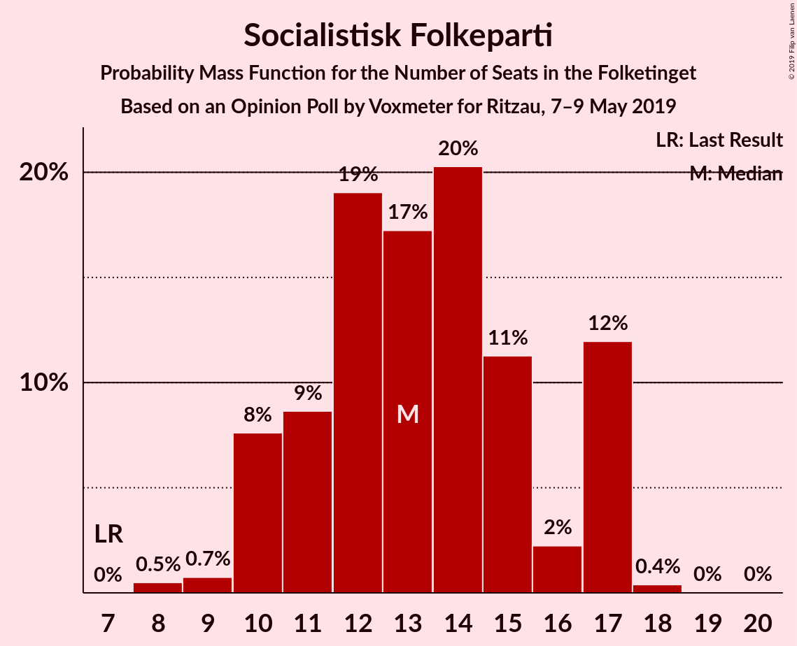

| Number of Seats | Probability | Accumulated | Special Marks |
|:---------------:|:-----------:|:-----------:|:-------------:|
| 7 | 0% | 100% | Last Result |
| 8 | 0.5% | 100% |  |
| 9 | 0.7% | 99.5% |  |
| 10 | 8% | 98.8% |  |
| 11 | 9% | 91% |  |
| 12 | 19% | 82% |  |
| 13 | 17% | 63% | Median |
| 14 | 20% | 46% |  |
| 15 | 11% | 26% |  |
| 16 | 2% | 15% |  |
| 17 | 12% | 12% |  |
| 18 | 0.4% | 0.5% |  |
| 19 | 0% | 0.1% |  |
| 20 | 0% | 0% |  |

### Liberal Alliance

*For a full overview of the results for this party, see the [Liberal Alliance](party-liberalalliance.html) page.*

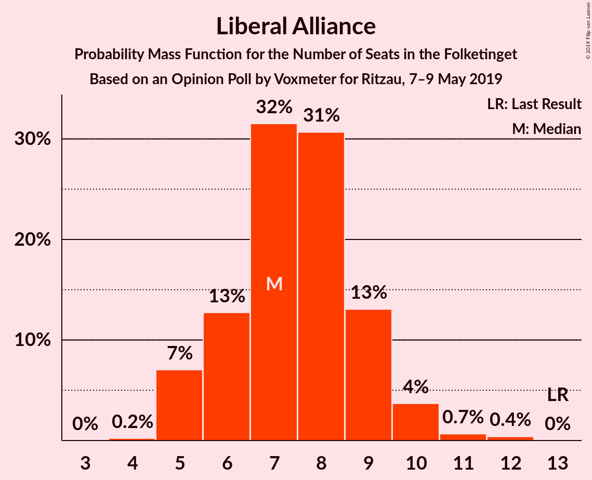

| Number of Seats | Probability | Accumulated | Special Marks |
|:---------------:|:-----------:|:-----------:|:-------------:|
| 4 | 0.2% | 100% |  |
| 5 | 7% | 99.8% |  |
| 6 | 13% | 93% |  |
| 7 | 32% | 80% | Median |
| 8 | 31% | 48% |  |
| 9 | 13% | 18% |  |
| 10 | 4% | 5% |  |
| 11 | 0.7% | 1.1% |  |
| 12 | 0.4% | 0.4% |  |
| 13 | 0% | 0% | Last Result |

### Det Konservative Folkeparti

*For a full overview of the results for this party, see the [Det Konservative Folkeparti](party-detkonservativefolkeparti.html) page.*

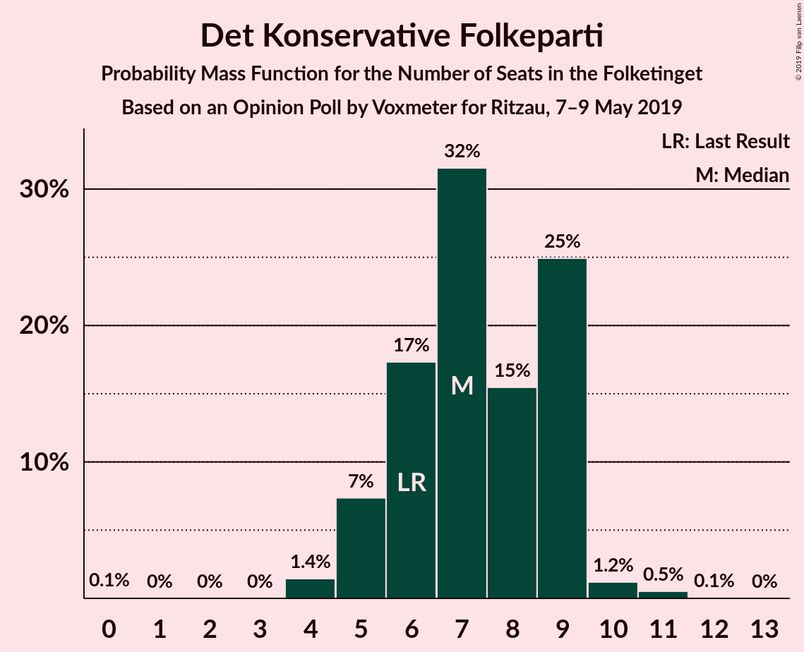

| Number of Seats | Probability | Accumulated | Special Marks |
|:---------------:|:-----------:|:-----------:|:-------------:|
| 0 | 0.1% | 100% |  |
| 1 | 0% | 99.9% |  |
| 2 | 0% | 99.9% |  |
| 3 | 0% | 99.9% |  |
| 4 | 1.4% | 99.9% |  |
| 5 | 7% | 98% |  |
| 6 | 17% | 91% | Last Result |
| 7 | 32% | 74% | Median |
| 8 | 15% | 42% |  |
| 9 | 25% | 27% |  |
| 10 | 1.2% | 2% |  |
| 11 | 0.5% | 0.6% |  |
| 12 | 0.1% | 0.1% |  |
| 13 | 0% | 0% |  |

### Alternativet

*For a full overview of the results for this party, see the [Alternativet](party-alternativet.html) page.*

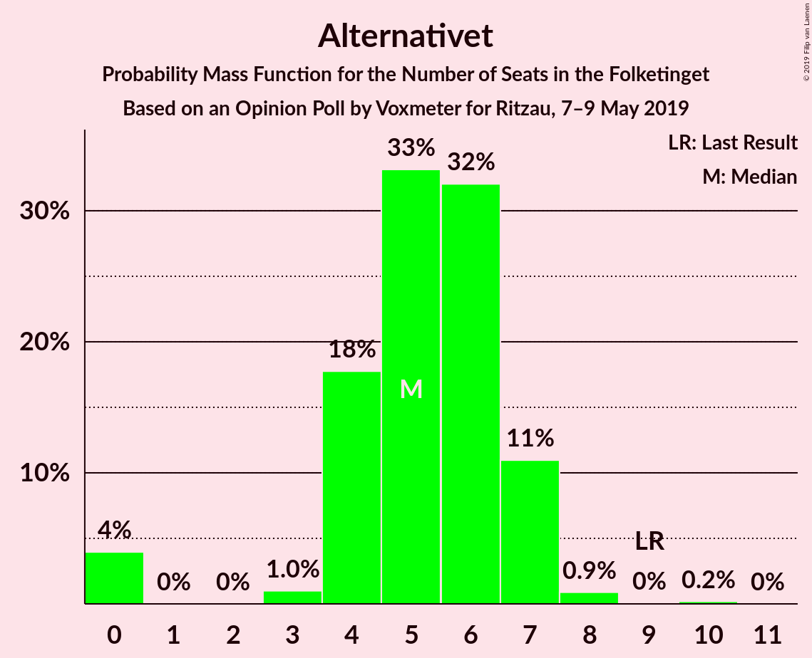

| Number of Seats | Probability | Accumulated | Special Marks |
|:---------------:|:-----------:|:-----------:|:-------------:|
| 0 | 4% | 100% |  |
| 1 | 0% | 96% |  |
| 2 | 0% | 96% |  |
| 3 | 1.0% | 96% |  |
| 4 | 18% | 95% |  |
| 5 | 33% | 77% | Median |
| 6 | 32% | 44% |  |
| 7 | 11% | 12% |  |
| 8 | 0.9% | 1.1% |  |
| 9 | 0% | 0.2% | Last Result |
| 10 | 0.2% | 0.2% |  |
| 11 | 0% | 0% |  |

### Kristendemokraterne

*For a full overview of the results for this party, see the [Kristendemokraterne](party-kristendemokraterne.html) page.*

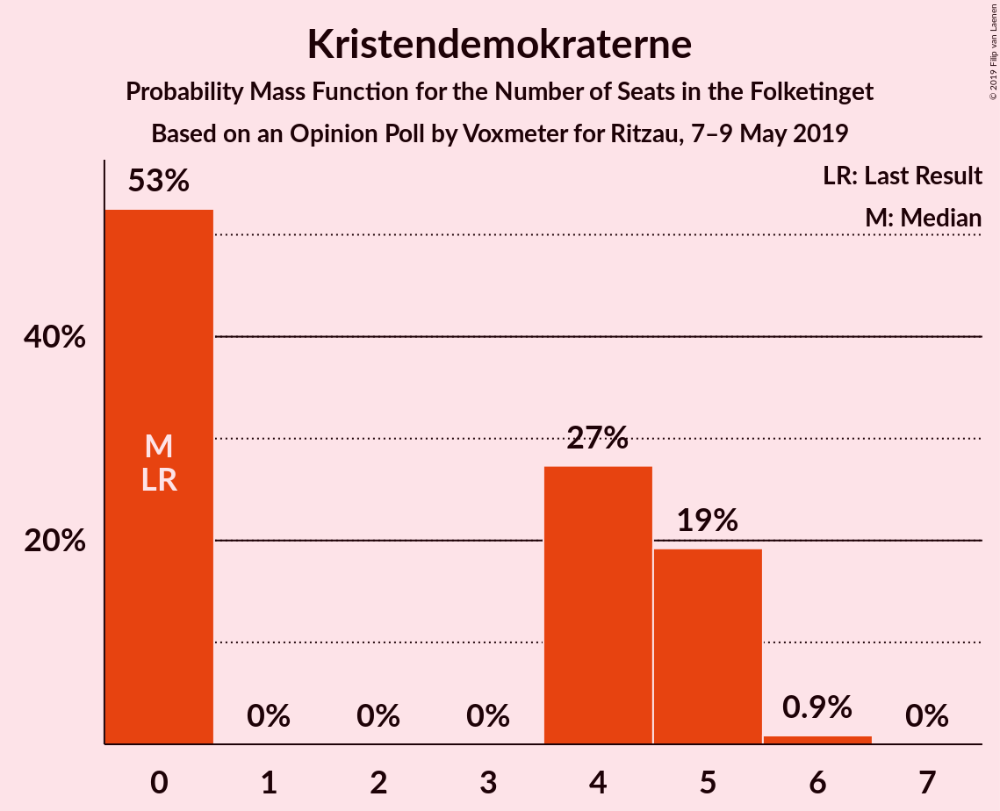

| Number of Seats | Probability | Accumulated | Special Marks |
|:---------------:|:-----------:|:-----------:|:-------------:|
| 0 | 53% | 100% | Last Result, Median |
| 1 | 0% | 47% |  |
| 2 | 0% | 47% |  |
| 3 | 0% | 47% |  |
| 4 | 27% | 47% |  |
| 5 | 19% | 20% |  |
| 6 | 0.9% | 0.9% |  |
| 7 | 0% | 0% |  |

### Nye Borgerlige

*For a full overview of the results for this party, see the [Nye Borgerlige](party-nyeborgerlige.html) page.*

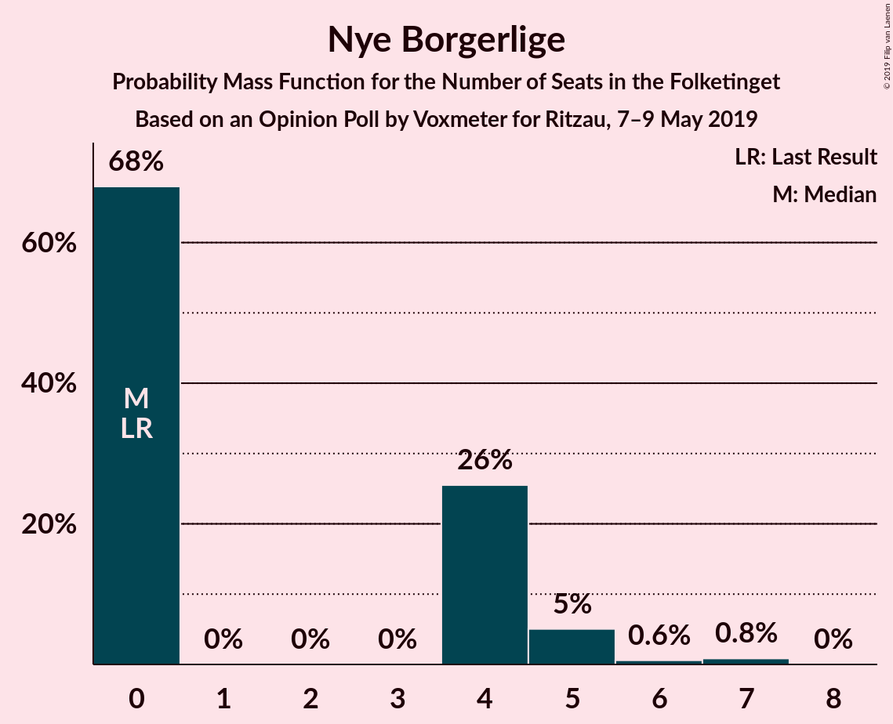

| Number of Seats | Probability | Accumulated | Special Marks |
|:---------------:|:-----------:|:-----------:|:-------------:|
| 0 | 68% | 100% | Last Result, Median |
| 1 | 0% | 32% |  |
| 2 | 0% | 32% |  |
| 3 | 0% | 32% |  |
| 4 | 26% | 32% |  |
| 5 | 5% | 7% |  |
| 6 | 0.6% | 1.5% |  |
| 7 | 0.8% | 0.9% |  |
| 8 | 0% | 0% |  |

### Stram Kurs

*For a full overview of the results for this party, see the [Stram Kurs](party-stramkurs.html) page.*

| Number of Seats | Probability | Accumulated | Special Marks |
|:---------------:|:-----------:|:-----------:|:-------------:|
| 0 | 70% | 100% | Last Result, Median |
| 1 | 0% | 30% |  |
| 2 | 0% | 30% |  |
| 3 | 0% | 30% |  |
| 4 | 28% | 30% |  |
| 5 | 2% | 2% |  |
| 6 | 0.5% | 0.6% |  |
| 7 | 0% | 0% |  |

### Klaus Riskær Pedersen

*For a full overview of the results for this party, see the [Klaus Riskær Pedersen](party-klausriskærpedersen.html) page.*

| Number of Seats | Probability | Accumulated | Special Marks |
|:---------------:|:-----------:|:-----------:|:-------------:|
| 0 | 100% | 100% | Last Result, Median |

## Coalitions

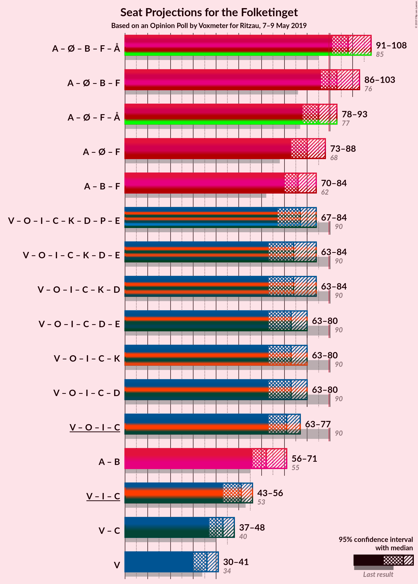

### Confidence Intervals

| Coalition | Last Result | Median | Majority? | 80% Confidence Interval | 90% Confidence Interval | 95% Confidence Interval | 99% Confidence Interval |
|:---------:|:-----------:|:------:|:---------:|:-----------------------:|:-----------------------:|:-----------------------:|:-----------------------:|
| Socialdemokraterne – Enhedslisten–De Rød-Grønne – Radikale Venstre – Socialistisk Folkeparti – Alternativet | 85 | 98 | 99.9% | 95–105 | 93–107 | 91–108 | 91–108 |
| Socialdemokraterne – Enhedslisten–De Rød-Grønne – Radikale Venstre – Socialistisk Folkeparti | 76 | 93 | 92% | 90–101 | 87–102 | 86–103 | 86–103 |
| Socialdemokraterne – Enhedslisten–De Rød-Grønne – Socialistisk Folkeparti – Alternativet | 77 | 85 | 19% | 81–92 | 80–93 | 78–93 | 78–93 |
| Socialdemokraterne – Enhedslisten–De Rød-Grønne – Socialistisk Folkeparti | 68 | 80 | 0.1% | 75–87 | 75–88 | 73–88 | 73–89 |
| Socialdemokraterne – Radikale Venstre – Socialistisk Folkeparti | 62 | 76 | 0% | 73–82 | 71–84 | 70–84 | 70–86 |
| Venstre – Dansk Folkeparti – Liberal Alliance – Det Konservative Folkeparti – Kristendemokraterne – Nye Borgerlige – Stram Kurs – Klaus Riskær Pedersen | 90 | 77 | 0% | 70–80 | 68–82 | 67–84 | 67–84 |
| Venstre – Dansk Folkeparti – Liberal Alliance – Det Konservative Folkeparti – Kristendemokraterne – Nye Borgerlige – Klaus Riskær Pedersen | 90 | 74 | 0% | 69–78 | 67–80 | 63–84 | 63–84 |
| Venstre – Dansk Folkeparti – Liberal Alliance – Det Konservative Folkeparti – Kristendemokraterne – Nye Borgerlige | 90 | 74 | 0% | 69–78 | 67–80 | 63–84 | 63–84 |
| Venstre – Dansk Folkeparti – Liberal Alliance – Det Konservative Folkeparti – Nye Borgerlige – Klaus Riskær Pedersen | 90 | 73 | 0% | 68–77 | 66–79 | 63–80 | 63–81 |
| Venstre – Dansk Folkeparti – Liberal Alliance – Det Konservative Folkeparti – Kristendemokraterne | 90 | 73 | 0% | 67–78 | 64–78 | 63–80 | 63–82 |
| Venstre – Dansk Folkeparti – Liberal Alliance – Det Konservative Folkeparti – Nye Borgerlige | 90 | 73 | 0% | 68–77 | 66–79 | 63–80 | 63–81 |
| Venstre – Dansk Folkeparti – Liberal Alliance – Det Konservative Folkeparti | 90 | 71 | 0% | 66–76 | 64–77 | 63–77 | 63–78 |
| Socialdemokraterne – Radikale Venstre | 55 | 62 | 0% | 60–69 | 59–71 | 56–71 | 56–72 |
| Venstre – Liberal Alliance – Det Konservative Folkeparti | 53 | 51 | 0% | 47–55 | 44–55 | 43–56 | 43–59 |
| Venstre – Det Konservative Folkeparti | 40 | 43 | 0% | 39–47 | 37–48 | 37–48 | 37–51 |
| Venstre | 34 | 36 | 0% | 33–39 | 31–41 | 30–41 | 30–43 |

### Socialdemokraterne – Enhedslisten–De Rød-Grønne – Radikale Venstre – Socialistisk Folkeparti – Alternativet

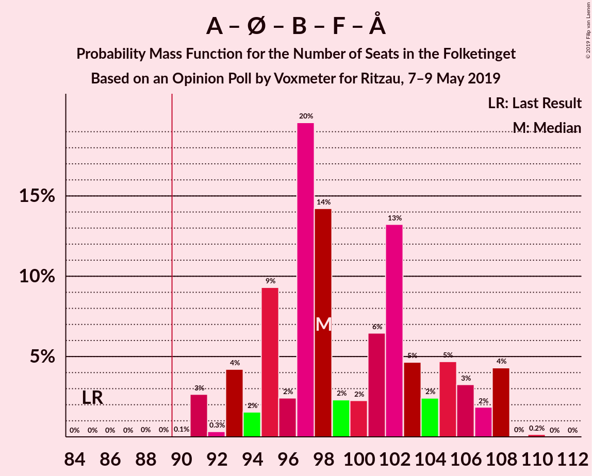

| Number of Seats | Probability | Accumulated | Special Marks |
|:---------------:|:-----------:|:-----------:|:-------------:|
| 85 | 0% | 100% | Last Result |
| 86 | 0% | 100% |  |
| 87 | 0% | 100% |  |
| 88 | 0% | 100% |  |
| 89 | 0% | 100% |  |
| 90 | 0.1% | 99.9% | Majority |
| 91 | 3% | 99.9% |  |
| 92 | 0.3% | 97% |  |
| 93 | 4% | 97% |  |
| 94 | 2% | 93% |  |
| 95 | 9% | 91% |  |
| 96 | 2% | 82% |  |
| 97 | 20% | 79% |  |
| 98 | 14% | 60% | Median |
| 99 | 2% | 46% |  |
| 100 | 2% | 43% |  |
| 101 | 6% | 41% |  |
| 102 | 13% | 35% |  |
| 103 | 5% | 21% |  |
| 104 | 2% | 17% |  |
| 105 | 5% | 14% |  |
| 106 | 3% | 10% |  |
| 107 | 2% | 6% |  |
| 108 | 4% | 5% |  |
| 109 | 0% | 0.2% |  |
| 110 | 0.2% | 0.2% |  |
| 111 | 0% | 0% |  |

### Socialdemokraterne – Enhedslisten–De Rød-Grønne – Radikale Venstre – Socialistisk Folkeparti

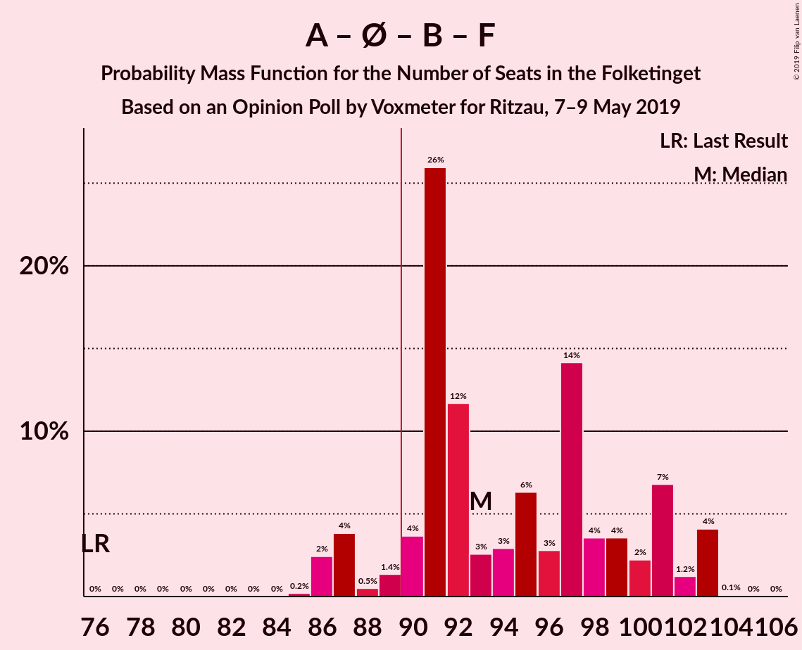

| Number of Seats | Probability | Accumulated | Special Marks |
|:---------------:|:-----------:|:-----------:|:-------------:|
| 76 | 0% | 100% | Last Result |
| 77 | 0% | 100% |  |
| 78 | 0% | 100% |  |
| 79 | 0% | 100% |  |
| 80 | 0% | 100% |  |
| 81 | 0% | 100% |  |
| 82 | 0% | 100% |  |
| 83 | 0% | 100% |  |
| 84 | 0% | 100% |  |
| 85 | 0.2% | 99.9% |  |
| 86 | 2% | 99.7% |  |
| 87 | 4% | 97% |  |
| 88 | 0.5% | 93% |  |
| 89 | 1.4% | 93% |  |
| 90 | 4% | 92% | Majority |
| 91 | 26% | 88% |  |
| 92 | 12% | 62% |  |
| 93 | 3% | 50% | Median |
| 94 | 3% | 48% |  |
| 95 | 6% | 45% |  |
| 96 | 3% | 39% |  |
| 97 | 14% | 36% |  |
| 98 | 4% | 22% |  |
| 99 | 4% | 18% |  |
| 100 | 2% | 14% |  |
| 101 | 7% | 12% |  |
| 102 | 1.2% | 5% |  |
| 103 | 4% | 4% |  |
| 104 | 0.1% | 0.1% |  |
| 105 | 0% | 0% |  |

### Socialdemokraterne – Enhedslisten–De Rød-Grønne – Socialistisk Folkeparti – Alternativet

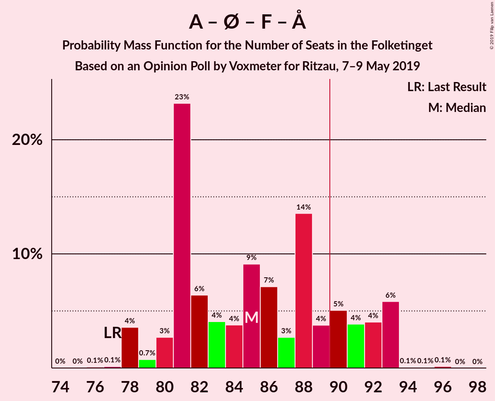

| Number of Seats | Probability | Accumulated | Special Marks |
|:---------------:|:-----------:|:-----------:|:-------------:|
| 75 | 0% | 100% |  |
| 76 | 0.1% | 99.9% |  |
| 77 | 0.1% | 99.8% | Last Result |
| 78 | 4% | 99.7% |  |
| 79 | 0.7% | 96% |  |
| 80 | 3% | 95% |  |
| 81 | 23% | 93% |  |
| 82 | 6% | 70% |  |
| 83 | 4% | 63% |  |
| 84 | 4% | 59% | Median |
| 85 | 9% | 55% |  |
| 86 | 7% | 46% |  |
| 87 | 3% | 39% |  |
| 88 | 14% | 36% |  |
| 89 | 4% | 23% |  |
| 90 | 5% | 19% | Majority |
| 91 | 4% | 14% |  |
| 92 | 4% | 10% |  |
| 93 | 6% | 6% |  |
| 94 | 0.1% | 0.3% |  |
| 95 | 0.1% | 0.2% |  |
| 96 | 0.1% | 0.2% |  |
| 97 | 0% | 0% |  |

### Socialdemokraterne – Enhedslisten–De Rød-Grønne – Socialistisk Folkeparti

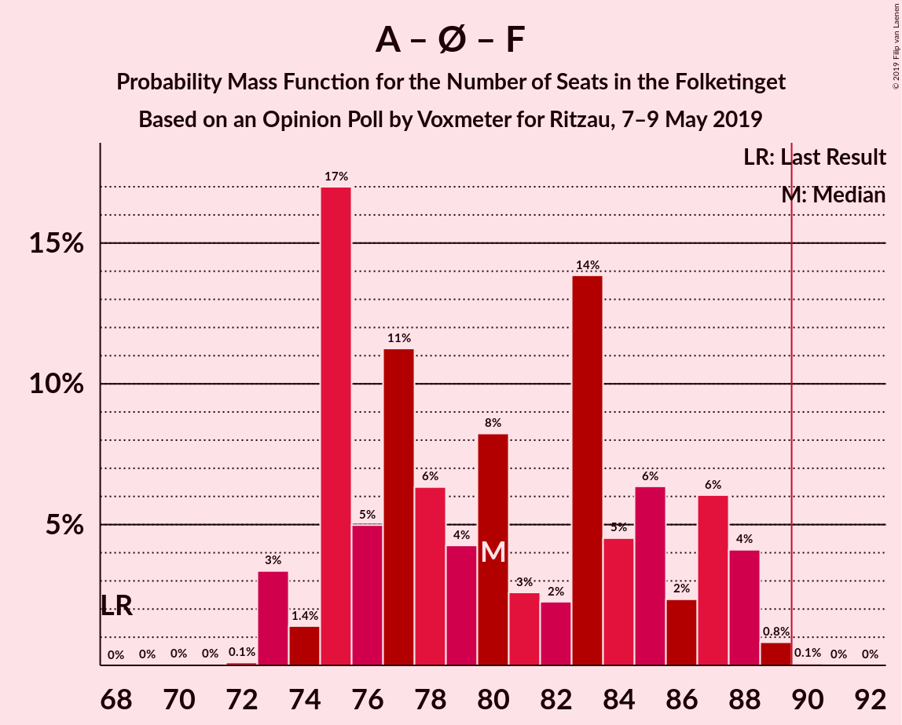

| Number of Seats | Probability | Accumulated | Special Marks |
|:---------------:|:-----------:|:-----------:|:-------------:|
| 68 | 0% | 100% | Last Result |
| 69 | 0% | 100% |  |
| 70 | 0% | 100% |  |
| 71 | 0% | 100% |  |
| 72 | 0.1% | 99.9% |  |
| 73 | 3% | 99.8% |  |
| 74 | 1.4% | 96% |  |
| 75 | 17% | 95% |  |
| 76 | 5% | 78% |  |
| 77 | 11% | 73% |  |
| 78 | 6% | 62% |  |
| 79 | 4% | 55% | Median |
| 80 | 8% | 51% |  |
| 81 | 3% | 43% |  |
| 82 | 2% | 40% |  |
| 83 | 14% | 38% |  |
| 84 | 5% | 24% |  |
| 85 | 6% | 20% |  |
| 86 | 2% | 13% |  |
| 87 | 6% | 11% |  |
| 88 | 4% | 5% |  |
| 89 | 0.8% | 0.9% |  |
| 90 | 0.1% | 0.1% | Majority |
| 91 | 0% | 0% |  |

### Socialdemokraterne – Radikale Venstre – Socialistisk Folkeparti

| Number of Seats | Probability | Accumulated | Special Marks |
|:---------------:|:-----------:|:-----------:|:-------------:|
| 62 | 0% | 100% | Last Result |
| 63 | 0% | 100% |  |
| 64 | 0% | 100% |  |
| 65 | 0% | 100% |  |
| 66 | 0% | 100% |  |
| 67 | 0% | 100% |  |
| 68 | 0.3% | 100% |  |
| 69 | 0.1% | 99.7% |  |
| 70 | 3% | 99.6% |  |
| 71 | 3% | 97% |  |
| 72 | 4% | 94% |  |
| 73 | 16% | 90% |  |
| 74 | 12% | 75% |  |
| 75 | 8% | 62% | Median |
| 76 | 6% | 55% |  |
| 77 | 7% | 49% |  |
| 78 | 5% | 41% |  |
| 79 | 15% | 37% |  |
| 80 | 6% | 22% |  |
| 81 | 2% | 15% |  |
| 82 | 5% | 13% |  |
| 83 | 3% | 9% |  |
| 84 | 5% | 6% |  |
| 85 | 0.4% | 1.3% |  |
| 86 | 0.8% | 0.9% |  |
| 87 | 0% | 0.1% |  |
| 88 | 0% | 0% |  |

### Venstre – Dansk Folkeparti – Liberal Alliance – Det Konservative Folkeparti – Kristendemokraterne – Nye Borgerlige – Stram Kurs – Klaus Riskær Pedersen

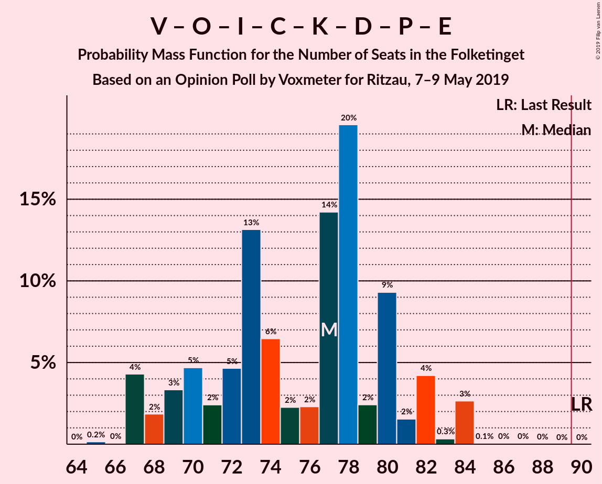

| Number of Seats | Probability | Accumulated | Special Marks |
|:---------------:|:-----------:|:-----------:|:-------------:|
| 65 | 0.2% | 100% |  |
| 66 | 0% | 99.8% |  |
| 67 | 4% | 99.8% |  |
| 68 | 2% | 95% |  |
| 69 | 3% | 94% |  |
| 70 | 5% | 90% | Median |
| 71 | 2% | 86% |  |
| 72 | 5% | 83% |  |
| 73 | 13% | 79% |  |
| 74 | 6% | 65% |  |
| 75 | 2% | 59% |  |
| 76 | 2% | 57% |  |
| 77 | 14% | 54% |  |
| 78 | 20% | 40% |  |
| 79 | 2% | 21% |  |
| 80 | 9% | 18% |  |
| 81 | 2% | 9% |  |
| 82 | 4% | 7% |  |
| 83 | 0.3% | 3% |  |
| 84 | 3% | 3% |  |
| 85 | 0.1% | 0.1% |  |
| 86 | 0% | 0.1% |  |
| 87 | 0% | 0% |  |
| 88 | 0% | 0% |  |
| 89 | 0% | 0% |  |
| 90 | 0% | 0% | Last Result, Majority |

### Venstre – Dansk Folkeparti – Liberal Alliance – Det Konservative Folkeparti – Kristendemokraterne – Nye Borgerlige – Klaus Riskær Pedersen

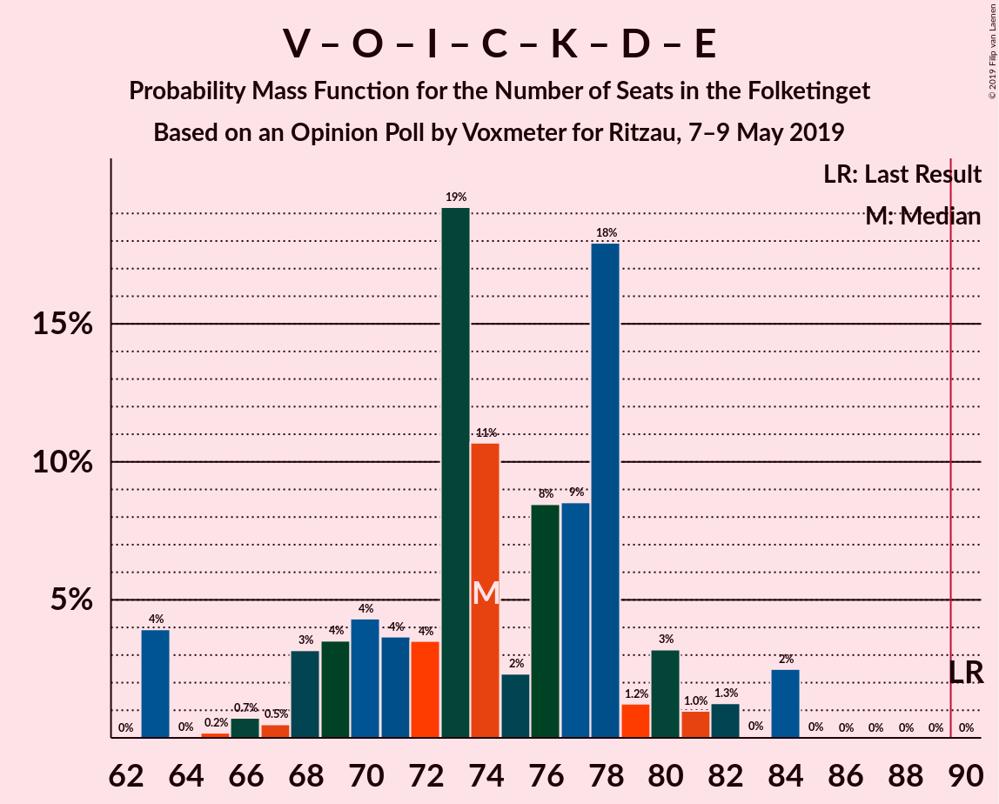

| Number of Seats | Probability | Accumulated | Special Marks |
|:---------------:|:-----------:|:-----------:|:-------------:|
| 63 | 4% | 100% |  |
| 64 | 0% | 96% |  |
| 65 | 0.2% | 96% |  |
| 66 | 0.7% | 96% |  |
| 67 | 0.5% | 95% |  |
| 68 | 3% | 95% |  |
| 69 | 4% | 91% |  |
| 70 | 4% | 88% | Median |
| 71 | 4% | 84% |  |
| 72 | 4% | 80% |  |
| 73 | 19% | 76% |  |
| 74 | 11% | 57% |  |
| 75 | 2% | 47% |  |
| 76 | 8% | 44% |  |
| 77 | 9% | 36% |  |
| 78 | 18% | 27% |  |
| 79 | 1.2% | 9% |  |
| 80 | 3% | 8% |  |
| 81 | 1.0% | 5% |  |
| 82 | 1.3% | 4% |  |
| 83 | 0% | 3% |  |
| 84 | 2% | 3% |  |
| 85 | 0% | 0% |  |
| 86 | 0% | 0% |  |
| 87 | 0% | 0% |  |
| 88 | 0% | 0% |  |
| 89 | 0% | 0% |  |
| 90 | 0% | 0% | Last Result, Majority |

### Venstre – Dansk Folkeparti – Liberal Alliance – Det Konservative Folkeparti – Kristendemokraterne – Nye Borgerlige

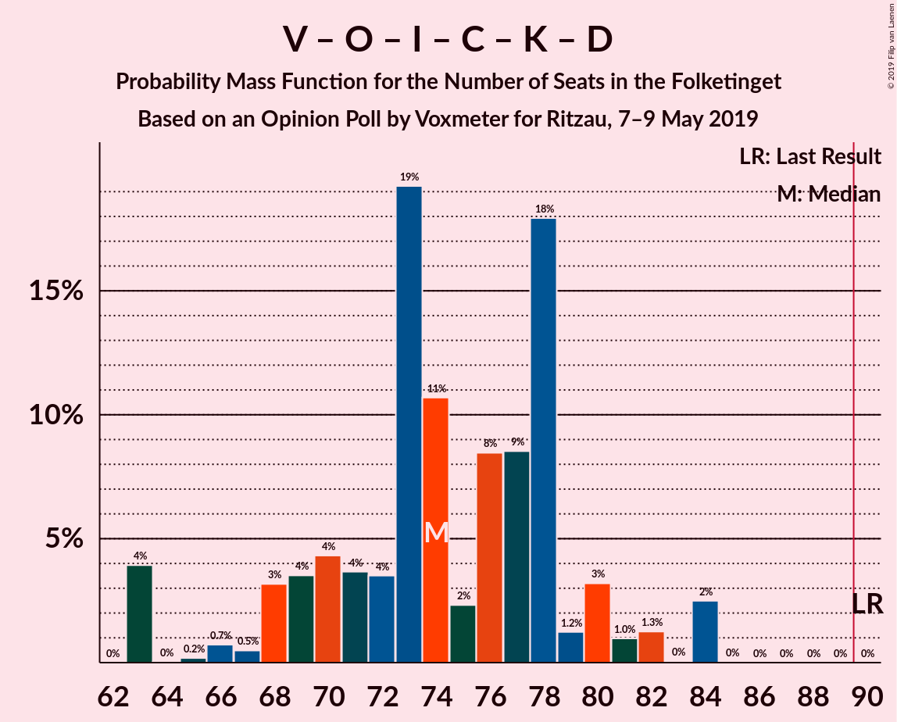

| Number of Seats | Probability | Accumulated | Special Marks |
|:---------------:|:-----------:|:-----------:|:-------------:|
| 63 | 4% | 100% |  |
| 64 | 0% | 96% |  |
| 65 | 0.2% | 96% |  |
| 66 | 0.7% | 96% |  |
| 67 | 0.5% | 95% |  |
| 68 | 3% | 95% |  |
| 69 | 4% | 91% |  |
| 70 | 4% | 88% | Median |
| 71 | 4% | 84% |  |
| 72 | 4% | 80% |  |
| 73 | 19% | 76% |  |
| 74 | 11% | 57% |  |
| 75 | 2% | 47% |  |
| 76 | 8% | 44% |  |
| 77 | 9% | 36% |  |
| 78 | 18% | 27% |  |
| 79 | 1.2% | 9% |  |
| 80 | 3% | 8% |  |
| 81 | 1.0% | 5% |  |
| 82 | 1.3% | 4% |  |
| 83 | 0% | 3% |  |
| 84 | 2% | 3% |  |
| 85 | 0% | 0% |  |
| 86 | 0% | 0% |  |
| 87 | 0% | 0% |  |
| 88 | 0% | 0% |  |
| 89 | 0% | 0% |  |
| 90 | 0% | 0% | Last Result, Majority |

### Venstre – Dansk Folkeparti – Liberal Alliance – Det Konservative Folkeparti – Nye Borgerlige – Klaus Riskær Pedersen

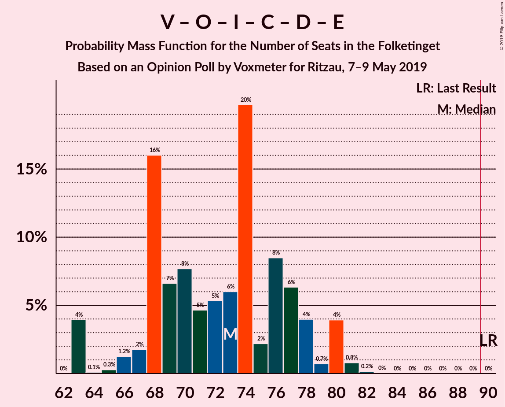

| Number of Seats | Probability | Accumulated | Special Marks |
|:---------------:|:-----------:|:-----------:|:-------------:|
| 63 | 4% | 100% |  |
| 64 | 0.1% | 96% |  |
| 65 | 0.3% | 96% |  |
| 66 | 1.2% | 96% |  |
| 67 | 2% | 94% |  |
| 68 | 16% | 93% |  |
| 69 | 7% | 77% |  |
| 70 | 8% | 70% | Median |
| 71 | 5% | 62% |  |
| 72 | 5% | 58% |  |
| 73 | 6% | 52% |  |
| 74 | 20% | 46% |  |
| 75 | 2% | 27% |  |
| 76 | 8% | 24% |  |
| 77 | 6% | 16% |  |
| 78 | 4% | 10% |  |
| 79 | 0.7% | 6% |  |
| 80 | 4% | 5% |  |
| 81 | 0.8% | 1.0% |  |
| 82 | 0.2% | 0.2% |  |
| 83 | 0% | 0% |  |
| 84 | 0% | 0% |  |
| 85 | 0% | 0% |  |
| 86 | 0% | 0% |  |
| 87 | 0% | 0% |  |
| 88 | 0% | 0% |  |
| 89 | 0% | 0% |  |
| 90 | 0% | 0% | Last Result, Majority |

### Venstre – Dansk Folkeparti – Liberal Alliance – Det Konservative Folkeparti – Kristendemokraterne

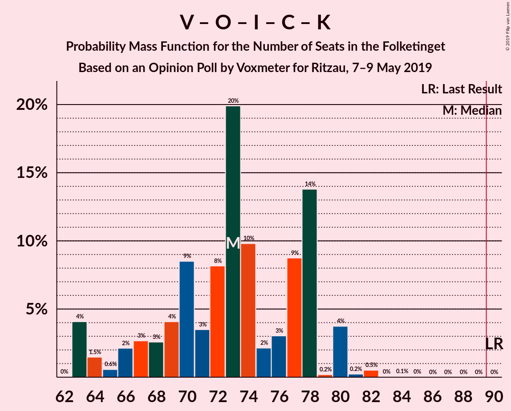

| Number of Seats | Probability | Accumulated | Special Marks |
|:---------------:|:-----------:|:-----------:|:-------------:|
| 63 | 4% | 100% |  |
| 64 | 1.5% | 96% |  |
| 65 | 0.6% | 94% |  |
| 66 | 2% | 94% |  |
| 67 | 3% | 92% |  |
| 68 | 3% | 89% |  |
| 69 | 4% | 86% |  |
| 70 | 9% | 82% | Median |
| 71 | 3% | 74% |  |
| 72 | 8% | 70% |  |
| 73 | 20% | 62% |  |
| 74 | 10% | 42% |  |
| 75 | 2% | 32% |  |
| 76 | 3% | 30% |  |
| 77 | 9% | 27% |  |
| 78 | 14% | 19% |  |
| 79 | 0.2% | 5% |  |
| 80 | 4% | 5% |  |
| 81 | 0.2% | 0.8% |  |
| 82 | 0.5% | 0.6% |  |
| 83 | 0% | 0.1% |  |
| 84 | 0.1% | 0.1% |  |
| 85 | 0% | 0% |  |
| 86 | 0% | 0% |  |
| 87 | 0% | 0% |  |
| 88 | 0% | 0% |  |
| 89 | 0% | 0% |  |
| 90 | 0% | 0% | Last Result, Majority |

### Venstre – Dansk Folkeparti – Liberal Alliance – Det Konservative Folkeparti – Nye Borgerlige

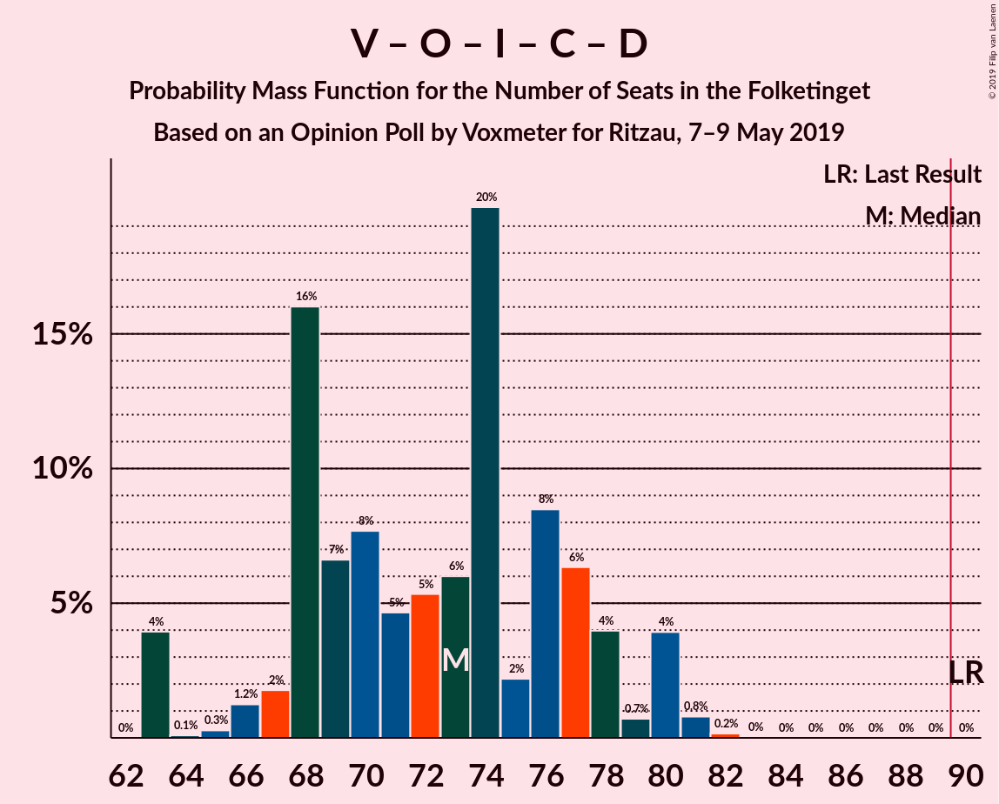

| Number of Seats | Probability | Accumulated | Special Marks |
|:---------------:|:-----------:|:-----------:|:-------------:|
| 63 | 4% | 100% |  |
| 64 | 0.1% | 96% |  |
| 65 | 0.3% | 96% |  |
| 66 | 1.2% | 96% |  |
| 67 | 2% | 94% |  |
| 68 | 16% | 93% |  |
| 69 | 7% | 77% |  |
| 70 | 8% | 70% | Median |
| 71 | 5% | 62% |  |
| 72 | 5% | 58% |  |
| 73 | 6% | 52% |  |
| 74 | 20% | 46% |  |
| 75 | 2% | 27% |  |
| 76 | 8% | 24% |  |
| 77 | 6% | 16% |  |
| 78 | 4% | 10% |  |
| 79 | 0.7% | 6% |  |
| 80 | 4% | 5% |  |
| 81 | 0.8% | 1.0% |  |
| 82 | 0.2% | 0.2% |  |
| 83 | 0% | 0% |  |
| 84 | 0% | 0% |  |
| 85 | 0% | 0% |  |
| 86 | 0% | 0% |  |
| 87 | 0% | 0% |  |
| 88 | 0% | 0% |  |
| 89 | 0% | 0% |  |
| 90 | 0% | 0% | Last Result, Majority |

### Venstre – Dansk Folkeparti – Liberal Alliance – Det Konservative Folkeparti

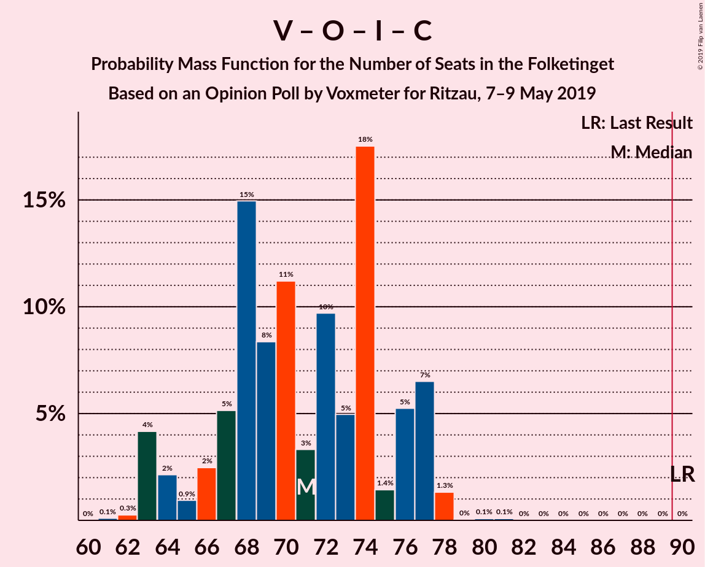

| Number of Seats | Probability | Accumulated | Special Marks |
|:---------------:|:-----------:|:-----------:|:-------------:|
| 61 | 0.1% | 100% |  |
| 62 | 0.3% | 99.9% |  |
| 63 | 4% | 99.6% |  |
| 64 | 2% | 95% |  |
| 65 | 0.9% | 93% |  |
| 66 | 2% | 92% |  |
| 67 | 5% | 90% |  |
| 68 | 15% | 85% |  |
| 69 | 8% | 70% |  |
| 70 | 11% | 61% | Median |
| 71 | 3% | 50% |  |
| 72 | 10% | 47% |  |
| 73 | 5% | 37% |  |
| 74 | 18% | 32% |  |
| 75 | 1.4% | 15% |  |
| 76 | 5% | 13% |  |
| 77 | 7% | 8% |  |
| 78 | 1.3% | 2% |  |
| 79 | 0% | 0.2% |  |
| 80 | 0.1% | 0.2% |  |
| 81 | 0.1% | 0.1% |  |
| 82 | 0% | 0% |  |
| 83 | 0% | 0% |  |
| 84 | 0% | 0% |  |
| 85 | 0% | 0% |  |
| 86 | 0% | 0% |  |
| 87 | 0% | 0% |  |
| 88 | 0% | 0% |  |
| 89 | 0% | 0% |  |
| 90 | 0% | 0% | Last Result, Majority |

### Socialdemokraterne – Radikale Venstre

| Number of Seats | Probability | Accumulated | Special Marks |
|:---------------:|:-----------:|:-----------:|:-------------:|
| 55 | 0.1% | 100% | Last Result |
| 56 | 3% | 99.9% |  |
| 57 | 0.8% | 97% |  |
| 58 | 0.3% | 97% |  |
| 59 | 4% | 96% |  |
| 60 | 5% | 92% |  |
| 61 | 25% | 87% |  |
| 62 | 17% | 62% | Median |
| 63 | 10% | 45% |  |
| 64 | 3% | 36% |  |
| 65 | 6% | 32% |  |
| 66 | 6% | 27% |  |
| 67 | 6% | 20% |  |
| 68 | 4% | 14% |  |
| 69 | 3% | 10% |  |
| 70 | 2% | 7% |  |
| 71 | 4% | 6% |  |
| 72 | 1.0% | 1.2% |  |
| 73 | 0.1% | 0.2% |  |
| 74 | 0% | 0.2% |  |
| 75 | 0% | 0.1% |  |
| 76 | 0.1% | 0.1% |  |
| 77 | 0% | 0% |  |

### Venstre – Liberal Alliance – Det Konservative Folkeparti

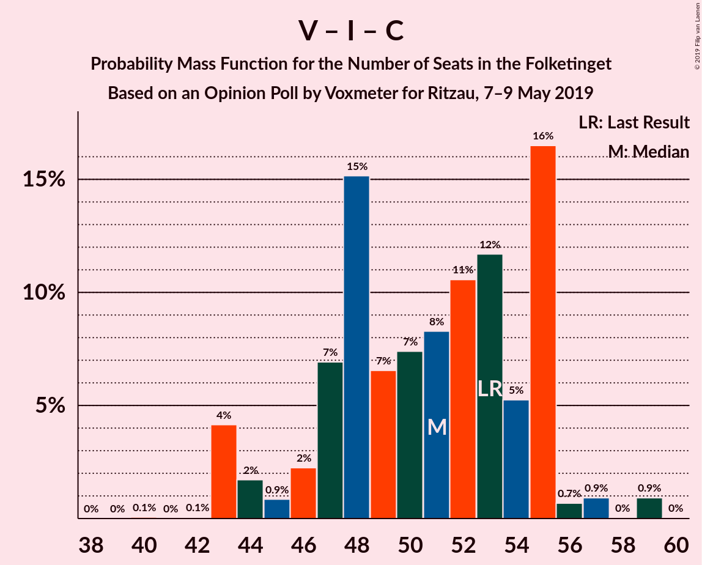

| Number of Seats | Probability | Accumulated | Special Marks |
|:---------------:|:-----------:|:-----------:|:-------------:|
| 40 | 0.1% | 100% |  |
| 41 | 0% | 99.9% |  |
| 42 | 0.1% | 99.9% |  |
| 43 | 4% | 99.9% |  |
| 44 | 2% | 96% |  |
| 45 | 0.9% | 94% |  |
| 46 | 2% | 93% |  |
| 47 | 7% | 91% |  |
| 48 | 15% | 84% |  |
| 49 | 7% | 69% |  |
| 50 | 7% | 62% | Median |
| 51 | 8% | 55% |  |
| 52 | 11% | 47% |  |
| 53 | 12% | 36% | Last Result |
| 54 | 5% | 24% |  |
| 55 | 16% | 19% |  |
| 56 | 0.7% | 3% |  |
| 57 | 0.9% | 2% |  |
| 58 | 0% | 1.0% |  |
| 59 | 0.9% | 0.9% |  |
| 60 | 0% | 0% |  |

### Venstre – Det Konservative Folkeparti

| Number of Seats | Probability | Accumulated | Special Marks |
|:---------------:|:-----------:|:-----------:|:-------------:|
| 34 | 0.1% | 100% |  |
| 35 | 0% | 99.9% |  |
| 36 | 0.1% | 99.8% |  |
| 37 | 5% | 99.7% |  |
| 38 | 0.7% | 95% |  |
| 39 | 5% | 94% |  |
| 40 | 4% | 89% | Last Result |
| 41 | 17% | 85% |  |
| 42 | 13% | 68% |  |
| 43 | 8% | 55% | Median |
| 44 | 11% | 47% |  |
| 45 | 10% | 37% |  |
| 46 | 2% | 27% |  |
| 47 | 19% | 25% |  |
| 48 | 3% | 6% |  |
| 49 | 0.8% | 2% |  |
| 50 | 0.9% | 2% |  |
| 51 | 0.6% | 0.7% |  |
| 52 | 0% | 0% |  |

### Venstre

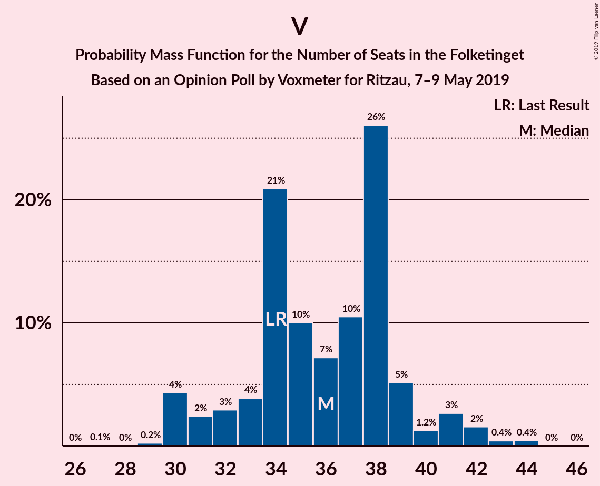

| Number of Seats | Probability | Accumulated | Special Marks |
|:---------------:|:-----------:|:-----------:|:-------------:|
| 27 | 0.1% | 100% |  |
| 28 | 0% | 99.9% |  |
| 29 | 0.2% | 99.9% |  |
| 30 | 4% | 99.7% |  |
| 31 | 2% | 95% |  |
| 32 | 3% | 93% |  |
| 33 | 4% | 90% |  |
| 34 | 21% | 86% | Last Result |
| 35 | 10% | 65% |  |
| 36 | 7% | 55% | Median |
| 37 | 10% | 48% |  |
| 38 | 26% | 38% |  |
| 39 | 5% | 11% |  |
| 40 | 1.2% | 6% |  |
| 41 | 3% | 5% |  |
| 42 | 2% | 2% |  |
| 43 | 0.4% | 0.9% |  |
| 44 | 0.4% | 0.5% |  |
| 45 | 0% | 0% |  |

## Technical Information

### Opinion Poll

+ **Polling firm:** Voxmeter
+ **Commissioner(s):** Ritzau
+ **Fieldwork period:** 7–9 May 2019

### Calculations

+ **Sample size:** 1011
+ **Simulations done:** 1,048,576
+ **Error estimate:** 2.09%

