# Opinion Poll by Megafon for Politiken and TV 2, 8–10 May 2019

<a href="#voting-intentions">Voting Intentions</a> | <a href="#seats">Seats</a> | <a href="#coalitions">Coalitions</a> | <a href="#technical-information">Technical Information</a>

## Voting Intentions

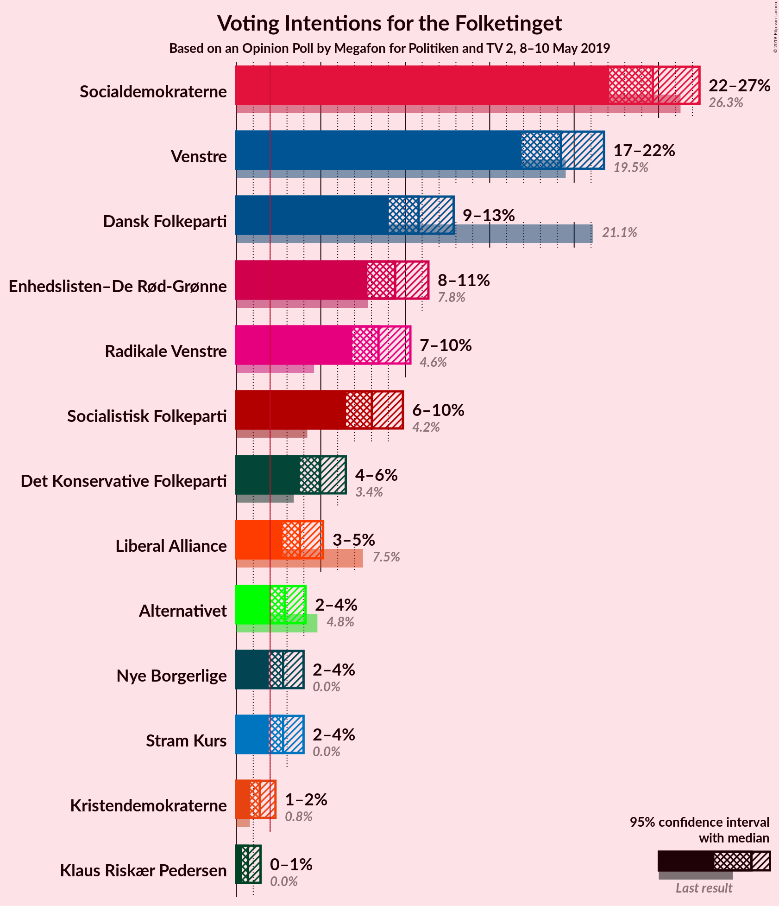

### Confidence Intervals

| Party | Last Result | Poll Result | 80% Confidence Interval | 90% Confidence Interval | 95% Confidence Interval | 99% Confidence Interval |
|:-----:|:-----------:|:-----------:|:-----------------------:|:-----------------------:|:-----------------------:|:-----------------------:|
| Socialdemokraterne | 26.3% | 24.7% | 23.0–26.5% |22.5–27.0% |22.1–27.4% |21.3–28.3% |
| Venstre | 19.5% | 19.2% | 17.7–20.9% |17.3–21.4% |16.9–21.8% |16.2–22.6% |
| Dansk Folkeparti | 21.1% | 10.8% | 9.6–12.1% |9.3–12.5% |9.0–12.9% |8.5–13.5% |
| Enhedslisten–De Rød-Grønne | 7.8% | 9.4% | 8.3–10.7% |8.0–11.1% |7.8–11.4% |7.3–12.0% |
| Radikale Venstre | 4.6% | 8.4% | 7.4–9.6% |7.1–10.0% |6.9–10.3% |6.4–10.9% |
| Socialistisk Folkeparti | 4.2% | 8.0% | 7.0–9.2% |6.7–9.6% |6.5–9.9% |6.1–10.5% |
| Det Konservative Folkeparti | 3.4% | 5.0% | 4.2–5.9% |3.9–6.2% |3.8–6.5% |3.4–7.0% |
| Liberal Alliance | 7.5% | 3.8% | 3.1–4.6% |2.9–4.9% |2.7–5.1% |2.5–5.6% |
| Alternativet | 4.8% | 2.9% | 2.3–3.7% |2.1–3.9% |2.0–4.1% |1.8–4.5% |
| Nye Borgerlige | 0.0% | 2.8% | 2.2–3.6% |2.1–3.8% |1.9–4.0% |1.7–4.4% |
| Stram Kurs | 0.0% | 2.8% | 2.2–3.6% |2.1–3.8% |1.9–4.0% |1.7–4.4% |
| Kristendemokraterne | 0.8% | 1.4% | 1.0–2.0% |0.9–2.2% |0.8–2.3% |0.7–2.7% |
| Klaus Riskær Pedersen | 0.0% | 0.7% | 0.5–1.2% |0.4–1.3% |0.3–1.4% |0.2–1.7% |

*Note:* The poll result column reflects the actual value used in the calculations. Published results may vary slightly, and in addition be rounded to fewer digits.

## Seats

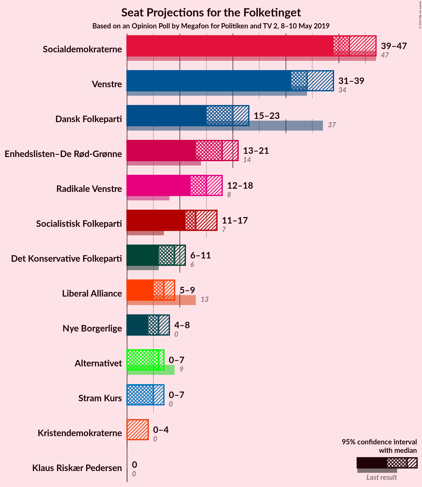

### Confidence Intervals

| Party | Last Result | Median | 80% Confidence Interval | 90% Confidence Interval | 95% Confidence Interval | 99% Confidence Interval |
|:-----:|:-----------:|:------:|:-----------------------:|:-----------------------:|:-----------------------:|:-----------------------:|
| <a href="#socialdemokraterne">Socialdemokraterne</a> | 47 | 42 | 42–45 |40–47 |39–47 |36–50 |
| <a href="#venstre">Venstre</a> | 34 | 34 | 31–37 |31–39 |31–39 |28–40 |
| <a href="#dansk-folkeparti">Dansk Folkeparti</a> | 37 | 20 | 18–22 |17–22 |15–23 |15–23 |
| <a href="#enhedslisten–de-rød-grønne">Enhedslisten–De Rød-Grønne</a> | 14 | 18 | 15–19 |14–19 |13–21 |13–22 |
| <a href="#radikale-venstre">Radikale Venstre</a> | 8 | 15 | 13–18 |12–18 |12–18 |12–20 |
| <a href="#socialistisk-folkeparti">Socialistisk Folkeparti</a> | 7 | 13 | 11–15 |11–16 |11–17 |11–18 |
| <a href="#det-konservative-folkeparti">Det Konservative Folkeparti</a> | 6 | 9 | 7–10 |7–11 |6–11 |6–12 |
| <a href="#liberal-alliance">Liberal Alliance</a> | 13 | 7 | 5–8 |5–9 |5–9 |5–10 |
| <a href="#alternativet">Alternativet</a> | 9 | 6 | 4–6 |4–7 |0–7 |0–8 |
| <a href="#nye-borgerlige">Nye Borgerlige</a> | 0 | 6 | 4–7 |4–7 |4–8 |0–9 |
| <a href="#stram-kurs">Stram Kurs</a> | 0 | 5 | 4–6 |4–7 |0–7 |0–8 |
| <a href="#kristendemokraterne">Kristendemokraterne</a> | 0 | 0 | 0 |0–4 |0–4 |0–5 |
| <a href="#klaus-riskær-pedersen">Klaus Riskær Pedersen</a> | 0 | 0 | 0 |0 |0 |0 |

### Socialdemokraterne

*For a full overview of the results for this party, see the [Socialdemokraterne](party-socialdemokraterne.html) page.*

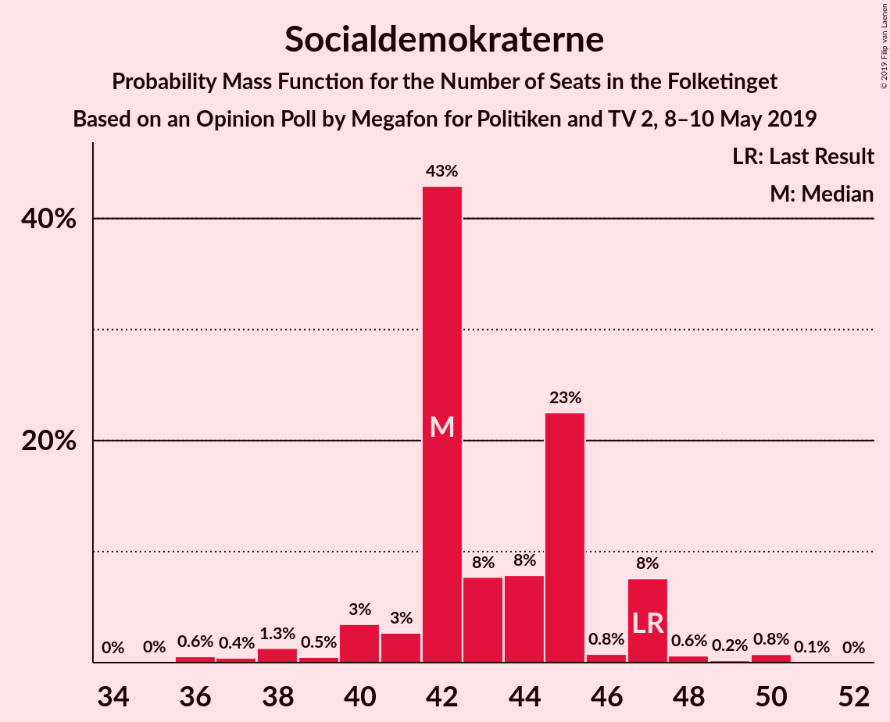

| Number of Seats | Probability | Accumulated | Special Marks |
|:---------------:|:-----------:|:-----------:|:-------------:|
| 35 | 0% | 100% |  |
| 36 | 0.6% | 99.9% |  |
| 37 | 0.4% | 99.4% |  |
| 38 | 1.3% | 98.9% |  |
| 39 | 0.5% | 98% |  |
| 40 | 3% | 97% |  |
| 41 | 3% | 94% |  |
| 42 | 43% | 91% | Median |
| 43 | 8% | 48% |  |
| 44 | 8% | 40% |  |
| 45 | 23% | 33% |  |
| 46 | 0.8% | 10% |  |
| 47 | 8% | 9% | Last Result |
| 48 | 0.6% | 2% |  |
| 49 | 0.2% | 1.0% |  |
| 50 | 0.8% | 0.8% |  |
| 51 | 0.1% | 0.1% |  |
| 52 | 0% | 0% |  |

### Venstre

*For a full overview of the results for this party, see the [Venstre](party-venstre.html) page.*

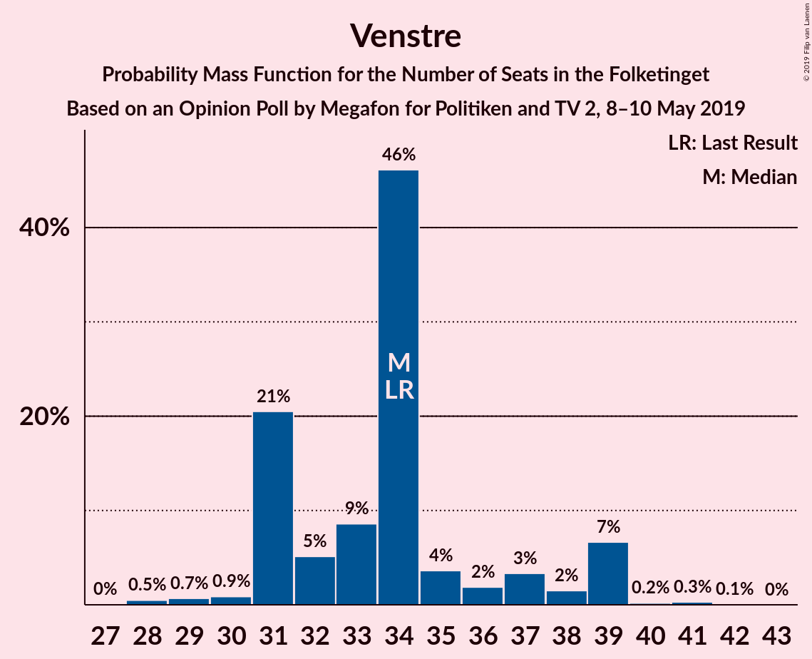

| Number of Seats | Probability | Accumulated | Special Marks |
|:---------------:|:-----------:|:-----------:|:-------------:|
| 27 | 0% | 100% |  |
| 28 | 0.5% | 99.9% |  |
| 29 | 0.7% | 99.5% |  |
| 30 | 0.9% | 98.8% |  |
| 31 | 21% | 98% |  |
| 32 | 5% | 77% |  |
| 33 | 9% | 72% |  |
| 34 | 46% | 64% | Last Result, Median |
| 35 | 4% | 18% |  |
| 36 | 2% | 14% |  |
| 37 | 3% | 12% |  |
| 38 | 2% | 9% |  |
| 39 | 7% | 7% |  |
| 40 | 0.2% | 0.5% |  |
| 41 | 0.3% | 0.4% |  |
| 42 | 0.1% | 0.1% |  |
| 43 | 0% | 0% |  |

### Dansk Folkeparti

*For a full overview of the results for this party, see the [Dansk Folkeparti](party-danskfolkeparti.html) page.*

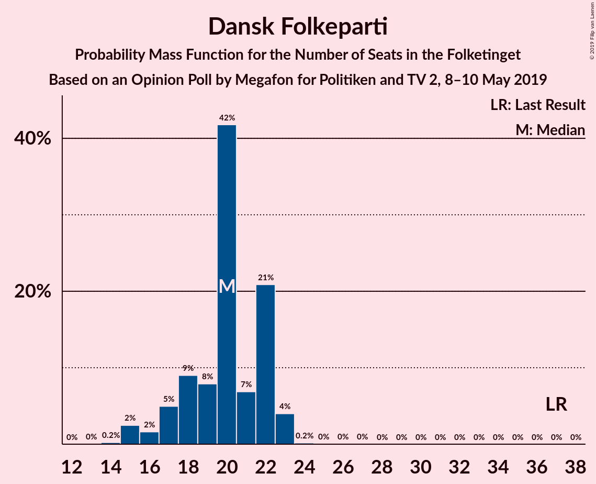

| Number of Seats | Probability | Accumulated | Special Marks |
|:---------------:|:-----------:|:-----------:|:-------------:|
| 14 | 0.2% | 100% |  |
| 15 | 2% | 99.7% |  |
| 16 | 2% | 97% |  |
| 17 | 5% | 96% |  |
| 18 | 9% | 91% |  |
| 19 | 8% | 82% |  |
| 20 | 42% | 74% | Median |
| 21 | 7% | 32% |  |
| 22 | 21% | 25% |  |
| 23 | 4% | 4% |  |
| 24 | 0.2% | 0.2% |  |
| 25 | 0% | 0.1% |  |
| 26 | 0% | 0% |  |
| 27 | 0% | 0% |  |
| 28 | 0% | 0% |  |
| 29 | 0% | 0% |  |
| 30 | 0% | 0% |  |
| 31 | 0% | 0% |  |
| 32 | 0% | 0% |  |
| 33 | 0% | 0% |  |
| 34 | 0% | 0% |  |
| 35 | 0% | 0% |  |
| 36 | 0% | 0% |  |
| 37 | 0% | 0% | Last Result |

### Enhedslisten–De Rød-Grønne

*For a full overview of the results for this party, see the [Enhedslisten–De Rød-Grønne](party-enhedslisten–derød-grønne.html) page.*

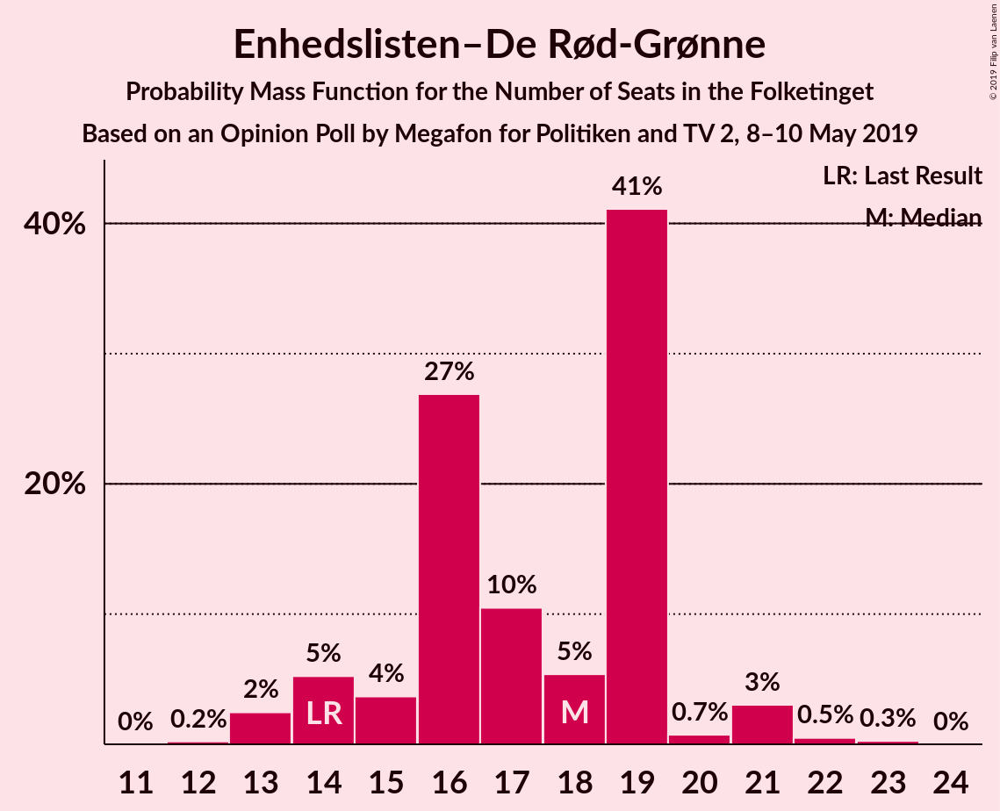

| Number of Seats | Probability | Accumulated | Special Marks |
|:---------------:|:-----------:|:-----------:|:-------------:|
| 12 | 0.2% | 100% |  |
| 13 | 2% | 99.8% |  |
| 14 | 5% | 97% | Last Result |
| 15 | 4% | 92% |  |
| 16 | 27% | 88% |  |
| 17 | 10% | 62% |  |
| 18 | 5% | 51% | Median |
| 19 | 41% | 46% |  |
| 20 | 0.7% | 5% |  |
| 21 | 3% | 4% |  |
| 22 | 0.5% | 0.8% |  |
| 23 | 0.3% | 0.3% |  |
| 24 | 0% | 0% |  |

### Radikale Venstre

*For a full overview of the results for this party, see the [Radikale Venstre](party-radikalevenstre.html) page.*

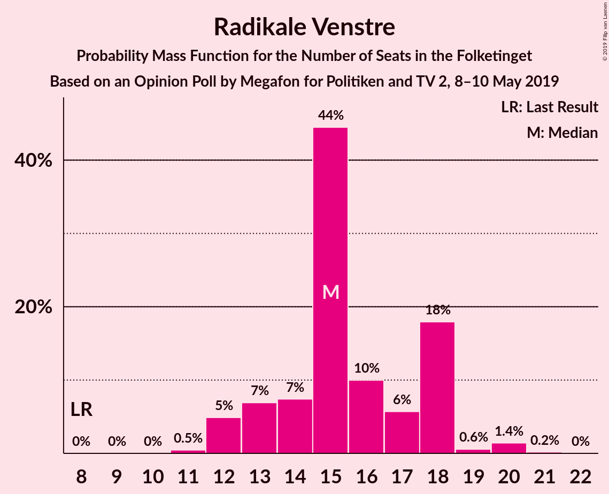

| Number of Seats | Probability | Accumulated | Special Marks |
|:---------------:|:-----------:|:-----------:|:-------------:|
| 8 | 0% | 100% | Last Result |
| 9 | 0% | 100% |  |
| 10 | 0% | 100% |  |
| 11 | 0.5% | 100% |  |
| 12 | 5% | 99.5% |  |
| 13 | 7% | 95% |  |
| 14 | 7% | 88% |  |
| 15 | 44% | 80% | Median |
| 16 | 10% | 36% |  |
| 17 | 6% | 26% |  |
| 18 | 18% | 20% |  |
| 19 | 0.6% | 2% |  |
| 20 | 1.4% | 2% |  |
| 21 | 0.2% | 0.2% |  |
| 22 | 0% | 0% |  |

### Socialistisk Folkeparti

*For a full overview of the results for this party, see the [Socialistisk Folkeparti](party-socialistiskfolkeparti.html) page.*

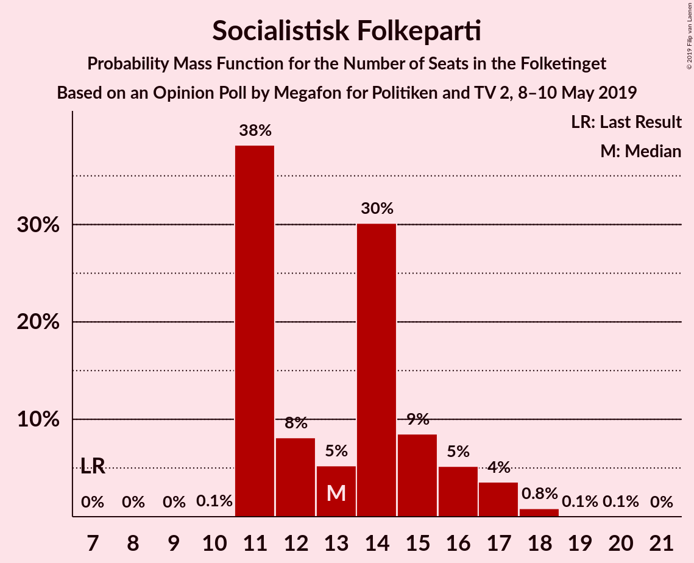

| Number of Seats | Probability | Accumulated | Special Marks |
|:---------------:|:-----------:|:-----------:|:-------------:|
| 7 | 0% | 100% | Last Result |
| 8 | 0% | 100% |  |
| 9 | 0% | 100% |  |
| 10 | 0.1% | 100% |  |
| 11 | 38% | 99.9% |  |
| 12 | 8% | 62% |  |
| 13 | 5% | 54% | Median |
| 14 | 30% | 48% |  |
| 15 | 9% | 18% |  |
| 16 | 5% | 10% |  |
| 17 | 4% | 5% |  |
| 18 | 0.8% | 1.0% |  |
| 19 | 0.1% | 0.2% |  |
| 20 | 0.1% | 0.1% |  |
| 21 | 0% | 0% |  |

### Det Konservative Folkeparti

*For a full overview of the results for this party, see the [Det Konservative Folkeparti](party-detkonservativefolkeparti.html) page.*

| Number of Seats | Probability | Accumulated | Special Marks |
|:---------------:|:-----------:|:-----------:|:-------------:|
| 5 | 0.1% | 100% |  |
| 6 | 3% | 99.9% | Last Result |
| 7 | 7% | 97% |  |
| 8 | 23% | 89% |  |
| 9 | 52% | 66% | Median |
| 10 | 6% | 14% |  |
| 11 | 7% | 8% |  |
| 12 | 1.0% | 1.4% |  |
| 13 | 0.3% | 0.5% |  |
| 14 | 0.1% | 0.1% |  |
| 15 | 0% | 0% |  |

### Liberal Alliance

*For a full overview of the results for this party, see the [Liberal Alliance](party-liberalalliance.html) page.*

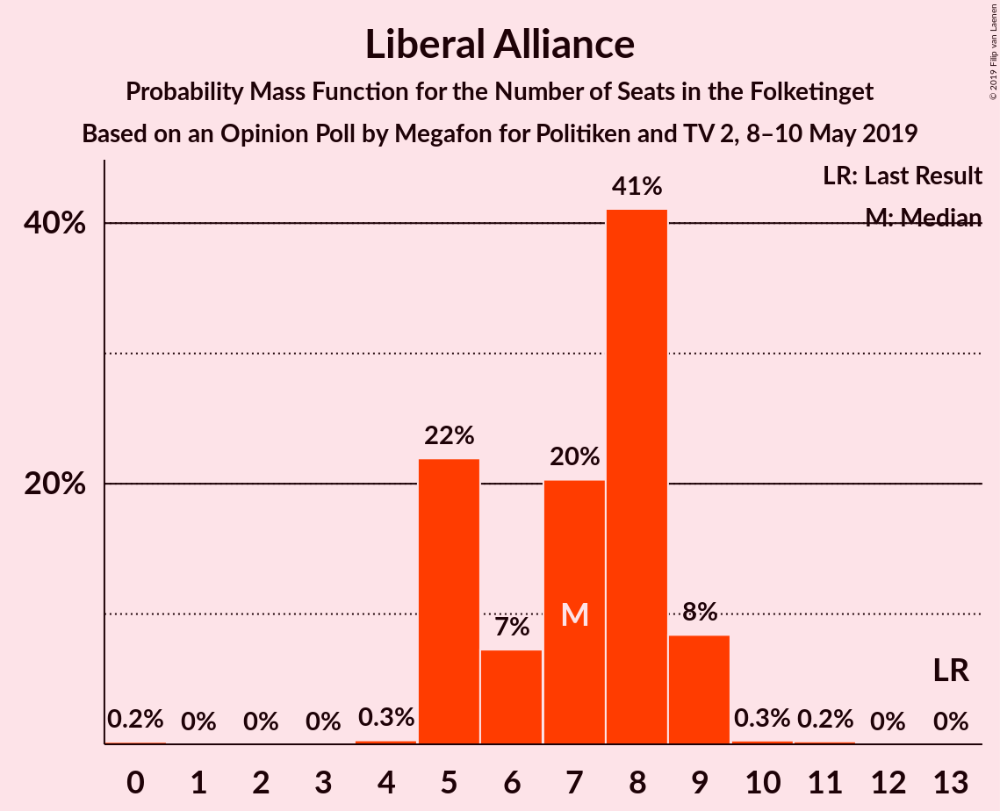

| Number of Seats | Probability | Accumulated | Special Marks |
|:---------------:|:-----------:|:-----------:|:-------------:|
| 0 | 0.2% | 100% |  |
| 1 | 0% | 99.8% |  |
| 2 | 0% | 99.8% |  |
| 3 | 0% | 99.8% |  |
| 4 | 0.3% | 99.8% |  |
| 5 | 22% | 99.5% |  |
| 6 | 7% | 78% |  |
| 7 | 20% | 70% | Median |
| 8 | 41% | 50% |  |
| 9 | 8% | 9% |  |
| 10 | 0.3% | 0.5% |  |
| 11 | 0.2% | 0.2% |  |
| 12 | 0% | 0% |  |
| 13 | 0% | 0% | Last Result |

### Alternativet

*For a full overview of the results for this party, see the [Alternativet](party-alternativet.html) page.*

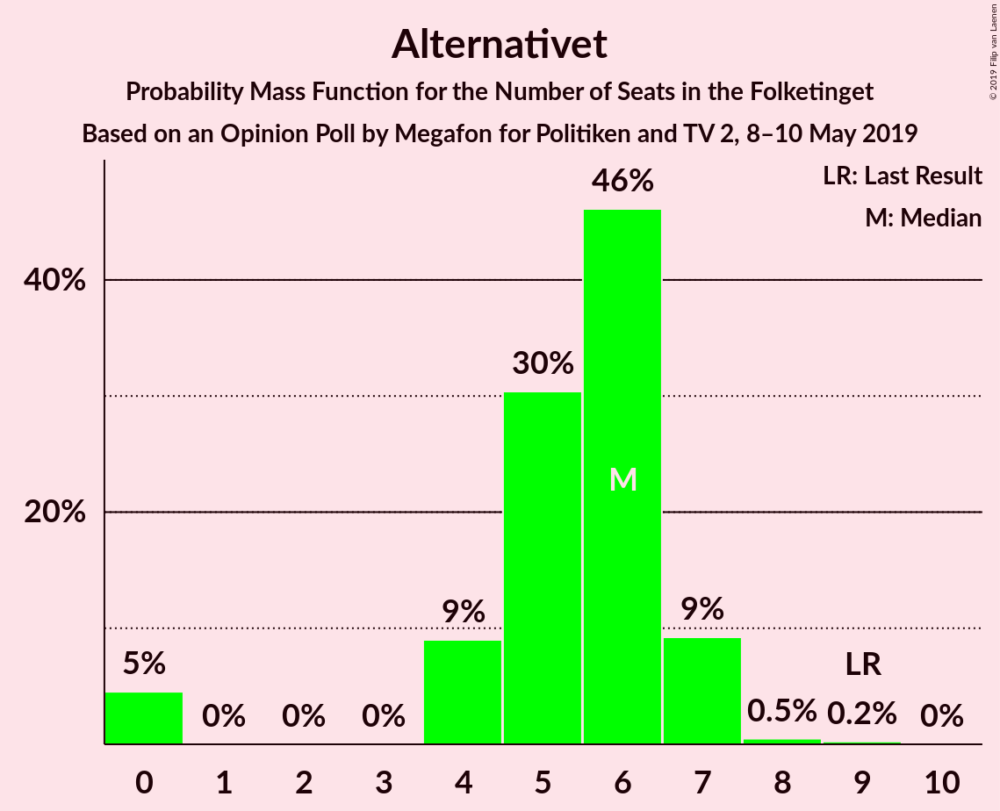

| Number of Seats | Probability | Accumulated | Special Marks |
|:---------------:|:-----------:|:-----------:|:-------------:|
| 0 | 5% | 100% |  |
| 1 | 0% | 95% |  |
| 2 | 0% | 95% |  |
| 3 | 0% | 95% |  |
| 4 | 9% | 95% |  |
| 5 | 30% | 86% |  |
| 6 | 46% | 56% | Median |
| 7 | 9% | 10% |  |
| 8 | 0.5% | 0.7% |  |
| 9 | 0.2% | 0.2% | Last Result |
| 10 | 0% | 0% |  |

### Nye Borgerlige

*For a full overview of the results for this party, see the [Nye Borgerlige](party-nyeborgerlige.html) page.*

| Number of Seats | Probability | Accumulated | Special Marks |
|:---------------:|:-----------:|:-----------:|:-------------:|
| 0 | 2% | 100% | Last Result |
| 1 | 0% | 98% |  |
| 2 | 0% | 98% |  |
| 3 | 0% | 98% |  |
| 4 | 11% | 98% |  |
| 5 | 25% | 87% |  |
| 6 | 14% | 62% | Median |
| 7 | 45% | 48% |  |
| 8 | 2% | 3% |  |
| 9 | 0.8% | 0.8% |  |
| 10 | 0% | 0% |  |

### Stram Kurs

*For a full overview of the results for this party, see the [Stram Kurs](party-stramkurs.html) page.*

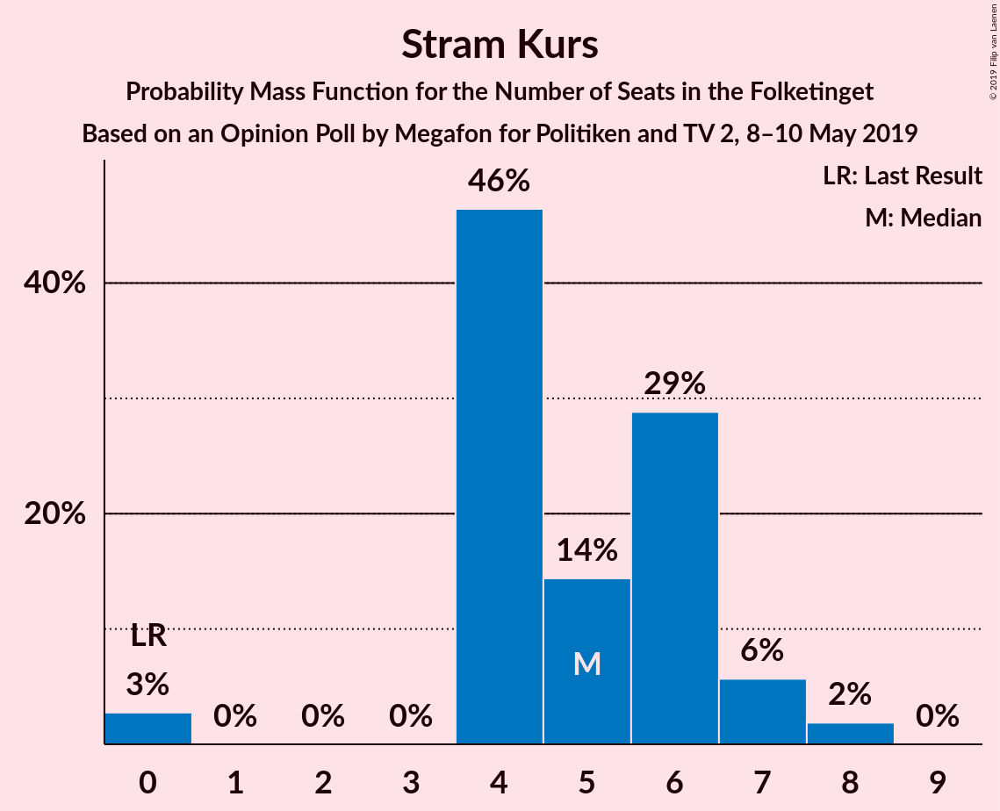

| Number of Seats | Probability | Accumulated | Special Marks |
|:---------------:|:-----------:|:-----------:|:-------------:|
| 0 | 3% | 100% | Last Result |
| 1 | 0% | 97% |  |
| 2 | 0% | 97% |  |
| 3 | 0% | 97% |  |
| 4 | 46% | 97% |  |
| 5 | 14% | 51% | Median |
| 6 | 29% | 36% |  |
| 7 | 6% | 8% |  |
| 8 | 2% | 2% |  |
| 9 | 0% | 0% |  |

### Kristendemokraterne

*For a full overview of the results for this party, see the [Kristendemokraterne](party-kristendemokraterne.html) page.*

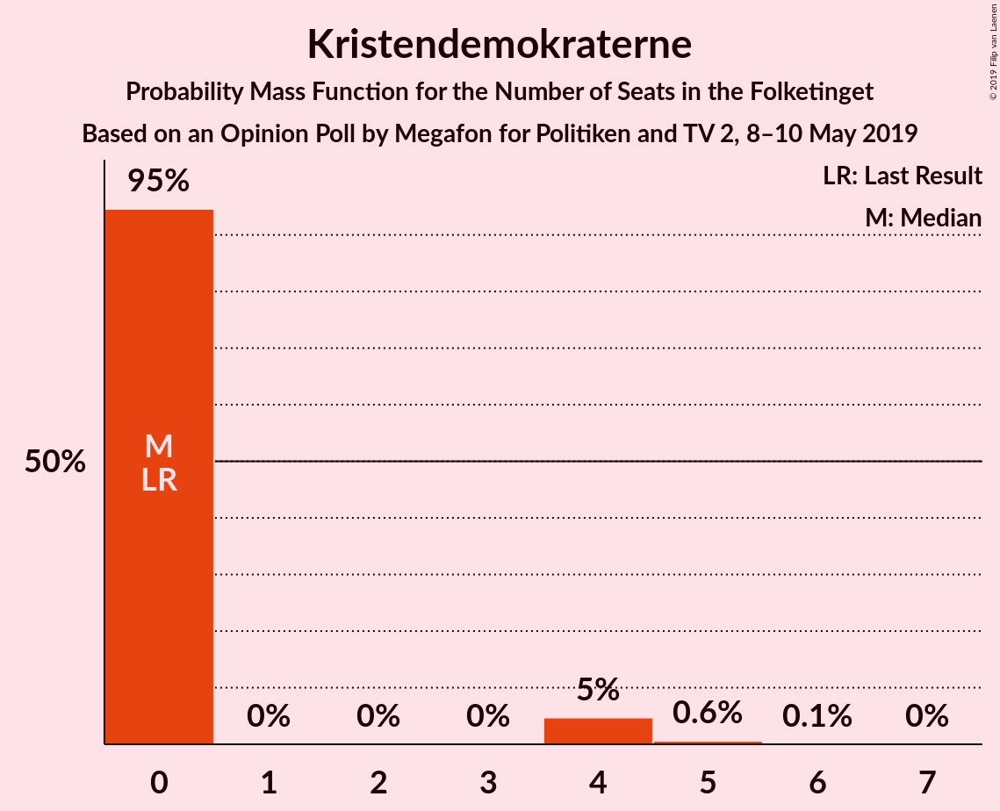

| Number of Seats | Probability | Accumulated | Special Marks |
|:---------------:|:-----------:|:-----------:|:-------------:|
| 0 | 95% | 100% | Last Result, Median |
| 1 | 0% | 5% |  |
| 2 | 0% | 5% |  |
| 3 | 0% | 5% |  |
| 4 | 5% | 5% |  |
| 5 | 0.6% | 0.7% |  |
| 6 | 0.1% | 0.1% |  |
| 7 | 0% | 0% |  |

### Klaus Riskær Pedersen

*For a full overview of the results for this party, see the [Klaus Riskær Pedersen](party-klausriskærpedersen.html) page.*

| Number of Seats | Probability | Accumulated | Special Marks |
|:---------------:|:-----------:|:-----------:|:-------------:|
| 0 | 99.9% | 100% | Last Result, Median |
| 1 | 0% | 0.1% |  |
| 2 | 0% | 0.1% |  |
| 3 | 0% | 0.1% |  |
| 4 | 0.1% | 0.1% |  |
| 5 | 0% | 0% |  |

## Coalitions

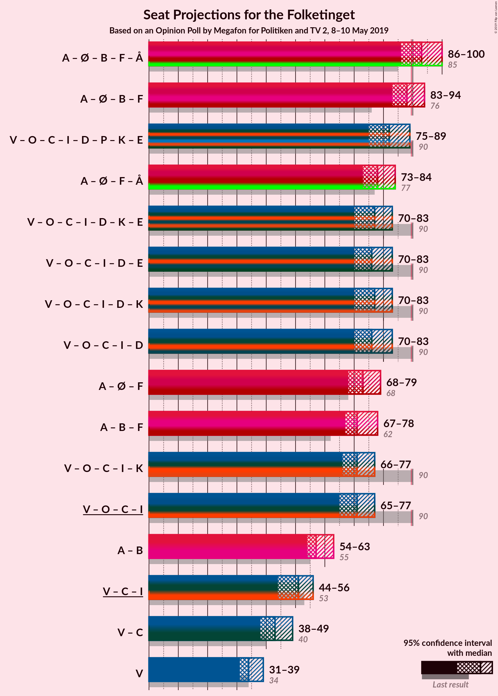

### Confidence Intervals

| Coalition | Last Result | Median | Majority? | 80% Confidence Interval | 90% Confidence Interval | 95% Confidence Interval | 99% Confidence Interval |
|:---------:|:-----------:|:------:|:---------:|:-----------------------:|:-----------------------:|:-----------------------:|:-----------------------:|
| Socialdemokraterne – Enhedslisten–De Rød-Grønne – Radikale Venstre – Socialistisk Folkeparti – Alternativet | 85 | 93 | 93% | 91–98 | 89–100 | 86–100 | 86–103 |
| Socialdemokraterne – Enhedslisten–De Rød-Grønne – Radikale Venstre – Socialistisk Folkeparti | 76 | 88 | 35% | 86–93 | 85–94 | 83–94 | 82–98 |
| Venstre – Dansk Folkeparti – Det Konservative Folkeparti – Liberal Alliance – Nye Borgerlige – Stram Kurs – Kristendemokraterne – Klaus Riskær Pedersen | 90 | 82 | 0% | 77–84 | 75–86 | 75–89 | 72–89 |
| Socialdemokraterne – Enhedslisten–De Rød-Grønne – Socialistisk Folkeparti – Alternativet | 77 | 78 | 0.1% | 76–82 | 73–83 | 73–84 | 73–86 |
| Venstre – Dansk Folkeparti – Det Konservative Folkeparti – Liberal Alliance – Nye Borgerlige – Kristendemokraterne – Klaus Riskær Pedersen | 90 | 77 | 0% | 71–78 | 71–81 | 70–83 | 68–83 |
| Venstre – Dansk Folkeparti – Det Konservative Folkeparti – Liberal Alliance – Nye Borgerlige – Klaus Riskær Pedersen | 90 | 76 | 0% | 71–78 | 70–79 | 70–83 | 66–83 |
| Venstre – Dansk Folkeparti – Det Konservative Folkeparti – Liberal Alliance – Nye Borgerlige – Kristendemokraterne | 90 | 77 | 0% | 71–78 | 71–81 | 70–83 | 68–83 |
| Venstre – Dansk Folkeparti – Det Konservative Folkeparti – Liberal Alliance – Nye Borgerlige | 90 | 76 | 0% | 71–78 | 70–79 | 70–83 | 66–83 |
| Socialdemokraterne – Enhedslisten–De Rød-Grønne – Socialistisk Folkeparti | 68 | 73 | 0% | 72–77 | 70–77 | 68–79 | 66–82 |
| Socialdemokraterne – Radikale Venstre – Socialistisk Folkeparti | 62 | 71 | 0% | 68–77 | 68–77 | 67–78 | 65–80 |
| Venstre – Dansk Folkeparti – Det Konservative Folkeparti – Liberal Alliance – Kristendemokraterne | 90 | 71 | 0% | 66–73 | 66–76 | 66–77 | 64–77 |
| Venstre – Dansk Folkeparti – Det Konservative Folkeparti – Liberal Alliance | 90 | 71 | 0% | 66–72 | 66–75 | 65–77 | 63–77 |
| Socialdemokraterne – Radikale Venstre | 55 | 57 | 0% | 57–63 | 55–63 | 54–63 | 51–67 |
| Venstre – Det Konservative Folkeparti – Liberal Alliance | 53 | 51 | 0% | 44–53 | 44–55 | 44–56 | 43–57 |
| Venstre – Det Konservative Folkeparti | 40 | 43 | 0% | 39–46 | 39–48 | 38–49 | 36–49 |
| Venstre | 34 | 34 | 0% | 31–37 | 31–39 | 31–39 | 28–40 |

### Socialdemokraterne – Enhedslisten–De Rød-Grønne – Radikale Venstre – Socialistisk Folkeparti – Alternativet

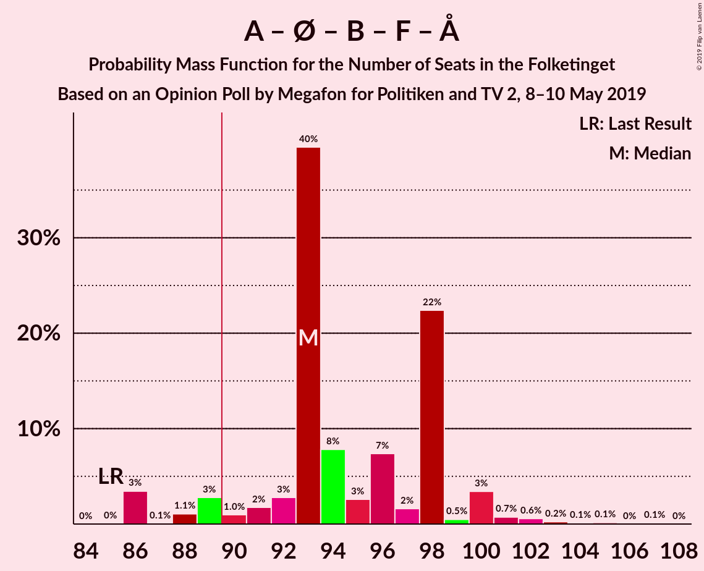

| Number of Seats | Probability | Accumulated | Special Marks |
|:---------------:|:-----------:|:-----------:|:-------------:|
| 85 | 0% | 100% | Last Result |
| 86 | 3% | 100% |  |
| 87 | 0.1% | 97% |  |
| 88 | 1.1% | 96% |  |
| 89 | 3% | 95% |  |
| 90 | 1.0% | 93% | Majority |
| 91 | 2% | 92% |  |
| 92 | 3% | 90% |  |
| 93 | 40% | 87% |  |
| 94 | 8% | 48% | Median |
| 95 | 3% | 40% |  |
| 96 | 7% | 37% |  |
| 97 | 2% | 30% |  |
| 98 | 22% | 28% |  |
| 99 | 0.5% | 6% |  |
| 100 | 3% | 5% |  |
| 101 | 0.7% | 2% |  |
| 102 | 0.6% | 1.1% |  |
| 103 | 0.2% | 0.6% |  |
| 104 | 0.1% | 0.3% |  |
| 105 | 0.1% | 0.2% |  |
| 106 | 0% | 0.1% |  |
| 107 | 0.1% | 0.1% |  |
| 108 | 0% | 0% |  |

### Socialdemokraterne – Enhedslisten–De Rød-Grønne – Radikale Venstre – Socialistisk Folkeparti

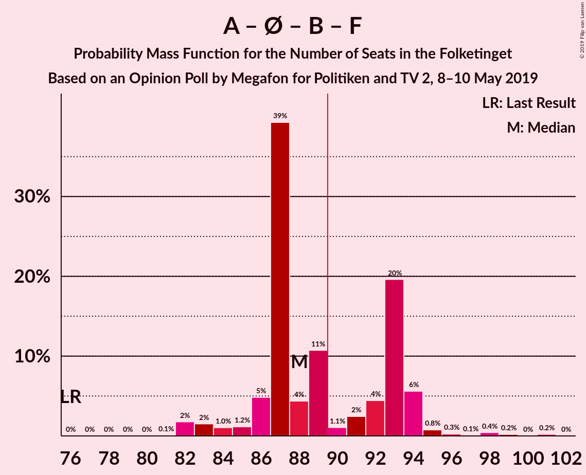

| Number of Seats | Probability | Accumulated | Special Marks |
|:---------------:|:-----------:|:-----------:|:-------------:|
| 76 | 0% | 100% | Last Result |
| 77 | 0% | 100% |  |
| 78 | 0% | 100% |  |
| 79 | 0% | 100% |  |
| 80 | 0% | 100% |  |
| 81 | 0.1% | 100% |  |
| 82 | 2% | 99.9% |  |
| 83 | 2% | 98% |  |
| 84 | 1.0% | 97% |  |
| 85 | 1.2% | 96% |  |
| 86 | 5% | 94% |  |
| 87 | 39% | 90% |  |
| 88 | 4% | 50% | Median |
| 89 | 11% | 46% |  |
| 90 | 1.1% | 35% | Majority |
| 91 | 2% | 34% |  |
| 92 | 4% | 32% |  |
| 93 | 20% | 27% |  |
| 94 | 6% | 8% |  |
| 95 | 0.8% | 2% |  |
| 96 | 0.3% | 1.2% |  |
| 97 | 0.1% | 1.0% |  |
| 98 | 0.4% | 0.9% |  |
| 99 | 0.2% | 0.4% |  |
| 100 | 0% | 0.2% |  |
| 101 | 0.2% | 0.2% |  |
| 102 | 0% | 0% |  |

### Venstre – Dansk Folkeparti – Det Konservative Folkeparti – Liberal Alliance – Nye Borgerlige – Stram Kurs – Kristendemokraterne – Klaus Riskær Pedersen

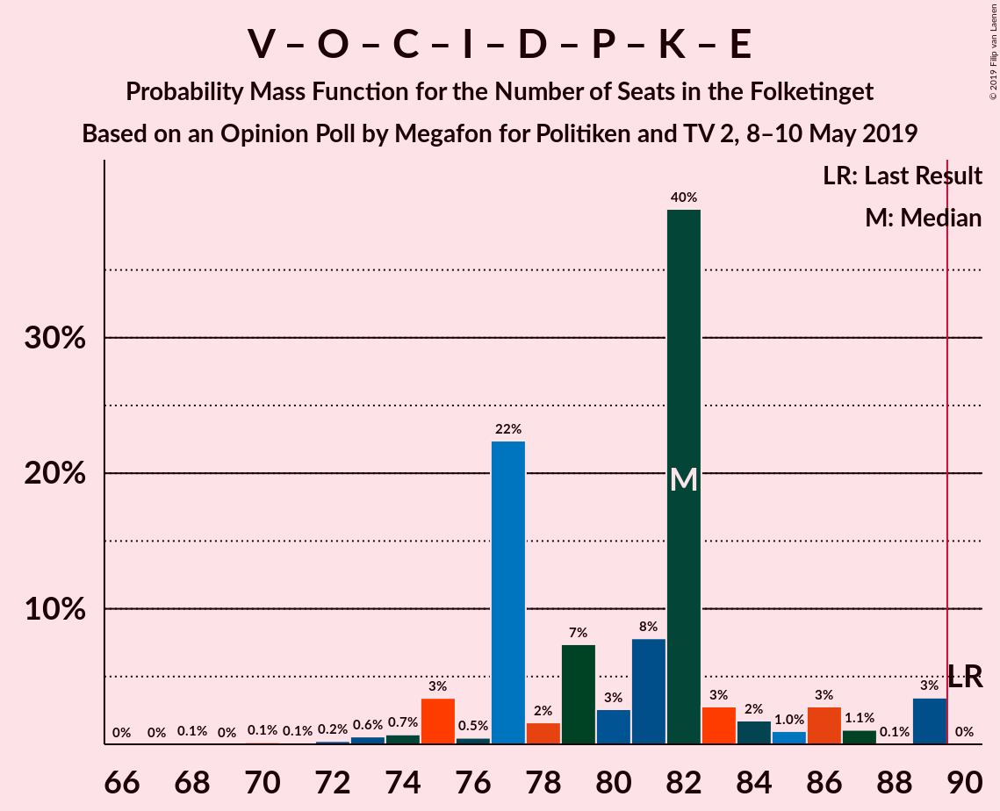

| Number of Seats | Probability | Accumulated | Special Marks |
|:---------------:|:-----------:|:-----------:|:-------------:|
| 68 | 0.1% | 100% |  |
| 69 | 0% | 99.9% |  |
| 70 | 0.1% | 99.9% |  |
| 71 | 0.1% | 99.8% |  |
| 72 | 0.2% | 99.7% |  |
| 73 | 0.6% | 99.4% |  |
| 74 | 0.7% | 98.9% |  |
| 75 | 3% | 98% |  |
| 76 | 0.5% | 95% |  |
| 77 | 22% | 94% |  |
| 78 | 2% | 72% |  |
| 79 | 7% | 70% |  |
| 80 | 3% | 63% |  |
| 81 | 8% | 60% | Median |
| 82 | 40% | 52% |  |
| 83 | 3% | 13% |  |
| 84 | 2% | 10% |  |
| 85 | 1.0% | 8% |  |
| 86 | 3% | 7% |  |
| 87 | 1.1% | 5% |  |
| 88 | 0.1% | 4% |  |
| 89 | 3% | 3% |  |
| 90 | 0% | 0% | Last Result, Majority |

### Socialdemokraterne – Enhedslisten–De Rød-Grønne – Socialistisk Folkeparti – Alternativet

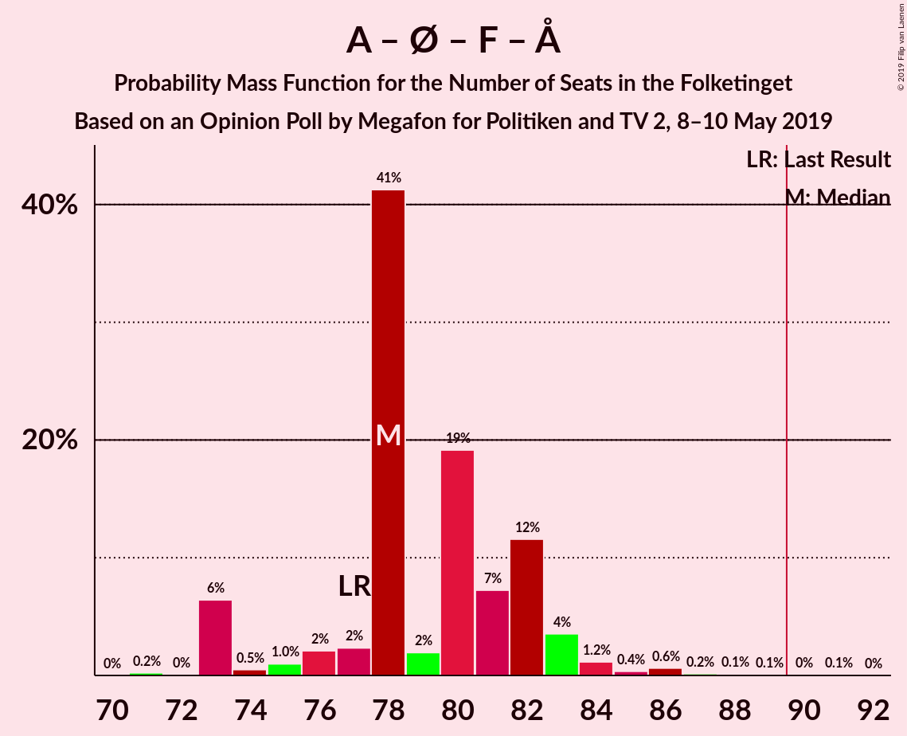

| Number of Seats | Probability | Accumulated | Special Marks |
|:---------------:|:-----------:|:-----------:|:-------------:|
| 71 | 0.2% | 100% |  |
| 72 | 0% | 99.7% |  |
| 73 | 6% | 99.7% |  |
| 74 | 0.5% | 93% |  |
| 75 | 1.0% | 93% |  |
| 76 | 2% | 92% |  |
| 77 | 2% | 90% | Last Result |
| 78 | 41% | 87% |  |
| 79 | 2% | 46% | Median |
| 80 | 19% | 44% |  |
| 81 | 7% | 25% |  |
| 82 | 12% | 18% |  |
| 83 | 4% | 6% |  |
| 84 | 1.2% | 3% |  |
| 85 | 0.4% | 1.4% |  |
| 86 | 0.6% | 1.1% |  |
| 87 | 0.2% | 0.4% |  |
| 88 | 0.1% | 0.3% |  |
| 89 | 0.1% | 0.2% |  |
| 90 | 0% | 0.1% | Majority |
| 91 | 0.1% | 0.1% |  |
| 92 | 0% | 0% |  |

### Venstre – Dansk Folkeparti – Det Konservative Folkeparti – Liberal Alliance – Nye Borgerlige – Kristendemokraterne – Klaus Riskær Pedersen

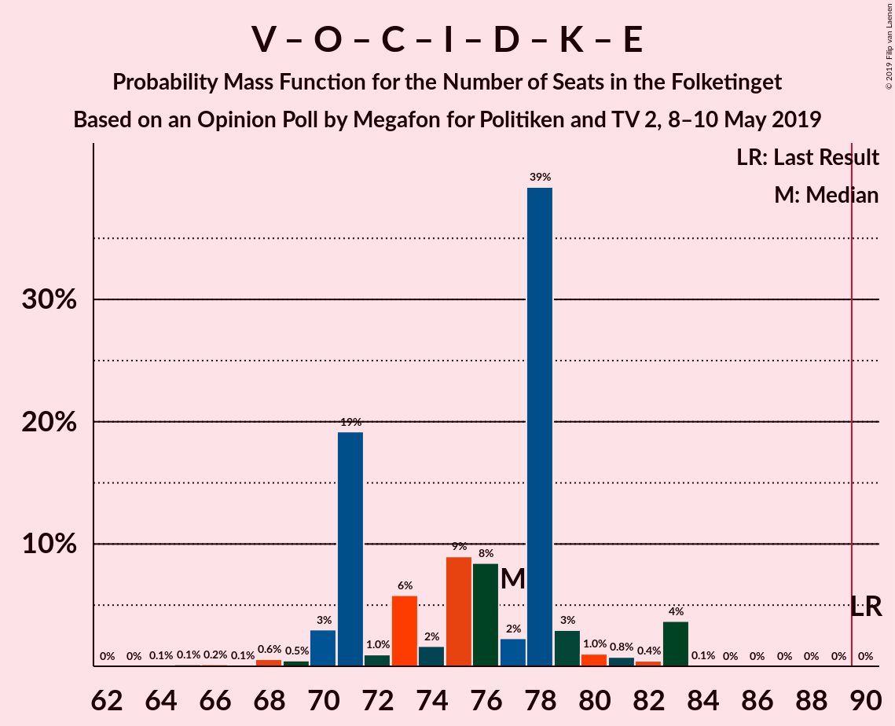

| Number of Seats | Probability | Accumulated | Special Marks |
|:---------------:|:-----------:|:-----------:|:-------------:|
| 64 | 0.1% | 100% |  |
| 65 | 0.1% | 99.9% |  |
| 66 | 0.2% | 99.8% |  |
| 67 | 0.1% | 99.6% |  |
| 68 | 0.6% | 99.5% |  |
| 69 | 0.5% | 99.0% |  |
| 70 | 3% | 98% |  |
| 71 | 19% | 95% |  |
| 72 | 1.0% | 76% |  |
| 73 | 6% | 75% |  |
| 74 | 2% | 70% |  |
| 75 | 9% | 68% |  |
| 76 | 8% | 59% | Median |
| 77 | 2% | 50% |  |
| 78 | 39% | 48% |  |
| 79 | 3% | 9% |  |
| 80 | 1.0% | 6% |  |
| 81 | 0.8% | 5% |  |
| 82 | 0.4% | 4% |  |
| 83 | 4% | 4% |  |
| 84 | 0.1% | 0.1% |  |
| 85 | 0% | 0% |  |
| 86 | 0% | 0% |  |
| 87 | 0% | 0% |  |
| 88 | 0% | 0% |  |
| 89 | 0% | 0% |  |
| 90 | 0% | 0% | Last Result, Majority |

### Venstre – Dansk Folkeparti – Det Konservative Folkeparti – Liberal Alliance – Nye Borgerlige – Klaus Riskær Pedersen

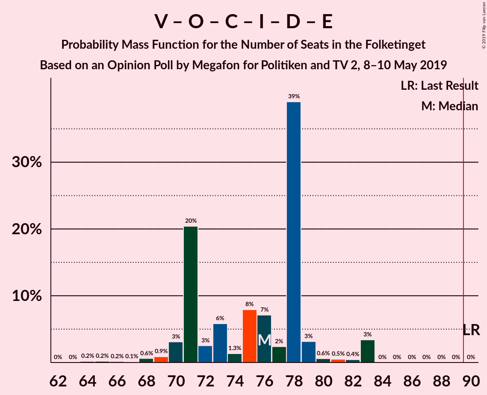

| Number of Seats | Probability | Accumulated | Special Marks |
|:---------------:|:-----------:|:-----------:|:-------------:|
| 64 | 0.2% | 100% |  |
| 65 | 0.2% | 99.8% |  |
| 66 | 0.2% | 99.6% |  |
| 67 | 0.1% | 99.5% |  |
| 68 | 0.6% | 99.3% |  |
| 69 | 0.9% | 98.7% |  |
| 70 | 3% | 98% |  |
| 71 | 20% | 95% |  |
| 72 | 3% | 74% |  |
| 73 | 6% | 72% |  |
| 74 | 1.3% | 66% |  |
| 75 | 8% | 65% |  |
| 76 | 7% | 57% | Median |
| 77 | 2% | 50% |  |
| 78 | 39% | 47% |  |
| 79 | 3% | 8% |  |
| 80 | 0.6% | 5% |  |
| 81 | 0.5% | 4% |  |
| 82 | 0.4% | 4% |  |
| 83 | 3% | 3% |  |
| 84 | 0% | 0% |  |
| 85 | 0% | 0% |  |
| 86 | 0% | 0% |  |
| 87 | 0% | 0% |  |
| 88 | 0% | 0% |  |
| 89 | 0% | 0% |  |
| 90 | 0% | 0% | Last Result, Majority |

### Venstre – Dansk Folkeparti – Det Konservative Folkeparti – Liberal Alliance – Nye Borgerlige – Kristendemokraterne

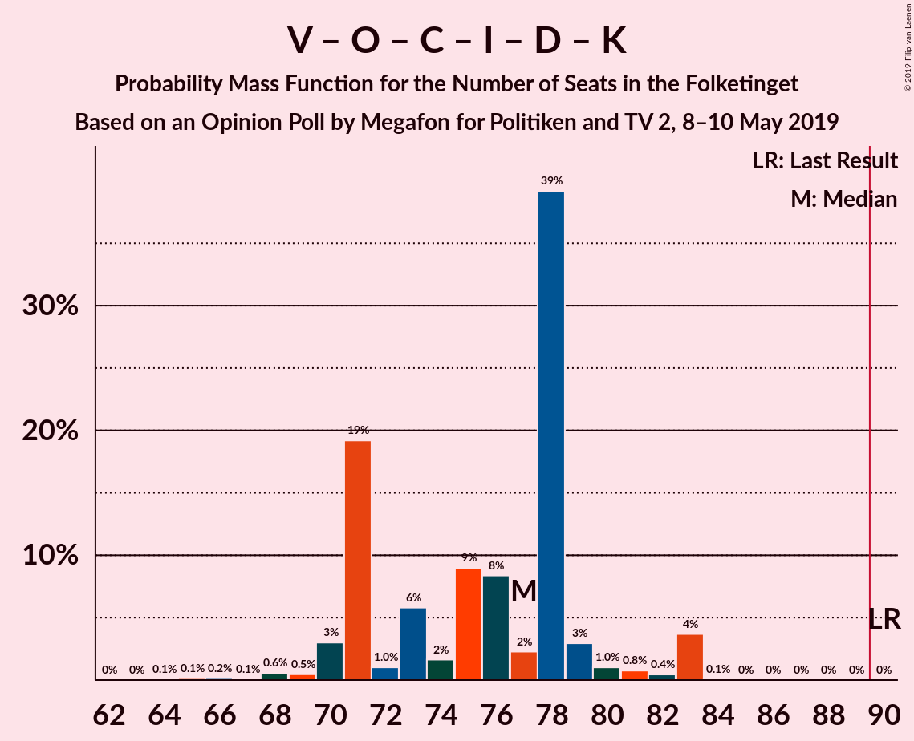

| Number of Seats | Probability | Accumulated | Special Marks |
|:---------------:|:-----------:|:-----------:|:-------------:|
| 64 | 0.1% | 100% |  |
| 65 | 0.1% | 99.9% |  |
| 66 | 0.2% | 99.8% |  |
| 67 | 0.1% | 99.6% |  |
| 68 | 0.6% | 99.5% |  |
| 69 | 0.5% | 99.0% |  |
| 70 | 3% | 98% |  |
| 71 | 19% | 95% |  |
| 72 | 1.0% | 76% |  |
| 73 | 6% | 75% |  |
| 74 | 2% | 69% |  |
| 75 | 9% | 68% |  |
| 76 | 8% | 59% | Median |
| 77 | 2% | 50% |  |
| 78 | 39% | 48% |  |
| 79 | 3% | 9% |  |
| 80 | 1.0% | 6% |  |
| 81 | 0.8% | 5% |  |
| 82 | 0.4% | 4% |  |
| 83 | 4% | 4% |  |
| 84 | 0.1% | 0.1% |  |
| 85 | 0% | 0% |  |
| 86 | 0% | 0% |  |
| 87 | 0% | 0% |  |
| 88 | 0% | 0% |  |
| 89 | 0% | 0% |  |
| 90 | 0% | 0% | Last Result, Majority |

### Venstre – Dansk Folkeparti – Det Konservative Folkeparti – Liberal Alliance – Nye Borgerlige

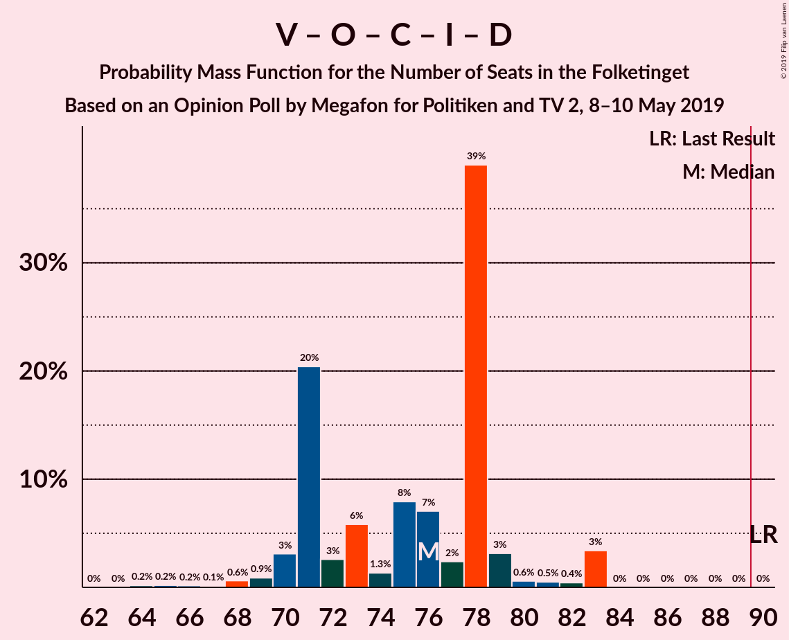

| Number of Seats | Probability | Accumulated | Special Marks |
|:---------------:|:-----------:|:-----------:|:-------------:|
| 64 | 0.2% | 100% |  |
| 65 | 0.2% | 99.8% |  |
| 66 | 0.2% | 99.6% |  |
| 67 | 0.1% | 99.5% |  |
| 68 | 0.6% | 99.3% |  |
| 69 | 0.9% | 98.7% |  |
| 70 | 3% | 98% |  |
| 71 | 20% | 95% |  |
| 72 | 3% | 74% |  |
| 73 | 6% | 72% |  |
| 74 | 1.3% | 66% |  |
| 75 | 8% | 65% |  |
| 76 | 7% | 57% | Median |
| 77 | 2% | 50% |  |
| 78 | 39% | 47% |  |
| 79 | 3% | 8% |  |
| 80 | 0.6% | 5% |  |
| 81 | 0.5% | 4% |  |
| 82 | 0.4% | 4% |  |
| 83 | 3% | 3% |  |
| 84 | 0% | 0% |  |
| 85 | 0% | 0% |  |
| 86 | 0% | 0% |  |
| 87 | 0% | 0% |  |
| 88 | 0% | 0% |  |
| 89 | 0% | 0% |  |
| 90 | 0% | 0% | Last Result, Majority |

### Socialdemokraterne – Enhedslisten–De Rød-Grønne – Socialistisk Folkeparti

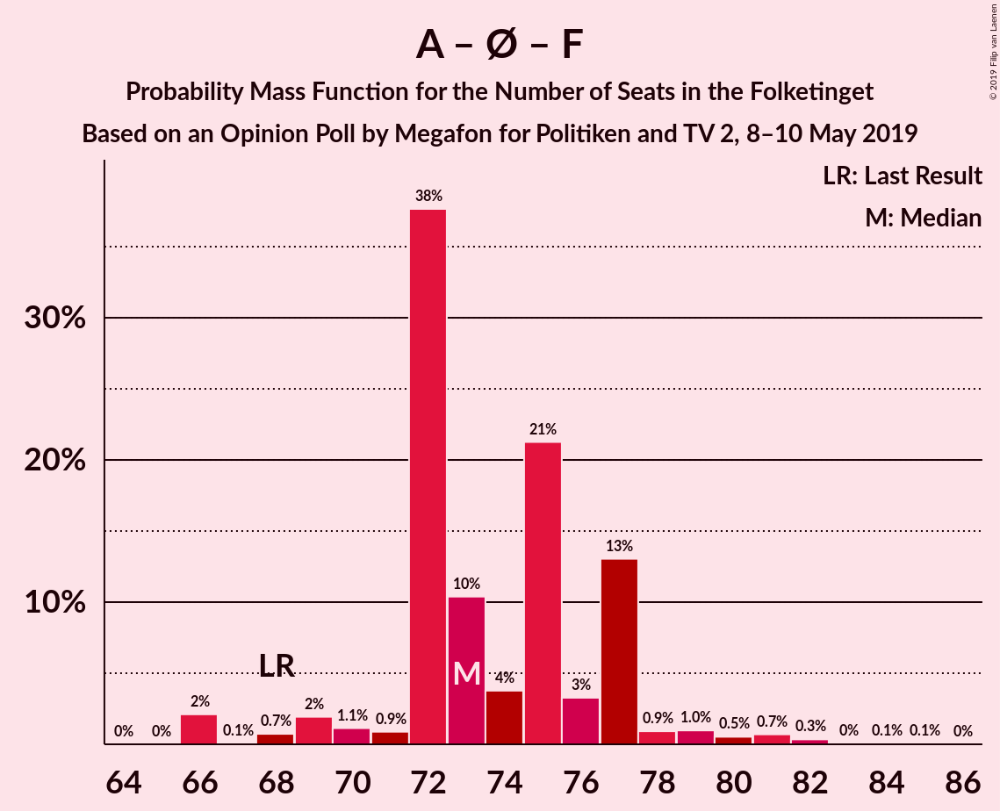

| Number of Seats | Probability | Accumulated | Special Marks |
|:---------------:|:-----------:|:-----------:|:-------------:|
| 66 | 2% | 100% |  |
| 67 | 0.1% | 98% |  |
| 68 | 0.7% | 98% | Last Result |
| 69 | 2% | 97% |  |
| 70 | 1.1% | 95% |  |
| 71 | 0.9% | 94% |  |
| 72 | 38% | 93% |  |
| 73 | 10% | 55% | Median |
| 74 | 4% | 45% |  |
| 75 | 21% | 41% |  |
| 76 | 3% | 20% |  |
| 77 | 13% | 17% |  |
| 78 | 0.9% | 4% |  |
| 79 | 1.0% | 3% |  |
| 80 | 0.5% | 2% |  |
| 81 | 0.7% | 1.3% |  |
| 82 | 0.3% | 0.6% |  |
| 83 | 0% | 0.2% |  |
| 84 | 0.1% | 0.2% |  |
| 85 | 0.1% | 0.1% |  |
| 86 | 0% | 0% |  |

### Socialdemokraterne – Radikale Venstre – Socialistisk Folkeparti

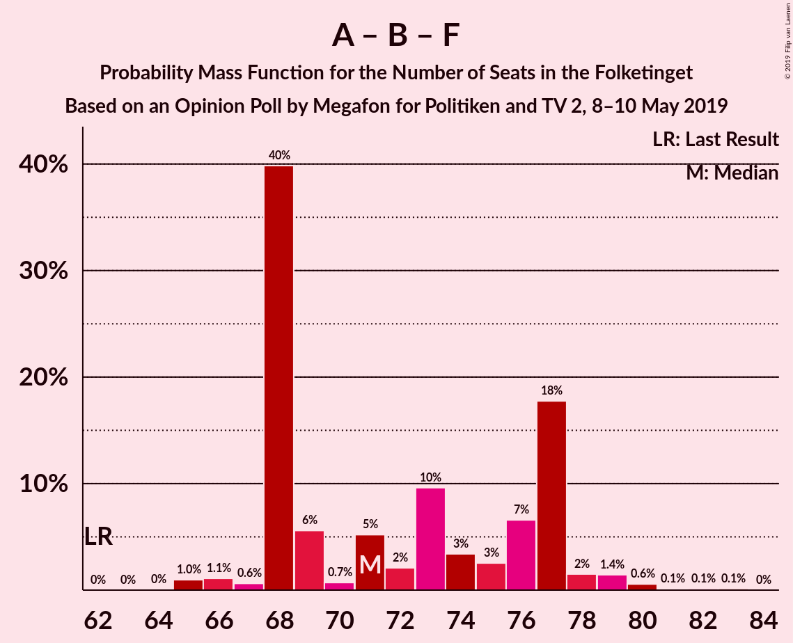

| Number of Seats | Probability | Accumulated | Special Marks |
|:---------------:|:-----------:|:-----------:|:-------------:|
| 62 | 0% | 100% | Last Result |
| 63 | 0% | 100% |  |
| 64 | 0% | 100% |  |
| 65 | 1.0% | 99.9% |  |
| 66 | 1.1% | 99.0% |  |
| 67 | 0.6% | 98% |  |
| 68 | 40% | 97% |  |
| 69 | 6% | 57% |  |
| 70 | 0.7% | 52% | Median |
| 71 | 5% | 51% |  |
| 72 | 2% | 46% |  |
| 73 | 10% | 44% |  |
| 74 | 3% | 34% |  |
| 75 | 3% | 31% |  |
| 76 | 7% | 28% |  |
| 77 | 18% | 22% |  |
| 78 | 2% | 4% |  |
| 79 | 1.4% | 2% |  |
| 80 | 0.6% | 1.0% |  |
| 81 | 0.1% | 0.4% |  |
| 82 | 0.1% | 0.3% |  |
| 83 | 0.1% | 0.2% |  |
| 84 | 0% | 0% |  |

### Venstre – Dansk Folkeparti – Det Konservative Folkeparti – Liberal Alliance – Kristendemokraterne

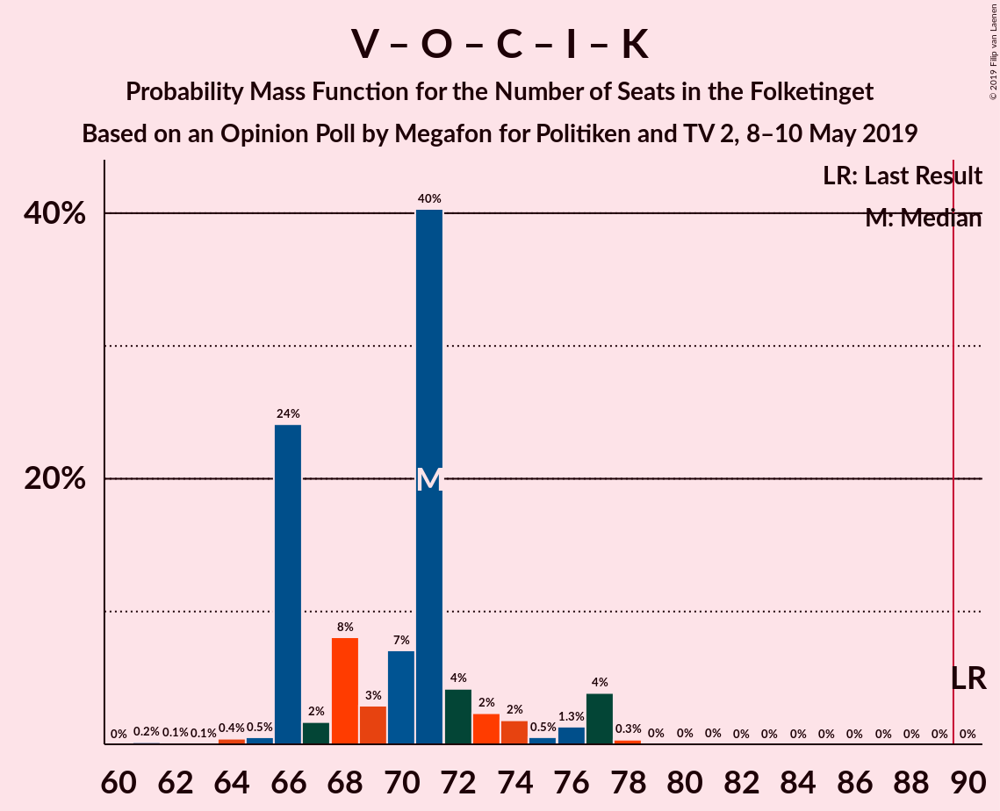

| Number of Seats | Probability | Accumulated | Special Marks |
|:---------------:|:-----------:|:-----------:|:-------------:|
| 61 | 0.2% | 100% |  |
| 62 | 0.1% | 99.8% |  |
| 63 | 0.1% | 99.7% |  |
| 64 | 0.4% | 99.6% |  |
| 65 | 0.5% | 99.2% |  |
| 66 | 24% | 98.7% |  |
| 67 | 2% | 75% |  |
| 68 | 8% | 73% |  |
| 69 | 3% | 65% |  |
| 70 | 7% | 62% | Median |
| 71 | 40% | 55% |  |
| 72 | 4% | 15% |  |
| 73 | 2% | 10% |  |
| 74 | 2% | 8% |  |
| 75 | 0.5% | 6% |  |
| 76 | 1.3% | 6% |  |
| 77 | 4% | 4% |  |
| 78 | 0.3% | 0.4% |  |
| 79 | 0% | 0.1% |  |
| 80 | 0% | 0.1% |  |
| 81 | 0% | 0% |  |
| 82 | 0% | 0% |  |
| 83 | 0% | 0% |  |
| 84 | 0% | 0% |  |
| 85 | 0% | 0% |  |
| 86 | 0% | 0% |  |
| 87 | 0% | 0% |  |
| 88 | 0% | 0% |  |
| 89 | 0% | 0% |  |
| 90 | 0% | 0% | Last Result, Majority |

### Venstre – Dansk Folkeparti – Det Konservative Folkeparti – Liberal Alliance

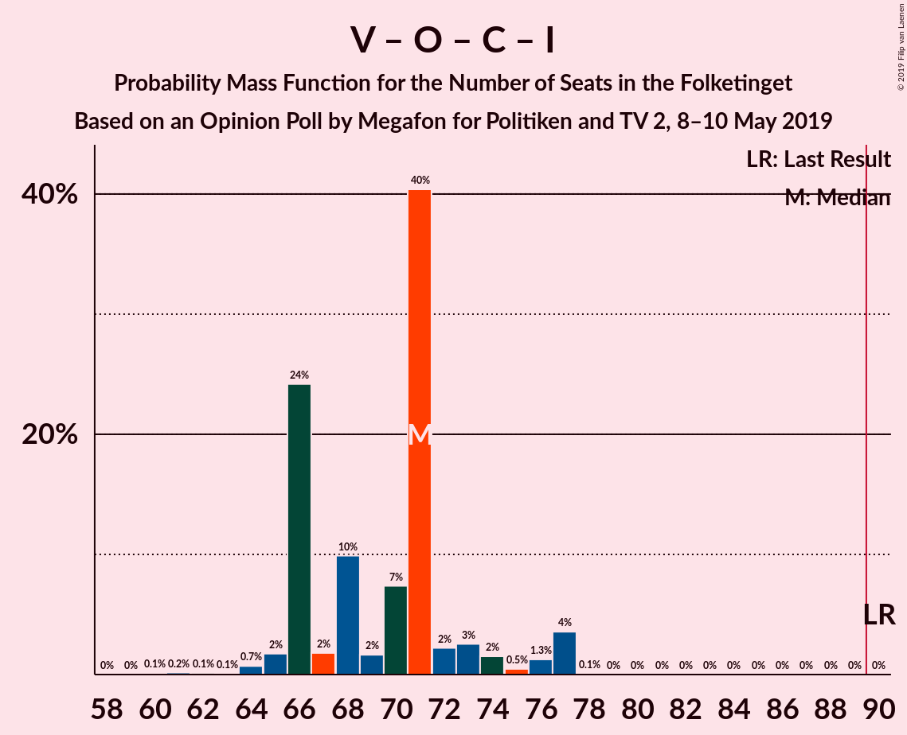

| Number of Seats | Probability | Accumulated | Special Marks |
|:---------------:|:-----------:|:-----------:|:-------------:|
| 60 | 0.1% | 100% |  |
| 61 | 0.2% | 99.9% |  |
| 62 | 0.1% | 99.7% |  |
| 63 | 0.1% | 99.6% |  |
| 64 | 0.7% | 99.5% |  |
| 65 | 2% | 98.7% |  |
| 66 | 24% | 97% |  |
| 67 | 2% | 73% |  |
| 68 | 10% | 71% |  |
| 69 | 2% | 61% |  |
| 70 | 7% | 59% | Median |
| 71 | 40% | 52% |  |
| 72 | 2% | 12% |  |
| 73 | 3% | 9% |  |
| 74 | 2% | 7% |  |
| 75 | 0.5% | 5% |  |
| 76 | 1.3% | 5% |  |
| 77 | 4% | 4% |  |
| 78 | 0.1% | 0.1% |  |
| 79 | 0% | 0% |  |
| 80 | 0% | 0% |  |
| 81 | 0% | 0% |  |
| 82 | 0% | 0% |  |
| 83 | 0% | 0% |  |
| 84 | 0% | 0% |  |
| 85 | 0% | 0% |  |
| 86 | 0% | 0% |  |
| 87 | 0% | 0% |  |
| 88 | 0% | 0% |  |
| 89 | 0% | 0% |  |
| 90 | 0% | 0% | Last Result, Majority |

### Socialdemokraterne – Radikale Venstre

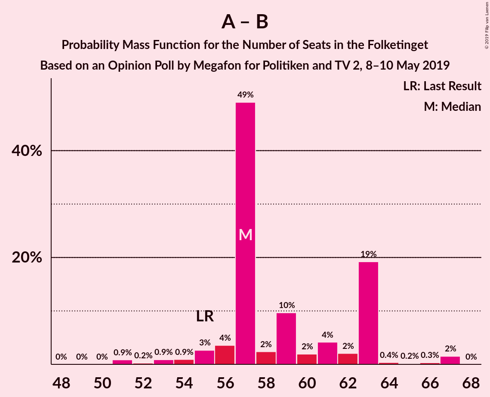

| Number of Seats | Probability | Accumulated | Special Marks |
|:---------------:|:-----------:|:-----------:|:-------------:|
| 49 | 0% | 100% |  |
| 50 | 0% | 99.9% |  |
| 51 | 0.9% | 99.9% |  |
| 52 | 0.2% | 99.1% |  |
| 53 | 0.9% | 98.8% |  |
| 54 | 0.9% | 98% |  |
| 55 | 3% | 97% | Last Result |
| 56 | 4% | 94% |  |
| 57 | 49% | 91% | Median |
| 58 | 2% | 42% |  |
| 59 | 10% | 39% |  |
| 60 | 2% | 30% |  |
| 61 | 4% | 28% |  |
| 62 | 2% | 24% |  |
| 63 | 19% | 22% |  |
| 64 | 0.4% | 2% |  |
| 65 | 0.2% | 2% |  |
| 66 | 0.3% | 2% |  |
| 67 | 2% | 2% |  |
| 68 | 0% | 0% |  |

### Venstre – Det Konservative Folkeparti – Liberal Alliance

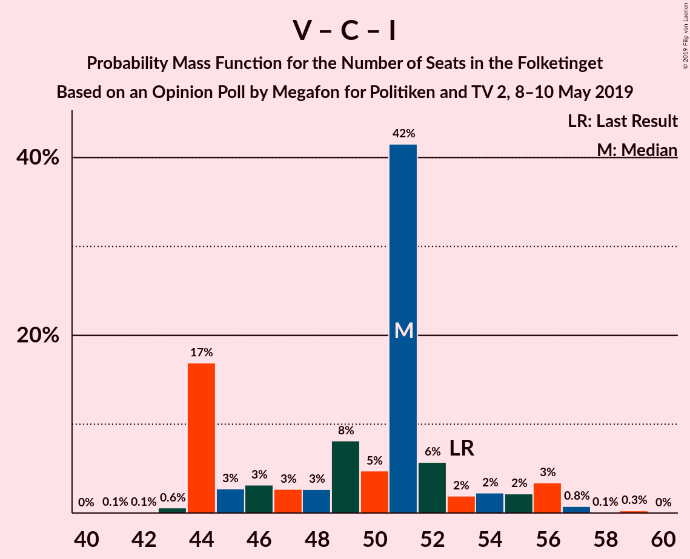

| Number of Seats | Probability | Accumulated | Special Marks |
|:---------------:|:-----------:|:-----------:|:-------------:|
| 41 | 0.1% | 100% |  |
| 42 | 0.1% | 99.9% |  |
| 43 | 0.6% | 99.8% |  |
| 44 | 17% | 99.2% |  |
| 45 | 3% | 82% |  |
| 46 | 3% | 80% |  |
| 47 | 3% | 76% |  |
| 48 | 3% | 74% |  |
| 49 | 8% | 71% |  |
| 50 | 5% | 63% | Median |
| 51 | 42% | 58% |  |
| 52 | 6% | 17% |  |
| 53 | 2% | 11% | Last Result |
| 54 | 2% | 9% |  |
| 55 | 2% | 7% |  |
| 56 | 3% | 5% |  |
| 57 | 0.8% | 1.1% |  |
| 58 | 0.1% | 0.4% |  |
| 59 | 0.3% | 0.3% |  |
| 60 | 0% | 0% |  |

### Venstre – Det Konservative Folkeparti

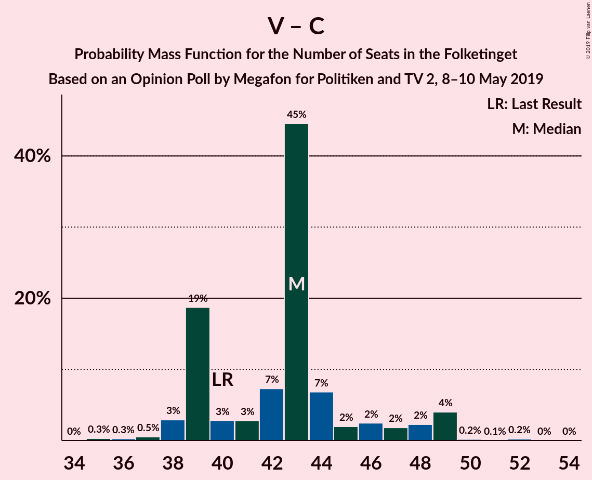

| Number of Seats | Probability | Accumulated | Special Marks |
|:---------------:|:-----------:|:-----------:|:-------------:|
| 35 | 0.3% | 100% |  |
| 36 | 0.3% | 99.7% |  |
| 37 | 0.5% | 99.4% |  |
| 38 | 3% | 98.9% |  |
| 39 | 19% | 96% |  |
| 40 | 3% | 77% | Last Result |
| 41 | 3% | 74% |  |
| 42 | 7% | 72% |  |
| 43 | 45% | 64% | Median |
| 44 | 7% | 20% |  |
| 45 | 2% | 13% |  |
| 46 | 2% | 11% |  |
| 47 | 2% | 9% |  |
| 48 | 2% | 7% |  |
| 49 | 4% | 4% |  |
| 50 | 0.2% | 0.5% |  |
| 51 | 0.1% | 0.3% |  |
| 52 | 0.2% | 0.2% |  |
| 53 | 0% | 0% |  |

### Venstre

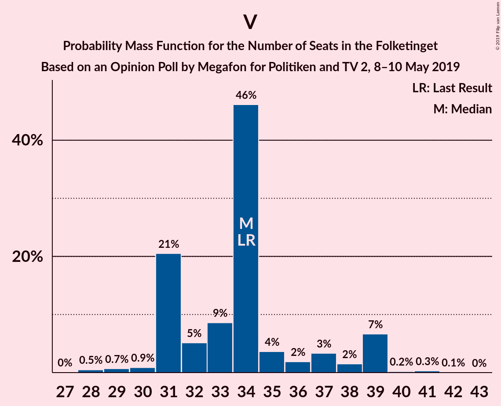

| Number of Seats | Probability | Accumulated | Special Marks |
|:---------------:|:-----------:|:-----------:|:-------------:|
| 27 | 0% | 100% |  |
| 28 | 0.5% | 99.9% |  |
| 29 | 0.7% | 99.5% |  |
| 30 | 0.9% | 98.8% |  |
| 31 | 21% | 98% |  |
| 32 | 5% | 77% |  |
| 33 | 9% | 72% |  |
| 34 | 46% | 64% | Last Result, Median |
| 35 | 4% | 18% |  |
| 36 | 2% | 14% |  |
| 37 | 3% | 12% |  |
| 38 | 2% | 9% |  |
| 39 | 7% | 7% |  |
| 40 | 0.2% | 0.5% |  |
| 41 | 0.3% | 0.4% |  |
| 42 | 0.1% | 0.1% |  |
| 43 | 0% | 0% |  |

## Technical Information

### Opinion Poll

+ **Polling firm:** Megafon
+ **Commissioner(s):** Politiken and TV 2
+ **Fieldwork period:** 8–10 May 2019

### Calculations

+ **Sample size:** 1010
+ **Simulations done:** 1,048,576
+ **Error estimate:** 1.84%

