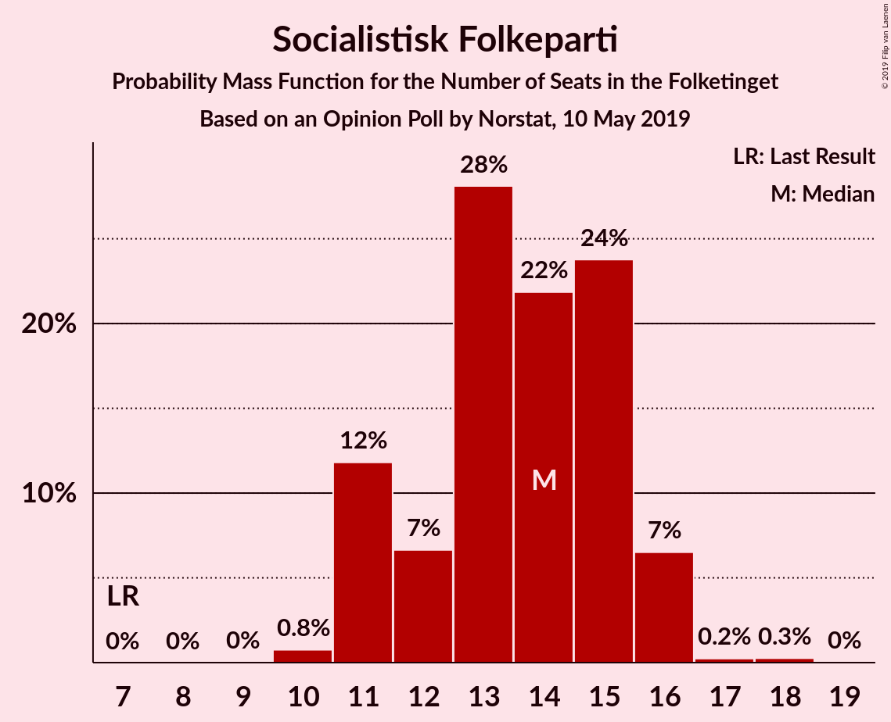
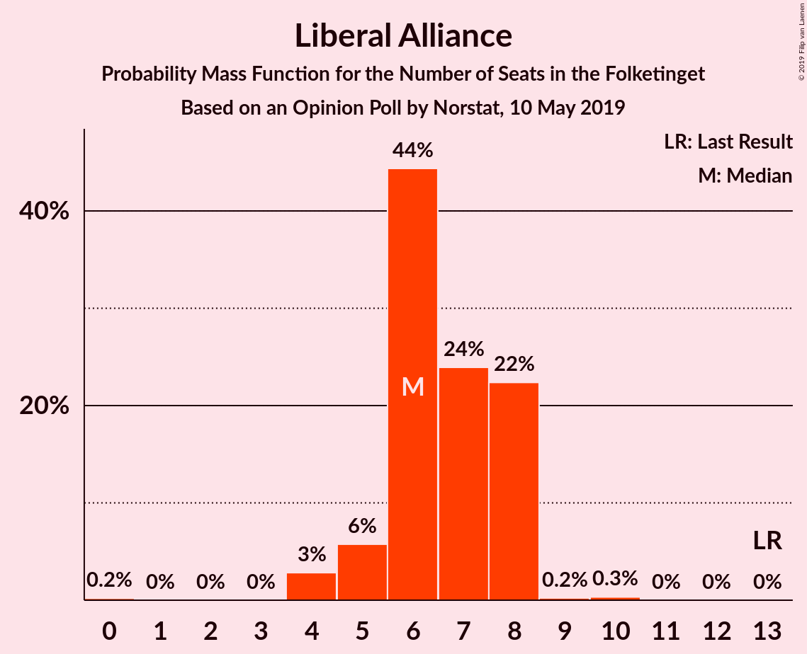
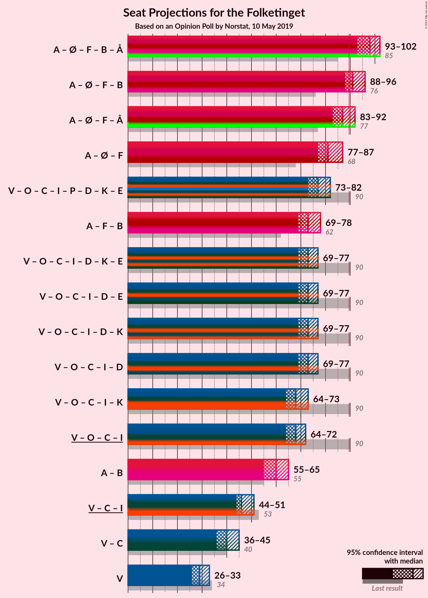
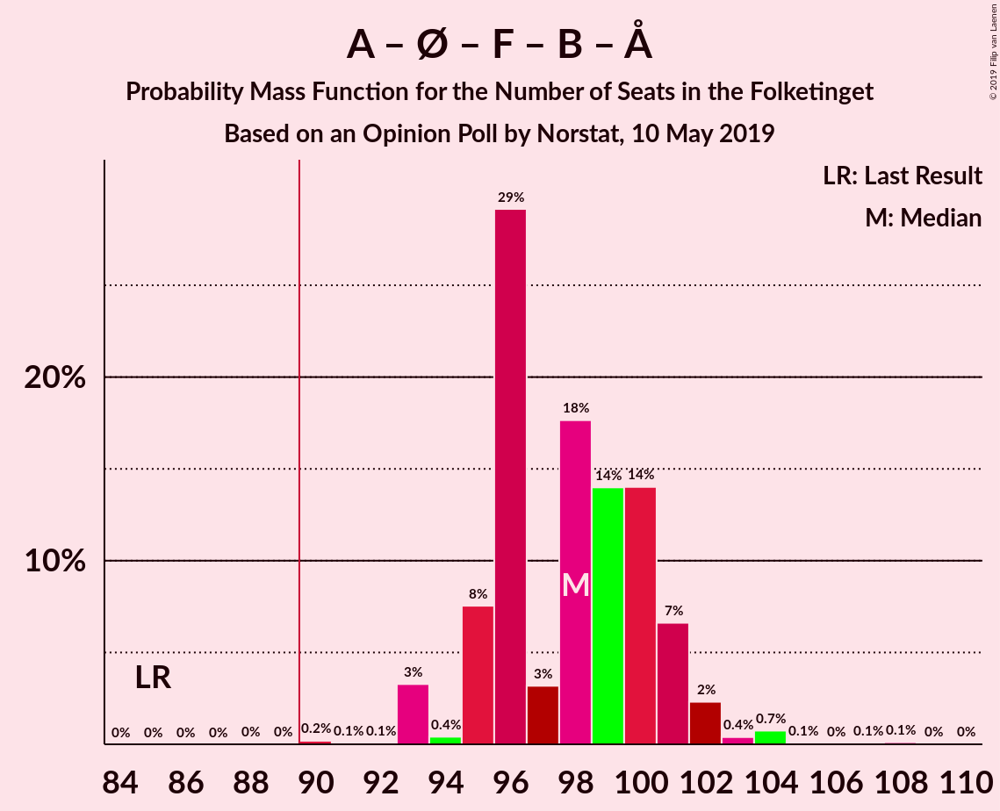
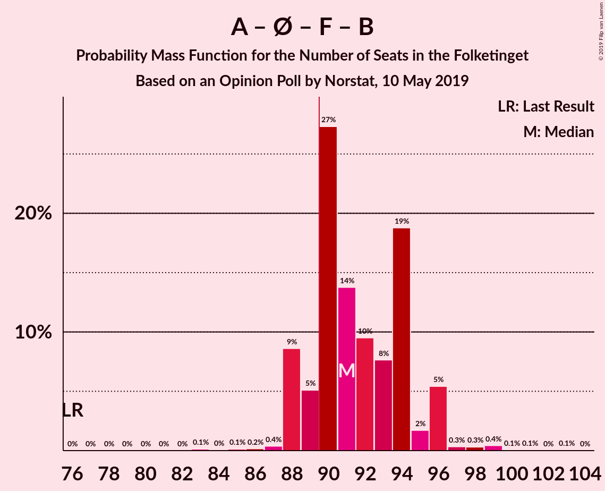
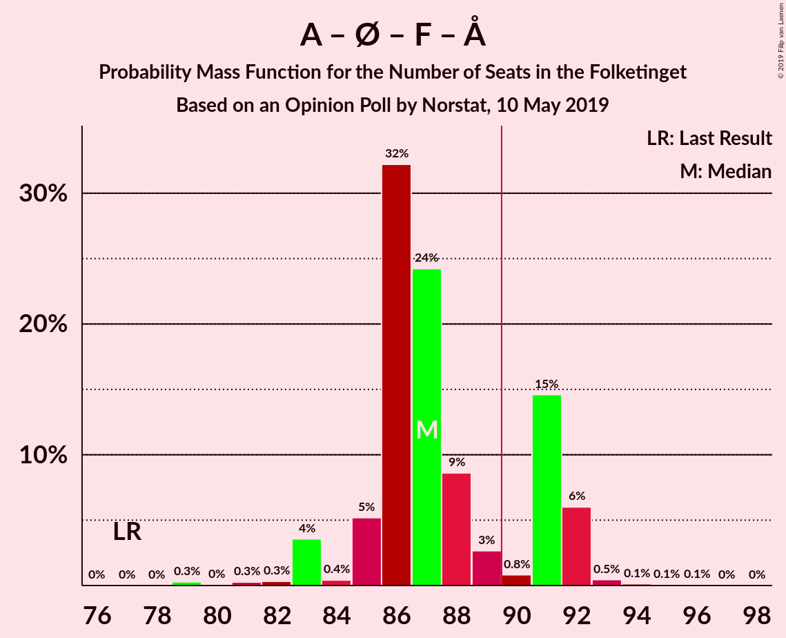
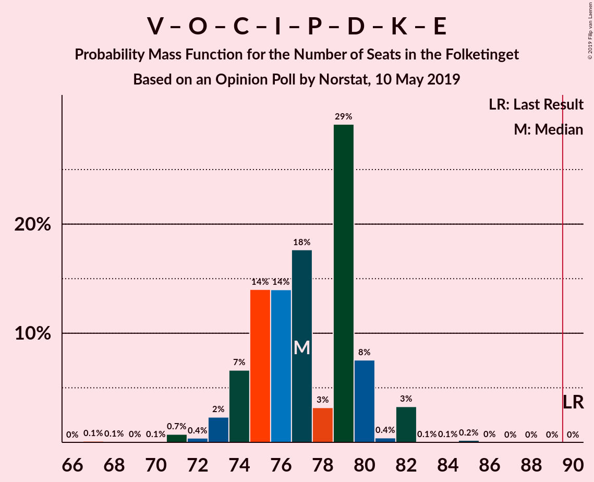

# Opinion Poll by Norstat, 10 May 2019

<a href="#voting-intentions">Voting Intentions</a> | <a href="#seats">Seats</a> | <a href="#coalitions">Coalitions</a> | <a href="#technical-information">Technical Information</a>

## Voting Intentions

### Confidence Intervals

| Party | Last Result | Poll Result | 80% Confidence Interval | 90% Confidence Interval | 95% Confidence Interval | 99% Confidence Interval |
|:-----:|:-----------:|:-----------:|:-----------------------:|:-----------------------:|:-----------------------:|:-----------------------:|
| Socialdemokraterne | 26.3% | 27.3% | 25.7–29.0% |25.3–29.5% |24.9–29.9% |24.1–30.8% |
| Venstre | 19.5% | 16.5% | 15.2–17.9% |14.8–18.3% |14.5–18.7% |13.9–19.4% |
| Dansk Folkeparti | 21.1% | 11.4% | 10.3–12.7% |10.0–13.0% |9.8–13.4% |9.3–14.0% |
| Enhedslisten–De Rød-Grønne | 7.8% | 10.5% | 9.5–11.7% |9.2–12.1% |8.9–12.4% |8.4–13.0% |
| Socialistisk Folkeparti | 4.2% | 7.5% | 6.6–8.6% |6.4–8.9% |6.2–9.2% |5.8–9.7% |
| Radikale Venstre | 4.6% | 6.2% | 5.4–7.2% |5.2–7.5% |5.0–7.7% |4.6–8.2% |
| Det Konservative Folkeparti | 3.4% | 5.9% | 5.1–6.8% |4.9–7.1% |4.7–7.4% |4.3–7.8% |
| Alternativet | 4.8% | 3.4% | 2.8–4.2% |2.7–4.4% |2.5–4.6% |2.3–5.0% |
| Liberal Alliance | 7.5% | 3.3% | 2.7–4.1% |2.6–4.3% |2.4–4.5% |2.2–4.9% |
| Stram Kurs | 0.0% | 2.6% | 2.1–3.3% |1.9–3.5% |1.8–3.6% |1.6–4.0% |
| Nye Borgerlige | 0.0% | 2.4% | 1.9–3.1% |1.8–3.3% |1.7–3.4% |1.5–3.8% |
| Kristendemokraterne | 0.8% | 1.3% | 1.0–1.9% |0.9–2.0% |0.8–2.1% |0.7–2.4% |
| Klaus Riskær Pedersen | 0.0% | 1.1% | 0.8–1.6% |0.7–1.7% |0.6–1.8% |0.5–2.1% |

*Note:* The poll result column reflects the actual value used in the calculations. Published results may vary slightly, and in addition be rounded to fewer digits.

## Seats

### Confidence Intervals

| Party | Last Result | Median | 80% Confidence Interval | 90% Confidence Interval | 95% Confidence Interval | 99% Confidence Interval |
|:-----:|:-----------:|:------:|:-----------------------:|:-----------------------:|:-----------------------:|:-----------------------:|
| <a href="#socialdemokraterne">Socialdemokraterne</a> | 47 | 50 | 46–53 |46–53 |45–53 |44–55 |
| <a href="#venstre">Venstre</a> | 34 | 29 | 26–32 |26–32 |26–33 |26–34 |
| <a href="#dansk-folkeparti">Dansk Folkeparti</a> | 37 | 21 | 19–23 |18–24 |18–24 |17–25 |
| <a href="#enhedslisten–de-rød-grønne">Enhedslisten–De Rød-Grønne</a> | 14 | 18 | 16–19 |16–20 |16–21 |16–23 |
| <a href="#socialistisk-folkeparti">Socialistisk Folkeparti</a> | 7 | 14 | 11–15 |11–16 |11–16 |10–17 |
| <a href="#radikale-venstre">Radikale Venstre</a> | 8 | 10 | 9–12 |9–12 |9–13 |9–14 |
| <a href="#det-konservative-folkeparti">Det Konservative Folkeparti</a> | 6 | 11 | 9–13 |9–13 |8–13 |8–14 |
| <a href="#alternativet">Alternativet</a> | 9 | 6 | 5–7 |5–8 |5–8 |4–8 |
| <a href="#liberal-alliance">Liberal Alliance</a> | 13 | 6 | 6–8 |5–8 |4–8 |4–9 |
| <a href="#stram-kurs">Stram Kurs</a> | 0 | 5 | 4–6 |3–6 |3–6 |0–6 |
| <a href="#nye-borgerlige">Nye Borgerlige</a> | 0 | 4 | 4–5 |4–5 |0–5 |0–6 |
| <a href="#kristendemokraterne">Kristendemokraterne</a> | 0 | 0 | 0 |0 |0–4 |0–4 |
| <a href="#klaus-riskær-pedersen">Klaus Riskær Pedersen</a> | 0 | 0 | 0 |0 |0 |0–4 |

### Socialdemokraterne

*For a full overview of the results for this party, see the [Socialdemokraterne](party-socialdemokraterne.html) page.*

| Number of Seats | Probability | Accumulated | Special Marks |
|:---------------:|:-----------:|:-----------:|:-------------:|
| 41 | 0.1% | 100% |  |
| 42 | 0% | 99.9% |  |
| 43 | 0.3% | 99.9% |  |
| 44 | 0.9% | 99.6% |  |
| 45 | 1.4% | 98.7% |  |
| 46 | 10% | 97% |  |
| 47 | 10% | 87% | Last Result |
| 48 | 4% | 77% |  |
| 49 | 11% | 73% |  |
| 50 | 12% | 61% | Median |
| 51 | 21% | 49% |  |
| 52 | 18% | 29% |  |
| 53 | 9% | 10% |  |
| 54 | 0.5% | 1.0% |  |
| 55 | 0.4% | 0.5% |  |
| 56 | 0.1% | 0.1% |  |
| 57 | 0% | 0% |  |

### Venstre

*For a full overview of the results for this party, see the [Venstre](party-venstre.html) page.*

| Number of Seats | Probability | Accumulated | Special Marks |
|:---------------:|:-----------:|:-----------:|:-------------:|
| 24 | 0.1% | 100% |  |
| 25 | 0.4% | 99.9% |  |
| 26 | 11% | 99.5% |  |
| 27 | 2% | 89% |  |
| 28 | 25% | 86% |  |
| 29 | 14% | 61% | Median |
| 30 | 10% | 47% |  |
| 31 | 23% | 37% |  |
| 32 | 11% | 14% |  |
| 33 | 3% | 3% |  |
| 34 | 0.4% | 0.9% | Last Result |
| 35 | 0.3% | 0.5% |  |
| 36 | 0.2% | 0.2% |  |
| 37 | 0% | 0% |  |

### Dansk Folkeparti

*For a full overview of the results for this party, see the [Dansk Folkeparti](party-danskfolkeparti.html) page.*

| Number of Seats | Probability | Accumulated | Special Marks |
|:---------------:|:-----------:|:-----------:|:-------------:|
| 16 | 0% | 100% |  |
| 17 | 2% | 99.9% |  |
| 18 | 7% | 98% |  |
| 19 | 3% | 90% |  |
| 20 | 20% | 88% |  |
| 21 | 20% | 68% | Median |
| 22 | 15% | 48% |  |
| 23 | 28% | 33% |  |
| 24 | 5% | 6% |  |
| 25 | 0.4% | 0.9% |  |
| 26 | 0.4% | 0.5% |  |
| 27 | 0% | 0% |  |
| 28 | 0% | 0% |  |
| 29 | 0% | 0% |  |
| 30 | 0% | 0% |  |
| 31 | 0% | 0% |  |
| 32 | 0% | 0% |  |
| 33 | 0% | 0% |  |
| 34 | 0% | 0% |  |
| 35 | 0% | 0% |  |
| 36 | 0% | 0% |  |
| 37 | 0% | 0% | Last Result |

### Enhedslisten–De Rød-Grønne

*For a full overview of the results for this party, see the [Enhedslisten–De Rød-Grønne](party-enhedslisten–derød-grønne.html) page.*

| Number of Seats | Probability | Accumulated | Special Marks |
|:---------------:|:-----------:|:-----------:|:-------------:|
| 14 | 0.1% | 100% | Last Result |
| 15 | 0.2% | 99.9% |  |
| 16 | 17% | 99.7% |  |
| 17 | 24% | 82% |  |
| 18 | 26% | 58% | Median |
| 19 | 25% | 32% |  |
| 20 | 5% | 8% |  |
| 21 | 1.4% | 3% |  |
| 22 | 0.5% | 1.3% |  |
| 23 | 0.5% | 0.8% |  |
| 24 | 0.1% | 0.3% |  |
| 25 | 0.1% | 0.1% |  |
| 26 | 0% | 0% |  |

### Socialistisk Folkeparti

*For a full overview of the results for this party, see the [Socialistisk Folkeparti](party-socialistiskfolkeparti.html) page.*

| Number of Seats | Probability | Accumulated | Special Marks |
|:---------------:|:-----------:|:-----------:|:-------------:|
| 7 | 0% | 100% | Last Result |
| 8 | 0% | 100% |  |
| 9 | 0% | 100% |  |
| 10 | 0.8% | 100% |  |
| 11 | 12% | 99.2% |  |
| 12 | 7% | 87% |  |
| 13 | 28% | 81% |  |
| 14 | 22% | 53% | Median |
| 15 | 24% | 31% |  |
| 16 | 7% | 7% |  |
| 17 | 0.2% | 0.5% |  |
| 18 | 0.3% | 0.3% |  |
| 19 | 0% | 0% |  |

### Radikale Venstre

*For a full overview of the results for this party, see the [Radikale Venstre](party-radikalevenstre.html) page.*

| Number of Seats | Probability | Accumulated | Special Marks |
|:---------------:|:-----------:|:-----------:|:-------------:|
| 7 | 0.1% | 100% |  |
| 8 | 0.3% | 99.9% | Last Result |
| 9 | 44% | 99.6% |  |
| 10 | 15% | 56% | Median |
| 11 | 13% | 41% |  |
| 12 | 25% | 28% |  |
| 13 | 1.4% | 3% |  |
| 14 | 1.0% | 1.4% |  |
| 15 | 0.2% | 0.4% |  |
| 16 | 0% | 0.2% |  |
| 17 | 0.2% | 0.2% |  |
| 18 | 0% | 0% |  |

### Det Konservative Folkeparti

*For a full overview of the results for this party, see the [Det Konservative Folkeparti](party-detkonservativefolkeparti.html) page.*

| Number of Seats | Probability | Accumulated | Special Marks |
|:---------------:|:-----------:|:-----------:|:-------------:|
| 6 | 0% | 100% | Last Result |
| 7 | 0.1% | 100% |  |
| 8 | 5% | 99.9% |  |
| 9 | 21% | 95% |  |
| 10 | 13% | 74% |  |
| 11 | 33% | 61% | Median |
| 12 | 17% | 28% |  |
| 13 | 11% | 12% |  |
| 14 | 0.6% | 0.8% |  |
| 15 | 0.1% | 0.1% |  |
| 16 | 0% | 0% |  |

### Alternativet

*For a full overview of the results for this party, see the [Alternativet](party-alternativet.html) page.*

| Number of Seats | Probability | Accumulated | Special Marks |
|:---------------:|:-----------:|:-----------:|:-------------:|
| 4 | 2% | 100% |  |
| 5 | 20% | 98% |  |
| 6 | 42% | 78% | Median |
| 7 | 30% | 36% |  |
| 8 | 6% | 7% |  |
| 9 | 0.2% | 0.3% | Last Result |
| 10 | 0% | 0% |  |

### Liberal Alliance

*For a full overview of the results for this party, see the [Liberal Alliance](party-liberalalliance.html) page.*

| Number of Seats | Probability | Accumulated | Special Marks |
|:---------------:|:-----------:|:-----------:|:-------------:|
| 0 | 0.2% | 100% |  |
| 1 | 0% | 99.8% |  |
| 2 | 0% | 99.8% |  |
| 3 | 0% | 99.8% |  |
| 4 | 3% | 99.8% |  |
| 5 | 6% | 97% |  |
| 6 | 44% | 91% | Median |
| 7 | 24% | 47% |  |
| 8 | 22% | 23% |  |
| 9 | 0.2% | 0.6% |  |
| 10 | 0.3% | 0.3% |  |
| 11 | 0% | 0% |  |
| 12 | 0% | 0% |  |
| 13 | 0% | 0% | Last Result |

### Stram Kurs

*For a full overview of the results for this party, see the [Stram Kurs](party-stramkurs.html) page.*

| Number of Seats | Probability | Accumulated | Special Marks |
|:---------------:|:-----------:|:-----------:|:-------------:|
| 0 | 1.5% | 100% | Last Result |
| 1 | 0% | 98.5% |  |
| 2 | 0% | 98.5% |  |
| 3 | 4% | 98.5% |  |
| 4 | 32% | 94% |  |
| 5 | 28% | 62% | Median |
| 6 | 34% | 34% |  |
| 7 | 0.4% | 0.5% |  |
| 8 | 0.1% | 0.1% |  |
| 9 | 0% | 0% |  |

### Nye Borgerlige

*For a full overview of the results for this party, see the [Nye Borgerlige](party-nyeborgerlige.html) page.*

| Number of Seats | Probability | Accumulated | Special Marks |
|:---------------:|:-----------:|:-----------:|:-------------:|
| 0 | 4% | 100% | Last Result |
| 1 | 0% | 96% |  |
| 2 | 0% | 96% |  |
| 3 | 0% | 96% |  |
| 4 | 68% | 96% | Median |
| 5 | 26% | 28% |  |
| 6 | 1.4% | 2% |  |
| 7 | 0.5% | 0.5% |  |
| 8 | 0% | 0% |  |

### Kristendemokraterne

*For a full overview of the results for this party, see the [Kristendemokraterne](party-kristendemokraterne.html) page.*

| Number of Seats | Probability | Accumulated | Special Marks |
|:---------------:|:-----------:|:-----------:|:-------------:|
| 0 | 97% | 100% | Last Result, Median |
| 1 | 0% | 3% |  |
| 2 | 0% | 3% |  |
| 3 | 0% | 3% |  |
| 4 | 2% | 3% |  |
| 5 | 0.2% | 0.2% |  |
| 6 | 0% | 0% |  |

### Klaus Riskær Pedersen

*For a full overview of the results for this party, see the [Klaus Riskær Pedersen](party-klausriskærpedersen.html) page.*

| Number of Seats | Probability | Accumulated | Special Marks |
|:---------------:|:-----------:|:-----------:|:-------------:|
| 0 | 98% | 100% | Last Result, Median |
| 1 | 0% | 2% |  |
| 2 | 0% | 2% |  |
| 3 | 0% | 2% |  |
| 4 | 2% | 2% |  |
| 5 | 0% | 0% |  |

## Coalitions

### Confidence Intervals

| Coalition | Last Result | Median | Majority? | 80% Confidence Interval | 90% Confidence Interval | 95% Confidence Interval | 99% Confidence Interval |
|:---------:|:-----------:|:------:|:---------:|:-----------------------:|:-----------------------:|:-----------------------:|:-----------------------:|
| Socialdemokraterne – Enhedslisten–De Rød-Grønne – Socialistisk Folkeparti – Radikale Venstre – Alternativet | 85 | 98 | 100% | 95–101 | 95–101 | 93–102 | 93–104 |
| Socialdemokraterne – Enhedslisten–De Rød-Grønne – Socialistisk Folkeparti – Radikale Venstre | 76 | 91 | 85% | 89–94 | 88–96 | 88–96 | 87–99 |
| Socialdemokraterne – Enhedslisten–De Rød-Grønne – Socialistisk Folkeparti – Alternativet | 77 | 87 | 22% | 85–91 | 85–92 | 83–92 | 81–93 |
| Socialdemokraterne – Enhedslisten–De Rød-Grønne – Socialistisk Folkeparti | 68 | 81 | 0.1% | 79–85 | 78–87 | 77–87 | 75–88 |
| Venstre – Dansk Folkeparti – Det Konservative Folkeparti – Liberal Alliance – Stram Kurs – Nye Borgerlige – Kristendemokraterne – Klaus Riskær Pedersen | 90 | 77 | 0% | 74–80 | 74–80 | 73–82 | 71–82 |
| Socialdemokraterne – Socialistisk Folkeparti – Radikale Venstre | 62 | 73 | 0% | 70–77 | 69–78 | 69–78 | 68–80 |
| Venstre – Dansk Folkeparti – Det Konservative Folkeparti – Liberal Alliance – Nye Borgerlige – Kristendemokraterne – Klaus Riskær Pedersen | 90 | 73 | 0% | 70–75 | 69–76 | 69–77 | 66–79 |
| Venstre – Dansk Folkeparti – Det Konservative Folkeparti – Liberal Alliance – Nye Borgerlige – Klaus Riskær Pedersen | 90 | 73 | 0% | 70–75 | 69–76 | 69–77 | 63–77 |
| Venstre – Dansk Folkeparti – Det Konservative Folkeparti – Liberal Alliance – Nye Borgerlige – Kristendemokraterne | 90 | 73 | 0% | 70–75 | 69–76 | 69–77 | 66–78 |
| Venstre – Dansk Folkeparti – Det Konservative Folkeparti – Liberal Alliance – Nye Borgerlige | 90 | 73 | 0% | 70–75 | 69–76 | 69–77 | 63–77 |
| Venstre – Dansk Folkeparti – Det Konservative Folkeparti – Liberal Alliance – Kristendemokraterne | 90 | 68 | 0% | 66–71 | 64–71 | 64–73 | 62–74 |
| Venstre – Dansk Folkeparti – Det Konservative Folkeparti – Liberal Alliance | 90 | 68 | 0% | 66–71 | 64–71 | 64–72 | 62–73 |
| Socialdemokraterne – Radikale Venstre | 55 | 60 | 0% | 56–64 | 55–65 | 55–65 | 55–66 |
| Venstre – Det Konservative Folkeparti – Liberal Alliance | 53 | 46 | 0% | 45–49 | 44–51 | 44–51 | 42–52 |
| Venstre – Det Konservative Folkeparti | 40 | 40 | 0% | 39–43 | 38–44 | 36–45 | 35–45 |
| Venstre | 34 | 29 | 0% | 26–32 | 26–32 | 26–33 | 26–34 |

### Socialdemokraterne – Enhedslisten–De Rød-Grønne – Socialistisk Folkeparti – Radikale Venstre – Alternativet

| Number of Seats | Probability | Accumulated | Special Marks |
|:---------------:|:-----------:|:-----------:|:-------------:|
| 85 | 0% | 100% | Last Result |
| 86 | 0% | 100% |  |
| 87 | 0% | 100% |  |
| 88 | 0% | 100% |  |
| 89 | 0% | 100% |  |
| 90 | 0.2% | 100% | Majority |
| 91 | 0.1% | 99.8% |  |
| 92 | 0.1% | 99.7% |  |
| 93 | 3% | 99.7% |  |
| 94 | 0.4% | 96% |  |
| 95 | 8% | 96% |  |
| 96 | 29% | 88% |  |
| 97 | 3% | 59% |  |
| 98 | 18% | 56% | Median |
| 99 | 14% | 38% |  |
| 100 | 14% | 24% |  |
| 101 | 7% | 10% |  |
| 102 | 2% | 4% |  |
| 103 | 0.4% | 1.5% |  |
| 104 | 0.7% | 1.1% |  |
| 105 | 0.1% | 0.3% |  |
| 106 | 0% | 0.3% |  |
| 107 | 0.1% | 0.2% |  |
| 108 | 0.1% | 0.1% |  |
| 109 | 0% | 0% |  |

### Socialdemokraterne – Enhedslisten–De Rød-Grønne – Socialistisk Folkeparti – Radikale Venstre

| Number of Seats | Probability | Accumulated | Special Marks |
|:---------------:|:-----------:|:-----------:|:-------------:|
| 76 | 0% | 100% | Last Result |
| 77 | 0% | 100% |  |
| 78 | 0% | 100% |  |
| 79 | 0% | 100% |  |
| 80 | 0% | 100% |  |
| 81 | 0% | 100% |  |
| 82 | 0% | 100% |  |
| 83 | 0.1% | 100% |  |
| 84 | 0% | 99.9% |  |
| 85 | 0.1% | 99.8% |  |
| 86 | 0.2% | 99.7% |  |
| 87 | 0.4% | 99.5% |  |
| 88 | 9% | 99.2% |  |
| 89 | 5% | 91% |  |
| 90 | 27% | 85% | Majority |
| 91 | 14% | 58% |  |
| 92 | 10% | 44% | Median |
| 93 | 8% | 35% |  |
| 94 | 19% | 27% |  |
| 95 | 2% | 8% |  |
| 96 | 5% | 7% |  |
| 97 | 0.3% | 1.3% |  |
| 98 | 0.3% | 1.0% |  |
| 99 | 0.4% | 0.7% |  |
| 100 | 0.1% | 0.2% |  |
| 101 | 0.1% | 0.2% |  |
| 102 | 0% | 0.1% |  |
| 103 | 0.1% | 0.1% |  |
| 104 | 0% | 0% |  |

### Socialdemokraterne – Enhedslisten–De Rød-Grønne – Socialistisk Folkeparti – Alternativet

| Number of Seats | Probability | Accumulated | Special Marks |
|:---------------:|:-----------:|:-----------:|:-------------:|
| 77 | 0% | 100% | Last Result |
| 78 | 0% | 100% |  |
| 79 | 0.3% | 100% |  |
| 80 | 0% | 99.7% |  |
| 81 | 0.3% | 99.7% |  |
| 82 | 0.3% | 99.4% |  |
| 83 | 4% | 99.1% |  |
| 84 | 0.4% | 96% |  |
| 85 | 5% | 95% |  |
| 86 | 32% | 90% |  |
| 87 | 24% | 58% |  |
| 88 | 9% | 33% | Median |
| 89 | 3% | 25% |  |
| 90 | 0.8% | 22% | Majority |
| 91 | 15% | 21% |  |
| 92 | 6% | 7% |  |
| 93 | 0.5% | 0.8% |  |
| 94 | 0.1% | 0.3% |  |
| 95 | 0.1% | 0.2% |  |
| 96 | 0.1% | 0.1% |  |
| 97 | 0% | 0% |  |

### Socialdemokraterne – Enhedslisten–De Rød-Grønne – Socialistisk Folkeparti

| Number of Seats | Probability | Accumulated | Special Marks |
|:---------------:|:-----------:|:-----------:|:-------------:|
| 68 | 0% | 100% | Last Result |
| 69 | 0% | 100% |  |
| 70 | 0% | 100% |  |
| 71 | 0% | 100% |  |
| 72 | 0.1% | 100% |  |
| 73 | 0% | 99.9% |  |
| 74 | 0.3% | 99.8% |  |
| 75 | 0.4% | 99.6% |  |
| 76 | 0.5% | 99.2% |  |
| 77 | 3% | 98.7% |  |
| 78 | 2% | 96% |  |
| 79 | 20% | 94% |  |
| 80 | 12% | 74% |  |
| 81 | 32% | 62% |  |
| 82 | 8% | 30% | Median |
| 83 | 3% | 22% |  |
| 84 | 0.5% | 20% |  |
| 85 | 13% | 19% |  |
| 86 | 1.4% | 7% |  |
| 87 | 5% | 5% |  |
| 88 | 0.4% | 0.6% |  |
| 89 | 0.1% | 0.2% |  |
| 90 | 0% | 0.1% | Majority |
| 91 | 0.1% | 0.1% |  |
| 92 | 0% | 0% |  |

### Venstre – Dansk Folkeparti – Det Konservative Folkeparti – Liberal Alliance – Stram Kurs – Nye Borgerlige – Kristendemokraterne – Klaus Riskær Pedersen

| Number of Seats | Probability | Accumulated | Special Marks |
|:---------------:|:-----------:|:-----------:|:-------------:|
| 67 | 0.1% | 100% |  |
| 68 | 0.1% | 99.9% |  |
| 69 | 0% | 99.8% |  |
| 70 | 0.1% | 99.7% |  |
| 71 | 0.7% | 99.7% |  |
| 72 | 0.4% | 98.9% |  |
| 73 | 2% | 98.5% |  |
| 74 | 7% | 96% |  |
| 75 | 14% | 90% |  |
| 76 | 14% | 76% | Median |
| 77 | 18% | 62% |  |
| 78 | 3% | 44% |  |
| 79 | 29% | 41% |  |
| 80 | 8% | 12% |  |
| 81 | 0.4% | 4% |  |
| 82 | 3% | 4% |  |
| 83 | 0.1% | 0.3% |  |
| 84 | 0.1% | 0.3% |  |
| 85 | 0.2% | 0.2% |  |
| 86 | 0% | 0% |  |
| 87 | 0% | 0% |  |
| 88 | 0% | 0% |  |
| 89 | 0% | 0% |  |
| 90 | 0% | 0% | Last Result, Majority |

### Socialdemokraterne – Socialistisk Folkeparti – Radikale Venstre

| Number of Seats | Probability | Accumulated | Special Marks |
|:---------------:|:-----------:|:-----------:|:-------------:|
| 62 | 0% | 100% | Last Result |
| 63 | 0% | 100% |  |
| 64 | 0% | 100% |  |
| 65 | 0.1% | 100% |  |
| 66 | 0% | 99.9% |  |
| 67 | 0.2% | 99.8% |  |
| 68 | 0.5% | 99.6% |  |
| 69 | 8% | 99.1% |  |
| 70 | 2% | 91% |  |
| 71 | 6% | 89% |  |
| 72 | 11% | 84% |  |
| 73 | 26% | 73% |  |
| 74 | 2% | 46% | Median |
| 75 | 19% | 45% |  |
| 76 | 15% | 26% |  |
| 77 | 3% | 10% |  |
| 78 | 7% | 8% |  |
| 79 | 0.4% | 1.0% |  |
| 80 | 0.4% | 0.7% |  |
| 81 | 0.2% | 0.3% |  |
| 82 | 0.1% | 0.2% |  |
| 83 | 0% | 0% |  |

### Venstre – Dansk Folkeparti – Det Konservative Folkeparti – Liberal Alliance – Nye Borgerlige – Kristendemokraterne – Klaus Riskær Pedersen

| Number of Seats | Probability | Accumulated | Special Marks |
|:---------------:|:-----------:|:-----------:|:-------------:|
| 63 | 0.1% | 100% |  |
| 64 | 0% | 99.9% |  |
| 65 | 0.1% | 99.8% |  |
| 66 | 0.7% | 99.8% |  |
| 67 | 0.6% | 99.1% |  |
| 68 | 0.4% | 98% |  |
| 69 | 4% | 98% |  |
| 70 | 22% | 94% |  |
| 71 | 9% | 71% | Median |
| 72 | 3% | 63% |  |
| 73 | 35% | 59% |  |
| 74 | 8% | 24% |  |
| 75 | 7% | 16% |  |
| 76 | 5% | 9% |  |
| 77 | 2% | 4% |  |
| 78 | 1.0% | 2% |  |
| 79 | 0.2% | 0.5% |  |
| 80 | 0.2% | 0.3% |  |
| 81 | 0.1% | 0.1% |  |
| 82 | 0% | 0.1% |  |
| 83 | 0% | 0.1% |  |
| 84 | 0% | 0.1% |  |
| 85 | 0.1% | 0.1% |  |
| 86 | 0% | 0% |  |
| 87 | 0% | 0% |  |
| 88 | 0% | 0% |  |
| 89 | 0% | 0% |  |
| 90 | 0% | 0% | Last Result, Majority |

### Venstre – Dansk Folkeparti – Det Konservative Folkeparti – Liberal Alliance – Nye Borgerlige – Klaus Riskær Pedersen

| Number of Seats | Probability | Accumulated | Special Marks |
|:---------------:|:-----------:|:-----------:|:-------------:|
| 62 | 0.4% | 100% |  |
| 63 | 0.1% | 99.6% |  |
| 64 | 0% | 99.4% |  |
| 65 | 0.1% | 99.4% |  |
| 66 | 0.5% | 99.3% |  |
| 67 | 0.6% | 98.8% |  |
| 68 | 0.4% | 98% |  |
| 69 | 5% | 98% |  |
| 70 | 22% | 93% |  |
| 71 | 9% | 71% | Median |
| 72 | 4% | 62% |  |
| 73 | 35% | 59% |  |
| 74 | 9% | 24% |  |
| 75 | 7% | 15% |  |
| 76 | 5% | 8% |  |
| 77 | 2% | 3% |  |
| 78 | 0.1% | 0.4% |  |
| 79 | 0% | 0.3% |  |
| 80 | 0.2% | 0.3% |  |
| 81 | 0.1% | 0.1% |  |
| 82 | 0% | 0% |  |
| 83 | 0% | 0% |  |
| 84 | 0% | 0% |  |
| 85 | 0% | 0% |  |
| 86 | 0% | 0% |  |
| 87 | 0% | 0% |  |
| 88 | 0% | 0% |  |
| 89 | 0% | 0% |  |
| 90 | 0% | 0% | Last Result, Majority |

### Venstre – Dansk Folkeparti – Det Konservative Folkeparti – Liberal Alliance – Nye Borgerlige – Kristendemokraterne

| Number of Seats | Probability | Accumulated | Special Marks |
|:---------------:|:-----------:|:-----------:|:-------------:|
| 63 | 0.1% | 100% |  |
| 64 | 0% | 99.8% |  |
| 65 | 0.1% | 99.8% |  |
| 66 | 0.7% | 99.8% |  |
| 67 | 0.7% | 99.1% |  |
| 68 | 0.4% | 98% |  |
| 69 | 4% | 98% |  |
| 70 | 22% | 94% |  |
| 71 | 11% | 71% | Median |
| 72 | 3% | 61% |  |
| 73 | 35% | 57% |  |
| 74 | 8% | 22% |  |
| 75 | 5% | 14% |  |
| 76 | 5% | 9% |  |
| 77 | 2% | 4% |  |
| 78 | 1.0% | 1.5% |  |
| 79 | 0.2% | 0.5% |  |
| 80 | 0.2% | 0.3% |  |
| 81 | 0.1% | 0.1% |  |
| 82 | 0% | 0.1% |  |
| 83 | 0% | 0.1% |  |
| 84 | 0% | 0.1% |  |
| 85 | 0.1% | 0.1% |  |
| 86 | 0% | 0% |  |
| 87 | 0% | 0% |  |
| 88 | 0% | 0% |  |
| 89 | 0% | 0% |  |
| 90 | 0% | 0% | Last Result, Majority |

### Venstre – Dansk Folkeparti – Det Konservative Folkeparti – Liberal Alliance – Nye Borgerlige

| Number of Seats | Probability | Accumulated | Special Marks |
|:---------------:|:-----------:|:-----------:|:-------------:|
| 62 | 0.4% | 100% |  |
| 63 | 0.1% | 99.6% |  |
| 64 | 0% | 99.4% |  |
| 65 | 0.1% | 99.4% |  |
| 66 | 0.5% | 99.3% |  |
| 67 | 0.7% | 98.8% |  |
| 68 | 0.4% | 98% |  |
| 69 | 5% | 98% |  |
| 70 | 22% | 93% |  |
| 71 | 11% | 71% | Median |
| 72 | 4% | 60% |  |
| 73 | 35% | 56% |  |
| 74 | 9% | 22% |  |
| 75 | 5% | 12% |  |
| 76 | 5% | 7% |  |
| 77 | 2% | 3% |  |
| 78 | 0.1% | 0.4% |  |
| 79 | 0% | 0.3% |  |
| 80 | 0.2% | 0.3% |  |
| 81 | 0.1% | 0.1% |  |
| 82 | 0% | 0% |  |
| 83 | 0% | 0% |  |
| 84 | 0% | 0% |  |
| 85 | 0% | 0% |  |
| 86 | 0% | 0% |  |
| 87 | 0% | 0% |  |
| 88 | 0% | 0% |  |
| 89 | 0% | 0% |  |
| 90 | 0% | 0% | Last Result, Majority |

### Venstre – Dansk Folkeparti – Det Konservative Folkeparti – Liberal Alliance – Kristendemokraterne

| Number of Seats | Probability | Accumulated | Special Marks |
|:---------------:|:-----------:|:-----------:|:-------------:|
| 61 | 0.1% | 100% |  |
| 62 | 0.7% | 99.8% |  |
| 63 | 0.4% | 99.2% |  |
| 64 | 5% | 98.8% |  |
| 65 | 3% | 94% |  |
| 66 | 19% | 91% |  |
| 67 | 13% | 72% | Median |
| 68 | 11% | 59% |  |
| 69 | 25% | 48% |  |
| 70 | 10% | 24% |  |
| 71 | 9% | 14% |  |
| 72 | 0.6% | 5% |  |
| 73 | 2% | 4% |  |
| 74 | 1.2% | 2% |  |
| 75 | 0.2% | 0.3% |  |
| 76 | 0% | 0.2% |  |
| 77 | 0.1% | 0.1% |  |
| 78 | 0% | 0.1% |  |
| 79 | 0% | 0.1% |  |
| 80 | 0.1% | 0.1% |  |
| 81 | 0% | 0% |  |
| 82 | 0% | 0% |  |
| 83 | 0% | 0% |  |
| 84 | 0% | 0% |  |
| 85 | 0% | 0% |  |
| 86 | 0% | 0% |  |
| 87 | 0% | 0% |  |
| 88 | 0% | 0% |  |
| 89 | 0% | 0% |  |
| 90 | 0% | 0% | Last Result, Majority |

### Venstre – Dansk Folkeparti – Det Konservative Folkeparti – Liberal Alliance

| Number of Seats | Probability | Accumulated | Special Marks |
|:---------------:|:-----------:|:-----------:|:-------------:|
| 60 | 0.1% | 100% |  |
| 61 | 0.2% | 99.9% |  |
| 62 | 1.1% | 99.7% |  |
| 63 | 0.4% | 98.7% |  |
| 64 | 5% | 98% |  |
| 65 | 3% | 94% |  |
| 66 | 19% | 90% |  |
| 67 | 13% | 72% | Median |
| 68 | 11% | 59% |  |
| 69 | 25% | 48% |  |
| 70 | 11% | 23% |  |
| 71 | 9% | 12% |  |
| 72 | 0.6% | 3% |  |
| 73 | 2% | 2% |  |
| 74 | 0.2% | 0.4% |  |
| 75 | 0.1% | 0.3% |  |
| 76 | 0.1% | 0.1% |  |
| 77 | 0% | 0% |  |
| 78 | 0% | 0% |  |
| 79 | 0% | 0% |  |
| 80 | 0% | 0% |  |
| 81 | 0% | 0% |  |
| 82 | 0% | 0% |  |
| 83 | 0% | 0% |  |
| 84 | 0% | 0% |  |
| 85 | 0% | 0% |  |
| 86 | 0% | 0% |  |
| 87 | 0% | 0% |  |
| 88 | 0% | 0% |  |
| 89 | 0% | 0% |  |
| 90 | 0% | 0% | Last Result, Majority |

### Socialdemokraterne – Radikale Venstre

| Number of Seats | Probability | Accumulated | Special Marks |
|:---------------:|:-----------:|:-----------:|:-------------:|
| 53 | 0.1% | 100% |  |
| 54 | 0.1% | 99.9% |  |
| 55 | 8% | 99.8% | Last Result |
| 56 | 3% | 91% |  |
| 57 | 0.9% | 88% |  |
| 58 | 9% | 88% |  |
| 59 | 7% | 79% |  |
| 60 | 31% | 72% | Median |
| 61 | 23% | 41% |  |
| 62 | 3% | 18% |  |
| 63 | 0.5% | 15% |  |
| 64 | 9% | 14% |  |
| 65 | 5% | 6% |  |
| 66 | 0.7% | 1.0% |  |
| 67 | 0.1% | 0.3% |  |
| 68 | 0.2% | 0.2% |  |
| 69 | 0% | 0% |  |

### Venstre – Det Konservative Folkeparti – Liberal Alliance

| Number of Seats | Probability | Accumulated | Special Marks |
|:---------------:|:-----------:|:-----------:|:-------------:|
| 40 | 0% | 100% |  |
| 41 | 0.2% | 99.9% |  |
| 42 | 2% | 99.7% |  |
| 43 | 0.7% | 98% |  |
| 44 | 3% | 98% |  |
| 45 | 13% | 95% |  |
| 46 | 35% | 82% | Median |
| 47 | 27% | 47% |  |
| 48 | 8% | 20% |  |
| 49 | 4% | 12% |  |
| 50 | 0.9% | 8% |  |
| 51 | 7% | 7% |  |
| 52 | 0.3% | 0.7% |  |
| 53 | 0.2% | 0.3% | Last Result |
| 54 | 0.1% | 0.1% |  |
| 55 | 0% | 0% |  |

### Venstre – Det Konservative Folkeparti

| Number of Seats | Probability | Accumulated | Special Marks |
|:---------------:|:-----------:|:-----------:|:-------------:|
| 34 | 0.1% | 100% |  |
| 35 | 0.4% | 99.9% |  |
| 36 | 2% | 99.5% |  |
| 37 | 0.8% | 97% |  |
| 38 | 2% | 96% |  |
| 39 | 37% | 95% |  |
| 40 | 35% | 58% | Last Result, Median |
| 41 | 4% | 23% |  |
| 42 | 8% | 19% |  |
| 43 | 3% | 11% |  |
| 44 | 5% | 8% |  |
| 45 | 2% | 3% |  |
| 46 | 0.2% | 0.4% |  |
| 47 | 0.1% | 0.2% |  |
| 48 | 0.1% | 0.1% |  |
| 49 | 0% | 0% |  |

### Venstre

| Number of Seats | Probability | Accumulated | Special Marks |
|:---------------:|:-----------:|:-----------:|:-------------:|
| 24 | 0.1% | 100% |  |
| 25 | 0.4% | 99.9% |  |
| 26 | 11% | 99.5% |  |
| 27 | 2% | 89% |  |
| 28 | 25% | 86% |  |
| 29 | 14% | 61% | Median |
| 30 | 10% | 47% |  |
| 31 | 23% | 37% |  |
| 32 | 11% | 14% |  |
| 33 | 3% | 3% |  |
| 34 | 0.4% | 0.9% | Last Result |
| 35 | 0.3% | 0.5% |  |
| 36 | 0.2% | 0.2% |  |
| 37 | 0% | 0% |  |

## Technical Information

### Opinion Poll

+ **Polling firm:** Norstat
+ **Commissioner(s):** —
+ **Fieldwork period:** 10 May 2019

### Calculations

+ **Sample size:** 1207
+ **Simulations done:** 1,048,576
+ **Error estimate:** 1.40%

