# Opinion Poll by Norstat, 10 May 2019

<a href="#voting-intentions">Voting Intentions</a> | <a href="#seats">Seats</a> | <a href="#coalitions">Coalitions</a> | <a href="#technical-information">Technical Information</a>

## Voting Intentions

### Confidence Intervals

| Party | Last Result | Poll Result | 80% Confidence Interval | 90% Confidence Interval | 95% Confidence Interval | 99% Confidence Interval |
|:-----:|:-----------:|:-----------:|:-----------------------:|:-----------------------:|:-----------------------:|:-----------------------:|
| Socialdemokraterne | 26.3% | 27.3% | 25.7–29.0% |25.3–29.5% |24.9–29.9% |24.1–30.8% |
| Venstre | 19.5% | 16.5% | 15.2–17.9% |14.8–18.3% |14.5–18.7% |13.9–19.4% |
| Dansk Folkeparti | 21.1% | 11.4% | 10.3–12.7% |10.0–13.0% |9.8–13.4% |9.3–14.0% |
| Enhedslisten–De Rød-Grønne | 7.8% | 10.5% | 9.5–11.7% |9.2–12.1% |8.9–12.4% |8.4–13.0% |
| Socialistisk Folkeparti | 4.2% | 7.5% | 6.6–8.6% |6.4–8.9% |6.2–9.2% |5.8–9.7% |
| Radikale Venstre | 4.6% | 6.2% | 5.4–7.2% |5.2–7.5% |5.0–7.7% |4.6–8.2% |
| Det Konservative Folkeparti | 3.4% | 5.9% | 5.1–6.8% |4.9–7.1% |4.7–7.4% |4.3–7.8% |
| Alternativet | 4.8% | 3.4% | 2.8–4.2% |2.7–4.4% |2.5–4.6% |2.3–5.0% |
| Liberal Alliance | 7.5% | 3.3% | 2.7–4.1% |2.6–4.3% |2.4–4.5% |2.2–4.9% |
| Stram Kurs | 0.0% | 2.6% | 2.1–3.3% |1.9–3.5% |1.8–3.6% |1.6–4.0% |
| Nye Borgerlige | 0.0% | 2.4% | 1.9–3.1% |1.8–3.3% |1.7–3.4% |1.5–3.8% |
| Kristendemokraterne | 0.8% | 1.3% | 1.0–1.9% |0.9–2.0% |0.8–2.1% |0.7–2.4% |
| Klaus Riskær Pedersen | 0.0% | 1.1% | 0.8–1.6% |0.7–1.7% |0.6–1.8% |0.5–2.1% |

*Note:* The poll result column reflects the actual value used in the calculations. Published results may vary slightly, and in addition be rounded to fewer digits.

## Seats

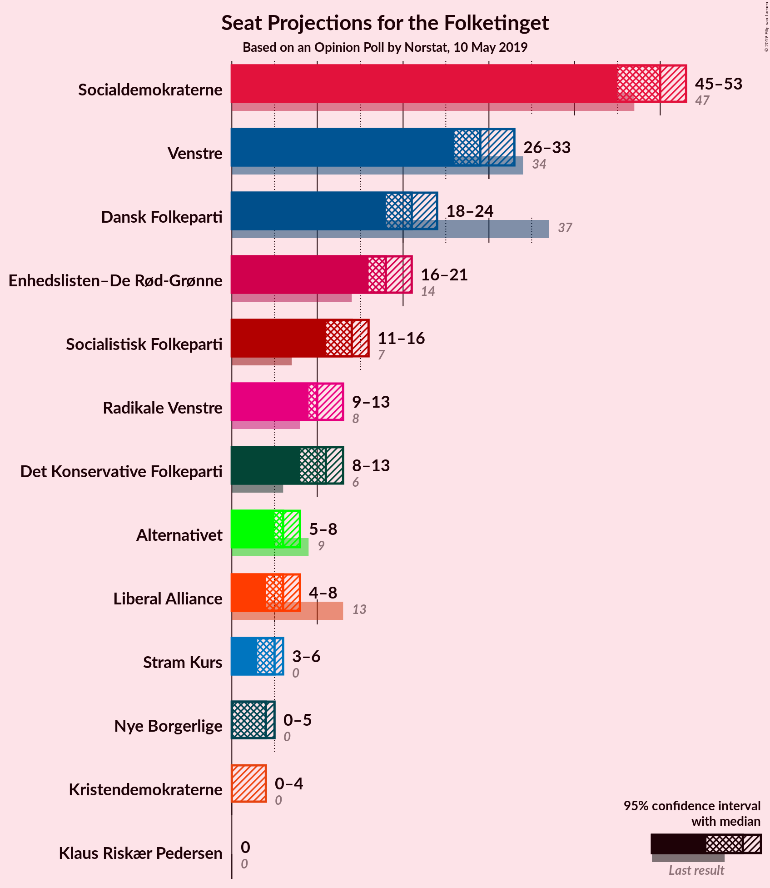

### Confidence Intervals

| Party | Last Result | Median | 80% Confidence Interval | 90% Confidence Interval | 95% Confidence Interval | 99% Confidence Interval |
|:-----:|:-----------:|:------:|:-----------------------:|:-----------------------:|:-----------------------:|:-----------------------:|
| <a href="#socialdemokraterne">Socialdemokraterne</a> | 47 | 47 | 47–53 |47–53 |47–55 |43–55 |
| <a href="#venstre">Venstre</a> | 34 | 29 | 28–31 |26–32 |26–32 |26–34 |
| <a href="#dansk-folkeparti">Dansk Folkeparti</a> | 37 | 20 | 20–23 |18–24 |18–26 |17–26 |
| <a href="#enhedslisten–de-rød-grønne">Enhedslisten–De Rød-Grønne</a> | 14 | 19 | 18–19 |17–19 |16–20 |15–21 |
| <a href="#socialistisk-folkeparti">Socialistisk Folkeparti</a> | 7 | 15 | 12–15 |11–15 |11–16 |10–18 |
| <a href="#radikale-venstre">Radikale Venstre</a> | 8 | 11 | 11–12 |9–12 |9–14 |9–15 |
| <a href="#det-konservative-folkeparti">Det Konservative Folkeparti</a> | 6 | 10 | 10 |9–11 |9–12 |8–14 |
| <a href="#alternativet">Alternativet</a> | 9 | 7 | 6–7 |5–7 |5–7 |5–8 |
| <a href="#liberal-alliance">Liberal Alliance</a> | 13 | 8 | 5–8 |5–8 |5–8 |0–10 |
| <a href="#stram-kurs">Stram Kurs</a> | 0 | 5 | 5 |4–5 |4–6 |0–7 |
| <a href="#nye-borgerlige">Nye Borgerlige</a> | 0 | 4 | 4 |4–5 |0–6 |0–7 |
| <a href="#kristendemokraterne">Kristendemokraterne</a> | 0 | 0 | 0 |0 |0–4 |0–4 |
| <a href="#klaus-riskær-pedersen">Klaus Riskær Pedersen</a> | 0 | 0 | 0 |0 |0 |0 |

### Socialdemokraterne

*For a full overview of the results for this party, see the [Socialdemokraterne](party-socialdemokraterne.html) page.*

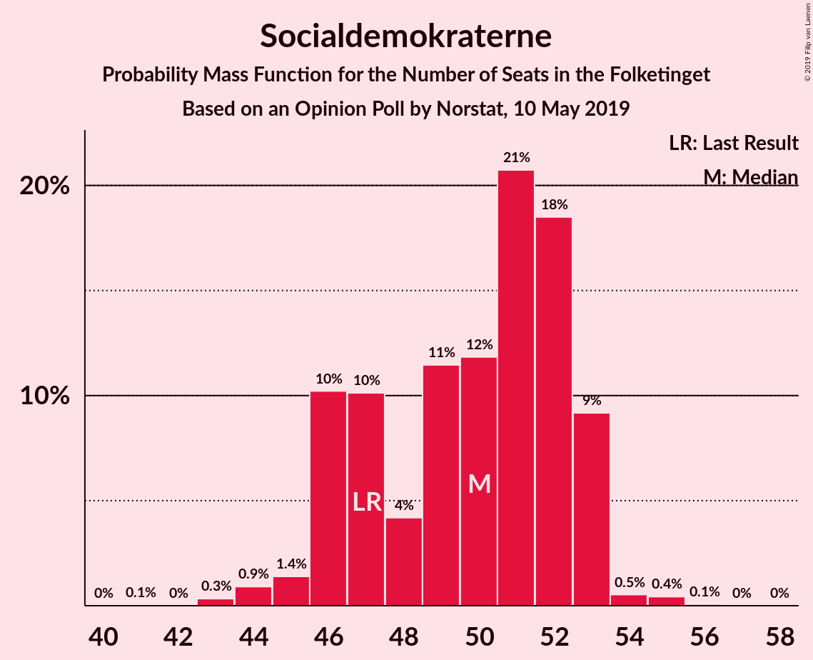

| Number of Seats | Probability | Accumulated | Special Marks |
|:---------------:|:-----------:|:-----------:|:-------------:|
| 43 | 0.9% | 100% |  |
| 44 | 0.5% | 99.1% |  |
| 45 | 0.3% | 98.6% |  |
| 46 | 0.4% | 98% |  |
| 47 | 77% | 98% | Last Result, Median |
| 48 | 6% | 21% |  |
| 49 | 2% | 15% |  |
| 50 | 2% | 13% |  |
| 51 | 0.4% | 11% |  |
| 52 | 0.3% | 11% |  |
| 53 | 7% | 10% |  |
| 54 | 0% | 4% |  |
| 55 | 4% | 4% |  |
| 56 | 0% | 0% |  |

### Venstre

*For a full overview of the results for this party, see the [Venstre](party-venstre.html) page.*

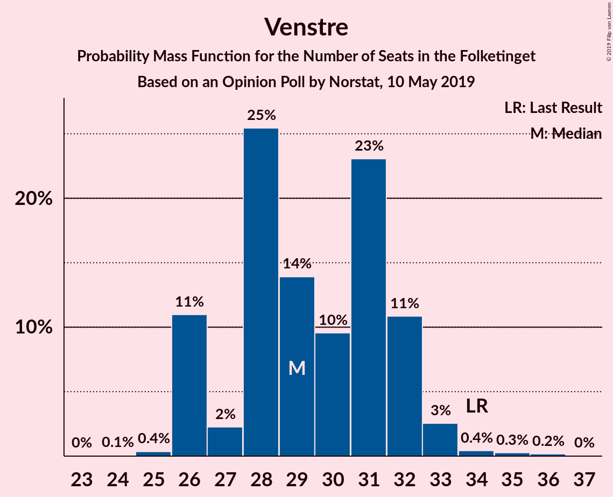

| Number of Seats | Probability | Accumulated | Special Marks |
|:---------------:|:-----------:|:-----------:|:-------------:|
| 24 | 0.1% | 100% |  |
| 25 | 0.1% | 99.9% |  |
| 26 | 5% | 99.8% |  |
| 27 | 4% | 95% |  |
| 28 | 0.5% | 90% |  |
| 29 | 75% | 90% | Median |
| 30 | 4% | 15% |  |
| 31 | 3% | 11% |  |
| 32 | 6% | 8% |  |
| 33 | 1.1% | 2% |  |
| 34 | 0.6% | 0.7% | Last Result |
| 35 | 0% | 0.1% |  |
| 36 | 0% | 0.1% |  |
| 37 | 0.1% | 0.1% |  |
| 38 | 0% | 0% |  |

### Dansk Folkeparti

*For a full overview of the results for this party, see the [Dansk Folkeparti](party-danskfolkeparti.html) page.*

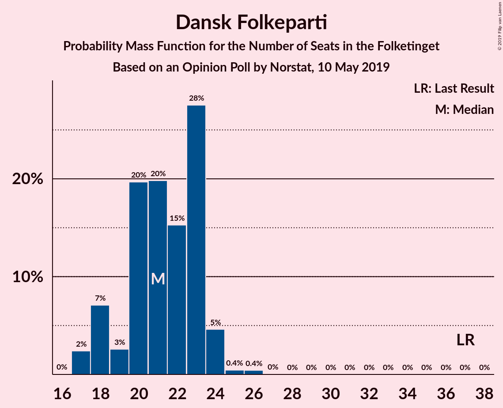

| Number of Seats | Probability | Accumulated | Special Marks |
|:---------------:|:-----------:|:-----------:|:-------------:|
| 15 | 0.1% | 100% |  |
| 16 | 0% | 99.9% |  |
| 17 | 2% | 99.9% |  |
| 18 | 5% | 98% |  |
| 19 | 1.1% | 93% |  |
| 20 | 78% | 92% | Median |
| 21 | 0.5% | 14% |  |
| 22 | 0.6% | 13% |  |
| 23 | 7% | 12% |  |
| 24 | 1.4% | 6% |  |
| 25 | 0% | 4% |  |
| 26 | 4% | 4% |  |
| 27 | 0% | 0% |  |
| 28 | 0% | 0% |  |
| 29 | 0% | 0% |  |
| 30 | 0% | 0% |  |
| 31 | 0% | 0% |  |
| 32 | 0% | 0% |  |
| 33 | 0% | 0% |  |
| 34 | 0% | 0% |  |
| 35 | 0% | 0% |  |
| 36 | 0% | 0% |  |
| 37 | 0% | 0% | Last Result |

### Enhedslisten–De Rød-Grønne

*For a full overview of the results for this party, see the [Enhedslisten–De Rød-Grønne](party-enhedslisten–derød-grønne.html) page.*

| Number of Seats | Probability | Accumulated | Special Marks |
|:---------------:|:-----------:|:-----------:|:-------------:|
| 14 | 0.3% | 100% | Last Result |
| 15 | 1.0% | 99.7% |  |
| 16 | 1.2% | 98.7% |  |
| 17 | 7% | 97% |  |
| 18 | 4% | 91% |  |
| 19 | 83% | 86% | Median |
| 20 | 2% | 3% |  |
| 21 | 1.2% | 2% |  |
| 22 | 0.2% | 0.3% |  |
| 23 | 0.1% | 0.1% |  |
| 24 | 0% | 0% |  |

### Socialistisk Folkeparti

*For a full overview of the results for this party, see the [Socialistisk Folkeparti](party-socialistiskfolkeparti.html) page.*

| Number of Seats | Probability | Accumulated | Special Marks |
|:---------------:|:-----------:|:-----------:|:-------------:|
| 7 | 0% | 100% | Last Result |
| 8 | 0% | 100% |  |
| 9 | 0% | 100% |  |
| 10 | 1.2% | 100% |  |
| 11 | 8% | 98.8% |  |
| 12 | 0.7% | 91% |  |
| 13 | 2% | 90% |  |
| 14 | 9% | 88% |  |
| 15 | 75% | 79% | Median |
| 16 | 1.0% | 3% |  |
| 17 | 0.4% | 2% |  |
| 18 | 2% | 2% |  |
| 19 | 0% | 0% |  |

### Radikale Venstre

*For a full overview of the results for this party, see the [Radikale Venstre](party-radikalevenstre.html) page.*

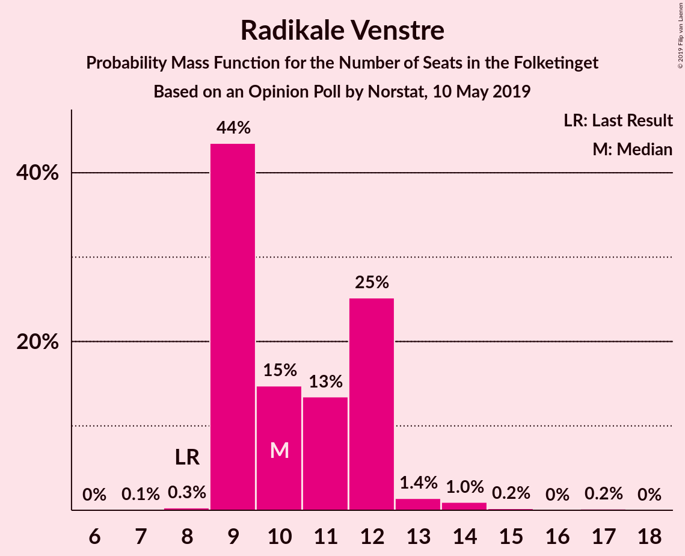

| Number of Seats | Probability | Accumulated | Special Marks |
|:---------------:|:-----------:|:-----------:|:-------------:|
| 7 | 0.4% | 100% |  |
| 8 | 0.1% | 99.6% | Last Result |
| 9 | 7% | 99.5% |  |
| 10 | 1.2% | 93% |  |
| 11 | 80% | 92% | Median |
| 12 | 7% | 12% |  |
| 13 | 2% | 5% |  |
| 14 | 2% | 3% |  |
| 15 | 0.8% | 0.9% |  |
| 16 | 0% | 0% |  |

### Det Konservative Folkeparti

*For a full overview of the results for this party, see the [Det Konservative Folkeparti](party-detkonservativefolkeparti.html) page.*

| Number of Seats | Probability | Accumulated | Special Marks |
|:---------------:|:-----------:|:-----------:|:-------------:|
| 6 | 0% | 100% | Last Result |
| 7 | 0.3% | 100% |  |
| 8 | 0.3% | 99.7% |  |
| 9 | 6% | 99.3% |  |
| 10 | 83% | 93% | Median |
| 11 | 6% | 10% |  |
| 12 | 2% | 4% |  |
| 13 | 1.1% | 2% |  |
| 14 | 0.3% | 0.7% |  |
| 15 | 0.3% | 0.3% |  |
| 16 | 0% | 0% |  |

### Alternativet

*For a full overview of the results for this party, see the [Alternativet](party-alternativet.html) page.*

| Number of Seats | Probability | Accumulated | Special Marks |
|:---------------:|:-----------:|:-----------:|:-------------:|
| 4 | 0.1% | 100% |  |
| 5 | 5% | 99.9% |  |
| 6 | 10% | 95% |  |
| 7 | 85% | 85% | Median |
| 8 | 0.5% | 0.7% |  |
| 9 | 0% | 0.1% | Last Result |
| 10 | 0.1% | 0.1% |  |
| 11 | 0% | 0% |  |

### Liberal Alliance

*For a full overview of the results for this party, see the [Liberal Alliance](party-liberalalliance.html) page.*

| Number of Seats | Probability | Accumulated | Special Marks |
|:---------------:|:-----------:|:-----------:|:-------------:|
| 0 | 2% | 100% |  |
| 1 | 0% | 98% |  |
| 2 | 0% | 98% |  |
| 3 | 0% | 98% |  |
| 4 | 0.5% | 98% |  |
| 5 | 8% | 98% |  |
| 6 | 8% | 89% |  |
| 7 | 6% | 82% |  |
| 8 | 75% | 76% | Median |
| 9 | 0.1% | 0.7% |  |
| 10 | 0.6% | 0.6% |  |
| 11 | 0% | 0% |  |
| 12 | 0% | 0% |  |
| 13 | 0% | 0% | Last Result |

### Stram Kurs

*For a full overview of the results for this party, see the [Stram Kurs](party-stramkurs.html) page.*

| Number of Seats | Probability | Accumulated | Special Marks |
|:---------------:|:-----------:|:-----------:|:-------------:|
| 0 | 0.9% | 100% | Last Result |
| 1 | 0% | 99.1% |  |
| 2 | 0% | 99.1% |  |
| 3 | 0% | 99.1% |  |
| 4 | 7% | 99.1% |  |
| 5 | 89% | 92% | Median |
| 6 | 2% | 3% |  |
| 7 | 0.5% | 0.7% |  |
| 8 | 0.2% | 0.2% |  |
| 9 | 0% | 0% |  |

### Nye Borgerlige

*For a full overview of the results for this party, see the [Nye Borgerlige](party-nyeborgerlige.html) page.*

| Number of Seats | Probability | Accumulated | Special Marks |
|:---------------:|:-----------:|:-----------:|:-------------:|
| 0 | 5% | 100% | Last Result |
| 1 | 0% | 95% |  |
| 2 | 0% | 95% |  |
| 3 | 0% | 95% |  |
| 4 | 88% | 95% | Median |
| 5 | 4% | 7% |  |
| 6 | 0.9% | 3% |  |
| 7 | 2% | 2% |  |
| 8 | 0% | 0% |  |

### Kristendemokraterne

*For a full overview of the results for this party, see the [Kristendemokraterne](party-kristendemokraterne.html) page.*

| Number of Seats | Probability | Accumulated | Special Marks |
|:---------------:|:-----------:|:-----------:|:-------------:|
| 0 | 95% | 100% | Last Result, Median |
| 1 | 0% | 5% |  |
| 2 | 0% | 5% |  |
| 3 | 0% | 5% |  |
| 4 | 5% | 5% |  |
| 5 | 0% | 0% |  |

### Klaus Riskær Pedersen

*For a full overview of the results for this party, see the [Klaus Riskær Pedersen](party-klausriskærpedersen.html) page.*

| Number of Seats | Probability | Accumulated | Special Marks |
|:---------------:|:-----------:|:-----------:|:-------------:|
| 0 | 99.5% | 100% | Last Result, Median |
| 1 | 0% | 0.5% |  |
| 2 | 0% | 0.5% |  |
| 3 | 0% | 0.5% |  |
| 4 | 0.5% | 0.5% |  |
| 5 | 0% | 0% |  |

## Coalitions

### Confidence Intervals

| Coalition | Last Result | Median | Majority? | 80% Confidence Interval | 90% Confidence Interval | 95% Confidence Interval | 99% Confidence Interval |
|:---------:|:-----------:|:------:|:---------:|:-----------------------:|:-----------------------:|:-----------------------:|:-----------------------:|
| Socialdemokraterne – Enhedslisten–De Rød-Grønne – Socialistisk Folkeparti – Radikale Venstre – Alternativet | 85 | 99 | 99.9% | 96–99 | 96–104 | 94–104 | 94–104 |
| Socialdemokraterne – Enhedslisten–De Rød-Grønne – Socialistisk Folkeparti – Radikale Venstre | 76 | 92 | 97% | 90–93 | 90–98 | 89–99 | 87–99 |
| Socialdemokraterne – Enhedslisten–De Rød-Grønne – Socialistisk Folkeparti – Alternativet | 77 | 88 | 7% | 87–88 | 86–91 | 83–93 | 81–93 |
| Socialdemokraterne – Enhedslisten–De Rød-Grønne – Socialistisk Folkeparti | 68 | 81 | 0% | 81 | 80–84 | 78–88 | 74–88 |
| Venstre – Dansk Folkeparti – Det Konservative Folkeparti – Liberal Alliance – Stram Kurs – Nye Borgerlige – Kristendemokraterne – Klaus Riskær Pedersen | 90 | 76 | 0% | 76–79 | 71–79 | 71–81 | 71–81 |
| Socialdemokraterne – Socialistisk Folkeparti – Radikale Venstre | 62 | 73 | 0% | 73–74 | 73–79 | 71–80 | 67–80 |
| Venstre – Dansk Folkeparti – Det Konservative Folkeparti – Liberal Alliance – Nye Borgerlige – Kristendemokraterne – Klaus Riskær Pedersen | 90 | 71 | 0% | 71–74 | 66–74 | 66–76 | 66–78 |
| Venstre – Dansk Folkeparti – Det Konservative Folkeparti – Liberal Alliance – Nye Borgerlige – Kristendemokraterne | 90 | 71 | 0% | 71–74 | 66–74 | 66–76 | 66–77 |
| Venstre – Dansk Folkeparti – Det Konservative Folkeparti – Liberal Alliance – Nye Borgerlige – Klaus Riskær Pedersen | 90 | 71 | 0% | 70–73 | 66–74 | 62–76 | 62–77 |
| Venstre – Dansk Folkeparti – Det Konservative Folkeparti – Liberal Alliance – Nye Borgerlige | 90 | 71 | 0% | 70–73 | 66–74 | 62–75 | 62–77 |
| Venstre – Dansk Folkeparti – Det Konservative Folkeparti – Liberal Alliance – Kristendemokraterne | 90 | 67 | 0% | 67–69 | 65–70 | 62–71 | 62–74 |
| Venstre – Dansk Folkeparti – Det Konservative Folkeparti – Liberal Alliance | 90 | 67 | 0% | 67–69 | 62–70 | 62–70 | 61–72 |
| Socialdemokraterne – Radikale Venstre | 55 | 58 | 0% | 58–62 | 58–63 | 58–66 | 55–66 |
| Venstre – Det Konservative Folkeparti – Liberal Alliance | 53 | 47 | 0% | 44–47 | 42–47 | 42–49 | 41–53 |
| Venstre – Det Konservative Folkeparti | 40 | 39 | 0% | 39–42 | 36–42 | 35–42 | 35–46 |
| Venstre | 34 | 29 | 0% | 28–31 | 26–32 | 26–32 | 26–34 |

### Socialdemokraterne – Enhedslisten–De Rød-Grønne – Socialistisk Folkeparti – Radikale Venstre – Alternativet

| Number of Seats | Probability | Accumulated | Special Marks |
|:---------------:|:-----------:|:-----------:|:-------------:|
| 85 | 0% | 100% | Last Result |
| 86 | 0% | 100% |  |
| 87 | 0% | 100% |  |
| 88 | 0% | 100% |  |
| 89 | 0.1% | 100% |  |
| 90 | 0% | 99.9% | Majority |
| 91 | 0% | 99.9% |  |
| 92 | 0% | 99.9% |  |
| 93 | 0.4% | 99.9% |  |
| 94 | 2% | 99.5% |  |
| 95 | 0.7% | 97% |  |
| 96 | 7% | 97% |  |
| 97 | 0.5% | 90% |  |
| 98 | 0.4% | 89% |  |
| 99 | 79% | 89% | Median |
| 100 | 2% | 10% |  |
| 101 | 0.7% | 7% |  |
| 102 | 0.2% | 7% |  |
| 103 | 0.3% | 6% |  |
| 104 | 6% | 6% |  |
| 105 | 0.1% | 0.4% |  |
| 106 | 0% | 0.3% |  |
| 107 | 0.3% | 0.3% |  |
| 108 | 0% | 0% |  |

### Socialdemokraterne – Enhedslisten–De Rød-Grønne – Socialistisk Folkeparti – Radikale Venstre

| Number of Seats | Probability | Accumulated | Special Marks |
|:---------------:|:-----------:|:-----------:|:-------------:|
| 76 | 0% | 100% | Last Result |
| 77 | 0% | 100% |  |
| 78 | 0% | 100% |  |
| 79 | 0% | 100% |  |
| 80 | 0% | 100% |  |
| 81 | 0% | 100% |  |
| 82 | 0% | 100% |  |
| 83 | 0% | 100% |  |
| 84 | 0.1% | 100% |  |
| 85 | 0% | 99.9% |  |
| 86 | 0% | 99.9% |  |
| 87 | 2% | 99.9% |  |
| 88 | 0.2% | 98% |  |
| 89 | 0.3% | 98% |  |
| 90 | 8% | 97% | Majority |
| 91 | 0.1% | 89% |  |
| 92 | 79% | 89% | Median |
| 93 | 3% | 10% |  |
| 94 | 0.4% | 7% |  |
| 95 | 0.2% | 7% |  |
| 96 | 0.3% | 7% |  |
| 97 | 0.3% | 6% |  |
| 98 | 2% | 6% |  |
| 99 | 3% | 4% |  |
| 100 | 0.2% | 0.3% |  |
| 101 | 0% | 0% |  |

### Socialdemokraterne – Enhedslisten–De Rød-Grønne – Socialistisk Folkeparti – Alternativet

| Number of Seats | Probability | Accumulated | Special Marks |
|:---------------:|:-----------:|:-----------:|:-------------:|
| 77 | 0% | 100% | Last Result |
| 78 | 0.1% | 100% |  |
| 79 | 0% | 99.9% |  |
| 80 | 0% | 99.9% |  |
| 81 | 1.1% | 99.9% |  |
| 82 | 0.8% | 98.7% |  |
| 83 | 0.8% | 98% |  |
| 84 | 0.6% | 97% |  |
| 85 | 1.4% | 97% |  |
| 86 | 0.3% | 95% |  |
| 87 | 11% | 95% |  |
| 88 | 75% | 84% | Median |
| 89 | 2% | 9% |  |
| 90 | 2% | 7% | Majority |
| 91 | 0.6% | 5% |  |
| 92 | 0.9% | 5% |  |
| 93 | 3% | 4% |  |
| 94 | 0.2% | 0.2% |  |
| 95 | 0% | 0.1% |  |
| 96 | 0.1% | 0.1% |  |
| 97 | 0% | 0% |  |

### Socialdemokraterne – Enhedslisten–De Rød-Grønne – Socialistisk Folkeparti

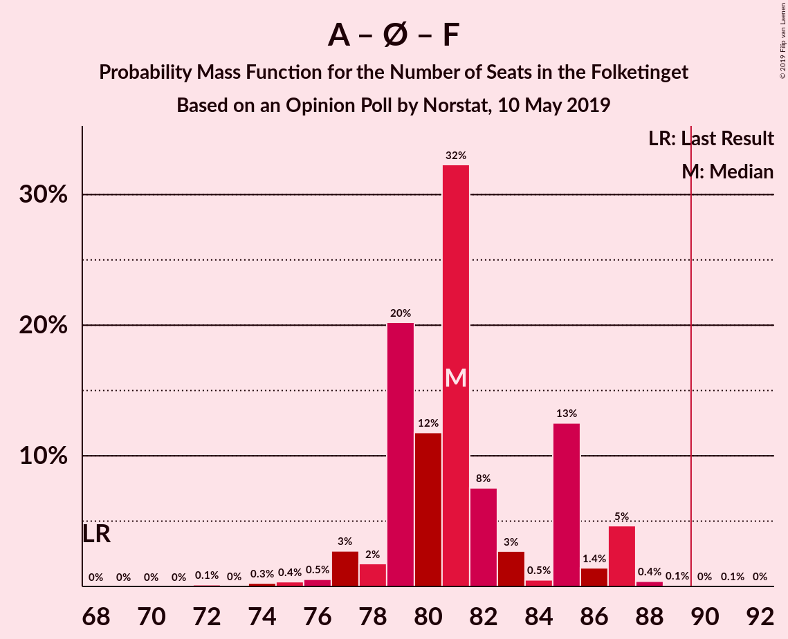

| Number of Seats | Probability | Accumulated | Special Marks |
|:---------------:|:-----------:|:-----------:|:-------------:|
| 68 | 0% | 100% | Last Result |
| 69 | 0% | 100% |  |
| 70 | 0% | 100% |  |
| 71 | 0% | 100% |  |
| 72 | 0% | 100% |  |
| 73 | 0.1% | 100% |  |
| 74 | 1.0% | 99.9% |  |
| 75 | 0.8% | 98.9% |  |
| 76 | 0.1% | 98% |  |
| 77 | 0.3% | 98% |  |
| 78 | 2% | 98% |  |
| 79 | 0.4% | 96% |  |
| 80 | 5% | 95% |  |
| 81 | 81% | 90% | Median |
| 82 | 2% | 9% |  |
| 83 | 0.3% | 7% |  |
| 84 | 2% | 7% |  |
| 85 | 0.9% | 5% |  |
| 86 | 0.2% | 4% |  |
| 87 | 0% | 4% |  |
| 88 | 4% | 4% |  |
| 89 | 0.1% | 0.1% |  |
| 90 | 0% | 0% | Majority |

### Venstre – Dansk Folkeparti – Det Konservative Folkeparti – Liberal Alliance – Stram Kurs – Nye Borgerlige – Kristendemokraterne – Klaus Riskær Pedersen

| Number of Seats | Probability | Accumulated | Special Marks |
|:---------------:|:-----------:|:-----------:|:-------------:|
| 68 | 0.3% | 100% |  |
| 69 | 0% | 99.7% |  |
| 70 | 0.1% | 99.7% |  |
| 71 | 6% | 99.6% |  |
| 72 | 0.3% | 94% |  |
| 73 | 0.2% | 94% |  |
| 74 | 0.7% | 93% |  |
| 75 | 2% | 93% |  |
| 76 | 79% | 90% | Median |
| 77 | 0.4% | 11% |  |
| 78 | 0.5% | 11% |  |
| 79 | 7% | 10% |  |
| 80 | 0.7% | 3% |  |
| 81 | 2% | 3% |  |
| 82 | 0.4% | 0.5% |  |
| 83 | 0% | 0.1% |  |
| 84 | 0% | 0.1% |  |
| 85 | 0% | 0.1% |  |
| 86 | 0.1% | 0.1% |  |
| 87 | 0% | 0% |  |
| 88 | 0% | 0% |  |
| 89 | 0% | 0% |  |
| 90 | 0% | 0% | Last Result, Majority |

### Socialdemokraterne – Socialistisk Folkeparti – Radikale Venstre

| Number of Seats | Probability | Accumulated | Special Marks |
|:---------------:|:-----------:|:-----------:|:-------------:|
| 62 | 0% | 100% | Last Result |
| 63 | 0% | 100% |  |
| 64 | 0% | 100% |  |
| 65 | 0% | 100% |  |
| 66 | 0.3% | 100% |  |
| 67 | 0.2% | 99.7% |  |
| 68 | 0.1% | 99.5% |  |
| 69 | 0.8% | 99.3% |  |
| 70 | 0.3% | 98.6% |  |
| 71 | 1.2% | 98% |  |
| 72 | 1.5% | 97% |  |
| 73 | 81% | 96% | Median |
| 74 | 7% | 14% |  |
| 75 | 0.3% | 7% |  |
| 76 | 0.6% | 7% |  |
| 77 | 0.6% | 7% |  |
| 78 | 0.1% | 6% |  |
| 79 | 2% | 6% |  |
| 80 | 3% | 4% |  |
| 81 | 0.2% | 0.3% |  |
| 82 | 0% | 0% |  |

### Venstre – Dansk Folkeparti – Det Konservative Folkeparti – Liberal Alliance – Nye Borgerlige – Kristendemokraterne – Klaus Riskær Pedersen

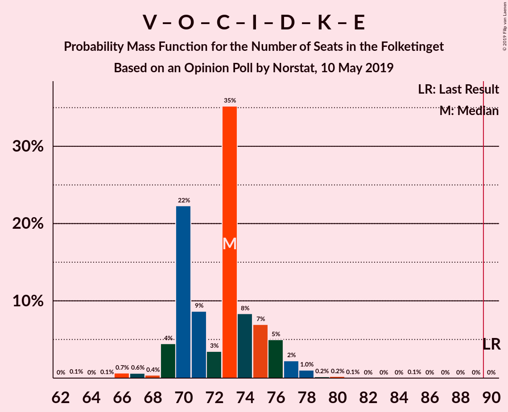

| Number of Seats | Probability | Accumulated | Special Marks |
|:---------------:|:-----------:|:-----------:|:-------------:|
| 64 | 0% | 100% |  |
| 65 | 0.2% | 99.9% |  |
| 66 | 5% | 99.8% |  |
| 67 | 0.4% | 94% |  |
| 68 | 0.4% | 94% |  |
| 69 | 2% | 93% |  |
| 70 | 1.2% | 91% |  |
| 71 | 75% | 90% | Median |
| 72 | 5% | 16% |  |
| 73 | 0.7% | 11% |  |
| 74 | 7% | 10% |  |
| 75 | 0.4% | 3% |  |
| 76 | 1.0% | 3% |  |
| 77 | 1.2% | 2% |  |
| 78 | 0.3% | 0.8% |  |
| 79 | 0.4% | 0.5% |  |
| 80 | 0.1% | 0.1% |  |
| 81 | 0% | 0% |  |
| 82 | 0% | 0% |  |
| 83 | 0% | 0% |  |
| 84 | 0% | 0% |  |
| 85 | 0% | 0% |  |
| 86 | 0% | 0% |  |
| 87 | 0% | 0% |  |
| 88 | 0% | 0% |  |
| 89 | 0% | 0% |  |
| 90 | 0% | 0% | Last Result, Majority |

### Venstre – Dansk Folkeparti – Det Konservative Folkeparti – Liberal Alliance – Nye Borgerlige – Kristendemokraterne

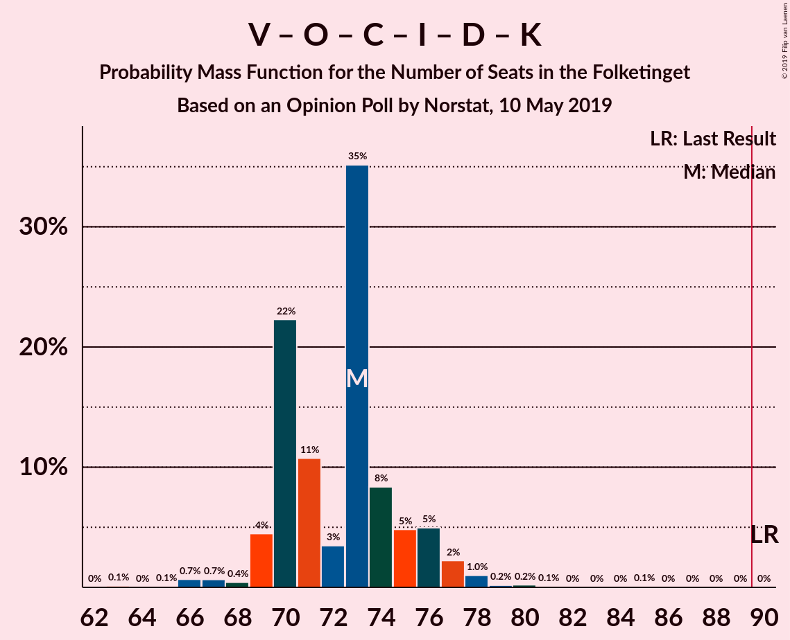

| Number of Seats | Probability | Accumulated | Special Marks |
|:---------------:|:-----------:|:-----------:|:-------------:|
| 64 | 0% | 100% |  |
| 65 | 0.2% | 99.9% |  |
| 66 | 5% | 99.8% |  |
| 67 | 0.4% | 94% |  |
| 68 | 0.4% | 94% |  |
| 69 | 2% | 93% |  |
| 70 | 1.2% | 91% |  |
| 71 | 75% | 90% | Median |
| 72 | 5% | 15% |  |
| 73 | 0.6% | 11% |  |
| 74 | 7% | 10% |  |
| 75 | 0.4% | 3% |  |
| 76 | 1.0% | 3% |  |
| 77 | 1.2% | 2% |  |
| 78 | 0% | 0.5% |  |
| 79 | 0.4% | 0.5% |  |
| 80 | 0.1% | 0.1% |  |
| 81 | 0% | 0% |  |
| 82 | 0% | 0% |  |
| 83 | 0% | 0% |  |
| 84 | 0% | 0% |  |
| 85 | 0% | 0% |  |
| 86 | 0% | 0% |  |
| 87 | 0% | 0% |  |
| 88 | 0% | 0% |  |
| 89 | 0% | 0% |  |
| 90 | 0% | 0% | Last Result, Majority |

### Venstre – Dansk Folkeparti – Det Konservative Folkeparti – Liberal Alliance – Nye Borgerlige – Klaus Riskær Pedersen

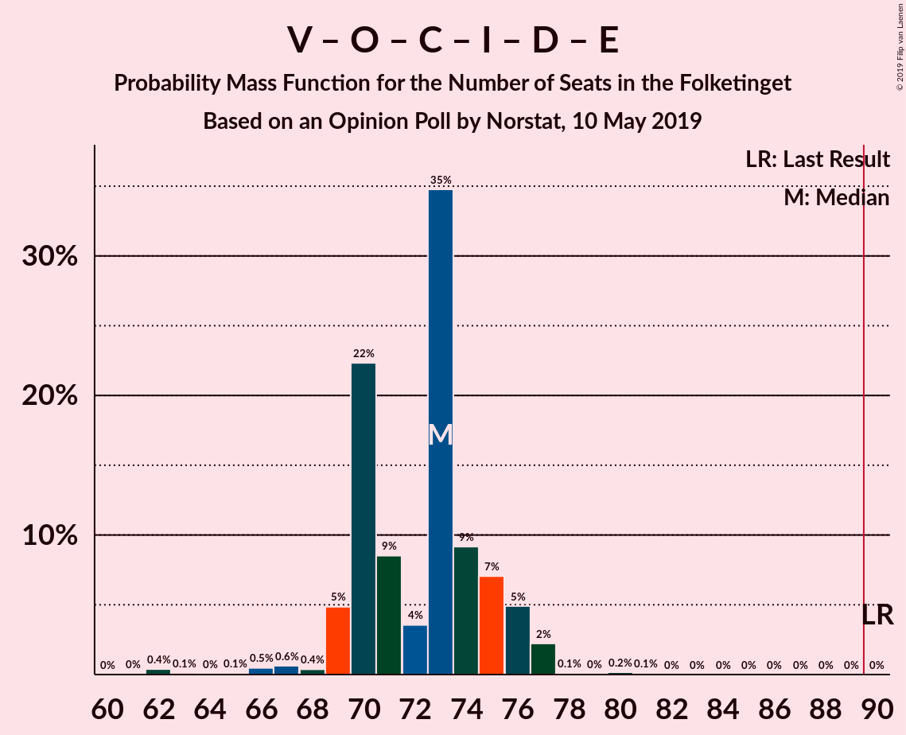

| Number of Seats | Probability | Accumulated | Special Marks |
|:---------------:|:-----------:|:-----------:|:-------------:|
| 61 | 0.1% | 100% |  |
| 62 | 3% | 99.9% |  |
| 63 | 0% | 96% |  |
| 64 | 0.3% | 96% |  |
| 65 | 0.1% | 96% |  |
| 66 | 2% | 96% |  |
| 67 | 0.4% | 94% |  |
| 68 | 0.2% | 93% |  |
| 69 | 2% | 93% |  |
| 70 | 1.0% | 91% |  |
| 71 | 75% | 90% | Median |
| 72 | 5% | 15% |  |
| 73 | 0.9% | 11% |  |
| 74 | 6% | 10% |  |
| 75 | 0.7% | 3% |  |
| 76 | 1.0% | 3% |  |
| 77 | 1.0% | 1.5% |  |
| 78 | 0.3% | 0.4% |  |
| 79 | 0% | 0.1% |  |
| 80 | 0.1% | 0.1% |  |
| 81 | 0% | 0% |  |
| 82 | 0% | 0% |  |
| 83 | 0% | 0% |  |
| 84 | 0% | 0% |  |
| 85 | 0% | 0% |  |
| 86 | 0% | 0% |  |
| 87 | 0% | 0% |  |
| 88 | 0% | 0% |  |
| 89 | 0% | 0% |  |
| 90 | 0% | 0% | Last Result, Majority |

### Venstre – Dansk Folkeparti – Det Konservative Folkeparti – Liberal Alliance – Nye Borgerlige

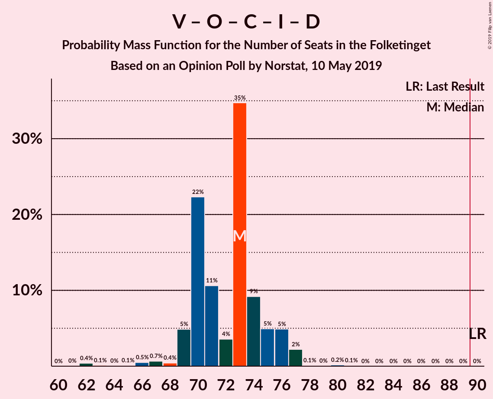

| Number of Seats | Probability | Accumulated | Special Marks |
|:---------------:|:-----------:|:-----------:|:-------------:|
| 61 | 0.1% | 100% |  |
| 62 | 3% | 99.9% |  |
| 63 | 0% | 96% |  |
| 64 | 0.3% | 96% |  |
| 65 | 0.1% | 96% |  |
| 66 | 2% | 96% |  |
| 67 | 0.4% | 94% |  |
| 68 | 0.2% | 93% |  |
| 69 | 2% | 93% |  |
| 70 | 1.0% | 91% |  |
| 71 | 75% | 90% | Median |
| 72 | 5% | 15% |  |
| 73 | 0.8% | 10% |  |
| 74 | 7% | 10% |  |
| 75 | 0.7% | 3% |  |
| 76 | 1.0% | 2% |  |
| 77 | 1.0% | 1.1% |  |
| 78 | 0% | 0.1% |  |
| 79 | 0% | 0.1% |  |
| 80 | 0.1% | 0.1% |  |
| 81 | 0% | 0% |  |
| 82 | 0% | 0% |  |
| 83 | 0% | 0% |  |
| 84 | 0% | 0% |  |
| 85 | 0% | 0% |  |
| 86 | 0% | 0% |  |
| 87 | 0% | 0% |  |
| 88 | 0% | 0% |  |
| 89 | 0% | 0% |  |
| 90 | 0% | 0% | Last Result, Majority |

### Venstre – Dansk Folkeparti – Det Konservative Folkeparti – Liberal Alliance – Kristendemokraterne

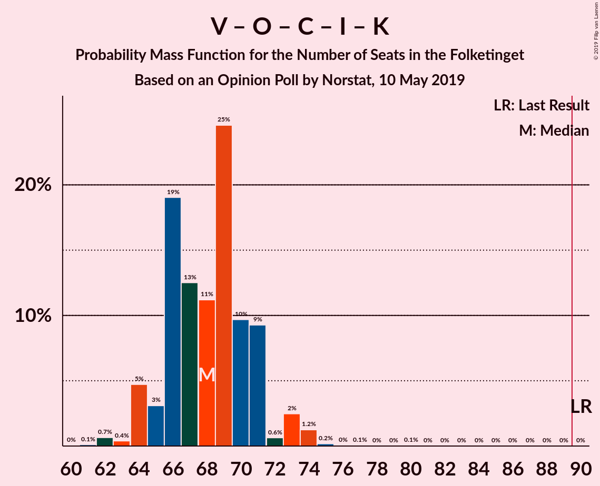

| Number of Seats | Probability | Accumulated | Special Marks |
|:---------------:|:-----------:|:-----------:|:-------------:|
| 61 | 0.2% | 100% |  |
| 62 | 4% | 99.8% |  |
| 63 | 0.5% | 96% |  |
| 64 | 0.3% | 95% |  |
| 65 | 0.7% | 95% |  |
| 66 | 4% | 94% |  |
| 67 | 75% | 91% | Median |
| 68 | 6% | 16% |  |
| 69 | 0.6% | 10% |  |
| 70 | 7% | 10% |  |
| 71 | 1.1% | 3% |  |
| 72 | 1.1% | 2% |  |
| 73 | 0% | 0.6% |  |
| 74 | 0.4% | 0.5% |  |
| 75 | 0% | 0.1% |  |
| 76 | 0.1% | 0.1% |  |
| 77 | 0% | 0% |  |
| 78 | 0% | 0% |  |
| 79 | 0% | 0% |  |
| 80 | 0% | 0% |  |
| 81 | 0% | 0% |  |
| 82 | 0% | 0% |  |
| 83 | 0% | 0% |  |
| 84 | 0% | 0% |  |
| 85 | 0% | 0% |  |
| 86 | 0% | 0% |  |
| 87 | 0% | 0% |  |
| 88 | 0% | 0% |  |
| 89 | 0% | 0% |  |
| 90 | 0% | 0% | Last Result, Majority |

### Venstre – Dansk Folkeparti – Det Konservative Folkeparti – Liberal Alliance

| Number of Seats | Probability | Accumulated | Special Marks |
|:---------------:|:-----------:|:-----------:|:-------------:|
| 60 | 0.3% | 100% |  |
| 61 | 0.6% | 99.7% |  |
| 62 | 7% | 99.1% |  |
| 63 | 0.5% | 92% |  |
| 64 | 0.1% | 91% |  |
| 65 | 0.4% | 91% |  |
| 66 | 0.3% | 91% |  |
| 67 | 75% | 90% | Median |
| 68 | 6% | 16% |  |
| 69 | 0.4% | 10% |  |
| 70 | 7% | 10% |  |
| 71 | 1.0% | 2% |  |
| 72 | 1.1% | 1.3% |  |
| 73 | 0% | 0.2% |  |
| 74 | 0% | 0.2% |  |
| 75 | 0% | 0.1% |  |
| 76 | 0.1% | 0.1% |  |
| 77 | 0% | 0% |  |
| 78 | 0% | 0% |  |
| 79 | 0% | 0% |  |
| 80 | 0% | 0% |  |
| 81 | 0% | 0% |  |
| 82 | 0% | 0% |  |
| 83 | 0% | 0% |  |
| 84 | 0% | 0% |  |
| 85 | 0% | 0% |  |
| 86 | 0% | 0% |  |
| 87 | 0% | 0% |  |
| 88 | 0% | 0% |  |
| 89 | 0% | 0% |  |
| 90 | 0% | 0% | Last Result, Majority |

### Socialdemokraterne – Radikale Venstre

| Number of Seats | Probability | Accumulated | Special Marks |
|:---------------:|:-----------:|:-----------:|:-------------:|
| 54 | 0.4% | 100% |  |
| 55 | 0.8% | 99.6% | Last Result |
| 56 | 0.7% | 98.7% |  |
| 57 | 0.4% | 98% |  |
| 58 | 75% | 98% | Median |
| 59 | 0.3% | 22% |  |
| 60 | 5% | 22% |  |
| 61 | 4% | 17% |  |
| 62 | 8% | 13% |  |
| 63 | 1.3% | 5% |  |
| 64 | 0.2% | 4% |  |
| 65 | 0% | 4% |  |
| 66 | 3% | 4% |  |
| 67 | 0% | 0.3% |  |
| 68 | 0.2% | 0.3% |  |
| 69 | 0% | 0% |  |

### Venstre – Det Konservative Folkeparti – Liberal Alliance

| Number of Seats | Probability | Accumulated | Special Marks |
|:---------------:|:-----------:|:-----------:|:-------------:|
| 38 | 0.1% | 100% |  |
| 39 | 0% | 99.9% |  |
| 40 | 0% | 99.9% |  |
| 41 | 0.5% | 99.9% |  |
| 42 | 7% | 99.4% |  |
| 43 | 0.2% | 93% |  |
| 44 | 4% | 92% |  |
| 45 | 2% | 88% |  |
| 46 | 0.7% | 86% |  |
| 47 | 81% | 86% | Median |
| 48 | 2% | 4% |  |
| 49 | 0.6% | 3% |  |
| 50 | 1.3% | 2% |  |
| 51 | 0% | 1.0% |  |
| 52 | 0.1% | 1.0% |  |
| 53 | 0.9% | 0.9% | Last Result |
| 54 | 0% | 0% |  |

### Venstre – Det Konservative Folkeparti

| Number of Seats | Probability | Accumulated | Special Marks |
|:---------------:|:-----------:|:-----------:|:-------------:|
| 32 | 0.1% | 100% |  |
| 33 | 0% | 99.9% |  |
| 34 | 0% | 99.9% |  |
| 35 | 4% | 99.9% |  |
| 36 | 0.7% | 96% |  |
| 37 | 0.5% | 95% |  |
| 38 | 4% | 94% |  |
| 39 | 76% | 90% | Median |
| 40 | 0.6% | 14% | Last Result |
| 41 | 0.6% | 13% |  |
| 42 | 11% | 12% |  |
| 43 | 0.4% | 2% |  |
| 44 | 0.5% | 1.5% |  |
| 45 | 0.1% | 1.0% |  |
| 46 | 0.8% | 0.9% |  |
| 47 | 0% | 0.1% |  |
| 48 | 0.1% | 0.1% |  |
| 49 | 0% | 0% |  |

### Venstre

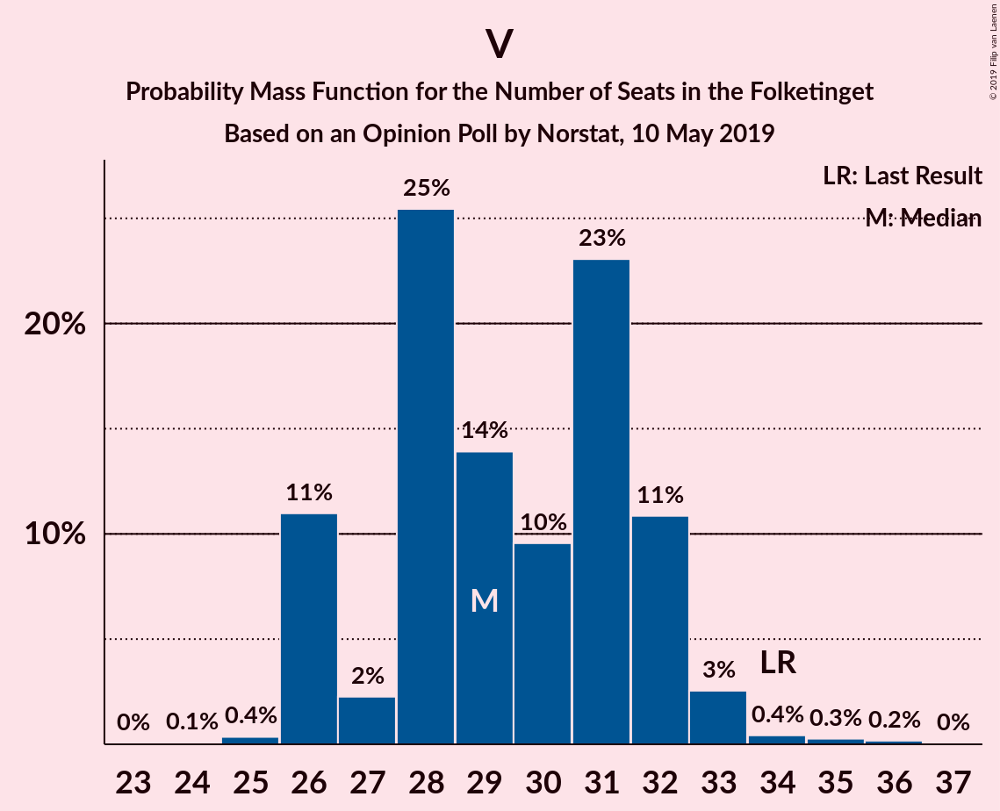

| Number of Seats | Probability | Accumulated | Special Marks |
|:---------------:|:-----------:|:-----------:|:-------------:|
| 24 | 0.1% | 100% |  |
| 25 | 0.1% | 99.9% |  |
| 26 | 5% | 99.8% |  |
| 27 | 4% | 95% |  |
| 28 | 0.5% | 90% |  |
| 29 | 75% | 90% | Median |
| 30 | 4% | 15% |  |
| 31 | 3% | 11% |  |
| 32 | 6% | 8% |  |
| 33 | 1.1% | 2% |  |
| 34 | 0.6% | 0.7% | Last Result |
| 35 | 0% | 0.1% |  |
| 36 | 0% | 0.1% |  |
| 37 | 0.1% | 0.1% |  |
| 38 | 0% | 0% |  |

## Technical Information

### Opinion Poll

+ **Polling firm:** Norstat
+ **Commissioner(s):** —
+ **Fieldwork period:** 10 May 2019

### Calculations

+ **Sample size:** 1207
+ **Simulations done:** 131,072
+ **Error estimate:** 3.28%

