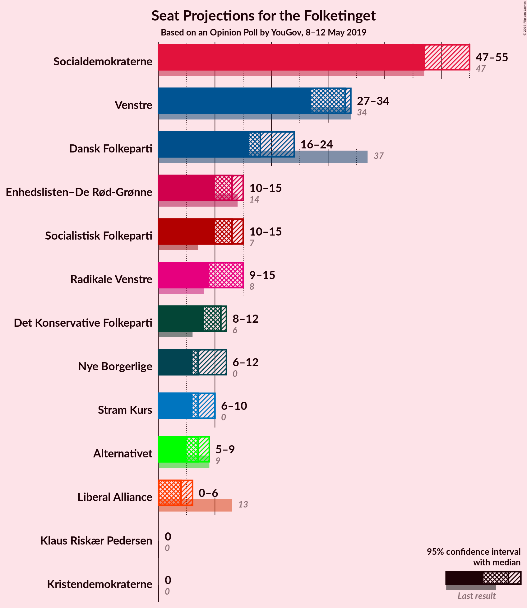
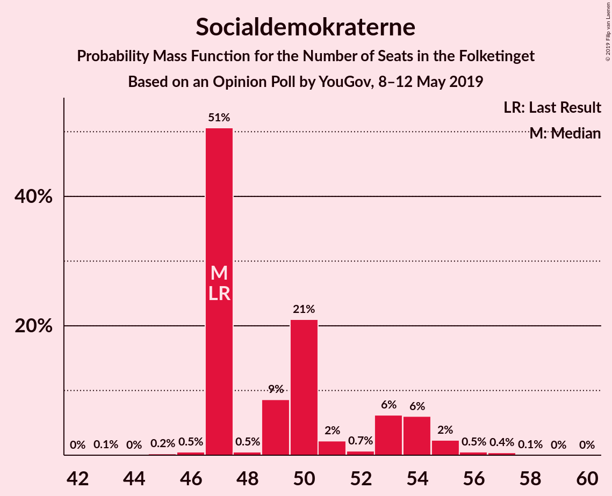
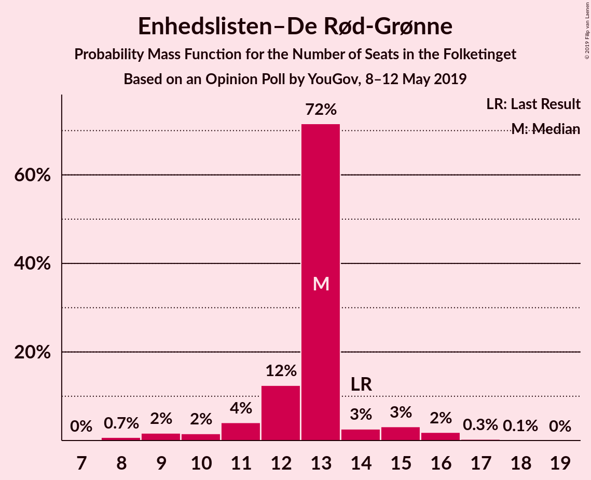
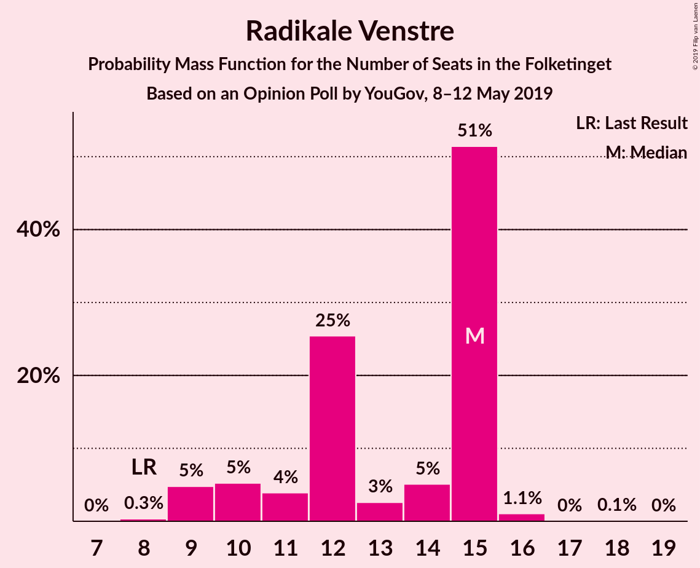
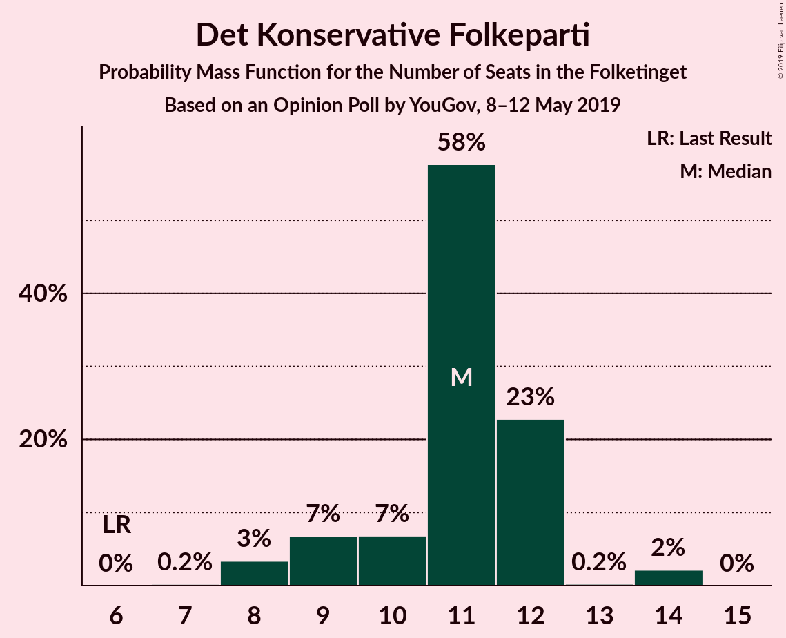
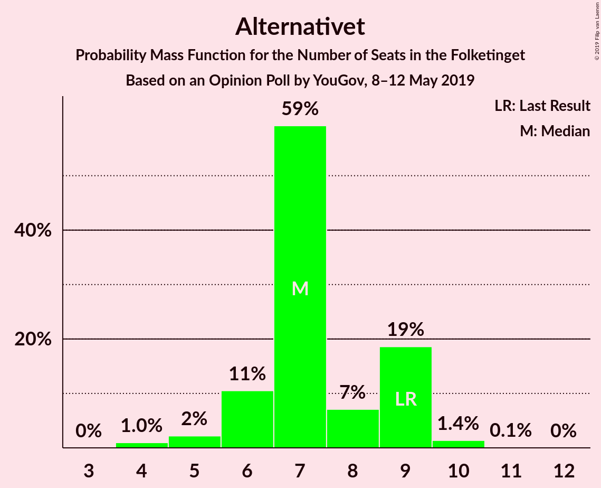
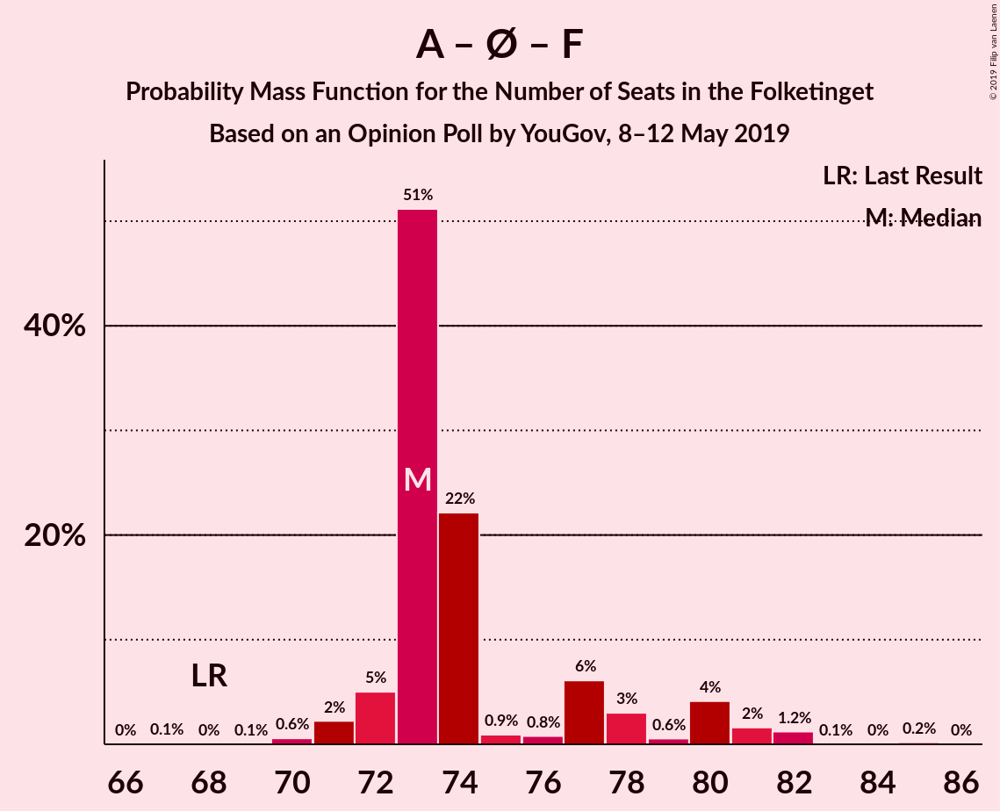
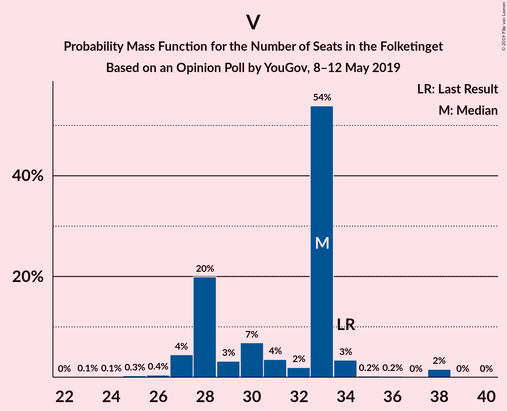

# Opinion Poll by YouGov, 8–12 May 2019

<a href="#voting-intentions">Voting Intentions</a> | <a href="#seats">Seats</a> | <a href="#coalitions">Coalitions</a> | <a href="#technical-information">Technical Information</a>

## Voting Intentions

### Confidence Intervals

| Party | Last Result | Poll Result | 80% Confidence Interval | 90% Confidence Interval | 95% Confidence Interval | 99% Confidence Interval |
|:-----:|:-----------:|:-----------:|:-----------------------:|:-----------------------:|:-----------------------:|:-----------------------:|
| Socialdemokraterne | 26.3% | 29.0% | 27.2–31.0% |26.7–31.5% |26.3–32.0% |25.4–32.9% |
| Venstre | 19.5% | 17.2% | 15.7–18.9% |15.3–19.3% |15.0–19.7% |14.3–20.5% |
| Dansk Folkeparti | 21.1% | 11.2% | 10.0–12.6% |9.6–13.0% |9.4–13.4% |8.8–14.1% |
| Enhedslisten–De Rød-Grønne | 7.8% | 7.3% | 6.3–8.4% |6.0–8.8% |5.8–9.1% |5.3–9.7% |
| Radikale Venstre | 4.6% | 6.8% | 5.9–8.0% |5.6–8.3% |5.4–8.6% |5.0–9.2% |
| Socialistisk Folkeparti | 4.2% | 6.8% | 5.9–8.0% |5.6–8.3% |5.4–8.6% |5.0–9.2% |
| Det Konservative Folkeparti | 3.4% | 5.8% | 4.9–6.9% |4.7–7.2% |4.5–7.5% |4.1–8.0% |
| Nye Borgerlige | 0.0% | 4.3% | 3.5–5.2% |3.3–5.5% |3.1–5.7% |2.8–6.2% |
| Alternativet | 4.8% | 4.0% | 3.3–5.0% |3.1–5.3% |3.0–5.5% |2.7–6.0% |
| Stram Kurs | 0.0% | 4.0% | 3.3–5.0% |3.1–5.3% |3.0–5.5% |2.7–6.0% |
| Liberal Alliance | 7.5% | 2.4% | 1.9–3.2% |1.7–3.4% |1.6–3.6% |1.4–4.0% |
| Kristendemokraterne | 0.8% | 0.6% | 0.4–1.1% |0.3–1.2% |0.3–1.4% |0.2–1.6% |
| Klaus Riskær Pedersen | 0.0% | 0.5% | 0.3–1.0% |0.3–1.1% |0.2–1.2% |0.2–1.5% |

*Note:* The poll result column reflects the actual value used in the calculations. Published results may vary slightly, and in addition be rounded to fewer digits.

## Seats

### Confidence Intervals

| Party | Last Result | Median | 80% Confidence Interval | 90% Confidence Interval | 95% Confidence Interval | 99% Confidence Interval |
|:-----:|:-----------:|:------:|:-----------------------:|:-----------------------:|:-----------------------:|:-----------------------:|
| <a href="#socialdemokraterne">Socialdemokraterne</a> | 47 | 53 | 46–55 |46–55 |45–56 |45–57 |
| <a href="#venstre">Venstre</a> | 34 | 32 | 30–33 |27–33 |25–34 |25–35 |
| <a href="#dansk-folkeparti">Dansk Folkeparti</a> | 37 | 23 | 17–24 |17–24 |16–24 |15–25 |
| <a href="#enhedslisten–de-rød-grønne">Enhedslisten–De Rød-Grønne</a> | 14 | 12 | 8–16 |8–16 |8–16 |8–16 |
| <a href="#radikale-venstre">Radikale Venstre</a> | 8 | 11 | 10–13 |10–14 |10–14 |9–16 |
| <a href="#socialistisk-folkeparti">Socialistisk Folkeparti</a> | 7 | 11 | 9–15 |9–15 |9–16 |9–17 |
| <a href="#det-konservative-folkeparti">Det Konservative Folkeparti</a> | 6 | 10 | 8–11 |8–11 |8–12 |7–14 |
| <a href="#nye-borgerlige">Nye Borgerlige</a> | 0 | 6 | 6–8 |6–9 |6–10 |5–11 |
| <a href="#alternativet">Alternativet</a> | 9 | 8 | 7–8 |7–8 |6–9 |6–11 |
| <a href="#stram-kurs">Stram Kurs</a> | 0 | 8 | 7–9 |7–9 |7–9 |5–9 |
| <a href="#liberal-alliance">Liberal Alliance</a> | 13 | 0 | 0–6 |0–6 |0–6 |0–7 |
| <a href="#kristendemokraterne">Kristendemokraterne</a> | 0 | 0 | 0 |0 |0 |0 |
| <a href="#klaus-riskær-pedersen">Klaus Riskær Pedersen</a> | 0 | 0 | 0 |0 |0 |0 |

### Socialdemokraterne

*For a full overview of the results for this party, see the [Socialdemokraterne](party-socialdemokraterne.html) page.*

| Number of Seats | Probability | Accumulated | Special Marks |
|:---------------:|:-----------:|:-----------:|:-------------:|
| 44 | 0% | 100% |  |
| 45 | 3% | 99.9% |  |
| 46 | 10% | 97% |  |
| 47 | 0.1% | 87% | Last Result |
| 48 | 1.2% | 87% |  |
| 49 | 2% | 86% |  |
| 50 | 0.3% | 84% |  |
| 51 | 14% | 83% |  |
| 52 | 0.4% | 70% |  |
| 53 | 34% | 70% | Median |
| 54 | 0.5% | 36% |  |
| 55 | 31% | 35% |  |
| 56 | 2% | 4% |  |
| 57 | 2% | 2% |  |
| 58 | 0% | 0.1% |  |
| 59 | 0% | 0% |  |

### Venstre

*For a full overview of the results for this party, see the [Venstre](party-venstre.html) page.*

| Number of Seats | Probability | Accumulated | Special Marks |
|:---------------:|:-----------:|:-----------:|:-------------:|
| 24 | 0.2% | 100% |  |
| 25 | 4% | 99.8% |  |
| 26 | 0.8% | 96% |  |
| 27 | 3% | 95% |  |
| 28 | 0.3% | 92% |  |
| 29 | 1.4% | 92% |  |
| 30 | 0.7% | 90% |  |
| 31 | 9% | 90% |  |
| 32 | 34% | 80% | Median |
| 33 | 43% | 46% |  |
| 34 | 2% | 3% | Last Result |
| 35 | 0.5% | 0.5% |  |
| 36 | 0% | 0% |  |

### Dansk Folkeparti

*For a full overview of the results for this party, see the [Dansk Folkeparti](party-danskfolkeparti.html) page.*

| Number of Seats | Probability | Accumulated | Special Marks |
|:---------------:|:-----------:|:-----------:|:-------------:|
| 14 | 0.3% | 100% |  |
| 15 | 2% | 99.7% |  |
| 16 | 1.2% | 98% |  |
| 17 | 14% | 97% |  |
| 18 | 2% | 82% |  |
| 19 | 0.7% | 81% |  |
| 20 | 0.9% | 80% |  |
| 21 | 1.3% | 79% |  |
| 22 | 9% | 78% |  |
| 23 | 32% | 68% | Median |
| 24 | 34% | 36% |  |
| 25 | 2% | 2% |  |
| 26 | 0% | 0.1% |  |
| 27 | 0% | 0% |  |
| 28 | 0% | 0% |  |
| 29 | 0% | 0% |  |
| 30 | 0% | 0% |  |
| 31 | 0% | 0% |  |
| 32 | 0% | 0% |  |
| 33 | 0% | 0% |  |
| 34 | 0% | 0% |  |
| 35 | 0% | 0% |  |
| 36 | 0% | 0% |  |
| 37 | 0% | 0% | Last Result |

### Enhedslisten–De Rød-Grønne

*For a full overview of the results for this party, see the [Enhedslisten–De Rød-Grønne](party-enhedslisten–derød-grønne.html) page.*

| Number of Seats | Probability | Accumulated | Special Marks |
|:---------------:|:-----------:|:-----------:|:-------------:|
| 8 | 31% | 100% |  |
| 9 | 0.2% | 69% |  |
| 10 | 0.4% | 69% |  |
| 11 | 12% | 69% |  |
| 12 | 13% | 57% | Median |
| 13 | 3% | 44% |  |
| 14 | 4% | 41% | Last Result |
| 15 | 2% | 37% |  |
| 16 | 35% | 36% |  |
| 17 | 0.5% | 0.5% |  |
| 18 | 0% | 0% |  |

### Radikale Venstre

*For a full overview of the results for this party, see the [Radikale Venstre](party-radikalevenstre.html) page.*

| Number of Seats | Probability | Accumulated | Special Marks |
|:---------------:|:-----------:|:-----------:|:-------------:|
| 8 | 0.5% | 100% | Last Result |
| 9 | 0.4% | 99.5% |  |
| 10 | 35% | 99.1% |  |
| 11 | 25% | 64% | Median |
| 12 | 0.7% | 39% |  |
| 13 | 32% | 38% |  |
| 14 | 5% | 6% |  |
| 15 | 0.6% | 1.3% |  |
| 16 | 0.5% | 0.8% |  |
| 17 | 0.2% | 0.3% |  |
| 18 | 0.1% | 0.1% |  |
| 19 | 0% | 0% |  |

### Socialistisk Folkeparti

*For a full overview of the results for this party, see the [Socialistisk Folkeparti](party-socialistiskfolkeparti.html) page.*

| Number of Seats | Probability | Accumulated | Special Marks |
|:---------------:|:-----------:|:-----------:|:-------------:|
| 7 | 0% | 100% | Last Result |
| 8 | 0.3% | 100% |  |
| 9 | 34% | 99.7% |  |
| 10 | 0.4% | 66% |  |
| 11 | 32% | 66% | Median |
| 12 | 16% | 34% |  |
| 13 | 1.2% | 17% |  |
| 14 | 4% | 16% |  |
| 15 | 9% | 13% |  |
| 16 | 2% | 4% |  |
| 17 | 2% | 2% |  |
| 18 | 0% | 0% |  |

### Det Konservative Folkeparti

*For a full overview of the results for this party, see the [Det Konservative Folkeparti](party-detkonservativefolkeparti.html) page.*

| Number of Seats | Probability | Accumulated | Special Marks |
|:---------------:|:-----------:|:-----------:|:-------------:|
| 6 | 0% | 100% | Last Result |
| 7 | 2% | 100% |  |
| 8 | 14% | 98% |  |
| 9 | 3% | 85% |  |
| 10 | 35% | 82% | Median |
| 11 | 43% | 47% |  |
| 12 | 3% | 4% |  |
| 13 | 0.6% | 1.3% |  |
| 14 | 0.7% | 0.7% |  |
| 15 | 0% | 0% |  |

### Nye Borgerlige

*For a full overview of the results for this party, see the [Nye Borgerlige](party-nyeborgerlige.html) page.*

| Number of Seats | Probability | Accumulated | Special Marks |
|:---------------:|:-----------:|:-----------:|:-------------:|
| 0 | 0% | 100% | Last Result |
| 1 | 0% | 100% |  |
| 2 | 0% | 100% |  |
| 3 | 0% | 100% |  |
| 4 | 0% | 100% |  |
| 5 | 2% | 100% |  |
| 6 | 65% | 98% | Median |
| 7 | 3% | 34% |  |
| 8 | 24% | 30% |  |
| 9 | 1.1% | 6% |  |
| 10 | 2% | 5% |  |
| 11 | 2% | 2% |  |
| 12 | 0.3% | 0.3% |  |
| 13 | 0% | 0% |  |

### Alternativet

*For a full overview of the results for this party, see the [Alternativet](party-alternativet.html) page.*

| Number of Seats | Probability | Accumulated | Special Marks |
|:---------------:|:-----------:|:-----------:|:-------------:|
| 5 | 0.2% | 100% |  |
| 6 | 3% | 99.8% |  |
| 7 | 43% | 96% |  |
| 8 | 49% | 53% | Median |
| 9 | 3% | 4% | Last Result |
| 10 | 0.1% | 2% |  |
| 11 | 1.3% | 1.4% |  |
| 12 | 0.2% | 0.2% |  |
| 13 | 0% | 0% |  |

### Stram Kurs

*For a full overview of the results for this party, see the [Stram Kurs](party-stramkurs.html) page.*

| Number of Seats | Probability | Accumulated | Special Marks |
|:---------------:|:-----------:|:-----------:|:-------------:|
| 0 | 0% | 100% | Last Result |
| 1 | 0% | 100% |  |
| 2 | 0% | 100% |  |
| 3 | 0% | 100% |  |
| 4 | 0% | 100% |  |
| 5 | 1.2% | 100% |  |
| 6 | 0.9% | 98.8% |  |
| 7 | 46% | 98% |  |
| 8 | 38% | 52% | Median |
| 9 | 14% | 14% |  |
| 10 | 0.2% | 0.2% |  |
| 11 | 0% | 0.1% |  |
| 12 | 0% | 0% |  |

### Liberal Alliance

*For a full overview of the results for this party, see the [Liberal Alliance](party-liberalalliance.html) page.*

| Number of Seats | Probability | Accumulated | Special Marks |
|:---------------:|:-----------:|:-----------:|:-------------:|
| 0 | 70% | 100% | Median |
| 1 | 0% | 30% |  |
| 2 | 0% | 30% |  |
| 3 | 0% | 30% |  |
| 4 | 4% | 30% |  |
| 5 | 2% | 26% |  |
| 6 | 23% | 24% |  |
| 7 | 1.1% | 2% |  |
| 8 | 0.5% | 0.5% |  |
| 9 | 0% | 0% |  |
| 10 | 0% | 0% |  |
| 11 | 0% | 0% |  |
| 12 | 0% | 0% |  |
| 13 | 0% | 0% | Last Result |

### Kristendemokraterne

*For a full overview of the results for this party, see the [Kristendemokraterne](party-kristendemokraterne.html) page.*

| Number of Seats | Probability | Accumulated | Special Marks |
|:---------------:|:-----------:|:-----------:|:-------------:|
| 0 | 100% | 100% | Last Result, Median |

### Klaus Riskær Pedersen

*For a full overview of the results for this party, see the [Klaus Riskær Pedersen](party-klausriskærpedersen.html) page.*

| Number of Seats | Probability | Accumulated | Special Marks |
|:---------------:|:-----------:|:-----------:|:-------------:|
| 0 | 100% | 100% | Last Result, Median |

## Coalitions

### Confidence Intervals

| Coalition | Last Result | Median | Majority? | 80% Confidence Interval | 90% Confidence Interval | 95% Confidence Interval | 99% Confidence Interval |
|:---------:|:-----------:|:------:|:---------:|:-----------------------:|:-----------------------:|:-----------------------:|:-----------------------:|
| Socialdemokraterne – Enhedslisten–De Rød-Grønne – Radikale Venstre – Socialistisk Folkeparti – Alternativet | 85 | 95 | 99.7% | 91–96 | 90–100 | 90–105 | 90–105 |
| Socialdemokraterne – Enhedslisten–De Rød-Grønne – Radikale Venstre – Socialistisk Folkeparti | 76 | 87 | 8% | 83–88 | 83–92 | 83–96 | 81–97 |
| Socialdemokraterne – Enhedslisten–De Rød-Grønne – Socialistisk Folkeparti – Alternativet | 77 | 83 | 4% | 80–85 | 79–87 | 79–91 | 78–94 |
| Venstre – Dansk Folkeparti – Det Konservative Folkeparti – Nye Borgerlige – Stram Kurs – Liberal Alliance – Kristendemokraterne – Klaus Riskær Pedersen | 90 | 80 | 0% | 79–84 | 75–85 | 70–85 | 70–85 |
| Socialdemokraterne – Enhedslisten–De Rød-Grønne – Socialistisk Folkeparti | 68 | 75 | 0% | 72–78 | 72–78 | 72–83 | 71–85 |
| Socialdemokraterne – Radikale Venstre – Socialistisk Folkeparti | 62 | 74 | 0% | 72–79 | 72–79 | 72–80 | 68–84 |
| Venstre – Dansk Folkeparti – Det Konservative Folkeparti – Nye Borgerlige – Liberal Alliance – Kristendemokraterne – Klaus Riskær Pedersen | 90 | 72 | 0% | 72–76 | 68–78 | 62–78 | 62–78 |
| Venstre – Dansk Folkeparti – Det Konservative Folkeparti – Nye Borgerlige – Liberal Alliance – Klaus Riskær Pedersen | 90 | 72 | 0% | 72–76 | 68–78 | 62–78 | 62–78 |
| Venstre – Dansk Folkeparti – Det Konservative Folkeparti – Nye Borgerlige – Liberal Alliance – Kristendemokraterne | 90 | 72 | 0% | 72–76 | 68–78 | 62–78 | 62–78 |
| Venstre – Dansk Folkeparti – Det Konservative Folkeparti – Nye Borgerlige – Liberal Alliance | 90 | 72 | 0% | 72–76 | 68–78 | 62–78 | 62–78 |
| Venstre – Dansk Folkeparti – Det Konservative Folkeparti – Liberal Alliance – Kristendemokraterne | 90 | 66 | 0% | 64–68 | 61–70 | 55–70 | 51–70 |
| Venstre – Dansk Folkeparti – Det Konservative Folkeparti – Liberal Alliance | 90 | 66 | 0% | 64–68 | 61–70 | 55–70 | 51–70 |
| Socialdemokraterne – Radikale Venstre | 55 | 63 | 0% | 57–68 | 57–68 | 57–68 | 55–70 |
| Venstre – Det Konservative Folkeparti – Liberal Alliance | 53 | 43 | 0% | 43–48 | 37–48 | 36–48 | 32–50 |
| Venstre – Det Konservative Folkeparti | 40 | 43 | 0% | 41–43 | 37–43 | 36–44 | 32–46 |
| Venstre | 34 | 32 | 0% | 30–33 | 27–33 | 25–34 | 25–35 |

### Socialdemokraterne – Enhedslisten–De Rød-Grønne – Radikale Venstre – Socialistisk Folkeparti – Alternativet

| Number of Seats | Probability | Accumulated | Special Marks |
|:---------------:|:-----------:|:-----------:|:-------------:|
| 85 | 0% | 100% | Last Result |
| 86 | 0% | 100% |  |
| 87 | 0% | 100% |  |
| 88 | 0% | 100% |  |
| 89 | 0.3% | 100% |  |
| 90 | 9% | 99.7% | Majority |
| 91 | 2% | 91% |  |
| 92 | 0.5% | 89% |  |
| 93 | 0.3% | 88% |  |
| 94 | 13% | 88% |  |
| 95 | 64% | 74% | Median |
| 96 | 0.8% | 10% |  |
| 97 | 4% | 10% |  |
| 98 | 0.4% | 6% |  |
| 99 | 0.2% | 6% |  |
| 100 | 1.1% | 5% |  |
| 101 | 0.6% | 4% |  |
| 102 | 0.2% | 4% |  |
| 103 | 0.3% | 4% |  |
| 104 | 0% | 3% |  |
| 105 | 3% | 3% |  |
| 106 | 0% | 0.1% |  |
| 107 | 0.1% | 0.1% |  |
| 108 | 0% | 0% |  |

### Socialdemokraterne – Enhedslisten–De Rød-Grønne – Radikale Venstre – Socialistisk Folkeparti

| Number of Seats | Probability | Accumulated | Special Marks |
|:---------------:|:-----------:|:-----------:|:-------------:|
| 76 | 0% | 100% | Last Result |
| 77 | 0% | 100% |  |
| 78 | 0% | 100% |  |
| 79 | 0% | 100% |  |
| 80 | 0% | 100% |  |
| 81 | 0.4% | 99.9% |  |
| 82 | 0.1% | 99.5% |  |
| 83 | 10% | 99.4% |  |
| 84 | 0.8% | 89% |  |
| 85 | 0.4% | 88% |  |
| 86 | 13% | 88% |  |
| 87 | 32% | 75% | Median |
| 88 | 34% | 43% |  |
| 89 | 0.8% | 9% |  |
| 90 | 1.2% | 8% | Majority |
| 91 | 2% | 7% |  |
| 92 | 1.2% | 5% |  |
| 93 | 0.3% | 4% |  |
| 94 | 0% | 4% |  |
| 95 | 0.2% | 4% |  |
| 96 | 2% | 3% |  |
| 97 | 2% | 2% |  |
| 98 | 0% | 0% |  |

### Socialdemokraterne – Enhedslisten–De Rød-Grønne – Socialistisk Folkeparti – Alternativet

| Number of Seats | Probability | Accumulated | Special Marks |
|:---------------:|:-----------:|:-----------:|:-------------:|
| 76 | 0% | 100% |  |
| 77 | 0.4% | 99.9% | Last Result |
| 78 | 0.3% | 99.5% |  |
| 79 | 9% | 99.2% |  |
| 80 | 2% | 90% |  |
| 81 | 0.5% | 88% |  |
| 82 | 31% | 88% |  |
| 83 | 15% | 56% |  |
| 84 | 1.1% | 42% | Median |
| 85 | 34% | 41% |  |
| 86 | 2% | 7% |  |
| 87 | 0.8% | 5% |  |
| 88 | 0.9% | 5% |  |
| 89 | 0.2% | 4% |  |
| 90 | 0% | 4% | Majority |
| 91 | 2% | 4% |  |
| 92 | 0.2% | 2% |  |
| 93 | 0% | 2% |  |
| 94 | 2% | 2% |  |
| 95 | 0% | 0% |  |

### Venstre – Dansk Folkeparti – Det Konservative Folkeparti – Nye Borgerlige – Stram Kurs – Liberal Alliance – Kristendemokraterne – Klaus Riskær Pedersen

| Number of Seats | Probability | Accumulated | Special Marks |
|:---------------:|:-----------:|:-----------:|:-------------:|
| 68 | 0.1% | 100% |  |
| 69 | 0% | 99.9% |  |
| 70 | 3% | 99.9% |  |
| 71 | 0% | 97% |  |
| 72 | 0.3% | 97% |  |
| 73 | 0.2% | 96% |  |
| 74 | 0.6% | 96% |  |
| 75 | 1.1% | 96% |  |
| 76 | 0.2% | 95% |  |
| 77 | 0.4% | 94% |  |
| 78 | 4% | 94% |  |
| 79 | 0.8% | 90% | Median |
| 80 | 64% | 90% |  |
| 81 | 13% | 26% |  |
| 82 | 0.3% | 12% |  |
| 83 | 0.5% | 12% |  |
| 84 | 2% | 11% |  |
| 85 | 9% | 9% |  |
| 86 | 0.3% | 0.3% |  |
| 87 | 0% | 0% |  |
| 88 | 0% | 0% |  |
| 89 | 0% | 0% |  |
| 90 | 0% | 0% | Last Result, Majority |

### Socialdemokraterne – Enhedslisten–De Rød-Grønne – Socialistisk Folkeparti

| Number of Seats | Probability | Accumulated | Special Marks |
|:---------------:|:-----------:|:-----------:|:-------------:|
| 68 | 0% | 100% | Last Result |
| 69 | 0% | 99.9% |  |
| 70 | 0.3% | 99.9% |  |
| 71 | 1.0% | 99.6% |  |
| 72 | 11% | 98.6% |  |
| 73 | 0.3% | 88% |  |
| 74 | 31% | 88% |  |
| 75 | 13% | 56% |  |
| 76 | 1.0% | 43% | Median |
| 77 | 2% | 42% |  |
| 78 | 35% | 40% |  |
| 79 | 0% | 5% |  |
| 80 | 0.5% | 5% |  |
| 81 | 0.2% | 4% |  |
| 82 | 0.5% | 4% |  |
| 83 | 2% | 3% |  |
| 84 | 0% | 2% |  |
| 85 | 2% | 2% |  |
| 86 | 0% | 0% |  |

### Socialdemokraterne – Radikale Venstre – Socialistisk Folkeparti

| Number of Seats | Probability | Accumulated | Special Marks |
|:---------------:|:-----------:|:-----------:|:-------------:|
| 62 | 0% | 100% | Last Result |
| 63 | 0% | 100% |  |
| 64 | 0% | 100% |  |
| 65 | 0% | 100% |  |
| 66 | 0% | 100% |  |
| 67 | 0% | 100% |  |
| 68 | 0.5% | 100% |  |
| 69 | 0.2% | 99.4% |  |
| 70 | 0.5% | 99.2% |  |
| 71 | 0.1% | 98.7% |  |
| 72 | 45% | 98.6% |  |
| 73 | 1.1% | 54% |  |
| 74 | 13% | 53% |  |
| 75 | 0.1% | 40% | Median |
| 76 | 1.1% | 40% |  |
| 77 | 3% | 39% |  |
| 78 | 0.9% | 36% |  |
| 79 | 31% | 35% |  |
| 80 | 2% | 4% |  |
| 81 | 0.1% | 2% |  |
| 82 | 0.5% | 2% |  |
| 83 | 0% | 2% |  |
| 84 | 2% | 2% |  |
| 85 | 0% | 0% |  |

### Venstre – Dansk Folkeparti – Det Konservative Folkeparti – Nye Borgerlige – Liberal Alliance – Kristendemokraterne – Klaus Riskær Pedersen

| Number of Seats | Probability | Accumulated | Special Marks |
|:---------------:|:-----------:|:-----------:|:-------------:|
| 61 | 0.1% | 100% |  |
| 62 | 3% | 99.9% |  |
| 63 | 0% | 97% |  |
| 64 | 0% | 97% |  |
| 65 | 0.2% | 97% |  |
| 66 | 0.1% | 97% |  |
| 67 | 0.8% | 96% |  |
| 68 | 1.3% | 96% |  |
| 69 | 0.6% | 94% |  |
| 70 | 3% | 94% |  |
| 71 | 0.1% | 91% | Median |
| 72 | 45% | 91% |  |
| 73 | 34% | 47% |  |
| 74 | 0.7% | 13% |  |
| 75 | 0.3% | 12% |  |
| 76 | 3% | 12% |  |
| 77 | 0.2% | 9% |  |
| 78 | 9% | 9% |  |
| 79 | 0% | 0.3% |  |
| 80 | 0% | 0.3% |  |
| 81 | 0.3% | 0.3% |  |
| 82 | 0% | 0% |  |
| 83 | 0% | 0% |  |
| 84 | 0% | 0% |  |
| 85 | 0% | 0% |  |
| 86 | 0% | 0% |  |
| 87 | 0% | 0% |  |
| 88 | 0% | 0% |  |
| 89 | 0% | 0% |  |
| 90 | 0% | 0% | Last Result, Majority |

### Venstre – Dansk Folkeparti – Det Konservative Folkeparti – Nye Borgerlige – Liberal Alliance – Klaus Riskær Pedersen

| Number of Seats | Probability | Accumulated | Special Marks |
|:---------------:|:-----------:|:-----------:|:-------------:|
| 61 | 0.1% | 100% |  |
| 62 | 3% | 99.9% |  |
| 63 | 0% | 97% |  |
| 64 | 0% | 97% |  |
| 65 | 0.2% | 97% |  |
| 66 | 0.1% | 97% |  |
| 67 | 0.8% | 96% |  |
| 68 | 1.3% | 96% |  |
| 69 | 0.6% | 94% |  |
| 70 | 3% | 94% |  |
| 71 | 0.1% | 91% | Median |
| 72 | 45% | 91% |  |
| 73 | 34% | 47% |  |
| 74 | 0.7% | 13% |  |
| 75 | 0.3% | 12% |  |
| 76 | 3% | 12% |  |
| 77 | 0.2% | 9% |  |
| 78 | 9% | 9% |  |
| 79 | 0% | 0.3% |  |
| 80 | 0% | 0.3% |  |
| 81 | 0.3% | 0.3% |  |
| 82 | 0% | 0% |  |
| 83 | 0% | 0% |  |
| 84 | 0% | 0% |  |
| 85 | 0% | 0% |  |
| 86 | 0% | 0% |  |
| 87 | 0% | 0% |  |
| 88 | 0% | 0% |  |
| 89 | 0% | 0% |  |
| 90 | 0% | 0% | Last Result, Majority |

### Venstre – Dansk Folkeparti – Det Konservative Folkeparti – Nye Borgerlige – Liberal Alliance – Kristendemokraterne

| Number of Seats | Probability | Accumulated | Special Marks |
|:---------------:|:-----------:|:-----------:|:-------------:|
| 61 | 0.1% | 100% |  |
| 62 | 3% | 99.9% |  |
| 63 | 0% | 97% |  |
| 64 | 0% | 97% |  |
| 65 | 0.2% | 97% |  |
| 66 | 0.1% | 97% |  |
| 67 | 0.8% | 96% |  |
| 68 | 1.3% | 96% |  |
| 69 | 0.6% | 94% |  |
| 70 | 3% | 94% |  |
| 71 | 0.1% | 91% | Median |
| 72 | 45% | 91% |  |
| 73 | 34% | 47% |  |
| 74 | 0.7% | 13% |  |
| 75 | 0.3% | 12% |  |
| 76 | 3% | 12% |  |
| 77 | 0.2% | 9% |  |
| 78 | 9% | 9% |  |
| 79 | 0% | 0.3% |  |
| 80 | 0% | 0.3% |  |
| 81 | 0.3% | 0.3% |  |
| 82 | 0% | 0% |  |
| 83 | 0% | 0% |  |
| 84 | 0% | 0% |  |
| 85 | 0% | 0% |  |
| 86 | 0% | 0% |  |
| 87 | 0% | 0% |  |
| 88 | 0% | 0% |  |
| 89 | 0% | 0% |  |
| 90 | 0% | 0% | Last Result, Majority |

### Venstre – Dansk Folkeparti – Det Konservative Folkeparti – Nye Borgerlige – Liberal Alliance

| Number of Seats | Probability | Accumulated | Special Marks |
|:---------------:|:-----------:|:-----------:|:-------------:|
| 61 | 0.1% | 100% |  |
| 62 | 3% | 99.9% |  |
| 63 | 0% | 97% |  |
| 64 | 0% | 97% |  |
| 65 | 0.2% | 97% |  |
| 66 | 0.1% | 97% |  |
| 67 | 0.8% | 96% |  |
| 68 | 1.3% | 96% |  |
| 69 | 0.6% | 94% |  |
| 70 | 3% | 94% |  |
| 71 | 0.1% | 91% | Median |
| 72 | 45% | 91% |  |
| 73 | 34% | 47% |  |
| 74 | 0.7% | 13% |  |
| 75 | 0.3% | 12% |  |
| 76 | 3% | 12% |  |
| 77 | 0.2% | 9% |  |
| 78 | 9% | 9% |  |
| 79 | 0% | 0.3% |  |
| 80 | 0% | 0.3% |  |
| 81 | 0.3% | 0.3% |  |
| 82 | 0% | 0% |  |
| 83 | 0% | 0% |  |
| 84 | 0% | 0% |  |
| 85 | 0% | 0% |  |
| 86 | 0% | 0% |  |
| 87 | 0% | 0% |  |
| 88 | 0% | 0% |  |
| 89 | 0% | 0% |  |
| 90 | 0% | 0% | Last Result, Majority |

### Venstre – Dansk Folkeparti – Det Konservative Folkeparti – Liberal Alliance – Kristendemokraterne

| Number of Seats | Probability | Accumulated | Special Marks |
|:---------------:|:-----------:|:-----------:|:-------------:|
| 51 | 2% | 100% |  |
| 52 | 0.1% | 98% |  |
| 53 | 0% | 98% |  |
| 54 | 0% | 98% |  |
| 55 | 2% | 98% |  |
| 56 | 0.1% | 97% |  |
| 57 | 0.1% | 97% |  |
| 58 | 0% | 97% |  |
| 59 | 0.2% | 97% |  |
| 60 | 1.0% | 96% |  |
| 61 | 0.6% | 95% |  |
| 62 | 4% | 95% |  |
| 63 | 0.9% | 91% |  |
| 64 | 13% | 90% |  |
| 65 | 0% | 77% | Median |
| 66 | 33% | 77% |  |
| 67 | 34% | 44% |  |
| 68 | 0.6% | 10% |  |
| 69 | 0.7% | 10% |  |
| 70 | 9% | 9% |  |
| 71 | 0.4% | 0.5% |  |
| 72 | 0% | 0.1% |  |
| 73 | 0% | 0.1% |  |
| 74 | 0% | 0% |  |
| 75 | 0% | 0% |  |
| 76 | 0% | 0% |  |
| 77 | 0% | 0% |  |
| 78 | 0% | 0% |  |
| 79 | 0% | 0% |  |
| 80 | 0% | 0% |  |
| 81 | 0% | 0% |  |
| 82 | 0% | 0% |  |
| 83 | 0% | 0% |  |
| 84 | 0% | 0% |  |
| 85 | 0% | 0% |  |
| 86 | 0% | 0% |  |
| 87 | 0% | 0% |  |
| 88 | 0% | 0% |  |
| 89 | 0% | 0% |  |
| 90 | 0% | 0% | Last Result, Majority |

### Venstre – Dansk Folkeparti – Det Konservative Folkeparti – Liberal Alliance

| Number of Seats | Probability | Accumulated | Special Marks |
|:---------------:|:-----------:|:-----------:|:-------------:|
| 51 | 2% | 100% |  |
| 52 | 0.1% | 98% |  |
| 53 | 0% | 98% |  |
| 54 | 0% | 98% |  |
| 55 | 2% | 98% |  |
| 56 | 0.2% | 97% |  |
| 57 | 0.1% | 97% |  |
| 58 | 0% | 97% |  |
| 59 | 0.2% | 97% |  |
| 60 | 1.0% | 96% |  |
| 61 | 0.6% | 95% |  |
| 62 | 4% | 95% |  |
| 63 | 0.9% | 91% |  |
| 64 | 13% | 90% |  |
| 65 | 0% | 77% | Median |
| 66 | 33% | 77% |  |
| 67 | 34% | 44% |  |
| 68 | 0.6% | 10% |  |
| 69 | 0.7% | 10% |  |
| 70 | 9% | 9% |  |
| 71 | 0.4% | 0.5% |  |
| 72 | 0% | 0.1% |  |
| 73 | 0% | 0.1% |  |
| 74 | 0% | 0% |  |
| 75 | 0% | 0% |  |
| 76 | 0% | 0% |  |
| 77 | 0% | 0% |  |
| 78 | 0% | 0% |  |
| 79 | 0% | 0% |  |
| 80 | 0% | 0% |  |
| 81 | 0% | 0% |  |
| 82 | 0% | 0% |  |
| 83 | 0% | 0% |  |
| 84 | 0% | 0% |  |
| 85 | 0% | 0% |  |
| 86 | 0% | 0% |  |
| 87 | 0% | 0% |  |
| 88 | 0% | 0% |  |
| 89 | 0% | 0% |  |
| 90 | 0% | 0% | Last Result, Majority |

### Socialdemokraterne – Radikale Venstre

| Number of Seats | Probability | Accumulated | Special Marks |
|:---------------:|:-----------:|:-----------:|:-------------:|
| 55 | 0.7% | 100% | Last Result |
| 56 | 2% | 99.3% |  |
| 57 | 9% | 98% |  |
| 58 | 0.6% | 89% |  |
| 59 | 0.5% | 88% |  |
| 60 | 1.0% | 88% |  |
| 61 | 0.6% | 87% |  |
| 62 | 13% | 86% |  |
| 63 | 36% | 73% |  |
| 64 | 0.7% | 37% | Median |
| 65 | 0.5% | 36% |  |
| 66 | 0.9% | 36% |  |
| 67 | 0.5% | 35% |  |
| 68 | 32% | 34% |  |
| 69 | 0.2% | 2% |  |
| 70 | 2% | 2% |  |
| 71 | 0% | 0% |  |

### Venstre – Det Konservative Folkeparti – Liberal Alliance

| Number of Seats | Probability | Accumulated | Special Marks |
|:---------------:|:-----------:|:-----------:|:-------------:|
| 32 | 1.5% | 100% |  |
| 33 | 0.1% | 98.5% |  |
| 34 | 0% | 98% |  |
| 35 | 0% | 98% |  |
| 36 | 2% | 98% |  |
| 37 | 2% | 97% |  |
| 38 | 0.1% | 95% |  |
| 39 | 0.4% | 95% |  |
| 40 | 0.1% | 94% |  |
| 41 | 1.0% | 94% |  |
| 42 | 0.9% | 93% | Median |
| 43 | 64% | 92% |  |
| 44 | 1.4% | 28% |  |
| 45 | 0.5% | 27% |  |
| 46 | 0.3% | 26% |  |
| 47 | 14% | 26% |  |
| 48 | 11% | 12% |  |
| 49 | 0.2% | 1.4% |  |
| 50 | 0.8% | 1.2% |  |
| 51 | 0.3% | 0.3% |  |
| 52 | 0% | 0% |  |
| 53 | 0% | 0% | Last Result |

### Venstre – Det Konservative Folkeparti

| Number of Seats | Probability | Accumulated | Special Marks |
|:---------------:|:-----------:|:-----------:|:-------------:|
| 32 | 1.5% | 100% |  |
| 33 | 0.1% | 98.5% |  |
| 34 | 0.1% | 98% |  |
| 35 | 0.7% | 98% |  |
| 36 | 2% | 98% |  |
| 37 | 3% | 95% |  |
| 38 | 0.1% | 92% |  |
| 39 | 1.2% | 92% |  |
| 40 | 0.8% | 91% | Last Result |
| 41 | 13% | 90% |  |
| 42 | 10% | 77% | Median |
| 43 | 65% | 68% |  |
| 44 | 2% | 3% |  |
| 45 | 0.2% | 0.9% |  |
| 46 | 0.6% | 0.7% |  |
| 47 | 0% | 0.1% |  |
| 48 | 0% | 0.1% |  |
| 49 | 0% | 0% |  |

### Venstre

| Number of Seats | Probability | Accumulated | Special Marks |
|:---------------:|:-----------:|:-----------:|:-------------:|
| 24 | 0.2% | 100% |  |
| 25 | 4% | 99.8% |  |
| 26 | 0.8% | 96% |  |
| 27 | 3% | 95% |  |
| 28 | 0.3% | 92% |  |
| 29 | 1.4% | 92% |  |
| 30 | 0.7% | 90% |  |
| 31 | 9% | 90% |  |
| 32 | 34% | 80% | Median |
| 33 | 43% | 46% |  |
| 34 | 2% | 3% | Last Result |
| 35 | 0.5% | 0.5% |  |
| 36 | 0% | 0% |  |

## Technical Information

### Opinion Poll

+ **Polling firm:** YouGov
+ **Commissioner(s):** —
+ **Fieldwork period:** 8–12 May 2019

### Calculations

+ **Sample size:** 964
+ **Simulations done:** 131,072
+ **Error estimate:** 3.54%

