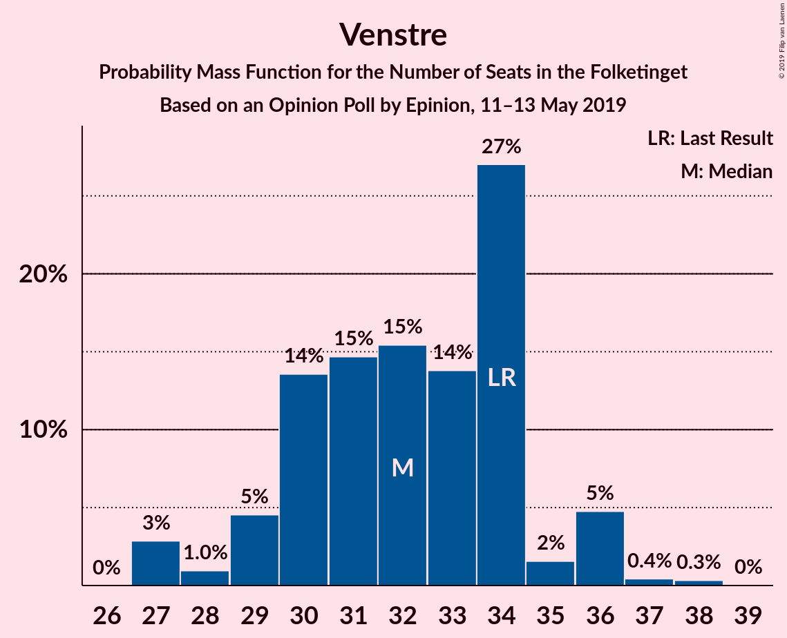
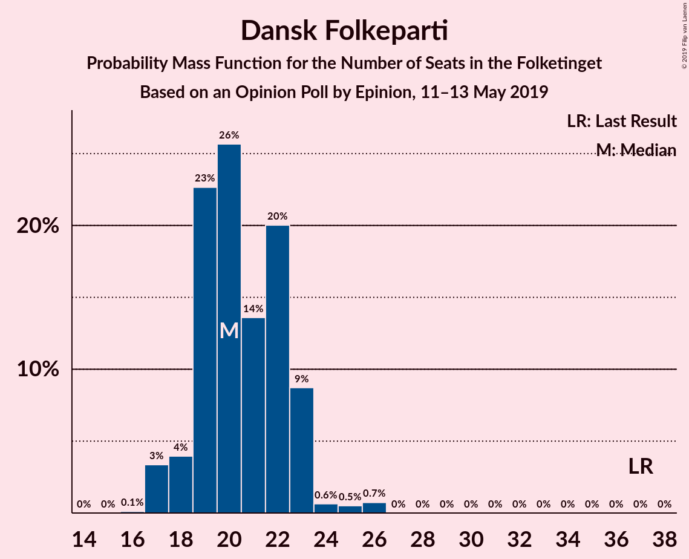
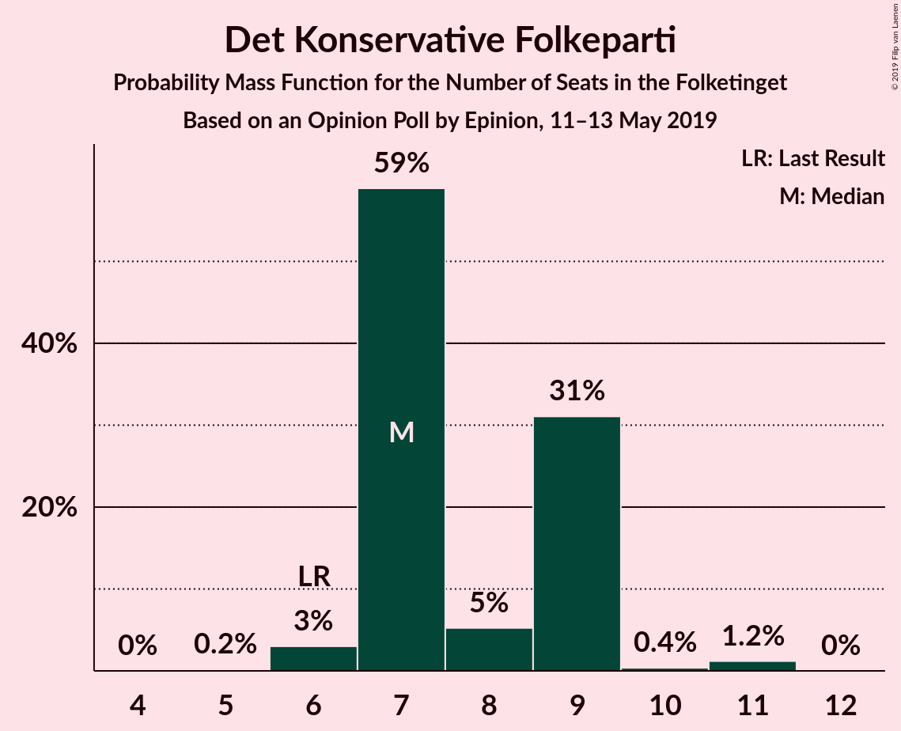
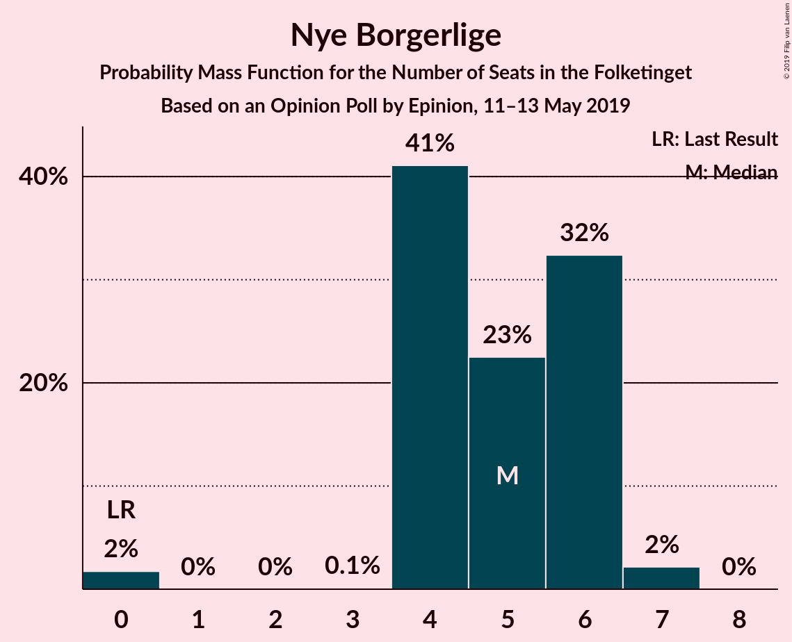
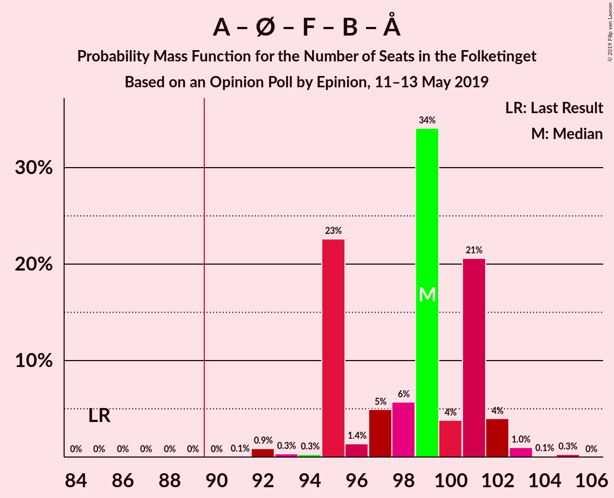
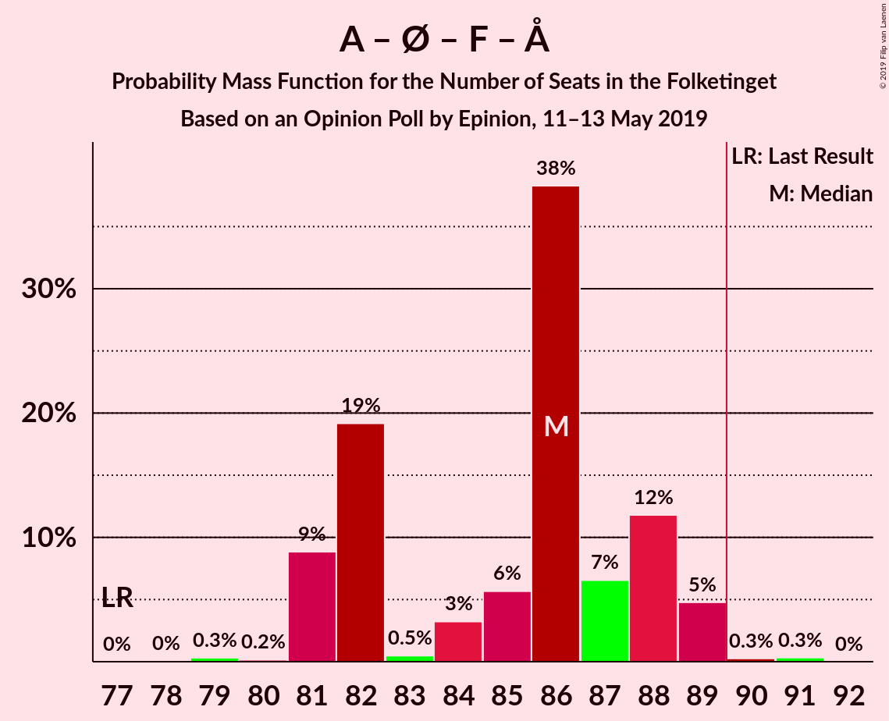
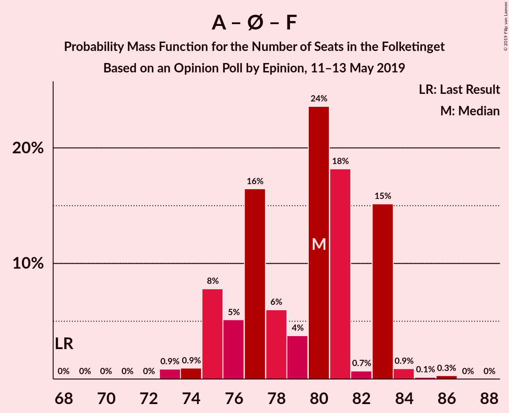
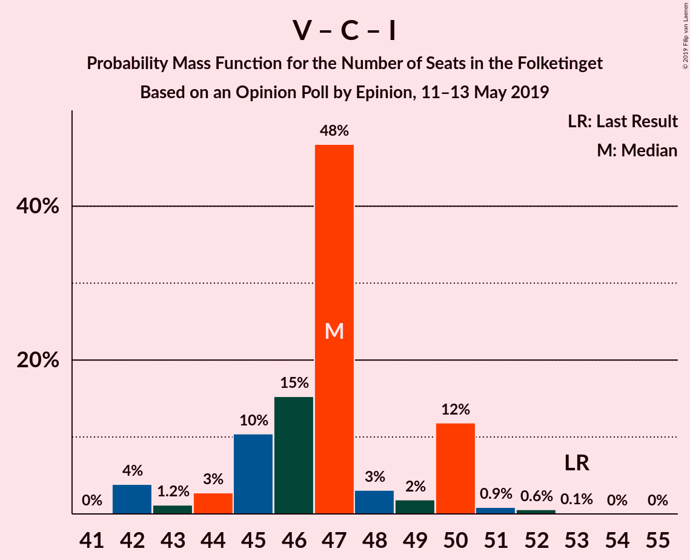

# Opinion Poll by Epinion, 11–13 May 2019

<a href="#voting-intentions">Voting Intentions</a> | <a href="#seats">Seats</a> | <a href="#coalitions">Coalitions</a> | <a href="#technical-information">Technical Information</a>

## Voting Intentions

### Confidence Intervals

| Party | Last Result | Poll Result | 80% Confidence Interval | 90% Confidence Interval | 95% Confidence Interval | 99% Confidence Interval |
|:-----:|:-----------:|:-----------:|:-----------------------:|:-----------------------:|:-----------------------:|:-----------------------:|
| Socialdemokraterne | 26.3% | 27.1% | 25.7–28.6% |25.3–29.1% |25.0–29.4% |24.3–30.1% |
| Venstre | 19.5% | 18.4% | 17.2–19.7% |16.8–20.1% |16.6–20.4% |16.0–21.1% |
| Dansk Folkeparti | 21.1% | 11.6% | 10.6–12.7% |10.4–13.0% |10.1–13.3% |9.7–13.9% |
| Enhedslisten–De Rød-Grønne | 7.8% | 9.5% | 8.6–10.5% |8.3–10.8% |8.1–11.1% |7.7–11.6% |
| Socialistisk Folkeparti | 4.2% | 8.0% | 7.2–9.0% |7.0–9.2% |6.8–9.5% |6.4–10.0% |
| Radikale Venstre | 4.6% | 7.4% | 6.6–8.4% |6.4–8.6% |6.2–8.9% |5.9–9.3% |
| Det Konservative Folkeparti | 3.4% | 4.5% | 3.9–5.3% |3.7–5.5% |3.6–5.7% |3.3–6.1% |
| Liberal Alliance | 7.5% | 3.7% | 3.1–4.4% |3.0–4.6% |2.9–4.8% |2.6–5.1% |
| Alternativet | 4.8% | 3.3% | 2.8–4.0% |2.6–4.1% |2.5–4.3% |2.3–4.6% |
| Nye Borgerlige | 0.0% | 2.6% | 2.1–3.2% |2.0–3.4% |1.9–3.5% |1.7–3.8% |
| Stram Kurs | 0.0% | 2.6% | 2.1–3.2% |2.0–3.4% |1.9–3.5% |1.7–3.8% |
| Klaus Riskær Pedersen | 0.0% | 0.7% | 0.5–1.1% |0.4–1.2% |0.4–1.3% |0.3–1.5% |
| Kristendemokraterne | 0.8% | 0.5% | 0.4–0.8% |0.3–0.9% |0.3–1.0% |0.2–1.2% |

*Note:* The poll result column reflects the actual value used in the calculations. Published results may vary slightly, and in addition be rounded to fewer digits.

## Seats

### Confidence Intervals

| Party | Last Result | Median | 80% Confidence Interval | 90% Confidence Interval | 95% Confidence Interval | 99% Confidence Interval |
|:-----:|:-----------:|:------:|:-----------------------:|:-----------------------:|:-----------------------:|:-----------------------:|
| <a href="#socialdemokraterne">Socialdemokraterne</a> | 47 | 48 | 45–52 |45–52 |44–52 |44–52 |
| <a href="#venstre">Venstre</a> | 34 | 32 | 30–34 |29–36 |27–36 |27–37 |
| <a href="#dansk-folkeparti">Dansk Folkeparti</a> | 37 | 20 | 19–23 |18–23 |17–23 |17–26 |
| <a href="#enhedslisten–de-rød-grønne">Enhedslisten–De Rød-Grønne</a> | 14 | 16 | 15–18 |15–18 |15–19 |14–20 |
| <a href="#socialistisk-folkeparti">Socialistisk Folkeparti</a> | 7 | 15 | 13–18 |12–18 |12–19 |11–19 |
| <a href="#radikale-venstre">Radikale Venstre</a> | 8 | 13 | 11–15 |11–16 |11–17 |10–17 |
| <a href="#det-konservative-folkeparti">Det Konservative Folkeparti</a> | 6 | 7 | 7–9 |7–9 |6–9 |6–11 |
| <a href="#liberal-alliance">Liberal Alliance</a> | 13 | 7 | 6–9 |4–9 |4–9 |4–9 |
| <a href="#alternativet">Alternativet</a> | 9 | 6 | 5–7 |5–7 |5–7 |5–8 |
| <a href="#nye-borgerlige">Nye Borgerlige</a> | 0 | 5 | 4–6 |4–6 |4–6 |0–7 |
| <a href="#stram-kurs">Stram Kurs</a> | 0 | 4 | 4–5 |4–6 |0–6 |0–6 |
| <a href="#klaus-riskær-pedersen">Klaus Riskær Pedersen</a> | 0 | 0 | 0 |0 |0 |0 |
| <a href="#kristendemokraterne">Kristendemokraterne</a> | 0 | 0 | 0 |0 |0 |0 |

### Socialdemokraterne

*For a full overview of the results for this party, see the [Socialdemokraterne](party-socialdemokraterne.html) page.*

| Number of Seats | Probability | Accumulated | Special Marks |
|:---------------:|:-----------:|:-----------:|:-------------:|
| 41 | 0% | 100% |  |
| 42 | 0.1% | 99.9% |  |
| 43 | 0.2% | 99.8% |  |
| 44 | 2% | 99.6% |  |
| 45 | 12% | 97% |  |
| 46 | 2% | 85% |  |
| 47 | 21% | 83% | Last Result |
| 48 | 14% | 62% | Median |
| 49 | 31% | 48% |  |
| 50 | 2% | 17% |  |
| 51 | 1.0% | 14% |  |
| 52 | 13% | 13% |  |
| 53 | 0.4% | 0.5% |  |
| 54 | 0% | 0% |  |

### Venstre

*For a full overview of the results for this party, see the [Venstre](party-venstre.html) page.*

| Number of Seats | Probability | Accumulated | Special Marks |
|:---------------:|:-----------:|:-----------:|:-------------:|
| 27 | 3% | 100% |  |
| 28 | 1.0% | 97% |  |
| 29 | 5% | 96% |  |
| 30 | 14% | 92% |  |
| 31 | 15% | 78% |  |
| 32 | 15% | 63% | Median |
| 33 | 14% | 48% |  |
| 34 | 27% | 34% | Last Result |
| 35 | 2% | 7% |  |
| 36 | 5% | 6% |  |
| 37 | 0.4% | 0.8% |  |
| 38 | 0.3% | 0.4% |  |
| 39 | 0% | 0% |  |

### Dansk Folkeparti

*For a full overview of the results for this party, see the [Dansk Folkeparti](party-danskfolkeparti.html) page.*

| Number of Seats | Probability | Accumulated | Special Marks |
|:---------------:|:-----------:|:-----------:|:-------------:|
| 16 | 0.1% | 100% |  |
| 17 | 3% | 99.9% |  |
| 18 | 4% | 97% |  |
| 19 | 23% | 93% |  |
| 20 | 26% | 70% | Median |
| 21 | 14% | 44% |  |
| 22 | 20% | 31% |  |
| 23 | 9% | 11% |  |
| 24 | 0.6% | 2% |  |
| 25 | 0.5% | 1.2% |  |
| 26 | 0.7% | 0.7% |  |
| 27 | 0% | 0% |  |
| 28 | 0% | 0% |  |
| 29 | 0% | 0% |  |
| 30 | 0% | 0% |  |
| 31 | 0% | 0% |  |
| 32 | 0% | 0% |  |
| 33 | 0% | 0% |  |
| 34 | 0% | 0% |  |
| 35 | 0% | 0% |  |
| 36 | 0% | 0% |  |
| 37 | 0% | 0% | Last Result |

### Enhedslisten–De Rød-Grønne

*For a full overview of the results for this party, see the [Enhedslisten–De Rød-Grønne](party-enhedslisten–derød-grønne.html) page.*

| Number of Seats | Probability | Accumulated | Special Marks |
|:---------------:|:-----------:|:-----------:|:-------------:|
| 13 | 0.3% | 100% |  |
| 14 | 0.7% | 99.7% | Last Result |
| 15 | 39% | 99.0% |  |
| 16 | 23% | 60% | Median |
| 17 | 20% | 37% |  |
| 18 | 14% | 17% |  |
| 19 | 2% | 3% |  |
| 20 | 0.5% | 0.5% |  |
| 21 | 0% | 0.1% |  |
| 22 | 0% | 0.1% |  |
| 23 | 0% | 0% |  |

### Socialistisk Folkeparti

*For a full overview of the results for this party, see the [Socialistisk Folkeparti](party-socialistiskfolkeparti.html) page.*

| Number of Seats | Probability | Accumulated | Special Marks |
|:---------------:|:-----------:|:-----------:|:-------------:|
| 7 | 0% | 100% | Last Result |
| 8 | 0% | 100% |  |
| 9 | 0% | 100% |  |
| 10 | 0.2% | 100% |  |
| 11 | 0.6% | 99.8% |  |
| 12 | 9% | 99.1% |  |
| 13 | 21% | 90% |  |
| 14 | 8% | 70% |  |
| 15 | 18% | 62% | Median |
| 16 | 26% | 43% |  |
| 17 | 2% | 17% |  |
| 18 | 12% | 15% |  |
| 19 | 3% | 3% |  |
| 20 | 0% | 0% |  |

### Radikale Venstre

*For a full overview of the results for this party, see the [Radikale Venstre](party-radikalevenstre.html) page.*

| Number of Seats | Probability | Accumulated | Special Marks |
|:---------------:|:-----------:|:-----------:|:-------------:|
| 8 | 0% | 100% | Last Result |
| 9 | 0% | 100% |  |
| 10 | 0.7% | 100% |  |
| 11 | 17% | 99.2% |  |
| 12 | 4% | 82% |  |
| 13 | 41% | 78% | Median |
| 14 | 9% | 37% |  |
| 15 | 23% | 28% |  |
| 16 | 0.8% | 5% |  |
| 17 | 4% | 4% |  |
| 18 | 0% | 0% |  |

### Det Konservative Folkeparti

*For a full overview of the results for this party, see the [Det Konservative Folkeparti](party-detkonservativefolkeparti.html) page.*

| Number of Seats | Probability | Accumulated | Special Marks |
|:---------------:|:-----------:|:-----------:|:-------------:|
| 5 | 0.2% | 100% |  |
| 6 | 3% | 99.8% | Last Result |
| 7 | 59% | 97% | Median |
| 8 | 5% | 38% |  |
| 9 | 31% | 33% |  |
| 10 | 0.4% | 2% |  |
| 11 | 1.2% | 1.2% |  |
| 12 | 0% | 0% |  |

### Liberal Alliance

*For a full overview of the results for this party, see the [Liberal Alliance](party-liberalalliance.html) page.*

| Number of Seats | Probability | Accumulated | Special Marks |
|:---------------:|:-----------:|:-----------:|:-------------:|
| 4 | 5% | 100% |  |
| 5 | 3% | 95% |  |
| 6 | 30% | 92% |  |
| 7 | 41% | 62% | Median |
| 8 | 0.8% | 21% |  |
| 9 | 20% | 20% |  |
| 10 | 0.1% | 0.1% |  |
| 11 | 0% | 0% |  |
| 12 | 0% | 0% |  |
| 13 | 0% | 0% | Last Result |

### Alternativet

*For a full overview of the results for this party, see the [Alternativet](party-alternativet.html) page.*

| Number of Seats | Probability | Accumulated | Special Marks |
|:---------------:|:-----------:|:-----------:|:-------------:|
| 4 | 0.5% | 100% |  |
| 5 | 40% | 99.5% |  |
| 6 | 45% | 59% | Median |
| 7 | 12% | 14% |  |
| 8 | 2% | 2% |  |
| 9 | 0.1% | 0.1% | Last Result |
| 10 | 0% | 0% |  |

### Nye Borgerlige

*For a full overview of the results for this party, see the [Nye Borgerlige](party-nyeborgerlige.html) page.*

| Number of Seats | Probability | Accumulated | Special Marks |
|:---------------:|:-----------:|:-----------:|:-------------:|
| 0 | 2% | 100% | Last Result |
| 1 | 0% | 98% |  |
| 2 | 0% | 98% |  |
| 3 | 0.1% | 98% |  |
| 4 | 41% | 98% |  |
| 5 | 23% | 57% | Median |
| 6 | 32% | 35% |  |
| 7 | 2% | 2% |  |
| 8 | 0% | 0% |  |

### Stram Kurs

*For a full overview of the results for this party, see the [Stram Kurs](party-stramkurs.html) page.*

| Number of Seats | Probability | Accumulated | Special Marks |
|:---------------:|:-----------:|:-----------:|:-------------:|
| 0 | 3% | 100% | Last Result |
| 1 | 0% | 97% |  |
| 2 | 0% | 97% |  |
| 3 | 0% | 97% |  |
| 4 | 50% | 97% | Median |
| 5 | 41% | 47% |  |
| 6 | 6% | 6% |  |
| 7 | 0.4% | 0.4% |  |
| 8 | 0% | 0% |  |

### Klaus Riskær Pedersen

*For a full overview of the results for this party, see the [Klaus Riskær Pedersen](party-klausriskærpedersen.html) page.*

| Number of Seats | Probability | Accumulated | Special Marks |
|:---------------:|:-----------:|:-----------:|:-------------:|
| 0 | 100% | 100% | Last Result, Median |

### Kristendemokraterne

*For a full overview of the results for this party, see the [Kristendemokraterne](party-kristendemokraterne.html) page.*

| Number of Seats | Probability | Accumulated | Special Marks |
|:---------------:|:-----------:|:-----------:|:-------------:|
| 0 | 100% | 100% | Last Result, Median |

## Coalitions

### Confidence Intervals

| Coalition | Last Result | Median | Majority? | 80% Confidence Interval | 90% Confidence Interval | 95% Confidence Interval | 99% Confidence Interval |
|:---------:|:-----------:|:------:|:---------:|:-----------------------:|:-----------------------:|:-----------------------:|:-----------------------:|
| Socialdemokraterne – Enhedslisten–De Rød-Grønne – Socialistisk Folkeparti – Radikale Venstre – Alternativet | 85 | 99 | 100% | 95–101 | 95–102 | 95–102 | 92–103 |
| Socialdemokraterne – Enhedslisten–De Rød-Grønne – Socialistisk Folkeparti – Radikale Venstre | 76 | 94 | 89% | 89–95 | 89–95 | 89–96 | 84–98 |
| Socialdemokraterne – Enhedslisten–De Rød-Grønne – Socialistisk Folkeparti – Alternativet | 77 | 86 | 0.6% | 82–88 | 81–89 | 81–89 | 80–90 |
| Socialdemokraterne – Enhedslisten–De Rød-Grønne – Socialistisk Folkeparti | 68 | 80 | 0% | 76–83 | 75–83 | 75–83 | 73–84 |
| Venstre – Dansk Folkeparti – Det Konservative Folkeparti – Liberal Alliance – Nye Borgerlige – Stram Kurs – Klaus Riskær Pedersen – Kristendemokraterne | 90 | 76 | 0% | 74–80 | 73–80 | 73–80 | 72–83 |
| Socialdemokraterne – Socialistisk Folkeparti – Radikale Venstre | 62 | 77 | 0% | 73–80 | 71–80 | 71–80 | 68–82 |
| Venstre – Dansk Folkeparti – Det Konservative Folkeparti – Liberal Alliance – Nye Borgerlige – Klaus Riskær Pedersen – Kristendemokraterne | 90 | 72 | 0% | 70–75 | 68–75 | 67–76 | 67–79 |
| Venstre – Dansk Folkeparti – Det Konservative Folkeparti – Liberal Alliance – Nye Borgerlige – Klaus Riskær Pedersen | 90 | 72 | 0% | 70–75 | 68–75 | 67–76 | 67–79 |
| Venstre – Dansk Folkeparti – Det Konservative Folkeparti – Liberal Alliance – Nye Borgerlige – Kristendemokraterne | 90 | 72 | 0% | 70–75 | 68–75 | 67–76 | 67–79 |
| Venstre – Dansk Folkeparti – Det Konservative Folkeparti – Liberal Alliance – Nye Borgerlige | 90 | 72 | 0% | 70–75 | 68–75 | 67–76 | 67–79 |
| Venstre – Dansk Folkeparti – Det Konservative Folkeparti – Liberal Alliance – Kristendemokraterne | 90 | 67 | 0% | 66–71 | 64–71 | 63–72 | 62–74 |
| Venstre – Dansk Folkeparti – Det Konservative Folkeparti – Liberal Alliance | 90 | 67 | 0% | 66–71 | 64–71 | 63–72 | 62–74 |
| Socialdemokraterne – Radikale Venstre | 55 | 61 | 0% | 59–65 | 58–65 | 56–65 | 55–66 |
| Venstre – Det Konservative Folkeparti – Liberal Alliance | 53 | 47 | 0% | 45–50 | 43–50 | 42–50 | 42–52 |
| Venstre – Det Konservative Folkeparti | 40 | 40 | 0% | 37–41 | 36–43 | 36–44 | 36–46 |
| Venstre | 34 | 32 | 0% | 30–34 | 29–36 | 27–36 | 27–37 |

### Socialdemokraterne – Enhedslisten–De Rød-Grønne – Socialistisk Folkeparti – Radikale Venstre – Alternativet

| Number of Seats | Probability | Accumulated | Special Marks |
|:---------------:|:-----------:|:-----------:|:-------------:|
| 85 | 0% | 100% | Last Result |
| 86 | 0% | 100% |  |
| 87 | 0% | 100% |  |
| 88 | 0% | 100% |  |
| 89 | 0% | 100% |  |
| 90 | 0% | 100% | Majority |
| 91 | 0.1% | 100% |  |
| 92 | 0.9% | 99.9% |  |
| 93 | 0.3% | 99.1% |  |
| 94 | 0.3% | 98.7% |  |
| 95 | 23% | 98% |  |
| 96 | 1.4% | 76% |  |
| 97 | 5% | 74% |  |
| 98 | 6% | 70% | Median |
| 99 | 34% | 64% |  |
| 100 | 4% | 30% |  |
| 101 | 21% | 26% |  |
| 102 | 4% | 5% |  |
| 103 | 1.0% | 1.4% |  |
| 104 | 0.1% | 0.4% |  |
| 105 | 0.3% | 0.3% |  |
| 106 | 0% | 0% |  |

### Socialdemokraterne – Enhedslisten–De Rød-Grønne – Socialistisk Folkeparti – Radikale Venstre

| Number of Seats | Probability | Accumulated | Special Marks |
|:---------------:|:-----------:|:-----------:|:-------------:|
| 76 | 0% | 100% | Last Result |
| 77 | 0% | 100% |  |
| 78 | 0% | 100% |  |
| 79 | 0% | 100% |  |
| 80 | 0% | 100% |  |
| 81 | 0% | 100% |  |
| 82 | 0% | 100% |  |
| 83 | 0% | 100% |  |
| 84 | 0.7% | 100% |  |
| 85 | 0.1% | 99.3% |  |
| 86 | 0.1% | 99.1% |  |
| 87 | 0.2% | 99.1% |  |
| 88 | 0.6% | 98.9% |  |
| 89 | 10% | 98% |  |
| 90 | 16% | 89% | Majority |
| 91 | 8% | 72% |  |
| 92 | 4% | 65% | Median |
| 93 | 8% | 61% |  |
| 94 | 27% | 53% |  |
| 95 | 21% | 26% |  |
| 96 | 4% | 5% |  |
| 97 | 0.9% | 1.4% |  |
| 98 | 0.1% | 0.6% |  |
| 99 | 0.2% | 0.4% |  |
| 100 | 0.3% | 0.3% |  |
| 101 | 0% | 0% |  |

### Socialdemokraterne – Enhedslisten–De Rød-Grønne – Socialistisk Folkeparti – Alternativet

| Number of Seats | Probability | Accumulated | Special Marks |
|:---------------:|:-----------:|:-----------:|:-------------:|
| 77 | 0% | 100% | Last Result |
| 78 | 0% | 100% |  |
| 79 | 0.3% | 99.9% |  |
| 80 | 0.2% | 99.6% |  |
| 81 | 9% | 99.5% |  |
| 82 | 19% | 91% |  |
| 83 | 0.5% | 71% |  |
| 84 | 3% | 71% |  |
| 85 | 6% | 68% | Median |
| 86 | 38% | 62% |  |
| 87 | 7% | 24% |  |
| 88 | 12% | 17% |  |
| 89 | 5% | 5% |  |
| 90 | 0.3% | 0.6% | Majority |
| 91 | 0.3% | 0.4% |  |
| 92 | 0% | 0% |  |

### Socialdemokraterne – Enhedslisten–De Rød-Grønne – Socialistisk Folkeparti

| Number of Seats | Probability | Accumulated | Special Marks |
|:---------------:|:-----------:|:-----------:|:-------------:|
| 68 | 0% | 100% | Last Result |
| 69 | 0% | 100% |  |
| 70 | 0% | 100% |  |
| 71 | 0% | 100% |  |
| 72 | 0% | 100% |  |
| 73 | 0.9% | 99.9% |  |
| 74 | 0.9% | 99.1% |  |
| 75 | 8% | 98% |  |
| 76 | 5% | 90% |  |
| 77 | 16% | 85% |  |
| 78 | 6% | 69% |  |
| 79 | 4% | 63% | Median |
| 80 | 24% | 59% |  |
| 81 | 18% | 35% |  |
| 82 | 0.7% | 17% |  |
| 83 | 15% | 17% |  |
| 84 | 0.9% | 1.4% |  |
| 85 | 0.1% | 0.5% |  |
| 86 | 0.3% | 0.3% |  |
| 87 | 0% | 0% |  |

### Venstre – Dansk Folkeparti – Det Konservative Folkeparti – Liberal Alliance – Nye Borgerlige – Stram Kurs – Klaus Riskær Pedersen – Kristendemokraterne

| Number of Seats | Probability | Accumulated | Special Marks |
|:---------------:|:-----------:|:-----------:|:-------------:|
| 70 | 0.3% | 100% |  |
| 71 | 0.1% | 99.7% |  |
| 72 | 1.0% | 99.6% |  |
| 73 | 4% | 98.6% |  |
| 74 | 21% | 95% |  |
| 75 | 4% | 74% | Median |
| 76 | 34% | 70% |  |
| 77 | 6% | 36% |  |
| 78 | 5% | 30% |  |
| 79 | 1.4% | 26% |  |
| 80 | 23% | 24% |  |
| 81 | 0.3% | 2% |  |
| 82 | 0.3% | 1.3% |  |
| 83 | 0.9% | 0.9% |  |
| 84 | 0.1% | 0.1% |  |
| 85 | 0% | 0% |  |
| 86 | 0% | 0% |  |
| 87 | 0% | 0% |  |
| 88 | 0% | 0% |  |
| 89 | 0% | 0% |  |
| 90 | 0% | 0% | Last Result, Majority |

### Socialdemokraterne – Socialistisk Folkeparti – Radikale Venstre

| Number of Seats | Probability | Accumulated | Special Marks |
|:---------------:|:-----------:|:-----------:|:-------------:|
| 62 | 0% | 100% | Last Result |
| 63 | 0% | 100% |  |
| 64 | 0% | 100% |  |
| 65 | 0% | 100% |  |
| 66 | 0% | 100% |  |
| 67 | 0.5% | 100% |  |
| 68 | 0.4% | 99.5% |  |
| 69 | 0.3% | 99.1% |  |
| 70 | 0.2% | 98.8% |  |
| 71 | 7% | 98.6% |  |
| 72 | 0.7% | 92% |  |
| 73 | 4% | 91% |  |
| 74 | 3% | 87% |  |
| 75 | 19% | 83% |  |
| 76 | 6% | 64% | Median |
| 77 | 20% | 58% |  |
| 78 | 15% | 37% |  |
| 79 | 0.4% | 22% |  |
| 80 | 21% | 22% |  |
| 81 | 0% | 0.5% |  |
| 82 | 0.1% | 0.5% |  |
| 83 | 0.4% | 0.4% |  |
| 84 | 0% | 0% |  |

### Venstre – Dansk Folkeparti – Det Konservative Folkeparti – Liberal Alliance – Nye Borgerlige – Klaus Riskær Pedersen – Kristendemokraterne

| Number of Seats | Probability | Accumulated | Special Marks |
|:---------------:|:-----------:|:-----------:|:-------------:|
| 66 | 0.3% | 100% |  |
| 67 | 3% | 99.7% |  |
| 68 | 2% | 96% |  |
| 69 | 1.3% | 95% |  |
| 70 | 23% | 93% |  |
| 71 | 4% | 70% | Median |
| 72 | 33% | 66% |  |
| 73 | 5% | 33% |  |
| 74 | 1.2% | 28% |  |
| 75 | 23% | 27% |  |
| 76 | 3% | 4% |  |
| 77 | 1.1% | 2% |  |
| 78 | 0.1% | 0.8% |  |
| 79 | 0.7% | 0.7% |  |
| 80 | 0% | 0.1% |  |
| 81 | 0% | 0% |  |
| 82 | 0% | 0% |  |
| 83 | 0% | 0% |  |
| 84 | 0% | 0% |  |
| 85 | 0% | 0% |  |
| 86 | 0% | 0% |  |
| 87 | 0% | 0% |  |
| 88 | 0% | 0% |  |
| 89 | 0% | 0% |  |
| 90 | 0% | 0% | Last Result, Majority |

### Venstre – Dansk Folkeparti – Det Konservative Folkeparti – Liberal Alliance – Nye Borgerlige – Klaus Riskær Pedersen

| Number of Seats | Probability | Accumulated | Special Marks |
|:---------------:|:-----------:|:-----------:|:-------------:|
| 66 | 0.3% | 100% |  |
| 67 | 3% | 99.7% |  |
| 68 | 2% | 96% |  |
| 69 | 1.3% | 95% |  |
| 70 | 23% | 93% |  |
| 71 | 4% | 70% | Median |
| 72 | 33% | 66% |  |
| 73 | 5% | 33% |  |
| 74 | 1.2% | 28% |  |
| 75 | 23% | 27% |  |
| 76 | 3% | 4% |  |
| 77 | 1.1% | 2% |  |
| 78 | 0.1% | 0.8% |  |
| 79 | 0.7% | 0.7% |  |
| 80 | 0% | 0.1% |  |
| 81 | 0% | 0% |  |
| 82 | 0% | 0% |  |
| 83 | 0% | 0% |  |
| 84 | 0% | 0% |  |
| 85 | 0% | 0% |  |
| 86 | 0% | 0% |  |
| 87 | 0% | 0% |  |
| 88 | 0% | 0% |  |
| 89 | 0% | 0% |  |
| 90 | 0% | 0% | Last Result, Majority |

### Venstre – Dansk Folkeparti – Det Konservative Folkeparti – Liberal Alliance – Nye Borgerlige – Kristendemokraterne

| Number of Seats | Probability | Accumulated | Special Marks |
|:---------------:|:-----------:|:-----------:|:-------------:|
| 66 | 0.3% | 100% |  |
| 67 | 3% | 99.7% |  |
| 68 | 2% | 96% |  |
| 69 | 1.3% | 95% |  |
| 70 | 23% | 93% |  |
| 71 | 4% | 70% | Median |
| 72 | 33% | 66% |  |
| 73 | 5% | 33% |  |
| 74 | 1.2% | 28% |  |
| 75 | 23% | 27% |  |
| 76 | 3% | 4% |  |
| 77 | 1.1% | 2% |  |
| 78 | 0.1% | 0.8% |  |
| 79 | 0.7% | 0.7% |  |
| 80 | 0% | 0.1% |  |
| 81 | 0% | 0% |  |
| 82 | 0% | 0% |  |
| 83 | 0% | 0% |  |
| 84 | 0% | 0% |  |
| 85 | 0% | 0% |  |
| 86 | 0% | 0% |  |
| 87 | 0% | 0% |  |
| 88 | 0% | 0% |  |
| 89 | 0% | 0% |  |
| 90 | 0% | 0% | Last Result, Majority |

### Venstre – Dansk Folkeparti – Det Konservative Folkeparti – Liberal Alliance – Nye Borgerlige

| Number of Seats | Probability | Accumulated | Special Marks |
|:---------------:|:-----------:|:-----------:|:-------------:|
| 66 | 0.3% | 100% |  |
| 67 | 3% | 99.7% |  |
| 68 | 2% | 96% |  |
| 69 | 1.3% | 95% |  |
| 70 | 23% | 93% |  |
| 71 | 4% | 70% | Median |
| 72 | 33% | 66% |  |
| 73 | 5% | 33% |  |
| 74 | 1.2% | 28% |  |
| 75 | 23% | 27% |  |
| 76 | 3% | 4% |  |
| 77 | 1.1% | 2% |  |
| 78 | 0.1% | 0.8% |  |
| 79 | 0.7% | 0.7% |  |
| 80 | 0% | 0.1% |  |
| 81 | 0% | 0% |  |
| 82 | 0% | 0% |  |
| 83 | 0% | 0% |  |
| 84 | 0% | 0% |  |
| 85 | 0% | 0% |  |
| 86 | 0% | 0% |  |
| 87 | 0% | 0% |  |
| 88 | 0% | 0% |  |
| 89 | 0% | 0% |  |
| 90 | 0% | 0% | Last Result, Majority |

### Venstre – Dansk Folkeparti – Det Konservative Folkeparti – Liberal Alliance – Kristendemokraterne

| Number of Seats | Probability | Accumulated | Special Marks |
|:---------------:|:-----------:|:-----------:|:-------------:|
| 61 | 0.4% | 100% |  |
| 62 | 0.7% | 99.6% |  |
| 63 | 3% | 98.9% |  |
| 64 | 4% | 96% |  |
| 65 | 1.0% | 92% |  |
| 66 | 35% | 91% | Median |
| 67 | 21% | 56% |  |
| 68 | 7% | 36% |  |
| 69 | 15% | 29% |  |
| 70 | 1.3% | 14% |  |
| 71 | 10% | 13% |  |
| 72 | 1.1% | 3% |  |
| 73 | 0.9% | 1.5% |  |
| 74 | 0.5% | 0.6% |  |
| 75 | 0% | 0.1% |  |
| 76 | 0% | 0% |  |
| 77 | 0% | 0% |  |
| 78 | 0% | 0% |  |
| 79 | 0% | 0% |  |
| 80 | 0% | 0% |  |
| 81 | 0% | 0% |  |
| 82 | 0% | 0% |  |
| 83 | 0% | 0% |  |
| 84 | 0% | 0% |  |
| 85 | 0% | 0% |  |
| 86 | 0% | 0% |  |
| 87 | 0% | 0% |  |
| 88 | 0% | 0% |  |
| 89 | 0% | 0% |  |
| 90 | 0% | 0% | Last Result, Majority |

### Venstre – Dansk Folkeparti – Det Konservative Folkeparti – Liberal Alliance

| Number of Seats | Probability | Accumulated | Special Marks |
|:---------------:|:-----------:|:-----------:|:-------------:|
| 61 | 0.4% | 100% |  |
| 62 | 0.7% | 99.6% |  |
| 63 | 3% | 98.9% |  |
| 64 | 4% | 96% |  |
| 65 | 1.0% | 92% |  |
| 66 | 35% | 91% | Median |
| 67 | 21% | 56% |  |
| 68 | 7% | 36% |  |
| 69 | 15% | 29% |  |
| 70 | 1.3% | 14% |  |
| 71 | 10% | 13% |  |
| 72 | 1.1% | 3% |  |
| 73 | 0.9% | 1.5% |  |
| 74 | 0.5% | 0.6% |  |
| 75 | 0% | 0.1% |  |
| 76 | 0% | 0% |  |
| 77 | 0% | 0% |  |
| 78 | 0% | 0% |  |
| 79 | 0% | 0% |  |
| 80 | 0% | 0% |  |
| 81 | 0% | 0% |  |
| 82 | 0% | 0% |  |
| 83 | 0% | 0% |  |
| 84 | 0% | 0% |  |
| 85 | 0% | 0% |  |
| 86 | 0% | 0% |  |
| 87 | 0% | 0% |  |
| 88 | 0% | 0% |  |
| 89 | 0% | 0% |  |
| 90 | 0% | 0% | Last Result, Majority |

### Socialdemokraterne – Radikale Venstre

| Number of Seats | Probability | Accumulated | Special Marks |
|:---------------:|:-----------:|:-----------:|:-------------:|
| 54 | 0.1% | 100% |  |
| 55 | 0.8% | 99.9% | Last Result |
| 56 | 2% | 99.1% |  |
| 57 | 0.8% | 97% |  |
| 58 | 4% | 96% |  |
| 59 | 22% | 92% |  |
| 60 | 16% | 70% |  |
| 61 | 4% | 54% | Median |
| 62 | 9% | 50% |  |
| 63 | 2% | 41% |  |
| 64 | 25% | 39% |  |
| 65 | 13% | 14% |  |
| 66 | 0.7% | 0.9% |  |
| 67 | 0.2% | 0.2% |  |
| 68 | 0% | 0% |  |

### Venstre – Det Konservative Folkeparti – Liberal Alliance

| Number of Seats | Probability | Accumulated | Special Marks |
|:---------------:|:-----------:|:-----------:|:-------------:|
| 42 | 4% | 100% |  |
| 43 | 1.2% | 96% |  |
| 44 | 3% | 95% |  |
| 45 | 10% | 92% |  |
| 46 | 15% | 82% | Median |
| 47 | 48% | 66% |  |
| 48 | 3% | 18% |  |
| 49 | 2% | 15% |  |
| 50 | 12% | 14% |  |
| 51 | 0.9% | 2% |  |
| 52 | 0.6% | 0.8% |  |
| 53 | 0.1% | 0.2% | Last Result |
| 54 | 0% | 0.1% |  |
| 55 | 0% | 0% |  |

### Venstre – Det Konservative Folkeparti

| Number of Seats | Probability | Accumulated | Special Marks |
|:---------------:|:-----------:|:-----------:|:-------------:|
| 35 | 0.2% | 100% |  |
| 36 | 5% | 99.8% |  |
| 37 | 13% | 95% |  |
| 38 | 5% | 82% |  |
| 39 | 6% | 77% | Median |
| 40 | 27% | 71% | Last Result |
| 41 | 36% | 45% |  |
| 42 | 2% | 9% |  |
| 43 | 3% | 7% |  |
| 44 | 3% | 4% |  |
| 45 | 0.5% | 1.1% |  |
| 46 | 0.2% | 0.6% |  |
| 47 | 0.4% | 0.4% |  |
| 48 | 0% | 0% |  |

### Venstre

| Number of Seats | Probability | Accumulated | Special Marks |
|:---------------:|:-----------:|:-----------:|:-------------:|
| 27 | 3% | 100% |  |
| 28 | 1.0% | 97% |  |
| 29 | 5% | 96% |  |
| 30 | 14% | 92% |  |
| 31 | 15% | 78% |  |
| 32 | 15% | 63% | Median |
| 33 | 14% | 48% |  |
| 34 | 27% | 34% | Last Result |
| 35 | 2% | 7% |  |
| 36 | 5% | 6% |  |
| 37 | 0.4% | 0.8% |  |
| 38 | 0.3% | 0.4% |  |
| 39 | 0% | 0% |  |

## Technical Information

### Opinion Poll

+ **Polling firm:** Epinion
+ **Commissioner(s):** —
+ **Fieldwork period:** 11–13 May 2019

### Calculations

+ **Sample size:** 1548
+ **Simulations done:** 1,048,576
+ **Error estimate:** 1.86%

