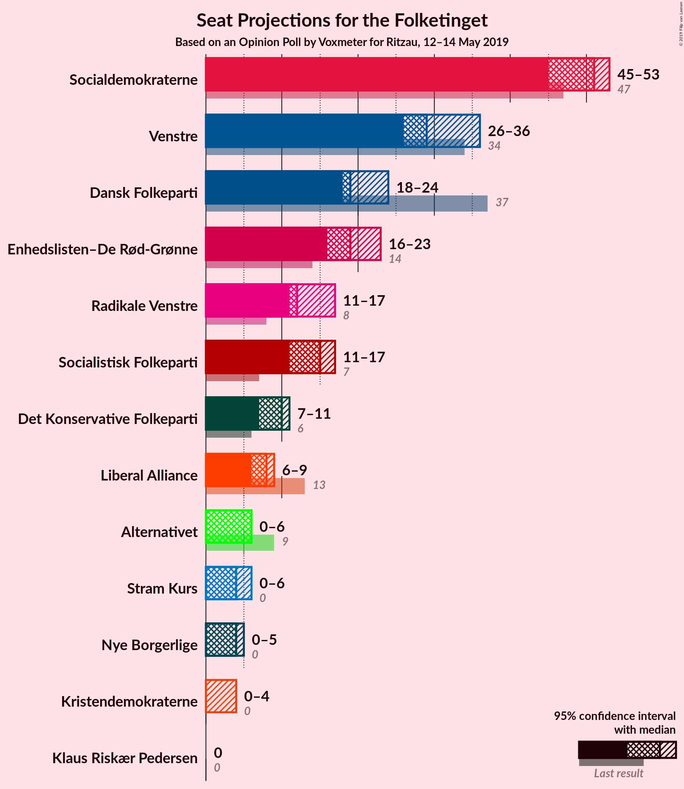
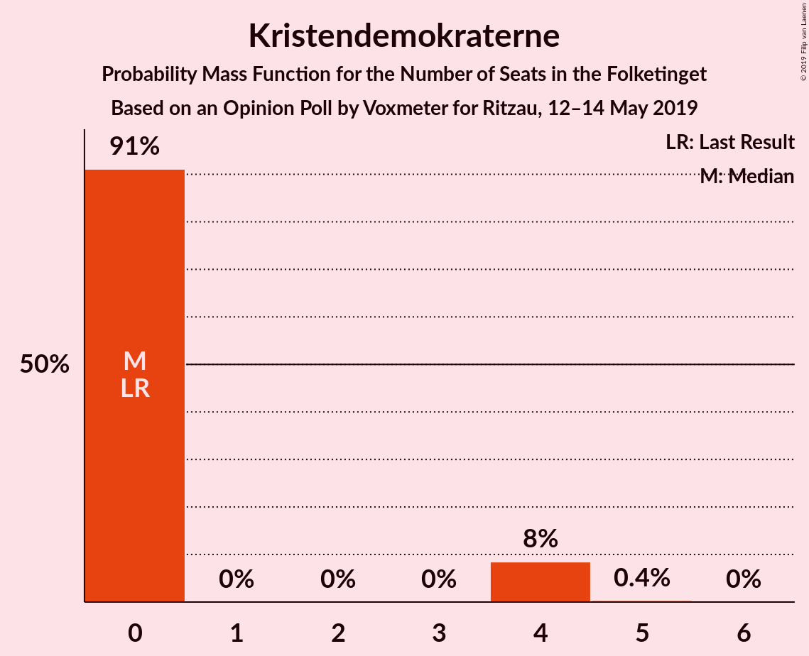
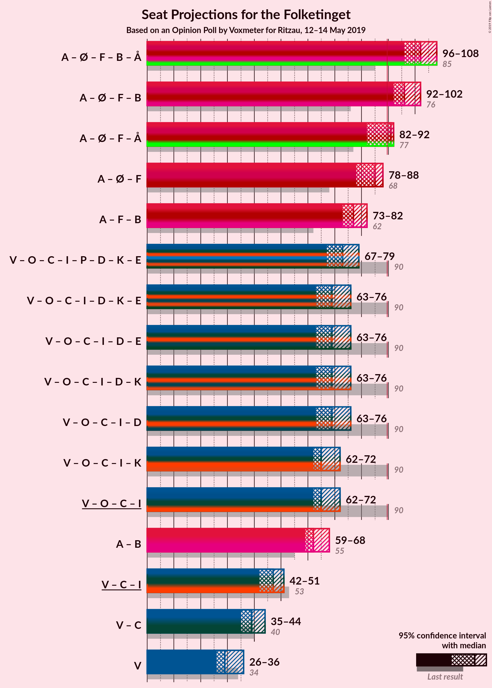
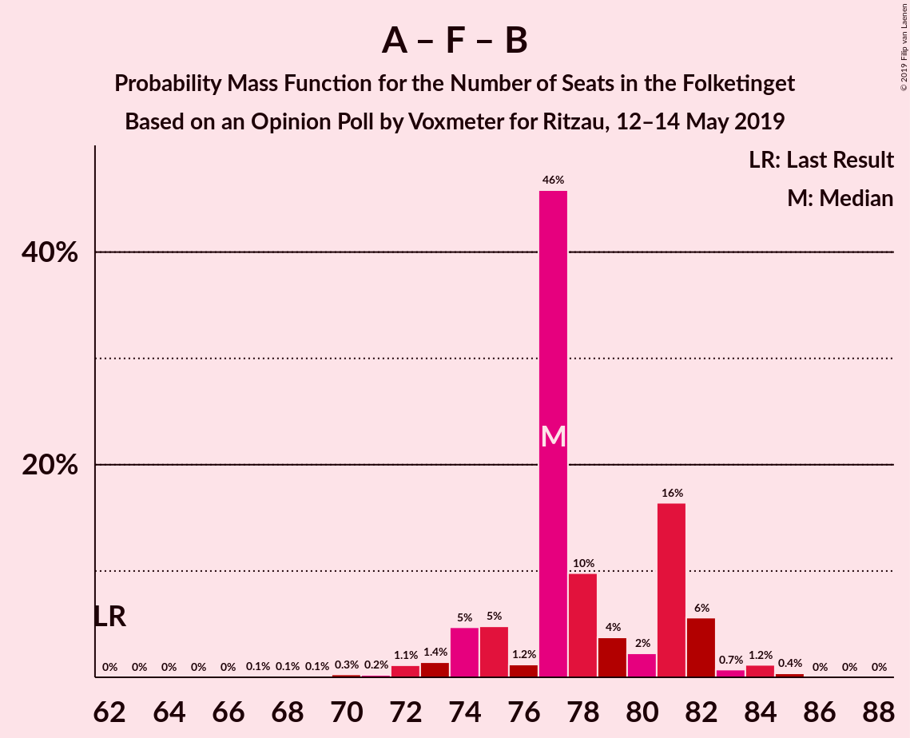
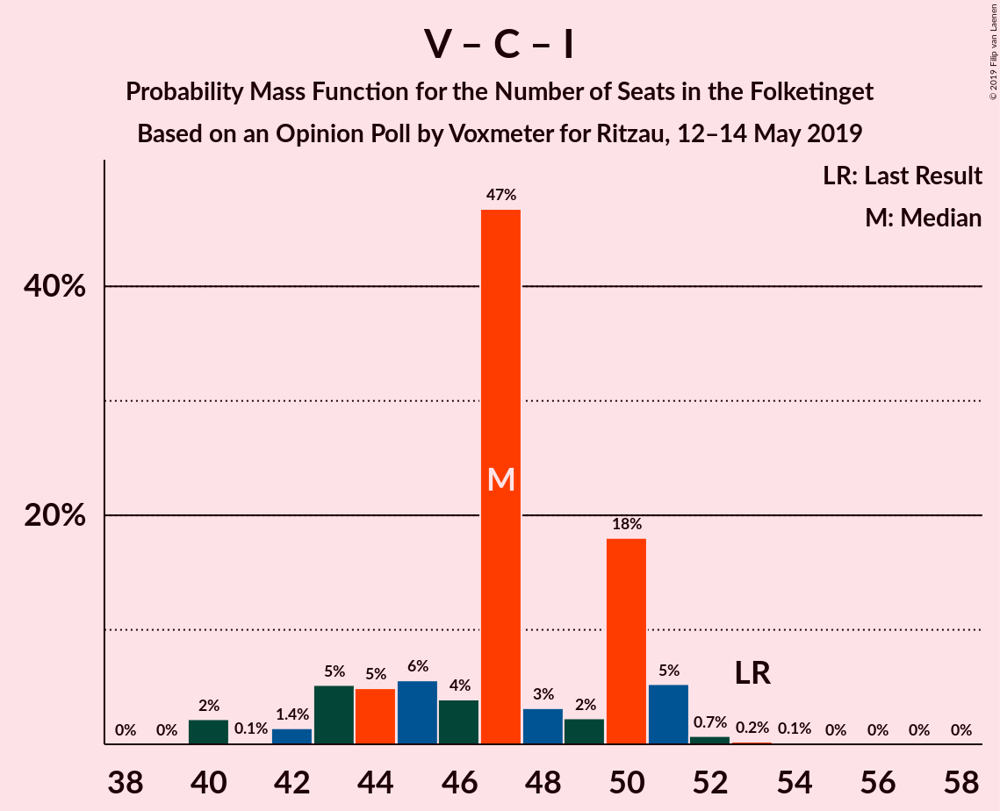

# Opinion Poll by Voxmeter for Ritzau, 12–14 May 2019

<a href="#voting-intentions">Voting Intentions</a> | <a href="#seats">Seats</a> | <a href="#coalitions">Coalitions</a> | <a href="#technical-information">Technical Information</a>

## Voting Intentions

### Confidence Intervals

| Party | Last Result | Poll Result | 80% Confidence Interval | 90% Confidence Interval | 95% Confidence Interval | 99% Confidence Interval |
|:-----:|:-----------:|:-----------:|:-----------------------:|:-----------------------:|:-----------------------:|:-----------------------:|
| Socialdemokraterne | 26.3% | 28.2% | 26.4–30.1% |26.0–30.6% |25.5–31.1% |24.7–32.0% |
| Venstre | 19.5% | 17.2% | 15.8–18.8% |15.4–19.3% |15.0–19.7% |14.3–20.5% |
| Dansk Folkeparti | 21.1% | 11.5% | 10.3–12.9% |10.0–13.3% |9.7–13.6% |9.1–14.3% |
| Enhedslisten–De Rød-Grønne | 7.8% | 10.5% | 9.3–11.8% |9.0–12.2% |8.7–12.5% |8.2–13.2% |
| Socialistisk Folkeparti | 4.2% | 7.7% | 6.7–8.9% |6.5–9.3% |6.2–9.5% |5.8–10.1% |
| Radikale Venstre | 4.6% | 7.6% | 6.6–8.8% |6.4–9.1% |6.1–9.4% |5.7–10.0% |
| Det Konservative Folkeparti | 3.4% | 4.9% | 4.1–5.8% |3.9–6.1% |3.7–6.4% |3.4–6.9% |
| Liberal Alliance | 7.5% | 4.1% | 3.4–5.0% |3.2–5.2% |3.0–5.5% |2.7–5.9% |
| Alternativet | 4.8% | 2.5% | 2.0–3.2% |1.8–3.4% |1.7–3.6% |1.5–4.0% |
| Stram Kurs | 0.0% | 2.3% | 1.8–3.0% |1.6–3.2% |1.5–3.4% |1.3–3.8% |
| Nye Borgerlige | 0.0% | 1.9% | 1.4–2.6% |1.3–2.8% |1.2–2.9% |1.0–3.3% |
| Kristendemokraterne | 0.8% | 1.3% | 0.9–1.9% |0.8–2.0% |0.7–2.2% |0.6–2.5% |
| Klaus Riskær Pedersen | 0.0% | 0.1% | 0.0–0.4% |0.0–0.5% |0.0–0.6% |0.0–0.7% |

*Note:* The poll result column reflects the actual value used in the calculations. Published results may vary slightly, and in addition be rounded to fewer digits.

## Seats

### Confidence Intervals

| Party | Last Result | Median | 80% Confidence Interval | 90% Confidence Interval | 95% Confidence Interval | 99% Confidence Interval |
|:-----:|:-----------:|:------:|:-----------------------:|:-----------------------:|:-----------------------:|:-----------------------:|
| <a href="#socialdemokraterne">Socialdemokraterne</a> | 47 | 50 | 49–52 |49–52 |49–52 |47–55 |
| <a href="#venstre">Venstre</a> | 34 | 30 | 25–31 |25–31 |25–32 |25–35 |
| <a href="#dansk-folkeparti">Dansk Folkeparti</a> | 37 | 22 | 19–24 |19–24 |17–24 |17–27 |
| <a href="#enhedslisten–de-rød-grønne">Enhedslisten–De Rød-Grønne</a> | 14 | 19 | 17–22 |17–22 |17–22 |15–22 |
| <a href="#socialistisk-folkeparti">Socialistisk Folkeparti</a> | 7 | 14 | 12–14 |11–14 |11–16 |9–19 |
| <a href="#radikale-venstre">Radikale Venstre</a> | 8 | 14 | 12–15 |12–16 |12–16 |12–16 |
| <a href="#det-konservative-folkeparti">Det Konservative Folkeparti</a> | 6 | 9 | 8–11 |8–11 |8–11 |7–11 |
| <a href="#liberal-alliance">Liberal Alliance</a> | 13 | 8 | 7–9 |6–10 |6–12 |5–12 |
| <a href="#alternativet">Alternativet</a> | 9 | 6 | 0–6 |0–6 |0–6 |0–6 |
| <a href="#stram-kurs">Stram Kurs</a> | 0 | 4 | 0–4 |0–5 |0–5 |0–7 |
| <a href="#nye-borgerlige">Nye Borgerlige</a> | 0 | 0 | 0–5 |0–5 |0–5 |0–6 |
| <a href="#kristendemokraterne">Kristendemokraterne</a> | 0 | 0 | 0 |0 |0–5 |0–5 |
| <a href="#klaus-riskær-pedersen">Klaus Riskær Pedersen</a> | 0 | 0 | 0 |0 |0 |0 |

### Socialdemokraterne

*For a full overview of the results for this party, see the [Socialdemokraterne](party-socialdemokraterne.html) page.*

| Number of Seats | Probability | Accumulated | Special Marks |
|:---------------:|:-----------:|:-----------:|:-------------:|
| 44 | 0.1% | 100% |  |
| 45 | 0% | 99.9% |  |
| 46 | 0.1% | 99.9% |  |
| 47 | 0.8% | 99.8% | Last Result |
| 48 | 0.5% | 99.0% |  |
| 49 | 47% | 98.6% |  |
| 50 | 8% | 51% | Median |
| 51 | 0% | 44% |  |
| 52 | 42% | 44% |  |
| 53 | 1.3% | 2% |  |
| 54 | 0.1% | 0.7% |  |
| 55 | 0.2% | 0.6% |  |
| 56 | 0.3% | 0.5% |  |
| 57 | 0.1% | 0.2% |  |
| 58 | 0.1% | 0.1% |  |
| 59 | 0% | 0% |  |

### Venstre

*For a full overview of the results for this party, see the [Venstre](party-venstre.html) page.*

| Number of Seats | Probability | Accumulated | Special Marks |
|:---------------:|:-----------:|:-----------:|:-------------:|
| 25 | 25% | 100% |  |
| 26 | 0.1% | 75% |  |
| 27 | 0.1% | 75% |  |
| 28 | 9% | 75% |  |
| 29 | 5% | 65% |  |
| 30 | 40% | 60% | Median |
| 31 | 17% | 20% |  |
| 32 | 1.3% | 3% |  |
| 33 | 1.0% | 2% |  |
| 34 | 0.1% | 1.1% | Last Result |
| 35 | 0.8% | 1.0% |  |
| 36 | 0.2% | 0.2% |  |
| 37 | 0% | 0% |  |

### Dansk Folkeparti

*For a full overview of the results for this party, see the [Dansk Folkeparti](party-danskfolkeparti.html) page.*

| Number of Seats | Probability | Accumulated | Special Marks |
|:---------------:|:-----------:|:-----------:|:-------------:|
| 16 | 0% | 100% |  |
| 17 | 4% | 99.9% |  |
| 18 | 0.2% | 96% |  |
| 19 | 6% | 96% |  |
| 20 | 0.9% | 90% |  |
| 21 | 13% | 89% |  |
| 22 | 41% | 76% | Median |
| 23 | 5% | 36% |  |
| 24 | 29% | 31% |  |
| 25 | 0.1% | 2% |  |
| 26 | 0% | 2% |  |
| 27 | 2% | 2% |  |
| 28 | 0% | 0% |  |
| 29 | 0% | 0% |  |
| 30 | 0% | 0% |  |
| 31 | 0% | 0% |  |
| 32 | 0% | 0% |  |
| 33 | 0% | 0% |  |
| 34 | 0% | 0% |  |
| 35 | 0% | 0% |  |
| 36 | 0% | 0% |  |
| 37 | 0% | 0% | Last Result |

### Enhedslisten–De Rød-Grønne

*For a full overview of the results for this party, see the [Enhedslisten–De Rød-Grønne](party-enhedslisten–derød-grønne.html) page.*

| Number of Seats | Probability | Accumulated | Special Marks |
|:---------------:|:-----------:|:-----------:|:-------------:|
| 13 | 0.3% | 100% |  |
| 14 | 0.1% | 99.7% | Last Result |
| 15 | 0.3% | 99.6% |  |
| 16 | 0.2% | 99.3% |  |
| 17 | 19% | 99.1% |  |
| 18 | 1.1% | 81% |  |
| 19 | 41% | 80% | Median |
| 20 | 6% | 39% |  |
| 21 | 7% | 33% |  |
| 22 | 25% | 26% |  |
| 23 | 0.1% | 0.2% |  |
| 24 | 0.1% | 0.1% |  |
| 25 | 0% | 0% |  |

### Socialistisk Folkeparti

*For a full overview of the results for this party, see the [Socialistisk Folkeparti](party-socialistiskfolkeparti.html) page.*

| Number of Seats | Probability | Accumulated | Special Marks |
|:---------------:|:-----------:|:-----------:|:-------------:|
| 7 | 0% | 100% | Last Result |
| 8 | 0% | 100% |  |
| 9 | 0.6% | 100% |  |
| 10 | 0.2% | 99.4% |  |
| 11 | 9% | 99.2% |  |
| 12 | 37% | 91% |  |
| 13 | 2% | 53% |  |
| 14 | 47% | 52% | Median |
| 15 | 1.4% | 4% |  |
| 16 | 2% | 3% |  |
| 17 | 0.1% | 0.9% |  |
| 18 | 0.2% | 0.8% |  |
| 19 | 0.6% | 0.6% |  |
| 20 | 0% | 0% |  |

### Radikale Venstre

*For a full overview of the results for this party, see the [Radikale Venstre](party-radikalevenstre.html) page.*

| Number of Seats | Probability | Accumulated | Special Marks |
|:---------------:|:-----------:|:-----------:|:-------------:|
| 8 | 0% | 100% | Last Result |
| 9 | 0% | 100% |  |
| 10 | 0.3% | 100% |  |
| 11 | 0.2% | 99.7% |  |
| 12 | 13% | 99.6% |  |
| 13 | 0.3% | 87% |  |
| 14 | 54% | 86% | Median |
| 15 | 27% | 32% |  |
| 16 | 5% | 5% |  |
| 17 | 0% | 0.2% |  |
| 18 | 0.1% | 0.2% |  |
| 19 | 0% | 0% |  |

### Det Konservative Folkeparti

*For a full overview of the results for this party, see the [Det Konservative Folkeparti](party-detkonservativefolkeparti.html) page.*

| Number of Seats | Probability | Accumulated | Special Marks |
|:---------------:|:-----------:|:-----------:|:-------------:|
| 6 | 0.2% | 100% | Last Result |
| 7 | 2% | 99.8% |  |
| 8 | 31% | 98% |  |
| 9 | 48% | 67% | Median |
| 10 | 2% | 19% |  |
| 11 | 16% | 16% |  |
| 12 | 0% | 0% |  |

### Liberal Alliance

*For a full overview of the results for this party, see the [Liberal Alliance](party-liberalalliance.html) page.*

| Number of Seats | Probability | Accumulated | Special Marks |
|:---------------:|:-----------:|:-----------:|:-------------:|
| 4 | 0.1% | 100% |  |
| 5 | 0.6% | 99.9% |  |
| 6 | 5% | 99.3% |  |
| 7 | 30% | 95% |  |
| 8 | 54% | 64% | Median |
| 9 | 5% | 10% |  |
| 10 | 2% | 6% |  |
| 11 | 0% | 4% |  |
| 12 | 4% | 4% |  |
| 13 | 0% | 0% | Last Result |

### Alternativet

*For a full overview of the results for this party, see the [Alternativet](party-alternativet.html) page.*

| Number of Seats | Probability | Accumulated | Special Marks |
|:---------------:|:-----------:|:-----------:|:-------------:|
| 0 | 13% | 100% |  |
| 1 | 0% | 87% |  |
| 2 | 0% | 87% |  |
| 3 | 0% | 87% |  |
| 4 | 6% | 87% |  |
| 5 | 7% | 81% |  |
| 6 | 75% | 75% | Median |
| 7 | 0.1% | 0.2% |  |
| 8 | 0% | 0% |  |
| 9 | 0% | 0% | Last Result |

### Stram Kurs

*For a full overview of the results for this party, see the [Stram Kurs](party-stramkurs.html) page.*

| Number of Seats | Probability | Accumulated | Special Marks |
|:---------------:|:-----------:|:-----------:|:-------------:|
| 0 | 33% | 100% | Last Result |
| 1 | 0% | 67% |  |
| 2 | 0% | 67% |  |
| 3 | 0% | 67% |  |
| 4 | 61% | 67% | Median |
| 5 | 4% | 6% |  |
| 6 | 0.7% | 2% |  |
| 7 | 0.9% | 0.9% |  |
| 8 | 0% | 0% |  |

### Nye Borgerlige

*For a full overview of the results for this party, see the [Nye Borgerlige](party-nyeborgerlige.html) page.*

| Number of Seats | Probability | Accumulated | Special Marks |
|:---------------:|:-----------:|:-----------:|:-------------:|
| 0 | 53% | 100% | Last Result, Median |
| 1 | 0% | 47% |  |
| 2 | 0% | 47% |  |
| 3 | 0% | 47% |  |
| 4 | 26% | 47% |  |
| 5 | 20% | 21% |  |
| 6 | 0.5% | 0.5% |  |
| 7 | 0% | 0% |  |

### Kristendemokraterne

*For a full overview of the results for this party, see the [Kristendemokraterne](party-kristendemokraterne.html) page.*

| Number of Seats | Probability | Accumulated | Special Marks |
|:---------------:|:-----------:|:-----------:|:-------------:|
| 0 | 95% | 100% | Last Result, Median |
| 1 | 0% | 5% |  |
| 2 | 0% | 5% |  |
| 3 | 0% | 5% |  |
| 4 | 2% | 5% |  |
| 5 | 3% | 3% |  |
| 6 | 0% | 0% |  |

### Klaus Riskær Pedersen

*For a full overview of the results for this party, see the [Klaus Riskær Pedersen](party-klausriskærpedersen.html) page.*

| Number of Seats | Probability | Accumulated | Special Marks |
|:---------------:|:-----------:|:-----------:|:-------------:|
| 0 | 100% | 100% | Last Result, Median |

## Coalitions

### Confidence Intervals

| Coalition | Last Result | Median | Majority? | 80% Confidence Interval | 90% Confidence Interval | 95% Confidence Interval | 99% Confidence Interval |
|:---------:|:-----------:|:------:|:---------:|:-----------------------:|:-----------------------:|:-----------------------:|:-----------------------:|
| Socialdemokraterne – Enhedslisten–De Rød-Grønne – Socialistisk Folkeparti – Radikale Venstre – Alternativet | 85 | 102 | 100% | 95–107 | 95–107 | 95–107 | 94–107 |
| Socialdemokraterne – Enhedslisten–De Rød-Grønne – Socialistisk Folkeparti – Radikale Venstre | 76 | 96 | 100% | 95–101 | 94–101 | 94–101 | 90–102 |
| Socialdemokraterne – Enhedslisten–De Rød-Grønne – Socialistisk Folkeparti – Alternativet | 77 | 88 | 27% | 81–92 | 81–92 | 81–92 | 80–92 |
| Socialdemokraterne – Enhedslisten–De Rød-Grønne – Socialistisk Folkeparti | 68 | 82 | 0.1% | 81–86 | 80–86 | 80–86 | 76–87 |
| Socialdemokraterne – Socialistisk Folkeparti – Radikale Venstre | 62 | 77 | 0% | 75–79 | 73–79 | 73–80 | 70–84 |
| Venstre – Dansk Folkeparti – Det Konservative Folkeparti – Liberal Alliance – Stram Kurs – Nye Borgerlige – Kristendemokraterne – Klaus Riskær Pedersen | 90 | 73 | 0% | 68–80 | 68–80 | 68–80 | 68–81 |
| Venstre – Dansk Folkeparti – Det Konservative Folkeparti – Liberal Alliance – Nye Borgerlige – Kristendemokraterne – Klaus Riskær Pedersen | 90 | 69 | 0% | 68–76 | 68–76 | 68–76 | 64–77 |
| Venstre – Dansk Folkeparti – Det Konservative Folkeparti – Liberal Alliance – Nye Borgerlige – Kristendemokraterne | 90 | 69 | 0% | 68–76 | 68–76 | 68–76 | 64–77 |
| Venstre – Dansk Folkeparti – Det Konservative Folkeparti – Liberal Alliance – Nye Borgerlige – Klaus Riskær Pedersen | 90 | 69 | 0% | 68–76 | 67–76 | 65–76 | 64–77 |
| Venstre – Dansk Folkeparti – Det Konservative Folkeparti – Liberal Alliance – Nye Borgerlige | 90 | 69 | 0% | 68–76 | 67–76 | 65–76 | 64–77 |
| Venstre – Dansk Folkeparti – Det Konservative Folkeparti – Liberal Alliance – Kristendemokraterne | 90 | 69 | 0% | 64–71 | 64–72 | 64–73 | 60–75 |
| Venstre – Dansk Folkeparti – Det Konservative Folkeparti – Liberal Alliance | 90 | 69 | 0% | 64–71 | 64–72 | 60–72 | 60–73 |
| Socialdemokraterne – Radikale Venstre | 55 | 63 | 0% | 62–67 | 61–68 | 61–68 | 60–68 |
| Venstre – Det Konservative Folkeparti – Liberal Alliance | 53 | 47 | 0% | 40–50 | 40–50 | 40–51 | 40–51 |
| Venstre – Det Konservative Folkeparti | 40 | 39 | 0% | 33–42 | 33–42 | 33–42 | 33–44 |
| Venstre | 34 | 30 | 0% | 25–31 | 25–31 | 25–32 | 25–35 |

### Socialdemokraterne – Enhedslisten–De Rød-Grønne – Socialistisk Folkeparti – Radikale Venstre – Alternativet

| Number of Seats | Probability | Accumulated | Special Marks |
|:---------------:|:-----------:|:-----------:|:-------------:|
| 85 | 0% | 100% | Last Result |
| 86 | 0% | 100% |  |
| 87 | 0% | 100% |  |
| 88 | 0% | 100% |  |
| 89 | 0% | 100% |  |
| 90 | 0% | 100% | Majority |
| 91 | 0% | 100% |  |
| 92 | 0% | 100% |  |
| 93 | 0% | 100% |  |
| 94 | 0.5% | 100% |  |
| 95 | 12% | 99.5% |  |
| 96 | 0.5% | 87% |  |
| 97 | 0.5% | 87% |  |
| 98 | 0.1% | 86% |  |
| 99 | 4% | 86% |  |
| 100 | 3% | 82% |  |
| 101 | 4% | 79% |  |
| 102 | 46% | 74% |  |
| 103 | 1.1% | 28% | Median |
| 104 | 1.2% | 27% |  |
| 105 | 0% | 26% |  |
| 106 | 0.6% | 26% |  |
| 107 | 25% | 25% |  |
| 108 | 0% | 0% |  |

### Socialdemokraterne – Enhedslisten–De Rød-Grønne – Socialistisk Folkeparti – Radikale Venstre

| Number of Seats | Probability | Accumulated | Special Marks |
|:---------------:|:-----------:|:-----------:|:-------------:|
| 76 | 0% | 100% | Last Result |
| 77 | 0% | 100% |  |
| 78 | 0% | 100% |  |
| 79 | 0% | 100% |  |
| 80 | 0% | 100% |  |
| 81 | 0% | 100% |  |
| 82 | 0% | 100% |  |
| 83 | 0% | 100% |  |
| 84 | 0% | 100% |  |
| 85 | 0% | 100% |  |
| 86 | 0% | 100% |  |
| 87 | 0% | 100% |  |
| 88 | 0% | 100% |  |
| 89 | 0% | 100% |  |
| 90 | 1.0% | 100% | Majority |
| 91 | 0.1% | 99.0% |  |
| 92 | 0.2% | 98.9% |  |
| 93 | 0.1% | 98.7% |  |
| 94 | 4% | 98.6% |  |
| 95 | 16% | 95% |  |
| 96 | 47% | 78% |  |
| 97 | 3% | 31% | Median |
| 98 | 0.2% | 28% |  |
| 99 | 0.1% | 27% |  |
| 100 | 1.1% | 27% |  |
| 101 | 25% | 26% |  |
| 102 | 0.7% | 0.9% |  |
| 103 | 0.1% | 0.3% |  |
| 104 | 0% | 0.1% |  |
| 105 | 0% | 0.1% |  |
| 106 | 0.1% | 0.1% |  |
| 107 | 0% | 0% |  |

### Socialdemokraterne – Enhedslisten–De Rød-Grønne – Socialistisk Folkeparti – Alternativet

| Number of Seats | Probability | Accumulated | Special Marks |
|:---------------:|:-----------:|:-----------:|:-------------:|
| 77 | 0% | 100% | Last Result |
| 78 | 0% | 100% |  |
| 79 | 0.2% | 100% |  |
| 80 | 0.5% | 99.8% |  |
| 81 | 12% | 99.3% |  |
| 82 | 0% | 87% |  |
| 83 | 0.3% | 87% |  |
| 84 | 0.4% | 87% |  |
| 85 | 0.8% | 87% |  |
| 86 | 5% | 86% |  |
| 87 | 4% | 81% |  |
| 88 | 44% | 77% |  |
| 89 | 5% | 32% | Median |
| 90 | 0.1% | 27% | Majority |
| 91 | 2% | 27% |  |
| 92 | 25% | 25% |  |
| 93 | 0.1% | 0.2% |  |
| 94 | 0% | 0.1% |  |
| 95 | 0% | 0% |  |

### Socialdemokraterne – Enhedslisten–De Rød-Grønne – Socialistisk Folkeparti

| Number of Seats | Probability | Accumulated | Special Marks |
|:---------------:|:-----------:|:-----------:|:-------------:|
| 68 | 0% | 100% | Last Result |
| 69 | 0% | 100% |  |
| 70 | 0% | 100% |  |
| 71 | 0% | 100% |  |
| 72 | 0% | 100% |  |
| 73 | 0% | 100% |  |
| 74 | 0% | 100% |  |
| 75 | 0% | 100% |  |
| 76 | 0.5% | 99.9% |  |
| 77 | 0.3% | 99.5% |  |
| 78 | 0% | 99.2% |  |
| 79 | 0.3% | 99.2% |  |
| 80 | 5% | 98.9% |  |
| 81 | 12% | 94% |  |
| 82 | 44% | 82% |  |
| 83 | 6% | 38% | Median |
| 84 | 3% | 32% |  |
| 85 | 2% | 29% |  |
| 86 | 25% | 26% |  |
| 87 | 0.7% | 1.0% |  |
| 88 | 0.2% | 0.4% |  |
| 89 | 0.1% | 0.2% |  |
| 90 | 0% | 0.1% | Majority |
| 91 | 0% | 0.1% |  |
| 92 | 0% | 0% |  |

### Socialdemokraterne – Socialistisk Folkeparti – Radikale Venstre

| Number of Seats | Probability | Accumulated | Special Marks |
|:---------------:|:-----------:|:-----------:|:-------------:|
| 62 | 0% | 100% | Last Result |
| 63 | 0% | 100% |  |
| 64 | 0% | 100% |  |
| 65 | 0% | 100% |  |
| 66 | 0% | 100% |  |
| 67 | 0% | 100% |  |
| 68 | 0% | 100% |  |
| 69 | 0% | 100% |  |
| 70 | 0.7% | 100% |  |
| 71 | 0% | 99.3% |  |
| 72 | 0.2% | 99.3% |  |
| 73 | 4% | 99.0% |  |
| 74 | 0.3% | 95% |  |
| 75 | 7% | 95% |  |
| 76 | 0% | 87% |  |
| 77 | 41% | 87% |  |
| 78 | 12% | 47% | Median |
| 79 | 30% | 35% |  |
| 80 | 2% | 4% |  |
| 81 | 1.2% | 2% |  |
| 82 | 0.1% | 1.2% |  |
| 83 | 0.2% | 1.1% |  |
| 84 | 0.9% | 1.0% |  |
| 85 | 0.1% | 0.1% |  |
| 86 | 0% | 0% |  |

### Venstre – Dansk Folkeparti – Det Konservative Folkeparti – Liberal Alliance – Stram Kurs – Nye Borgerlige – Kristendemokraterne – Klaus Riskær Pedersen

| Number of Seats | Probability | Accumulated | Special Marks |
|:---------------:|:-----------:|:-----------:|:-------------:|
| 68 | 25% | 100% |  |
| 69 | 0.6% | 75% |  |
| 70 | 0% | 74% |  |
| 71 | 1.2% | 74% |  |
| 72 | 1.1% | 73% |  |
| 73 | 46% | 72% | Median |
| 74 | 4% | 26% |  |
| 75 | 3% | 21% |  |
| 76 | 4% | 18% |  |
| 77 | 0.1% | 14% |  |
| 78 | 0.5% | 14% |  |
| 79 | 0.5% | 13% |  |
| 80 | 12% | 13% |  |
| 81 | 0.5% | 0.5% |  |
| 82 | 0% | 0% |  |
| 83 | 0% | 0% |  |
| 84 | 0% | 0% |  |
| 85 | 0% | 0% |  |
| 86 | 0% | 0% |  |
| 87 | 0% | 0% |  |
| 88 | 0% | 0% |  |
| 89 | 0% | 0% |  |
| 90 | 0% | 0% | Last Result, Majority |

### Venstre – Dansk Folkeparti – Det Konservative Folkeparti – Liberal Alliance – Nye Borgerlige – Kristendemokraterne – Klaus Riskær Pedersen

| Number of Seats | Probability | Accumulated | Special Marks |
|:---------------:|:-----------:|:-----------:|:-------------:|
| 63 | 0.1% | 100% |  |
| 64 | 0.6% | 99.9% |  |
| 65 | 0.9% | 99.3% |  |
| 66 | 0% | 98% |  |
| 67 | 0.2% | 98% |  |
| 68 | 25% | 98% |  |
| 69 | 40% | 73% | Median |
| 70 | 7% | 33% |  |
| 71 | 1.2% | 26% |  |
| 72 | 4% | 25% |  |
| 73 | 7% | 20% |  |
| 74 | 0.4% | 13% |  |
| 75 | 0.3% | 13% |  |
| 76 | 12% | 13% |  |
| 77 | 0.5% | 0.7% |  |
| 78 | 0% | 0.2% |  |
| 79 | 0% | 0.2% |  |
| 80 | 0.1% | 0.2% |  |
| 81 | 0% | 0% |  |
| 82 | 0% | 0% |  |
| 83 | 0% | 0% |  |
| 84 | 0% | 0% |  |
| 85 | 0% | 0% |  |
| 86 | 0% | 0% |  |
| 87 | 0% | 0% |  |
| 88 | 0% | 0% |  |
| 89 | 0% | 0% |  |
| 90 | 0% | 0% | Last Result, Majority |

### Venstre – Dansk Folkeparti – Det Konservative Folkeparti – Liberal Alliance – Nye Borgerlige – Kristendemokraterne

| Number of Seats | Probability | Accumulated | Special Marks |
|:---------------:|:-----------:|:-----------:|:-------------:|
| 63 | 0.1% | 100% |  |
| 64 | 0.6% | 99.9% |  |
| 65 | 0.9% | 99.3% |  |
| 66 | 0% | 98% |  |
| 67 | 0.2% | 98% |  |
| 68 | 25% | 98% |  |
| 69 | 40% | 73% | Median |
| 70 | 7% | 33% |  |
| 71 | 1.2% | 26% |  |
| 72 | 4% | 25% |  |
| 73 | 7% | 20% |  |
| 74 | 0.4% | 13% |  |
| 75 | 0.3% | 13% |  |
| 76 | 12% | 13% |  |
| 77 | 0.5% | 0.7% |  |
| 78 | 0% | 0.2% |  |
| 79 | 0% | 0.2% |  |
| 80 | 0.1% | 0.2% |  |
| 81 | 0% | 0% |  |
| 82 | 0% | 0% |  |
| 83 | 0% | 0% |  |
| 84 | 0% | 0% |  |
| 85 | 0% | 0% |  |
| 86 | 0% | 0% |  |
| 87 | 0% | 0% |  |
| 88 | 0% | 0% |  |
| 89 | 0% | 0% |  |
| 90 | 0% | 0% | Last Result, Majority |

### Venstre – Dansk Folkeparti – Det Konservative Folkeparti – Liberal Alliance – Nye Borgerlige – Klaus Riskær Pedersen

| Number of Seats | Probability | Accumulated | Special Marks |
|:---------------:|:-----------:|:-----------:|:-------------:|
| 63 | 0.1% | 100% |  |
| 64 | 0.7% | 99.9% |  |
| 65 | 4% | 99.2% |  |
| 66 | 0% | 95% |  |
| 67 | 1.4% | 95% |  |
| 68 | 25% | 94% |  |
| 69 | 40% | 68% | Median |
| 70 | 4% | 28% |  |
| 71 | 0.1% | 24% |  |
| 72 | 4% | 24% |  |
| 73 | 7% | 20% |  |
| 74 | 0.4% | 13% |  |
| 75 | 0.3% | 13% |  |
| 76 | 12% | 13% |  |
| 77 | 0.5% | 0.6% |  |
| 78 | 0% | 0.2% |  |
| 79 | 0% | 0.1% |  |
| 80 | 0.1% | 0.1% |  |
| 81 | 0% | 0% |  |
| 82 | 0% | 0% |  |
| 83 | 0% | 0% |  |
| 84 | 0% | 0% |  |
| 85 | 0% | 0% |  |
| 86 | 0% | 0% |  |
| 87 | 0% | 0% |  |
| 88 | 0% | 0% |  |
| 89 | 0% | 0% |  |
| 90 | 0% | 0% | Last Result, Majority |

### Venstre – Dansk Folkeparti – Det Konservative Folkeparti – Liberal Alliance – Nye Borgerlige

| Number of Seats | Probability | Accumulated | Special Marks |
|:---------------:|:-----------:|:-----------:|:-------------:|
| 63 | 0.1% | 100% |  |
| 64 | 0.7% | 99.9% |  |
| 65 | 4% | 99.2% |  |
| 66 | 0% | 95% |  |
| 67 | 1.4% | 95% |  |
| 68 | 25% | 94% |  |
| 69 | 40% | 68% | Median |
| 70 | 4% | 28% |  |
| 71 | 0.1% | 24% |  |
| 72 | 4% | 24% |  |
| 73 | 7% | 20% |  |
| 74 | 0.4% | 13% |  |
| 75 | 0.3% | 13% |  |
| 76 | 12% | 13% |  |
| 77 | 0.5% | 0.6% |  |
| 78 | 0% | 0.2% |  |
| 79 | 0% | 0.1% |  |
| 80 | 0.1% | 0.1% |  |
| 81 | 0% | 0% |  |
| 82 | 0% | 0% |  |
| 83 | 0% | 0% |  |
| 84 | 0% | 0% |  |
| 85 | 0% | 0% |  |
| 86 | 0% | 0% |  |
| 87 | 0% | 0% |  |
| 88 | 0% | 0% |  |
| 89 | 0% | 0% |  |
| 90 | 0% | 0% | Last Result, Majority |

### Venstre – Dansk Folkeparti – Det Konservative Folkeparti – Liberal Alliance – Kristendemokraterne

| Number of Seats | Probability | Accumulated | Special Marks |
|:---------------:|:-----------:|:-----------:|:-------------:|
| 60 | 0.6% | 100% |  |
| 61 | 0.1% | 99.4% |  |
| 62 | 0% | 99.3% |  |
| 63 | 0.1% | 99.3% |  |
| 64 | 25% | 99.3% |  |
| 65 | 4% | 74% |  |
| 66 | 0.3% | 70% |  |
| 67 | 0.3% | 70% |  |
| 68 | 5% | 69% |  |
| 69 | 40% | 65% | Median |
| 70 | 4% | 25% |  |
| 71 | 13% | 20% |  |
| 72 | 4% | 7% |  |
| 73 | 2% | 3% |  |
| 74 | 0% | 0.6% |  |
| 75 | 0.5% | 0.5% |  |
| 76 | 0.1% | 0.1% |  |
| 77 | 0% | 0% |  |
| 78 | 0% | 0% |  |
| 79 | 0% | 0% |  |
| 80 | 0% | 0% |  |
| 81 | 0% | 0% |  |
| 82 | 0% | 0% |  |
| 83 | 0% | 0% |  |
| 84 | 0% | 0% |  |
| 85 | 0% | 0% |  |
| 86 | 0% | 0% |  |
| 87 | 0% | 0% |  |
| 88 | 0% | 0% |  |
| 89 | 0% | 0% |  |
| 90 | 0% | 0% | Last Result, Majority |

### Venstre – Dansk Folkeparti – Det Konservative Folkeparti – Liberal Alliance

| Number of Seats | Probability | Accumulated | Special Marks |
|:---------------:|:-----------:|:-----------:|:-------------:|
| 60 | 4% | 100% |  |
| 61 | 0.1% | 96% |  |
| 62 | 0% | 96% |  |
| 63 | 0.1% | 96% |  |
| 64 | 25% | 96% |  |
| 65 | 0.9% | 71% |  |
| 66 | 0.3% | 70% |  |
| 67 | 1.4% | 70% |  |
| 68 | 5% | 68% |  |
| 69 | 40% | 63% | Median |
| 70 | 4% | 23% |  |
| 71 | 12% | 19% |  |
| 72 | 5% | 7% |  |
| 73 | 2% | 2% |  |
| 74 | 0% | 0.4% |  |
| 75 | 0.4% | 0.4% |  |
| 76 | 0% | 0% |  |
| 77 | 0% | 0% |  |
| 78 | 0% | 0% |  |
| 79 | 0% | 0% |  |
| 80 | 0% | 0% |  |
| 81 | 0% | 0% |  |
| 82 | 0% | 0% |  |
| 83 | 0% | 0% |  |
| 84 | 0% | 0% |  |
| 85 | 0% | 0% |  |
| 86 | 0% | 0% |  |
| 87 | 0% | 0% |  |
| 88 | 0% | 0% |  |
| 89 | 0% | 0% |  |
| 90 | 0% | 0% | Last Result, Majority |

### Socialdemokraterne – Radikale Venstre

| Number of Seats | Probability | Accumulated | Special Marks |
|:---------------:|:-----------:|:-----------:|:-------------:|
| 55 | 0% | 100% | Last Result |
| 56 | 0% | 99.9% |  |
| 57 | 0.2% | 99.9% |  |
| 58 | 0% | 99.7% |  |
| 59 | 0% | 99.7% |  |
| 60 | 0.5% | 99.6% |  |
| 61 | 8% | 99.2% |  |
| 62 | 5% | 91% |  |
| 63 | 40% | 86% |  |
| 64 | 2% | 46% | Median |
| 65 | 0.7% | 45% |  |
| 66 | 12% | 44% |  |
| 67 | 25% | 32% |  |
| 68 | 6% | 6% |  |
| 69 | 0.3% | 0.5% |  |
| 70 | 0% | 0.2% |  |
| 71 | 0.1% | 0.2% |  |
| 72 | 0.1% | 0.1% |  |
| 73 | 0% | 0% |  |

### Venstre – Det Konservative Folkeparti – Liberal Alliance

| Number of Seats | Probability | Accumulated | Special Marks |
|:---------------:|:-----------:|:-----------:|:-------------:|
| 40 | 26% | 100% |  |
| 41 | 0% | 74% |  |
| 42 | 0% | 74% |  |
| 43 | 3% | 74% |  |
| 44 | 0.3% | 71% |  |
| 45 | 5% | 71% |  |
| 46 | 3% | 66% |  |
| 47 | 40% | 63% | Median |
| 48 | 4% | 23% |  |
| 49 | 0.5% | 19% |  |
| 50 | 14% | 18% |  |
| 51 | 4% | 5% |  |
| 52 | 0.1% | 0.5% |  |
| 53 | 0% | 0.4% | Last Result |
| 54 | 0.2% | 0.4% |  |
| 55 | 0% | 0.3% |  |
| 56 | 0.3% | 0.3% |  |
| 57 | 0% | 0% |  |

### Venstre – Det Konservative Folkeparti

| Number of Seats | Probability | Accumulated | Special Marks |
|:---------------:|:-----------:|:-----------:|:-------------:|
| 33 | 25% | 100% |  |
| 34 | 0% | 75% |  |
| 35 | 0.7% | 75% |  |
| 36 | 0% | 74% |  |
| 37 | 3% | 74% |  |
| 38 | 7% | 71% |  |
| 39 | 48% | 64% | Median |
| 40 | 2% | 16% | Last Result |
| 41 | 0.4% | 14% |  |
| 42 | 12% | 13% |  |
| 43 | 0.1% | 1.1% |  |
| 44 | 0.8% | 1.0% |  |
| 45 | 0.2% | 0.2% |  |
| 46 | 0% | 0% |  |

### Venstre

| Number of Seats | Probability | Accumulated | Special Marks |
|:---------------:|:-----------:|:-----------:|:-------------:|
| 25 | 25% | 100% |  |
| 26 | 0.1% | 75% |  |
| 27 | 0.1% | 75% |  |
| 28 | 9% | 75% |  |
| 29 | 5% | 65% |  |
| 30 | 40% | 60% | Median |
| 31 | 17% | 20% |  |
| 32 | 1.3% | 3% |  |
| 33 | 1.0% | 2% |  |
| 34 | 0.1% | 1.1% | Last Result |
| 35 | 0.8% | 1.0% |  |
| 36 | 0.2% | 0.2% |  |
| 37 | 0% | 0% |  |

## Technical Information

### Opinion Poll

+ **Polling firm:** Voxmeter
+ **Commissioner(s):** Ritzau
+ **Fieldwork period:** 12–14 May 2019

### Calculations

+ **Sample size:** 1010
+ **Simulations done:** 131,072
+ **Error estimate:** 2.67%

