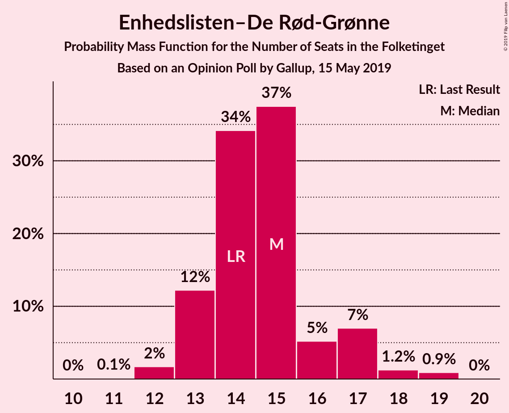
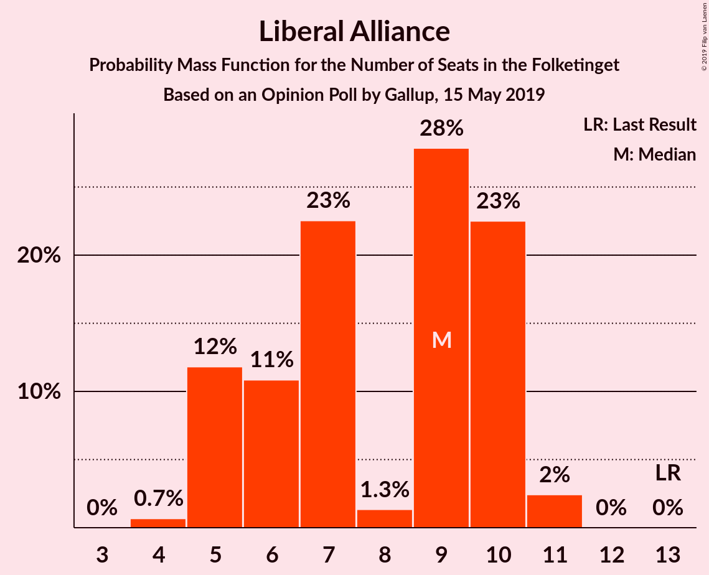
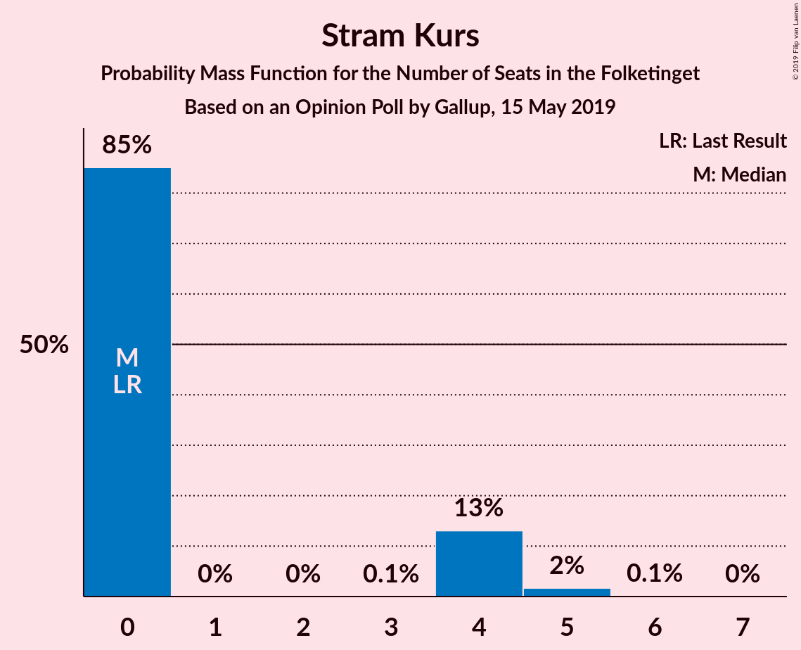
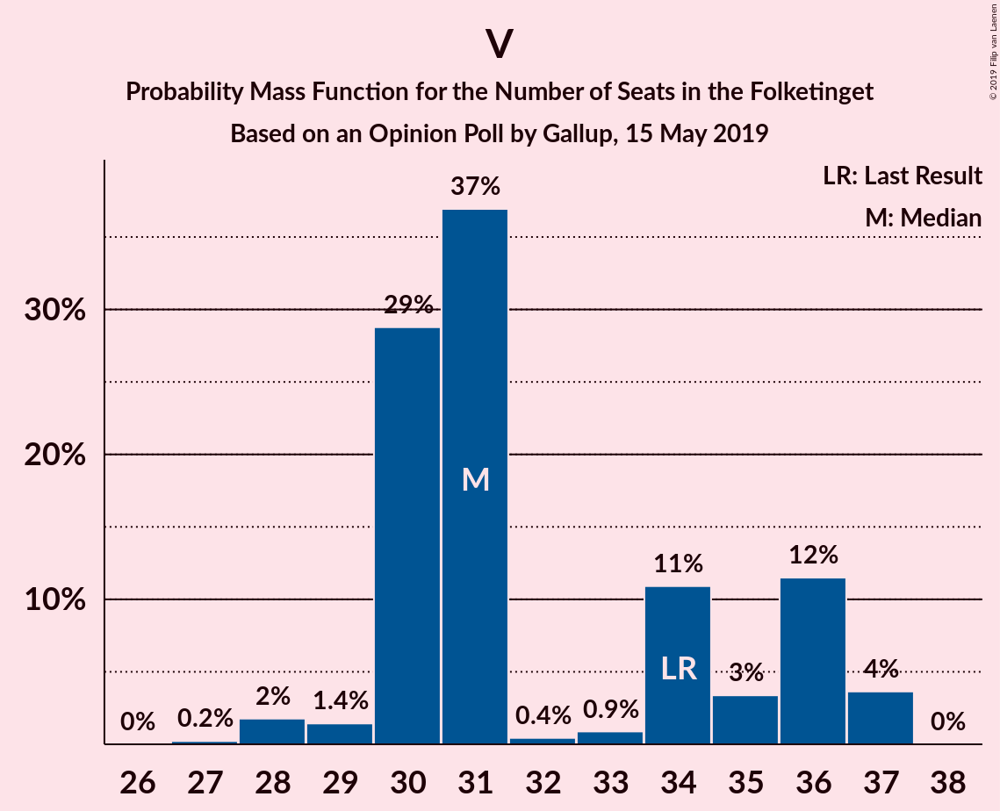

# Opinion Poll by Gallup, 15 May 2019

<a href="#voting-intentions">Voting Intentions</a> | <a href="#seats">Seats</a> | <a href="#coalitions">Coalitions</a> | <a href="#technical-information">Technical Information</a>

## Voting Intentions

### Confidence Intervals

| Party | Last Result | Poll Result | 80% Confidence Interval | 90% Confidence Interval | 95% Confidence Interval | 99% Confidence Interval |
|:-----:|:-----------:|:-----------:|:-----------------------:|:-----------------------:|:-----------------------:|:-----------------------:|
| Socialdemokraterne | 26.3% | 26.2% | 24.8–27.7% |24.4–28.1% |24.0–28.4% |23.4–29.2% |
| Venstre | 19.5% | 17.8% | 16.6–19.1% |16.3–19.5% |16.0–19.8% |15.4–20.5% |
| Dansk Folkeparti | 21.1% | 13.4% | 12.4–14.6% |12.1–15.0% |11.8–15.3% |11.3–15.8% |
| Socialistisk Folkeparti | 4.2% | 8.3% | 7.4–9.3% |7.2–9.5% |7.0–9.8% |6.6–10.3% |
| Enhedslisten–De Rød-Grønne | 7.8% | 8.1% | 7.3–9.1% |7.0–9.3% |6.8–9.6% |6.4–10.1% |
| Radikale Venstre | 4.6% | 7.3% | 6.5–8.2% |6.3–8.5% |6.1–8.7% |5.7–9.2% |
| Det Konservative Folkeparti | 3.4% | 5.9% | 5.2–6.8% |5.0–7.0% |4.9–7.2% |4.5–7.7% |
| Liberal Alliance | 7.5% | 3.9% | 3.3–4.6% |3.2–4.8% |3.0–5.0% |2.8–5.4% |
| Alternativet | 4.8% | 3.3% | 2.8–4.0% |2.7–4.2% |2.5–4.4% |2.3–4.7% |
| Nye Borgerlige | 0.0% | 2.1% | 1.7–2.7% |1.6–2.8% |1.5–2.9% |1.3–3.2% |
| Stram Kurs | 0.0% | 1.6% | 1.3–2.1% |1.2–2.3% |1.1–2.4% |1.0–2.7% |
| Kristendemokraterne | 0.8% | 1.4% | 1.1–1.8% |1.0–2.0% |0.9–2.1% |0.8–2.3% |
| Klaus Riskær Pedersen | 0.0% | 0.6% | 0.4–0.9% |0.4–1.0% |0.3–1.1% |0.2–1.3% |

*Note:* The poll result column reflects the actual value used in the calculations. Published results may vary slightly, and in addition be rounded to fewer digits.

## Seats

### Confidence Intervals

| Party | Last Result | Median | 80% Confidence Interval | 90% Confidence Interval | 95% Confidence Interval | 99% Confidence Interval |
|:-----:|:-----------:|:------:|:-----------------------:|:-----------------------:|:-----------------------:|:-----------------------:|
| <a href="#socialdemokraterne">Socialdemokraterne</a> | 47 | 46 | 43–48 |43–48 |43–50 |43–53 |
| <a href="#venstre">Venstre</a> | 34 | 30 | 30–36 |30–37 |29–37 |28–37 |
| <a href="#dansk-folkeparti">Dansk Folkeparti</a> | 37 | 23 | 23–27 |22–27 |21–27 |20–27 |
| <a href="#socialistisk-folkeparti">Socialistisk Folkeparti</a> | 7 | 15 | 13–15 |13–15 |13–17 |11–18 |
| <a href="#enhedslisten–de-rød-grønne">Enhedslisten–De Rød-Grønne</a> | 14 | 14 | 14–16 |14–17 |13–18 |12–19 |
| <a href="#radikale-venstre">Radikale Venstre</a> | 8 | 14 | 12–14 |12–14 |12–14 |11–15 |
| <a href="#det-konservative-folkeparti">Det Konservative Folkeparti</a> | 6 | 12 | 10–13 |10–13 |10–13 |9–13 |
| <a href="#liberal-alliance">Liberal Alliance</a> | 13 | 9 | 6–9 |6–9 |5–9 |5–10 |
| <a href="#alternativet">Alternativet</a> | 9 | 7 | 6–7 |5–8 |5–8 |5–8 |
| <a href="#nye-borgerlige">Nye Borgerlige</a> | 0 | 4 | 0–4 |0–5 |0–5 |0–6 |
| <a href="#stram-kurs">Stram Kurs</a> | 0 | 0 | 0–4 |0–4 |0–4 |0–5 |
| <a href="#kristendemokraterne">Kristendemokraterne</a> | 0 | 0 | 0 |0 |0 |0 |
| <a href="#klaus-riskær-pedersen">Klaus Riskær Pedersen</a> | 0 | 0 | 0 |0 |0 |0 |

### Socialdemokraterne

*For a full overview of the results for this party, see the [Socialdemokraterne](party-socialdemokraterne.html) page.*

| Number of Seats | Probability | Accumulated | Special Marks |
|:---------------:|:-----------:|:-----------:|:-------------:|
| 41 | 0.1% | 100% |  |
| 42 | 0.3% | 99.9% |  |
| 43 | 11% | 99.6% |  |
| 44 | 0.6% | 88% |  |
| 45 | 1.2% | 88% |  |
| 46 | 52% | 86% | Median |
| 47 | 21% | 34% | Last Result |
| 48 | 9% | 13% |  |
| 49 | 0.4% | 4% |  |
| 50 | 3% | 4% |  |
| 51 | 0.1% | 0.8% |  |
| 52 | 0% | 0.7% |  |
| 53 | 0.5% | 0.7% |  |
| 54 | 0.2% | 0.2% |  |
| 55 | 0% | 0% |  |

### Venstre

*For a full overview of the results for this party, see the [Venstre](party-venstre.html) page.*

| Number of Seats | Probability | Accumulated | Special Marks |
|:---------------:|:-----------:|:-----------:|:-------------:|
| 27 | 0.3% | 100% |  |
| 28 | 2% | 99.7% |  |
| 29 | 2% | 98% |  |
| 30 | 49% | 96% | Median |
| 31 | 4% | 47% |  |
| 32 | 0.4% | 43% |  |
| 33 | 0.7% | 43% |  |
| 34 | 16% | 42% | Last Result |
| 35 | 0.1% | 26% |  |
| 36 | 20% | 26% |  |
| 37 | 6% | 6% |  |
| 38 | 0% | 0% |  |

### Dansk Folkeparti

*For a full overview of the results for this party, see the [Dansk Folkeparti](party-danskfolkeparti.html) page.*

| Number of Seats | Probability | Accumulated | Special Marks |
|:---------------:|:-----------:|:-----------:|:-------------:|
| 20 | 1.0% | 100% |  |
| 21 | 2% | 99.0% |  |
| 22 | 7% | 97% |  |
| 23 | 54% | 90% | Median |
| 24 | 6% | 37% |  |
| 25 | 8% | 31% |  |
| 26 | 1.5% | 23% |  |
| 27 | 22% | 22% |  |
| 28 | 0% | 0.1% |  |
| 29 | 0.1% | 0.1% |  |
| 30 | 0% | 0% |  |
| 31 | 0% | 0% |  |
| 32 | 0% | 0% |  |
| 33 | 0% | 0% |  |
| 34 | 0% | 0% |  |
| 35 | 0% | 0% |  |
| 36 | 0% | 0% |  |
| 37 | 0% | 0% | Last Result |

### Socialistisk Folkeparti

*For a full overview of the results for this party, see the [Socialistisk Folkeparti](party-socialistiskfolkeparti.html) page.*

| Number of Seats | Probability | Accumulated | Special Marks |
|:---------------:|:-----------:|:-----------:|:-------------:|
| 7 | 0% | 100% | Last Result |
| 8 | 0% | 100% |  |
| 9 | 0% | 100% |  |
| 10 | 0% | 100% |  |
| 11 | 1.3% | 100% |  |
| 12 | 0.1% | 98.7% |  |
| 13 | 23% | 98.6% |  |
| 14 | 2% | 76% |  |
| 15 | 70% | 74% | Median |
| 16 | 1.2% | 4% |  |
| 17 | 2% | 3% |  |
| 18 | 0.7% | 1.0% |  |
| 19 | 0.3% | 0.3% |  |
| 20 | 0% | 0% |  |

### Enhedslisten–De Rød-Grønne

*For a full overview of the results for this party, see the [Enhedslisten–De Rød-Grønne](party-enhedslisten–derød-grønne.html) page.*

| Number of Seats | Probability | Accumulated | Special Marks |
|:---------------:|:-----------:|:-----------:|:-------------:|
| 11 | 0.2% | 100% |  |
| 12 | 0.9% | 99.8% |  |
| 13 | 4% | 98.9% |  |
| 14 | 55% | 95% | Last Result, Median |
| 15 | 27% | 40% |  |
| 16 | 7% | 13% |  |
| 17 | 3% | 6% |  |
| 18 | 1.3% | 3% |  |
| 19 | 2% | 2% |  |
| 20 | 0% | 0% |  |

### Radikale Venstre

*For a full overview of the results for this party, see the [Radikale Venstre](party-radikalevenstre.html) page.*

| Number of Seats | Probability | Accumulated | Special Marks |
|:---------------:|:-----------:|:-----------:|:-------------:|
| 8 | 0% | 100% | Last Result |
| 9 | 0% | 100% |  |
| 10 | 0.1% | 100% |  |
| 11 | 0.9% | 99.9% |  |
| 12 | 30% | 99.0% |  |
| 13 | 9% | 70% |  |
| 14 | 58% | 60% | Median |
| 15 | 2% | 2% |  |
| 16 | 0.1% | 0.2% |  |
| 17 | 0% | 0.1% |  |
| 18 | 0.1% | 0.1% |  |
| 19 | 0% | 0% |  |

### Det Konservative Folkeparti

*For a full overview of the results for this party, see the [Det Konservative Folkeparti](party-detkonservativefolkeparti.html) page.*

| Number of Seats | Probability | Accumulated | Special Marks |
|:---------------:|:-----------:|:-----------:|:-------------:|
| 6 | 0% | 100% | Last Result |
| 7 | 0% | 100% |  |
| 8 | 0.3% | 100% |  |
| 9 | 0.8% | 99.7% |  |
| 10 | 16% | 98.8% |  |
| 11 | 25% | 83% |  |
| 12 | 8% | 57% | Median |
| 13 | 49% | 49% |  |
| 14 | 0.1% | 0.1% |  |
| 15 | 0% | 0% |  |

### Liberal Alliance

*For a full overview of the results for this party, see the [Liberal Alliance](party-liberalalliance.html) page.*

| Number of Seats | Probability | Accumulated | Special Marks |
|:---------------:|:-----------:|:-----------:|:-------------:|
| 5 | 3% | 100% |  |
| 6 | 14% | 97% |  |
| 7 | 30% | 83% |  |
| 8 | 2% | 53% |  |
| 9 | 49% | 51% | Median |
| 10 | 2% | 2% |  |
| 11 | 0% | 0% |  |
| 12 | 0% | 0% |  |
| 13 | 0% | 0% | Last Result |

### Alternativet

*For a full overview of the results for this party, see the [Alternativet](party-alternativet.html) page.*

| Number of Seats | Probability | Accumulated | Special Marks |
|:---------------:|:-----------:|:-----------:|:-------------:|
| 4 | 0.2% | 100% |  |
| 5 | 9% | 99.8% |  |
| 6 | 9% | 91% |  |
| 7 | 75% | 82% | Median |
| 8 | 6% | 6% |  |
| 9 | 0% | 0% | Last Result |

### Nye Borgerlige

*For a full overview of the results for this party, see the [Nye Borgerlige](party-nyeborgerlige.html) page.*

| Number of Seats | Probability | Accumulated | Special Marks |
|:---------------:|:-----------:|:-----------:|:-------------:|
| 0 | 29% | 100% | Last Result |
| 1 | 0% | 71% |  |
| 2 | 0% | 71% |  |
| 3 | 0% | 71% |  |
| 4 | 63% | 71% | Median |
| 5 | 8% | 8% |  |
| 6 | 0.5% | 0.5% |  |
| 7 | 0% | 0% |  |

### Stram Kurs

*For a full overview of the results for this party, see the [Stram Kurs](party-stramkurs.html) page.*

| Number of Seats | Probability | Accumulated | Special Marks |
|:---------------:|:-----------:|:-----------:|:-------------:|
| 0 | 86% | 100% | Last Result, Median |
| 1 | 0% | 14% |  |
| 2 | 0% | 14% |  |
| 3 | 0% | 14% |  |
| 4 | 13% | 14% |  |
| 5 | 2% | 2% |  |
| 6 | 0.2% | 0.2% |  |
| 7 | 0% | 0% |  |

### Kristendemokraterne

*For a full overview of the results for this party, see the [Kristendemokraterne](party-kristendemokraterne.html) page.*

| Number of Seats | Probability | Accumulated | Special Marks |
|:---------------:|:-----------:|:-----------:|:-------------:|
| 0 | 99.5% | 100% | Last Result, Median |
| 1 | 0% | 0.5% |  |
| 2 | 0% | 0.5% |  |
| 3 | 0% | 0.5% |  |
| 4 | 0.4% | 0.5% |  |
| 5 | 0.1% | 0.1% |  |
| 6 | 0% | 0% |  |

### Klaus Riskær Pedersen

*For a full overview of the results for this party, see the [Klaus Riskær Pedersen](party-klausriskærpedersen.html) page.*

| Number of Seats | Probability | Accumulated | Special Marks |
|:---------------:|:-----------:|:-----------:|:-------------:|
| 0 | 100% | 100% | Last Result, Median |

## Coalitions

### Confidence Intervals

| Coalition | Last Result | Median | Majority? | 80% Confidence Interval | 90% Confidence Interval | 95% Confidence Interval | 99% Confidence Interval |
|:---------:|:-----------:|:------:|:---------:|:-----------------------:|:-----------------------:|:-----------------------:|:-----------------------:|
| Socialdemokraterne – Socialistisk Folkeparti – Enhedslisten–De Rød-Grønne – Radikale Venstre – Alternativet | 85 | 96 | 99.9% | 93–98 | 91–98 | 91–100 | 90–103 |
| Socialdemokraterne – Socialistisk Folkeparti – Enhedslisten–De Rød-Grønne – Radikale Venstre | 76 | 89 | 16% | 87–90 | 85–92 | 85–95 | 84–98 |
| Socialdemokraterne – Socialistisk Folkeparti – Enhedslisten–De Rød-Grønne – Alternativet | 77 | 82 | 0.2% | 79–85 | 78–86 | 78–87 | 78–89 |
| Venstre – Dansk Folkeparti – Det Konservative Folkeparti – Liberal Alliance – Nye Borgerlige – Stram Kurs – Kristendemokraterne – Klaus Riskær Pedersen | 90 | 79 | 0% | 77–82 | 77–84 | 75–84 | 72–85 |
| Venstre – Dansk Folkeparti – Det Konservative Folkeparti – Liberal Alliance – Nye Borgerlige – Kristendemokraterne – Klaus Riskær Pedersen | 90 | 79 | 0% | 76–81 | 73–84 | 73–84 | 72–84 |
| Venstre – Dansk Folkeparti – Det Konservative Folkeparti – Liberal Alliance – Nye Borgerlige – Klaus Riskær Pedersen | 90 | 79 | 0% | 76–81 | 73–84 | 73–84 | 72–84 |
| Venstre – Dansk Folkeparti – Det Konservative Folkeparti – Liberal Alliance – Nye Borgerlige – Kristendemokraterne | 90 | 79 | 0% | 76–81 | 73–84 | 73–84 | 72–84 |
| Venstre – Dansk Folkeparti – Det Konservative Folkeparti – Liberal Alliance – Nye Borgerlige | 90 | 79 | 0% | 76–81 | 73–84 | 73–84 | 72–84 |
| Socialdemokraterne – Socialistisk Folkeparti – Enhedslisten–De Rød-Grønne | 68 | 75 | 0% | 74–78 | 72–78 | 72–81 | 72–84 |
| Venstre – Dansk Folkeparti – Det Konservative Folkeparti – Liberal Alliance – Kristendemokraterne | 90 | 75 | 0% | 73–81 | 72–81 | 71–81 | 68–81 |
| Venstre – Dansk Folkeparti – Det Konservative Folkeparti – Liberal Alliance | 90 | 75 | 0% | 73–81 | 72–81 | 71–81 | 68–81 |
| Socialdemokraterne – Socialistisk Folkeparti – Radikale Venstre | 62 | 75 | 0% | 72–75 | 71–77 | 71–80 | 70–82 |
| Socialdemokraterne – Radikale Venstre | 55 | 60 | 0% | 57–60 | 56–62 | 56–63 | 56–67 |
| Venstre – Det Konservative Folkeparti – Liberal Alliance | 53 | 52 | 0% | 50–54 | 48–55 | 47–55 | 46–56 |
| Venstre – Det Konservative Folkeparti | 40 | 43 | 0% | 43–47 | 41–49 | 39–49 | 38–50 |
| Venstre | 34 | 30 | 0% | 30–36 | 30–37 | 29–37 | 28–37 |

### Socialdemokraterne – Socialistisk Folkeparti – Enhedslisten–De Rød-Grønne – Radikale Venstre – Alternativet

| Number of Seats | Probability | Accumulated | Special Marks |
|:---------------:|:-----------:|:-----------:|:-------------:|
| 85 | 0% | 100% | Last Result |
| 86 | 0% | 100% |  |
| 87 | 0% | 100% |  |
| 88 | 0% | 100% |  |
| 89 | 0.1% | 100% |  |
| 90 | 1.2% | 99.9% | Majority |
| 91 | 6% | 98.7% |  |
| 92 | 0.1% | 93% |  |
| 93 | 5% | 93% |  |
| 94 | 22% | 88% |  |
| 95 | 1.4% | 65% |  |
| 96 | 48% | 64% | Median |
| 97 | 3% | 16% |  |
| 98 | 8% | 13% |  |
| 99 | 2% | 5% |  |
| 100 | 0.5% | 3% |  |
| 101 | 0.3% | 2% |  |
| 102 | 0.5% | 2% |  |
| 103 | 1.4% | 2% |  |
| 104 | 0% | 0.2% |  |
| 105 | 0% | 0.1% |  |
| 106 | 0.1% | 0.1% |  |
| 107 | 0% | 0% |  |

### Socialdemokraterne – Socialistisk Folkeparti – Enhedslisten–De Rød-Grønne – Radikale Venstre

| Number of Seats | Probability | Accumulated | Special Marks |
|:---------------:|:-----------:|:-----------:|:-------------:|
| 76 | 0% | 100% | Last Result |
| 77 | 0% | 100% |  |
| 78 | 0% | 100% |  |
| 79 | 0% | 100% |  |
| 80 | 0% | 100% |  |
| 81 | 0% | 100% |  |
| 82 | 0% | 100% |  |
| 83 | 0.1% | 100% |  |
| 84 | 1.2% | 99.9% |  |
| 85 | 6% | 98.7% |  |
| 86 | 0.3% | 93% |  |
| 87 | 21% | 93% |  |
| 88 | 6% | 72% |  |
| 89 | 49% | 65% | Median |
| 90 | 9% | 16% | Majority |
| 91 | 2% | 7% |  |
| 92 | 2% | 5% |  |
| 93 | 0.2% | 3% |  |
| 94 | 0.3% | 3% |  |
| 95 | 0.7% | 3% |  |
| 96 | 0.1% | 2% |  |
| 97 | 0.5% | 2% |  |
| 98 | 1.4% | 2% |  |
| 99 | 0% | 0.1% |  |
| 100 | 0.1% | 0.1% |  |
| 101 | 0% | 0% |  |

### Socialdemokraterne – Socialistisk Folkeparti – Enhedslisten–De Rød-Grønne – Alternativet

| Number of Seats | Probability | Accumulated | Special Marks |
|:---------------:|:-----------:|:-----------:|:-------------:|
| 77 | 0% | 100% | Last Result |
| 78 | 7% | 99.9% |  |
| 79 | 5% | 93% |  |
| 80 | 2% | 88% |  |
| 81 | 0.6% | 86% |  |
| 82 | 68% | 85% | Median |
| 83 | 4% | 17% |  |
| 84 | 2% | 14% |  |
| 85 | 2% | 12% |  |
| 86 | 7% | 9% |  |
| 87 | 0.8% | 3% |  |
| 88 | 0% | 2% |  |
| 89 | 2% | 2% |  |
| 90 | 0.1% | 0.2% | Majority |
| 91 | 0% | 0.2% |  |
| 92 | 0% | 0.1% |  |
| 93 | 0.1% | 0.1% |  |
| 94 | 0% | 0% |  |

### Venstre – Dansk Folkeparti – Det Konservative Folkeparti – Liberal Alliance – Nye Borgerlige – Stram Kurs – Kristendemokraterne – Klaus Riskær Pedersen

| Number of Seats | Probability | Accumulated | Special Marks |
|:---------------:|:-----------:|:-----------:|:-------------:|
| 69 | 0.1% | 100% |  |
| 70 | 0% | 99.9% |  |
| 71 | 0% | 99.9% |  |
| 72 | 1.4% | 99.8% |  |
| 73 | 0.5% | 98% |  |
| 74 | 0.3% | 98% |  |
| 75 | 0.5% | 98% |  |
| 76 | 2% | 97% |  |
| 77 | 8% | 95% |  |
| 78 | 3% | 87% | Median |
| 79 | 48% | 84% |  |
| 80 | 1.4% | 36% |  |
| 81 | 22% | 35% |  |
| 82 | 5% | 12% |  |
| 83 | 0.1% | 7% |  |
| 84 | 6% | 7% |  |
| 85 | 1.2% | 1.3% |  |
| 86 | 0.1% | 0.1% |  |
| 87 | 0% | 0% |  |
| 88 | 0% | 0% |  |
| 89 | 0% | 0% |  |
| 90 | 0% | 0% | Last Result, Majority |

### Venstre – Dansk Folkeparti – Det Konservative Folkeparti – Liberal Alliance – Nye Borgerlige – Kristendemokraterne – Klaus Riskær Pedersen

| Number of Seats | Probability | Accumulated | Special Marks |
|:---------------:|:-----------:|:-----------:|:-------------:|
| 69 | 0.1% | 100% |  |
| 70 | 0% | 99.9% |  |
| 71 | 0.2% | 99.9% |  |
| 72 | 2% | 99.7% |  |
| 73 | 7% | 98% |  |
| 74 | 0.3% | 91% |  |
| 75 | 1.0% | 91% |  |
| 76 | 2% | 90% |  |
| 77 | 3% | 88% |  |
| 78 | 8% | 85% | Median |
| 79 | 48% | 78% |  |
| 80 | 2% | 30% |  |
| 81 | 22% | 28% |  |
| 82 | 0.3% | 6% |  |
| 83 | 0.1% | 6% |  |
| 84 | 6% | 6% |  |
| 85 | 0% | 0% |  |
| 86 | 0% | 0% |  |
| 87 | 0% | 0% |  |
| 88 | 0% | 0% |  |
| 89 | 0% | 0% |  |
| 90 | 0% | 0% | Last Result, Majority |

### Venstre – Dansk Folkeparti – Det Konservative Folkeparti – Liberal Alliance – Nye Borgerlige – Klaus Riskær Pedersen

| Number of Seats | Probability | Accumulated | Special Marks |
|:---------------:|:-----------:|:-----------:|:-------------:|
| 69 | 0.1% | 100% |  |
| 70 | 0% | 99.9% |  |
| 71 | 0.2% | 99.8% |  |
| 72 | 2% | 99.6% |  |
| 73 | 7% | 98% |  |
| 74 | 0.3% | 91% |  |
| 75 | 1.0% | 91% |  |
| 76 | 2% | 90% |  |
| 77 | 3% | 88% |  |
| 78 | 8% | 85% | Median |
| 79 | 48% | 77% |  |
| 80 | 2% | 30% |  |
| 81 | 22% | 27% |  |
| 82 | 0.3% | 6% |  |
| 83 | 0% | 6% |  |
| 84 | 6% | 6% |  |
| 85 | 0% | 0% |  |
| 86 | 0% | 0% |  |
| 87 | 0% | 0% |  |
| 88 | 0% | 0% |  |
| 89 | 0% | 0% |  |
| 90 | 0% | 0% | Last Result, Majority |

### Venstre – Dansk Folkeparti – Det Konservative Folkeparti – Liberal Alliance – Nye Borgerlige – Kristendemokraterne

| Number of Seats | Probability | Accumulated | Special Marks |
|:---------------:|:-----------:|:-----------:|:-------------:|
| 69 | 0.1% | 100% |  |
| 70 | 0% | 99.9% |  |
| 71 | 0.2% | 99.9% |  |
| 72 | 2% | 99.7% |  |
| 73 | 7% | 98% |  |
| 74 | 0.3% | 91% |  |
| 75 | 1.0% | 91% |  |
| 76 | 2% | 90% |  |
| 77 | 3% | 88% |  |
| 78 | 8% | 85% | Median |
| 79 | 48% | 78% |  |
| 80 | 2% | 30% |  |
| 81 | 22% | 28% |  |
| 82 | 0.3% | 6% |  |
| 83 | 0.1% | 6% |  |
| 84 | 6% | 6% |  |
| 85 | 0% | 0% |  |
| 86 | 0% | 0% |  |
| 87 | 0% | 0% |  |
| 88 | 0% | 0% |  |
| 89 | 0% | 0% |  |
| 90 | 0% | 0% | Last Result, Majority |

### Venstre – Dansk Folkeparti – Det Konservative Folkeparti – Liberal Alliance – Nye Borgerlige

| Number of Seats | Probability | Accumulated | Special Marks |
|:---------------:|:-----------:|:-----------:|:-------------:|
| 69 | 0.1% | 100% |  |
| 70 | 0% | 99.9% |  |
| 71 | 0.2% | 99.8% |  |
| 72 | 2% | 99.6% |  |
| 73 | 7% | 98% |  |
| 74 | 0.3% | 91% |  |
| 75 | 1.0% | 91% |  |
| 76 | 2% | 90% |  |
| 77 | 3% | 88% |  |
| 78 | 8% | 85% | Median |
| 79 | 48% | 77% |  |
| 80 | 2% | 30% |  |
| 81 | 22% | 27% |  |
| 82 | 0.3% | 6% |  |
| 83 | 0% | 6% |  |
| 84 | 6% | 6% |  |
| 85 | 0% | 0% |  |
| 86 | 0% | 0% |  |
| 87 | 0% | 0% |  |
| 88 | 0% | 0% |  |
| 89 | 0% | 0% |  |
| 90 | 0% | 0% | Last Result, Majority |

### Socialdemokraterne – Socialistisk Folkeparti – Enhedslisten–De Rød-Grønne

| Number of Seats | Probability | Accumulated | Special Marks |
|:---------------:|:-----------:|:-----------:|:-------------:|
| 68 | 0% | 100% | Last Result |
| 69 | 0% | 100% |  |
| 70 | 0% | 100% |  |
| 71 | 0% | 100% |  |
| 72 | 7% | 99.9% |  |
| 73 | 1.0% | 93% |  |
| 74 | 5% | 92% |  |
| 75 | 69% | 87% | Median |
| 76 | 3% | 17% |  |
| 77 | 2% | 14% |  |
| 78 | 8% | 12% |  |
| 79 | 0.2% | 4% |  |
| 80 | 0.8% | 4% |  |
| 81 | 0.6% | 3% |  |
| 82 | 0.5% | 2% |  |
| 83 | 0% | 2% |  |
| 84 | 2% | 2% |  |
| 85 | 0% | 0.2% |  |
| 86 | 0% | 0.1% |  |
| 87 | 0.1% | 0.1% |  |
| 88 | 0% | 0% |  |

### Venstre – Dansk Folkeparti – Det Konservative Folkeparti – Liberal Alliance – Kristendemokraterne

| Number of Seats | Probability | Accumulated | Special Marks |
|:---------------:|:-----------:|:-----------:|:-------------:|
| 68 | 1.5% | 100% |  |
| 69 | 0.2% | 98.5% |  |
| 70 | 0.4% | 98% |  |
| 71 | 2% | 98% |  |
| 72 | 3% | 96% |  |
| 73 | 9% | 93% |  |
| 74 | 5% | 84% | Median |
| 75 | 49% | 79% |  |
| 76 | 2% | 30% |  |
| 77 | 2% | 28% |  |
| 78 | 0.3% | 26% |  |
| 79 | 0.1% | 26% |  |
| 80 | 6% | 26% |  |
| 81 | 20% | 20% |  |
| 82 | 0.1% | 0.1% |  |
| 83 | 0% | 0% |  |
| 84 | 0% | 0% |  |
| 85 | 0% | 0% |  |
| 86 | 0% | 0% |  |
| 87 | 0% | 0% |  |
| 88 | 0% | 0% |  |
| 89 | 0% | 0% |  |
| 90 | 0% | 0% | Last Result, Majority |

### Venstre – Dansk Folkeparti – Det Konservative Folkeparti – Liberal Alliance

| Number of Seats | Probability | Accumulated | Special Marks |
|:---------------:|:-----------:|:-----------:|:-------------:|
| 68 | 1.5% | 100% |  |
| 69 | 0.2% | 98% |  |
| 70 | 0.4% | 98% |  |
| 71 | 2% | 98% |  |
| 72 | 3% | 96% |  |
| 73 | 9% | 93% |  |
| 74 | 5% | 83% | Median |
| 75 | 49% | 79% |  |
| 76 | 2% | 29% |  |
| 77 | 2% | 28% |  |
| 78 | 0.2% | 26% |  |
| 79 | 0% | 26% |  |
| 80 | 6% | 26% |  |
| 81 | 20% | 20% |  |
| 82 | 0.1% | 0.1% |  |
| 83 | 0% | 0% |  |
| 84 | 0% | 0% |  |
| 85 | 0% | 0% |  |
| 86 | 0% | 0% |  |
| 87 | 0% | 0% |  |
| 88 | 0% | 0% |  |
| 89 | 0% | 0% |  |
| 90 | 0% | 0% | Last Result, Majority |

### Socialdemokraterne – Socialistisk Folkeparti – Radikale Venstre

| Number of Seats | Probability | Accumulated | Special Marks |
|:---------------:|:-----------:|:-----------:|:-------------:|
| 62 | 0% | 100% | Last Result |
| 63 | 0% | 100% |  |
| 64 | 0% | 100% |  |
| 65 | 0% | 100% |  |
| 66 | 0% | 100% |  |
| 67 | 0% | 100% |  |
| 68 | 0.1% | 100% |  |
| 69 | 0% | 99.9% |  |
| 70 | 2% | 99.9% |  |
| 71 | 7% | 98% |  |
| 72 | 27% | 91% |  |
| 73 | 0.8% | 64% |  |
| 74 | 0.5% | 63% |  |
| 75 | 55% | 63% | Median |
| 76 | 2% | 8% |  |
| 77 | 3% | 6% |  |
| 78 | 0.4% | 3% |  |
| 79 | 0.1% | 3% |  |
| 80 | 0.5% | 3% |  |
| 81 | 2% | 2% |  |
| 82 | 0.5% | 0.6% |  |
| 83 | 0.1% | 0.1% |  |
| 84 | 0% | 0% |  |

### Socialdemokraterne – Radikale Venstre

| Number of Seats | Probability | Accumulated | Special Marks |
|:---------------:|:-----------:|:-----------:|:-------------:|
| 53 | 0.1% | 100% |  |
| 54 | 0% | 99.9% |  |
| 55 | 0.3% | 99.9% | Last Result |
| 56 | 6% | 99.6% |  |
| 57 | 6% | 94% |  |
| 58 | 1.3% | 88% |  |
| 59 | 24% | 86% |  |
| 60 | 54% | 62% | Median |
| 61 | 2% | 9% |  |
| 62 | 3% | 6% |  |
| 63 | 0.8% | 3% |  |
| 64 | 1.4% | 2% |  |
| 65 | 0.1% | 0.8% |  |
| 66 | 0.1% | 0.7% |  |
| 67 | 0.6% | 0.6% |  |
| 68 | 0% | 0% |  |

### Venstre – Det Konservative Folkeparti – Liberal Alliance

| Number of Seats | Probability | Accumulated | Special Marks |
|:---------------:|:-----------:|:-----------:|:-------------:|
| 44 | 0.1% | 100% |  |
| 45 | 0% | 99.9% |  |
| 46 | 0.6% | 99.9% |  |
| 47 | 2% | 99.3% |  |
| 48 | 3% | 97% |  |
| 49 | 3% | 95% |  |
| 50 | 8% | 92% |  |
| 51 | 9% | 84% | Median |
| 52 | 49% | 75% |  |
| 53 | 0.1% | 27% | Last Result |
| 54 | 20% | 26% |  |
| 55 | 6% | 6% |  |
| 56 | 0.6% | 0.6% |  |
| 57 | 0% | 0% |  |

### Venstre – Det Konservative Folkeparti

| Number of Seats | Probability | Accumulated | Special Marks |
|:---------------:|:-----------:|:-----------:|:-------------:|
| 37 | 0.2% | 100% |  |
| 38 | 2% | 99.8% |  |
| 39 | 2% | 98% |  |
| 40 | 0.8% | 96% | Last Result |
| 41 | 1.4% | 95% |  |
| 42 | 0.8% | 94% | Median |
| 43 | 50% | 93% |  |
| 44 | 13% | 43% |  |
| 45 | 4% | 30% |  |
| 46 | 0.1% | 27% |  |
| 47 | 20% | 26% |  |
| 48 | 0% | 6% |  |
| 49 | 6% | 6% |  |
| 50 | 0.6% | 0.6% |  |
| 51 | 0% | 0% |  |

### Venstre

| Number of Seats | Probability | Accumulated | Special Marks |
|:---------------:|:-----------:|:-----------:|:-------------:|
| 27 | 0.3% | 100% |  |
| 28 | 2% | 99.7% |  |
| 29 | 2% | 98% |  |
| 30 | 49% | 96% | Median |
| 31 | 4% | 47% |  |
| 32 | 0.4% | 43% |  |
| 33 | 0.7% | 43% |  |
| 34 | 16% | 42% | Last Result |
| 35 | 0.1% | 26% |  |
| 36 | 20% | 26% |  |
| 37 | 6% | 6% |  |
| 38 | 0% | 0% |  |

## Technical Information

### Opinion Poll

+ **Polling firm:** Gallup
+ **Commissioner(s):** —
+ **Fieldwork period:** 15 May 2019

### Calculations

+ **Sample size:** 1532
+ **Simulations done:** 524,288
+ **Error estimate:** 3.17%

