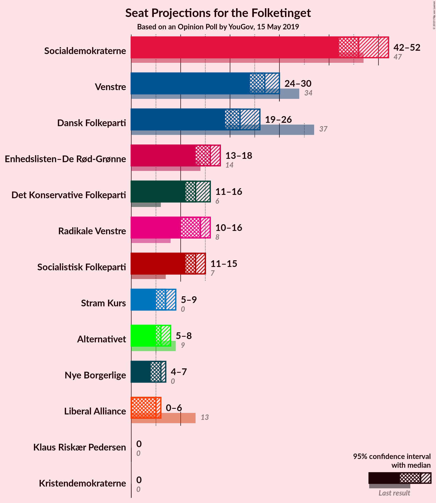
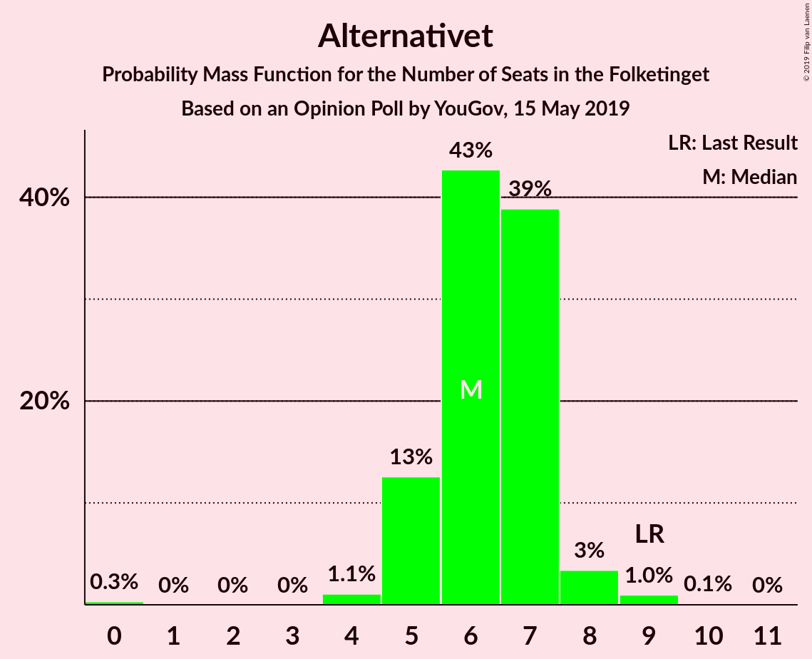
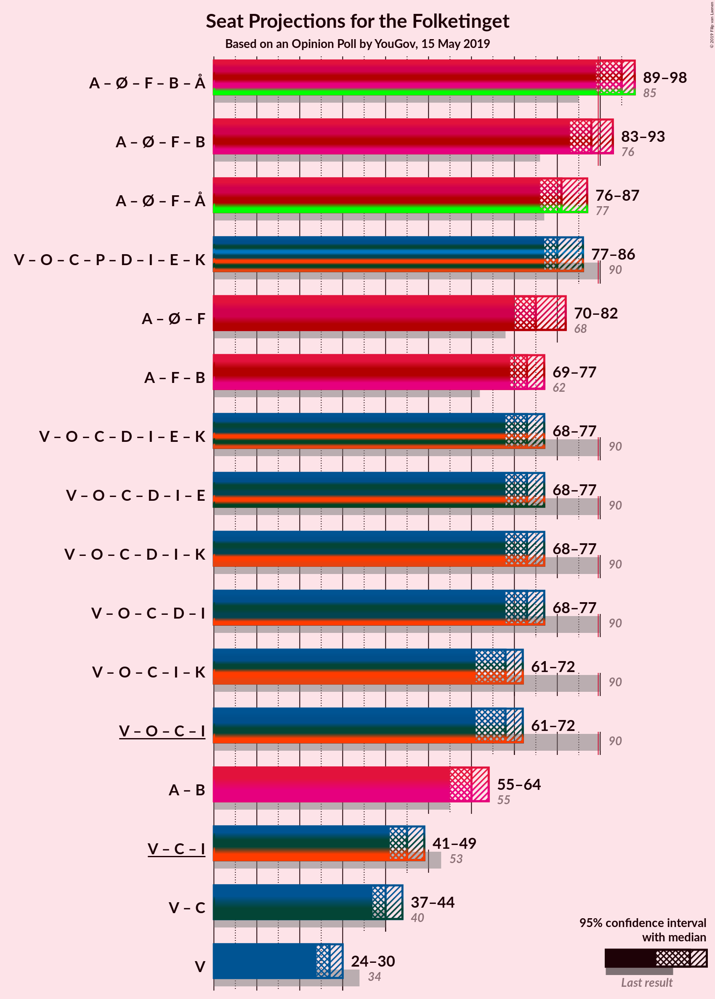
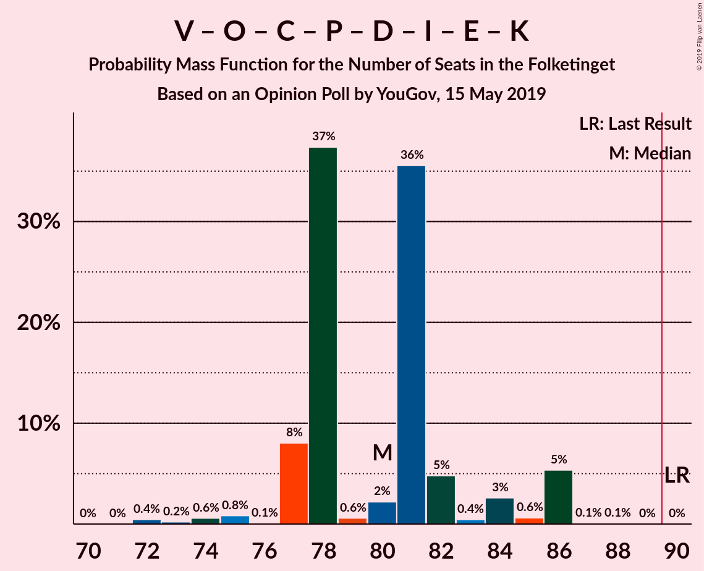
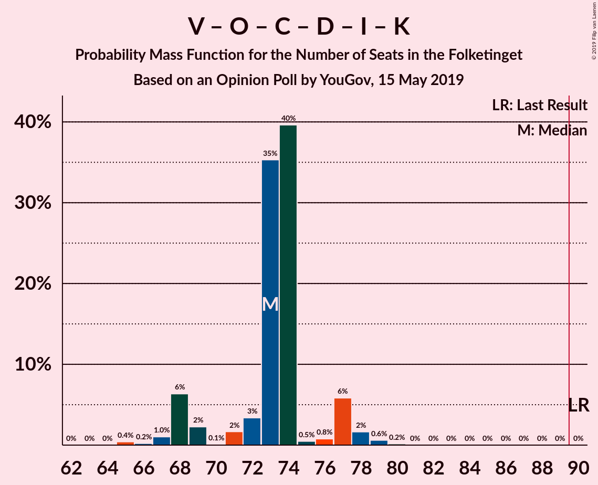
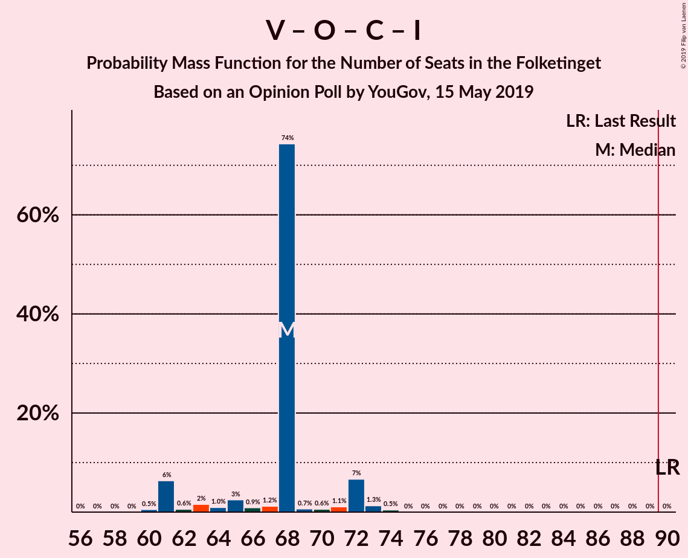
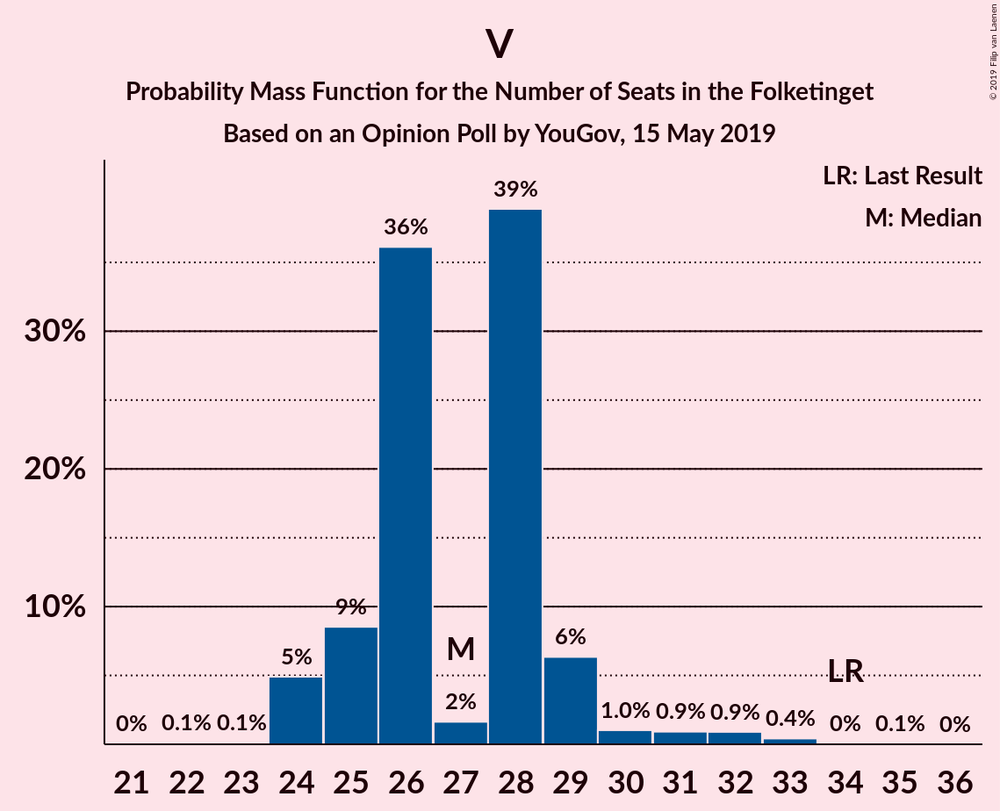

# Opinion Poll by YouGov, 15 May 2019

<a href="#voting-intentions">Voting Intentions</a> | <a href="#seats">Seats</a> | <a href="#coalitions">Coalitions</a> | <a href="#technical-information">Technical Information</a>

## Voting Intentions

### Confidence Intervals

| Party | Last Result | Poll Result | 80% Confidence Interval | 90% Confidence Interval | 95% Confidence Interval | 99% Confidence Interval |
|:-----:|:-----------:|:-----------:|:-----------------------:|:-----------------------:|:-----------------------:|:-----------------------:|
| Socialdemokraterne | 26.3% | 26.6% | 24.8–28.5% |24.3–29.1% |23.9–29.6% |23.0–30.5% |
| Venstre | 19.5% | 15.5% | 14.1–17.2% |13.7–17.6% |13.4–18.0% |12.7–18.8% |
| Dansk Folkeparti | 21.1% | 12.6% | 11.3–14.1% |10.9–14.5% |10.6–14.8% |10.0–15.6% |
| Enhedslisten–De Rød-Grønne | 7.8% | 8.7% | 7.7–10.0% |7.3–10.4% |7.1–10.7% |6.6–11.4% |
| Socialistisk Folkeparti | 4.2% | 7.3% | 6.4–8.6% |6.1–8.9% |5.8–9.2% |5.4–9.8% |
| Radikale Venstre | 4.6% | 7.2% | 6.3–8.4% |6.0–8.8% |5.7–9.1% |5.3–9.7% |
| Det Konservative Folkeparti | 3.4% | 7.2% | 6.3–8.4% |6.0–8.8% |5.7–9.1% |5.3–9.7% |
| Stram Kurs | 0.0% | 3.9% | 3.2–4.9% |3.0–5.2% |2.9–5.4% |2.6–5.9% |
| Alternativet | 4.8% | 3.4% | 2.8–4.3% |2.6–4.6% |2.4–4.8% |2.1–5.2% |
| Nye Borgerlige | 0.0% | 2.9% | 2.3–3.7% |2.1–3.9% |2.0–4.2% |1.7–4.6% |
| Liberal Alliance | 7.5% | 2.4% | 1.9–3.2% |1.8–3.5% |1.6–3.7% |1.4–4.1% |
| Klaus Riskær Pedersen | 0.0% | 0.9% | 0.6–1.4% |0.5–1.5% |0.4–1.7% |0.3–2.0% |
| Kristendemokraterne | 0.8% | 0.7% | 0.5–1.2% |0.4–1.4% |0.4–1.5% |0.3–1.8% |

*Note:* The poll result column reflects the actual value used in the calculations. Published results may vary slightly, and in addition be rounded to fewer digits.

## Seats

### Confidence Intervals

| Party | Last Result | Median | 80% Confidence Interval | 90% Confidence Interval | 95% Confidence Interval | 99% Confidence Interval |
|:-----:|:-----------:|:------:|:-----------------------:|:-----------------------:|:-----------------------:|:-----------------------:|
| <a href="#socialdemokraterne">Socialdemokraterne</a> | 47 | 45 | 42–49 |42–52 |42–54 |41–55 |
| <a href="#venstre">Venstre</a> | 34 | 29 | 25–30 |25–30 |25–32 |23–34 |
| <a href="#dansk-folkeparti">Dansk Folkeparti</a> | 37 | 23 | 20–24 |19–25 |19–29 |16–29 |
| <a href="#enhedslisten–de-rød-grønne">Enhedslisten–De Rød-Grønne</a> | 14 | 16 | 13–19 |13–19 |13–19 |13–19 |
| <a href="#socialistisk-folkeparti">Socialistisk Folkeparti</a> | 7 | 12 | 12–15 |12–15 |12–16 |11–17 |
| <a href="#radikale-venstre">Radikale Venstre</a> | 8 | 13 | 10–17 |10–17 |9–17 |9–19 |
| <a href="#det-konservative-folkeparti">Det Konservative Folkeparti</a> | 6 | 13 | 12–15 |11–15 |10–15 |8–19 |
| <a href="#stram-kurs">Stram Kurs</a> | 0 | 6 | 5–10 |5–10 |5–10 |5–10 |
| <a href="#alternativet">Alternativet</a> | 9 | 7 | 4–8 |4–8 |4–9 |4–9 |
| <a href="#nye-borgerlige">Nye Borgerlige</a> | 0 | 5 | 4–7 |4–7 |4–7 |0–7 |
| <a href="#liberal-alliance">Liberal Alliance</a> | 13 | 5 | 0–6 |0–6 |0–6 |0–6 |
| <a href="#klaus-riskær-pedersen">Klaus Riskær Pedersen</a> | 0 | 0 | 0 |0 |0 |0 |
| <a href="#kristendemokraterne">Kristendemokraterne</a> | 0 | 0 | 0 |0 |0 |0 |

### Socialdemokraterne

*For a full overview of the results for this party, see the [Socialdemokraterne](party-socialdemokraterne.html) page.*

| Number of Seats | Probability | Accumulated | Special Marks |
|:---------------:|:-----------:|:-----------:|:-------------:|
| 38 | 0.3% | 100% |  |
| 39 | 0% | 99.7% |  |
| 40 | 0% | 99.6% |  |
| 41 | 0.2% | 99.6% |  |
| 42 | 22% | 99.4% |  |
| 43 | 1.0% | 78% |  |
| 44 | 10% | 77% |  |
| 45 | 25% | 66% | Median |
| 46 | 2% | 42% |  |
| 47 | 5% | 40% | Last Result |
| 48 | 3% | 35% |  |
| 49 | 23% | 32% |  |
| 50 | 0.5% | 8% |  |
| 51 | 2% | 8% |  |
| 52 | 2% | 6% |  |
| 53 | 0.2% | 4% |  |
| 54 | 3% | 3% |  |
| 55 | 0.4% | 0.5% |  |
| 56 | 0.1% | 0.1% |  |
| 57 | 0% | 0% |  |

### Venstre

*For a full overview of the results for this party, see the [Venstre](party-venstre.html) page.*

| Number of Seats | Probability | Accumulated | Special Marks |
|:---------------:|:-----------:|:-----------:|:-------------:|
| 21 | 0.1% | 100% |  |
| 22 | 0.1% | 99.9% |  |
| 23 | 0.4% | 99.8% |  |
| 24 | 0.7% | 99.4% |  |
| 25 | 36% | 98.7% |  |
| 26 | 4% | 63% |  |
| 27 | 4% | 59% |  |
| 28 | 6% | 56% |  |
| 29 | 24% | 50% | Median |
| 30 | 23% | 27% |  |
| 31 | 0.5% | 4% |  |
| 32 | 2% | 3% |  |
| 33 | 0.1% | 1.1% |  |
| 34 | 0.7% | 1.1% | Last Result |
| 35 | 0.4% | 0.4% |  |
| 36 | 0% | 0% |  |

### Dansk Folkeparti

*For a full overview of the results for this party, see the [Dansk Folkeparti](party-danskfolkeparti.html) page.*

| Number of Seats | Probability | Accumulated | Special Marks |
|:---------------:|:-----------:|:-----------:|:-------------:|
| 15 | 0.1% | 100% |  |
| 16 | 0.4% | 99.9% |  |
| 17 | 0.7% | 99.5% |  |
| 18 | 0.1% | 98.8% |  |
| 19 | 8% | 98.7% |  |
| 20 | 22% | 91% |  |
| 21 | 0.3% | 69% |  |
| 22 | 13% | 68% |  |
| 23 | 22% | 55% | Median |
| 24 | 27% | 33% |  |
| 25 | 2% | 6% |  |
| 26 | 1.3% | 5% |  |
| 27 | 0.3% | 4% |  |
| 28 | 0% | 3% |  |
| 29 | 3% | 3% |  |
| 30 | 0% | 0% |  |
| 31 | 0% | 0% |  |
| 32 | 0% | 0% |  |
| 33 | 0% | 0% |  |
| 34 | 0% | 0% |  |
| 35 | 0% | 0% |  |
| 36 | 0% | 0% |  |
| 37 | 0% | 0% | Last Result |

### Enhedslisten–De Rød-Grønne

*For a full overview of the results for this party, see the [Enhedslisten–De Rød-Grønne](party-enhedslisten–derød-grønne.html) page.*

| Number of Seats | Probability | Accumulated | Special Marks |
|:---------------:|:-----------:|:-----------:|:-------------:|
| 11 | 0% | 100% |  |
| 12 | 0.1% | 99.9% |  |
| 13 | 11% | 99.8% |  |
| 14 | 4% | 88% | Last Result |
| 15 | 23% | 85% |  |
| 16 | 27% | 62% | Median |
| 17 | 0.8% | 35% |  |
| 18 | 12% | 34% |  |
| 19 | 21% | 22% |  |
| 20 | 0% | 0.1% |  |
| 21 | 0.1% | 0.1% |  |
| 22 | 0% | 0% |  |

### Socialistisk Folkeparti

*For a full overview of the results for this party, see the [Socialistisk Folkeparti](party-socialistiskfolkeparti.html) page.*

| Number of Seats | Probability | Accumulated | Special Marks |
|:---------------:|:-----------:|:-----------:|:-------------:|
| 7 | 0% | 100% | Last Result |
| 8 | 0% | 100% |  |
| 9 | 0.3% | 100% |  |
| 10 | 0% | 99.7% |  |
| 11 | 0.4% | 99.7% |  |
| 12 | 58% | 99.3% | Median |
| 13 | 3% | 41% |  |
| 14 | 6% | 38% |  |
| 15 | 28% | 32% |  |
| 16 | 4% | 5% |  |
| 17 | 0.4% | 0.6% |  |
| 18 | 0.1% | 0.1% |  |
| 19 | 0% | 0% |  |

### Radikale Venstre

*For a full overview of the results for this party, see the [Radikale Venstre](party-radikalevenstre.html) page.*

| Number of Seats | Probability | Accumulated | Special Marks |
|:---------------:|:-----------:|:-----------:|:-------------:|
| 8 | 0% | 100% | Last Result |
| 9 | 4% | 100% |  |
| 10 | 23% | 96% |  |
| 11 | 0.8% | 73% |  |
| 12 | 19% | 72% |  |
| 13 | 4% | 53% | Median |
| 14 | 21% | 49% |  |
| 15 | 0.8% | 28% |  |
| 16 | 0.2% | 27% |  |
| 17 | 24% | 27% |  |
| 18 | 0.6% | 2% |  |
| 19 | 2% | 2% |  |
| 20 | 0% | 0.1% |  |
| 21 | 0% | 0% |  |

### Det Konservative Folkeparti

*For a full overview of the results for this party, see the [Det Konservative Folkeparti](party-detkonservativefolkeparti.html) page.*

| Number of Seats | Probability | Accumulated | Special Marks |
|:---------------:|:-----------:|:-----------:|:-------------:|
| 6 | 0% | 100% | Last Result |
| 7 | 0% | 100% |  |
| 8 | 2% | 100% |  |
| 9 | 0.1% | 98% |  |
| 10 | 2% | 98% |  |
| 11 | 3% | 96% |  |
| 12 | 26% | 92% |  |
| 13 | 19% | 66% | Median |
| 14 | 23% | 47% |  |
| 15 | 22% | 24% |  |
| 16 | 0.9% | 2% |  |
| 17 | 0.2% | 1.1% |  |
| 18 | 0% | 0.9% |  |
| 19 | 0.9% | 0.9% |  |
| 20 | 0% | 0% |  |

### Stram Kurs

*For a full overview of the results for this party, see the [Stram Kurs](party-stramkurs.html) page.*

| Number of Seats | Probability | Accumulated | Special Marks |
|:---------------:|:-----------:|:-----------:|:-------------:|
| 0 | 0% | 100% | Last Result |
| 1 | 0% | 100% |  |
| 2 | 0% | 100% |  |
| 3 | 0% | 100% |  |
| 4 | 0.1% | 100% |  |
| 5 | 24% | 99.8% |  |
| 6 | 27% | 76% | Median |
| 7 | 2% | 49% |  |
| 8 | 14% | 47% |  |
| 9 | 0.7% | 32% |  |
| 10 | 31% | 32% |  |
| 11 | 0% | 0.1% |  |
| 12 | 0% | 0% |  |

### Alternativet

*For a full overview of the results for this party, see the [Alternativet](party-alternativet.html) page.*

| Number of Seats | Probability | Accumulated | Special Marks |
|:---------------:|:-----------:|:-----------:|:-------------:|
| 4 | 24% | 100% |  |
| 5 | 8% | 76% |  |
| 6 | 2% | 68% |  |
| 7 | 40% | 66% | Median |
| 8 | 23% | 26% |  |
| 9 | 3% | 3% | Last Result |
| 10 | 0.1% | 0.1% |  |
| 11 | 0% | 0% |  |

### Nye Borgerlige

*For a full overview of the results for this party, see the [Nye Borgerlige](party-nyeborgerlige.html) page.*

| Number of Seats | Probability | Accumulated | Special Marks |
|:---------------:|:-----------:|:-----------:|:-------------:|
| 0 | 0.9% | 100% | Last Result |
| 1 | 0% | 99.1% |  |
| 2 | 0% | 99.1% |  |
| 3 | 0% | 99.1% |  |
| 4 | 24% | 99.1% |  |
| 5 | 32% | 75% | Median |
| 6 | 31% | 42% |  |
| 7 | 11% | 11% |  |
| 8 | 0.3% | 0.4% |  |
| 9 | 0% | 0% |  |

### Liberal Alliance

*For a full overview of the results for this party, see the [Liberal Alliance](party-liberalalliance.html) page.*

| Number of Seats | Probability | Accumulated | Special Marks |
|:---------------:|:-----------:|:-----------:|:-------------:|
| 0 | 27% | 100% |  |
| 1 | 0% | 73% |  |
| 2 | 0% | 73% |  |
| 3 | 0% | 73% |  |
| 4 | 4% | 73% |  |
| 5 | 22% | 70% | Median |
| 6 | 47% | 47% |  |
| 7 | 0.1% | 0.2% |  |
| 8 | 0.1% | 0.1% |  |
| 9 | 0% | 0% |  |
| 10 | 0% | 0% |  |
| 11 | 0% | 0% |  |
| 12 | 0% | 0% |  |
| 13 | 0% | 0% | Last Result |

### Klaus Riskær Pedersen

*For a full overview of the results for this party, see the [Klaus Riskær Pedersen](party-klausriskærpedersen.html) page.*

| Number of Seats | Probability | Accumulated | Special Marks |
|:---------------:|:-----------:|:-----------:|:-------------:|
| 0 | 99.8% | 100% | Last Result, Median |
| 1 | 0% | 0.2% |  |
| 2 | 0% | 0.2% |  |
| 3 | 0% | 0.2% |  |
| 4 | 0.2% | 0.2% |  |
| 5 | 0% | 0% |  |

### Kristendemokraterne

*For a full overview of the results for this party, see the [Kristendemokraterne](party-kristendemokraterne.html) page.*

| Number of Seats | Probability | Accumulated | Special Marks |
|:---------------:|:-----------:|:-----------:|:-------------:|
| 0 | 99.9% | 100% | Last Result, Median |
| 1 | 0% | 0.1% |  |
| 2 | 0% | 0.1% |  |
| 3 | 0% | 0.1% |  |
| 4 | 0.1% | 0.1% |  |
| 5 | 0% | 0% |  |

## Coalitions

### Confidence Intervals

| Coalition | Last Result | Median | Majority? | 80% Confidence Interval | 90% Confidence Interval | 95% Confidence Interval | 99% Confidence Interval |
|:---------:|:-----------:|:------:|:---------:|:-----------------------:|:-----------------------:|:-----------------------:|:-----------------------:|
| Socialdemokraterne – Enhedslisten–De Rød-Grønne – Socialistisk Folkeparti – Radikale Venstre – Alternativet | 85 | 98 | 78% | 89–98 | 89–101 | 89–102 | 89–103 |
| Socialdemokraterne – Enhedslisten–De Rød-Grønne – Socialistisk Folkeparti – Radikale Venstre | 76 | 90 | 53% | 82–94 | 82–94 | 82–96 | 82–98 |
| Socialdemokraterne – Enhedslisten–De Rød-Grønne – Socialistisk Folkeparti – Alternativet | 77 | 81 | 0.7% | 79–84 | 79–87 | 79–89 | 73–90 |
| Venstre – Dansk Folkeparti – Det Konservative Folkeparti – Stram Kurs – Nye Borgerlige – Liberal Alliance – Klaus Riskær Pedersen – Kristendemokraterne | 90 | 77 | 0% | 77–86 | 74–86 | 73–86 | 72–86 |
| Socialdemokraterne – Enhedslisten–De Rød-Grønne – Socialistisk Folkeparti | 68 | 76 | 0% | 72–77 | 72–82 | 72–82 | 69–83 |
| Socialdemokraterne – Socialistisk Folkeparti – Radikale Venstre | 62 | 71 | 0% | 67–78 | 67–78 | 67–81 | 66–84 |
| Venstre – Dansk Folkeparti – Det Konservative Folkeparti – Nye Borgerlige – Liberal Alliance – Klaus Riskær Pedersen – Kristendemokraterne | 90 | 72 | 0% | 71–76 | 67–77 | 66–77 | 64–78 |
| Venstre – Dansk Folkeparti – Det Konservative Folkeparti – Nye Borgerlige – Liberal Alliance – Klaus Riskær Pedersen | 90 | 72 | 0% | 71–76 | 67–77 | 66–77 | 64–78 |
| Venstre – Dansk Folkeparti – Det Konservative Folkeparti – Nye Borgerlige – Liberal Alliance – Kristendemokraterne | 90 | 72 | 0% | 71–76 | 67–77 | 66–77 | 64–78 |
| Venstre – Dansk Folkeparti – Det Konservative Folkeparti – Nye Borgerlige – Liberal Alliance | 90 | 72 | 0% | 71–76 | 67–77 | 66–77 | 64–78 |
| Venstre – Dansk Folkeparti – Det Konservative Folkeparti – Liberal Alliance – Kristendemokraterne | 90 | 67 | 0% | 65–70 | 62–71 | 60–72 | 60–75 |
| Venstre – Dansk Folkeparti – Det Konservative Folkeparti – Liberal Alliance | 90 | 67 | 0% | 65–70 | 62–71 | 60–72 | 60–75 |
| Socialdemokraterne – Radikale Venstre | 55 | 56 | 0% | 55–66 | 55–66 | 55–66 | 51–70 |
| Venstre – Det Konservative Folkeparti – Liberal Alliance | 53 | 44 | 0% | 43–50 | 41–50 | 38–50 | 38–53 |
| Venstre – Det Konservative Folkeparti | 40 | 42 | 0% | 37–44 | 36–44 | 36–45 | 36–49 |
| Venstre | 34 | 29 | 0% | 25–30 | 25–30 | 25–32 | 23–34 |

### Socialdemokraterne – Enhedslisten–De Rød-Grønne – Socialistisk Folkeparti – Radikale Venstre – Alternativet

| Number of Seats | Probability | Accumulated | Special Marks |
|:---------------:|:-----------:|:-----------:|:-------------:|
| 85 | 0% | 100% | Last Result |
| 86 | 0.2% | 100% |  |
| 87 | 0% | 99.8% |  |
| 88 | 0.1% | 99.8% |  |
| 89 | 22% | 99.7% |  |
| 90 | 1.3% | 78% | Majority |
| 91 | 0.7% | 77% |  |
| 92 | 3% | 76% |  |
| 93 | 13% | 73% | Median |
| 94 | 0.1% | 59% |  |
| 95 | 4% | 59% |  |
| 96 | 3% | 56% |  |
| 97 | 0.1% | 53% |  |
| 98 | 45% | 52% |  |
| 99 | 0.3% | 7% |  |
| 100 | 2% | 7% |  |
| 101 | 2% | 5% |  |
| 102 | 2% | 3% |  |
| 103 | 0.3% | 0.8% |  |
| 104 | 0.1% | 0.5% |  |
| 105 | 0.1% | 0.3% |  |
| 106 | 0.3% | 0.3% |  |
| 107 | 0% | 0% |  |

### Socialdemokraterne – Enhedslisten–De Rød-Grønne – Socialistisk Folkeparti – Radikale Venstre

| Number of Seats | Probability | Accumulated | Special Marks |
|:---------------:|:-----------:|:-----------:|:-------------:|
| 76 | 0% | 100% | Last Result |
| 77 | 0% | 100% |  |
| 78 | 0% | 100% |  |
| 79 | 0% | 100% |  |
| 80 | 0% | 100% |  |
| 81 | 0.1% | 100% |  |
| 82 | 22% | 99.9% |  |
| 83 | 0.2% | 78% |  |
| 84 | 0.8% | 78% |  |
| 85 | 3% | 77% |  |
| 86 | 12% | 75% | Median |
| 87 | 3% | 63% |  |
| 88 | 4% | 59% |  |
| 89 | 2% | 56% |  |
| 90 | 21% | 53% | Majority |
| 91 | 3% | 33% |  |
| 92 | 0.3% | 30% |  |
| 93 | 2% | 29% |  |
| 94 | 25% | 28% |  |
| 95 | 0.1% | 3% |  |
| 96 | 0.4% | 3% |  |
| 97 | 2% | 2% |  |
| 98 | 0.3% | 0.6% |  |
| 99 | 0% | 0.3% |  |
| 100 | 0.3% | 0.3% |  |
| 101 | 0% | 0% |  |

### Socialdemokraterne – Enhedslisten–De Rød-Grønne – Socialistisk Folkeparti – Alternativet

| Number of Seats | Probability | Accumulated | Special Marks |
|:---------------:|:-----------:|:-----------:|:-------------:|
| 73 | 0.5% | 100% |  |
| 74 | 0% | 99.5% |  |
| 75 | 0.8% | 99.4% |  |
| 76 | 0.1% | 98.6% |  |
| 77 | 0.1% | 98.6% | Last Result |
| 78 | 0.1% | 98.5% |  |
| 79 | 22% | 98% |  |
| 80 | 4% | 77% | Median |
| 81 | 35% | 73% |  |
| 82 | 4% | 38% |  |
| 83 | 4% | 34% |  |
| 84 | 21% | 29% |  |
| 85 | 0.2% | 9% |  |
| 86 | 2% | 9% |  |
| 87 | 3% | 6% |  |
| 88 | 0% | 4% |  |
| 89 | 3% | 4% |  |
| 90 | 0.2% | 0.7% | Majority |
| 91 | 0.1% | 0.4% |  |
| 92 | 0.1% | 0.4% |  |
| 93 | 0.2% | 0.2% |  |
| 94 | 0% | 0% |  |

### Venstre – Dansk Folkeparti – Det Konservative Folkeparti – Stram Kurs – Nye Borgerlige – Liberal Alliance – Klaus Riskær Pedersen – Kristendemokraterne

| Number of Seats | Probability | Accumulated | Special Marks |
|:---------------:|:-----------:|:-----------:|:-------------:|
| 69 | 0.3% | 100% |  |
| 70 | 0.1% | 99.7% |  |
| 71 | 0.1% | 99.7% |  |
| 72 | 0.3% | 99.5% |  |
| 73 | 2% | 99.2% |  |
| 74 | 2% | 97% |  |
| 75 | 2% | 95% |  |
| 76 | 0.3% | 93% |  |
| 77 | 45% | 93% |  |
| 78 | 0.1% | 48% |  |
| 79 | 3% | 47% |  |
| 80 | 4% | 44% |  |
| 81 | 0.1% | 41% | Median |
| 82 | 13% | 41% |  |
| 83 | 3% | 27% |  |
| 84 | 0.7% | 24% |  |
| 85 | 1.3% | 23% |  |
| 86 | 22% | 22% |  |
| 87 | 0.1% | 0.3% |  |
| 88 | 0% | 0.2% |  |
| 89 | 0.2% | 0.2% |  |
| 90 | 0% | 0% | Last Result, Majority |

### Socialdemokraterne – Enhedslisten–De Rød-Grønne – Socialistisk Folkeparti

| Number of Seats | Probability | Accumulated | Special Marks |
|:---------------:|:-----------:|:-----------:|:-------------:|
| 67 | 0.4% | 100% |  |
| 68 | 0% | 99.6% | Last Result |
| 69 | 0.4% | 99.5% |  |
| 70 | 0.6% | 99.1% |  |
| 71 | 0.1% | 98% |  |
| 72 | 22% | 98% |  |
| 73 | 2% | 76% | Median |
| 74 | 10% | 74% |  |
| 75 | 6% | 64% |  |
| 76 | 25% | 58% |  |
| 77 | 25% | 33% |  |
| 78 | 2% | 9% |  |
| 79 | 0.2% | 7% |  |
| 80 | 0% | 6% |  |
| 81 | 0.3% | 6% |  |
| 82 | 5% | 6% |  |
| 83 | 0.2% | 0.7% |  |
| 84 | 0.1% | 0.5% |  |
| 85 | 0% | 0.4% |  |
| 86 | 0.1% | 0.3% |  |
| 87 | 0.2% | 0.2% |  |
| 88 | 0% | 0% |  |

### Socialdemokraterne – Socialistisk Folkeparti – Radikale Venstre

| Number of Seats | Probability | Accumulated | Special Marks |
|:---------------:|:-----------:|:-----------:|:-------------:|
| 62 | 0% | 100% | Last Result |
| 63 | 0% | 100% |  |
| 64 | 0% | 100% |  |
| 65 | 0% | 100% |  |
| 66 | 0.7% | 99.9% |  |
| 67 | 22% | 99.2% |  |
| 68 | 10% | 77% |  |
| 69 | 0.2% | 67% |  |
| 70 | 0.4% | 67% | Median |
| 71 | 24% | 67% |  |
| 72 | 4% | 43% |  |
| 73 | 0.5% | 39% |  |
| 74 | 3% | 38% |  |
| 75 | 0.2% | 35% |  |
| 76 | 5% | 34% |  |
| 77 | 0.1% | 30% |  |
| 78 | 26% | 30% |  |
| 79 | 0% | 4% |  |
| 80 | 1.4% | 4% |  |
| 81 | 0.3% | 3% |  |
| 82 | 0.2% | 2% |  |
| 83 | 0.4% | 2% |  |
| 84 | 2% | 2% |  |
| 85 | 0% | 0% |  |

### Venstre – Dansk Folkeparti – Det Konservative Folkeparti – Nye Borgerlige – Liberal Alliance – Klaus Riskær Pedersen – Kristendemokraterne

| Number of Seats | Probability | Accumulated | Special Marks |
|:---------------:|:-----------:|:-----------:|:-------------:|
| 61 | 0.2% | 100% |  |
| 62 | 0% | 99.7% |  |
| 63 | 0% | 99.7% |  |
| 64 | 0.5% | 99.7% |  |
| 65 | 0% | 99.3% |  |
| 66 | 2% | 99.2% |  |
| 67 | 3% | 97% |  |
| 68 | 0.3% | 93% |  |
| 69 | 0.4% | 93% |  |
| 70 | 0.1% | 93% |  |
| 71 | 28% | 93% |  |
| 72 | 34% | 65% |  |
| 73 | 0.3% | 31% |  |
| 74 | 0.1% | 31% |  |
| 75 | 4% | 31% | Median |
| 76 | 22% | 27% |  |
| 77 | 3% | 5% |  |
| 78 | 2% | 2% |  |
| 79 | 0.2% | 0.4% |  |
| 80 | 0% | 0.2% |  |
| 81 | 0.2% | 0.2% |  |
| 82 | 0% | 0% |  |
| 83 | 0% | 0% |  |
| 84 | 0% | 0% |  |
| 85 | 0% | 0% |  |
| 86 | 0% | 0% |  |
| 87 | 0% | 0% |  |
| 88 | 0% | 0% |  |
| 89 | 0% | 0% |  |
| 90 | 0% | 0% | Last Result, Majority |

### Venstre – Dansk Folkeparti – Det Konservative Folkeparti – Nye Borgerlige – Liberal Alliance – Klaus Riskær Pedersen

| Number of Seats | Probability | Accumulated | Special Marks |
|:---------------:|:-----------:|:-----------:|:-------------:|
| 61 | 0.2% | 100% |  |
| 62 | 0% | 99.7% |  |
| 63 | 0% | 99.7% |  |
| 64 | 0.5% | 99.7% |  |
| 65 | 0.1% | 99.3% |  |
| 66 | 2% | 99.2% |  |
| 67 | 3% | 97% |  |
| 68 | 0.3% | 93% |  |
| 69 | 0.4% | 93% |  |
| 70 | 0.1% | 93% |  |
| 71 | 28% | 93% |  |
| 72 | 34% | 65% |  |
| 73 | 0.3% | 31% |  |
| 74 | 0.1% | 31% |  |
| 75 | 4% | 31% | Median |
| 76 | 22% | 27% |  |
| 77 | 3% | 5% |  |
| 78 | 2% | 2% |  |
| 79 | 0.1% | 0.3% |  |
| 80 | 0% | 0.2% |  |
| 81 | 0.2% | 0.2% |  |
| 82 | 0% | 0% |  |
| 83 | 0% | 0% |  |
| 84 | 0% | 0% |  |
| 85 | 0% | 0% |  |
| 86 | 0% | 0% |  |
| 87 | 0% | 0% |  |
| 88 | 0% | 0% |  |
| 89 | 0% | 0% |  |
| 90 | 0% | 0% | Last Result, Majority |

### Venstre – Dansk Folkeparti – Det Konservative Folkeparti – Nye Borgerlige – Liberal Alliance – Kristendemokraterne

| Number of Seats | Probability | Accumulated | Special Marks |
|:---------------:|:-----------:|:-----------:|:-------------:|
| 61 | 0.2% | 100% |  |
| 62 | 0% | 99.7% |  |
| 63 | 0% | 99.7% |  |
| 64 | 0.5% | 99.7% |  |
| 65 | 0% | 99.3% |  |
| 66 | 2% | 99.2% |  |
| 67 | 3% | 97% |  |
| 68 | 0.3% | 93% |  |
| 69 | 0.5% | 93% |  |
| 70 | 0.1% | 93% |  |
| 71 | 28% | 93% |  |
| 72 | 34% | 65% |  |
| 73 | 0.2% | 31% |  |
| 74 | 0.1% | 31% |  |
| 75 | 4% | 31% | Median |
| 76 | 22% | 27% |  |
| 77 | 3% | 5% |  |
| 78 | 2% | 2% |  |
| 79 | 0.2% | 0.4% |  |
| 80 | 0% | 0.2% |  |
| 81 | 0.2% | 0.2% |  |
| 82 | 0% | 0% |  |
| 83 | 0% | 0% |  |
| 84 | 0% | 0% |  |
| 85 | 0% | 0% |  |
| 86 | 0% | 0% |  |
| 87 | 0% | 0% |  |
| 88 | 0% | 0% |  |
| 89 | 0% | 0% |  |
| 90 | 0% | 0% | Last Result, Majority |

### Venstre – Dansk Folkeparti – Det Konservative Folkeparti – Nye Borgerlige – Liberal Alliance

| Number of Seats | Probability | Accumulated | Special Marks |
|:---------------:|:-----------:|:-----------:|:-------------:|
| 61 | 0.2% | 100% |  |
| 62 | 0% | 99.7% |  |
| 63 | 0% | 99.7% |  |
| 64 | 0.5% | 99.7% |  |
| 65 | 0.1% | 99.3% |  |
| 66 | 2% | 99.2% |  |
| 67 | 3% | 97% |  |
| 68 | 0.3% | 93% |  |
| 69 | 0.5% | 93% |  |
| 70 | 0.1% | 93% |  |
| 71 | 28% | 93% |  |
| 72 | 34% | 65% |  |
| 73 | 0.2% | 31% |  |
| 74 | 0.1% | 31% |  |
| 75 | 4% | 31% | Median |
| 76 | 22% | 27% |  |
| 77 | 3% | 5% |  |
| 78 | 2% | 2% |  |
| 79 | 0.1% | 0.3% |  |
| 80 | 0% | 0.2% |  |
| 81 | 0.2% | 0.2% |  |
| 82 | 0% | 0% |  |
| 83 | 0% | 0% |  |
| 84 | 0% | 0% |  |
| 85 | 0% | 0% |  |
| 86 | 0% | 0% |  |
| 87 | 0% | 0% |  |
| 88 | 0% | 0% |  |
| 89 | 0% | 0% |  |
| 90 | 0% | 0% | Last Result, Majority |

### Venstre – Dansk Folkeparti – Det Konservative Folkeparti – Liberal Alliance – Kristendemokraterne

| Number of Seats | Probability | Accumulated | Special Marks |
|:---------------:|:-----------:|:-----------:|:-------------:|
| 56 | 0.1% | 100% |  |
| 57 | 0.1% | 99.9% |  |
| 58 | 0% | 99.9% |  |
| 59 | 0% | 99.9% |  |
| 60 | 2% | 99.9% |  |
| 61 | 0.7% | 97% |  |
| 62 | 2% | 97% |  |
| 63 | 2% | 95% |  |
| 64 | 0.7% | 93% |  |
| 65 | 10% | 92% |  |
| 66 | 8% | 82% |  |
| 67 | 43% | 74% |  |
| 68 | 0.1% | 31% |  |
| 69 | 0.3% | 31% |  |
| 70 | 25% | 30% | Median |
| 71 | 2% | 5% |  |
| 72 | 2% | 3% |  |
| 73 | 0% | 0.6% |  |
| 74 | 0.1% | 0.6% |  |
| 75 | 0.2% | 0.5% |  |
| 76 | 0% | 0.3% |  |
| 77 | 0% | 0.3% |  |
| 78 | 0.3% | 0.3% |  |
| 79 | 0% | 0% |  |
| 80 | 0% | 0% |  |
| 81 | 0% | 0% |  |
| 82 | 0% | 0% |  |
| 83 | 0% | 0% |  |
| 84 | 0% | 0% |  |
| 85 | 0% | 0% |  |
| 86 | 0% | 0% |  |
| 87 | 0% | 0% |  |
| 88 | 0% | 0% |  |
| 89 | 0% | 0% |  |
| 90 | 0% | 0% | Last Result, Majority |

### Venstre – Dansk Folkeparti – Det Konservative Folkeparti – Liberal Alliance

| Number of Seats | Probability | Accumulated | Special Marks |
|:---------------:|:-----------:|:-----------:|:-------------:|
| 56 | 0.1% | 100% |  |
| 57 | 0.1% | 99.9% |  |
| 58 | 0% | 99.9% |  |
| 59 | 0% | 99.9% |  |
| 60 | 2% | 99.9% |  |
| 61 | 0.8% | 97% |  |
| 62 | 2% | 97% |  |
| 63 | 2% | 95% |  |
| 64 | 0.7% | 93% |  |
| 65 | 10% | 92% |  |
| 66 | 8% | 82% |  |
| 67 | 43% | 74% |  |
| 68 | 0.1% | 31% |  |
| 69 | 0.3% | 31% |  |
| 70 | 25% | 30% | Median |
| 71 | 2% | 5% |  |
| 72 | 2% | 3% |  |
| 73 | 0% | 0.6% |  |
| 74 | 0% | 0.6% |  |
| 75 | 0.2% | 0.5% |  |
| 76 | 0% | 0.3% |  |
| 77 | 0% | 0.3% |  |
| 78 | 0.3% | 0.3% |  |
| 79 | 0% | 0% |  |
| 80 | 0% | 0% |  |
| 81 | 0% | 0% |  |
| 82 | 0% | 0% |  |
| 83 | 0% | 0% |  |
| 84 | 0% | 0% |  |
| 85 | 0% | 0% |  |
| 86 | 0% | 0% |  |
| 87 | 0% | 0% |  |
| 88 | 0% | 0% |  |
| 89 | 0% | 0% |  |
| 90 | 0% | 0% | Last Result, Majority |

### Socialdemokraterne – Radikale Venstre

| Number of Seats | Probability | Accumulated | Special Marks |
|:---------------:|:-----------:|:-----------:|:-------------:|
| 51 | 0.7% | 100% |  |
| 52 | 0% | 99.3% |  |
| 53 | 0.1% | 99.3% |  |
| 54 | 0.1% | 99.2% |  |
| 55 | 22% | 99.1% | Last Result |
| 56 | 31% | 77% |  |
| 57 | 0.5% | 46% |  |
| 58 | 6% | 46% | Median |
| 59 | 4% | 40% |  |
| 60 | 3% | 36% |  |
| 61 | 0.6% | 33% |  |
| 62 | 0.5% | 32% |  |
| 63 | 3% | 32% |  |
| 64 | 4% | 29% |  |
| 65 | 0.2% | 25% |  |
| 66 | 23% | 25% |  |
| 67 | 0% | 2% |  |
| 68 | 0.3% | 2% |  |
| 69 | 0.2% | 2% |  |
| 70 | 2% | 2% |  |
| 71 | 0.2% | 0.2% |  |
| 72 | 0% | 0% |  |

### Venstre – Det Konservative Folkeparti – Liberal Alliance

| Number of Seats | Probability | Accumulated | Special Marks |
|:---------------:|:-----------:|:-----------:|:-------------:|
| 36 | 0.3% | 100% |  |
| 37 | 0.1% | 99.7% |  |
| 38 | 3% | 99.6% |  |
| 39 | 0.1% | 96% |  |
| 40 | 0.1% | 96% |  |
| 41 | 6% | 96% |  |
| 42 | 0.4% | 91% |  |
| 43 | 33% | 90% |  |
| 44 | 24% | 57% |  |
| 45 | 0.5% | 33% |  |
| 46 | 0.9% | 33% |  |
| 47 | 7% | 32% | Median |
| 48 | 0.4% | 24% |  |
| 49 | 1.0% | 24% |  |
| 50 | 22% | 23% |  |
| 51 | 0.2% | 1.2% |  |
| 52 | 0% | 1.0% |  |
| 53 | 0.6% | 1.0% | Last Result |
| 54 | 0.3% | 0.3% |  |
| 55 | 0% | 0% |  |

### Venstre – Det Konservative Folkeparti

| Number of Seats | Probability | Accumulated | Special Marks |
|:---------------:|:-----------:|:-----------:|:-------------:|
| 33 | 0.1% | 100% |  |
| 34 | 0.1% | 99.9% |  |
| 35 | 0.1% | 99.8% |  |
| 36 | 6% | 99.8% |  |
| 37 | 23% | 94% |  |
| 38 | 14% | 71% |  |
| 39 | 0.3% | 58% |  |
| 40 | 3% | 58% | Last Result |
| 41 | 4% | 54% |  |
| 42 | 5% | 51% | Median |
| 43 | 0.6% | 46% |  |
| 44 | 43% | 45% |  |
| 45 | 0.4% | 3% |  |
| 46 | 0.4% | 2% |  |
| 47 | 0% | 2% |  |
| 48 | 0.6% | 2% |  |
| 49 | 1.2% | 1.3% |  |
| 50 | 0% | 0.1% |  |
| 51 | 0% | 0% |  |

### Venstre

| Number of Seats | Probability | Accumulated | Special Marks |
|:---------------:|:-----------:|:-----------:|:-------------:|
| 21 | 0.1% | 100% |  |
| 22 | 0.1% | 99.9% |  |
| 23 | 0.4% | 99.8% |  |
| 24 | 0.7% | 99.4% |  |
| 25 | 36% | 98.7% |  |
| 26 | 4% | 63% |  |
| 27 | 4% | 59% |  |
| 28 | 6% | 56% |  |
| 29 | 24% | 50% | Median |
| 30 | 23% | 27% |  |
| 31 | 0.5% | 4% |  |
| 32 | 2% | 3% |  |
| 33 | 0.1% | 1.1% |  |
| 34 | 0.7% | 1.1% | Last Result |
| 35 | 0.4% | 0.4% |  |
| 36 | 0% | 0% |  |

## Technical Information

### Opinion Poll

+ **Polling firm:** YouGov
+ **Commissioner(s):** —
+ **Fieldwork period:** 15 May 2019

### Calculations

+ **Sample size:** 939
+ **Simulations done:** 131,072
+ **Error estimate:** 3.63%

