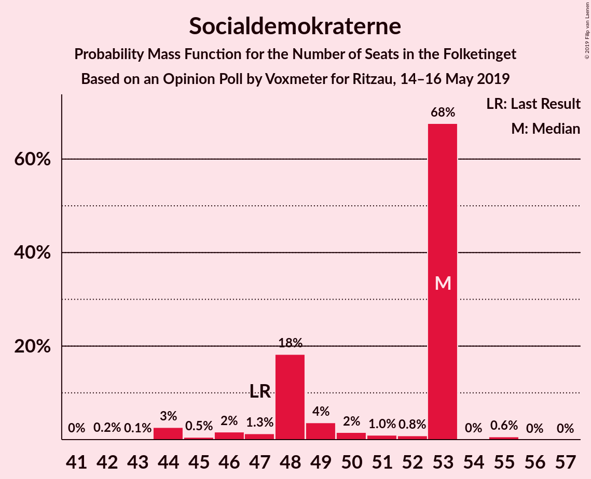
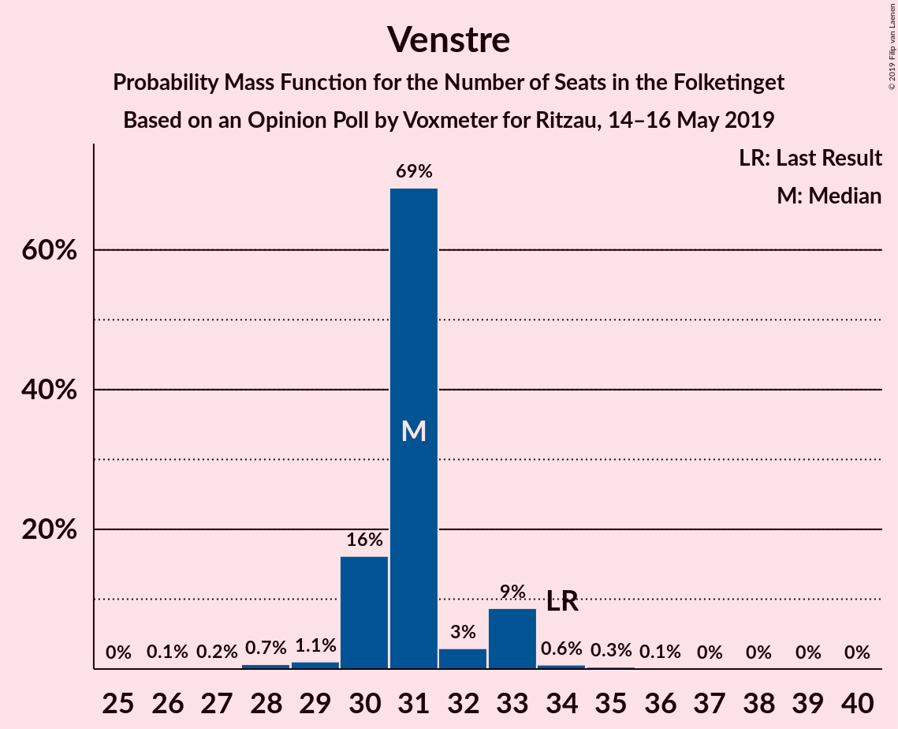
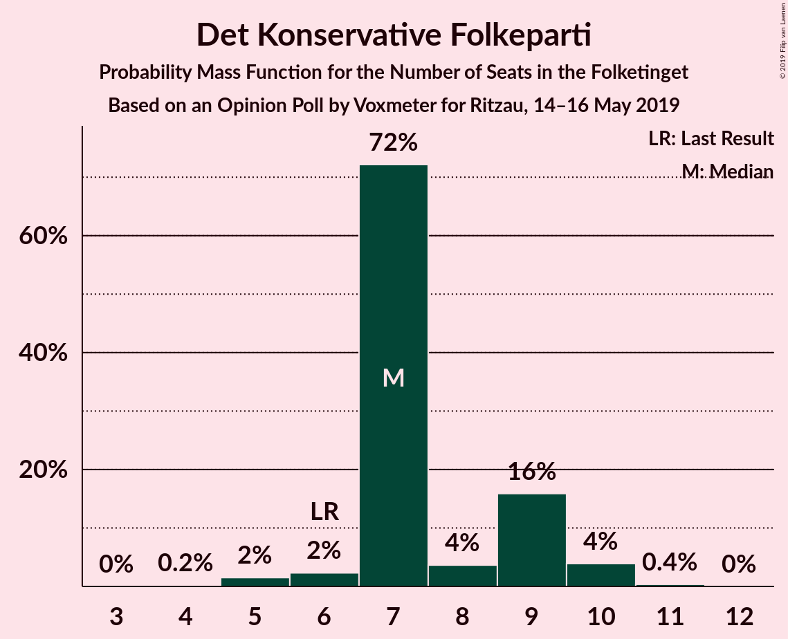
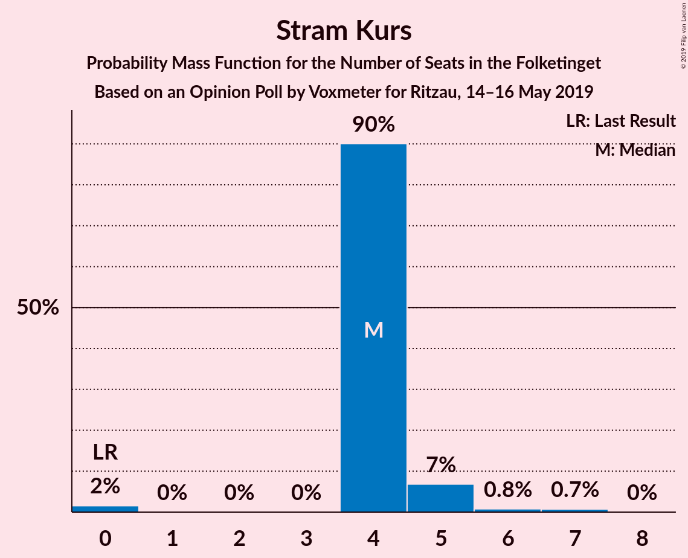
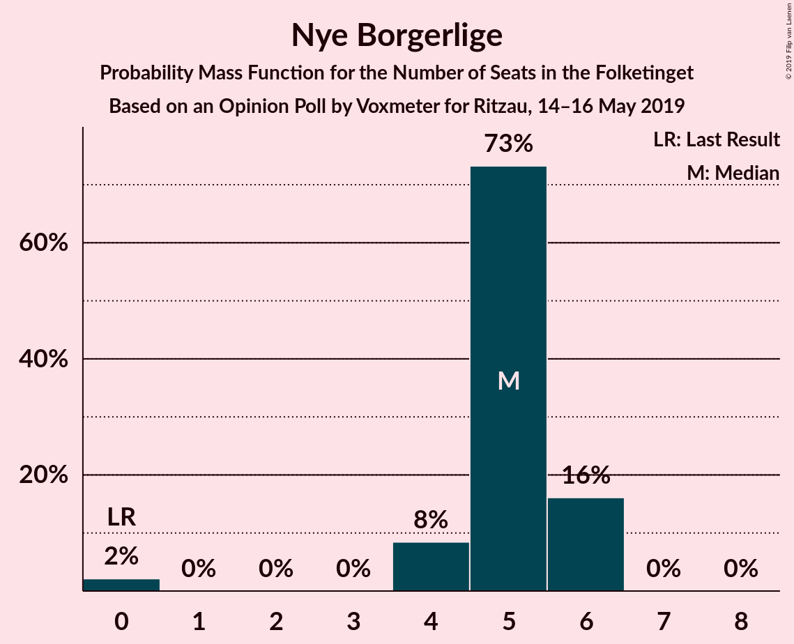
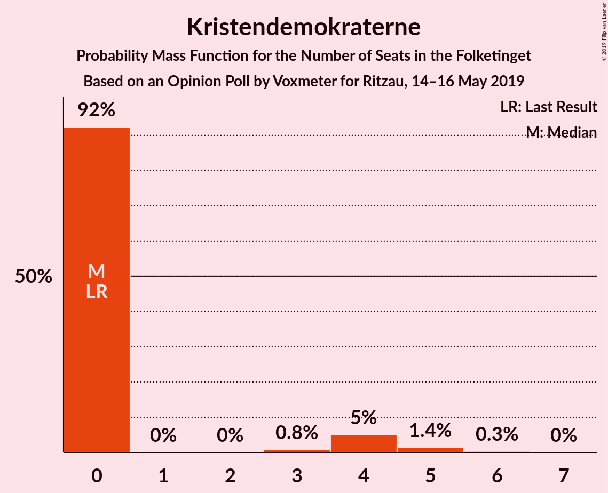
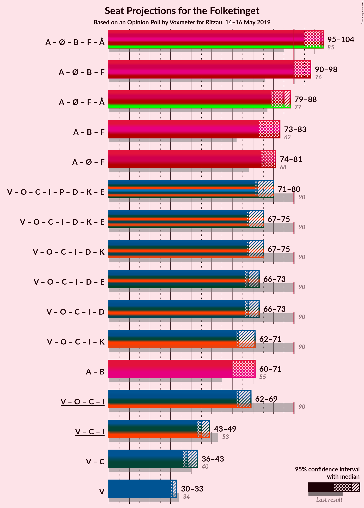
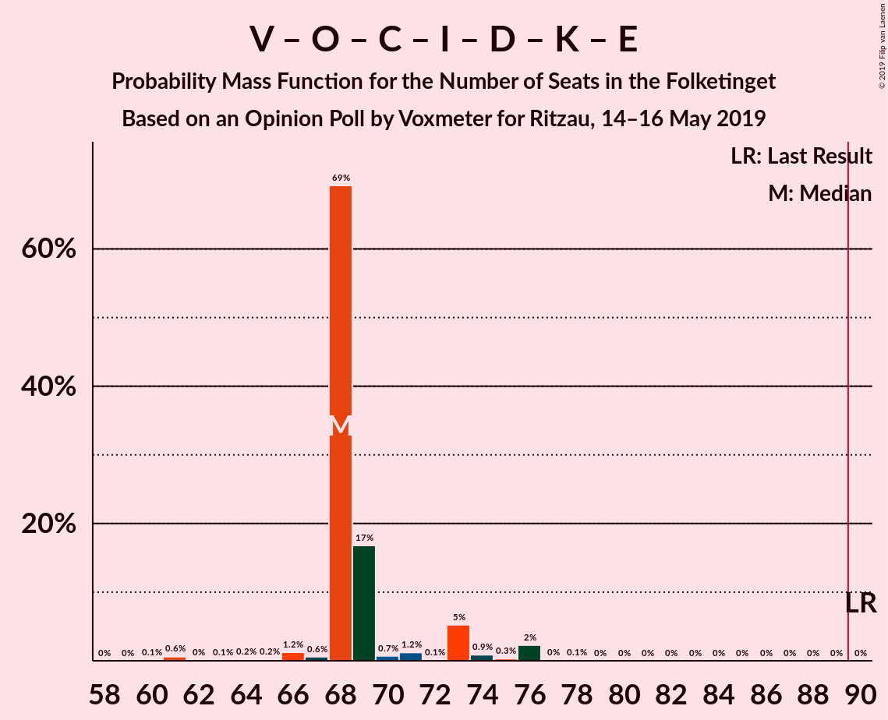
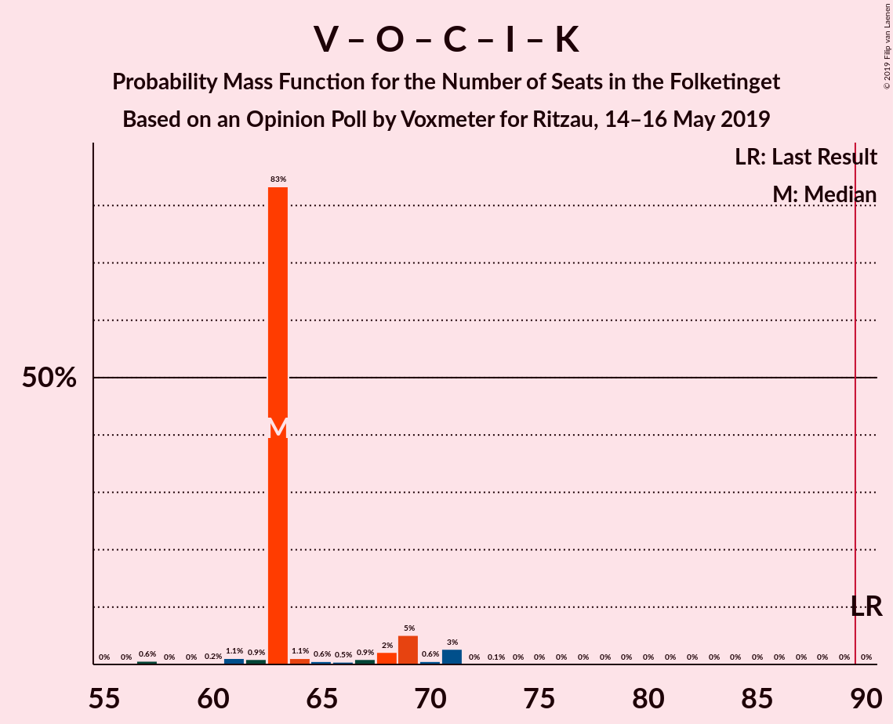
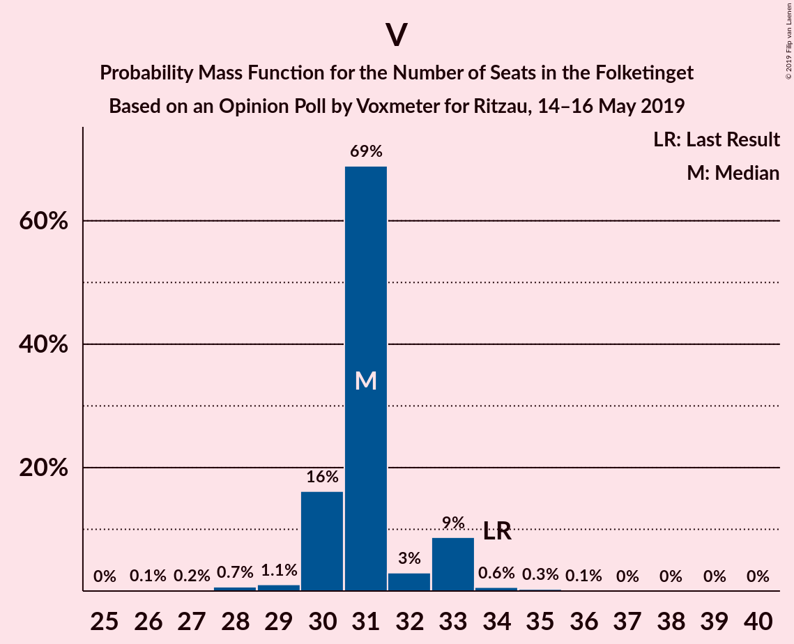

# Opinion Poll by Voxmeter for Ritzau, 14–16 May 2019

<a href="#voting-intentions">Voting Intentions</a> | <a href="#seats">Seats</a> | <a href="#coalitions">Coalitions</a> | <a href="#technical-information">Technical Information</a>

## Voting Intentions

### Confidence Intervals

| Party | Last Result | Poll Result | 80% Confidence Interval | 90% Confidence Interval | 95% Confidence Interval | 99% Confidence Interval |
|:-----:|:-----------:|:-----------:|:-----------------------:|:-----------------------:|:-----------------------:|:-----------------------:|
| Socialdemokraterne | 26.3% | 27.8% | 26.1–29.7% |25.6–30.2% |25.1–30.7% |24.3–31.6% |
| Venstre | 19.5% | 18.2% | 16.7–19.8% |16.3–20.3% |15.9–20.7% |15.2–21.5% |
| Dansk Folkeparti | 21.1% | 10.1% | 9.0–11.5% |8.7–11.8% |8.4–12.2% |7.9–12.8% |
| Enhedslisten–De Rød-Grønne | 7.8% | 9.6% | 8.5–10.9% |8.2–11.3% |8.0–11.6% |7.5–12.3% |
| Radikale Venstre | 4.6% | 8.5% | 7.5–9.8% |7.2–10.1% |7.0–10.4% |6.5–11.1% |
| Socialistisk Folkeparti | 4.2% | 7.7% | 6.7–8.8% |6.4–9.2% |6.2–9.5% |5.7–10.1% |
| Det Konservative Folkeparti | 3.4% | 4.0% | 3.3–4.9% |3.1–5.2% |2.9–5.4% |2.6–5.9% |
| Liberal Alliance | 7.5% | 3.9% | 3.2–4.8% |3.0–5.0% |2.9–5.3% |2.5–5.7% |
| Alternativet | 4.8% | 3.3% | 2.7–4.1% |2.5–4.4% |2.3–4.6% |2.1–5.0% |
| Stram Kurs | 0.0% | 2.6% | 2.0–3.4% |1.9–3.6% |1.8–3.8% |1.5–4.2% |
| Nye Borgerlige | 0.0% | 2.3% | 1.8–3.0% |1.6–3.2% |1.5–3.4% |1.3–3.8% |
| Kristendemokraterne | 0.8% | 1.7% | 1.3–2.3% |1.2–2.5% |1.1–2.7% |0.9–3.0% |
| Klaus Riskær Pedersen | 0.0% | 0.1% | 0.0–0.4% |0.0–0.5% |0.0–0.6% |0.0–0.7% |

*Note:* The poll result column reflects the actual value used in the calculations. Published results may vary slightly, and in addition be rounded to fewer digits.

## Seats

### Confidence Intervals

| Party | Last Result | Median | 80% Confidence Interval | 90% Confidence Interval | 95% Confidence Interval | 99% Confidence Interval |
|:-----:|:-----------:|:------:|:-----------------------:|:-----------------------:|:-----------------------:|:-----------------------:|
| <a href="#socialdemokraterne">Socialdemokraterne</a> | 47 | 48 | 47–50 |47–50 |43–51 |42–57 |
| <a href="#venstre">Venstre</a> | 34 | 33 | 32–34 |32–35 |29–36 |28–38 |
| <a href="#dansk-folkeparti">Dansk Folkeparti</a> | 37 | 17 | 16–19 |16–19 |16–21 |14–22 |
| <a href="#enhedslisten–de-rød-grønne">Enhedslisten–De Rød-Grønne</a> | 14 | 16 | 16–17 |15–18 |15–19 |13–21 |
| <a href="#radikale-venstre">Radikale Venstre</a> | 8 | 14 | 13–17 |13–17 |12–17 |11–18 |
| <a href="#socialistisk-folkeparti">Socialistisk Folkeparti</a> | 7 | 17 | 13–18 |12–18 |11–18 |10–18 |
| <a href="#det-konservative-folkeparti">Det Konservative Folkeparti</a> | 6 | 8 | 7–8 |5–8 |5–9 |5–10 |
| <a href="#liberal-alliance">Liberal Alliance</a> | 13 | 8 | 7–9 |6–9 |6–9 |4–10 |
| <a href="#alternativet">Alternativet</a> | 9 | 7 | 4–7 |4–7 |4–8 |4–8 |
| <a href="#stram-kurs">Stram Kurs</a> | 0 | 5 | 4–7 |0–7 |0–7 |0–7 |
| <a href="#nye-borgerlige">Nye Borgerlige</a> | 0 | 0 | 0–4 |0–4 |0–5 |0–5 |
| <a href="#kristendemokraterne">Kristendemokraterne</a> | 0 | 0 | 0–5 |0–6 |0–6 |0–6 |
| <a href="#klaus-riskær-pedersen">Klaus Riskær Pedersen</a> | 0 | 0 | 0 |0 |0 |0 |

### Socialdemokraterne

*For a full overview of the results for this party, see the [Socialdemokraterne](party-socialdemokraterne.html) page.*

| Number of Seats | Probability | Accumulated | Special Marks |
|:---------------:|:-----------:|:-----------:|:-------------:|
| 42 | 0.9% | 100% |  |
| 43 | 2% | 99.0% |  |
| 44 | 0.1% | 97% |  |
| 45 | 1.5% | 97% |  |
| 46 | 0.4% | 96% |  |
| 47 | 39% | 96% | Last Result |
| 48 | 37% | 57% | Median |
| 49 | 3% | 20% |  |
| 50 | 14% | 17% |  |
| 51 | 0.6% | 3% |  |
| 52 | 0% | 2% |  |
| 53 | 0.2% | 2% |  |
| 54 | 0.5% | 2% |  |
| 55 | 0.3% | 1.3% |  |
| 56 | 0% | 0.9% |  |
| 57 | 0.8% | 0.9% |  |
| 58 | 0.1% | 0.1% |  |
| 59 | 0% | 0% |  |

### Venstre

*For a full overview of the results for this party, see the [Venstre](party-venstre.html) page.*

| Number of Seats | Probability | Accumulated | Special Marks |
|:---------------:|:-----------:|:-----------:|:-------------:|
| 26 | 0.1% | 100% |  |
| 27 | 0% | 99.9% |  |
| 28 | 1.1% | 99.8% |  |
| 29 | 2% | 98.8% |  |
| 30 | 1.1% | 97% |  |
| 31 | 0.7% | 96% |  |
| 32 | 39% | 95% |  |
| 33 | 46% | 56% | Median |
| 34 | 5% | 10% | Last Result |
| 35 | 2% | 5% |  |
| 36 | 2% | 3% |  |
| 37 | 0.1% | 1.4% |  |
| 38 | 1.3% | 1.3% |  |
| 39 | 0% | 0% |  |

### Dansk Folkeparti

*For a full overview of the results for this party, see the [Dansk Folkeparti](party-danskfolkeparti.html) page.*

| Number of Seats | Probability | Accumulated | Special Marks |
|:---------------:|:-----------:|:-----------:|:-------------:|
| 14 | 1.0% | 100% |  |
| 15 | 0.1% | 99.0% |  |
| 16 | 42% | 98.8% |  |
| 17 | 9% | 57% | Median |
| 18 | 5% | 48% |  |
| 19 | 39% | 43% |  |
| 20 | 0.7% | 4% |  |
| 21 | 2% | 3% |  |
| 22 | 1.2% | 2% |  |
| 23 | 0.3% | 0.3% |  |
| 24 | 0% | 0% |  |
| 25 | 0% | 0% |  |
| 26 | 0% | 0% |  |
| 27 | 0% | 0% |  |
| 28 | 0% | 0% |  |
| 29 | 0% | 0% |  |
| 30 | 0% | 0% |  |
| 31 | 0% | 0% |  |
| 32 | 0% | 0% |  |
| 33 | 0% | 0% |  |
| 34 | 0% | 0% |  |
| 35 | 0% | 0% |  |
| 36 | 0% | 0% |  |
| 37 | 0% | 0% | Last Result |

### Enhedslisten–De Rød-Grønne

*For a full overview of the results for this party, see the [Enhedslisten–De Rød-Grønne](party-enhedslisten–derød-grønne.html) page.*

| Number of Seats | Probability | Accumulated | Special Marks |
|:---------------:|:-----------:|:-----------:|:-------------:|
| 13 | 1.5% | 100% |  |
| 14 | 0.5% | 98.5% | Last Result |
| 15 | 8% | 98% |  |
| 16 | 64% | 90% | Median |
| 17 | 19% | 27% |  |
| 18 | 4% | 8% |  |
| 19 | 3% | 4% |  |
| 20 | 0.3% | 0.9% |  |
| 21 | 0.5% | 0.6% |  |
| 22 | 0.1% | 0.2% |  |
| 23 | 0% | 0% |  |

### Radikale Venstre

*For a full overview of the results for this party, see the [Radikale Venstre](party-radikalevenstre.html) page.*

| Number of Seats | Probability | Accumulated | Special Marks |
|:---------------:|:-----------:|:-----------:|:-------------:|
| 8 | 0% | 100% | Last Result |
| 9 | 0% | 100% |  |
| 10 | 0% | 100% |  |
| 11 | 2% | 100% |  |
| 12 | 2% | 98% |  |
| 13 | 40% | 97% |  |
| 14 | 8% | 57% | Median |
| 15 | 1.0% | 49% |  |
| 16 | 25% | 48% |  |
| 17 | 21% | 23% |  |
| 18 | 1.2% | 1.3% |  |
| 19 | 0% | 0% |  |

### Socialistisk Folkeparti

*For a full overview of the results for this party, see the [Socialistisk Folkeparti](party-socialistiskfolkeparti.html) page.*

| Number of Seats | Probability | Accumulated | Special Marks |
|:---------------:|:-----------:|:-----------:|:-------------:|
| 7 | 0% | 100% | Last Result |
| 8 | 0% | 100% |  |
| 9 | 0.2% | 100% |  |
| 10 | 0.8% | 99.8% |  |
| 11 | 3% | 99.0% |  |
| 12 | 5% | 96% |  |
| 13 | 26% | 90% |  |
| 14 | 1.2% | 64% |  |
| 15 | 9% | 63% |  |
| 16 | 0.6% | 54% |  |
| 17 | 15% | 53% | Median |
| 18 | 38% | 38% |  |
| 19 | 0% | 0% |  |

### Det Konservative Folkeparti

*For a full overview of the results for this party, see the [Det Konservative Folkeparti](party-detkonservativefolkeparti.html) page.*

| Number of Seats | Probability | Accumulated | Special Marks |
|:---------------:|:-----------:|:-----------:|:-------------:|
| 4 | 0.2% | 100% |  |
| 5 | 5% | 99.8% |  |
| 6 | 1.4% | 95% | Last Result |
| 7 | 17% | 93% |  |
| 8 | 73% | 76% | Median |
| 9 | 2% | 3% |  |
| 10 | 2% | 2% |  |
| 11 | 0% | 0% |  |

### Liberal Alliance

*For a full overview of the results for this party, see the [Liberal Alliance](party-liberalalliance.html) page.*

| Number of Seats | Probability | Accumulated | Special Marks |
|:---------------:|:-----------:|:-----------:|:-------------:|
| 4 | 0.5% | 100% |  |
| 5 | 1.2% | 99.5% |  |
| 6 | 4% | 98% |  |
| 7 | 26% | 94% |  |
| 8 | 27% | 68% | Median |
| 9 | 40% | 41% |  |
| 10 | 2% | 2% |  |
| 11 | 0% | 0% |  |
| 12 | 0% | 0% |  |
| 13 | 0% | 0% | Last Result |

### Alternativet

*For a full overview of the results for this party, see the [Alternativet](party-alternativet.html) page.*

| Number of Seats | Probability | Accumulated | Special Marks |
|:---------------:|:-----------:|:-----------:|:-------------:|
| 4 | 14% | 100% |  |
| 5 | 8% | 86% |  |
| 6 | 6% | 79% |  |
| 7 | 70% | 73% | Median |
| 8 | 2% | 3% |  |
| 9 | 0.4% | 0.4% | Last Result |
| 10 | 0% | 0% |  |

### Stram Kurs

*For a full overview of the results for this party, see the [Stram Kurs](party-stramkurs.html) page.*

| Number of Seats | Probability | Accumulated | Special Marks |
|:---------------:|:-----------:|:-----------:|:-------------:|
| 0 | 7% | 100% | Last Result |
| 1 | 0% | 93% |  |
| 2 | 0% | 93% |  |
| 3 | 0% | 93% |  |
| 4 | 20% | 93% |  |
| 5 | 43% | 73% | Median |
| 6 | 3% | 30% |  |
| 7 | 28% | 28% |  |
| 8 | 0.1% | 0.1% |  |
| 9 | 0% | 0% |  |

### Nye Borgerlige

*For a full overview of the results for this party, see the [Nye Borgerlige](party-nyeborgerlige.html) page.*

| Number of Seats | Probability | Accumulated | Special Marks |
|:---------------:|:-----------:|:-----------:|:-------------:|
| 0 | 68% | 100% | Last Result, Median |
| 1 | 0% | 32% |  |
| 2 | 0% | 32% |  |
| 3 | 0% | 32% |  |
| 4 | 29% | 32% |  |
| 5 | 2% | 3% |  |
| 6 | 0.1% | 0.3% |  |
| 7 | 0.2% | 0.2% |  |
| 8 | 0.1% | 0.1% |  |
| 9 | 0% | 0% |  |

### Kristendemokraterne

*For a full overview of the results for this party, see the [Kristendemokraterne](party-kristendemokraterne.html) page.*

| Number of Seats | Probability | Accumulated | Special Marks |
|:---------------:|:-----------:|:-----------:|:-------------:|
| 0 | 57% | 100% | Last Result, Median |
| 1 | 0% | 43% |  |
| 2 | 0% | 43% |  |
| 3 | 0% | 43% |  |
| 4 | 31% | 43% |  |
| 5 | 5% | 12% |  |
| 6 | 7% | 7% |  |
| 7 | 0% | 0% |  |

### Klaus Riskær Pedersen

*For a full overview of the results for this party, see the [Klaus Riskær Pedersen](party-klausriskærpedersen.html) page.*

| Number of Seats | Probability | Accumulated | Special Marks |
|:---------------:|:-----------:|:-----------:|:-------------:|
| 0 | 100% | 100% | Last Result, Median |

## Coalitions

### Confidence Intervals

| Coalition | Last Result | Median | Majority? | 80% Confidence Interval | 90% Confidence Interval | 95% Confidence Interval | 99% Confidence Interval |
|:---------:|:-----------:|:------:|:---------:|:-----------------------:|:-----------------------:|:-----------------------:|:-----------------------:|
| Socialdemokraterne – Enhedslisten–De Rød-Grønne – Radikale Venstre – Socialistisk Folkeparti – Alternativet | 85 | 101 | 100% | 99–105 | 98–105 | 95–106 | 92–109 |
| Socialdemokraterne – Enhedslisten–De Rød-Grønne – Radikale Venstre – Socialistisk Folkeparti | 76 | 94 | 96% | 91–101 | 91–101 | 88–101 | 86–103 |
| Socialdemokraterne – Enhedslisten–De Rød-Grønne – Socialistisk Folkeparti – Alternativet | 77 | 88 | 3% | 83–88 | 83–88 | 81–90 | 78–93 |
| Socialdemokraterne – Enhedslisten–De Rød-Grønne – Socialistisk Folkeparti | 68 | 81 | 0.1% | 77–84 | 77–84 | 75–84 | 72–85 |
| Socialdemokraterne – Radikale Venstre – Socialistisk Folkeparti | 62 | 78 | 0.1% | 74–84 | 72–84 | 71–84 | 68–88 |
| Venstre – Dansk Folkeparti – Det Konservative Folkeparti – Liberal Alliance – Stram Kurs – Nye Borgerlige – Kristendemokraterne – Klaus Riskær Pedersen | 90 | 74 | 0% | 70–76 | 70–77 | 69–80 | 66–83 |
| Venstre – Dansk Folkeparti – Det Konservative Folkeparti – Liberal Alliance – Nye Borgerlige – Kristendemokraterne – Klaus Riskær Pedersen | 90 | 69 | 0% | 66–75 | 66–75 | 66–75 | 62–77 |
| Venstre – Dansk Folkeparti – Det Konservative Folkeparti – Liberal Alliance – Nye Borgerlige – Kristendemokraterne | 90 | 69 | 0% | 66–75 | 66–75 | 66–75 | 62–77 |
| Venstre – Dansk Folkeparti – Det Konservative Folkeparti – Liberal Alliance – Nye Borgerlige – Klaus Riskær Pedersen | 90 | 69 | 0% | 64–69 | 64–69 | 64–73 | 58–75 |
| Venstre – Dansk Folkeparti – Det Konservative Folkeparti – Liberal Alliance – Nye Borgerlige | 90 | 69 | 0% | 64–69 | 64–69 | 64–73 | 58–75 |
| Venstre – Dansk Folkeparti – Det Konservative Folkeparti – Liberal Alliance – Kristendemokraterne | 90 | 69 | 0% | 62–71 | 62–71 | 62–73 | 59–75 |
| Venstre – Dansk Folkeparti – Det Konservative Folkeparti – Liberal Alliance | 90 | 65 | 0% | 62–69 | 62–69 | 62–69 | 58–75 |
| Socialdemokraterne – Radikale Venstre | 55 | 62 | 0% | 60–67 | 60–67 | 58–67 | 55–75 |
| Venstre – Det Konservative Folkeparti – Liberal Alliance | 53 | 48 | 0% | 46–50 | 46–50 | 45–50 | 40–54 |
| Venstre – Det Konservative Folkeparti | 40 | 41 | 0% | 39–41 | 39–42 | 36–44 | 35–46 |
| Venstre | 34 | 33 | 0% | 32–34 | 32–35 | 29–36 | 28–38 |

### Socialdemokraterne – Enhedslisten–De Rød-Grønne – Radikale Venstre – Socialistisk Folkeparti – Alternativet

| Number of Seats | Probability | Accumulated | Special Marks |
|:---------------:|:-----------:|:-----------:|:-------------:|
| 85 | 0% | 100% | Last Result |
| 86 | 0% | 100% |  |
| 87 | 0% | 100% |  |
| 88 | 0% | 100% |  |
| 89 | 0% | 100% |  |
| 90 | 0% | 100% | Majority |
| 91 | 0% | 100% |  |
| 92 | 1.5% | 100% |  |
| 93 | 0.2% | 98.5% |  |
| 94 | 0.4% | 98% |  |
| 95 | 2% | 98% |  |
| 96 | 0% | 96% |  |
| 97 | 0.3% | 96% |  |
| 98 | 5% | 95% |  |
| 99 | 4% | 90% |  |
| 100 | 32% | 87% |  |
| 101 | 39% | 55% |  |
| 102 | 0.2% | 16% | Median |
| 103 | 0.3% | 16% |  |
| 104 | 0.1% | 16% |  |
| 105 | 13% | 16% |  |
| 106 | 0.2% | 3% |  |
| 107 | 1.1% | 2% |  |
| 108 | 0% | 1.3% |  |
| 109 | 0.9% | 1.3% |  |
| 110 | 0% | 0.4% |  |
| 111 | 0% | 0.4% |  |
| 112 | 0.3% | 0.4% |  |
| 113 | 0.1% | 0.1% |  |
| 114 | 0% | 0% |  |

### Socialdemokraterne – Enhedslisten–De Rød-Grønne – Radikale Venstre – Socialistisk Folkeparti

| Number of Seats | Probability | Accumulated | Special Marks |
|:---------------:|:-----------:|:-----------:|:-------------:|
| 76 | 0% | 100% | Last Result |
| 77 | 0% | 100% |  |
| 78 | 0% | 100% |  |
| 79 | 0% | 100% |  |
| 80 | 0% | 100% |  |
| 81 | 0% | 100% |  |
| 82 | 0% | 100% |  |
| 83 | 0% | 100% |  |
| 84 | 0% | 100% |  |
| 85 | 0% | 100% |  |
| 86 | 1.5% | 100% |  |
| 87 | 0.1% | 98.5% |  |
| 88 | 1.1% | 98% |  |
| 89 | 2% | 97% |  |
| 90 | 0% | 96% | Majority |
| 91 | 7% | 96% |  |
| 92 | 0% | 89% |  |
| 93 | 27% | 89% |  |
| 94 | 39% | 62% |  |
| 95 | 7% | 23% | Median |
| 96 | 0.1% | 16% |  |
| 97 | 0.2% | 16% |  |
| 98 | 0.1% | 16% |  |
| 99 | 0.1% | 16% |  |
| 100 | 0.7% | 16% |  |
| 101 | 14% | 15% |  |
| 102 | 0.2% | 1.4% |  |
| 103 | 0.8% | 1.2% |  |
| 104 | 0.3% | 0.4% |  |
| 105 | 0% | 0.2% |  |
| 106 | 0% | 0.1% |  |
| 107 | 0% | 0.1% |  |
| 108 | 0.1% | 0.1% |  |
| 109 | 0% | 0% |  |

### Socialdemokraterne – Enhedslisten–De Rød-Grønne – Socialistisk Folkeparti – Alternativet

| Number of Seats | Probability | Accumulated | Special Marks |
|:---------------:|:-----------:|:-----------:|:-------------:|
| 76 | 0.2% | 100% |  |
| 77 | 0% | 99.8% | Last Result |
| 78 | 2% | 99.8% |  |
| 79 | 0.4% | 98% |  |
| 80 | 0% | 98% |  |
| 81 | 1.4% | 98% |  |
| 82 | 1.0% | 96% |  |
| 83 | 7% | 95% |  |
| 84 | 30% | 88% |  |
| 85 | 0% | 58% |  |
| 86 | 0.4% | 58% |  |
| 87 | 2% | 58% |  |
| 88 | 53% | 56% | Median |
| 89 | 0.2% | 3% |  |
| 90 | 1.3% | 3% | Majority |
| 91 | 0.8% | 1.5% |  |
| 92 | 0.1% | 0.6% |  |
| 93 | 0% | 0.5% |  |
| 94 | 0.1% | 0.5% |  |
| 95 | 0.1% | 0.4% |  |
| 96 | 0% | 0.3% |  |
| 97 | 0.3% | 0.3% |  |
| 98 | 0% | 0% |  |

### Socialdemokraterne – Enhedslisten–De Rød-Grønne – Socialistisk Folkeparti

| Number of Seats | Probability | Accumulated | Special Marks |
|:---------------:|:-----------:|:-----------:|:-------------:|
| 68 | 0% | 100% | Last Result |
| 69 | 0% | 100% |  |
| 70 | 0% | 100% |  |
| 71 | 0.2% | 100% |  |
| 72 | 1.5% | 99.8% |  |
| 73 | 0% | 98% |  |
| 74 | 0.5% | 98% |  |
| 75 | 2% | 98% |  |
| 76 | 0.1% | 96% |  |
| 77 | 30% | 96% |  |
| 78 | 7% | 65% |  |
| 79 | 2% | 58% |  |
| 80 | 0.2% | 57% |  |
| 81 | 39% | 56% | Median |
| 82 | 2% | 18% |  |
| 83 | 0.7% | 16% |  |
| 84 | 14% | 15% |  |
| 85 | 1.0% | 1.4% |  |
| 86 | 0% | 0.5% |  |
| 87 | 0% | 0.4% |  |
| 88 | 0% | 0.4% |  |
| 89 | 0.3% | 0.4% |  |
| 90 | 0.1% | 0.1% | Majority |
| 91 | 0% | 0% |  |

### Socialdemokraterne – Radikale Venstre – Socialistisk Folkeparti

| Number of Seats | Probability | Accumulated | Special Marks |
|:---------------:|:-----------:|:-----------:|:-------------:|
| 62 | 0% | 100% | Last Result |
| 63 | 0% | 100% |  |
| 64 | 0% | 100% |  |
| 65 | 0% | 100% |  |
| 66 | 0% | 100% |  |
| 67 | 0% | 100% |  |
| 68 | 1.5% | 100% |  |
| 69 | 0% | 98.5% |  |
| 70 | 0.9% | 98.5% |  |
| 71 | 0.2% | 98% |  |
| 72 | 2% | 97% |  |
| 73 | 0.2% | 95% |  |
| 74 | 5% | 95% |  |
| 75 | 2% | 90% |  |
| 76 | 1.3% | 88% |  |
| 77 | 25% | 87% |  |
| 78 | 39% | 62% |  |
| 79 | 0.2% | 23% | Median |
| 80 | 7% | 23% |  |
| 81 | 1.0% | 16% |  |
| 82 | 0.2% | 15% |  |
| 83 | 0.3% | 15% |  |
| 84 | 13% | 15% |  |
| 85 | 0% | 1.3% |  |
| 86 | 0% | 1.2% |  |
| 87 | 0.3% | 1.2% |  |
| 88 | 0.8% | 0.9% |  |
| 89 | 0% | 0.1% |  |
| 90 | 0% | 0.1% | Majority |
| 91 | 0.1% | 0.1% |  |
| 92 | 0% | 0% |  |

### Venstre – Dansk Folkeparti – Det Konservative Folkeparti – Liberal Alliance – Stram Kurs – Nye Borgerlige – Kristendemokraterne – Klaus Riskær Pedersen

| Number of Seats | Probability | Accumulated | Special Marks |
|:---------------:|:-----------:|:-----------:|:-------------:|
| 62 | 0.1% | 100% |  |
| 63 | 0.3% | 99.9% |  |
| 64 | 0% | 99.6% |  |
| 65 | 0% | 99.6% |  |
| 66 | 0.9% | 99.6% |  |
| 67 | 0% | 98.7% |  |
| 68 | 1.1% | 98.7% |  |
| 69 | 0.2% | 98% |  |
| 70 | 13% | 97% |  |
| 71 | 0.1% | 84% | Median |
| 72 | 0.3% | 84% |  |
| 73 | 0.2% | 84% |  |
| 74 | 39% | 84% |  |
| 75 | 32% | 45% |  |
| 76 | 4% | 13% |  |
| 77 | 5% | 10% |  |
| 78 | 0.3% | 5% |  |
| 79 | 0% | 4% |  |
| 80 | 2% | 4% |  |
| 81 | 0.4% | 2% |  |
| 82 | 0.2% | 2% |  |
| 83 | 1.5% | 1.5% |  |
| 84 | 0% | 0% |  |
| 85 | 0% | 0% |  |
| 86 | 0% | 0% |  |
| 87 | 0% | 0% |  |
| 88 | 0% | 0% |  |
| 89 | 0% | 0% |  |
| 90 | 0% | 0% | Last Result, Majority |

### Venstre – Dansk Folkeparti – Det Konservative Folkeparti – Liberal Alliance – Nye Borgerlige – Kristendemokraterne – Klaus Riskær Pedersen

| Number of Seats | Probability | Accumulated | Special Marks |
|:---------------:|:-----------:|:-----------:|:-------------:|
| 59 | 0.3% | 100% |  |
| 60 | 0.1% | 99.7% |  |
| 61 | 0% | 99.7% |  |
| 62 | 2% | 99.7% |  |
| 63 | 0.3% | 98% |  |
| 64 | 0.1% | 98% |  |
| 65 | 0.1% | 98% |  |
| 66 | 14% | 98% | Median |
| 67 | 0.1% | 84% |  |
| 68 | 25% | 84% |  |
| 69 | 40% | 59% |  |
| 70 | 0.2% | 18% |  |
| 71 | 2% | 18% |  |
| 72 | 0.3% | 16% |  |
| 73 | 5% | 16% |  |
| 74 | 0.5% | 11% |  |
| 75 | 9% | 10% |  |
| 76 | 0% | 2% |  |
| 77 | 1.5% | 2% |  |
| 78 | 0% | 0.1% |  |
| 79 | 0% | 0% |  |
| 80 | 0% | 0% |  |
| 81 | 0% | 0% |  |
| 82 | 0% | 0% |  |
| 83 | 0% | 0% |  |
| 84 | 0% | 0% |  |
| 85 | 0% | 0% |  |
| 86 | 0% | 0% |  |
| 87 | 0% | 0% |  |
| 88 | 0% | 0% |  |
| 89 | 0% | 0% |  |
| 90 | 0% | 0% | Last Result, Majority |

### Venstre – Dansk Folkeparti – Det Konservative Folkeparti – Liberal Alliance – Nye Borgerlige – Kristendemokraterne

| Number of Seats | Probability | Accumulated | Special Marks |
|:---------------:|:-----------:|:-----------:|:-------------:|
| 59 | 0.3% | 100% |  |
| 60 | 0.1% | 99.7% |  |
| 61 | 0% | 99.7% |  |
| 62 | 2% | 99.7% |  |
| 63 | 0.3% | 98% |  |
| 64 | 0.1% | 98% |  |
| 65 | 0.1% | 98% |  |
| 66 | 14% | 98% | Median |
| 67 | 0.1% | 84% |  |
| 68 | 25% | 84% |  |
| 69 | 40% | 59% |  |
| 70 | 0.2% | 18% |  |
| 71 | 2% | 18% |  |
| 72 | 0.3% | 16% |  |
| 73 | 5% | 16% |  |
| 74 | 0.5% | 11% |  |
| 75 | 9% | 10% |  |
| 76 | 0% | 2% |  |
| 77 | 1.5% | 2% |  |
| 78 | 0% | 0.1% |  |
| 79 | 0% | 0% |  |
| 80 | 0% | 0% |  |
| 81 | 0% | 0% |  |
| 82 | 0% | 0% |  |
| 83 | 0% | 0% |  |
| 84 | 0% | 0% |  |
| 85 | 0% | 0% |  |
| 86 | 0% | 0% |  |
| 87 | 0% | 0% |  |
| 88 | 0% | 0% |  |
| 89 | 0% | 0% |  |
| 90 | 0% | 0% | Last Result, Majority |

### Venstre – Dansk Folkeparti – Det Konservative Folkeparti – Liberal Alliance – Nye Borgerlige – Klaus Riskær Pedersen

| Number of Seats | Probability | Accumulated | Special Marks |
|:---------------:|:-----------:|:-----------:|:-------------:|
| 58 | 0.8% | 100% |  |
| 59 | 0.3% | 99.2% |  |
| 60 | 0.1% | 98.9% |  |
| 61 | 0% | 98.9% |  |
| 62 | 0.8% | 98.8% |  |
| 63 | 0.3% | 98% |  |
| 64 | 25% | 98% |  |
| 65 | 0.1% | 72% |  |
| 66 | 14% | 72% | Median |
| 67 | 2% | 59% |  |
| 68 | 5% | 57% |  |
| 69 | 47% | 52% |  |
| 70 | 0% | 5% |  |
| 71 | 1.4% | 5% |  |
| 72 | 0.2% | 3% |  |
| 73 | 2% | 3% |  |
| 74 | 0.6% | 2% |  |
| 75 | 1.0% | 1.0% |  |
| 76 | 0% | 0% |  |
| 77 | 0% | 0% |  |
| 78 | 0% | 0% |  |
| 79 | 0% | 0% |  |
| 80 | 0% | 0% |  |
| 81 | 0% | 0% |  |
| 82 | 0% | 0% |  |
| 83 | 0% | 0% |  |
| 84 | 0% | 0% |  |
| 85 | 0% | 0% |  |
| 86 | 0% | 0% |  |
| 87 | 0% | 0% |  |
| 88 | 0% | 0% |  |
| 89 | 0% | 0% |  |
| 90 | 0% | 0% | Last Result, Majority |

### Venstre – Dansk Folkeparti – Det Konservative Folkeparti – Liberal Alliance – Nye Borgerlige

| Number of Seats | Probability | Accumulated | Special Marks |
|:---------------:|:-----------:|:-----------:|:-------------:|
| 58 | 0.8% | 100% |  |
| 59 | 0.3% | 99.2% |  |
| 60 | 0.1% | 98.9% |  |
| 61 | 0% | 98.9% |  |
| 62 | 0.8% | 98.8% |  |
| 63 | 0.3% | 98% |  |
| 64 | 25% | 98% |  |
| 65 | 0.1% | 72% |  |
| 66 | 14% | 72% | Median |
| 67 | 2% | 59% |  |
| 68 | 5% | 57% |  |
| 69 | 47% | 52% |  |
| 70 | 0% | 5% |  |
| 71 | 1.4% | 5% |  |
| 72 | 0.2% | 3% |  |
| 73 | 2% | 3% |  |
| 74 | 0.6% | 2% |  |
| 75 | 1.0% | 1.0% |  |
| 76 | 0% | 0% |  |
| 77 | 0% | 0% |  |
| 78 | 0% | 0% |  |
| 79 | 0% | 0% |  |
| 80 | 0% | 0% |  |
| 81 | 0% | 0% |  |
| 82 | 0% | 0% |  |
| 83 | 0% | 0% |  |
| 84 | 0% | 0% |  |
| 85 | 0% | 0% |  |
| 86 | 0% | 0% |  |
| 87 | 0% | 0% |  |
| 88 | 0% | 0% |  |
| 89 | 0% | 0% |  |
| 90 | 0% | 0% | Last Result, Majority |

### Venstre – Dansk Folkeparti – Det Konservative Folkeparti – Liberal Alliance – Kristendemokraterne

| Number of Seats | Probability | Accumulated | Special Marks |
|:---------------:|:-----------:|:-----------:|:-------------:|
| 58 | 0.1% | 100% |  |
| 59 | 0.6% | 99.9% |  |
| 60 | 0.1% | 99.3% |  |
| 61 | 0% | 99.2% |  |
| 62 | 15% | 99.2% |  |
| 63 | 0.3% | 84% |  |
| 64 | 0.2% | 84% |  |
| 65 | 2% | 84% |  |
| 66 | 2% | 82% | Median |
| 67 | 0.4% | 80% |  |
| 68 | 25% | 80% |  |
| 69 | 44% | 55% |  |
| 70 | 0.2% | 11% |  |
| 71 | 7% | 10% |  |
| 72 | 0% | 4% |  |
| 73 | 2% | 4% |  |
| 74 | 0% | 2% |  |
| 75 | 2% | 2% |  |
| 76 | 0% | 0% |  |
| 77 | 0% | 0% |  |
| 78 | 0% | 0% |  |
| 79 | 0% | 0% |  |
| 80 | 0% | 0% |  |
| 81 | 0% | 0% |  |
| 82 | 0% | 0% |  |
| 83 | 0% | 0% |  |
| 84 | 0% | 0% |  |
| 85 | 0% | 0% |  |
| 86 | 0% | 0% |  |
| 87 | 0% | 0% |  |
| 88 | 0% | 0% |  |
| 89 | 0% | 0% |  |
| 90 | 0% | 0% | Last Result, Majority |

### Venstre – Dansk Folkeparti – Det Konservative Folkeparti – Liberal Alliance

| Number of Seats | Probability | Accumulated | Special Marks |
|:---------------:|:-----------:|:-----------:|:-------------:|
| 58 | 0.9% | 100% |  |
| 59 | 0.7% | 99.1% |  |
| 60 | 0.3% | 98% |  |
| 61 | 0% | 98% |  |
| 62 | 15% | 98% |  |
| 63 | 0.4% | 83% |  |
| 64 | 30% | 82% |  |
| 65 | 9% | 52% |  |
| 66 | 0.3% | 44% | Median |
| 67 | 0.5% | 43% |  |
| 68 | 0.1% | 43% |  |
| 69 | 40% | 43% |  |
| 70 | 0.1% | 2% |  |
| 71 | 1.1% | 2% |  |
| 72 | 0% | 0.9% |  |
| 73 | 0% | 0.9% |  |
| 74 | 0% | 0.9% |  |
| 75 | 0.9% | 0.9% |  |
| 76 | 0% | 0% |  |
| 77 | 0% | 0% |  |
| 78 | 0% | 0% |  |
| 79 | 0% | 0% |  |
| 80 | 0% | 0% |  |
| 81 | 0% | 0% |  |
| 82 | 0% | 0% |  |
| 83 | 0% | 0% |  |
| 84 | 0% | 0% |  |
| 85 | 0% | 0% |  |
| 86 | 0% | 0% |  |
| 87 | 0% | 0% |  |
| 88 | 0% | 0% |  |
| 89 | 0% | 0% |  |
| 90 | 0% | 0% | Last Result, Majority |

### Socialdemokraterne – Radikale Venstre

| Number of Seats | Probability | Accumulated | Special Marks |
|:---------------:|:-----------:|:-----------:|:-------------:|
| 55 | 0.9% | 100% | Last Result |
| 56 | 0% | 99.1% |  |
| 57 | 1.5% | 99.1% |  |
| 58 | 0.1% | 98% |  |
| 59 | 1.2% | 97% |  |
| 60 | 40% | 96% |  |
| 61 | 2% | 56% |  |
| 62 | 6% | 54% | Median |
| 63 | 0.1% | 48% |  |
| 64 | 25% | 48% |  |
| 65 | 7% | 23% |  |
| 66 | 0.1% | 16% |  |
| 67 | 14% | 16% |  |
| 68 | 0.1% | 2% |  |
| 69 | 0.2% | 2% |  |
| 70 | 0.3% | 2% |  |
| 71 | 0.6% | 1.5% |  |
| 72 | 0% | 0.9% |  |
| 73 | 0% | 0.9% |  |
| 74 | 0% | 0.9% |  |
| 75 | 0.8% | 0.9% |  |
| 76 | 0.1% | 0.1% |  |
| 77 | 0% | 0% |  |

### Venstre – Det Konservative Folkeparti – Liberal Alliance

| Number of Seats | Probability | Accumulated | Special Marks |
|:---------------:|:-----------:|:-----------:|:-------------:|
| 37 | 0.1% | 100% |  |
| 38 | 0% | 99.9% |  |
| 39 | 0% | 99.8% |  |
| 40 | 0.4% | 99.8% |  |
| 41 | 0.3% | 99.4% |  |
| 42 | 0% | 99.1% |  |
| 43 | 0.4% | 99.1% |  |
| 44 | 1.0% | 98.6% |  |
| 45 | 1.1% | 98% |  |
| 46 | 20% | 97% |  |
| 47 | 0.3% | 77% |  |
| 48 | 32% | 76% |  |
| 49 | 3% | 45% | Median |
| 50 | 39% | 41% |  |
| 51 | 0% | 2% |  |
| 52 | 1.5% | 2% |  |
| 53 | 0.1% | 1.0% | Last Result |
| 54 | 0.9% | 0.9% |  |
| 55 | 0% | 0% |  |

### Venstre – Det Konservative Folkeparti

| Number of Seats | Probability | Accumulated | Special Marks |
|:---------------:|:-----------:|:-----------:|:-------------:|
| 32 | 0.1% | 100% |  |
| 33 | 0% | 99.8% |  |
| 34 | 0% | 99.8% |  |
| 35 | 0.4% | 99.8% |  |
| 36 | 3% | 99.4% |  |
| 37 | 1.3% | 97% |  |
| 38 | 0.1% | 96% |  |
| 39 | 19% | 95% |  |
| 40 | 25% | 77% | Last Result |
| 41 | 45% | 51% | Median |
| 42 | 1.4% | 6% |  |
| 43 | 2% | 5% |  |
| 44 | 0.5% | 3% |  |
| 45 | 0.9% | 2% |  |
| 46 | 1.5% | 2% |  |
| 47 | 0% | 0% |  |

### Venstre

| Number of Seats | Probability | Accumulated | Special Marks |
|:---------------:|:-----------:|:-----------:|:-------------:|
| 26 | 0.1% | 100% |  |
| 27 | 0% | 99.9% |  |
| 28 | 1.1% | 99.8% |  |
| 29 | 2% | 98.8% |  |
| 30 | 1.1% | 97% |  |
| 31 | 0.7% | 96% |  |
| 32 | 39% | 95% |  |
| 33 | 46% | 56% | Median |
| 34 | 5% | 10% | Last Result |
| 35 | 2% | 5% |  |
| 36 | 2% | 3% |  |
| 37 | 0.1% | 1.4% |  |
| 38 | 1.3% | 1.3% |  |
| 39 | 0% | 0% |  |

## Technical Information

### Opinion Poll

+ **Polling firm:** Voxmeter
+ **Commissioner(s):** Ritzau
+ **Fieldwork period:** 14–16 May 2019

### Calculations

+ **Sample size:** 1006
+ **Simulations done:** 131,072
+ **Error estimate:** 2.62%

