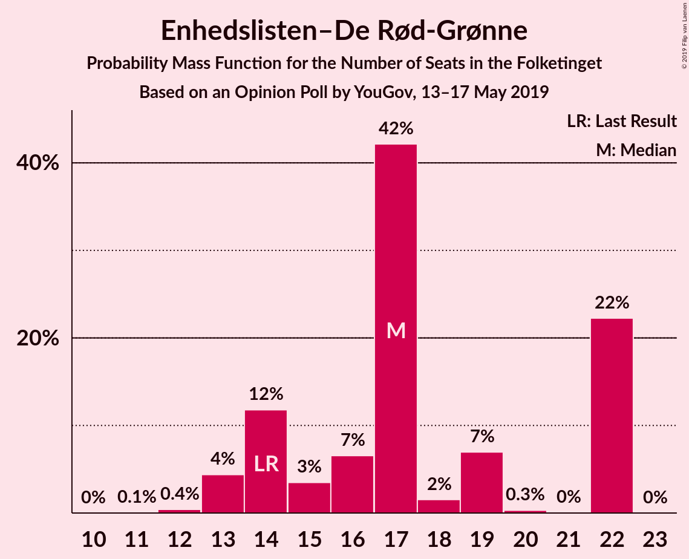
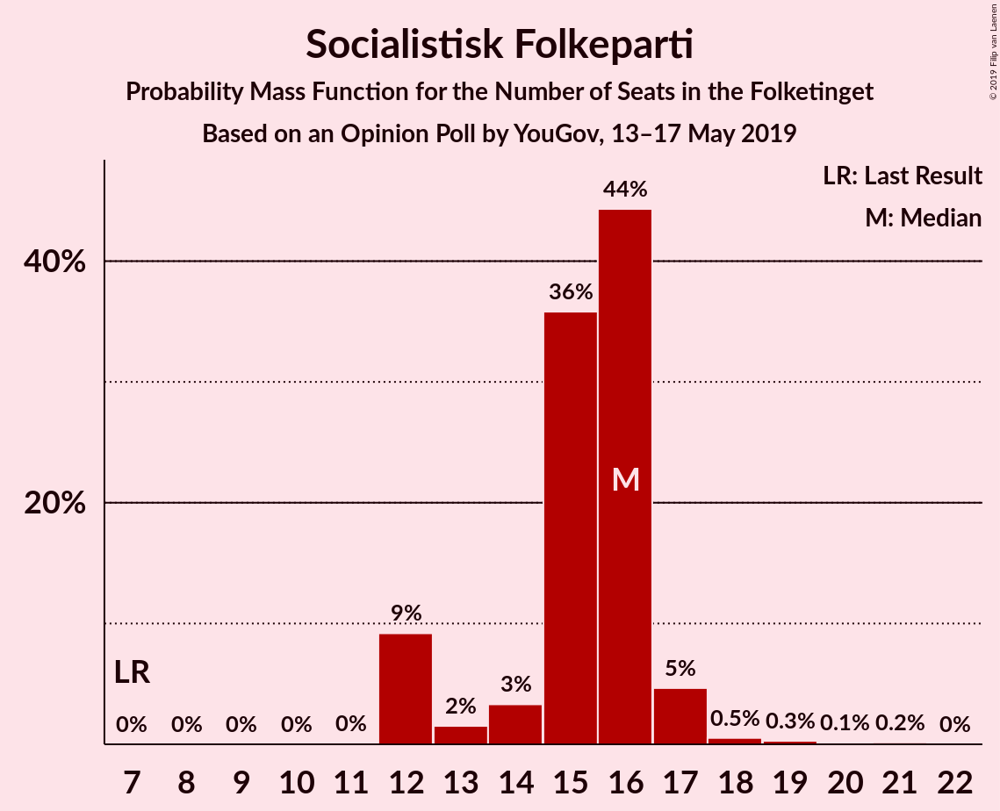
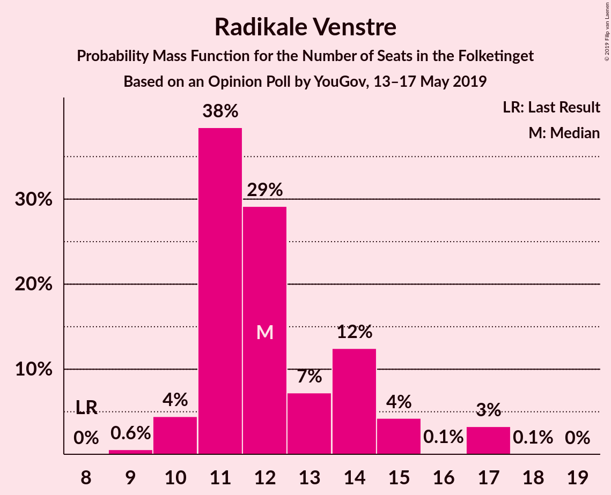
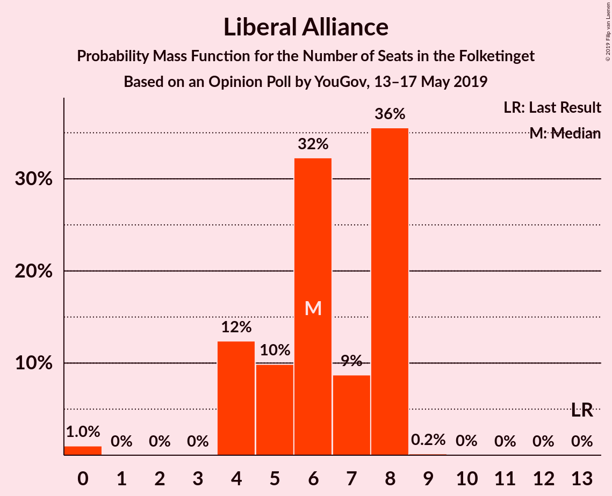
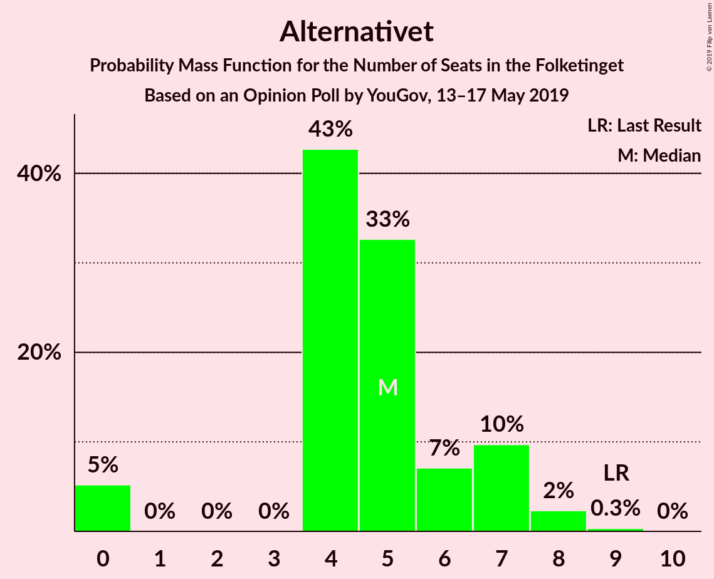
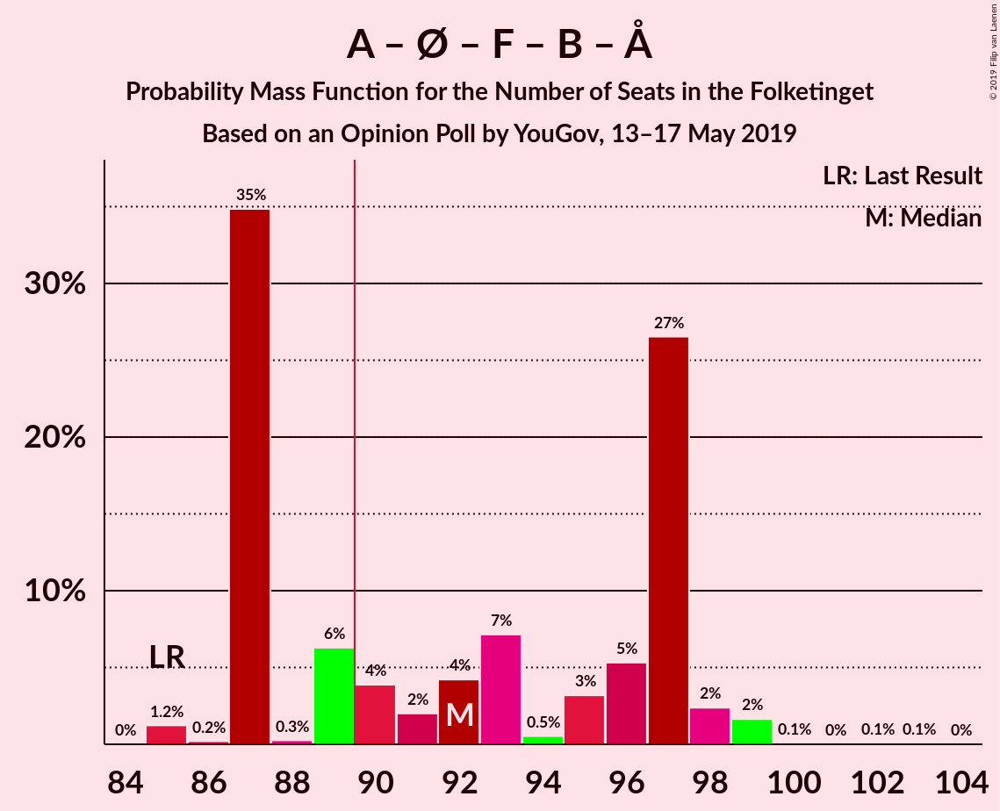
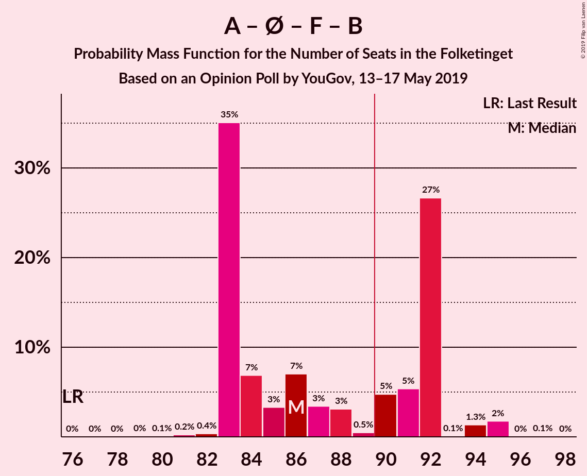
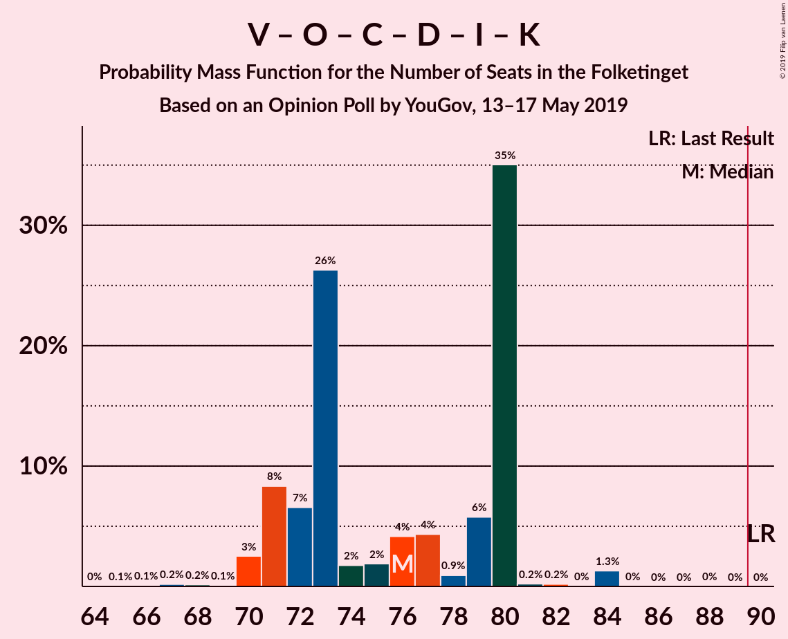
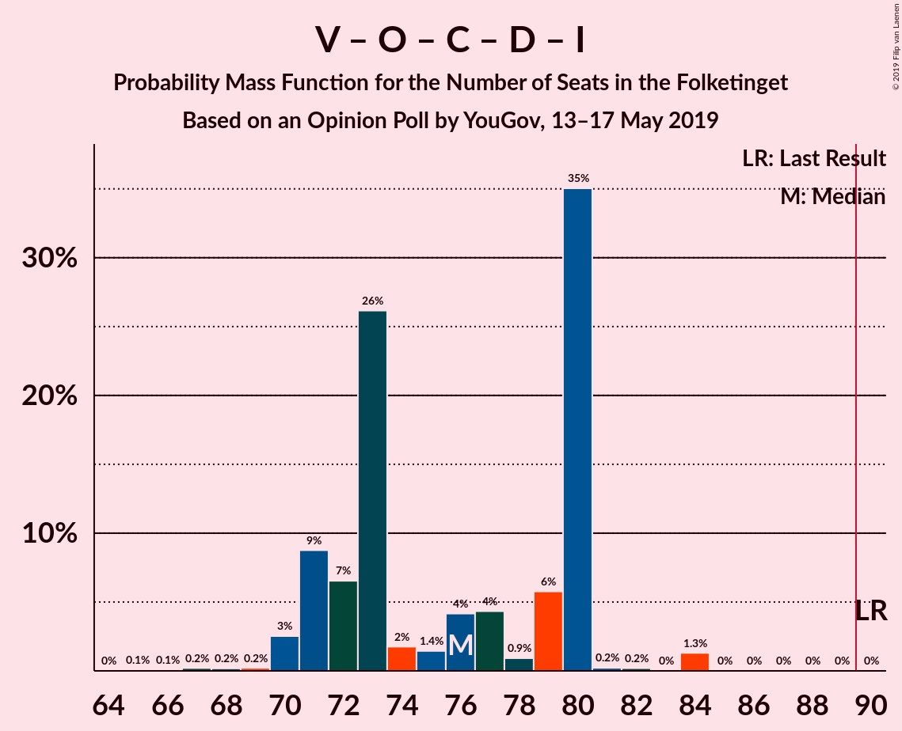
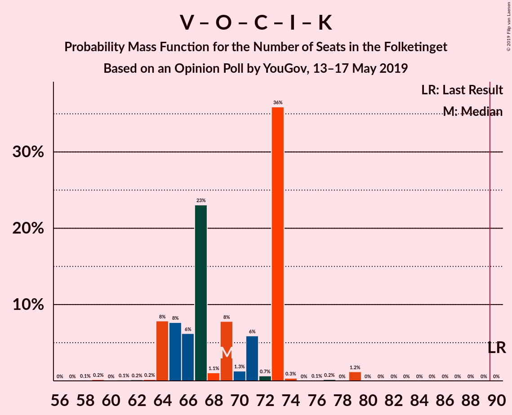

# Opinion Poll by YouGov, 13–17 May 2019

<a href="#voting-intentions">Voting Intentions</a> | <a href="#seats">Seats</a> | <a href="#coalitions">Coalitions</a> | <a href="#technical-information">Technical Information</a>

## Voting Intentions

### Confidence Intervals

| Party | Last Result | Poll Result | 80% Confidence Interval | 90% Confidence Interval | 95% Confidence Interval | 99% Confidence Interval |
|:-----:|:-----------:|:-----------:|:-----------------------:|:-----------------------:|:-----------------------:|:-----------------------:|
| Socialdemokraterne | 26.3% | 24.8% | 23.0–26.6% |22.6–27.1% |22.1–27.6% |21.4–28.5% |
| Venstre | 19.5% | 15.7% | 14.3–17.3% |13.9–17.8% |13.6–18.2% |12.9–18.9% |
| Dansk Folkeparti | 21.1% | 12.4% | 11.2–13.9% |10.8–14.3% |10.5–14.7% |9.9–15.4% |
| Enhedslisten–De Rød-Grønne | 7.8% | 9.1% | 8.0–10.4% |7.7–10.8% |7.5–11.1% |7.0–11.8% |
| Socialistisk Folkeparti | 4.2% | 8.6% | 7.6–9.9% |7.3–10.3% |7.0–10.6% |6.5–11.2% |
| Radikale Venstre | 4.6% | 7.0% | 6.0–8.2% |5.8–8.5% |5.5–8.8% |5.1–9.4% |
| Det Konservative Folkeparti | 3.4% | 6.8% | 5.9–7.9% |5.6–8.3% |5.4–8.6% |5.0–9.1% |
| Stram Kurs | 0.0% | 3.9% | 3.2–4.8% |3.0–5.1% |2.9–5.3% |2.6–5.8% |
| Nye Borgerlige | 0.0% | 3.8% | 3.1–4.7% |2.9–5.0% |2.8–5.2% |2.5–5.7% |
| Liberal Alliance | 7.5% | 3.1% | 2.5–3.9% |2.3–4.2% |2.2–4.4% |1.9–4.8% |
| Alternativet | 4.8% | 2.8% | 2.2–3.6% |2.0–3.8% |1.9–4.0% |1.7–4.4% |
| Klaus Riskær Pedersen | 0.0% | 1.0% | 0.7–1.6% |0.6–1.7% |0.6–1.9% |0.4–2.2% |
| Kristendemokraterne | 0.8% | 0.9% | 0.6–1.5% |0.5–1.6% |0.5–1.8% |0.4–2.0% |

*Note:* The poll result column reflects the actual value used in the calculations. Published results may vary slightly, and in addition be rounded to fewer digits.

## Seats

### Confidence Intervals

| Party | Last Result | Median | 80% Confidence Interval | 90% Confidence Interval | 95% Confidence Interval | 99% Confidence Interval |
|:-----:|:-----------:|:------:|:-----------------------:|:-----------------------:|:-----------------------:|:-----------------------:|
| <a href="#socialdemokraterne">Socialdemokraterne</a> | 47 | 43 | 42–49 |41–50 |41–50 |39–50 |
| <a href="#venstre">Venstre</a> | 34 | 27 | 26–32 |26–33 |26–33 |24–33 |
| <a href="#dansk-folkeparti">Dansk Folkeparti</a> | 37 | 22 | 19–24 |19–24 |18–28 |17–29 |
| <a href="#enhedslisten–de-rød-grønne">Enhedslisten–De Rød-Grønne</a> | 14 | 17 | 14–22 |13–22 |13–22 |12–22 |
| <a href="#socialistisk-folkeparti">Socialistisk Folkeparti</a> | 7 | 15 | 12–16 |12–17 |12–17 |12–19 |
| <a href="#radikale-venstre">Radikale Venstre</a> | 8 | 12 | 12–14 |11–15 |10–15 |10–15 |
| <a href="#det-konservative-folkeparti">Det Konservative Folkeparti</a> | 6 | 12 | 10–13 |10–13 |9–14 |9–15 |
| <a href="#stram-kurs">Stram Kurs</a> | 0 | 6 | 5–10 |5–10 |5–10 |4–10 |
| <a href="#nye-borgerlige">Nye Borgerlige</a> | 0 | 6 | 5–8 |5–9 |5–9 |5–10 |
| <a href="#liberal-alliance">Liberal Alliance</a> | 13 | 6 | 4–7 |4–7 |4–7 |0–8 |
| <a href="#alternativet">Alternativet</a> | 9 | 5 | 4–7 |4–7 |0–7 |0–9 |
| <a href="#klaus-riskær-pedersen">Klaus Riskær Pedersen</a> | 0 | 0 | 0 |0 |0 |0–4 |
| <a href="#kristendemokraterne">Kristendemokraterne</a> | 0 | 0 | 0 |0 |0 |0 |

### Socialdemokraterne

*For a full overview of the results for this party, see the [Socialdemokraterne](party-socialdemokraterne.html) page.*

| Number of Seats | Probability | Accumulated | Special Marks |
|:---------------:|:-----------:|:-----------:|:-------------:|
| 37 | 0.1% | 100% |  |
| 38 | 0.1% | 99.9% |  |
| 39 | 0.5% | 99.8% |  |
| 40 | 0.2% | 99.3% |  |
| 41 | 5% | 99.1% |  |
| 42 | 17% | 94% |  |
| 43 | 42% | 77% | Median |
| 44 | 12% | 35% |  |
| 45 | 0.4% | 24% |  |
| 46 | 0.2% | 23% |  |
| 47 | 8% | 23% | Last Result |
| 48 | 3% | 15% |  |
| 49 | 5% | 12% |  |
| 50 | 7% | 7% |  |
| 51 | 0% | 0.1% |  |
| 52 | 0% | 0% |  |

### Venstre

*For a full overview of the results for this party, see the [Venstre](party-venstre.html) page.*

| Number of Seats | Probability | Accumulated | Special Marks |
|:---------------:|:-----------:|:-----------:|:-------------:|
| 20 | 0.1% | 100% |  |
| 21 | 0.1% | 99.9% |  |
| 22 | 0.2% | 99.8% |  |
| 23 | 0.2% | 99.7% |  |
| 24 | 0.6% | 99.5% |  |
| 25 | 0.4% | 98.9% |  |
| 26 | 42% | 98.5% |  |
| 27 | 28% | 57% | Median |
| 28 | 1.0% | 29% |  |
| 29 | 12% | 28% |  |
| 30 | 2% | 16% |  |
| 31 | 2% | 14% |  |
| 32 | 2% | 12% |  |
| 33 | 10% | 10% |  |
| 34 | 0% | 0% | Last Result |

### Dansk Folkeparti

*For a full overview of the results for this party, see the [Dansk Folkeparti](party-danskfolkeparti.html) page.*

| Number of Seats | Probability | Accumulated | Special Marks |
|:---------------:|:-----------:|:-----------:|:-------------:|
| 16 | 0.1% | 100% |  |
| 17 | 0.5% | 99.9% |  |
| 18 | 3% | 99.4% |  |
| 19 | 12% | 97% |  |
| 20 | 10% | 85% |  |
| 21 | 2% | 74% |  |
| 22 | 52% | 73% | Median |
| 23 | 6% | 20% |  |
| 24 | 11% | 15% |  |
| 25 | 0.2% | 4% |  |
| 26 | 0.7% | 3% |  |
| 27 | 0.1% | 3% |  |
| 28 | 0% | 3% |  |
| 29 | 2% | 2% |  |
| 30 | 0% | 0% |  |
| 31 | 0% | 0% |  |
| 32 | 0% | 0% |  |
| 33 | 0% | 0% |  |
| 34 | 0% | 0% |  |
| 35 | 0% | 0% |  |
| 36 | 0% | 0% |  |
| 37 | 0% | 0% | Last Result |

### Enhedslisten–De Rød-Grønne

*For a full overview of the results for this party, see the [Enhedslisten–De Rød-Grønne](party-enhedslisten–derød-grønne.html) page.*

| Number of Seats | Probability | Accumulated | Special Marks |
|:---------------:|:-----------:|:-----------:|:-------------:|
| 11 | 0.2% | 100% |  |
| 12 | 0.4% | 99.8% |  |
| 13 | 8% | 99.4% |  |
| 14 | 21% | 92% | Last Result |
| 15 | 3% | 71% |  |
| 16 | 11% | 68% |  |
| 17 | 7% | 57% | Median |
| 18 | 0.6% | 50% |  |
| 19 | 7% | 49% |  |
| 20 | 0.3% | 42% |  |
| 21 | 0.1% | 41% |  |
| 22 | 41% | 41% |  |
| 23 | 0% | 0% |  |

### Socialistisk Folkeparti

*For a full overview of the results for this party, see the [Socialistisk Folkeparti](party-socialistiskfolkeparti.html) page.*

| Number of Seats | Probability | Accumulated | Special Marks |
|:---------------:|:-----------:|:-----------:|:-------------:|
| 7 | 0% | 100% | Last Result |
| 8 | 0% | 100% |  |
| 9 | 0% | 100% |  |
| 10 | 0% | 100% |  |
| 11 | 0.1% | 100% |  |
| 12 | 11% | 99.9% |  |
| 13 | 0.5% | 89% |  |
| 14 | 5% | 88% |  |
| 15 | 60% | 83% | Median |
| 16 | 14% | 23% |  |
| 17 | 8% | 9% |  |
| 18 | 0.6% | 1.2% |  |
| 19 | 0.2% | 0.6% |  |
| 20 | 0.2% | 0.4% |  |
| 21 | 0.2% | 0.2% |  |
| 22 | 0% | 0% |  |

### Radikale Venstre

*For a full overview of the results for this party, see the [Radikale Venstre](party-radikalevenstre.html) page.*

| Number of Seats | Probability | Accumulated | Special Marks |
|:---------------:|:-----------:|:-----------:|:-------------:|
| 8 | 0% | 100% | Last Result |
| 9 | 0.4% | 100% |  |
| 10 | 2% | 99.6% |  |
| 11 | 3% | 97% |  |
| 12 | 53% | 94% | Median |
| 13 | 12% | 41% |  |
| 14 | 21% | 29% |  |
| 15 | 7% | 7% |  |
| 16 | 0.1% | 0.2% |  |
| 17 | 0.1% | 0.1% |  |
| 18 | 0% | 0% |  |

### Det Konservative Folkeparti

*For a full overview of the results for this party, see the [Det Konservative Folkeparti](party-detkonservativefolkeparti.html) page.*

| Number of Seats | Probability | Accumulated | Special Marks |
|:---------------:|:-----------:|:-----------:|:-------------:|
| 6 | 0% | 100% | Last Result |
| 7 | 0% | 100% |  |
| 8 | 0% | 100% |  |
| 9 | 3% | 100% |  |
| 10 | 11% | 97% |  |
| 11 | 8% | 86% |  |
| 12 | 30% | 78% | Median |
| 13 | 44% | 48% |  |
| 14 | 3% | 4% |  |
| 15 | 0.4% | 0.8% |  |
| 16 | 0.3% | 0.4% |  |
| 17 | 0.1% | 0.1% |  |
| 18 | 0% | 0% |  |

### Stram Kurs

*For a full overview of the results for this party, see the [Stram Kurs](party-stramkurs.html) page.*

| Number of Seats | Probability | Accumulated | Special Marks |
|:---------------:|:-----------:|:-----------:|:-------------:|
| 0 | 0% | 100% | Last Result |
| 1 | 0% | 100% |  |
| 2 | 0% | 100% |  |
| 3 | 0% | 100% |  |
| 4 | 2% | 100% |  |
| 5 | 44% | 98% |  |
| 6 | 6% | 53% | Median |
| 7 | 27% | 47% |  |
| 8 | 8% | 20% |  |
| 9 | 1.4% | 12% |  |
| 10 | 11% | 11% |  |
| 11 | 0% | 0% |  |

### Nye Borgerlige

*For a full overview of the results for this party, see the [Nye Borgerlige](party-nyeborgerlige.html) page.*

| Number of Seats | Probability | Accumulated | Special Marks |
|:---------------:|:-----------:|:-----------:|:-------------:|
| 0 | 0% | 100% | Last Result |
| 1 | 0% | 100% |  |
| 2 | 0% | 100% |  |
| 3 | 0% | 100% |  |
| 4 | 0.2% | 100% |  |
| 5 | 16% | 99.7% |  |
| 6 | 45% | 84% | Median |
| 7 | 22% | 38% |  |
| 8 | 11% | 17% |  |
| 9 | 5% | 6% |  |
| 10 | 0.7% | 0.8% |  |
| 11 | 0% | 0.1% |  |
| 12 | 0% | 0% |  |

### Liberal Alliance

*For a full overview of the results for this party, see the [Liberal Alliance](party-liberalalliance.html) page.*

| Number of Seats | Probability | Accumulated | Special Marks |
|:---------------:|:-----------:|:-----------:|:-------------:|
| 0 | 2% | 100% |  |
| 1 | 0% | 98% |  |
| 2 | 0% | 98% |  |
| 3 | 0% | 98% |  |
| 4 | 22% | 98% |  |
| 5 | 10% | 76% |  |
| 6 | 54% | 66% | Median |
| 7 | 11% | 12% |  |
| 8 | 1.0% | 1.1% |  |
| 9 | 0.1% | 0.1% |  |
| 10 | 0% | 0% |  |
| 11 | 0% | 0% |  |
| 12 | 0% | 0% |  |
| 13 | 0% | 0% | Last Result |

### Alternativet

*For a full overview of the results for this party, see the [Alternativet](party-alternativet.html) page.*

| Number of Seats | Probability | Accumulated | Special Marks |
|:---------------:|:-----------:|:-----------:|:-------------:|
| 0 | 3% | 100% |  |
| 1 | 0% | 97% |  |
| 2 | 0% | 97% |  |
| 3 | 0% | 97% |  |
| 4 | 13% | 97% |  |
| 5 | 53% | 84% | Median |
| 6 | 11% | 31% |  |
| 7 | 18% | 20% |  |
| 8 | 2% | 2% |  |
| 9 | 0.5% | 0.5% | Last Result |
| 10 | 0% | 0% |  |

### Klaus Riskær Pedersen

*For a full overview of the results for this party, see the [Klaus Riskær Pedersen](party-klausriskærpedersen.html) page.*

| Number of Seats | Probability | Accumulated | Special Marks |
|:---------------:|:-----------:|:-----------:|:-------------:|
| 0 | 98.7% | 100% | Last Result, Median |
| 1 | 0% | 1.3% |  |
| 2 | 0% | 1.3% |  |
| 3 | 0% | 1.3% |  |
| 4 | 1.2% | 1.3% |  |
| 5 | 0.1% | 0.1% |  |
| 6 | 0% | 0% |  |

### Kristendemokraterne

*For a full overview of the results for this party, see the [Kristendemokraterne](party-kristendemokraterne.html) page.*

| Number of Seats | Probability | Accumulated | Special Marks |
|:---------------:|:-----------:|:-----------:|:-------------:|
| 0 | 99.9% | 100% | Last Result, Median |
| 1 | 0% | 0.1% |  |
| 2 | 0% | 0.1% |  |
| 3 | 0% | 0.1% |  |
| 4 | 0.1% | 0.1% |  |
| 5 | 0% | 0% |  |

## Coalitions

### Confidence Intervals

| Coalition | Last Result | Median | Majority? | 80% Confidence Interval | 90% Confidence Interval | 95% Confidence Interval | 99% Confidence Interval |
|:---------:|:-----------:|:------:|:---------:|:-----------------------:|:-----------------------:|:-----------------------:|:-----------------------:|
| Socialdemokraterne – Enhedslisten–De Rød-Grønne – Socialistisk Folkeparti – Radikale Venstre – Alternativet | 85 | 97 | 86% | 89–97 | 89–98 | 86–99 | 85–99 |
| Socialdemokraterne – Enhedslisten–De Rød-Grønne – Socialistisk Folkeparti – Radikale Venstre | 76 | 92 | 67% | 84–92 | 84–94 | 84–95 | 82–95 |
| Venstre – Dansk Folkeparti – Det Konservative Folkeparti – Stram Kurs – Nye Borgerlige – Liberal Alliance – Klaus Riskær Pedersen – Kristendemokraterne | 90 | 78 | 2% | 78–86 | 77–86 | 76–89 | 76–90 |
| Socialdemokraterne – Enhedslisten–De Rød-Grønne – Socialistisk Folkeparti – Alternativet | 77 | 84 | 0.1% | 75–85 | 75–86 | 74–87 | 73–87 |
| Venstre – Dansk Folkeparti – Det Konservative Folkeparti – Nye Borgerlige – Liberal Alliance – Klaus Riskær Pedersen – Kristendemokraterne | 90 | 73 | 0% | 71–79 | 70–79 | 70–82 | 70–84 |
| Venstre – Dansk Folkeparti – Det Konservative Folkeparti – Nye Borgerlige – Liberal Alliance – Klaus Riskær Pedersen | 90 | 73 | 0% | 71–79 | 70–79 | 70–82 | 70–84 |
| Venstre – Dansk Folkeparti – Det Konservative Folkeparti – Nye Borgerlige – Liberal Alliance – Kristendemokraterne | 90 | 73 | 0% | 71–79 | 70–79 | 70–82 | 67–84 |
| Venstre – Dansk Folkeparti – Det Konservative Folkeparti – Nye Borgerlige – Liberal Alliance | 90 | 73 | 0% | 71–79 | 70–79 | 70–82 | 67–84 |
| Socialdemokraterne – Enhedslisten–De Rød-Grønne – Socialistisk Folkeparti | 68 | 80 | 0% | 70–80 | 70–82 | 70–82 | 69–83 |
| Socialdemokraterne – Socialistisk Folkeparti – Radikale Venstre | 62 | 70 | 0% | 70–76 | 70–79 | 68–79 | 66–79 |
| Venstre – Dansk Folkeparti – Det Konservative Folkeparti – Liberal Alliance – Kristendemokraterne | 90 | 67 | 0% | 64–71 | 64–71 | 64–77 | 61–79 |
| Venstre – Dansk Folkeparti – Det Konservative Folkeparti – Liberal Alliance | 90 | 67 | 0% | 64–71 | 64–71 | 64–77 | 61–79 |
| Socialdemokraterne – Radikale Venstre | 55 | 56 | 0% | 55–62 | 54–62 | 54–62 | 52–62 |
| Venstre – Det Konservative Folkeparti – Liberal Alliance | 53 | 45 | 0% | 41–51 | 41–51 | 41–51 | 40–51 |
| Venstre – Det Konservative Folkeparti | 40 | 39 | 0% | 37–45 | 37–45 | 36–45 | 35–45 |
| Venstre | 34 | 27 | 0% | 26–32 | 26–33 | 26–33 | 24–33 |

### Socialdemokraterne – Enhedslisten–De Rød-Grønne – Socialistisk Folkeparti – Radikale Venstre – Alternativet

| Number of Seats | Probability | Accumulated | Special Marks |
|:---------------:|:-----------:|:-----------:|:-------------:|
| 85 | 2% | 100% | Last Result |
| 86 | 0.3% | 98% |  |
| 87 | 0.1% | 97% |  |
| 88 | 0.1% | 97% |  |
| 89 | 11% | 97% |  |
| 90 | 1.3% | 86% | Majority |
| 91 | 0.5% | 85% |  |
| 92 | 2% | 85% | Median |
| 93 | 11% | 83% |  |
| 94 | 0.3% | 72% |  |
| 95 | 5% | 72% |  |
| 96 | 10% | 67% |  |
| 97 | 49% | 57% |  |
| 98 | 4% | 8% |  |
| 99 | 3% | 3% |  |
| 100 | 0% | 0.2% |  |
| 101 | 0% | 0.2% |  |
| 102 | 0.1% | 0.2% |  |
| 103 | 0.1% | 0.1% |  |
| 104 | 0% | 0% |  |

### Socialdemokraterne – Enhedslisten–De Rød-Grønne – Socialistisk Folkeparti – Radikale Venstre

| Number of Seats | Probability | Accumulated | Special Marks |
|:---------------:|:-----------:|:-----------:|:-------------:|
| 76 | 0% | 100% | Last Result |
| 77 | 0% | 100% |  |
| 78 | 0% | 100% |  |
| 79 | 0% | 100% |  |
| 80 | 0.1% | 99.9% |  |
| 81 | 0% | 99.8% |  |
| 82 | 0.6% | 99.8% |  |
| 83 | 0.1% | 99.2% |  |
| 84 | 12% | 99.1% |  |
| 85 | 3% | 87% |  |
| 86 | 11% | 84% |  |
| 87 | 0.4% | 73% | Median |
| 88 | 5% | 73% |  |
| 89 | 0.5% | 67% |  |
| 90 | 3% | 67% | Majority |
| 91 | 9% | 64% |  |
| 92 | 49% | 55% |  |
| 93 | 0.1% | 6% |  |
| 94 | 2% | 6% |  |
| 95 | 3% | 3% |  |
| 96 | 0% | 0.1% |  |
| 97 | 0.1% | 0.1% |  |
| 98 | 0% | 0% |  |

### Venstre – Dansk Folkeparti – Det Konservative Folkeparti – Stram Kurs – Nye Borgerlige – Liberal Alliance – Klaus Riskær Pedersen – Kristendemokraterne

| Number of Seats | Probability | Accumulated | Special Marks |
|:---------------:|:-----------:|:-----------:|:-------------:|
| 72 | 0.1% | 100% |  |
| 73 | 0.1% | 99.9% |  |
| 74 | 0% | 99.8% |  |
| 75 | 0% | 99.8% |  |
| 76 | 3% | 99.8% |  |
| 77 | 4% | 97% |  |
| 78 | 49% | 92% |  |
| 79 | 10% | 43% | Median |
| 80 | 5% | 33% |  |
| 81 | 0.3% | 28% |  |
| 82 | 11% | 28% |  |
| 83 | 2% | 17% |  |
| 84 | 0.5% | 15% |  |
| 85 | 1.3% | 15% |  |
| 86 | 11% | 14% |  |
| 87 | 0.1% | 3% |  |
| 88 | 0.1% | 3% |  |
| 89 | 0.3% | 3% |  |
| 90 | 2% | 2% | Last Result, Majority |
| 91 | 0% | 0% |  |

### Socialdemokraterne – Enhedslisten–De Rød-Grønne – Socialistisk Folkeparti – Alternativet

| Number of Seats | Probability | Accumulated | Special Marks |
|:---------------:|:-----------:|:-----------:|:-------------:|
| 72 | 0% | 100% |  |
| 73 | 2% | 99.9% |  |
| 74 | 0.2% | 98% |  |
| 75 | 10% | 97% |  |
| 76 | 0.8% | 87% |  |
| 77 | 1.1% | 86% | Last Result |
| 78 | 0.3% | 85% |  |
| 79 | 11% | 85% |  |
| 80 | 7% | 74% | Median |
| 81 | 0.3% | 67% |  |
| 82 | 0.5% | 67% |  |
| 83 | 2% | 67% |  |
| 84 | 15% | 64% |  |
| 85 | 41% | 49% |  |
| 86 | 5% | 8% |  |
| 87 | 2% | 3% |  |
| 88 | 0.1% | 0.2% |  |
| 89 | 0% | 0.1% |  |
| 90 | 0% | 0.1% | Majority |
| 91 | 0% | 0.1% |  |
| 92 | 0.1% | 0.1% |  |
| 93 | 0% | 0% |  |

### Venstre – Dansk Folkeparti – Det Konservative Folkeparti – Nye Borgerlige – Liberal Alliance – Klaus Riskær Pedersen – Kristendemokraterne

| Number of Seats | Probability | Accumulated | Special Marks |
|:---------------:|:-----------:|:-----------:|:-------------:|
| 65 | 0.1% | 100% |  |
| 66 | 0.1% | 99.9% |  |
| 67 | 0% | 99.8% |  |
| 68 | 0.1% | 99.8% |  |
| 69 | 0% | 99.7% |  |
| 70 | 5% | 99.7% |  |
| 71 | 15% | 95% |  |
| 72 | 11% | 80% |  |
| 73 | 48% | 68% | Median |
| 74 | 2% | 20% |  |
| 75 | 0.7% | 18% |  |
| 76 | 3% | 17% |  |
| 77 | 0.3% | 14% |  |
| 78 | 0.3% | 14% |  |
| 79 | 10% | 14% |  |
| 80 | 0.1% | 3% |  |
| 81 | 0.4% | 3% |  |
| 82 | 0.1% | 3% |  |
| 83 | 0% | 2% |  |
| 84 | 2% | 2% |  |
| 85 | 0% | 0% |  |
| 86 | 0% | 0% |  |
| 87 | 0% | 0% |  |
| 88 | 0% | 0% |  |
| 89 | 0% | 0% |  |
| 90 | 0% | 0% | Last Result, Majority |

### Venstre – Dansk Folkeparti – Det Konservative Folkeparti – Nye Borgerlige – Liberal Alliance – Klaus Riskær Pedersen

| Number of Seats | Probability | Accumulated | Special Marks |
|:---------------:|:-----------:|:-----------:|:-------------:|
| 65 | 0.1% | 100% |  |
| 66 | 0.1% | 99.9% |  |
| 67 | 0.1% | 99.8% |  |
| 68 | 0.1% | 99.8% |  |
| 69 | 0.1% | 99.7% |  |
| 70 | 5% | 99.6% |  |
| 71 | 15% | 95% |  |
| 72 | 11% | 80% |  |
| 73 | 48% | 68% | Median |
| 74 | 2% | 20% |  |
| 75 | 0.7% | 18% |  |
| 76 | 3% | 17% |  |
| 77 | 0.3% | 14% |  |
| 78 | 0.3% | 14% |  |
| 79 | 10% | 14% |  |
| 80 | 0.1% | 3% |  |
| 81 | 0.4% | 3% |  |
| 82 | 0.1% | 3% |  |
| 83 | 0% | 2% |  |
| 84 | 2% | 2% |  |
| 85 | 0% | 0% |  |
| 86 | 0% | 0% |  |
| 87 | 0% | 0% |  |
| 88 | 0% | 0% |  |
| 89 | 0% | 0% |  |
| 90 | 0% | 0% | Last Result, Majority |

### Venstre – Dansk Folkeparti – Det Konservative Folkeparti – Nye Borgerlige – Liberal Alliance – Kristendemokraterne

| Number of Seats | Probability | Accumulated | Special Marks |
|:---------------:|:-----------:|:-----------:|:-------------:|
| 65 | 0.1% | 100% |  |
| 66 | 0.2% | 99.9% |  |
| 67 | 0.3% | 99.8% |  |
| 68 | 0.1% | 99.4% |  |
| 69 | 0.1% | 99.4% |  |
| 70 | 5% | 99.3% |  |
| 71 | 15% | 95% |  |
| 72 | 12% | 80% |  |
| 73 | 48% | 67% | Median |
| 74 | 2% | 19% |  |
| 75 | 0.7% | 17% |  |
| 76 | 2% | 16% |  |
| 77 | 0.3% | 14% |  |
| 78 | 0.2% | 14% |  |
| 79 | 10% | 13% |  |
| 80 | 0.1% | 3% |  |
| 81 | 0.4% | 3% |  |
| 82 | 0.1% | 3% |  |
| 83 | 0% | 2% |  |
| 84 | 2% | 2% |  |
| 85 | 0% | 0% |  |
| 86 | 0% | 0% |  |
| 87 | 0% | 0% |  |
| 88 | 0% | 0% |  |
| 89 | 0% | 0% |  |
| 90 | 0% | 0% | Last Result, Majority |

### Venstre – Dansk Folkeparti – Det Konservative Folkeparti – Nye Borgerlige – Liberal Alliance

| Number of Seats | Probability | Accumulated | Special Marks |
|:---------------:|:-----------:|:-----------:|:-------------:|
| 65 | 0.1% | 100% |  |
| 66 | 0.2% | 99.9% |  |
| 67 | 0.4% | 99.8% |  |
| 68 | 0.1% | 99.4% |  |
| 69 | 0.1% | 99.3% |  |
| 70 | 5% | 99.2% |  |
| 71 | 15% | 95% |  |
| 72 | 12% | 79% |  |
| 73 | 48% | 67% | Median |
| 74 | 2% | 19% |  |
| 75 | 0.7% | 17% |  |
| 76 | 2% | 16% |  |
| 77 | 0.3% | 14% |  |
| 78 | 0.2% | 14% |  |
| 79 | 10% | 13% |  |
| 80 | 0.1% | 3% |  |
| 81 | 0.4% | 3% |  |
| 82 | 0.1% | 3% |  |
| 83 | 0% | 2% |  |
| 84 | 2% | 2% |  |
| 85 | 0% | 0% |  |
| 86 | 0% | 0% |  |
| 87 | 0% | 0% |  |
| 88 | 0% | 0% |  |
| 89 | 0% | 0% |  |
| 90 | 0% | 0% | Last Result, Majority |

### Socialdemokraterne – Enhedslisten–De Rød-Grønne – Socialistisk Folkeparti

| Number of Seats | Probability | Accumulated | Special Marks |
|:---------------:|:-----------:|:-----------:|:-------------:|
| 67 | 0% | 100% |  |
| 68 | 0.2% | 99.9% | Last Result |
| 69 | 0.3% | 99.7% |  |
| 70 | 10% | 99.4% |  |
| 71 | 0.2% | 89% |  |
| 72 | 13% | 89% |  |
| 73 | 8% | 76% |  |
| 74 | 0.2% | 68% |  |
| 75 | 0.9% | 68% | Median |
| 76 | 2% | 67% |  |
| 77 | 0.6% | 65% |  |
| 78 | 8% | 65% |  |
| 79 | 0.8% | 57% |  |
| 80 | 51% | 56% |  |
| 81 | 0.1% | 5% |  |
| 82 | 3% | 5% |  |
| 83 | 2% | 2% |  |
| 84 | 0% | 0.1% |  |
| 85 | 0% | 0.1% |  |
| 86 | 0.1% | 0.1% |  |
| 87 | 0% | 0% |  |

### Socialdemokraterne – Socialistisk Folkeparti – Radikale Venstre

| Number of Seats | Probability | Accumulated | Special Marks |
|:---------------:|:-----------:|:-----------:|:-------------:|
| 62 | 0% | 100% | Last Result |
| 63 | 0.1% | 100% |  |
| 64 | 0% | 99.9% |  |
| 65 | 0.4% | 99.9% |  |
| 66 | 0.1% | 99.6% |  |
| 67 | 0.3% | 99.5% |  |
| 68 | 2% | 99.2% |  |
| 69 | 0.9% | 97% |  |
| 70 | 54% | 96% | Median |
| 71 | 5% | 42% |  |
| 72 | 13% | 37% |  |
| 73 | 2% | 24% |  |
| 74 | 0.5% | 22% |  |
| 75 | 10% | 21% |  |
| 76 | 3% | 11% |  |
| 77 | 0.8% | 8% |  |
| 78 | 0.1% | 7% |  |
| 79 | 7% | 7% |  |
| 80 | 0% | 0.1% |  |
| 81 | 0% | 0% |  |

### Venstre – Dansk Folkeparti – Det Konservative Folkeparti – Liberal Alliance – Kristendemokraterne

| Number of Seats | Probability | Accumulated | Special Marks |
|:---------------:|:-----------:|:-----------:|:-------------:|
| 58 | 0.1% | 100% |  |
| 59 | 0.3% | 99.9% |  |
| 60 | 0% | 99.7% |  |
| 61 | 0.2% | 99.6% |  |
| 62 | 0.1% | 99.4% |  |
| 63 | 0.2% | 99.3% |  |
| 64 | 14% | 99.1% |  |
| 65 | 14% | 85% |  |
| 66 | 10% | 71% |  |
| 67 | 43% | 61% | Median |
| 68 | 0.4% | 18% |  |
| 69 | 3% | 18% |  |
| 70 | 2% | 15% |  |
| 71 | 10% | 13% |  |
| 72 | 0.5% | 3% |  |
| 73 | 0.1% | 3% |  |
| 74 | 0.1% | 3% |  |
| 75 | 0% | 3% |  |
| 76 | 0.1% | 3% |  |
| 77 | 0.3% | 3% |  |
| 78 | 0% | 2% |  |
| 79 | 2% | 2% |  |
| 80 | 0% | 0% |  |
| 81 | 0% | 0% |  |
| 82 | 0% | 0% |  |
| 83 | 0% | 0% |  |
| 84 | 0% | 0% |  |
| 85 | 0% | 0% |  |
| 86 | 0% | 0% |  |
| 87 | 0% | 0% |  |
| 88 | 0% | 0% |  |
| 89 | 0% | 0% |  |
| 90 | 0% | 0% | Last Result, Majority |

### Venstre – Dansk Folkeparti – Det Konservative Folkeparti – Liberal Alliance

| Number of Seats | Probability | Accumulated | Special Marks |
|:---------------:|:-----------:|:-----------:|:-------------:|
| 58 | 0.1% | 100% |  |
| 59 | 0.3% | 99.9% |  |
| 60 | 0% | 99.7% |  |
| 61 | 0.2% | 99.6% |  |
| 62 | 0.2% | 99.4% |  |
| 63 | 0.2% | 99.2% |  |
| 64 | 14% | 99.0% |  |
| 65 | 14% | 85% |  |
| 66 | 10% | 71% |  |
| 67 | 43% | 61% | Median |
| 68 | 0.4% | 18% |  |
| 69 | 3% | 18% |  |
| 70 | 2% | 15% |  |
| 71 | 10% | 13% |  |
| 72 | 0.5% | 3% |  |
| 73 | 0.1% | 3% |  |
| 74 | 0.1% | 3% |  |
| 75 | 0% | 3% |  |
| 76 | 0.1% | 3% |  |
| 77 | 0.3% | 3% |  |
| 78 | 0% | 2% |  |
| 79 | 2% | 2% |  |
| 80 | 0% | 0% |  |
| 81 | 0% | 0% |  |
| 82 | 0% | 0% |  |
| 83 | 0% | 0% |  |
| 84 | 0% | 0% |  |
| 85 | 0% | 0% |  |
| 86 | 0% | 0% |  |
| 87 | 0% | 0% |  |
| 88 | 0% | 0% |  |
| 89 | 0% | 0% |  |
| 90 | 0% | 0% | Last Result, Majority |

### Socialdemokraterne – Radikale Venstre

| Number of Seats | Probability | Accumulated | Special Marks |
|:---------------:|:-----------:|:-----------:|:-------------:|
| 48 | 0% | 100% |  |
| 49 | 0% | 99.9% |  |
| 50 | 0.3% | 99.9% |  |
| 51 | 0% | 99.6% |  |
| 52 | 0.5% | 99.5% |  |
| 53 | 0.4% | 99.1% |  |
| 54 | 4% | 98.7% |  |
| 55 | 42% | 94% | Last Result, Median |
| 56 | 16% | 52% |  |
| 57 | 3% | 37% |  |
| 58 | 13% | 34% |  |
| 59 | 0.3% | 21% |  |
| 60 | 10% | 21% |  |
| 61 | 0.3% | 11% |  |
| 62 | 10% | 11% |  |
| 63 | 0.1% | 0.1% |  |
| 64 | 0% | 0% |  |

### Venstre – Det Konservative Folkeparti – Liberal Alliance

| Number of Seats | Probability | Accumulated | Special Marks |
|:---------------:|:-----------:|:-----------:|:-------------:|
| 36 | 0.1% | 100% |  |
| 37 | 0.1% | 99.9% |  |
| 38 | 0% | 99.9% |  |
| 39 | 0.1% | 99.9% |  |
| 40 | 0.3% | 99.7% |  |
| 41 | 12% | 99.5% |  |
| 42 | 0.2% | 87% |  |
| 43 | 3% | 87% |  |
| 44 | 7% | 83% |  |
| 45 | 54% | 76% | Median |
| 46 | 4% | 22% |  |
| 47 | 3% | 18% |  |
| 48 | 3% | 15% |  |
| 49 | 0.4% | 13% |  |
| 50 | 2% | 12% |  |
| 51 | 10% | 10% |  |
| 52 | 0% | 0.3% |  |
| 53 | 0.2% | 0.2% | Last Result |
| 54 | 0% | 0.1% |  |
| 55 | 0% | 0% |  |

### Venstre – Det Konservative Folkeparti

| Number of Seats | Probability | Accumulated | Special Marks |
|:---------------:|:-----------:|:-----------:|:-------------:|
| 31 | 0.1% | 100% |  |
| 32 | 0.1% | 99.9% |  |
| 33 | 0.1% | 99.8% |  |
| 34 | 0% | 99.8% |  |
| 35 | 0.3% | 99.7% |  |
| 36 | 4% | 99.4% |  |
| 37 | 11% | 96% |  |
| 38 | 5% | 85% |  |
| 39 | 49% | 80% | Median |
| 40 | 0.5% | 31% | Last Result |
| 41 | 12% | 30% |  |
| 42 | 6% | 19% |  |
| 43 | 0.1% | 13% |  |
| 44 | 2% | 12% |  |
| 45 | 10% | 10% |  |
| 46 | 0.1% | 0.3% |  |
| 47 | 0.2% | 0.2% |  |
| 48 | 0% | 0% |  |

### Venstre

| Number of Seats | Probability | Accumulated | Special Marks |
|:---------------:|:-----------:|:-----------:|:-------------:|
| 20 | 0.1% | 100% |  |
| 21 | 0.1% | 99.9% |  |
| 22 | 0.2% | 99.8% |  |
| 23 | 0.2% | 99.7% |  |
| 24 | 0.6% | 99.5% |  |
| 25 | 0.4% | 98.9% |  |
| 26 | 42% | 98.5% |  |
| 27 | 28% | 57% | Median |
| 28 | 1.0% | 29% |  |
| 29 | 12% | 28% |  |
| 30 | 2% | 16% |  |
| 31 | 2% | 14% |  |
| 32 | 2% | 12% |  |
| 33 | 10% | 10% |  |
| 34 | 0% | 0% | Last Result |

## Technical Information

### Opinion Poll

+ **Polling firm:** YouGov
+ **Commissioner(s):** —
+ **Fieldwork period:** 13–17 May 2019

### Calculations

+ **Sample size:** 973
+ **Simulations done:** 524,288
+ **Error estimate:** 4.16%

