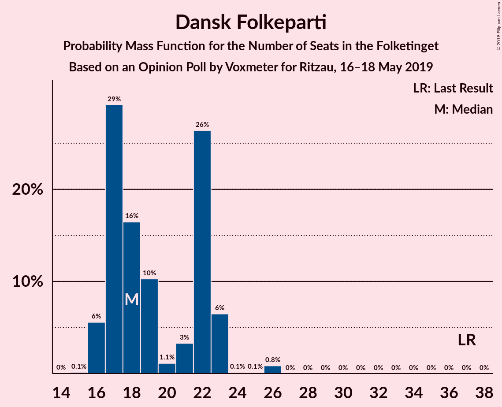
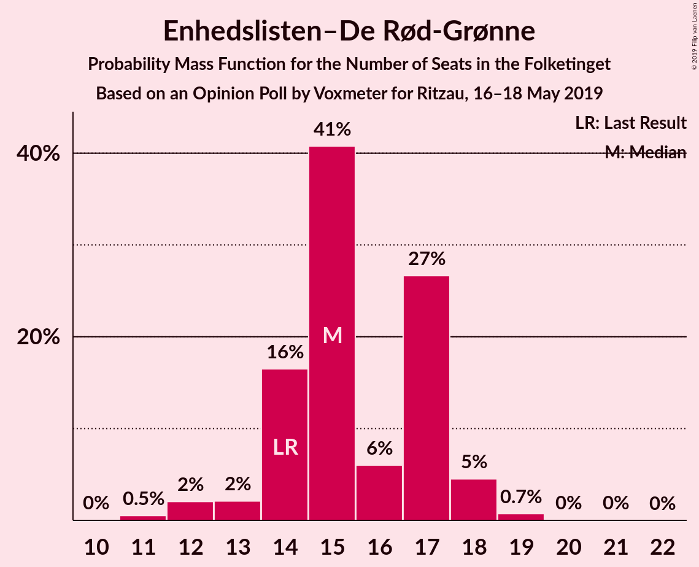
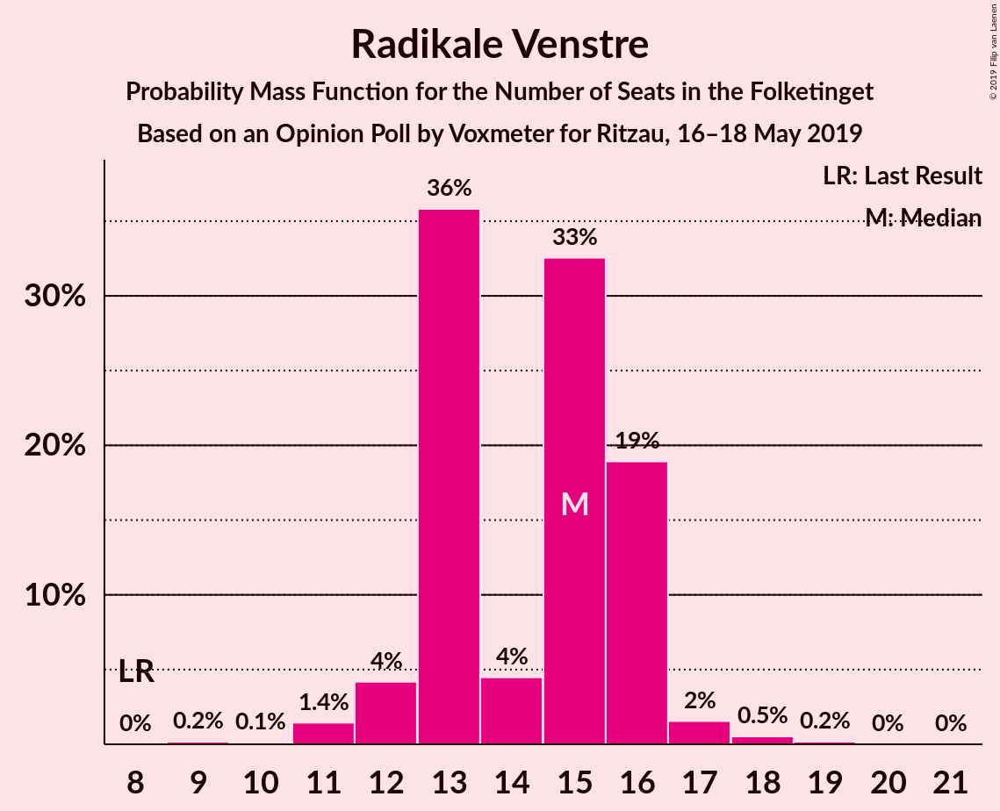
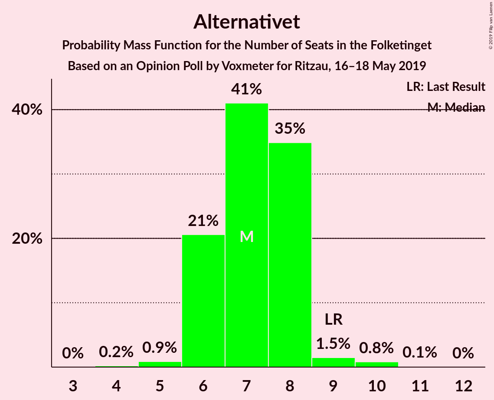
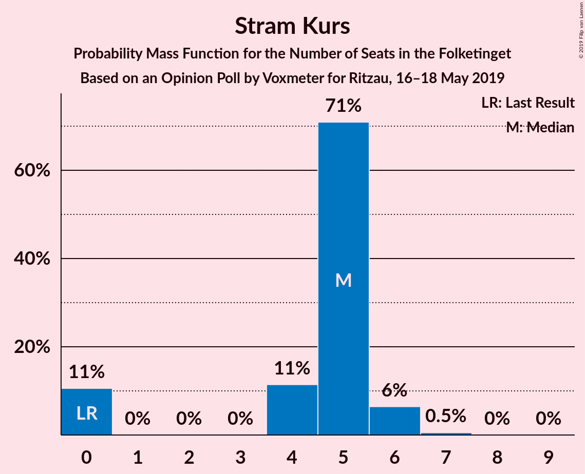
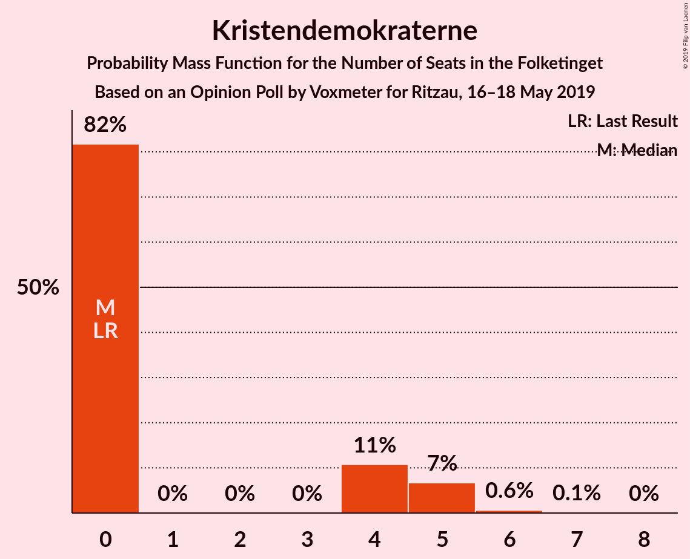
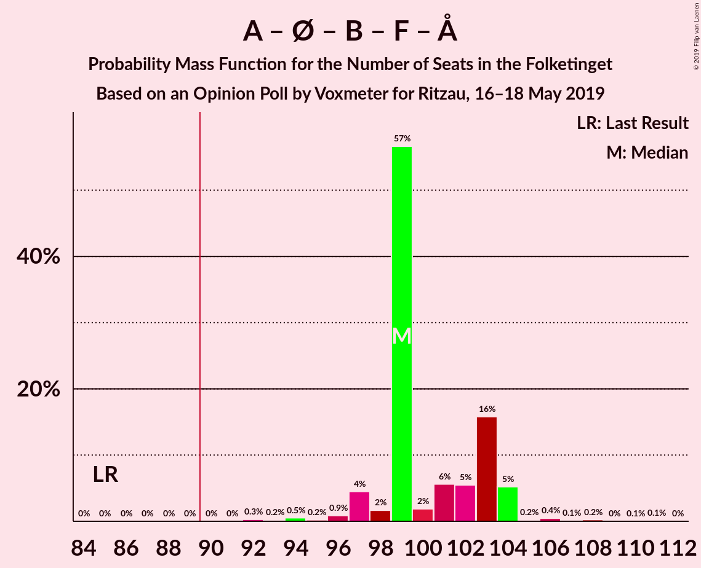
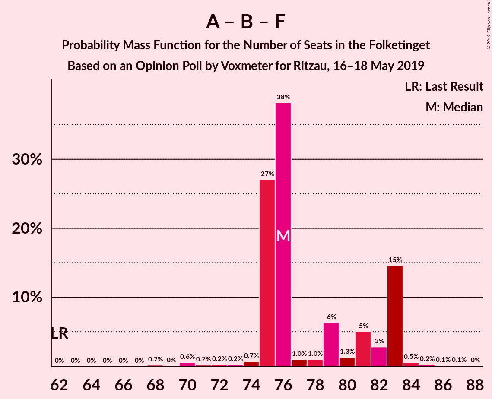
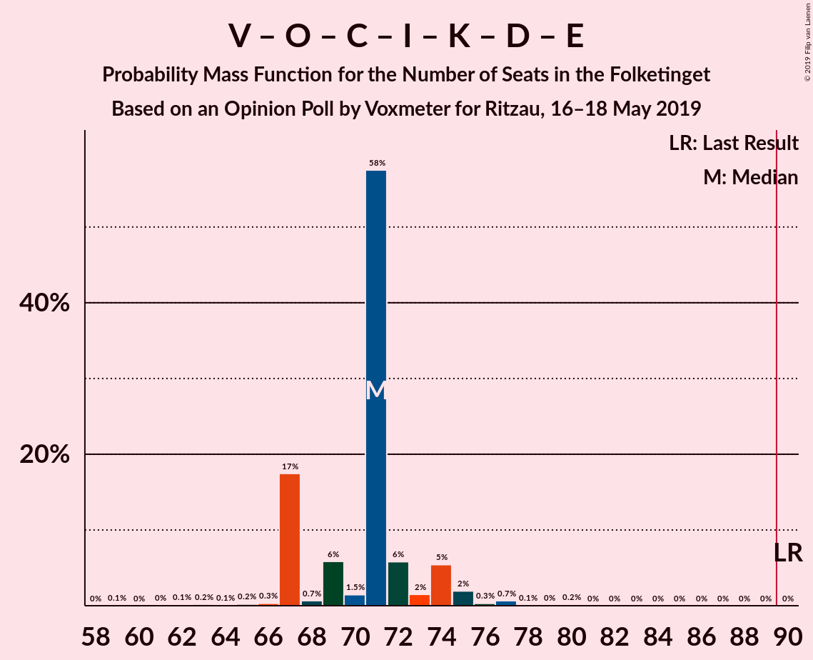
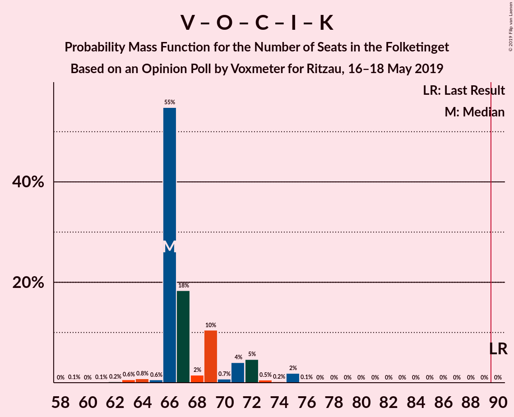

# Opinion Poll by Voxmeter for Ritzau, 16–18 May 2019

<a href="#voting-intentions">Voting Intentions</a> | <a href="#seats">Seats</a> | <a href="#coalitions">Coalitions</a> | <a href="#technical-information">Technical Information</a>

## Voting Intentions

### Confidence Intervals

| Party | Last Result | Poll Result | 80% Confidence Interval | 90% Confidence Interval | 95% Confidence Interval | 99% Confidence Interval |
|:-----:|:-----------:|:-----------:|:-----------------------:|:-----------------------:|:-----------------------:|:-----------------------:|
| Socialdemokraterne | 26.3% | 27.8% | 26.1–29.7% |25.6–30.2% |25.2–30.7% |24.3–31.6% |
| Venstre | 19.5% | 18.8% | 17.3–20.5% |16.9–21.0% |16.5–21.4% |15.8–22.2% |
| Dansk Folkeparti | 21.1% | 11.0% | 9.8–12.4% |9.5–12.8% |9.2–13.1% |8.7–13.8% |
| Enhedslisten–De Rød-Grønne | 7.8% | 8.4% | 7.4–9.6% |7.1–10.0% |6.9–10.3% |6.4–10.9% |
| Radikale Venstre | 4.6% | 8.1% | 7.1–9.3% |6.8–9.7% |6.6–10.0% |6.1–10.6% |
| Socialistisk Folkeparti | 4.2% | 7.6% | 6.6–8.8% |6.4–9.1% |6.1–9.4% |5.7–10.0% |
| Det Konservative Folkeparti | 3.4% | 4.1% | 3.4–5.0% |3.2–5.2% |3.0–5.5% |2.7–5.9% |
| Alternativet | 4.8% | 4.0% | 3.3–4.9% |3.1–5.1% |2.9–5.4% |2.6–5.8% |
| Liberal Alliance | 7.5% | 3.2% | 2.6–4.0% |2.4–4.2% |2.3–4.5% |2.0–4.9% |
| Stram Kurs | 0.0% | 2.4% | 1.9–3.1% |1.7–3.3% |1.6–3.5% |1.4–3.9% |
| Kristendemokraterne | 0.8% | 1.9% | 1.4–2.6% |1.3–2.8% |1.2–2.9% |1.0–3.3% |
| Nye Borgerlige | 0.0% | 1.9% | 1.4–2.6% |1.3–2.8% |1.2–2.9% |1.0–3.3% |
| Klaus Riskær Pedersen | 0.0% | 0.3% | 0.2–0.7% |0.1–0.8% |0.1–0.9% |0.1–1.1% |

*Note:* The poll result column reflects the actual value used in the calculations. Published results may vary slightly, and in addition be rounded to fewer digits.

## Seats

### Confidence Intervals

| Party | Last Result | Median | 80% Confidence Interval | 90% Confidence Interval | 95% Confidence Interval | 99% Confidence Interval |
|:-----:|:-----------:|:------:|:-----------------------:|:-----------------------:|:-----------------------:|:-----------------------:|
| <a href="#socialdemokraterne">Socialdemokraterne</a> | 47 | 50 | 46–52 |45–52 |45–52 |43–56 |
| <a href="#venstre">Venstre</a> | 34 | 32 | 27–39 |27–40 |27–42 |27–42 |
| <a href="#dansk-folkeparti">Dansk Folkeparti</a> | 37 | 20 | 17–23 |16–25 |16–26 |14–26 |
| <a href="#enhedslisten–de-rød-grønne">Enhedslisten–De Rød-Grønne</a> | 14 | 14 | 13–19 |12–19 |12–19 |11–19 |
| <a href="#radikale-venstre">Radikale Venstre</a> | 8 | 14 | 14–17 |12–18 |12–19 |11–19 |
| <a href="#socialistisk-folkeparti">Socialistisk Folkeparti</a> | 7 | 15 | 12–16 |10–18 |10–18 |9–18 |
| <a href="#det-konservative-folkeparti">Det Konservative Folkeparti</a> | 6 | 8 | 7–10 |6–10 |5–10 |5–11 |
| <a href="#alternativet">Alternativet</a> | 9 | 8 | 6–10 |5–11 |5–11 |4–11 |
| <a href="#liberal-alliance">Liberal Alliance</a> | 13 | 6 | 4–7 |4–7 |4–8 |4–10 |
| <a href="#stram-kurs">Stram Kurs</a> | 0 | 5 | 0–6 |0–6 |0–7 |0–7 |
| <a href="#kristendemokraterne">Kristendemokraterne</a> | 0 | 0 | 0–5 |0–5 |0–5 |0–6 |
| <a href="#nye-borgerlige">Nye Borgerlige</a> | 0 | 4 | 0–6 |0–6 |0–6 |0–6 |
| <a href="#klaus-riskær-pedersen">Klaus Riskær Pedersen</a> | 0 | 0 | 0 |0 |0 |0 |

### Socialdemokraterne

*For a full overview of the results for this party, see the [Socialdemokraterne](party-socialdemokraterne.html) page.*

| Number of Seats | Probability | Accumulated | Special Marks |
|:---------------:|:-----------:|:-----------:|:-------------:|
| 41 | 0.2% | 100% |  |
| 42 | 0% | 99.8% |  |
| 43 | 0.7% | 99.8% |  |
| 44 | 0.5% | 99.0% |  |
| 45 | 5% | 98.5% |  |
| 46 | 10% | 94% |  |
| 47 | 18% | 83% | Last Result |
| 48 | 2% | 66% |  |
| 49 | 13% | 64% |  |
| 50 | 6% | 51% | Median |
| 51 | 33% | 45% |  |
| 52 | 10% | 12% |  |
| 53 | 0.3% | 2% |  |
| 54 | 0.2% | 2% |  |
| 55 | 1.0% | 2% |  |
| 56 | 0.3% | 0.7% |  |
| 57 | 0.4% | 0.4% |  |
| 58 | 0% | 0% |  |

### Venstre

*For a full overview of the results for this party, see the [Venstre](party-venstre.html) page.*

| Number of Seats | Probability | Accumulated | Special Marks |
|:---------------:|:-----------:|:-----------:|:-------------:|
| 25 | 0.2% | 100% |  |
| 26 | 0% | 99.8% |  |
| 27 | 30% | 99.8% |  |
| 28 | 0.7% | 70% |  |
| 29 | 14% | 69% |  |
| 30 | 1.2% | 55% |  |
| 31 | 3% | 54% |  |
| 32 | 13% | 51% | Median |
| 33 | 5% | 38% |  |
| 34 | 11% | 33% | Last Result |
| 35 | 5% | 21% |  |
| 36 | 4% | 16% |  |
| 37 | 0.3% | 12% |  |
| 38 | 0.6% | 12% |  |
| 39 | 6% | 11% |  |
| 40 | 2% | 6% |  |
| 41 | 0.2% | 3% |  |
| 42 | 3% | 3% |  |
| 43 | 0% | 0% |  |

### Dansk Folkeparti

*For a full overview of the results for this party, see the [Dansk Folkeparti](party-danskfolkeparti.html) page.*

| Number of Seats | Probability | Accumulated | Special Marks |
|:---------------:|:-----------:|:-----------:|:-------------:|
| 14 | 2% | 100% |  |
| 15 | 0.2% | 98% |  |
| 16 | 4% | 98% |  |
| 17 | 6% | 94% |  |
| 18 | 26% | 89% |  |
| 19 | 7% | 62% |  |
| 20 | 31% | 56% | Median |
| 21 | 8% | 24% |  |
| 22 | 4% | 16% |  |
| 23 | 5% | 12% |  |
| 24 | 0.3% | 7% |  |
| 25 | 2% | 7% |  |
| 26 | 4% | 4% |  |
| 27 | 0% | 0% |  |
| 28 | 0% | 0% |  |
| 29 | 0% | 0% |  |
| 30 | 0% | 0% |  |
| 31 | 0% | 0% |  |
| 32 | 0% | 0% |  |
| 33 | 0% | 0% |  |
| 34 | 0% | 0% |  |
| 35 | 0% | 0% |  |
| 36 | 0% | 0% |  |
| 37 | 0% | 0% | Last Result |

### Enhedslisten–De Rød-Grønne

*For a full overview of the results for this party, see the [Enhedslisten–De Rød-Grønne](party-enhedslisten–derød-grønne.html) page.*

| Number of Seats | Probability | Accumulated | Special Marks |
|:---------------:|:-----------:|:-----------:|:-------------:|
| 10 | 0.1% | 100% |  |
| 11 | 0.7% | 99.9% |  |
| 12 | 7% | 99.3% |  |
| 13 | 11% | 92% |  |
| 14 | 34% | 81% | Last Result, Median |
| 15 | 20% | 47% |  |
| 16 | 4% | 27% |  |
| 17 | 1.0% | 23% |  |
| 18 | 5% | 22% |  |
| 19 | 17% | 17% |  |
| 20 | 0.1% | 0.3% |  |
| 21 | 0.1% | 0.1% |  |
| 22 | 0% | 0% |  |

### Radikale Venstre

*For a full overview of the results for this party, see the [Radikale Venstre](party-radikalevenstre.html) page.*

| Number of Seats | Probability | Accumulated | Special Marks |
|:---------------:|:-----------:|:-----------:|:-------------:|
| 8 | 0% | 100% | Last Result |
| 9 | 0% | 100% |  |
| 10 | 0% | 100% |  |
| 11 | 0.6% | 99.9% |  |
| 12 | 6% | 99.4% |  |
| 13 | 2% | 93% |  |
| 14 | 49% | 90% | Median |
| 15 | 8% | 42% |  |
| 16 | 11% | 34% |  |
| 17 | 17% | 23% |  |
| 18 | 3% | 6% |  |
| 19 | 3% | 3% |  |
| 20 | 0% | 0.1% |  |
| 21 | 0% | 0% |  |

### Socialistisk Folkeparti

*For a full overview of the results for this party, see the [Socialistisk Folkeparti](party-socialistiskfolkeparti.html) page.*

| Number of Seats | Probability | Accumulated | Special Marks |
|:---------------:|:-----------:|:-----------:|:-------------:|
| 7 | 0% | 100% | Last Result |
| 8 | 0% | 100% |  |
| 9 | 0.7% | 100% |  |
| 10 | 6% | 99.3% |  |
| 11 | 3% | 94% |  |
| 12 | 13% | 90% |  |
| 13 | 6% | 77% |  |
| 14 | 6% | 71% |  |
| 15 | 52% | 65% | Median |
| 16 | 7% | 13% |  |
| 17 | 1.0% | 7% |  |
| 18 | 6% | 6% |  |
| 19 | 0.2% | 0.2% |  |
| 20 | 0% | 0% |  |

### Det Konservative Folkeparti

*For a full overview of the results for this party, see the [Det Konservative Folkeparti](party-detkonservativefolkeparti.html) page.*

| Number of Seats | Probability | Accumulated | Special Marks |
|:---------------:|:-----------:|:-----------:|:-------------:|
| 4 | 0.1% | 100% |  |
| 5 | 3% | 99.9% |  |
| 6 | 3% | 97% | Last Result |
| 7 | 36% | 94% |  |
| 8 | 14% | 58% | Median |
| 9 | 8% | 43% |  |
| 10 | 35% | 36% |  |
| 11 | 0.8% | 1.1% |  |
| 12 | 0.3% | 0.3% |  |
| 13 | 0% | 0% |  |

### Alternativet

*For a full overview of the results for this party, see the [Alternativet](party-alternativet.html) page.*

| Number of Seats | Probability | Accumulated | Special Marks |
|:---------------:|:-----------:|:-----------:|:-------------:|
| 4 | 1.0% | 100% |  |
| 5 | 6% | 99.0% |  |
| 6 | 12% | 93% |  |
| 7 | 21% | 81% |  |
| 8 | 10% | 60% | Median |
| 9 | 31% | 49% | Last Result |
| 10 | 13% | 18% |  |
| 11 | 5% | 5% |  |
| 12 | 0% | 0% |  |

### Liberal Alliance

*For a full overview of the results for this party, see the [Liberal Alliance](party-liberalalliance.html) page.*

| Number of Seats | Probability | Accumulated | Special Marks |
|:---------------:|:-----------:|:-----------:|:-------------:|
| 4 | 16% | 100% |  |
| 5 | 23% | 84% |  |
| 6 | 43% | 61% | Median |
| 7 | 14% | 17% |  |
| 8 | 2% | 3% |  |
| 9 | 0.6% | 1.2% |  |
| 10 | 0.6% | 0.6% |  |
| 11 | 0% | 0% |  |
| 12 | 0% | 0% |  |
| 13 | 0% | 0% | Last Result |

### Stram Kurs

*For a full overview of the results for this party, see the [Stram Kurs](party-stramkurs.html) page.*

| Number of Seats | Probability | Accumulated | Special Marks |
|:---------------:|:-----------:|:-----------:|:-------------:|
| 0 | 26% | 100% | Last Result |
| 1 | 0% | 74% |  |
| 2 | 0% | 74% |  |
| 3 | 0.6% | 74% |  |
| 4 | 18% | 74% |  |
| 5 | 32% | 56% | Median |
| 6 | 20% | 25% |  |
| 7 | 5% | 5% |  |
| 8 | 0.2% | 0.2% |  |
| 9 | 0% | 0% |  |

### Kristendemokraterne

*For a full overview of the results for this party, see the [Kristendemokraterne](party-kristendemokraterne.html) page.*

| Number of Seats | Probability | Accumulated | Special Marks |
|:---------------:|:-----------:|:-----------:|:-------------:|
| 0 | 58% | 100% | Last Result, Median |
| 1 | 0% | 42% |  |
| 2 | 0% | 42% |  |
| 3 | 0% | 42% |  |
| 4 | 17% | 42% |  |
| 5 | 24% | 25% |  |
| 6 | 1.4% | 1.4% |  |
| 7 | 0% | 0% |  |

### Nye Borgerlige

*For a full overview of the results for this party, see the [Nye Borgerlige](party-nyeborgerlige.html) page.*

| Number of Seats | Probability | Accumulated | Special Marks |
|:---------------:|:-----------:|:-----------:|:-------------:|
| 0 | 43% | 100% | Last Result |
| 1 | 0% | 57% |  |
| 2 | 0% | 57% |  |
| 3 | 0% | 57% |  |
| 4 | 40% | 57% | Median |
| 5 | 5% | 18% |  |
| 6 | 12% | 12% |  |
| 7 | 0.3% | 0.3% |  |
| 8 | 0% | 0% |  |

### Klaus Riskær Pedersen

*For a full overview of the results for this party, see the [Klaus Riskær Pedersen](party-klausriskærpedersen.html) page.*

| Number of Seats | Probability | Accumulated | Special Marks |
|:---------------:|:-----------:|:-----------:|:-------------:|
| 0 | 100% | 100% | Last Result, Median |

## Coalitions

### Confidence Intervals

| Coalition | Last Result | Median | Majority? | 80% Confidence Interval | 90% Confidence Interval | 95% Confidence Interval | 99% Confidence Interval |
|:---------:|:-----------:|:------:|:---------:|:-----------------------:|:-----------------------:|:-----------------------:|:-----------------------:|
| Socialdemokraterne – Enhedslisten–De Rød-Grønne – Radikale Venstre – Socialistisk Folkeparti – Alternativet | 85 | 103 | 100% | 96–106 | 96–106 | 95–106 | 94–109 |
| Socialdemokraterne – Enhedslisten–De Rød-Grønne – Radikale Venstre – Socialistisk Folkeparti | 76 | 94 | 81% | 88–97 | 85–99 | 85–99 | 85–99 |
| Socialdemokraterne – Enhedslisten–De Rød-Grønne – Socialistisk Folkeparti – Alternativet | 77 | 88 | 4% | 81–89 | 79–89 | 79–90 | 79–95 |
| Socialdemokraterne – Radikale Venstre – Socialistisk Folkeparti | 62 | 80 | 0% | 75–82 | 70–84 | 70–85 | 70–85 |
| Socialdemokraterne – Enhedslisten–De Rød-Grønne – Socialistisk Folkeparti | 68 | 80 | 0% | 74–81 | 71–83 | 71–83 | 71–86 |
| Venstre – Dansk Folkeparti – Det Konservative Folkeparti – Liberal Alliance – Stram Kurs – Kristendemokraterne – Nye Borgerlige – Klaus Riskær Pedersen | 90 | 72 | 0% | 69–79 | 69–79 | 69–80 | 66–81 |
| Venstre – Dansk Folkeparti – Det Konservative Folkeparti – Liberal Alliance – Kristendemokraterne – Nye Borgerlige – Klaus Riskær Pedersen | 90 | 70 | 0% | 63–75 | 63–76 | 63–79 | 63–79 |
| Venstre – Dansk Folkeparti – Det Konservative Folkeparti – Liberal Alliance – Kristendemokraterne – Nye Borgerlige | 90 | 70 | 0% | 63–75 | 63–76 | 63–79 | 63–79 |
| Venstre – Dansk Folkeparti – Det Konservative Folkeparti – Liberal Alliance – Kristendemokraterne | 90 | 66 | 0% | 63–74 | 63–75 | 63–79 | 60–79 |
| Venstre – Dansk Folkeparti – Det Konservative Folkeparti – Liberal Alliance – Nye Borgerlige – Klaus Riskær Pedersen | 90 | 67 | 0% | 58–74 | 58–75 | 58–75 | 58–77 |
| Venstre – Dansk Folkeparti – Det Konservative Folkeparti – Liberal Alliance – Nye Borgerlige | 90 | 67 | 0% | 58–74 | 58–75 | 58–75 | 58–77 |
| Venstre – Dansk Folkeparti – Det Konservative Folkeparti – Liberal Alliance | 90 | 63 | 0% | 58–73 | 58–74 | 58–75 | 58–75 |
| Socialdemokraterne – Radikale Venstre | 55 | 65 | 0% | 61–67 | 60–68 | 59–68 | 56–70 |
| Venstre – Det Konservative Folkeparti – Liberal Alliance | 53 | 44 | 0% | 40–51 | 40–52 | 40–56 | 38–56 |
| Venstre – Det Konservative Folkeparti | 40 | 39 | 0% | 36–45 | 36–47 | 36–49 | 33–49 |
| Venstre | 34 | 32 | 0% | 27–39 | 27–40 | 27–42 | 27–42 |

### Socialdemokraterne – Enhedslisten–De Rød-Grønne – Radikale Venstre – Socialistisk Folkeparti – Alternativet

| Number of Seats | Probability | Accumulated | Special Marks |
|:---------------:|:-----------:|:-----------:|:-------------:|
| 85 | 0% | 100% | Last Result |
| 86 | 0% | 100% |  |
| 87 | 0% | 100% |  |
| 88 | 0% | 100% |  |
| 89 | 0% | 100% |  |
| 90 | 0.2% | 100% | Majority |
| 91 | 0.1% | 99.8% |  |
| 92 | 0.1% | 99.7% |  |
| 93 | 0% | 99.5% |  |
| 94 | 2% | 99.5% |  |
| 95 | 1.3% | 98% |  |
| 96 | 13% | 97% |  |
| 97 | 5% | 84% |  |
| 98 | 2% | 79% |  |
| 99 | 0.3% | 77% |  |
| 100 | 9% | 76% |  |
| 101 | 0.3% | 68% | Median |
| 102 | 13% | 67% |  |
| 103 | 35% | 54% |  |
| 104 | 6% | 19% |  |
| 105 | 0.7% | 13% |  |
| 106 | 12% | 13% |  |
| 107 | 0.3% | 0.8% |  |
| 108 | 0% | 0.5% |  |
| 109 | 0% | 0.5% |  |
| 110 | 0.3% | 0.5% |  |
| 111 | 0.2% | 0.2% |  |
| 112 | 0% | 0% |  |

### Socialdemokraterne – Enhedslisten–De Rød-Grønne – Radikale Venstre – Socialistisk Folkeparti

| Number of Seats | Probability | Accumulated | Special Marks |
|:---------------:|:-----------:|:-----------:|:-------------:|
| 76 | 0% | 100% | Last Result |
| 77 | 0% | 100% |  |
| 78 | 0% | 100% |  |
| 79 | 0% | 100% |  |
| 80 | 0% | 100% |  |
| 81 | 0% | 100% |  |
| 82 | 0% | 100% |  |
| 83 | 0.2% | 100% |  |
| 84 | 0% | 99.8% |  |
| 85 | 5% | 99.8% |  |
| 86 | 0.6% | 95% |  |
| 87 | 0.8% | 94% |  |
| 88 | 4% | 93% |  |
| 89 | 8% | 89% |  |
| 90 | 3% | 81% | Majority |
| 91 | 0.2% | 79% |  |
| 92 | 0.4% | 78% |  |
| 93 | 6% | 78% | Median |
| 94 | 37% | 72% |  |
| 95 | 13% | 35% |  |
| 96 | 10% | 22% |  |
| 97 | 4% | 11% |  |
| 98 | 2% | 7% |  |
| 99 | 5% | 5% |  |
| 100 | 0.2% | 0.5% |  |
| 101 | 0.1% | 0.3% |  |
| 102 | 0.2% | 0.2% |  |
| 103 | 0% | 0% |  |

### Socialdemokraterne – Enhedslisten–De Rød-Grønne – Socialistisk Folkeparti – Alternativet

| Number of Seats | Probability | Accumulated | Special Marks |
|:---------------:|:-----------:|:-----------:|:-------------:|
| 75 | 0.2% | 100% |  |
| 76 | 0% | 99.8% |  |
| 77 | 0.1% | 99.8% | Last Result |
| 78 | 0.1% | 99.7% |  |
| 79 | 5% | 99.6% |  |
| 80 | 3% | 94% |  |
| 81 | 3% | 91% |  |
| 82 | 8% | 88% |  |
| 83 | 1.1% | 80% |  |
| 84 | 5% | 79% |  |
| 85 | 6% | 74% |  |
| 86 | 4% | 68% |  |
| 87 | 2% | 64% | Median |
| 88 | 16% | 62% |  |
| 89 | 43% | 46% |  |
| 90 | 2% | 4% | Majority |
| 91 | 0.7% | 2% |  |
| 92 | 0.2% | 0.8% |  |
| 93 | 0.1% | 0.6% |  |
| 94 | 0% | 0.5% |  |
| 95 | 0.2% | 0.5% |  |
| 96 | 0% | 0.3% |  |
| 97 | 0.3% | 0.3% |  |
| 98 | 0% | 0% |  |

### Socialdemokraterne – Radikale Venstre – Socialistisk Folkeparti

| Number of Seats | Probability | Accumulated | Special Marks |
|:---------------:|:-----------:|:-----------:|:-------------:|
| 62 | 0% | 100% | Last Result |
| 63 | 0% | 100% |  |
| 64 | 0% | 100% |  |
| 65 | 0% | 100% |  |
| 66 | 0% | 100% |  |
| 67 | 0% | 100% |  |
| 68 | 0% | 100% |  |
| 69 | 0.1% | 100% |  |
| 70 | 6% | 99.9% |  |
| 71 | 1.3% | 94% |  |
| 72 | 0.5% | 92% |  |
| 73 | 0.2% | 92% |  |
| 74 | 0.3% | 92% |  |
| 75 | 13% | 92% |  |
| 76 | 17% | 79% |  |
| 77 | 0.8% | 62% |  |
| 78 | 4% | 61% |  |
| 79 | 0.4% | 57% | Median |
| 80 | 34% | 56% |  |
| 81 | 11% | 22% |  |
| 82 | 1.3% | 11% |  |
| 83 | 0.9% | 9% |  |
| 84 | 4% | 9% |  |
| 85 | 4% | 4% |  |
| 86 | 0% | 0.2% |  |
| 87 | 0.1% | 0.2% |  |
| 88 | 0% | 0% |  |

### Socialdemokraterne – Enhedslisten–De Rød-Grønne – Socialistisk Folkeparti

| Number of Seats | Probability | Accumulated | Special Marks |
|:---------------:|:-----------:|:-----------:|:-------------:|
| 68 | 0.2% | 100% | Last Result |
| 69 | 0% | 99.8% |  |
| 70 | 0.1% | 99.8% |  |
| 71 | 8% | 99.7% |  |
| 72 | 0.2% | 92% |  |
| 73 | 0.5% | 92% |  |
| 74 | 8% | 91% |  |
| 75 | 3% | 83% |  |
| 76 | 0.1% | 80% |  |
| 77 | 6% | 80% |  |
| 78 | 6% | 73% |  |
| 79 | 13% | 68% | Median |
| 80 | 36% | 55% |  |
| 81 | 12% | 19% |  |
| 82 | 0.7% | 8% |  |
| 83 | 5% | 7% |  |
| 84 | 0.5% | 2% |  |
| 85 | 0.4% | 1.1% |  |
| 86 | 0.5% | 0.7% |  |
| 87 | 0.1% | 0.2% |  |
| 88 | 0% | 0% |  |

### Venstre – Dansk Folkeparti – Det Konservative Folkeparti – Liberal Alliance – Stram Kurs – Kristendemokraterne – Nye Borgerlige – Klaus Riskær Pedersen

| Number of Seats | Probability | Accumulated | Special Marks |
|:---------------:|:-----------:|:-----------:|:-------------:|
| 64 | 0.2% | 100% |  |
| 65 | 0.3% | 99.8% |  |
| 66 | 0% | 99.5% |  |
| 67 | 0% | 99.5% |  |
| 68 | 0.3% | 99.5% |  |
| 69 | 12% | 99.2% |  |
| 70 | 0.7% | 87% |  |
| 71 | 6% | 87% |  |
| 72 | 35% | 81% |  |
| 73 | 13% | 46% |  |
| 74 | 0.3% | 33% |  |
| 75 | 9% | 32% | Median |
| 76 | 0.3% | 24% |  |
| 77 | 2% | 23% |  |
| 78 | 5% | 21% |  |
| 79 | 13% | 16% |  |
| 80 | 1.3% | 3% |  |
| 81 | 2% | 2% |  |
| 82 | 0% | 0.5% |  |
| 83 | 0.1% | 0.5% |  |
| 84 | 0.1% | 0.3% |  |
| 85 | 0.2% | 0.2% |  |
| 86 | 0% | 0% |  |
| 87 | 0% | 0% |  |
| 88 | 0% | 0% |  |
| 89 | 0% | 0% |  |
| 90 | 0% | 0% | Last Result, Majority |

### Venstre – Dansk Folkeparti – Det Konservative Folkeparti – Liberal Alliance – Kristendemokraterne – Nye Borgerlige – Klaus Riskær Pedersen

| Number of Seats | Probability | Accumulated | Special Marks |
|:---------------:|:-----------:|:-----------:|:-------------:|
| 59 | 0.1% | 100% |  |
| 60 | 0% | 99.8% |  |
| 61 | 0% | 99.8% |  |
| 62 | 0% | 99.8% |  |
| 63 | 10% | 99.8% |  |
| 64 | 0.6% | 90% |  |
| 65 | 5% | 89% |  |
| 66 | 2% | 84% |  |
| 67 | 30% | 81% |  |
| 68 | 0.7% | 52% |  |
| 69 | 0.7% | 51% |  |
| 70 | 0.4% | 50% | Median |
| 71 | 12% | 50% |  |
| 72 | 0.3% | 38% |  |
| 73 | 18% | 38% |  |
| 74 | 5% | 20% |  |
| 75 | 9% | 15% |  |
| 76 | 1.2% | 5% |  |
| 77 | 1.1% | 4% |  |
| 78 | 0.1% | 3% |  |
| 79 | 2% | 3% |  |
| 80 | 0.2% | 0.4% |  |
| 81 | 0.2% | 0.2% |  |
| 82 | 0% | 0% |  |
| 83 | 0% | 0% |  |
| 84 | 0% | 0% |  |
| 85 | 0% | 0% |  |
| 86 | 0% | 0% |  |
| 87 | 0% | 0% |  |
| 88 | 0% | 0% |  |
| 89 | 0% | 0% |  |
| 90 | 0% | 0% | Last Result, Majority |

### Venstre – Dansk Folkeparti – Det Konservative Folkeparti – Liberal Alliance – Kristendemokraterne – Nye Borgerlige

| Number of Seats | Probability | Accumulated | Special Marks |
|:---------------:|:-----------:|:-----------:|:-------------:|
| 59 | 0.1% | 100% |  |
| 60 | 0% | 99.8% |  |
| 61 | 0% | 99.8% |  |
| 62 | 0% | 99.8% |  |
| 63 | 10% | 99.8% |  |
| 64 | 0.6% | 90% |  |
| 65 | 5% | 89% |  |
| 66 | 2% | 84% |  |
| 67 | 30% | 81% |  |
| 68 | 0.7% | 52% |  |
| 69 | 0.7% | 51% |  |
| 70 | 0.4% | 50% | Median |
| 71 | 12% | 50% |  |
| 72 | 0.3% | 38% |  |
| 73 | 18% | 38% |  |
| 74 | 5% | 20% |  |
| 75 | 9% | 15% |  |
| 76 | 1.2% | 5% |  |
| 77 | 1.1% | 4% |  |
| 78 | 0.1% | 3% |  |
| 79 | 2% | 3% |  |
| 80 | 0.2% | 0.4% |  |
| 81 | 0.2% | 0.2% |  |
| 82 | 0% | 0% |  |
| 83 | 0% | 0% |  |
| 84 | 0% | 0% |  |
| 85 | 0% | 0% |  |
| 86 | 0% | 0% |  |
| 87 | 0% | 0% |  |
| 88 | 0% | 0% |  |
| 89 | 0% | 0% |  |
| 90 | 0% | 0% | Last Result, Majority |

### Venstre – Dansk Folkeparti – Det Konservative Folkeparti – Liberal Alliance – Kristendemokraterne

| Number of Seats | Probability | Accumulated | Special Marks |
|:---------------:|:-----------:|:-----------:|:-------------:|
| 59 | 0.2% | 100% |  |
| 60 | 0.7% | 99.7% |  |
| 61 | 0.1% | 99.0% |  |
| 62 | 0% | 99.0% |  |
| 63 | 40% | 98.9% |  |
| 64 | 1.1% | 59% |  |
| 65 | 5% | 58% |  |
| 66 | 6% | 53% | Median |
| 67 | 16% | 47% |  |
| 68 | 0.3% | 31% |  |
| 69 | 0.8% | 31% |  |
| 70 | 0.5% | 30% |  |
| 71 | 9% | 29% |  |
| 72 | 0.6% | 21% |  |
| 73 | 6% | 20% |  |
| 74 | 5% | 14% |  |
| 75 | 5% | 9% |  |
| 76 | 0.7% | 4% |  |
| 77 | 0.2% | 3% |  |
| 78 | 0.1% | 3% |  |
| 79 | 2% | 3% |  |
| 80 | 0.2% | 0.4% |  |
| 81 | 0.2% | 0.2% |  |
| 82 | 0% | 0% |  |
| 83 | 0% | 0% |  |
| 84 | 0% | 0% |  |
| 85 | 0% | 0% |  |
| 86 | 0% | 0% |  |
| 87 | 0% | 0% |  |
| 88 | 0% | 0% |  |
| 89 | 0% | 0% |  |
| 90 | 0% | 0% | Last Result, Majority |

### Venstre – Dansk Folkeparti – Det Konservative Folkeparti – Liberal Alliance – Nye Borgerlige – Klaus Riskær Pedersen

| Number of Seats | Probability | Accumulated | Special Marks |
|:---------------:|:-----------:|:-----------:|:-------------:|
| 58 | 10% | 100% |  |
| 59 | 0.2% | 90% |  |
| 60 | 0.1% | 90% |  |
| 61 | 0.2% | 89% |  |
| 62 | 2% | 89% |  |
| 63 | 0.1% | 88% |  |
| 64 | 0.5% | 87% |  |
| 65 | 6% | 87% |  |
| 66 | 0.9% | 81% |  |
| 67 | 35% | 80% |  |
| 68 | 13% | 45% |  |
| 69 | 1.3% | 32% |  |
| 70 | 0.4% | 31% | Median |
| 71 | 12% | 31% |  |
| 72 | 2% | 19% |  |
| 73 | 6% | 17% |  |
| 74 | 5% | 11% |  |
| 75 | 5% | 6% |  |
| 76 | 0% | 0.9% |  |
| 77 | 0.6% | 0.8% |  |
| 78 | 0.1% | 0.3% |  |
| 79 | 0% | 0.2% |  |
| 80 | 0.2% | 0.2% |  |
| 81 | 0% | 0% |  |
| 82 | 0% | 0% |  |
| 83 | 0% | 0% |  |
| 84 | 0% | 0% |  |
| 85 | 0% | 0% |  |
| 86 | 0% | 0% |  |
| 87 | 0% | 0% |  |
| 88 | 0% | 0% |  |
| 89 | 0% | 0% |  |
| 90 | 0% | 0% | Last Result, Majority |

### Venstre – Dansk Folkeparti – Det Konservative Folkeparti – Liberal Alliance – Nye Borgerlige

| Number of Seats | Probability | Accumulated | Special Marks |
|:---------------:|:-----------:|:-----------:|:-------------:|
| 58 | 10% | 100% |  |
| 59 | 0.2% | 90% |  |
| 60 | 0.1% | 90% |  |
| 61 | 0.2% | 89% |  |
| 62 | 2% | 89% |  |
| 63 | 0.1% | 88% |  |
| 64 | 0.5% | 87% |  |
| 65 | 6% | 87% |  |
| 66 | 0.9% | 81% |  |
| 67 | 35% | 80% |  |
| 68 | 13% | 45% |  |
| 69 | 1.3% | 32% |  |
| 70 | 0.4% | 31% | Median |
| 71 | 12% | 31% |  |
| 72 | 2% | 19% |  |
| 73 | 6% | 17% |  |
| 74 | 5% | 11% |  |
| 75 | 5% | 6% |  |
| 76 | 0% | 0.9% |  |
| 77 | 0.6% | 0.8% |  |
| 78 | 0.1% | 0.3% |  |
| 79 | 0% | 0.2% |  |
| 80 | 0.2% | 0.2% |  |
| 81 | 0% | 0% |  |
| 82 | 0% | 0% |  |
| 83 | 0% | 0% |  |
| 84 | 0% | 0% |  |
| 85 | 0% | 0% |  |
| 86 | 0% | 0% |  |
| 87 | 0% | 0% |  |
| 88 | 0% | 0% |  |
| 89 | 0% | 0% |  |
| 90 | 0% | 0% | Last Result, Majority |

### Venstre – Dansk Folkeparti – Det Konservative Folkeparti – Liberal Alliance

| Number of Seats | Probability | Accumulated | Special Marks |
|:---------------:|:-----------:|:-----------:|:-------------:|
| 56 | 0.1% | 100% |  |
| 57 | 0% | 99.9% |  |
| 58 | 10% | 99.9% |  |
| 59 | 0.3% | 90% |  |
| 60 | 0.9% | 89% |  |
| 61 | 0.5% | 88% |  |
| 62 | 15% | 88% |  |
| 63 | 33% | 73% |  |
| 64 | 1.1% | 39% |  |
| 65 | 6% | 38% |  |
| 66 | 3% | 32% | Median |
| 67 | 0.5% | 29% |  |
| 68 | 0.8% | 29% |  |
| 69 | 1.0% | 28% |  |
| 70 | 0.1% | 27% |  |
| 71 | 12% | 27% |  |
| 72 | 1.2% | 14% |  |
| 73 | 5% | 13% |  |
| 74 | 5% | 8% |  |
| 75 | 2% | 3% |  |
| 76 | 0% | 0.4% |  |
| 77 | 0.2% | 0.4% |  |
| 78 | 0% | 0.2% |  |
| 79 | 0% | 0.2% |  |
| 80 | 0.2% | 0.2% |  |
| 81 | 0% | 0% |  |
| 82 | 0% | 0% |  |
| 83 | 0% | 0% |  |
| 84 | 0% | 0% |  |
| 85 | 0% | 0% |  |
| 86 | 0% | 0% |  |
| 87 | 0% | 0% |  |
| 88 | 0% | 0% |  |
| 89 | 0% | 0% |  |
| 90 | 0% | 0% | Last Result, Majority |

### Socialdemokraterne – Radikale Venstre

| Number of Seats | Probability | Accumulated | Special Marks |
|:---------------:|:-----------:|:-----------:|:-------------:|
| 55 | 0% | 100% | Last Result |
| 56 | 0.6% | 100% |  |
| 57 | 0% | 99.4% |  |
| 58 | 1.4% | 99.3% |  |
| 59 | 1.0% | 98% |  |
| 60 | 5% | 97% |  |
| 61 | 15% | 92% |  |
| 62 | 5% | 77% |  |
| 63 | 4% | 72% |  |
| 64 | 8% | 67% | Median |
| 65 | 33% | 59% |  |
| 66 | 14% | 26% |  |
| 67 | 5% | 12% |  |
| 68 | 5% | 7% |  |
| 69 | 0.2% | 2% |  |
| 70 | 2% | 2% |  |
| 71 | 0.1% | 0.2% |  |
| 72 | 0% | 0.1% |  |
| 73 | 0% | 0% |  |

### Venstre – Det Konservative Folkeparti – Liberal Alliance

| Number of Seats | Probability | Accumulated | Special Marks |
|:---------------:|:-----------:|:-----------:|:-------------:|
| 38 | 0.5% | 100% |  |
| 39 | 0% | 99.5% |  |
| 40 | 11% | 99.5% |  |
| 41 | 0.2% | 89% |  |
| 42 | 0.4% | 89% |  |
| 43 | 32% | 88% |  |
| 44 | 16% | 56% |  |
| 45 | 5% | 40% |  |
| 46 | 0.3% | 35% | Median |
| 47 | 0.2% | 34% |  |
| 48 | 5% | 34% |  |
| 49 | 9% | 29% |  |
| 50 | 8% | 20% |  |
| 51 | 5% | 12% |  |
| 52 | 2% | 7% |  |
| 53 | 1.0% | 5% | Last Result |
| 54 | 0.7% | 4% |  |
| 55 | 0% | 3% |  |
| 56 | 3% | 3% |  |
| 57 | 0% | 0% |  |

### Venstre – Det Konservative Folkeparti

| Number of Seats | Probability | Accumulated | Special Marks |
|:---------------:|:-----------:|:-----------:|:-------------:|
| 32 | 0.2% | 100% |  |
| 33 | 0.3% | 99.8% |  |
| 34 | 0.4% | 99.5% |  |
| 35 | 0.1% | 99.1% |  |
| 36 | 11% | 99.1% |  |
| 37 | 36% | 88% |  |
| 38 | 0.8% | 52% |  |
| 39 | 13% | 51% |  |
| 40 | 4% | 38% | Last Result, Median |
| 41 | 0.7% | 34% |  |
| 42 | 4% | 33% |  |
| 43 | 11% | 30% |  |
| 44 | 6% | 19% |  |
| 45 | 3% | 13% |  |
| 46 | 0.2% | 10% |  |
| 47 | 6% | 9% |  |
| 48 | 0.6% | 4% |  |
| 49 | 3% | 3% |  |
| 50 | 0% | 0.1% |  |
| 51 | 0% | 0% |  |

### Venstre

| Number of Seats | Probability | Accumulated | Special Marks |
|:---------------:|:-----------:|:-----------:|:-------------:|
| 25 | 0.2% | 100% |  |
| 26 | 0% | 99.8% |  |
| 27 | 30% | 99.8% |  |
| 28 | 0.7% | 70% |  |
| 29 | 14% | 69% |  |
| 30 | 1.2% | 55% |  |
| 31 | 3% | 54% |  |
| 32 | 13% | 51% | Median |
| 33 | 5% | 38% |  |
| 34 | 11% | 33% | Last Result |
| 35 | 5% | 21% |  |
| 36 | 4% | 16% |  |
| 37 | 0.3% | 12% |  |
| 38 | 0.6% | 12% |  |
| 39 | 6% | 11% |  |
| 40 | 2% | 6% |  |
| 41 | 0.2% | 3% |  |
| 42 | 3% | 3% |  |
| 43 | 0% | 0% |  |

## Technical Information

### Opinion Poll

+ **Polling firm:** Voxmeter
+ **Commissioner(s):** Ritzau
+ **Fieldwork period:** 16–18 May 2019

### Calculations

+ **Sample size:** 1009
+ **Simulations done:** 131,072
+ **Error estimate:** 1.66%

