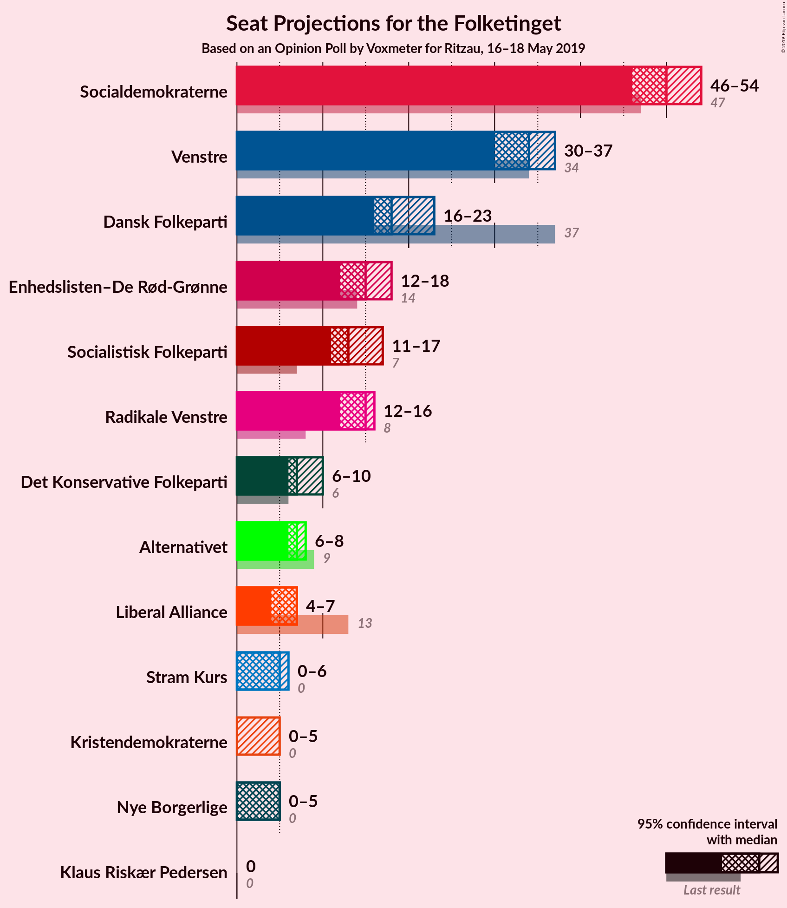
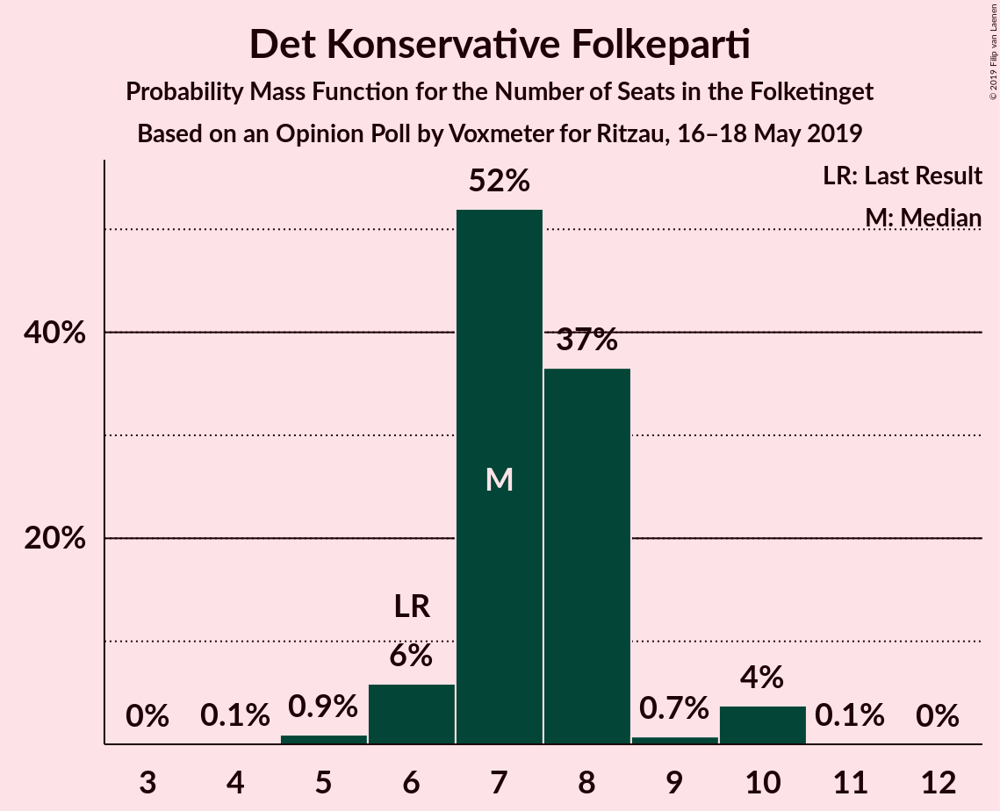
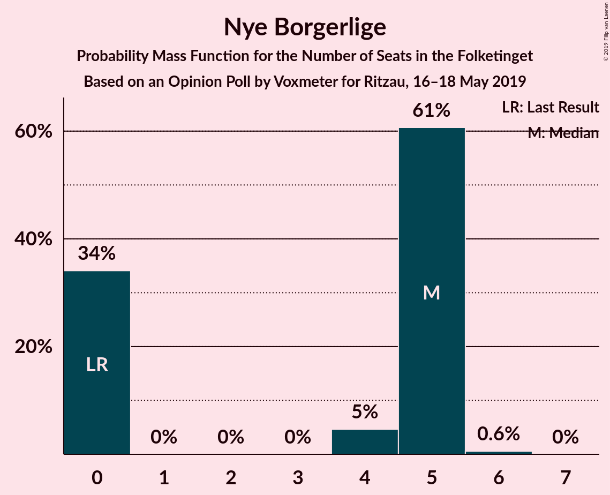
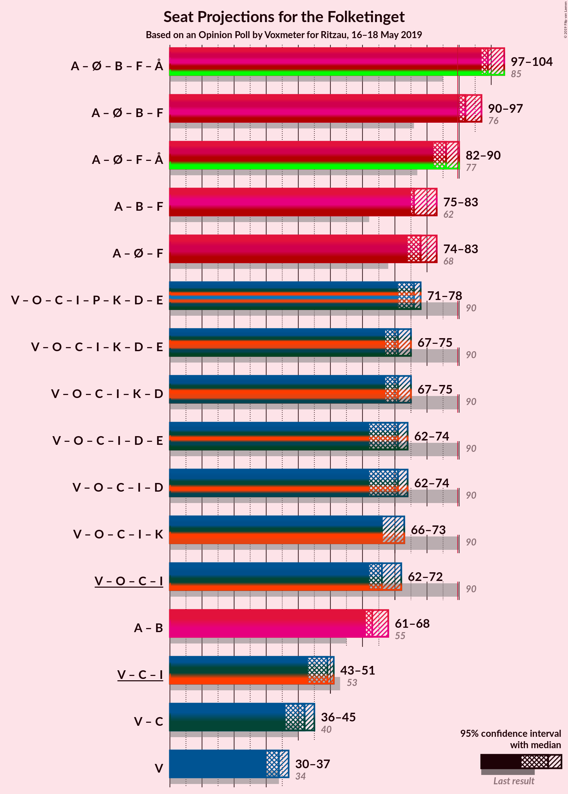
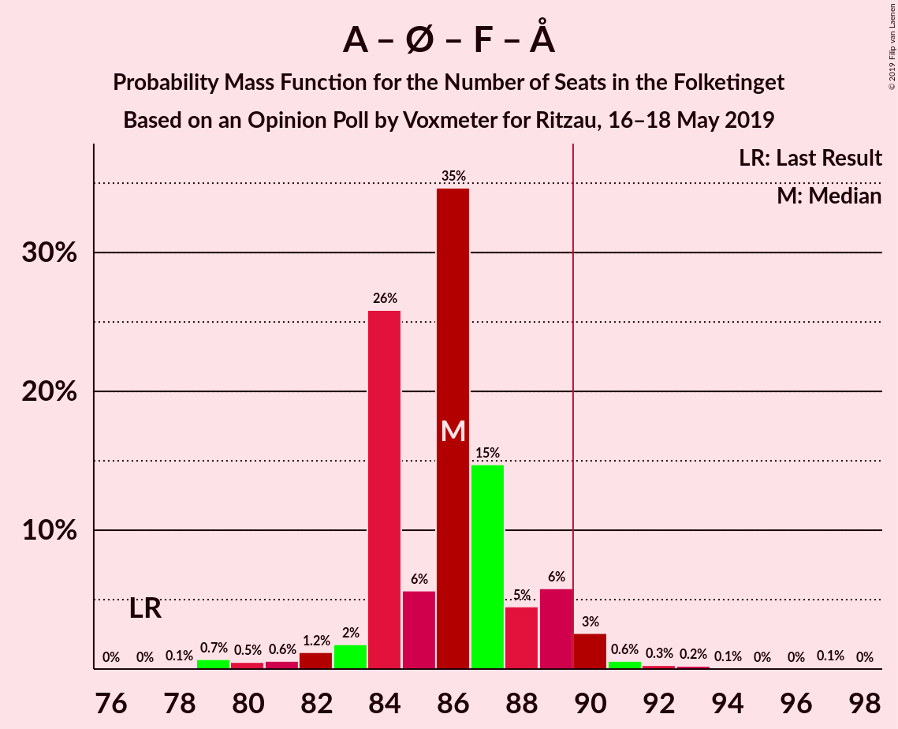
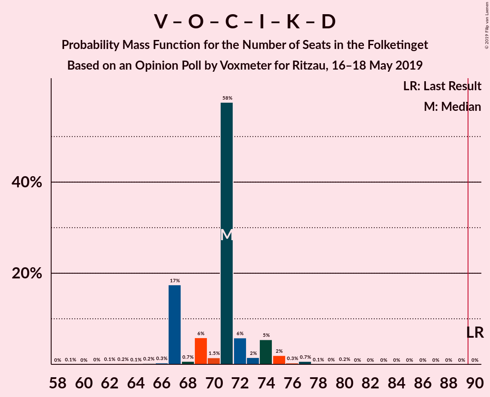
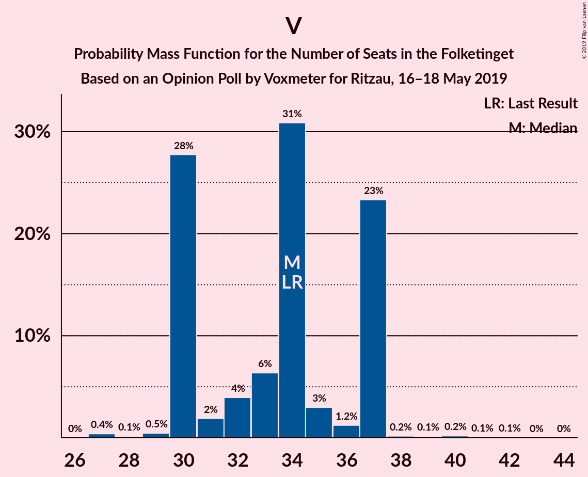

# Opinion Poll by Voxmeter for Ritzau, 16–18 May 2019

<a href="#voting-intentions">Voting Intentions</a> | <a href="#seats">Seats</a> | <a href="#coalitions">Coalitions</a> | <a href="#technical-information">Technical Information</a>

## Voting Intentions

### Confidence Intervals

| Party | Last Result | Poll Result | 80% Confidence Interval | 90% Confidence Interval | 95% Confidence Interval | 99% Confidence Interval |
|:-----:|:-----------:|:-----------:|:-----------------------:|:-----------------------:|:-----------------------:|:-----------------------:|
| Socialdemokraterne | 26.3% | 27.8% | 26.1–29.7% |25.6–30.2% |25.2–30.7% |24.3–31.6% |
| Venstre | 19.5% | 18.8% | 17.3–20.5% |16.9–21.0% |16.5–21.4% |15.8–22.2% |
| Dansk Folkeparti | 21.1% | 11.0% | 9.8–12.4% |9.5–12.8% |9.2–13.1% |8.7–13.8% |
| Enhedslisten–De Rød-Grønne | 7.8% | 8.4% | 7.4–9.6% |7.1–10.0% |6.9–10.3% |6.4–10.9% |
| Radikale Venstre | 4.6% | 8.1% | 7.1–9.3% |6.8–9.7% |6.6–10.0% |6.1–10.6% |
| Socialistisk Folkeparti | 4.2% | 7.6% | 6.6–8.8% |6.4–9.1% |6.1–9.4% |5.7–10.0% |
| Det Konservative Folkeparti | 3.4% | 4.1% | 3.4–5.0% |3.2–5.2% |3.0–5.5% |2.7–5.9% |
| Alternativet | 4.8% | 4.0% | 3.3–4.9% |3.1–5.1% |2.9–5.4% |2.6–5.8% |
| Liberal Alliance | 7.5% | 3.2% | 2.6–4.0% |2.4–4.2% |2.3–4.5% |2.0–4.9% |
| Stram Kurs | 0.0% | 2.4% | 1.9–3.1% |1.7–3.3% |1.6–3.5% |1.4–3.9% |
| Kristendemokraterne | 0.8% | 1.9% | 1.4–2.6% |1.3–2.8% |1.2–2.9% |1.0–3.3% |
| Nye Borgerlige | 0.0% | 1.9% | 1.4–2.6% |1.3–2.8% |1.2–2.9% |1.0–3.3% |
| Klaus Riskær Pedersen | 0.0% | 0.3% | 0.2–0.7% |0.1–0.8% |0.1–0.9% |0.1–1.1% |

*Note:* The poll result column reflects the actual value used in the calculations. Published results may vary slightly, and in addition be rounded to fewer digits.

## Seats

### Confidence Intervals

| Party | Last Result | Median | 80% Confidence Interval | 90% Confidence Interval | 95% Confidence Interval | 99% Confidence Interval |
|:-----:|:-----------:|:------:|:-----------------------:|:-----------------------:|:-----------------------:|:-----------------------:|
| <a href="#socialdemokraterne">Socialdemokraterne</a> | 47 | 50 | 47–52 |47–52 |46–54 |43–55 |
| <a href="#venstre">Venstre</a> | 34 | 34 | 30–37 |30–37 |30–37 |28–38 |
| <a href="#dansk-folkeparti">Dansk Folkeparti</a> | 37 | 18 | 17–22 |16–23 |16–23 |16–26 |
| <a href="#enhedslisten–de-rød-grønne">Enhedslisten–De Rød-Grønne</a> | 14 | 15 | 14–17 |14–18 |12–18 |11–19 |
| <a href="#radikale-venstre">Radikale Venstre</a> | 8 | 15 | 13–16 |12–16 |12–16 |11–18 |
| <a href="#socialistisk-folkeparti">Socialistisk Folkeparti</a> | 7 | 13 | 12–15 |11–16 |11–17 |10–17 |
| <a href="#det-konservative-folkeparti">Det Konservative Folkeparti</a> | 6 | 7 | 7–8 |6–8 |6–10 |5–10 |
| <a href="#alternativet">Alternativet</a> | 9 | 7 | 6–8 |6–8 |6–8 |5–10 |
| <a href="#liberal-alliance">Liberal Alliance</a> | 13 | 7 | 5–7 |4–7 |4–7 |4–8 |
| <a href="#stram-kurs">Stram Kurs</a> | 0 | 5 | 0–5 |0–6 |0–6 |0–7 |
| <a href="#kristendemokraterne">Kristendemokraterne</a> | 0 | 0 | 0–4 |0–5 |0–5 |0–6 |
| <a href="#nye-borgerlige">Nye Borgerlige</a> | 0 | 5 | 0–5 |0–5 |0–5 |0–6 |
| <a href="#klaus-riskær-pedersen">Klaus Riskær Pedersen</a> | 0 | 0 | 0 |0 |0 |0 |

### Socialdemokraterne

*For a full overview of the results for this party, see the [Socialdemokraterne](party-socialdemokraterne.html) page.*

| Number of Seats | Probability | Accumulated | Special Marks |
|:---------------:|:-----------:|:-----------:|:-------------:|
| 40 | 0.1% | 100% |  |
| 41 | 0% | 99.9% |  |
| 42 | 0.4% | 99.9% |  |
| 43 | 0.1% | 99.5% |  |
| 44 | 0.2% | 99.5% |  |
| 45 | 0.4% | 99.3% |  |
| 46 | 1.5% | 98.9% |  |
| 47 | 27% | 97% | Last Result |
| 48 | 1.3% | 70% |  |
| 49 | 4% | 69% |  |
| 50 | 40% | 65% | Median |
| 51 | 5% | 25% |  |
| 52 | 15% | 20% |  |
| 53 | 2% | 4% |  |
| 54 | 2% | 3% |  |
| 55 | 0.4% | 0.7% |  |
| 56 | 0.1% | 0.3% |  |
| 57 | 0.1% | 0.2% |  |
| 58 | 0% | 0.1% |  |
| 59 | 0.1% | 0.1% |  |
| 60 | 0% | 0% |  |

### Venstre

*For a full overview of the results for this party, see the [Venstre](party-venstre.html) page.*

| Number of Seats | Probability | Accumulated | Special Marks |
|:---------------:|:-----------:|:-----------:|:-------------:|
| 27 | 0.4% | 100% |  |
| 28 | 0.1% | 99.6% |  |
| 29 | 0.5% | 99.4% |  |
| 30 | 28% | 99.0% |  |
| 31 | 2% | 71% |  |
| 32 | 4% | 69% |  |
| 33 | 6% | 65% |  |
| 34 | 31% | 59% | Last Result, Median |
| 35 | 3% | 28% |  |
| 36 | 1.2% | 25% |  |
| 37 | 23% | 24% |  |
| 38 | 0.2% | 0.7% |  |
| 39 | 0.1% | 0.5% |  |
| 40 | 0.2% | 0.3% |  |
| 41 | 0.1% | 0.2% |  |
| 42 | 0.1% | 0.1% |  |
| 43 | 0% | 0% |  |

### Dansk Folkeparti

*For a full overview of the results for this party, see the [Dansk Folkeparti](party-danskfolkeparti.html) page.*

| Number of Seats | Probability | Accumulated | Special Marks |
|:---------------:|:-----------:|:-----------:|:-------------:|
| 15 | 0.1% | 100% |  |
| 16 | 6% | 99.8% |  |
| 17 | 29% | 94% |  |
| 18 | 16% | 65% | Median |
| 19 | 10% | 49% |  |
| 20 | 1.1% | 38% |  |
| 21 | 3% | 37% |  |
| 22 | 26% | 34% |  |
| 23 | 6% | 8% |  |
| 24 | 0.1% | 1.1% |  |
| 25 | 0.1% | 1.0% |  |
| 26 | 0.8% | 0.8% |  |
| 27 | 0% | 0% |  |
| 28 | 0% | 0% |  |
| 29 | 0% | 0% |  |
| 30 | 0% | 0% |  |
| 31 | 0% | 0% |  |
| 32 | 0% | 0% |  |
| 33 | 0% | 0% |  |
| 34 | 0% | 0% |  |
| 35 | 0% | 0% |  |
| 36 | 0% | 0% |  |
| 37 | 0% | 0% | Last Result |

### Enhedslisten–De Rød-Grønne

*For a full overview of the results for this party, see the [Enhedslisten–De Rød-Grønne](party-enhedslisten–derød-grønne.html) page.*

| Number of Seats | Probability | Accumulated | Special Marks |
|:---------------:|:-----------:|:-----------:|:-------------:|
| 11 | 0.5% | 100% |  |
| 12 | 2% | 99.4% |  |
| 13 | 2% | 97% |  |
| 14 | 16% | 95% | Last Result |
| 15 | 41% | 79% | Median |
| 16 | 6% | 38% |  |
| 17 | 27% | 32% |  |
| 18 | 5% | 5% |  |
| 19 | 0.7% | 0.8% |  |
| 20 | 0% | 0.1% |  |
| 21 | 0% | 0.1% |  |
| 22 | 0% | 0% |  |

### Radikale Venstre

*For a full overview of the results for this party, see the [Radikale Venstre](party-radikalevenstre.html) page.*

| Number of Seats | Probability | Accumulated | Special Marks |
|:---------------:|:-----------:|:-----------:|:-------------:|
| 8 | 0% | 100% | Last Result |
| 9 | 0.2% | 100% |  |
| 10 | 0.1% | 99.8% |  |
| 11 | 1.4% | 99.7% |  |
| 12 | 4% | 98% |  |
| 13 | 36% | 94% |  |
| 14 | 4% | 58% |  |
| 15 | 33% | 54% | Median |
| 16 | 19% | 21% |  |
| 17 | 2% | 2% |  |
| 18 | 0.5% | 0.8% |  |
| 19 | 0.2% | 0.2% |  |
| 20 | 0% | 0.1% |  |
| 21 | 0% | 0% |  |

### Socialistisk Folkeparti

*For a full overview of the results for this party, see the [Socialistisk Folkeparti](party-socialistiskfolkeparti.html) page.*

| Number of Seats | Probability | Accumulated | Special Marks |
|:---------------:|:-----------:|:-----------:|:-------------:|
| 7 | 0% | 100% | Last Result |
| 8 | 0% | 100% |  |
| 9 | 0% | 100% |  |
| 10 | 0.8% | 100% |  |
| 11 | 5% | 99.2% |  |
| 12 | 4% | 94% |  |
| 13 | 55% | 90% | Median |
| 14 | 3% | 34% |  |
| 15 | 22% | 32% |  |
| 16 | 6% | 10% |  |
| 17 | 4% | 4% |  |
| 18 | 0.2% | 0.2% |  |
| 19 | 0.1% | 0.1% |  |
| 20 | 0% | 0% |  |

### Det Konservative Folkeparti

*For a full overview of the results for this party, see the [Det Konservative Folkeparti](party-detkonservativefolkeparti.html) page.*

| Number of Seats | Probability | Accumulated | Special Marks |
|:---------------:|:-----------:|:-----------:|:-------------:|
| 4 | 0.1% | 100% |  |
| 5 | 0.9% | 99.9% |  |
| 6 | 6% | 99.0% | Last Result |
| 7 | 52% | 93% | Median |
| 8 | 37% | 41% |  |
| 9 | 0.7% | 5% |  |
| 10 | 4% | 4% |  |
| 11 | 0.1% | 0.1% |  |
| 12 | 0% | 0% |  |

### Alternativet

*For a full overview of the results for this party, see the [Alternativet](party-alternativet.html) page.*

| Number of Seats | Probability | Accumulated | Special Marks |
|:---------------:|:-----------:|:-----------:|:-------------:|
| 4 | 0.2% | 100% |  |
| 5 | 0.9% | 99.8% |  |
| 6 | 21% | 98.9% |  |
| 7 | 41% | 78% | Median |
| 8 | 35% | 37% |  |
| 9 | 1.5% | 2% | Last Result |
| 10 | 0.8% | 0.9% |  |
| 11 | 0.1% | 0.1% |  |
| 12 | 0% | 0% |  |

### Liberal Alliance

*For a full overview of the results for this party, see the [Liberal Alliance](party-liberalalliance.html) page.*

| Number of Seats | Probability | Accumulated | Special Marks |
|:---------------:|:-----------:|:-----------:|:-------------:|
| 0 | 0.1% | 100% |  |
| 1 | 0% | 99.9% |  |
| 2 | 0% | 99.9% |  |
| 3 | 0% | 99.9% |  |
| 4 | 5% | 99.9% |  |
| 5 | 24% | 95% |  |
| 6 | 8% | 71% |  |
| 7 | 62% | 63% | Median |
| 8 | 0.8% | 1.2% |  |
| 9 | 0.4% | 0.4% |  |
| 10 | 0% | 0% |  |
| 11 | 0% | 0% |  |
| 12 | 0% | 0% |  |
| 13 | 0% | 0% | Last Result |

### Stram Kurs

*For a full overview of the results for this party, see the [Stram Kurs](party-stramkurs.html) page.*

| Number of Seats | Probability | Accumulated | Special Marks |
|:---------------:|:-----------:|:-----------:|:-------------:|
| 0 | 11% | 100% | Last Result |
| 1 | 0% | 89% |  |
| 2 | 0% | 89% |  |
| 3 | 0% | 89% |  |
| 4 | 11% | 89% |  |
| 5 | 71% | 78% | Median |
| 6 | 6% | 7% |  |
| 7 | 0.5% | 0.6% |  |
| 8 | 0% | 0.1% |  |
| 9 | 0% | 0% |  |

### Kristendemokraterne

*For a full overview of the results for this party, see the [Kristendemokraterne](party-kristendemokraterne.html) page.*

| Number of Seats | Probability | Accumulated | Special Marks |
|:---------------:|:-----------:|:-----------:|:-------------:|
| 0 | 82% | 100% | Last Result, Median |
| 1 | 0% | 18% |  |
| 2 | 0% | 18% |  |
| 3 | 0% | 18% |  |
| 4 | 11% | 18% |  |
| 5 | 7% | 7% |  |
| 6 | 0.6% | 0.8% |  |
| 7 | 0.1% | 0.2% |  |
| 8 | 0% | 0% |  |

### Nye Borgerlige

*For a full overview of the results for this party, see the [Nye Borgerlige](party-nyeborgerlige.html) page.*

| Number of Seats | Probability | Accumulated | Special Marks |
|:---------------:|:-----------:|:-----------:|:-------------:|
| 0 | 34% | 100% | Last Result |
| 1 | 0% | 66% |  |
| 2 | 0% | 66% |  |
| 3 | 0% | 66% |  |
| 4 | 5% | 66% |  |
| 5 | 61% | 61% | Median |
| 6 | 0.6% | 0.6% |  |
| 7 | 0% | 0% |  |

### Klaus Riskær Pedersen

*For a full overview of the results for this party, see the [Klaus Riskær Pedersen](party-klausriskærpedersen.html) page.*

| Number of Seats | Probability | Accumulated | Special Marks |
|:---------------:|:-----------:|:-----------:|:-------------:|
| 0 | 100% | 100% | Last Result, Median |

## Coalitions

### Confidence Intervals

| Coalition | Last Result | Median | Majority? | 80% Confidence Interval | 90% Confidence Interval | 95% Confidence Interval | 99% Confidence Interval |
|:---------:|:-----------:|:------:|:---------:|:-----------------------:|:-----------------------:|:-----------------------:|:-----------------------:|
| Socialdemokraterne – Enhedslisten–De Rød-Grønne – Radikale Venstre – Socialistisk Folkeparti – Alternativet | 85 | 99 | 100% | 99–103 | 97–104 | 97–104 | 94–107 |
| Socialdemokraterne – Enhedslisten–De Rød-Grønne – Radikale Venstre – Socialistisk Folkeparti | 76 | 92 | 98% | 91–97 | 91–97 | 90–97 | 86–99 |
| Socialdemokraterne – Enhedslisten–De Rød-Grønne – Socialistisk Folkeparti – Alternativet | 77 | 86 | 4% | 84–88 | 84–89 | 82–90 | 79–92 |
| Socialdemokraterne – Radikale Venstre – Socialistisk Folkeparti | 62 | 76 | 0% | 75–83 | 75–83 | 75–83 | 70–84 |
| Socialdemokraterne – Enhedslisten–De Rød-Grønne – Socialistisk Folkeparti | 68 | 78 | 0% | 77–81 | 77–81 | 74–83 | 72–85 |
| Venstre – Dansk Folkeparti – Det Konservative Folkeparti – Liberal Alliance – Stram Kurs – Kristendemokraterne – Nye Borgerlige – Klaus Riskær Pedersen | 90 | 76 | 0% | 72–76 | 71–78 | 71–78 | 68–81 |
| Venstre – Dansk Folkeparti – Det Konservative Folkeparti – Liberal Alliance – Kristendemokraterne – Nye Borgerlige – Klaus Riskær Pedersen | 90 | 71 | 0% | 67–73 | 67–74 | 67–75 | 64–77 |
| Venstre – Dansk Folkeparti – Det Konservative Folkeparti – Liberal Alliance – Kristendemokraterne – Nye Borgerlige | 90 | 71 | 0% | 67–73 | 67–74 | 67–75 | 64–77 |
| Venstre – Dansk Folkeparti – Det Konservative Folkeparti – Liberal Alliance – Nye Borgerlige – Klaus Riskær Pedersen | 90 | 71 | 0% | 66–72 | 65–74 | 62–74 | 62–75 |
| Venstre – Dansk Folkeparti – Det Konservative Folkeparti – Liberal Alliance – Nye Borgerlige | 90 | 71 | 0% | 66–72 | 65–74 | 62–74 | 62–75 |
| Venstre – Dansk Folkeparti – Det Konservative Folkeparti – Liberal Alliance – Kristendemokraterne | 90 | 66 | 0% | 66–71 | 66–72 | 66–73 | 63–75 |
| Venstre – Dansk Folkeparti – Det Konservative Folkeparti – Liberal Alliance | 90 | 66 | 0% | 65–69 | 63–69 | 62–72 | 60–75 |
| Socialdemokraterne – Radikale Venstre | 55 | 63 | 0% | 62–68 | 61–68 | 61–68 | 57–70 |
| Venstre – Det Konservative Folkeparti – Liberal Alliance | 53 | 49 | 0% | 44–49 | 44–49 | 43–51 | 42–53 |
| Venstre – Det Konservative Folkeparti | 40 | 42 | 0% | 37–44 | 37–45 | 36–45 | 36–46 |
| Venstre | 34 | 34 | 0% | 30–37 | 30–37 | 30–37 | 28–38 |

### Socialdemokraterne – Enhedslisten–De Rød-Grønne – Radikale Venstre – Socialistisk Folkeparti – Alternativet

| Number of Seats | Probability | Accumulated | Special Marks |
|:---------------:|:-----------:|:-----------:|:-------------:|
| 85 | 0% | 100% | Last Result |
| 86 | 0% | 100% |  |
| 87 | 0% | 100% |  |
| 88 | 0% | 100% |  |
| 89 | 0% | 100% |  |
| 90 | 0% | 100% | Majority |
| 91 | 0% | 100% |  |
| 92 | 0.3% | 100% |  |
| 93 | 0.2% | 99.7% |  |
| 94 | 0.5% | 99.5% |  |
| 95 | 0.2% | 99.0% |  |
| 96 | 0.9% | 98.8% |  |
| 97 | 4% | 98% |  |
| 98 | 2% | 93% |  |
| 99 | 57% | 92% |  |
| 100 | 2% | 35% | Median |
| 101 | 6% | 33% |  |
| 102 | 5% | 28% |  |
| 103 | 16% | 22% |  |
| 104 | 5% | 6% |  |
| 105 | 0.2% | 1.2% |  |
| 106 | 0.4% | 1.0% |  |
| 107 | 0.1% | 0.6% |  |
| 108 | 0.2% | 0.4% |  |
| 109 | 0% | 0.2% |  |
| 110 | 0.1% | 0.2% |  |
| 111 | 0.1% | 0.1% |  |
| 112 | 0% | 0% |  |

### Socialdemokraterne – Enhedslisten–De Rød-Grønne – Radikale Venstre – Socialistisk Folkeparti

| Number of Seats | Probability | Accumulated | Special Marks |
|:---------------:|:-----------:|:-----------:|:-------------:|
| 76 | 0% | 100% | Last Result |
| 77 | 0% | 100% |  |
| 78 | 0% | 100% |  |
| 79 | 0% | 100% |  |
| 80 | 0% | 100% |  |
| 81 | 0% | 100% |  |
| 82 | 0% | 100% |  |
| 83 | 0% | 100% |  |
| 84 | 0% | 100% |  |
| 85 | 0.3% | 100% |  |
| 86 | 0.4% | 99.7% |  |
| 87 | 0.2% | 99.3% |  |
| 88 | 0.3% | 99.1% |  |
| 89 | 0.9% | 98.8% |  |
| 90 | 0.7% | 98% | Majority |
| 91 | 34% | 97% |  |
| 92 | 29% | 63% |  |
| 93 | 2% | 35% | Median |
| 94 | 10% | 33% |  |
| 95 | 0.4% | 22% |  |
| 96 | 1.4% | 22% |  |
| 97 | 19% | 21% |  |
| 98 | 0.7% | 1.3% |  |
| 99 | 0.1% | 0.6% |  |
| 100 | 0.2% | 0.5% |  |
| 101 | 0.2% | 0.3% |  |
| 102 | 0% | 0.1% |  |
| 103 | 0.1% | 0.1% |  |
| 104 | 0% | 0% |  |

### Socialdemokraterne – Enhedslisten–De Rød-Grønne – Socialistisk Folkeparti – Alternativet

| Number of Seats | Probability | Accumulated | Special Marks |
|:---------------:|:-----------:|:-----------:|:-------------:|
| 77 | 0% | 100% | Last Result |
| 78 | 0.1% | 100% |  |
| 79 | 0.7% | 99.8% |  |
| 80 | 0.5% | 99.1% |  |
| 81 | 0.6% | 98.6% |  |
| 82 | 1.2% | 98% |  |
| 83 | 2% | 97% |  |
| 84 | 26% | 95% |  |
| 85 | 6% | 69% | Median |
| 86 | 35% | 64% |  |
| 87 | 15% | 29% |  |
| 88 | 5% | 14% |  |
| 89 | 6% | 10% |  |
| 90 | 3% | 4% | Majority |
| 91 | 0.6% | 1.3% |  |
| 92 | 0.3% | 0.7% |  |
| 93 | 0.2% | 0.4% |  |
| 94 | 0.1% | 0.2% |  |
| 95 | 0% | 0.1% |  |
| 96 | 0% | 0.1% |  |
| 97 | 0.1% | 0.1% |  |
| 98 | 0% | 0% |  |

### Socialdemokraterne – Radikale Venstre – Socialistisk Folkeparti

| Number of Seats | Probability | Accumulated | Special Marks |
|:---------------:|:-----------:|:-----------:|:-------------:|
| 62 | 0% | 100% | Last Result |
| 63 | 0% | 100% |  |
| 64 | 0% | 100% |  |
| 65 | 0% | 100% |  |
| 66 | 0% | 100% |  |
| 67 | 0% | 100% |  |
| 68 | 0.2% | 100% |  |
| 69 | 0% | 99.8% |  |
| 70 | 0.6% | 99.8% |  |
| 71 | 0.2% | 99.3% |  |
| 72 | 0.2% | 99.1% |  |
| 73 | 0.2% | 98.9% |  |
| 74 | 0.7% | 98.7% |  |
| 75 | 27% | 98% |  |
| 76 | 38% | 71% |  |
| 77 | 1.0% | 33% |  |
| 78 | 1.0% | 32% | Median |
| 79 | 6% | 31% |  |
| 80 | 1.3% | 25% |  |
| 81 | 5% | 23% |  |
| 82 | 3% | 18% |  |
| 83 | 15% | 15% |  |
| 84 | 0.5% | 0.9% |  |
| 85 | 0.2% | 0.4% |  |
| 86 | 0.1% | 0.2% |  |
| 87 | 0.1% | 0.1% |  |
| 88 | 0% | 0% |  |

### Socialdemokraterne – Enhedslisten–De Rød-Grønne – Socialistisk Folkeparti

| Number of Seats | Probability | Accumulated | Special Marks |
|:---------------:|:-----------:|:-----------:|:-------------:|
| 68 | 0% | 100% | Last Result |
| 69 | 0% | 100% |  |
| 70 | 0.1% | 100% |  |
| 71 | 0.4% | 99.9% |  |
| 72 | 0% | 99.5% |  |
| 73 | 0.4% | 99.5% |  |
| 74 | 2% | 99.0% |  |
| 75 | 1.1% | 97% |  |
| 76 | 1.3% | 96% |  |
| 77 | 26% | 95% |  |
| 78 | 30% | 69% | Median |
| 79 | 10% | 39% |  |
| 80 | 2% | 29% |  |
| 81 | 23% | 28% |  |
| 82 | 0.4% | 4% |  |
| 83 | 3% | 4% |  |
| 84 | 0.3% | 1.1% |  |
| 85 | 0.7% | 0.9% |  |
| 86 | 0% | 0.2% |  |
| 87 | 0.2% | 0.2% |  |
| 88 | 0% | 0% |  |

### Venstre – Dansk Folkeparti – Det Konservative Folkeparti – Liberal Alliance – Stram Kurs – Kristendemokraterne – Nye Borgerlige – Klaus Riskær Pedersen

| Number of Seats | Probability | Accumulated | Special Marks |
|:---------------:|:-----------:|:-----------:|:-------------:|
| 64 | 0.1% | 100% |  |
| 65 | 0.1% | 99.9% |  |
| 66 | 0% | 99.8% |  |
| 67 | 0.2% | 99.8% |  |
| 68 | 0.1% | 99.6% |  |
| 69 | 0.4% | 99.4% |  |
| 70 | 0.2% | 99.0% |  |
| 71 | 5% | 98.8% |  |
| 72 | 16% | 94% |  |
| 73 | 5% | 78% |  |
| 74 | 6% | 72% |  |
| 75 | 2% | 67% |  |
| 76 | 57% | 65% | Median |
| 77 | 2% | 8% |  |
| 78 | 4% | 7% |  |
| 79 | 0.9% | 2% |  |
| 80 | 0.2% | 1.2% |  |
| 81 | 0.5% | 1.0% |  |
| 82 | 0.2% | 0.5% |  |
| 83 | 0.3% | 0.3% |  |
| 84 | 0% | 0% |  |
| 85 | 0% | 0% |  |
| 86 | 0% | 0% |  |
| 87 | 0% | 0% |  |
| 88 | 0% | 0% |  |
| 89 | 0% | 0% |  |
| 90 | 0% | 0% | Last Result, Majority |

### Venstre – Dansk Folkeparti – Det Konservative Folkeparti – Liberal Alliance – Kristendemokraterne – Nye Borgerlige – Klaus Riskær Pedersen

| Number of Seats | Probability | Accumulated | Special Marks |
|:---------------:|:-----------:|:-----------:|:-------------:|
| 59 | 0.1% | 100% |  |
| 60 | 0% | 99.9% |  |
| 61 | 0% | 99.9% |  |
| 62 | 0.1% | 99.9% |  |
| 63 | 0.2% | 99.7% |  |
| 64 | 0.1% | 99.5% |  |
| 65 | 0.2% | 99.5% |  |
| 66 | 0.3% | 99.2% |  |
| 67 | 17% | 98.9% |  |
| 68 | 0.7% | 81% |  |
| 69 | 6% | 81% |  |
| 70 | 1.5% | 75% |  |
| 71 | 58% | 73% | Median |
| 72 | 6% | 16% |  |
| 73 | 2% | 10% |  |
| 74 | 5% | 9% |  |
| 75 | 2% | 3% |  |
| 76 | 0.3% | 1.3% |  |
| 77 | 0.7% | 1.0% |  |
| 78 | 0.1% | 0.3% |  |
| 79 | 0% | 0.2% |  |
| 80 | 0.2% | 0.2% |  |
| 81 | 0% | 0% |  |
| 82 | 0% | 0% |  |
| 83 | 0% | 0% |  |
| 84 | 0% | 0% |  |
| 85 | 0% | 0% |  |
| 86 | 0% | 0% |  |
| 87 | 0% | 0% |  |
| 88 | 0% | 0% |  |
| 89 | 0% | 0% |  |
| 90 | 0% | 0% | Last Result, Majority |

### Venstre – Dansk Folkeparti – Det Konservative Folkeparti – Liberal Alliance – Kristendemokraterne – Nye Borgerlige

| Number of Seats | Probability | Accumulated | Special Marks |
|:---------------:|:-----------:|:-----------:|:-------------:|
| 59 | 0.1% | 100% |  |
| 60 | 0% | 99.9% |  |
| 61 | 0% | 99.9% |  |
| 62 | 0.1% | 99.9% |  |
| 63 | 0.2% | 99.7% |  |
| 64 | 0.1% | 99.5% |  |
| 65 | 0.2% | 99.5% |  |
| 66 | 0.3% | 99.2% |  |
| 67 | 17% | 98.9% |  |
| 68 | 0.7% | 81% |  |
| 69 | 6% | 81% |  |
| 70 | 1.5% | 75% |  |
| 71 | 58% | 73% | Median |
| 72 | 6% | 16% |  |
| 73 | 2% | 10% |  |
| 74 | 5% | 9% |  |
| 75 | 2% | 3% |  |
| 76 | 0.3% | 1.3% |  |
| 77 | 0.7% | 1.0% |  |
| 78 | 0.1% | 0.3% |  |
| 79 | 0% | 0.2% |  |
| 80 | 0.2% | 0.2% |  |
| 81 | 0% | 0% |  |
| 82 | 0% | 0% |  |
| 83 | 0% | 0% |  |
| 84 | 0% | 0% |  |
| 85 | 0% | 0% |  |
| 86 | 0% | 0% |  |
| 87 | 0% | 0% |  |
| 88 | 0% | 0% |  |
| 89 | 0% | 0% |  |
| 90 | 0% | 0% | Last Result, Majority |

### Venstre – Dansk Folkeparti – Det Konservative Folkeparti – Liberal Alliance – Nye Borgerlige – Klaus Riskær Pedersen

| Number of Seats | Probability | Accumulated | Special Marks |
|:---------------:|:-----------:|:-----------:|:-------------:|
| 58 | 0.2% | 100% |  |
| 59 | 0.1% | 99.8% |  |
| 60 | 0% | 99.7% |  |
| 61 | 0% | 99.7% |  |
| 62 | 2% | 99.6% |  |
| 63 | 0.7% | 97% |  |
| 64 | 0.2% | 96% |  |
| 65 | 6% | 96% |  |
| 66 | 3% | 91% |  |
| 67 | 16% | 87% |  |
| 68 | 4% | 72% |  |
| 69 | 1.0% | 68% |  |
| 70 | 2% | 67% |  |
| 71 | 55% | 65% | Median |
| 72 | 2% | 10% |  |
| 73 | 1.0% | 8% |  |
| 74 | 5% | 7% |  |
| 75 | 2% | 2% |  |
| 76 | 0.2% | 0.4% |  |
| 77 | 0.1% | 0.2% |  |
| 78 | 0.1% | 0.1% |  |
| 79 | 0% | 0% |  |
| 80 | 0% | 0% |  |
| 81 | 0% | 0% |  |
| 82 | 0% | 0% |  |
| 83 | 0% | 0% |  |
| 84 | 0% | 0% |  |
| 85 | 0% | 0% |  |
| 86 | 0% | 0% |  |
| 87 | 0% | 0% |  |
| 88 | 0% | 0% |  |
| 89 | 0% | 0% |  |
| 90 | 0% | 0% | Last Result, Majority |

### Venstre – Dansk Folkeparti – Det Konservative Folkeparti – Liberal Alliance – Nye Borgerlige

| Number of Seats | Probability | Accumulated | Special Marks |
|:---------------:|:-----------:|:-----------:|:-------------:|
| 58 | 0.2% | 100% |  |
| 59 | 0.1% | 99.8% |  |
| 60 | 0% | 99.7% |  |
| 61 | 0% | 99.7% |  |
| 62 | 2% | 99.6% |  |
| 63 | 0.7% | 97% |  |
| 64 | 0.2% | 96% |  |
| 65 | 6% | 96% |  |
| 66 | 3% | 91% |  |
| 67 | 16% | 87% |  |
| 68 | 4% | 72% |  |
| 69 | 1.0% | 68% |  |
| 70 | 2% | 67% |  |
| 71 | 55% | 65% | Median |
| 72 | 2% | 10% |  |
| 73 | 1.0% | 8% |  |
| 74 | 5% | 7% |  |
| 75 | 2% | 2% |  |
| 76 | 0.2% | 0.4% |  |
| 77 | 0.1% | 0.2% |  |
| 78 | 0.1% | 0.1% |  |
| 79 | 0% | 0% |  |
| 80 | 0% | 0% |  |
| 81 | 0% | 0% |  |
| 82 | 0% | 0% |  |
| 83 | 0% | 0% |  |
| 84 | 0% | 0% |  |
| 85 | 0% | 0% |  |
| 86 | 0% | 0% |  |
| 87 | 0% | 0% |  |
| 88 | 0% | 0% |  |
| 89 | 0% | 0% |  |
| 90 | 0% | 0% | Last Result, Majority |

### Venstre – Dansk Folkeparti – Det Konservative Folkeparti – Liberal Alliance – Kristendemokraterne

| Number of Seats | Probability | Accumulated | Special Marks |
|:---------------:|:-----------:|:-----------:|:-------------:|
| 59 | 0.1% | 100% |  |
| 60 | 0% | 99.9% |  |
| 61 | 0.1% | 99.8% |  |
| 62 | 0.2% | 99.8% |  |
| 63 | 0.6% | 99.5% |  |
| 64 | 0.8% | 98.9% |  |
| 65 | 0.6% | 98% |  |
| 66 | 55% | 98% | Median |
| 67 | 18% | 43% |  |
| 68 | 2% | 24% |  |
| 69 | 10% | 23% |  |
| 70 | 0.7% | 12% |  |
| 71 | 4% | 12% |  |
| 72 | 5% | 8% |  |
| 73 | 0.5% | 3% |  |
| 74 | 0.2% | 2% |  |
| 75 | 2% | 2% |  |
| 76 | 0.1% | 0.3% |  |
| 77 | 0% | 0.1% |  |
| 78 | 0% | 0.1% |  |
| 79 | 0% | 0% |  |
| 80 | 0% | 0% |  |
| 81 | 0% | 0% |  |
| 82 | 0% | 0% |  |
| 83 | 0% | 0% |  |
| 84 | 0% | 0% |  |
| 85 | 0% | 0% |  |
| 86 | 0% | 0% |  |
| 87 | 0% | 0% |  |
| 88 | 0% | 0% |  |
| 89 | 0% | 0% |  |
| 90 | 0% | 0% | Last Result, Majority |

### Venstre – Dansk Folkeparti – Det Konservative Folkeparti – Liberal Alliance

| Number of Seats | Probability | Accumulated | Special Marks |
|:---------------:|:-----------:|:-----------:|:-------------:|
| 58 | 0.2% | 100% |  |
| 59 | 0.2% | 99.8% |  |
| 60 | 0.9% | 99.6% |  |
| 61 | 0.1% | 98.7% |  |
| 62 | 3% | 98.6% |  |
| 63 | 1.2% | 96% |  |
| 64 | 0.4% | 94% |  |
| 65 | 6% | 94% |  |
| 66 | 58% | 88% | Median |
| 67 | 16% | 31% |  |
| 68 | 4% | 14% |  |
| 69 | 6% | 10% |  |
| 70 | 0.4% | 4% |  |
| 71 | 1.0% | 4% |  |
| 72 | 0.9% | 3% |  |
| 73 | 0.3% | 2% |  |
| 74 | 0.1% | 2% |  |
| 75 | 2% | 2% |  |
| 76 | 0.1% | 0.1% |  |
| 77 | 0% | 0% |  |
| 78 | 0% | 0% |  |
| 79 | 0% | 0% |  |
| 80 | 0% | 0% |  |
| 81 | 0% | 0% |  |
| 82 | 0% | 0% |  |
| 83 | 0% | 0% |  |
| 84 | 0% | 0% |  |
| 85 | 0% | 0% |  |
| 86 | 0% | 0% |  |
| 87 | 0% | 0% |  |
| 88 | 0% | 0% |  |
| 89 | 0% | 0% |  |
| 90 | 0% | 0% | Last Result, Majority |

### Socialdemokraterne – Radikale Venstre

| Number of Seats | Probability | Accumulated | Special Marks |
|:---------------:|:-----------:|:-----------:|:-------------:|
| 55 | 0% | 100% | Last Result |
| 56 | 0.2% | 100% |  |
| 57 | 0.5% | 99.8% |  |
| 58 | 0.5% | 99.3% |  |
| 59 | 0.2% | 98.8% |  |
| 60 | 0.6% | 98.6% |  |
| 61 | 4% | 98% |  |
| 62 | 27% | 94% |  |
| 63 | 35% | 67% |  |
| 64 | 1.4% | 32% |  |
| 65 | 8% | 31% | Median |
| 66 | 4% | 23% |  |
| 67 | 2% | 19% |  |
| 68 | 15% | 17% |  |
| 69 | 2% | 2% |  |
| 70 | 0.3% | 0.6% |  |
| 71 | 0.1% | 0.3% |  |
| 72 | 0.1% | 0.2% |  |
| 73 | 0.1% | 0.1% |  |
| 74 | 0% | 0% |  |

### Venstre – Det Konservative Folkeparti – Liberal Alliance

| Number of Seats | Probability | Accumulated | Special Marks |
|:---------------:|:-----------:|:-----------:|:-------------:|
| 38 | 0.1% | 100% |  |
| 39 | 0.1% | 99.9% |  |
| 40 | 0.1% | 99.8% |  |
| 41 | 0.1% | 99.7% |  |
| 42 | 0.4% | 99.6% |  |
| 43 | 4% | 99.2% |  |
| 44 | 27% | 96% |  |
| 45 | 2% | 69% |  |
| 46 | 6% | 67% |  |
| 47 | 3% | 60% |  |
| 48 | 1.2% | 57% | Median |
| 49 | 52% | 56% |  |
| 50 | 1.4% | 4% |  |
| 51 | 0.4% | 3% |  |
| 52 | 2% | 2% |  |
| 53 | 0.2% | 0.6% | Last Result |
| 54 | 0.1% | 0.4% |  |
| 55 | 0.2% | 0.2% |  |
| 56 | 0.1% | 0.1% |  |
| 57 | 0% | 0% |  |

### Venstre – Det Konservative Folkeparti

| Number of Seats | Probability | Accumulated | Special Marks |
|:---------------:|:-----------:|:-----------:|:-------------:|
| 33 | 0% | 100% |  |
| 34 | 0% | 99.9% |  |
| 35 | 0.3% | 99.9% |  |
| 36 | 3% | 99.7% |  |
| 37 | 27% | 97% |  |
| 38 | 2% | 70% |  |
| 39 | 2% | 68% |  |
| 40 | 6% | 66% | Last Result |
| 41 | 0.7% | 61% | Median |
| 42 | 33% | 60% |  |
| 43 | 2% | 28% |  |
| 44 | 20% | 26% |  |
| 45 | 6% | 6% |  |
| 46 | 0.1% | 0.5% |  |
| 47 | 0.1% | 0.4% |  |
| 48 | 0.1% | 0.3% |  |
| 49 | 0.2% | 0.2% |  |
| 50 | 0% | 0% |  |

### Venstre

| Number of Seats | Probability | Accumulated | Special Marks |
|:---------------:|:-----------:|:-----------:|:-------------:|
| 27 | 0.4% | 100% |  |
| 28 | 0.1% | 99.6% |  |
| 29 | 0.5% | 99.4% |  |
| 30 | 28% | 99.0% |  |
| 31 | 2% | 71% |  |
| 32 | 4% | 69% |  |
| 33 | 6% | 65% |  |
| 34 | 31% | 59% | Last Result, Median |
| 35 | 3% | 28% |  |
| 36 | 1.2% | 25% |  |
| 37 | 23% | 24% |  |
| 38 | 0.2% | 0.7% |  |
| 39 | 0.1% | 0.5% |  |
| 40 | 0.2% | 0.3% |  |
| 41 | 0.1% | 0.2% |  |
| 42 | 0.1% | 0.1% |  |
| 43 | 0% | 0% |  |

## Technical Information

### Opinion Poll

+ **Polling firm:** Voxmeter
+ **Commissioner(s):** Ritzau
+ **Fieldwork period:** 16–18 May 2019

### Calculations

+ **Sample size:** 1009
+ **Simulations done:** 1,048,576
+ **Error estimate:** 2.39%

