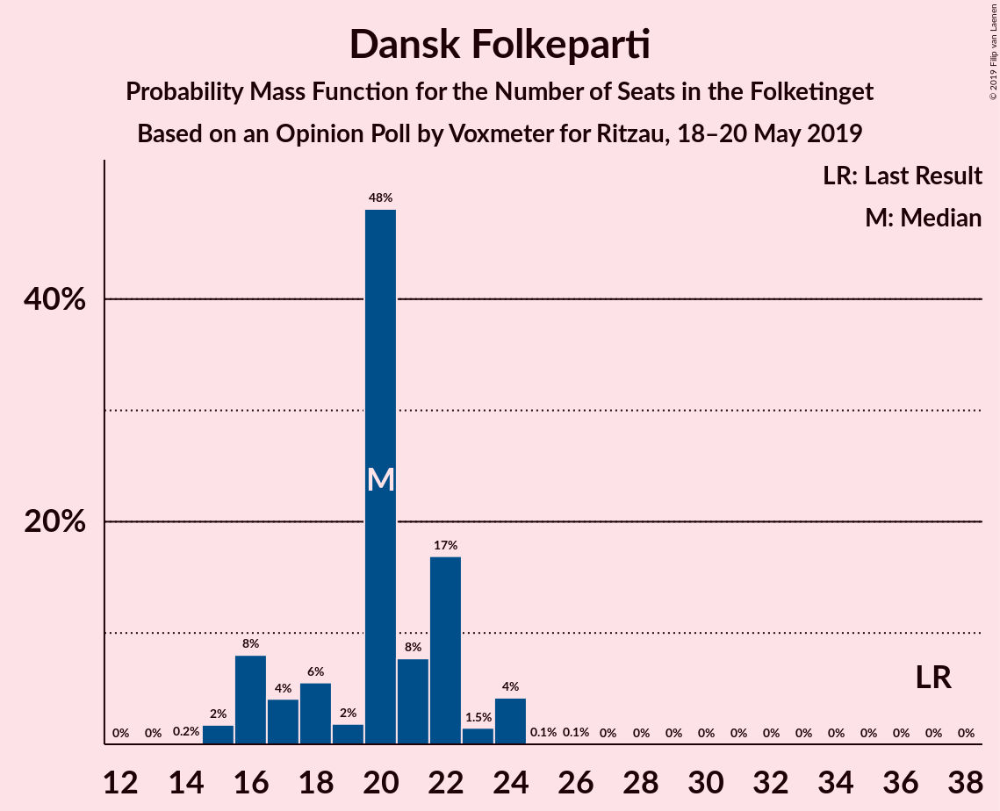
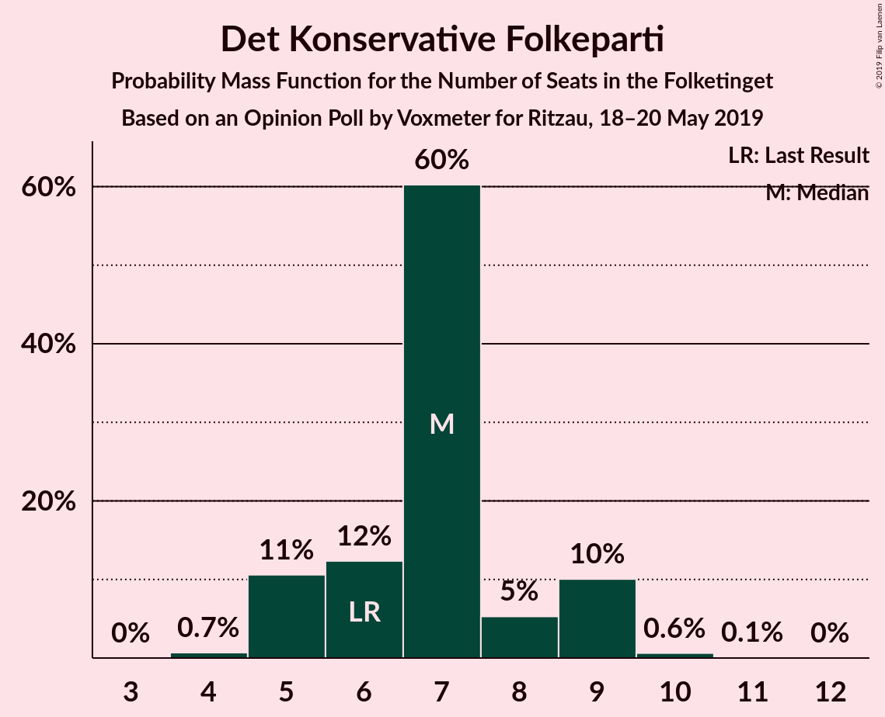
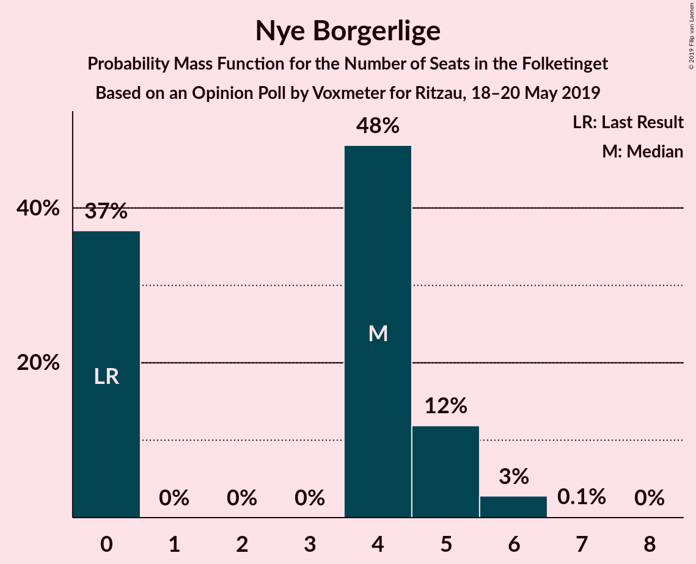
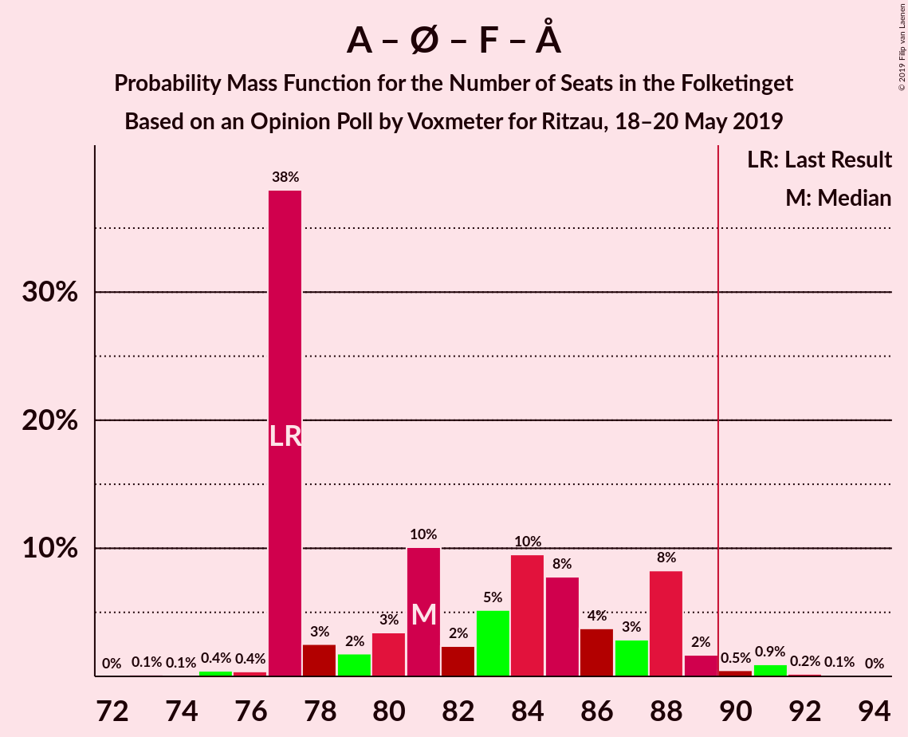
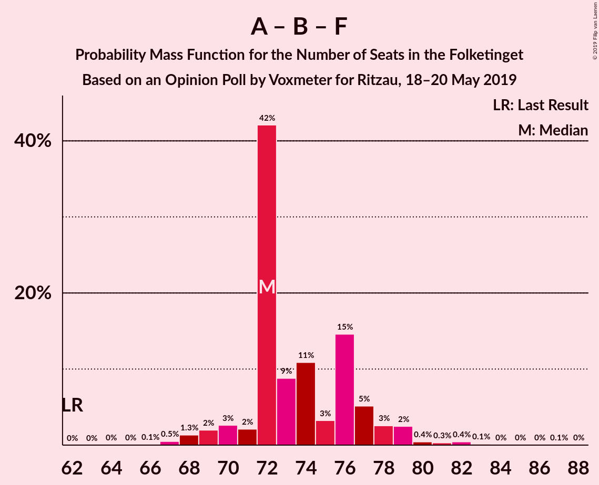
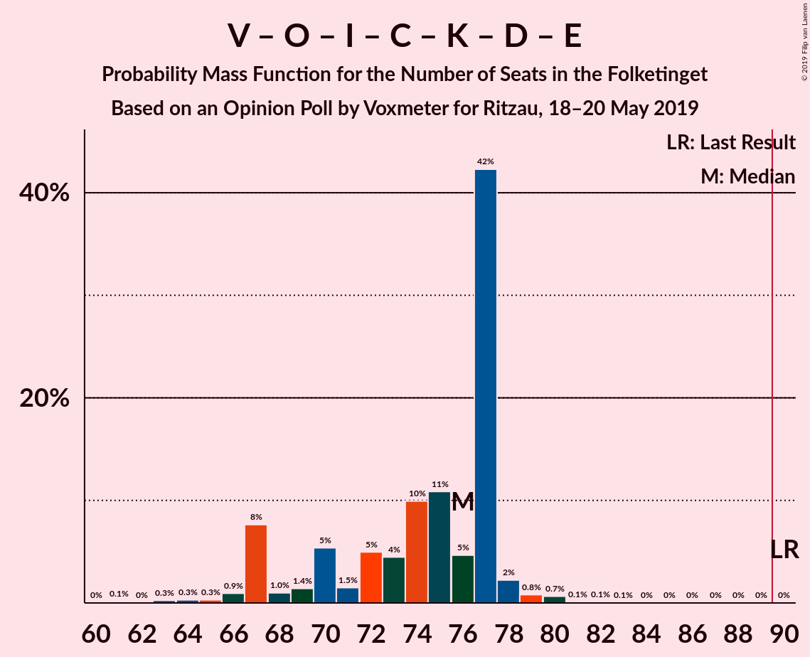
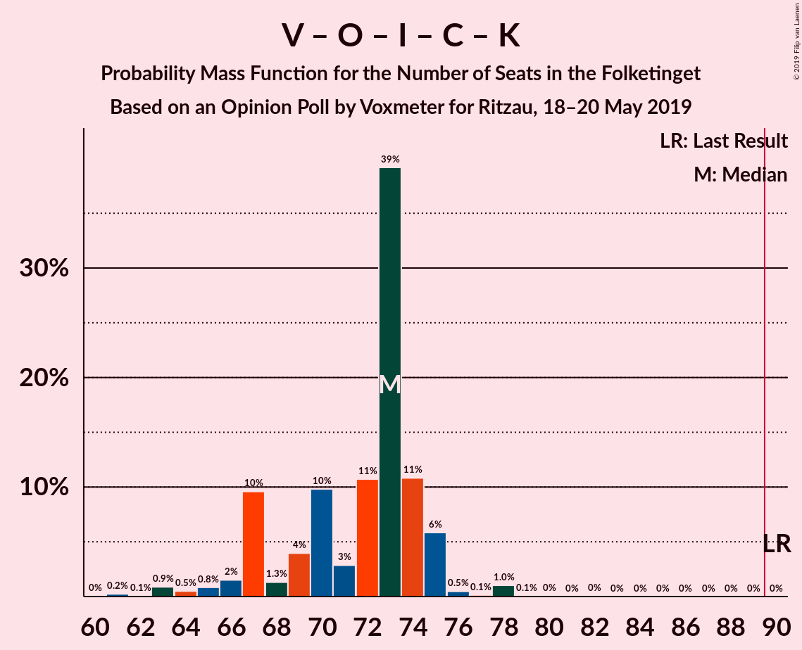
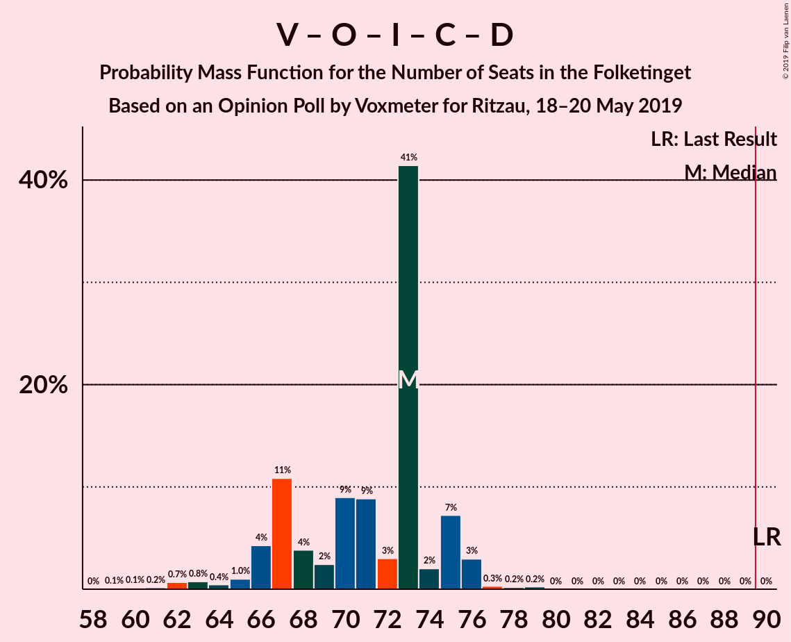
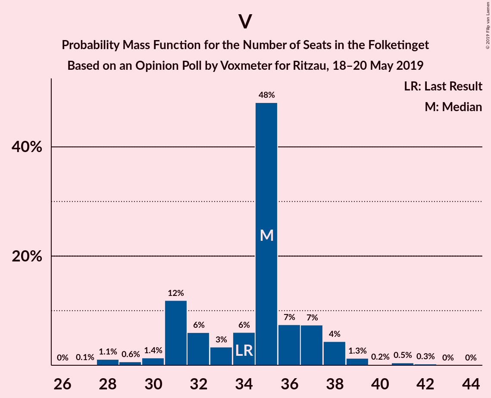

# Opinion Poll by Voxmeter for Ritzau, 18–20 May 2019

<a href="#voting-intentions">Voting Intentions</a> | <a href="#seats">Seats</a> | <a href="#coalitions">Coalitions</a> | <a href="#technical-information">Technical Information</a>

## Voting Intentions

### Confidence Intervals

| Party | Last Result | Poll Result | 80% Confidence Interval | 90% Confidence Interval | 95% Confidence Interval | 99% Confidence Interval |
|:-----:|:-----------:|:-----------:|:-----------------------:|:-----------------------:|:-----------------------:|:-----------------------:|
| Socialdemokraterne | 26.3% | 26.5% | 24.8–28.3% |24.3–28.9% |23.9–29.3% |23.0–30.2% |
| Venstre | 19.5% | 18.9% | 17.4–20.6% |17.0–21.1% |16.6–21.5% |15.9–22.3% |
| Dansk Folkeparti | 21.1% | 10.8% | 9.6–12.1% |9.3–12.5% |9.0–12.8% |8.5–13.5% |
| Enhedslisten–De Rød-Grønne | 7.8% | 9.1% | 8.0–10.3% |7.7–10.7% |7.4–11.0% |7.0–11.6% |
| Radikale Venstre | 4.6% | 7.8% | 6.8–9.0% |6.5–9.3% |6.3–9.6% |5.8–10.2% |
| Socialistisk Folkeparti | 4.2% | 7.6% | 6.6–8.7% |6.3–9.1% |6.1–9.4% |5.7–10.0% |
| Liberal Alliance | 7.5% | 3.9% | 3.2–4.8% |3.0–5.0% |2.9–5.3% |2.6–5.7% |
| Det Konservative Folkeparti | 3.4% | 3.7% | 3.0–4.6% |2.8–4.8% |2.7–5.0% |2.4–5.5% |
| Alternativet | 4.8% | 3.6% | 2.9–4.5% |2.7–4.7% |2.6–4.9% |2.3–5.4% |
| Stram Kurs | 0.0% | 2.8% | 2.2–3.6% |2.1–3.8% |1.9–4.0% |1.7–4.4% |
| Kristendemokraterne | 0.8% | 2.1% | 1.6–2.8% |1.5–3.0% |1.4–3.2% |1.2–3.6% |
| Nye Borgerlige | 0.0% | 2.0% | 1.5–2.7% |1.4–2.9% |1.3–3.1% |1.1–3.4% |
| Klaus Riskær Pedersen | 0.0% | 0.7% | 0.5–1.2% |0.4–1.3% |0.3–1.4% |0.2–1.7% |

*Note:* The poll result column reflects the actual value used in the calculations. Published results may vary slightly, and in addition be rounded to fewer digits.

## Seats

### Confidence Intervals

| Party | Last Result | Median | 80% Confidence Interval | 90% Confidence Interval | 95% Confidence Interval | 99% Confidence Interval |
|:-----:|:-----------:|:------:|:-----------------------:|:-----------------------:|:-----------------------:|:-----------------------:|
| <a href="#socialdemokraterne">Socialdemokraterne</a> | 47 | 46 | 43–51 |42–53 |42–54 |39–55 |
| <a href="#venstre">Venstre</a> | 34 | 34 | 30–40 |29–41 |27–41 |27–41 |
| <a href="#dansk-folkeparti">Dansk Folkeparti</a> | 37 | 19 | 16–21 |16–22 |15–22 |15–24 |
| <a href="#enhedslisten–de-rød-grønne">Enhedslisten–De Rød-Grønne</a> | 14 | 16 | 14–19 |13–19 |13–19 |11–22 |
| <a href="#radikale-venstre">Radikale Venstre</a> | 8 | 15 | 12–17 |11–17 |11–17 |10–18 |
| <a href="#socialistisk-folkeparti">Socialistisk Folkeparti</a> | 7 | 13 | 11–16 |11–17 |11–19 |10–19 |
| <a href="#liberal-alliance">Liberal Alliance</a> | 13 | 8 | 6–9 |5–10 |5–10 |5–11 |
| <a href="#det-konservative-folkeparti">Det Konservative Folkeparti</a> | 6 | 6 | 5–8 |4–8 |4–10 |0–10 |
| <a href="#alternativet">Alternativet</a> | 9 | 6 | 5–8 |4–9 |4–10 |4–10 |
| <a href="#stram-kurs">Stram Kurs</a> | 0 | 5 | 0–7 |0–7 |0–7 |0–8 |
| <a href="#kristendemokraterne">Kristendemokraterne</a> | 0 | 4 | 0–5 |0–5 |0–6 |0–7 |
| <a href="#nye-borgerlige">Nye Borgerlige</a> | 0 | 4 | 0–5 |0–6 |0–6 |0–6 |
| <a href="#klaus-riskær-pedersen">Klaus Riskær Pedersen</a> | 0 | 0 | 0 |0–3 |0–3 |0–3 |

### Socialdemokraterne

*For a full overview of the results for this party, see the [Socialdemokraterne](party-socialdemokraterne.html) page.*

| Number of Seats | Probability | Accumulated | Special Marks |
|:---------------:|:-----------:|:-----------:|:-------------:|
| 39 | 0.6% | 100% |  |
| 40 | 0.3% | 99.4% |  |
| 41 | 0.5% | 99.1% |  |
| 42 | 6% | 98.6% |  |
| 43 | 13% | 93% |  |
| 44 | 3% | 80% |  |
| 45 | 17% | 77% |  |
| 46 | 19% | 60% | Median |
| 47 | 6% | 41% | Last Result |
| 48 | 7% | 35% |  |
| 49 | 12% | 28% |  |
| 50 | 3% | 16% |  |
| 51 | 5% | 13% |  |
| 52 | 0.6% | 8% |  |
| 53 | 3% | 7% |  |
| 54 | 3% | 4% |  |
| 55 | 0.1% | 0.5% |  |
| 56 | 0.4% | 0.4% |  |
| 57 | 0% | 0% |  |

### Venstre

*For a full overview of the results for this party, see the [Venstre](party-venstre.html) page.*

| Number of Seats | Probability | Accumulated | Special Marks |
|:---------------:|:-----------:|:-----------:|:-------------:|
| 26 | 0.2% | 100% |  |
| 27 | 3% | 99.7% |  |
| 28 | 0.1% | 97% |  |
| 29 | 6% | 97% |  |
| 30 | 10% | 91% |  |
| 31 | 6% | 81% |  |
| 32 | 5% | 75% |  |
| 33 | 12% | 71% |  |
| 34 | 16% | 59% | Last Result, Median |
| 35 | 17% | 43% |  |
| 36 | 6% | 26% |  |
| 37 | 7% | 20% |  |
| 38 | 2% | 13% |  |
| 39 | 0.7% | 11% |  |
| 40 | 1.5% | 10% |  |
| 41 | 9% | 9% |  |
| 42 | 0.1% | 0.1% |  |
| 43 | 0% | 0% |  |

### Dansk Folkeparti

*For a full overview of the results for this party, see the [Dansk Folkeparti](party-danskfolkeparti.html) page.*

| Number of Seats | Probability | Accumulated | Special Marks |
|:---------------:|:-----------:|:-----------:|:-------------:|
| 14 | 0.3% | 100% |  |
| 15 | 3% | 99.7% |  |
| 16 | 8% | 97% |  |
| 17 | 8% | 89% |  |
| 18 | 20% | 82% |  |
| 19 | 21% | 62% | Median |
| 20 | 24% | 40% |  |
| 21 | 10% | 17% |  |
| 22 | 6% | 7% |  |
| 23 | 0.3% | 0.9% |  |
| 24 | 0.4% | 0.5% |  |
| 25 | 0.1% | 0.1% |  |
| 26 | 0% | 0% |  |
| 27 | 0% | 0% |  |
| 28 | 0% | 0% |  |
| 29 | 0% | 0% |  |
| 30 | 0% | 0% |  |
| 31 | 0% | 0% |  |
| 32 | 0% | 0% |  |
| 33 | 0% | 0% |  |
| 34 | 0% | 0% |  |
| 35 | 0% | 0% |  |
| 36 | 0% | 0% |  |
| 37 | 0% | 0% | Last Result |

### Enhedslisten–De Rød-Grønne

*For a full overview of the results for this party, see the [Enhedslisten–De Rød-Grønne](party-enhedslisten–derød-grønne.html) page.*

| Number of Seats | Probability | Accumulated | Special Marks |
|:---------------:|:-----------:|:-----------:|:-------------:|
| 11 | 0.6% | 100% |  |
| 12 | 0.8% | 99.4% |  |
| 13 | 5% | 98.6% |  |
| 14 | 9% | 94% | Last Result |
| 15 | 18% | 85% |  |
| 16 | 17% | 67% | Median |
| 17 | 14% | 50% |  |
| 18 | 26% | 36% |  |
| 19 | 9% | 10% |  |
| 20 | 0.5% | 2% |  |
| 21 | 0.1% | 1.1% |  |
| 22 | 0.9% | 1.0% |  |
| 23 | 0% | 0% |  |

### Radikale Venstre

*For a full overview of the results for this party, see the [Radikale Venstre](party-radikalevenstre.html) page.*

| Number of Seats | Probability | Accumulated | Special Marks |
|:---------------:|:-----------:|:-----------:|:-------------:|
| 8 | 0% | 100% | Last Result |
| 9 | 0.5% | 100% |  |
| 10 | 2% | 99.5% |  |
| 11 | 3% | 98% |  |
| 12 | 10% | 95% |  |
| 13 | 11% | 85% |  |
| 14 | 14% | 75% |  |
| 15 | 32% | 60% | Median |
| 16 | 8% | 29% |  |
| 17 | 20% | 21% |  |
| 18 | 0.4% | 0.7% |  |
| 19 | 0.2% | 0.3% |  |
| 20 | 0.1% | 0.1% |  |
| 21 | 0% | 0% |  |

### Socialistisk Folkeparti

*For a full overview of the results for this party, see the [Socialistisk Folkeparti](party-socialistiskfolkeparti.html) page.*

| Number of Seats | Probability | Accumulated | Special Marks |
|:---------------:|:-----------:|:-----------:|:-------------:|
| 7 | 0% | 100% | Last Result |
| 8 | 0.1% | 100% |  |
| 9 | 0.2% | 99.9% |  |
| 10 | 0.3% | 99.7% |  |
| 11 | 18% | 99.4% |  |
| 12 | 18% | 81% |  |
| 13 | 32% | 63% | Median |
| 14 | 17% | 31% |  |
| 15 | 4% | 14% |  |
| 16 | 2% | 10% |  |
| 17 | 3% | 8% |  |
| 18 | 0.7% | 5% |  |
| 19 | 4% | 4% |  |
| 20 | 0% | 0% |  |

### Liberal Alliance

*For a full overview of the results for this party, see the [Liberal Alliance](party-liberalalliance.html) page.*

| Number of Seats | Probability | Accumulated | Special Marks |
|:---------------:|:-----------:|:-----------:|:-------------:|
| 4 | 0.1% | 100% |  |
| 5 | 9% | 99.9% |  |
| 6 | 15% | 90% |  |
| 7 | 12% | 76% |  |
| 8 | 38% | 63% | Median |
| 9 | 20% | 25% |  |
| 10 | 4% | 5% |  |
| 11 | 1.3% | 1.3% |  |
| 12 | 0% | 0% |  |
| 13 | 0% | 0% | Last Result |

### Det Konservative Folkeparti

*For a full overview of the results for this party, see the [Det Konservative Folkeparti](party-detkonservativefolkeparti.html) page.*

| Number of Seats | Probability | Accumulated | Special Marks |
|:---------------:|:-----------:|:-----------:|:-------------:|
| 0 | 0.8% | 100% |  |
| 1 | 0% | 99.2% |  |
| 2 | 0% | 99.2% |  |
| 3 | 0% | 99.2% |  |
| 4 | 6% | 99.2% |  |
| 5 | 11% | 93% |  |
| 6 | 37% | 82% | Last Result, Median |
| 7 | 26% | 45% |  |
| 8 | 14% | 19% |  |
| 9 | 1.4% | 5% |  |
| 10 | 3% | 3% |  |
| 11 | 0.1% | 0.1% |  |
| 12 | 0% | 0% |  |

### Alternativet

*For a full overview of the results for this party, see the [Alternativet](party-alternativet.html) page.*

| Number of Seats | Probability | Accumulated | Special Marks |
|:---------------:|:-----------:|:-----------:|:-------------:|
| 0 | 0.2% | 100% |  |
| 1 | 0% | 99.8% |  |
| 2 | 0% | 99.8% |  |
| 3 | 0% | 99.8% |  |
| 4 | 5% | 99.8% |  |
| 5 | 26% | 95% |  |
| 6 | 21% | 68% | Median |
| 7 | 28% | 48% |  |
| 8 | 12% | 19% |  |
| 9 | 4% | 7% | Last Result |
| 10 | 3% | 3% |  |
| 11 | 0.3% | 0.3% |  |
| 12 | 0% | 0% |  |

### Stram Kurs

*For a full overview of the results for this party, see the [Stram Kurs](party-stramkurs.html) page.*

| Number of Seats | Probability | Accumulated | Special Marks |
|:---------------:|:-----------:|:-----------:|:-------------:|
| 0 | 15% | 100% | Last Result |
| 1 | 0% | 85% |  |
| 2 | 0% | 85% |  |
| 3 | 0% | 85% |  |
| 4 | 11% | 85% |  |
| 5 | 25% | 74% | Median |
| 6 | 17% | 49% |  |
| 7 | 30% | 32% |  |
| 8 | 2% | 2% |  |
| 9 | 0% | 0.1% |  |
| 10 | 0% | 0% |  |

### Kristendemokraterne

*For a full overview of the results for this party, see the [Kristendemokraterne](party-kristendemokraterne.html) page.*

| Number of Seats | Probability | Accumulated | Special Marks |
|:---------------:|:-----------:|:-----------:|:-------------:|
| 0 | 33% | 100% | Last Result |
| 1 | 0% | 67% |  |
| 2 | 0% | 67% |  |
| 3 | 0% | 67% |  |
| 4 | 27% | 67% | Median |
| 5 | 36% | 39% |  |
| 6 | 2% | 4% |  |
| 7 | 0.8% | 1.3% |  |
| 8 | 0.5% | 0.5% |  |
| 9 | 0% | 0% |  |

### Nye Borgerlige

*For a full overview of the results for this party, see the [Nye Borgerlige](party-nyeborgerlige.html) page.*

| Number of Seats | Probability | Accumulated | Special Marks |
|:---------------:|:-----------:|:-----------:|:-------------:|
| 0 | 47% | 100% | Last Result |
| 1 | 0% | 53% |  |
| 2 | 0% | 53% |  |
| 3 | 0% | 53% |  |
| 4 | 28% | 53% | Median |
| 5 | 17% | 26% |  |
| 6 | 9% | 9% |  |
| 7 | 0.2% | 0.2% |  |
| 8 | 0% | 0% |  |

### Klaus Riskær Pedersen

*For a full overview of the results for this party, see the [Klaus Riskær Pedersen](party-klausriskærpedersen.html) page.*

| Number of Seats | Probability | Accumulated | Special Marks |
|:---------------:|:-----------:|:-----------:|:-------------:|
| 0 | 95% | 100% | Last Result, Median |
| 1 | 0% | 5% |  |
| 2 | 0% | 5% |  |
| 3 | 5% | 5% |  |
| 4 | 0% | 0% |  |

## Coalitions

### Confidence Intervals

| Coalition | Last Result | Median | Majority? | 80% Confidence Interval | 90% Confidence Interval | 95% Confidence Interval | 99% Confidence Interval |
|:---------:|:-----------:|:------:|:---------:|:-----------------------:|:-----------------------:|:-----------------------:|:-----------------------:|
| Socialdemokraterne – Enhedslisten–De Rød-Grønne – Radikale Venstre – Socialistisk Folkeparti – Alternativet | 85 | 98 | 99.7% | 90–102 | 90–105 | 90–106 | 90–109 |
| Socialdemokraterne – Enhedslisten–De Rød-Grønne – Radikale Venstre – Socialistisk Folkeparti | 76 | 91 | 62% | 85–95 | 85–98 | 85–100 | 85–101 |
| Socialdemokraterne – Enhedslisten–De Rød-Grønne – Socialistisk Folkeparti – Alternativet | 77 | 83 | 8% | 78–89 | 76–90 | 76–91 | 76–94 |
| Venstre – Dansk Folkeparti – Liberal Alliance – Det Konservative Folkeparti – Stram Kurs – Kristendemokraterne – Nye Borgerlige – Klaus Riskær Pedersen | 90 | 77 | 0.1% | 73–85 | 70–85 | 69–85 | 66–85 |
| Socialdemokraterne – Enhedslisten–De Rød-Grønne – Socialistisk Folkeparti | 68 | 76 | 0% | 71–82 | 71–83 | 69–85 | 69–88 |
| Socialdemokraterne – Radikale Venstre – Socialistisk Folkeparti | 62 | 74 | 0% | 70–79 | 67–81 | 67–83 | 67–86 |
| Venstre – Dansk Folkeparti – Liberal Alliance – Det Konservative Folkeparti – Kristendemokraterne – Nye Borgerlige – Klaus Riskær Pedersen | 90 | 72 | 0% | 69–78 | 67–80 | 65–80 | 62–80 |
| Venstre – Dansk Folkeparti – Liberal Alliance – Det Konservative Folkeparti – Kristendemokraterne – Nye Borgerlige | 90 | 72 | 0% | 69–78 | 67–80 | 65–80 | 62–80 |
| Venstre – Dansk Folkeparti – Liberal Alliance – Det Konservative Folkeparti – Kristendemokraterne | 90 | 72 | 0% | 66–74 | 63–76 | 61–76 | 60–76 |
| Venstre – Dansk Folkeparti – Liberal Alliance – Det Konservative Folkeparti – Nye Borgerlige – Klaus Riskær Pedersen | 90 | 69 | 0% | 65–75 | 64–75 | 60–75 | 58–76 |
| Venstre – Dansk Folkeparti – Liberal Alliance – Det Konservative Folkeparti – Nye Borgerlige | 90 | 69 | 0% | 65–75 | 64–75 | 60–75 | 58–76 |
| Venstre – Dansk Folkeparti – Liberal Alliance – Det Konservative Folkeparti | 90 | 68 | 0% | 63–71 | 61–73 | 56–75 | 56–75 |
| Socialdemokraterne – Radikale Venstre | 55 | 61 | 0% | 57–66 | 54–68 | 54–69 | 54–71 |
| Venstre – Liberal Alliance – Det Konservative Folkeparti | 53 | 48 | 0% | 45–52 | 43–53 | 38–54 | 37–55 |
| Venstre – Det Konservative Folkeparti | 40 | 41 | 0% | 36–45 | 34–45 | 32–47 | 32–47 |
| Venstre | 34 | 34 | 0% | 30–40 | 29–41 | 27–41 | 27–41 |

### Socialdemokraterne – Enhedslisten–De Rød-Grønne – Radikale Venstre – Socialistisk Folkeparti – Alternativet

| Number of Seats | Probability | Accumulated | Special Marks |
|:---------------:|:-----------:|:-----------:|:-------------:|
| 85 | 0.1% | 100% | Last Result |
| 86 | 0% | 99.9% |  |
| 87 | 0% | 99.9% |  |
| 88 | 0% | 99.9% |  |
| 89 | 0.1% | 99.8% |  |
| 90 | 13% | 99.7% | Majority |
| 91 | 0.3% | 87% |  |
| 92 | 0.2% | 86% |  |
| 93 | 7% | 86% |  |
| 94 | 7% | 79% |  |
| 95 | 3% | 71% |  |
| 96 | 3% | 68% | Median |
| 97 | 8% | 65% |  |
| 98 | 19% | 57% |  |
| 99 | 14% | 38% |  |
| 100 | 9% | 24% |  |
| 101 | 2% | 15% |  |
| 102 | 4% | 14% |  |
| 103 | 0.4% | 9% |  |
| 104 | 0.6% | 9% |  |
| 105 | 4% | 8% |  |
| 106 | 4% | 5% |  |
| 107 | 0.1% | 0.7% |  |
| 108 | 0.1% | 0.6% |  |
| 109 | 0.1% | 0.5% |  |
| 110 | 0.4% | 0.4% |  |
| 111 | 0% | 0% |  |

### Socialdemokraterne – Enhedslisten–De Rød-Grønne – Radikale Venstre – Socialistisk Folkeparti

| Number of Seats | Probability | Accumulated | Special Marks |
|:---------------:|:-----------:|:-----------:|:-------------:|
| 76 | 0% | 100% | Last Result |
| 77 | 0% | 100% |  |
| 78 | 0.1% | 100% |  |
| 79 | 0% | 99.9% |  |
| 80 | 0% | 99.9% |  |
| 81 | 0% | 99.9% |  |
| 82 | 0.1% | 99.9% |  |
| 83 | 0.1% | 99.8% |  |
| 84 | 0.2% | 99.7% |  |
| 85 | 10% | 99.6% |  |
| 86 | 13% | 90% |  |
| 87 | 4% | 76% |  |
| 88 | 1.2% | 72% |  |
| 89 | 9% | 71% |  |
| 90 | 5% | 62% | Median, Majority |
| 91 | 12% | 57% |  |
| 92 | 17% | 46% |  |
| 93 | 4% | 29% |  |
| 94 | 6% | 25% |  |
| 95 | 9% | 19% |  |
| 96 | 0.3% | 9% |  |
| 97 | 1.2% | 9% |  |
| 98 | 4% | 8% |  |
| 99 | 0.6% | 4% |  |
| 100 | 2% | 3% |  |
| 101 | 0.2% | 0.6% |  |
| 102 | 0% | 0.4% |  |
| 103 | 0% | 0.4% |  |
| 104 | 0.4% | 0.4% |  |
| 105 | 0% | 0% |  |

### Socialdemokraterne – Enhedslisten–De Rød-Grønne – Socialistisk Folkeparti – Alternativet

| Number of Seats | Probability | Accumulated | Special Marks |
|:---------------:|:-----------:|:-----------:|:-------------:|
| 73 | 0.1% | 100% |  |
| 74 | 0% | 99.9% |  |
| 75 | 0% | 99.8% |  |
| 76 | 9% | 99.8% |  |
| 77 | 0.6% | 91% | Last Result |
| 78 | 13% | 90% |  |
| 79 | 4% | 78% |  |
| 80 | 4% | 74% |  |
| 81 | 4% | 69% | Median |
| 82 | 13% | 65% |  |
| 83 | 21% | 52% |  |
| 84 | 2% | 31% |  |
| 85 | 8% | 29% |  |
| 86 | 5% | 21% |  |
| 87 | 0.7% | 16% |  |
| 88 | 2% | 15% |  |
| 89 | 6% | 13% |  |
| 90 | 4% | 8% | Majority |
| 91 | 3% | 4% |  |
| 92 | 0.7% | 1.4% |  |
| 93 | 0.1% | 0.7% |  |
| 94 | 0.5% | 0.7% |  |
| 95 | 0.1% | 0.2% |  |
| 96 | 0.1% | 0.1% |  |
| 97 | 0% | 0% |  |

### Venstre – Dansk Folkeparti – Liberal Alliance – Det Konservative Folkeparti – Stram Kurs – Kristendemokraterne – Nye Borgerlige – Klaus Riskær Pedersen

| Number of Seats | Probability | Accumulated | Special Marks |
|:---------------:|:-----------:|:-----------:|:-------------:|
| 65 | 0.4% | 100% |  |
| 66 | 0.1% | 99.6% |  |
| 67 | 0.1% | 99.5% |  |
| 68 | 0.1% | 99.4% |  |
| 69 | 4% | 99.3% |  |
| 70 | 4% | 95% |  |
| 71 | 0.6% | 92% |  |
| 72 | 0.4% | 91% |  |
| 73 | 4% | 91% |  |
| 74 | 2% | 86% |  |
| 75 | 9% | 85% |  |
| 76 | 14% | 76% |  |
| 77 | 19% | 62% |  |
| 78 | 8% | 43% |  |
| 79 | 3% | 35% |  |
| 80 | 3% | 32% | Median |
| 81 | 7% | 29% |  |
| 82 | 7% | 21% |  |
| 83 | 0.2% | 14% |  |
| 84 | 0.3% | 14% |  |
| 85 | 13% | 13% |  |
| 86 | 0.1% | 0.3% |  |
| 87 | 0% | 0.2% |  |
| 88 | 0% | 0.1% |  |
| 89 | 0% | 0.1% |  |
| 90 | 0.1% | 0.1% | Last Result, Majority |
| 91 | 0% | 0% |  |

### Socialdemokraterne – Enhedslisten–De Rød-Grønne – Socialistisk Folkeparti

| Number of Seats | Probability | Accumulated | Special Marks |
|:---------------:|:-----------:|:-----------:|:-------------:|
| 66 | 0.1% | 100% |  |
| 67 | 0% | 99.9% |  |
| 68 | 0% | 99.9% | Last Result |
| 69 | 3% | 99.9% |  |
| 70 | 1.0% | 97% |  |
| 71 | 9% | 96% |  |
| 72 | 2% | 87% |  |
| 73 | 11% | 85% |  |
| 74 | 10% | 74% |  |
| 75 | 12% | 64% | Median |
| 76 | 2% | 51% |  |
| 77 | 20% | 49% |  |
| 78 | 6% | 29% |  |
| 79 | 4% | 24% |  |
| 80 | 6% | 20% |  |
| 81 | 0.3% | 14% |  |
| 82 | 5% | 13% |  |
| 83 | 4% | 8% |  |
| 84 | 1.2% | 4% |  |
| 85 | 2% | 3% |  |
| 86 | 0.1% | 0.7% |  |
| 87 | 0% | 0.6% |  |
| 88 | 0.5% | 0.6% |  |
| 89 | 0.1% | 0.1% |  |
| 90 | 0% | 0% | Majority |

### Socialdemokraterne – Radikale Venstre – Socialistisk Folkeparti

| Number of Seats | Probability | Accumulated | Special Marks |
|:---------------:|:-----------:|:-----------:|:-------------:|
| 62 | 0.1% | 100% | Last Result |
| 63 | 0% | 99.9% |  |
| 64 | 0% | 99.9% |  |
| 65 | 0% | 99.9% |  |
| 66 | 0% | 99.9% |  |
| 67 | 6% | 99.8% |  |
| 68 | 0.4% | 94% |  |
| 69 | 2% | 93% |  |
| 70 | 14% | 91% |  |
| 71 | 0.7% | 77% |  |
| 72 | 7% | 77% |  |
| 73 | 3% | 70% |  |
| 74 | 26% | 67% | Median |
| 75 | 4% | 41% |  |
| 76 | 1.4% | 37% |  |
| 77 | 13% | 35% |  |
| 78 | 9% | 22% |  |
| 79 | 8% | 13% |  |
| 80 | 0.1% | 5% |  |
| 81 | 1.2% | 5% |  |
| 82 | 0.1% | 4% |  |
| 83 | 3% | 4% |  |
| 84 | 0.2% | 1.2% |  |
| 85 | 0% | 1.0% |  |
| 86 | 0.7% | 1.0% |  |
| 87 | 0% | 0.3% |  |
| 88 | 0.3% | 0.3% |  |
| 89 | 0% | 0% |  |

### Venstre – Dansk Folkeparti – Liberal Alliance – Det Konservative Folkeparti – Kristendemokraterne – Nye Borgerlige – Klaus Riskær Pedersen

| Number of Seats | Probability | Accumulated | Special Marks |
|:---------------:|:-----------:|:-----------:|:-------------:|
| 60 | 0.4% | 100% |  |
| 61 | 0% | 99.6% |  |
| 62 | 0.1% | 99.5% |  |
| 63 | 0.1% | 99.4% |  |
| 64 | 0.7% | 99.3% |  |
| 65 | 3% | 98.6% |  |
| 66 | 0.5% | 96% |  |
| 67 | 0.5% | 95% |  |
| 68 | 4% | 95% |  |
| 69 | 9% | 90% |  |
| 70 | 8% | 82% |  |
| 71 | 6% | 74% |  |
| 72 | 20% | 68% |  |
| 73 | 6% | 48% |  |
| 74 | 11% | 42% |  |
| 75 | 13% | 31% | Median |
| 76 | 2% | 18% |  |
| 77 | 2% | 16% |  |
| 78 | 9% | 15% |  |
| 79 | 0.2% | 6% |  |
| 80 | 5% | 6% |  |
| 81 | 0.1% | 0.3% |  |
| 82 | 0% | 0.2% |  |
| 83 | 0% | 0.1% |  |
| 84 | 0% | 0.1% |  |
| 85 | 0.1% | 0.1% |  |
| 86 | 0% | 0% |  |
| 87 | 0% | 0% |  |
| 88 | 0% | 0% |  |
| 89 | 0% | 0% |  |
| 90 | 0% | 0% | Last Result, Majority |

### Venstre – Dansk Folkeparti – Liberal Alliance – Det Konservative Folkeparti – Kristendemokraterne – Nye Borgerlige

| Number of Seats | Probability | Accumulated | Special Marks |
|:---------------:|:-----------:|:-----------:|:-------------:|
| 60 | 0.4% | 100% |  |
| 61 | 0% | 99.6% |  |
| 62 | 0.1% | 99.5% |  |
| 63 | 0.1% | 99.4% |  |
| 64 | 0.7% | 99.3% |  |
| 65 | 3% | 98.6% |  |
| 66 | 0.5% | 96% |  |
| 67 | 0.5% | 95% |  |
| 68 | 4% | 95% |  |
| 69 | 9% | 90% |  |
| 70 | 8% | 82% |  |
| 71 | 6% | 74% |  |
| 72 | 25% | 68% |  |
| 73 | 6% | 43% |  |
| 74 | 11% | 37% |  |
| 75 | 8% | 26% | Median |
| 76 | 2% | 18% |  |
| 77 | 2% | 16% |  |
| 78 | 9% | 15% |  |
| 79 | 0.1% | 6% |  |
| 80 | 5% | 6% |  |
| 81 | 0.1% | 0.3% |  |
| 82 | 0% | 0.2% |  |
| 83 | 0% | 0.1% |  |
| 84 | 0% | 0.1% |  |
| 85 | 0.1% | 0.1% |  |
| 86 | 0% | 0% |  |
| 87 | 0% | 0% |  |
| 88 | 0% | 0% |  |
| 89 | 0% | 0% |  |
| 90 | 0% | 0% | Last Result, Majority |

### Venstre – Dansk Folkeparti – Liberal Alliance – Det Konservative Folkeparti – Kristendemokraterne

| Number of Seats | Probability | Accumulated | Special Marks |
|:---------------:|:-----------:|:-----------:|:-------------:|
| 58 | 0.1% | 100% |  |
| 59 | 0% | 99.9% |  |
| 60 | 0.5% | 99.9% |  |
| 61 | 3% | 99.4% |  |
| 62 | 0.3% | 97% |  |
| 63 | 4% | 96% |  |
| 64 | 2% | 92% |  |
| 65 | 0.3% | 91% |  |
| 66 | 7% | 90% |  |
| 67 | 4% | 83% |  |
| 68 | 7% | 80% |  |
| 69 | 13% | 73% |  |
| 70 | 8% | 59% |  |
| 71 | 0.6% | 51% | Median |
| 72 | 29% | 50% |  |
| 73 | 4% | 21% |  |
| 74 | 8% | 17% |  |
| 75 | 3% | 9% |  |
| 76 | 6% | 6% |  |
| 77 | 0.1% | 0.3% |  |
| 78 | 0% | 0.2% |  |
| 79 | 0.1% | 0.2% |  |
| 80 | 0% | 0.1% |  |
| 81 | 0.1% | 0.1% |  |
| 82 | 0% | 0% |  |
| 83 | 0% | 0% |  |
| 84 | 0% | 0% |  |
| 85 | 0% | 0% |  |
| 86 | 0% | 0% |  |
| 87 | 0% | 0% |  |
| 88 | 0% | 0% |  |
| 89 | 0% | 0% |  |
| 90 | 0% | 0% | Last Result, Majority |

### Venstre – Dansk Folkeparti – Liberal Alliance – Det Konservative Folkeparti – Nye Borgerlige – Klaus Riskær Pedersen

| Number of Seats | Probability | Accumulated | Special Marks |
|:---------------:|:-----------:|:-----------:|:-------------:|
| 56 | 0.4% | 100% |  |
| 57 | 0% | 99.6% |  |
| 58 | 0.1% | 99.6% |  |
| 59 | 0% | 99.5% |  |
| 60 | 2% | 99.5% |  |
| 61 | 0.1% | 97% |  |
| 62 | 0.3% | 97% |  |
| 63 | 1.4% | 97% |  |
| 64 | 2% | 95% |  |
| 65 | 5% | 94% |  |
| 66 | 0.7% | 89% |  |
| 67 | 10% | 88% |  |
| 68 | 20% | 78% |  |
| 69 | 9% | 58% |  |
| 70 | 16% | 49% |  |
| 71 | 3% | 33% | Median |
| 72 | 1.2% | 31% |  |
| 73 | 13% | 29% |  |
| 74 | 3% | 17% |  |
| 75 | 12% | 14% |  |
| 76 | 2% | 2% |  |
| 77 | 0.1% | 0.4% |  |
| 78 | 0% | 0.2% |  |
| 79 | 0.1% | 0.2% |  |
| 80 | 0% | 0.1% |  |
| 81 | 0.1% | 0.1% |  |
| 82 | 0% | 0% |  |
| 83 | 0% | 0% |  |
| 84 | 0% | 0% |  |
| 85 | 0% | 0% |  |
| 86 | 0% | 0% |  |
| 87 | 0% | 0% |  |
| 88 | 0% | 0% |  |
| 89 | 0% | 0% |  |
| 90 | 0% | 0% | Last Result, Majority |

### Venstre – Dansk Folkeparti – Liberal Alliance – Det Konservative Folkeparti – Nye Borgerlige

| Number of Seats | Probability | Accumulated | Special Marks |
|:---------------:|:-----------:|:-----------:|:-------------:|
| 56 | 0.4% | 100% |  |
| 57 | 0% | 99.6% |  |
| 58 | 0.1% | 99.6% |  |
| 59 | 0% | 99.5% |  |
| 60 | 2% | 99.5% |  |
| 61 | 0.1% | 97% |  |
| 62 | 0.3% | 97% |  |
| 63 | 1.4% | 97% |  |
| 64 | 2% | 95% |  |
| 65 | 5% | 94% |  |
| 66 | 0.7% | 89% |  |
| 67 | 15% | 88% |  |
| 68 | 20% | 73% |  |
| 69 | 9% | 53% |  |
| 70 | 11% | 44% |  |
| 71 | 3% | 33% | Median |
| 72 | 1.2% | 31% |  |
| 73 | 13% | 29% |  |
| 74 | 3% | 17% |  |
| 75 | 12% | 14% |  |
| 76 | 2% | 2% |  |
| 77 | 0.1% | 0.3% |  |
| 78 | 0% | 0.2% |  |
| 79 | 0.1% | 0.2% |  |
| 80 | 0% | 0.1% |  |
| 81 | 0.1% | 0.1% |  |
| 82 | 0% | 0% |  |
| 83 | 0% | 0% |  |
| 84 | 0% | 0% |  |
| 85 | 0% | 0% |  |
| 86 | 0% | 0% |  |
| 87 | 0% | 0% |  |
| 88 | 0% | 0% |  |
| 89 | 0% | 0% |  |
| 90 | 0% | 0% | Last Result, Majority |

### Venstre – Dansk Folkeparti – Liberal Alliance – Det Konservative Folkeparti

| Number of Seats | Probability | Accumulated | Special Marks |
|:---------------:|:-----------:|:-----------:|:-------------:|
| 56 | 3% | 100% |  |
| 57 | 0% | 97% |  |
| 58 | 0.2% | 97% |  |
| 59 | 0.8% | 97% |  |
| 60 | 0.1% | 96% |  |
| 61 | 5% | 96% |  |
| 62 | 0.4% | 91% |  |
| 63 | 15% | 91% |  |
| 64 | 5% | 76% |  |
| 65 | 0.9% | 71% |  |
| 66 | 3% | 70% |  |
| 67 | 14% | 66% | Median |
| 68 | 15% | 52% |  |
| 69 | 9% | 37% |  |
| 70 | 14% | 28% |  |
| 71 | 5% | 14% |  |
| 72 | 2% | 9% |  |
| 73 | 3% | 7% |  |
| 74 | 1.2% | 4% |  |
| 75 | 3% | 3% |  |
| 76 | 0.1% | 0.2% |  |
| 77 | 0.1% | 0.1% |  |
| 78 | 0% | 0% |  |
| 79 | 0% | 0% |  |
| 80 | 0% | 0% |  |
| 81 | 0% | 0% |  |
| 82 | 0% | 0% |  |
| 83 | 0% | 0% |  |
| 84 | 0% | 0% |  |
| 85 | 0% | 0% |  |
| 86 | 0% | 0% |  |
| 87 | 0% | 0% |  |
| 88 | 0% | 0% |  |
| 89 | 0% | 0% |  |
| 90 | 0% | 0% | Last Result, Majority |

### Socialdemokraterne – Radikale Venstre

| Number of Seats | Probability | Accumulated | Special Marks |
|:---------------:|:-----------:|:-----------:|:-------------:|
| 53 | 0.3% | 100% |  |
| 54 | 5% | 99.6% |  |
| 55 | 2% | 95% | Last Result |
| 56 | 2% | 93% |  |
| 57 | 9% | 91% |  |
| 58 | 2% | 82% |  |
| 59 | 10% | 80% |  |
| 60 | 17% | 70% |  |
| 61 | 11% | 54% | Median |
| 62 | 7% | 42% |  |
| 63 | 11% | 35% |  |
| 64 | 5% | 24% |  |
| 65 | 1.1% | 19% |  |
| 66 | 10% | 18% |  |
| 67 | 0.1% | 8% |  |
| 68 | 4% | 8% |  |
| 69 | 3% | 4% |  |
| 70 | 0.5% | 1.0% |  |
| 71 | 0.6% | 0.6% |  |
| 72 | 0% | 0% |  |

### Venstre – Liberal Alliance – Det Konservative Folkeparti

| Number of Seats | Probability | Accumulated | Special Marks |
|:---------------:|:-----------:|:-----------:|:-------------:|
| 37 | 2% | 100% |  |
| 38 | 0.4% | 98% |  |
| 39 | 0.7% | 97% |  |
| 40 | 0.3% | 96% |  |
| 41 | 0.1% | 96% |  |
| 42 | 0.7% | 96% |  |
| 43 | 4% | 95% |  |
| 44 | 0.2% | 91% |  |
| 45 | 11% | 91% |  |
| 46 | 2% | 80% |  |
| 47 | 8% | 78% |  |
| 48 | 27% | 71% | Median |
| 49 | 14% | 44% |  |
| 50 | 9% | 30% |  |
| 51 | 10% | 21% |  |
| 52 | 4% | 11% |  |
| 53 | 3% | 7% | Last Result |
| 54 | 3% | 4% |  |
| 55 | 0.7% | 0.9% |  |
| 56 | 0.1% | 0.2% |  |
| 57 | 0.1% | 0.1% |  |
| 58 | 0% | 0% |  |

### Venstre – Det Konservative Folkeparti

| Number of Seats | Probability | Accumulated | Special Marks |
|:---------------:|:-----------:|:-----------:|:-------------:|
| 31 | 0.4% | 100% |  |
| 32 | 3% | 99.6% |  |
| 33 | 0.3% | 97% |  |
| 34 | 5% | 96% |  |
| 35 | 0.2% | 92% |  |
| 36 | 6% | 92% |  |
| 37 | 5% | 86% |  |
| 38 | 4% | 80% |  |
| 39 | 5% | 76% |  |
| 40 | 18% | 71% | Last Result, Median |
| 41 | 10% | 53% |  |
| 42 | 17% | 43% |  |
| 43 | 11% | 26% |  |
| 44 | 3% | 15% |  |
| 45 | 8% | 13% |  |
| 46 | 2% | 5% |  |
| 47 | 3% | 3% |  |
| 48 | 0.1% | 0.3% |  |
| 49 | 0% | 0.2% |  |
| 50 | 0% | 0.1% |  |
| 51 | 0.1% | 0.1% |  |
| 52 | 0% | 0% |  |

### Venstre

| Number of Seats | Probability | Accumulated | Special Marks |
|:---------------:|:-----------:|:-----------:|:-------------:|
| 26 | 0.2% | 100% |  |
| 27 | 3% | 99.7% |  |
| 28 | 0.1% | 97% |  |
| 29 | 6% | 97% |  |
| 30 | 10% | 91% |  |
| 31 | 6% | 81% |  |
| 32 | 5% | 75% |  |
| 33 | 12% | 71% |  |
| 34 | 16% | 59% | Last Result, Median |
| 35 | 17% | 43% |  |
| 36 | 6% | 26% |  |
| 37 | 7% | 20% |  |
| 38 | 2% | 13% |  |
| 39 | 0.7% | 11% |  |
| 40 | 1.5% | 10% |  |
| 41 | 9% | 9% |  |
| 42 | 0.1% | 0.1% |  |
| 43 | 0% | 0% |  |

## Technical Information

### Opinion Poll

+ **Polling firm:** Voxmeter
+ **Commissioner(s):** Ritzau
+ **Fieldwork period:** 18–20 May 2019

### Calculations

+ **Sample size:** 1004
+ **Simulations done:** 131,072
+ **Error estimate:** 1.51%

