# Opinion Poll by YouGov, 16–20 May 2019

<a href="#voting-intentions">Voting Intentions</a> | <a href="#seats">Seats</a> | <a href="#coalitions">Coalitions</a> | <a href="#technical-information">Technical Information</a>

## Voting Intentions

### Confidence Intervals

| Party | Last Result | Poll Result | 80% Confidence Interval | 90% Confidence Interval | 95% Confidence Interval | 99% Confidence Interval |
|:-----:|:-----------:|:-----------:|:-----------------------:|:-----------------------:|:-----------------------:|:-----------------------:|
| Socialdemokraterne | 26.3% | 28.2% | 26.4–29.9% |26.0–30.5% |25.5–30.9% |24.8–31.8% |
| Venstre | 19.5% | 15.8% | 14.5–17.3% |14.1–17.8% |13.8–18.1% |13.2–18.9% |
| Dansk Folkeparti | 21.1% | 11.1% | 10.0–12.5% |9.7–12.8% |9.4–13.2% |8.9–13.8% |
| Enhedslisten–De Rød-Grønne | 7.8% | 9.0% | 8.0–10.2% |7.7–10.6% |7.5–10.9% |7.0–11.5% |
| Socialistisk Folkeparti | 4.2% | 8.0% | 7.0–9.2% |6.8–9.5% |6.5–9.8% |6.1–10.4% |
| Radikale Venstre | 4.6% | 7.0% | 6.1–8.1% |5.8–8.4% |5.6–8.7% |5.2–9.2% |
| Det Konservative Folkeparti | 3.4% | 4.8% | 4.0–5.7% |3.8–6.0% |3.7–6.2% |3.3–6.7% |
| Nye Borgerlige | 0.0% | 4.1% | 3.5–5.0% |3.3–5.3% |3.1–5.5% |2.8–6.0% |
| Liberal Alliance | 7.5% | 4.0% | 3.3–4.8% |3.1–5.1% |2.9–5.3% |2.7–5.7% |
| Alternativet | 4.8% | 3.3% | 2.7–4.1% |2.5–4.4% |2.4–4.6% |2.1–5.0% |
| Stram Kurs | 0.0% | 2.8% | 2.2–3.5% |2.1–3.7% |1.9–3.9% |1.7–4.3% |
| Kristendemokraterne | 0.8% | 1.1% | 0.8–1.6% |0.7–1.8% |0.6–1.9% |0.5–2.2% |
| Klaus Riskær Pedersen | 0.0% | 0.8% | 0.6–1.3% |0.5–1.4% |0.4–1.6% |0.3–1.8% |

*Note:* The poll result column reflects the actual value used in the calculations. Published results may vary slightly, and in addition be rounded to fewer digits.

## Seats

### Confidence Intervals

| Party | Last Result | Median | 80% Confidence Interval | 90% Confidence Interval | 95% Confidence Interval | 99% Confidence Interval |
|:-----:|:-----------:|:------:|:-----------------------:|:-----------------------:|:-----------------------:|:-----------------------:|
| <a href="#socialdemokraterne">Socialdemokraterne</a> | 47 | 52 | 48–52 |47–54 |47–54 |45–57 |
| <a href="#venstre">Venstre</a> | 34 | 30 | 27–32 |26–32 |26–32 |23–33 |
| <a href="#dansk-folkeparti">Dansk Folkeparti</a> | 37 | 18 | 18–22 |18–22 |16–23 |16–26 |
| <a href="#enhedslisten–de-rød-grønne">Enhedslisten–De Rød-Grønne</a> | 14 | 15 | 15–18 |14–19 |13–19 |12–19 |
| <a href="#socialistisk-folkeparti">Socialistisk Folkeparti</a> | 7 | 17 | 13–17 |12–17 |10–17 |10–18 |
| <a href="#radikale-venstre">Radikale Venstre</a> | 8 | 10 | 10–13 |10–13 |10–15 |9–16 |
| <a href="#det-konservative-folkeparti">Det Konservative Folkeparti</a> | 6 | 7 | 7–10 |6–10 |6–11 |6–12 |
| <a href="#nye-borgerlige">Nye Borgerlige</a> | 0 | 6 | 6–8 |5–9 |5–9 |5–11 |
| <a href="#liberal-alliance">Liberal Alliance</a> | 13 | 7 | 6–8 |5–9 |5–10 |4–10 |
| <a href="#alternativet">Alternativet</a> | 9 | 7 | 4–8 |4–8 |4–8 |4–10 |
| <a href="#stram-kurs">Stram Kurs</a> | 0 | 6 | 5–6 |4–7 |4–7 |0–9 |
| <a href="#kristendemokraterne">Kristendemokraterne</a> | 0 | 0 | 0 |0 |0 |0–4 |
| <a href="#klaus-riskær-pedersen">Klaus Riskær Pedersen</a> | 0 | 0 | 0 |0 |0 |0 |

### Socialdemokraterne

*For a full overview of the results for this party, see the [Socialdemokraterne](party-socialdemokraterne.html) page.*

| Number of Seats | Probability | Accumulated | Special Marks |
|:---------------:|:-----------:|:-----------:|:-------------:|
| 43 | 0.2% | 100% |  |
| 44 | 0.1% | 99.8% |  |
| 45 | 0.4% | 99.7% |  |
| 46 | 0.9% | 99.2% |  |
| 47 | 4% | 98% | Last Result |
| 48 | 20% | 95% |  |
| 49 | 6% | 74% |  |
| 50 | 6% | 68% |  |
| 51 | 1.1% | 62% |  |
| 52 | 52% | 61% | Median |
| 53 | 4% | 9% |  |
| 54 | 4% | 5% |  |
| 55 | 0.1% | 1.3% |  |
| 56 | 0.6% | 1.1% |  |
| 57 | 0.4% | 0.5% |  |
| 58 | 0% | 0.1% |  |
| 59 | 0% | 0.1% |  |
| 60 | 0.1% | 0.1% |  |
| 61 | 0% | 0% |  |

### Venstre

*For a full overview of the results for this party, see the [Venstre](party-venstre.html) page.*

| Number of Seats | Probability | Accumulated | Special Marks |
|:---------------:|:-----------:|:-----------:|:-------------:|
| 21 | 0.1% | 100% |  |
| 22 | 0.1% | 99.9% |  |
| 23 | 0.7% | 99.8% |  |
| 24 | 0.4% | 99.1% |  |
| 25 | 1.1% | 98.7% |  |
| 26 | 7% | 98% |  |
| 27 | 8% | 91% |  |
| 28 | 6% | 82% |  |
| 29 | 4% | 76% |  |
| 30 | 53% | 72% | Median |
| 31 | 2% | 19% |  |
| 32 | 16% | 17% |  |
| 33 | 0.2% | 0.6% |  |
| 34 | 0.3% | 0.5% | Last Result |
| 35 | 0.1% | 0.1% |  |
| 36 | 0% | 0% |  |

### Dansk Folkeparti

*For a full overview of the results for this party, see the [Dansk Folkeparti](party-danskfolkeparti.html) page.*

| Number of Seats | Probability | Accumulated | Special Marks |
|:---------------:|:-----------:|:-----------:|:-------------:|
| 15 | 0.3% | 100% |  |
| 16 | 2% | 99.7% |  |
| 17 | 1.1% | 97% |  |
| 18 | 55% | 96% | Median |
| 19 | 10% | 41% |  |
| 20 | 6% | 32% |  |
| 21 | 7% | 25% |  |
| 22 | 16% | 18% |  |
| 23 | 0.6% | 3% |  |
| 24 | 1.2% | 2% |  |
| 25 | 0.2% | 0.8% |  |
| 26 | 0.5% | 0.6% |  |
| 27 | 0.1% | 0.1% |  |
| 28 | 0% | 0% |  |
| 29 | 0% | 0% |  |
| 30 | 0% | 0% |  |
| 31 | 0% | 0% |  |
| 32 | 0% | 0% |  |
| 33 | 0% | 0% |  |
| 34 | 0% | 0% |  |
| 35 | 0% | 0% |  |
| 36 | 0% | 0% |  |
| 37 | 0% | 0% | Last Result |

### Enhedslisten–De Rød-Grønne

*For a full overview of the results for this party, see the [Enhedslisten–De Rød-Grønne](party-enhedslisten–derød-grønne.html) page.*

| Number of Seats | Probability | Accumulated | Special Marks |
|:---------------:|:-----------:|:-----------:|:-------------:|
| 12 | 1.2% | 100% |  |
| 13 | 3% | 98.8% |  |
| 14 | 3% | 96% | Last Result |
| 15 | 68% | 92% | Median |
| 16 | 7% | 24% |  |
| 17 | 2% | 17% |  |
| 18 | 5% | 14% |  |
| 19 | 9% | 10% |  |
| 20 | 0.3% | 0.5% |  |
| 21 | 0.2% | 0.2% |  |
| 22 | 0% | 0% |  |

### Socialistisk Folkeparti

*For a full overview of the results for this party, see the [Socialistisk Folkeparti](party-socialistiskfolkeparti.html) page.*

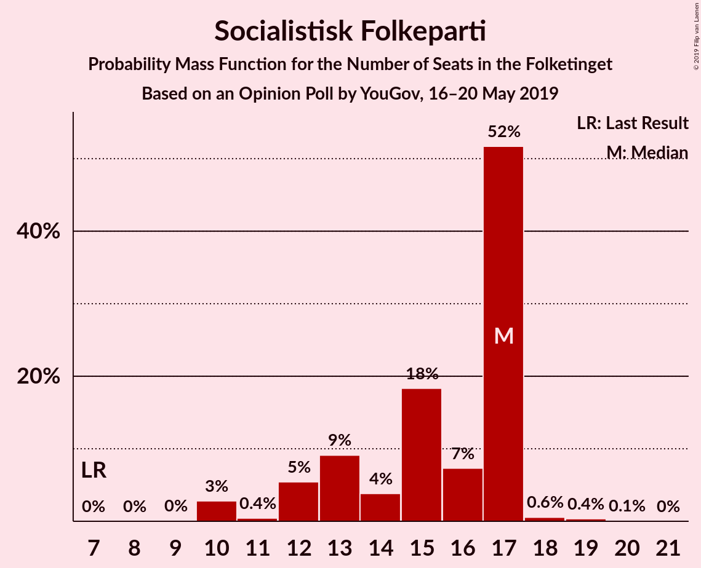

| Number of Seats | Probability | Accumulated | Special Marks |
|:---------------:|:-----------:|:-----------:|:-------------:|
| 7 | 0% | 100% | Last Result |
| 8 | 0% | 100% |  |
| 9 | 0% | 100% |  |
| 10 | 3% | 100% |  |
| 11 | 0.4% | 97% |  |
| 12 | 5% | 97% |  |
| 13 | 9% | 91% |  |
| 14 | 4% | 82% |  |
| 15 | 18% | 78% |  |
| 16 | 7% | 60% |  |
| 17 | 52% | 53% | Median |
| 18 | 0.6% | 1.0% |  |
| 19 | 0.4% | 0.4% |  |
| 20 | 0.1% | 0.1% |  |
| 21 | 0% | 0% |  |

### Radikale Venstre

*For a full overview of the results for this party, see the [Radikale Venstre](party-radikalevenstre.html) page.*

| Number of Seats | Probability | Accumulated | Special Marks |
|:---------------:|:-----------:|:-----------:|:-------------:|
| 8 | 0.2% | 100% | Last Result |
| 9 | 1.0% | 99.8% |  |
| 10 | 59% | 98.8% | Median |
| 11 | 4% | 39% |  |
| 12 | 7% | 36% |  |
| 13 | 24% | 28% |  |
| 14 | 1.3% | 4% |  |
| 15 | 2% | 3% |  |
| 16 | 1.1% | 1.3% |  |
| 17 | 0.2% | 0.2% |  |
| 18 | 0% | 0% |  |

### Det Konservative Folkeparti

*For a full overview of the results for this party, see the [Det Konservative Folkeparti](party-detkonservativefolkeparti.html) page.*

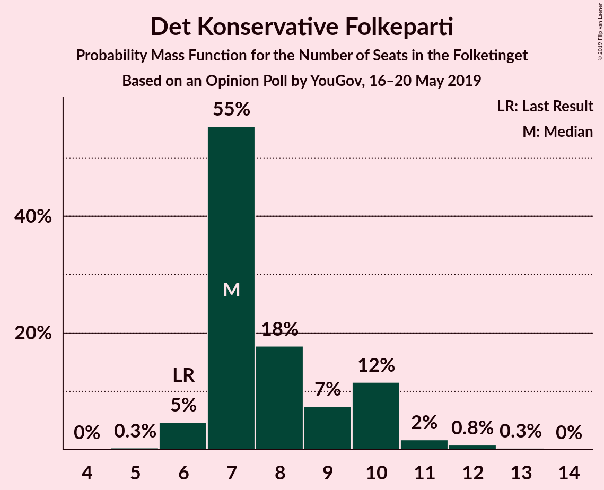

| Number of Seats | Probability | Accumulated | Special Marks |
|:---------------:|:-----------:|:-----------:|:-------------:|
| 5 | 0.3% | 100% |  |
| 6 | 5% | 99.7% | Last Result |
| 7 | 55% | 95% | Median |
| 8 | 18% | 40% |  |
| 9 | 7% | 22% |  |
| 10 | 12% | 14% |  |
| 11 | 2% | 3% |  |
| 12 | 0.8% | 1.1% |  |
| 13 | 0.3% | 0.3% |  |
| 14 | 0% | 0% |  |

### Nye Borgerlige

*For a full overview of the results for this party, see the [Nye Borgerlige](party-nyeborgerlige.html) page.*

| Number of Seats | Probability | Accumulated | Special Marks |
|:---------------:|:-----------:|:-----------:|:-------------:|
| 0 | 0% | 100% | Last Result |
| 1 | 0% | 100% |  |
| 2 | 0% | 100% |  |
| 3 | 0% | 100% |  |
| 4 | 0% | 100% |  |
| 5 | 7% | 100% |  |
| 6 | 73% | 93% | Median |
| 7 | 6% | 20% |  |
| 8 | 4% | 14% |  |
| 9 | 8% | 9% |  |
| 10 | 0.7% | 1.4% |  |
| 11 | 0.6% | 0.7% |  |
| 12 | 0.1% | 0.1% |  |
| 13 | 0% | 0% |  |

### Liberal Alliance

*For a full overview of the results for this party, see the [Liberal Alliance](party-liberalalliance.html) page.*

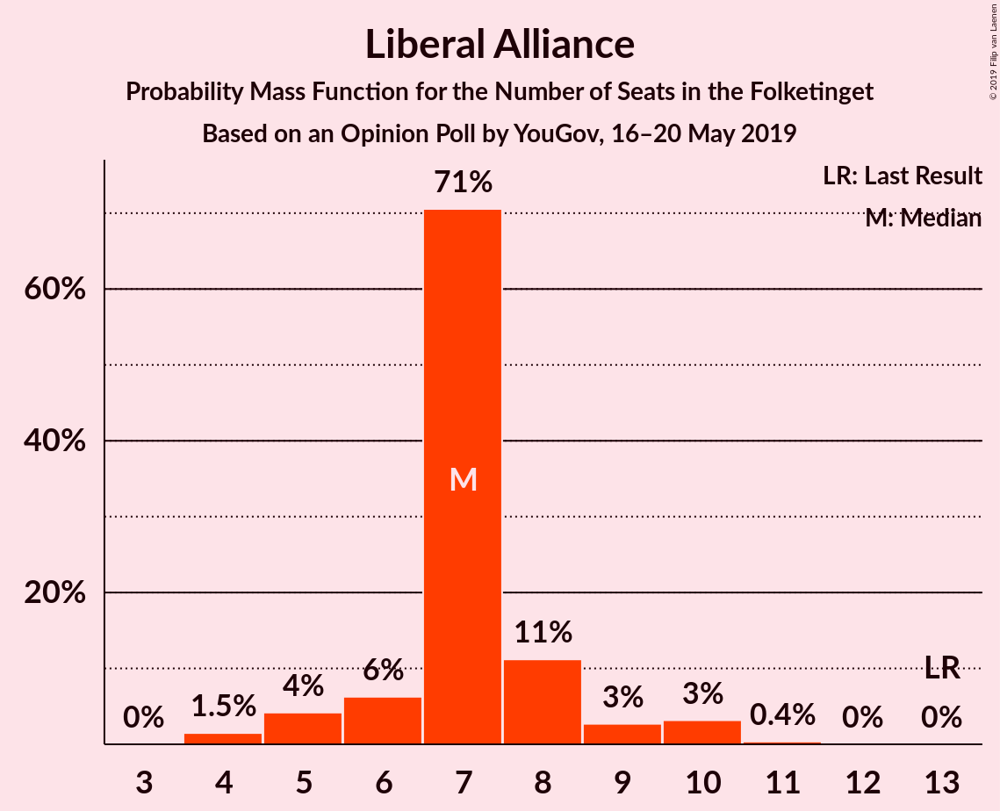

| Number of Seats | Probability | Accumulated | Special Marks |
|:---------------:|:-----------:|:-----------:|:-------------:|
| 4 | 1.5% | 100% |  |
| 5 | 4% | 98.5% |  |
| 6 | 6% | 94% |  |
| 7 | 71% | 88% | Median |
| 8 | 11% | 17% |  |
| 9 | 3% | 6% |  |
| 10 | 3% | 4% |  |
| 11 | 0.4% | 0.4% |  |
| 12 | 0% | 0% |  |
| 13 | 0% | 0% | Last Result |

### Alternativet

*For a full overview of the results for this party, see the [Alternativet](party-alternativet.html) page.*

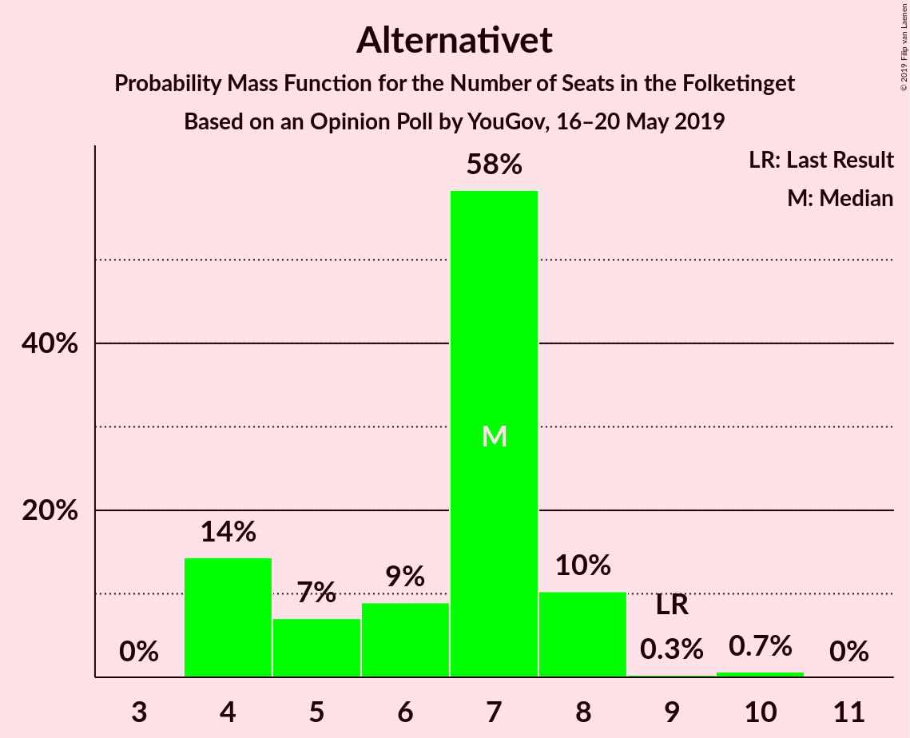

| Number of Seats | Probability | Accumulated | Special Marks |
|:---------------:|:-----------:|:-----------:|:-------------:|
| 4 | 14% | 100% |  |
| 5 | 7% | 86% |  |
| 6 | 9% | 79% |  |
| 7 | 58% | 70% | Median |
| 8 | 10% | 11% |  |
| 9 | 0.3% | 1.0% | Last Result |
| 10 | 0.7% | 0.7% |  |
| 11 | 0% | 0% |  |

### Stram Kurs

*For a full overview of the results for this party, see the [Stram Kurs](party-stramkurs.html) page.*

| Number of Seats | Probability | Accumulated | Special Marks |
|:---------------:|:-----------:|:-----------:|:-------------:|
| 0 | 2% | 100% | Last Result |
| 1 | 0% | 98% |  |
| 2 | 0% | 98% |  |
| 3 | 0.1% | 98% |  |
| 4 | 6% | 98% |  |
| 5 | 26% | 92% |  |
| 6 | 60% | 66% | Median |
| 7 | 5% | 6% |  |
| 8 | 0.2% | 1.0% |  |
| 9 | 0.8% | 0.8% |  |
| 10 | 0% | 0% |  |

### Kristendemokraterne

*For a full overview of the results for this party, see the [Kristendemokraterne](party-kristendemokraterne.html) page.*

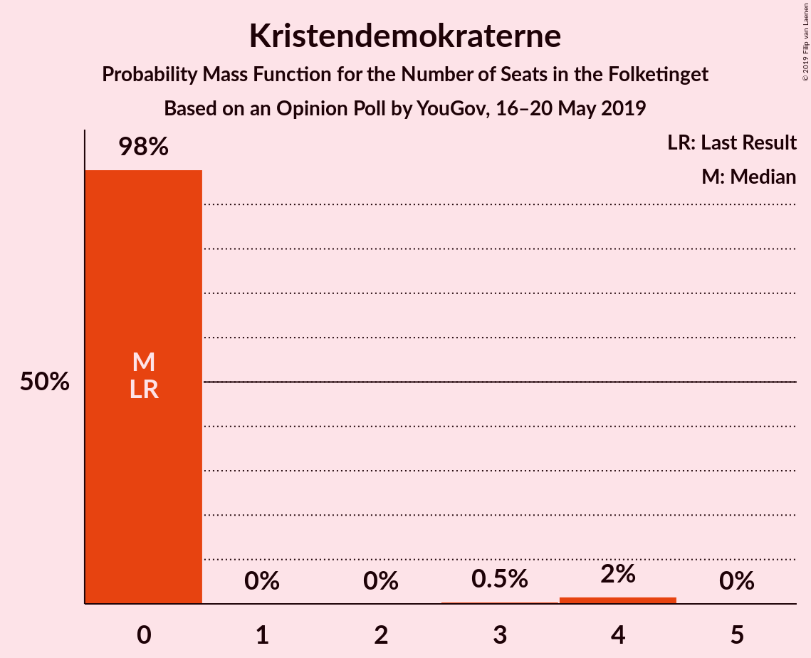

| Number of Seats | Probability | Accumulated | Special Marks |
|:---------------:|:-----------:|:-----------:|:-------------:|
| 0 | 98% | 100% | Last Result, Median |
| 1 | 0% | 2% |  |
| 2 | 0% | 2% |  |
| 3 | 0.5% | 2% |  |
| 4 | 2% | 2% |  |
| 5 | 0% | 0% |  |

### Klaus Riskær Pedersen

*For a full overview of the results for this party, see the [Klaus Riskær Pedersen](party-klausriskærpedersen.html) page.*

| Number of Seats | Probability | Accumulated | Special Marks |
|:---------------:|:-----------:|:-----------:|:-------------:|
| 0 | 99.7% | 100% | Last Result, Median |
| 1 | 0% | 0.3% |  |
| 2 | 0% | 0.3% |  |
| 3 | 0% | 0.3% |  |
| 4 | 0.3% | 0.3% |  |
| 5 | 0% | 0% |  |

## Coalitions

### Confidence Intervals

| Coalition | Last Result | Median | Majority? | 80% Confidence Interval | 90% Confidence Interval | 95% Confidence Interval | 99% Confidence Interval |
|:---------:|:-----------:|:------:|:---------:|:-----------------------:|:-----------------------:|:-----------------------:|:-----------------------:|
| Socialdemokraterne – Enhedslisten–De Rød-Grønne – Socialistisk Folkeparti – Radikale Venstre – Alternativet | 85 | 101 | 100% | 95–101 | 95–102 | 94–103 | 92–107 |
| Socialdemokraterne – Enhedslisten–De Rød-Grønne – Socialistisk Folkeparti – Radikale Venstre | 76 | 94 | 93% | 90–94 | 89–97 | 88–98 | 86–100 |
| Socialdemokraterne – Enhedslisten–De Rød-Grønne – Socialistisk Folkeparti – Alternativet | 77 | 91 | 62% | 82–91 | 82–91 | 82–91 | 80–97 |
| Socialdemokraterne – Enhedslisten–De Rød-Grønne – Socialistisk Folkeparti | 68 | 84 | 0.6% | 78–84 | 77–84 | 76–86 | 74–90 |
| Venstre – Dansk Folkeparti – Det Konservative Folkeparti – Nye Borgerlige – Liberal Alliance – Stram Kurs – Kristendemokraterne – Klaus Riskær Pedersen | 90 | 74 | 0% | 74–80 | 73–80 | 72–81 | 68–83 |
| Socialdemokraterne – Socialistisk Folkeparti – Radikale Venstre | 62 | 79 | 0% | 74–79 | 73–80 | 70–81 | 70–83 |
| Venstre – Dansk Folkeparti – Det Konservative Folkeparti – Nye Borgerlige – Liberal Alliance – Kristendemokraterne – Klaus Riskær Pedersen | 90 | 68 | 0% | 68–75 | 67–75 | 67–75 | 64–78 |
| Venstre – Dansk Folkeparti – Det Konservative Folkeparti – Nye Borgerlige – Liberal Alliance – Klaus Riskær Pedersen | 90 | 68 | 0% | 68–75 | 67–75 | 67–75 | 64–78 |
| Venstre – Dansk Folkeparti – Det Konservative Folkeparti – Nye Borgerlige – Liberal Alliance – Kristendemokraterne | 90 | 68 | 0% | 68–75 | 67–75 | 67–75 | 64–78 |
| Venstre – Dansk Folkeparti – Det Konservative Folkeparti – Nye Borgerlige – Liberal Alliance | 90 | 68 | 0% | 68–75 | 67–75 | 67–75 | 64–78 |
| Venstre – Dansk Folkeparti – Det Konservative Folkeparti – Liberal Alliance – Kristendemokraterne | 90 | 62 | 0% | 62–69 | 60–69 | 59–69 | 58–70 |
| Venstre – Dansk Folkeparti – Det Konservative Folkeparti – Liberal Alliance | 90 | 62 | 0% | 62–69 | 60–69 | 59–69 | 58–70 |
| Socialdemokraterne – Radikale Venstre | 55 | 62 | 0% | 59–64 | 58–66 | 57–67 | 57–68 |
| Venstre – Det Konservative Folkeparti – Liberal Alliance | 53 | 44 | 0% | 43–47 | 40–47 | 39–49 | 39–50 |
| Venstre – Det Konservative Folkeparti | 40 | 37 | 0% | 35–40 | 34–40 | 32–40 | 32–42 |
| Venstre | 34 | 30 | 0% | 27–32 | 26–32 | 26–32 | 23–33 |

### Socialdemokraterne – Enhedslisten–De Rød-Grønne – Socialistisk Folkeparti – Radikale Venstre – Alternativet

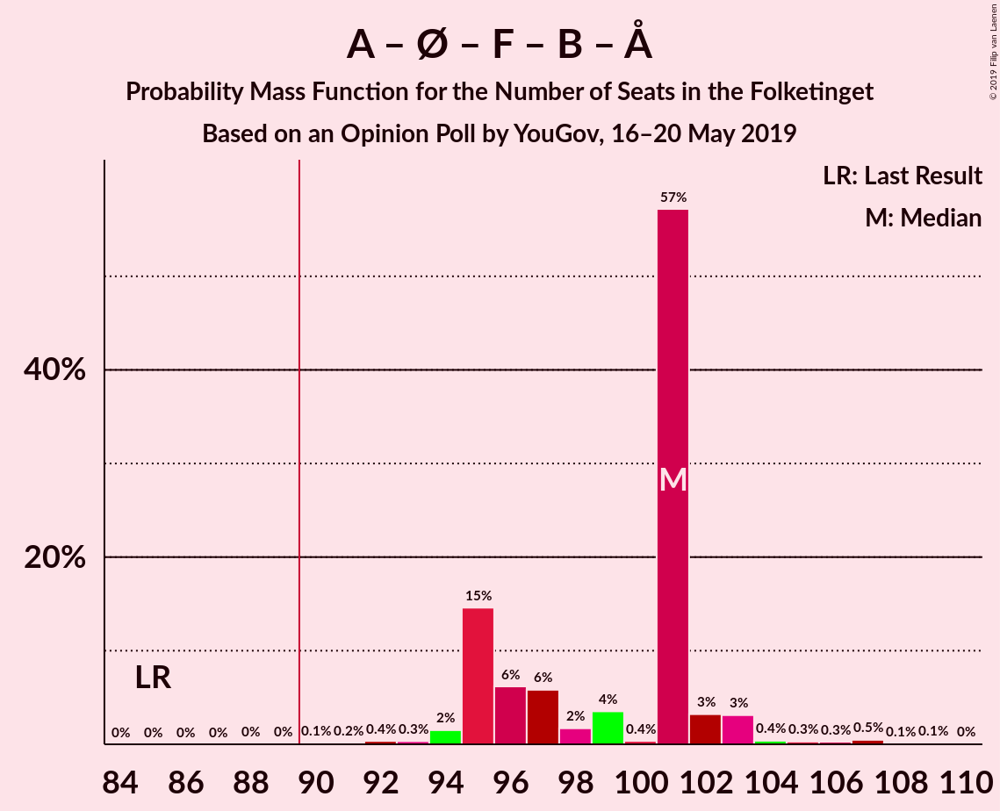

| Number of Seats | Probability | Accumulated | Special Marks |
|:---------------:|:-----------:|:-----------:|:-------------:|
| 85 | 0% | 100% | Last Result |
| 86 | 0% | 100% |  |
| 87 | 0% | 100% |  |
| 88 | 0% | 100% |  |
| 89 | 0% | 100% |  |
| 90 | 0.1% | 100% | Majority |
| 91 | 0.2% | 99.8% |  |
| 92 | 0.4% | 99.7% |  |
| 93 | 0.3% | 99.3% |  |
| 94 | 2% | 99.0% |  |
| 95 | 15% | 97% |  |
| 96 | 6% | 83% |  |
| 97 | 6% | 77% |  |
| 98 | 2% | 71% |  |
| 99 | 4% | 69% |  |
| 100 | 0.4% | 66% |  |
| 101 | 57% | 65% | Median |
| 102 | 3% | 8% |  |
| 103 | 3% | 5% |  |
| 104 | 0.4% | 2% |  |
| 105 | 0.3% | 1.3% |  |
| 106 | 0.3% | 1.0% |  |
| 107 | 0.5% | 0.7% |  |
| 108 | 0.1% | 0.3% |  |
| 109 | 0.1% | 0.2% |  |
| 110 | 0% | 0% |  |

### Socialdemokraterne – Enhedslisten–De Rød-Grønne – Socialistisk Folkeparti – Radikale Venstre

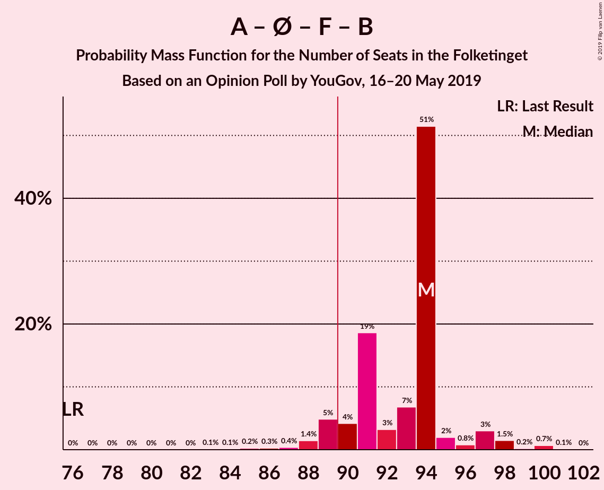

| Number of Seats | Probability | Accumulated | Special Marks |
|:---------------:|:-----------:|:-----------:|:-------------:|
| 76 | 0% | 100% | Last Result |
| 77 | 0% | 100% |  |
| 78 | 0% | 100% |  |
| 79 | 0% | 100% |  |
| 80 | 0% | 100% |  |
| 81 | 0% | 100% |  |
| 82 | 0% | 100% |  |
| 83 | 0.1% | 100% |  |
| 84 | 0.1% | 99.9% |  |
| 85 | 0.2% | 99.8% |  |
| 86 | 0.3% | 99.5% |  |
| 87 | 0.4% | 99.3% |  |
| 88 | 1.4% | 98.9% |  |
| 89 | 5% | 97% |  |
| 90 | 4% | 93% | Majority |
| 91 | 19% | 88% |  |
| 92 | 3% | 70% |  |
| 93 | 7% | 67% |  |
| 94 | 51% | 60% | Median |
| 95 | 2% | 8% |  |
| 96 | 0.8% | 6% |  |
| 97 | 3% | 6% |  |
| 98 | 1.5% | 3% |  |
| 99 | 0.2% | 1.1% |  |
| 100 | 0.7% | 0.9% |  |
| 101 | 0.1% | 0.2% |  |
| 102 | 0% | 0% |  |

### Socialdemokraterne – Enhedslisten–De Rød-Grønne – Socialistisk Folkeparti – Alternativet

| Number of Seats | Probability | Accumulated | Special Marks |
|:---------------:|:-----------:|:-----------:|:-------------:|
| 77 | 0.1% | 100% | Last Result |
| 78 | 0.1% | 99.9% |  |
| 79 | 0.3% | 99.8% |  |
| 80 | 1.0% | 99.6% |  |
| 81 | 0.3% | 98.6% |  |
| 82 | 14% | 98% |  |
| 83 | 2% | 84% |  |
| 84 | 8% | 82% |  |
| 85 | 1.4% | 74% |  |
| 86 | 7% | 73% |  |
| 87 | 0.6% | 66% |  |
| 88 | 1.4% | 65% |  |
| 89 | 2% | 64% |  |
| 90 | 3% | 62% | Majority |
| 91 | 57% | 59% | Median |
| 92 | 0.5% | 2% |  |
| 93 | 0.3% | 1.3% |  |
| 94 | 0% | 1.0% |  |
| 95 | 0.2% | 1.0% |  |
| 96 | 0.1% | 0.8% |  |
| 97 | 0.6% | 0.6% |  |
| 98 | 0% | 0% |  |

### Socialdemokraterne – Enhedslisten–De Rød-Grønne – Socialistisk Folkeparti

| Number of Seats | Probability | Accumulated | Special Marks |
|:---------------:|:-----------:|:-----------:|:-------------:|
| 68 | 0% | 100% | Last Result |
| 69 | 0% | 100% |  |
| 70 | 0% | 100% |  |
| 71 | 0.1% | 100% |  |
| 72 | 0.1% | 99.9% |  |
| 73 | 0.1% | 99.8% |  |
| 74 | 0.4% | 99.7% |  |
| 75 | 1.1% | 99.3% |  |
| 76 | 2% | 98% |  |
| 77 | 2% | 96% |  |
| 78 | 21% | 94% |  |
| 79 | 6% | 73% |  |
| 80 | 1.3% | 67% |  |
| 81 | 2% | 66% |  |
| 82 | 2% | 64% |  |
| 83 | 5% | 62% |  |
| 84 | 54% | 57% | Median |
| 85 | 0.3% | 3% |  |
| 86 | 2% | 3% |  |
| 87 | 0.2% | 1.1% |  |
| 88 | 0% | 0.9% |  |
| 89 | 0.3% | 0.9% |  |
| 90 | 0.5% | 0.6% | Majority |
| 91 | 0% | 0% |  |

### Venstre – Dansk Folkeparti – Det Konservative Folkeparti – Nye Borgerlige – Liberal Alliance – Stram Kurs – Kristendemokraterne – Klaus Riskær Pedersen

| Number of Seats | Probability | Accumulated | Special Marks |
|:---------------:|:-----------:|:-----------:|:-------------:|
| 66 | 0.1% | 100% |  |
| 67 | 0.1% | 99.8% |  |
| 68 | 0.5% | 99.7% |  |
| 69 | 0.3% | 99.3% |  |
| 70 | 0.3% | 99.0% |  |
| 71 | 0.4% | 98.7% |  |
| 72 | 3% | 98% |  |
| 73 | 3% | 95% |  |
| 74 | 57% | 92% | Median |
| 75 | 0.4% | 35% |  |
| 76 | 4% | 34% |  |
| 77 | 2% | 31% |  |
| 78 | 6% | 29% |  |
| 79 | 6% | 23% |  |
| 80 | 15% | 17% |  |
| 81 | 2% | 3% |  |
| 82 | 0.3% | 1.0% |  |
| 83 | 0.4% | 0.7% |  |
| 84 | 0.2% | 0.3% |  |
| 85 | 0.1% | 0.2% |  |
| 86 | 0% | 0% |  |
| 87 | 0% | 0% |  |
| 88 | 0% | 0% |  |
| 89 | 0% | 0% |  |
| 90 | 0% | 0% | Last Result, Majority |

### Socialdemokraterne – Socialistisk Folkeparti – Radikale Venstre

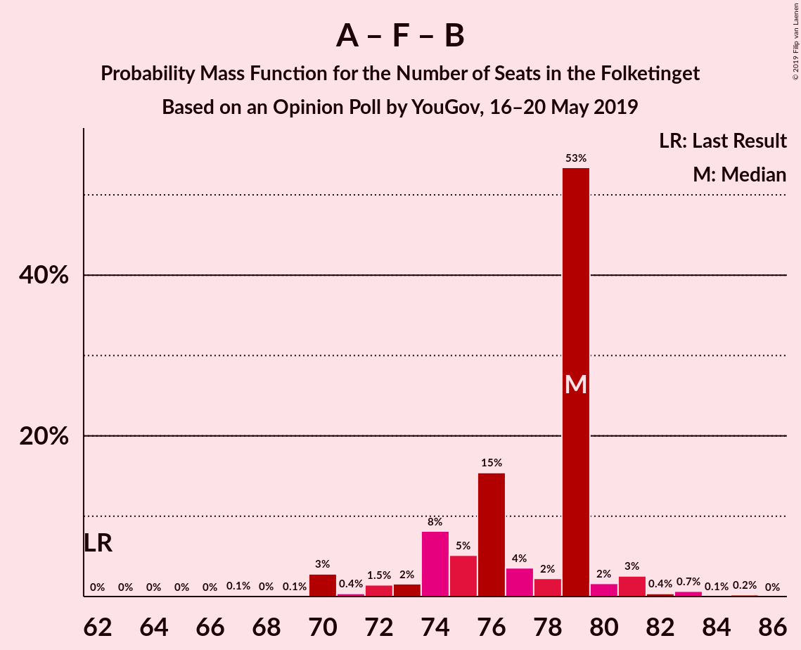

| Number of Seats | Probability | Accumulated | Special Marks |
|:---------------:|:-----------:|:-----------:|:-------------:|
| 62 | 0% | 100% | Last Result |
| 63 | 0% | 100% |  |
| 64 | 0% | 100% |  |
| 65 | 0% | 100% |  |
| 66 | 0% | 100% |  |
| 67 | 0.1% | 100% |  |
| 68 | 0% | 99.9% |  |
| 69 | 0.1% | 99.9% |  |
| 70 | 3% | 99.8% |  |
| 71 | 0.4% | 97% |  |
| 72 | 1.5% | 97% |  |
| 73 | 2% | 95% |  |
| 74 | 8% | 94% |  |
| 75 | 5% | 85% |  |
| 76 | 15% | 80% |  |
| 77 | 4% | 65% |  |
| 78 | 2% | 61% |  |
| 79 | 53% | 59% | Median |
| 80 | 2% | 6% |  |
| 81 | 3% | 4% |  |
| 82 | 0.4% | 1.4% |  |
| 83 | 0.7% | 1.0% |  |
| 84 | 0.1% | 0.3% |  |
| 85 | 0.2% | 0.3% |  |
| 86 | 0% | 0% |  |

### Venstre – Dansk Folkeparti – Det Konservative Folkeparti – Nye Borgerlige – Liberal Alliance – Kristendemokraterne – Klaus Riskær Pedersen

| Number of Seats | Probability | Accumulated | Special Marks |
|:---------------:|:-----------:|:-----------:|:-------------:|
| 61 | 0.1% | 100% |  |
| 62 | 0.1% | 99.9% |  |
| 63 | 0.1% | 99.8% |  |
| 64 | 0.5% | 99.6% |  |
| 65 | 0.3% | 99.1% |  |
| 66 | 0.3% | 98.8% |  |
| 67 | 4% | 98% |  |
| 68 | 52% | 94% | Median |
| 69 | 8% | 42% |  |
| 70 | 1.3% | 34% |  |
| 71 | 2% | 33% |  |
| 72 | 3% | 31% |  |
| 73 | 6% | 28% |  |
| 74 | 6% | 22% |  |
| 75 | 15% | 16% |  |
| 76 | 0.2% | 2% |  |
| 77 | 0.7% | 1.3% |  |
| 78 | 0.3% | 0.7% |  |
| 79 | 0.3% | 0.4% |  |
| 80 | 0% | 0.1% |  |
| 81 | 0.1% | 0.1% |  |
| 82 | 0% | 0% |  |
| 83 | 0% | 0% |  |
| 84 | 0% | 0% |  |
| 85 | 0% | 0% |  |
| 86 | 0% | 0% |  |
| 87 | 0% | 0% |  |
| 88 | 0% | 0% |  |
| 89 | 0% | 0% |  |
| 90 | 0% | 0% | Last Result, Majority |

### Venstre – Dansk Folkeparti – Det Konservative Folkeparti – Nye Borgerlige – Liberal Alliance – Klaus Riskær Pedersen

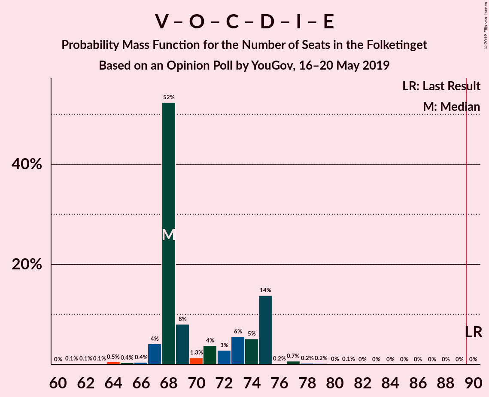

| Number of Seats | Probability | Accumulated | Special Marks |
|:---------------:|:-----------:|:-----------:|:-------------:|
| 61 | 0.1% | 100% |  |
| 62 | 0.1% | 99.9% |  |
| 63 | 0.1% | 99.8% |  |
| 64 | 0.5% | 99.6% |  |
| 65 | 0.4% | 99.1% |  |
| 66 | 0.4% | 98.8% |  |
| 67 | 4% | 98% |  |
| 68 | 52% | 94% | Median |
| 69 | 8% | 42% |  |
| 70 | 1.3% | 34% |  |
| 71 | 4% | 32% |  |
| 72 | 3% | 29% |  |
| 73 | 6% | 26% |  |
| 74 | 5% | 20% |  |
| 75 | 14% | 15% |  |
| 76 | 0.2% | 1.4% |  |
| 77 | 0.7% | 1.2% |  |
| 78 | 0.2% | 0.5% |  |
| 79 | 0.2% | 0.3% |  |
| 80 | 0% | 0.1% |  |
| 81 | 0.1% | 0.1% |  |
| 82 | 0% | 0% |  |
| 83 | 0% | 0% |  |
| 84 | 0% | 0% |  |
| 85 | 0% | 0% |  |
| 86 | 0% | 0% |  |
| 87 | 0% | 0% |  |
| 88 | 0% | 0% |  |
| 89 | 0% | 0% |  |
| 90 | 0% | 0% | Last Result, Majority |

### Venstre – Dansk Folkeparti – Det Konservative Folkeparti – Nye Borgerlige – Liberal Alliance – Kristendemokraterne

| Number of Seats | Probability | Accumulated | Special Marks |
|:---------------:|:-----------:|:-----------:|:-------------:|
| 61 | 0.1% | 100% |  |
| 62 | 0.1% | 99.9% |  |
| 63 | 0.1% | 99.8% |  |
| 64 | 0.5% | 99.6% |  |
| 65 | 0.3% | 99.1% |  |
| 66 | 0.3% | 98.8% |  |
| 67 | 4% | 98% |  |
| 68 | 52% | 94% | Median |
| 69 | 8% | 42% |  |
| 70 | 1.5% | 34% |  |
| 71 | 2% | 33% |  |
| 72 | 3% | 30% |  |
| 73 | 6% | 27% |  |
| 74 | 6% | 22% |  |
| 75 | 15% | 16% |  |
| 76 | 0.2% | 1.5% |  |
| 77 | 0.6% | 1.3% |  |
| 78 | 0.2% | 0.6% |  |
| 79 | 0.3% | 0.4% |  |
| 80 | 0% | 0.1% |  |
| 81 | 0% | 0.1% |  |
| 82 | 0% | 0% |  |
| 83 | 0% | 0% |  |
| 84 | 0% | 0% |  |
| 85 | 0% | 0% |  |
| 86 | 0% | 0% |  |
| 87 | 0% | 0% |  |
| 88 | 0% | 0% |  |
| 89 | 0% | 0% |  |
| 90 | 0% | 0% | Last Result, Majority |

### Venstre – Dansk Folkeparti – Det Konservative Folkeparti – Nye Borgerlige – Liberal Alliance

| Number of Seats | Probability | Accumulated | Special Marks |
|:---------------:|:-----------:|:-----------:|:-------------:|
| 61 | 0.1% | 100% |  |
| 62 | 0.1% | 99.9% |  |
| 63 | 0.1% | 99.8% |  |
| 64 | 0.5% | 99.6% |  |
| 65 | 0.4% | 99.1% |  |
| 66 | 0.4% | 98.7% |  |
| 67 | 4% | 98% |  |
| 68 | 52% | 94% | Median |
| 69 | 8% | 42% |  |
| 70 | 2% | 34% |  |
| 71 | 4% | 32% |  |
| 72 | 3% | 28% |  |
| 73 | 6% | 26% |  |
| 74 | 5% | 20% |  |
| 75 | 14% | 15% |  |
| 76 | 0.2% | 1.3% |  |
| 77 | 0.6% | 1.1% |  |
| 78 | 0.2% | 0.5% |  |
| 79 | 0.2% | 0.3% |  |
| 80 | 0% | 0.1% |  |
| 81 | 0% | 0.1% |  |
| 82 | 0% | 0% |  |
| 83 | 0% | 0% |  |
| 84 | 0% | 0% |  |
| 85 | 0% | 0% |  |
| 86 | 0% | 0% |  |
| 87 | 0% | 0% |  |
| 88 | 0% | 0% |  |
| 89 | 0% | 0% |  |
| 90 | 0% | 0% | Last Result, Majority |

### Venstre – Dansk Folkeparti – Det Konservative Folkeparti – Liberal Alliance – Kristendemokraterne

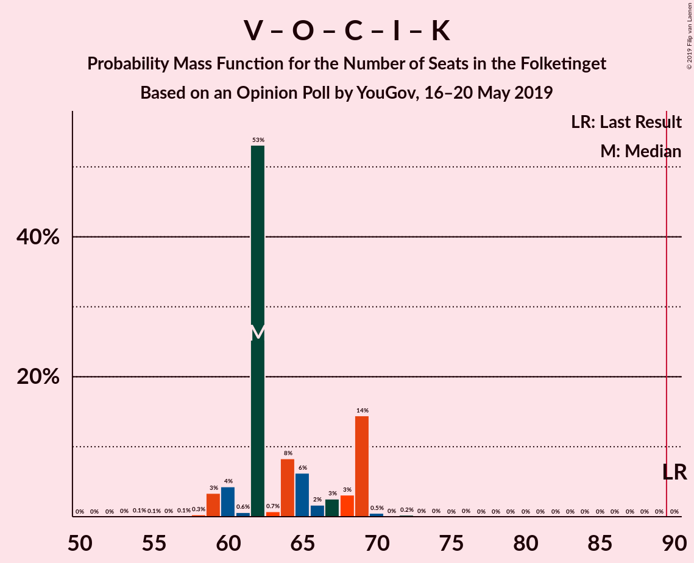

| Number of Seats | Probability | Accumulated | Special Marks |
|:---------------:|:-----------:|:-----------:|:-------------:|
| 54 | 0.1% | 100% |  |
| 55 | 0.1% | 99.9% |  |
| 56 | 0% | 99.8% |  |
| 57 | 0.1% | 99.8% |  |
| 58 | 0.3% | 99.6% |  |
| 59 | 3% | 99.3% |  |
| 60 | 4% | 96% |  |
| 61 | 0.6% | 92% |  |
| 62 | 53% | 91% | Median |
| 63 | 0.7% | 38% |  |
| 64 | 8% | 37% |  |
| 65 | 6% | 29% |  |
| 66 | 2% | 23% |  |
| 67 | 3% | 21% |  |
| 68 | 3% | 18% |  |
| 69 | 14% | 15% |  |
| 70 | 0.5% | 0.8% |  |
| 71 | 0% | 0.3% |  |
| 72 | 0.2% | 0.3% |  |
| 73 | 0% | 0% |  |
| 74 | 0% | 0% |  |
| 75 | 0% | 0% |  |
| 76 | 0% | 0% |  |
| 77 | 0% | 0% |  |
| 78 | 0% | 0% |  |
| 79 | 0% | 0% |  |
| 80 | 0% | 0% |  |
| 81 | 0% | 0% |  |
| 82 | 0% | 0% |  |
| 83 | 0% | 0% |  |
| 84 | 0% | 0% |  |
| 85 | 0% | 0% |  |
| 86 | 0% | 0% |  |
| 87 | 0% | 0% |  |
| 88 | 0% | 0% |  |
| 89 | 0% | 0% |  |
| 90 | 0% | 0% | Last Result, Majority |

### Venstre – Dansk Folkeparti – Det Konservative Folkeparti – Liberal Alliance

| Number of Seats | Probability | Accumulated | Special Marks |
|:---------------:|:-----------:|:-----------:|:-------------:|
| 54 | 0.1% | 100% |  |
| 55 | 0.1% | 99.9% |  |
| 56 | 0% | 99.8% |  |
| 57 | 0.2% | 99.8% |  |
| 58 | 0.4% | 99.6% |  |
| 59 | 3% | 99.2% |  |
| 60 | 4% | 96% |  |
| 61 | 0.6% | 91% |  |
| 62 | 53% | 91% | Median |
| 63 | 0.7% | 38% |  |
| 64 | 9% | 37% |  |
| 65 | 7% | 28% |  |
| 66 | 2% | 21% |  |
| 67 | 2% | 19% |  |
| 68 | 3% | 17% |  |
| 69 | 14% | 14% |  |
| 70 | 0.3% | 0.6% |  |
| 71 | 0% | 0.3% |  |
| 72 | 0.2% | 0.3% |  |
| 73 | 0% | 0% |  |
| 74 | 0% | 0% |  |
| 75 | 0% | 0% |  |
| 76 | 0% | 0% |  |
| 77 | 0% | 0% |  |
| 78 | 0% | 0% |  |
| 79 | 0% | 0% |  |
| 80 | 0% | 0% |  |
| 81 | 0% | 0% |  |
| 82 | 0% | 0% |  |
| 83 | 0% | 0% |  |
| 84 | 0% | 0% |  |
| 85 | 0% | 0% |  |
| 86 | 0% | 0% |  |
| 87 | 0% | 0% |  |
| 88 | 0% | 0% |  |
| 89 | 0% | 0% |  |
| 90 | 0% | 0% | Last Result, Majority |

### Socialdemokraterne – Radikale Venstre

| Number of Seats | Probability | Accumulated | Special Marks |
|:---------------:|:-----------:|:-----------:|:-------------:|
| 54 | 0% | 100% |  |
| 55 | 0.1% | 99.9% | Last Result |
| 56 | 0.1% | 99.8% |  |
| 57 | 3% | 99.7% |  |
| 58 | 5% | 96% |  |
| 59 | 2% | 91% |  |
| 60 | 2% | 90% |  |
| 61 | 15% | 87% |  |
| 62 | 57% | 72% | Median |
| 63 | 3% | 15% |  |
| 64 | 2% | 12% |  |
| 65 | 3% | 10% |  |
| 66 | 2% | 6% |  |
| 67 | 4% | 4% |  |
| 68 | 0.3% | 0.6% |  |
| 69 | 0.2% | 0.4% |  |
| 70 | 0.1% | 0.2% |  |
| 71 | 0% | 0.1% |  |
| 72 | 0% | 0% |  |

### Venstre – Det Konservative Folkeparti – Liberal Alliance

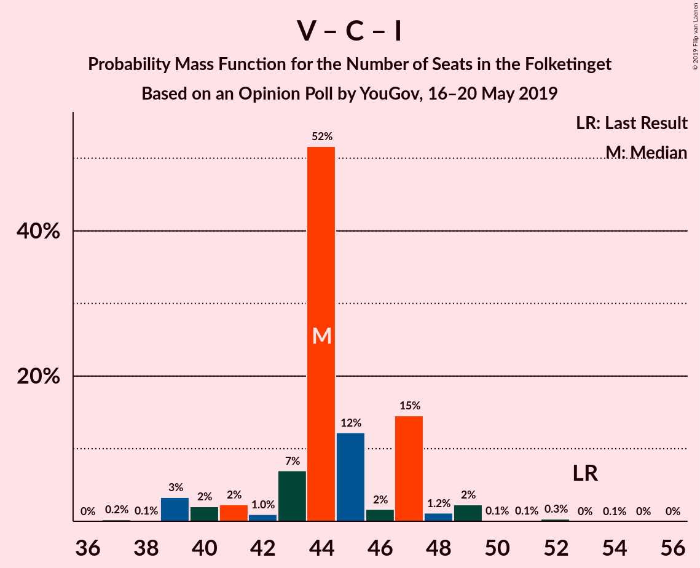

| Number of Seats | Probability | Accumulated | Special Marks |
|:---------------:|:-----------:|:-----------:|:-------------:|
| 37 | 0.2% | 100% |  |
| 38 | 0.1% | 99.8% |  |
| 39 | 3% | 99.6% |  |
| 40 | 2% | 96% |  |
| 41 | 2% | 94% |  |
| 42 | 1.0% | 92% |  |
| 43 | 7% | 91% |  |
| 44 | 52% | 84% | Median |
| 45 | 12% | 32% |  |
| 46 | 2% | 20% |  |
| 47 | 15% | 19% |  |
| 48 | 1.2% | 4% |  |
| 49 | 2% | 3% |  |
| 50 | 0.1% | 0.5% |  |
| 51 | 0.1% | 0.5% |  |
| 52 | 0.3% | 0.4% |  |
| 53 | 0% | 0.1% | Last Result |
| 54 | 0.1% | 0.1% |  |
| 55 | 0% | 0% |  |

### Venstre – Det Konservative Folkeparti

| Number of Seats | Probability | Accumulated | Special Marks |
|:---------------:|:-----------:|:-----------:|:-------------:|
| 29 | 0.1% | 100% |  |
| 30 | 0% | 99.9% |  |
| 31 | 0.1% | 99.8% |  |
| 32 | 4% | 99.7% |  |
| 33 | 0.6% | 96% |  |
| 34 | 0.6% | 95% |  |
| 35 | 5% | 95% |  |
| 36 | 5% | 90% |  |
| 37 | 57% | 85% | Median |
| 38 | 6% | 28% |  |
| 39 | 6% | 22% |  |
| 40 | 14% | 16% | Last Result |
| 41 | 0.6% | 1.2% |  |
| 42 | 0.2% | 0.7% |  |
| 43 | 0.3% | 0.5% |  |
| 44 | 0.1% | 0.2% |  |
| 45 | 0.1% | 0.1% |  |
| 46 | 0% | 0% |  |

### Venstre

| Number of Seats | Probability | Accumulated | Special Marks |
|:---------------:|:-----------:|:-----------:|:-------------:|
| 21 | 0.1% | 100% |  |
| 22 | 0.1% | 99.9% |  |
| 23 | 0.7% | 99.8% |  |
| 24 | 0.4% | 99.1% |  |
| 25 | 1.1% | 98.7% |  |
| 26 | 7% | 98% |  |
| 27 | 8% | 91% |  |
| 28 | 6% | 82% |  |
| 29 | 4% | 76% |  |
| 30 | 53% | 72% | Median |
| 31 | 2% | 19% |  |
| 32 | 16% | 17% |  |
| 33 | 0.2% | 0.6% |  |
| 34 | 0.3% | 0.5% | Last Result |
| 35 | 0.1% | 0.1% |  |
| 36 | 0% | 0% |  |

## Technical Information

### Opinion Poll

+ **Polling firm:** YouGov
+ **Commissioner(s):** —
+ **Fieldwork period:** 16–20 May 2019

### Calculations

+ **Sample size:** 1087
+ **Simulations done:** 1,048,576
+ **Error estimate:** 2.32%

