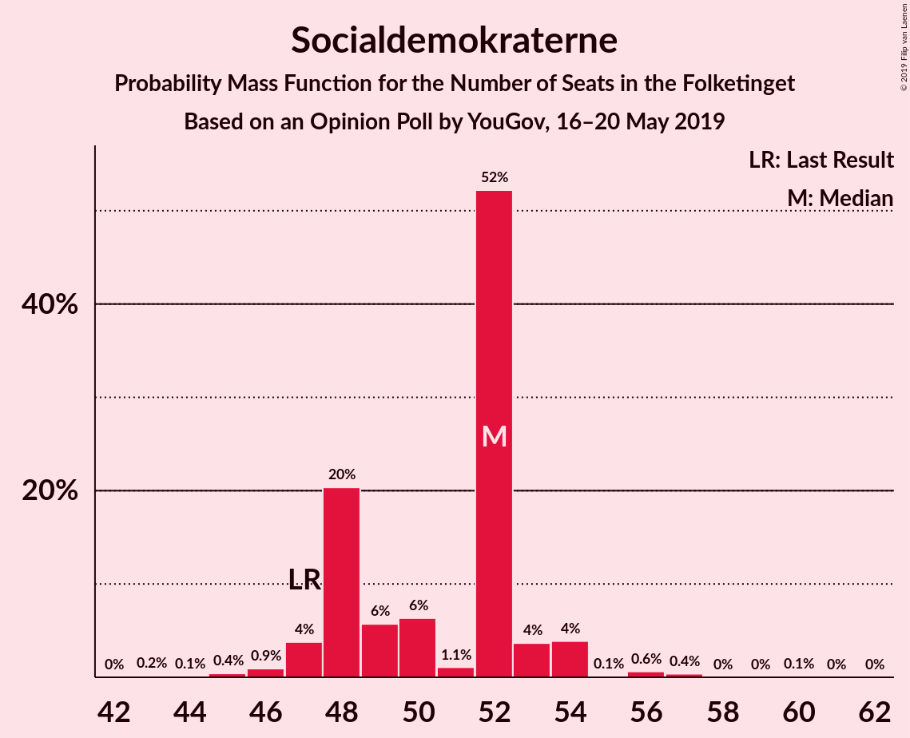
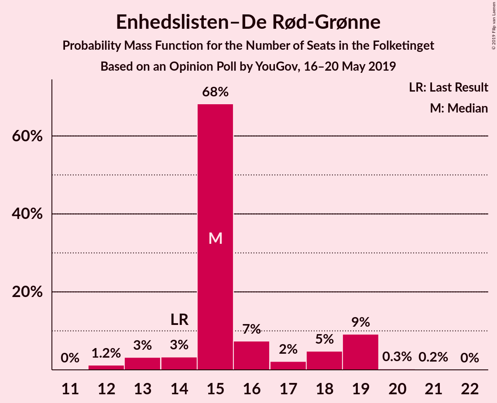
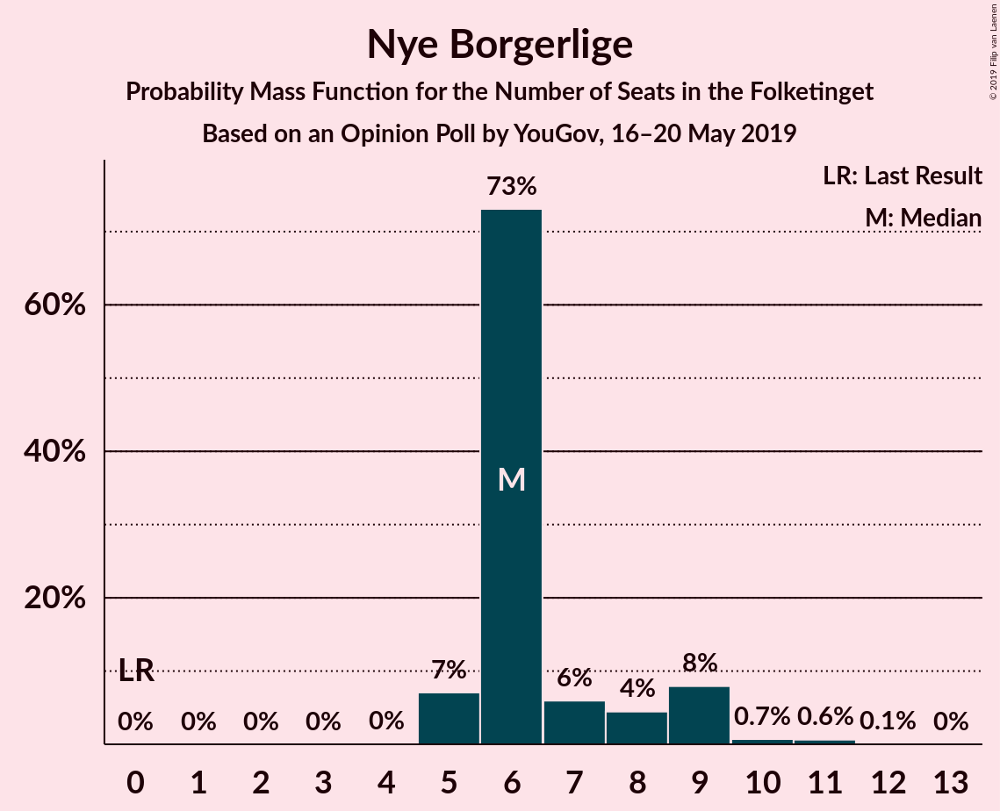
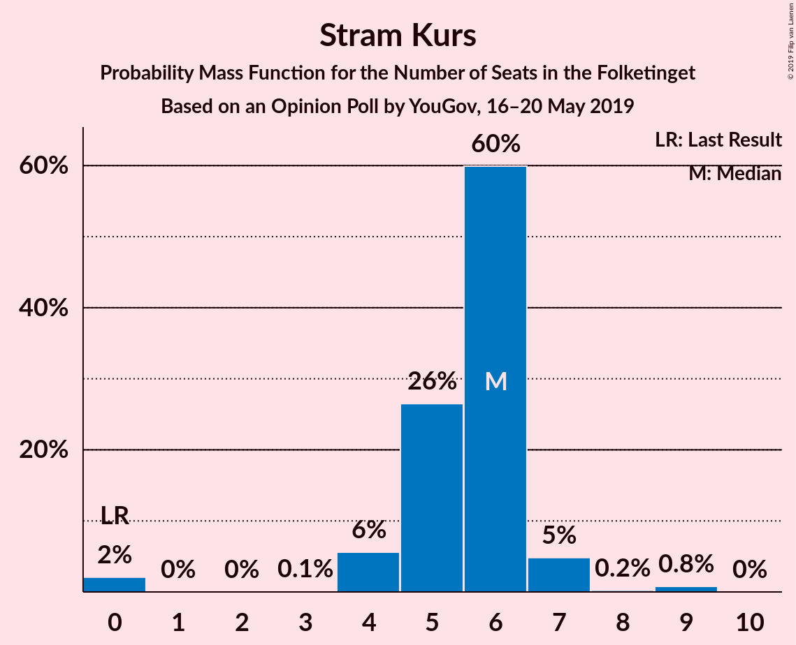
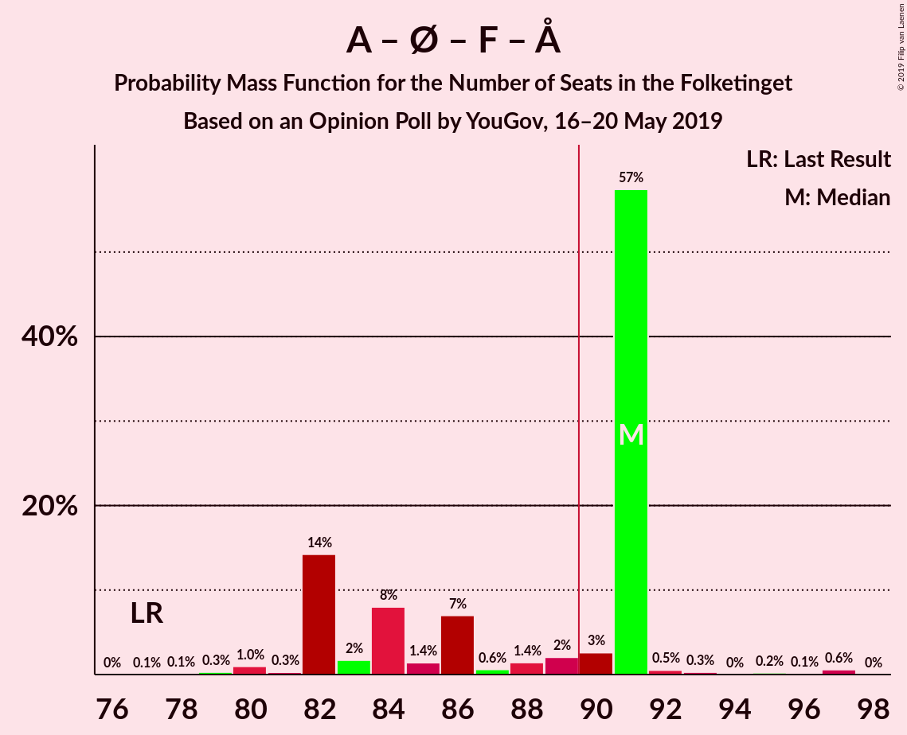
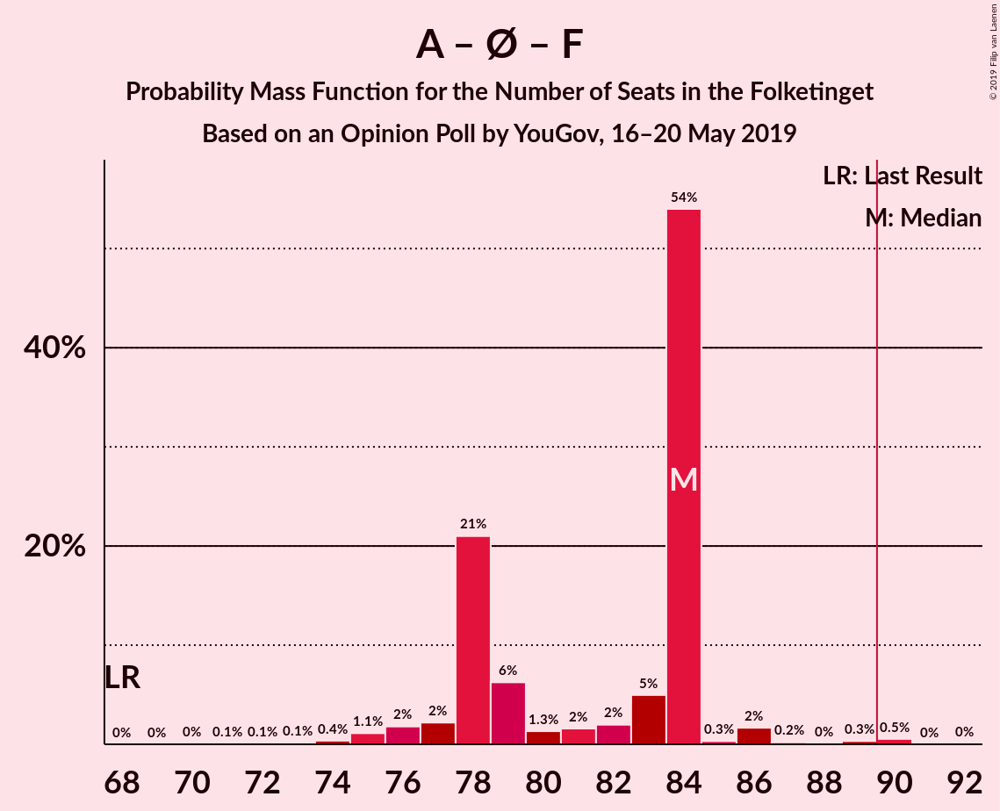
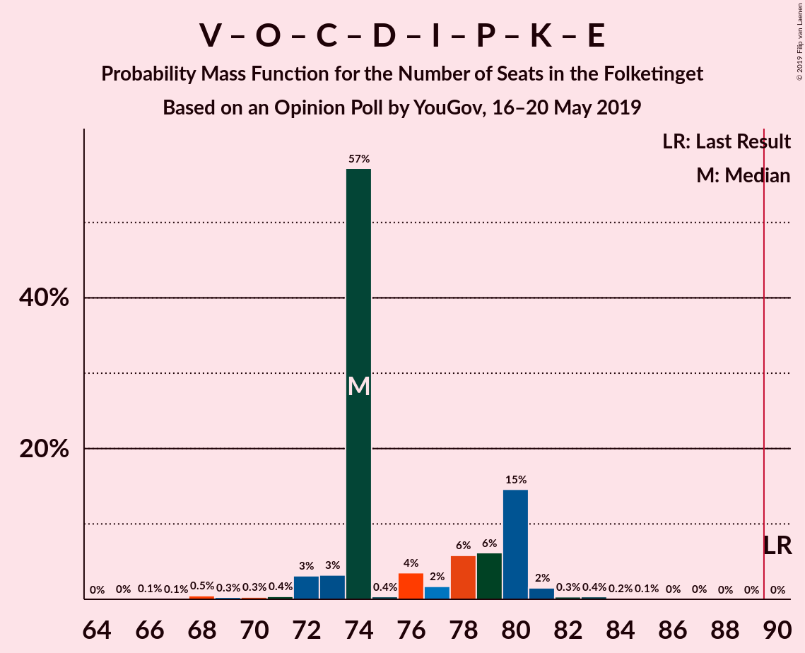
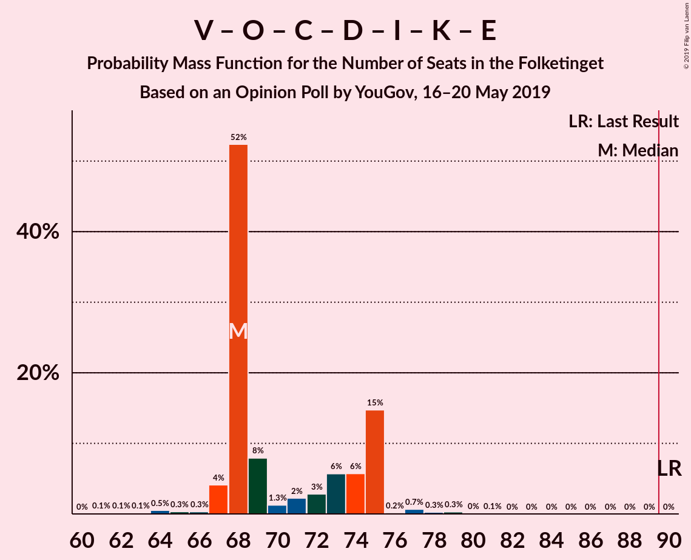
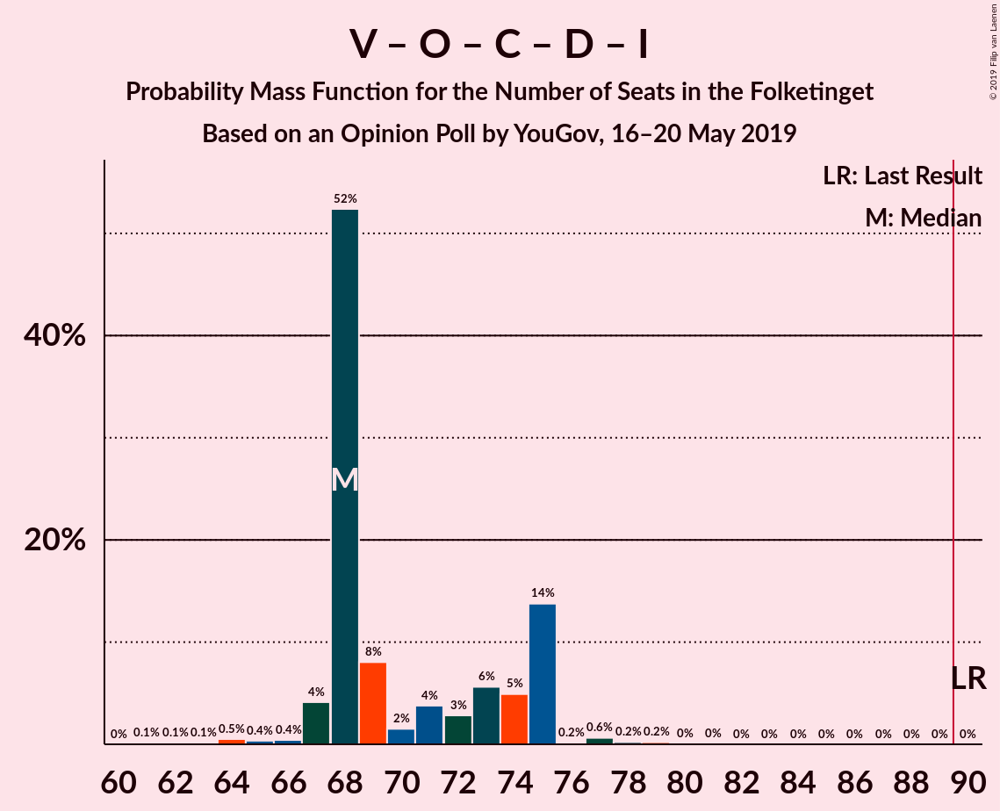
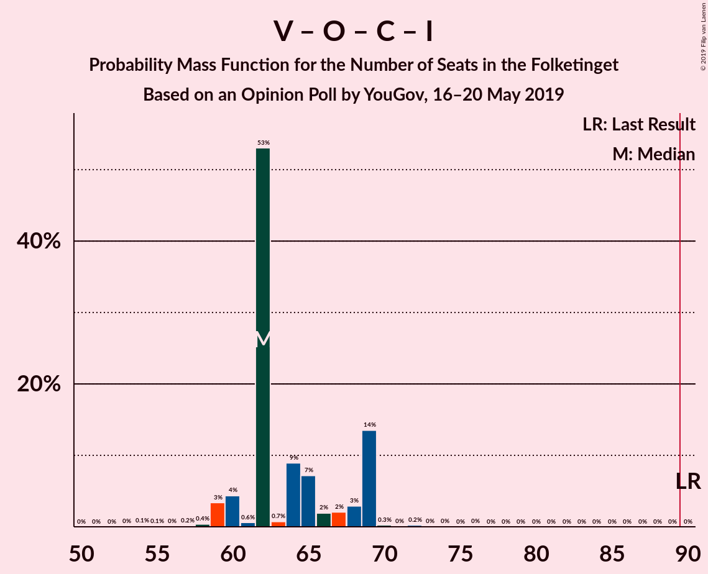

# Opinion Poll by YouGov, 16–20 May 2019

<a href="#voting-intentions">Voting Intentions</a> | <a href="#seats">Seats</a> | <a href="#coalitions">Coalitions</a> | <a href="#technical-information">Technical Information</a>

## Voting Intentions

### Confidence Intervals

| Party | Last Result | Poll Result | 80% Confidence Interval | 90% Confidence Interval | 95% Confidence Interval | 99% Confidence Interval |
|:-----:|:-----------:|:-----------:|:-----------------------:|:-----------------------:|:-----------------------:|:-----------------------:|
| Socialdemokraterne | 26.3% | 28.2% | 26.4–29.9% |26.0–30.5% |25.5–30.9% |24.8–31.8% |
| Venstre | 19.5% | 15.8% | 14.5–17.3% |14.1–17.8% |13.8–18.1% |13.2–18.9% |
| Dansk Folkeparti | 21.1% | 11.1% | 10.0–12.5% |9.7–12.8% |9.4–13.2% |8.9–13.8% |
| Enhedslisten–De Rød-Grønne | 7.8% | 9.0% | 8.0–10.2% |7.7–10.6% |7.5–10.9% |7.0–11.5% |
| Socialistisk Folkeparti | 4.2% | 8.0% | 7.0–9.2% |6.8–9.5% |6.5–9.8% |6.1–10.4% |
| Radikale Venstre | 4.6% | 7.0% | 6.1–8.1% |5.8–8.4% |5.6–8.7% |5.2–9.2% |
| Det Konservative Folkeparti | 3.4% | 4.8% | 4.0–5.7% |3.8–6.0% |3.7–6.2% |3.3–6.7% |
| Nye Borgerlige | 0.0% | 4.1% | 3.5–5.0% |3.3–5.3% |3.1–5.5% |2.8–6.0% |
| Liberal Alliance | 7.5% | 4.0% | 3.3–4.8% |3.1–5.1% |2.9–5.3% |2.7–5.7% |
| Alternativet | 4.8% | 3.3% | 2.7–4.1% |2.5–4.4% |2.4–4.6% |2.1–5.0% |
| Stram Kurs | 0.0% | 2.8% | 2.2–3.5% |2.1–3.7% |1.9–3.9% |1.7–4.3% |
| Kristendemokraterne | 0.8% | 1.1% | 0.8–1.6% |0.7–1.8% |0.6–1.9% |0.5–2.2% |
| Klaus Riskær Pedersen | 0.0% | 0.8% | 0.6–1.3% |0.5–1.4% |0.4–1.6% |0.3–1.8% |

*Note:* The poll result column reflects the actual value used in the calculations. Published results may vary slightly, and in addition be rounded to fewer digits.

## Seats

### Confidence Intervals

| Party | Last Result | Median | 80% Confidence Interval | 90% Confidence Interval | 95% Confidence Interval | 99% Confidence Interval |
|:-----:|:-----------:|:------:|:-----------------------:|:-----------------------:|:-----------------------:|:-----------------------:|
| <a href="#socialdemokraterne">Socialdemokraterne</a> | 47 | 50 | 46–53 |45–54 |45–54 |43–55 |
| <a href="#venstre">Venstre</a> | 34 | 27 | 26–29 |25–29 |25–31 |23–32 |
| <a href="#dansk-folkeparti">Dansk Folkeparti</a> | 37 | 20 | 16–24 |16–24 |16–24 |16–25 |
| <a href="#enhedslisten–de-rød-grønne">Enhedslisten–De Rød-Grønne</a> | 14 | 14 | 12–18 |12–18 |12–20 |12–20 |
| <a href="#socialistisk-folkeparti">Socialistisk Folkeparti</a> | 7 | 14 | 13–16 |10–17 |10–17 |10–18 |
| <a href="#radikale-venstre">Radikale Venstre</a> | 8 | 13 | 12–16 |11–16 |11–16 |9–16 |
| <a href="#det-konservative-folkeparti">Det Konservative Folkeparti</a> | 6 | 9 | 8–10 |8–13 |7–13 |7–13 |
| <a href="#nye-borgerlige">Nye Borgerlige</a> | 0 | 6 | 6–8 |6–10 |5–10 |5–11 |
| <a href="#liberal-alliance">Liberal Alliance</a> | 13 | 7 | 6–8 |6–8 |6–9 |5–10 |
| <a href="#alternativet">Alternativet</a> | 9 | 7 | 5–7 |5–8 |5–8 |5–9 |
| <a href="#stram-kurs">Stram Kurs</a> | 0 | 6 | 0–6 |0–6 |0–7 |0–7 |
| <a href="#kristendemokraterne">Kristendemokraterne</a> | 0 | 0 | 0–4 |0–4 |0–4 |0–4 |
| <a href="#klaus-riskær-pedersen">Klaus Riskær Pedersen</a> | 0 | 0 | 0 |0 |0 |0 |

### Socialdemokraterne

*For a full overview of the results for this party, see the [Socialdemokraterne](party-socialdemokraterne.html) page.*

| Number of Seats | Probability | Accumulated | Special Marks |
|:---------------:|:-----------:|:-----------:|:-------------:|
| 42 | 0.2% | 100% |  |
| 43 | 1.0% | 99.8% |  |
| 44 | 0.5% | 98.8% |  |
| 45 | 6% | 98% |  |
| 46 | 3% | 92% |  |
| 47 | 1.1% | 89% | Last Result |
| 48 | 6% | 88% |  |
| 49 | 29% | 83% |  |
| 50 | 23% | 53% | Median |
| 51 | 0.8% | 31% |  |
| 52 | 3% | 30% |  |
| 53 | 21% | 27% |  |
| 54 | 6% | 6% |  |
| 55 | 0.3% | 0.6% |  |
| 56 | 0.3% | 0.3% |  |
| 57 | 0% | 0% |  |

### Venstre

*For a full overview of the results for this party, see the [Venstre](party-venstre.html) page.*

| Number of Seats | Probability | Accumulated | Special Marks |
|:---------------:|:-----------:|:-----------:|:-------------:|
| 22 | 0.1% | 100% |  |
| 23 | 0.8% | 99.8% |  |
| 24 | 0.3% | 99.1% |  |
| 25 | 4% | 98.8% |  |
| 26 | 44% | 95% |  |
| 27 | 20% | 51% | Median |
| 28 | 2% | 31% |  |
| 29 | 26% | 29% |  |
| 30 | 0.3% | 3% |  |
| 31 | 2% | 3% |  |
| 32 | 0.6% | 1.0% |  |
| 33 | 0.1% | 0.4% |  |
| 34 | 0.3% | 0.3% | Last Result |
| 35 | 0% | 0% |  |

### Dansk Folkeparti

*For a full overview of the results for this party, see the [Dansk Folkeparti](party-danskfolkeparti.html) page.*

| Number of Seats | Probability | Accumulated | Special Marks |
|:---------------:|:-----------:|:-----------:|:-------------:|
| 15 | 0.1% | 100% |  |
| 16 | 24% | 99.9% |  |
| 17 | 0.8% | 76% |  |
| 18 | 7% | 75% |  |
| 19 | 6% | 68% |  |
| 20 | 22% | 62% | Median |
| 21 | 11% | 39% |  |
| 22 | 5% | 28% |  |
| 23 | 2% | 23% |  |
| 24 | 20% | 21% |  |
| 25 | 0.5% | 0.5% |  |
| 26 | 0% | 0% |  |
| 27 | 0% | 0% |  |
| 28 | 0% | 0% |  |
| 29 | 0% | 0% |  |
| 30 | 0% | 0% |  |
| 31 | 0% | 0% |  |
| 32 | 0% | 0% |  |
| 33 | 0% | 0% |  |
| 34 | 0% | 0% |  |
| 35 | 0% | 0% |  |
| 36 | 0% | 0% |  |
| 37 | 0% | 0% | Last Result |

### Enhedslisten–De Rød-Grønne

*For a full overview of the results for this party, see the [Enhedslisten–De Rød-Grønne](party-enhedslisten–derød-grønne.html) page.*

| Number of Seats | Probability | Accumulated | Special Marks |
|:---------------:|:-----------:|:-----------:|:-------------:|
| 10 | 0.1% | 100% |  |
| 11 | 0.1% | 99.9% |  |
| 12 | 22% | 99.9% |  |
| 13 | 1.3% | 78% |  |
| 14 | 30% | 77% | Last Result, Median |
| 15 | 0.6% | 47% |  |
| 16 | 12% | 47% |  |
| 17 | 8% | 34% |  |
| 18 | 22% | 26% |  |
| 19 | 1.2% | 4% |  |
| 20 | 3% | 3% |  |
| 21 | 0% | 0.2% |  |
| 22 | 0.2% | 0.2% |  |
| 23 | 0% | 0% |  |

### Socialistisk Folkeparti

*For a full overview of the results for this party, see the [Socialistisk Folkeparti](party-socialistiskfolkeparti.html) page.*

| Number of Seats | Probability | Accumulated | Special Marks |
|:---------------:|:-----------:|:-----------:|:-------------:|
| 7 | 0% | 100% | Last Result |
| 8 | 0% | 100% |  |
| 9 | 0% | 100% |  |
| 10 | 9% | 100% |  |
| 11 | 0.4% | 91% |  |
| 12 | 0.4% | 90% |  |
| 13 | 23% | 90% |  |
| 14 | 28% | 67% | Median |
| 15 | 8% | 39% |  |
| 16 | 24% | 31% |  |
| 17 | 6% | 7% |  |
| 18 | 0.4% | 0.9% |  |
| 19 | 0.3% | 0.5% |  |
| 20 | 0.2% | 0.2% |  |
| 21 | 0% | 0% |  |

### Radikale Venstre

*For a full overview of the results for this party, see the [Radikale Venstre](party-radikalevenstre.html) page.*

| Number of Seats | Probability | Accumulated | Special Marks |
|:---------------:|:-----------:|:-----------:|:-------------:|
| 8 | 0% | 100% | Last Result |
| 9 | 0.8% | 100% |  |
| 10 | 1.0% | 99.2% |  |
| 11 | 4% | 98% |  |
| 12 | 37% | 94% |  |
| 13 | 22% | 57% | Median |
| 14 | 1.2% | 35% |  |
| 15 | 10% | 34% |  |
| 16 | 24% | 24% |  |
| 17 | 0.1% | 0.2% |  |
| 18 | 0% | 0% |  |

### Det Konservative Folkeparti

*For a full overview of the results for this party, see the [Det Konservative Folkeparti](party-detkonservativefolkeparti.html) page.*

| Number of Seats | Probability | Accumulated | Special Marks |
|:---------------:|:-----------:|:-----------:|:-------------:|
| 5 | 0.1% | 100% |  |
| 6 | 0.3% | 99.9% | Last Result |
| 7 | 2% | 99.6% |  |
| 8 | 10% | 97% |  |
| 9 | 48% | 87% | Median |
| 10 | 30% | 39% |  |
| 11 | 3% | 9% |  |
| 12 | 0.6% | 7% |  |
| 13 | 6% | 6% |  |
| 14 | 0% | 0% |  |

### Nye Borgerlige

*For a full overview of the results for this party, see the [Nye Borgerlige](party-nyeborgerlige.html) page.*

| Number of Seats | Probability | Accumulated | Special Marks |
|:---------------:|:-----------:|:-----------:|:-------------:|
| 0 | 0% | 100% | Last Result |
| 1 | 0% | 100% |  |
| 2 | 0% | 100% |  |
| 3 | 0% | 100% |  |
| 4 | 0% | 100% |  |
| 5 | 3% | 100% |  |
| 6 | 53% | 97% | Median |
| 7 | 9% | 43% |  |
| 8 | 29% | 34% |  |
| 9 | 0.6% | 6% |  |
| 10 | 4% | 5% |  |
| 11 | 1.2% | 1.3% |  |
| 12 | 0.1% | 0.1% |  |
| 13 | 0% | 0% |  |

### Liberal Alliance

*For a full overview of the results for this party, see the [Liberal Alliance](party-liberalalliance.html) page.*

| Number of Seats | Probability | Accumulated | Special Marks |
|:---------------:|:-----------:|:-----------:|:-------------:|
| 4 | 0.1% | 100% |  |
| 5 | 1.1% | 99.9% |  |
| 6 | 14% | 98.8% |  |
| 7 | 46% | 85% | Median |
| 8 | 35% | 39% |  |
| 9 | 3% | 4% |  |
| 10 | 0.9% | 1.1% |  |
| 11 | 0% | 0.2% |  |
| 12 | 0% | 0.2% |  |
| 13 | 0.2% | 0.2% | Last Result |
| 14 | 0% | 0% |  |

### Alternativet

*For a full overview of the results for this party, see the [Alternativet](party-alternativet.html) page.*

| Number of Seats | Probability | Accumulated | Special Marks |
|:---------------:|:-----------:|:-----------:|:-------------:|
| 0 | 0.1% | 100% |  |
| 1 | 0% | 99.9% |  |
| 2 | 0% | 99.9% |  |
| 3 | 0% | 99.9% |  |
| 4 | 0.1% | 99.9% |  |
| 5 | 26% | 99.8% |  |
| 6 | 23% | 74% |  |
| 7 | 42% | 51% | Median |
| 8 | 8% | 9% |  |
| 9 | 0.5% | 0.6% | Last Result |
| 10 | 0% | 0% |  |

### Stram Kurs

*For a full overview of the results for this party, see the [Stram Kurs](party-stramkurs.html) page.*

| Number of Seats | Probability | Accumulated | Special Marks |
|:---------------:|:-----------:|:-----------:|:-------------:|
| 0 | 21% | 100% | Last Result |
| 1 | 0% | 79% |  |
| 2 | 0% | 79% |  |
| 3 | 0% | 79% |  |
| 4 | 8% | 79% |  |
| 5 | 19% | 71% |  |
| 6 | 48% | 51% | Median |
| 7 | 3% | 3% |  |
| 8 | 0.2% | 0.2% |  |
| 9 | 0% | 0% |  |

### Kristendemokraterne

*For a full overview of the results for this party, see the [Kristendemokraterne](party-kristendemokraterne.html) page.*

| Number of Seats | Probability | Accumulated | Special Marks |
|:---------------:|:-----------:|:-----------:|:-------------:|
| 0 | 78% | 100% | Last Result, Median |
| 1 | 0% | 22% |  |
| 2 | 0% | 22% |  |
| 3 | 0% | 22% |  |
| 4 | 21% | 22% |  |
| 5 | 0.1% | 0.1% |  |
| 6 | 0% | 0% |  |

### Klaus Riskær Pedersen

*For a full overview of the results for this party, see the [Klaus Riskær Pedersen](party-klausriskærpedersen.html) page.*

| Number of Seats | Probability | Accumulated | Special Marks |
|:---------------:|:-----------:|:-----------:|:-------------:|
| 0 | 99.6% | 100% | Last Result, Median |
| 1 | 0% | 0.4% |  |
| 2 | 0% | 0.4% |  |
| 3 | 0% | 0.4% |  |
| 4 | 0.4% | 0.4% |  |
| 5 | 0% | 0% |  |

## Coalitions

### Confidence Intervals

| Coalition | Last Result | Median | Majority? | 80% Confidence Interval | 90% Confidence Interval | 95% Confidence Interval | 99% Confidence Interval |
|:---------:|:-----------:|:------:|:---------:|:-----------------------:|:-----------------------:|:-----------------------:|:-----------------------:|
| Socialdemokraterne – Enhedslisten–De Rød-Grønne – Socialistisk Folkeparti – Radikale Venstre – Alternativet | 85 | 102 | 100% | 94–102 | 94–104 | 91–104 | 90–104 |
| Socialdemokraterne – Enhedslisten–De Rød-Grønne – Socialistisk Folkeparti – Radikale Venstre | 76 | 95 | 63% | 88–97 | 88–97 | 84–97 | 84–98 |
| Socialdemokraterne – Enhedslisten–De Rød-Grønne – Socialistisk Folkeparti – Alternativet | 77 | 86 | 7% | 82–89 | 79–92 | 79–92 | 78–92 |
| Socialdemokraterne – Enhedslisten–De Rød-Grønne – Socialistisk Folkeparti | 68 | 79 | 0% | 76–84 | 74–84 | 73–84 | 71–84 |
| Venstre – Dansk Folkeparti – Det Konservative Folkeparti – Nye Borgerlige – Liberal Alliance – Stram Kurs – Kristendemokraterne – Klaus Riskær Pedersen | 90 | 73 | 0% | 73–81 | 71–81 | 71–84 | 71–85 |
| Socialdemokraterne – Socialistisk Folkeparti – Radikale Venstre | 62 | 79 | 0% | 72–81 | 72–81 | 68–81 | 67–81 |
| Venstre – Dansk Folkeparti – Det Konservative Folkeparti – Nye Borgerlige – Liberal Alliance – Kristendemokraterne – Klaus Riskær Pedersen | 90 | 73 | 0% | 67–75 | 66–77 | 66–78 | 66–80 |
| Venstre – Dansk Folkeparti – Det Konservative Folkeparti – Nye Borgerlige – Liberal Alliance – Klaus Riskær Pedersen | 90 | 71 | 0% | 67–74 | 66–77 | 66–78 | 66–80 |
| Venstre – Dansk Folkeparti – Det Konservative Folkeparti – Nye Borgerlige – Liberal Alliance – Kristendemokraterne | 90 | 73 | 0% | 67–75 | 66–77 | 66–78 | 66–80 |
| Venstre – Dansk Folkeparti – Det Konservative Folkeparti – Nye Borgerlige – Liberal Alliance | 90 | 71 | 0% | 67–74 | 66–77 | 66–78 | 66–80 |
| Venstre – Dansk Folkeparti – Det Konservative Folkeparti – Liberal Alliance – Kristendemokraterne | 90 | 67 | 0% | 59–69 | 59–69 | 59–69 | 59–70 |
| Venstre – Dansk Folkeparti – Det Konservative Folkeparti – Liberal Alliance | 90 | 65 | 0% | 59–67 | 59–69 | 59–69 | 59–70 |
| Socialdemokraterne – Radikale Venstre | 55 | 65 | 0% | 57–66 | 57–66 | 57–66 | 54–66 |
| Venstre – Det Konservative Folkeparti – Liberal Alliance | 53 | 43 | 0% | 42–47 | 41–48 | 41–48 | 37–49 |
| Venstre – Det Konservative Folkeparti | 40 | 36 | 0% | 35–39 | 35–40 | 33–40 | 32–43 |
| Venstre | 34 | 27 | 0% | 26–29 | 25–29 | 25–31 | 23–32 |

### Socialdemokraterne – Enhedslisten–De Rød-Grønne – Socialistisk Folkeparti – Radikale Venstre – Alternativet

| Number of Seats | Probability | Accumulated | Special Marks |
|:---------------:|:-----------:|:-----------:|:-------------:|
| 85 | 0% | 100% | Last Result |
| 86 | 0% | 100% |  |
| 87 | 0% | 100% |  |
| 88 | 0% | 100% |  |
| 89 | 0% | 100% |  |
| 90 | 0.5% | 100% | Majority |
| 91 | 3% | 99.5% |  |
| 92 | 0.1% | 97% |  |
| 93 | 0.5% | 97% |  |
| 94 | 26% | 96% |  |
| 95 | 0.6% | 71% |  |
| 96 | 7% | 70% |  |
| 97 | 0.4% | 63% |  |
| 98 | 0.2% | 62% | Median |
| 99 | 2% | 62% |  |
| 100 | 0.7% | 60% |  |
| 101 | 4% | 60% |  |
| 102 | 49% | 56% |  |
| 103 | 0.8% | 7% |  |
| 104 | 6% | 6% |  |
| 105 | 0% | 0.4% |  |
| 106 | 0.1% | 0.4% |  |
| 107 | 0% | 0.3% |  |
| 108 | 0.3% | 0.3% |  |
| 109 | 0% | 0% |  |

### Socialdemokraterne – Enhedslisten–De Rød-Grønne – Socialistisk Folkeparti – Radikale Venstre

| Number of Seats | Probability | Accumulated | Special Marks |
|:---------------:|:-----------:|:-----------:|:-------------:|
| 76 | 0% | 100% | Last Result |
| 77 | 0% | 100% |  |
| 78 | 0% | 100% |  |
| 79 | 0% | 100% |  |
| 80 | 0% | 100% |  |
| 81 | 0% | 100% |  |
| 82 | 0% | 100% |  |
| 83 | 0.4% | 100% |  |
| 84 | 2% | 99.6% |  |
| 85 | 0.1% | 97% |  |
| 86 | 0.3% | 97% |  |
| 87 | 0% | 97% |  |
| 88 | 23% | 97% |  |
| 89 | 11% | 74% |  |
| 90 | 1.0% | 63% | Majority |
| 91 | 1.3% | 62% | Median |
| 92 | 0.3% | 61% |  |
| 93 | 0.4% | 61% |  |
| 94 | 4% | 60% |  |
| 95 | 30% | 56% |  |
| 96 | 6% | 27% |  |
| 97 | 20% | 21% |  |
| 98 | 0.3% | 0.7% |  |
| 99 | 0% | 0.4% |  |
| 100 | 0.3% | 0.4% |  |
| 101 | 0% | 0% |  |

### Socialdemokraterne – Enhedslisten–De Rød-Grønne – Socialistisk Folkeparti – Alternativet

| Number of Seats | Probability | Accumulated | Special Marks |
|:---------------:|:-----------:|:-----------:|:-------------:|
| 77 | 0.1% | 100% | Last Result |
| 78 | 0.7% | 99.9% |  |
| 79 | 5% | 99.3% |  |
| 80 | 2% | 95% |  |
| 81 | 0.2% | 92% |  |
| 82 | 22% | 92% |  |
| 83 | 0.7% | 71% |  |
| 84 | 7% | 70% |  |
| 85 | 0.2% | 63% | Median |
| 86 | 24% | 63% |  |
| 87 | 6% | 38% |  |
| 88 | 0.7% | 32% |  |
| 89 | 25% | 31% |  |
| 90 | 0.5% | 7% | Majority |
| 91 | 0% | 6% |  |
| 92 | 6% | 6% |  |
| 93 | 0% | 0.3% |  |
| 94 | 0.3% | 0.3% |  |
| 95 | 0% | 0% |  |

### Socialdemokraterne – Enhedslisten–De Rød-Grønne – Socialistisk Folkeparti

| Number of Seats | Probability | Accumulated | Special Marks |
|:---------------:|:-----------:|:-----------:|:-------------:|
| 68 | 0% | 100% | Last Result |
| 69 | 0% | 100% |  |
| 70 | 0.3% | 100% |  |
| 71 | 0.4% | 99.7% |  |
| 72 | 0.5% | 99.3% |  |
| 73 | 2% | 98.8% |  |
| 74 | 4% | 97% |  |
| 75 | 0.5% | 93% |  |
| 76 | 22% | 92% |  |
| 77 | 7% | 70% |  |
| 78 | 0.8% | 63% | Median |
| 79 | 24% | 63% |  |
| 80 | 6% | 38% |  |
| 81 | 0.8% | 32% |  |
| 82 | 4% | 31% |  |
| 83 | 0.2% | 27% |  |
| 84 | 27% | 27% |  |
| 85 | 0% | 0.4% |  |
| 86 | 0.3% | 0.4% |  |
| 87 | 0% | 0% |  |

### Venstre – Dansk Folkeparti – Det Konservative Folkeparti – Nye Borgerlige – Liberal Alliance – Stram Kurs – Kristendemokraterne – Klaus Riskær Pedersen

| Number of Seats | Probability | Accumulated | Special Marks |
|:---------------:|:-----------:|:-----------:|:-------------:|
| 67 | 0.3% | 100% |  |
| 68 | 0% | 99.7% |  |
| 69 | 0.1% | 99.7% |  |
| 70 | 0% | 99.6% |  |
| 71 | 6% | 99.6% |  |
| 72 | 0.8% | 94% |  |
| 73 | 49% | 93% |  |
| 74 | 4% | 44% |  |
| 75 | 0.7% | 40% | Median |
| 76 | 2% | 40% |  |
| 77 | 0.2% | 38% |  |
| 78 | 0.4% | 38% |  |
| 79 | 7% | 37% |  |
| 80 | 0.6% | 30% |  |
| 81 | 26% | 29% |  |
| 82 | 0.5% | 4% |  |
| 83 | 0.1% | 3% |  |
| 84 | 3% | 3% |  |
| 85 | 0.5% | 0.5% |  |
| 86 | 0% | 0% |  |
| 87 | 0% | 0% |  |
| 88 | 0% | 0% |  |
| 89 | 0% | 0% |  |
| 90 | 0% | 0% | Last Result, Majority |

### Socialdemokraterne – Socialistisk Folkeparti – Radikale Venstre

| Number of Seats | Probability | Accumulated | Special Marks |
|:---------------:|:-----------:|:-----------:|:-------------:|
| 62 | 0% | 100% | Last Result |
| 63 | 0% | 100% |  |
| 64 | 0% | 100% |  |
| 65 | 0% | 100% |  |
| 66 | 0% | 100% |  |
| 67 | 2% | 100% |  |
| 68 | 0.3% | 98% |  |
| 69 | 0.2% | 97% |  |
| 70 | 0.2% | 97% |  |
| 71 | 0.6% | 97% |  |
| 72 | 8% | 96% |  |
| 73 | 4% | 89% |  |
| 74 | 3% | 84% |  |
| 75 | 2% | 82% |  |
| 76 | 22% | 79% |  |
| 77 | 0.6% | 57% | Median |
| 78 | 0.4% | 57% |  |
| 79 | 20% | 56% |  |
| 80 | 6% | 36% |  |
| 81 | 29% | 30% |  |
| 82 | 0% | 0.4% |  |
| 83 | 0% | 0.4% |  |
| 84 | 0.3% | 0.4% |  |
| 85 | 0.1% | 0.1% |  |
| 86 | 0% | 0% |  |

### Venstre – Dansk Folkeparti – Det Konservative Folkeparti – Nye Borgerlige – Liberal Alliance – Kristendemokraterne – Klaus Riskær Pedersen

| Number of Seats | Probability | Accumulated | Special Marks |
|:---------------:|:-----------:|:-----------:|:-------------:|
| 62 | 0.3% | 100% |  |
| 63 | 0% | 99.7% |  |
| 64 | 0.1% | 99.7% |  |
| 65 | 0% | 99.6% |  |
| 66 | 6% | 99.6% |  |
| 67 | 27% | 94% |  |
| 68 | 6% | 67% |  |
| 69 | 0.1% | 61% | Median |
| 70 | 1.2% | 61% |  |
| 71 | 1.3% | 60% |  |
| 72 | 0.6% | 59% |  |
| 73 | 21% | 58% |  |
| 74 | 6% | 38% |  |
| 75 | 23% | 31% |  |
| 76 | 0.7% | 8% |  |
| 77 | 4% | 8% |  |
| 78 | 3% | 3% |  |
| 79 | 0.1% | 0.6% |  |
| 80 | 0.1% | 0.5% |  |
| 81 | 0.4% | 0.5% |  |
| 82 | 0% | 0% |  |
| 83 | 0% | 0% |  |
| 84 | 0% | 0% |  |
| 85 | 0% | 0% |  |
| 86 | 0% | 0% |  |
| 87 | 0% | 0% |  |
| 88 | 0% | 0% |  |
| 89 | 0% | 0% |  |
| 90 | 0% | 0% | Last Result, Majority |

### Venstre – Dansk Folkeparti – Det Konservative Folkeparti – Nye Borgerlige – Liberal Alliance – Klaus Riskær Pedersen

| Number of Seats | Probability | Accumulated | Special Marks |
|:---------------:|:-----------:|:-----------:|:-------------:|
| 62 | 0.3% | 100% |  |
| 63 | 0% | 99.7% |  |
| 64 | 0.1% | 99.7% |  |
| 65 | 0% | 99.6% |  |
| 66 | 6% | 99.6% |  |
| 67 | 27% | 94% |  |
| 68 | 6% | 67% |  |
| 69 | 0.1% | 61% | Median |
| 70 | 1.2% | 61% |  |
| 71 | 23% | 60% |  |
| 72 | 0.6% | 37% |  |
| 73 | 21% | 37% |  |
| 74 | 6% | 16% |  |
| 75 | 1.4% | 10% |  |
| 76 | 0.7% | 8% |  |
| 77 | 4% | 8% |  |
| 78 | 3% | 3% |  |
| 79 | 0.1% | 0.6% |  |
| 80 | 0.1% | 0.5% |  |
| 81 | 0.4% | 0.5% |  |
| 82 | 0% | 0% |  |
| 83 | 0% | 0% |  |
| 84 | 0% | 0% |  |
| 85 | 0% | 0% |  |
| 86 | 0% | 0% |  |
| 87 | 0% | 0% |  |
| 88 | 0% | 0% |  |
| 89 | 0% | 0% |  |
| 90 | 0% | 0% | Last Result, Majority |

### Venstre – Dansk Folkeparti – Det Konservative Folkeparti – Nye Borgerlige – Liberal Alliance – Kristendemokraterne

| Number of Seats | Probability | Accumulated | Special Marks |
|:---------------:|:-----------:|:-----------:|:-------------:|
| 62 | 0.3% | 100% |  |
| 63 | 0% | 99.7% |  |
| 64 | 0.1% | 99.7% |  |
| 65 | 0% | 99.6% |  |
| 66 | 6% | 99.6% |  |
| 67 | 27% | 94% |  |
| 68 | 6% | 67% |  |
| 69 | 0.1% | 61% | Median |
| 70 | 1.2% | 61% |  |
| 71 | 1.3% | 60% |  |
| 72 | 0.5% | 59% |  |
| 73 | 21% | 58% |  |
| 74 | 7% | 38% |  |
| 75 | 23% | 31% |  |
| 76 | 0.7% | 8% |  |
| 77 | 4% | 7% |  |
| 78 | 3% | 3% |  |
| 79 | 0.1% | 0.6% |  |
| 80 | 0.1% | 0.5% |  |
| 81 | 0.4% | 0.5% |  |
| 82 | 0% | 0% |  |
| 83 | 0% | 0% |  |
| 84 | 0% | 0% |  |
| 85 | 0% | 0% |  |
| 86 | 0% | 0% |  |
| 87 | 0% | 0% |  |
| 88 | 0% | 0% |  |
| 89 | 0% | 0% |  |
| 90 | 0% | 0% | Last Result, Majority |

### Venstre – Dansk Folkeparti – Det Konservative Folkeparti – Nye Borgerlige – Liberal Alliance

| Number of Seats | Probability | Accumulated | Special Marks |
|:---------------:|:-----------:|:-----------:|:-------------:|
| 62 | 0.3% | 100% |  |
| 63 | 0% | 99.7% |  |
| 64 | 0.1% | 99.7% |  |
| 65 | 0% | 99.6% |  |
| 66 | 6% | 99.6% |  |
| 67 | 27% | 94% |  |
| 68 | 6% | 67% |  |
| 69 | 0.1% | 61% | Median |
| 70 | 1.2% | 61% |  |
| 71 | 23% | 60% |  |
| 72 | 0.5% | 37% |  |
| 73 | 21% | 37% |  |
| 74 | 7% | 16% |  |
| 75 | 1.4% | 9% |  |
| 76 | 0.7% | 8% |  |
| 77 | 4% | 7% |  |
| 78 | 2% | 3% |  |
| 79 | 0.1% | 0.6% |  |
| 80 | 0.1% | 0.5% |  |
| 81 | 0.4% | 0.5% |  |
| 82 | 0% | 0% |  |
| 83 | 0% | 0% |  |
| 84 | 0% | 0% |  |
| 85 | 0% | 0% |  |
| 86 | 0% | 0% |  |
| 87 | 0% | 0% |  |
| 88 | 0% | 0% |  |
| 89 | 0% | 0% |  |
| 90 | 0% | 0% | Last Result, Majority |

### Venstre – Dansk Folkeparti – Det Konservative Folkeparti – Liberal Alliance – Kristendemokraterne

| Number of Seats | Probability | Accumulated | Special Marks |
|:---------------:|:-----------:|:-----------:|:-------------:|
| 53 | 0.3% | 100% |  |
| 54 | 0% | 99.7% |  |
| 55 | 0% | 99.7% |  |
| 56 | 0% | 99.7% |  |
| 57 | 0% | 99.7% |  |
| 58 | 0% | 99.7% |  |
| 59 | 24% | 99.7% |  |
| 60 | 7% | 76% |  |
| 61 | 0.2% | 69% |  |
| 62 | 9% | 69% |  |
| 63 | 0.2% | 60% | Median |
| 64 | 1.3% | 60% |  |
| 65 | 1.0% | 59% |  |
| 66 | 0.8% | 58% |  |
| 67 | 28% | 57% |  |
| 68 | 2% | 29% |  |
| 69 | 26% | 27% |  |
| 70 | 0.7% | 0.8% |  |
| 71 | 0.1% | 0.2% |  |
| 72 | 0% | 0.1% |  |
| 73 | 0% | 0.1% |  |
| 74 | 0% | 0% |  |
| 75 | 0% | 0% |  |
| 76 | 0% | 0% |  |
| 77 | 0% | 0% |  |
| 78 | 0% | 0% |  |
| 79 | 0% | 0% |  |
| 80 | 0% | 0% |  |
| 81 | 0% | 0% |  |
| 82 | 0% | 0% |  |
| 83 | 0% | 0% |  |
| 84 | 0% | 0% |  |
| 85 | 0% | 0% |  |
| 86 | 0% | 0% |  |
| 87 | 0% | 0% |  |
| 88 | 0% | 0% |  |
| 89 | 0% | 0% |  |
| 90 | 0% | 0% | Last Result, Majority |

### Venstre – Dansk Folkeparti – Det Konservative Folkeparti – Liberal Alliance

| Number of Seats | Probability | Accumulated | Special Marks |
|:---------------:|:-----------:|:-----------:|:-------------:|
| 53 | 0.3% | 100% |  |
| 54 | 0% | 99.7% |  |
| 55 | 0% | 99.7% |  |
| 56 | 0% | 99.7% |  |
| 57 | 0% | 99.7% |  |
| 58 | 0% | 99.7% |  |
| 59 | 24% | 99.6% |  |
| 60 | 7% | 76% |  |
| 61 | 0.2% | 69% |  |
| 62 | 9% | 69% |  |
| 63 | 0.2% | 60% | Median |
| 64 | 1.3% | 60% |  |
| 65 | 22% | 58% |  |
| 66 | 0.8% | 36% |  |
| 67 | 28% | 35% |  |
| 68 | 2% | 8% |  |
| 69 | 5% | 6% |  |
| 70 | 0.7% | 0.8% |  |
| 71 | 0.1% | 0.2% |  |
| 72 | 0% | 0% |  |
| 73 | 0% | 0% |  |
| 74 | 0% | 0% |  |
| 75 | 0% | 0% |  |
| 76 | 0% | 0% |  |
| 77 | 0% | 0% |  |
| 78 | 0% | 0% |  |
| 79 | 0% | 0% |  |
| 80 | 0% | 0% |  |
| 81 | 0% | 0% |  |
| 82 | 0% | 0% |  |
| 83 | 0% | 0% |  |
| 84 | 0% | 0% |  |
| 85 | 0% | 0% |  |
| 86 | 0% | 0% |  |
| 87 | 0% | 0% |  |
| 88 | 0% | 0% |  |
| 89 | 0% | 0% |  |
| 90 | 0% | 0% | Last Result, Majority |

### Socialdemokraterne – Radikale Venstre

| Number of Seats | Probability | Accumulated | Special Marks |
|:---------------:|:-----------:|:-----------:|:-------------:|
| 54 | 0.8% | 100% |  |
| 55 | 0.3% | 99.2% | Last Result |
| 56 | 0.2% | 98.8% |  |
| 57 | 9% | 98.6% |  |
| 58 | 1.0% | 90% |  |
| 59 | 1.3% | 89% |  |
| 60 | 1.0% | 88% |  |
| 61 | 0.3% | 87% |  |
| 62 | 22% | 86% |  |
| 63 | 4% | 64% | Median |
| 64 | 9% | 60% |  |
| 65 | 24% | 51% |  |
| 66 | 26% | 27% |  |
| 67 | 0% | 0.5% |  |
| 68 | 0.1% | 0.5% |  |
| 69 | 0.3% | 0.4% |  |
| 70 | 0% | 0.1% |  |
| 71 | 0% | 0.1% |  |
| 72 | 0% | 0.1% |  |
| 73 | 0% | 0% |  |

### Venstre – Det Konservative Folkeparti – Liberal Alliance

| Number of Seats | Probability | Accumulated | Special Marks |
|:---------------:|:-----------:|:-----------:|:-------------:|
| 37 | 1.2% | 100% |  |
| 38 | 0.3% | 98.8% |  |
| 39 | 0% | 98% |  |
| 40 | 0% | 98% |  |
| 41 | 8% | 98% |  |
| 42 | 7% | 90% |  |
| 43 | 44% | 83% | Median |
| 44 | 0.5% | 39% |  |
| 45 | 23% | 38% |  |
| 46 | 0.9% | 16% |  |
| 47 | 7% | 15% |  |
| 48 | 6% | 7% |  |
| 49 | 0.4% | 0.9% |  |
| 50 | 0% | 0.5% |  |
| 51 | 0.4% | 0.4% |  |
| 52 | 0% | 0% |  |
| 53 | 0% | 0% | Last Result |

### Venstre – Det Konservative Folkeparti

| Number of Seats | Probability | Accumulated | Special Marks |
|:---------------:|:-----------:|:-----------:|:-------------:|
| 31 | 0.5% | 100% |  |
| 32 | 1.1% | 99.5% |  |
| 33 | 3% | 98% |  |
| 34 | 0.4% | 96% |  |
| 35 | 27% | 95% |  |
| 36 | 31% | 69% | Median |
| 37 | 0.2% | 37% |  |
| 38 | 25% | 37% |  |
| 39 | 5% | 12% |  |
| 40 | 6% | 8% | Last Result |
| 41 | 0.8% | 2% |  |
| 42 | 0% | 0.7% |  |
| 43 | 0.6% | 0.7% |  |
| 44 | 0% | 0.1% |  |
| 45 | 0.1% | 0.1% |  |
| 46 | 0% | 0% |  |

### Venstre

| Number of Seats | Probability | Accumulated | Special Marks |
|:---------------:|:-----------:|:-----------:|:-------------:|
| 22 | 0.1% | 100% |  |
| 23 | 0.8% | 99.8% |  |
| 24 | 0.3% | 99.1% |  |
| 25 | 4% | 98.8% |  |
| 26 | 44% | 95% |  |
| 27 | 20% | 51% | Median |
| 28 | 2% | 31% |  |
| 29 | 26% | 29% |  |
| 30 | 0.3% | 3% |  |
| 31 | 2% | 3% |  |
| 32 | 0.6% | 1.0% |  |
| 33 | 0.1% | 0.4% |  |
| 34 | 0.3% | 0.3% | Last Result |
| 35 | 0% | 0% |  |

## Technical Information

### Opinion Poll

+ **Polling firm:** YouGov
+ **Commissioner(s):** —
+ **Fieldwork period:** 16–20 May 2019

### Calculations

+ **Sample size:** 1087
+ **Simulations done:** 131,072
+ **Error estimate:** 2.50%

