# Opinion Poll by Gallup, 21 May 2019

<a href="#voting-intentions">Voting Intentions</a> | <a href="#seats">Seats</a> | <a href="#coalitions">Coalitions</a> | <a href="#technical-information">Technical Information</a>

## Voting Intentions

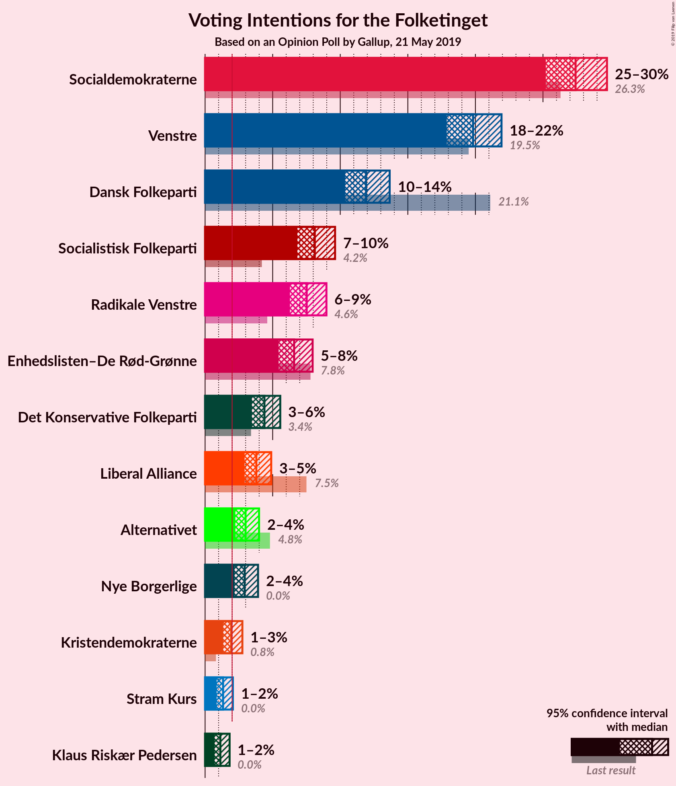

### Confidence Intervals

| Party | Last Result | Poll Result | 80% Confidence Interval | 90% Confidence Interval | 95% Confidence Interval | 99% Confidence Interval |
|:-----:|:-----------:|:-----------:|:-----------------------:|:-----------------------:|:-----------------------:|:-----------------------:|
| Socialdemokraterne | 26.3% | 27.4% | 26.0–28.9% |25.6–29.4% |25.2–29.7% |24.5–30.5% |
| Venstre | 19.5% | 19.8% | 18.5–21.2% |18.2–21.6% |17.9–21.9% |17.3–22.6% |
| Dansk Folkeparti | 21.1% | 11.9% | 10.9–13.0% |10.6–13.4% |10.4–13.7% |9.9–14.2% |
| Socialistisk Folkeparti | 4.2% | 8.1% | 7.3–9.1% |7.0–9.4% |6.8–9.6% |6.4–10.1% |
| Radikale Venstre | 4.6% | 7.5% | 6.7–8.5% |6.5–8.7% |6.3–9.0% |5.9–9.4% |
| Enhedslisten–De Rød-Grønne | 7.8% | 6.6% | 5.8–7.5% |5.6–7.7% |5.4–8.0% |5.1–8.4% |
| Det Konservative Folkeparti | 3.4% | 4.4% | 3.8–5.2% |3.6–5.4% |3.5–5.6% |3.2–5.9% |
| Liberal Alliance | 7.5% | 3.8% | 3.2–4.5% |3.1–4.7% |2.9–4.9% |2.7–5.3% |
| Alternativet | 4.8% | 3.0% | 2.5–3.6% |2.4–3.8% |2.2–4.0% |2.0–4.3% |
| Nye Borgerlige | 0.0% | 2.9% | 2.4–3.6% |2.3–3.7% |2.2–3.9% |2.0–4.2% |
| Kristendemokraterne | 0.8% | 1.9% | 1.5–2.5% |1.4–2.6% |1.3–2.8% |1.2–3.0% |
| Stram Kurs | 0.0% | 1.3% | 1.0–1.8% |0.9–1.9% |0.9–2.1% |0.7–2.3% |
| Klaus Riskær Pedersen | 0.0% | 1.1% | 0.9–1.6% |0.8–1.7% |0.7–1.8% |0.6–2.0% |

*Note:* The poll result column reflects the actual value used in the calculations. Published results may vary slightly, and in addition be rounded to fewer digits.

## Seats

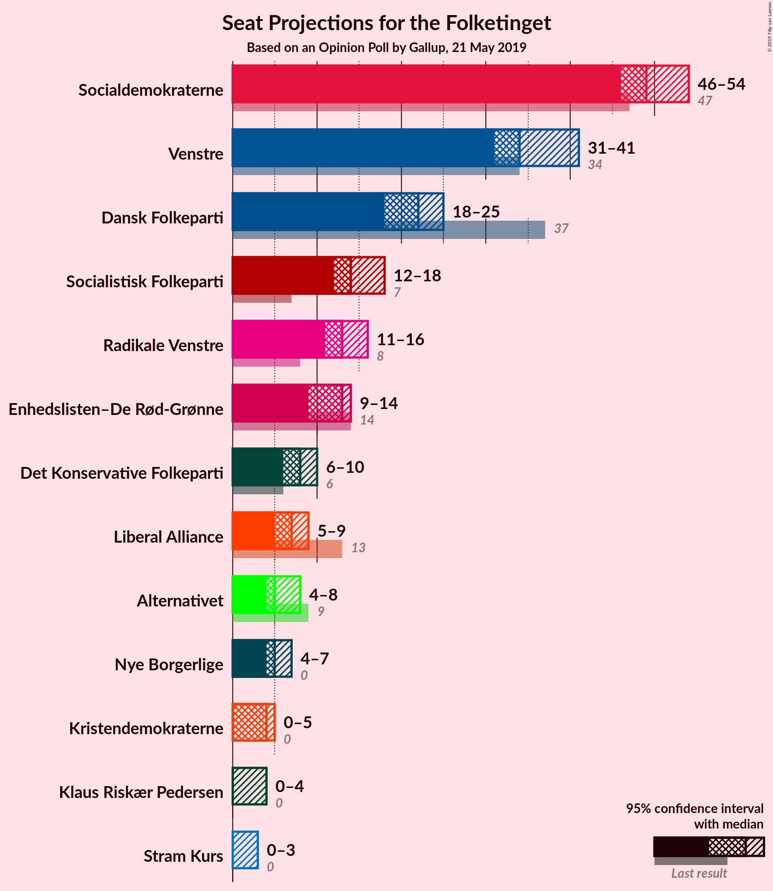

### Confidence Intervals

| Party | Last Result | Median | 80% Confidence Interval | 90% Confidence Interval | 95% Confidence Interval | 99% Confidence Interval |
|:-----:|:-----------:|:------:|:-----------------------:|:-----------------------:|:-----------------------:|:-----------------------:|
| <a href="#socialdemokraterne">Socialdemokraterne</a> | 47 | 49 | 48–52 |46–53 |46–54 |44–54 |
| <a href="#venstre">Venstre</a> | 34 | 34 | 33–38 |32–39 |31–41 |30–41 |
| <a href="#dansk-folkeparti">Dansk Folkeparti</a> | 37 | 22 | 19–24 |18–24 |18–25 |18–25 |
| <a href="#socialistisk-folkeparti">Socialistisk Folkeparti</a> | 7 | 14 | 12–18 |12–18 |12–18 |12–18 |
| <a href="#radikale-venstre">Radikale Venstre</a> | 8 | 13 | 12–15 |11–16 |11–16 |11–17 |
| <a href="#enhedslisten–de-rød-grønne">Enhedslisten–De Rød-Grønne</a> | 14 | 13 | 10–13 |9–14 |9–14 |9–16 |
| <a href="#det-konservative-folkeparti">Det Konservative Folkeparti</a> | 6 | 8 | 6–9 |6–9 |6–10 |5–11 |
| <a href="#liberal-alliance">Liberal Alliance</a> | 13 | 7 | 5–9 |5–9 |5–9 |5–9 |
| <a href="#alternativet">Alternativet</a> | 9 | 5 | 4–7 |4–7 |4–8 |0–8 |
| <a href="#nye-borgerlige">Nye Borgerlige</a> | 0 | 5 | 4–7 |4–7 |4–7 |0–8 |
| <a href="#kristendemokraterne">Kristendemokraterne</a> | 0 | 4 | 0–5 |0–5 |0–5 |0–6 |
| <a href="#stram-kurs">Stram Kurs</a> | 0 | 0 | 0 |0 |0–3 |0–4 |
| <a href="#klaus-riskær-pedersen">Klaus Riskær Pedersen</a> | 0 | 0 | 0 |0–4 |0–4 |0–4 |

### Socialdemokraterne

*For a full overview of the results for this party, see the [Socialdemokraterne](party-socialdemokraterne.html) page.*

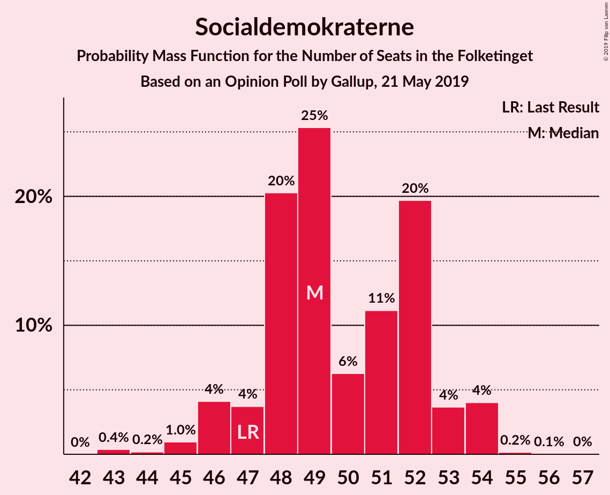

| Number of Seats | Probability | Accumulated | Special Marks |
|:---------------:|:-----------:|:-----------:|:-------------:|
| 43 | 0.4% | 100% |  |
| 44 | 0.2% | 99.6% |  |
| 45 | 1.0% | 99.4% |  |
| 46 | 4% | 98% |  |
| 47 | 4% | 94% | Last Result |
| 48 | 20% | 91% |  |
| 49 | 25% | 70% | Median |
| 50 | 6% | 45% |  |
| 51 | 11% | 39% |  |
| 52 | 20% | 28% |  |
| 53 | 4% | 8% |  |
| 54 | 4% | 4% |  |
| 55 | 0.2% | 0.2% |  |
| 56 | 0.1% | 0.1% |  |
| 57 | 0% | 0% |  |

### Venstre

*For a full overview of the results for this party, see the [Venstre](party-venstre.html) page.*

| Number of Seats | Probability | Accumulated | Special Marks |
|:---------------:|:-----------:|:-----------:|:-------------:|
| 28 | 0.1% | 100% |  |
| 29 | 0.1% | 99.9% |  |
| 30 | 0.6% | 99.9% |  |
| 31 | 3% | 99.3% |  |
| 32 | 5% | 97% |  |
| 33 | 3% | 92% |  |
| 34 | 39% | 88% | Last Result, Median |
| 35 | 13% | 49% |  |
| 36 | 19% | 37% |  |
| 37 | 4% | 17% |  |
| 38 | 7% | 14% |  |
| 39 | 3% | 7% |  |
| 40 | 0.4% | 3% |  |
| 41 | 3% | 3% |  |
| 42 | 0% | 0% |  |

### Dansk Folkeparti

*For a full overview of the results for this party, see the [Dansk Folkeparti](party-danskfolkeparti.html) page.*

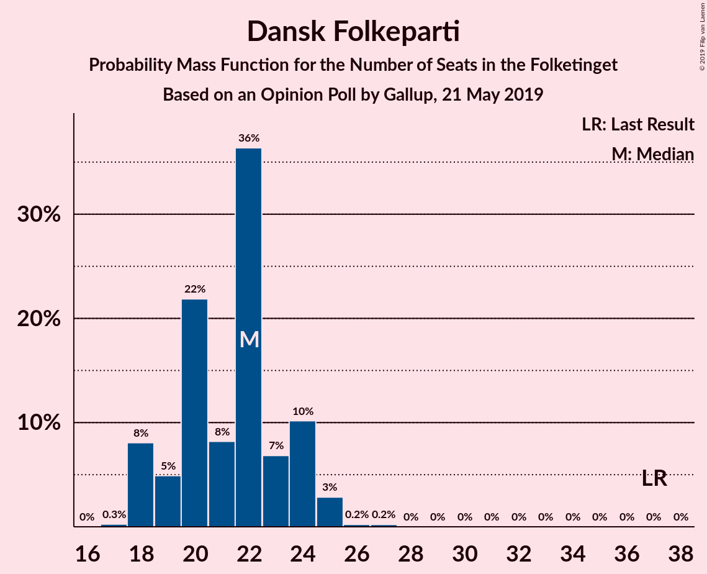

| Number of Seats | Probability | Accumulated | Special Marks |
|:---------------:|:-----------:|:-----------:|:-------------:|
| 17 | 0.3% | 100% |  |
| 18 | 8% | 99.7% |  |
| 19 | 5% | 92% |  |
| 20 | 22% | 87% |  |
| 21 | 8% | 65% |  |
| 22 | 36% | 57% | Median |
| 23 | 7% | 20% |  |
| 24 | 10% | 13% |  |
| 25 | 3% | 3% |  |
| 26 | 0.2% | 0.5% |  |
| 27 | 0.2% | 0.2% |  |
| 28 | 0% | 0% |  |
| 29 | 0% | 0% |  |
| 30 | 0% | 0% |  |
| 31 | 0% | 0% |  |
| 32 | 0% | 0% |  |
| 33 | 0% | 0% |  |
| 34 | 0% | 0% |  |
| 35 | 0% | 0% |  |
| 36 | 0% | 0% |  |
| 37 | 0% | 0% | Last Result |

### Socialistisk Folkeparti

*For a full overview of the results for this party, see the [Socialistisk Folkeparti](party-socialistiskfolkeparti.html) page.*

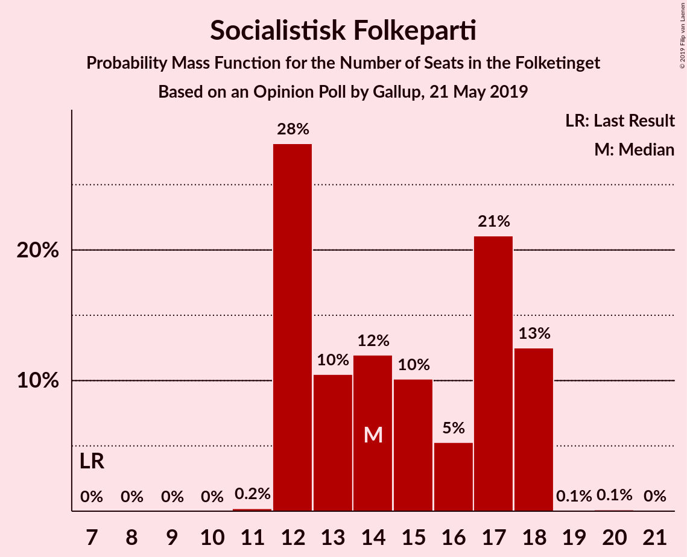

| Number of Seats | Probability | Accumulated | Special Marks |
|:---------------:|:-----------:|:-----------:|:-------------:|
| 7 | 0% | 100% | Last Result |
| 8 | 0% | 100% |  |
| 9 | 0% | 100% |  |
| 10 | 0% | 100% |  |
| 11 | 0.2% | 100% |  |
| 12 | 28% | 99.8% |  |
| 13 | 10% | 72% |  |
| 14 | 12% | 61% | Median |
| 15 | 10% | 49% |  |
| 16 | 5% | 39% |  |
| 17 | 21% | 34% |  |
| 18 | 13% | 13% |  |
| 19 | 0.1% | 0.2% |  |
| 20 | 0.1% | 0.1% |  |
| 21 | 0% | 0% |  |

### Radikale Venstre

*For a full overview of the results for this party, see the [Radikale Venstre](party-radikalevenstre.html) page.*

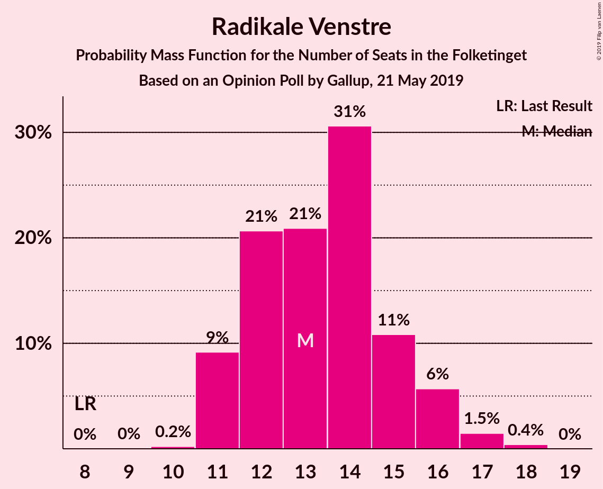

| Number of Seats | Probability | Accumulated | Special Marks |
|:---------------:|:-----------:|:-----------:|:-------------:|
| 8 | 0% | 100% | Last Result |
| 9 | 0% | 100% |  |
| 10 | 0.2% | 100% |  |
| 11 | 9% | 99.8% |  |
| 12 | 21% | 91% |  |
| 13 | 21% | 70% | Median |
| 14 | 31% | 49% |  |
| 15 | 11% | 18% |  |
| 16 | 6% | 8% |  |
| 17 | 1.5% | 2% |  |
| 18 | 0.4% | 0.4% |  |
| 19 | 0% | 0% |  |

### Enhedslisten–De Rød-Grønne

*For a full overview of the results for this party, see the [Enhedslisten–De Rød-Grønne](party-enhedslisten–derød-grønne.html) page.*

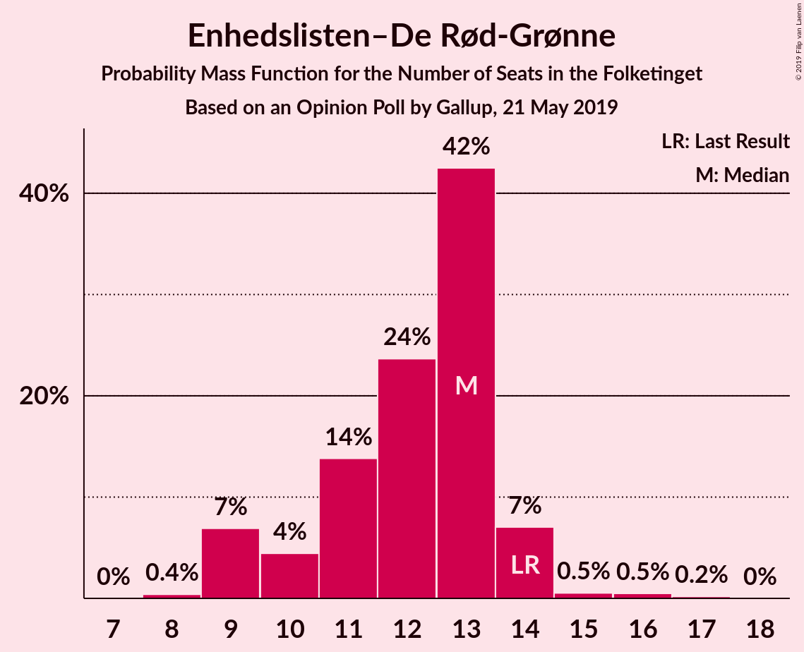

| Number of Seats | Probability | Accumulated | Special Marks |
|:---------------:|:-----------:|:-----------:|:-------------:|
| 8 | 0.4% | 100% |  |
| 9 | 7% | 99.6% |  |
| 10 | 4% | 93% |  |
| 11 | 14% | 88% |  |
| 12 | 24% | 74% |  |
| 13 | 42% | 51% | Median |
| 14 | 7% | 8% | Last Result |
| 15 | 0.5% | 1.2% |  |
| 16 | 0.5% | 0.7% |  |
| 17 | 0.2% | 0.2% |  |
| 18 | 0% | 0% |  |

### Det Konservative Folkeparti

*For a full overview of the results for this party, see the [Det Konservative Folkeparti](party-detkonservativefolkeparti.html) page.*

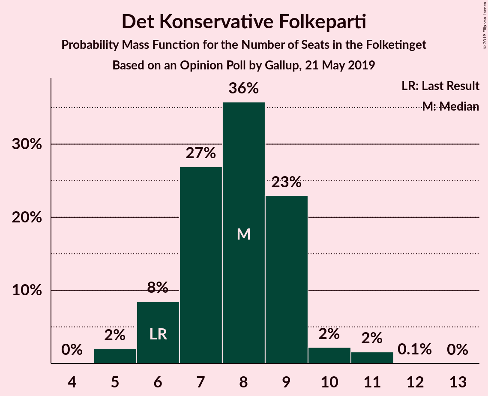

| Number of Seats | Probability | Accumulated | Special Marks |
|:---------------:|:-----------:|:-----------:|:-------------:|
| 5 | 2% | 100% |  |
| 6 | 8% | 98% | Last Result |
| 7 | 27% | 90% |  |
| 8 | 36% | 63% | Median |
| 9 | 23% | 27% |  |
| 10 | 2% | 4% |  |
| 11 | 2% | 2% |  |
| 12 | 0.1% | 0.1% |  |
| 13 | 0% | 0% |  |

### Liberal Alliance

*For a full overview of the results for this party, see the [Liberal Alliance](party-liberalalliance.html) page.*

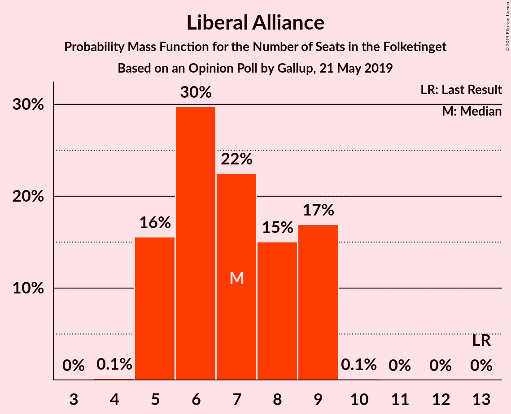

| Number of Seats | Probability | Accumulated | Special Marks |
|:---------------:|:-----------:|:-----------:|:-------------:|
| 4 | 0.1% | 100% |  |
| 5 | 16% | 99.9% |  |
| 6 | 30% | 84% |  |
| 7 | 22% | 55% | Median |
| 8 | 15% | 32% |  |
| 9 | 17% | 17% |  |
| 10 | 0.1% | 0.1% |  |
| 11 | 0% | 0% |  |
| 12 | 0% | 0% |  |
| 13 | 0% | 0% | Last Result |

### Alternativet

*For a full overview of the results for this party, see the [Alternativet](party-alternativet.html) page.*

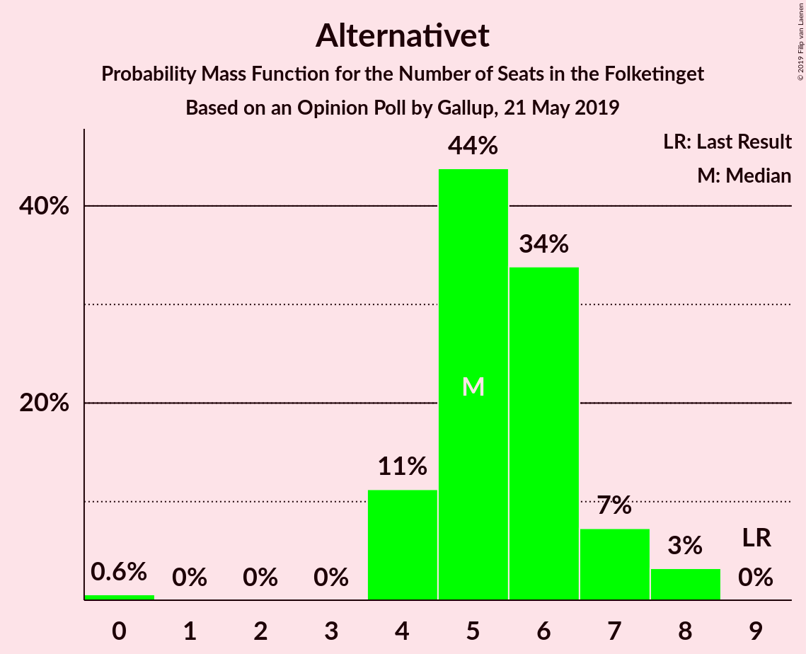

| Number of Seats | Probability | Accumulated | Special Marks |
|:---------------:|:-----------:|:-----------:|:-------------:|
| 0 | 0.6% | 100% |  |
| 1 | 0% | 99.4% |  |
| 2 | 0% | 99.4% |  |
| 3 | 0% | 99.4% |  |
| 4 | 11% | 99.4% |  |
| 5 | 44% | 88% | Median |
| 6 | 34% | 44% |  |
| 7 | 7% | 11% |  |
| 8 | 3% | 3% |  |
| 9 | 0% | 0% | Last Result |

### Nye Borgerlige

*For a full overview of the results for this party, see the [Nye Borgerlige](party-nyeborgerlige.html) page.*

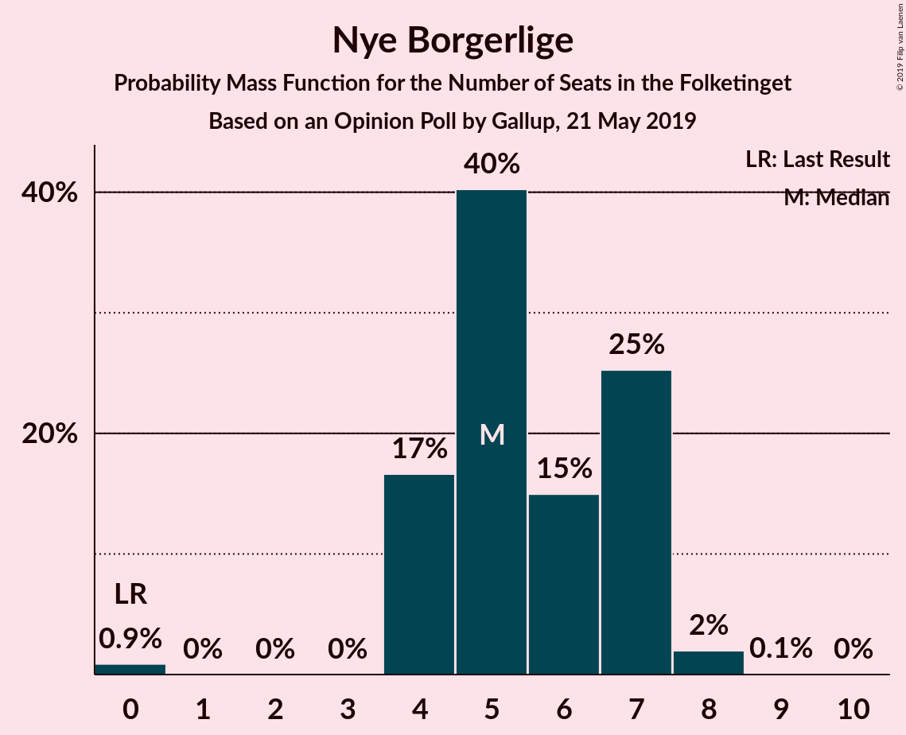

| Number of Seats | Probability | Accumulated | Special Marks |
|:---------------:|:-----------:|:-----------:|:-------------:|
| 0 | 0.9% | 100% | Last Result |
| 1 | 0% | 99.1% |  |
| 2 | 0% | 99.1% |  |
| 3 | 0% | 99.1% |  |
| 4 | 17% | 99.1% |  |
| 5 | 40% | 82% | Median |
| 6 | 15% | 42% |  |
| 7 | 25% | 27% |  |
| 8 | 2% | 2% |  |
| 9 | 0.1% | 0.1% |  |
| 10 | 0% | 0% |  |

### Kristendemokraterne

*For a full overview of the results for this party, see the [Kristendemokraterne](party-kristendemokraterne.html) page.*

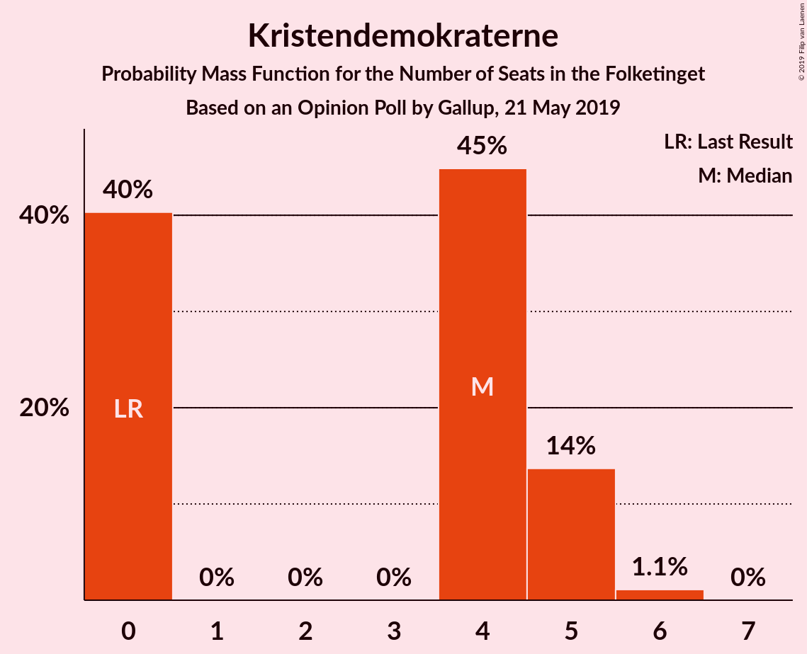

| Number of Seats | Probability | Accumulated | Special Marks |
|:---------------:|:-----------:|:-----------:|:-------------:|
| 0 | 40% | 100% | Last Result |
| 1 | 0% | 60% |  |
| 2 | 0% | 60% |  |
| 3 | 0% | 60% |  |
| 4 | 45% | 60% | Median |
| 5 | 14% | 15% |  |
| 6 | 1.1% | 1.1% |  |
| 7 | 0% | 0% |  |

### Stram Kurs

*For a full overview of the results for this party, see the [Stram Kurs](party-stramkurs.html) page.*

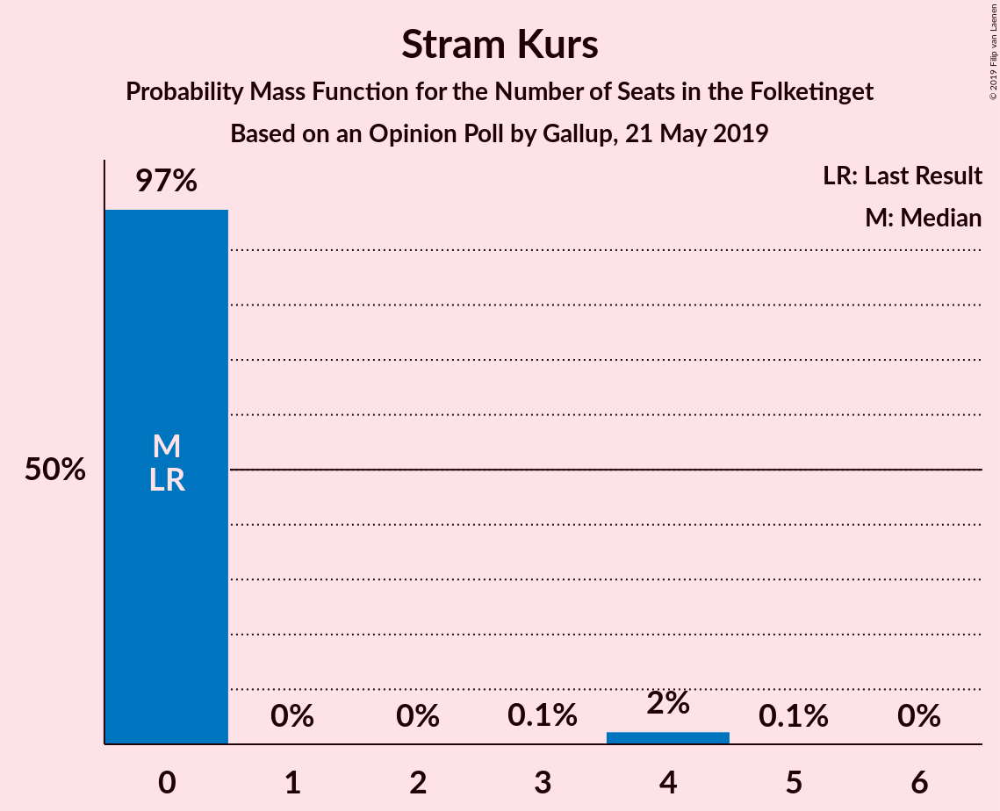

| Number of Seats | Probability | Accumulated | Special Marks |
|:---------------:|:-----------:|:-----------:|:-------------:|
| 0 | 97% | 100% | Last Result, Median |
| 1 | 0% | 3% |  |
| 2 | 0% | 3% |  |
| 3 | 0.1% | 3% |  |
| 4 | 2% | 2% |  |
| 5 | 0.1% | 0.1% |  |
| 6 | 0% | 0% |  |

### Klaus Riskær Pedersen

*For a full overview of the results for this party, see the [Klaus Riskær Pedersen](party-klausriskærpedersen.html) page.*

| Number of Seats | Probability | Accumulated | Special Marks |
|:---------------:|:-----------:|:-----------:|:-------------:|
| 0 | 93% | 100% | Last Result, Median |
| 1 | 0% | 7% |  |
| 2 | 0% | 7% |  |
| 3 | 0% | 7% |  |
| 4 | 7% | 7% |  |
| 5 | 0.3% | 0.3% |  |
| 6 | 0% | 0% |  |

## Coalitions

### Confidence Intervals

| Coalition | Last Result | Median | Majority? | 80% Confidence Interval | 90% Confidence Interval | 95% Confidence Interval | 99% Confidence Interval |
|:---------:|:-----------:|:------:|:---------:|:-----------------------:|:-----------------------:|:-----------------------:|:-----------------------:|
| Socialdemokraterne – Socialistisk Folkeparti – Radikale Venstre – Enhedslisten–De Rød-Grønne – Alternativet | 85 | 96 | 99.4% | 91–99 | 90–100 | 90–101 | 89–101 |
| Socialdemokraterne – Socialistisk Folkeparti – Radikale Venstre – Enhedslisten–De Rød-Grønne | 76 | 91 | 62% | 85–94 | 85–94 | 85–95 | 84–95 |
| Socialdemokraterne – Socialistisk Folkeparti – Enhedslisten–De Rød-Grønne – Alternativet | 77 | 83 | 0% | 78–85 | 77–86 | 76–87 | 75–88 |
| Venstre – Dansk Folkeparti – Det Konservative Folkeparti – Liberal Alliance – Nye Borgerlige – Kristendemokraterne – Stram Kurs – Klaus Riskær Pedersen | 90 | 79 | 0% | 76–84 | 75–85 | 74–85 | 74–86 |
| Venstre – Dansk Folkeparti – Det Konservative Folkeparti – Liberal Alliance – Nye Borgerlige – Kristendemokraterne – Klaus Riskær Pedersen | 90 | 79 | 0% | 76–84 | 75–85 | 74–85 | 74–85 |
| Venstre – Dansk Folkeparti – Det Konservative Folkeparti – Liberal Alliance – Nye Borgerlige – Kristendemokraterne | 90 | 79 | 0% | 76–83 | 75–84 | 74–85 | 74–85 |
| Venstre – Dansk Folkeparti – Det Konservative Folkeparti – Liberal Alliance – Nye Borgerlige – Klaus Riskær Pedersen | 90 | 76 | 0% | 74–81 | 74–82 | 72–83 | 71–84 |
| Venstre – Dansk Folkeparti – Det Konservative Folkeparti – Liberal Alliance – Nye Borgerlige | 90 | 76 | 0% | 74–79 | 74–82 | 72–82 | 71–84 |
| Socialdemokraterne – Socialistisk Folkeparti – Radikale Venstre | 62 | 78 | 0% | 74–81 | 73–81 | 73–81 | 72–83 |
| Socialdemokraterne – Socialistisk Folkeparti – Enhedslisten–De Rød-Grønne | 68 | 77 | 0% | 72–80 | 72–80 | 71–81 | 69–82 |
| Venstre – Dansk Folkeparti – Det Konservative Folkeparti – Liberal Alliance – Kristendemokraterne | 90 | 74 | 0% | 71–78 | 70–79 | 69–79 | 69–80 |
| Venstre – Dansk Folkeparti – Det Konservative Folkeparti – Liberal Alliance | 90 | 71 | 0% | 68–74 | 67–76 | 67–78 | 66–78 |
| Socialdemokraterne – Radikale Venstre | 55 | 63 | 0% | 61–66 | 60–67 | 59–67 | 57–69 |
| Venstre – Det Konservative Folkeparti – Liberal Alliance | 53 | 49 | 0% | 48–52 | 47–54 | 47–55 | 45–56 |
| Venstre – Det Konservative Folkeparti | 40 | 43 | 0% | 41–46 | 40–47 | 39–49 | 38–49 |
| Venstre | 34 | 34 | 0% | 33–38 | 32–39 | 31–41 | 30–41 |

### Socialdemokraterne – Socialistisk Folkeparti – Radikale Venstre – Enhedslisten–De Rød-Grønne – Alternativet

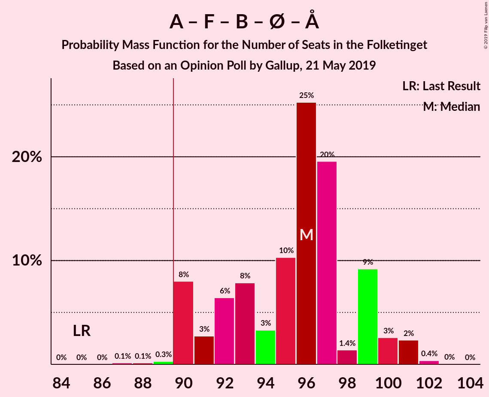

| Number of Seats | Probability | Accumulated | Special Marks |
|:---------------:|:-----------:|:-----------:|:-------------:|
| 85 | 0% | 100% | Last Result |
| 86 | 0% | 100% |  |
| 87 | 0.1% | 100% |  |
| 88 | 0.1% | 99.8% |  |
| 89 | 0.3% | 99.7% |  |
| 90 | 8% | 99.4% | Majority |
| 91 | 3% | 91% |  |
| 92 | 6% | 89% |  |
| 93 | 8% | 82% |  |
| 94 | 3% | 74% | Median |
| 95 | 10% | 71% |  |
| 96 | 25% | 61% |  |
| 97 | 20% | 36% |  |
| 98 | 1.4% | 16% |  |
| 99 | 9% | 15% |  |
| 100 | 3% | 5% |  |
| 101 | 2% | 3% |  |
| 102 | 0.4% | 0.4% |  |
| 103 | 0% | 0.1% |  |
| 104 | 0% | 0% |  |

### Socialdemokraterne – Socialistisk Folkeparti – Radikale Venstre – Enhedslisten–De Rød-Grønne

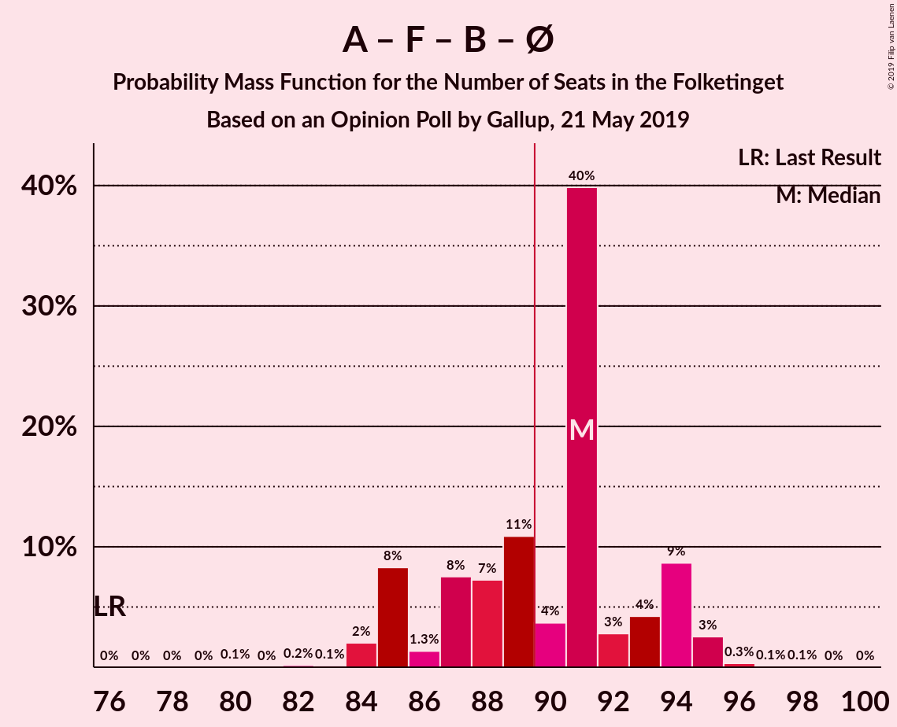

| Number of Seats | Probability | Accumulated | Special Marks |
|:---------------:|:-----------:|:-----------:|:-------------:|
| 76 | 0% | 100% | Last Result |
| 77 | 0% | 100% |  |
| 78 | 0% | 100% |  |
| 79 | 0% | 100% |  |
| 80 | 0.1% | 100% |  |
| 81 | 0% | 99.9% |  |
| 82 | 0.2% | 99.9% |  |
| 83 | 0.1% | 99.7% |  |
| 84 | 2% | 99.6% |  |
| 85 | 8% | 98% |  |
| 86 | 1.3% | 89% |  |
| 87 | 8% | 88% |  |
| 88 | 7% | 80% |  |
| 89 | 11% | 73% | Median |
| 90 | 4% | 62% | Majority |
| 91 | 40% | 59% |  |
| 92 | 3% | 19% |  |
| 93 | 4% | 16% |  |
| 94 | 9% | 12% |  |
| 95 | 3% | 3% |  |
| 96 | 0.3% | 0.5% |  |
| 97 | 0.1% | 0.1% |  |
| 98 | 0.1% | 0.1% |  |
| 99 | 0% | 0% |  |

### Socialdemokraterne – Socialistisk Folkeparti – Enhedslisten–De Rød-Grønne – Alternativet

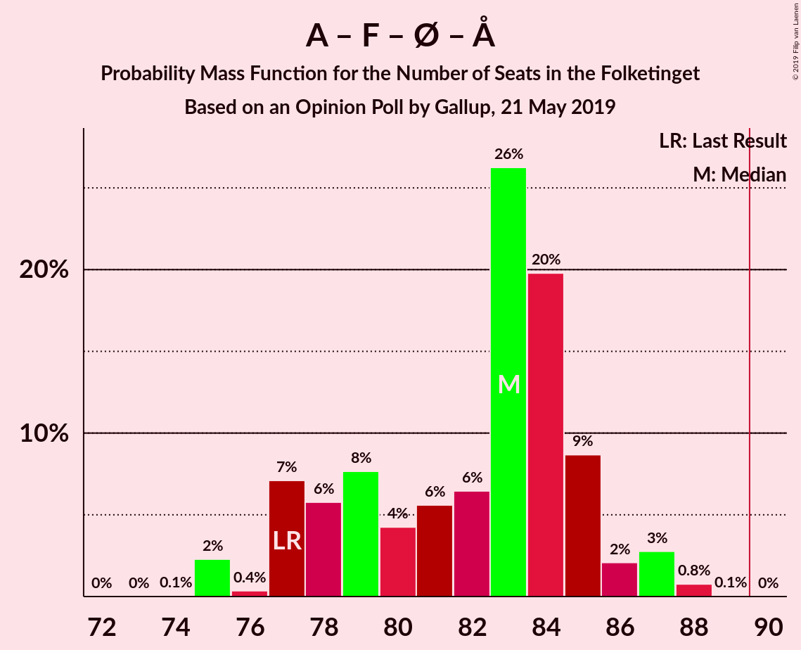

| Number of Seats | Probability | Accumulated | Special Marks |
|:---------------:|:-----------:|:-----------:|:-------------:|
| 74 | 0.1% | 100% |  |
| 75 | 2% | 99.9% |  |
| 76 | 0.4% | 98% |  |
| 77 | 7% | 97% | Last Result |
| 78 | 6% | 90% |  |
| 79 | 8% | 84% |  |
| 80 | 4% | 77% |  |
| 81 | 6% | 72% | Median |
| 82 | 6% | 67% |  |
| 83 | 26% | 60% |  |
| 84 | 20% | 34% |  |
| 85 | 9% | 14% |  |
| 86 | 2% | 6% |  |
| 87 | 3% | 4% |  |
| 88 | 0.8% | 0.8% |  |
| 89 | 0.1% | 0.1% |  |
| 90 | 0% | 0% | Majority |

### Venstre – Dansk Folkeparti – Det Konservative Folkeparti – Liberal Alliance – Nye Borgerlige – Kristendemokraterne – Stram Kurs – Klaus Riskær Pedersen

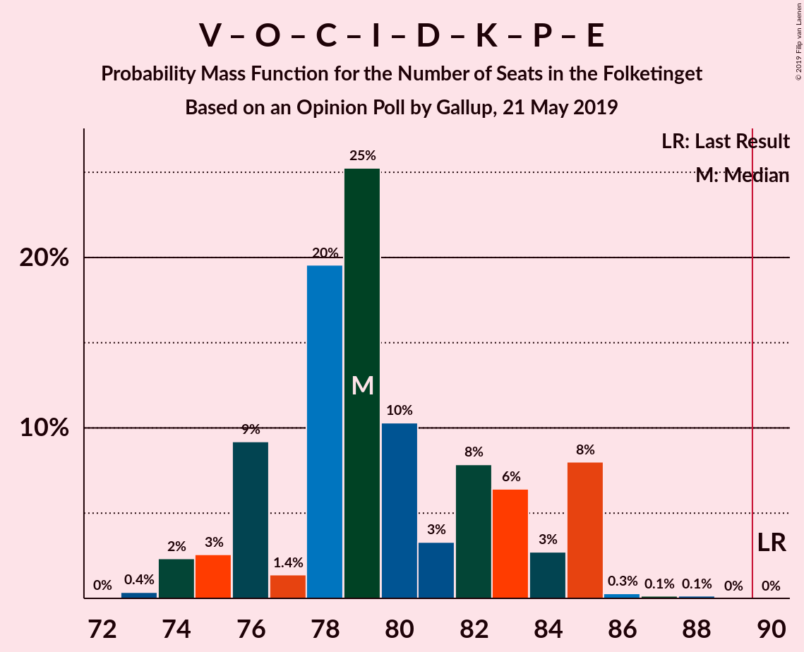

| Number of Seats | Probability | Accumulated | Special Marks |
|:---------------:|:-----------:|:-----------:|:-------------:|
| 72 | 0% | 100% |  |
| 73 | 0.4% | 99.9% |  |
| 74 | 2% | 99.6% |  |
| 75 | 3% | 97% |  |
| 76 | 9% | 95% |  |
| 77 | 1.4% | 85% |  |
| 78 | 20% | 84% |  |
| 79 | 25% | 64% |  |
| 80 | 10% | 39% | Median |
| 81 | 3% | 29% |  |
| 82 | 8% | 26% |  |
| 83 | 6% | 18% |  |
| 84 | 3% | 11% |  |
| 85 | 8% | 9% |  |
| 86 | 0.3% | 0.6% |  |
| 87 | 0.1% | 0.3% |  |
| 88 | 0.1% | 0.2% |  |
| 89 | 0% | 0% |  |
| 90 | 0% | 0% | Last Result, Majority |

### Venstre – Dansk Folkeparti – Det Konservative Folkeparti – Liberal Alliance – Nye Borgerlige – Kristendemokraterne – Klaus Riskær Pedersen

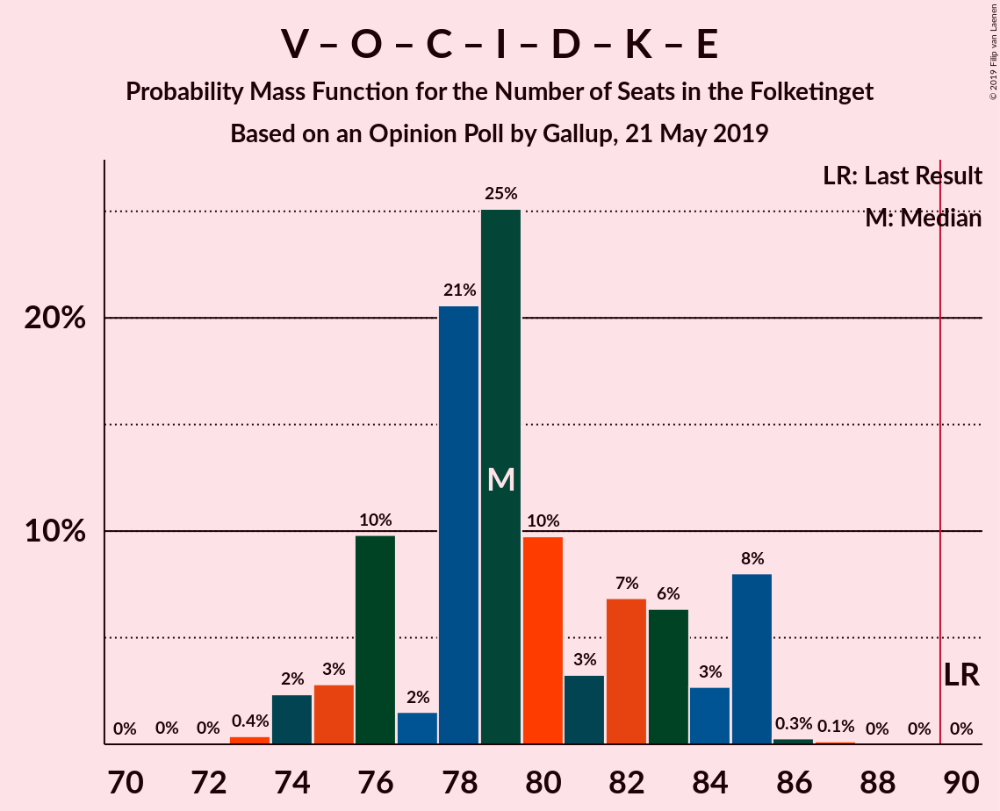

| Number of Seats | Probability | Accumulated | Special Marks |
|:---------------:|:-----------:|:-----------:|:-------------:|
| 71 | 0% | 100% |  |
| 72 | 0% | 99.9% |  |
| 73 | 0.4% | 99.9% |  |
| 74 | 2% | 99.5% |  |
| 75 | 3% | 97% |  |
| 76 | 10% | 94% |  |
| 77 | 2% | 85% |  |
| 78 | 21% | 83% |  |
| 79 | 25% | 62% |  |
| 80 | 10% | 37% | Median |
| 81 | 3% | 28% |  |
| 82 | 7% | 24% |  |
| 83 | 6% | 17% |  |
| 84 | 3% | 11% |  |
| 85 | 8% | 8% |  |
| 86 | 0.3% | 0.4% |  |
| 87 | 0.1% | 0.2% |  |
| 88 | 0% | 0% |  |
| 89 | 0% | 0% |  |
| 90 | 0% | 0% | Last Result, Majority |

### Venstre – Dansk Folkeparti – Det Konservative Folkeparti – Liberal Alliance – Nye Borgerlige – Kristendemokraterne

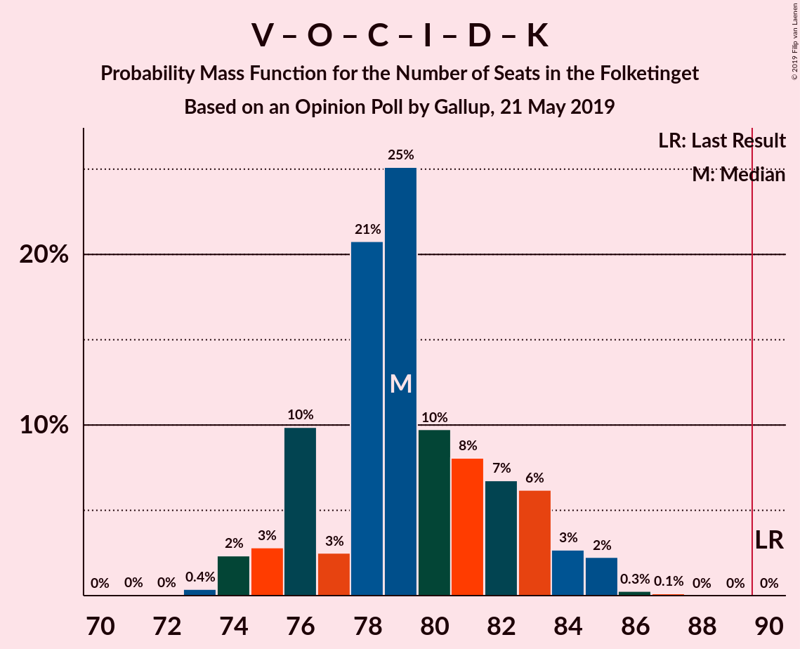

| Number of Seats | Probability | Accumulated | Special Marks |
|:---------------:|:-----------:|:-----------:|:-------------:|
| 71 | 0% | 100% |  |
| 72 | 0% | 99.9% |  |
| 73 | 0.4% | 99.9% |  |
| 74 | 2% | 99.5% |  |
| 75 | 3% | 97% |  |
| 76 | 10% | 94% |  |
| 77 | 3% | 84% |  |
| 78 | 21% | 82% |  |
| 79 | 25% | 61% |  |
| 80 | 10% | 36% | Median |
| 81 | 8% | 26% |  |
| 82 | 7% | 18% |  |
| 83 | 6% | 12% |  |
| 84 | 3% | 5% |  |
| 85 | 2% | 3% |  |
| 86 | 0.3% | 0.4% |  |
| 87 | 0.1% | 0.2% |  |
| 88 | 0% | 0% |  |
| 89 | 0% | 0% |  |
| 90 | 0% | 0% | Last Result, Majority |

### Venstre – Dansk Folkeparti – Det Konservative Folkeparti – Liberal Alliance – Nye Borgerlige – Klaus Riskær Pedersen

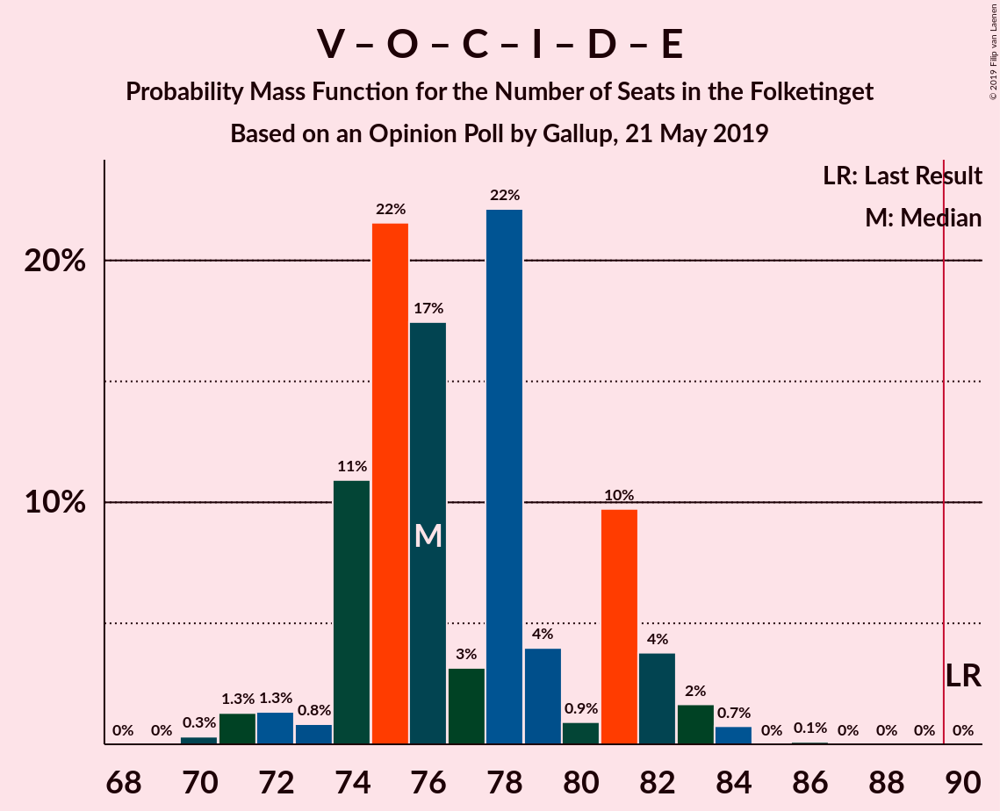

| Number of Seats | Probability | Accumulated | Special Marks |
|:---------------:|:-----------:|:-----------:|:-------------:|
| 70 | 0.3% | 100% |  |
| 71 | 1.3% | 99.7% |  |
| 72 | 1.3% | 98% |  |
| 73 | 0.8% | 97% |  |
| 74 | 11% | 96% |  |
| 75 | 22% | 85% |  |
| 76 | 17% | 64% | Median |
| 77 | 3% | 46% |  |
| 78 | 22% | 43% |  |
| 79 | 4% | 21% |  |
| 80 | 0.9% | 17% |  |
| 81 | 10% | 16% |  |
| 82 | 4% | 6% |  |
| 83 | 2% | 3% |  |
| 84 | 0.7% | 0.9% |  |
| 85 | 0% | 0.1% |  |
| 86 | 0.1% | 0.1% |  |
| 87 | 0% | 0% |  |
| 88 | 0% | 0% |  |
| 89 | 0% | 0% |  |
| 90 | 0% | 0% | Last Result, Majority |

### Venstre – Dansk Folkeparti – Det Konservative Folkeparti – Liberal Alliance – Nye Borgerlige

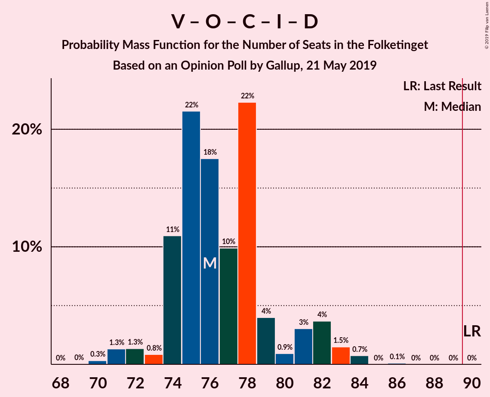

| Number of Seats | Probability | Accumulated | Special Marks |
|:---------------:|:-----------:|:-----------:|:-------------:|
| 70 | 0.3% | 100% |  |
| 71 | 1.3% | 99.6% |  |
| 72 | 1.3% | 98% |  |
| 73 | 0.8% | 97% |  |
| 74 | 11% | 96% |  |
| 75 | 22% | 85% |  |
| 76 | 18% | 64% | Median |
| 77 | 10% | 46% |  |
| 78 | 22% | 36% |  |
| 79 | 4% | 14% |  |
| 80 | 0.9% | 10% |  |
| 81 | 3% | 9% |  |
| 82 | 4% | 6% |  |
| 83 | 1.5% | 2% |  |
| 84 | 0.7% | 0.9% |  |
| 85 | 0% | 0.1% |  |
| 86 | 0.1% | 0.1% |  |
| 87 | 0% | 0% |  |
| 88 | 0% | 0% |  |
| 89 | 0% | 0% |  |
| 90 | 0% | 0% | Last Result, Majority |

### Socialdemokraterne – Socialistisk Folkeparti – Radikale Venstre

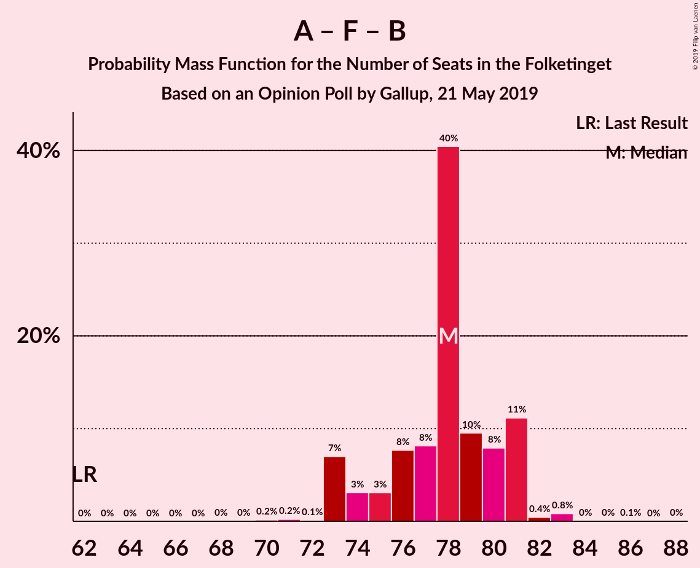

| Number of Seats | Probability | Accumulated | Special Marks |
|:---------------:|:-----------:|:-----------:|:-------------:|
| 62 | 0% | 100% | Last Result |
| 63 | 0% | 100% |  |
| 64 | 0% | 100% |  |
| 65 | 0% | 100% |  |
| 66 | 0% | 100% |  |
| 67 | 0% | 100% |  |
| 68 | 0% | 100% |  |
| 69 | 0% | 100% |  |
| 70 | 0.2% | 100% |  |
| 71 | 0.2% | 99.8% |  |
| 72 | 0.1% | 99.6% |  |
| 73 | 7% | 99.5% |  |
| 74 | 3% | 92% |  |
| 75 | 3% | 89% |  |
| 76 | 8% | 86% | Median |
| 77 | 8% | 79% |  |
| 78 | 40% | 70% |  |
| 79 | 10% | 30% |  |
| 80 | 8% | 20% |  |
| 81 | 11% | 13% |  |
| 82 | 0.4% | 1.4% |  |
| 83 | 0.8% | 1.0% |  |
| 84 | 0% | 0.1% |  |
| 85 | 0% | 0.1% |  |
| 86 | 0.1% | 0.1% |  |
| 87 | 0% | 0% |  |

### Socialdemokraterne – Socialistisk Folkeparti – Enhedslisten–De Rød-Grønne

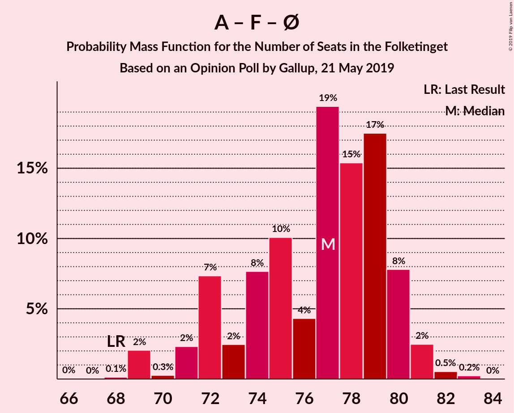

| Number of Seats | Probability | Accumulated | Special Marks |
|:---------------:|:-----------:|:-----------:|:-------------:|
| 68 | 0.1% | 100% | Last Result |
| 69 | 2% | 99.8% |  |
| 70 | 0.3% | 98% |  |
| 71 | 2% | 98% |  |
| 72 | 7% | 95% |  |
| 73 | 2% | 88% |  |
| 74 | 8% | 85% |  |
| 75 | 10% | 78% |  |
| 76 | 4% | 68% | Median |
| 77 | 19% | 63% |  |
| 78 | 15% | 44% |  |
| 79 | 17% | 29% |  |
| 80 | 8% | 11% |  |
| 81 | 2% | 3% |  |
| 82 | 0.5% | 0.8% |  |
| 83 | 0.2% | 0.3% |  |
| 84 | 0% | 0% |  |

### Venstre – Dansk Folkeparti – Det Konservative Folkeparti – Liberal Alliance – Kristendemokraterne

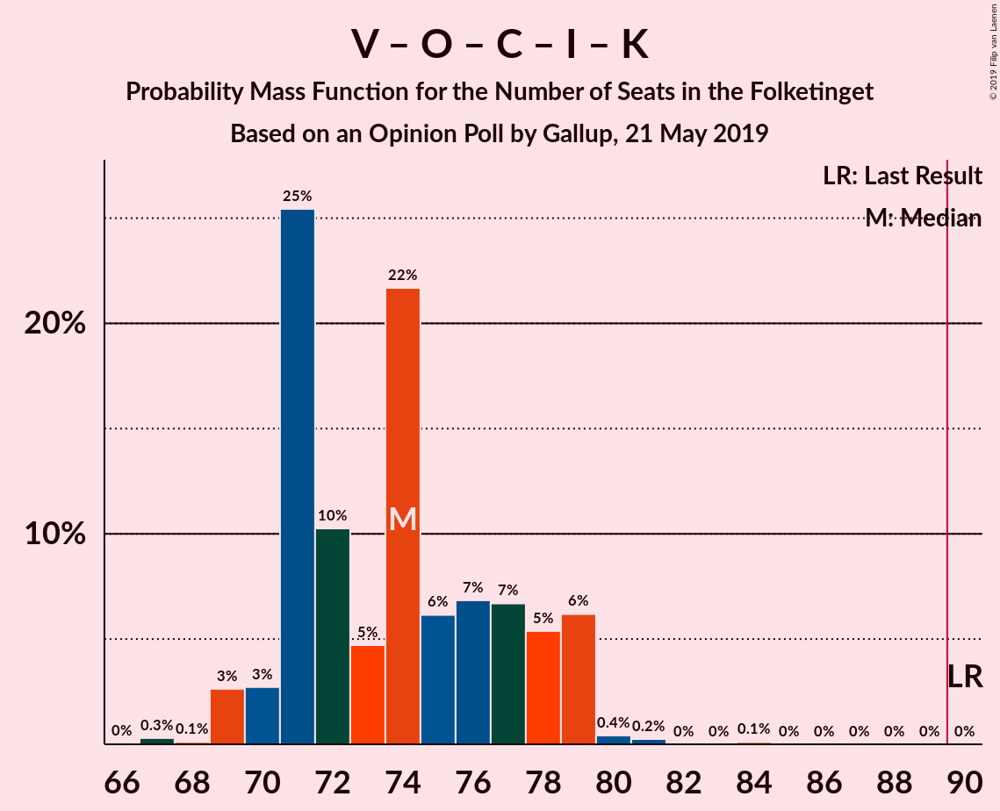

| Number of Seats | Probability | Accumulated | Special Marks |
|:---------------:|:-----------:|:-----------:|:-------------:|
| 66 | 0% | 100% |  |
| 67 | 0.3% | 99.9% |  |
| 68 | 0.1% | 99.6% |  |
| 69 | 3% | 99.5% |  |
| 70 | 3% | 97% |  |
| 71 | 25% | 94% |  |
| 72 | 10% | 69% |  |
| 73 | 5% | 58% |  |
| 74 | 22% | 54% |  |
| 75 | 6% | 32% | Median |
| 76 | 7% | 26% |  |
| 77 | 7% | 19% |  |
| 78 | 5% | 12% |  |
| 79 | 6% | 7% |  |
| 80 | 0.4% | 0.8% |  |
| 81 | 0.2% | 0.4% |  |
| 82 | 0% | 0.1% |  |
| 83 | 0% | 0.1% |  |
| 84 | 0.1% | 0.1% |  |
| 85 | 0% | 0% |  |
| 86 | 0% | 0% |  |
| 87 | 0% | 0% |  |
| 88 | 0% | 0% |  |
| 89 | 0% | 0% |  |
| 90 | 0% | 0% | Last Result, Majority |

### Venstre – Dansk Folkeparti – Det Konservative Folkeparti – Liberal Alliance

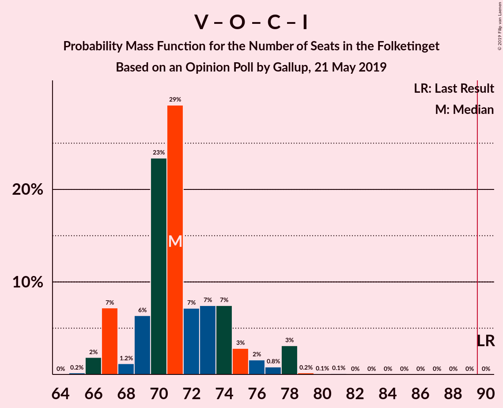

| Number of Seats | Probability | Accumulated | Special Marks |
|:---------------:|:-----------:|:-----------:|:-------------:|
| 65 | 0.2% | 100% |  |
| 66 | 2% | 99.8% |  |
| 67 | 7% | 98% |  |
| 68 | 1.2% | 91% |  |
| 69 | 6% | 90% |  |
| 70 | 23% | 83% |  |
| 71 | 29% | 60% | Median |
| 72 | 7% | 31% |  |
| 73 | 7% | 24% |  |
| 74 | 7% | 16% |  |
| 75 | 3% | 9% |  |
| 76 | 2% | 6% |  |
| 77 | 0.8% | 4% |  |
| 78 | 3% | 3% |  |
| 79 | 0.2% | 0.3% |  |
| 80 | 0.1% | 0.2% |  |
| 81 | 0.1% | 0.1% |  |
| 82 | 0% | 0% |  |
| 83 | 0% | 0% |  |
| 84 | 0% | 0% |  |
| 85 | 0% | 0% |  |
| 86 | 0% | 0% |  |
| 87 | 0% | 0% |  |
| 88 | 0% | 0% |  |
| 89 | 0% | 0% |  |
| 90 | 0% | 0% | Last Result, Majority |

### Socialdemokraterne – Radikale Venstre

| Number of Seats | Probability | Accumulated | Special Marks |
|:---------------:|:-----------:|:-----------:|:-------------:|
| 55 | 0% | 100% | Last Result |
| 56 | 0.1% | 100% |  |
| 57 | 1.3% | 99.9% |  |
| 58 | 0.3% | 98.6% |  |
| 59 | 1.0% | 98% |  |
| 60 | 5% | 97% |  |
| 61 | 31% | 92% |  |
| 62 | 7% | 61% | Median |
| 63 | 13% | 54% |  |
| 64 | 5% | 41% |  |
| 65 | 7% | 36% |  |
| 66 | 23% | 29% |  |
| 67 | 5% | 6% |  |
| 68 | 0.2% | 0.8% |  |
| 69 | 0.5% | 0.6% |  |
| 70 | 0.1% | 0.1% |  |
| 71 | 0% | 0% |  |

### Venstre – Det Konservative Folkeparti – Liberal Alliance

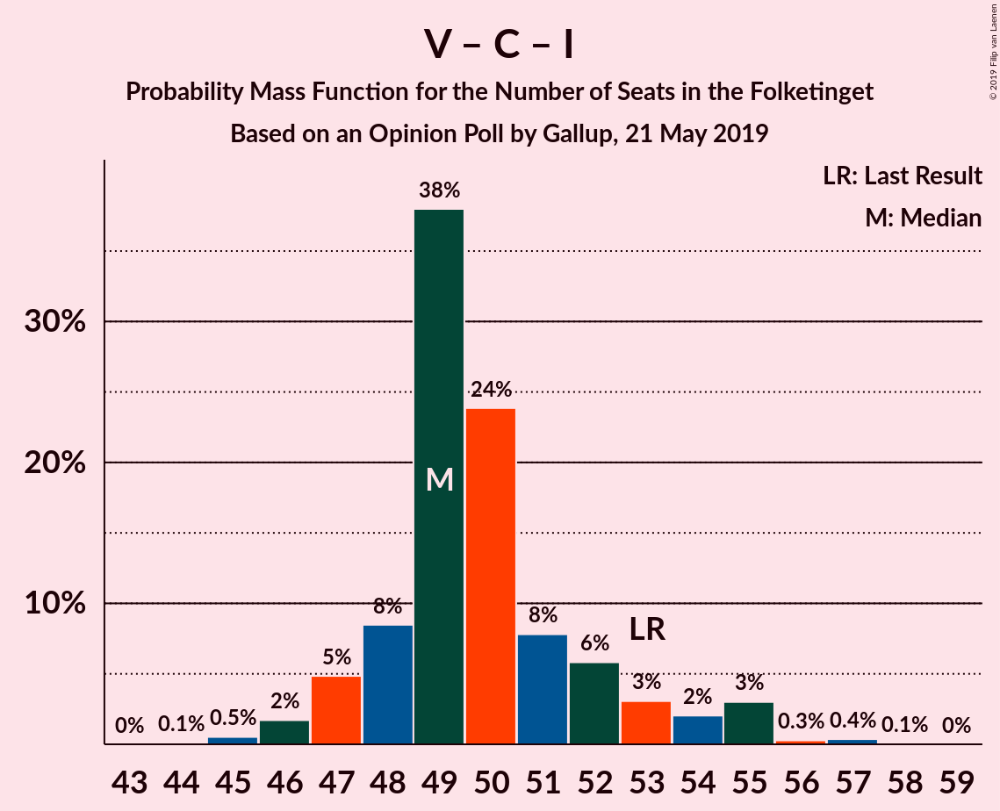

| Number of Seats | Probability | Accumulated | Special Marks |
|:---------------:|:-----------:|:-----------:|:-------------:|
| 44 | 0.1% | 100% |  |
| 45 | 0.5% | 99.9% |  |
| 46 | 2% | 99.4% |  |
| 47 | 5% | 98% |  |
| 48 | 8% | 93% |  |
| 49 | 38% | 84% | Median |
| 50 | 24% | 46% |  |
| 51 | 8% | 22% |  |
| 52 | 6% | 15% |  |
| 53 | 3% | 9% | Last Result |
| 54 | 2% | 6% |  |
| 55 | 3% | 4% |  |
| 56 | 0.3% | 0.7% |  |
| 57 | 0.4% | 0.4% |  |
| 58 | 0.1% | 0.1% |  |
| 59 | 0% | 0% |  |

### Venstre – Det Konservative Folkeparti

| Number of Seats | Probability | Accumulated | Special Marks |
|:---------------:|:-----------:|:-----------:|:-------------:|
| 36 | 0.1% | 100% |  |
| 37 | 0% | 99.9% |  |
| 38 | 1.4% | 99.9% |  |
| 39 | 3% | 98.5% |  |
| 40 | 2% | 95% | Last Result |
| 41 | 27% | 94% |  |
| 42 | 13% | 67% | Median |
| 43 | 18% | 53% |  |
| 44 | 16% | 35% |  |
| 45 | 6% | 19% |  |
| 46 | 5% | 13% |  |
| 47 | 3% | 8% |  |
| 48 | 2% | 5% |  |
| 49 | 2% | 3% |  |
| 50 | 0% | 0% |  |

### Venstre

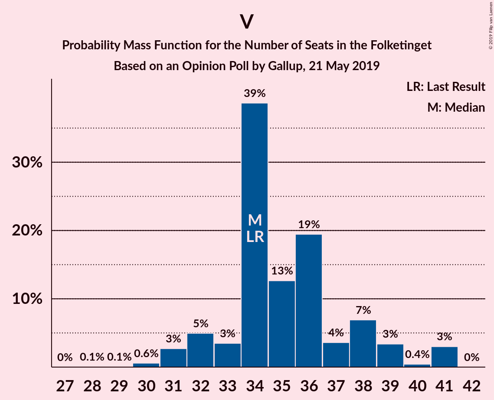

| Number of Seats | Probability | Accumulated | Special Marks |
|:---------------:|:-----------:|:-----------:|:-------------:|
| 28 | 0.1% | 100% |  |
| 29 | 0.1% | 99.9% |  |
| 30 | 0.6% | 99.9% |  |
| 31 | 3% | 99.3% |  |
| 32 | 5% | 97% |  |
| 33 | 3% | 92% |  |
| 34 | 39% | 88% | Last Result, Median |
| 35 | 13% | 49% |  |
| 36 | 19% | 37% |  |
| 37 | 4% | 17% |  |
| 38 | 7% | 14% |  |
| 39 | 3% | 7% |  |
| 40 | 0.4% | 3% |  |
| 41 | 3% | 3% |  |
| 42 | 0% | 0% |  |

## Technical Information

### Opinion Poll

+ **Polling firm:** Gallup
+ **Commissioner(s):** —
+ **Fieldwork period:** 21 May 2019

### Calculations

+ **Sample size:** 1503
+ **Simulations done:** 1,048,576
+ **Error estimate:** 1.31%

