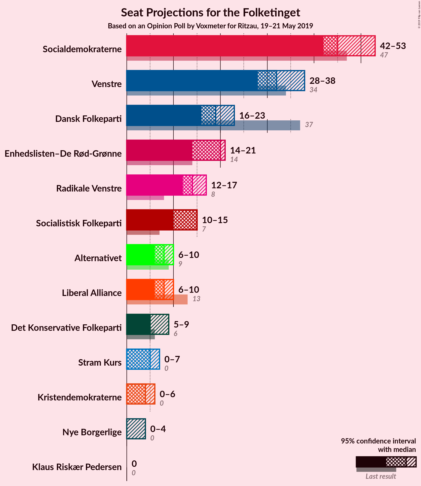
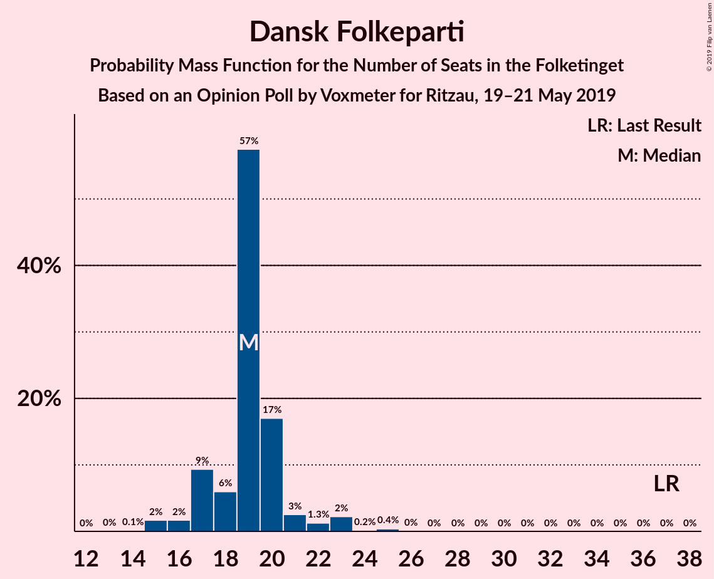
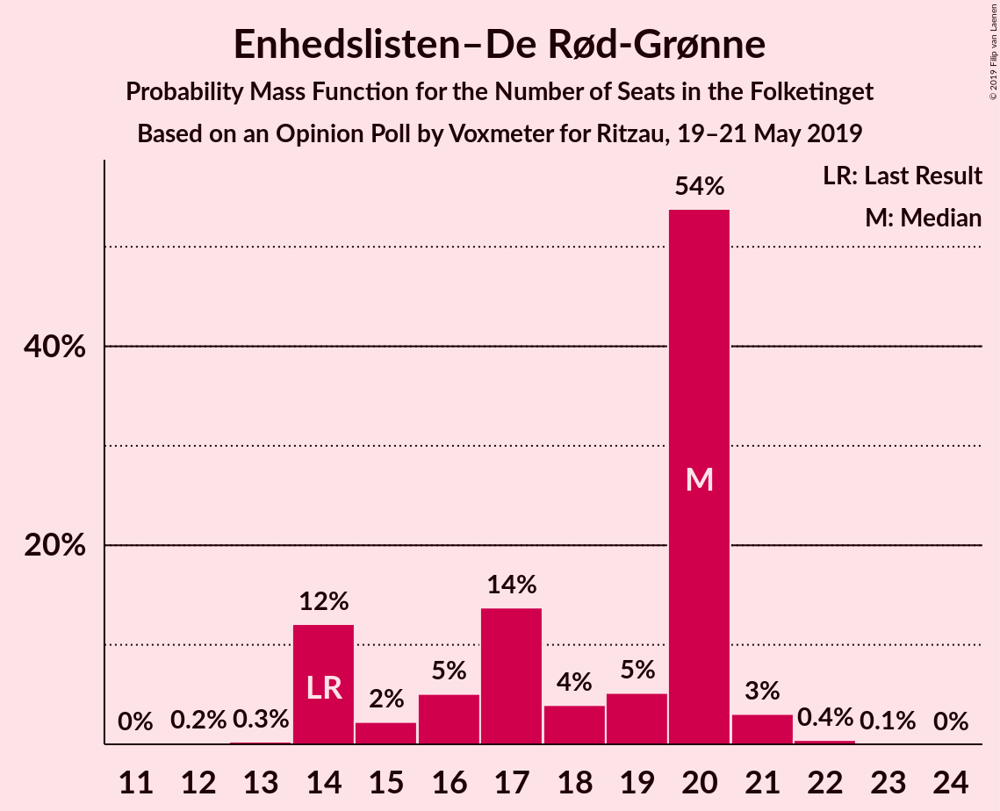
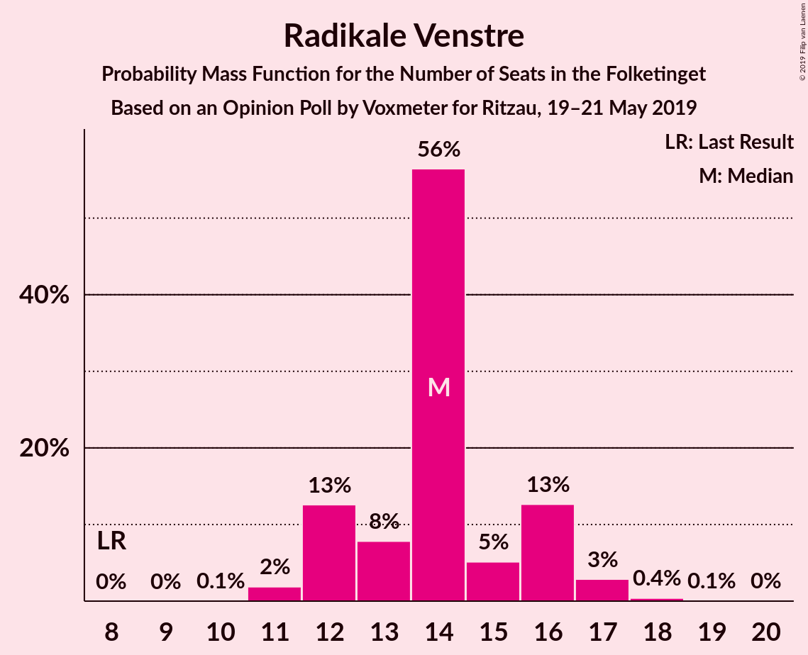
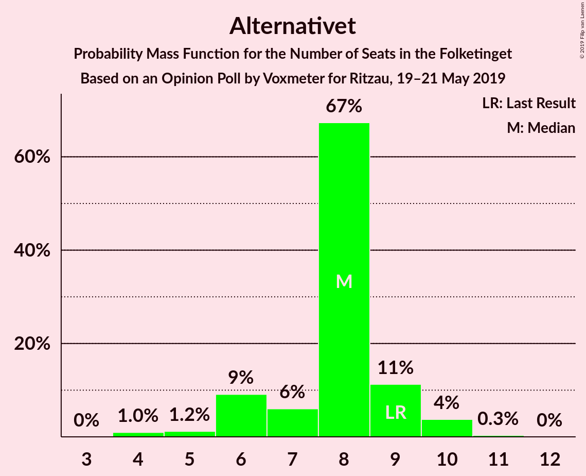
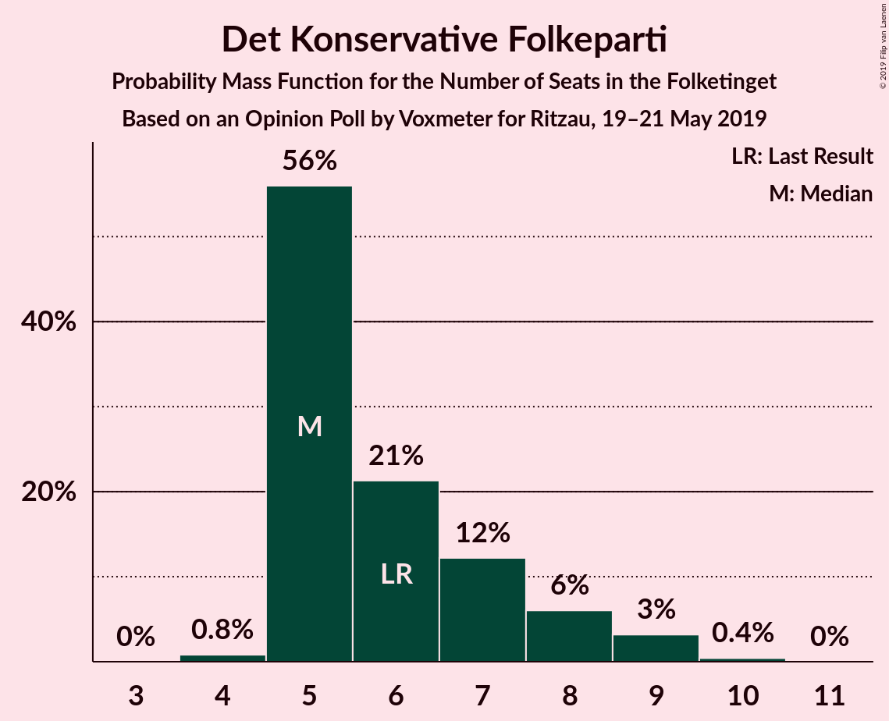
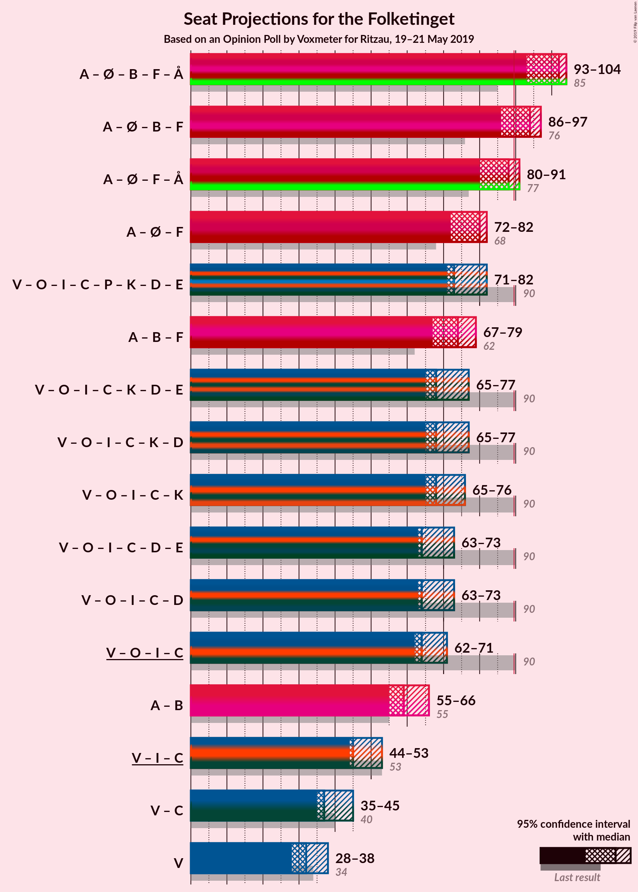
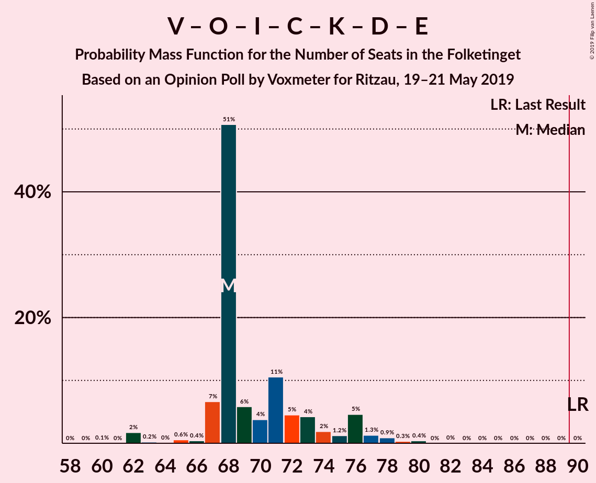
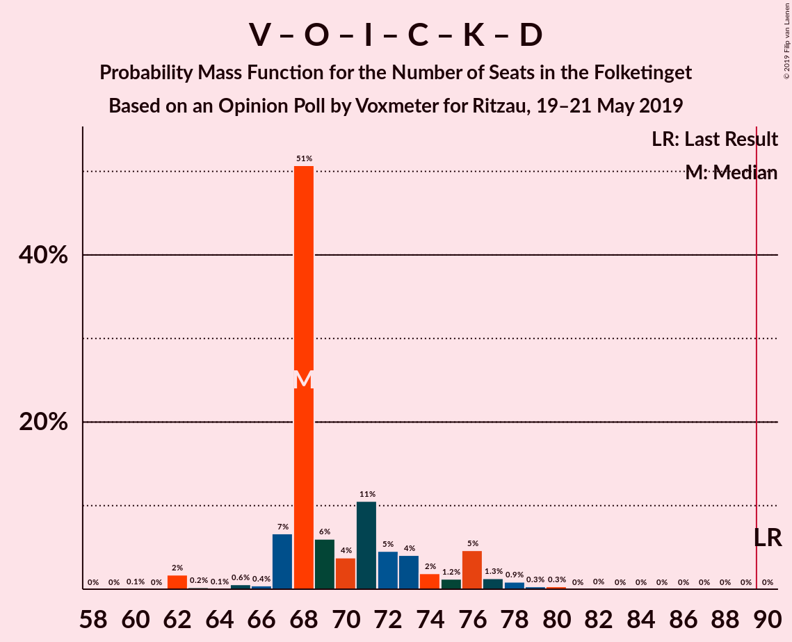
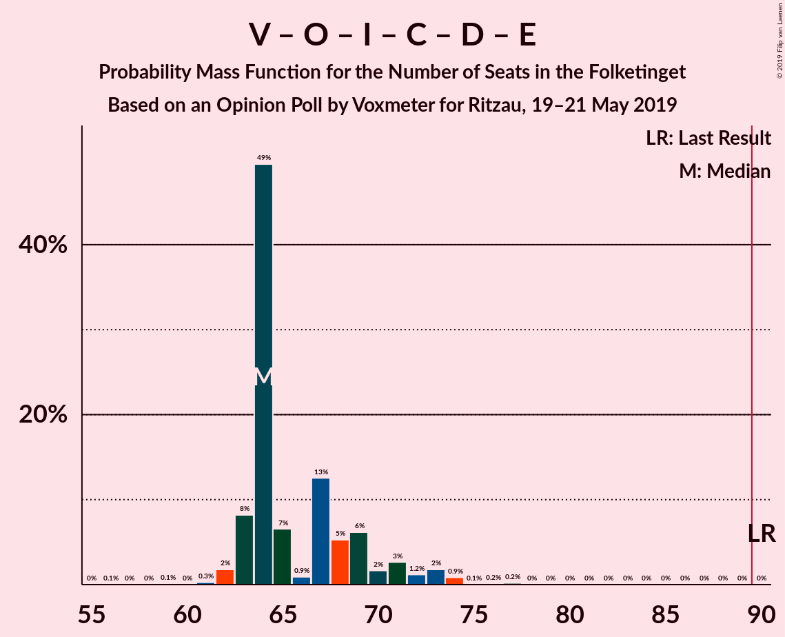

# Opinion Poll by Voxmeter for Ritzau, 19–21 May 2019

<a href="#voting-intentions">Voting Intentions</a> | <a href="#seats">Seats</a> | <a href="#coalitions">Coalitions</a> | <a href="#technical-information">Technical Information</a>

## Voting Intentions

### Confidence Intervals

| Party | Last Result | Poll Result | 80% Confidence Interval | 90% Confidence Interval | 95% Confidence Interval | 99% Confidence Interval |
|:-----:|:-----------:|:-----------:|:-----------------------:|:-----------------------:|:-----------------------:|:-----------------------:|
| Socialdemokraterne | 26.3% | 26.1% | 24.4–28.0% |23.9–28.5% |23.5–29.0% |22.7–29.9% |
| Venstre | 19.5% | 18.6% | 17.1–20.2% |16.6–20.7% |16.3–21.1% |15.6–21.9% |
| Dansk Folkeparti | 21.1% | 10.6% | 9.4–11.9% |9.1–12.3% |8.8–12.7% |8.3–13.3% |
| Enhedslisten–De Rød-Grønne | 7.8% | 9.5% | 8.4–10.8% |8.1–11.1% |7.8–11.5% |7.3–12.1% |
| Radikale Venstre | 4.6% | 7.8% | 6.8–9.0% |6.5–9.3% |6.3–9.6% |5.8–10.2% |
| Socialistisk Folkeparti | 4.2% | 7.1% | 6.1–8.2% |5.9–8.6% |5.7–8.9% |5.2–9.4% |
| Liberal Alliance | 7.5% | 4.4% | 3.7–5.3% |3.5–5.6% |3.3–5.9% |3.0–6.3% |
| Alternativet | 4.8% | 4.0% | 3.3–4.9% |3.1–5.2% |2.9–5.4% |2.6–5.9% |
| Det Konservative Folkeparti | 3.4% | 3.5% | 2.9–4.4% |2.7–4.6% |2.5–4.8% |2.2–5.3% |
| Stram Kurs | 0.0% | 2.9% | 2.3–3.7% |2.1–3.9% |2.0–4.1% |1.8–4.6% |
| Kristendemokraterne | 0.8% | 2.3% | 1.8–3.0% |1.6–3.2% |1.5–3.4% |1.3–3.8% |
| Nye Borgerlige | 0.0% | 1.5% | 1.1–2.1% |1.0–2.3% |0.9–2.5% |0.7–2.8% |
| Klaus Riskær Pedersen | 0.0% | 0.9% | 0.6–1.4% |0.5–1.6% |0.5–1.7% |0.4–2.0% |

*Note:* The poll result column reflects the actual value used in the calculations. Published results may vary slightly, and in addition be rounded to fewer digits.

## Seats

### Confidence Intervals

| Party | Last Result | Median | 80% Confidence Interval | 90% Confidence Interval | 95% Confidence Interval | 99% Confidence Interval |
|:-----:|:-----------:|:------:|:-----------------------:|:-----------------------:|:-----------------------:|:-----------------------:|
| <a href="#socialdemokraterne">Socialdemokraterne</a> | 47 | 47 | 43–52 |43–52 |43–52 |41–53 |
| <a href="#venstre">Venstre</a> | 34 | 34 | 30–38 |29–38 |29–38 |29–39 |
| <a href="#dansk-folkeparti">Dansk Folkeparti</a> | 37 | 20 | 16–22 |16–22 |16–22 |16–24 |
| <a href="#enhedslisten–de-rød-grønne">Enhedslisten–De Rød-Grønne</a> | 14 | 17 | 16–18 |16–21 |16–21 |14–21 |
| <a href="#radikale-venstre">Radikale Venstre</a> | 8 | 13 | 12–14 |12–16 |12–18 |11–18 |
| <a href="#socialistisk-folkeparti">Socialistisk Folkeparti</a> | 7 | 12 | 11–14 |11–15 |10–15 |10–17 |
| <a href="#liberal-alliance">Liberal Alliance</a> | 13 | 8 | 6–9 |6–9 |5–9 |5–11 |
| <a href="#alternativet">Alternativet</a> | 9 | 7 | 4–10 |4–10 |4–10 |4–10 |
| <a href="#det-konservative-folkeparti">Det Konservative Folkeparti</a> | 6 | 6 | 5–8 |5–9 |5–9 |4–10 |
| <a href="#stram-kurs">Stram Kurs</a> | 0 | 6 | 5–7 |4–8 |4–8 |4–9 |
| <a href="#kristendemokraterne">Kristendemokraterne</a> | 0 | 4 | 0–6 |0–6 |0–7 |0–7 |
| <a href="#nye-borgerlige">Nye Borgerlige</a> | 0 | 0 | 0–5 |0–5 |0–5 |0–5 |
| <a href="#klaus-riskær-pedersen">Klaus Riskær Pedersen</a> | 0 | 0 | 0 |0 |0 |0 |

### Socialdemokraterne

*For a full overview of the results for this party, see the [Socialdemokraterne](party-socialdemokraterne.html) page.*

| Number of Seats | Probability | Accumulated | Special Marks |
|:---------------:|:-----------:|:-----------:|:-------------:|
| 37 | 0.1% | 100% |  |
| 38 | 0% | 99.9% |  |
| 39 | 0% | 99.8% |  |
| 40 | 0.3% | 99.8% |  |
| 41 | 0% | 99.5% |  |
| 42 | 0.2% | 99.5% |  |
| 43 | 12% | 99.3% |  |
| 44 | 5% | 87% |  |
| 45 | 4% | 82% |  |
| 46 | 9% | 79% |  |
| 47 | 55% | 69% | Last Result, Median |
| 48 | 0.9% | 14% |  |
| 49 | 0.1% | 14% |  |
| 50 | 3% | 13% |  |
| 51 | 0.2% | 11% |  |
| 52 | 9% | 11% |  |
| 53 | 1.3% | 1.4% |  |
| 54 | 0.1% | 0.1% |  |
| 55 | 0% | 0% |  |

### Venstre

*For a full overview of the results for this party, see the [Venstre](party-venstre.html) page.*

| Number of Seats | Probability | Accumulated | Special Marks |
|:---------------:|:-----------:|:-----------:|:-------------:|
| 26 | 0.1% | 100% |  |
| 27 | 0.1% | 99.9% |  |
| 28 | 0.1% | 99.8% |  |
| 29 | 10% | 99.7% |  |
| 30 | 1.1% | 90% |  |
| 31 | 3% | 89% |  |
| 32 | 3% | 86% |  |
| 33 | 9% | 84% |  |
| 34 | 30% | 74% | Last Result, Median |
| 35 | 27% | 45% |  |
| 36 | 0.4% | 18% |  |
| 37 | 1.3% | 17% |  |
| 38 | 15% | 16% |  |
| 39 | 0.8% | 0.8% |  |
| 40 | 0% | 0% |  |

### Dansk Folkeparti

*For a full overview of the results for this party, see the [Dansk Folkeparti](party-danskfolkeparti.html) page.*

| Number of Seats | Probability | Accumulated | Special Marks |
|:---------------:|:-----------:|:-----------:|:-------------:|
| 14 | 0.1% | 100% |  |
| 15 | 0.1% | 99.9% |  |
| 16 | 14% | 99.8% |  |
| 17 | 3% | 86% |  |
| 18 | 3% | 83% |  |
| 19 | 20% | 80% |  |
| 20 | 35% | 60% | Median |
| 21 | 16% | 26% |  |
| 22 | 9% | 10% |  |
| 23 | 0.1% | 0.9% |  |
| 24 | 0.8% | 0.8% |  |
| 25 | 0% | 0% |  |
| 26 | 0% | 0% |  |
| 27 | 0% | 0% |  |
| 28 | 0% | 0% |  |
| 29 | 0% | 0% |  |
| 30 | 0% | 0% |  |
| 31 | 0% | 0% |  |
| 32 | 0% | 0% |  |
| 33 | 0% | 0% |  |
| 34 | 0% | 0% |  |
| 35 | 0% | 0% |  |
| 36 | 0% | 0% |  |
| 37 | 0% | 0% | Last Result |

### Enhedslisten–De Rød-Grønne

*For a full overview of the results for this party, see the [Enhedslisten–De Rød-Grønne](party-enhedslisten–derød-grønne.html) page.*

| Number of Seats | Probability | Accumulated | Special Marks |
|:---------------:|:-----------:|:-----------:|:-------------:|
| 12 | 0.1% | 100% |  |
| 13 | 0.1% | 99.9% |  |
| 14 | 0.8% | 99.8% | Last Result |
| 15 | 0.5% | 99.0% |  |
| 16 | 35% | 98% |  |
| 17 | 41% | 63% | Median |
| 18 | 15% | 23% |  |
| 19 | 0.3% | 8% |  |
| 20 | 0.5% | 7% |  |
| 21 | 7% | 7% |  |
| 22 | 0.1% | 0.2% |  |
| 23 | 0% | 0% |  |

### Radikale Venstre

*For a full overview of the results for this party, see the [Radikale Venstre](party-radikalevenstre.html) page.*

| Number of Seats | Probability | Accumulated | Special Marks |
|:---------------:|:-----------:|:-----------:|:-------------:|
| 8 | 0% | 100% | Last Result |
| 9 | 0% | 100% |  |
| 10 | 0.1% | 100% |  |
| 11 | 0.6% | 99.9% |  |
| 12 | 36% | 99.3% |  |
| 13 | 37% | 64% | Median |
| 14 | 18% | 26% |  |
| 15 | 2% | 8% |  |
| 16 | 3% | 6% |  |
| 17 | 0.3% | 3% |  |
| 18 | 3% | 3% |  |
| 19 | 0% | 0.1% |  |
| 20 | 0.1% | 0.1% |  |
| 21 | 0% | 0% |  |

### Socialistisk Folkeparti

*For a full overview of the results for this party, see the [Socialistisk Folkeparti](party-socialistiskfolkeparti.html) page.*

| Number of Seats | Probability | Accumulated | Special Marks |
|:---------------:|:-----------:|:-----------:|:-------------:|
| 7 | 0% | 100% | Last Result |
| 8 | 0% | 100% |  |
| 9 | 0.2% | 100% |  |
| 10 | 4% | 99.8% |  |
| 11 | 16% | 96% |  |
| 12 | 42% | 80% | Median |
| 13 | 27% | 38% |  |
| 14 | 2% | 11% |  |
| 15 | 8% | 9% |  |
| 16 | 0.1% | 0.8% |  |
| 17 | 0.6% | 0.7% |  |
| 18 | 0% | 0% |  |

### Liberal Alliance

*For a full overview of the results for this party, see the [Liberal Alliance](party-liberalalliance.html) page.*

| Number of Seats | Probability | Accumulated | Special Marks |
|:---------------:|:-----------:|:-----------:|:-------------:|
| 5 | 4% | 100% |  |
| 6 | 11% | 96% |  |
| 7 | 22% | 85% |  |
| 8 | 26% | 64% | Median |
| 9 | 36% | 38% |  |
| 10 | 2% | 2% |  |
| 11 | 0.5% | 0.7% |  |
| 12 | 0.2% | 0.3% |  |
| 13 | 0% | 0% | Last Result |

### Alternativet

*For a full overview of the results for this party, see the [Alternativet](party-alternativet.html) page.*

| Number of Seats | Probability | Accumulated | Special Marks |
|:---------------:|:-----------:|:-----------:|:-------------:|
| 4 | 15% | 100% |  |
| 5 | 0.9% | 85% |  |
| 6 | 23% | 84% |  |
| 7 | 14% | 60% | Median |
| 8 | 14% | 46% |  |
| 9 | 1.2% | 33% | Last Result |
| 10 | 31% | 32% |  |
| 11 | 0% | 0.1% |  |
| 12 | 0% | 0% |  |

### Det Konservative Folkeparti

*For a full overview of the results for this party, see the [Det Konservative Folkeparti](party-detkonservativefolkeparti.html) page.*

| Number of Seats | Probability | Accumulated | Special Marks |
|:---------------:|:-----------:|:-----------:|:-------------:|
| 0 | 0.1% | 100% |  |
| 1 | 0% | 99.9% |  |
| 2 | 0% | 99.9% |  |
| 3 | 0% | 99.9% |  |
| 4 | 2% | 99.9% |  |
| 5 | 25% | 98% |  |
| 6 | 38% | 73% | Last Result, Median |
| 7 | 20% | 35% |  |
| 8 | 10% | 15% |  |
| 9 | 5% | 5% |  |
| 10 | 0.5% | 0.5% |  |
| 11 | 0% | 0% |  |

### Stram Kurs

*For a full overview of the results for this party, see the [Stram Kurs](party-stramkurs.html) page.*

| Number of Seats | Probability | Accumulated | Special Marks |
|:---------------:|:-----------:|:-----------:|:-------------:|
| 0 | 0.5% | 100% | Last Result |
| 1 | 0% | 99.5% |  |
| 2 | 0% | 99.5% |  |
| 3 | 0% | 99.5% |  |
| 4 | 8% | 99.5% |  |
| 5 | 10% | 92% |  |
| 6 | 36% | 82% | Median |
| 7 | 40% | 46% |  |
| 8 | 3% | 6% |  |
| 9 | 2% | 2% |  |
| 10 | 0% | 0% |  |

### Kristendemokraterne

*For a full overview of the results for this party, see the [Kristendemokraterne](party-kristendemokraterne.html) page.*

| Number of Seats | Probability | Accumulated | Special Marks |
|:---------------:|:-----------:|:-----------:|:-------------:|
| 0 | 37% | 100% | Last Result |
| 1 | 0% | 63% |  |
| 2 | 0% | 63% |  |
| 3 | 0% | 63% |  |
| 4 | 20% | 63% | Median |
| 5 | 15% | 43% |  |
| 6 | 25% | 28% |  |
| 7 | 3% | 3% |  |
| 8 | 0% | 0% |  |

### Nye Borgerlige

*For a full overview of the results for this party, see the [Nye Borgerlige](party-nyeborgerlige.html) page.*

| Number of Seats | Probability | Accumulated | Special Marks |
|:---------------:|:-----------:|:-----------:|:-------------:|
| 0 | 79% | 100% | Last Result, Median |
| 1 | 0% | 21% |  |
| 2 | 0% | 21% |  |
| 3 | 0% | 21% |  |
| 4 | 6% | 21% |  |
| 5 | 15% | 15% |  |
| 6 | 0% | 0% |  |

### Klaus Riskær Pedersen

*For a full overview of the results for this party, see the [Klaus Riskær Pedersen](party-klausriskærpedersen.html) page.*

| Number of Seats | Probability | Accumulated | Special Marks |
|:---------------:|:-----------:|:-----------:|:-------------:|
| 0 | 99.8% | 100% | Last Result, Median |
| 1 | 0% | 0.2% |  |
| 2 | 0% | 0.2% |  |
| 3 | 0% | 0.2% |  |
| 4 | 0.2% | 0.2% |  |
| 5 | 0% | 0% |  |

## Coalitions

### Confidence Intervals

| Coalition | Last Result | Median | Majority? | 80% Confidence Interval | 90% Confidence Interval | 95% Confidence Interval | 99% Confidence Interval |
|:---------:|:-----------:|:------:|:---------:|:-----------------------:|:-----------------------:|:-----------------------:|:-----------------------:|
| Socialdemokraterne – Enhedslisten–De Rød-Grønne – Radikale Venstre – Socialistisk Folkeparti – Alternativet | 85 | 98 | 99.9% | 92–99 | 92–100 | 91–104 | 91–105 |
| Socialdemokraterne – Enhedslisten–De Rød-Grønne – Radikale Venstre – Socialistisk Folkeparti | 76 | 89 | 30% | 86–92 | 86–93 | 83–96 | 83–98 |
| Socialdemokraterne – Enhedslisten–De Rød-Grønne – Socialistisk Folkeparti – Alternativet | 77 | 84 | 0.3% | 80–87 | 78–87 | 78–89 | 78–89 |
| Venstre – Dansk Folkeparti – Liberal Alliance – Det Konservative Folkeparti – Stram Kurs – Kristendemokraterne – Nye Borgerlige – Klaus Riskær Pedersen | 90 | 77 | 0% | 76–83 | 75–83 | 71–84 | 70–84 |
| Socialdemokraterne – Enhedslisten–De Rød-Grønne – Socialistisk Folkeparti | 68 | 76 | 0% | 72–80 | 72–80 | 70–82 | 70–82 |
| Socialdemokraterne – Radikale Venstre – Socialistisk Folkeparti | 62 | 72 | 0% | 70–75 | 70–76 | 67–81 | 67–81 |
| Venstre – Dansk Folkeparti – Liberal Alliance – Det Konservative Folkeparti – Kristendemokraterne – Nye Borgerlige – Klaus Riskær Pedersen | 90 | 72 | 0% | 69–77 | 67–77 | 65–80 | 65–80 |
| Venstre – Dansk Folkeparti – Liberal Alliance – Det Konservative Folkeparti – Kristendemokraterne – Nye Borgerlige | 90 | 72 | 0% | 69–77 | 66–77 | 65–80 | 65–80 |
| Venstre – Dansk Folkeparti – Liberal Alliance – Det Konservative Folkeparti – Kristendemokraterne | 90 | 70 | 0% | 68–75 | 66–75 | 65–80 | 65–80 |
| Venstre – Dansk Folkeparti – Liberal Alliance – Det Konservative Folkeparti – Nye Borgerlige – Klaus Riskær Pedersen | 90 | 69 | 0% | 65–73 | 65–74 | 64–74 | 64–74 |
| Venstre – Dansk Folkeparti – Liberal Alliance – Det Konservative Folkeparti – Nye Borgerlige | 90 | 69 | 0% | 65–73 | 65–74 | 64–74 | 64–74 |
| Venstre – Dansk Folkeparti – Liberal Alliance – Det Konservative Folkeparti | 90 | 68 | 0% | 65–69 | 64–74 | 64–74 | 61–74 |
| Socialdemokraterne – Radikale Venstre | 55 | 60 | 0% | 57–64 | 57–64 | 57–66 | 54–66 |
| Venstre – Liberal Alliance – Det Konservative Folkeparti | 53 | 49 | 0% | 43–51 | 43–52 | 43–53 | 40–55 |
| Venstre – Det Konservative Folkeparti | 40 | 40 | 0% | 37–43 | 37–44 | 37–44 | 34–45 |
| Venstre | 34 | 34 | 0% | 30–38 | 29–38 | 29–38 | 29–39 |

### Socialdemokraterne – Enhedslisten–De Rød-Grønne – Radikale Venstre – Socialistisk Folkeparti – Alternativet

| Number of Seats | Probability | Accumulated | Special Marks |
|:---------------:|:-----------:|:-----------:|:-------------:|
| 85 | 0% | 100% | Last Result |
| 86 | 0% | 100% |  |
| 87 | 0% | 100% |  |
| 88 | 0% | 100% |  |
| 89 | 0% | 100% |  |
| 90 | 0.1% | 99.9% | Majority |
| 91 | 5% | 99.9% |  |
| 92 | 15% | 95% |  |
| 93 | 0.1% | 81% |  |
| 94 | 9% | 80% |  |
| 95 | 11% | 71% |  |
| 96 | 3% | 60% | Median |
| 97 | 1.0% | 57% |  |
| 98 | 9% | 56% |  |
| 99 | 39% | 46% |  |
| 100 | 3% | 8% |  |
| 101 | 1.3% | 4% |  |
| 102 | 0.1% | 3% |  |
| 103 | 0.4% | 3% |  |
| 104 | 0.3% | 3% |  |
| 105 | 2% | 2% |  |
| 106 | 0% | 0.1% |  |
| 107 | 0% | 0.1% |  |
| 108 | 0.1% | 0.1% |  |
| 109 | 0% | 0% |  |

### Socialdemokraterne – Enhedslisten–De Rød-Grønne – Radikale Venstre – Socialistisk Folkeparti

| Number of Seats | Probability | Accumulated | Special Marks |
|:---------------:|:-----------:|:-----------:|:-------------:|
| 76 | 0% | 100% | Last Result |
| 77 | 0% | 100% |  |
| 78 | 0% | 100% |  |
| 79 | 0% | 100% |  |
| 80 | 0% | 100% |  |
| 81 | 0% | 100% |  |
| 82 | 0.1% | 100% |  |
| 83 | 4% | 99.9% |  |
| 84 | 0.1% | 96% |  |
| 85 | 0.3% | 96% |  |
| 86 | 9% | 95% |  |
| 87 | 1.3% | 86% |  |
| 88 | 15% | 85% |  |
| 89 | 40% | 70% | Median |
| 90 | 5% | 30% | Majority |
| 91 | 0.3% | 25% |  |
| 92 | 20% | 25% |  |
| 93 | 0.9% | 5% |  |
| 94 | 2% | 4% |  |
| 95 | 0.1% | 3% |  |
| 96 | 0.3% | 3% |  |
| 97 | 0.1% | 2% |  |
| 98 | 2% | 2% |  |
| 99 | 0% | 0.1% |  |
| 100 | 0% | 0% |  |

### Socialdemokraterne – Enhedslisten–De Rød-Grønne – Socialistisk Folkeparti – Alternativet

| Number of Seats | Probability | Accumulated | Special Marks |
|:---------------:|:-----------:|:-----------:|:-------------:|
| 75 | 0% | 100% |  |
| 76 | 0.2% | 99.9% |  |
| 77 | 0% | 99.8% | Last Result |
| 78 | 7% | 99.7% |  |
| 79 | 0.5% | 93% |  |
| 80 | 24% | 93% |  |
| 81 | 0.2% | 69% |  |
| 82 | 2% | 69% |  |
| 83 | 11% | 67% | Median |
| 84 | 7% | 56% |  |
| 85 | 4% | 49% |  |
| 86 | 31% | 45% |  |
| 87 | 9% | 14% |  |
| 88 | 2% | 4% |  |
| 89 | 2% | 3% |  |
| 90 | 0.2% | 0.3% | Majority |
| 91 | 0% | 0.1% |  |
| 92 | 0% | 0.1% |  |
| 93 | 0% | 0.1% |  |
| 94 | 0.1% | 0.1% |  |
| 95 | 0% | 0% |  |

### Venstre – Dansk Folkeparti – Liberal Alliance – Det Konservative Folkeparti – Stram Kurs – Kristendemokraterne – Nye Borgerlige – Klaus Riskær Pedersen

| Number of Seats | Probability | Accumulated | Special Marks |
|:---------------:|:-----------:|:-----------:|:-------------:|
| 67 | 0.1% | 100% |  |
| 68 | 0% | 99.9% |  |
| 69 | 0% | 99.9% |  |
| 70 | 2% | 99.9% |  |
| 71 | 0.3% | 98% |  |
| 72 | 0.4% | 97% |  |
| 73 | 0.1% | 97% |  |
| 74 | 1.4% | 97% |  |
| 75 | 3% | 95% |  |
| 76 | 39% | 92% |  |
| 77 | 9% | 54% |  |
| 78 | 1.0% | 44% | Median |
| 79 | 3% | 43% |  |
| 80 | 11% | 40% |  |
| 81 | 9% | 29% |  |
| 82 | 0% | 20% |  |
| 83 | 15% | 19% |  |
| 84 | 5% | 5% |  |
| 85 | 0.1% | 0.1% |  |
| 86 | 0% | 0.1% |  |
| 87 | 0% | 0% |  |
| 88 | 0% | 0% |  |
| 89 | 0% | 0% |  |
| 90 | 0% | 0% | Last Result, Majority |

### Socialdemokraterne – Enhedslisten–De Rød-Grønne – Socialistisk Folkeparti

| Number of Seats | Probability | Accumulated | Special Marks |
|:---------------:|:-----------:|:-----------:|:-------------:|
| 68 | 0.2% | 100% | Last Result |
| 69 | 0% | 99.8% |  |
| 70 | 4% | 99.8% |  |
| 71 | 0.1% | 96% |  |
| 72 | 12% | 96% |  |
| 73 | 0.5% | 84% |  |
| 74 | 0.2% | 84% |  |
| 75 | 0.7% | 83% |  |
| 76 | 47% | 83% | Median |
| 77 | 13% | 36% |  |
| 78 | 6% | 23% |  |
| 79 | 3% | 17% |  |
| 80 | 9% | 13% |  |
| 81 | 1.4% | 4% |  |
| 82 | 3% | 3% |  |
| 83 | 0% | 0.1% |  |
| 84 | 0% | 0.1% |  |
| 85 | 0.1% | 0.1% |  |
| 86 | 0% | 0% |  |

### Socialdemokraterne – Radikale Venstre – Socialistisk Folkeparti

| Number of Seats | Probability | Accumulated | Special Marks |
|:---------------:|:-----------:|:-----------:|:-------------:|
| 62 | 0% | 100% | Last Result |
| 63 | 0% | 100% |  |
| 64 | 0% | 100% |  |
| 65 | 0.1% | 100% |  |
| 66 | 0% | 99.8% |  |
| 67 | 4% | 99.8% |  |
| 68 | 0.2% | 96% |  |
| 69 | 0.1% | 95% |  |
| 70 | 10% | 95% |  |
| 71 | 18% | 86% |  |
| 72 | 43% | 68% | Median |
| 73 | 0.7% | 24% |  |
| 74 | 8% | 23% |  |
| 75 | 9% | 15% |  |
| 76 | 0.9% | 6% |  |
| 77 | 0.4% | 5% |  |
| 78 | 2% | 4% |  |
| 79 | 0.1% | 3% |  |
| 80 | 0.2% | 3% |  |
| 81 | 2% | 3% |  |
| 82 | 0% | 0.1% |  |
| 83 | 0% | 0% |  |

### Venstre – Dansk Folkeparti – Liberal Alliance – Det Konservative Folkeparti – Kristendemokraterne – Nye Borgerlige – Klaus Riskær Pedersen

| Number of Seats | Probability | Accumulated | Special Marks |
|:---------------:|:-----------:|:-----------:|:-------------:|
| 61 | 0.1% | 100% |  |
| 62 | 0% | 99.9% |  |
| 63 | 0% | 99.9% |  |
| 64 | 0% | 99.9% |  |
| 65 | 3% | 99.9% |  |
| 66 | 2% | 97% |  |
| 67 | 0.2% | 95% |  |
| 68 | 0.3% | 95% |  |
| 69 | 33% | 95% |  |
| 70 | 9% | 61% |  |
| 71 | 1.4% | 52% |  |
| 72 | 4% | 51% | Median |
| 73 | 16% | 46% |  |
| 74 | 1.3% | 31% |  |
| 75 | 9% | 29% |  |
| 76 | 0.3% | 20% |  |
| 77 | 15% | 20% |  |
| 78 | 0.2% | 5% |  |
| 79 | 0.6% | 5% |  |
| 80 | 4% | 4% |  |
| 81 | 0% | 0% |  |
| 82 | 0% | 0% |  |
| 83 | 0% | 0% |  |
| 84 | 0% | 0% |  |
| 85 | 0% | 0% |  |
| 86 | 0% | 0% |  |
| 87 | 0% | 0% |  |
| 88 | 0% | 0% |  |
| 89 | 0% | 0% |  |
| 90 | 0% | 0% | Last Result, Majority |

### Venstre – Dansk Folkeparti – Liberal Alliance – Det Konservative Folkeparti – Kristendemokraterne – Nye Borgerlige

| Number of Seats | Probability | Accumulated | Special Marks |
|:---------------:|:-----------:|:-----------:|:-------------:|
| 61 | 0.1% | 100% |  |
| 62 | 0% | 99.9% |  |
| 63 | 0% | 99.9% |  |
| 64 | 0.1% | 99.9% |  |
| 65 | 3% | 99.8% |  |
| 66 | 2% | 97% |  |
| 67 | 0.2% | 95% |  |
| 68 | 0.2% | 95% |  |
| 69 | 33% | 94% |  |
| 70 | 9% | 61% |  |
| 71 | 1.4% | 52% |  |
| 72 | 4% | 51% | Median |
| 73 | 16% | 46% |  |
| 74 | 1.3% | 31% |  |
| 75 | 9% | 29% |  |
| 76 | 0.3% | 20% |  |
| 77 | 15% | 20% |  |
| 78 | 0.2% | 5% |  |
| 79 | 0.6% | 5% |  |
| 80 | 4% | 4% |  |
| 81 | 0% | 0% |  |
| 82 | 0% | 0% |  |
| 83 | 0% | 0% |  |
| 84 | 0% | 0% |  |
| 85 | 0% | 0% |  |
| 86 | 0% | 0% |  |
| 87 | 0% | 0% |  |
| 88 | 0% | 0% |  |
| 89 | 0% | 0% |  |
| 90 | 0% | 0% | Last Result, Majority |

### Venstre – Dansk Folkeparti – Liberal Alliance – Det Konservative Folkeparti – Kristendemokraterne

| Number of Seats | Probability | Accumulated | Special Marks |
|:---------------:|:-----------:|:-----------:|:-------------:|
| 60 | 0% | 100% |  |
| 61 | 0.1% | 99.9% |  |
| 62 | 0.1% | 99.8% |  |
| 63 | 0.1% | 99.8% |  |
| 64 | 0.1% | 99.7% |  |
| 65 | 3% | 99.6% |  |
| 66 | 2% | 97% |  |
| 67 | 0.9% | 94% |  |
| 68 | 4% | 93% |  |
| 69 | 33% | 89% |  |
| 70 | 9% | 56% |  |
| 71 | 0.8% | 47% |  |
| 72 | 15% | 46% | Median |
| 73 | 16% | 31% |  |
| 74 | 0.9% | 15% |  |
| 75 | 9% | 14% |  |
| 76 | 0.2% | 5% |  |
| 77 | 0% | 5% |  |
| 78 | 0% | 5% |  |
| 79 | 0.6% | 5% |  |
| 80 | 4% | 4% |  |
| 81 | 0% | 0% |  |
| 82 | 0% | 0% |  |
| 83 | 0% | 0% |  |
| 84 | 0% | 0% |  |
| 85 | 0% | 0% |  |
| 86 | 0% | 0% |  |
| 87 | 0% | 0% |  |
| 88 | 0% | 0% |  |
| 89 | 0% | 0% |  |
| 90 | 0% | 0% | Last Result, Majority |

### Venstre – Dansk Folkeparti – Liberal Alliance – Det Konservative Folkeparti – Nye Borgerlige – Klaus Riskær Pedersen

| Number of Seats | Probability | Accumulated | Special Marks |
|:---------------:|:-----------:|:-----------:|:-------------:|
| 60 | 0% | 100% |  |
| 61 | 0.1% | 99.9% |  |
| 62 | 0% | 99.9% |  |
| 63 | 0.2% | 99.8% |  |
| 64 | 3% | 99.6% |  |
| 65 | 13% | 97% |  |
| 66 | 5% | 84% |  |
| 67 | 11% | 79% |  |
| 68 | 6% | 67% | Median |
| 69 | 39% | 61% |  |
| 70 | 0.2% | 22% |  |
| 71 | 0.1% | 22% |  |
| 72 | 0.5% | 22% |  |
| 73 | 15% | 21% |  |
| 74 | 6% | 6% |  |
| 75 | 0.1% | 0.2% |  |
| 76 | 0.1% | 0.1% |  |
| 77 | 0% | 0% |  |
| 78 | 0% | 0% |  |
| 79 | 0% | 0% |  |
| 80 | 0% | 0% |  |
| 81 | 0% | 0% |  |
| 82 | 0% | 0% |  |
| 83 | 0% | 0% |  |
| 84 | 0% | 0% |  |
| 85 | 0% | 0% |  |
| 86 | 0% | 0% |  |
| 87 | 0% | 0% |  |
| 88 | 0% | 0% |  |
| 89 | 0% | 0% |  |
| 90 | 0% | 0% | Last Result, Majority |

### Venstre – Dansk Folkeparti – Liberal Alliance – Det Konservative Folkeparti – Nye Borgerlige

| Number of Seats | Probability | Accumulated | Special Marks |
|:---------------:|:-----------:|:-----------:|:-------------:|
| 60 | 0% | 100% |  |
| 61 | 0.1% | 99.9% |  |
| 62 | 0% | 99.8% |  |
| 63 | 0.2% | 99.8% |  |
| 64 | 3% | 99.6% |  |
| 65 | 13% | 97% |  |
| 66 | 5% | 84% |  |
| 67 | 11% | 79% |  |
| 68 | 6% | 67% | Median |
| 69 | 39% | 61% |  |
| 70 | 0.2% | 22% |  |
| 71 | 0.1% | 22% |  |
| 72 | 0.5% | 22% |  |
| 73 | 15% | 21% |  |
| 74 | 6% | 6% |  |
| 75 | 0.1% | 0.2% |  |
| 76 | 0.1% | 0.1% |  |
| 77 | 0% | 0% |  |
| 78 | 0% | 0% |  |
| 79 | 0% | 0% |  |
| 80 | 0% | 0% |  |
| 81 | 0% | 0% |  |
| 82 | 0% | 0% |  |
| 83 | 0% | 0% |  |
| 84 | 0% | 0% |  |
| 85 | 0% | 0% |  |
| 86 | 0% | 0% |  |
| 87 | 0% | 0% |  |
| 88 | 0% | 0% |  |
| 89 | 0% | 0% |  |
| 90 | 0% | 0% | Last Result, Majority |

### Venstre – Dansk Folkeparti – Liberal Alliance – Det Konservative Folkeparti

| Number of Seats | Probability | Accumulated | Special Marks |
|:---------------:|:-----------:|:-----------:|:-------------:|
| 57 | 0.1% | 100% |  |
| 58 | 0% | 99.9% |  |
| 59 | 0% | 99.9% |  |
| 60 | 0.1% | 99.9% |  |
| 61 | 1.4% | 99.8% |  |
| 62 | 0.1% | 98% |  |
| 63 | 0.3% | 98% |  |
| 64 | 7% | 98% |  |
| 65 | 12% | 91% |  |
| 66 | 5% | 79% |  |
| 67 | 11% | 74% |  |
| 68 | 17% | 63% | Median |
| 69 | 40% | 46% |  |
| 70 | 0.3% | 6% |  |
| 71 | 0.2% | 6% |  |
| 72 | 0.5% | 6% |  |
| 73 | 0% | 5% |  |
| 74 | 5% | 5% |  |
| 75 | 0.1% | 0.1% |  |
| 76 | 0% | 0% |  |
| 77 | 0% | 0% |  |
| 78 | 0% | 0% |  |
| 79 | 0% | 0% |  |
| 80 | 0% | 0% |  |
| 81 | 0% | 0% |  |
| 82 | 0% | 0% |  |
| 83 | 0% | 0% |  |
| 84 | 0% | 0% |  |
| 85 | 0% | 0% |  |
| 86 | 0% | 0% |  |
| 87 | 0% | 0% |  |
| 88 | 0% | 0% |  |
| 89 | 0% | 0% |  |
| 90 | 0% | 0% | Last Result, Majority |

### Socialdemokraterne – Radikale Venstre

| Number of Seats | Probability | Accumulated | Special Marks |
|:---------------:|:-----------:|:-----------:|:-------------:|
| 52 | 0.4% | 100% |  |
| 53 | 0% | 99.5% |  |
| 54 | 0% | 99.5% |  |
| 55 | 0% | 99.5% | Last Result |
| 56 | 0.7% | 99.5% |  |
| 57 | 14% | 98.8% |  |
| 58 | 0.6% | 85% |  |
| 59 | 31% | 85% |  |
| 60 | 36% | 53% | Median |
| 61 | 3% | 18% |  |
| 62 | 0.2% | 14% |  |
| 63 | 0.5% | 14% |  |
| 64 | 10% | 14% |  |
| 65 | 0.1% | 4% |  |
| 66 | 4% | 4% |  |
| 67 | 0.2% | 0.4% |  |
| 68 | 0.2% | 0.3% |  |
| 69 | 0% | 0% |  |

### Venstre – Liberal Alliance – Det Konservative Folkeparti

| Number of Seats | Probability | Accumulated | Special Marks |
|:---------------:|:-----------:|:-----------:|:-------------:|
| 39 | 0.1% | 100% |  |
| 40 | 0.5% | 99.9% |  |
| 41 | 0.1% | 99.4% |  |
| 42 | 0.3% | 99.4% |  |
| 43 | 10% | 99.1% |  |
| 44 | 0.2% | 89% |  |
| 45 | 4% | 89% |  |
| 46 | 5% | 85% |  |
| 47 | 3% | 80% |  |
| 48 | 11% | 77% | Median |
| 49 | 46% | 66% |  |
| 50 | 3% | 20% |  |
| 51 | 11% | 17% |  |
| 52 | 0.3% | 5% |  |
| 53 | 4% | 5% | Last Result |
| 54 | 0.2% | 0.8% |  |
| 55 | 0.5% | 0.6% |  |
| 56 | 0% | 0% |  |

### Venstre – Det Konservative Folkeparti

| Number of Seats | Probability | Accumulated | Special Marks |
|:---------------:|:-----------:|:-----------:|:-------------:|
| 32 | 0.1% | 100% |  |
| 33 | 0.1% | 99.9% |  |
| 34 | 0.6% | 99.8% |  |
| 35 | 0.9% | 99.2% |  |
| 36 | 0.2% | 98% |  |
| 37 | 10% | 98% |  |
| 38 | 3% | 88% |  |
| 39 | 3% | 86% |  |
| 40 | 47% | 83% | Last Result, Median |
| 41 | 2% | 36% |  |
| 42 | 17% | 34% |  |
| 43 | 11% | 17% |  |
| 44 | 5% | 6% |  |
| 45 | 0.6% | 0.7% |  |
| 46 | 0% | 0.1% |  |
| 47 | 0% | 0.1% |  |
| 48 | 0% | 0% |  |

### Venstre

| Number of Seats | Probability | Accumulated | Special Marks |
|:---------------:|:-----------:|:-----------:|:-------------:|
| 26 | 0.1% | 100% |  |
| 27 | 0.1% | 99.9% |  |
| 28 | 0.1% | 99.8% |  |
| 29 | 10% | 99.7% |  |
| 30 | 1.1% | 90% |  |
| 31 | 3% | 89% |  |
| 32 | 3% | 86% |  |
| 33 | 9% | 84% |  |
| 34 | 30% | 74% | Last Result, Median |
| 35 | 27% | 45% |  |
| 36 | 0.4% | 18% |  |
| 37 | 1.3% | 17% |  |
| 38 | 15% | 16% |  |
| 39 | 0.8% | 0.8% |  |
| 40 | 0% | 0% |  |

## Technical Information

### Opinion Poll

+ **Polling firm:** Voxmeter
+ **Commissioner(s):** Ritzau
+ **Fieldwork period:** 19–21 May 2019

### Calculations

+ **Sample size:** 1002
+ **Simulations done:** 131,072
+ **Error estimate:** 2.56%

