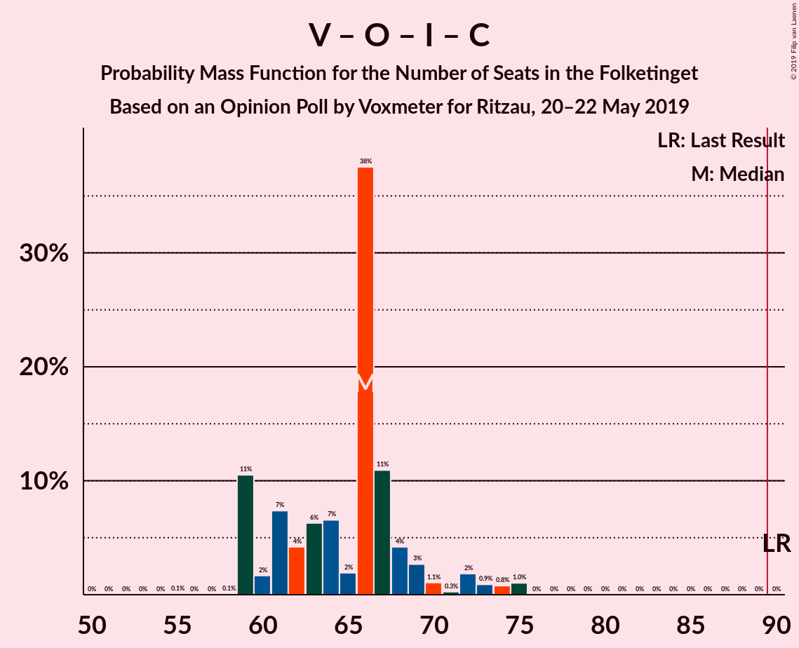

# Opinion Poll by Voxmeter for Ritzau, 20–22 May 2019

<a href="#voting-intentions">Voting Intentions</a> | <a href="#seats">Seats</a> | <a href="#coalitions">Coalitions</a> | <a href="#technical-information">Technical Information</a>

## Voting Intentions

### Confidence Intervals

| Party | Last Result | Poll Result | 80% Confidence Interval | 90% Confidence Interval | 95% Confidence Interval | 99% Confidence Interval |
|:-----:|:-----------:|:-----------:|:-----------------------:|:-----------------------:|:-----------------------:|:-----------------------:|
| Socialdemokraterne | 26.3% | 26.6% | 24.9–28.5% |24.4–29.0% |24.0–29.5% |23.2–30.4% |
| Venstre | 19.5% | 18.4% | 16.9–20.0% |16.5–20.5% |16.1–20.9% |15.4–21.7% |
| Dansk Folkeparti | 21.1% | 10.4% | 9.3–11.8% |9.0–12.1% |8.7–12.5% |8.2–13.2% |
| Enhedslisten–De Rød-Grønne | 7.8% | 9.3% | 8.3–10.6% |8.0–11.0% |7.7–11.3% |7.2–11.9% |
| Radikale Venstre | 4.6% | 7.9% | 6.9–9.1% |6.6–9.4% |6.3–9.7% |5.9–10.3% |
| Socialistisk Folkeparti | 4.2% | 7.4% | 6.4–8.5% |6.1–8.9% |5.9–9.1% |5.5–9.7% |
| Liberal Alliance | 7.5% | 4.6% | 3.8–5.5% |3.6–5.8% |3.4–6.1% |3.1–6.6% |
| Alternativet | 4.8% | 4.2% | 3.5–5.1% |3.3–5.4% |3.1–5.6% |2.8–6.1% |
| Det Konservative Folkeparti | 3.4% | 3.2% | 2.6–4.0% |2.4–4.3% |2.3–4.5% |2.0–4.9% |
| Stram Kurs | 0.0% | 2.8% | 2.2–3.6% |2.1–3.8% |1.9–4.0% |1.7–4.4% |
| Nye Borgerlige | 0.0% | 2.1% | 1.6–2.8% |1.5–3.0% |1.4–3.2% |1.2–3.6% |
| Kristendemokraterne | 0.8% | 1.6% | 1.2–2.2% |1.1–2.4% |1.0–2.6% |0.8–2.9% |
| Klaus Riskær Pedersen | 0.0% | 0.7% | 0.5–1.2% |0.4–1.3% |0.3–1.4% |0.2–1.7% |

*Note:* The poll result column reflects the actual value used in the calculations. Published results may vary slightly, and in addition be rounded to fewer digits.

## Seats

### Confidence Intervals

| Party | Last Result | Median | 80% Confidence Interval | 90% Confidence Interval | 95% Confidence Interval | 99% Confidence Interval |
|:-----:|:-----------:|:------:|:-----------------------:|:-----------------------:|:-----------------------:|:-----------------------:|
| <a href="#socialdemokraterne">Socialdemokraterne</a> | 47 | 51 | 46–52 |44–53 |43–55 |40–55 |
| <a href="#venstre">Venstre</a> | 34 | 34 | 29–35 |29–37 |29–38 |27–40 |
| <a href="#dansk-folkeparti">Dansk Folkeparti</a> | 37 | 17 | 16–21 |16–22 |16–22 |15–24 |
| <a href="#enhedslisten–de-rød-grønne">Enhedslisten–De Rød-Grønne</a> | 14 | 18 | 15–19 |14–22 |14–22 |13–22 |
| <a href="#radikale-venstre">Radikale Venstre</a> | 8 | 13 | 13–16 |12–16 |11–17 |11–18 |
| <a href="#socialistisk-folkeparti">Socialistisk Folkeparti</a> | 7 | 14 | 10–15 |10–16 |10–16 |10–18 |
| <a href="#liberal-alliance">Liberal Alliance</a> | 13 | 8 | 7–9 |7–10 |7–12 |6–13 |
| <a href="#alternativet">Alternativet</a> | 9 | 8 | 6–9 |6–10 |6–10 |5–11 |
| <a href="#det-konservative-folkeparti">Det Konservative Folkeparti</a> | 6 | 6 | 5–7 |5–7 |4–7 |0–8 |
| <a href="#stram-kurs">Stram Kurs</a> | 0 | 4 | 4–7 |0–7 |0–7 |0–8 |
| <a href="#nye-borgerlige">Nye Borgerlige</a> | 0 | 0 | 0–5 |0–5 |0–5 |0–6 |
| <a href="#kristendemokraterne">Kristendemokraterne</a> | 0 | 0 | 0–4 |0–5 |0–5 |0–5 |
| <a href="#klaus-riskær-pedersen">Klaus Riskær Pedersen</a> | 0 | 0 | 0 |0 |0 |0 |

### Socialdemokraterne

*For a full overview of the results for this party, see the [Socialdemokraterne](party-socialdemokraterne.html) page.*

| Number of Seats | Probability | Accumulated | Special Marks |
|:---------------:|:-----------:|:-----------:|:-------------:|
| 40 | 0.6% | 100% |  |
| 41 | 0.3% | 99.4% |  |
| 42 | 0.2% | 99.1% |  |
| 43 | 2% | 98.9% |  |
| 44 | 2% | 96% |  |
| 45 | 5% | 95% |  |
| 46 | 3% | 90% |  |
| 47 | 5% | 87% | Last Result |
| 48 | 2% | 82% |  |
| 49 | 18% | 79% |  |
| 50 | 1.1% | 61% |  |
| 51 | 49% | 60% | Median |
| 52 | 5% | 11% |  |
| 53 | 1.4% | 6% |  |
| 54 | 0.2% | 5% |  |
| 55 | 4% | 4% |  |
| 56 | 0.1% | 0.1% |  |
| 57 | 0% | 0% |  |

### Venstre

*For a full overview of the results for this party, see the [Venstre](party-venstre.html) page.*

| Number of Seats | Probability | Accumulated | Special Marks |
|:---------------:|:-----------:|:-----------:|:-------------:|
| 26 | 0.1% | 100% |  |
| 27 | 0.6% | 99.9% |  |
| 28 | 1.1% | 99.3% |  |
| 29 | 10% | 98% |  |
| 30 | 13% | 89% |  |
| 31 | 17% | 75% |  |
| 32 | 2% | 59% |  |
| 33 | 3% | 56% |  |
| 34 | 7% | 53% | Last Result, Median |
| 35 | 39% | 46% |  |
| 36 | 2% | 7% |  |
| 37 | 3% | 5% |  |
| 38 | 2% | 3% |  |
| 39 | 0.2% | 1.0% |  |
| 40 | 0.6% | 0.8% |  |
| 41 | 0% | 0.2% |  |
| 42 | 0.1% | 0.1% |  |
| 43 | 0% | 0% |  |

### Dansk Folkeparti

*For a full overview of the results for this party, see the [Dansk Folkeparti](party-danskfolkeparti.html) page.*

| Number of Seats | Probability | Accumulated | Special Marks |
|:---------------:|:-----------:|:-----------:|:-------------:|
| 13 | 0.1% | 100% |  |
| 14 | 0.2% | 99.9% |  |
| 15 | 0.3% | 99.7% |  |
| 16 | 49% | 99.3% |  |
| 17 | 13% | 51% | Median |
| 18 | 4% | 38% |  |
| 19 | 9% | 34% |  |
| 20 | 8% | 25% |  |
| 21 | 10% | 17% |  |
| 22 | 5% | 7% |  |
| 23 | 1.3% | 2% |  |
| 24 | 0.5% | 0.5% |  |
| 25 | 0% | 0% |  |
| 26 | 0% | 0% |  |
| 27 | 0% | 0% |  |
| 28 | 0% | 0% |  |
| 29 | 0% | 0% |  |
| 30 | 0% | 0% |  |
| 31 | 0% | 0% |  |
| 32 | 0% | 0% |  |
| 33 | 0% | 0% |  |
| 34 | 0% | 0% |  |
| 35 | 0% | 0% |  |
| 36 | 0% | 0% |  |
| 37 | 0% | 0% | Last Result |

### Enhedslisten–De Rød-Grønne

*For a full overview of the results for this party, see the [Enhedslisten–De Rød-Grønne](party-enhedslisten–derød-grønne.html) page.*

| Number of Seats | Probability | Accumulated | Special Marks |
|:---------------:|:-----------:|:-----------:|:-------------:|
| 12 | 0.1% | 100% |  |
| 13 | 0.6% | 99.9% |  |
| 14 | 5% | 99.3% | Last Result |
| 15 | 16% | 94% |  |
| 16 | 12% | 78% |  |
| 17 | 7% | 67% |  |
| 18 | 49% | 59% | Median |
| 19 | 2% | 10% |  |
| 20 | 2% | 8% |  |
| 21 | 0.8% | 7% |  |
| 22 | 6% | 6% |  |
| 23 | 0.1% | 0.1% |  |
| 24 | 0% | 0% |  |

### Radikale Venstre

*For a full overview of the results for this party, see the [Radikale Venstre](party-radikalevenstre.html) page.*

| Number of Seats | Probability | Accumulated | Special Marks |
|:---------------:|:-----------:|:-----------:|:-------------:|
| 8 | 0% | 100% | Last Result |
| 9 | 0% | 100% |  |
| 10 | 0.4% | 100% |  |
| 11 | 3% | 99.6% |  |
| 12 | 2% | 97% |  |
| 13 | 52% | 95% | Median |
| 14 | 3% | 43% |  |
| 15 | 25% | 40% |  |
| 16 | 11% | 15% |  |
| 17 | 2% | 4% |  |
| 18 | 1.0% | 1.5% |  |
| 19 | 0.4% | 0.5% |  |
| 20 | 0.1% | 0.1% |  |
| 21 | 0% | 0% |  |

### Socialistisk Folkeparti

*For a full overview of the results for this party, see the [Socialistisk Folkeparti](party-socialistiskfolkeparti.html) page.*

| Number of Seats | Probability | Accumulated | Special Marks |
|:---------------:|:-----------:|:-----------:|:-------------:|
| 7 | 0% | 100% | Last Result |
| 8 | 0% | 100% |  |
| 9 | 0.2% | 100% |  |
| 10 | 11% | 99.8% |  |
| 11 | 4% | 89% |  |
| 12 | 11% | 84% |  |
| 13 | 12% | 73% |  |
| 14 | 46% | 61% | Median |
| 15 | 10% | 15% |  |
| 16 | 3% | 5% |  |
| 17 | 2% | 2% |  |
| 18 | 0.6% | 0.7% |  |
| 19 | 0% | 0.1% |  |
| 20 | 0% | 0% |  |

### Liberal Alliance

*For a full overview of the results for this party, see the [Liberal Alliance](party-liberalalliance.html) page.*

| Number of Seats | Probability | Accumulated | Special Marks |
|:---------------:|:-----------:|:-----------:|:-------------:|
| 5 | 0.3% | 100% |  |
| 6 | 1.1% | 99.7% |  |
| 7 | 10% | 98.6% |  |
| 8 | 66% | 89% | Median |
| 9 | 14% | 23% |  |
| 10 | 6% | 10% |  |
| 11 | 1.3% | 4% |  |
| 12 | 2% | 3% |  |
| 13 | 1.2% | 1.2% | Last Result |
| 14 | 0% | 0% |  |

### Alternativet

*For a full overview of the results for this party, see the [Alternativet](party-alternativet.html) page.*

| Number of Seats | Probability | Accumulated | Special Marks |
|:---------------:|:-----------:|:-----------:|:-------------:|
| 5 | 2% | 100% |  |
| 6 | 10% | 98% |  |
| 7 | 6% | 89% |  |
| 8 | 34% | 83% | Median |
| 9 | 43% | 49% | Last Result |
| 10 | 5% | 6% |  |
| 11 | 1.2% | 2% |  |
| 12 | 0.3% | 0.3% |  |
| 13 | 0% | 0% |  |

### Det Konservative Folkeparti

*For a full overview of the results for this party, see the [Det Konservative Folkeparti](party-detkonservativefolkeparti.html) page.*

| Number of Seats | Probability | Accumulated | Special Marks |
|:---------------:|:-----------:|:-----------:|:-------------:|
| 0 | 1.0% | 100% |  |
| 1 | 0% | 99.0% |  |
| 2 | 0% | 99.0% |  |
| 3 | 0% | 99.0% |  |
| 4 | 2% | 99.0% |  |
| 5 | 35% | 97% |  |
| 6 | 19% | 62% | Last Result, Median |
| 7 | 42% | 43% |  |
| 8 | 1.0% | 1.3% |  |
| 9 | 0.2% | 0.3% |  |
| 10 | 0% | 0.1% |  |
| 11 | 0% | 0% |  |

### Stram Kurs

*For a full overview of the results for this party, see the [Stram Kurs](party-stramkurs.html) page.*

| Number of Seats | Probability | Accumulated | Special Marks |
|:---------------:|:-----------:|:-----------:|:-------------:|
| 0 | 6% | 100% | Last Result |
| 1 | 0% | 94% |  |
| 2 | 0% | 94% |  |
| 3 | 0% | 94% |  |
| 4 | 46% | 94% | Median |
| 5 | 16% | 48% |  |
| 6 | 18% | 33% |  |
| 7 | 13% | 15% |  |
| 8 | 2% | 2% |  |
| 9 | 0% | 0.1% |  |
| 10 | 0% | 0% |  |

### Nye Borgerlige

*For a full overview of the results for this party, see the [Nye Borgerlige](party-nyeborgerlige.html) page.*

| Number of Seats | Probability | Accumulated | Special Marks |
|:---------------:|:-----------:|:-----------:|:-------------:|
| 0 | 62% | 100% | Last Result, Median |
| 1 | 0% | 38% |  |
| 2 | 0% | 38% |  |
| 3 | 0% | 38% |  |
| 4 | 21% | 38% |  |
| 5 | 16% | 17% |  |
| 6 | 1.2% | 2% |  |
| 7 | 0.4% | 0.4% |  |
| 8 | 0% | 0% |  |

### Kristendemokraterne

*For a full overview of the results for this party, see the [Kristendemokraterne](party-kristendemokraterne.html) page.*

| Number of Seats | Probability | Accumulated | Special Marks |
|:---------------:|:-----------:|:-----------:|:-------------:|
| 0 | 75% | 100% | Last Result, Median |
| 1 | 0% | 25% |  |
| 2 | 0% | 25% |  |
| 3 | 0% | 25% |  |
| 4 | 19% | 25% |  |
| 5 | 6% | 6% |  |
| 6 | 0.1% | 0.1% |  |
| 7 | 0% | 0% |  |

### Klaus Riskær Pedersen

*For a full overview of the results for this party, see the [Klaus Riskær Pedersen](party-klausriskærpedersen.html) page.*

| Number of Seats | Probability | Accumulated | Special Marks |
|:---------------:|:-----------:|:-----------:|:-------------:|
| 0 | 100% | 100% | Last Result, Median |

## Coalitions

### Confidence Intervals

| Coalition | Last Result | Median | Majority? | 80% Confidence Interval | 90% Confidence Interval | 95% Confidence Interval | 99% Confidence Interval |
|:---------:|:-----------:|:------:|:---------:|:-----------------------:|:-----------------------:|:-----------------------:|:-----------------------:|
| Socialdemokraterne – Enhedslisten–De Rød-Grønne – Radikale Venstre – Socialistisk Folkeparti – Alternativet | 85 | 104 | 99.5% | 97–105 | 95–106 | 95–107 | 89–107 |
| Socialdemokraterne – Enhedslisten–De Rød-Grønne – Radikale Venstre – Socialistisk Folkeparti | 76 | 96 | 88% | 88–97 | 87–98 | 86–101 | 83–101 |
| Socialdemokraterne – Enhedslisten–De Rød-Grønne – Socialistisk Folkeparti – Alternativet | 77 | 89 | 49% | 83–92 | 81–93 | 81–93 | 75–93 |
| Socialdemokraterne – Enhedslisten–De Rød-Grønne – Socialistisk Folkeparti | 68 | 81 | 0% | 75–83 | 74–85 | 72–85 | 70–85 |
| Socialdemokraterne – Radikale Venstre – Socialistisk Folkeparti | 62 | 78 | 0% | 73–79 | 71–82 | 70–84 | 66–84 |
| Venstre – Dansk Folkeparti – Liberal Alliance – Det Konservative Folkeparti – Stram Kurs – Nye Borgerlige – Kristendemokraterne – Klaus Riskær Pedersen | 90 | 71 | 0% | 70–78 | 69–80 | 68–80 | 68–86 |
| Venstre – Dansk Folkeparti – Liberal Alliance – Det Konservative Folkeparti – Nye Borgerlige – Kristendemokraterne – Klaus Riskær Pedersen | 90 | 66 | 0% | 66–73 | 64–75 | 64–76 | 63–80 |
| Venstre – Dansk Folkeparti – Liberal Alliance – Det Konservative Folkeparti – Nye Borgerlige – Kristendemokraterne | 90 | 66 | 0% | 66–73 | 64–75 | 64–76 | 63–80 |
| Venstre – Dansk Folkeparti – Liberal Alliance – Det Konservative Folkeparti – Nye Borgerlige – Klaus Riskær Pedersen | 90 | 66 | 0% | 63–71 | 62–73 | 62–75 | 60–78 |
| Venstre – Dansk Folkeparti – Liberal Alliance – Det Konservative Folkeparti – Nye Borgerlige | 90 | 66 | 0% | 63–71 | 62–73 | 62–75 | 60–78 |
| Venstre – Dansk Folkeparti – Liberal Alliance – Det Konservative Folkeparti – Kristendemokraterne | 90 | 66 | 0% | 63–70 | 61–72 | 61–75 | 60–77 |
| Venstre – Dansk Folkeparti – Liberal Alliance – Det Konservative Folkeparti | 90 | 66 | 0% | 59–68 | 59–70 | 59–73 | 59–75 |
| Socialdemokraterne – Radikale Venstre | 55 | 64 | 0% | 60–66 | 59–68 | 57–71 | 53–71 |
| Venstre – Liberal Alliance – Det Konservative Folkeparti | 53 | 48 | 0% | 43–50 | 43–52 | 43–52 | 40–54 |
| Venstre – Det Konservative Folkeparti | 40 | 39 | 0% | 35–42 | 34–42 | 34–44 | 33–44 |
| Venstre | 34 | 34 | 0% | 29–35 | 29–37 | 29–38 | 27–40 |

### Socialdemokraterne – Enhedslisten–De Rød-Grønne – Radikale Venstre – Socialistisk Folkeparti – Alternativet

| Number of Seats | Probability | Accumulated | Special Marks |
|:---------------:|:-----------:|:-----------:|:-------------:|
| 85 | 0% | 100% | Last Result |
| 86 | 0% | 100% |  |
| 87 | 0% | 100% |  |
| 88 | 0.5% | 100% |  |
| 89 | 0% | 99.5% |  |
| 90 | 0% | 99.5% | Majority |
| 91 | 0.2% | 99.5% |  |
| 92 | 0.1% | 99.3% |  |
| 93 | 0.3% | 99.2% |  |
| 94 | 0.5% | 98.9% |  |
| 95 | 5% | 98% |  |
| 96 | 2% | 94% |  |
| 97 | 4% | 91% |  |
| 98 | 3% | 88% |  |
| 99 | 3% | 85% |  |
| 100 | 0.7% | 82% |  |
| 101 | 6% | 81% |  |
| 102 | 23% | 75% |  |
| 103 | 2% | 52% |  |
| 104 | 3% | 51% | Median |
| 105 | 38% | 48% |  |
| 106 | 5% | 9% |  |
| 107 | 4% | 4% |  |
| 108 | 0% | 0.2% |  |
| 109 | 0% | 0.1% |  |
| 110 | 0.1% | 0.1% |  |
| 111 | 0% | 0% |  |

### Socialdemokraterne – Enhedslisten–De Rød-Grønne – Radikale Venstre – Socialistisk Folkeparti

| Number of Seats | Probability | Accumulated | Special Marks |
|:---------------:|:-----------:|:-----------:|:-------------:|
| 76 | 0% | 100% | Last Result |
| 77 | 0% | 100% |  |
| 78 | 0% | 100% |  |
| 79 | 0% | 100% |  |
| 80 | 0% | 100% |  |
| 81 | 0% | 100% |  |
| 82 | 0% | 100% |  |
| 83 | 0.5% | 100% |  |
| 84 | 0.3% | 99.5% |  |
| 85 | 0.3% | 99.2% |  |
| 86 | 2% | 98.9% |  |
| 87 | 4% | 96% |  |
| 88 | 2% | 92% |  |
| 89 | 1.3% | 90% |  |
| 90 | 2% | 88% | Majority |
| 91 | 3% | 86% |  |
| 92 | 4% | 83% |  |
| 93 | 4% | 80% |  |
| 94 | 23% | 76% |  |
| 95 | 1.3% | 52% |  |
| 96 | 37% | 51% | Median |
| 97 | 4% | 14% |  |
| 98 | 6% | 10% |  |
| 99 | 0% | 4% |  |
| 100 | 0.2% | 4% |  |
| 101 | 3% | 4% |  |
| 102 | 0.4% | 0.4% |  |
| 103 | 0% | 0% |  |

### Socialdemokraterne – Enhedslisten–De Rød-Grønne – Socialistisk Folkeparti – Alternativet

| Number of Seats | Probability | Accumulated | Special Marks |
|:---------------:|:-----------:|:-----------:|:-------------:|
| 75 | 0.6% | 100% |  |
| 76 | 0% | 99.4% |  |
| 77 | 0% | 99.4% | Last Result |
| 78 | 1.1% | 99.4% |  |
| 79 | 0.2% | 98% |  |
| 80 | 0.5% | 98% |  |
| 81 | 3% | 98% |  |
| 82 | 3% | 95% |  |
| 83 | 3% | 92% |  |
| 84 | 6% | 89% |  |
| 85 | 5% | 83% |  |
| 86 | 4% | 78% |  |
| 87 | 19% | 75% |  |
| 88 | 3% | 56% |  |
| 89 | 4% | 53% |  |
| 90 | 1.3% | 49% | Majority |
| 91 | 5% | 48% | Median |
| 92 | 38% | 43% |  |
| 93 | 5% | 5% |  |
| 94 | 0.1% | 0.2% |  |
| 95 | 0% | 0% |  |

### Socialdemokraterne – Enhedslisten–De Rød-Grønne – Socialistisk Folkeparti

| Number of Seats | Probability | Accumulated | Special Marks |
|:---------------:|:-----------:|:-----------:|:-------------:|
| 68 | 0.1% | 100% | Last Result |
| 69 | 0.1% | 99.9% |  |
| 70 | 0.5% | 99.7% |  |
| 71 | 1.2% | 99.2% |  |
| 72 | 2% | 98% |  |
| 73 | 0.8% | 96% |  |
| 74 | 4% | 95% |  |
| 75 | 5% | 91% |  |
| 76 | 2% | 86% |  |
| 77 | 6% | 84% |  |
| 78 | 2% | 78% |  |
| 79 | 20% | 76% |  |
| 80 | 0.7% | 56% |  |
| 81 | 6% | 56% |  |
| 82 | 2% | 49% |  |
| 83 | 37% | 47% | Median |
| 84 | 0.2% | 10% |  |
| 85 | 9% | 10% |  |
| 86 | 0.4% | 0.5% |  |
| 87 | 0% | 0.1% |  |
| 88 | 0% | 0% |  |

### Socialdemokraterne – Radikale Venstre – Socialistisk Folkeparti

| Number of Seats | Probability | Accumulated | Special Marks |
|:---------------:|:-----------:|:-----------:|:-------------:|
| 62 | 0% | 100% | Last Result |
| 63 | 0% | 100% |  |
| 64 | 0% | 100% |  |
| 65 | 0% | 100% |  |
| 66 | 0.5% | 100% |  |
| 67 | 0.1% | 99.5% |  |
| 68 | 1.2% | 99.4% |  |
| 69 | 0.5% | 98% |  |
| 70 | 0.3% | 98% |  |
| 71 | 4% | 97% |  |
| 72 | 1.3% | 94% |  |
| 73 | 5% | 92% |  |
| 74 | 4% | 88% |  |
| 75 | 2% | 84% |  |
| 76 | 16% | 82% |  |
| 77 | 7% | 66% |  |
| 78 | 42% | 59% | Median |
| 79 | 9% | 16% |  |
| 80 | 2% | 8% |  |
| 81 | 0.5% | 6% |  |
| 82 | 1.1% | 5% |  |
| 83 | 0.2% | 4% |  |
| 84 | 4% | 4% |  |
| 85 | 0% | 0% |  |

### Venstre – Dansk Folkeparti – Liberal Alliance – Det Konservative Folkeparti – Stram Kurs – Nye Borgerlige – Kristendemokraterne – Klaus Riskær Pedersen

| Number of Seats | Probability | Accumulated | Special Marks |
|:---------------:|:-----------:|:-----------:|:-------------:|
| 65 | 0.1% | 100% |  |
| 66 | 0% | 99.9% |  |
| 67 | 0% | 99.9% |  |
| 68 | 4% | 99.8% |  |
| 69 | 5% | 96% | Median |
| 70 | 38% | 91% |  |
| 71 | 3% | 52% |  |
| 72 | 2% | 49% |  |
| 73 | 23% | 48% |  |
| 74 | 6% | 25% |  |
| 75 | 0.8% | 19% |  |
| 76 | 3% | 18% |  |
| 77 | 3% | 15% |  |
| 78 | 4% | 12% |  |
| 79 | 2% | 9% |  |
| 80 | 5% | 6% |  |
| 81 | 0.5% | 1.5% |  |
| 82 | 0.3% | 1.0% |  |
| 83 | 0.1% | 0.7% |  |
| 84 | 0.1% | 0.7% |  |
| 85 | 0% | 0.5% |  |
| 86 | 0% | 0.5% |  |
| 87 | 0.5% | 0.5% |  |
| 88 | 0% | 0% |  |
| 89 | 0% | 0% |  |
| 90 | 0% | 0% | Last Result, Majority |

### Venstre – Dansk Folkeparti – Liberal Alliance – Det Konservative Folkeparti – Nye Borgerlige – Kristendemokraterne – Klaus Riskær Pedersen

| Number of Seats | Probability | Accumulated | Special Marks |
|:---------------:|:-----------:|:-----------:|:-------------:|
| 62 | 0.4% | 100% |  |
| 63 | 0.1% | 99.5% |  |
| 64 | 6% | 99.4% |  |
| 65 | 1.2% | 93% | Median |
| 66 | 44% | 92% |  |
| 67 | 21% | 48% |  |
| 68 | 6% | 27% |  |
| 69 | 1.2% | 21% |  |
| 70 | 1.3% | 20% |  |
| 71 | 3% | 19% |  |
| 72 | 2% | 15% |  |
| 73 | 5% | 13% |  |
| 74 | 1.3% | 8% |  |
| 75 | 4% | 7% |  |
| 76 | 2% | 3% |  |
| 77 | 0.9% | 2% |  |
| 78 | 0.1% | 0.6% |  |
| 79 | 0.1% | 0.6% |  |
| 80 | 0% | 0.5% |  |
| 81 | 0% | 0.5% |  |
| 82 | 0.5% | 0.5% |  |
| 83 | 0% | 0% |  |
| 84 | 0% | 0% |  |
| 85 | 0% | 0% |  |
| 86 | 0% | 0% |  |
| 87 | 0% | 0% |  |
| 88 | 0% | 0% |  |
| 89 | 0% | 0% |  |
| 90 | 0% | 0% | Last Result, Majority |

### Venstre – Dansk Folkeparti – Liberal Alliance – Det Konservative Folkeparti – Nye Borgerlige – Kristendemokraterne

| Number of Seats | Probability | Accumulated | Special Marks |
|:---------------:|:-----------:|:-----------:|:-------------:|
| 62 | 0.4% | 100% |  |
| 63 | 0.1% | 99.5% |  |
| 64 | 6% | 99.4% |  |
| 65 | 1.3% | 93% | Median |
| 66 | 44% | 92% |  |
| 67 | 21% | 48% |  |
| 68 | 6% | 27% |  |
| 69 | 1.2% | 21% |  |
| 70 | 1.3% | 20% |  |
| 71 | 3% | 19% |  |
| 72 | 2% | 15% |  |
| 73 | 5% | 13% |  |
| 74 | 1.3% | 8% |  |
| 75 | 4% | 7% |  |
| 76 | 2% | 3% |  |
| 77 | 0.9% | 2% |  |
| 78 | 0.1% | 0.6% |  |
| 79 | 0.1% | 0.6% |  |
| 80 | 0% | 0.5% |  |
| 81 | 0% | 0.5% |  |
| 82 | 0.5% | 0.5% |  |
| 83 | 0% | 0% |  |
| 84 | 0% | 0% |  |
| 85 | 0% | 0% |  |
| 86 | 0% | 0% |  |
| 87 | 0% | 0% |  |
| 88 | 0% | 0% |  |
| 89 | 0% | 0% |  |
| 90 | 0% | 0% | Last Result, Majority |

### Venstre – Dansk Folkeparti – Liberal Alliance – Det Konservative Folkeparti – Nye Borgerlige – Klaus Riskær Pedersen

| Number of Seats | Probability | Accumulated | Special Marks |
|:---------------:|:-----------:|:-----------:|:-------------:|
| 59 | 0.1% | 100% |  |
| 60 | 1.2% | 99.9% |  |
| 61 | 0.1% | 98.7% |  |
| 62 | 4% | 98.6% |  |
| 63 | 11% | 95% |  |
| 64 | 6% | 83% |  |
| 65 | 0.7% | 78% | Median |
| 66 | 45% | 77% |  |
| 67 | 8% | 33% |  |
| 68 | 6% | 25% |  |
| 69 | 2% | 18% |  |
| 70 | 1.1% | 16% |  |
| 71 | 5% | 15% |  |
| 72 | 2% | 10% |  |
| 73 | 4% | 8% |  |
| 74 | 1.3% | 4% |  |
| 75 | 1.2% | 3% |  |
| 76 | 0.3% | 2% |  |
| 77 | 0.8% | 1.3% |  |
| 78 | 0.5% | 0.5% |  |
| 79 | 0% | 0% |  |
| 80 | 0% | 0% |  |
| 81 | 0% | 0% |  |
| 82 | 0% | 0% |  |
| 83 | 0% | 0% |  |
| 84 | 0% | 0% |  |
| 85 | 0% | 0% |  |
| 86 | 0% | 0% |  |
| 87 | 0% | 0% |  |
| 88 | 0% | 0% |  |
| 89 | 0% | 0% |  |
| 90 | 0% | 0% | Last Result, Majority |

### Venstre – Dansk Folkeparti – Liberal Alliance – Det Konservative Folkeparti – Nye Borgerlige

| Number of Seats | Probability | Accumulated | Special Marks |
|:---------------:|:-----------:|:-----------:|:-------------:|
| 59 | 0.1% | 100% |  |
| 60 | 1.2% | 99.9% |  |
| 61 | 0.1% | 98.7% |  |
| 62 | 4% | 98.6% |  |
| 63 | 11% | 95% |  |
| 64 | 6% | 83% |  |
| 65 | 0.7% | 78% | Median |
| 66 | 45% | 77% |  |
| 67 | 8% | 33% |  |
| 68 | 6% | 25% |  |
| 69 | 2% | 18% |  |
| 70 | 1.1% | 16% |  |
| 71 | 5% | 15% |  |
| 72 | 2% | 10% |  |
| 73 | 4% | 8% |  |
| 74 | 1.3% | 4% |  |
| 75 | 1.2% | 3% |  |
| 76 | 0.3% | 2% |  |
| 77 | 0.8% | 1.3% |  |
| 78 | 0.5% | 0.5% |  |
| 79 | 0% | 0% |  |
| 80 | 0% | 0% |  |
| 81 | 0% | 0% |  |
| 82 | 0% | 0% |  |
| 83 | 0% | 0% |  |
| 84 | 0% | 0% |  |
| 85 | 0% | 0% |  |
| 86 | 0% | 0% |  |
| 87 | 0% | 0% |  |
| 88 | 0% | 0% |  |
| 89 | 0% | 0% |  |
| 90 | 0% | 0% | Last Result, Majority |

### Venstre – Dansk Folkeparti – Liberal Alliance – Det Konservative Folkeparti – Kristendemokraterne

| Number of Seats | Probability | Accumulated | Special Marks |
|:---------------:|:-----------:|:-----------:|:-------------:|
| 59 | 0% | 100% |  |
| 60 | 0.5% | 99.9% |  |
| 61 | 7% | 99.5% |  |
| 62 | 0.7% | 92% |  |
| 63 | 16% | 92% |  |
| 64 | 7% | 76% |  |
| 65 | 2% | 69% | Median |
| 66 | 37% | 67% |  |
| 67 | 12% | 30% |  |
| 68 | 4% | 18% |  |
| 69 | 3% | 14% |  |
| 70 | 1.1% | 11% |  |
| 71 | 3% | 10% |  |
| 72 | 2% | 7% |  |
| 73 | 2% | 5% |  |
| 74 | 0.3% | 3% |  |
| 75 | 1.1% | 3% |  |
| 76 | 1.2% | 2% |  |
| 77 | 0.1% | 0.6% |  |
| 78 | 0.5% | 0.5% |  |
| 79 | 0% | 0% |  |
| 80 | 0% | 0% |  |
| 81 | 0% | 0% |  |
| 82 | 0% | 0% |  |
| 83 | 0% | 0% |  |
| 84 | 0% | 0% |  |
| 85 | 0% | 0% |  |
| 86 | 0% | 0% |  |
| 87 | 0% | 0% |  |
| 88 | 0% | 0% |  |
| 89 | 0% | 0% |  |
| 90 | 0% | 0% | Last Result, Majority |

### Venstre – Dansk Folkeparti – Liberal Alliance – Det Konservative Folkeparti

| Number of Seats | Probability | Accumulated | Special Marks |
|:---------------:|:-----------:|:-----------:|:-------------:|
| 55 | 0.1% | 100% |  |
| 56 | 0% | 99.9% |  |
| 57 | 0% | 99.9% |  |
| 58 | 0.1% | 99.9% |  |
| 59 | 11% | 99.8% |  |
| 60 | 2% | 89% |  |
| 61 | 7% | 88% |  |
| 62 | 4% | 80% |  |
| 63 | 6% | 76% |  |
| 64 | 7% | 70% |  |
| 65 | 2% | 63% | Median |
| 66 | 38% | 61% |  |
| 67 | 11% | 24% |  |
| 68 | 4% | 13% |  |
| 69 | 3% | 9% |  |
| 70 | 1.1% | 6% |  |
| 71 | 0.3% | 5% |  |
| 72 | 2% | 5% |  |
| 73 | 0.9% | 3% |  |
| 74 | 0.8% | 2% |  |
| 75 | 1.0% | 1.1% |  |
| 76 | 0% | 0% |  |
| 77 | 0% | 0% |  |
| 78 | 0% | 0% |  |
| 79 | 0% | 0% |  |
| 80 | 0% | 0% |  |
| 81 | 0% | 0% |  |
| 82 | 0% | 0% |  |
| 83 | 0% | 0% |  |
| 84 | 0% | 0% |  |
| 85 | 0% | 0% |  |
| 86 | 0% | 0% |  |
| 87 | 0% | 0% |  |
| 88 | 0% | 0% |  |
| 89 | 0% | 0% |  |
| 90 | 0% | 0% | Last Result, Majority |

### Socialdemokraterne – Radikale Venstre

| Number of Seats | Probability | Accumulated | Special Marks |
|:---------------:|:-----------:|:-----------:|:-------------:|
| 53 | 0.5% | 100% |  |
| 54 | 0% | 99.5% |  |
| 55 | 0.2% | 99.4% | Last Result |
| 56 | 1.4% | 99.2% |  |
| 57 | 0.6% | 98% |  |
| 58 | 2% | 97% |  |
| 59 | 2% | 95% |  |
| 60 | 7% | 93% |  |
| 61 | 4% | 87% |  |
| 62 | 8% | 83% |  |
| 63 | 2% | 75% |  |
| 64 | 45% | 72% | Median |
| 65 | 7% | 27% |  |
| 66 | 12% | 19% |  |
| 67 | 2% | 7% |  |
| 68 | 1.0% | 5% |  |
| 69 | 0.5% | 4% |  |
| 70 | 0.1% | 4% |  |
| 71 | 3% | 3% |  |
| 72 | 0% | 0% |  |

### Venstre – Liberal Alliance – Det Konservative Folkeparti

| Number of Seats | Probability | Accumulated | Special Marks |
|:---------------:|:-----------:|:-----------:|:-------------:|
| 39 | 0.1% | 100% |  |
| 40 | 0.8% | 99.9% |  |
| 41 | 0.7% | 99.1% |  |
| 42 | 0.3% | 98% |  |
| 43 | 17% | 98% |  |
| 44 | 13% | 81% |  |
| 45 | 10% | 69% |  |
| 46 | 1.1% | 59% |  |
| 47 | 7% | 58% |  |
| 48 | 3% | 51% | Median |
| 49 | 3% | 47% |  |
| 50 | 38% | 45% |  |
| 51 | 0.4% | 6% |  |
| 52 | 4% | 6% |  |
| 53 | 1.3% | 2% | Last Result |
| 54 | 0.8% | 1.0% |  |
| 55 | 0% | 0.2% |  |
| 56 | 0.2% | 0.2% |  |
| 57 | 0% | 0% |  |

### Venstre – Det Konservative Folkeparti

| Number of Seats | Probability | Accumulated | Special Marks |
|:---------------:|:-----------:|:-----------:|:-------------:|
| 32 | 0.1% | 100% |  |
| 33 | 1.4% | 99.9% |  |
| 34 | 5% | 98% |  |
| 35 | 15% | 93% |  |
| 36 | 12% | 78% |  |
| 37 | 8% | 67% |  |
| 38 | 5% | 58% |  |
| 39 | 5% | 53% |  |
| 40 | 3% | 48% | Last Result, Median |
| 41 | 2% | 45% |  |
| 42 | 38% | 43% |  |
| 43 | 2% | 5% |  |
| 44 | 2% | 3% |  |
| 45 | 0.1% | 0.4% |  |
| 46 | 0.1% | 0.3% |  |
| 47 | 0.2% | 0.2% |  |
| 48 | 0% | 0% |  |

### Venstre

| Number of Seats | Probability | Accumulated | Special Marks |
|:---------------:|:-----------:|:-----------:|:-------------:|
| 26 | 0.1% | 100% |  |
| 27 | 0.6% | 99.9% |  |
| 28 | 1.1% | 99.3% |  |
| 29 | 10% | 98% |  |
| 30 | 13% | 89% |  |
| 31 | 17% | 75% |  |
| 32 | 2% | 59% |  |
| 33 | 3% | 56% |  |
| 34 | 7% | 53% | Last Result, Median |
| 35 | 39% | 46% |  |
| 36 | 2% | 7% |  |
| 37 | 3% | 5% |  |
| 38 | 2% | 3% |  |
| 39 | 0.2% | 1.0% |  |
| 40 | 0.6% | 0.8% |  |
| 41 | 0% | 0.2% |  |
| 42 | 0.1% | 0.1% |  |
| 43 | 0% | 0% |  |

## Technical Information

### Opinion Poll

+ **Polling firm:** Voxmeter
+ **Commissioner(s):** Ritzau
+ **Fieldwork period:** 20–22 May 2019

### Calculations

+ **Sample size:** 1006
+ **Simulations done:** 1,048,576
+ **Error estimate:** 2.13%

