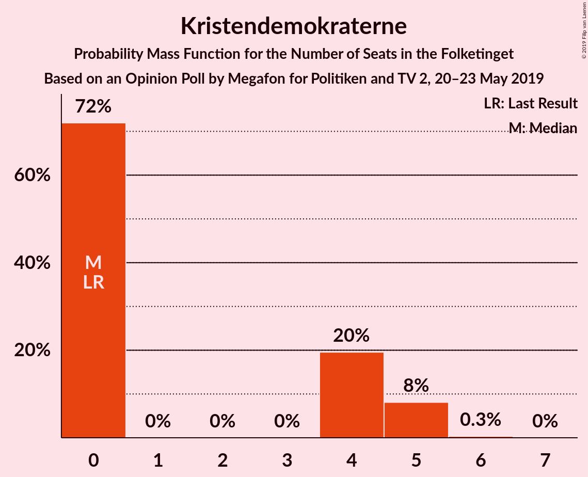
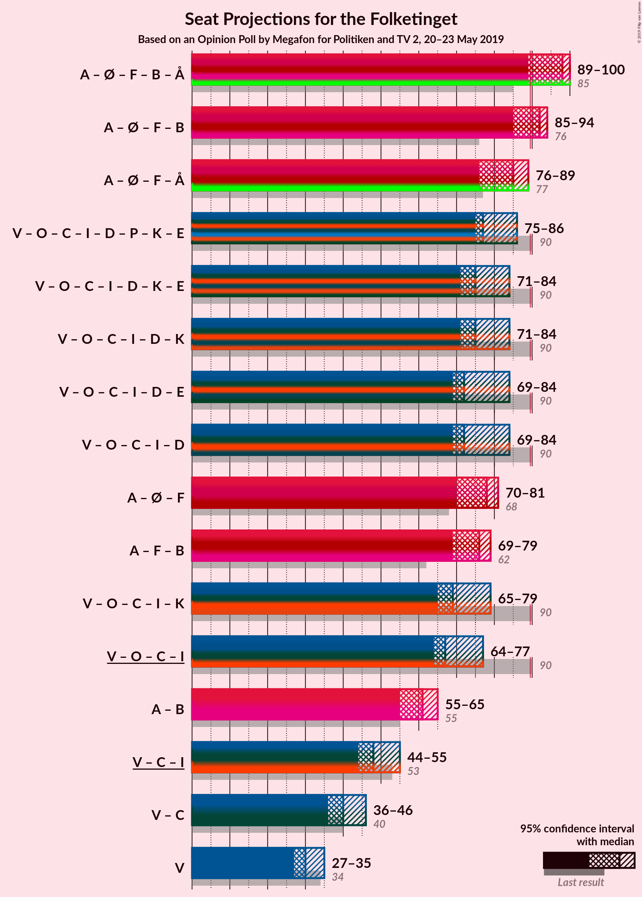
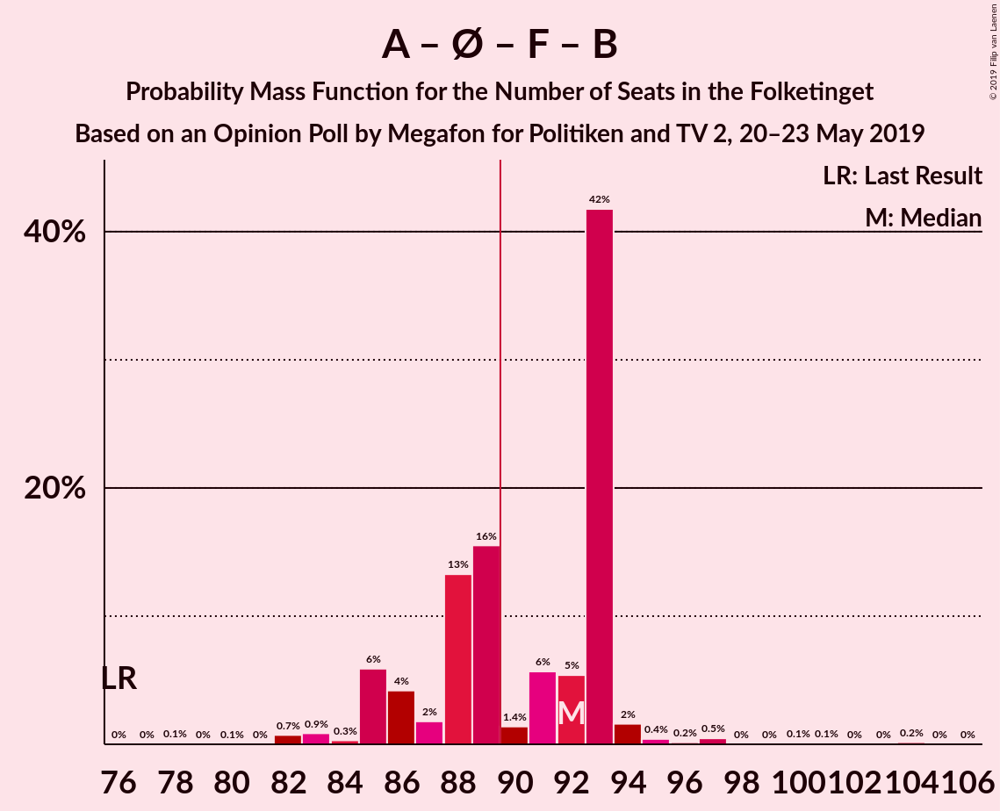
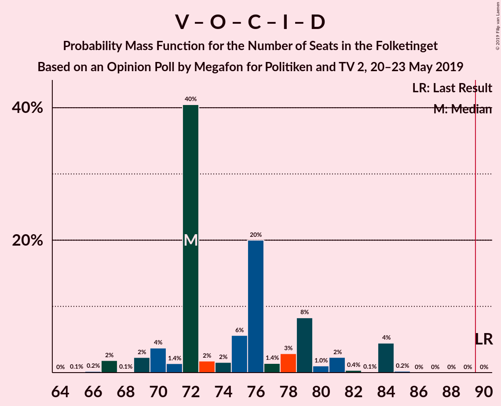
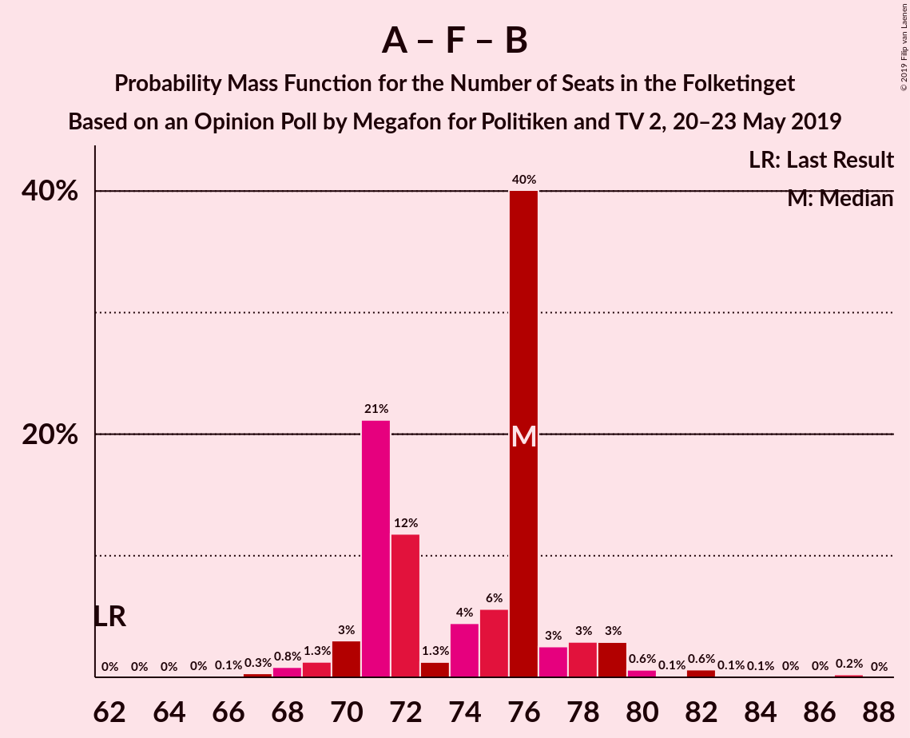
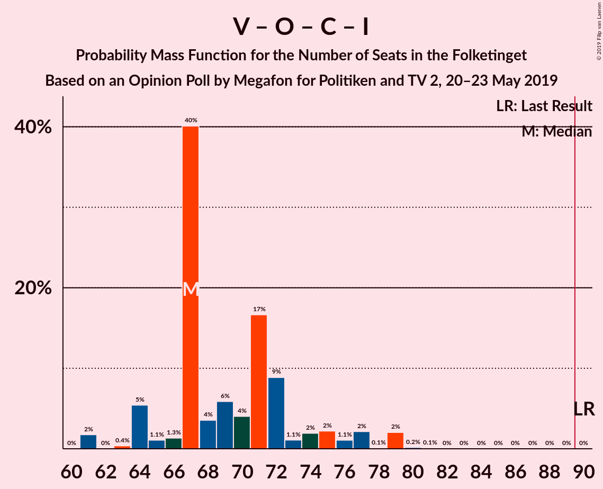

# Opinion Poll by Megafon for Politiken and TV 2, 20–23 May 2019

<a href="#voting-intentions">Voting Intentions</a> | <a href="#seats">Seats</a> | <a href="#coalitions">Coalitions</a> | <a href="#technical-information">Technical Information</a>

## Voting Intentions

### Confidence Intervals

| Party | Last Result | Poll Result | 80% Confidence Interval | 90% Confidence Interval | 95% Confidence Interval | 99% Confidence Interval |
|:-----:|:-----------:|:-----------:|:-----------------------:|:-----------------------:|:-----------------------:|:-----------------------:|
| Socialdemokraterne | 26.3% | 26.7% | 24.9–28.5% |24.4–29.1% |24.0–29.5% |23.2–30.4% |
| Venstre | 19.5% | 17.5% | 16.0–19.1% |15.6–19.6% |15.3–20.0% |14.6–20.8% |
| Dansk Folkeparti | 21.1% | 11.6% | 10.4–13.0% |10.0–13.4% |9.7–13.7% |9.2–14.4% |
| Enhedslisten–De Rød-Grønne | 7.8% | 8.1% | 7.1–9.3% |6.8–9.6% |6.6–10.0% |6.1–10.6% |
| Socialistisk Folkeparti | 4.2% | 7.8% | 6.8–9.0% |6.5–9.3% |6.3–9.6% |5.8–10.2% |
| Radikale Venstre | 4.6% | 7.7% | 6.7–8.9% |6.4–9.2% |6.2–9.5% |5.7–10.1% |
| Det Konservative Folkeparti | 3.4% | 5.4% | 4.6–6.4% |4.3–6.7% |4.2–7.0% |3.8–7.5% |
| Liberal Alliance | 7.5% | 4.3% | 3.6–5.2% |3.4–5.5% |3.2–5.7% |2.9–6.2% |
| Alternativet | 4.8% | 3.4% | 2.8–4.3% |2.6–4.5% |2.4–4.7% |2.2–5.2% |
| Nye Borgerlige | 0.0% | 3.2% | 2.6–4.0% |2.4–4.3% |2.3–4.5% |2.0–4.9% |
| Stram Kurs | 0.0% | 1.9% | 1.4–2.6% |1.3–2.8% |1.2–3.0% |1.0–3.3% |
| Kristendemokraterne | 0.8% | 1.7% | 1.3–2.4% |1.2–2.5% |1.1–2.7% |0.9–3.1% |
| Klaus Riskær Pedersen | 0.0% | 0.6% | 0.4–1.1% |0.3–1.2% |0.3–1.3% |0.2–1.6% |

*Note:* The poll result column reflects the actual value used in the calculations. Published results may vary slightly, and in addition be rounded to fewer digits.

## Seats

### Confidence Intervals

| Party | Last Result | Median | 80% Confidence Interval | 90% Confidence Interval | 95% Confidence Interval | 99% Confidence Interval |
|:-----:|:-----------:|:------:|:-----------------------:|:-----------------------:|:-----------------------:|:-----------------------:|
| <a href="#socialdemokraterne">Socialdemokraterne</a> | 47 | 49 | 44–50 |44–51 |42–51 |41–55 |
| <a href="#venstre">Venstre</a> | 34 | 30 | 28–33 |27–35 |27–35 |27–37 |
| <a href="#dansk-folkeparti">Dansk Folkeparti</a> | 37 | 21 | 19–24 |18–24 |18–24 |17–25 |
| <a href="#enhedslisten–de-rød-grønne">Enhedslisten–De Rød-Grønne</a> | 14 | 17 | 13–18 |12–18 |12–18 |11–19 |
| <a href="#socialistisk-folkeparti">Socialistisk Folkeparti</a> | 7 | 15 | 13–15 |12–16 |11–16 |10–18 |
| <a href="#radikale-venstre">Radikale Venstre</a> | 8 | 12 | 12–14 |11–15 |11–17 |10–19 |
| <a href="#det-konservative-folkeparti">Det Konservative Folkeparti</a> | 6 | 11 | 9–12 |9–12 |8–12 |6–13 |
| <a href="#liberal-alliance">Liberal Alliance</a> | 13 | 7 | 7–9 |7–10 |6–11 |6–11 |
| <a href="#alternativet">Alternativet</a> | 9 | 6 | 6–8 |5–8 |4–8 |4–9 |
| <a href="#nye-borgerlige">Nye Borgerlige</a> | 0 | 5 | 5–7 |5–7 |4–7 |0–8 |
| <a href="#stram-kurs">Stram Kurs</a> | 0 | 4 | 0–5 |0–5 |0–5 |0–6 |
| <a href="#kristendemokraterne">Kristendemokraterne</a> | 0 | 0 | 0–4 |0–5 |0–5 |0–5 |
| <a href="#klaus-riskær-pedersen">Klaus Riskær Pedersen</a> | 0 | 0 | 0 |0 |0 |0 |

### Socialdemokraterne

*For a full overview of the results for this party, see the [Socialdemokraterne](party-socialdemokraterne.html) page.*

| Number of Seats | Probability | Accumulated | Special Marks |
|:---------------:|:-----------:|:-----------:|:-------------:|
| 39 | 0.1% | 100% |  |
| 40 | 0.1% | 99.9% |  |
| 41 | 1.1% | 99.8% |  |
| 42 | 1.3% | 98.8% |  |
| 43 | 1.4% | 97% |  |
| 44 | 7% | 96% |  |
| 45 | 10% | 89% |  |
| 46 | 20% | 79% |  |
| 47 | 6% | 60% | Last Result |
| 48 | 2% | 54% |  |
| 49 | 42% | 52% | Median |
| 50 | 5% | 11% |  |
| 51 | 4% | 6% |  |
| 52 | 0.5% | 2% |  |
| 53 | 0.4% | 1.1% |  |
| 54 | 0.2% | 0.7% |  |
| 55 | 0.3% | 0.5% |  |
| 56 | 0.2% | 0.2% |  |
| 57 | 0% | 0% |  |

### Venstre

*For a full overview of the results for this party, see the [Venstre](party-venstre.html) page.*

| Number of Seats | Probability | Accumulated | Special Marks |
|:---------------:|:-----------:|:-----------:|:-------------:|
| 26 | 0.2% | 100% |  |
| 27 | 5% | 99.8% |  |
| 28 | 40% | 95% |  |
| 29 | 4% | 55% |  |
| 30 | 13% | 51% | Median |
| 31 | 3% | 39% |  |
| 32 | 6% | 36% |  |
| 33 | 22% | 29% |  |
| 34 | 2% | 7% | Last Result |
| 35 | 4% | 5% |  |
| 36 | 0.5% | 1.0% |  |
| 37 | 0.2% | 0.5% |  |
| 38 | 0.1% | 0.3% |  |
| 39 | 0.2% | 0.2% |  |
| 40 | 0% | 0% |  |

### Dansk Folkeparti

*For a full overview of the results for this party, see the [Dansk Folkeparti](party-danskfolkeparti.html) page.*

| Number of Seats | Probability | Accumulated | Special Marks |
|:---------------:|:-----------:|:-----------:|:-------------:|
| 16 | 0.2% | 100% |  |
| 17 | 2% | 99.8% |  |
| 18 | 6% | 98% |  |
| 19 | 28% | 92% |  |
| 20 | 8% | 64% |  |
| 21 | 39% | 57% | Median |
| 22 | 4% | 18% |  |
| 23 | 2% | 14% |  |
| 24 | 10% | 12% |  |
| 25 | 1.3% | 2% |  |
| 26 | 0.3% | 0.3% |  |
| 27 | 0% | 0.1% |  |
| 28 | 0% | 0% |  |
| 29 | 0% | 0% |  |
| 30 | 0% | 0% |  |
| 31 | 0% | 0% |  |
| 32 | 0% | 0% |  |
| 33 | 0% | 0% |  |
| 34 | 0% | 0% |  |
| 35 | 0% | 0% |  |
| 36 | 0% | 0% |  |
| 37 | 0% | 0% | Last Result |

### Enhedslisten–De Rød-Grønne

*For a full overview of the results for this party, see the [Enhedslisten–De Rød-Grønne](party-enhedslisten–derød-grønne.html) page.*

| Number of Seats | Probability | Accumulated | Special Marks |
|:---------------:|:-----------:|:-----------:|:-------------:|
| 9 | 0% | 100% |  |
| 10 | 0.1% | 99.9% |  |
| 11 | 1.0% | 99.8% |  |
| 12 | 5% | 98.8% |  |
| 13 | 6% | 94% |  |
| 14 | 2% | 88% | Last Result |
| 15 | 11% | 86% |  |
| 16 | 9% | 75% |  |
| 17 | 43% | 66% | Median |
| 18 | 22% | 23% |  |
| 19 | 0.7% | 1.0% |  |
| 20 | 0.2% | 0.3% |  |
| 21 | 0% | 0% |  |

### Socialistisk Folkeparti

*For a full overview of the results for this party, see the [Socialistisk Folkeparti](party-socialistiskfolkeparti.html) page.*

| Number of Seats | Probability | Accumulated | Special Marks |
|:---------------:|:-----------:|:-----------:|:-------------:|
| 7 | 0% | 100% | Last Result |
| 8 | 0% | 100% |  |
| 9 | 0% | 100% |  |
| 10 | 1.0% | 100% |  |
| 11 | 2% | 99.0% |  |
| 12 | 3% | 97% |  |
| 13 | 29% | 94% |  |
| 14 | 4% | 65% |  |
| 15 | 54% | 61% | Median |
| 16 | 5% | 7% |  |
| 17 | 0.6% | 1.3% |  |
| 18 | 0.4% | 0.7% |  |
| 19 | 0.1% | 0.2% |  |
| 20 | 0% | 0.1% |  |
| 21 | 0.1% | 0.1% |  |
| 22 | 0% | 0% |  |

### Radikale Venstre

*For a full overview of the results for this party, see the [Radikale Venstre](party-radikalevenstre.html) page.*

| Number of Seats | Probability | Accumulated | Special Marks |
|:---------------:|:-----------:|:-----------:|:-------------:|
| 8 | 0% | 100% | Last Result |
| 9 | 0.1% | 100% |  |
| 10 | 0.8% | 99.9% |  |
| 11 | 5% | 99.2% |  |
| 12 | 72% | 94% | Median |
| 13 | 10% | 22% |  |
| 14 | 4% | 12% |  |
| 15 | 4% | 9% |  |
| 16 | 1.2% | 5% |  |
| 17 | 2% | 3% |  |
| 18 | 0.5% | 2% |  |
| 19 | 1.1% | 1.2% |  |
| 20 | 0.1% | 0.1% |  |
| 21 | 0% | 0% |  |

### Det Konservative Folkeparti

*For a full overview of the results for this party, see the [Det Konservative Folkeparti](party-detkonservativefolkeparti.html) page.*

| Number of Seats | Probability | Accumulated | Special Marks |
|:---------------:|:-----------:|:-----------:|:-------------:|
| 6 | 2% | 100% | Last Result |
| 7 | 0.6% | 98% |  |
| 8 | 2% | 98% |  |
| 9 | 9% | 96% |  |
| 10 | 18% | 87% |  |
| 11 | 50% | 69% | Median |
| 12 | 17% | 18% |  |
| 13 | 0.8% | 1.2% |  |
| 14 | 0.4% | 0.4% |  |
| 15 | 0% | 0% |  |

### Liberal Alliance

*For a full overview of the results for this party, see the [Liberal Alliance](party-liberalalliance.html) page.*

| Number of Seats | Probability | Accumulated | Special Marks |
|:---------------:|:-----------:|:-----------:|:-------------:|
| 5 | 0.3% | 100% |  |
| 6 | 4% | 99.7% |  |
| 7 | 59% | 96% | Median |
| 8 | 20% | 37% |  |
| 9 | 10% | 17% |  |
| 10 | 4% | 7% |  |
| 11 | 3% | 3% |  |
| 12 | 0.4% | 0.4% |  |
| 13 | 0% | 0% | Last Result |

### Alternativet

*For a full overview of the results for this party, see the [Alternativet](party-alternativet.html) page.*

| Number of Seats | Probability | Accumulated | Special Marks |
|:---------------:|:-----------:|:-----------:|:-------------:|
| 0 | 0.2% | 100% |  |
| 1 | 0% | 99.8% |  |
| 2 | 0% | 99.8% |  |
| 3 | 0% | 99.8% |  |
| 4 | 3% | 99.8% |  |
| 5 | 7% | 97% |  |
| 6 | 65% | 90% | Median |
| 7 | 10% | 25% |  |
| 8 | 15% | 16% |  |
| 9 | 0.8% | 1.0% | Last Result |
| 10 | 0.3% | 0.3% |  |
| 11 | 0% | 0% |  |

### Nye Borgerlige

*For a full overview of the results for this party, see the [Nye Borgerlige](party-nyeborgerlige.html) page.*

| Number of Seats | Probability | Accumulated | Special Marks |
|:---------------:|:-----------:|:-----------:|:-------------:|
| 0 | 2% | 100% | Last Result |
| 1 | 0% | 98% |  |
| 2 | 0% | 98% |  |
| 3 | 0% | 98% |  |
| 4 | 3% | 98% |  |
| 5 | 65% | 96% | Median |
| 6 | 11% | 31% |  |
| 7 | 18% | 20% |  |
| 8 | 2% | 2% |  |
| 9 | 0.2% | 0.2% |  |
| 10 | 0% | 0% |  |

### Stram Kurs

*For a full overview of the results for this party, see the [Stram Kurs](party-stramkurs.html) page.*

| Number of Seats | Probability | Accumulated | Special Marks |
|:---------------:|:-----------:|:-----------:|:-------------:|
| 0 | 40% | 100% | Last Result |
| 1 | 0% | 60% |  |
| 2 | 0% | 60% |  |
| 3 | 0% | 60% |  |
| 4 | 47% | 60% | Median |
| 5 | 12% | 13% |  |
| 6 | 0.7% | 0.9% |  |
| 7 | 0.3% | 0.3% |  |
| 8 | 0% | 0% |  |

### Kristendemokraterne

*For a full overview of the results for this party, see the [Kristendemokraterne](party-kristendemokraterne.html) page.*

| Number of Seats | Probability | Accumulated | Special Marks |
|:---------------:|:-----------:|:-----------:|:-------------:|
| 0 | 72% | 100% | Last Result, Median |
| 1 | 0% | 28% |  |
| 2 | 0% | 28% |  |
| 3 | 0% | 28% |  |
| 4 | 20% | 28% |  |
| 5 | 8% | 8% |  |
| 6 | 0.3% | 0.4% |  |
| 7 | 0% | 0% |  |

### Klaus Riskær Pedersen

*For a full overview of the results for this party, see the [Klaus Riskær Pedersen](party-klausriskærpedersen.html) page.*

| Number of Seats | Probability | Accumulated | Special Marks |
|:---------------:|:-----------:|:-----------:|:-------------:|
| 0 | 100% | 100% | Last Result, Median |

## Coalitions

### Confidence Intervals

| Coalition | Last Result | Median | Majority? | 80% Confidence Interval | 90% Confidence Interval | 95% Confidence Interval | 99% Confidence Interval |
|:---------:|:-----------:|:------:|:---------:|:-----------------------:|:-----------------------:|:-----------------------:|:-----------------------:|
| Socialdemokraterne – Enhedslisten–De Rød-Grønne – Socialistisk Folkeparti – Radikale Venstre – Alternativet | 85 | 98 | 97% | 92–100 | 91–100 | 89–100 | 87–104 |
| Socialdemokraterne – Enhedslisten–De Rød-Grønne – Socialistisk Folkeparti – Radikale Venstre | 76 | 92 | 57% | 86–93 | 85–93 | 85–94 | 82–97 |
| Socialdemokraterne – Enhedslisten–De Rød-Grønne – Socialistisk Folkeparti – Alternativet | 77 | 85 | 0.5% | 79–87 | 77–88 | 76–89 | 73–89 |
| Venstre – Dansk Folkeparti – Det Konservative Folkeparti – Liberal Alliance – Nye Borgerlige – Stram Kurs – Kristendemokraterne – Klaus Riskær Pedersen | 90 | 77 | 0.1% | 75–83 | 75–84 | 75–86 | 71–88 |
| Venstre – Dansk Folkeparti – Det Konservative Folkeparti – Liberal Alliance – Nye Borgerlige – Kristendemokraterne – Klaus Riskær Pedersen | 90 | 75 | 0% | 72–80 | 72–83 | 71–84 | 70–84 |
| Venstre – Dansk Folkeparti – Det Konservative Folkeparti – Liberal Alliance – Nye Borgerlige – Kristendemokraterne | 90 | 75 | 0% | 72–80 | 72–83 | 71–84 | 70–84 |
| Venstre – Dansk Folkeparti – Det Konservative Folkeparti – Liberal Alliance – Nye Borgerlige – Klaus Riskær Pedersen | 90 | 72 | 0% | 72–79 | 70–82 | 69–84 | 67–84 |
| Venstre – Dansk Folkeparti – Det Konservative Folkeparti – Liberal Alliance – Nye Borgerlige | 90 | 72 | 0% | 72–79 | 70–82 | 69–84 | 67–84 |
| Socialdemokraterne – Enhedslisten–De Rød-Grønne – Socialistisk Folkeparti | 68 | 78 | 0% | 73–81 | 72–81 | 70–81 | 68–83 |
| Socialdemokraterne – Socialistisk Folkeparti – Radikale Venstre | 62 | 76 | 0% | 71–77 | 70–78 | 69–79 | 68–82 |
| Venstre – Dansk Folkeparti – Det Konservative Folkeparti – Liberal Alliance – Kristendemokraterne | 90 | 69 | 0% | 67–75 | 67–77 | 65–79 | 65–80 |
| Venstre – Dansk Folkeparti – Det Konservative Folkeparti – Liberal Alliance | 90 | 67 | 0% | 66–73 | 64–76 | 64–77 | 61–79 |
| Socialdemokraterne – Radikale Venstre | 55 | 61 | 0% | 57–63 | 57–64 | 55–65 | 55–68 |
| Venstre – Det Konservative Folkeparti – Liberal Alliance | 53 | 48 | 0% | 46–52 | 45–55 | 44–55 | 41–56 |
| Venstre – Det Konservative Folkeparti | 40 | 40 | 0% | 39–45 | 36–46 | 36–46 | 35–47 |
| Venstre | 34 | 30 | 0% | 28–33 | 27–35 | 27–35 | 27–37 |

### Socialdemokraterne – Enhedslisten–De Rød-Grønne – Socialistisk Folkeparti – Radikale Venstre – Alternativet

| Number of Seats | Probability | Accumulated | Special Marks |
|:---------------:|:-----------:|:-----------:|:-------------:|
| 84 | 0.1% | 100% |  |
| 85 | 0% | 99.9% | Last Result |
| 86 | 0% | 99.9% |  |
| 87 | 0.7% | 99.9% |  |
| 88 | 0.3% | 99.2% |  |
| 89 | 2% | 98.9% |  |
| 90 | 0.5% | 97% | Majority |
| 91 | 6% | 96% |  |
| 92 | 1.2% | 91% |  |
| 93 | 3% | 89% |  |
| 94 | 6% | 86% |  |
| 95 | 16% | 81% |  |
| 96 | 9% | 65% |  |
| 97 | 3% | 56% |  |
| 98 | 3% | 53% |  |
| 99 | 39% | 50% | Median |
| 100 | 9% | 11% |  |
| 101 | 0.2% | 2% |  |
| 102 | 0.9% | 1.5% |  |
| 103 | 0.1% | 0.6% |  |
| 104 | 0.2% | 0.5% |  |
| 105 | 0% | 0.3% |  |
| 106 | 0.1% | 0.3% |  |
| 107 | 0% | 0.2% |  |
| 108 | 0% | 0.2% |  |
| 109 | 0.2% | 0.2% |  |
| 110 | 0% | 0% |  |

### Socialdemokraterne – Enhedslisten–De Rød-Grønne – Socialistisk Folkeparti – Radikale Venstre

| Number of Seats | Probability | Accumulated | Special Marks |
|:---------------:|:-----------:|:-----------:|:-------------:|
| 76 | 0% | 100% | Last Result |
| 77 | 0% | 100% |  |
| 78 | 0.1% | 100% |  |
| 79 | 0% | 99.9% |  |
| 80 | 0.1% | 99.9% |  |
| 81 | 0% | 99.9% |  |
| 82 | 0.7% | 99.8% |  |
| 83 | 0.9% | 99.1% |  |
| 84 | 0.3% | 98% |  |
| 85 | 6% | 98% |  |
| 86 | 4% | 92% |  |
| 87 | 2% | 88% |  |
| 88 | 13% | 86% |  |
| 89 | 16% | 73% |  |
| 90 | 1.4% | 57% | Majority |
| 91 | 6% | 56% |  |
| 92 | 5% | 50% |  |
| 93 | 42% | 45% | Median |
| 94 | 2% | 3% |  |
| 95 | 0.4% | 1.4% |  |
| 96 | 0.2% | 1.0% |  |
| 97 | 0.5% | 0.8% |  |
| 98 | 0% | 0.3% |  |
| 99 | 0% | 0.3% |  |
| 100 | 0.1% | 0.3% |  |
| 101 | 0.1% | 0.2% |  |
| 102 | 0% | 0.2% |  |
| 103 | 0% | 0.2% |  |
| 104 | 0.2% | 0.2% |  |
| 105 | 0% | 0% |  |

### Socialdemokraterne – Enhedslisten–De Rød-Grønne – Socialistisk Folkeparti – Alternativet

| Number of Seats | Probability | Accumulated | Special Marks |
|:---------------:|:-----------:|:-----------:|:-------------:|
| 71 | 0.1% | 100% |  |
| 72 | 0% | 99.9% |  |
| 73 | 0.7% | 99.9% |  |
| 74 | 1.0% | 99.3% |  |
| 75 | 0.4% | 98% |  |
| 76 | 2% | 98% |  |
| 77 | 1.0% | 96% | Last Result |
| 78 | 4% | 95% |  |
| 79 | 1.3% | 91% |  |
| 80 | 4% | 90% |  |
| 81 | 0.9% | 86% |  |
| 82 | 9% | 85% |  |
| 83 | 17% | 76% |  |
| 84 | 9% | 60% |  |
| 85 | 2% | 51% |  |
| 86 | 2% | 48% |  |
| 87 | 39% | 46% | Median |
| 88 | 4% | 7% |  |
| 89 | 3% | 4% |  |
| 90 | 0.2% | 0.5% | Majority |
| 91 | 0.1% | 0.3% |  |
| 92 | 0% | 0.2% |  |
| 93 | 0.2% | 0.2% |  |
| 94 | 0% | 0% |  |

### Venstre – Dansk Folkeparti – Det Konservative Folkeparti – Liberal Alliance – Nye Borgerlige – Stram Kurs – Kristendemokraterne – Klaus Riskær Pedersen

| Number of Seats | Probability | Accumulated | Special Marks |
|:---------------:|:-----------:|:-----------:|:-------------:|
| 66 | 0.2% | 100% |  |
| 67 | 0% | 99.8% |  |
| 68 | 0% | 99.8% |  |
| 69 | 0.1% | 99.8% |  |
| 70 | 0% | 99.7% |  |
| 71 | 0.2% | 99.7% |  |
| 72 | 0.1% | 99.5% |  |
| 73 | 0.9% | 99.4% |  |
| 74 | 0.2% | 98.5% |  |
| 75 | 9% | 98% |  |
| 76 | 39% | 89% |  |
| 77 | 3% | 50% |  |
| 78 | 3% | 47% | Median |
| 79 | 9% | 44% |  |
| 80 | 16% | 35% |  |
| 81 | 6% | 19% |  |
| 82 | 3% | 14% |  |
| 83 | 1.2% | 11% |  |
| 84 | 6% | 9% |  |
| 85 | 0.5% | 4% |  |
| 86 | 2% | 3% |  |
| 87 | 0.3% | 1.1% |  |
| 88 | 0.7% | 0.8% |  |
| 89 | 0% | 0.1% |  |
| 90 | 0% | 0.1% | Last Result, Majority |
| 91 | 0.1% | 0.1% |  |
| 92 | 0% | 0% |  |

### Venstre – Dansk Folkeparti – Det Konservative Folkeparti – Liberal Alliance – Nye Borgerlige – Kristendemokraterne – Klaus Riskær Pedersen

| Number of Seats | Probability | Accumulated | Special Marks |
|:---------------:|:-----------:|:-----------:|:-------------:|
| 66 | 0.2% | 100% |  |
| 67 | 0% | 99.8% |  |
| 68 | 0.1% | 99.8% |  |
| 69 | 0.1% | 99.7% |  |
| 70 | 0.3% | 99.6% |  |
| 71 | 3% | 99.2% |  |
| 72 | 40% | 96% |  |
| 73 | 1.0% | 57% |  |
| 74 | 3% | 56% | Median |
| 75 | 8% | 53% |  |
| 76 | 5% | 45% |  |
| 77 | 2% | 40% |  |
| 78 | 3% | 38% |  |
| 79 | 9% | 35% |  |
| 80 | 17% | 26% |  |
| 81 | 2% | 9% |  |
| 82 | 1.0% | 6% |  |
| 83 | 0.5% | 5% |  |
| 84 | 4% | 5% |  |
| 85 | 0.3% | 0.4% |  |
| 86 | 0% | 0.2% |  |
| 87 | 0.1% | 0.1% |  |
| 88 | 0% | 0% |  |
| 89 | 0% | 0% |  |
| 90 | 0% | 0% | Last Result, Majority |

### Venstre – Dansk Folkeparti – Det Konservative Folkeparti – Liberal Alliance – Nye Borgerlige – Kristendemokraterne

| Number of Seats | Probability | Accumulated | Special Marks |
|:---------------:|:-----------:|:-----------:|:-------------:|
| 66 | 0.2% | 100% |  |
| 67 | 0% | 99.8% |  |
| 68 | 0.1% | 99.8% |  |
| 69 | 0.1% | 99.7% |  |
| 70 | 0.3% | 99.5% |  |
| 71 | 3% | 99.2% |  |
| 72 | 40% | 96% |  |
| 73 | 1.0% | 57% |  |
| 74 | 3% | 56% | Median |
| 75 | 8% | 53% |  |
| 76 | 5% | 45% |  |
| 77 | 2% | 40% |  |
| 78 | 3% | 38% |  |
| 79 | 9% | 35% |  |
| 80 | 17% | 26% |  |
| 81 | 2% | 9% |  |
| 82 | 1.0% | 6% |  |
| 83 | 0.5% | 5% |  |
| 84 | 4% | 5% |  |
| 85 | 0.3% | 0.4% |  |
| 86 | 0% | 0.2% |  |
| 87 | 0.1% | 0.1% |  |
| 88 | 0% | 0% |  |
| 89 | 0% | 0% |  |
| 90 | 0% | 0% | Last Result, Majority |

### Venstre – Dansk Folkeparti – Det Konservative Folkeparti – Liberal Alliance – Nye Borgerlige – Klaus Riskær Pedersen

| Number of Seats | Probability | Accumulated | Special Marks |
|:---------------:|:-----------:|:-----------:|:-------------:|
| 65 | 0.1% | 100% |  |
| 66 | 0.2% | 99.9% |  |
| 67 | 2% | 99.7% |  |
| 68 | 0.1% | 98% |  |
| 69 | 2% | 98% |  |
| 70 | 4% | 96% |  |
| 71 | 1.4% | 92% |  |
| 72 | 40% | 90% |  |
| 73 | 2% | 50% |  |
| 74 | 2% | 48% | Median |
| 75 | 6% | 47% |  |
| 76 | 20% | 41% |  |
| 77 | 1.4% | 21% |  |
| 78 | 3% | 20% |  |
| 79 | 8% | 17% |  |
| 80 | 1.0% | 8% |  |
| 81 | 2% | 7% |  |
| 82 | 0.4% | 5% |  |
| 83 | 0.1% | 5% |  |
| 84 | 4% | 5% |  |
| 85 | 0.2% | 0.3% |  |
| 86 | 0% | 0% |  |
| 87 | 0% | 0% |  |
| 88 | 0% | 0% |  |
| 89 | 0% | 0% |  |
| 90 | 0% | 0% | Last Result, Majority |

### Venstre – Dansk Folkeparti – Det Konservative Folkeparti – Liberal Alliance – Nye Borgerlige

| Number of Seats | Probability | Accumulated | Special Marks |
|:---------------:|:-----------:|:-----------:|:-------------:|
| 65 | 0.1% | 100% |  |
| 66 | 0.2% | 99.9% |  |
| 67 | 2% | 99.7% |  |
| 68 | 0.1% | 98% |  |
| 69 | 2% | 98% |  |
| 70 | 4% | 96% |  |
| 71 | 1.4% | 92% |  |
| 72 | 40% | 90% |  |
| 73 | 2% | 50% |  |
| 74 | 2% | 48% | Median |
| 75 | 6% | 47% |  |
| 76 | 20% | 41% |  |
| 77 | 1.4% | 21% |  |
| 78 | 3% | 20% |  |
| 79 | 8% | 17% |  |
| 80 | 1.0% | 8% |  |
| 81 | 2% | 7% |  |
| 82 | 0.4% | 5% |  |
| 83 | 0.1% | 5% |  |
| 84 | 4% | 5% |  |
| 85 | 0.2% | 0.3% |  |
| 86 | 0% | 0% |  |
| 87 | 0% | 0% |  |
| 88 | 0% | 0% |  |
| 89 | 0% | 0% |  |
| 90 | 0% | 0% | Last Result, Majority |

### Socialdemokraterne – Enhedslisten–De Rød-Grønne – Socialistisk Folkeparti

| Number of Seats | Probability | Accumulated | Special Marks |
|:---------------:|:-----------:|:-----------:|:-------------:|
| 65 | 0.1% | 100% |  |
| 66 | 0% | 99.9% |  |
| 67 | 0.1% | 99.9% |  |
| 68 | 2% | 99.8% | Last Result |
| 69 | 0.4% | 98% |  |
| 70 | 0.6% | 98% |  |
| 71 | 1.2% | 97% |  |
| 72 | 5% | 96% |  |
| 73 | 1.4% | 91% |  |
| 74 | 2% | 89% |  |
| 75 | 3% | 88% |  |
| 76 | 17% | 85% |  |
| 77 | 17% | 67% |  |
| 78 | 0.9% | 51% |  |
| 79 | 5% | 50% |  |
| 80 | 1.1% | 45% |  |
| 81 | 43% | 44% | Median |
| 82 | 0.2% | 0.9% |  |
| 83 | 0.3% | 0.7% |  |
| 84 | 0.1% | 0.4% |  |
| 85 | 0% | 0.3% |  |
| 86 | 0% | 0.2% |  |
| 87 | 0.1% | 0.2% |  |
| 88 | 0.2% | 0.2% |  |
| 89 | 0% | 0% |  |

### Socialdemokraterne – Socialistisk Folkeparti – Radikale Venstre

| Number of Seats | Probability | Accumulated | Special Marks |
|:---------------:|:-----------:|:-----------:|:-------------:|
| 62 | 0% | 100% | Last Result |
| 63 | 0% | 100% |  |
| 64 | 0% | 100% |  |
| 65 | 0% | 100% |  |
| 66 | 0.1% | 100% |  |
| 67 | 0.3% | 99.9% |  |
| 68 | 0.8% | 99.6% |  |
| 69 | 1.3% | 98.7% |  |
| 70 | 3% | 97% |  |
| 71 | 21% | 94% |  |
| 72 | 12% | 73% |  |
| 73 | 1.3% | 61% |  |
| 74 | 4% | 60% |  |
| 75 | 6% | 56% |  |
| 76 | 40% | 50% | Median |
| 77 | 3% | 10% |  |
| 78 | 3% | 8% |  |
| 79 | 3% | 5% |  |
| 80 | 0.6% | 2% |  |
| 81 | 0.1% | 1.1% |  |
| 82 | 0.6% | 1.0% |  |
| 83 | 0.1% | 0.4% |  |
| 84 | 0.1% | 0.3% |  |
| 85 | 0% | 0.3% |  |
| 86 | 0% | 0.3% |  |
| 87 | 0.2% | 0.2% |  |
| 88 | 0% | 0% |  |

### Venstre – Dansk Folkeparti – Det Konservative Folkeparti – Liberal Alliance – Kristendemokraterne

| Number of Seats | Probability | Accumulated | Special Marks |
|:---------------:|:-----------:|:-----------:|:-------------:|
| 62 | 0% | 100% |  |
| 63 | 0.2% | 99.9% |  |
| 64 | 0.2% | 99.7% |  |
| 65 | 3% | 99.5% |  |
| 66 | 0.4% | 97% |  |
| 67 | 39% | 96% |  |
| 68 | 2% | 57% |  |
| 69 | 11% | 56% | Median |
| 70 | 4% | 45% |  |
| 71 | 4% | 41% |  |
| 72 | 10% | 37% |  |
| 73 | 2% | 28% |  |
| 74 | 2% | 26% |  |
| 75 | 17% | 24% |  |
| 76 | 0.9% | 7% |  |
| 77 | 3% | 6% |  |
| 78 | 0.5% | 3% |  |
| 79 | 2% | 3% |  |
| 80 | 0.5% | 0.6% |  |
| 81 | 0.1% | 0.1% |  |
| 82 | 0% | 0% |  |
| 83 | 0% | 0% |  |
| 84 | 0% | 0% |  |
| 85 | 0% | 0% |  |
| 86 | 0% | 0% |  |
| 87 | 0% | 0% |  |
| 88 | 0% | 0% |  |
| 89 | 0% | 0% |  |
| 90 | 0% | 0% | Last Result, Majority |

### Venstre – Dansk Folkeparti – Det Konservative Folkeparti – Liberal Alliance

| Number of Seats | Probability | Accumulated | Special Marks |
|:---------------:|:-----------:|:-----------:|:-------------:|
| 61 | 2% | 100% |  |
| 62 | 0% | 98% |  |
| 63 | 0.4% | 98% |  |
| 64 | 5% | 98% |  |
| 65 | 1.1% | 92% |  |
| 66 | 1.3% | 91% |  |
| 67 | 40% | 90% |  |
| 68 | 4% | 50% |  |
| 69 | 6% | 46% | Median |
| 70 | 4% | 40% |  |
| 71 | 17% | 36% |  |
| 72 | 9% | 20% |  |
| 73 | 1.1% | 11% |  |
| 74 | 2% | 10% |  |
| 75 | 2% | 8% |  |
| 76 | 1.1% | 6% |  |
| 77 | 2% | 4% |  |
| 78 | 0.1% | 2% |  |
| 79 | 2% | 2% |  |
| 80 | 0.2% | 0.2% |  |
| 81 | 0.1% | 0.1% |  |
| 82 | 0% | 0% |  |
| 83 | 0% | 0% |  |
| 84 | 0% | 0% |  |
| 85 | 0% | 0% |  |
| 86 | 0% | 0% |  |
| 87 | 0% | 0% |  |
| 88 | 0% | 0% |  |
| 89 | 0% | 0% |  |
| 90 | 0% | 0% | Last Result, Majority |

### Socialdemokraterne – Radikale Venstre

| Number of Seats | Probability | Accumulated | Special Marks |
|:---------------:|:-----------:|:-----------:|:-------------:|
| 53 | 0% | 100% |  |
| 54 | 0.1% | 99.9% |  |
| 55 | 3% | 99.8% | Last Result |
| 56 | 0.8% | 97% |  |
| 57 | 14% | 97% |  |
| 58 | 23% | 83% |  |
| 59 | 1.3% | 60% |  |
| 60 | 2% | 58% |  |
| 61 | 39% | 57% | Median |
| 62 | 7% | 17% |  |
| 63 | 3% | 11% |  |
| 64 | 4% | 7% |  |
| 65 | 2% | 3% |  |
| 66 | 0.3% | 2% |  |
| 67 | 0.5% | 1.2% |  |
| 68 | 0.3% | 0.7% |  |
| 69 | 0% | 0.4% |  |
| 70 | 0.1% | 0.4% |  |
| 71 | 0.1% | 0.3% |  |
| 72 | 0.2% | 0.2% |  |
| 73 | 0% | 0% |  |

### Venstre – Det Konservative Folkeparti – Liberal Alliance

| Number of Seats | Probability | Accumulated | Special Marks |
|:---------------:|:-----------:|:-----------:|:-------------:|
| 41 | 2% | 100% |  |
| 42 | 0.1% | 98% |  |
| 43 | 0.1% | 98% |  |
| 44 | 3% | 98% |  |
| 45 | 4% | 95% |  |
| 46 | 38% | 91% |  |
| 47 | 3% | 54% |  |
| 48 | 11% | 51% | Median |
| 49 | 3% | 40% |  |
| 50 | 7% | 37% |  |
| 51 | 3% | 30% |  |
| 52 | 19% | 27% |  |
| 53 | 0.7% | 8% | Last Result |
| 54 | 0.2% | 8% |  |
| 55 | 5% | 8% |  |
| 56 | 2% | 2% |  |
| 57 | 0.2% | 0.4% |  |
| 58 | 0.1% | 0.2% |  |
| 59 | 0.2% | 0.2% |  |
| 60 | 0% | 0% |  |

### Venstre – Det Konservative Folkeparti

| Number of Seats | Probability | Accumulated | Special Marks |
|:---------------:|:-----------:|:-----------:|:-------------:|
| 35 | 2% | 100% |  |
| 36 | 4% | 98% |  |
| 37 | 3% | 94% |  |
| 38 | 0.7% | 91% |  |
| 39 | 38% | 90% |  |
| 40 | 13% | 52% | Last Result |
| 41 | 2% | 39% | Median |
| 42 | 8% | 37% |  |
| 43 | 1.4% | 29% |  |
| 44 | 6% | 27% |  |
| 45 | 16% | 21% |  |
| 46 | 5% | 6% |  |
| 47 | 0.2% | 0.5% |  |
| 48 | 0.2% | 0.4% |  |
| 49 | 0% | 0.2% |  |
| 50 | 0% | 0.2% |  |
| 51 | 0.2% | 0.2% |  |
| 52 | 0% | 0% |  |

### Venstre

| Number of Seats | Probability | Accumulated | Special Marks |
|:---------------:|:-----------:|:-----------:|:-------------:|
| 26 | 0.2% | 100% |  |
| 27 | 5% | 99.8% |  |
| 28 | 40% | 95% |  |
| 29 | 4% | 55% |  |
| 30 | 13% | 51% | Median |
| 31 | 3% | 39% |  |
| 32 | 6% | 36% |  |
| 33 | 22% | 29% |  |
| 34 | 2% | 7% | Last Result |
| 35 | 4% | 5% |  |
| 36 | 0.5% | 1.0% |  |
| 37 | 0.2% | 0.5% |  |
| 38 | 0.1% | 0.3% |  |
| 39 | 0.2% | 0.2% |  |
| 40 | 0% | 0% |  |

## Technical Information

### Opinion Poll

+ **Polling firm:** Megafon
+ **Commissioner(s):** Politiken and TV 2
+ **Fieldwork period:** 20–23 May 2019

### Calculations

+ **Sample size:** 1001
+ **Simulations done:** 1,048,576
+ **Error estimate:** 2.50%

