# Opinion Poll by Voxmeter for Ritzau, 21–23 May 2019

<a href="#voting-intentions">Voting Intentions</a> | <a href="#seats">Seats</a> | <a href="#coalitions">Coalitions</a> | <a href="#technical-information">Technical Information</a>

## Voting Intentions

### Confidence Intervals

| Party | Last Result | Poll Result | 80% Confidence Interval | 90% Confidence Interval | 95% Confidence Interval | 99% Confidence Interval |
|:-----:|:-----------:|:-----------:|:-----------------------:|:-----------------------:|:-----------------------:|:-----------------------:|
| Socialdemokraterne | 26.3% | 27.1% | 25.4–29.0% |24.9–29.5% |24.5–30.0% |23.7–30.9% |
| Venstre | 19.5% | 18.0% | 16.5–19.6% |16.1–20.1% |15.7–20.5% |15.0–21.3% |
| Dansk Folkeparti | 21.1% | 11.1% | 10.0–12.5% |9.6–12.9% |9.3–13.2% |8.8–13.9% |
| Enhedslisten–De Rød-Grønne | 7.8% | 9.0% | 8.0–10.3% |7.7–10.7% |7.4–11.0% |6.9–11.6% |
| Radikale Venstre | 4.6% | 8.2% | 7.1–9.4% |6.9–9.7% |6.6–10.0% |6.2–10.6% |
| Socialistisk Folkeparti | 4.2% | 7.8% | 6.8–8.9% |6.5–9.3% |6.2–9.6% |5.8–10.2% |
| Liberal Alliance | 7.5% | 4.4% | 3.6–5.3% |3.4–5.6% |3.3–5.8% |3.0–6.3% |
| Alternativet | 4.8% | 3.8% | 3.1–4.7% |2.9–4.9% |2.8–5.2% |2.5–5.6% |
| Det Konservative Folkeparti | 3.4% | 3.4% | 2.7–4.2% |2.6–4.5% |2.4–4.7% |2.1–5.1% |
| Stram Kurs | 0.0% | 2.3% | 1.8–3.0% |1.6–3.2% |1.5–3.4% |1.3–3.8% |
| Nye Borgerlige | 0.0% | 1.9% | 1.4–2.6% |1.3–2.8% |1.2–2.9% |1.0–3.3% |
| Kristendemokraterne | 0.8% | 1.8% | 1.4–2.5% |1.2–2.7% |1.1–2.8% |1.0–3.2% |
| Klaus Riskær Pedersen | 0.0% | 0.7% | 0.5–1.2% |0.4–1.3% |0.3–1.4% |0.2–1.7% |

*Note:* The poll result column reflects the actual value used in the calculations. Published results may vary slightly, and in addition be rounded to fewer digits.

## Seats

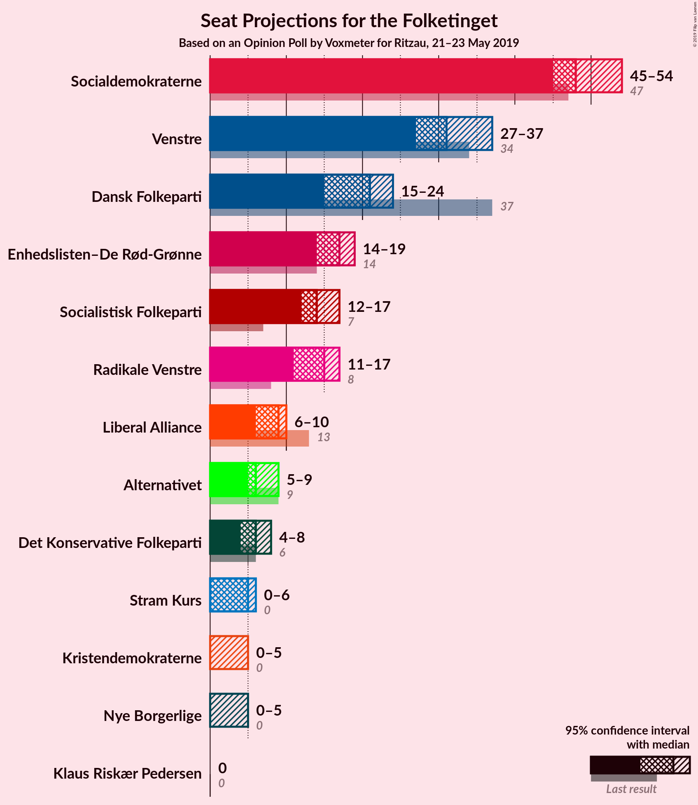

### Confidence Intervals

| Party | Last Result | Median | 80% Confidence Interval | 90% Confidence Interval | 95% Confidence Interval | 99% Confidence Interval |
|:-----:|:-----------:|:------:|:-----------------------:|:-----------------------:|:-----------------------:|:-----------------------:|
| <a href="#socialdemokraterne">Socialdemokraterne</a> | 47 | 49 | 47–50 |47–50 |46–50 |45–54 |
| <a href="#venstre">Venstre</a> | 34 | 33 | 27–34 |27–35 |27–37 |27–39 |
| <a href="#dansk-folkeparti">Dansk Folkeparti</a> | 37 | 21 | 20–22 |20–22 |18–22 |15–23 |
| <a href="#enhedslisten–de-rød-grønne">Enhedslisten–De Rød-Grønne</a> | 14 | 15 | 15–19 |15–19 |14–19 |13–19 |
| <a href="#radikale-venstre">Radikale Venstre</a> | 8 | 16 | 15–17 |15–17 |13–17 |12–19 |
| <a href="#socialistisk-folkeparti">Socialistisk Folkeparti</a> | 7 | 13 | 13–14 |11–14 |11–16 |11–17 |
| <a href="#liberal-alliance">Liberal Alliance</a> | 13 | 7 | 7–9 |7–10 |7–10 |6–11 |
| <a href="#alternativet">Alternativet</a> | 9 | 7 | 5–8 |5–9 |5–9 |5–10 |
| <a href="#det-konservative-folkeparti">Det Konservative Folkeparti</a> | 6 | 5 | 0–8 |0–8 |0–8 |0–8 |
| <a href="#stram-kurs">Stram Kurs</a> | 0 | 4 | 4–5 |4–5 |0–5 |0–8 |
| <a href="#nye-borgerlige">Nye Borgerlige</a> | 0 | 4 | 4 |0–4 |0–4 |0–6 |
| <a href="#kristendemokraterne">Kristendemokraterne</a> | 0 | 0 | 0–4 |0–4 |0–4 |0–6 |
| <a href="#klaus-riskær-pedersen">Klaus Riskær Pedersen</a> | 0 | 0 | 0 |0 |0 |0 |

### Socialdemokraterne

*For a full overview of the results for this party, see the [Socialdemokraterne](party-socialdemokraterne.html) page.*

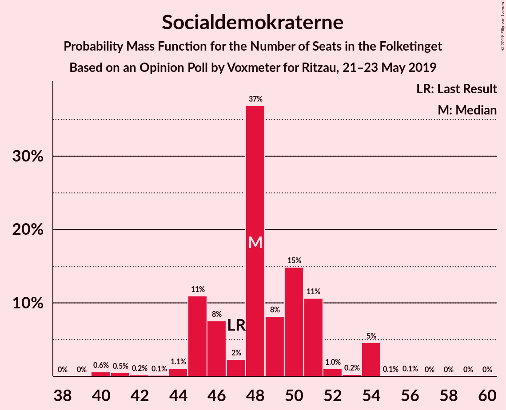

| Number of Seats | Probability | Accumulated | Special Marks |
|:---------------:|:-----------:|:-----------:|:-------------:|
| 41 | 0.1% | 100% |  |
| 42 | 0.1% | 99.9% |  |
| 43 | 0.1% | 99.7% |  |
| 44 | 0% | 99.6% |  |
| 45 | 2% | 99.6% |  |
| 46 | 2% | 98% |  |
| 47 | 9% | 96% | Last Result |
| 48 | 0.2% | 88% |  |
| 49 | 42% | 87% | Median |
| 50 | 43% | 45% |  |
| 51 | 0.3% | 2% |  |
| 52 | 0.1% | 2% |  |
| 53 | 0.8% | 2% |  |
| 54 | 0.5% | 0.8% |  |
| 55 | 0.3% | 0.3% |  |
| 56 | 0% | 0% |  |

### Venstre

*For a full overview of the results for this party, see the [Venstre](party-venstre.html) page.*

| Number of Seats | Probability | Accumulated | Special Marks |
|:---------------:|:-----------:|:-----------:|:-------------:|
| 26 | 0.1% | 100% |  |
| 27 | 43% | 99.9% |  |
| 28 | 0.4% | 57% |  |
| 29 | 0.1% | 57% |  |
| 30 | 0.8% | 57% |  |
| 31 | 0.4% | 56% |  |
| 32 | 1.1% | 56% |  |
| 33 | 42% | 55% | Median |
| 34 | 7% | 12% | Last Result |
| 35 | 1.5% | 5% |  |
| 36 | 0.3% | 4% |  |
| 37 | 1.2% | 3% |  |
| 38 | 0.6% | 2% |  |
| 39 | 1.4% | 2% |  |
| 40 | 0% | 0.1% |  |
| 41 | 0.1% | 0.1% |  |
| 42 | 0% | 0% |  |

### Dansk Folkeparti

*For a full overview of the results for this party, see the [Dansk Folkeparti](party-danskfolkeparti.html) page.*

| Number of Seats | Probability | Accumulated | Special Marks |
|:---------------:|:-----------:|:-----------:|:-------------:|
| 14 | 0% | 100% |  |
| 15 | 1.0% | 99.9% |  |
| 16 | 0.7% | 98.9% |  |
| 17 | 0.3% | 98% |  |
| 18 | 1.2% | 98% |  |
| 19 | 0.9% | 97% |  |
| 20 | 44% | 96% |  |
| 21 | 7% | 52% | Median |
| 22 | 43% | 45% |  |
| 23 | 1.2% | 1.4% |  |
| 24 | 0.2% | 0.2% |  |
| 25 | 0% | 0% |  |
| 26 | 0% | 0% |  |
| 27 | 0% | 0% |  |
| 28 | 0% | 0% |  |
| 29 | 0% | 0% |  |
| 30 | 0% | 0% |  |
| 31 | 0% | 0% |  |
| 32 | 0% | 0% |  |
| 33 | 0% | 0% |  |
| 34 | 0% | 0% |  |
| 35 | 0% | 0% |  |
| 36 | 0% | 0% |  |
| 37 | 0% | 0% | Last Result |

### Enhedslisten–De Rød-Grønne

*For a full overview of the results for this party, see the [Enhedslisten–De Rød-Grønne](party-enhedslisten–derød-grønne.html) page.*

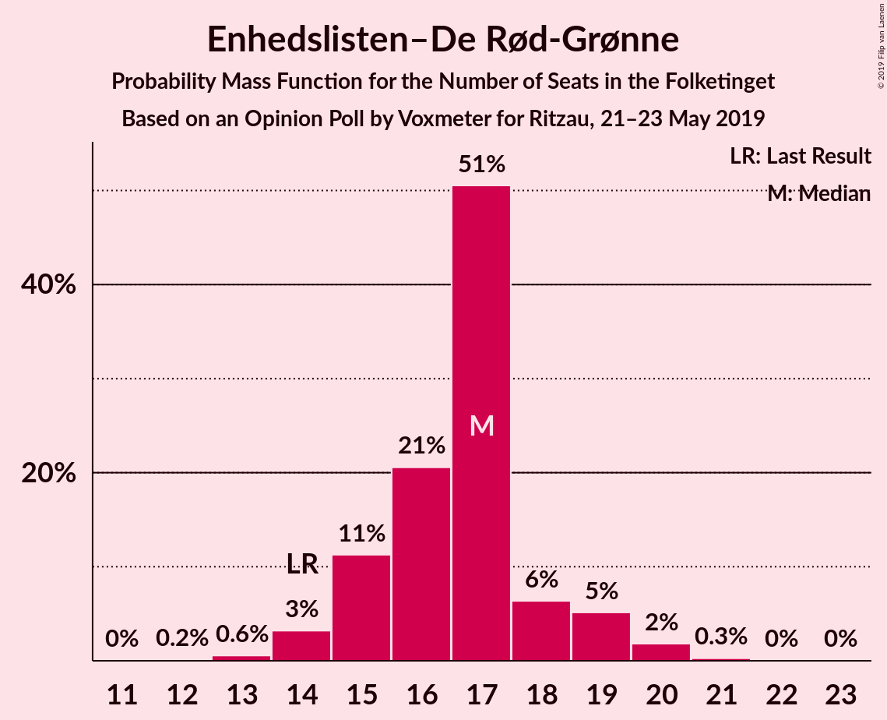

| Number of Seats | Probability | Accumulated | Special Marks |
|:---------------:|:-----------:|:-----------:|:-------------:|
| 11 | 0.1% | 100% |  |
| 12 | 0% | 99.9% |  |
| 13 | 0.8% | 99.9% |  |
| 14 | 2% | 99.1% | Last Result |
| 15 | 51% | 97% | Median |
| 16 | 2% | 47% |  |
| 17 | 0.5% | 44% |  |
| 18 | 0.5% | 44% |  |
| 19 | 43% | 43% |  |
| 20 | 0.1% | 0.2% |  |
| 21 | 0.1% | 0.1% |  |
| 22 | 0% | 0% |  |

### Radikale Venstre

*For a full overview of the results for this party, see the [Radikale Venstre](party-radikalevenstre.html) page.*

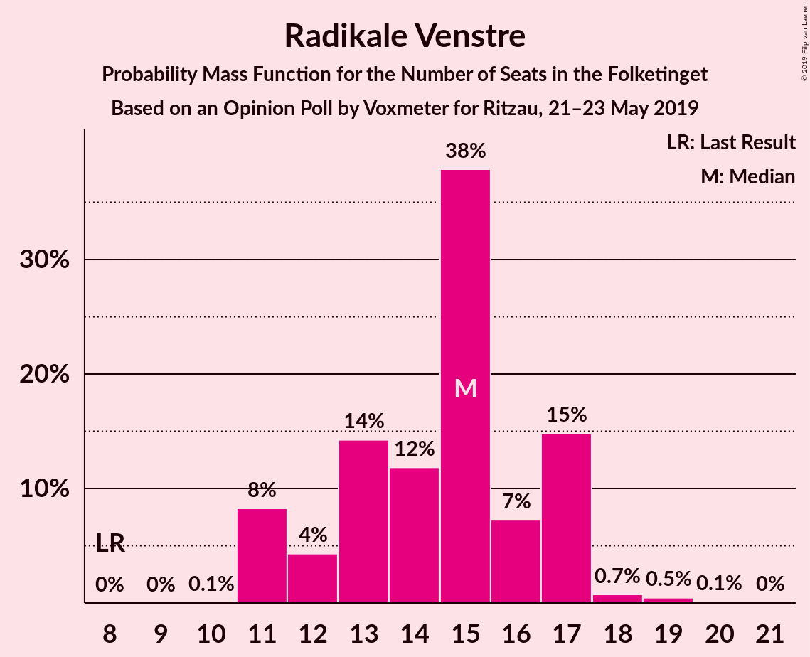

| Number of Seats | Probability | Accumulated | Special Marks |
|:---------------:|:-----------:|:-----------:|:-------------:|
| 8 | 0% | 100% | Last Result |
| 9 | 0% | 100% |  |
| 10 | 0% | 100% |  |
| 11 | 0.3% | 100% |  |
| 12 | 1.3% | 99.7% |  |
| 13 | 2% | 98% |  |
| 14 | 0.4% | 97% |  |
| 15 | 8% | 96% |  |
| 16 | 44% | 88% | Median |
| 17 | 43% | 44% |  |
| 18 | 0.1% | 0.7% |  |
| 19 | 0.3% | 0.6% |  |
| 20 | 0.3% | 0.4% |  |
| 21 | 0% | 0% |  |

### Socialistisk Folkeparti

*For a full overview of the results for this party, see the [Socialistisk Folkeparti](party-socialistiskfolkeparti.html) page.*

| Number of Seats | Probability | Accumulated | Special Marks |
|:---------------:|:-----------:|:-----------:|:-------------:|
| 7 | 0% | 100% | Last Result |
| 8 | 0% | 100% |  |
| 9 | 0% | 100% |  |
| 10 | 0.1% | 100% |  |
| 11 | 8% | 99.9% |  |
| 12 | 0.4% | 92% |  |
| 13 | 43% | 91% | Median |
| 14 | 44% | 48% |  |
| 15 | 1.4% | 4% |  |
| 16 | 2% | 3% |  |
| 17 | 0.6% | 1.0% |  |
| 18 | 0.1% | 0.5% |  |
| 19 | 0.3% | 0.4% |  |
| 20 | 0.1% | 0.1% |  |
| 21 | 0% | 0% |  |

### Liberal Alliance

*For a full overview of the results for this party, see the [Liberal Alliance](party-liberalalliance.html) page.*

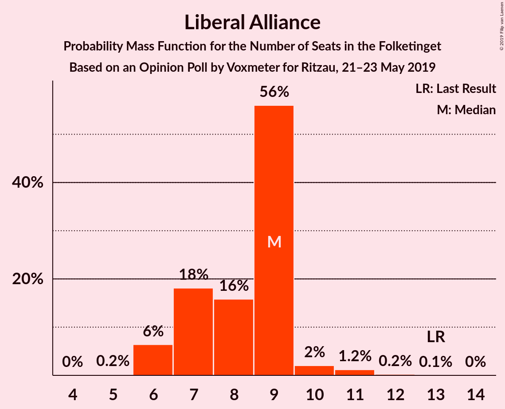

| Number of Seats | Probability | Accumulated | Special Marks |
|:---------------:|:-----------:|:-----------:|:-------------:|
| 4 | 0.1% | 100% |  |
| 5 | 0.3% | 99.9% |  |
| 6 | 0.2% | 99.6% |  |
| 7 | 85% | 99.4% | Median |
| 8 | 4% | 14% |  |
| 9 | 1.3% | 10% |  |
| 10 | 8% | 9% |  |
| 11 | 0.4% | 0.6% |  |
| 12 | 0% | 0.2% |  |
| 13 | 0.2% | 0.2% | Last Result |
| 14 | 0% | 0% |  |

### Alternativet

*For a full overview of the results for this party, see the [Alternativet](party-alternativet.html) page.*

| Number of Seats | Probability | Accumulated | Special Marks |
|:---------------:|:-----------:|:-----------:|:-------------:|
| 5 | 44% | 100% |  |
| 6 | 2% | 56% |  |
| 7 | 43% | 54% | Median |
| 8 | 3% | 11% |  |
| 9 | 8% | 8% | Last Result |
| 10 | 0.4% | 0.8% |  |
| 11 | 0% | 0.4% |  |
| 12 | 0.4% | 0.4% |  |
| 13 | 0% | 0% |  |

### Det Konservative Folkeparti

*For a full overview of the results for this party, see the [Det Konservative Folkeparti](party-detkonservativefolkeparti.html) page.*

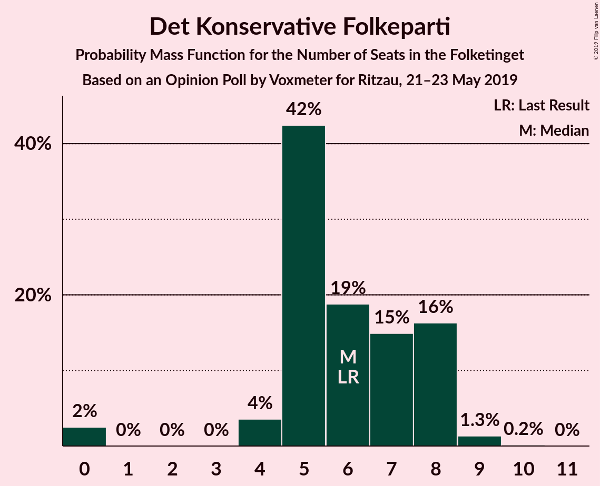

| Number of Seats | Probability | Accumulated | Special Marks |
|:---------------:|:-----------:|:-----------:|:-------------:|
| 0 | 42% | 100% |  |
| 1 | 0% | 58% |  |
| 2 | 0% | 58% |  |
| 3 | 0% | 58% |  |
| 4 | 1.4% | 58% |  |
| 5 | 9% | 56% | Median |
| 6 | 2% | 47% | Last Result |
| 7 | 2% | 45% |  |
| 8 | 43% | 44% |  |
| 9 | 0.3% | 0.4% |  |
| 10 | 0.1% | 0.2% |  |
| 11 | 0% | 0% |  |

### Stram Kurs

*For a full overview of the results for this party, see the [Stram Kurs](party-stramkurs.html) page.*

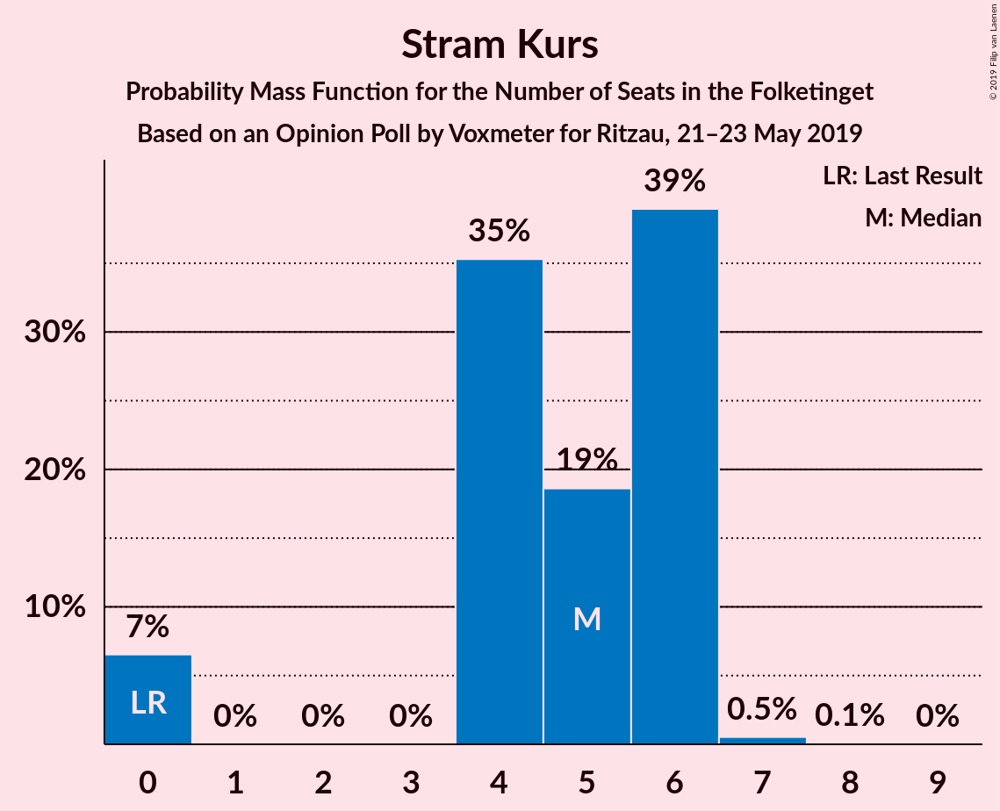

| Number of Seats | Probability | Accumulated | Special Marks |
|:---------------:|:-----------:|:-----------:|:-------------:|
| 0 | 3% | 100% | Last Result |
| 1 | 0% | 97% |  |
| 2 | 0% | 97% |  |
| 3 | 0% | 97% |  |
| 4 | 50% | 97% | Median |
| 5 | 46% | 47% |  |
| 6 | 0.8% | 1.5% |  |
| 7 | 0.1% | 0.7% |  |
| 8 | 0.5% | 0.6% |  |
| 9 | 0% | 0% |  |

### Nye Borgerlige

*For a full overview of the results for this party, see the [Nye Borgerlige](party-nyeborgerlige.html) page.*

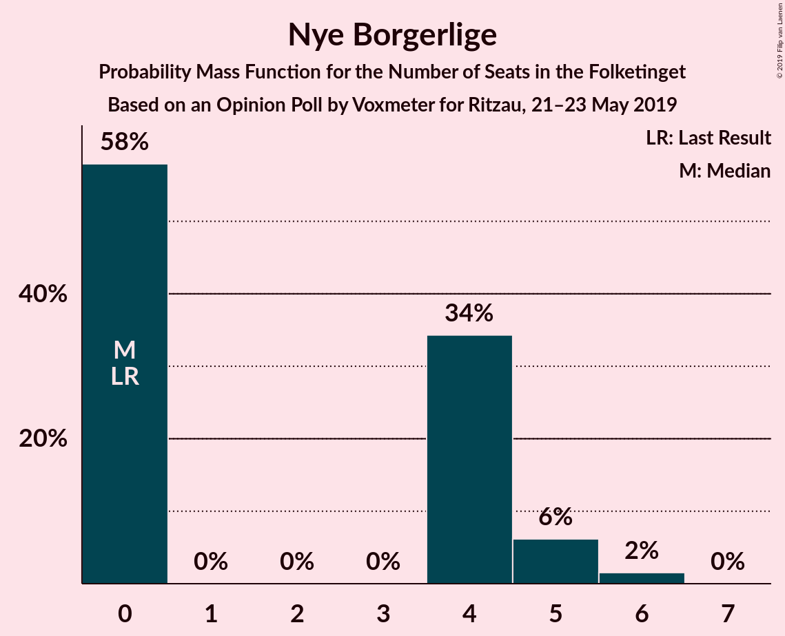

| Number of Seats | Probability | Accumulated | Special Marks |
|:---------------:|:-----------:|:-----------:|:-------------:|
| 0 | 6% | 100% | Last Result |
| 1 | 0% | 94% |  |
| 2 | 0% | 94% |  |
| 3 | 0% | 94% |  |
| 4 | 93% | 94% | Median |
| 5 | 0.4% | 1.3% |  |
| 6 | 0.9% | 1.0% |  |
| 7 | 0% | 0% |  |

### Kristendemokraterne

*For a full overview of the results for this party, see the [Kristendemokraterne](party-kristendemokraterne.html) page.*

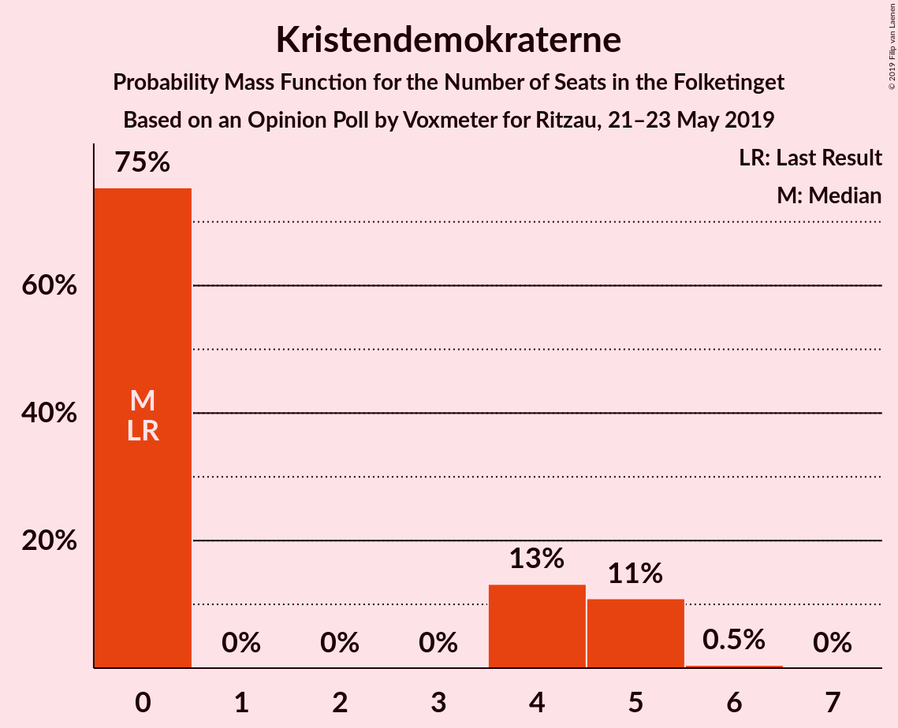

| Number of Seats | Probability | Accumulated | Special Marks |
|:---------------:|:-----------:|:-----------:|:-------------:|
| 0 | 55% | 100% | Last Result, Median |
| 1 | 0% | 45% |  |
| 2 | 0% | 45% |  |
| 3 | 0% | 45% |  |
| 4 | 43% | 45% |  |
| 5 | 1.0% | 2% |  |
| 6 | 0.7% | 0.7% |  |
| 7 | 0% | 0% |  |

### Klaus Riskær Pedersen

*For a full overview of the results for this party, see the [Klaus Riskær Pedersen](party-klausriskærpedersen.html) page.*

| Number of Seats | Probability | Accumulated | Special Marks |
|:---------------:|:-----------:|:-----------:|:-------------:|
| 0 | 99.9% | 100% | Last Result, Median |
| 1 | 0% | 0.1% |  |
| 2 | 0% | 0.1% |  |
| 3 | 0% | 0.1% |  |
| 4 | 0.1% | 0.1% |  |
| 5 | 0% | 0% |  |

## Coalitions

### Confidence Intervals

| Coalition | Last Result | Median | Majority? | 80% Confidence Interval | 90% Confidence Interval | 95% Confidence Interval | 99% Confidence Interval |
|:---------:|:-----------:|:------:|:---------:|:-----------------------:|:-----------------------:|:-----------------------:|:-----------------------:|
| Socialdemokraterne – Enhedslisten–De Rød-Grønne – Radikale Venstre – Socialistisk Folkeparti – Alternativet | 85 | 100 | 100% | 99–105 | 97–105 | 97–105 | 94–107 |
| Socialdemokraterne – Enhedslisten–De Rød-Grønne – Radikale Venstre – Socialistisk Folkeparti | 76 | 95 | 91% | 91–98 | 88–98 | 88–98 | 87–101 |
| Socialdemokraterne – Enhedslisten–De Rød-Grønne – Socialistisk Folkeparti – Alternativet | 77 | 83 | 1.0% | 83–89 | 82–89 | 82–89 | 78–91 |
| Socialdemokraterne – Enhedslisten–De Rød-Grønne – Socialistisk Folkeparti | 68 | 78 | 0% | 78–82 | 73–82 | 73–82 | 72–84 |
| Socialdemokraterne – Radikale Venstre – Socialistisk Folkeparti | 62 | 79 | 0% | 75–80 | 73–80 | 73–80 | 72–85 |
| Venstre – Dansk Folkeparti – Liberal Alliance – Det Konservative Folkeparti – Stram Kurs – Nye Borgerlige – Kristendemokraterne – Klaus Riskær Pedersen | 90 | 75 | 0% | 70–76 | 70–78 | 70–78 | 68–81 |
| Venstre – Dansk Folkeparti – Liberal Alliance – Det Konservative Folkeparti – Nye Borgerlige – Kristendemokraterne – Klaus Riskær Pedersen | 90 | 70 | 0% | 66–72 | 66–74 | 66–74 | 64–81 |
| Venstre – Dansk Folkeparti – Liberal Alliance – Det Konservative Folkeparti – Nye Borgerlige – Klaus Riskær Pedersen | 90 | 66 | 0% | 66–72 | 66–74 | 66–74 | 62–76 |
| Venstre – Dansk Folkeparti – Liberal Alliance – Det Konservative Folkeparti – Nye Borgerlige – Kristendemokraterne | 90 | 70 | 0% | 66–72 | 66–74 | 66–74 | 64–81 |
| Venstre – Dansk Folkeparti – Liberal Alliance – Det Konservative Folkeparti – Nye Borgerlige | 90 | 66 | 0% | 66–72 | 66–74 | 66–74 | 62–76 |
| Venstre – Dansk Folkeparti – Liberal Alliance – Det Konservative Folkeparti – Kristendemokraterne | 90 | 66 | 0% | 62–70 | 62–70 | 62–71 | 62–81 |
| Venstre – Dansk Folkeparti – Liberal Alliance – Det Konservative Folkeparti | 90 | 62 | 0% | 62–70 | 62–70 | 62–70 | 61–76 |
| Socialdemokraterne – Radikale Venstre | 55 | 66 | 0% | 62–66 | 62–66 | 60–66 | 58–73 |
| Venstre – Liberal Alliance – Det Konservative Folkeparti | 53 | 42 | 0% | 40–49 | 40–49 | 40–51 | 40–55 |
| Venstre – Det Konservative Folkeparti | 40 | 35 | 0% | 33–39 | 33–40 | 33–43 | 33–46 |
| Venstre | 34 | 33 | 0% | 27–34 | 27–35 | 27–37 | 27–39 |

### Socialdemokraterne – Enhedslisten–De Rød-Grønne – Radikale Venstre – Socialistisk Folkeparti – Alternativet

| Number of Seats | Probability | Accumulated | Special Marks |
|:---------------:|:-----------:|:-----------:|:-------------:|
| 85 | 0% | 100% | Last Result |
| 86 | 0% | 100% |  |
| 87 | 0% | 100% |  |
| 88 | 0% | 100% |  |
| 89 | 0% | 100% |  |
| 90 | 0% | 100% | Majority |
| 91 | 0% | 100% |  |
| 92 | 0.1% | 100% |  |
| 93 | 0% | 99.9% |  |
| 94 | 0.6% | 99.9% |  |
| 95 | 1.1% | 99.2% |  |
| 96 | 0.3% | 98% |  |
| 97 | 7% | 98% |  |
| 98 | 0.5% | 91% |  |
| 99 | 1.0% | 90% |  |
| 100 | 44% | 89% | Median |
| 101 | 0.6% | 46% |  |
| 102 | 0.4% | 45% |  |
| 103 | 1.5% | 45% |  |
| 104 | 0.3% | 43% |  |
| 105 | 42% | 43% |  |
| 106 | 0.2% | 1.0% |  |
| 107 | 0.4% | 0.8% |  |
| 108 | 0.3% | 0.5% |  |
| 109 | 0% | 0.2% |  |
| 110 | 0% | 0.2% |  |
| 111 | 0.2% | 0.2% |  |
| 112 | 0% | 0% |  |

### Socialdemokraterne – Enhedslisten–De Rød-Grønne – Radikale Venstre – Socialistisk Folkeparti

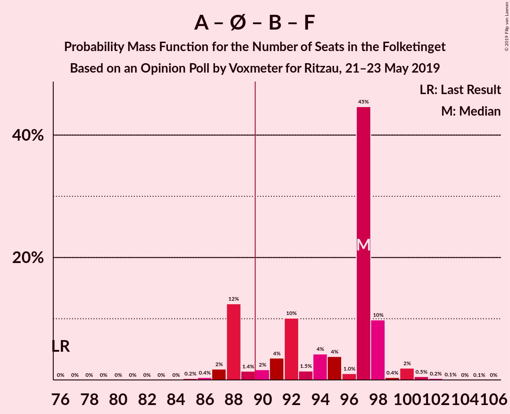

| Number of Seats | Probability | Accumulated | Special Marks |
|:---------------:|:-----------:|:-----------:|:-------------:|
| 76 | 0% | 100% | Last Result |
| 77 | 0% | 100% |  |
| 78 | 0% | 100% |  |
| 79 | 0% | 100% |  |
| 80 | 0% | 100% |  |
| 81 | 0% | 100% |  |
| 82 | 0% | 100% |  |
| 83 | 0% | 100% |  |
| 84 | 0% | 100% |  |
| 85 | 0% | 100% |  |
| 86 | 0% | 100% |  |
| 87 | 1.2% | 99.9% |  |
| 88 | 7% | 98.8% |  |
| 89 | 1.0% | 92% |  |
| 90 | 0.1% | 91% | Majority |
| 91 | 2% | 91% |  |
| 92 | 0.3% | 89% |  |
| 93 | 0.1% | 88% | Median |
| 94 | 1.1% | 88% |  |
| 95 | 43% | 87% |  |
| 96 | 0.7% | 44% |  |
| 97 | 0.1% | 44% |  |
| 98 | 43% | 43% |  |
| 99 | 0.2% | 1.0% |  |
| 100 | 0.1% | 0.8% |  |
| 101 | 0.4% | 0.7% |  |
| 102 | 0% | 0.2% |  |
| 103 | 0% | 0.2% |  |
| 104 | 0% | 0.2% |  |
| 105 | 0.2% | 0.2% |  |
| 106 | 0% | 0% |  |

### Socialdemokraterne – Enhedslisten–De Rød-Grønne – Socialistisk Folkeparti – Alternativet

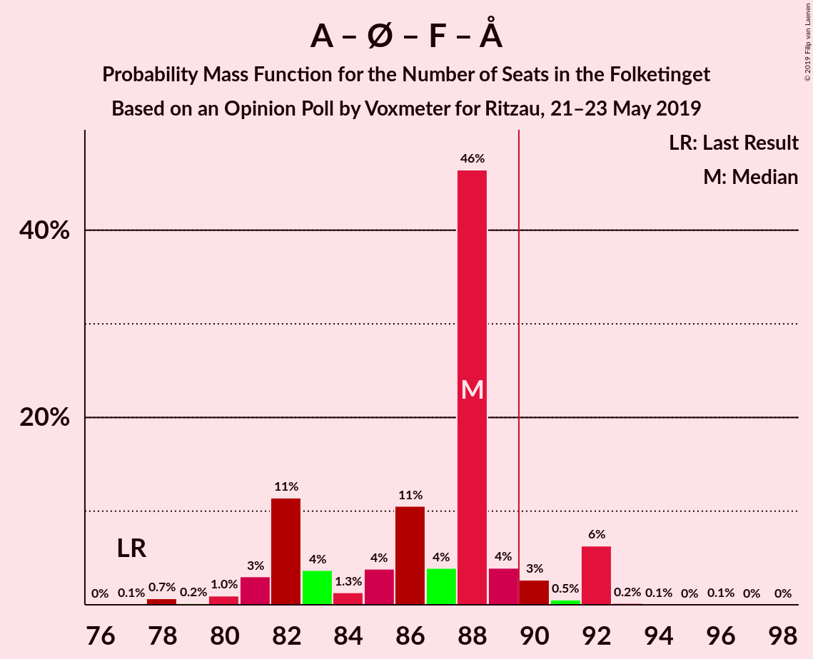

| Number of Seats | Probability | Accumulated | Special Marks |
|:---------------:|:-----------:|:-----------:|:-------------:|
| 77 | 0% | 100% | Last Result |
| 78 | 0.6% | 99.9% |  |
| 79 | 0.2% | 99.4% |  |
| 80 | 0.5% | 99.1% |  |
| 81 | 0.1% | 98.6% |  |
| 82 | 7% | 98.5% |  |
| 83 | 43% | 91% |  |
| 84 | 1.2% | 48% | Median |
| 85 | 0.3% | 47% |  |
| 86 | 0.8% | 47% |  |
| 87 | 1.5% | 46% |  |
| 88 | 1.2% | 45% |  |
| 89 | 42% | 43% |  |
| 90 | 0.3% | 1.0% | Majority |
| 91 | 0.2% | 0.7% |  |
| 92 | 0.2% | 0.5% |  |
| 93 | 0.1% | 0.2% |  |
| 94 | 0.1% | 0.1% |  |
| 95 | 0% | 0% |  |

### Socialdemokraterne – Enhedslisten–De Rød-Grønne – Socialistisk Folkeparti

| Number of Seats | Probability | Accumulated | Special Marks |
|:---------------:|:-----------:|:-----------:|:-------------:|
| 68 | 0% | 100% | Last Result |
| 69 | 0% | 100% |  |
| 70 | 0% | 99.9% |  |
| 71 | 0.1% | 99.9% |  |
| 72 | 0.5% | 99.8% |  |
| 73 | 8% | 99.3% |  |
| 74 | 0.2% | 92% |  |
| 75 | 1.1% | 91% |  |
| 76 | 0.1% | 90% |  |
| 77 | 0.2% | 90% | Median |
| 78 | 44% | 90% |  |
| 79 | 0.8% | 46% |  |
| 80 | 0.8% | 45% |  |
| 81 | 0.5% | 44% |  |
| 82 | 42% | 44% |  |
| 83 | 0.8% | 1.4% |  |
| 84 | 0.1% | 0.5% |  |
| 85 | 0.1% | 0.4% |  |
| 86 | 0.2% | 0.3% |  |
| 87 | 0% | 0.1% |  |
| 88 | 0.1% | 0.1% |  |
| 89 | 0% | 0% |  |

### Socialdemokraterne – Radikale Venstre – Socialistisk Folkeparti

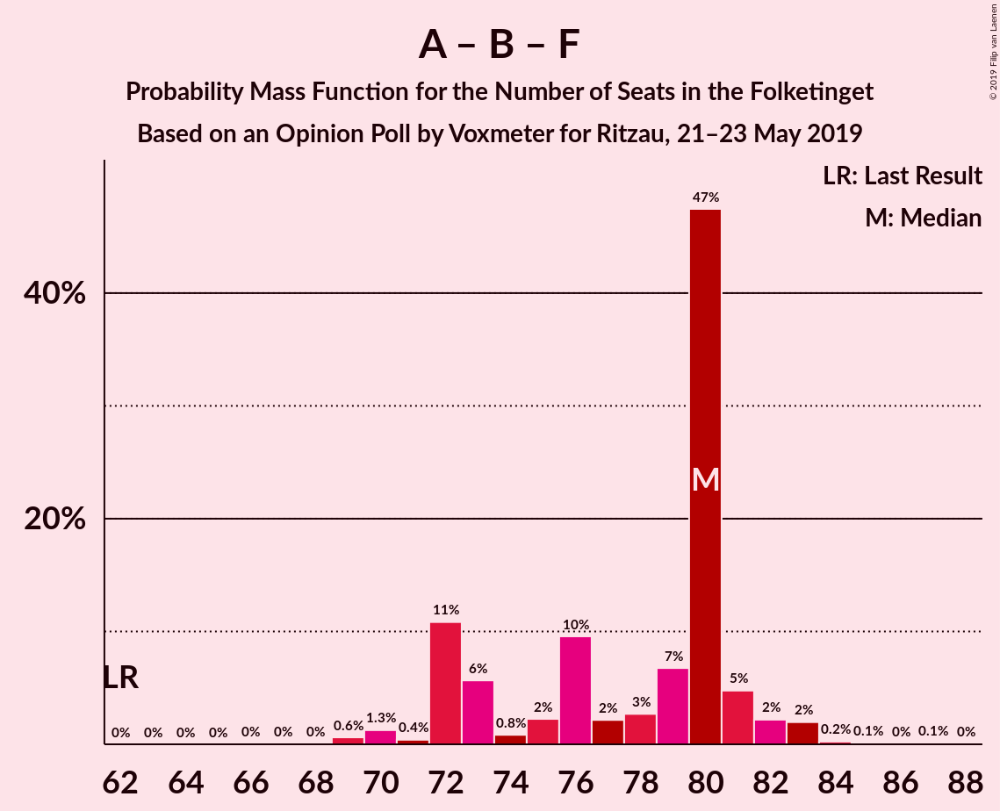

| Number of Seats | Probability | Accumulated | Special Marks |
|:---------------:|:-----------:|:-----------:|:-------------:|
| 62 | 0% | 100% | Last Result |
| 63 | 0% | 100% |  |
| 64 | 0% | 100% |  |
| 65 | 0% | 100% |  |
| 66 | 0.1% | 100% |  |
| 67 | 0% | 99.9% |  |
| 68 | 0% | 99.9% |  |
| 69 | 0.1% | 99.9% |  |
| 70 | 0.1% | 99.8% |  |
| 71 | 0% | 99.7% |  |
| 72 | 1.0% | 99.7% |  |
| 73 | 7% | 98.6% |  |
| 74 | 1.1% | 92% |  |
| 75 | 0.7% | 91% |  |
| 76 | 0.9% | 90% |  |
| 77 | 1.3% | 89% |  |
| 78 | 1.2% | 88% | Median |
| 79 | 42% | 86% |  |
| 80 | 42% | 44% |  |
| 81 | 0.2% | 2% |  |
| 82 | 0.9% | 2% |  |
| 83 | 0.3% | 1.1% |  |
| 84 | 0.2% | 0.8% |  |
| 85 | 0.5% | 0.6% |  |
| 86 | 0% | 0.2% |  |
| 87 | 0.2% | 0.2% |  |
| 88 | 0% | 0% |  |

### Venstre – Dansk Folkeparti – Liberal Alliance – Det Konservative Folkeparti – Stram Kurs – Nye Borgerlige – Kristendemokraterne – Klaus Riskær Pedersen

| Number of Seats | Probability | Accumulated | Special Marks |
|:---------------:|:-----------:|:-----------:|:-------------:|
| 64 | 0.2% | 100% |  |
| 65 | 0% | 99.8% |  |
| 66 | 0% | 99.8% |  |
| 67 | 0.3% | 99.8% |  |
| 68 | 0.4% | 99.5% |  |
| 69 | 0.2% | 99.2% |  |
| 70 | 42% | 99.0% |  |
| 71 | 0.3% | 57% |  |
| 72 | 1.5% | 57% |  |
| 73 | 0.4% | 55% |  |
| 74 | 0.6% | 55% | Median |
| 75 | 44% | 54% |  |
| 76 | 1.0% | 11% |  |
| 77 | 0.5% | 10% |  |
| 78 | 7% | 9% |  |
| 79 | 0.3% | 2% |  |
| 80 | 1.1% | 2% |  |
| 81 | 0.6% | 0.8% |  |
| 82 | 0% | 0.1% |  |
| 83 | 0.1% | 0.1% |  |
| 84 | 0% | 0% |  |
| 85 | 0% | 0% |  |
| 86 | 0% | 0% |  |
| 87 | 0% | 0% |  |
| 88 | 0% | 0% |  |
| 89 | 0% | 0% |  |
| 90 | 0% | 0% | Last Result, Majority |

### Venstre – Dansk Folkeparti – Liberal Alliance – Det Konservative Folkeparti – Nye Borgerlige – Kristendemokraterne – Klaus Riskær Pedersen

| Number of Seats | Probability | Accumulated | Special Marks |
|:---------------:|:-----------:|:-----------:|:-------------:|
| 59 | 0.2% | 100% |  |
| 60 | 0% | 99.8% |  |
| 61 | 0% | 99.8% |  |
| 62 | 0% | 99.8% |  |
| 63 | 0% | 99.8% |  |
| 64 | 0.5% | 99.7% |  |
| 65 | 0.3% | 99.3% |  |
| 66 | 42% | 99.0% |  |
| 67 | 0.5% | 57% |  |
| 68 | 0.6% | 57% |  |
| 69 | 0.5% | 56% |  |
| 70 | 44% | 55% | Median |
| 71 | 1.0% | 12% |  |
| 72 | 1.5% | 11% |  |
| 73 | 0.3% | 9% |  |
| 74 | 7% | 9% |  |
| 75 | 1.0% | 2% |  |
| 76 | 0.3% | 1.2% |  |
| 77 | 0.1% | 0.9% |  |
| 78 | 0.1% | 0.8% |  |
| 79 | 0.1% | 0.7% |  |
| 80 | 0% | 0.6% |  |
| 81 | 0.6% | 0.6% |  |
| 82 | 0% | 0% |  |
| 83 | 0% | 0% |  |
| 84 | 0% | 0% |  |
| 85 | 0% | 0% |  |
| 86 | 0% | 0% |  |
| 87 | 0% | 0% |  |
| 88 | 0% | 0% |  |
| 89 | 0% | 0% |  |
| 90 | 0% | 0% | Last Result, Majority |

### Venstre – Dansk Folkeparti – Liberal Alliance – Det Konservative Folkeparti – Nye Borgerlige – Klaus Riskær Pedersen

| Number of Seats | Probability | Accumulated | Special Marks |
|:---------------:|:-----------:|:-----------:|:-------------:|
| 59 | 0.2% | 100% |  |
| 60 | 0% | 99.8% |  |
| 61 | 0.1% | 99.8% |  |
| 62 | 0.4% | 99.7% |  |
| 63 | 0.2% | 99.3% |  |
| 64 | 0.6% | 99.1% |  |
| 65 | 0.3% | 98% |  |
| 66 | 84% | 98% |  |
| 67 | 0.3% | 14% |  |
| 68 | 0.3% | 14% |  |
| 69 | 0.5% | 13% |  |
| 70 | 1.4% | 13% | Median |
| 71 | 1.2% | 12% |  |
| 72 | 2% | 10% |  |
| 73 | 0.2% | 9% |  |
| 74 | 7% | 9% |  |
| 75 | 0.8% | 1.5% |  |
| 76 | 0.6% | 0.6% |  |
| 77 | 0% | 0% |  |
| 78 | 0% | 0% |  |
| 79 | 0% | 0% |  |
| 80 | 0% | 0% |  |
| 81 | 0% | 0% |  |
| 82 | 0% | 0% |  |
| 83 | 0% | 0% |  |
| 84 | 0% | 0% |  |
| 85 | 0% | 0% |  |
| 86 | 0% | 0% |  |
| 87 | 0% | 0% |  |
| 88 | 0% | 0% |  |
| 89 | 0% | 0% |  |
| 90 | 0% | 0% | Last Result, Majority |

### Venstre – Dansk Folkeparti – Liberal Alliance – Det Konservative Folkeparti – Nye Borgerlige – Kristendemokraterne

| Number of Seats | Probability | Accumulated | Special Marks |
|:---------------:|:-----------:|:-----------:|:-------------:|
| 59 | 0.2% | 100% |  |
| 60 | 0% | 99.8% |  |
| 61 | 0% | 99.8% |  |
| 62 | 0% | 99.8% |  |
| 63 | 0% | 99.8% |  |
| 64 | 0.5% | 99.7% |  |
| 65 | 0.3% | 99.3% |  |
| 66 | 42% | 99.0% |  |
| 67 | 0.5% | 57% |  |
| 68 | 0.6% | 57% |  |
| 69 | 0.6% | 56% |  |
| 70 | 44% | 55% | Median |
| 71 | 1.0% | 12% |  |
| 72 | 1.5% | 11% |  |
| 73 | 0.2% | 9% |  |
| 74 | 7% | 9% |  |
| 75 | 1.0% | 2% |  |
| 76 | 0.3% | 1.2% |  |
| 77 | 0.1% | 0.9% |  |
| 78 | 0.1% | 0.8% |  |
| 79 | 0.1% | 0.7% |  |
| 80 | 0% | 0.6% |  |
| 81 | 0.6% | 0.6% |  |
| 82 | 0% | 0% |  |
| 83 | 0% | 0% |  |
| 84 | 0% | 0% |  |
| 85 | 0% | 0% |  |
| 86 | 0% | 0% |  |
| 87 | 0% | 0% |  |
| 88 | 0% | 0% |  |
| 89 | 0% | 0% |  |
| 90 | 0% | 0% | Last Result, Majority |

### Venstre – Dansk Folkeparti – Liberal Alliance – Det Konservative Folkeparti – Nye Borgerlige

| Number of Seats | Probability | Accumulated | Special Marks |
|:---------------:|:-----------:|:-----------:|:-------------:|
| 59 | 0.2% | 100% |  |
| 60 | 0% | 99.8% |  |
| 61 | 0.1% | 99.8% |  |
| 62 | 0.4% | 99.7% |  |
| 63 | 0.2% | 99.3% |  |
| 64 | 0.6% | 99.1% |  |
| 65 | 0.4% | 98% |  |
| 66 | 84% | 98% |  |
| 67 | 0.3% | 14% |  |
| 68 | 0.3% | 14% |  |
| 69 | 0.5% | 13% |  |
| 70 | 1.4% | 13% | Median |
| 71 | 1.2% | 12% |  |
| 72 | 2% | 10% |  |
| 73 | 0.1% | 9% |  |
| 74 | 7% | 9% |  |
| 75 | 0.8% | 1.5% |  |
| 76 | 0.6% | 0.6% |  |
| 77 | 0% | 0% |  |
| 78 | 0% | 0% |  |
| 79 | 0% | 0% |  |
| 80 | 0% | 0% |  |
| 81 | 0% | 0% |  |
| 82 | 0% | 0% |  |
| 83 | 0% | 0% |  |
| 84 | 0% | 0% |  |
| 85 | 0% | 0% |  |
| 86 | 0% | 0% |  |
| 87 | 0% | 0% |  |
| 88 | 0% | 0% |  |
| 89 | 0% | 0% |  |
| 90 | 0% | 0% | Last Result, Majority |

### Venstre – Dansk Folkeparti – Liberal Alliance – Det Konservative Folkeparti – Kristendemokraterne

| Number of Seats | Probability | Accumulated | Special Marks |
|:---------------:|:-----------:|:-----------:|:-------------:|
| 59 | 0.2% | 100% |  |
| 60 | 0% | 99.8% |  |
| 61 | 0% | 99.8% |  |
| 62 | 42% | 99.7% |  |
| 63 | 0.2% | 58% |  |
| 64 | 0.5% | 57% |  |
| 65 | 1.0% | 57% |  |
| 66 | 43% | 56% | Median |
| 67 | 0.3% | 13% |  |
| 68 | 1.4% | 13% |  |
| 69 | 0.3% | 11% |  |
| 70 | 8% | 11% |  |
| 71 | 0.8% | 3% |  |
| 72 | 0.4% | 2% |  |
| 73 | 0% | 2% |  |
| 74 | 0.1% | 2% |  |
| 75 | 0.9% | 2% |  |
| 76 | 0% | 0.7% |  |
| 77 | 0% | 0.7% |  |
| 78 | 0% | 0.7% |  |
| 79 | 0.1% | 0.7% |  |
| 80 | 0% | 0.6% |  |
| 81 | 0.6% | 0.6% |  |
| 82 | 0% | 0% |  |
| 83 | 0% | 0% |  |
| 84 | 0% | 0% |  |
| 85 | 0% | 0% |  |
| 86 | 0% | 0% |  |
| 87 | 0% | 0% |  |
| 88 | 0% | 0% |  |
| 89 | 0% | 0% |  |
| 90 | 0% | 0% | Last Result, Majority |

### Venstre – Dansk Folkeparti – Liberal Alliance – Det Konservative Folkeparti

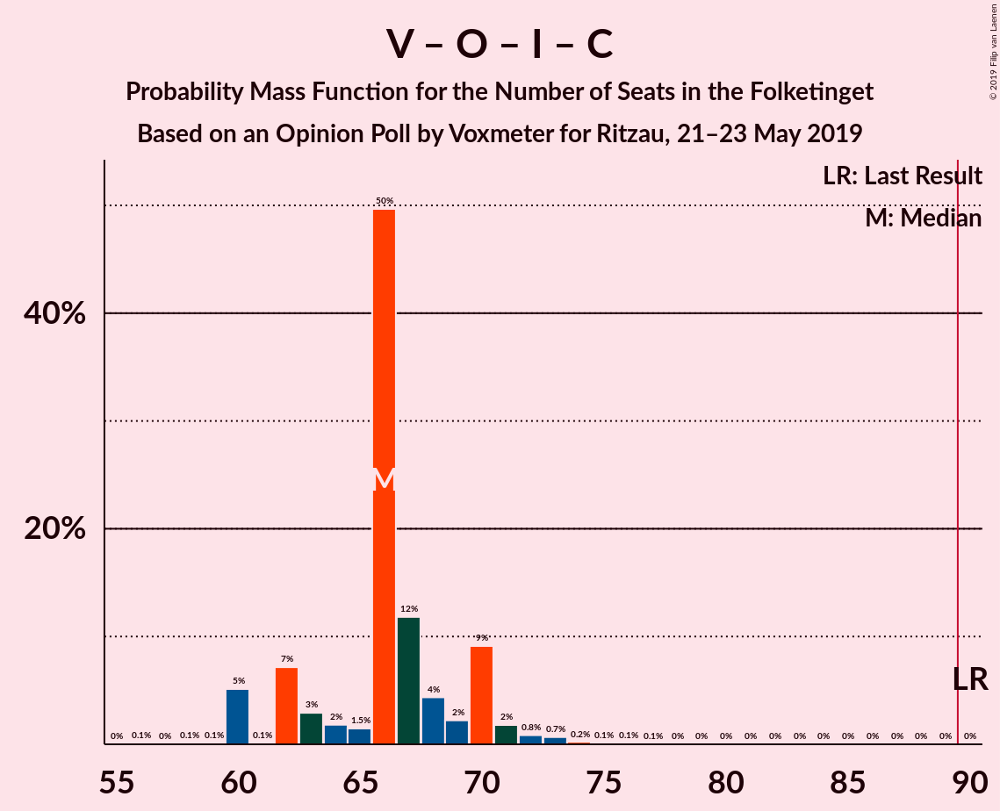

| Number of Seats | Probability | Accumulated | Special Marks |
|:---------------:|:-----------:|:-----------:|:-------------:|
| 59 | 0.4% | 100% |  |
| 60 | 0% | 99.6% |  |
| 61 | 0.1% | 99.6% |  |
| 62 | 85% | 99.5% |  |
| 63 | 0.1% | 15% |  |
| 64 | 0.7% | 15% |  |
| 65 | 1.1% | 14% |  |
| 66 | 0.7% | 13% | Median |
| 67 | 0.2% | 12% |  |
| 68 | 1.2% | 12% |  |
| 69 | 0.1% | 11% |  |
| 70 | 8% | 11% |  |
| 71 | 0.8% | 2% |  |
| 72 | 0% | 2% |  |
| 73 | 0.1% | 2% |  |
| 74 | 0% | 1.4% |  |
| 75 | 0.8% | 1.4% |  |
| 76 | 0.6% | 0.6% |  |
| 77 | 0% | 0% |  |
| 78 | 0% | 0% |  |
| 79 | 0% | 0% |  |
| 80 | 0% | 0% |  |
| 81 | 0% | 0% |  |
| 82 | 0% | 0% |  |
| 83 | 0% | 0% |  |
| 84 | 0% | 0% |  |
| 85 | 0% | 0% |  |
| 86 | 0% | 0% |  |
| 87 | 0% | 0% |  |
| 88 | 0% | 0% |  |
| 89 | 0% | 0% |  |
| 90 | 0% | 0% | Last Result, Majority |

### Socialdemokraterne – Radikale Venstre

| Number of Seats | Probability | Accumulated | Special Marks |
|:---------------:|:-----------:|:-----------:|:-------------:|
| 54 | 0.1% | 100% |  |
| 55 | 0% | 99.9% | Last Result |
| 56 | 0% | 99.8% |  |
| 57 | 0.1% | 99.8% |  |
| 58 | 0.9% | 99.8% |  |
| 59 | 0.3% | 98.8% |  |
| 60 | 2% | 98.5% |  |
| 61 | 0.9% | 97% |  |
| 62 | 8% | 96% |  |
| 63 | 1.2% | 88% |  |
| 64 | 0.5% | 87% |  |
| 65 | 0.7% | 87% | Median |
| 66 | 85% | 86% |  |
| 67 | 0.2% | 1.2% |  |
| 68 | 0.1% | 1.0% |  |
| 69 | 0% | 0.9% |  |
| 70 | 0.3% | 0.8% |  |
| 71 | 0% | 0.5% |  |
| 72 | 0% | 0.5% |  |
| 73 | 0% | 0.5% |  |
| 74 | 0.5% | 0.5% |  |
| 75 | 0% | 0% |  |

### Venstre – Liberal Alliance – Det Konservative Folkeparti

| Number of Seats | Probability | Accumulated | Special Marks |
|:---------------:|:-----------:|:-----------:|:-------------:|
| 38 | 0% | 100% |  |
| 39 | 0.1% | 99.9% |  |
| 40 | 42% | 99.8% |  |
| 41 | 0.1% | 58% |  |
| 42 | 43% | 58% |  |
| 43 | 0.4% | 15% |  |
| 44 | 0% | 15% |  |
| 45 | 0.7% | 15% | Median |
| 46 | 0.8% | 14% |  |
| 47 | 0.7% | 13% |  |
| 48 | 0.2% | 12% |  |
| 49 | 8% | 12% |  |
| 50 | 2% | 4% |  |
| 51 | 0.7% | 3% |  |
| 52 | 0.6% | 2% |  |
| 53 | 0.2% | 1.3% | Last Result |
| 54 | 0.6% | 1.1% |  |
| 55 | 0.5% | 0.5% |  |
| 56 | 0% | 0% |  |

### Venstre – Det Konservative Folkeparti

| Number of Seats | Probability | Accumulated | Special Marks |
|:---------------:|:-----------:|:-----------:|:-------------:|
| 32 | 0.2% | 100% |  |
| 33 | 42% | 99.7% |  |
| 34 | 0.4% | 58% |  |
| 35 | 43% | 57% |  |
| 36 | 0.5% | 15% |  |
| 37 | 1.0% | 14% |  |
| 38 | 0.3% | 13% | Median |
| 39 | 8% | 13% |  |
| 40 | 1.0% | 5% | Last Result |
| 41 | 0.4% | 4% |  |
| 42 | 0.6% | 4% |  |
| 43 | 2% | 3% |  |
| 44 | 0.1% | 2% |  |
| 45 | 0.7% | 1.4% |  |
| 46 | 0.7% | 0.7% |  |
| 47 | 0% | 0% |  |

### Venstre

| Number of Seats | Probability | Accumulated | Special Marks |
|:---------------:|:-----------:|:-----------:|:-------------:|
| 26 | 0.1% | 100% |  |
| 27 | 43% | 99.9% |  |
| 28 | 0.4% | 57% |  |
| 29 | 0.1% | 57% |  |
| 30 | 0.8% | 57% |  |
| 31 | 0.4% | 56% |  |
| 32 | 1.1% | 56% |  |
| 33 | 42% | 55% | Median |
| 34 | 7% | 12% | Last Result |
| 35 | 1.5% | 5% |  |
| 36 | 0.3% | 4% |  |
| 37 | 1.2% | 3% |  |
| 38 | 0.6% | 2% |  |
| 39 | 1.4% | 2% |  |
| 40 | 0% | 0.1% |  |
| 41 | 0.1% | 0.1% |  |
| 42 | 0% | 0% |  |

## Technical Information

### Opinion Poll

+ **Polling firm:** Voxmeter
+ **Commissioner(s):** Ritzau
+ **Fieldwork period:** 21–23 May 2019

### Calculations

+ **Sample size:** 1006
+ **Simulations done:** 131,072
+ **Error estimate:** 4.02%

