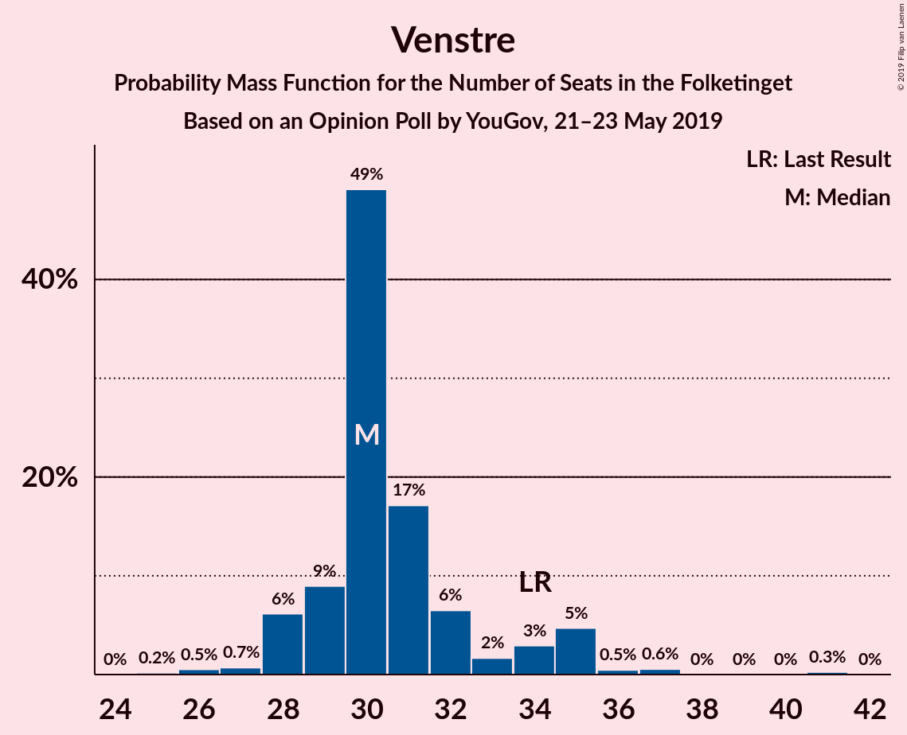
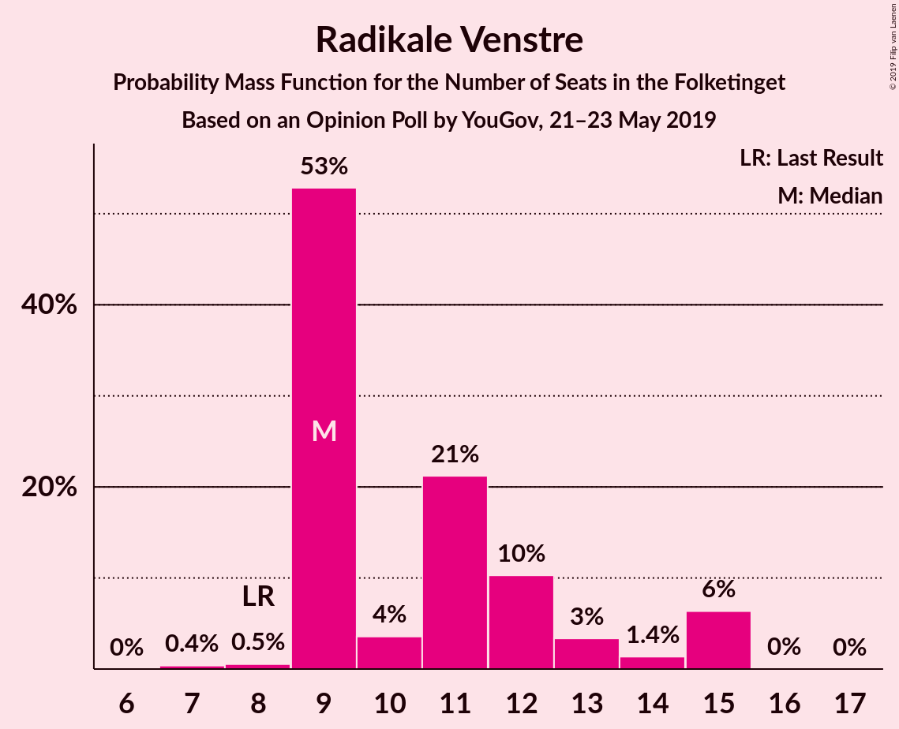
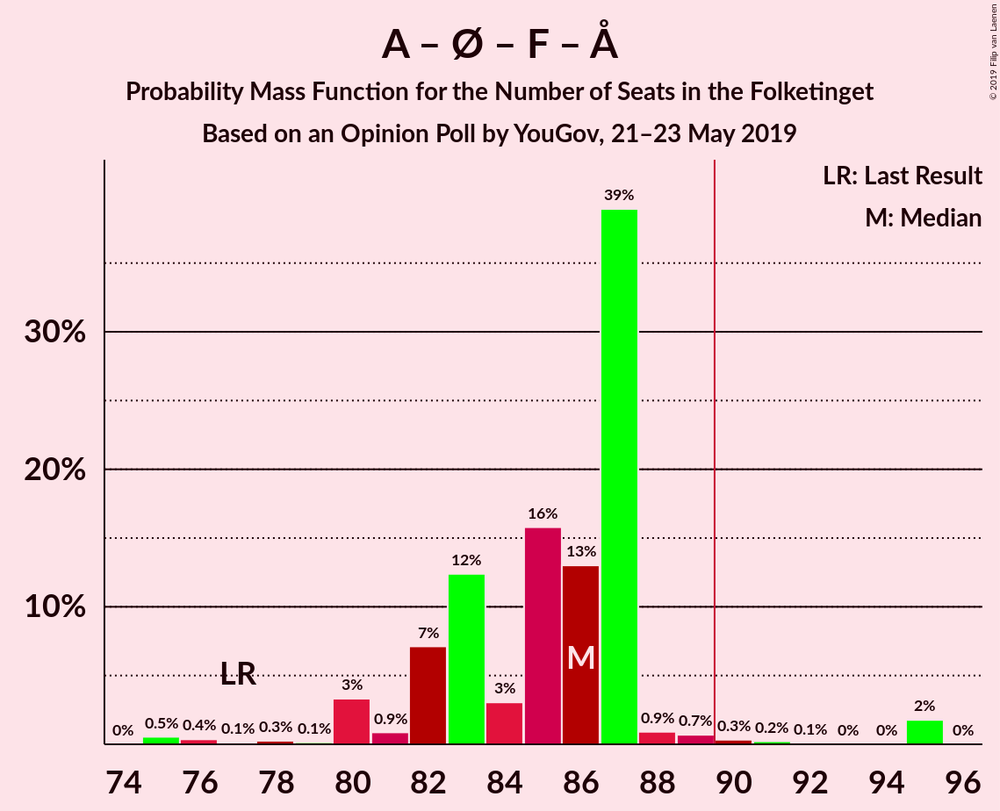
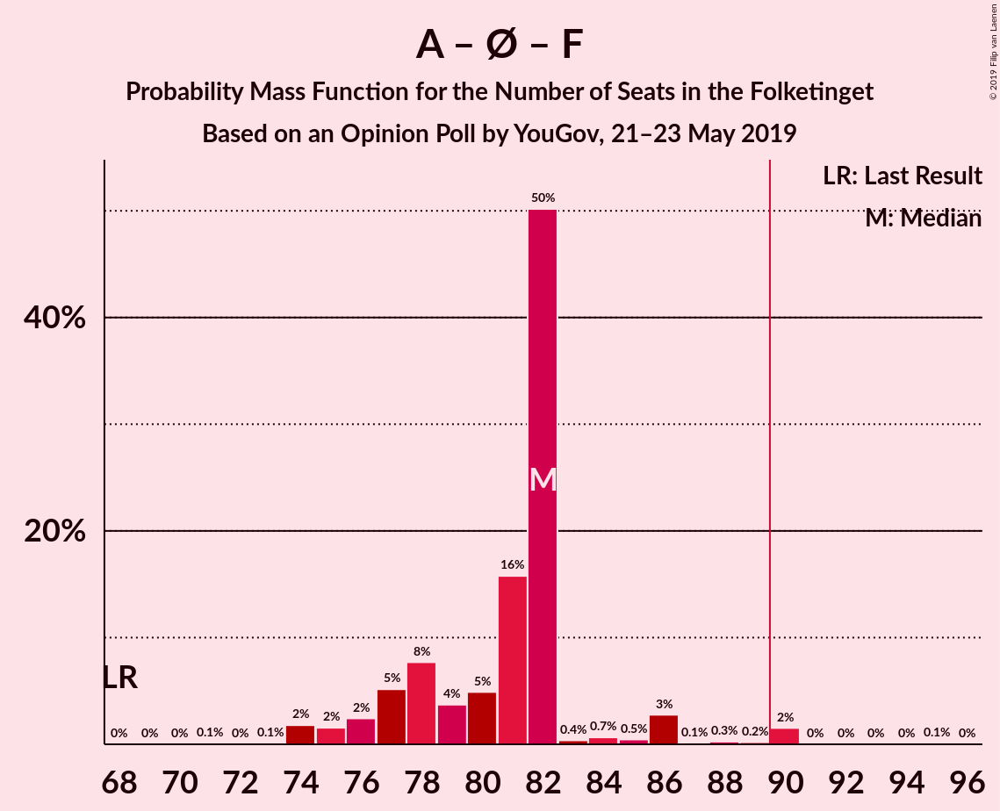
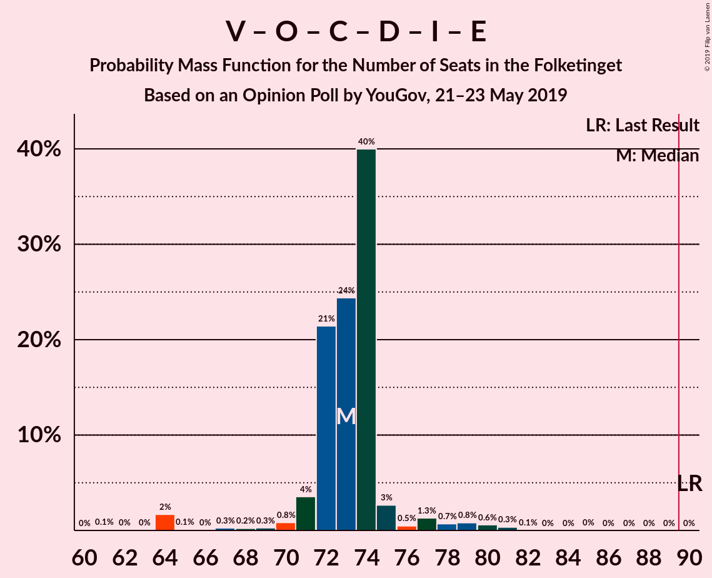
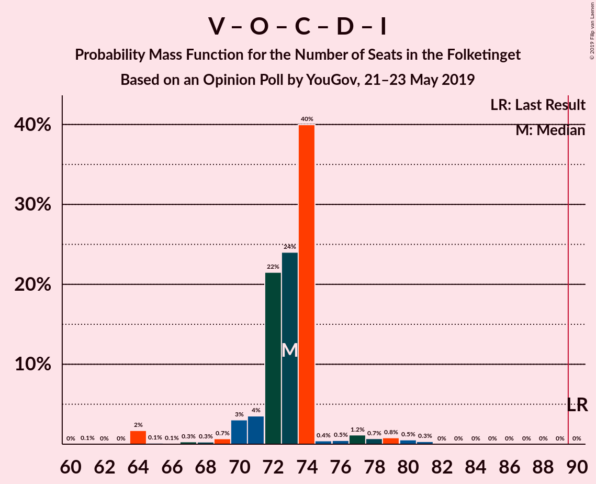
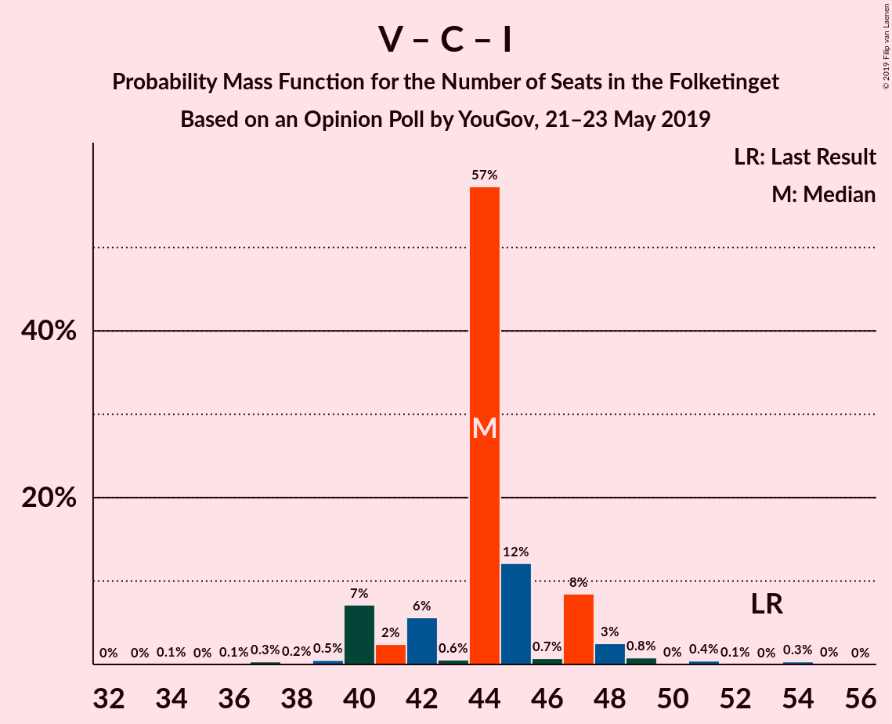

# Opinion Poll by YouGov, 21–23 May 2019

<a href="#voting-intentions">Voting Intentions</a> | <a href="#seats">Seats</a> | <a href="#coalitions">Coalitions</a> | <a href="#technical-information">Technical Information</a>

## Voting Intentions

### Confidence Intervals

| Party | Last Result | Poll Result | 80% Confidence Interval | 90% Confidence Interval | 95% Confidence Interval | 99% Confidence Interval |
|:-----:|:-----------:|:-----------:|:-----------------------:|:-----------------------:|:-----------------------:|:-----------------------:|
| Socialdemokraterne | 26.3% | 26.8% | 25.0–28.7% |24.6–29.2% |24.1–29.7% |23.3–30.6% |
| Venstre | 19.5% | 17.4% | 16.0–19.1% |15.5–19.5% |15.2–19.9% |14.5–20.7% |
| Dansk Folkeparti | 21.1% | 11.3% | 10.1–12.7% |9.8–13.1% |9.5–13.5% |8.9–14.2% |
| Enhedslisten–De Rød-Grønne | 7.8% | 9.4% | 8.3–10.7% |8.0–11.1% |7.7–11.4% |7.2–12.0% |
| Socialistisk Folkeparti | 4.2% | 8.8% | 7.7–10.0% |7.4–10.4% |7.1–10.7% |6.7–11.3% |
| Radikale Venstre | 4.6% | 6.2% | 5.3–7.3% |5.1–7.6% |4.9–7.9% |4.5–8.5% |
| Det Konservative Folkeparti | 3.4% | 5.0% | 4.2–6.0% |4.0–6.3% |3.8–6.6% |3.4–7.1% |
| Nye Borgerlige | 0.0% | 4.3% | 3.6–5.2% |3.4–5.5% |3.2–5.7% |2.9–6.2% |
| Stram Kurs | 0.0% | 3.2% | 2.5–4.0% |2.4–4.2% |2.2–4.5% |2.0–4.9% |
| Liberal Alliance | 7.5% | 2.7% | 2.1–3.4% |1.9–3.7% |1.8–3.9% |1.6–4.3% |
| Alternativet | 4.8% | 2.4% | 1.9–3.2% |1.8–3.4% |1.6–3.6% |1.4–4.0% |
| Kristendemokraterne | 0.8% | 1.2% | 0.9–1.8% |0.8–2.0% |0.7–2.1% |0.6–2.5% |
| Klaus Riskær Pedersen | 0.0% | 1.2% | 0.9–1.8% |0.8–2.0% |0.7–2.1% |0.6–2.5% |

*Note:* The poll result column reflects the actual value used in the calculations. Published results may vary slightly, and in addition be rounded to fewer digits.

## Seats

### Confidence Intervals

| Party | Last Result | Median | 80% Confidence Interval | 90% Confidence Interval | 95% Confidence Interval | 99% Confidence Interval |
|:-----:|:-----------:|:------:|:-----------------------:|:-----------------------:|:-----------------------:|:-----------------------:|
| <a href="#socialdemokraterne">Socialdemokraterne</a> | 47 | 46 | 44–47 |44–47 |44–50 |44–54 |
| <a href="#venstre">Venstre</a> | 34 | 29 | 28–34 |28–34 |28–34 |26–34 |
| <a href="#dansk-folkeparti">Dansk Folkeparti</a> | 37 | 22 | 17–24 |17–24 |17–24 |17–24 |
| <a href="#enhedslisten–de-rød-grønne">Enhedslisten–De Rød-Grønne</a> | 14 | 16 | 15–16 |12–18 |12–20 |12–21 |
| <a href="#socialistisk-folkeparti">Socialistisk Folkeparti</a> | 7 | 16 | 14–18 |14–18 |14–18 |11–21 |
| <a href="#radikale-venstre">Radikale Venstre</a> | 8 | 12 | 11–13 |11–13 |10–13 |8–14 |
| <a href="#det-konservative-folkeparti">Det Konservative Folkeparti</a> | 6 | 8 | 7–9 |7–10 |6–10 |6–15 |
| <a href="#nye-borgerlige">Nye Borgerlige</a> | 0 | 9 | 9 |9 |7–9 |6–9 |
| <a href="#stram-kurs">Stram Kurs</a> | 0 | 5 | 5–9 |5–9 |5–9 |5–9 |
| <a href="#liberal-alliance">Liberal Alliance</a> | 13 | 4 | 4–6 |4–6 |4–6 |0–6 |
| <a href="#alternativet">Alternativet</a> | 9 | 6 | 5–6 |5–6 |4–6 |0–6 |
| <a href="#kristendemokraterne">Kristendemokraterne</a> | 0 | 0 | 0–4 |0–4 |0–4 |0–4 |
| <a href="#klaus-riskær-pedersen">Klaus Riskær Pedersen</a> | 0 | 0 | 0 |0 |0 |0 |

### Socialdemokraterne

*For a full overview of the results for this party, see the [Socialdemokraterne](party-socialdemokraterne.html) page.*

| Number of Seats | Probability | Accumulated | Special Marks |
|:---------------:|:-----------:|:-----------:|:-------------:|
| 40 | 0.1% | 100% |  |
| 41 | 0.1% | 99.9% |  |
| 42 | 0.2% | 99.9% |  |
| 43 | 0.1% | 99.7% |  |
| 44 | 14% | 99.6% |  |
| 45 | 3% | 85% |  |
| 46 | 72% | 82% | Median |
| 47 | 6% | 11% | Last Result |
| 48 | 0.1% | 4% |  |
| 49 | 0.4% | 4% |  |
| 50 | 2% | 4% |  |
| 51 | 0.1% | 2% |  |
| 52 | 0.7% | 2% |  |
| 53 | 0.2% | 1.0% |  |
| 54 | 0.7% | 0.8% |  |
| 55 | 0% | 0.1% |  |
| 56 | 0% | 0.1% |  |
| 57 | 0% | 0.1% |  |
| 58 | 0.1% | 0.1% |  |
| 59 | 0% | 0% |  |

### Venstre

*For a full overview of the results for this party, see the [Venstre](party-venstre.html) page.*

| Number of Seats | Probability | Accumulated | Special Marks |
|:---------------:|:-----------:|:-----------:|:-------------:|
| 25 | 0.1% | 100% |  |
| 26 | 1.0% | 99.9% |  |
| 27 | 0% | 98.9% |  |
| 28 | 36% | 98.9% |  |
| 29 | 27% | 63% | Median |
| 30 | 0% | 36% |  |
| 31 | 11% | 36% |  |
| 32 | 8% | 25% |  |
| 33 | 2% | 17% |  |
| 34 | 15% | 15% | Last Result |
| 35 | 0.2% | 0.3% |  |
| 36 | 0% | 0.1% |  |
| 37 | 0% | 0.1% |  |
| 38 | 0% | 0.1% |  |
| 39 | 0% | 0.1% |  |
| 40 | 0% | 0.1% |  |
| 41 | 0.1% | 0.1% |  |
| 42 | 0% | 0% |  |

### Dansk Folkeparti

*For a full overview of the results for this party, see the [Dansk Folkeparti](party-danskfolkeparti.html) page.*

| Number of Seats | Probability | Accumulated | Special Marks |
|:---------------:|:-----------:|:-----------:|:-------------:|
| 17 | 15% | 100% |  |
| 18 | 0.8% | 85% |  |
| 19 | 2% | 84% |  |
| 20 | 19% | 82% |  |
| 21 | 3% | 63% |  |
| 22 | 25% | 61% | Median |
| 23 | 0% | 36% |  |
| 24 | 36% | 36% |  |
| 25 | 0% | 0% |  |
| 26 | 0% | 0% |  |
| 27 | 0% | 0% |  |
| 28 | 0% | 0% |  |
| 29 | 0% | 0% |  |
| 30 | 0% | 0% |  |
| 31 | 0% | 0% |  |
| 32 | 0% | 0% |  |
| 33 | 0% | 0% |  |
| 34 | 0% | 0% |  |
| 35 | 0% | 0% |  |
| 36 | 0% | 0% |  |
| 37 | 0% | 0% | Last Result |

### Enhedslisten–De Rød-Grønne

*For a full overview of the results for this party, see the [Enhedslisten–De Rød-Grønne](party-enhedslisten–derød-grønne.html) page.*

| Number of Seats | Probability | Accumulated | Special Marks |
|:---------------:|:-----------:|:-----------:|:-------------:|
| 12 | 6% | 100% |  |
| 13 | 0% | 94% |  |
| 14 | 0.9% | 94% | Last Result |
| 15 | 15% | 93% |  |
| 16 | 72% | 78% | Median |
| 17 | 0.2% | 5% |  |
| 18 | 1.3% | 5% |  |
| 19 | 1.2% | 4% |  |
| 20 | 0.3% | 3% |  |
| 21 | 2% | 2% |  |
| 22 | 0% | 0% |  |

### Socialistisk Folkeparti

*For a full overview of the results for this party, see the [Socialistisk Folkeparti](party-socialistiskfolkeparti.html) page.*

| Number of Seats | Probability | Accumulated | Special Marks |
|:---------------:|:-----------:|:-----------:|:-------------:|
| 7 | 0% | 100% | Last Result |
| 8 | 0% | 100% |  |
| 9 | 0% | 100% |  |
| 10 | 0% | 100% |  |
| 11 | 0.9% | 100% |  |
| 12 | 0% | 99.1% |  |
| 13 | 0.1% | 99.1% |  |
| 14 | 12% | 98.9% |  |
| 15 | 15% | 87% |  |
| 16 | 34% | 72% | Median |
| 17 | 0.3% | 38% |  |
| 18 | 37% | 38% |  |
| 19 | 0.1% | 1.2% |  |
| 20 | 0% | 1.1% |  |
| 21 | 0.9% | 1.1% |  |
| 22 | 0% | 0.2% |  |
| 23 | 0.2% | 0.2% |  |
| 24 | 0% | 0% |  |

### Radikale Venstre

*For a full overview of the results for this party, see the [Radikale Venstre](party-radikalevenstre.html) page.*

| Number of Seats | Probability | Accumulated | Special Marks |
|:---------------:|:-----------:|:-----------:|:-------------:|
| 8 | 2% | 100% | Last Result |
| 9 | 0.1% | 98% |  |
| 10 | 1.2% | 98% |  |
| 11 | 36% | 97% |  |
| 12 | 44% | 60% | Median |
| 13 | 15% | 16% |  |
| 14 | 0.9% | 1.0% |  |
| 15 | 0% | 0% |  |

### Det Konservative Folkeparti

*For a full overview of the results for this party, see the [Det Konservative Folkeparti](party-detkonservativefolkeparti.html) page.*

| Number of Seats | Probability | Accumulated | Special Marks |
|:---------------:|:-----------:|:-----------:|:-------------:|
| 6 | 3% | 100% | Last Result |
| 7 | 25% | 97% |  |
| 8 | 51% | 72% | Median |
| 9 | 12% | 21% |  |
| 10 | 8% | 9% |  |
| 11 | 0.1% | 1.1% |  |
| 12 | 0.1% | 1.0% |  |
| 13 | 0.1% | 0.9% |  |
| 14 | 0% | 0.9% |  |
| 15 | 0.8% | 0.8% |  |
| 16 | 0% | 0% |  |

### Nye Borgerlige

*For a full overview of the results for this party, see the [Nye Borgerlige](party-nyeborgerlige.html) page.*

| Number of Seats | Probability | Accumulated | Special Marks |
|:---------------:|:-----------:|:-----------:|:-------------:|
| 0 | 0% | 100% | Last Result |
| 1 | 0% | 100% |  |
| 2 | 0% | 100% |  |
| 3 | 0% | 100% |  |
| 4 | 0% | 100% |  |
| 5 | 0.1% | 100% |  |
| 6 | 2% | 99.9% |  |
| 7 | 3% | 98% |  |
| 8 | 0.1% | 95% |  |
| 9 | 95% | 95% | Median |
| 10 | 0% | 0.3% |  |
| 11 | 0.1% | 0.3% |  |
| 12 | 0.2% | 0.2% |  |
| 13 | 0% | 0% |  |

### Stram Kurs

*For a full overview of the results for this party, see the [Stram Kurs](party-stramkurs.html) page.*

| Number of Seats | Probability | Accumulated | Special Marks |
|:---------------:|:-----------:|:-----------:|:-------------:|
| 0 | 0.2% | 100% | Last Result |
| 1 | 0% | 99.8% |  |
| 2 | 0% | 99.8% |  |
| 3 | 0% | 99.8% |  |
| 4 | 0.1% | 99.8% |  |
| 5 | 55% | 99.7% | Median |
| 6 | 8% | 45% |  |
| 7 | 11% | 36% |  |
| 8 | 0.2% | 25% |  |
| 9 | 25% | 25% |  |
| 10 | 0% | 0% |  |

### Liberal Alliance

*For a full overview of the results for this party, see the [Liberal Alliance](party-liberalalliance.html) page.*

| Number of Seats | Probability | Accumulated | Special Marks |
|:---------------:|:-----------:|:-----------:|:-------------:|
| 0 | 1.4% | 100% |  |
| 1 | 0% | 98.6% |  |
| 2 | 0% | 98.6% |  |
| 3 | 0% | 98.6% |  |
| 4 | 61% | 98.6% | Median |
| 5 | 25% | 37% |  |
| 6 | 11% | 12% |  |
| 7 | 0.3% | 0.3% |  |
| 8 | 0% | 0% |  |
| 9 | 0% | 0% |  |
| 10 | 0% | 0% |  |
| 11 | 0% | 0% |  |
| 12 | 0% | 0% |  |
| 13 | 0% | 0% | Last Result |

### Alternativet

*For a full overview of the results for this party, see the [Alternativet](party-alternativet.html) page.*

| Number of Seats | Probability | Accumulated | Special Marks |
|:---------------:|:-----------:|:-----------:|:-------------:|
| 0 | 1.5% | 100% |  |
| 1 | 0% | 98.5% |  |
| 2 | 0% | 98.5% |  |
| 3 | 0.1% | 98.5% |  |
| 4 | 2% | 98% |  |
| 5 | 35% | 97% |  |
| 6 | 62% | 62% | Median |
| 7 | 0.2% | 0.4% |  |
| 8 | 0.1% | 0.2% |  |
| 9 | 0.1% | 0.1% | Last Result |
| 10 | 0% | 0% |  |

### Kristendemokraterne

*For a full overview of the results for this party, see the [Kristendemokraterne](party-kristendemokraterne.html) page.*

| Number of Seats | Probability | Accumulated | Special Marks |
|:---------------:|:-----------:|:-----------:|:-------------:|
| 0 | 85% | 100% | Last Result, Median |
| 1 | 0% | 15% |  |
| 2 | 0% | 15% |  |
| 3 | 0.7% | 15% |  |
| 4 | 14% | 15% |  |
| 5 | 0.2% | 0.2% |  |
| 6 | 0% | 0% |  |

### Klaus Riskær Pedersen

*For a full overview of the results for this party, see the [Klaus Riskær Pedersen](party-klausriskærpedersen.html) page.*

| Number of Seats | Probability | Accumulated | Special Marks |
|:---------------:|:-----------:|:-----------:|:-------------:|
| 0 | 99.7% | 100% | Last Result, Median |
| 1 | 0% | 0.3% |  |
| 2 | 0% | 0.3% |  |
| 3 | 0% | 0.3% |  |
| 4 | 0.3% | 0.3% |  |
| 5 | 0% | 0% |  |

## Coalitions

### Confidence Intervals

| Coalition | Last Result | Median | Majority? | 80% Confidence Interval | 90% Confidence Interval | 95% Confidence Interval | 99% Confidence Interval |
|:---------:|:-----------:|:------:|:---------:|:-----------------------:|:-----------------------:|:-----------------------:|:-----------------------:|
| Socialdemokraterne – Enhedslisten–De Rød-Grønne – Socialistisk Folkeparti – Radikale Venstre – Alternativet | 85 | 95 | 98.9% | 93–97 | 92–97 | 92–99 | 89–109 |
| Socialdemokraterne – Enhedslisten–De Rød-Grønne – Socialistisk Folkeparti – Radikale Venstre | 76 | 90 | 68% | 87–91 | 87–92 | 87–94 | 84–103 |
| Socialdemokraterne – Enhedslisten–De Rød-Grønne – Socialistisk Folkeparti – Alternativet | 77 | 83 | 2% | 80–86 | 80–87 | 80–88 | 78–95 |
| Socialdemokraterne – Enhedslisten–De Rød-Grønne – Socialistisk Folkeparti | 68 | 78 | 0.1% | 74–80 | 74–82 | 74–84 | 74–89 |
| Venstre – Dansk Folkeparti – Det Konservative Folkeparti – Nye Borgerlige – Stram Kurs – Liberal Alliance – Klaus Riskær Pedersen – Kristendemokraterne | 90 | 80 | 0% | 78–82 | 78–83 | 76–83 | 66–86 |
| Venstre – Dansk Folkeparti – Det Konservative Folkeparti – Nye Borgerlige – Liberal Alliance – Klaus Riskær Pedersen – Kristendemokraterne | 90 | 73 | 0% | 71–77 | 71–77 | 71–77 | 61–80 |
| Venstre – Dansk Folkeparti – Det Konservative Folkeparti – Nye Borgerlige – Liberal Alliance – Klaus Riskær Pedersen | 90 | 73 | 0% | 71–74 | 71–77 | 71–77 | 61–80 |
| Venstre – Dansk Folkeparti – Det Konservative Folkeparti – Nye Borgerlige – Liberal Alliance – Kristendemokraterne | 90 | 73 | 0% | 71–77 | 71–77 | 71–77 | 61–80 |
| Venstre – Dansk Folkeparti – Det Konservative Folkeparti – Nye Borgerlige – Liberal Alliance | 90 | 73 | 0% | 71–74 | 71–77 | 71–77 | 61–80 |
| Socialdemokraterne – Socialistisk Folkeparti – Radikale Venstre | 62 | 74 | 0% | 72–75 | 72–75 | 72–76 | 70–85 |
| Venstre – Dansk Folkeparti – Det Konservative Folkeparti – Liberal Alliance – Kristendemokraterne | 90 | 64 | 0% | 62–68 | 62–68 | 62–68 | 54–73 |
| Venstre – Dansk Folkeparti – Det Konservative Folkeparti – Liberal Alliance | 90 | 64 | 0% | 62–65 | 62–68 | 62–68 | 54–73 |
| Socialdemokraterne – Radikale Venstre | 55 | 57 | 0% | 57–58 | 57–59 | 57–62 | 55–65 |
| Venstre – Det Konservative Folkeparti – Liberal Alliance | 53 | 40 | 0% | 40–47 | 40–48 | 40–48 | 34–54 |
| Venstre – Det Konservative Folkeparti | 40 | 36 | 0% | 36–42 | 36–42 | 35–42 | 34–48 |
| Venstre | 34 | 29 | 0% | 28–34 | 28–34 | 28–34 | 26–34 |

### Socialdemokraterne – Enhedslisten–De Rød-Grønne – Socialistisk Folkeparti – Radikale Venstre – Alternativet

| Number of Seats | Probability | Accumulated | Special Marks |
|:---------------:|:-----------:|:-----------:|:-------------:|
| 85 | 0% | 100% | Last Result |
| 86 | 0.1% | 100% |  |
| 87 | 0% | 99.9% |  |
| 88 | 0.1% | 99.9% |  |
| 89 | 0.9% | 99.8% |  |
| 90 | 0% | 98.9% | Majority |
| 91 | 0.7% | 98.9% |  |
| 92 | 6% | 98% |  |
| 93 | 15% | 92% |  |
| 94 | 11% | 77% |  |
| 95 | 25% | 67% |  |
| 96 | 2% | 42% | Median |
| 97 | 36% | 40% |  |
| 98 | 0.3% | 4% |  |
| 99 | 2% | 4% |  |
| 100 | 0.2% | 2% |  |
| 101 | 0.2% | 1.4% |  |
| 102 | 0% | 1.3% |  |
| 103 | 0.2% | 1.3% |  |
| 104 | 0% | 1.1% |  |
| 105 | 0.1% | 1.1% |  |
| 106 | 0.1% | 1.0% |  |
| 107 | 0% | 0.9% |  |
| 108 | 0% | 0.9% |  |
| 109 | 0.9% | 0.9% |  |
| 110 | 0% | 0% |  |

### Socialdemokraterne – Enhedslisten–De Rød-Grønne – Socialistisk Folkeparti – Radikale Venstre

| Number of Seats | Probability | Accumulated | Special Marks |
|:---------------:|:-----------:|:-----------:|:-------------:|
| 76 | 0% | 100% | Last Result |
| 77 | 0% | 100% |  |
| 78 | 0% | 100% |  |
| 79 | 0% | 100% |  |
| 80 | 0% | 100% |  |
| 81 | 0% | 100% |  |
| 82 | 0.1% | 100% |  |
| 83 | 0.1% | 99.9% |  |
| 84 | 0.8% | 99.9% |  |
| 85 | 0.1% | 99.0% |  |
| 86 | 0.1% | 98.9% |  |
| 87 | 21% | 98.9% |  |
| 88 | 10% | 78% |  |
| 89 | 0.1% | 68% |  |
| 90 | 25% | 68% | Median, Majority |
| 91 | 36% | 43% |  |
| 92 | 1.2% | 6% |  |
| 93 | 0.2% | 5% |  |
| 94 | 3% | 5% |  |
| 95 | 0% | 2% |  |
| 96 | 0.6% | 2% |  |
| 97 | 0.3% | 1.4% |  |
| 98 | 0.2% | 1.1% |  |
| 99 | 0% | 1.0% |  |
| 100 | 0.1% | 1.0% |  |
| 101 | 0% | 0.9% |  |
| 102 | 0% | 0.9% |  |
| 103 | 0.9% | 0.9% |  |
| 104 | 0% | 0% |  |

### Socialdemokraterne – Enhedslisten–De Rød-Grønne – Socialistisk Folkeparti – Alternativet

| Number of Seats | Probability | Accumulated | Special Marks |
|:---------------:|:-----------:|:-----------:|:-------------:|
| 75 | 0.1% | 100% |  |
| 76 | 0% | 99.9% |  |
| 77 | 0% | 99.9% | Last Result |
| 78 | 0.8% | 99.9% |  |
| 79 | 0.9% | 99.0% |  |
| 80 | 21% | 98% |  |
| 81 | 0% | 77% |  |
| 82 | 11% | 77% |  |
| 83 | 25% | 67% |  |
| 84 | 0.1% | 42% | Median |
| 85 | 0.3% | 42% |  |
| 86 | 35% | 42% |  |
| 87 | 2% | 6% |  |
| 88 | 2% | 4% |  |
| 89 | 0% | 2% |  |
| 90 | 0.6% | 2% | Majority |
| 91 | 0.1% | 1.3% |  |
| 92 | 0% | 1.1% |  |
| 93 | 0% | 1.1% |  |
| 94 | 0% | 1.1% |  |
| 95 | 1.1% | 1.1% |  |
| 96 | 0% | 0% |  |

### Socialdemokraterne – Enhedslisten–De Rød-Grønne – Socialistisk Folkeparti

| Number of Seats | Probability | Accumulated | Special Marks |
|:---------------:|:-----------:|:-----------:|:-------------:|
| 68 | 0% | 100% | Last Result |
| 69 | 0% | 100% |  |
| 70 | 0% | 100% |  |
| 71 | 0% | 100% |  |
| 72 | 0.1% | 100% |  |
| 73 | 0% | 99.9% |  |
| 74 | 15% | 99.8% |  |
| 75 | 6% | 85% |  |
| 76 | 11% | 78% |  |
| 77 | 0% | 68% |  |
| 78 | 26% | 68% | Median |
| 79 | 0% | 42% |  |
| 80 | 36% | 42% |  |
| 81 | 0% | 6% |  |
| 82 | 2% | 6% |  |
| 83 | 0.1% | 4% |  |
| 84 | 1.3% | 4% |  |
| 85 | 0.3% | 2% |  |
| 86 | 0.3% | 2% |  |
| 87 | 0.2% | 2% |  |
| 88 | 0.6% | 2% |  |
| 89 | 0.9% | 1.0% |  |
| 90 | 0.1% | 0.1% | Majority |
| 91 | 0% | 0% |  |

### Venstre – Dansk Folkeparti – Det Konservative Folkeparti – Nye Borgerlige – Stram Kurs – Liberal Alliance – Klaus Riskær Pedersen – Kristendemokraterne

| Number of Seats | Probability | Accumulated | Special Marks |
|:---------------:|:-----------:|:-----------:|:-------------:|
| 66 | 0.9% | 100% |  |
| 67 | 0% | 99.1% |  |
| 68 | 0% | 99.1% |  |
| 69 | 0.1% | 99.1% |  |
| 70 | 0.1% | 99.0% |  |
| 71 | 0% | 98.9% |  |
| 72 | 0.2% | 98.9% |  |
| 73 | 0% | 98.7% |  |
| 74 | 0.2% | 98.7% |  |
| 75 | 0.2% | 98.6% |  |
| 76 | 2% | 98% |  |
| 77 | 0.3% | 96% | Median |
| 78 | 36% | 96% |  |
| 79 | 2% | 60% |  |
| 80 | 25% | 58% |  |
| 81 | 11% | 33% |  |
| 82 | 15% | 23% |  |
| 83 | 6% | 8% |  |
| 84 | 0.7% | 2% |  |
| 85 | 0% | 1.1% |  |
| 86 | 0.9% | 1.1% |  |
| 87 | 0.1% | 0.2% |  |
| 88 | 0% | 0.1% |  |
| 89 | 0.1% | 0.1% |  |
| 90 | 0% | 0% | Last Result, Majority |

### Venstre – Dansk Folkeparti – Det Konservative Folkeparti – Nye Borgerlige – Liberal Alliance – Klaus Riskær Pedersen – Kristendemokraterne

| Number of Seats | Probability | Accumulated | Special Marks |
|:---------------:|:-----------:|:-----------:|:-------------:|
| 61 | 0.9% | 100% |  |
| 62 | 0% | 99.1% |  |
| 63 | 0% | 99.1% |  |
| 64 | 0.2% | 99.1% |  |
| 65 | 0% | 98.9% |  |
| 66 | 0% | 98.9% |  |
| 67 | 0.1% | 98.9% |  |
| 68 | 0% | 98.8% |  |
| 69 | 0.3% | 98.8% |  |
| 70 | 0.2% | 98% |  |
| 71 | 27% | 98% |  |
| 72 | 0.2% | 71% | Median |
| 73 | 36% | 71% |  |
| 74 | 12% | 34% |  |
| 75 | 0% | 23% |  |
| 76 | 0.1% | 23% |  |
| 77 | 21% | 23% |  |
| 78 | 0.1% | 1.2% |  |
| 79 | 0% | 1.1% |  |
| 80 | 0.9% | 1.1% |  |
| 81 | 0.1% | 0.2% |  |
| 82 | 0% | 0.2% |  |
| 83 | 0.1% | 0.1% |  |
| 84 | 0.1% | 0.1% |  |
| 85 | 0% | 0% |  |
| 86 | 0% | 0% |  |
| 87 | 0% | 0% |  |
| 88 | 0% | 0% |  |
| 89 | 0% | 0% |  |
| 90 | 0% | 0% | Last Result, Majority |

### Venstre – Dansk Folkeparti – Det Konservative Folkeparti – Nye Borgerlige – Liberal Alliance – Klaus Riskær Pedersen

| Number of Seats | Probability | Accumulated | Special Marks |
|:---------------:|:-----------:|:-----------:|:-------------:|
| 61 | 0.9% | 100% |  |
| 62 | 0% | 99.1% |  |
| 63 | 0% | 99.1% |  |
| 64 | 0.2% | 99.1% |  |
| 65 | 0.1% | 98.9% |  |
| 66 | 0% | 98.7% |  |
| 67 | 0.1% | 98.7% |  |
| 68 | 0% | 98.7% |  |
| 69 | 0.3% | 98.7% |  |
| 70 | 0% | 98% |  |
| 71 | 27% | 98% |  |
| 72 | 0.2% | 71% | Median |
| 73 | 51% | 71% |  |
| 74 | 12% | 20% |  |
| 75 | 0% | 7% |  |
| 76 | 0.1% | 7% |  |
| 77 | 6% | 7% |  |
| 78 | 0.1% | 1.2% |  |
| 79 | 0.1% | 1.1% |  |
| 80 | 0.9% | 1.0% |  |
| 81 | 0.1% | 0.2% |  |
| 82 | 0% | 0.1% |  |
| 83 | 0.1% | 0.1% |  |
| 84 | 0% | 0% |  |
| 85 | 0% | 0% |  |
| 86 | 0% | 0% |  |
| 87 | 0% | 0% |  |
| 88 | 0% | 0% |  |
| 89 | 0% | 0% |  |
| 90 | 0% | 0% | Last Result, Majority |

### Venstre – Dansk Folkeparti – Det Konservative Folkeparti – Nye Borgerlige – Liberal Alliance – Kristendemokraterne

| Number of Seats | Probability | Accumulated | Special Marks |
|:---------------:|:-----------:|:-----------:|:-------------:|
| 61 | 0.9% | 100% |  |
| 62 | 0% | 99.1% |  |
| 63 | 0% | 99.1% |  |
| 64 | 0.2% | 99.1% |  |
| 65 | 0% | 98.9% |  |
| 66 | 0% | 98.9% |  |
| 67 | 0.1% | 98.9% |  |
| 68 | 0% | 98.8% |  |
| 69 | 0.5% | 98.8% |  |
| 70 | 0.2% | 98% |  |
| 71 | 27% | 98% |  |
| 72 | 0.2% | 71% | Median |
| 73 | 36% | 71% |  |
| 74 | 12% | 34% |  |
| 75 | 0% | 23% |  |
| 76 | 0.1% | 23% |  |
| 77 | 21% | 23% |  |
| 78 | 0.1% | 1.1% |  |
| 79 | 0% | 1.0% |  |
| 80 | 0.9% | 1.0% |  |
| 81 | 0% | 0.2% |  |
| 82 | 0% | 0.2% |  |
| 83 | 0.1% | 0.1% |  |
| 84 | 0.1% | 0.1% |  |
| 85 | 0% | 0% |  |
| 86 | 0% | 0% |  |
| 87 | 0% | 0% |  |
| 88 | 0% | 0% |  |
| 89 | 0% | 0% |  |
| 90 | 0% | 0% | Last Result, Majority |

### Venstre – Dansk Folkeparti – Det Konservative Folkeparti – Nye Borgerlige – Liberal Alliance

| Number of Seats | Probability | Accumulated | Special Marks |
|:---------------:|:-----------:|:-----------:|:-------------:|
| 61 | 0.9% | 100% |  |
| 62 | 0% | 99.1% |  |
| 63 | 0% | 99.1% |  |
| 64 | 0.2% | 99.1% |  |
| 65 | 0.1% | 98.9% |  |
| 66 | 0% | 98.7% |  |
| 67 | 0.1% | 98.7% |  |
| 68 | 0% | 98.7% |  |
| 69 | 0.5% | 98.7% |  |
| 70 | 0% | 98% |  |
| 71 | 27% | 98% |  |
| 72 | 0.2% | 71% | Median |
| 73 | 51% | 71% |  |
| 74 | 12% | 20% |  |
| 75 | 0% | 7% |  |
| 76 | 0.1% | 7% |  |
| 77 | 6% | 7% |  |
| 78 | 0.1% | 1.1% |  |
| 79 | 0.1% | 1.0% |  |
| 80 | 0.9% | 1.0% |  |
| 81 | 0% | 0.1% |  |
| 82 | 0% | 0.1% |  |
| 83 | 0.1% | 0.1% |  |
| 84 | 0% | 0% |  |
| 85 | 0% | 0% |  |
| 86 | 0% | 0% |  |
| 87 | 0% | 0% |  |
| 88 | 0% | 0% |  |
| 89 | 0% | 0% |  |
| 90 | 0% | 0% | Last Result, Majority |

### Socialdemokraterne – Socialistisk Folkeparti – Radikale Venstre

| Number of Seats | Probability | Accumulated | Special Marks |
|:---------------:|:-----------:|:-----------:|:-------------:|
| 62 | 0% | 100% | Last Result |
| 63 | 0% | 100% |  |
| 64 | 0% | 100% |  |
| 65 | 0% | 100% |  |
| 66 | 0.1% | 100% |  |
| 67 | 0.1% | 99.9% |  |
| 68 | 0.1% | 99.9% |  |
| 69 | 0% | 99.8% |  |
| 70 | 0.9% | 99.7% |  |
| 71 | 0.3% | 98.8% |  |
| 72 | 25% | 98% |  |
| 73 | 2% | 73% |  |
| 74 | 25% | 71% | Median |
| 75 | 42% | 46% |  |
| 76 | 2% | 4% |  |
| 77 | 0.6% | 2% |  |
| 78 | 0.1% | 2% |  |
| 79 | 0.4% | 2% |  |
| 80 | 0.1% | 1.2% |  |
| 81 | 0.1% | 1.0% |  |
| 82 | 0% | 0.9% |  |
| 83 | 0% | 0.9% |  |
| 84 | 0% | 0.9% |  |
| 85 | 0.9% | 0.9% |  |
| 86 | 0% | 0% |  |

### Venstre – Dansk Folkeparti – Det Konservative Folkeparti – Liberal Alliance – Kristendemokraterne

| Number of Seats | Probability | Accumulated | Special Marks |
|:---------------:|:-----------:|:-----------:|:-------------:|
| 54 | 0.9% | 100% |  |
| 55 | 0% | 99.1% |  |
| 56 | 0% | 99.1% |  |
| 57 | 0.1% | 99.1% |  |
| 58 | 0.2% | 99.0% |  |
| 59 | 0% | 98.8% |  |
| 60 | 0.2% | 98.8% |  |
| 61 | 0.2% | 98.7% |  |
| 62 | 27% | 98% |  |
| 63 | 0.2% | 71% | Median |
| 64 | 36% | 71% |  |
| 65 | 11% | 35% |  |
| 66 | 0.7% | 25% |  |
| 67 | 0% | 24% |  |
| 68 | 23% | 24% |  |
| 69 | 0% | 1.2% |  |
| 70 | 0.1% | 1.2% |  |
| 71 | 0% | 1.1% |  |
| 72 | 0% | 1.0% |  |
| 73 | 0.8% | 1.0% |  |
| 74 | 0.1% | 0.2% |  |
| 75 | 0% | 0.1% |  |
| 76 | 0% | 0.1% |  |
| 77 | 0% | 0.1% |  |
| 78 | 0% | 0.1% |  |
| 79 | 0.1% | 0.1% |  |
| 80 | 0% | 0% |  |
| 81 | 0% | 0% |  |
| 82 | 0% | 0% |  |
| 83 | 0% | 0% |  |
| 84 | 0% | 0% |  |
| 85 | 0% | 0% |  |
| 86 | 0% | 0% |  |
| 87 | 0% | 0% |  |
| 88 | 0% | 0% |  |
| 89 | 0% | 0% |  |
| 90 | 0% | 0% | Last Result, Majority |

### Venstre – Dansk Folkeparti – Det Konservative Folkeparti – Liberal Alliance

| Number of Seats | Probability | Accumulated | Special Marks |
|:---------------:|:-----------:|:-----------:|:-------------:|
| 54 | 0.9% | 100% |  |
| 55 | 0% | 99.1% |  |
| 56 | 0% | 99.1% |  |
| 57 | 0.1% | 99.1% |  |
| 58 | 0.2% | 99.0% |  |
| 59 | 0.1% | 98.8% |  |
| 60 | 0.2% | 98.7% |  |
| 61 | 0.2% | 98.5% |  |
| 62 | 27% | 98% |  |
| 63 | 0.2% | 71% | Median |
| 64 | 50% | 71% |  |
| 65 | 11% | 21% |  |
| 66 | 0.7% | 9% |  |
| 67 | 0% | 9% |  |
| 68 | 7% | 9% |  |
| 69 | 0% | 1.2% |  |
| 70 | 0.1% | 1.1% |  |
| 71 | 0% | 1.1% |  |
| 72 | 0% | 1.0% |  |
| 73 | 0.8% | 1.0% |  |
| 74 | 0.1% | 0.2% |  |
| 75 | 0% | 0% |  |
| 76 | 0% | 0% |  |
| 77 | 0% | 0% |  |
| 78 | 0% | 0% |  |
| 79 | 0% | 0% |  |
| 80 | 0% | 0% |  |
| 81 | 0% | 0% |  |
| 82 | 0% | 0% |  |
| 83 | 0% | 0% |  |
| 84 | 0% | 0% |  |
| 85 | 0% | 0% |  |
| 86 | 0% | 0% |  |
| 87 | 0% | 0% |  |
| 88 | 0% | 0% |  |
| 89 | 0% | 0% |  |
| 90 | 0% | 0% | Last Result, Majority |

### Socialdemokraterne – Radikale Venstre

| Number of Seats | Probability | Accumulated | Special Marks |
|:---------------:|:-----------:|:-----------:|:-------------:|
| 51 | 0.1% | 100% |  |
| 52 | 0.1% | 99.9% |  |
| 53 | 0.1% | 99.8% |  |
| 54 | 0.1% | 99.7% |  |
| 55 | 0.2% | 99.7% | Last Result |
| 56 | 1.0% | 99.4% |  |
| 57 | 52% | 98% |  |
| 58 | 37% | 46% | Median |
| 59 | 6% | 9% |  |
| 60 | 0.2% | 3% |  |
| 61 | 0% | 3% |  |
| 62 | 0.8% | 3% |  |
| 63 | 0.1% | 2% |  |
| 64 | 0.9% | 2% |  |
| 65 | 0.7% | 0.9% |  |
| 66 | 0.1% | 0.2% |  |
| 67 | 0% | 0.1% |  |
| 68 | 0.1% | 0.1% |  |
| 69 | 0% | 0% |  |

### Venstre – Det Konservative Folkeparti – Liberal Alliance

| Number of Seats | Probability | Accumulated | Special Marks |
|:---------------:|:-----------:|:-----------:|:-------------:|
| 34 | 0.9% | 100% |  |
| 35 | 0% | 99.1% |  |
| 36 | 0% | 99.1% |  |
| 37 | 0% | 99.1% |  |
| 38 | 0.2% | 99.1% |  |
| 39 | 0.3% | 98.9% |  |
| 40 | 60% | 98.7% |  |
| 41 | 3% | 38% | Median |
| 42 | 0% | 36% |  |
| 43 | 0.2% | 36% |  |
| 44 | 0.2% | 35% |  |
| 45 | 11% | 35% |  |
| 46 | 0.9% | 25% |  |
| 47 | 14% | 24% |  |
| 48 | 8% | 9% |  |
| 49 | 0.1% | 1.2% |  |
| 50 | 0.1% | 1.1% |  |
| 51 | 0% | 1.0% |  |
| 52 | 0% | 1.0% |  |
| 53 | 0.1% | 1.0% | Last Result |
| 54 | 0.8% | 0.9% |  |
| 55 | 0% | 0.1% |  |
| 56 | 0.1% | 0.1% |  |
| 57 | 0% | 0% |  |

### Venstre – Det Konservative Folkeparti

| Number of Seats | Probability | Accumulated | Special Marks |
|:---------------:|:-----------:|:-----------:|:-------------:|
| 34 | 1.1% | 100% |  |
| 35 | 3% | 98.9% |  |
| 36 | 60% | 96% |  |
| 37 | 0.3% | 36% | Median |
| 38 | 0.2% | 36% |  |
| 39 | 0.2% | 36% |  |
| 40 | 11% | 35% | Last Result |
| 41 | 0.2% | 25% |  |
| 42 | 23% | 25% |  |
| 43 | 0% | 1.2% |  |
| 44 | 0.1% | 1.2% |  |
| 45 | 0.1% | 1.1% |  |
| 46 | 0% | 1.0% |  |
| 47 | 0% | 1.0% |  |
| 48 | 0.9% | 1.0% |  |
| 49 | 0% | 0.1% |  |
| 50 | 0.1% | 0.1% |  |
| 51 | 0% | 0% |  |

### Venstre

| Number of Seats | Probability | Accumulated | Special Marks |
|:---------------:|:-----------:|:-----------:|:-------------:|
| 25 | 0.1% | 100% |  |
| 26 | 1.0% | 99.9% |  |
| 27 | 0% | 98.9% |  |
| 28 | 36% | 98.9% |  |
| 29 | 27% | 63% | Median |
| 30 | 0% | 36% |  |
| 31 | 11% | 36% |  |
| 32 | 8% | 25% |  |
| 33 | 2% | 17% |  |
| 34 | 15% | 15% | Last Result |
| 35 | 0.2% | 0.3% |  |
| 36 | 0% | 0.1% |  |
| 37 | 0% | 0.1% |  |
| 38 | 0% | 0.1% |  |
| 39 | 0% | 0.1% |  |
| 40 | 0% | 0.1% |  |
| 41 | 0.1% | 0.1% |  |
| 42 | 0% | 0% |  |

## Technical Information

### Opinion Poll

+ **Polling firm:** YouGov
+ **Commissioner(s):** —
+ **Fieldwork period:** 21–23 May 2019

### Calculations

+ **Sample size:** 981
+ **Simulations done:** 131,072
+ **Error estimate:** 2.19%

