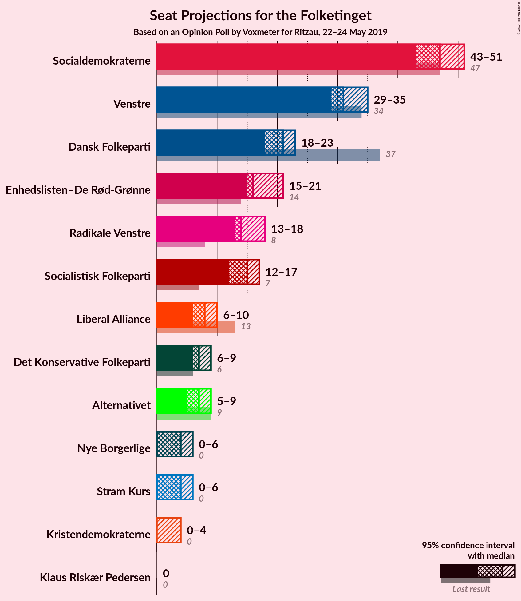
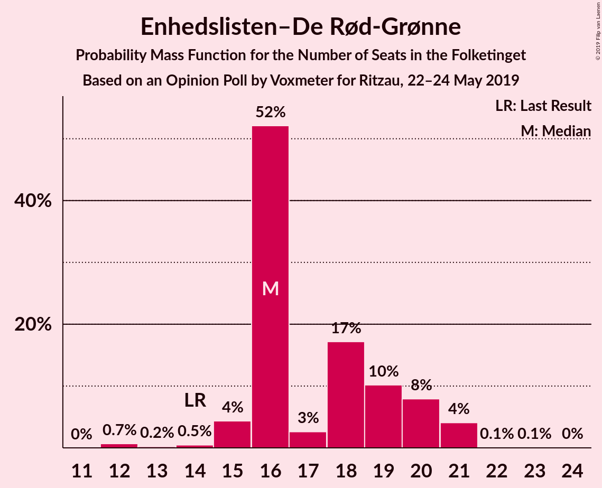
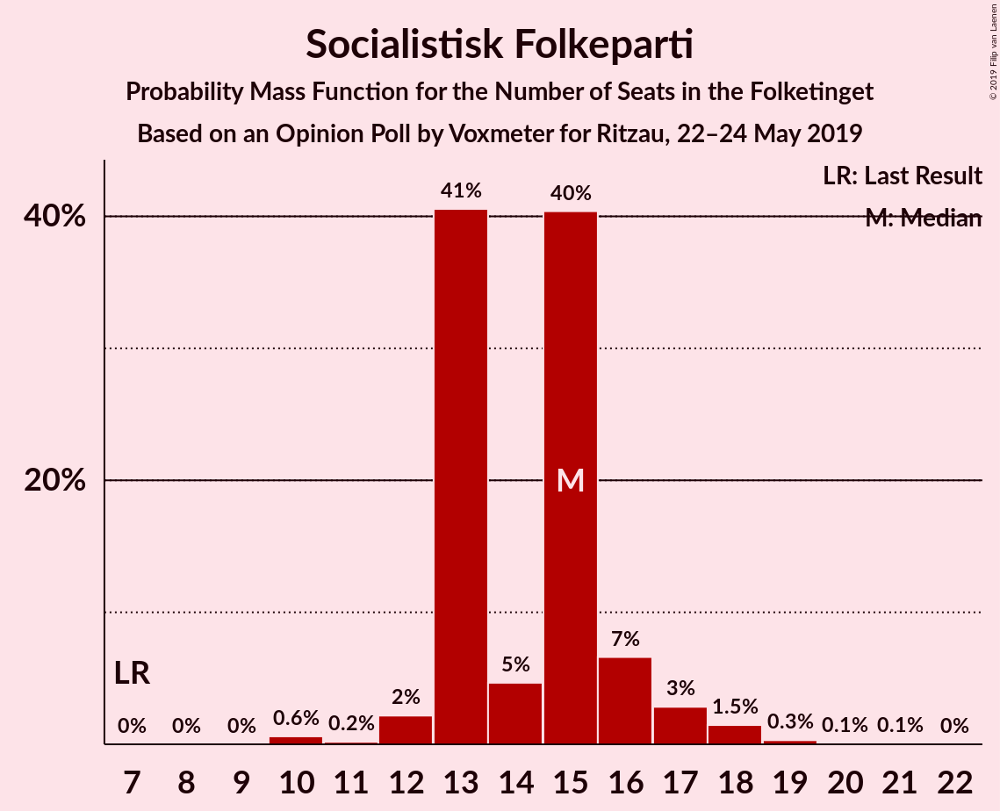
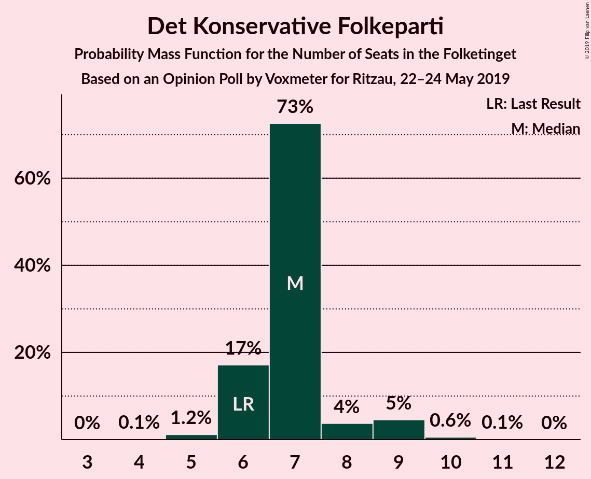
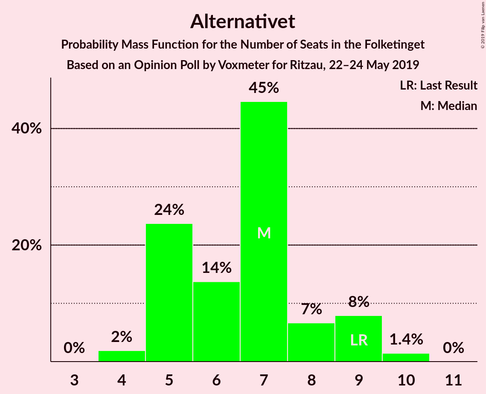
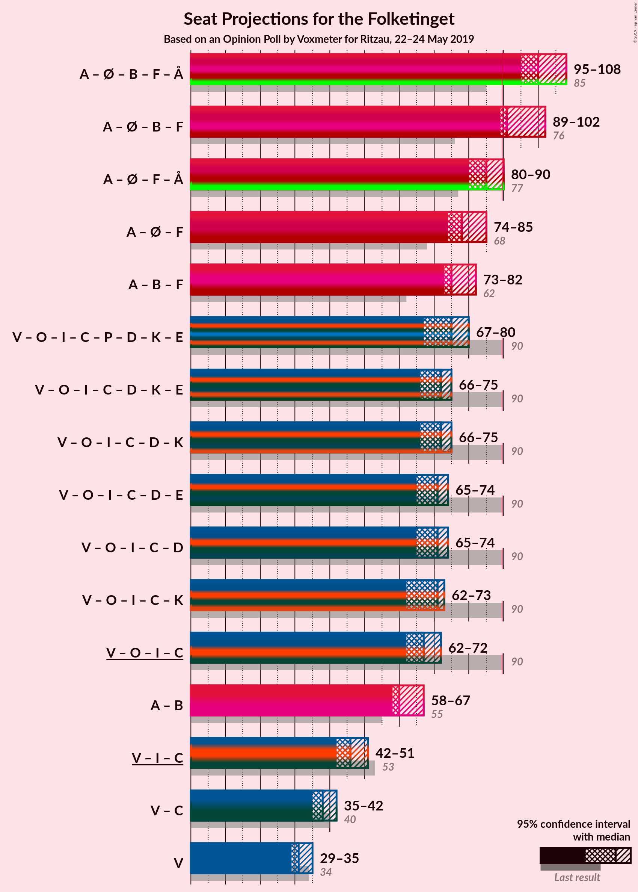
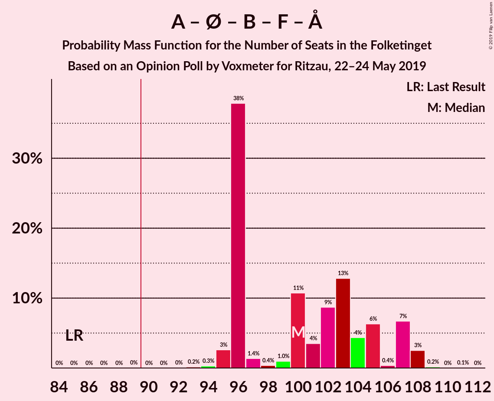
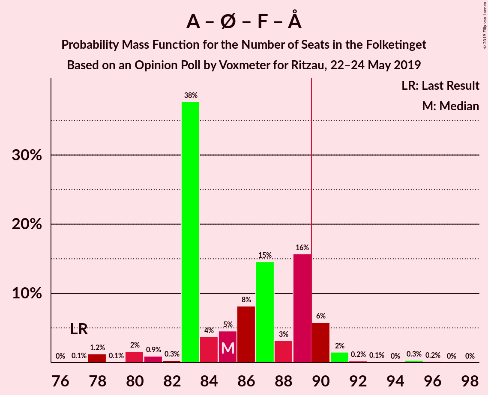
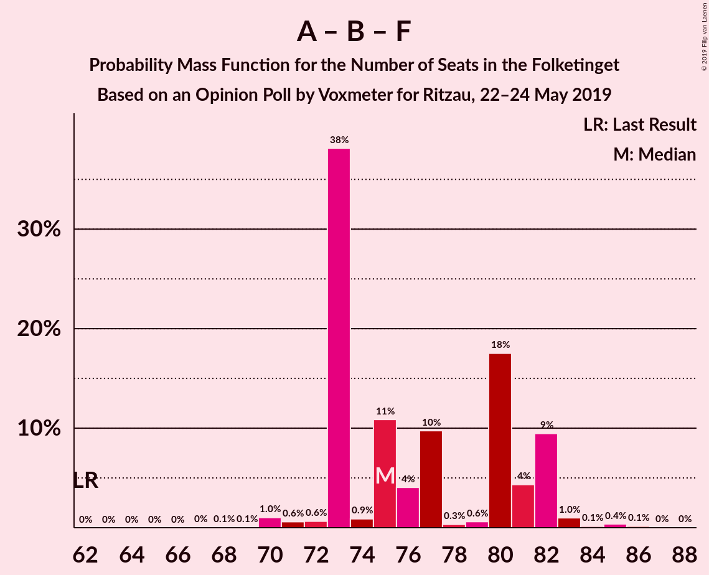
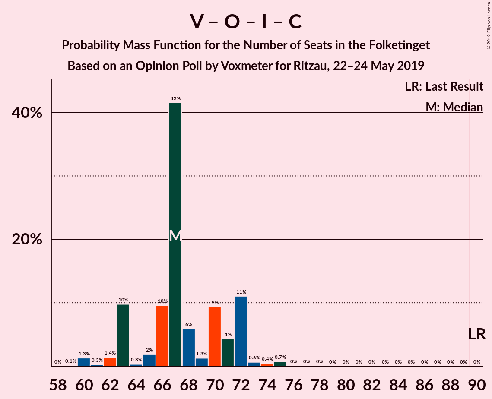

# Opinion Poll by Voxmeter for Ritzau, 22–24 May 2019

<a href="#voting-intentions">Voting Intentions</a> | <a href="#seats">Seats</a> | <a href="#coalitions">Coalitions</a> | <a href="#technical-information">Technical Information</a>

## Voting Intentions

### Confidence Intervals

| Party | Last Result | Poll Result | 80% Confidence Interval | 90% Confidence Interval | 95% Confidence Interval | 99% Confidence Interval |
|:-----:|:-----------:|:-----------:|:-----------------------:|:-----------------------:|:-----------------------:|:-----------------------:|
| Socialdemokraterne | 26.3% | 26.5% | 24.8–28.4% |24.3–28.9% |23.9–29.4% |23.1–30.3% |
| Venstre | 19.5% | 17.5% | 16.0–19.1% |15.6–19.6% |15.3–20.0% |14.6–20.8% |
| Dansk Folkeparti | 21.1% | 11.7% | 10.5–13.1% |10.2–13.5% |9.9–13.9% |9.3–14.6% |
| Enhedslisten–De Rød-Grønne | 7.8% | 9.4% | 8.4–10.7% |8.0–11.1% |7.8–11.4% |7.3–12.1% |
| Radikale Venstre | 4.6% | 8.5% | 7.5–9.8% |7.2–10.1% |7.0–10.4% |6.5–11.1% |
| Socialistisk Folkeparti | 4.2% | 8.2% | 7.1–9.4% |6.9–9.7% |6.6–10.0% |6.2–10.6% |
| Liberal Alliance | 7.5% | 4.2% | 3.5–5.1% |3.3–5.4% |3.1–5.6% |2.8–6.1% |
| Det Konservative Folkeparti | 3.4% | 3.9% | 3.2–4.8% |3.0–5.0% |2.9–5.3% |2.5–5.7% |
| Alternativet | 4.8% | 3.4% | 2.7–4.2% |2.6–4.5% |2.4–4.7% |2.1–5.1% |
| Stram Kurs | 0.0% | 2.1% | 1.6–2.8% |1.5–3.0% |1.4–3.2% |1.2–3.6% |
| Nye Borgerlige | 0.0% | 2.0% | 1.5–2.7% |1.4–2.9% |1.3–3.1% |1.1–3.4% |
| Kristendemokraterne | 0.8% | 1.5% | 1.1–2.1% |1.0–2.3% |0.9–2.5% |0.7–2.8% |
| Klaus Riskær Pedersen | 0.0% | 0.6% | 0.4–1.1% |0.3–1.2% |0.3–1.3% |0.2–1.6% |

*Note:* The poll result column reflects the actual value used in the calculations. Published results may vary slightly, and in addition be rounded to fewer digits.

## Seats

### Confidence Intervals

| Party | Last Result | Median | 80% Confidence Interval | 90% Confidence Interval | 95% Confidence Interval | 99% Confidence Interval |
|:-----:|:-----------:|:------:|:-----------------------:|:-----------------------:|:-----------------------:|:-----------------------:|
| <a href="#socialdemokraterne">Socialdemokraterne</a> | 47 | 51 | 46–51 |44–51 |43–52 |41–52 |
| <a href="#venstre">Venstre</a> | 34 | 32 | 30–34 |30–34 |30–34 |30–34 |
| <a href="#dansk-folkeparti">Dansk Folkeparti</a> | 37 | 23 | 20–23 |20–23 |20–23 |16–24 |
| <a href="#enhedslisten–de-rød-grønne">Enhedslisten–De Rød-Grønne</a> | 14 | 18 | 16–18 |15–18 |15–19 |14–19 |
| <a href="#radikale-venstre">Radikale Venstre</a> | 8 | 14 | 14–18 |13–18 |13–19 |12–19 |
| <a href="#socialistisk-folkeparti">Socialistisk Folkeparti</a> | 7 | 15 | 15–17 |13–18 |12–18 |12–18 |
| <a href="#liberal-alliance">Liberal Alliance</a> | 13 | 10 | 8–10 |7–10 |7–10 |5–10 |
| <a href="#det-konservative-folkeparti">Det Konservative Folkeparti</a> | 6 | 7 | 6–7 |6–9 |6–9 |6–9 |
| <a href="#alternativet">Alternativet</a> | 9 | 5 | 5–8 |5–8 |4–8 |4–9 |
| <a href="#stram-kurs">Stram Kurs</a> | 0 | 0 | 0–4 |0–5 |0–5 |0–6 |
| <a href="#nye-borgerlige">Nye Borgerlige</a> | 0 | 0 | 0–4 |0–4 |0–5 |0–6 |
| <a href="#kristendemokraterne">Kristendemokraterne</a> | 0 | 0 | 0 |0–4 |0–4 |0–4 |
| <a href="#klaus-riskær-pedersen">Klaus Riskær Pedersen</a> | 0 | 0 | 0 |0 |0 |0 |

### Socialdemokraterne

*For a full overview of the results for this party, see the [Socialdemokraterne](party-socialdemokraterne.html) page.*

| Number of Seats | Probability | Accumulated | Special Marks |
|:---------------:|:-----------:|:-----------:|:-------------:|
| 41 | 2% | 100% |  |
| 42 | 0.1% | 98% |  |
| 43 | 0.6% | 98% |  |
| 44 | 3% | 97% |  |
| 45 | 0% | 94% |  |
| 46 | 5% | 94% |  |
| 47 | 11% | 89% | Last Result |
| 48 | 0.1% | 79% |  |
| 49 | 15% | 79% |  |
| 50 | 6% | 64% |  |
| 51 | 53% | 58% | Median |
| 52 | 5% | 5% |  |
| 53 | 0% | 0.1% |  |
| 54 | 0% | 0% |  |

### Venstre

*For a full overview of the results for this party, see the [Venstre](party-venstre.html) page.*

| Number of Seats | Probability | Accumulated | Special Marks |
|:---------------:|:-----------:|:-----------:|:-------------:|
| 27 | 0.1% | 100% |  |
| 28 | 0.2% | 99.9% |  |
| 29 | 0% | 99.7% |  |
| 30 | 11% | 99.7% |  |
| 31 | 4% | 89% |  |
| 32 | 69% | 85% | Median |
| 33 | 0.9% | 16% |  |
| 34 | 15% | 15% | Last Result |
| 35 | 0% | 0.2% |  |
| 36 | 0.1% | 0.2% |  |
| 37 | 0% | 0% |  |

### Dansk Folkeparti

*For a full overview of the results for this party, see the [Dansk Folkeparti](party-danskfolkeparti.html) page.*

| Number of Seats | Probability | Accumulated | Special Marks |
|:---------------:|:-----------:|:-----------:|:-------------:|
| 16 | 0.7% | 100% |  |
| 17 | 0% | 99.3% |  |
| 18 | 0.2% | 99.2% |  |
| 19 | 0.1% | 99.0% |  |
| 20 | 18% | 98.9% |  |
| 21 | 11% | 80% |  |
| 22 | 0.1% | 69% |  |
| 23 | 68% | 69% | Median |
| 24 | 0.2% | 0.6% |  |
| 25 | 0.3% | 0.4% |  |
| 26 | 0% | 0.1% |  |
| 27 | 0% | 0% |  |
| 28 | 0% | 0% |  |
| 29 | 0% | 0% |  |
| 30 | 0% | 0% |  |
| 31 | 0% | 0% |  |
| 32 | 0% | 0% |  |
| 33 | 0% | 0% |  |
| 34 | 0% | 0% |  |
| 35 | 0% | 0% |  |
| 36 | 0% | 0% |  |
| 37 | 0% | 0% | Last Result |

### Enhedslisten–De Rød-Grønne

*For a full overview of the results for this party, see the [Enhedslisten–De Rød-Grønne](party-enhedslisten–derød-grønne.html) page.*

| Number of Seats | Probability | Accumulated | Special Marks |
|:---------------:|:-----------:|:-----------:|:-------------:|
| 13 | 0.5% | 100% |  |
| 14 | 0.1% | 99.5% | Last Result |
| 15 | 9% | 99.4% |  |
| 16 | 26% | 90% |  |
| 17 | 3% | 64% |  |
| 18 | 58% | 62% | Median |
| 19 | 4% | 4% |  |
| 20 | 0.4% | 0.4% |  |
| 21 | 0% | 0% |  |

### Radikale Venstre

*For a full overview of the results for this party, see the [Radikale Venstre](party-radikalevenstre.html) page.*

| Number of Seats | Probability | Accumulated | Special Marks |
|:---------------:|:-----------:|:-----------:|:-------------:|
| 8 | 0% | 100% | Last Result |
| 9 | 0% | 100% |  |
| 10 | 0.4% | 100% |  |
| 11 | 0% | 99.6% |  |
| 12 | 0.2% | 99.6% |  |
| 13 | 6% | 99.4% |  |
| 14 | 60% | 93% | Median |
| 15 | 3% | 34% |  |
| 16 | 15% | 31% |  |
| 17 | 0.1% | 16% |  |
| 18 | 11% | 16% |  |
| 19 | 4% | 4% |  |
| 20 | 0% | 0% |  |

### Socialistisk Folkeparti

*For a full overview of the results for this party, see the [Socialistisk Folkeparti](party-socialistiskfolkeparti.html) page.*

| Number of Seats | Probability | Accumulated | Special Marks |
|:---------------:|:-----------:|:-----------:|:-------------:|
| 7 | 0% | 100% | Last Result |
| 8 | 0% | 100% |  |
| 9 | 0% | 100% |  |
| 10 | 0.5% | 100% |  |
| 11 | 0% | 99.5% |  |
| 12 | 4% | 99.5% |  |
| 13 | 1.0% | 95% |  |
| 14 | 0.4% | 94% |  |
| 15 | 70% | 94% | Median |
| 16 | 14% | 24% |  |
| 17 | 4% | 10% |  |
| 18 | 6% | 6% |  |
| 19 | 0% | 0.2% |  |
| 20 | 0.2% | 0.2% |  |
| 21 | 0% | 0% |  |

### Liberal Alliance

*For a full overview of the results for this party, see the [Liberal Alliance](party-liberalalliance.html) page.*

| Number of Seats | Probability | Accumulated | Special Marks |
|:---------------:|:-----------:|:-----------:|:-------------:|
| 5 | 0.6% | 100% |  |
| 6 | 0.7% | 99.4% |  |
| 7 | 9% | 98.6% |  |
| 8 | 17% | 90% |  |
| 9 | 0.1% | 73% |  |
| 10 | 73% | 73% | Median |
| 11 | 0% | 0% |  |
| 12 | 0% | 0% |  |
| 13 | 0% | 0% | Last Result |

### Det Konservative Folkeparti

*For a full overview of the results for this party, see the [Det Konservative Folkeparti](party-detkonservativefolkeparti.html) page.*

| Number of Seats | Probability | Accumulated | Special Marks |
|:---------------:|:-----------:|:-----------:|:-------------:|
| 4 | 0.1% | 100% |  |
| 5 | 0.2% | 99.9% |  |
| 6 | 23% | 99.7% | Last Result |
| 7 | 70% | 76% | Median |
| 8 | 0.2% | 6% |  |
| 9 | 6% | 6% |  |
| 10 | 0% | 0.3% |  |
| 11 | 0.2% | 0.3% |  |
| 12 | 0.1% | 0.1% |  |
| 13 | 0% | 0% |  |

### Alternativet

*For a full overview of the results for this party, see the [Alternativet](party-alternativet.html) page.*

| Number of Seats | Probability | Accumulated | Special Marks |
|:---------------:|:-----------:|:-----------:|:-------------:|
| 0 | 0.1% | 100% |  |
| 1 | 0% | 99.9% |  |
| 2 | 0% | 99.9% |  |
| 3 | 0% | 99.9% |  |
| 4 | 4% | 99.9% |  |
| 5 | 67% | 96% | Median |
| 6 | 9% | 29% |  |
| 7 | 9% | 20% |  |
| 8 | 10% | 11% |  |
| 9 | 0.4% | 0.7% | Last Result |
| 10 | 0.3% | 0.3% |  |
| 11 | 0% | 0% |  |

### Stram Kurs

*For a full overview of the results for this party, see the [Stram Kurs](party-stramkurs.html) page.*

| Number of Seats | Probability | Accumulated | Special Marks |
|:---------------:|:-----------:|:-----------:|:-------------:|
| 0 | 71% | 100% | Last Result, Median |
| 1 | 0% | 29% |  |
| 2 | 0% | 29% |  |
| 3 | 0% | 29% |  |
| 4 | 21% | 29% |  |
| 5 | 7% | 8% |  |
| 6 | 1.0% | 1.0% |  |
| 7 | 0% | 0% |  |

### Nye Borgerlige

*For a full overview of the results for this party, see the [Nye Borgerlige](party-nyeborgerlige.html) page.*

| Number of Seats | Probability | Accumulated | Special Marks |
|:---------------:|:-----------:|:-----------:|:-------------:|
| 0 | 89% | 100% | Last Result, Median |
| 1 | 0% | 11% |  |
| 2 | 0% | 11% |  |
| 3 | 0% | 11% |  |
| 4 | 7% | 11% |  |
| 5 | 4% | 4% |  |
| 6 | 0.5% | 0.5% |  |
| 7 | 0% | 0% |  |

### Kristendemokraterne

*For a full overview of the results for this party, see the [Kristendemokraterne](party-kristendemokraterne.html) page.*

| Number of Seats | Probability | Accumulated | Special Marks |
|:---------------:|:-----------:|:-----------:|:-------------:|
| 0 | 91% | 100% | Last Result, Median |
| 1 | 0% | 9% |  |
| 2 | 0% | 9% |  |
| 3 | 0.1% | 9% |  |
| 4 | 9% | 9% |  |
| 5 | 0.1% | 0.1% |  |
| 6 | 0% | 0% |  |

### Klaus Riskær Pedersen

*For a full overview of the results for this party, see the [Klaus Riskær Pedersen](party-klausriskærpedersen.html) page.*

| Number of Seats | Probability | Accumulated | Special Marks |
|:---------------:|:-----------:|:-----------:|:-------------:|
| 0 | 100% | 100% | Last Result, Median |

## Coalitions

### Confidence Intervals

| Coalition | Last Result | Median | Majority? | 80% Confidence Interval | 90% Confidence Interval | 95% Confidence Interval | 99% Confidence Interval |
|:---------:|:-----------:|:------:|:---------:|:-----------------------:|:-----------------------:|:-----------------------:|:-----------------------:|
| Socialdemokraterne – Enhedslisten–De Rød-Grønne – Radikale Venstre – Socialistisk Folkeparti – Alternativet | 85 | 103 | 100% | 100–105 | 95–105 | 95–108 | 95–108 |
| Socialdemokraterne – Enhedslisten–De Rød-Grønne – Radikale Venstre – Socialistisk Folkeparti | 76 | 98 | 94% | 96–98 | 89–98 | 88–101 | 87–101 |
| Socialdemokraterne – Enhedslisten–De Rød-Grønne – Socialistisk Folkeparti – Alternativet | 77 | 89 | 0.3% | 85–89 | 81–89 | 81–89 | 80–89 |
| Socialdemokraterne – Enhedslisten–De Rød-Grønne – Socialistisk Folkeparti | 68 | 84 | 0% | 79–84 | 75–84 | 73–84 | 73–84 |
| Socialdemokraterne – Radikale Venstre – Socialistisk Folkeparti | 62 | 80 | 0% | 77–81 | 74–81 | 71–83 | 71–83 |
| Venstre – Dansk Folkeparti – Liberal Alliance – Det Konservative Folkeparti – Stram Kurs – Nye Borgerlige – Kristendemokraterne – Klaus Riskær Pedersen | 90 | 72 | 0% | 70–75 | 70–80 | 67–80 | 67–80 |
| Venstre – Dansk Folkeparti – Liberal Alliance – Det Konservative Folkeparti – Nye Borgerlige – Kristendemokraterne – Klaus Riskær Pedersen | 90 | 72 | 0% | 69–72 | 67–75 | 67–80 | 66–80 |
| Venstre – Dansk Folkeparti – Liberal Alliance – Det Konservative Folkeparti – Nye Borgerlige – Kristendemokraterne | 90 | 72 | 0% | 69–72 | 67–75 | 67–80 | 66–80 |
| Venstre – Dansk Folkeparti – Liberal Alliance – Det Konservative Folkeparti – Nye Borgerlige – Klaus Riskær Pedersen | 90 | 72 | 0% | 67–72 | 65–75 | 65–76 | 65–76 |
| Venstre – Dansk Folkeparti – Liberal Alliance – Det Konservative Folkeparti – Nye Borgerlige | 90 | 72 | 0% | 67–72 | 65–75 | 65–76 | 65–76 |
| Venstre – Dansk Folkeparti – Liberal Alliance – Det Konservative Folkeparti – Kristendemokraterne | 90 | 72 | 0% | 68–72 | 66–72 | 66–75 | 66–75 |
| Venstre – Dansk Folkeparti – Liberal Alliance – Det Konservative Folkeparti | 90 | 72 | 0% | 66–72 | 65–72 | 65–72 | 65–72 |
| Socialdemokraterne – Radikale Venstre | 55 | 65 | 0% | 60–65 | 58–65 | 58–71 | 56–71 |
| Venstre – Liberal Alliance – Det Konservative Folkeparti | 53 | 49 | 0% | 46–50 | 44–50 | 44–50 | 42–50 |
| Venstre – Det Konservative Folkeparti | 40 | 39 | 0% | 38–40 | 36–40 | 36–40 | 36–42 |
| Venstre | 34 | 32 | 0% | 30–34 | 30–34 | 30–34 | 30–34 |

### Socialdemokraterne – Enhedslisten–De Rød-Grønne – Radikale Venstre – Socialistisk Folkeparti – Alternativet

| Number of Seats | Probability | Accumulated | Special Marks |
|:---------------:|:-----------:|:-----------:|:-------------:|
| 85 | 0% | 100% | Last Result |
| 86 | 0% | 100% |  |
| 87 | 0% | 100% |  |
| 88 | 0% | 100% |  |
| 89 | 0% | 100% |  |
| 90 | 0% | 100% | Majority |
| 91 | 0% | 100% |  |
| 92 | 0% | 100% |  |
| 93 | 0% | 100% |  |
| 94 | 0.4% | 99.9% |  |
| 95 | 5% | 99.5% |  |
| 96 | 0.1% | 94% |  |
| 97 | 0.4% | 94% |  |
| 98 | 0.3% | 94% |  |
| 99 | 0.6% | 94% |  |
| 100 | 4% | 93% |  |
| 101 | 15% | 89% |  |
| 102 | 6% | 75% |  |
| 103 | 54% | 69% | Median |
| 104 | 0% | 15% |  |
| 105 | 10% | 15% |  |
| 106 | 0% | 4% |  |
| 107 | 0% | 4% |  |
| 108 | 4% | 4% |  |
| 109 | 0.1% | 0.1% |  |
| 110 | 0% | 0% |  |

### Socialdemokraterne – Enhedslisten–De Rød-Grønne – Radikale Venstre – Socialistisk Folkeparti

| Number of Seats | Probability | Accumulated | Special Marks |
|:---------------:|:-----------:|:-----------:|:-------------:|
| 76 | 0% | 100% | Last Result |
| 77 | 0% | 100% |  |
| 78 | 0% | 100% |  |
| 79 | 0% | 100% |  |
| 80 | 0% | 100% |  |
| 81 | 0% | 100% |  |
| 82 | 0% | 100% |  |
| 83 | 0% | 100% |  |
| 84 | 0% | 100% |  |
| 85 | 0% | 100% |  |
| 86 | 0% | 100% |  |
| 87 | 0.7% | 99.9% |  |
| 88 | 2% | 99.2% |  |
| 89 | 3% | 97% |  |
| 90 | 0.6% | 94% | Majority |
| 91 | 0.3% | 94% |  |
| 92 | 0% | 93% |  |
| 93 | 0.1% | 93% |  |
| 94 | 0.2% | 93% |  |
| 95 | 0.1% | 93% |  |
| 96 | 25% | 93% |  |
| 97 | 10% | 68% |  |
| 98 | 53% | 58% | Median |
| 99 | 0.2% | 5% |  |
| 100 | 0.1% | 5% |  |
| 101 | 4% | 4% |  |
| 102 | 0% | 0% |  |

### Socialdemokraterne – Enhedslisten–De Rød-Grønne – Socialistisk Folkeparti – Alternativet

| Number of Seats | Probability | Accumulated | Special Marks |
|:---------------:|:-----------:|:-----------:|:-------------:|
| 77 | 0% | 100% | Last Result |
| 78 | 0.1% | 99.9% |  |
| 79 | 0.1% | 99.9% |  |
| 80 | 2% | 99.8% |  |
| 81 | 3% | 98% |  |
| 82 | 0.3% | 95% |  |
| 83 | 0.6% | 95% |  |
| 84 | 0.9% | 94% |  |
| 85 | 15% | 93% |  |
| 86 | 4% | 78% |  |
| 87 | 10% | 74% |  |
| 88 | 0.2% | 64% |  |
| 89 | 63% | 63% | Median |
| 90 | 0% | 0.3% | Majority |
| 91 | 0.2% | 0.3% |  |
| 92 | 0% | 0.1% |  |
| 93 | 0.1% | 0.1% |  |
| 94 | 0% | 0% |  |

### Socialdemokraterne – Enhedslisten–De Rød-Grønne – Socialistisk Folkeparti

| Number of Seats | Probability | Accumulated | Special Marks |
|:---------------:|:-----------:|:-----------:|:-------------:|
| 68 | 0% | 100% | Last Result |
| 69 | 0% | 100% |  |
| 70 | 0.1% | 100% |  |
| 71 | 0% | 99.9% |  |
| 72 | 0% | 99.9% |  |
| 73 | 3% | 99.9% |  |
| 74 | 0.2% | 97% |  |
| 75 | 3% | 97% |  |
| 76 | 0.5% | 94% |  |
| 77 | 0.4% | 94% |  |
| 78 | 0.8% | 93% |  |
| 79 | 10% | 92% |  |
| 80 | 15% | 82% |  |
| 81 | 0.4% | 67% |  |
| 82 | 8% | 67% |  |
| 83 | 6% | 59% |  |
| 84 | 53% | 53% | Median |
| 85 | 0% | 0.2% |  |
| 86 | 0.1% | 0.2% |  |
| 87 | 0.1% | 0.1% |  |
| 88 | 0% | 0% |  |

### Socialdemokraterne – Radikale Venstre – Socialistisk Folkeparti

| Number of Seats | Probability | Accumulated | Special Marks |
|:---------------:|:-----------:|:-----------:|:-------------:|
| 62 | 0% | 100% | Last Result |
| 63 | 0% | 100% |  |
| 64 | 0% | 100% |  |
| 65 | 0% | 100% |  |
| 66 | 0% | 100% |  |
| 67 | 0% | 100% |  |
| 68 | 0% | 100% |  |
| 69 | 0% | 100% |  |
| 70 | 0% | 100% |  |
| 71 | 3% | 100% |  |
| 72 | 0.5% | 97% |  |
| 73 | 0.2% | 97% |  |
| 74 | 3% | 97% |  |
| 75 | 0.4% | 94% |  |
| 76 | 0% | 93% |  |
| 77 | 4% | 93% |  |
| 78 | 0.2% | 89% |  |
| 79 | 0.2% | 89% |  |
| 80 | 68% | 89% | Median |
| 81 | 16% | 21% |  |
| 82 | 0% | 5% |  |
| 83 | 4% | 5% |  |
| 84 | 0% | 0.1% |  |
| 85 | 0.1% | 0.1% |  |
| 86 | 0% | 0% |  |

### Venstre – Dansk Folkeparti – Liberal Alliance – Det Konservative Folkeparti – Stram Kurs – Nye Borgerlige – Kristendemokraterne – Klaus Riskær Pedersen

| Number of Seats | Probability | Accumulated | Special Marks |
|:---------------:|:-----------:|:-----------:|:-------------:|
| 66 | 0.1% | 100% |  |
| 67 | 4% | 99.9% |  |
| 68 | 0% | 96% |  |
| 69 | 0% | 96% |  |
| 70 | 10% | 96% |  |
| 71 | 0% | 85% |  |
| 72 | 54% | 85% | Median |
| 73 | 6% | 31% |  |
| 74 | 15% | 25% |  |
| 75 | 4% | 11% |  |
| 76 | 0.6% | 7% |  |
| 77 | 0.3% | 6% |  |
| 78 | 0.4% | 6% |  |
| 79 | 0.1% | 6% |  |
| 80 | 5% | 6% |  |
| 81 | 0.4% | 0.5% |  |
| 82 | 0% | 0.1% |  |
| 83 | 0% | 0% |  |
| 84 | 0% | 0% |  |
| 85 | 0% | 0% |  |
| 86 | 0% | 0% |  |
| 87 | 0% | 0% |  |
| 88 | 0% | 0% |  |
| 89 | 0% | 0% |  |
| 90 | 0% | 0% | Last Result, Majority |

### Venstre – Dansk Folkeparti – Liberal Alliance – Det Konservative Folkeparti – Nye Borgerlige – Kristendemokraterne – Klaus Riskær Pedersen

| Number of Seats | Probability | Accumulated | Special Marks |
|:---------------:|:-----------:|:-----------:|:-------------:|
| 65 | 0.1% | 100% |  |
| 66 | 0.9% | 99.9% |  |
| 67 | 5% | 99.0% |  |
| 68 | 0% | 94% |  |
| 69 | 6% | 94% |  |
| 70 | 29% | 88% |  |
| 71 | 0.4% | 60% |  |
| 72 | 53% | 59% | Median |
| 73 | 0.6% | 7% |  |
| 74 | 0.1% | 6% |  |
| 75 | 2% | 6% |  |
| 76 | 0.5% | 3% |  |
| 77 | 0% | 3% |  |
| 78 | 0.1% | 3% |  |
| 79 | 0% | 3% |  |
| 80 | 3% | 3% |  |
| 81 | 0% | 0% |  |
| 82 | 0% | 0% |  |
| 83 | 0% | 0% |  |
| 84 | 0% | 0% |  |
| 85 | 0% | 0% |  |
| 86 | 0% | 0% |  |
| 87 | 0% | 0% |  |
| 88 | 0% | 0% |  |
| 89 | 0% | 0% |  |
| 90 | 0% | 0% | Last Result, Majority |

### Venstre – Dansk Folkeparti – Liberal Alliance – Det Konservative Folkeparti – Nye Borgerlige – Kristendemokraterne

| Number of Seats | Probability | Accumulated | Special Marks |
|:---------------:|:-----------:|:-----------:|:-------------:|
| 65 | 0.1% | 100% |  |
| 66 | 0.9% | 99.9% |  |
| 67 | 5% | 99.0% |  |
| 68 | 0% | 94% |  |
| 69 | 6% | 94% |  |
| 70 | 29% | 88% |  |
| 71 | 0.4% | 60% |  |
| 72 | 53% | 59% | Median |
| 73 | 0.6% | 7% |  |
| 74 | 0.1% | 6% |  |
| 75 | 2% | 6% |  |
| 76 | 0.5% | 3% |  |
| 77 | 0% | 3% |  |
| 78 | 0.1% | 3% |  |
| 79 | 0% | 3% |  |
| 80 | 3% | 3% |  |
| 81 | 0% | 0% |  |
| 82 | 0% | 0% |  |
| 83 | 0% | 0% |  |
| 84 | 0% | 0% |  |
| 85 | 0% | 0% |  |
| 86 | 0% | 0% |  |
| 87 | 0% | 0% |  |
| 88 | 0% | 0% |  |
| 89 | 0% | 0% |  |
| 90 | 0% | 0% | Last Result, Majority |

### Venstre – Dansk Folkeparti – Liberal Alliance – Det Konservative Folkeparti – Nye Borgerlige – Klaus Riskær Pedersen

| Number of Seats | Probability | Accumulated | Special Marks |
|:---------------:|:-----------:|:-----------:|:-------------:|
| 62 | 0.1% | 100% |  |
| 63 | 0% | 99.9% |  |
| 64 | 0.1% | 99.9% |  |
| 65 | 6% | 99.8% |  |
| 66 | 0.9% | 94% |  |
| 67 | 5% | 93% |  |
| 68 | 0% | 88% |  |
| 69 | 0.1% | 88% |  |
| 70 | 28% | 88% |  |
| 71 | 0.5% | 60% |  |
| 72 | 53% | 59% | Median |
| 73 | 0.6% | 6% |  |
| 74 | 0.1% | 6% |  |
| 75 | 2% | 6% |  |
| 76 | 3% | 3% |  |
| 77 | 0% | 0.2% |  |
| 78 | 0.1% | 0.1% |  |
| 79 | 0% | 0% |  |
| 80 | 0% | 0% |  |
| 81 | 0% | 0% |  |
| 82 | 0% | 0% |  |
| 83 | 0% | 0% |  |
| 84 | 0% | 0% |  |
| 85 | 0% | 0% |  |
| 86 | 0% | 0% |  |
| 87 | 0% | 0% |  |
| 88 | 0% | 0% |  |
| 89 | 0% | 0% |  |
| 90 | 0% | 0% | Last Result, Majority |

### Venstre – Dansk Folkeparti – Liberal Alliance – Det Konservative Folkeparti – Nye Borgerlige

| Number of Seats | Probability | Accumulated | Special Marks |
|:---------------:|:-----------:|:-----------:|:-------------:|
| 62 | 0.1% | 100% |  |
| 63 | 0% | 99.9% |  |
| 64 | 0.1% | 99.9% |  |
| 65 | 6% | 99.8% |  |
| 66 | 0.9% | 94% |  |
| 67 | 5% | 93% |  |
| 68 | 0% | 88% |  |
| 69 | 0.1% | 88% |  |
| 70 | 28% | 88% |  |
| 71 | 0.5% | 60% |  |
| 72 | 53% | 59% | Median |
| 73 | 0.6% | 6% |  |
| 74 | 0.1% | 6% |  |
| 75 | 2% | 6% |  |
| 76 | 3% | 3% |  |
| 77 | 0% | 0.2% |  |
| 78 | 0.1% | 0.1% |  |
| 79 | 0% | 0% |  |
| 80 | 0% | 0% |  |
| 81 | 0% | 0% |  |
| 82 | 0% | 0% |  |
| 83 | 0% | 0% |  |
| 84 | 0% | 0% |  |
| 85 | 0% | 0% |  |
| 86 | 0% | 0% |  |
| 87 | 0% | 0% |  |
| 88 | 0% | 0% |  |
| 89 | 0% | 0% |  |
| 90 | 0% | 0% | Last Result, Majority |

### Venstre – Dansk Folkeparti – Liberal Alliance – Det Konservative Folkeparti – Kristendemokraterne

| Number of Seats | Probability | Accumulated | Special Marks |
|:---------------:|:-----------:|:-----------:|:-------------:|
| 61 | 0.1% | 100% |  |
| 62 | 0.2% | 99.9% |  |
| 63 | 0% | 99.7% |  |
| 64 | 0% | 99.7% |  |
| 65 | 0% | 99.7% |  |
| 66 | 5% | 99.7% |  |
| 67 | 5% | 95% |  |
| 68 | 0.3% | 90% |  |
| 69 | 6% | 90% |  |
| 70 | 25% | 83% |  |
| 71 | 3% | 58% |  |
| 72 | 53% | 56% | Median |
| 73 | 0.1% | 3% |  |
| 74 | 0% | 3% |  |
| 75 | 3% | 3% |  |
| 76 | 0% | 0% |  |
| 77 | 0% | 0% |  |
| 78 | 0% | 0% |  |
| 79 | 0% | 0% |  |
| 80 | 0% | 0% |  |
| 81 | 0% | 0% |  |
| 82 | 0% | 0% |  |
| 83 | 0% | 0% |  |
| 84 | 0% | 0% |  |
| 85 | 0% | 0% |  |
| 86 | 0% | 0% |  |
| 87 | 0% | 0% |  |
| 88 | 0% | 0% |  |
| 89 | 0% | 0% |  |
| 90 | 0% | 0% | Last Result, Majority |

### Venstre – Dansk Folkeparti – Liberal Alliance – Det Konservative Folkeparti

| Number of Seats | Probability | Accumulated | Special Marks |
|:---------------:|:-----------:|:-----------:|:-------------:|
| 61 | 0.1% | 100% |  |
| 62 | 0.3% | 99.9% |  |
| 63 | 0% | 99.6% |  |
| 64 | 0.1% | 99.6% |  |
| 65 | 6% | 99.5% |  |
| 66 | 5% | 94% |  |
| 67 | 5% | 89% |  |
| 68 | 0.4% | 84% |  |
| 69 | 0.5% | 84% |  |
| 70 | 25% | 83% |  |
| 71 | 5% | 58% |  |
| 72 | 53% | 53% | Median |
| 73 | 0.1% | 0.1% |  |
| 74 | 0% | 0% |  |
| 75 | 0% | 0% |  |
| 76 | 0% | 0% |  |
| 77 | 0% | 0% |  |
| 78 | 0% | 0% |  |
| 79 | 0% | 0% |  |
| 80 | 0% | 0% |  |
| 81 | 0% | 0% |  |
| 82 | 0% | 0% |  |
| 83 | 0% | 0% |  |
| 84 | 0% | 0% |  |
| 85 | 0% | 0% |  |
| 86 | 0% | 0% |  |
| 87 | 0% | 0% |  |
| 88 | 0% | 0% |  |
| 89 | 0% | 0% |  |
| 90 | 0% | 0% | Last Result, Majority |

### Socialdemokraterne – Radikale Venstre

| Number of Seats | Probability | Accumulated | Special Marks |
|:---------------:|:-----------:|:-----------:|:-------------:|
| 55 | 0% | 100% | Last Result |
| 56 | 2% | 100% |  |
| 57 | 0% | 98% |  |
| 58 | 3% | 98% |  |
| 59 | 0.5% | 95% |  |
| 60 | 4% | 94% |  |
| 61 | 0.4% | 90% |  |
| 62 | 0.1% | 89% |  |
| 63 | 6% | 89% |  |
| 64 | 0.9% | 83% |  |
| 65 | 78% | 83% | Median |
| 66 | 0% | 5% |  |
| 67 | 0% | 5% |  |
| 68 | 0% | 4% |  |
| 69 | 0% | 4% |  |
| 70 | 0.1% | 4% |  |
| 71 | 4% | 4% |  |
| 72 | 0% | 0% |  |

### Venstre – Liberal Alliance – Det Konservative Folkeparti

| Number of Seats | Probability | Accumulated | Special Marks |
|:---------------:|:-----------:|:-----------:|:-------------:|
| 40 | 0.1% | 100% |  |
| 41 | 0% | 99.9% |  |
| 42 | 0.5% | 99.8% |  |
| 43 | 0.2% | 99.4% |  |
| 44 | 6% | 99.2% |  |
| 45 | 0.6% | 93% |  |
| 46 | 8% | 93% |  |
| 47 | 10% | 84% |  |
| 48 | 5% | 74% |  |
| 49 | 53% | 69% | Median |
| 50 | 15% | 16% |  |
| 51 | 0.1% | 0.2% |  |
| 52 | 0% | 0.1% |  |
| 53 | 0% | 0% | Last Result |

### Venstre – Det Konservative Folkeparti

| Number of Seats | Probability | Accumulated | Special Marks |
|:---------------:|:-----------:|:-----------:|:-------------:|
| 34 | 0.1% | 100% |  |
| 35 | 0.2% | 99.8% |  |
| 36 | 6% | 99.6% |  |
| 37 | 0.5% | 94% |  |
| 38 | 6% | 93% |  |
| 39 | 71% | 88% | Median |
| 40 | 15% | 16% | Last Result |
| 41 | 0.2% | 1.5% |  |
| 42 | 0.8% | 1.3% |  |
| 43 | 0.4% | 0.4% |  |
| 44 | 0% | 0.1% |  |
| 45 | 0% | 0% |  |

### Venstre

| Number of Seats | Probability | Accumulated | Special Marks |
|:---------------:|:-----------:|:-----------:|:-------------:|
| 27 | 0.1% | 100% |  |
| 28 | 0.2% | 99.9% |  |
| 29 | 0% | 99.7% |  |
| 30 | 11% | 99.7% |  |
| 31 | 4% | 89% |  |
| 32 | 69% | 85% | Median |
| 33 | 0.9% | 16% |  |
| 34 | 15% | 15% | Last Result |
| 35 | 0% | 0.2% |  |
| 36 | 0.1% | 0.2% |  |
| 37 | 0% | 0% |  |

## Technical Information

### Opinion Poll

+ **Polling firm:** Voxmeter
+ **Commissioner(s):** Ritzau
+ **Fieldwork period:** 22–24 May 2019

### Calculations

+ **Sample size:** 1006
+ **Simulations done:** 131,072
+ **Error estimate:** 1.43%

