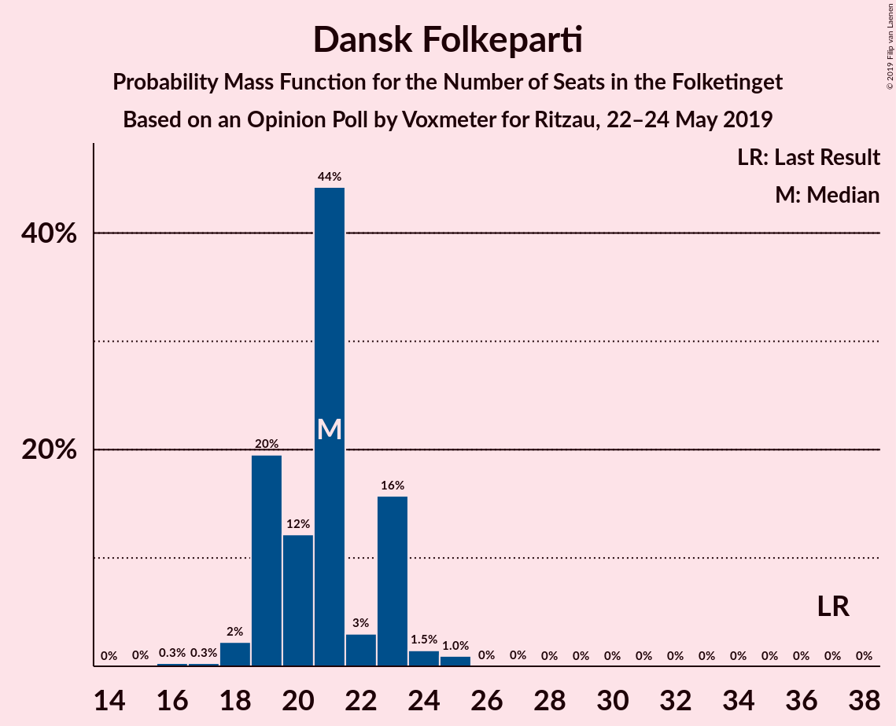
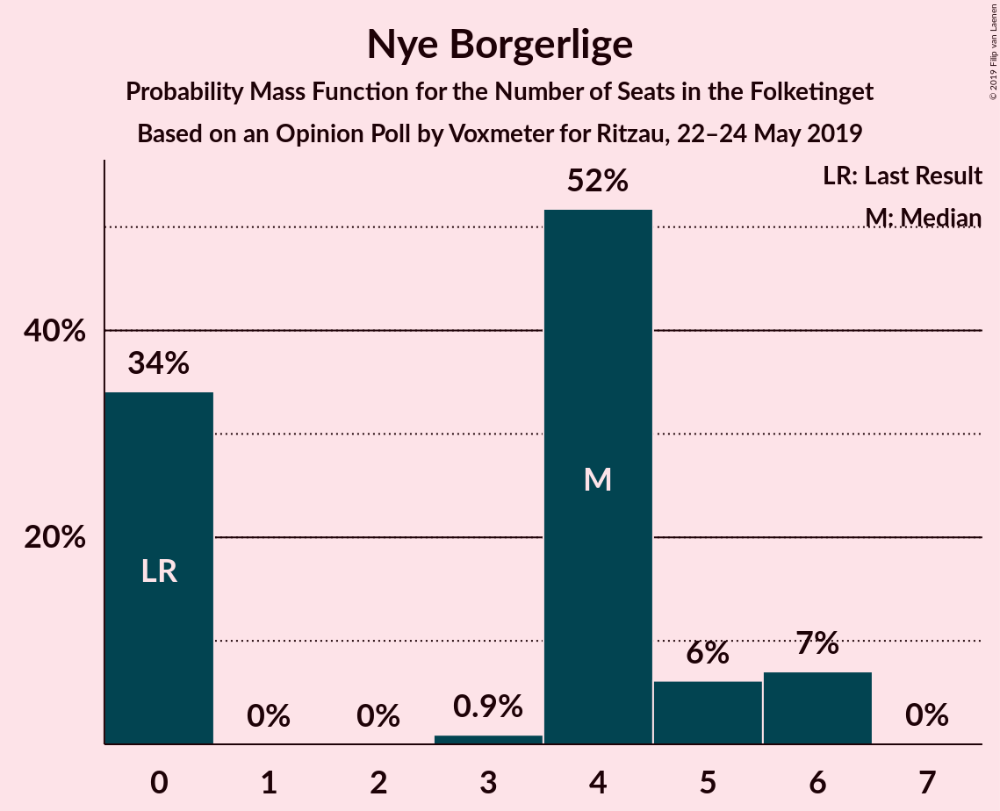
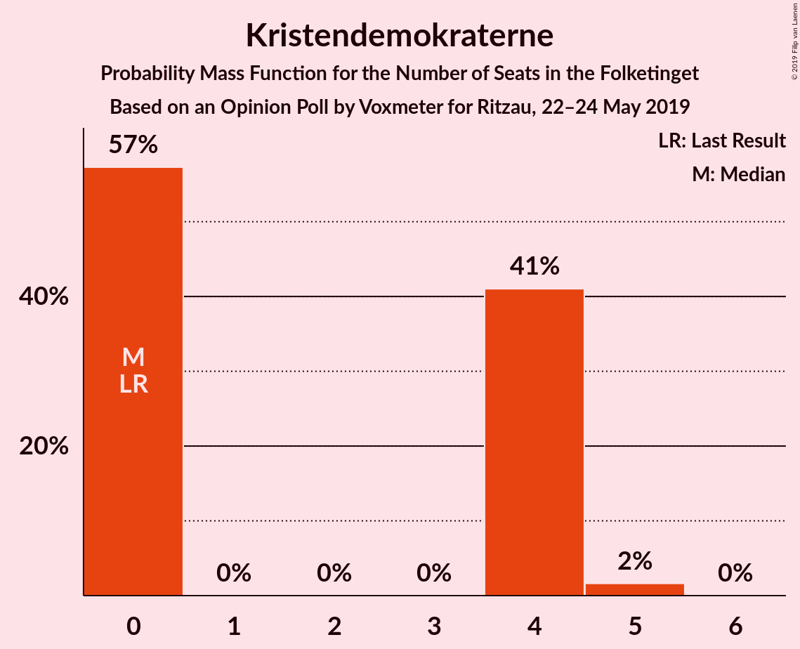
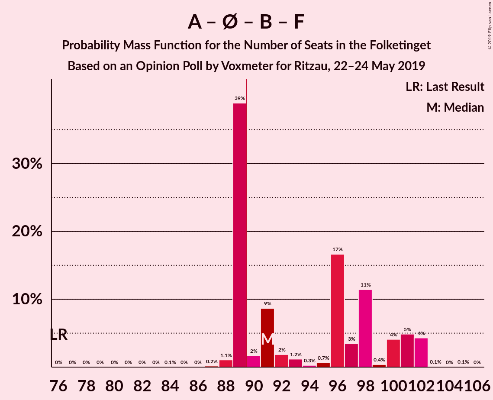
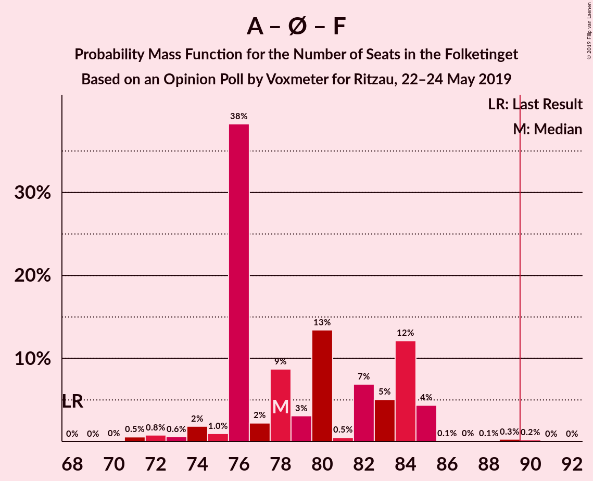
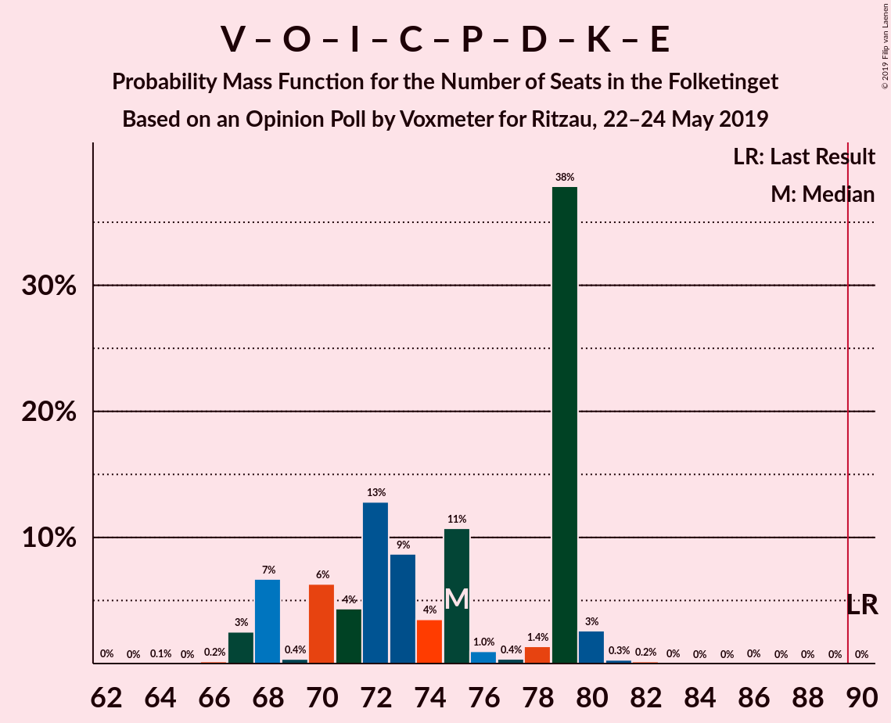
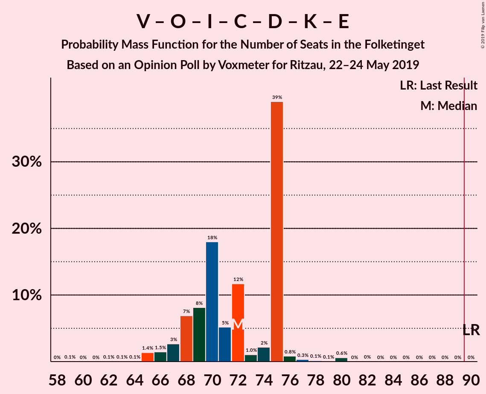
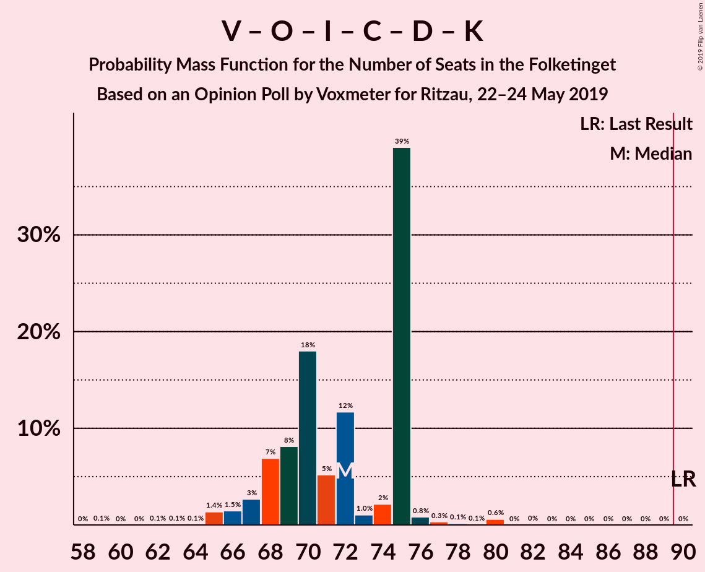
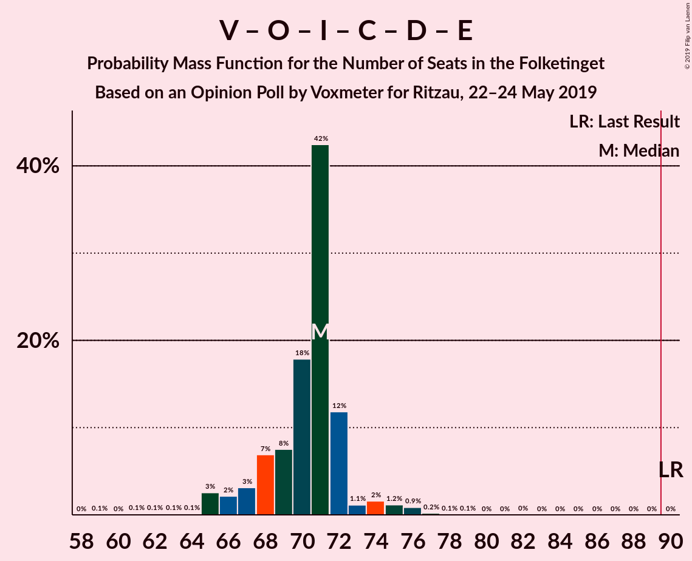

# Opinion Poll by Voxmeter for Ritzau, 22–24 May 2019

<a href="#voting-intentions">Voting Intentions</a> | <a href="#seats">Seats</a> | <a href="#coalitions">Coalitions</a> | <a href="#technical-information">Technical Information</a>

## Voting Intentions

### Confidence Intervals

| Party | Last Result | Poll Result | 80% Confidence Interval | 90% Confidence Interval | 95% Confidence Interval | 99% Confidence Interval |
|:-----:|:-----------:|:-----------:|:-----------------------:|:-----------------------:|:-----------------------:|:-----------------------:|
| Socialdemokraterne | 26.3% | 26.5% | 24.8–28.4% |24.3–28.9% |23.9–29.4% |23.1–30.3% |
| Venstre | 19.5% | 17.5% | 16.0–19.1% |15.6–19.6% |15.3–20.0% |14.6–20.8% |
| Dansk Folkeparti | 21.1% | 11.7% | 10.5–13.1% |10.2–13.5% |9.9–13.9% |9.3–14.6% |
| Enhedslisten–De Rød-Grønne | 7.8% | 9.4% | 8.4–10.7% |8.0–11.1% |7.8–11.4% |7.3–12.1% |
| Radikale Venstre | 4.6% | 8.5% | 7.5–9.8% |7.2–10.1% |7.0–10.4% |6.5–11.1% |
| Socialistisk Folkeparti | 4.2% | 8.2% | 7.1–9.4% |6.9–9.7% |6.6–10.0% |6.2–10.6% |
| Liberal Alliance | 7.5% | 4.2% | 3.5–5.1% |3.3–5.4% |3.1–5.6% |2.8–6.1% |
| Det Konservative Folkeparti | 3.4% | 3.9% | 3.2–4.8% |3.0–5.0% |2.9–5.3% |2.5–5.7% |
| Alternativet | 4.8% | 3.4% | 2.7–4.2% |2.6–4.5% |2.4–4.7% |2.1–5.1% |
| Stram Kurs | 0.0% | 2.1% | 1.6–2.8% |1.5–3.0% |1.4–3.2% |1.2–3.6% |
| Nye Borgerlige | 0.0% | 2.0% | 1.5–2.7% |1.4–2.9% |1.3–3.1% |1.1–3.4% |
| Kristendemokraterne | 0.8% | 1.5% | 1.1–2.1% |1.0–2.3% |0.9–2.5% |0.7–2.8% |
| Klaus Riskær Pedersen | 0.0% | 0.6% | 0.4–1.1% |0.3–1.2% |0.3–1.3% |0.2–1.6% |

*Note:* The poll result column reflects the actual value used in the calculations. Published results may vary slightly, and in addition be rounded to fewer digits.

## Seats

### Confidence Intervals

| Party | Last Result | Median | 80% Confidence Interval | 90% Confidence Interval | 95% Confidence Interval | 99% Confidence Interval |
|:-----:|:-----------:|:------:|:-----------------------:|:-----------------------:|:-----------------------:|:-----------------------:|
| <a href="#socialdemokraterne">Socialdemokraterne</a> | 47 | 47 | 46–51 |45–51 |43–51 |39–54 |
| <a href="#venstre">Venstre</a> | 34 | 31 | 30–33 |29–35 |29–35 |28–36 |
| <a href="#dansk-folkeparti">Dansk Folkeparti</a> | 37 | 21 | 19–23 |19–23 |18–23 |17–25 |
| <a href="#enhedslisten–de-rød-grønne">Enhedslisten–De Rød-Grønne</a> | 14 | 16 | 16–20 |15–20 |15–21 |12–21 |
| <a href="#radikale-venstre">Radikale Venstre</a> | 8 | 14 | 13–18 |13–18 |13–18 |12–19 |
| <a href="#socialistisk-folkeparti">Socialistisk Folkeparti</a> | 7 | 15 | 13–16 |13–16 |12–17 |10–18 |
| <a href="#liberal-alliance">Liberal Alliance</a> | 13 | 8 | 7–10 |6–10 |6–10 |5–10 |
| <a href="#det-konservative-folkeparti">Det Konservative Folkeparti</a> | 6 | 7 | 6–7 |6–9 |6–9 |5–10 |
| <a href="#alternativet">Alternativet</a> | 9 | 7 | 5–8 |5–9 |5–9 |4–10 |
| <a href="#stram-kurs">Stram Kurs</a> | 0 | 4 | 0–5 |0–5 |0–6 |0–6 |
| <a href="#nye-borgerlige">Nye Borgerlige</a> | 0 | 4 | 0–5 |0–6 |0–6 |0–6 |
| <a href="#kristendemokraterne">Kristendemokraterne</a> | 0 | 0 | 0–4 |0–4 |0–4 |0–5 |
| <a href="#klaus-riskær-pedersen">Klaus Riskær Pedersen</a> | 0 | 0 | 0 |0 |0 |0 |

### Socialdemokraterne

*For a full overview of the results for this party, see the [Socialdemokraterne](party-socialdemokraterne.html) page.*

| Number of Seats | Probability | Accumulated | Special Marks |
|:---------------:|:-----------:|:-----------:|:-------------:|
| 39 | 0.5% | 100% |  |
| 40 | 0.1% | 99.5% |  |
| 41 | 0.8% | 99.4% |  |
| 42 | 0.7% | 98.6% |  |
| 43 | 0.6% | 98% |  |
| 44 | 2% | 97% |  |
| 45 | 2% | 95% |  |
| 46 | 11% | 93% |  |
| 47 | 51% | 82% | Last Result, Median |
| 48 | 2% | 31% |  |
| 49 | 9% | 29% |  |
| 50 | 7% | 20% |  |
| 51 | 11% | 13% |  |
| 52 | 1.2% | 2% |  |
| 53 | 0.1% | 0.6% |  |
| 54 | 0.1% | 0.5% |  |
| 55 | 0% | 0.4% |  |
| 56 | 0.3% | 0.4% |  |
| 57 | 0.1% | 0.1% |  |
| 58 | 0% | 0% |  |

### Venstre

*For a full overview of the results for this party, see the [Venstre](party-venstre.html) page.*

| Number of Seats | Probability | Accumulated | Special Marks |
|:---------------:|:-----------:|:-----------:|:-------------:|
| 25 | 0% | 100% |  |
| 26 | 0.1% | 99.9% |  |
| 27 | 0.2% | 99.9% |  |
| 28 | 0.6% | 99.7% |  |
| 29 | 9% | 99.1% |  |
| 30 | 7% | 90% |  |
| 31 | 48% | 83% | Median |
| 32 | 21% | 35% |  |
| 33 | 4% | 14% |  |
| 34 | 4% | 10% | Last Result |
| 35 | 5% | 6% |  |
| 36 | 1.2% | 1.4% |  |
| 37 | 0.1% | 0.3% |  |
| 38 | 0.1% | 0.2% |  |
| 39 | 0% | 0% |  |

### Dansk Folkeparti

*For a full overview of the results for this party, see the [Dansk Folkeparti](party-danskfolkeparti.html) page.*

| Number of Seats | Probability | Accumulated | Special Marks |
|:---------------:|:-----------:|:-----------:|:-------------:|
| 16 | 0.3% | 100% |  |
| 17 | 0.3% | 99.7% |  |
| 18 | 2% | 99.4% |  |
| 19 | 20% | 97% |  |
| 20 | 12% | 78% |  |
| 21 | 44% | 65% | Median |
| 22 | 3% | 21% |  |
| 23 | 16% | 18% |  |
| 24 | 1.5% | 2% |  |
| 25 | 1.0% | 1.0% |  |
| 26 | 0% | 0.1% |  |
| 27 | 0% | 0% |  |
| 28 | 0% | 0% |  |
| 29 | 0% | 0% |  |
| 30 | 0% | 0% |  |
| 31 | 0% | 0% |  |
| 32 | 0% | 0% |  |
| 33 | 0% | 0% |  |
| 34 | 0% | 0% |  |
| 35 | 0% | 0% |  |
| 36 | 0% | 0% |  |
| 37 | 0% | 0% | Last Result |

### Enhedslisten–De Rød-Grønne

*For a full overview of the results for this party, see the [Enhedslisten–De Rød-Grønne](party-enhedslisten–derød-grønne.html) page.*

| Number of Seats | Probability | Accumulated | Special Marks |
|:---------------:|:-----------:|:-----------:|:-------------:|
| 12 | 0.7% | 100% |  |
| 13 | 0.2% | 99.3% |  |
| 14 | 0.5% | 99.1% | Last Result |
| 15 | 4% | 98.6% |  |
| 16 | 52% | 94% | Median |
| 17 | 3% | 42% |  |
| 18 | 17% | 40% |  |
| 19 | 10% | 22% |  |
| 20 | 8% | 12% |  |
| 21 | 4% | 4% |  |
| 22 | 0.1% | 0.2% |  |
| 23 | 0.1% | 0.1% |  |
| 24 | 0% | 0% |  |

### Radikale Venstre

*For a full overview of the results for this party, see the [Radikale Venstre](party-radikalevenstre.html) page.*

| Number of Seats | Probability | Accumulated | Special Marks |
|:---------------:|:-----------:|:-----------:|:-------------:|
| 8 | 0% | 100% | Last Result |
| 9 | 0% | 100% |  |
| 10 | 0.1% | 100% |  |
| 11 | 0.1% | 99.9% |  |
| 12 | 0.4% | 99.8% |  |
| 13 | 48% | 99.3% |  |
| 14 | 15% | 52% | Median |
| 15 | 2% | 36% |  |
| 16 | 16% | 34% |  |
| 17 | 7% | 18% |  |
| 18 | 9% | 11% |  |
| 19 | 2% | 2% |  |
| 20 | 0.1% | 0.2% |  |
| 21 | 0% | 0.1% |  |
| 22 | 0% | 0% |  |

### Socialistisk Folkeparti

*For a full overview of the results for this party, see the [Socialistisk Folkeparti](party-socialistiskfolkeparti.html) page.*

| Number of Seats | Probability | Accumulated | Special Marks |
|:---------------:|:-----------:|:-----------:|:-------------:|
| 7 | 0% | 100% | Last Result |
| 8 | 0% | 100% |  |
| 9 | 0% | 100% |  |
| 10 | 0.6% | 100% |  |
| 11 | 0.2% | 99.4% |  |
| 12 | 2% | 99.2% |  |
| 13 | 41% | 97% |  |
| 14 | 5% | 56% |  |
| 15 | 40% | 52% | Median |
| 16 | 7% | 11% |  |
| 17 | 3% | 5% |  |
| 18 | 1.5% | 2% |  |
| 19 | 0.3% | 0.5% |  |
| 20 | 0.1% | 0.2% |  |
| 21 | 0.1% | 0.1% |  |
| 22 | 0% | 0% |  |

### Liberal Alliance

*For a full overview of the results for this party, see the [Liberal Alliance](party-liberalalliance.html) page.*

| Number of Seats | Probability | Accumulated | Special Marks |
|:---------------:|:-----------:|:-----------:|:-------------:|
| 5 | 0.6% | 100% |  |
| 6 | 5% | 99.4% |  |
| 7 | 7% | 95% |  |
| 8 | 51% | 88% | Median |
| 9 | 21% | 37% |  |
| 10 | 15% | 15% |  |
| 11 | 0.3% | 0.4% |  |
| 12 | 0% | 0% |  |
| 13 | 0% | 0% | Last Result |

### Det Konservative Folkeparti

*For a full overview of the results for this party, see the [Det Konservative Folkeparti](party-detkonservativefolkeparti.html) page.*

| Number of Seats | Probability | Accumulated | Special Marks |
|:---------------:|:-----------:|:-----------:|:-------------:|
| 4 | 0.1% | 100% |  |
| 5 | 1.2% | 99.9% |  |
| 6 | 17% | 98.8% | Last Result |
| 7 | 73% | 82% | Median |
| 8 | 4% | 9% |  |
| 9 | 5% | 5% |  |
| 10 | 0.6% | 0.7% |  |
| 11 | 0.1% | 0.2% |  |
| 12 | 0% | 0% |  |

### Alternativet

*For a full overview of the results for this party, see the [Alternativet](party-alternativet.html) page.*

| Number of Seats | Probability | Accumulated | Special Marks |
|:---------------:|:-----------:|:-----------:|:-------------:|
| 4 | 2% | 100% |  |
| 5 | 24% | 98% |  |
| 6 | 14% | 74% |  |
| 7 | 45% | 61% | Median |
| 8 | 7% | 16% |  |
| 9 | 8% | 9% | Last Result |
| 10 | 1.4% | 1.4% |  |
| 11 | 0% | 0% |  |

### Stram Kurs

*For a full overview of the results for this party, see the [Stram Kurs](party-stramkurs.html) page.*

| Number of Seats | Probability | Accumulated | Special Marks |
|:---------------:|:-----------:|:-----------:|:-------------:|
| 0 | 33% | 100% | Last Result |
| 1 | 0% | 67% |  |
| 2 | 0% | 67% |  |
| 3 | 0% | 67% |  |
| 4 | 53% | 67% | Median |
| 5 | 12% | 15% |  |
| 6 | 3% | 3% |  |
| 7 | 0.2% | 0.2% |  |
| 8 | 0% | 0% |  |

### Nye Borgerlige

*For a full overview of the results for this party, see the [Nye Borgerlige](party-nyeborgerlige.html) page.*

| Number of Seats | Probability | Accumulated | Special Marks |
|:---------------:|:-----------:|:-----------:|:-------------:|
| 0 | 34% | 100% | Last Result |
| 1 | 0% | 66% |  |
| 2 | 0% | 66% |  |
| 3 | 0.9% | 66% |  |
| 4 | 52% | 65% | Median |
| 5 | 6% | 13% |  |
| 6 | 7% | 7% |  |
| 7 | 0% | 0% |  |

### Kristendemokraterne

*For a full overview of the results for this party, see the [Kristendemokraterne](party-kristendemokraterne.html) page.*

| Number of Seats | Probability | Accumulated | Special Marks |
|:---------------:|:-----------:|:-----------:|:-------------:|
| 0 | 57% | 100% | Last Result, Median |
| 1 | 0% | 43% |  |
| 2 | 0% | 43% |  |
| 3 | 0% | 43% |  |
| 4 | 41% | 43% |  |
| 5 | 2% | 2% |  |
| 6 | 0% | 0% |  |

### Klaus Riskær Pedersen

*For a full overview of the results for this party, see the [Klaus Riskær Pedersen](party-klausriskærpedersen.html) page.*

| Number of Seats | Probability | Accumulated | Special Marks |
|:---------------:|:-----------:|:-----------:|:-------------:|
| 0 | 100% | 100% | Last Result, Median |

## Coalitions

### Confidence Intervals

| Coalition | Last Result | Median | Majority? | 80% Confidence Interval | 90% Confidence Interval | 95% Confidence Interval | 99% Confidence Interval |
|:---------:|:-----------:|:------:|:---------:|:-----------------------:|:-----------------------:|:-----------------------:|:-----------------------:|
| Socialdemokraterne – Enhedslisten–De Rød-Grønne – Radikale Venstre – Socialistisk Folkeparti – Alternativet | 85 | 100 | 100% | 96–105 | 96–107 | 95–108 | 94–108 |
| Socialdemokraterne – Enhedslisten–De Rød-Grønne – Radikale Venstre – Socialistisk Folkeparti | 76 | 91 | 60% | 89–100 | 89–101 | 89–102 | 88–102 |
| Socialdemokraterne – Enhedslisten–De Rød-Grønne – Socialistisk Folkeparti – Alternativet | 77 | 85 | 8% | 83–89 | 83–90 | 80–90 | 78–93 |
| Socialdemokraterne – Enhedslisten–De Rød-Grønne – Socialistisk Folkeparti | 68 | 78 | 0.2% | 76–84 | 76–84 | 74–85 | 71–88 |
| Socialdemokraterne – Radikale Venstre – Socialistisk Folkeparti | 62 | 75 | 0% | 73–82 | 73–82 | 73–82 | 70–85 |
| Venstre – Dansk Folkeparti – Liberal Alliance – Det Konservative Folkeparti – Stram Kurs – Nye Borgerlige – Kristendemokraterne – Klaus Riskær Pedersen | 90 | 75 | 0% | 70–79 | 68–79 | 67–80 | 67–81 |
| Venstre – Dansk Folkeparti – Liberal Alliance – Det Konservative Folkeparti – Nye Borgerlige – Kristendemokraterne – Klaus Riskær Pedersen | 90 | 72 | 0% | 68–75 | 67–75 | 66–75 | 65–80 |
| Venstre – Dansk Folkeparti – Liberal Alliance – Det Konservative Folkeparti – Nye Borgerlige – Kristendemokraterne | 90 | 72 | 0% | 68–75 | 67–75 | 66–75 | 65–80 |
| Venstre – Dansk Folkeparti – Liberal Alliance – Det Konservative Folkeparti – Nye Borgerlige – Klaus Riskær Pedersen | 90 | 71 | 0% | 68–72 | 66–73 | 65–74 | 65–76 |
| Venstre – Dansk Folkeparti – Liberal Alliance – Det Konservative Folkeparti – Nye Borgerlige | 90 | 71 | 0% | 68–72 | 66–73 | 65–74 | 65–76 |
| Venstre – Dansk Folkeparti – Liberal Alliance – Det Konservative Folkeparti – Kristendemokraterne | 90 | 71 | 0% | 63–72 | 63–72 | 62–73 | 60–75 |
| Venstre – Dansk Folkeparti – Liberal Alliance – Det Konservative Folkeparti | 90 | 67 | 0% | 63–72 | 63–72 | 62–72 | 60–75 |
| Socialdemokraterne – Radikale Venstre | 55 | 60 | 0% | 60–66 | 60–67 | 58–67 | 56–71 |
| Venstre – Liberal Alliance – Det Konservative Folkeparti | 53 | 46 | 0% | 44–50 | 44–50 | 42–51 | 41–52 |
| Venstre – Det Konservative Folkeparti | 40 | 38 | 0% | 36–40 | 35–42 | 35–42 | 35–45 |
| Venstre | 34 | 31 | 0% | 30–33 | 29–35 | 29–35 | 28–36 |

### Socialdemokraterne – Enhedslisten–De Rød-Grønne – Radikale Venstre – Socialistisk Folkeparti – Alternativet

| Number of Seats | Probability | Accumulated | Special Marks |
|:---------------:|:-----------:|:-----------:|:-------------:|
| 85 | 0% | 100% | Last Result |
| 86 | 0% | 100% |  |
| 87 | 0% | 100% |  |
| 88 | 0% | 100% |  |
| 89 | 0% | 100% |  |
| 90 | 0% | 100% | Majority |
| 91 | 0% | 100% |  |
| 92 | 0% | 99.9% |  |
| 93 | 0.2% | 99.9% |  |
| 94 | 0.3% | 99.7% |  |
| 95 | 3% | 99.4% |  |
| 96 | 38% | 97% |  |
| 97 | 1.4% | 59% |  |
| 98 | 0.4% | 58% |  |
| 99 | 1.0% | 57% | Median |
| 100 | 11% | 56% |  |
| 101 | 4% | 46% |  |
| 102 | 9% | 42% |  |
| 103 | 13% | 33% |  |
| 104 | 4% | 21% |  |
| 105 | 6% | 16% |  |
| 106 | 0.4% | 10% |  |
| 107 | 7% | 10% |  |
| 108 | 3% | 3% |  |
| 109 | 0.2% | 0.3% |  |
| 110 | 0% | 0.1% |  |
| 111 | 0.1% | 0.1% |  |
| 112 | 0% | 0% |  |

### Socialdemokraterne – Enhedslisten–De Rød-Grønne – Radikale Venstre – Socialistisk Folkeparti

| Number of Seats | Probability | Accumulated | Special Marks |
|:---------------:|:-----------:|:-----------:|:-------------:|
| 76 | 0% | 100% | Last Result |
| 77 | 0% | 100% |  |
| 78 | 0% | 100% |  |
| 79 | 0% | 100% |  |
| 80 | 0% | 100% |  |
| 81 | 0% | 100% |  |
| 82 | 0% | 100% |  |
| 83 | 0% | 100% |  |
| 84 | 0.1% | 100% |  |
| 85 | 0% | 99.9% |  |
| 86 | 0% | 99.9% |  |
| 87 | 0.2% | 99.9% |  |
| 88 | 1.1% | 99.7% |  |
| 89 | 39% | 98.7% |  |
| 90 | 2% | 60% | Majority |
| 91 | 9% | 58% |  |
| 92 | 2% | 49% | Median |
| 93 | 1.2% | 48% |  |
| 94 | 0.3% | 46% |  |
| 95 | 0.7% | 46% |  |
| 96 | 17% | 45% |  |
| 97 | 3% | 29% |  |
| 98 | 11% | 25% |  |
| 99 | 0.4% | 14% |  |
| 100 | 4% | 14% |  |
| 101 | 5% | 9% |  |
| 102 | 4% | 5% |  |
| 103 | 0.1% | 0.2% |  |
| 104 | 0% | 0.1% |  |
| 105 | 0.1% | 0.1% |  |
| 106 | 0% | 0% |  |

### Socialdemokraterne – Enhedslisten–De Rød-Grønne – Socialistisk Folkeparti – Alternativet

| Number of Seats | Probability | Accumulated | Special Marks |
|:---------------:|:-----------:|:-----------:|:-------------:|
| 77 | 0.1% | 100% | Last Result |
| 78 | 1.2% | 99.9% |  |
| 79 | 0.1% | 98.6% |  |
| 80 | 2% | 98.5% |  |
| 81 | 0.9% | 97% |  |
| 82 | 0.3% | 96% |  |
| 83 | 38% | 96% |  |
| 84 | 4% | 58% |  |
| 85 | 5% | 54% | Median |
| 86 | 8% | 50% |  |
| 87 | 15% | 42% |  |
| 88 | 3% | 27% |  |
| 89 | 16% | 24% |  |
| 90 | 6% | 8% | Majority |
| 91 | 2% | 2% |  |
| 92 | 0.2% | 0.8% |  |
| 93 | 0.1% | 0.6% |  |
| 94 | 0% | 0.5% |  |
| 95 | 0.3% | 0.5% |  |
| 96 | 0.2% | 0.2% |  |
| 97 | 0% | 0% |  |

### Socialdemokraterne – Enhedslisten–De Rød-Grønne – Socialistisk Folkeparti

| Number of Seats | Probability | Accumulated | Special Marks |
|:---------------:|:-----------:|:-----------:|:-------------:|
| 68 | 0% | 100% | Last Result |
| 69 | 0% | 100% |  |
| 70 | 0% | 100% |  |
| 71 | 0.5% | 99.9% |  |
| 72 | 0.8% | 99.4% |  |
| 73 | 0.6% | 98.6% |  |
| 74 | 2% | 98% |  |
| 75 | 1.0% | 96% |  |
| 76 | 38% | 95% |  |
| 77 | 2% | 57% |  |
| 78 | 9% | 55% | Median |
| 79 | 3% | 46% |  |
| 80 | 13% | 43% |  |
| 81 | 0.5% | 30% |  |
| 82 | 7% | 29% |  |
| 83 | 5% | 22% |  |
| 84 | 12% | 17% |  |
| 85 | 4% | 5% |  |
| 86 | 0.1% | 0.6% |  |
| 87 | 0% | 0.6% |  |
| 88 | 0.1% | 0.5% |  |
| 89 | 0.3% | 0.5% |  |
| 90 | 0.2% | 0.2% | Majority |
| 91 | 0% | 0% |  |

### Socialdemokraterne – Radikale Venstre – Socialistisk Folkeparti

| Number of Seats | Probability | Accumulated | Special Marks |
|:---------------:|:-----------:|:-----------:|:-------------:|
| 62 | 0% | 100% | Last Result |
| 63 | 0% | 100% |  |
| 64 | 0% | 100% |  |
| 65 | 0% | 100% |  |
| 66 | 0% | 100% |  |
| 67 | 0% | 100% |  |
| 68 | 0.1% | 100% |  |
| 69 | 0.1% | 99.9% |  |
| 70 | 1.0% | 99.9% |  |
| 71 | 0.6% | 98.9% |  |
| 72 | 0.6% | 98% |  |
| 73 | 38% | 98% |  |
| 74 | 0.9% | 59% |  |
| 75 | 11% | 59% |  |
| 76 | 4% | 48% | Median |
| 77 | 10% | 44% |  |
| 78 | 0.3% | 34% |  |
| 79 | 0.6% | 34% |  |
| 80 | 18% | 33% |  |
| 81 | 4% | 15% |  |
| 82 | 9% | 11% |  |
| 83 | 1.0% | 2% |  |
| 84 | 0.1% | 0.7% |  |
| 85 | 0.4% | 0.5% |  |
| 86 | 0.1% | 0.2% |  |
| 87 | 0% | 0% |  |

### Venstre – Dansk Folkeparti – Liberal Alliance – Det Konservative Folkeparti – Stram Kurs – Nye Borgerlige – Kristendemokraterne – Klaus Riskær Pedersen

| Number of Seats | Probability | Accumulated | Special Marks |
|:---------------:|:-----------:|:-----------:|:-------------:|
| 64 | 0.1% | 100% |  |
| 65 | 0% | 99.9% |  |
| 66 | 0.2% | 99.9% |  |
| 67 | 3% | 99.7% |  |
| 68 | 7% | 97% |  |
| 69 | 0.4% | 90% |  |
| 70 | 6% | 90% |  |
| 71 | 4% | 84% |  |
| 72 | 13% | 79% |  |
| 73 | 9% | 67% |  |
| 74 | 4% | 58% |  |
| 75 | 11% | 54% | Median |
| 76 | 1.0% | 44% |  |
| 77 | 0.4% | 43% |  |
| 78 | 1.4% | 42% |  |
| 79 | 38% | 41% |  |
| 80 | 3% | 3% |  |
| 81 | 0.3% | 0.6% |  |
| 82 | 0.2% | 0.3% |  |
| 83 | 0% | 0.1% |  |
| 84 | 0% | 0.1% |  |
| 85 | 0% | 0% |  |
| 86 | 0% | 0% |  |
| 87 | 0% | 0% |  |
| 88 | 0% | 0% |  |
| 89 | 0% | 0% |  |
| 90 | 0% | 0% | Last Result, Majority |

### Venstre – Dansk Folkeparti – Liberal Alliance – Det Konservative Folkeparti – Nye Borgerlige – Kristendemokraterne – Klaus Riskær Pedersen

| Number of Seats | Probability | Accumulated | Special Marks |
|:---------------:|:-----------:|:-----------:|:-------------:|
| 59 | 0.1% | 100% |  |
| 60 | 0% | 99.9% |  |
| 61 | 0% | 99.9% |  |
| 62 | 0.1% | 99.9% |  |
| 63 | 0.1% | 99.9% |  |
| 64 | 0.1% | 99.8% |  |
| 65 | 1.4% | 99.7% |  |
| 66 | 1.5% | 98% |  |
| 67 | 3% | 97% |  |
| 68 | 7% | 94% |  |
| 69 | 8% | 87% |  |
| 70 | 18% | 79% |  |
| 71 | 5% | 61% | Median |
| 72 | 12% | 56% |  |
| 73 | 1.0% | 44% |  |
| 74 | 2% | 43% |  |
| 75 | 39% | 41% |  |
| 76 | 0.8% | 2% |  |
| 77 | 0.3% | 1.2% |  |
| 78 | 0.1% | 0.9% |  |
| 79 | 0.1% | 0.7% |  |
| 80 | 0.6% | 0.6% |  |
| 81 | 0% | 0.1% |  |
| 82 | 0% | 0% |  |
| 83 | 0% | 0% |  |
| 84 | 0% | 0% |  |
| 85 | 0% | 0% |  |
| 86 | 0% | 0% |  |
| 87 | 0% | 0% |  |
| 88 | 0% | 0% |  |
| 89 | 0% | 0% |  |
| 90 | 0% | 0% | Last Result, Majority |

### Venstre – Dansk Folkeparti – Liberal Alliance – Det Konservative Folkeparti – Nye Borgerlige – Kristendemokraterne

| Number of Seats | Probability | Accumulated | Special Marks |
|:---------------:|:-----------:|:-----------:|:-------------:|
| 59 | 0.1% | 100% |  |
| 60 | 0% | 99.9% |  |
| 61 | 0% | 99.9% |  |
| 62 | 0.1% | 99.9% |  |
| 63 | 0.1% | 99.9% |  |
| 64 | 0.1% | 99.8% |  |
| 65 | 1.4% | 99.7% |  |
| 66 | 1.5% | 98% |  |
| 67 | 3% | 97% |  |
| 68 | 7% | 94% |  |
| 69 | 8% | 87% |  |
| 70 | 18% | 79% |  |
| 71 | 5% | 61% | Median |
| 72 | 12% | 56% |  |
| 73 | 1.0% | 44% |  |
| 74 | 2% | 43% |  |
| 75 | 39% | 41% |  |
| 76 | 0.8% | 2% |  |
| 77 | 0.3% | 1.2% |  |
| 78 | 0.1% | 0.9% |  |
| 79 | 0.1% | 0.7% |  |
| 80 | 0.6% | 0.6% |  |
| 81 | 0% | 0.1% |  |
| 82 | 0% | 0% |  |
| 83 | 0% | 0% |  |
| 84 | 0% | 0% |  |
| 85 | 0% | 0% |  |
| 86 | 0% | 0% |  |
| 87 | 0% | 0% |  |
| 88 | 0% | 0% |  |
| 89 | 0% | 0% |  |
| 90 | 0% | 0% | Last Result, Majority |

### Venstre – Dansk Folkeparti – Liberal Alliance – Det Konservative Folkeparti – Nye Borgerlige – Klaus Riskær Pedersen

| Number of Seats | Probability | Accumulated | Special Marks |
|:---------------:|:-----------:|:-----------:|:-------------:|
| 59 | 0.1% | 100% |  |
| 60 | 0% | 99.9% |  |
| 61 | 0.1% | 99.9% |  |
| 62 | 0.1% | 99.8% |  |
| 63 | 0.1% | 99.7% |  |
| 64 | 0.1% | 99.6% |  |
| 65 | 3% | 99.5% |  |
| 66 | 2% | 97% |  |
| 67 | 3% | 95% |  |
| 68 | 7% | 92% |  |
| 69 | 8% | 85% |  |
| 70 | 18% | 77% |  |
| 71 | 42% | 59% | Median |
| 72 | 12% | 17% |  |
| 73 | 1.1% | 5% |  |
| 74 | 2% | 4% |  |
| 75 | 1.2% | 2% |  |
| 76 | 0.9% | 1.2% |  |
| 77 | 0.2% | 0.4% |  |
| 78 | 0.1% | 0.2% |  |
| 79 | 0.1% | 0.1% |  |
| 80 | 0% | 0% |  |
| 81 | 0% | 0% |  |
| 82 | 0% | 0% |  |
| 83 | 0% | 0% |  |
| 84 | 0% | 0% |  |
| 85 | 0% | 0% |  |
| 86 | 0% | 0% |  |
| 87 | 0% | 0% |  |
| 88 | 0% | 0% |  |
| 89 | 0% | 0% |  |
| 90 | 0% | 0% | Last Result, Majority |

### Venstre – Dansk Folkeparti – Liberal Alliance – Det Konservative Folkeparti – Nye Borgerlige

| Number of Seats | Probability | Accumulated | Special Marks |
|:---------------:|:-----------:|:-----------:|:-------------:|
| 59 | 0.1% | 100% |  |
| 60 | 0% | 99.9% |  |
| 61 | 0.1% | 99.9% |  |
| 62 | 0.1% | 99.8% |  |
| 63 | 0.1% | 99.7% |  |
| 64 | 0.1% | 99.6% |  |
| 65 | 3% | 99.5% |  |
| 66 | 2% | 97% |  |
| 67 | 3% | 95% |  |
| 68 | 7% | 92% |  |
| 69 | 8% | 85% |  |
| 70 | 18% | 77% |  |
| 71 | 42% | 59% | Median |
| 72 | 12% | 17% |  |
| 73 | 1.1% | 5% |  |
| 74 | 2% | 4% |  |
| 75 | 1.2% | 2% |  |
| 76 | 0.9% | 1.2% |  |
| 77 | 0.2% | 0.4% |  |
| 78 | 0.1% | 0.2% |  |
| 79 | 0.1% | 0.1% |  |
| 80 | 0% | 0% |  |
| 81 | 0% | 0% |  |
| 82 | 0% | 0% |  |
| 83 | 0% | 0% |  |
| 84 | 0% | 0% |  |
| 85 | 0% | 0% |  |
| 86 | 0% | 0% |  |
| 87 | 0% | 0% |  |
| 88 | 0% | 0% |  |
| 89 | 0% | 0% |  |
| 90 | 0% | 0% | Last Result, Majority |

### Venstre – Dansk Folkeparti – Liberal Alliance – Det Konservative Folkeparti – Kristendemokraterne

| Number of Seats | Probability | Accumulated | Special Marks |
|:---------------:|:-----------:|:-----------:|:-------------:|
| 59 | 0.1% | 100% |  |
| 60 | 1.3% | 99.9% |  |
| 61 | 0.1% | 98.6% |  |
| 62 | 1.2% | 98% |  |
| 63 | 9% | 97% |  |
| 64 | 0.3% | 88% |  |
| 65 | 0.2% | 88% |  |
| 66 | 9% | 88% |  |
| 67 | 5% | 78% | Median |
| 68 | 5% | 74% |  |
| 69 | 2% | 69% |  |
| 70 | 10% | 66% |  |
| 71 | 41% | 56% |  |
| 72 | 12% | 15% |  |
| 73 | 0.8% | 3% |  |
| 74 | 0.5% | 2% |  |
| 75 | 1.5% | 2% |  |
| 76 | 0.1% | 0.2% |  |
| 77 | 0% | 0.1% |  |
| 78 | 0% | 0% |  |
| 79 | 0% | 0% |  |
| 80 | 0% | 0% |  |
| 81 | 0% | 0% |  |
| 82 | 0% | 0% |  |
| 83 | 0% | 0% |  |
| 84 | 0% | 0% |  |
| 85 | 0% | 0% |  |
| 86 | 0% | 0% |  |
| 87 | 0% | 0% |  |
| 88 | 0% | 0% |  |
| 89 | 0% | 0% |  |
| 90 | 0% | 0% | Last Result, Majority |

### Venstre – Dansk Folkeparti – Liberal Alliance – Det Konservative Folkeparti

| Number of Seats | Probability | Accumulated | Special Marks |
|:---------------:|:-----------:|:-----------:|:-------------:|
| 59 | 0.1% | 100% |  |
| 60 | 1.3% | 99.9% |  |
| 61 | 0.3% | 98.6% |  |
| 62 | 1.4% | 98% |  |
| 63 | 10% | 97% |  |
| 64 | 0.3% | 87% |  |
| 65 | 2% | 87% |  |
| 66 | 10% | 85% |  |
| 67 | 42% | 75% | Median |
| 68 | 6% | 34% |  |
| 69 | 1.3% | 28% |  |
| 70 | 9% | 27% |  |
| 71 | 4% | 17% |  |
| 72 | 11% | 13% |  |
| 73 | 0.6% | 2% |  |
| 74 | 0.4% | 1.3% |  |
| 75 | 0.7% | 0.8% |  |
| 76 | 0% | 0.1% |  |
| 77 | 0% | 0.1% |  |
| 78 | 0% | 0% |  |
| 79 | 0% | 0% |  |
| 80 | 0% | 0% |  |
| 81 | 0% | 0% |  |
| 82 | 0% | 0% |  |
| 83 | 0% | 0% |  |
| 84 | 0% | 0% |  |
| 85 | 0% | 0% |  |
| 86 | 0% | 0% |  |
| 87 | 0% | 0% |  |
| 88 | 0% | 0% |  |
| 89 | 0% | 0% |  |
| 90 | 0% | 0% | Last Result, Majority |

### Socialdemokraterne – Radikale Venstre

| Number of Seats | Probability | Accumulated | Special Marks |
|:---------------:|:-----------:|:-----------:|:-------------:|
| 54 | 0.1% | 100% |  |
| 55 | 0.1% | 99.9% | Last Result |
| 56 | 2% | 99.9% |  |
| 57 | 0.2% | 98% |  |
| 58 | 1.0% | 98% |  |
| 59 | 1.0% | 97% |  |
| 60 | 47% | 96% |  |
| 61 | 2% | 49% | Median |
| 62 | 9% | 47% |  |
| 63 | 5% | 38% |  |
| 64 | 4% | 34% |  |
| 65 | 18% | 29% |  |
| 66 | 2% | 11% |  |
| 67 | 8% | 10% |  |
| 68 | 0.1% | 2% |  |
| 69 | 0.3% | 1.4% |  |
| 70 | 0.2% | 1.1% |  |
| 71 | 0.9% | 0.9% |  |
| 72 | 0% | 0% |  |

### Venstre – Liberal Alliance – Det Konservative Folkeparti

| Number of Seats | Probability | Accumulated | Special Marks |
|:---------------:|:-----------:|:-----------:|:-------------:|
| 38 | 0% | 100% |  |
| 39 | 0% | 99.9% |  |
| 40 | 0.1% | 99.9% |  |
| 41 | 0.5% | 99.8% |  |
| 42 | 2% | 99.3% |  |
| 43 | 0.4% | 97% |  |
| 44 | 11% | 96% |  |
| 45 | 5% | 86% |  |
| 46 | 40% | 81% | Median |
| 47 | 14% | 41% |  |
| 48 | 3% | 27% |  |
| 49 | 11% | 24% |  |
| 50 | 8% | 13% |  |
| 51 | 4% | 4% |  |
| 52 | 0.1% | 0.6% |  |
| 53 | 0.3% | 0.5% | Last Result |
| 54 | 0.1% | 0.1% |  |
| 55 | 0% | 0% |  |

### Venstre – Det Konservative Folkeparti

| Number of Seats | Probability | Accumulated | Special Marks |
|:---------------:|:-----------:|:-----------:|:-------------:|
| 31 | 0% | 100% |  |
| 32 | 0% | 99.9% |  |
| 33 | 0.1% | 99.9% |  |
| 34 | 0.3% | 99.8% |  |
| 35 | 8% | 99.5% |  |
| 36 | 4% | 91% |  |
| 37 | 4% | 88% |  |
| 38 | 48% | 84% | Median |
| 39 | 23% | 36% |  |
| 40 | 4% | 13% | Last Result |
| 41 | 1.0% | 10% |  |
| 42 | 8% | 9% |  |
| 43 | 0.3% | 1.3% |  |
| 44 | 0.3% | 1.0% |  |
| 45 | 0.5% | 0.6% |  |
| 46 | 0.1% | 0.1% |  |
| 47 | 0% | 0% |  |

### Venstre

| Number of Seats | Probability | Accumulated | Special Marks |
|:---------------:|:-----------:|:-----------:|:-------------:|
| 25 | 0% | 100% |  |
| 26 | 0.1% | 99.9% |  |
| 27 | 0.2% | 99.9% |  |
| 28 | 0.6% | 99.7% |  |
| 29 | 9% | 99.1% |  |
| 30 | 7% | 90% |  |
| 31 | 48% | 83% | Median |
| 32 | 21% | 35% |  |
| 33 | 4% | 14% |  |
| 34 | 4% | 10% | Last Result |
| 35 | 5% | 6% |  |
| 36 | 1.2% | 1.4% |  |
| 37 | 0.1% | 0.3% |  |
| 38 | 0.1% | 0.2% |  |
| 39 | 0% | 0% |  |

## Technical Information

### Opinion Poll

+ **Polling firm:** Voxmeter
+ **Commissioner(s):** Ritzau
+ **Fieldwork period:** 22–24 May 2019

### Calculations

+ **Sample size:** 1006
+ **Simulations done:** 1,048,576
+ **Error estimate:** 1.20%

