# Opinion Poll by Voxmeter for Ritzau, 23–25 May 2019

<a href="#voting-intentions">Voting Intentions</a> | <a href="#seats">Seats</a> | <a href="#coalitions">Coalitions</a> | <a href="#technical-information">Technical Information</a>

## Voting Intentions

### Confidence Intervals

| Party | Last Result | Poll Result | 80% Confidence Interval | 90% Confidence Interval | 95% Confidence Interval | 99% Confidence Interval |
|:-----:|:-----------:|:-----------:|:-----------------------:|:-----------------------:|:-----------------------:|:-----------------------:|
| Socialdemokraterne | 26.3% | 25.9% | 24.2–27.7% |23.7–28.2% |23.3–28.7% |22.5–29.6% |
| Venstre | 19.5% | 17.8% | 16.3–19.4% |15.9–19.9% |15.6–20.3% |14.9–21.1% |
| Dansk Folkeparti | 21.1% | 11.7% | 10.5–13.1% |10.2–13.5% |9.9–13.9% |9.3–14.6% |
| Enhedslisten–De Rød-Grønne | 7.8% | 9.0% | 7.9–10.2% |7.6–10.6% |7.3–10.9% |6.9–11.5% |
| Radikale Venstre | 4.6% | 8.5% | 7.4–9.7% |7.1–10.0% |6.9–10.3% |6.4–11.0% |
| Socialistisk Folkeparti | 4.2% | 8.5% | 7.4–9.7% |7.1–10.0% |6.9–10.3% |6.4–11.0% |
| Det Konservative Folkeparti | 3.4% | 4.4% | 3.6–5.3% |3.4–5.6% |3.3–5.8% |3.0–6.3% |
| Liberal Alliance | 7.5% | 3.9% | 3.2–4.8% |3.0–5.0% |2.9–5.3% |2.6–5.7% |
| Alternativet | 4.8% | 3.4% | 2.8–4.2% |2.6–4.5% |2.4–4.7% |2.2–5.1% |
| Stram Kurs | 0.0% | 2.3% | 1.8–3.0% |1.6–3.2% |1.5–3.4% |1.3–3.8% |
| Nye Borgerlige | 0.0% | 1.9% | 1.4–2.6% |1.3–2.8% |1.2–2.9% |1.0–3.3% |
| Kristendemokraterne | 0.8% | 1.3% | 0.9–1.9% |0.8–2.1% |0.8–2.2% |0.6–2.5% |
| Klaus Riskær Pedersen | 0.0% | 0.9% | 0.6–1.4% |0.5–1.6% |0.5–1.7% |0.4–2.0% |

*Note:* The poll result column reflects the actual value used in the calculations. Published results may vary slightly, and in addition be rounded to fewer digits.

## Seats

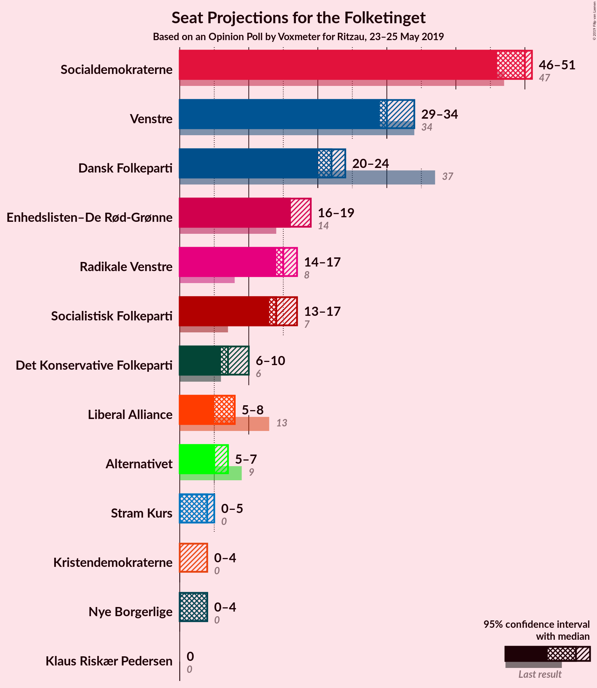

### Confidence Intervals

| Party | Last Result | Median | 80% Confidence Interval | 90% Confidence Interval | 95% Confidence Interval | 99% Confidence Interval |
|:-----:|:-----------:|:------:|:-----------------------:|:-----------------------:|:-----------------------:|:-----------------------:|
| <a href="#socialdemokraterne">Socialdemokraterne</a> | 47 | 50 | 49–50 |47–50 |46–51 |42–52 |
| <a href="#venstre">Venstre</a> | 34 | 30 | 30 |30–33 |29–34 |28–36 |
| <a href="#dansk-folkeparti">Dansk Folkeparti</a> | 37 | 22 | 22 |20–22 |20–24 |18–26 |
| <a href="#enhedslisten–de-rød-grønne">Enhedslisten–De Rød-Grønne</a> | 14 | 16 | 16 |16–18 |16–19 |14–20 |
| <a href="#radikale-venstre">Radikale Venstre</a> | 8 | 15 | 15 |14–17 |14–17 |12–19 |
| <a href="#socialistisk-folkeparti">Socialistisk Folkeparti</a> | 7 | 14 | 14 |14–16 |13–17 |12–18 |
| <a href="#det-konservative-folkeparti">Det Konservative Folkeparti</a> | 6 | 7 | 7 |7–8 |6–10 |6–10 |
| <a href="#liberal-alliance">Liberal Alliance</a> | 13 | 8 | 7–8 |6–8 |5–8 |5–10 |
| <a href="#alternativet">Alternativet</a> | 9 | 5 | 5–6 |5–7 |5–7 |4–8 |
| <a href="#stram-kurs">Stram Kurs</a> | 0 | 4 | 4 |4 |0–5 |0–5 |
| <a href="#nye-borgerlige">Nye Borgerlige</a> | 0 | 4 | 4 |0–4 |0–4 |0–5 |
| <a href="#kristendemokraterne">Kristendemokraterne</a> | 0 | 0 | 0 |0 |0–4 |0–4 |
| <a href="#klaus-riskær-pedersen">Klaus Riskær Pedersen</a> | 0 | 0 | 0 |0 |0 |0 |

### Socialdemokraterne

*For a full overview of the results for this party, see the [Socialdemokraterne](party-socialdemokraterne.html) page.*

| Number of Seats | Probability | Accumulated | Special Marks |
|:---------------:|:-----------:|:-----------:|:-------------:|
| 40 | 0% | 100% |  |
| 41 | 0.1% | 99.9% |  |
| 42 | 0.8% | 99.9% |  |
| 43 | 0.1% | 99.1% |  |
| 44 | 0.6% | 99.0% |  |
| 45 | 0.6% | 98% |  |
| 46 | 1.5% | 98% |  |
| 47 | 5% | 96% | Last Result |
| 48 | 1.2% | 92% |  |
| 49 | 1.1% | 90% |  |
| 50 | 86% | 89% | Median |
| 51 | 3% | 4% |  |
| 52 | 0.7% | 0.8% |  |
| 53 | 0.1% | 0.1% |  |
| 54 | 0% | 0% |  |

### Venstre

*For a full overview of the results for this party, see the [Venstre](party-venstre.html) page.*

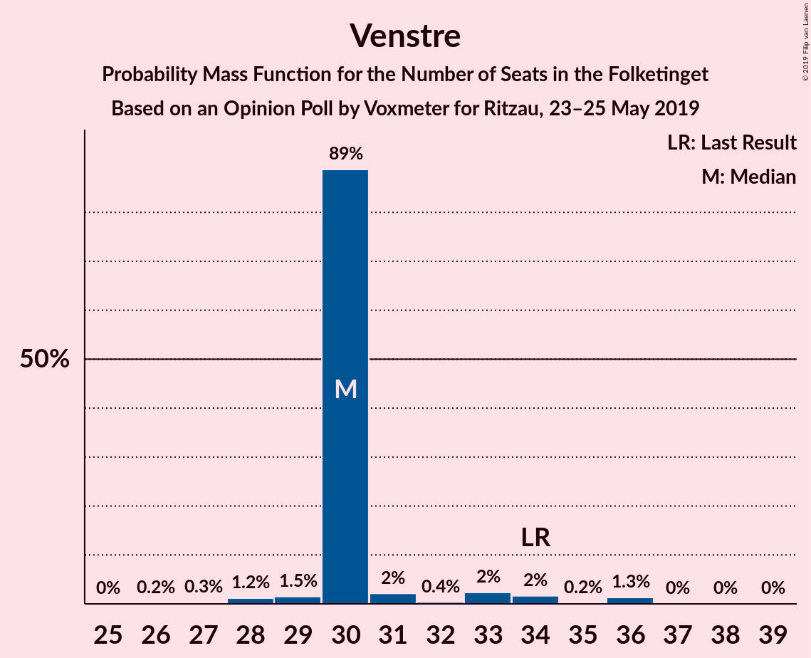

| Number of Seats | Probability | Accumulated | Special Marks |
|:---------------:|:-----------:|:-----------:|:-------------:|
| 26 | 0.2% | 100% |  |
| 27 | 0.3% | 99.8% |  |
| 28 | 1.2% | 99.5% |  |
| 29 | 1.5% | 98% |  |
| 30 | 89% | 97% | Median |
| 31 | 2% | 8% |  |
| 32 | 0.4% | 6% |  |
| 33 | 2% | 6% |  |
| 34 | 2% | 3% | Last Result |
| 35 | 0.2% | 2% |  |
| 36 | 1.3% | 1.4% |  |
| 37 | 0% | 0.1% |  |
| 38 | 0% | 0.1% |  |
| 39 | 0% | 0% |  |

### Dansk Folkeparti

*For a full overview of the results for this party, see the [Dansk Folkeparti](party-danskfolkeparti.html) page.*

| Number of Seats | Probability | Accumulated | Special Marks |
|:---------------:|:-----------:|:-----------:|:-------------:|
| 17 | 0.1% | 100% |  |
| 18 | 1.1% | 99.8% |  |
| 19 | 0.4% | 98.7% |  |
| 20 | 4% | 98% |  |
| 21 | 5% | 95% |  |
| 22 | 87% | 90% | Median |
| 23 | 0.8% | 3% |  |
| 24 | 0.9% | 3% |  |
| 25 | 1.0% | 2% |  |
| 26 | 0.8% | 0.8% |  |
| 27 | 0% | 0% |  |
| 28 | 0% | 0% |  |
| 29 | 0% | 0% |  |
| 30 | 0% | 0% |  |
| 31 | 0% | 0% |  |
| 32 | 0% | 0% |  |
| 33 | 0% | 0% |  |
| 34 | 0% | 0% |  |
| 35 | 0% | 0% |  |
| 36 | 0% | 0% |  |
| 37 | 0% | 0% | Last Result |

### Enhedslisten–De Rød-Grønne

*For a full overview of the results for this party, see the [Enhedslisten–De Rød-Grønne](party-enhedslisten–derød-grønne.html) page.*

| Number of Seats | Probability | Accumulated | Special Marks |
|:---------------:|:-----------:|:-----------:|:-------------:|
| 13 | 0.2% | 100% |  |
| 14 | 2% | 99.7% | Last Result |
| 15 | 0.7% | 98% |  |
| 16 | 89% | 98% | Median |
| 17 | 3% | 8% |  |
| 18 | 3% | 6% |  |
| 19 | 2% | 3% |  |
| 20 | 1.0% | 1.2% |  |
| 21 | 0.2% | 0.2% |  |
| 22 | 0% | 0% |  |

### Radikale Venstre

*For a full overview of the results for this party, see the [Radikale Venstre](party-radikalevenstre.html) page.*

| Number of Seats | Probability | Accumulated | Special Marks |
|:---------------:|:-----------:|:-----------:|:-------------:|
| 8 | 0% | 100% | Last Result |
| 9 | 0% | 100% |  |
| 10 | 0% | 100% |  |
| 11 | 0.1% | 100% |  |
| 12 | 0.4% | 99.9% |  |
| 13 | 0.8% | 99.5% |  |
| 14 | 5% | 98.7% |  |
| 15 | 86% | 94% | Median |
| 16 | 2% | 8% |  |
| 17 | 4% | 6% |  |
| 18 | 1.4% | 2% |  |
| 19 | 0.2% | 0.5% |  |
| 20 | 0.1% | 0.3% |  |
| 21 | 0.2% | 0.2% |  |
| 22 | 0% | 0% |  |

### Socialistisk Folkeparti

*For a full overview of the results for this party, see the [Socialistisk Folkeparti](party-socialistiskfolkeparti.html) page.*

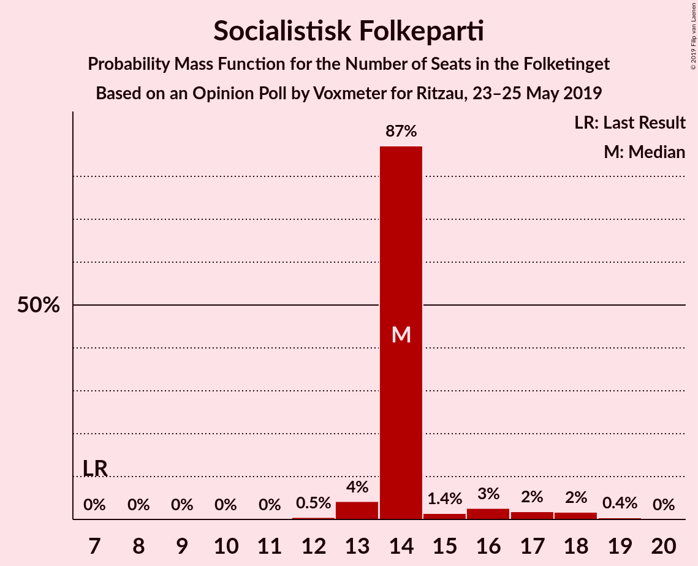

| Number of Seats | Probability | Accumulated | Special Marks |
|:---------------:|:-----------:|:-----------:|:-------------:|
| 7 | 0% | 100% | Last Result |
| 8 | 0% | 100% |  |
| 9 | 0% | 100% |  |
| 10 | 0% | 100% |  |
| 11 | 0% | 100% |  |
| 12 | 0.5% | 100% |  |
| 13 | 4% | 99.5% |  |
| 14 | 87% | 95% | Median |
| 15 | 1.4% | 8% |  |
| 16 | 3% | 7% |  |
| 17 | 2% | 4% |  |
| 18 | 2% | 2% |  |
| 19 | 0.4% | 0.5% |  |
| 20 | 0% | 0% |  |

### Det Konservative Folkeparti

*For a full overview of the results for this party, see the [Det Konservative Folkeparti](party-detkonservativefolkeparti.html) page.*

| Number of Seats | Probability | Accumulated | Special Marks |
|:---------------:|:-----------:|:-----------:|:-------------:|
| 6 | 3% | 100% | Last Result |
| 7 | 89% | 97% | Median |
| 8 | 3% | 8% |  |
| 9 | 2% | 5% |  |
| 10 | 2% | 3% |  |
| 11 | 0.2% | 0.3% |  |
| 12 | 0% | 0% |  |

### Liberal Alliance

*For a full overview of the results for this party, see the [Liberal Alliance](party-liberalalliance.html) page.*

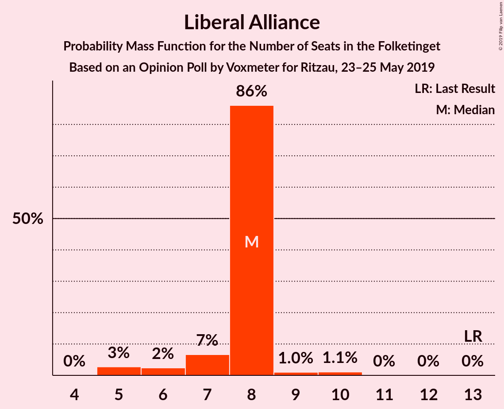

| Number of Seats | Probability | Accumulated | Special Marks |
|:---------------:|:-----------:|:-----------:|:-------------:|
| 5 | 3% | 100% |  |
| 6 | 2% | 97% |  |
| 7 | 7% | 95% |  |
| 8 | 86% | 88% | Median |
| 9 | 1.0% | 2% |  |
| 10 | 1.1% | 1.1% |  |
| 11 | 0% | 0% |  |
| 12 | 0% | 0% |  |
| 13 | 0% | 0% | Last Result |

### Alternativet

*For a full overview of the results for this party, see the [Alternativet](party-alternativet.html) page.*

| Number of Seats | Probability | Accumulated | Special Marks |
|:---------------:|:-----------:|:-----------:|:-------------:|
| 0 | 0.1% | 100% |  |
| 1 | 0% | 99.9% |  |
| 2 | 0% | 99.9% |  |
| 3 | 0% | 99.9% |  |
| 4 | 0.7% | 99.9% |  |
| 5 | 87% | 99.2% | Median |
| 6 | 7% | 12% |  |
| 7 | 4% | 5% |  |
| 8 | 1.2% | 1.4% |  |
| 9 | 0.1% | 0.2% | Last Result |
| 10 | 0.1% | 0.1% |  |
| 11 | 0% | 0% |  |

### Stram Kurs

*For a full overview of the results for this party, see the [Stram Kurs](party-stramkurs.html) page.*

| Number of Seats | Probability | Accumulated | Special Marks |
|:---------------:|:-----------:|:-----------:|:-------------:|
| 0 | 4% | 100% | Last Result |
| 1 | 0% | 96% |  |
| 2 | 0% | 96% |  |
| 3 | 0% | 96% |  |
| 4 | 91% | 96% | Median |
| 5 | 4% | 5% |  |
| 6 | 0.4% | 0.4% |  |
| 7 | 0.1% | 0.1% |  |
| 8 | 0% | 0% |  |

### Nye Borgerlige

*For a full overview of the results for this party, see the [Nye Borgerlige](party-nyeborgerlige.html) page.*

| Number of Seats | Probability | Accumulated | Special Marks |
|:---------------:|:-----------:|:-----------:|:-------------:|
| 0 | 9% | 100% | Last Result |
| 1 | 0% | 91% |  |
| 2 | 0% | 91% |  |
| 3 | 0% | 91% |  |
| 4 | 90% | 91% | Median |
| 5 | 0.7% | 0.8% |  |
| 6 | 0.1% | 0.1% |  |
| 7 | 0% | 0% |  |

### Kristendemokraterne

*For a full overview of the results for this party, see the [Kristendemokraterne](party-kristendemokraterne.html) page.*

| Number of Seats | Probability | Accumulated | Special Marks |
|:---------------:|:-----------:|:-----------:|:-------------:|
| 0 | 96% | 100% | Last Result, Median |
| 1 | 0% | 4% |  |
| 2 | 0% | 4% |  |
| 3 | 0% | 4% |  |
| 4 | 4% | 4% |  |
| 5 | 0% | 0% |  |

### Klaus Riskær Pedersen

*For a full overview of the results for this party, see the [Klaus Riskær Pedersen](party-klausriskærpedersen.html) page.*

| Number of Seats | Probability | Accumulated | Special Marks |
|:---------------:|:-----------:|:-----------:|:-------------:|
| 0 | 99.9% | 100% | Last Result, Median |
| 1 | 0% | 0.1% |  |
| 2 | 0% | 0.1% |  |
| 3 | 0% | 0.1% |  |
| 4 | 0.1% | 0.1% |  |
| 5 | 0% | 0% |  |

## Coalitions

### Confidence Intervals

| Coalition | Last Result | Median | Majority? | 80% Confidence Interval | 90% Confidence Interval | 95% Confidence Interval | 99% Confidence Interval |
|:---------:|:-----------:|:------:|:---------:|:-----------------------:|:-----------------------:|:-----------------------:|:-----------------------:|
| Socialdemokraterne – Enhedslisten–De Rød-Grønne – Radikale Venstre – Socialistisk Folkeparti – Alternativet | 85 | 100 | 100% | 100 | 99–104 | 98–105 | 93–108 |
| Socialdemokraterne – Enhedslisten–De Rød-Grønne – Radikale Venstre – Socialistisk Folkeparti | 76 | 95 | 99.0% | 95 | 93–98 | 91–100 | 87–101 |
| Socialdemokraterne – Enhedslisten–De Rød-Grønne – Socialistisk Folkeparti – Alternativet | 77 | 85 | 4% | 85 | 83–89 | 82–91 | 78–92 |
| Socialdemokraterne – Enhedslisten–De Rød-Grønne – Socialistisk Folkeparti | 68 | 80 | 0% | 80 | 77–82 | 76–85 | 72–86 |
| Socialdemokraterne – Radikale Venstre – Socialistisk Folkeparti | 62 | 79 | 0% | 79 | 77–81 | 76–82 | 70–84 |
| Venstre – Dansk Folkeparti – Det Konservative Folkeparti – Liberal Alliance – Stram Kurs – Nye Borgerlige – Kristendemokraterne – Klaus Riskær Pedersen | 90 | 75 | 0% | 75 | 71–76 | 70–77 | 67–82 |
| Venstre – Dansk Folkeparti – Det Konservative Folkeparti – Liberal Alliance – Nye Borgerlige – Kristendemokraterne – Klaus Riskær Pedersen | 90 | 71 | 0% | 71 | 68–72 | 66–74 | 65–78 |
| Venstre – Dansk Folkeparti – Det Konservative Folkeparti – Liberal Alliance – Nye Borgerlige – Kristendemokraterne | 90 | 71 | 0% | 71 | 68–72 | 66–74 | 65–78 |
| Venstre – Dansk Folkeparti – Det Konservative Folkeparti – Liberal Alliance – Nye Borgerlige – Klaus Riskær Pedersen | 90 | 71 | 0% | 70–71 | 68–71 | 66–73 | 65–78 |
| Venstre – Dansk Folkeparti – Det Konservative Folkeparti – Liberal Alliance – Nye Borgerlige | 90 | 71 | 0% | 70–71 | 68–71 | 66–73 | 65–78 |
| Venstre – Dansk Folkeparti – Det Konservative Folkeparti – Liberal Alliance – Kristendemokraterne | 90 | 67 | 0% | 67 | 67–69 | 65–71 | 62–78 |
| Venstre – Dansk Folkeparti – Det Konservative Folkeparti – Liberal Alliance | 90 | 67 | 0% | 67 | 65–69 | 64–71 | 62–78 |
| Socialdemokraterne – Radikale Venstre | 55 | 65 | 0% | 64–65 | 63–65 | 60–65 | 57–69 |
| Venstre – Det Konservative Folkeparti – Liberal Alliance | 53 | 45 | 0% | 45 | 44–47 | 44–50 | 40–53 |
| Venstre – Det Konservative Folkeparti | 40 | 37 | 0% | 37–38 | 37–39 | 37–42 | 34–46 |
| Venstre | 34 | 30 | 0% | 30 | 30–33 | 29–34 | 28–36 |

### Socialdemokraterne – Enhedslisten–De Rød-Grønne – Radikale Venstre – Socialistisk Folkeparti – Alternativet

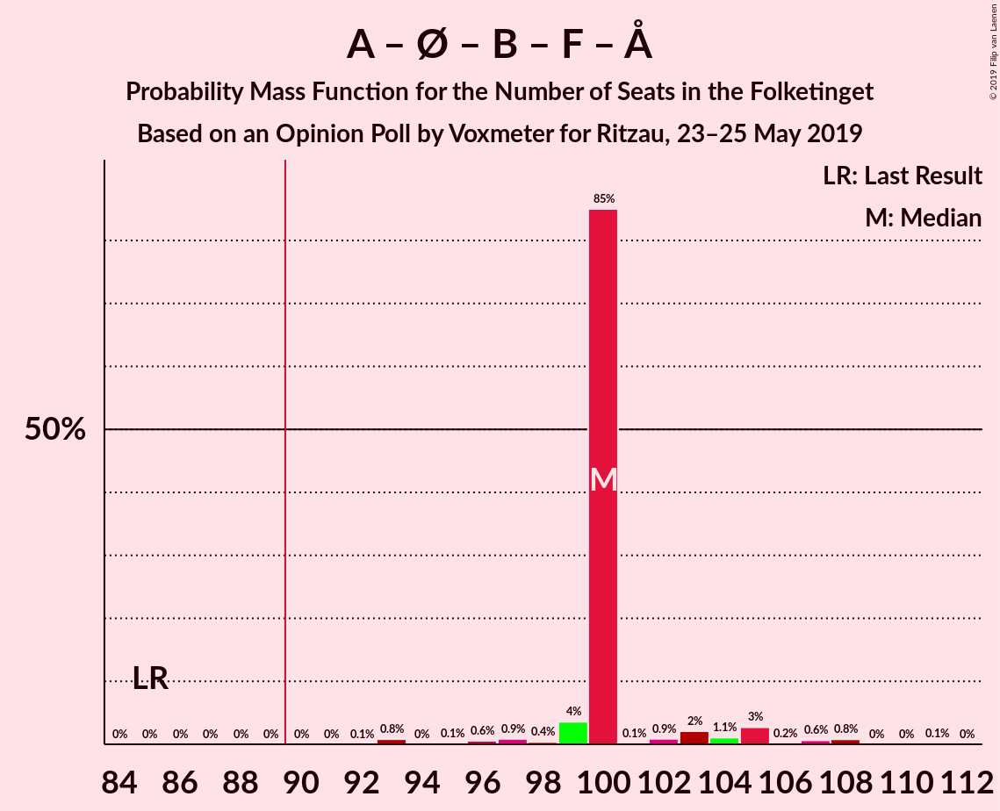

| Number of Seats | Probability | Accumulated | Special Marks |
|:---------------:|:-----------:|:-----------:|:-------------:|
| 85 | 0% | 100% | Last Result |
| 86 | 0% | 100% |  |
| 87 | 0% | 100% |  |
| 88 | 0% | 100% |  |
| 89 | 0% | 100% |  |
| 90 | 0% | 100% | Majority |
| 91 | 0% | 100% |  |
| 92 | 0.1% | 100% |  |
| 93 | 0.8% | 99.9% |  |
| 94 | 0% | 99.1% |  |
| 95 | 0.1% | 99.1% |  |
| 96 | 0.6% | 98.9% |  |
| 97 | 0.9% | 98% |  |
| 98 | 0.4% | 98% |  |
| 99 | 4% | 97% |  |
| 100 | 85% | 94% | Median |
| 101 | 0.1% | 9% |  |
| 102 | 0.9% | 8% |  |
| 103 | 2% | 8% |  |
| 104 | 1.1% | 5% |  |
| 105 | 3% | 4% |  |
| 106 | 0.2% | 2% |  |
| 107 | 0.6% | 2% |  |
| 108 | 0.8% | 0.9% |  |
| 109 | 0% | 0.1% |  |
| 110 | 0% | 0.1% |  |
| 111 | 0.1% | 0.1% |  |
| 112 | 0% | 0% |  |

### Socialdemokraterne – Enhedslisten–De Rød-Grønne – Radikale Venstre – Socialistisk Folkeparti

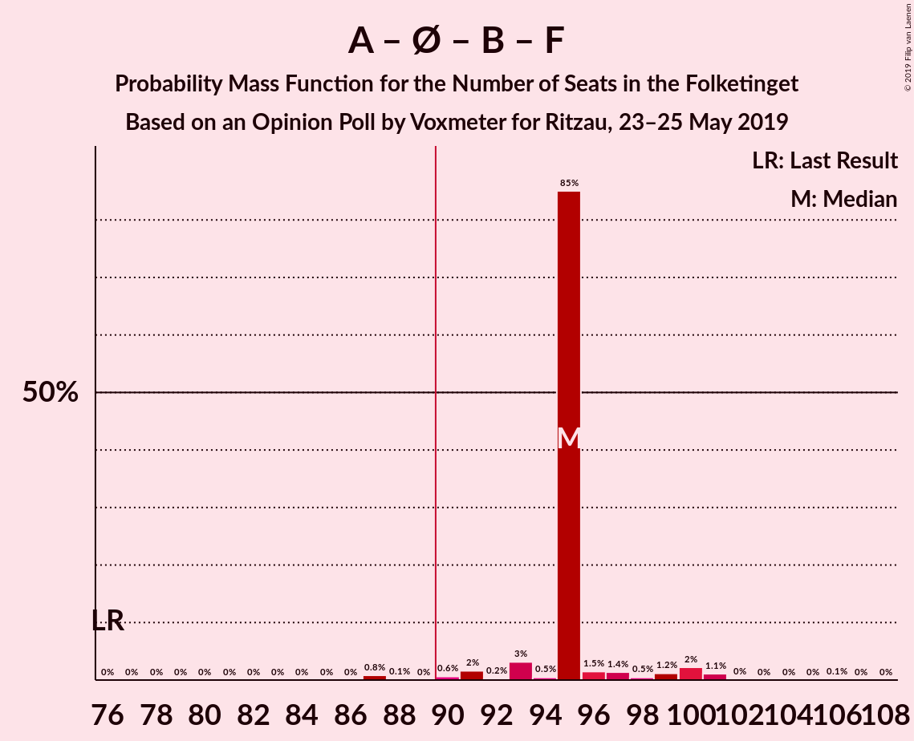

| Number of Seats | Probability | Accumulated | Special Marks |
|:---------------:|:-----------:|:-----------:|:-------------:|
| 76 | 0% | 100% | Last Result |
| 77 | 0% | 100% |  |
| 78 | 0% | 100% |  |
| 79 | 0% | 100% |  |
| 80 | 0% | 100% |  |
| 81 | 0% | 100% |  |
| 82 | 0% | 100% |  |
| 83 | 0% | 100% |  |
| 84 | 0% | 100% |  |
| 85 | 0% | 100% |  |
| 86 | 0% | 100% |  |
| 87 | 0.8% | 100% |  |
| 88 | 0.1% | 99.1% |  |
| 89 | 0% | 99.1% |  |
| 90 | 0.6% | 99.0% | Majority |
| 91 | 2% | 98% |  |
| 92 | 0.2% | 97% |  |
| 93 | 3% | 97% |  |
| 94 | 0.5% | 93% |  |
| 95 | 85% | 93% | Median |
| 96 | 1.5% | 8% |  |
| 97 | 1.4% | 6% |  |
| 98 | 0.5% | 5% |  |
| 99 | 1.2% | 5% |  |
| 100 | 2% | 3% |  |
| 101 | 1.1% | 1.2% |  |
| 102 | 0% | 0.1% |  |
| 103 | 0% | 0.1% |  |
| 104 | 0% | 0.1% |  |
| 105 | 0% | 0.1% |  |
| 106 | 0.1% | 0.1% |  |
| 107 | 0% | 0% |  |

### Socialdemokraterne – Enhedslisten–De Rød-Grønne – Socialistisk Folkeparti – Alternativet

| Number of Seats | Probability | Accumulated | Special Marks |
|:---------------:|:-----------:|:-----------:|:-------------:|
| 76 | 0% | 100% |  |
| 77 | 0% | 99.9% | Last Result |
| 78 | 0.8% | 99.9% |  |
| 79 | 0.1% | 99.1% |  |
| 80 | 0.5% | 99.1% |  |
| 81 | 0.1% | 98.6% |  |
| 82 | 3% | 98.5% |  |
| 83 | 1.2% | 96% |  |
| 84 | 0.7% | 95% |  |
| 85 | 85% | 94% | Median |
| 86 | 2% | 8% |  |
| 87 | 0.7% | 7% |  |
| 88 | 0.4% | 6% |  |
| 89 | 2% | 6% |  |
| 90 | 1.1% | 4% | Majority |
| 91 | 2% | 3% |  |
| 92 | 0.5% | 0.6% |  |
| 93 | 0% | 0.1% |  |
| 94 | 0.1% | 0.1% |  |
| 95 | 0% | 0% |  |

### Socialdemokraterne – Enhedslisten–De Rød-Grønne – Socialistisk Folkeparti

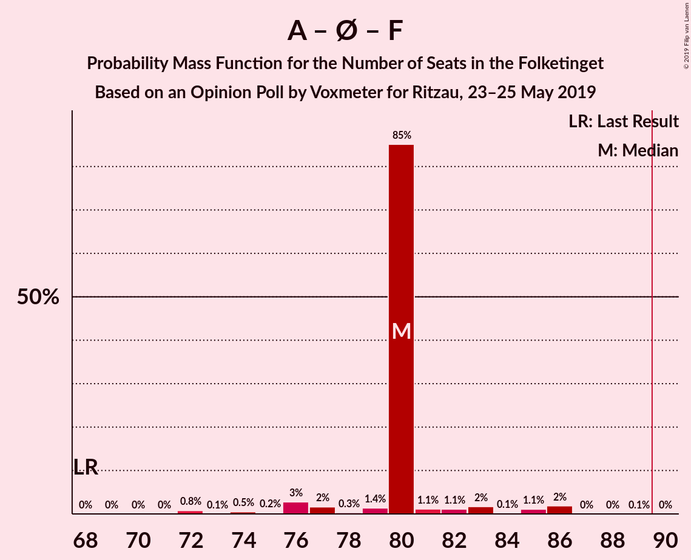

| Number of Seats | Probability | Accumulated | Special Marks |
|:---------------:|:-----------:|:-----------:|:-------------:|
| 68 | 0% | 100% | Last Result |
| 69 | 0% | 100% |  |
| 70 | 0% | 100% |  |
| 71 | 0% | 99.9% |  |
| 72 | 0.8% | 99.9% |  |
| 73 | 0.1% | 99.1% |  |
| 74 | 0.5% | 99.1% |  |
| 75 | 0.2% | 98.6% |  |
| 76 | 3% | 98% |  |
| 77 | 2% | 96% |  |
| 78 | 0.3% | 94% |  |
| 79 | 1.4% | 94% |  |
| 80 | 85% | 92% | Median |
| 81 | 1.1% | 7% |  |
| 82 | 1.1% | 6% |  |
| 83 | 2% | 5% |  |
| 84 | 0.1% | 3% |  |
| 85 | 1.1% | 3% |  |
| 86 | 2% | 2% |  |
| 87 | 0% | 0.1% |  |
| 88 | 0% | 0.1% |  |
| 89 | 0.1% | 0.1% |  |
| 90 | 0% | 0% | Majority |

### Socialdemokraterne – Radikale Venstre – Socialistisk Folkeparti

| Number of Seats | Probability | Accumulated | Special Marks |
|:---------------:|:-----------:|:-----------:|:-------------:|
| 62 | 0% | 100% | Last Result |
| 63 | 0% | 100% |  |
| 64 | 0% | 100% |  |
| 65 | 0% | 100% |  |
| 66 | 0% | 100% |  |
| 67 | 0% | 100% |  |
| 68 | 0% | 100% |  |
| 69 | 0.1% | 100% |  |
| 70 | 0.8% | 99.9% |  |
| 71 | 0% | 99.1% |  |
| 72 | 0.5% | 99.1% |  |
| 73 | 0.5% | 98.6% |  |
| 74 | 0.2% | 98% |  |
| 75 | 0.4% | 98% |  |
| 76 | 0.5% | 98% |  |
| 77 | 5% | 97% |  |
| 78 | 2% | 92% |  |
| 79 | 84% | 91% | Median |
| 80 | 0.1% | 6% |  |
| 81 | 2% | 6% |  |
| 82 | 1.5% | 3% |  |
| 83 | 0.6% | 2% |  |
| 84 | 0.9% | 1.4% |  |
| 85 | 0% | 0.5% |  |
| 86 | 0% | 0.4% |  |
| 87 | 0.3% | 0.4% |  |
| 88 | 0% | 0.1% |  |
| 89 | 0.1% | 0.1% |  |
| 90 | 0% | 0% | Majority |

### Venstre – Dansk Folkeparti – Det Konservative Folkeparti – Liberal Alliance – Stram Kurs – Nye Borgerlige – Kristendemokraterne – Klaus Riskær Pedersen

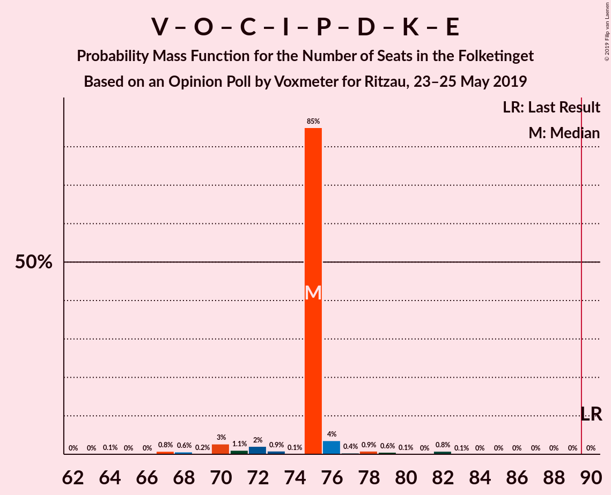

| Number of Seats | Probability | Accumulated | Special Marks |
|:---------------:|:-----------:|:-----------:|:-------------:|
| 64 | 0.1% | 100% |  |
| 65 | 0% | 99.9% |  |
| 66 | 0% | 99.9% |  |
| 67 | 0.8% | 99.9% |  |
| 68 | 0.6% | 99.1% |  |
| 69 | 0.2% | 98% |  |
| 70 | 3% | 98% |  |
| 71 | 1.1% | 96% |  |
| 72 | 2% | 95% |  |
| 73 | 0.9% | 92% |  |
| 74 | 0.1% | 92% |  |
| 75 | 85% | 91% | Median |
| 76 | 4% | 6% |  |
| 77 | 0.4% | 3% |  |
| 78 | 0.9% | 2% |  |
| 79 | 0.6% | 2% |  |
| 80 | 0.1% | 1.1% |  |
| 81 | 0% | 0.9% |  |
| 82 | 0.8% | 0.9% |  |
| 83 | 0.1% | 0.1% |  |
| 84 | 0% | 0% |  |
| 85 | 0% | 0% |  |
| 86 | 0% | 0% |  |
| 87 | 0% | 0% |  |
| 88 | 0% | 0% |  |
| 89 | 0% | 0% |  |
| 90 | 0% | 0% | Last Result, Majority |

### Venstre – Dansk Folkeparti – Det Konservative Folkeparti – Liberal Alliance – Nye Borgerlige – Kristendemokraterne – Klaus Riskær Pedersen

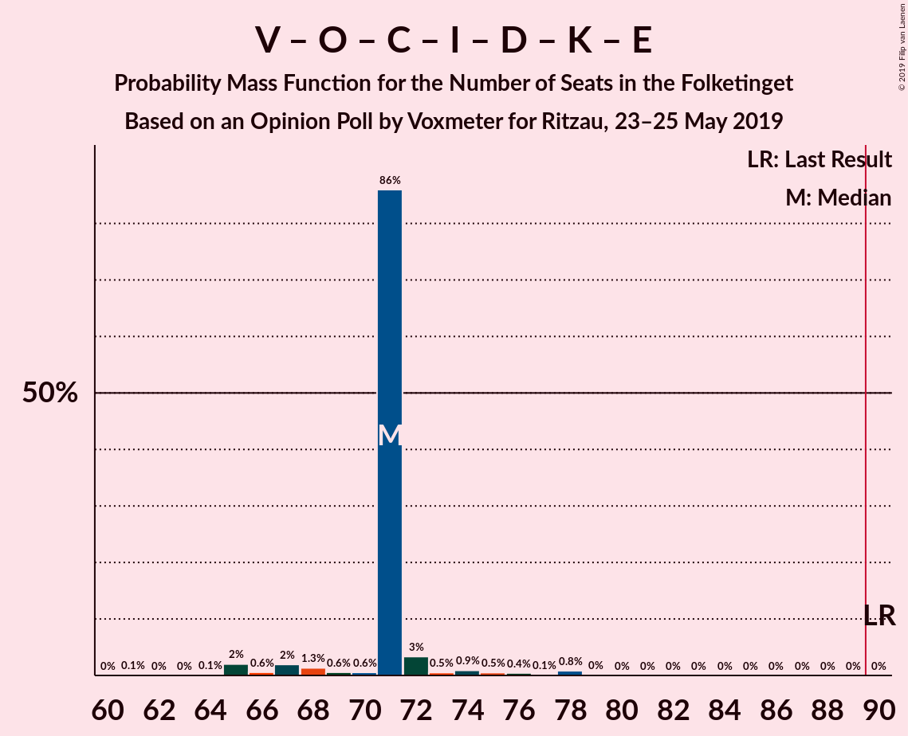

| Number of Seats | Probability | Accumulated | Special Marks |
|:---------------:|:-----------:|:-----------:|:-------------:|
| 61 | 0.1% | 100% |  |
| 62 | 0% | 99.9% |  |
| 63 | 0% | 99.9% |  |
| 64 | 0.1% | 99.9% |  |
| 65 | 2% | 99.8% |  |
| 66 | 0.6% | 98% |  |
| 67 | 2% | 97% |  |
| 68 | 1.3% | 95% |  |
| 69 | 0.6% | 94% |  |
| 70 | 0.6% | 93% |  |
| 71 | 86% | 93% | Median |
| 72 | 3% | 7% |  |
| 73 | 0.5% | 3% |  |
| 74 | 0.9% | 3% |  |
| 75 | 0.5% | 2% |  |
| 76 | 0.4% | 1.5% |  |
| 77 | 0.1% | 1.0% |  |
| 78 | 0.8% | 0.9% |  |
| 79 | 0% | 0.1% |  |
| 80 | 0% | 0% |  |
| 81 | 0% | 0% |  |
| 82 | 0% | 0% |  |
| 83 | 0% | 0% |  |
| 84 | 0% | 0% |  |
| 85 | 0% | 0% |  |
| 86 | 0% | 0% |  |
| 87 | 0% | 0% |  |
| 88 | 0% | 0% |  |
| 89 | 0% | 0% |  |
| 90 | 0% | 0% | Last Result, Majority |

### Venstre – Dansk Folkeparti – Det Konservative Folkeparti – Liberal Alliance – Nye Borgerlige – Kristendemokraterne

| Number of Seats | Probability | Accumulated | Special Marks |
|:---------------:|:-----------:|:-----------:|:-------------:|
| 61 | 0.1% | 100% |  |
| 62 | 0% | 99.9% |  |
| 63 | 0% | 99.9% |  |
| 64 | 0.1% | 99.9% |  |
| 65 | 2% | 99.8% |  |
| 66 | 0.6% | 98% |  |
| 67 | 2% | 97% |  |
| 68 | 1.4% | 95% |  |
| 69 | 0.6% | 94% |  |
| 70 | 0.6% | 93% |  |
| 71 | 86% | 93% | Median |
| 72 | 3% | 7% |  |
| 73 | 0.5% | 3% |  |
| 74 | 0.9% | 3% |  |
| 75 | 0.5% | 2% |  |
| 76 | 0.4% | 1.4% |  |
| 77 | 0.1% | 1.0% |  |
| 78 | 0.8% | 0.9% |  |
| 79 | 0% | 0.1% |  |
| 80 | 0% | 0% |  |
| 81 | 0% | 0% |  |
| 82 | 0% | 0% |  |
| 83 | 0% | 0% |  |
| 84 | 0% | 0% |  |
| 85 | 0% | 0% |  |
| 86 | 0% | 0% |  |
| 87 | 0% | 0% |  |
| 88 | 0% | 0% |  |
| 89 | 0% | 0% |  |
| 90 | 0% | 0% | Last Result, Majority |

### Venstre – Dansk Folkeparti – Det Konservative Folkeparti – Liberal Alliance – Nye Borgerlige – Klaus Riskær Pedersen

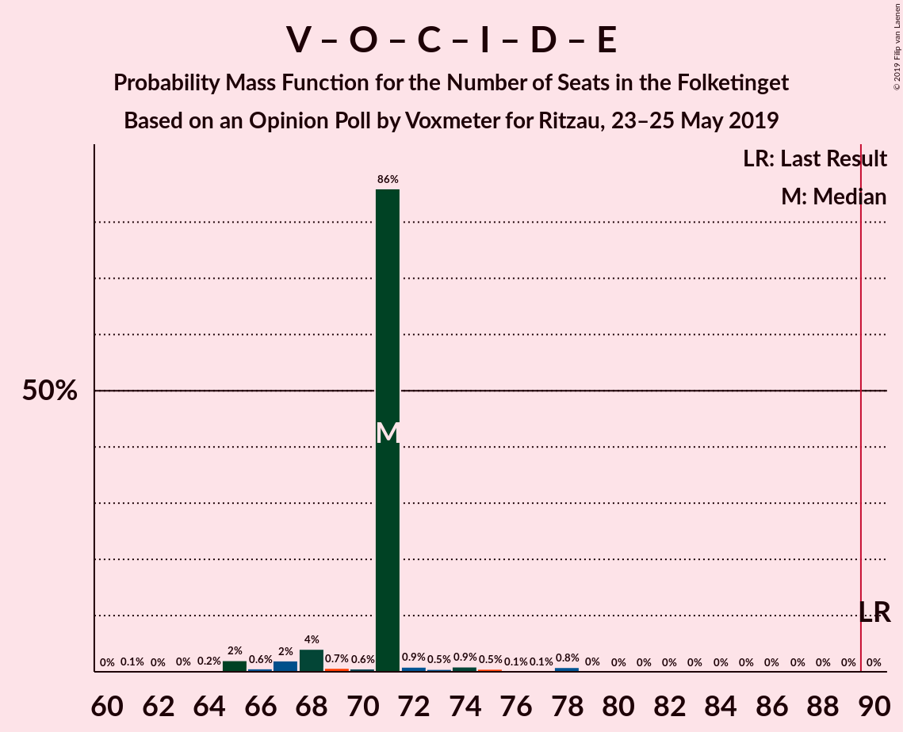

| Number of Seats | Probability | Accumulated | Special Marks |
|:---------------:|:-----------:|:-----------:|:-------------:|
| 61 | 0.1% | 100% |  |
| 62 | 0% | 99.9% |  |
| 63 | 0% | 99.9% |  |
| 64 | 0.2% | 99.9% |  |
| 65 | 2% | 99.6% |  |
| 66 | 0.6% | 98% |  |
| 67 | 2% | 97% |  |
| 68 | 4% | 95% |  |
| 69 | 0.7% | 91% |  |
| 70 | 0.6% | 90% |  |
| 71 | 86% | 90% | Median |
| 72 | 0.9% | 4% |  |
| 73 | 0.5% | 3% |  |
| 74 | 0.9% | 2% |  |
| 75 | 0.5% | 2% |  |
| 76 | 0.1% | 1.0% |  |
| 77 | 0.1% | 0.9% |  |
| 78 | 0.8% | 0.8% |  |
| 79 | 0% | 0% |  |
| 80 | 0% | 0% |  |
| 81 | 0% | 0% |  |
| 82 | 0% | 0% |  |
| 83 | 0% | 0% |  |
| 84 | 0% | 0% |  |
| 85 | 0% | 0% |  |
| 86 | 0% | 0% |  |
| 87 | 0% | 0% |  |
| 88 | 0% | 0% |  |
| 89 | 0% | 0% |  |
| 90 | 0% | 0% | Last Result, Majority |

### Venstre – Dansk Folkeparti – Det Konservative Folkeparti – Liberal Alliance – Nye Borgerlige

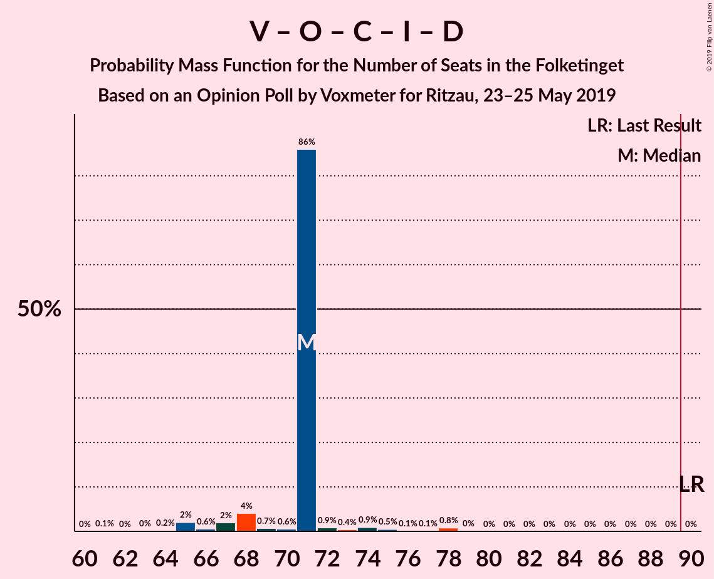

| Number of Seats | Probability | Accumulated | Special Marks |
|:---------------:|:-----------:|:-----------:|:-------------:|
| 61 | 0.1% | 100% |  |
| 62 | 0% | 99.9% |  |
| 63 | 0% | 99.9% |  |
| 64 | 0.2% | 99.9% |  |
| 65 | 2% | 99.6% |  |
| 66 | 0.6% | 98% |  |
| 67 | 2% | 97% |  |
| 68 | 4% | 95% |  |
| 69 | 0.7% | 91% |  |
| 70 | 0.6% | 90% |  |
| 71 | 86% | 90% | Median |
| 72 | 0.9% | 4% |  |
| 73 | 0.4% | 3% |  |
| 74 | 0.9% | 2% |  |
| 75 | 0.5% | 1.5% |  |
| 76 | 0.1% | 1.0% |  |
| 77 | 0.1% | 0.9% |  |
| 78 | 0.8% | 0.8% |  |
| 79 | 0% | 0% |  |
| 80 | 0% | 0% |  |
| 81 | 0% | 0% |  |
| 82 | 0% | 0% |  |
| 83 | 0% | 0% |  |
| 84 | 0% | 0% |  |
| 85 | 0% | 0% |  |
| 86 | 0% | 0% |  |
| 87 | 0% | 0% |  |
| 88 | 0% | 0% |  |
| 89 | 0% | 0% |  |
| 90 | 0% | 0% | Last Result, Majority |

### Venstre – Dansk Folkeparti – Det Konservative Folkeparti – Liberal Alliance – Kristendemokraterne

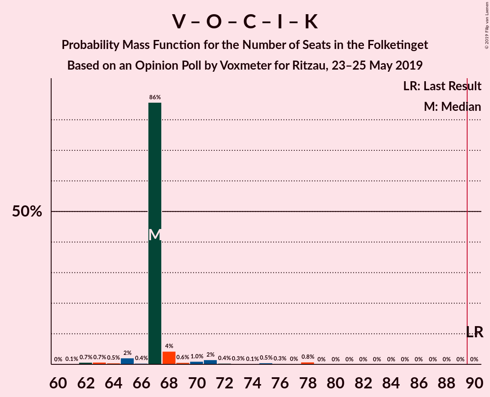

| Number of Seats | Probability | Accumulated | Special Marks |
|:---------------:|:-----------:|:-----------:|:-------------:|
| 61 | 0.1% | 100% |  |
| 62 | 0.7% | 99.9% |  |
| 63 | 0.7% | 99.2% |  |
| 64 | 0.5% | 98% |  |
| 65 | 2% | 98% |  |
| 66 | 0.4% | 96% |  |
| 67 | 86% | 96% | Median |
| 68 | 4% | 10% |  |
| 69 | 0.6% | 6% |  |
| 70 | 1.0% | 5% |  |
| 71 | 2% | 4% |  |
| 72 | 0.4% | 2% |  |
| 73 | 0.3% | 2% |  |
| 74 | 0.1% | 2% |  |
| 75 | 0.5% | 2% |  |
| 76 | 0.3% | 1.1% |  |
| 77 | 0% | 0.8% |  |
| 78 | 0.8% | 0.8% |  |
| 79 | 0% | 0% |  |
| 80 | 0% | 0% |  |
| 81 | 0% | 0% |  |
| 82 | 0% | 0% |  |
| 83 | 0% | 0% |  |
| 84 | 0% | 0% |  |
| 85 | 0% | 0% |  |
| 86 | 0% | 0% |  |
| 87 | 0% | 0% |  |
| 88 | 0% | 0% |  |
| 89 | 0% | 0% |  |
| 90 | 0% | 0% | Last Result, Majority |

### Venstre – Dansk Folkeparti – Det Konservative Folkeparti – Liberal Alliance

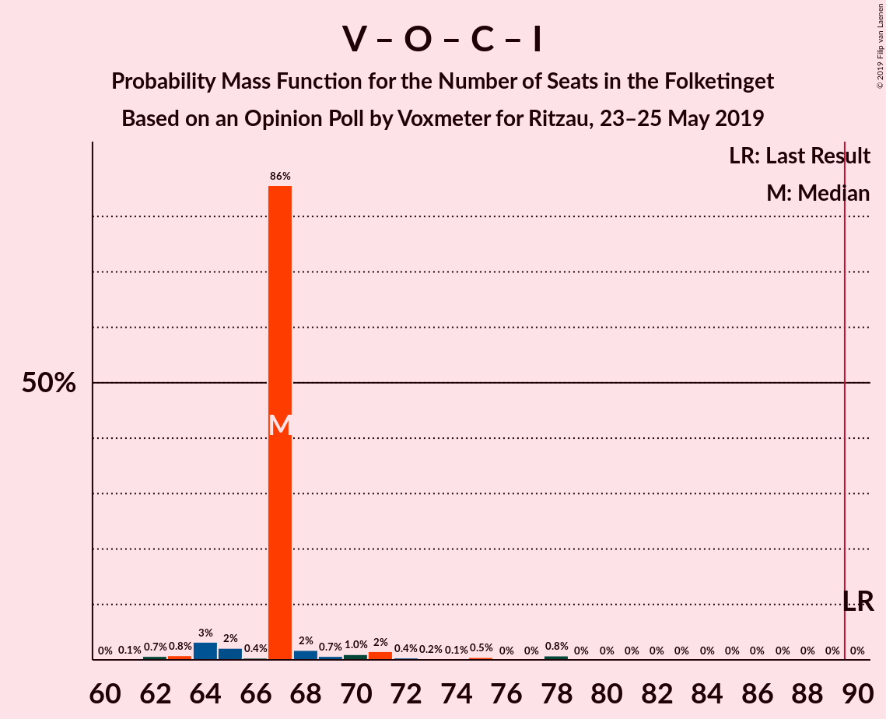

| Number of Seats | Probability | Accumulated | Special Marks |
|:---------------:|:-----------:|:-----------:|:-------------:|
| 61 | 0.1% | 100% |  |
| 62 | 0.7% | 99.9% |  |
| 63 | 0.8% | 99.2% |  |
| 64 | 3% | 98% |  |
| 65 | 2% | 95% |  |
| 66 | 0.4% | 93% |  |
| 67 | 86% | 93% | Median |
| 68 | 2% | 7% |  |
| 69 | 0.7% | 5% |  |
| 70 | 1.0% | 5% |  |
| 71 | 2% | 4% |  |
| 72 | 0.4% | 2% |  |
| 73 | 0.2% | 2% |  |
| 74 | 0.1% | 1.4% |  |
| 75 | 0.5% | 1.3% |  |
| 76 | 0% | 0.8% |  |
| 77 | 0% | 0.8% |  |
| 78 | 0.8% | 0.8% |  |
| 79 | 0% | 0% |  |
| 80 | 0% | 0% |  |
| 81 | 0% | 0% |  |
| 82 | 0% | 0% |  |
| 83 | 0% | 0% |  |
| 84 | 0% | 0% |  |
| 85 | 0% | 0% |  |
| 86 | 0% | 0% |  |
| 87 | 0% | 0% |  |
| 88 | 0% | 0% |  |
| 89 | 0% | 0% |  |
| 90 | 0% | 0% | Last Result, Majority |

### Socialdemokraterne – Radikale Venstre

| Number of Seats | Probability | Accumulated | Special Marks |
|:---------------:|:-----------:|:-----------:|:-------------:|
| 55 | 0% | 100% | Last Result |
| 56 | 0.1% | 99.9% |  |
| 57 | 0.8% | 99.8% |  |
| 58 | 0.1% | 99.0% |  |
| 59 | 0.4% | 98.9% |  |
| 60 | 2% | 98% |  |
| 61 | 0.3% | 97% |  |
| 62 | 1.3% | 96% |  |
| 63 | 0.7% | 95% |  |
| 64 | 5% | 94% |  |
| 65 | 87% | 89% | Median |
| 66 | 1.1% | 2% |  |
| 67 | 0.1% | 1.3% |  |
| 68 | 0.3% | 1.2% |  |
| 69 | 0.5% | 1.0% |  |
| 70 | 0.4% | 0.4% |  |
| 71 | 0% | 0% |  |

### Venstre – Det Konservative Folkeparti – Liberal Alliance

| Number of Seats | Probability | Accumulated | Special Marks |
|:---------------:|:-----------:|:-----------:|:-------------:|
| 40 | 0.6% | 100% |  |
| 41 | 0.6% | 99.4% |  |
| 42 | 0.3% | 98.8% |  |
| 43 | 0.7% | 98% |  |
| 44 | 5% | 98% |  |
| 45 | 85% | 92% | Median |
| 46 | 0.4% | 7% |  |
| 47 | 2% | 6% |  |
| 48 | 0.8% | 5% |  |
| 49 | 1.2% | 4% |  |
| 50 | 1.2% | 3% |  |
| 51 | 0.2% | 2% |  |
| 52 | 0.1% | 1.4% |  |
| 53 | 0.8% | 1.3% | Last Result |
| 54 | 0.5% | 0.5% |  |
| 55 | 0% | 0% |  |

### Venstre – Det Konservative Folkeparti

| Number of Seats | Probability | Accumulated | Special Marks |
|:---------------:|:-----------:|:-----------:|:-------------:|
| 33 | 0.1% | 100% |  |
| 34 | 0.6% | 99.9% |  |
| 35 | 0.3% | 99.3% |  |
| 36 | 1.1% | 99.0% |  |
| 37 | 88% | 98% | Median |
| 38 | 2% | 10% |  |
| 39 | 4% | 9% |  |
| 40 | 0.5% | 5% | Last Result |
| 41 | 1.3% | 4% |  |
| 42 | 0.3% | 3% |  |
| 43 | 1.0% | 2% |  |
| 44 | 0.1% | 1.5% |  |
| 45 | 0.5% | 1.4% |  |
| 46 | 0.8% | 0.8% |  |
| 47 | 0% | 0.1% |  |
| 48 | 0% | 0% |  |

### Venstre

| Number of Seats | Probability | Accumulated | Special Marks |
|:---------------:|:-----------:|:-----------:|:-------------:|
| 26 | 0.2% | 100% |  |
| 27 | 0.3% | 99.8% |  |
| 28 | 1.2% | 99.5% |  |
| 29 | 1.5% | 98% |  |
| 30 | 89% | 97% | Median |
| 31 | 2% | 8% |  |
| 32 | 0.4% | 6% |  |
| 33 | 2% | 6% |  |
| 34 | 2% | 3% | Last Result |
| 35 | 0.2% | 2% |  |
| 36 | 1.3% | 1.4% |  |
| 37 | 0% | 0.1% |  |
| 38 | 0% | 0.1% |  |
| 39 | 0% | 0% |  |

## Technical Information

### Opinion Poll

+ **Polling firm:** Voxmeter
+ **Commissioner(s):** Ritzau
+ **Fieldwork period:** 23–25 May 2019

### Calculations

+ **Sample size:** 1005
+ **Simulations done:** 1,048,576
+ **Error estimate:** 1.91%

