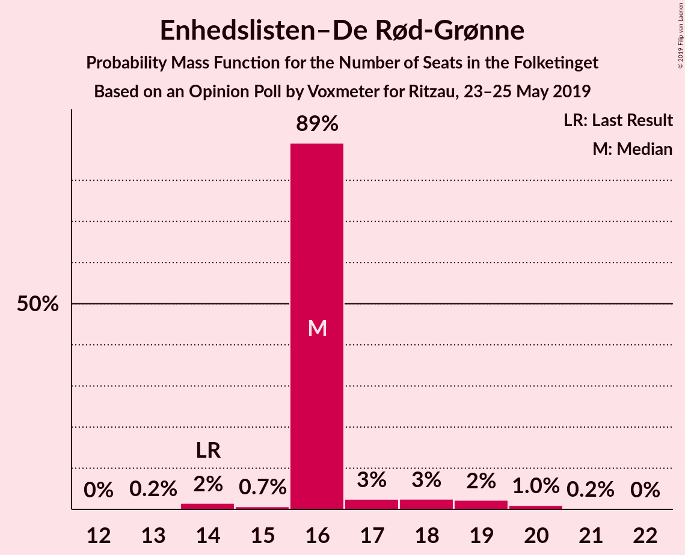
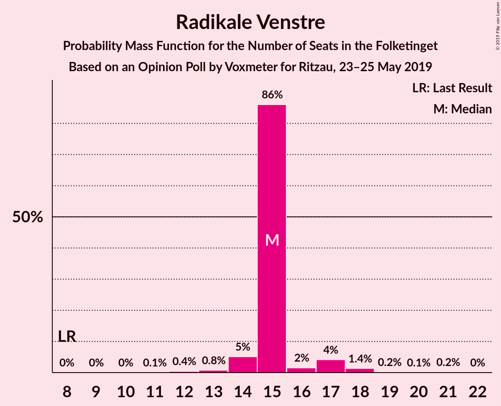
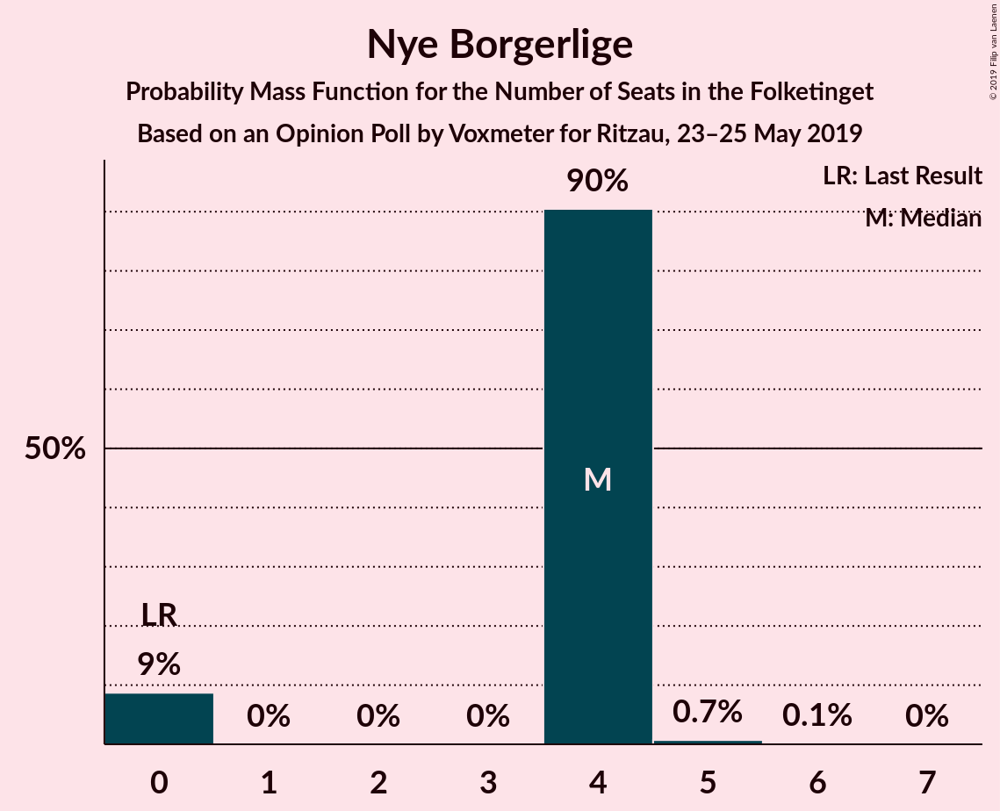
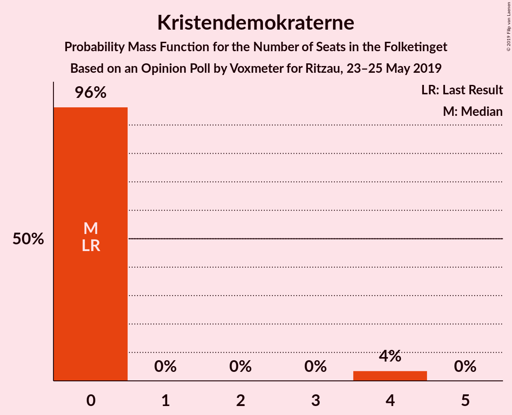
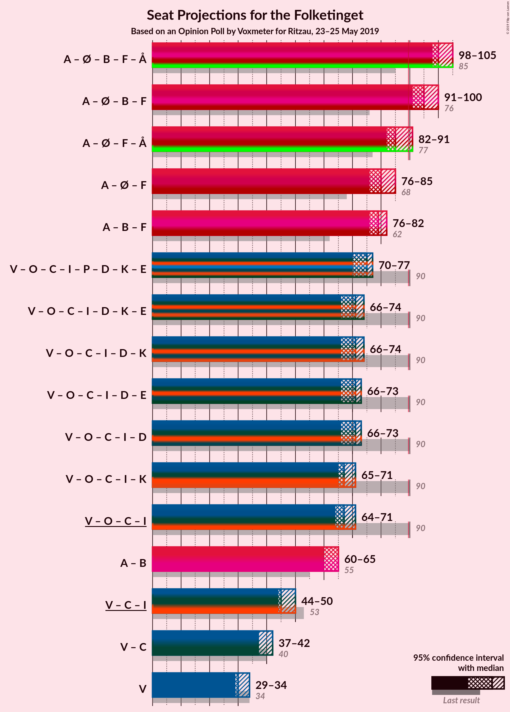
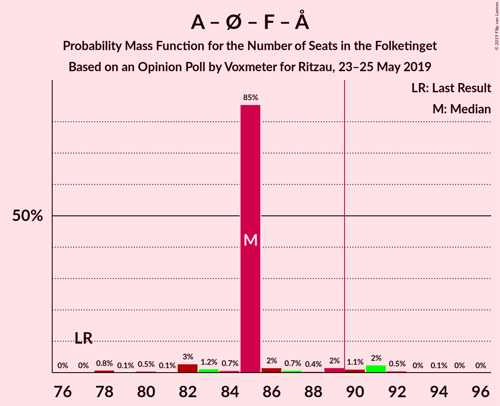
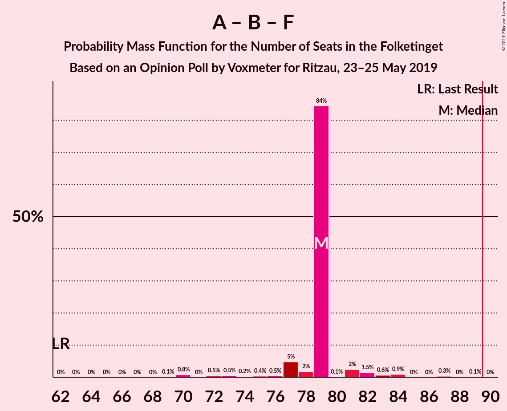
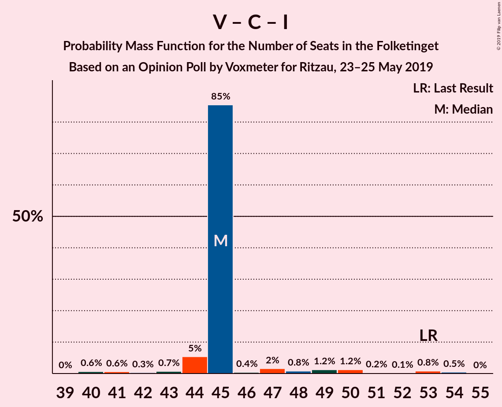

# Opinion Poll by Voxmeter for Ritzau, 23–25 May 2019

<a href="#voting-intentions">Voting Intentions</a> | <a href="#seats">Seats</a> | <a href="#coalitions">Coalitions</a> | <a href="#technical-information">Technical Information</a>

## Voting Intentions

### Confidence Intervals

| Party | Last Result | Poll Result | 80% Confidence Interval | 90% Confidence Interval | 95% Confidence Interval | 99% Confidence Interval |
|:-----:|:-----------:|:-----------:|:-----------------------:|:-----------------------:|:-----------------------:|:-----------------------:|
| Socialdemokraterne | 26.3% | 25.9% | 24.2–27.7% |23.7–28.2% |23.3–28.7% |22.5–29.6% |
| Venstre | 19.5% | 17.8% | 16.3–19.4% |15.9–19.9% |15.6–20.3% |14.9–21.1% |
| Dansk Folkeparti | 21.1% | 11.7% | 10.5–13.1% |10.2–13.5% |9.9–13.9% |9.3–14.6% |
| Enhedslisten–De Rød-Grønne | 7.8% | 9.0% | 7.9–10.2% |7.6–10.6% |7.3–10.9% |6.9–11.5% |
| Radikale Venstre | 4.6% | 8.5% | 7.4–9.7% |7.1–10.0% |6.9–10.3% |6.4–11.0% |
| Socialistisk Folkeparti | 4.2% | 8.5% | 7.4–9.7% |7.1–10.0% |6.9–10.3% |6.4–11.0% |
| Det Konservative Folkeparti | 3.4% | 4.4% | 3.6–5.3% |3.4–5.6% |3.3–5.8% |3.0–6.3% |
| Liberal Alliance | 7.5% | 3.9% | 3.2–4.8% |3.0–5.0% |2.9–5.3% |2.6–5.7% |
| Alternativet | 4.8% | 3.4% | 2.8–4.2% |2.6–4.5% |2.4–4.7% |2.2–5.1% |
| Stram Kurs | 0.0% | 2.3% | 1.8–3.0% |1.6–3.2% |1.5–3.4% |1.3–3.8% |
| Nye Borgerlige | 0.0% | 1.9% | 1.4–2.6% |1.3–2.8% |1.2–2.9% |1.0–3.3% |
| Kristendemokraterne | 0.8% | 1.3% | 0.9–1.9% |0.8–2.1% |0.8–2.2% |0.6–2.5% |
| Klaus Riskær Pedersen | 0.0% | 0.9% | 0.6–1.4% |0.5–1.6% |0.5–1.7% |0.4–2.0% |

*Note:* The poll result column reflects the actual value used in the calculations. Published results may vary slightly, and in addition be rounded to fewer digits.

## Seats

### Confidence Intervals

| Party | Last Result | Median | 80% Confidence Interval | 90% Confidence Interval | 95% Confidence Interval | 99% Confidence Interval |
|:-----:|:-----------:|:------:|:-----------------------:|:-----------------------:|:-----------------------:|:-----------------------:|
| <a href="#socialdemokraterne">Socialdemokraterne</a> | 47 | 42 | 42–47 |42–49 |42–50 |41–50 |
| <a href="#venstre">Venstre</a> | 34 | 36 | 30–36 |29–36 |27–36 |26–36 |
| <a href="#dansk-folkeparti">Dansk Folkeparti</a> | 37 | 25 | 21–25 |21–25 |20–25 |18–26 |
| <a href="#enhedslisten–de-rød-grønne">Enhedslisten–De Rød-Grønne</a> | 14 | 17 | 16–18 |16–20 |15–21 |14–21 |
| <a href="#radikale-venstre">Radikale Venstre</a> | 8 | 15 | 13–18 |12–18 |11–18 |11–20 |
| <a href="#socialistisk-folkeparti">Socialistisk Folkeparti</a> | 7 | 13 | 13–19 |13–19 |13–19 |12–19 |
| <a href="#det-konservative-folkeparti">Det Konservative Folkeparti</a> | 6 | 10 | 9–10 |6–10 |6–10 |6–10 |
| <a href="#liberal-alliance">Liberal Alliance</a> | 13 | 7 | 7–8 |7–8 |5–9 |5–11 |
| <a href="#alternativet">Alternativet</a> | 9 | 6 | 6–7 |6–7 |5–8 |5–9 |
| <a href="#stram-kurs">Stram Kurs</a> | 0 | 4 | 0–5 |0–6 |0–6 |0–6 |
| <a href="#nye-borgerlige">Nye Borgerlige</a> | 0 | 0 | 0 |0–4 |0–5 |0–5 |
| <a href="#kristendemokraterne">Kristendemokraterne</a> | 0 | 0 | 0 |0 |0 |0–4 |
| <a href="#klaus-riskær-pedersen">Klaus Riskær Pedersen</a> | 0 | 0 | 0 |0 |0 |0 |

### Socialdemokraterne

*For a full overview of the results for this party, see the [Socialdemokraterne](party-socialdemokraterne.html) page.*

| Number of Seats | Probability | Accumulated | Special Marks |
|:---------------:|:-----------:|:-----------:|:-------------:|
| 39 | 0.1% | 100% |  |
| 40 | 0.1% | 99.8% |  |
| 41 | 2% | 99.7% |  |
| 42 | 53% | 98% | Median |
| 43 | 1.2% | 45% |  |
| 44 | 7% | 44% |  |
| 45 | 4% | 37% |  |
| 46 | 3% | 33% |  |
| 47 | 20% | 30% | Last Result |
| 48 | 4% | 10% |  |
| 49 | 3% | 6% |  |
| 50 | 3% | 4% |  |
| 51 | 0.3% | 0.4% |  |
| 52 | 0% | 0.1% |  |
| 53 | 0% | 0% |  |

### Venstre

*For a full overview of the results for this party, see the [Venstre](party-venstre.html) page.*

| Number of Seats | Probability | Accumulated | Special Marks |
|:---------------:|:-----------:|:-----------:|:-------------:|
| 25 | 0% | 100% |  |
| 26 | 1.5% | 99.9% |  |
| 27 | 2% | 98% |  |
| 28 | 0.2% | 97% |  |
| 29 | 3% | 96% |  |
| 30 | 23% | 93% |  |
| 31 | 6% | 71% |  |
| 32 | 3% | 65% |  |
| 33 | 0.4% | 62% |  |
| 34 | 1.2% | 62% | Last Result |
| 35 | 3% | 61% |  |
| 36 | 58% | 58% | Median |
| 37 | 0% | 0.1% |  |
| 38 | 0% | 0.1% |  |
| 39 | 0% | 0% |  |

### Dansk Folkeparti

*For a full overview of the results for this party, see the [Dansk Folkeparti](party-danskfolkeparti.html) page.*

| Number of Seats | Probability | Accumulated | Special Marks |
|:---------------:|:-----------:|:-----------:|:-------------:|
| 16 | 0.2% | 100% |  |
| 17 | 0.1% | 99.8% |  |
| 18 | 1.3% | 99.8% |  |
| 19 | 0.3% | 98% |  |
| 20 | 1.2% | 98% |  |
| 21 | 20% | 97% |  |
| 22 | 15% | 77% |  |
| 23 | 3% | 62% |  |
| 24 | 1.4% | 58% |  |
| 25 | 55% | 57% | Median |
| 26 | 2% | 2% |  |
| 27 | 0% | 0.4% |  |
| 28 | 0.4% | 0.4% |  |
| 29 | 0% | 0% |  |
| 30 | 0% | 0% |  |
| 31 | 0% | 0% |  |
| 32 | 0% | 0% |  |
| 33 | 0% | 0% |  |
| 34 | 0% | 0% |  |
| 35 | 0% | 0% |  |
| 36 | 0% | 0% |  |
| 37 | 0% | 0% | Last Result |

### Enhedslisten–De Rød-Grønne

*For a full overview of the results for this party, see the [Enhedslisten–De Rød-Grønne](party-enhedslisten–derød-grønne.html) page.*

| Number of Seats | Probability | Accumulated | Special Marks |
|:---------------:|:-----------:|:-----------:|:-------------:|
| 12 | 0.1% | 100% |  |
| 13 | 0.1% | 99.9% |  |
| 14 | 0.8% | 99.8% | Last Result |
| 15 | 2% | 99.0% |  |
| 16 | 23% | 97% |  |
| 17 | 60% | 74% | Median |
| 18 | 5% | 14% |  |
| 19 | 2% | 9% |  |
| 20 | 2% | 7% |  |
| 21 | 5% | 5% |  |
| 22 | 0% | 0% |  |

### Radikale Venstre

*For a full overview of the results for this party, see the [Radikale Venstre](party-radikalevenstre.html) page.*

| Number of Seats | Probability | Accumulated | Special Marks |
|:---------------:|:-----------:|:-----------:|:-------------:|
| 8 | 0% | 100% | Last Result |
| 9 | 0% | 100% |  |
| 10 | 0% | 100% |  |
| 11 | 3% | 100% |  |
| 12 | 5% | 97% |  |
| 13 | 4% | 92% |  |
| 14 | 2% | 88% |  |
| 15 | 60% | 86% | Median |
| 16 | 2% | 26% |  |
| 17 | 0.7% | 24% |  |
| 18 | 22% | 24% |  |
| 19 | 0.2% | 2% |  |
| 20 | 1.3% | 1.4% |  |
| 21 | 0.1% | 0.1% |  |
| 22 | 0% | 0% |  |

### Socialistisk Folkeparti

*For a full overview of the results for this party, see the [Socialistisk Folkeparti](party-socialistiskfolkeparti.html) page.*

| Number of Seats | Probability | Accumulated | Special Marks |
|:---------------:|:-----------:|:-----------:|:-------------:|
| 7 | 0% | 100% | Last Result |
| 8 | 0% | 100% |  |
| 9 | 0% | 100% |  |
| 10 | 0% | 100% |  |
| 11 | 0.1% | 100% |  |
| 12 | 0.8% | 99.9% |  |
| 13 | 58% | 99.0% | Median |
| 14 | 3% | 41% |  |
| 15 | 7% | 38% |  |
| 16 | 6% | 31% |  |
| 17 | 0.5% | 25% |  |
| 18 | 3% | 24% |  |
| 19 | 21% | 21% |  |
| 20 | 0.1% | 0.1% |  |
| 21 | 0% | 0% |  |

### Det Konservative Folkeparti

*For a full overview of the results for this party, see the [Det Konservative Folkeparti](party-detkonservativefolkeparti.html) page.*

| Number of Seats | Probability | Accumulated | Special Marks |
|:---------------:|:-----------:|:-----------:|:-------------:|
| 5 | 0.2% | 100% |  |
| 6 | 6% | 99.8% | Last Result |
| 7 | 1.0% | 93% |  |
| 8 | 1.4% | 92% |  |
| 9 | 12% | 91% |  |
| 10 | 78% | 79% | Median |
| 11 | 0.2% | 0.5% |  |
| 12 | 0.3% | 0.3% |  |
| 13 | 0% | 0% |  |

### Liberal Alliance

*For a full overview of the results for this party, see the [Liberal Alliance](party-liberalalliance.html) page.*

| Number of Seats | Probability | Accumulated | Special Marks |
|:---------------:|:-----------:|:-----------:|:-------------:|
| 5 | 3% | 100% |  |
| 6 | 1.5% | 97% |  |
| 7 | 85% | 96% | Median |
| 8 | 7% | 11% |  |
| 9 | 3% | 4% |  |
| 10 | 0.8% | 2% |  |
| 11 | 0.6% | 0.7% |  |
| 12 | 0% | 0% |  |
| 13 | 0% | 0% | Last Result |

### Alternativet

*For a full overview of the results for this party, see the [Alternativet](party-alternativet.html) page.*

| Number of Seats | Probability | Accumulated | Special Marks |
|:---------------:|:-----------:|:-----------:|:-------------:|
| 4 | 0.2% | 100% |  |
| 5 | 4% | 99.8% |  |
| 6 | 65% | 96% | Median |
| 7 | 27% | 31% |  |
| 8 | 3% | 4% |  |
| 9 | 1.1% | 1.2% | Last Result |
| 10 | 0.1% | 0.1% |  |
| 11 | 0% | 0% |  |

### Stram Kurs

*For a full overview of the results for this party, see the [Stram Kurs](party-stramkurs.html) page.*

| Number of Seats | Probability | Accumulated | Special Marks |
|:---------------:|:-----------:|:-----------:|:-------------:|
| 0 | 27% | 100% | Last Result |
| 1 | 0% | 73% |  |
| 2 | 0% | 73% |  |
| 3 | 0% | 73% |  |
| 4 | 56% | 73% | Median |
| 5 | 11% | 17% |  |
| 6 | 6% | 6% |  |
| 7 | 0% | 0.1% |  |
| 8 | 0.1% | 0.1% |  |
| 9 | 0% | 0% |  |

### Nye Borgerlige

*For a full overview of the results for this party, see the [Nye Borgerlige](party-nyeborgerlige.html) page.*

| Number of Seats | Probability | Accumulated | Special Marks |
|:---------------:|:-----------:|:-----------:|:-------------:|
| 0 | 92% | 100% | Last Result, Median |
| 1 | 0% | 8% |  |
| 2 | 0% | 8% |  |
| 3 | 0% | 8% |  |
| 4 | 4% | 8% |  |
| 5 | 4% | 4% |  |
| 6 | 0.2% | 0.2% |  |
| 7 | 0% | 0% |  |

### Kristendemokraterne

*For a full overview of the results for this party, see the [Kristendemokraterne](party-kristendemokraterne.html) page.*

| Number of Seats | Probability | Accumulated | Special Marks |
|:---------------:|:-----------:|:-----------:|:-------------:|
| 0 | 98.6% | 100% | Last Result, Median |
| 1 | 0% | 1.4% |  |
| 2 | 0% | 1.4% |  |
| 3 | 0% | 1.4% |  |
| 4 | 1.3% | 1.4% |  |
| 5 | 0.1% | 0.1% |  |
| 6 | 0% | 0% |  |

### Klaus Riskær Pedersen

*For a full overview of the results for this party, see the [Klaus Riskær Pedersen](party-klausriskærpedersen.html) page.*

| Number of Seats | Probability | Accumulated | Special Marks |
|:---------------:|:-----------:|:-----------:|:-------------:|
| 0 | 100% | 100% | Last Result, Median |

## Coalitions

### Confidence Intervals

| Coalition | Last Result | Median | Majority? | 80% Confidence Interval | 90% Confidence Interval | 95% Confidence Interval | 99% Confidence Interval |
|:---------:|:-----------:|:------:|:---------:|:-----------------------:|:-----------------------:|:-----------------------:|:-----------------------:|
| Socialdemokraterne – Enhedslisten–De Rød-Grønne – Radikale Venstre – Socialistisk Folkeparti – Alternativet | 85 | 93 | 100% | 93–107 | 93–107 | 93–107 | 93–111 |
| Socialdemokraterne – Enhedslisten–De Rød-Grønne – Radikale Venstre – Socialistisk Folkeparti | 76 | 87 | 45% | 87–100 | 87–100 | 87–100 | 87–103 |
| Socialdemokraterne – Enhedslisten–De Rød-Grønne – Socialistisk Folkeparti – Alternativet | 77 | 78 | 1.1% | 78–89 | 78–89 | 78–89 | 78–96 |
| Socialdemokraterne – Radikale Venstre – Socialistisk Folkeparti | 62 | 70 | 0% | 70–84 | 69–84 | 69–84 | 68–84 |
| Socialdemokraterne – Enhedslisten–De Rød-Grønne – Socialistisk Folkeparti | 68 | 72 | 0% | 72–82 | 72–82 | 72–83 | 72–88 |
| Venstre – Dansk Folkeparti – Det Konservative Folkeparti – Liberal Alliance – Stram Kurs – Nye Borgerlige – Kristendemokraterne – Klaus Riskær Pedersen | 90 | 82 | 0% | 68–82 | 68–82 | 68–82 | 64–82 |
| Venstre – Dansk Folkeparti – Det Konservative Folkeparti – Liberal Alliance – Nye Borgerlige – Kristendemokraterne – Klaus Riskær Pedersen | 90 | 78 | 0% | 68–78 | 68–78 | 67–78 | 64–78 |
| Venstre – Dansk Folkeparti – Det Konservative Folkeparti – Liberal Alliance – Nye Borgerlige – Klaus Riskær Pedersen | 90 | 78 | 0% | 68–78 | 68–78 | 67–78 | 64–78 |
| Venstre – Dansk Folkeparti – Det Konservative Folkeparti – Liberal Alliance – Nye Borgerlige – Kristendemokraterne | 90 | 78 | 0% | 68–78 | 68–78 | 67–78 | 64–78 |
| Venstre – Dansk Folkeparti – Det Konservative Folkeparti – Liberal Alliance – Nye Borgerlige | 90 | 78 | 0% | 68–78 | 68–78 | 67–78 | 64–78 |
| Venstre – Dansk Folkeparti – Det Konservative Folkeparti – Liberal Alliance – Kristendemokraterne | 90 | 78 | 0% | 68–78 | 65–78 | 64–78 | 62–78 |
| Venstre – Dansk Folkeparti – Det Konservative Folkeparti – Liberal Alliance | 90 | 78 | 0% | 68–78 | 65–78 | 64–78 | 62–78 |
| Socialdemokraterne – Radikale Venstre | 55 | 57 | 0% | 57–65 | 56–65 | 56–66 | 54–69 |
| Venstre – Det Konservative Folkeparti – Liberal Alliance | 53 | 53 | 0% | 47–53 | 42–53 | 42–53 | 40–54 |
| Venstre – Det Konservative Folkeparti | 40 | 46 | 0% | 40–46 | 35–46 | 35–46 | 33–46 |
| Venstre | 34 | 36 | 0% | 30–36 | 29–36 | 27–36 | 26–36 |

### Socialdemokraterne – Enhedslisten–De Rød-Grønne – Radikale Venstre – Socialistisk Folkeparti – Alternativet

| Number of Seats | Probability | Accumulated | Special Marks |
|:---------------:|:-----------:|:-----------:|:-------------:|
| 85 | 0% | 100% | Last Result |
| 86 | 0% | 100% |  |
| 87 | 0% | 100% |  |
| 88 | 0% | 100% |  |
| 89 | 0% | 100% |  |
| 90 | 0% | 100% | Majority |
| 91 | 0% | 100% |  |
| 92 | 0% | 100% |  |
| 93 | 54% | 100% | Median |
| 94 | 0.3% | 46% |  |
| 95 | 0.9% | 45% |  |
| 96 | 5% | 45% |  |
| 97 | 0.3% | 40% |  |
| 98 | 0.1% | 39% |  |
| 99 | 0.6% | 39% |  |
| 100 | 9% | 39% |  |
| 101 | 0.5% | 29% |  |
| 102 | 4% | 29% |  |
| 103 | 3% | 24% |  |
| 104 | 0.3% | 22% |  |
| 105 | 0.1% | 21% |  |
| 106 | 0.1% | 21% |  |
| 107 | 20% | 21% |  |
| 108 | 0% | 1.0% |  |
| 109 | 0% | 1.0% |  |
| 110 | 0% | 1.0% |  |
| 111 | 1.0% | 1.0% |  |
| 112 | 0% | 0% |  |

### Socialdemokraterne – Enhedslisten–De Rød-Grønne – Radikale Venstre – Socialistisk Folkeparti

| Number of Seats | Probability | Accumulated | Special Marks |
|:---------------:|:-----------:|:-----------:|:-------------:|
| 76 | 0% | 100% | Last Result |
| 77 | 0% | 100% |  |
| 78 | 0% | 100% |  |
| 79 | 0% | 100% |  |
| 80 | 0% | 100% |  |
| 81 | 0% | 100% |  |
| 82 | 0% | 100% |  |
| 83 | 0% | 100% |  |
| 84 | 0% | 100% |  |
| 85 | 0.2% | 100% |  |
| 86 | 0.2% | 99.8% |  |
| 87 | 54% | 99.6% | Median |
| 88 | 0% | 46% |  |
| 89 | 0.1% | 45% |  |
| 90 | 6% | 45% | Majority |
| 91 | 0.3% | 40% |  |
| 92 | 0.5% | 39% |  |
| 93 | 7% | 39% |  |
| 94 | 5% | 31% |  |
| 95 | 0.3% | 26% |  |
| 96 | 0.3% | 26% |  |
| 97 | 3% | 26% |  |
| 98 | 1.4% | 23% |  |
| 99 | 0% | 21% |  |
| 100 | 20% | 21% |  |
| 101 | 0.2% | 1.2% |  |
| 102 | 0% | 1.0% |  |
| 103 | 1.0% | 1.0% |  |
| 104 | 0% | 0% |  |

### Socialdemokraterne – Enhedslisten–De Rød-Grønne – Socialistisk Folkeparti – Alternativet

| Number of Seats | Probability | Accumulated | Special Marks |
|:---------------:|:-----------:|:-----------:|:-------------:|
| 77 | 0.1% | 100% | Last Result |
| 78 | 53% | 99.9% | Median |
| 79 | 0.1% | 47% |  |
| 80 | 1.2% | 47% |  |
| 81 | 0.8% | 45% |  |
| 82 | 0.2% | 45% |  |
| 83 | 2% | 44% |  |
| 84 | 7% | 42% |  |
| 85 | 5% | 36% |  |
| 86 | 2% | 31% |  |
| 87 | 2% | 29% |  |
| 88 | 3% | 27% |  |
| 89 | 23% | 24% |  |
| 90 | 0% | 1.1% | Majority |
| 91 | 0% | 1.1% |  |
| 92 | 0.1% | 1.1% |  |
| 93 | 0% | 1.0% |  |
| 94 | 0% | 1.0% |  |
| 95 | 0% | 1.0% |  |
| 96 | 1.0% | 1.0% |  |
| 97 | 0% | 0% |  |

### Socialdemokraterne – Radikale Venstre – Socialistisk Folkeparti

| Number of Seats | Probability | Accumulated | Special Marks |
|:---------------:|:-----------:|:-----------:|:-------------:|
| 62 | 0% | 100% | Last Result |
| 63 | 0% | 100% |  |
| 64 | 0% | 100% |  |
| 65 | 0% | 100% |  |
| 66 | 0% | 100% |  |
| 67 | 0.1% | 100% |  |
| 68 | 1.0% | 99.9% |  |
| 69 | 5% | 98.9% |  |
| 70 | 53% | 94% | Median |
| 71 | 0.1% | 41% |  |
| 72 | 1.0% | 41% |  |
| 73 | 1.1% | 40% |  |
| 74 | 0.1% | 39% |  |
| 75 | 2% | 39% |  |
| 76 | 8% | 37% |  |
| 77 | 2% | 29% |  |
| 78 | 0.7% | 27% |  |
| 79 | 0.2% | 26% |  |
| 80 | 0.7% | 26% |  |
| 81 | 3% | 25% |  |
| 82 | 0.2% | 23% |  |
| 83 | 2% | 22% |  |
| 84 | 20% | 20% |  |
| 85 | 0% | 0% |  |

### Socialdemokraterne – Enhedslisten–De Rød-Grønne – Socialistisk Folkeparti

| Number of Seats | Probability | Accumulated | Special Marks |
|:---------------:|:-----------:|:-----------:|:-------------:|
| 68 | 0% | 100% | Last Result |
| 69 | 0% | 100% |  |
| 70 | 0.1% | 100% |  |
| 71 | 0% | 99.8% |  |
| 72 | 53% | 99.8% | Median |
| 73 | 0.1% | 47% |  |
| 74 | 1.1% | 46% |  |
| 75 | 0.1% | 45% |  |
| 76 | 0.9% | 45% |  |
| 77 | 0.8% | 44% |  |
| 78 | 13% | 44% |  |
| 79 | 3% | 31% |  |
| 80 | 2% | 28% |  |
| 81 | 0.1% | 26% |  |
| 82 | 22% | 26% |  |
| 83 | 3% | 4% |  |
| 84 | 0% | 1.1% |  |
| 85 | 0% | 1.0% |  |
| 86 | 0% | 1.0% |  |
| 87 | 0% | 1.0% |  |
| 88 | 1.0% | 1.0% |  |
| 89 | 0% | 0% |  |

### Venstre – Dansk Folkeparti – Det Konservative Folkeparti – Liberal Alliance – Stram Kurs – Nye Borgerlige – Kristendemokraterne – Klaus Riskær Pedersen

| Number of Seats | Probability | Accumulated | Special Marks |
|:---------------:|:-----------:|:-----------:|:-------------:|
| 64 | 1.0% | 100% |  |
| 65 | 0% | 99.0% |  |
| 66 | 0% | 99.0% |  |
| 67 | 0% | 99.0% |  |
| 68 | 20% | 99.0% |  |
| 69 | 0.1% | 79% |  |
| 70 | 0.1% | 79% |  |
| 71 | 0.3% | 79% |  |
| 72 | 3% | 78% |  |
| 73 | 4% | 76% |  |
| 74 | 0.5% | 71% |  |
| 75 | 9% | 71% |  |
| 76 | 0.6% | 61% |  |
| 77 | 0.1% | 61% |  |
| 78 | 0.3% | 61% |  |
| 79 | 5% | 60% |  |
| 80 | 0.9% | 55% |  |
| 81 | 0.3% | 55% |  |
| 82 | 54% | 54% | Median |
| 83 | 0% | 0% |  |
| 84 | 0% | 0% |  |
| 85 | 0% | 0% |  |
| 86 | 0% | 0% |  |
| 87 | 0% | 0% |  |
| 88 | 0% | 0% |  |
| 89 | 0% | 0% |  |
| 90 | 0% | 0% | Last Result, Majority |

### Venstre – Dansk Folkeparti – Det Konservative Folkeparti – Liberal Alliance – Nye Borgerlige – Kristendemokraterne – Klaus Riskær Pedersen

| Number of Seats | Probability | Accumulated | Special Marks |
|:---------------:|:-----------:|:-----------:|:-------------:|
| 63 | 0.2% | 100% |  |
| 64 | 1.0% | 99.8% |  |
| 65 | 0% | 98.7% |  |
| 66 | 1.1% | 98.7% |  |
| 67 | 2% | 98% |  |
| 68 | 21% | 96% |  |
| 69 | 3% | 74% |  |
| 70 | 5% | 71% |  |
| 71 | 0.6% | 67% |  |
| 72 | 0.1% | 66% |  |
| 73 | 3% | 66% |  |
| 74 | 5% | 63% |  |
| 75 | 3% | 58% |  |
| 76 | 0.9% | 56% |  |
| 77 | 1.3% | 55% |  |
| 78 | 53% | 53% | Median |
| 79 | 0% | 0.1% |  |
| 80 | 0% | 0.1% |  |
| 81 | 0% | 0.1% |  |
| 82 | 0.1% | 0.1% |  |
| 83 | 0% | 0% |  |
| 84 | 0% | 0% |  |
| 85 | 0% | 0% |  |
| 86 | 0% | 0% |  |
| 87 | 0% | 0% |  |
| 88 | 0% | 0% |  |
| 89 | 0% | 0% |  |
| 90 | 0% | 0% | Last Result, Majority |

### Venstre – Dansk Folkeparti – Det Konservative Folkeparti – Liberal Alliance – Nye Borgerlige – Klaus Riskær Pedersen

| Number of Seats | Probability | Accumulated | Special Marks |
|:---------------:|:-----------:|:-----------:|:-------------:|
| 62 | 0% | 100% |  |
| 63 | 0.2% | 99.9% |  |
| 64 | 1.0% | 99.7% |  |
| 65 | 0% | 98.7% |  |
| 66 | 1.1% | 98.7% |  |
| 67 | 2% | 98% |  |
| 68 | 21% | 96% |  |
| 69 | 4% | 74% |  |
| 70 | 5% | 70% |  |
| 71 | 0.6% | 66% |  |
| 72 | 0.1% | 65% |  |
| 73 | 2% | 65% |  |
| 74 | 5% | 63% |  |
| 75 | 3% | 58% |  |
| 76 | 0.9% | 55% |  |
| 77 | 1.2% | 54% |  |
| 78 | 53% | 53% | Median |
| 79 | 0% | 0.1% |  |
| 80 | 0% | 0.1% |  |
| 81 | 0% | 0.1% |  |
| 82 | 0.1% | 0.1% |  |
| 83 | 0% | 0% |  |
| 84 | 0% | 0% |  |
| 85 | 0% | 0% |  |
| 86 | 0% | 0% |  |
| 87 | 0% | 0% |  |
| 88 | 0% | 0% |  |
| 89 | 0% | 0% |  |
| 90 | 0% | 0% | Last Result, Majority |

### Venstre – Dansk Folkeparti – Det Konservative Folkeparti – Liberal Alliance – Nye Borgerlige – Kristendemokraterne

| Number of Seats | Probability | Accumulated | Special Marks |
|:---------------:|:-----------:|:-----------:|:-------------:|
| 63 | 0.2% | 100% |  |
| 64 | 1.0% | 99.8% |  |
| 65 | 0% | 98.7% |  |
| 66 | 1.1% | 98.7% |  |
| 67 | 2% | 98% |  |
| 68 | 21% | 96% |  |
| 69 | 3% | 74% |  |
| 70 | 5% | 71% |  |
| 71 | 0.5% | 67% |  |
| 72 | 0.1% | 66% |  |
| 73 | 3% | 66% |  |
| 74 | 5% | 63% |  |
| 75 | 3% | 58% |  |
| 76 | 0.9% | 56% |  |
| 77 | 1.3% | 55% |  |
| 78 | 53% | 53% | Median |
| 79 | 0% | 0.1% |  |
| 80 | 0% | 0.1% |  |
| 81 | 0% | 0.1% |  |
| 82 | 0.1% | 0.1% |  |
| 83 | 0% | 0% |  |
| 84 | 0% | 0% |  |
| 85 | 0% | 0% |  |
| 86 | 0% | 0% |  |
| 87 | 0% | 0% |  |
| 88 | 0% | 0% |  |
| 89 | 0% | 0% |  |
| 90 | 0% | 0% | Last Result, Majority |

### Venstre – Dansk Folkeparti – Det Konservative Folkeparti – Liberal Alliance – Nye Borgerlige

| Number of Seats | Probability | Accumulated | Special Marks |
|:---------------:|:-----------:|:-----------:|:-------------:|
| 62 | 0% | 100% |  |
| 63 | 0.2% | 99.9% |  |
| 64 | 1.0% | 99.7% |  |
| 65 | 0% | 98.7% |  |
| 66 | 1.1% | 98.7% |  |
| 67 | 2% | 98% |  |
| 68 | 21% | 96% |  |
| 69 | 4% | 74% |  |
| 70 | 5% | 70% |  |
| 71 | 0.5% | 66% |  |
| 72 | 0.1% | 65% |  |
| 73 | 2% | 65% |  |
| 74 | 5% | 63% |  |
| 75 | 3% | 58% |  |
| 76 | 0.9% | 55% |  |
| 77 | 1.2% | 54% |  |
| 78 | 53% | 53% | Median |
| 79 | 0% | 0.1% |  |
| 80 | 0% | 0.1% |  |
| 81 | 0% | 0.1% |  |
| 82 | 0.1% | 0.1% |  |
| 83 | 0% | 0% |  |
| 84 | 0% | 0% |  |
| 85 | 0% | 0% |  |
| 86 | 0% | 0% |  |
| 87 | 0% | 0% |  |
| 88 | 0% | 0% |  |
| 89 | 0% | 0% |  |
| 90 | 0% | 0% | Last Result, Majority |

### Venstre – Dansk Folkeparti – Det Konservative Folkeparti – Liberal Alliance – Kristendemokraterne

| Number of Seats | Probability | Accumulated | Special Marks |
|:---------------:|:-----------:|:-----------:|:-------------:|
| 60 | 0% | 100% |  |
| 61 | 0% | 99.9% |  |
| 62 | 2% | 99.9% |  |
| 63 | 0.2% | 98% |  |
| 64 | 1.3% | 98% |  |
| 65 | 3% | 97% |  |
| 66 | 2% | 94% |  |
| 67 | 0.2% | 92% |  |
| 68 | 21% | 92% |  |
| 69 | 0.1% | 71% |  |
| 70 | 5% | 71% |  |
| 71 | 0.2% | 66% |  |
| 72 | 1.2% | 66% |  |
| 73 | 3% | 64% |  |
| 74 | 5% | 61% |  |
| 75 | 2% | 56% |  |
| 76 | 0.7% | 54% |  |
| 77 | 0.1% | 53% |  |
| 78 | 53% | 53% | Median |
| 79 | 0% | 0.1% |  |
| 80 | 0% | 0.1% |  |
| 81 | 0% | 0% |  |
| 82 | 0% | 0% |  |
| 83 | 0% | 0% |  |
| 84 | 0% | 0% |  |
| 85 | 0% | 0% |  |
| 86 | 0% | 0% |  |
| 87 | 0% | 0% |  |
| 88 | 0% | 0% |  |
| 89 | 0% | 0% |  |
| 90 | 0% | 0% | Last Result, Majority |

### Venstre – Dansk Folkeparti – Det Konservative Folkeparti – Liberal Alliance

| Number of Seats | Probability | Accumulated | Special Marks |
|:---------------:|:-----------:|:-----------:|:-------------:|
| 60 | 0% | 100% |  |
| 61 | 0.1% | 99.9% |  |
| 62 | 2% | 99.9% |  |
| 63 | 0.2% | 98% |  |
| 64 | 1.3% | 98% |  |
| 65 | 3% | 97% |  |
| 66 | 2% | 94% |  |
| 67 | 0.2% | 92% |  |
| 68 | 21% | 92% |  |
| 69 | 1.1% | 71% |  |
| 70 | 5% | 69% |  |
| 71 | 0.2% | 65% |  |
| 72 | 1.1% | 65% |  |
| 73 | 2% | 63% |  |
| 74 | 5% | 61% |  |
| 75 | 2% | 56% |  |
| 76 | 0.7% | 54% |  |
| 77 | 0.1% | 53% |  |
| 78 | 53% | 53% | Median |
| 79 | 0% | 0.1% |  |
| 80 | 0% | 0.1% |  |
| 81 | 0% | 0% |  |
| 82 | 0% | 0% |  |
| 83 | 0% | 0% |  |
| 84 | 0% | 0% |  |
| 85 | 0% | 0% |  |
| 86 | 0% | 0% |  |
| 87 | 0% | 0% |  |
| 88 | 0% | 0% |  |
| 89 | 0% | 0% |  |
| 90 | 0% | 0% | Last Result, Majority |

### Socialdemokraterne – Radikale Venstre

| Number of Seats | Probability | Accumulated | Special Marks |
|:---------------:|:-----------:|:-----------:|:-------------:|
| 53 | 0.2% | 100% |  |
| 54 | 1.1% | 99.7% |  |
| 55 | 0.1% | 98.7% | Last Result |
| 56 | 5% | 98.6% |  |
| 57 | 56% | 93% | Median |
| 58 | 0.1% | 37% |  |
| 59 | 0.3% | 37% |  |
| 60 | 5% | 37% |  |
| 61 | 3% | 32% |  |
| 62 | 2% | 29% |  |
| 63 | 2% | 27% |  |
| 64 | 2% | 25% |  |
| 65 | 21% | 24% |  |
| 66 | 2% | 3% |  |
| 67 | 0% | 2% |  |
| 68 | 0.2% | 2% |  |
| 69 | 1.2% | 1.3% |  |
| 70 | 0% | 0% |  |

### Venstre – Det Konservative Folkeparti – Liberal Alliance

| Number of Seats | Probability | Accumulated | Special Marks |
|:---------------:|:-----------:|:-----------:|:-------------:|
| 38 | 0% | 100% |  |
| 39 | 0% | 99.9% |  |
| 40 | 2% | 99.9% |  |
| 41 | 0% | 98% |  |
| 42 | 6% | 98% |  |
| 43 | 0.1% | 92% |  |
| 44 | 0.2% | 92% |  |
| 45 | 0.4% | 92% |  |
| 46 | 1.2% | 92% |  |
| 47 | 21% | 90% |  |
| 48 | 5% | 69% |  |
| 49 | 0.3% | 65% |  |
| 50 | 2% | 64% |  |
| 51 | 2% | 62% |  |
| 52 | 6% | 61% |  |
| 53 | 54% | 54% | Last Result, Median |
| 54 | 0.7% | 0.8% |  |
| 55 | 0% | 0.1% |  |
| 56 | 0% | 0.1% |  |
| 57 | 0% | 0% |  |

### Venstre – Det Konservative Folkeparti

| Number of Seats | Probability | Accumulated | Special Marks |
|:---------------:|:-----------:|:-----------:|:-------------:|
| 32 | 0.1% | 100% |  |
| 33 | 2% | 99.9% |  |
| 34 | 0% | 98% |  |
| 35 | 4% | 98% |  |
| 36 | 1.3% | 94% |  |
| 37 | 0.6% | 92% |  |
| 38 | 1.1% | 92% |  |
| 39 | 0.2% | 91% |  |
| 40 | 26% | 90% | Last Result |
| 41 | 0.3% | 65% |  |
| 42 | 3% | 65% |  |
| 43 | 0.3% | 62% |  |
| 44 | 2% | 62% |  |
| 45 | 7% | 60% |  |
| 46 | 53% | 53% | Median |
| 47 | 0% | 0.1% |  |
| 48 | 0% | 0% |  |

### Venstre

| Number of Seats | Probability | Accumulated | Special Marks |
|:---------------:|:-----------:|:-----------:|:-------------:|
| 25 | 0% | 100% |  |
| 26 | 1.5% | 99.9% |  |
| 27 | 2% | 98% |  |
| 28 | 0.2% | 97% |  |
| 29 | 3% | 96% |  |
| 30 | 23% | 93% |  |
| 31 | 6% | 71% |  |
| 32 | 3% | 65% |  |
| 33 | 0.4% | 62% |  |
| 34 | 1.2% | 62% | Last Result |
| 35 | 3% | 61% |  |
| 36 | 58% | 58% | Median |
| 37 | 0% | 0.1% |  |
| 38 | 0% | 0.1% |  |
| 39 | 0% | 0% |  |

## Technical Information

### Opinion Poll

+ **Polling firm:** Voxmeter
+ **Commissioner(s):** Ritzau
+ **Fieldwork period:** 23–25 May 2019

### Calculations

+ **Sample size:** 1005
+ **Simulations done:** 131,072
+ **Error estimate:** 2.09%

