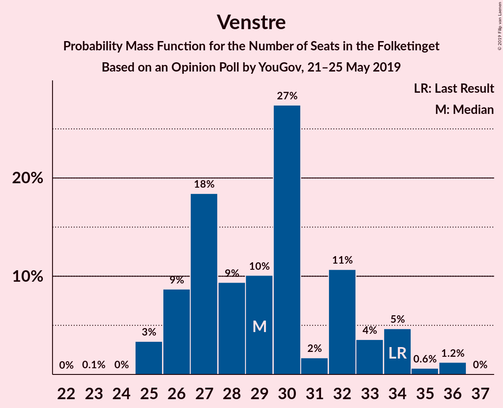
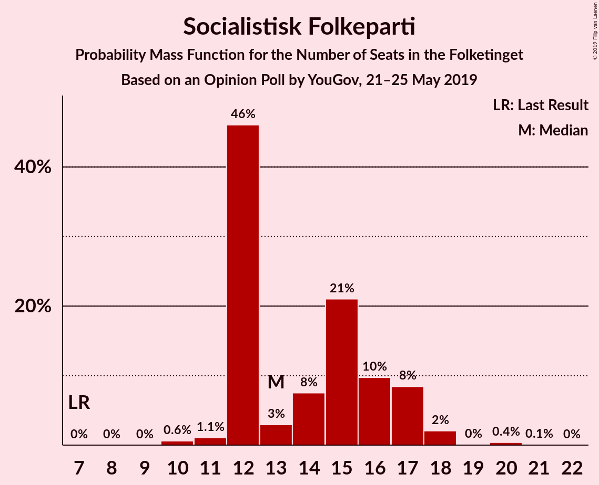
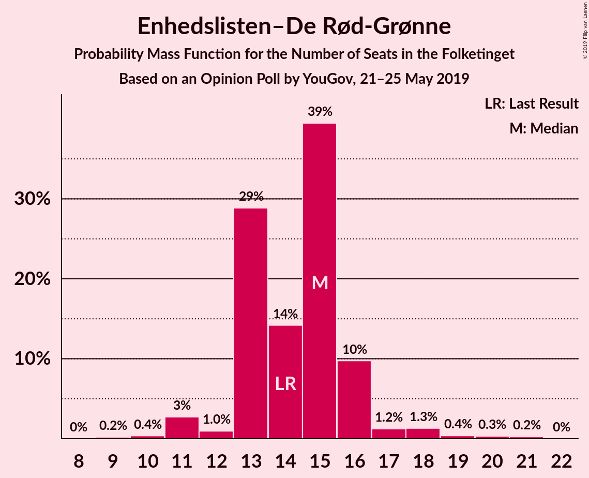
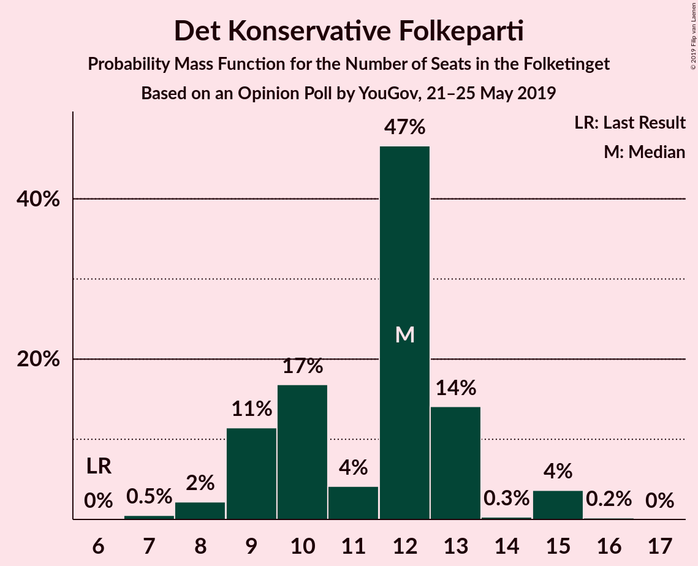
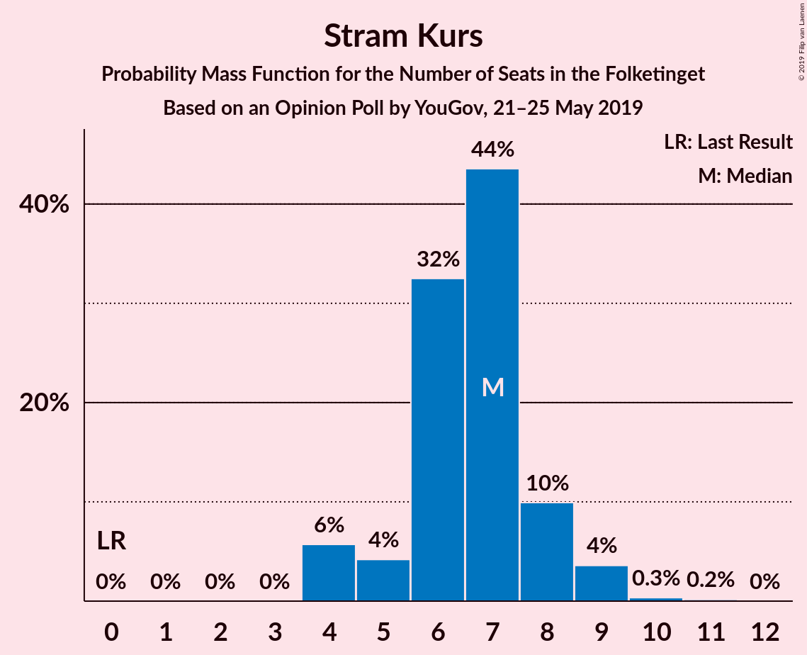
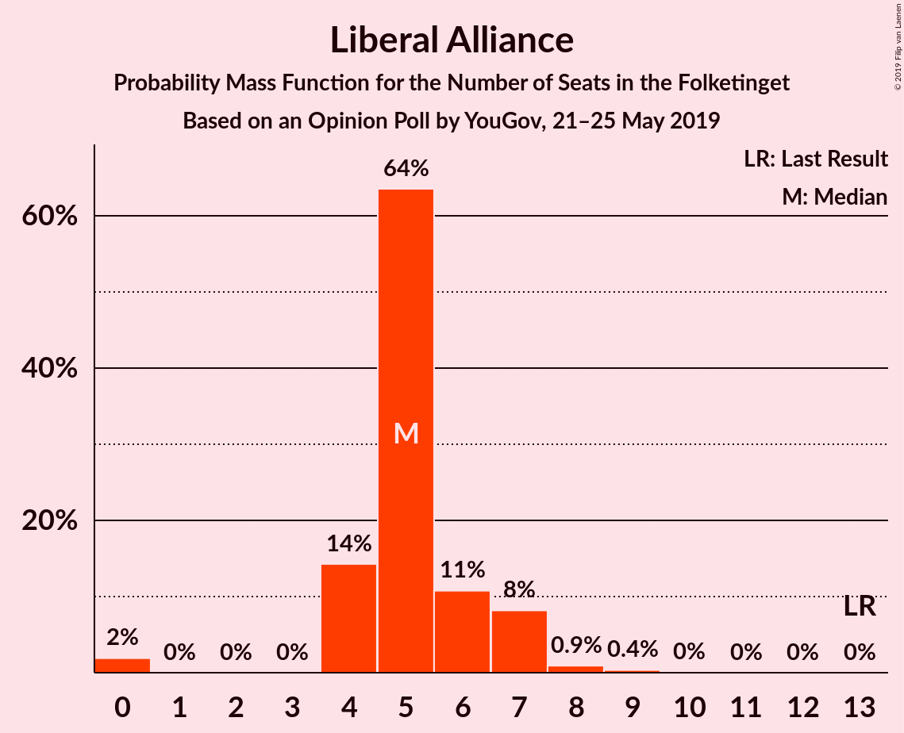
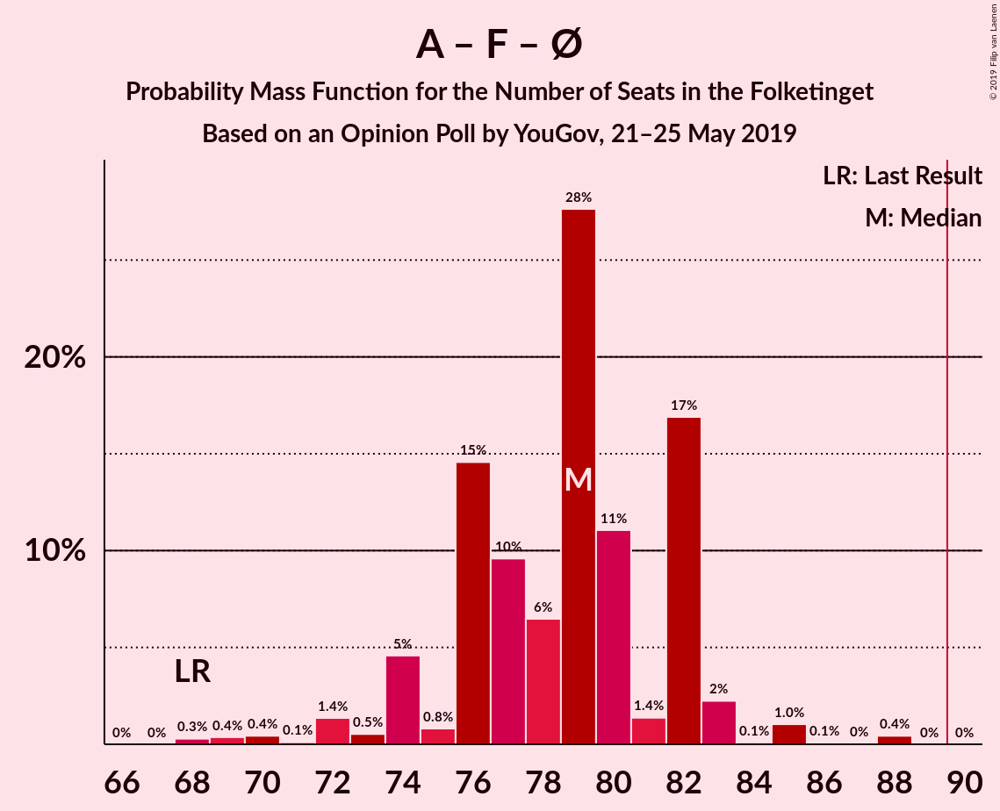

# Opinion Poll by YouGov, 21–25 May 2019

<a href="#voting-intentions">Voting Intentions</a> | <a href="#seats">Seats</a> | <a href="#coalitions">Coalitions</a> | <a href="#technical-information">Technical Information</a>

## Voting Intentions

### Confidence Intervals

| Party | Last Result | Poll Result | 80% Confidence Interval | 90% Confidence Interval | 95% Confidence Interval | 99% Confidence Interval |
|:-----:|:-----------:|:-----------:|:-----------------------:|:-----------------------:|:-----------------------:|:-----------------------:|
| Socialdemokraterne | 26.3% | 27.5% | 25.8–29.4% |25.3–30.0% |24.8–30.4% |24.0–31.3% |
| Venstre | 19.5% | 16.9% | 15.4–18.5% |15.0–18.9% |14.6–19.3% |14.0–20.1% |
| Dansk Folkeparti | 21.1% | 11.8% | 10.6–13.2% |10.2–13.6% |9.9–14.0% |9.4–14.7% |
| Socialistisk Folkeparti | 4.2% | 8.2% | 7.1–9.4% |6.9–9.8% |6.6–10.1% |6.2–10.7% |
| Enhedslisten–De Rød-Grønne | 7.8% | 8.1% | 7.1–9.3% |6.8–9.6% |6.5–9.9% |6.1–10.6% |
| Radikale Venstre | 4.6% | 6.6% | 5.6–7.7% |5.4–8.0% |5.2–8.3% |4.8–8.9% |
| Det Konservative Folkeparti | 3.4% | 6.2% | 5.3–7.3% |5.0–7.6% |4.8–7.8% |4.4–8.4% |
| Nye Borgerlige | 0.0% | 4.0% | 3.3–5.0% |3.1–5.2% |3.0–5.5% |2.7–5.9% |
| Stram Kurs | 0.0% | 3.6% | 3.0–4.5% |2.8–4.8% |2.6–5.0% |2.3–5.5% |
| Liberal Alliance | 7.5% | 2.9% | 2.3–3.7% |2.2–4.0% |2.0–4.2% |1.8–4.6% |
| Alternativet | 4.8% | 2.3% | 1.8–3.1% |1.7–3.3% |1.6–3.5% |1.3–3.9% |
| Kristendemokraterne | 0.8% | 1.1% | 0.8–1.7% |0.7–1.8% |0.6–2.0% |0.5–2.3% |
| Klaus Riskær Pedersen | 0.0% | 0.7% | 0.5–1.2% |0.4–1.3% |0.3–1.5% |0.3–1.7% |

*Note:* The poll result column reflects the actual value used in the calculations. Published results may vary slightly, and in addition be rounded to fewer digits.

## Seats

### Confidence Intervals

| Party | Last Result | Median | 80% Confidence Interval | 90% Confidence Interval | 95% Confidence Interval | 99% Confidence Interval |
|:-----:|:-----------:|:------:|:-----------------------:|:-----------------------:|:-----------------------:|:-----------------------:|
| <a href="#socialdemokraterne">Socialdemokraterne</a> | 47 | 50 | 46–52 |46–52 |43–52 |43–54 |
| <a href="#venstre">Venstre</a> | 34 | 31 | 27–32 |27–32 |27–32 |23–34 |
| <a href="#dansk-folkeparti">Dansk Folkeparti</a> | 37 | 19 | 18–23 |18–23 |18–24 |15–27 |
| <a href="#socialistisk-folkeparti">Socialistisk Folkeparti</a> | 7 | 16 | 11–18 |11–18 |11–18 |11–18 |
| <a href="#enhedslisten–de-rød-grønne">Enhedslisten–De Rød-Grønne</a> | 14 | 14 | 13–15 |13–15 |13–16 |11–18 |
| <a href="#radikale-venstre">Radikale Venstre</a> | 8 | 12 | 10–12 |10–12 |10–12 |9–15 |
| <a href="#det-konservative-folkeparti">Det Konservative Folkeparti</a> | 6 | 11 | 11–12 |11–13 |10–14 |8–15 |
| <a href="#nye-borgerlige">Nye Borgerlige</a> | 0 | 9 | 8–10 |7–10 |6–10 |6–11 |
| <a href="#stram-kurs">Stram Kurs</a> | 0 | 7 | 6–9 |6–9 |5–9 |4–9 |
| <a href="#liberal-alliance">Liberal Alliance</a> | 13 | 5 | 0–7 |0–7 |0–8 |0–8 |
| <a href="#alternativet">Alternativet</a> | 9 | 5 | 0–6 |0–6 |0–6 |0–6 |
| <a href="#kristendemokraterne">Kristendemokraterne</a> | 0 | 0 | 0 |0 |0 |0–4 |
| <a href="#klaus-riskær-pedersen">Klaus Riskær Pedersen</a> | 0 | 0 | 0 |0 |0 |0 |

### Socialdemokraterne

*For a full overview of the results for this party, see the [Socialdemokraterne](party-socialdemokraterne.html) page.*

| Number of Seats | Probability | Accumulated | Special Marks |
|:---------------:|:-----------:|:-----------:|:-------------:|
| 41 | 0.3% | 100% |  |
| 42 | 0% | 99.7% |  |
| 43 | 3% | 99.7% |  |
| 44 | 0.3% | 97% |  |
| 45 | 0.2% | 97% |  |
| 46 | 33% | 97% |  |
| 47 | 0.4% | 63% | Last Result |
| 48 | 4% | 63% |  |
| 49 | 0.4% | 59% |  |
| 50 | 26% | 59% | Median |
| 51 | 0.1% | 33% |  |
| 52 | 31% | 33% |  |
| 53 | 0.8% | 2% |  |
| 54 | 0.6% | 0.9% |  |
| 55 | 0.1% | 0.3% |  |
| 56 | 0% | 0.2% |  |
| 57 | 0.2% | 0.2% |  |
| 58 | 0% | 0% |  |

### Venstre

*For a full overview of the results for this party, see the [Venstre](party-venstre.html) page.*

| Number of Seats | Probability | Accumulated | Special Marks |
|:---------------:|:-----------:|:-----------:|:-------------:|
| 23 | 0.6% | 100% |  |
| 24 | 0% | 99.4% |  |
| 25 | 0.2% | 99.4% |  |
| 26 | 0.9% | 99.2% |  |
| 27 | 30% | 98% |  |
| 28 | 4% | 68% |  |
| 29 | 2% | 64% |  |
| 30 | 3% | 62% |  |
| 31 | 33% | 60% | Median |
| 32 | 26% | 27% |  |
| 33 | 0.4% | 1.0% |  |
| 34 | 0.4% | 0.6% | Last Result |
| 35 | 0% | 0.3% |  |
| 36 | 0% | 0.2% |  |
| 37 | 0.2% | 0.2% |  |
| 38 | 0% | 0% |  |

### Dansk Folkeparti

*For a full overview of the results for this party, see the [Dansk Folkeparti](party-danskfolkeparti.html) page.*

| Number of Seats | Probability | Accumulated | Special Marks |
|:---------------:|:-----------:|:-----------:|:-------------:|
| 14 | 0.2% | 100% |  |
| 15 | 1.0% | 99.8% |  |
| 16 | 0.4% | 98.9% |  |
| 17 | 0.3% | 98% |  |
| 18 | 30% | 98% |  |
| 19 | 35% | 68% | Median |
| 20 | 0.9% | 33% |  |
| 21 | 0.5% | 32% |  |
| 22 | 2% | 32% |  |
| 23 | 27% | 30% |  |
| 24 | 1.2% | 3% |  |
| 25 | 0.1% | 2% |  |
| 26 | 0.1% | 2% |  |
| 27 | 2% | 2% |  |
| 28 | 0% | 0% |  |
| 29 | 0% | 0% |  |
| 30 | 0% | 0% |  |
| 31 | 0% | 0% |  |
| 32 | 0% | 0% |  |
| 33 | 0% | 0% |  |
| 34 | 0% | 0% |  |
| 35 | 0% | 0% |  |
| 36 | 0% | 0% |  |
| 37 | 0% | 0% | Last Result |

### Socialistisk Folkeparti

*For a full overview of the results for this party, see the [Socialistisk Folkeparti](party-socialistiskfolkeparti.html) page.*

| Number of Seats | Probability | Accumulated | Special Marks |
|:---------------:|:-----------:|:-----------:|:-------------:|
| 7 | 0% | 100% | Last Result |
| 8 | 0% | 100% |  |
| 9 | 0.1% | 100% |  |
| 10 | 0.4% | 99.9% |  |
| 11 | 26% | 99.5% |  |
| 12 | 0.4% | 74% |  |
| 13 | 0.8% | 73% |  |
| 14 | 2% | 73% |  |
| 15 | 4% | 71% |  |
| 16 | 30% | 66% | Median |
| 17 | 3% | 36% |  |
| 18 | 33% | 33% |  |
| 19 | 0.3% | 0.4% |  |
| 20 | 0.1% | 0.1% |  |
| 21 | 0% | 0% |  |

### Enhedslisten–De Rød-Grønne

*For a full overview of the results for this party, see the [Enhedslisten–De Rød-Grønne](party-enhedslisten–derød-grønne.html) page.*

| Number of Seats | Probability | Accumulated | Special Marks |
|:---------------:|:-----------:|:-----------:|:-------------:|
| 10 | 0.1% | 100% |  |
| 11 | 0.9% | 99.9% |  |
| 12 | 0.4% | 99.0% |  |
| 13 | 35% | 98.6% |  |
| 14 | 32% | 64% | Last Result, Median |
| 15 | 29% | 32% |  |
| 16 | 2% | 3% |  |
| 17 | 0.4% | 1.2% |  |
| 18 | 0.7% | 0.8% |  |
| 19 | 0% | 0.1% |  |
| 20 | 0.1% | 0.1% |  |
| 21 | 0% | 0% |  |

### Radikale Venstre

*For a full overview of the results for this party, see the [Radikale Venstre](party-radikalevenstre.html) page.*

| Number of Seats | Probability | Accumulated | Special Marks |
|:---------------:|:-----------:|:-----------:|:-------------:|
| 8 | 0.2% | 100% | Last Result |
| 9 | 0.5% | 99.8% |  |
| 10 | 26% | 99.3% |  |
| 11 | 4% | 73% |  |
| 12 | 67% | 69% | Median |
| 13 | 0.7% | 2% |  |
| 14 | 1.0% | 2% |  |
| 15 | 0.3% | 0.7% |  |
| 16 | 0.2% | 0.4% |  |
| 17 | 0.2% | 0.2% |  |
| 18 | 0% | 0% |  |

### Det Konservative Folkeparti

*For a full overview of the results for this party, see the [Det Konservative Folkeparti](party-detkonservativefolkeparti.html) page.*

| Number of Seats | Probability | Accumulated | Special Marks |
|:---------------:|:-----------:|:-----------:|:-------------:|
| 6 | 0% | 100% | Last Result |
| 7 | 0.2% | 100% |  |
| 8 | 0.7% | 99.8% |  |
| 9 | 1.0% | 99.0% |  |
| 10 | 2% | 98% |  |
| 11 | 62% | 96% | Median |
| 12 | 26% | 33% |  |
| 13 | 2% | 7% |  |
| 14 | 4% | 5% |  |
| 15 | 0.8% | 0.8% |  |
| 16 | 0% | 0% |  |

### Nye Borgerlige

*For a full overview of the results for this party, see the [Nye Borgerlige](party-nyeborgerlige.html) page.*

| Number of Seats | Probability | Accumulated | Special Marks |
|:---------------:|:-----------:|:-----------:|:-------------:|
| 0 | 0% | 100% | Last Result |
| 1 | 0% | 100% |  |
| 2 | 0% | 100% |  |
| 3 | 0% | 100% |  |
| 4 | 0% | 100% |  |
| 5 | 0.4% | 100% |  |
| 6 | 4% | 99.6% |  |
| 7 | 2% | 96% |  |
| 8 | 33% | 94% |  |
| 9 | 32% | 61% | Median |
| 10 | 28% | 29% |  |
| 11 | 0.4% | 0.7% |  |
| 12 | 0.3% | 0.3% |  |
| 13 | 0% | 0% |  |

### Stram Kurs

*For a full overview of the results for this party, see the [Stram Kurs](party-stramkurs.html) page.*

| Number of Seats | Probability | Accumulated | Special Marks |
|:---------------:|:-----------:|:-----------:|:-------------:|
| 0 | 0% | 100% | Last Result |
| 1 | 0% | 100% |  |
| 2 | 0% | 100% |  |
| 3 | 0% | 100% |  |
| 4 | 2% | 100% |  |
| 5 | 1.5% | 98% |  |
| 6 | 37% | 97% |  |
| 7 | 29% | 60% | Median |
| 8 | 0.4% | 31% |  |
| 9 | 30% | 30% |  |
| 10 | 0.1% | 0.1% |  |
| 11 | 0% | 0% |  |

### Liberal Alliance

*For a full overview of the results for this party, see the [Liberal Alliance](party-liberalalliance.html) page.*

| Number of Seats | Probability | Accumulated | Special Marks |
|:---------------:|:-----------:|:-----------:|:-------------:|
| 0 | 26% | 100% |  |
| 1 | 0% | 74% |  |
| 2 | 0% | 74% |  |
| 3 | 0% | 74% |  |
| 4 | 0.7% | 74% |  |
| 5 | 34% | 73% | Median |
| 6 | 5% | 39% |  |
| 7 | 32% | 34% |  |
| 8 | 3% | 3% |  |
| 9 | 0.2% | 0.2% |  |
| 10 | 0% | 0% |  |
| 11 | 0% | 0% |  |
| 12 | 0% | 0% |  |
| 13 | 0% | 0% | Last Result |

### Alternativet

*For a full overview of the results for this party, see the [Alternativet](party-alternativet.html) page.*

| Number of Seats | Probability | Accumulated | Special Marks |
|:---------------:|:-----------:|:-----------:|:-------------:|
| 0 | 33% | 100% |  |
| 1 | 0% | 67% |  |
| 2 | 0% | 67% |  |
| 3 | 0% | 67% |  |
| 4 | 5% | 67% |  |
| 5 | 27% | 62% | Median |
| 6 | 35% | 35% |  |
| 7 | 0.2% | 0.5% |  |
| 8 | 0.3% | 0.3% |  |
| 9 | 0% | 0% | Last Result |

### Kristendemokraterne

*For a full overview of the results for this party, see the [Kristendemokraterne](party-kristendemokraterne.html) page.*

| Number of Seats | Probability | Accumulated | Special Marks |
|:---------------:|:-----------:|:-----------:|:-------------:|
| 0 | 99.2% | 100% | Last Result, Median |
| 1 | 0% | 0.8% |  |
| 2 | 0% | 0.8% |  |
| 3 | 0% | 0.8% |  |
| 4 | 0.8% | 0.8% |  |
| 5 | 0% | 0.1% |  |
| 6 | 0% | 0% |  |

### Klaus Riskær Pedersen

*For a full overview of the results for this party, see the [Klaus Riskær Pedersen](party-klausriskærpedersen.html) page.*

| Number of Seats | Probability | Accumulated | Special Marks |
|:---------------:|:-----------:|:-----------:|:-------------:|
| 0 | 99.5% | 100% | Last Result, Median |
| 1 | 0% | 0.5% |  |
| 2 | 0% | 0.5% |  |
| 3 | 0% | 0.5% |  |
| 4 | 0.4% | 0.5% |  |
| 5 | 0% | 0% |  |

## Coalitions

### Confidence Intervals

| Coalition | Last Result | Median | Majority? | 80% Confidence Interval | 90% Confidence Interval | 95% Confidence Interval | 99% Confidence Interval |
|:---------:|:-----------:|:------:|:---------:|:-----------------------:|:-----------------------:|:-----------------------:|:-----------------------:|
| Socialdemokraterne – Socialistisk Folkeparti – Enhedslisten–De Rød-Grønne – Radikale Venstre – Alternativet | 85 | 94 | 95% | 91–95 | 89–95 | 89–96 | 88–99 |
| Socialdemokraterne – Socialistisk Folkeparti – Enhedslisten–De Rød-Grønne – Radikale Venstre | 76 | 89 | 34% | 86–94 | 86–94 | 85–94 | 84–96 |
| Venstre – Dansk Folkeparti – Det Konservative Folkeparti – Nye Borgerlige – Stram Kurs – Liberal Alliance – Kristendemokraterne – Klaus Riskær Pedersen | 90 | 81 | 0.2% | 80–84 | 80–86 | 79–86 | 76–87 |
| Socialdemokraterne – Socialistisk Folkeparti – Enhedslisten–De Rød-Grønne – Alternativet | 77 | 82 | 0.3% | 81–83 | 77–83 | 77–85 | 74–88 |
| Socialdemokraterne – Socialistisk Folkeparti – Enhedslisten–De Rød-Grønne | 68 | 77 | 0% | 76–82 | 76–82 | 73–82 | 72–86 |
| Venstre – Dansk Folkeparti – Det Konservative Folkeparti – Nye Borgerlige – Liberal Alliance – Kristendemokraterne – Klaus Riskær Pedersen | 90 | 74 | 0% | 72–77 | 72–79 | 72–80 | 69–82 |
| Venstre – Dansk Folkeparti – Det Konservative Folkeparti – Nye Borgerlige – Liberal Alliance – Kristendemokraterne | 90 | 74 | 0% | 72–77 | 72–79 | 72–80 | 69–82 |
| Socialdemokraterne – Socialistisk Folkeparti – Radikale Venstre | 62 | 76 | 0% | 71–80 | 71–80 | 71–80 | 69–80 |
| Venstre – Dansk Folkeparti – Det Konservative Folkeparti – Nye Borgerlige – Liberal Alliance – Klaus Riskær Pedersen | 90 | 74 | 0% | 72–77 | 72–78 | 72–79 | 69–82 |
| Venstre – Dansk Folkeparti – Det Konservative Folkeparti – Nye Borgerlige – Liberal Alliance | 90 | 74 | 0% | 72–77 | 72–78 | 72–79 | 68–82 |
| Venstre – Dansk Folkeparti – Det Konservative Folkeparti – Liberal Alliance – Kristendemokraterne | 90 | 66 | 0% | 63–67 | 63–69 | 63–71 | 63–73 |
| Venstre – Dansk Folkeparti – Det Konservative Folkeparti – Liberal Alliance | 90 | 66 | 0% | 63–67 | 63–69 | 63–71 | 62–73 |
| Socialdemokraterne – Radikale Venstre | 55 | 60 | 0% | 58–64 | 58–64 | 55–64 | 55–65 |
| Venstre – Det Konservative Folkeparti – Liberal Alliance | 53 | 45 | 0% | 44–47 | 44–48 | 44–50 | 41–51 |
| Venstre – Det Konservative Folkeparti | 40 | 42 | 0% | 38–44 | 38–44 | 38–44 | 37–45 |
| Venstre | 34 | 31 | 0% | 27–32 | 27–32 | 27–32 | 23–34 |

### Socialdemokraterne – Socialistisk Folkeparti – Enhedslisten–De Rød-Grønne – Radikale Venstre – Alternativet

| Number of Seats | Probability | Accumulated | Special Marks |
|:---------------:|:-----------:|:-----------:|:-------------:|
| 84 | 0.2% | 100% |  |
| 85 | 0% | 99.8% | Last Result |
| 86 | 0.1% | 99.8% |  |
| 87 | 0% | 99.6% |  |
| 88 | 0.4% | 99.6% |  |
| 89 | 5% | 99.2% |  |
| 90 | 0.5% | 95% | Majority |
| 91 | 26% | 94% |  |
| 92 | 0.3% | 68% |  |
| 93 | 0.2% | 68% |  |
| 94 | 32% | 68% |  |
| 95 | 33% | 36% |  |
| 96 | 0.7% | 3% |  |
| 97 | 0.1% | 2% | Median |
| 98 | 0.3% | 2% |  |
| 99 | 1.3% | 2% |  |
| 100 | 0.1% | 0.4% |  |
| 101 | 0% | 0.2% |  |
| 102 | 0.1% | 0.2% |  |
| 103 | 0% | 0.2% |  |
| 104 | 0.1% | 0.2% |  |
| 105 | 0.1% | 0.1% |  |
| 106 | 0% | 0% |  |

### Socialdemokraterne – Socialistisk Folkeparti – Enhedslisten–De Rød-Grønne – Radikale Venstre

| Number of Seats | Probability | Accumulated | Special Marks |
|:---------------:|:-----------:|:-----------:|:-------------:|
| 76 | 0% | 100% | Last Result |
| 77 | 0% | 100% |  |
| 78 | 0% | 100% |  |
| 79 | 0% | 100% |  |
| 80 | 0% | 100% |  |
| 81 | 0% | 100% |  |
| 82 | 0.1% | 100% |  |
| 83 | 0.2% | 99.8% |  |
| 84 | 0.4% | 99.7% |  |
| 85 | 4% | 99.3% |  |
| 86 | 26% | 96% |  |
| 87 | 0.1% | 70% |  |
| 88 | 1.4% | 70% |  |
| 89 | 34% | 69% |  |
| 90 | 0.9% | 34% | Majority |
| 91 | 0.4% | 33% |  |
| 92 | 0.1% | 33% | Median |
| 93 | 1.0% | 33% |  |
| 94 | 30% | 32% |  |
| 95 | 0.5% | 2% |  |
| 96 | 0.8% | 1.0% |  |
| 97 | 0.1% | 0.2% |  |
| 98 | 0% | 0.2% |  |
| 99 | 0.1% | 0.1% |  |
| 100 | 0% | 0% |  |

### Venstre – Dansk Folkeparti – Det Konservative Folkeparti – Nye Borgerlige – Stram Kurs – Liberal Alliance – Kristendemokraterne – Klaus Riskær Pedersen

| Number of Seats | Probability | Accumulated | Special Marks |
|:---------------:|:-----------:|:-----------:|:-------------:|
| 70 | 0.1% | 100% |  |
| 71 | 0.1% | 99.9% |  |
| 72 | 0% | 99.8% |  |
| 73 | 0.1% | 99.8% |  |
| 74 | 0% | 99.8% |  |
| 75 | 0.1% | 99.8% |  |
| 76 | 1.3% | 99.6% |  |
| 77 | 0.3% | 98% |  |
| 78 | 0.1% | 98% |  |
| 79 | 0.7% | 98% |  |
| 80 | 33% | 97% |  |
| 81 | 32% | 64% |  |
| 82 | 0.2% | 32% | Median |
| 83 | 0.3% | 32% |  |
| 84 | 26% | 32% |  |
| 85 | 0.5% | 6% |  |
| 86 | 5% | 5% |  |
| 87 | 0.4% | 0.8% |  |
| 88 | 0% | 0.4% |  |
| 89 | 0.1% | 0.4% |  |
| 90 | 0% | 0.2% | Last Result, Majority |
| 91 | 0.2% | 0.2% |  |
| 92 | 0% | 0% |  |

### Socialdemokraterne – Socialistisk Folkeparti – Enhedslisten–De Rød-Grønne – Alternativet

| Number of Seats | Probability | Accumulated | Special Marks |
|:---------------:|:-----------:|:-----------:|:-------------:|
| 71 | 0.2% | 100% |  |
| 72 | 0% | 99.8% |  |
| 73 | 0.2% | 99.8% |  |
| 74 | 0.1% | 99.6% |  |
| 75 | 0% | 99.5% |  |
| 76 | 0.1% | 99.5% |  |
| 77 | 5% | 99.3% | Last Result |
| 78 | 0% | 94% |  |
| 79 | 0.5% | 94% |  |
| 80 | 1.0% | 94% |  |
| 81 | 26% | 93% |  |
| 82 | 30% | 67% |  |
| 83 | 34% | 37% |  |
| 84 | 0.1% | 3% |  |
| 85 | 0.7% | 3% | Median |
| 86 | 0.8% | 2% |  |
| 87 | 0.1% | 1.5% |  |
| 88 | 1.0% | 1.4% |  |
| 89 | 0.1% | 0.4% |  |
| 90 | 0.1% | 0.3% | Majority |
| 91 | 0.3% | 0.3% |  |
| 92 | 0% | 0% |  |

### Socialdemokraterne – Socialistisk Folkeparti – Enhedslisten–De Rød-Grønne

| Number of Seats | Probability | Accumulated | Special Marks |
|:---------------:|:-----------:|:-----------:|:-------------:|
| 67 | 0.1% | 100% |  |
| 68 | 0% | 99.9% | Last Result |
| 69 | 0.1% | 99.9% |  |
| 70 | 0.1% | 99.8% |  |
| 71 | 0.1% | 99.7% |  |
| 72 | 0.1% | 99.6% |  |
| 73 | 3% | 99.5% |  |
| 74 | 0.9% | 97% |  |
| 75 | 0.1% | 96% |  |
| 76 | 26% | 96% |  |
| 77 | 36% | 69% |  |
| 78 | 0.1% | 34% |  |
| 79 | 0.3% | 33% |  |
| 80 | 0.2% | 33% | Median |
| 81 | 0.8% | 33% |  |
| 82 | 31% | 32% |  |
| 83 | 0.6% | 2% |  |
| 84 | 0% | 1.0% |  |
| 85 | 0% | 1.0% |  |
| 86 | 0.8% | 1.0% |  |
| 87 | 0.2% | 0.2% |  |
| 88 | 0% | 0% |  |

### Venstre – Dansk Folkeparti – Det Konservative Folkeparti – Nye Borgerlige – Liberal Alliance – Kristendemokraterne – Klaus Riskær Pedersen

| Number of Seats | Probability | Accumulated | Special Marks |
|:---------------:|:-----------:|:-----------:|:-------------:|
| 65 | 0.1% | 100% |  |
| 66 | 0.1% | 99.8% |  |
| 67 | 0% | 99.7% |  |
| 68 | 0.1% | 99.7% |  |
| 69 | 0.1% | 99.6% |  |
| 70 | 1.1% | 99.5% |  |
| 71 | 0.4% | 98% |  |
| 72 | 30% | 98% |  |
| 73 | 0.2% | 68% |  |
| 74 | 33% | 68% |  |
| 75 | 1.5% | 35% | Median |
| 76 | 1.1% | 33% |  |
| 77 | 27% | 32% |  |
| 78 | 0.3% | 6% |  |
| 79 | 3% | 5% |  |
| 80 | 2% | 3% |  |
| 81 | 0% | 0.8% |  |
| 82 | 0.4% | 0.8% |  |
| 83 | 0% | 0.4% |  |
| 84 | 0.1% | 0.3% |  |
| 85 | 0.2% | 0.2% |  |
| 86 | 0% | 0% |  |
| 87 | 0% | 0% |  |
| 88 | 0% | 0% |  |
| 89 | 0% | 0% |  |
| 90 | 0% | 0% | Last Result, Majority |

### Venstre – Dansk Folkeparti – Det Konservative Folkeparti – Nye Borgerlige – Liberal Alliance – Kristendemokraterne

| Number of Seats | Probability | Accumulated | Special Marks |
|:---------------:|:-----------:|:-----------:|:-------------:|
| 65 | 0.1% | 100% |  |
| 66 | 0.1% | 99.8% |  |
| 67 | 0% | 99.7% |  |
| 68 | 0.1% | 99.7% |  |
| 69 | 0.1% | 99.6% |  |
| 70 | 1.1% | 99.5% |  |
| 71 | 0.4% | 98% |  |
| 72 | 30% | 98% |  |
| 73 | 0.2% | 68% |  |
| 74 | 33% | 68% |  |
| 75 | 1.5% | 35% | Median |
| 76 | 0.7% | 33% |  |
| 77 | 27% | 32% |  |
| 78 | 0.3% | 6% |  |
| 79 | 3% | 5% |  |
| 80 | 2% | 3% |  |
| 81 | 0% | 0.8% |  |
| 82 | 0.4% | 0.8% |  |
| 83 | 0% | 0.4% |  |
| 84 | 0.1% | 0.3% |  |
| 85 | 0.2% | 0.2% |  |
| 86 | 0% | 0% |  |
| 87 | 0% | 0% |  |
| 88 | 0% | 0% |  |
| 89 | 0% | 0% |  |
| 90 | 0% | 0% | Last Result, Majority |

### Socialdemokraterne – Socialistisk Folkeparti – Radikale Venstre

| Number of Seats | Probability | Accumulated | Special Marks |
|:---------------:|:-----------:|:-----------:|:-------------:|
| 62 | 0% | 100% | Last Result |
| 63 | 0% | 100% |  |
| 64 | 0% | 100% |  |
| 65 | 0% | 100% |  |
| 66 | 0% | 100% |  |
| 67 | 0% | 100% |  |
| 68 | 0.1% | 99.9% |  |
| 69 | 0.4% | 99.8% |  |
| 70 | 0.1% | 99.4% |  |
| 71 | 26% | 99.3% |  |
| 72 | 3% | 74% |  |
| 73 | 2% | 71% |  |
| 74 | 0.7% | 69% |  |
| 75 | 2% | 68% |  |
| 76 | 33% | 66% |  |
| 77 | 0.1% | 33% |  |
| 78 | 3% | 33% | Median |
| 79 | 0.5% | 30% |  |
| 80 | 29% | 30% |  |
| 81 | 0.2% | 0.4% |  |
| 82 | 0.1% | 0.2% |  |
| 83 | 0% | 0.1% |  |
| 84 | 0% | 0.1% |  |
| 85 | 0% | 0% |  |

### Venstre – Dansk Folkeparti – Det Konservative Folkeparti – Nye Borgerlige – Liberal Alliance – Klaus Riskær Pedersen

| Number of Seats | Probability | Accumulated | Special Marks |
|:---------------:|:-----------:|:-----------:|:-------------:|
| 65 | 0.1% | 100% |  |
| 66 | 0.2% | 99.8% |  |
| 67 | 0% | 99.6% |  |
| 68 | 0.1% | 99.6% |  |
| 69 | 0.1% | 99.5% |  |
| 70 | 1.0% | 99.4% |  |
| 71 | 0.4% | 98% |  |
| 72 | 30% | 98% |  |
| 73 | 0.2% | 68% |  |
| 74 | 33% | 68% |  |
| 75 | 1.5% | 35% | Median |
| 76 | 1.3% | 33% |  |
| 77 | 27% | 32% |  |
| 78 | 0.3% | 5% |  |
| 79 | 3% | 5% |  |
| 80 | 2% | 2% |  |
| 81 | 0% | 0.5% |  |
| 82 | 0.2% | 0.5% |  |
| 83 | 0% | 0.4% |  |
| 84 | 0.1% | 0.3% |  |
| 85 | 0.2% | 0.2% |  |
| 86 | 0% | 0% |  |
| 87 | 0% | 0% |  |
| 88 | 0% | 0% |  |
| 89 | 0% | 0% |  |
| 90 | 0% | 0% | Last Result, Majority |

### Venstre – Dansk Folkeparti – Det Konservative Folkeparti – Nye Borgerlige – Liberal Alliance

| Number of Seats | Probability | Accumulated | Special Marks |
|:---------------:|:-----------:|:-----------:|:-------------:|
| 65 | 0.1% | 100% |  |
| 66 | 0.2% | 99.8% |  |
| 67 | 0% | 99.6% |  |
| 68 | 0.1% | 99.6% |  |
| 69 | 0.1% | 99.5% |  |
| 70 | 1.0% | 99.4% |  |
| 71 | 0.4% | 98% |  |
| 72 | 30% | 98% |  |
| 73 | 0.2% | 68% |  |
| 74 | 33% | 68% |  |
| 75 | 1.5% | 34% | Median |
| 76 | 0.9% | 33% |  |
| 77 | 27% | 32% |  |
| 78 | 0.3% | 5% |  |
| 79 | 3% | 5% |  |
| 80 | 2% | 2% |  |
| 81 | 0% | 0.5% |  |
| 82 | 0.2% | 0.5% |  |
| 83 | 0% | 0.3% |  |
| 84 | 0.1% | 0.3% |  |
| 85 | 0.2% | 0.2% |  |
| 86 | 0% | 0% |  |
| 87 | 0% | 0% |  |
| 88 | 0% | 0% |  |
| 89 | 0% | 0% |  |
| 90 | 0% | 0% | Last Result, Majority |

### Venstre – Dansk Folkeparti – Det Konservative Folkeparti – Liberal Alliance – Kristendemokraterne

| Number of Seats | Probability | Accumulated | Special Marks |
|:---------------:|:-----------:|:-----------:|:-------------:|
| 57 | 0.2% | 100% |  |
| 58 | 0.1% | 99.8% |  |
| 59 | 0% | 99.8% |  |
| 60 | 0% | 99.7% |  |
| 61 | 0% | 99.7% |  |
| 62 | 0.1% | 99.7% |  |
| 63 | 30% | 99.6% |  |
| 64 | 1.1% | 70% |  |
| 65 | 2% | 69% |  |
| 66 | 33% | 67% | Median |
| 67 | 26% | 34% |  |
| 68 | 0.8% | 8% |  |
| 69 | 3% | 8% |  |
| 70 | 0.2% | 4% |  |
| 71 | 3% | 4% |  |
| 72 | 0.1% | 0.9% |  |
| 73 | 0.5% | 0.8% |  |
| 74 | 0.1% | 0.4% |  |
| 75 | 0.1% | 0.3% |  |
| 76 | 0% | 0.1% |  |
| 77 | 0.1% | 0.1% |  |
| 78 | 0% | 0% |  |
| 79 | 0% | 0% |  |
| 80 | 0% | 0% |  |
| 81 | 0% | 0% |  |
| 82 | 0% | 0% |  |
| 83 | 0% | 0% |  |
| 84 | 0% | 0% |  |
| 85 | 0% | 0% |  |
| 86 | 0% | 0% |  |
| 87 | 0% | 0% |  |
| 88 | 0% | 0% |  |
| 89 | 0% | 0% |  |
| 90 | 0% | 0% | Last Result, Majority |

### Venstre – Dansk Folkeparti – Det Konservative Folkeparti – Liberal Alliance

| Number of Seats | Probability | Accumulated | Special Marks |
|:---------------:|:-----------:|:-----------:|:-------------:|
| 57 | 0.2% | 100% |  |
| 58 | 0.1% | 99.8% |  |
| 59 | 0% | 99.7% |  |
| 60 | 0.1% | 99.7% |  |
| 61 | 0% | 99.6% |  |
| 62 | 0.1% | 99.6% |  |
| 63 | 30% | 99.5% |  |
| 64 | 1.0% | 70% |  |
| 65 | 2% | 69% |  |
| 66 | 33% | 67% | Median |
| 67 | 26% | 34% |  |
| 68 | 0.8% | 8% |  |
| 69 | 3% | 7% |  |
| 70 | 0.2% | 4% |  |
| 71 | 3% | 4% |  |
| 72 | 0% | 0.6% |  |
| 73 | 0.2% | 0.6% |  |
| 74 | 0.1% | 0.4% |  |
| 75 | 0.1% | 0.3% |  |
| 76 | 0% | 0.1% |  |
| 77 | 0.1% | 0.1% |  |
| 78 | 0% | 0% |  |
| 79 | 0% | 0% |  |
| 80 | 0% | 0% |  |
| 81 | 0% | 0% |  |
| 82 | 0% | 0% |  |
| 83 | 0% | 0% |  |
| 84 | 0% | 0% |  |
| 85 | 0% | 0% |  |
| 86 | 0% | 0% |  |
| 87 | 0% | 0% |  |
| 88 | 0% | 0% |  |
| 89 | 0% | 0% |  |
| 90 | 0% | 0% | Last Result, Majority |

### Socialdemokraterne – Radikale Venstre

| Number of Seats | Probability | Accumulated | Special Marks |
|:---------------:|:-----------:|:-----------:|:-------------:|
| 52 | 0.2% | 100% |  |
| 53 | 0% | 99.8% |  |
| 54 | 0.1% | 99.7% |  |
| 55 | 3% | 99.7% | Last Result |
| 56 | 0.1% | 97% |  |
| 57 | 0.1% | 97% |  |
| 58 | 33% | 97% |  |
| 59 | 2% | 64% |  |
| 60 | 28% | 62% |  |
| 61 | 1.4% | 34% |  |
| 62 | 0.3% | 33% | Median |
| 63 | 2% | 33% |  |
| 64 | 29% | 31% |  |
| 65 | 0.9% | 1.2% |  |
| 66 | 0.1% | 0.3% |  |
| 67 | 0% | 0.2% |  |
| 68 | 0% | 0.1% |  |
| 69 | 0% | 0.1% |  |
| 70 | 0% | 0.1% |  |
| 71 | 0.1% | 0.1% |  |
| 72 | 0% | 0% |  |

### Venstre – Det Konservative Folkeparti – Liberal Alliance

| Number of Seats | Probability | Accumulated | Special Marks |
|:---------------:|:-----------:|:-----------:|:-------------:|
| 38 | 0% | 100% |  |
| 39 | 0% | 99.9% |  |
| 40 | 0.1% | 99.9% |  |
| 41 | 0.5% | 99.9% |  |
| 42 | 0.1% | 99.4% |  |
| 43 | 0.9% | 99.3% |  |
| 44 | 28% | 98% |  |
| 45 | 31% | 71% |  |
| 46 | 0.8% | 40% |  |
| 47 | 33% | 39% | Median |
| 48 | 2% | 6% |  |
| 49 | 2% | 5% |  |
| 50 | 2% | 3% |  |
| 51 | 0.4% | 0.8% |  |
| 52 | 0.2% | 0.4% |  |
| 53 | 0.2% | 0.2% | Last Result |
| 54 | 0% | 0% |  |

### Venstre – Det Konservative Folkeparti

| Number of Seats | Probability | Accumulated | Special Marks |
|:---------------:|:-----------:|:-----------:|:-------------:|
| 33 | 0% | 100% |  |
| 34 | 0.1% | 99.9% |  |
| 35 | 0.1% | 99.8% |  |
| 36 | 0.1% | 99.8% |  |
| 37 | 1.0% | 99.7% |  |
| 38 | 32% | 98.7% |  |
| 39 | 1.0% | 67% |  |
| 40 | 0.1% | 66% | Last Result |
| 41 | 0.7% | 65% |  |
| 42 | 35% | 65% | Median |
| 43 | 2% | 29% |  |
| 44 | 26% | 27% |  |
| 45 | 0.9% | 1.4% |  |
| 46 | 0.1% | 0.4% |  |
| 47 | 0.2% | 0.3% |  |
| 48 | 0% | 0.1% |  |
| 49 | 0% | 0% |  |

### Venstre

| Number of Seats | Probability | Accumulated | Special Marks |
|:---------------:|:-----------:|:-----------:|:-------------:|
| 23 | 0.6% | 100% |  |
| 24 | 0% | 99.4% |  |
| 25 | 0.2% | 99.4% |  |
| 26 | 0.9% | 99.2% |  |
| 27 | 30% | 98% |  |
| 28 | 4% | 68% |  |
| 29 | 2% | 64% |  |
| 30 | 3% | 62% |  |
| 31 | 33% | 60% | Median |
| 32 | 26% | 27% |  |
| 33 | 0.4% | 1.0% |  |
| 34 | 0.4% | 0.6% | Last Result |
| 35 | 0% | 0.3% |  |
| 36 | 0% | 0.2% |  |
| 37 | 0.2% | 0.2% |  |
| 38 | 0% | 0% |  |

## Technical Information

### Opinion Poll

+ **Polling firm:** YouGov
+ **Commissioner(s):** —
+ **Fieldwork period:** 21–25 May 2019

### Calculations

+ **Sample size:** 991
+ **Simulations done:** 131,072
+ **Error estimate:** 1.78%

