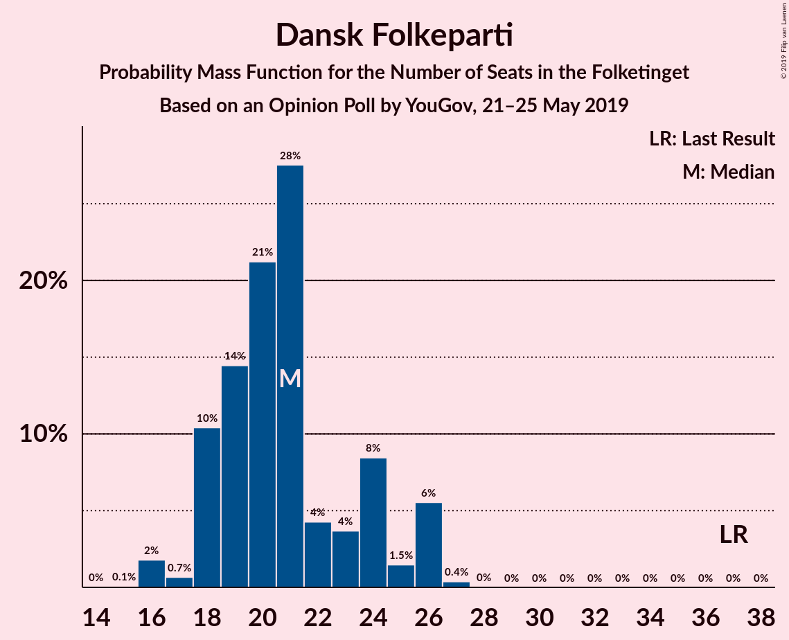
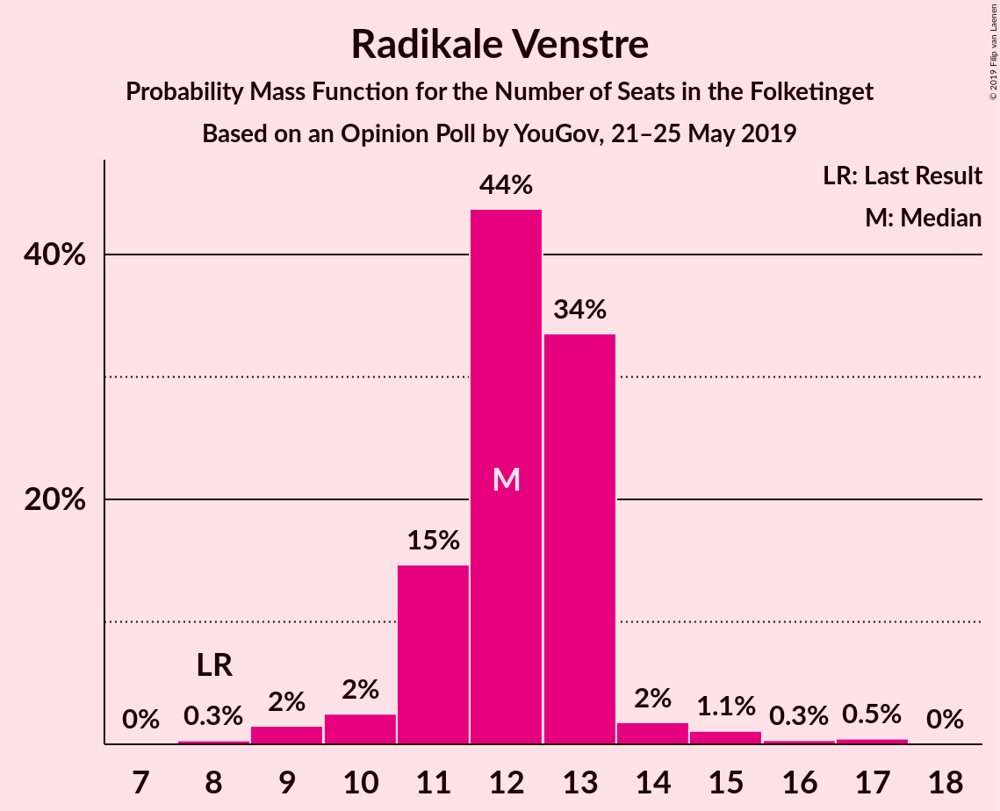
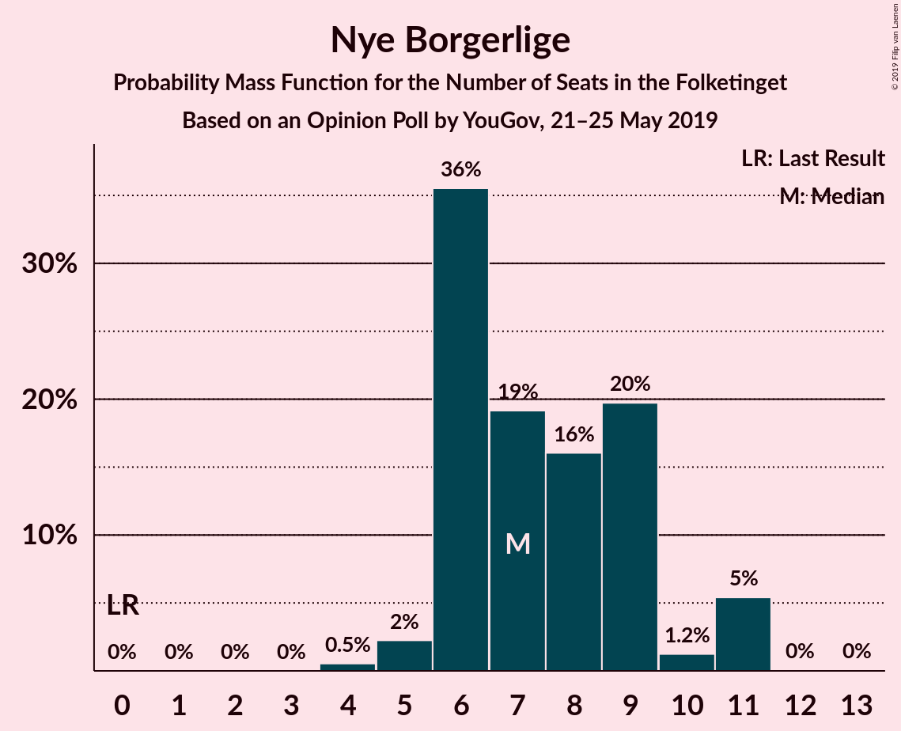
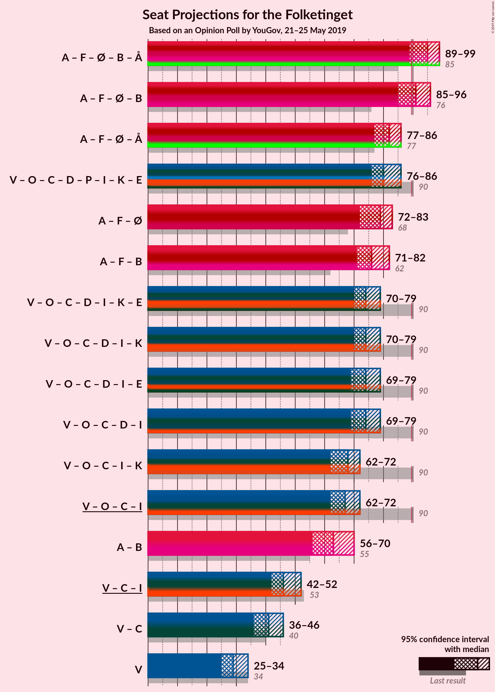
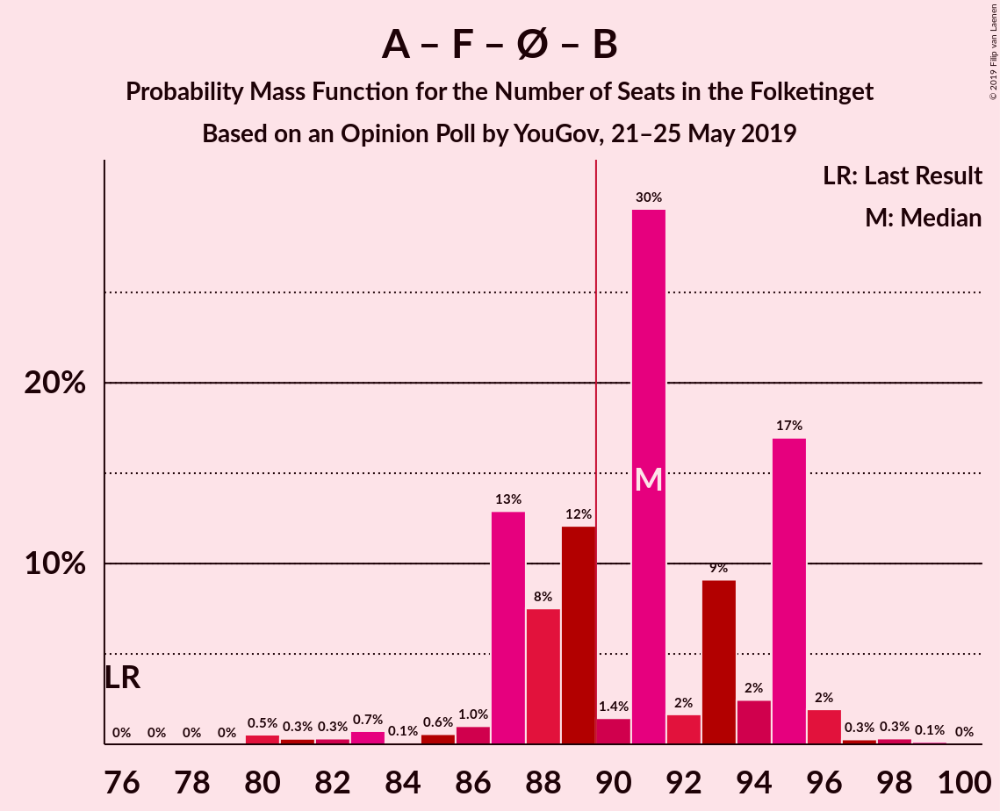
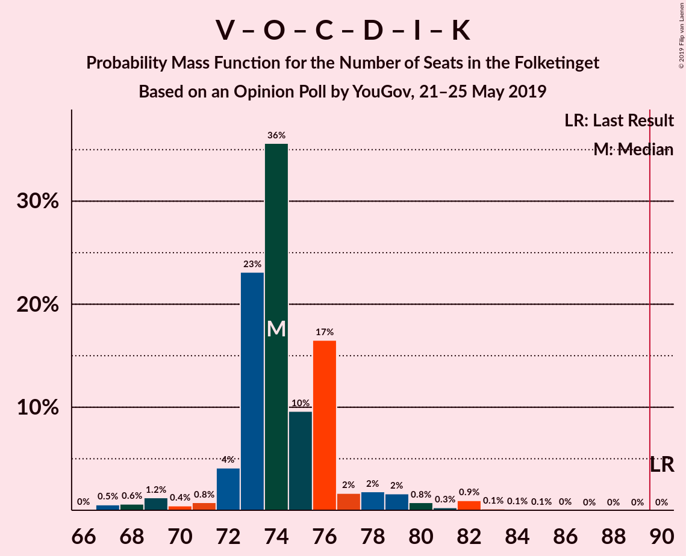
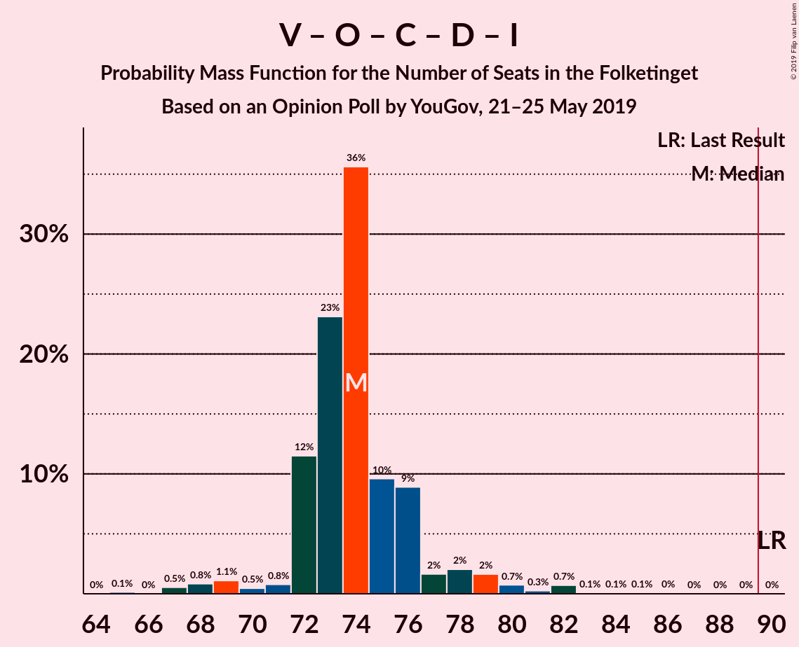
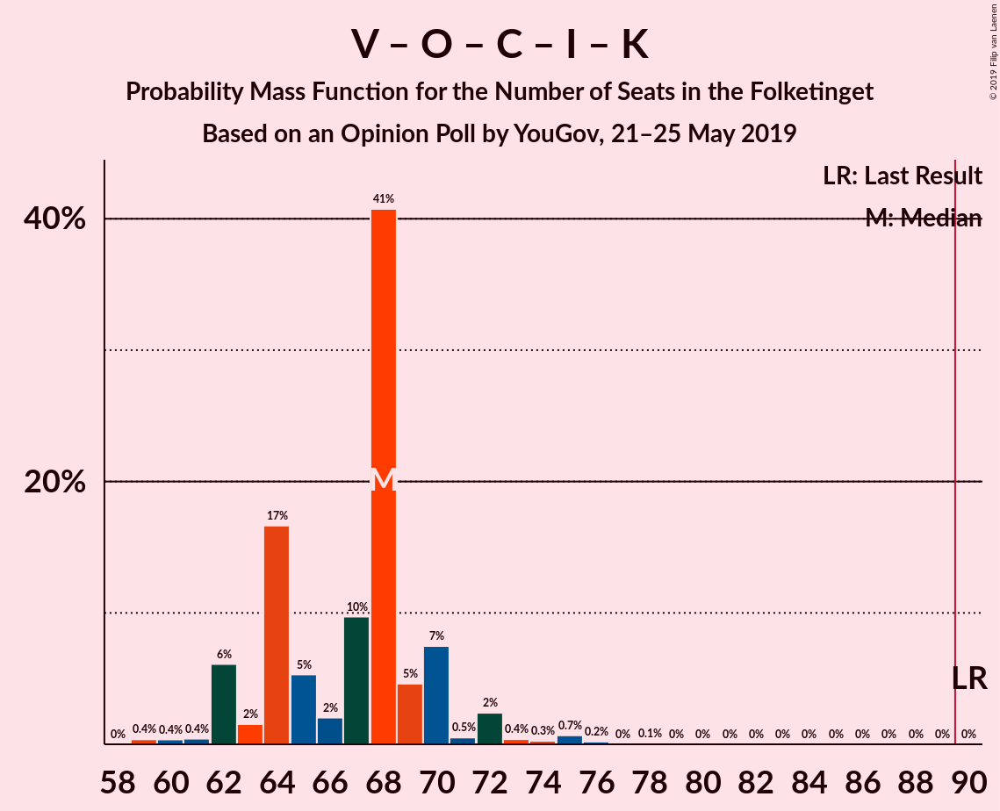
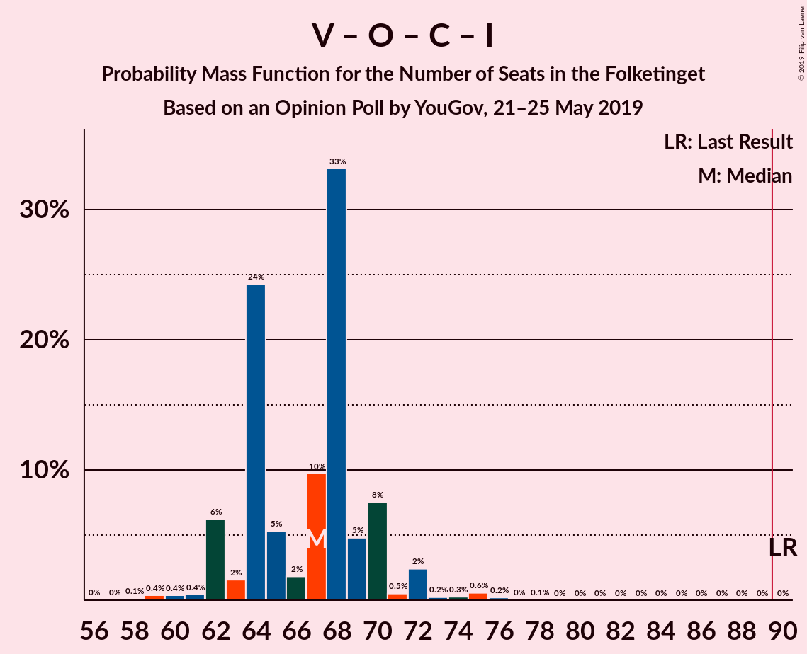

# Opinion Poll by YouGov, 21–25 May 2019

<a href="#voting-intentions">Voting Intentions</a> | <a href="#seats">Seats</a> | <a href="#coalitions">Coalitions</a> | <a href="#technical-information">Technical Information</a>

## Voting Intentions

### Confidence Intervals

| Party | Last Result | Poll Result | 80% Confidence Interval | 90% Confidence Interval | 95% Confidence Interval | 99% Confidence Interval |
|:-----:|:-----------:|:-----------:|:-----------------------:|:-----------------------:|:-----------------------:|:-----------------------:|
| Socialdemokraterne | 26.3% | 27.5% | 25.8–29.4% |25.3–30.0% |24.8–30.4% |24.0–31.3% |
| Venstre | 19.5% | 16.9% | 15.4–18.5% |15.0–18.9% |14.6–19.3% |14.0–20.1% |
| Dansk Folkeparti | 21.1% | 11.8% | 10.6–13.2% |10.2–13.6% |9.9–14.0% |9.4–14.7% |
| Socialistisk Folkeparti | 4.2% | 8.2% | 7.1–9.4% |6.9–9.8% |6.6–10.1% |6.2–10.7% |
| Enhedslisten–De Rød-Grønne | 7.8% | 8.1% | 7.1–9.3% |6.8–9.6% |6.5–9.9% |6.1–10.6% |
| Radikale Venstre | 4.6% | 6.6% | 5.6–7.7% |5.4–8.0% |5.2–8.3% |4.8–8.9% |
| Det Konservative Folkeparti | 3.4% | 6.2% | 5.3–7.3% |5.0–7.6% |4.8–7.8% |4.4–8.4% |
| Nye Borgerlige | 0.0% | 4.0% | 3.3–5.0% |3.1–5.2% |3.0–5.5% |2.7–5.9% |
| Stram Kurs | 0.0% | 3.6% | 3.0–4.5% |2.8–4.8% |2.6–5.0% |2.3–5.5% |
| Liberal Alliance | 7.5% | 2.9% | 2.3–3.7% |2.2–4.0% |2.0–4.2% |1.8–4.6% |
| Alternativet | 4.8% | 2.3% | 1.8–3.1% |1.7–3.3% |1.6–3.5% |1.3–3.9% |
| Kristendemokraterne | 0.8% | 1.1% | 0.8–1.7% |0.7–1.8% |0.6–2.0% |0.5–2.3% |
| Klaus Riskær Pedersen | 0.0% | 0.7% | 0.5–1.2% |0.4–1.3% |0.3–1.5% |0.3–1.7% |

*Note:* The poll result column reflects the actual value used in the calculations. Published results may vary slightly, and in addition be rounded to fewer digits.

## Seats

### Confidence Intervals

| Party | Last Result | Median | 80% Confidence Interval | 90% Confidence Interval | 95% Confidence Interval | 99% Confidence Interval |
|:-----:|:-----------:|:------:|:-----------------------:|:-----------------------:|:-----------------------:|:-----------------------:|
| <a href="#socialdemokraterne">Socialdemokraterne</a> | 47 | 51 | 45–57 |45–57 |44–57 |41–57 |
| <a href="#venstre">Venstre</a> | 34 | 29 | 26–33 |26–34 |25–34 |25–36 |
| <a href="#dansk-folkeparti">Dansk Folkeparti</a> | 37 | 21 | 18–24 |18–26 |17–26 |16–26 |
| <a href="#socialistisk-folkeparti">Socialistisk Folkeparti</a> | 7 | 13 | 12–17 |12–17 |12–18 |10–20 |
| <a href="#enhedslisten–de-rød-grønne">Enhedslisten–De Rød-Grønne</a> | 14 | 15 | 13–16 |13–16 |11–17 |10–20 |
| <a href="#radikale-venstre">Radikale Venstre</a> | 8 | 12 | 11–13 |11–13 |10–14 |9–16 |
| <a href="#det-konservative-folkeparti">Det Konservative Folkeparti</a> | 6 | 12 | 9–13 |9–13 |8–15 |7–15 |
| <a href="#nye-borgerlige">Nye Borgerlige</a> | 0 | 7 | 6–9 |6–11 |5–11 |4–11 |
| <a href="#stram-kurs">Stram Kurs</a> | 0 | 7 | 6–8 |4–8 |4–9 |4–10 |
| <a href="#liberal-alliance">Liberal Alliance</a> | 13 | 5 | 4–6 |4–7 |4–7 |0–8 |
| <a href="#alternativet">Alternativet</a> | 9 | 4 | 0–5 |0–6 |0–6 |0–7 |
| <a href="#kristendemokraterne">Kristendemokraterne</a> | 0 | 0 | 0 |0–4 |0–4 |0–4 |
| <a href="#klaus-riskær-pedersen">Klaus Riskær Pedersen</a> | 0 | 0 | 0 |0 |0 |0 |

### Socialdemokraterne

*For a full overview of the results for this party, see the [Socialdemokraterne](party-socialdemokraterne.html) page.*

| Number of Seats | Probability | Accumulated | Special Marks |
|:---------------:|:-----------:|:-----------:|:-------------:|
| 41 | 0.5% | 100% |  |
| 42 | 0.3% | 99.5% |  |
| 43 | 1.4% | 99.2% |  |
| 44 | 0.7% | 98% |  |
| 45 | 7% | 97% |  |
| 46 | 8% | 90% |  |
| 47 | 11% | 82% | Last Result |
| 48 | 5% | 70% |  |
| 49 | 1.0% | 66% |  |
| 50 | 13% | 65% |  |
| 51 | 3% | 52% | Median |
| 52 | 31% | 50% |  |
| 53 | 0.7% | 18% |  |
| 54 | 0.5% | 18% |  |
| 55 | 0.1% | 17% |  |
| 56 | 0% | 17% |  |
| 57 | 17% | 17% |  |
| 58 | 0% | 0% |  |

### Venstre

*For a full overview of the results for this party, see the [Venstre](party-venstre.html) page.*

| Number of Seats | Probability | Accumulated | Special Marks |
|:---------------:|:-----------:|:-----------:|:-------------:|
| 23 | 0.1% | 100% |  |
| 24 | 0% | 99.9% |  |
| 25 | 3% | 99.9% |  |
| 26 | 9% | 97% |  |
| 27 | 18% | 88% |  |
| 28 | 9% | 69% |  |
| 29 | 10% | 60% | Median |
| 30 | 27% | 50% |  |
| 31 | 2% | 23% |  |
| 32 | 11% | 21% |  |
| 33 | 4% | 10% |  |
| 34 | 5% | 7% | Last Result |
| 35 | 0.6% | 2% |  |
| 36 | 1.2% | 1.3% |  |
| 37 | 0% | 0% |  |

### Dansk Folkeparti

*For a full overview of the results for this party, see the [Dansk Folkeparti](party-danskfolkeparti.html) page.*

| Number of Seats | Probability | Accumulated | Special Marks |
|:---------------:|:-----------:|:-----------:|:-------------:|
| 15 | 0.1% | 100% |  |
| 16 | 2% | 99.9% |  |
| 17 | 0.7% | 98% |  |
| 18 | 10% | 97% |  |
| 19 | 14% | 87% |  |
| 20 | 21% | 73% |  |
| 21 | 28% | 51% | Median |
| 22 | 4% | 24% |  |
| 23 | 4% | 20% |  |
| 24 | 8% | 16% |  |
| 25 | 1.5% | 7% |  |
| 26 | 6% | 6% |  |
| 27 | 0.4% | 0.4% |  |
| 28 | 0% | 0% |  |
| 29 | 0% | 0% |  |
| 30 | 0% | 0% |  |
| 31 | 0% | 0% |  |
| 32 | 0% | 0% |  |
| 33 | 0% | 0% |  |
| 34 | 0% | 0% |  |
| 35 | 0% | 0% |  |
| 36 | 0% | 0% |  |
| 37 | 0% | 0% | Last Result |

### Socialistisk Folkeparti

*For a full overview of the results for this party, see the [Socialistisk Folkeparti](party-socialistiskfolkeparti.html) page.*

| Number of Seats | Probability | Accumulated | Special Marks |
|:---------------:|:-----------:|:-----------:|:-------------:|
| 7 | 0% | 100% | Last Result |
| 8 | 0% | 100% |  |
| 9 | 0% | 100% |  |
| 10 | 0.6% | 100% |  |
| 11 | 1.1% | 99.4% |  |
| 12 | 46% | 98% |  |
| 13 | 3% | 52% | Median |
| 14 | 8% | 49% |  |
| 15 | 21% | 42% |  |
| 16 | 10% | 21% |  |
| 17 | 8% | 11% |  |
| 18 | 2% | 3% |  |
| 19 | 0% | 0.6% |  |
| 20 | 0.4% | 0.5% |  |
| 21 | 0.1% | 0.1% |  |
| 22 | 0% | 0% |  |

### Enhedslisten–De Rød-Grønne

*For a full overview of the results for this party, see the [Enhedslisten–De Rød-Grønne](party-enhedslisten–derød-grønne.html) page.*

| Number of Seats | Probability | Accumulated | Special Marks |
|:---------------:|:-----------:|:-----------:|:-------------:|
| 9 | 0.2% | 100% |  |
| 10 | 0.4% | 99.8% |  |
| 11 | 3% | 99.4% |  |
| 12 | 1.0% | 97% |  |
| 13 | 29% | 96% |  |
| 14 | 14% | 67% | Last Result |
| 15 | 39% | 53% | Median |
| 16 | 10% | 13% |  |
| 17 | 1.2% | 3% |  |
| 18 | 1.3% | 2% |  |
| 19 | 0.4% | 0.9% |  |
| 20 | 0.3% | 0.6% |  |
| 21 | 0.2% | 0.3% |  |
| 22 | 0% | 0% |  |

### Radikale Venstre

*For a full overview of the results for this party, see the [Radikale Venstre](party-radikalevenstre.html) page.*

| Number of Seats | Probability | Accumulated | Special Marks |
|:---------------:|:-----------:|:-----------:|:-------------:|
| 8 | 0.3% | 100% | Last Result |
| 9 | 2% | 99.7% |  |
| 10 | 2% | 98% |  |
| 11 | 15% | 96% |  |
| 12 | 44% | 81% | Median |
| 13 | 34% | 37% |  |
| 14 | 2% | 4% |  |
| 15 | 1.1% | 2% |  |
| 16 | 0.3% | 0.8% |  |
| 17 | 0.5% | 0.5% |  |
| 18 | 0% | 0% |  |

### Det Konservative Folkeparti

*For a full overview of the results for this party, see the [Det Konservative Folkeparti](party-detkonservativefolkeparti.html) page.*

| Number of Seats | Probability | Accumulated | Special Marks |
|:---------------:|:-----------:|:-----------:|:-------------:|
| 6 | 0% | 100% | Last Result |
| 7 | 0.5% | 100% |  |
| 8 | 2% | 99.5% |  |
| 9 | 11% | 97% |  |
| 10 | 17% | 86% |  |
| 11 | 4% | 69% |  |
| 12 | 47% | 65% | Median |
| 13 | 14% | 18% |  |
| 14 | 0.3% | 4% |  |
| 15 | 4% | 4% |  |
| 16 | 0.2% | 0.2% |  |
| 17 | 0% | 0% |  |

### Nye Borgerlige

*For a full overview of the results for this party, see the [Nye Borgerlige](party-nyeborgerlige.html) page.*

| Number of Seats | Probability | Accumulated | Special Marks |
|:---------------:|:-----------:|:-----------:|:-------------:|
| 0 | 0% | 100% | Last Result |
| 1 | 0% | 100% |  |
| 2 | 0% | 100% |  |
| 3 | 0% | 100% |  |
| 4 | 0.5% | 100% |  |
| 5 | 2% | 99.4% |  |
| 6 | 36% | 97% |  |
| 7 | 19% | 62% | Median |
| 8 | 16% | 43% |  |
| 9 | 20% | 26% |  |
| 10 | 1.2% | 7% |  |
| 11 | 5% | 5% |  |
| 12 | 0% | 0.1% |  |
| 13 | 0% | 0% |  |

### Stram Kurs

*For a full overview of the results for this party, see the [Stram Kurs](party-stramkurs.html) page.*

| Number of Seats | Probability | Accumulated | Special Marks |
|:---------------:|:-----------:|:-----------:|:-------------:|
| 0 | 0% | 100% | Last Result |
| 1 | 0% | 100% |  |
| 2 | 0% | 100% |  |
| 3 | 0% | 100% |  |
| 4 | 6% | 100% |  |
| 5 | 4% | 94% |  |
| 6 | 32% | 90% |  |
| 7 | 44% | 58% | Median |
| 8 | 10% | 14% |  |
| 9 | 4% | 4% |  |
| 10 | 0.3% | 0.5% |  |
| 11 | 0.2% | 0.2% |  |
| 12 | 0% | 0% |  |

### Liberal Alliance

*For a full overview of the results for this party, see the [Liberal Alliance](party-liberalalliance.html) page.*

| Number of Seats | Probability | Accumulated | Special Marks |
|:---------------:|:-----------:|:-----------:|:-------------:|
| 0 | 2% | 100% |  |
| 1 | 0% | 98% |  |
| 2 | 0% | 98% |  |
| 3 | 0% | 98% |  |
| 4 | 14% | 98% |  |
| 5 | 64% | 84% | Median |
| 6 | 11% | 20% |  |
| 7 | 8% | 9% |  |
| 8 | 0.9% | 1.3% |  |
| 9 | 0.4% | 0.4% |  |
| 10 | 0% | 0% |  |
| 11 | 0% | 0% |  |
| 12 | 0% | 0% |  |
| 13 | 0% | 0% | Last Result |

### Alternativet

*For a full overview of the results for this party, see the [Alternativet](party-alternativet.html) page.*

| Number of Seats | Probability | Accumulated | Special Marks |
|:---------------:|:-----------:|:-----------:|:-------------:|
| 0 | 28% | 100% |  |
| 1 | 0% | 72% |  |
| 2 | 0% | 72% |  |
| 3 | 0.1% | 72% |  |
| 4 | 41% | 72% | Median |
| 5 | 25% | 31% |  |
| 6 | 4% | 6% |  |
| 7 | 1.0% | 1.3% |  |
| 8 | 0.4% | 0.4% |  |
| 9 | 0% | 0% | Last Result |

### Kristendemokraterne

*For a full overview of the results for this party, see the [Kristendemokraterne](party-kristendemokraterne.html) page.*

| Number of Seats | Probability | Accumulated | Special Marks |
|:---------------:|:-----------:|:-----------:|:-------------:|
| 0 | 92% | 100% | Last Result, Median |
| 1 | 0% | 8% |  |
| 2 | 0% | 8% |  |
| 3 | 0% | 8% |  |
| 4 | 8% | 8% |  |
| 5 | 0.1% | 0.1% |  |
| 6 | 0% | 0% |  |

### Klaus Riskær Pedersen

*For a full overview of the results for this party, see the [Klaus Riskær Pedersen](party-klausriskærpedersen.html) page.*

| Number of Seats | Probability | Accumulated | Special Marks |
|:---------------:|:-----------:|:-----------:|:-------------:|
| 0 | 100% | 100% | Last Result, Median |

## Coalitions

### Confidence Intervals

| Coalition | Last Result | Median | Majority? | 80% Confidence Interval | 90% Confidence Interval | 95% Confidence Interval | 99% Confidence Interval |
|:---------:|:-----------:|:------:|:---------:|:-----------------------:|:-----------------------:|:-----------------------:|:-----------------------:|
| Socialdemokraterne – Socialistisk Folkeparti – Enhedslisten–De Rød-Grønne – Radikale Venstre – Alternativet | 85 | 95 | 96% | 92–96 | 91–97 | 89–99 | 85–101 |
| Socialdemokraterne – Socialistisk Folkeparti – Enhedslisten–De Rød-Grønne – Radikale Venstre | 76 | 91 | 64% | 87–95 | 87–95 | 85–96 | 80–97 |
| Socialdemokraterne – Socialistisk Folkeparti – Enhedslisten–De Rød-Grønne – Alternativet | 77 | 82 | 0.7% | 80–84 | 78–85 | 77–86 | 73–91 |
| Venstre – Dansk Folkeparti – Det Konservative Folkeparti – Nye Borgerlige – Stram Kurs – Liberal Alliance – Kristendemokraterne – Klaus Riskær Pedersen | 90 | 80 | 0.6% | 79–83 | 78–84 | 76–86 | 74–90 |
| Socialdemokraterne – Socialistisk Folkeparti – Enhedslisten–De Rød-Grønne | 68 | 79 | 0% | 76–82 | 74–82 | 72–83 | 69–86 |
| Socialdemokraterne – Socialistisk Folkeparti – Radikale Venstre | 62 | 76 | 0% | 72–82 | 72–82 | 71–82 | 66–82 |
| Venstre – Dansk Folkeparti – Det Konservative Folkeparti – Nye Borgerlige – Liberal Alliance – Kristendemokraterne – Klaus Riskær Pedersen | 90 | 74 | 0% | 73–76 | 72–78 | 70–79 | 67–82 |
| Venstre – Dansk Folkeparti – Det Konservative Folkeparti – Nye Borgerlige – Liberal Alliance – Kristendemokraterne | 90 | 74 | 0% | 73–76 | 72–78 | 70–79 | 67–82 |
| Venstre – Dansk Folkeparti – Det Konservative Folkeparti – Nye Borgerlige – Liberal Alliance – Klaus Riskær Pedersen | 90 | 74 | 0% | 72–76 | 72–78 | 69–79 | 67–82 |
| Venstre – Dansk Folkeparti – Det Konservative Folkeparti – Nye Borgerlige – Liberal Alliance | 90 | 74 | 0% | 72–76 | 72–78 | 69–79 | 67–82 |
| Venstre – Dansk Folkeparti – Det Konservative Folkeparti – Liberal Alliance – Kristendemokraterne | 90 | 68 | 0% | 64–70 | 62–70 | 62–72 | 60–75 |
| Venstre – Dansk Folkeparti – Det Konservative Folkeparti – Liberal Alliance | 90 | 67 | 0% | 64–70 | 62–70 | 62–72 | 59–75 |
| Socialdemokraterne – Radikale Venstre | 55 | 63 | 0% | 57–70 | 57–70 | 56–70 | 53–70 |
| Venstre – Det Konservative Folkeparti – Liberal Alliance | 53 | 46 | 0% | 42–49 | 42–51 | 42–52 | 39–53 |
| Venstre – Det Konservative Folkeparti | 40 | 41 | 0% | 37–44 | 36–45 | 36–46 | 34–48 |
| Venstre | 34 | 29 | 0% | 26–33 | 26–34 | 25–34 | 25–36 |

### Socialdemokraterne – Socialistisk Folkeparti – Enhedslisten–De Rød-Grønne – Radikale Venstre – Alternativet

| Number of Seats | Probability | Accumulated | Special Marks |
|:---------------:|:-----------:|:-----------:|:-------------:|
| 83 | 0% | 100% |  |
| 84 | 0% | 99.9% |  |
| 85 | 0.5% | 99.9% | Last Result |
| 86 | 0.7% | 99.4% |  |
| 87 | 0.5% | 98.8% |  |
| 88 | 0.2% | 98% |  |
| 89 | 2% | 98% |  |
| 90 | 0.3% | 96% | Majority |
| 91 | 4% | 96% |  |
| 92 | 17% | 92% |  |
| 93 | 7% | 75% |  |
| 94 | 13% | 68% |  |
| 95 | 43% | 56% | Median |
| 96 | 4% | 13% |  |
| 97 | 6% | 9% |  |
| 98 | 0.6% | 3% |  |
| 99 | 2% | 3% |  |
| 100 | 0.1% | 1.0% |  |
| 101 | 0.6% | 1.0% |  |
| 102 | 0.3% | 0.4% |  |
| 103 | 0.1% | 0.1% |  |
| 104 | 0% | 0% |  |

### Socialdemokraterne – Socialistisk Folkeparti – Enhedslisten–De Rød-Grønne – Radikale Venstre

| Number of Seats | Probability | Accumulated | Special Marks |
|:---------------:|:-----------:|:-----------:|:-------------:|
| 76 | 0% | 100% | Last Result |
| 77 | 0% | 100% |  |
| 78 | 0% | 100% |  |
| 79 | 0% | 100% |  |
| 80 | 0.5% | 100% |  |
| 81 | 0.3% | 99.5% |  |
| 82 | 0.3% | 99.2% |  |
| 83 | 0.7% | 98.8% |  |
| 84 | 0.1% | 98% |  |
| 85 | 0.6% | 98% |  |
| 86 | 1.0% | 97% |  |
| 87 | 13% | 96% |  |
| 88 | 8% | 84% |  |
| 89 | 12% | 76% |  |
| 90 | 1.4% | 64% | Majority |
| 91 | 30% | 62% | Median |
| 92 | 2% | 33% |  |
| 93 | 9% | 31% |  |
| 94 | 2% | 22% |  |
| 95 | 17% | 20% |  |
| 96 | 2% | 3% |  |
| 97 | 0.3% | 0.8% |  |
| 98 | 0.3% | 0.5% |  |
| 99 | 0.1% | 0.2% |  |
| 100 | 0% | 0% |  |

### Socialdemokraterne – Socialistisk Folkeparti – Enhedslisten–De Rød-Grønne – Alternativet

| Number of Seats | Probability | Accumulated | Special Marks |
|:---------------:|:-----------:|:-----------:|:-------------:|
| 71 | 0.1% | 100% |  |
| 72 | 0.1% | 99.9% |  |
| 73 | 0.6% | 99.9% |  |
| 74 | 0% | 99.3% |  |
| 75 | 0.6% | 99.3% |  |
| 76 | 0.3% | 98.7% |  |
| 77 | 3% | 98% | Last Result |
| 78 | 3% | 95% |  |
| 79 | 2% | 92% |  |
| 80 | 13% | 90% |  |
| 81 | 10% | 77% |  |
| 82 | 22% | 67% |  |
| 83 | 32% | 45% | Median |
| 84 | 7% | 13% |  |
| 85 | 3% | 6% |  |
| 86 | 0.6% | 3% |  |
| 87 | 0.9% | 2% |  |
| 88 | 0.5% | 1.3% |  |
| 89 | 0% | 0.7% |  |
| 90 | 0.1% | 0.7% | Majority |
| 91 | 0.3% | 0.6% |  |
| 92 | 0.3% | 0.3% |  |
| 93 | 0% | 0% |  |

### Venstre – Dansk Folkeparti – Det Konservative Folkeparti – Nye Borgerlige – Stram Kurs – Liberal Alliance – Kristendemokraterne – Klaus Riskær Pedersen

| Number of Seats | Probability | Accumulated | Special Marks |
|:---------------:|:-----------:|:-----------:|:-------------:|
| 72 | 0.1% | 100% |  |
| 73 | 0.3% | 99.9% |  |
| 74 | 0.6% | 99.6% |  |
| 75 | 0.1% | 99.0% |  |
| 76 | 2% | 99.0% |  |
| 77 | 0.6% | 97% |  |
| 78 | 6% | 97% |  |
| 79 | 4% | 91% |  |
| 80 | 43% | 87% |  |
| 81 | 13% | 44% | Median |
| 82 | 7% | 32% |  |
| 83 | 17% | 25% |  |
| 84 | 4% | 8% |  |
| 85 | 0.3% | 4% |  |
| 86 | 2% | 4% |  |
| 87 | 0.2% | 2% |  |
| 88 | 0.5% | 2% |  |
| 89 | 0.7% | 1.2% |  |
| 90 | 0.5% | 0.6% | Last Result, Majority |
| 91 | 0% | 0.1% |  |
| 92 | 0% | 0.1% |  |
| 93 | 0% | 0% |  |

### Socialdemokraterne – Socialistisk Folkeparti – Enhedslisten–De Rød-Grønne

| Number of Seats | Probability | Accumulated | Special Marks |
|:---------------:|:-----------:|:-----------:|:-------------:|
| 68 | 0.3% | 100% | Last Result |
| 69 | 0.4% | 99.7% |  |
| 70 | 0.4% | 99.3% |  |
| 71 | 0.1% | 98.9% |  |
| 72 | 1.4% | 98.8% |  |
| 73 | 0.5% | 97% |  |
| 74 | 5% | 97% |  |
| 75 | 0.8% | 92% |  |
| 76 | 15% | 92% |  |
| 77 | 10% | 77% |  |
| 78 | 6% | 67% |  |
| 79 | 28% | 61% | Median |
| 80 | 11% | 33% |  |
| 81 | 1.4% | 22% |  |
| 82 | 17% | 21% |  |
| 83 | 2% | 4% |  |
| 84 | 0.1% | 2% |  |
| 85 | 1.0% | 2% |  |
| 86 | 0.1% | 0.5% |  |
| 87 | 0% | 0.5% |  |
| 88 | 0.4% | 0.4% |  |
| 89 | 0% | 0% |  |

### Socialdemokraterne – Socialistisk Folkeparti – Radikale Venstre

| Number of Seats | Probability | Accumulated | Special Marks |
|:---------------:|:-----------:|:-----------:|:-------------:|
| 62 | 0% | 100% | Last Result |
| 63 | 0% | 100% |  |
| 64 | 0% | 100% |  |
| 65 | 0.3% | 100% |  |
| 66 | 0.3% | 99.7% |  |
| 67 | 0.2% | 99.4% |  |
| 68 | 0.2% | 99.2% |  |
| 69 | 0.4% | 98.9% |  |
| 70 | 0.4% | 98.5% |  |
| 71 | 2% | 98% |  |
| 72 | 7% | 96% |  |
| 73 | 2% | 90% |  |
| 74 | 12% | 88% |  |
| 75 | 12% | 76% |  |
| 76 | 31% | 64% | Median |
| 77 | 0.7% | 33% |  |
| 78 | 11% | 32% |  |
| 79 | 2% | 21% |  |
| 80 | 1.0% | 19% |  |
| 81 | 0.8% | 19% |  |
| 82 | 17% | 18% |  |
| 83 | 0.2% | 0.4% |  |
| 84 | 0.2% | 0.2% |  |
| 85 | 0% | 0% |  |

### Venstre – Dansk Folkeparti – Det Konservative Folkeparti – Nye Borgerlige – Liberal Alliance – Kristendemokraterne – Klaus Riskær Pedersen

| Number of Seats | Probability | Accumulated | Special Marks |
|:---------------:|:-----------:|:-----------:|:-------------:|
| 66 | 0% | 100% |  |
| 67 | 0.5% | 99.9% |  |
| 68 | 0.6% | 99.4% |  |
| 69 | 1.2% | 98.8% |  |
| 70 | 0.4% | 98% |  |
| 71 | 0.8% | 97% |  |
| 72 | 4% | 96% |  |
| 73 | 23% | 92% |  |
| 74 | 36% | 69% | Median |
| 75 | 10% | 34% |  |
| 76 | 17% | 24% |  |
| 77 | 2% | 7% |  |
| 78 | 2% | 6% |  |
| 79 | 2% | 4% |  |
| 80 | 0.8% | 2% |  |
| 81 | 0.3% | 2% |  |
| 82 | 0.9% | 1.3% |  |
| 83 | 0.1% | 0.3% |  |
| 84 | 0.1% | 0.2% |  |
| 85 | 0.1% | 0.1% |  |
| 86 | 0% | 0% |  |
| 87 | 0% | 0% |  |
| 88 | 0% | 0% |  |
| 89 | 0% | 0% |  |
| 90 | 0% | 0% | Last Result, Majority |

### Venstre – Dansk Folkeparti – Det Konservative Folkeparti – Nye Borgerlige – Liberal Alliance – Kristendemokraterne

| Number of Seats | Probability | Accumulated | Special Marks |
|:---------------:|:-----------:|:-----------:|:-------------:|
| 66 | 0% | 100% |  |
| 67 | 0.5% | 99.9% |  |
| 68 | 0.6% | 99.4% |  |
| 69 | 1.2% | 98.8% |  |
| 70 | 0.4% | 98% |  |
| 71 | 0.8% | 97% |  |
| 72 | 4% | 96% |  |
| 73 | 23% | 92% |  |
| 74 | 36% | 69% | Median |
| 75 | 10% | 34% |  |
| 76 | 17% | 24% |  |
| 77 | 2% | 7% |  |
| 78 | 2% | 6% |  |
| 79 | 2% | 4% |  |
| 80 | 0.8% | 2% |  |
| 81 | 0.3% | 2% |  |
| 82 | 0.9% | 1.3% |  |
| 83 | 0.1% | 0.3% |  |
| 84 | 0.1% | 0.2% |  |
| 85 | 0.1% | 0.1% |  |
| 86 | 0% | 0% |  |
| 87 | 0% | 0% |  |
| 88 | 0% | 0% |  |
| 89 | 0% | 0% |  |
| 90 | 0% | 0% | Last Result, Majority |

### Venstre – Dansk Folkeparti – Det Konservative Folkeparti – Nye Borgerlige – Liberal Alliance – Klaus Riskær Pedersen

| Number of Seats | Probability | Accumulated | Special Marks |
|:---------------:|:-----------:|:-----------:|:-------------:|
| 65 | 0.1% | 100% |  |
| 66 | 0% | 99.8% |  |
| 67 | 0.5% | 99.8% |  |
| 68 | 0.8% | 99.3% |  |
| 69 | 1.1% | 98% |  |
| 70 | 0.5% | 97% |  |
| 71 | 0.8% | 97% |  |
| 72 | 11% | 96% |  |
| 73 | 23% | 85% |  |
| 74 | 36% | 61% | Median |
| 75 | 10% | 26% |  |
| 76 | 9% | 16% |  |
| 77 | 2% | 7% |  |
| 78 | 2% | 6% |  |
| 79 | 2% | 4% |  |
| 80 | 0.7% | 2% |  |
| 81 | 0.3% | 1.2% |  |
| 82 | 0.7% | 1.0% |  |
| 83 | 0.1% | 0.3% |  |
| 84 | 0.1% | 0.2% |  |
| 85 | 0.1% | 0.1% |  |
| 86 | 0% | 0% |  |
| 87 | 0% | 0% |  |
| 88 | 0% | 0% |  |
| 89 | 0% | 0% |  |
| 90 | 0% | 0% | Last Result, Majority |

### Venstre – Dansk Folkeparti – Det Konservative Folkeparti – Nye Borgerlige – Liberal Alliance

| Number of Seats | Probability | Accumulated | Special Marks |
|:---------------:|:-----------:|:-----------:|:-------------:|
| 65 | 0.1% | 100% |  |
| 66 | 0% | 99.8% |  |
| 67 | 0.5% | 99.8% |  |
| 68 | 0.8% | 99.3% |  |
| 69 | 1.1% | 98% |  |
| 70 | 0.5% | 97% |  |
| 71 | 0.8% | 97% |  |
| 72 | 12% | 96% |  |
| 73 | 23% | 85% |  |
| 74 | 36% | 61% | Median |
| 75 | 10% | 26% |  |
| 76 | 9% | 16% |  |
| 77 | 2% | 7% |  |
| 78 | 2% | 6% |  |
| 79 | 2% | 4% |  |
| 80 | 0.7% | 2% |  |
| 81 | 0.3% | 1.2% |  |
| 82 | 0.7% | 1.0% |  |
| 83 | 0.1% | 0.3% |  |
| 84 | 0.1% | 0.2% |  |
| 85 | 0.1% | 0.1% |  |
| 86 | 0% | 0% |  |
| 87 | 0% | 0% |  |
| 88 | 0% | 0% |  |
| 89 | 0% | 0% |  |
| 90 | 0% | 0% | Last Result, Majority |

### Venstre – Dansk Folkeparti – Det Konservative Folkeparti – Liberal Alliance – Kristendemokraterne

| Number of Seats | Probability | Accumulated | Special Marks |
|:---------------:|:-----------:|:-----------:|:-------------:|
| 59 | 0.4% | 100% |  |
| 60 | 0.4% | 99.6% |  |
| 61 | 0.4% | 99.2% |  |
| 62 | 6% | 98.8% |  |
| 63 | 2% | 93% |  |
| 64 | 17% | 91% |  |
| 65 | 5% | 74% |  |
| 66 | 2% | 69% |  |
| 67 | 10% | 67% | Median |
| 68 | 41% | 57% |  |
| 69 | 5% | 17% |  |
| 70 | 7% | 12% |  |
| 71 | 0.5% | 5% |  |
| 72 | 2% | 4% |  |
| 73 | 0.4% | 2% |  |
| 74 | 0.3% | 1.2% |  |
| 75 | 0.7% | 1.0% |  |
| 76 | 0.2% | 0.3% |  |
| 77 | 0% | 0.1% |  |
| 78 | 0.1% | 0.1% |  |
| 79 | 0% | 0% |  |
| 80 | 0% | 0% |  |
| 81 | 0% | 0% |  |
| 82 | 0% | 0% |  |
| 83 | 0% | 0% |  |
| 84 | 0% | 0% |  |
| 85 | 0% | 0% |  |
| 86 | 0% | 0% |  |
| 87 | 0% | 0% |  |
| 88 | 0% | 0% |  |
| 89 | 0% | 0% |  |
| 90 | 0% | 0% | Last Result, Majority |

### Venstre – Dansk Folkeparti – Det Konservative Folkeparti – Liberal Alliance

| Number of Seats | Probability | Accumulated | Special Marks |
|:---------------:|:-----------:|:-----------:|:-------------:|
| 58 | 0.1% | 100% |  |
| 59 | 0.4% | 99.8% |  |
| 60 | 0.4% | 99.5% |  |
| 61 | 0.4% | 99.1% |  |
| 62 | 6% | 98.6% |  |
| 63 | 2% | 92% |  |
| 64 | 24% | 91% |  |
| 65 | 5% | 67% |  |
| 66 | 2% | 61% |  |
| 67 | 10% | 59% | Median |
| 68 | 33% | 50% |  |
| 69 | 5% | 17% |  |
| 70 | 8% | 12% |  |
| 71 | 0.5% | 4% |  |
| 72 | 2% | 4% |  |
| 73 | 0.2% | 1.3% |  |
| 74 | 0.3% | 1.1% |  |
| 75 | 0.6% | 0.8% |  |
| 76 | 0.2% | 0.3% |  |
| 77 | 0% | 0.1% |  |
| 78 | 0.1% | 0.1% |  |
| 79 | 0% | 0% |  |
| 80 | 0% | 0% |  |
| 81 | 0% | 0% |  |
| 82 | 0% | 0% |  |
| 83 | 0% | 0% |  |
| 84 | 0% | 0% |  |
| 85 | 0% | 0% |  |
| 86 | 0% | 0% |  |
| 87 | 0% | 0% |  |
| 88 | 0% | 0% |  |
| 89 | 0% | 0% |  |
| 90 | 0% | 0% | Last Result, Majority |

### Socialdemokraterne – Radikale Venstre

| Number of Seats | Probability | Accumulated | Special Marks |
|:---------------:|:-----------:|:-----------:|:-------------:|
| 52 | 0% | 100% |  |
| 53 | 0.6% | 99.9% |  |
| 54 | 0.1% | 99.4% |  |
| 55 | 1.4% | 99.2% | Last Result |
| 56 | 2% | 98% |  |
| 57 | 7% | 96% |  |
| 58 | 14% | 89% |  |
| 59 | 3% | 75% |  |
| 60 | 5% | 72% |  |
| 61 | 3% | 67% |  |
| 62 | 4% | 64% |  |
| 63 | 12% | 60% | Median |
| 64 | 28% | 48% |  |
| 65 | 2% | 19% |  |
| 66 | 0.5% | 18% |  |
| 67 | 0.3% | 17% |  |
| 68 | 0.1% | 17% |  |
| 69 | 0% | 17% |  |
| 70 | 17% | 17% |  |
| 71 | 0% | 0% |  |

### Venstre – Det Konservative Folkeparti – Liberal Alliance

| Number of Seats | Probability | Accumulated | Special Marks |
|:---------------:|:-----------:|:-----------:|:-------------:|
| 39 | 0.5% | 100% |  |
| 40 | 1.2% | 99.5% |  |
| 41 | 0.7% | 98% |  |
| 42 | 9% | 98% |  |
| 43 | 1.2% | 89% |  |
| 44 | 22% | 87% |  |
| 45 | 14% | 66% |  |
| 46 | 9% | 52% | Median |
| 47 | 27% | 43% |  |
| 48 | 5% | 16% |  |
| 49 | 5% | 12% |  |
| 50 | 1.3% | 7% |  |
| 51 | 2% | 6% |  |
| 52 | 3% | 3% |  |
| 53 | 0.3% | 0.7% | Last Result |
| 54 | 0.3% | 0.5% |  |
| 55 | 0.2% | 0.2% |  |
| 56 | 0% | 0% |  |

### Venstre – Det Konservative Folkeparti

| Number of Seats | Probability | Accumulated | Special Marks |
|:---------------:|:-----------:|:-----------:|:-------------:|
| 34 | 0.6% | 100% |  |
| 35 | 0.3% | 99.3% |  |
| 36 | 8% | 99.0% |  |
| 37 | 1.4% | 91% |  |
| 38 | 6% | 89% |  |
| 39 | 22% | 83% |  |
| 40 | 3% | 61% | Last Result |
| 41 | 14% | 59% | Median |
| 42 | 29% | 44% |  |
| 43 | 0.9% | 16% |  |
| 44 | 8% | 15% |  |
| 45 | 3% | 7% |  |
| 46 | 2% | 4% |  |
| 47 | 1.2% | 2% |  |
| 48 | 0.5% | 0.5% |  |
| 49 | 0% | 0% |  |

### Venstre

| Number of Seats | Probability | Accumulated | Special Marks |
|:---------------:|:-----------:|:-----------:|:-------------:|
| 23 | 0.1% | 100% |  |
| 24 | 0% | 99.9% |  |
| 25 | 3% | 99.9% |  |
| 26 | 9% | 97% |  |
| 27 | 18% | 88% |  |
| 28 | 9% | 69% |  |
| 29 | 10% | 60% | Median |
| 30 | 27% | 50% |  |
| 31 | 2% | 23% |  |
| 32 | 11% | 21% |  |
| 33 | 4% | 10% |  |
| 34 | 5% | 7% | Last Result |
| 35 | 0.6% | 2% |  |
| 36 | 1.2% | 1.3% |  |
| 37 | 0% | 0% |  |

## Technical Information

### Opinion Poll

+ **Polling firm:** YouGov
+ **Commissioner(s):** —
+ **Fieldwork period:** 21–25 May 2019

### Calculations

+ **Sample size:** 991
+ **Simulations done:** 1,048,576
+ **Error estimate:** 2.41%

