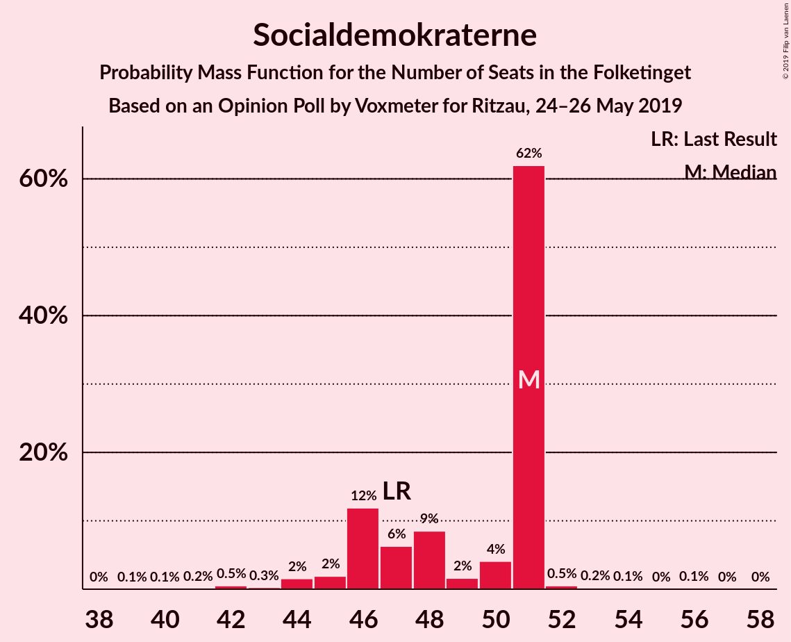
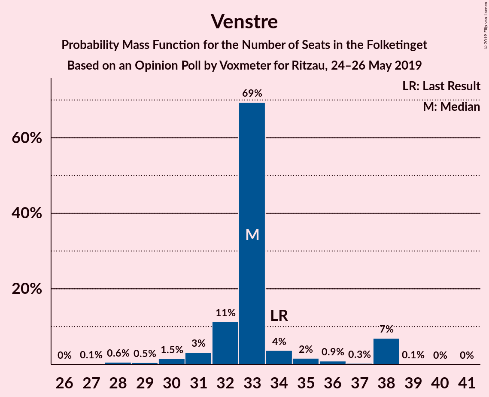
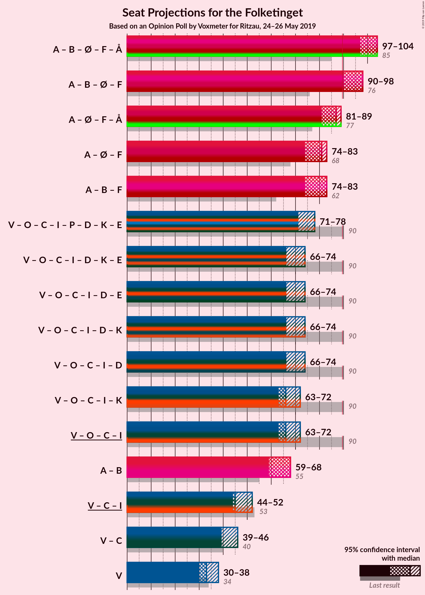
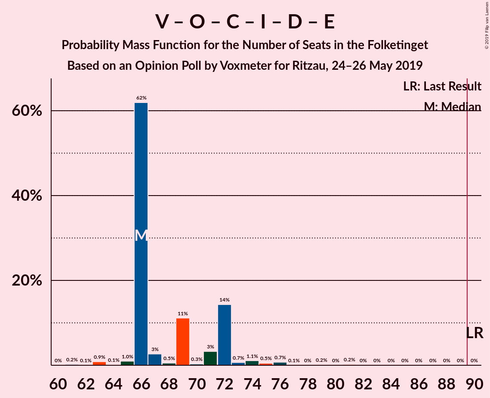
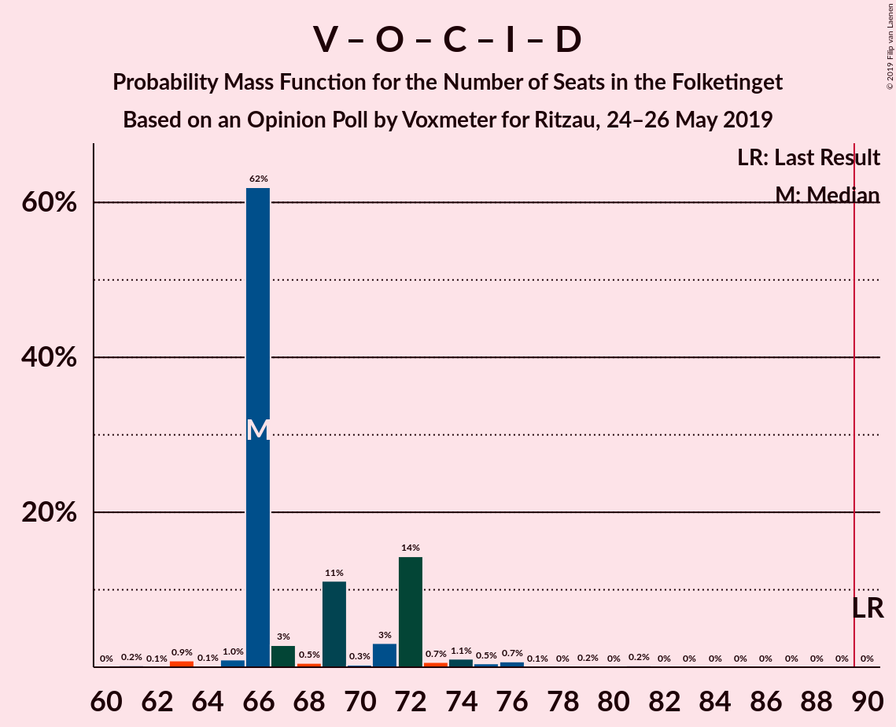
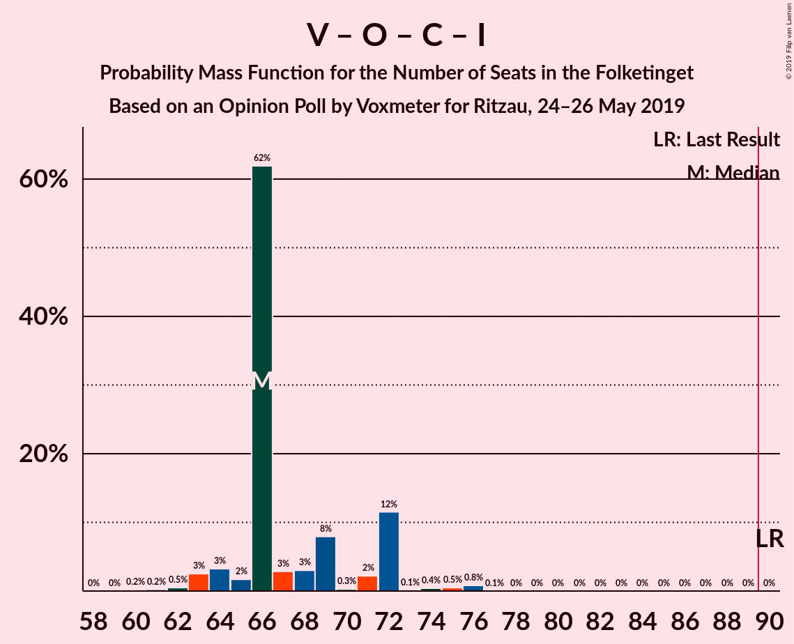
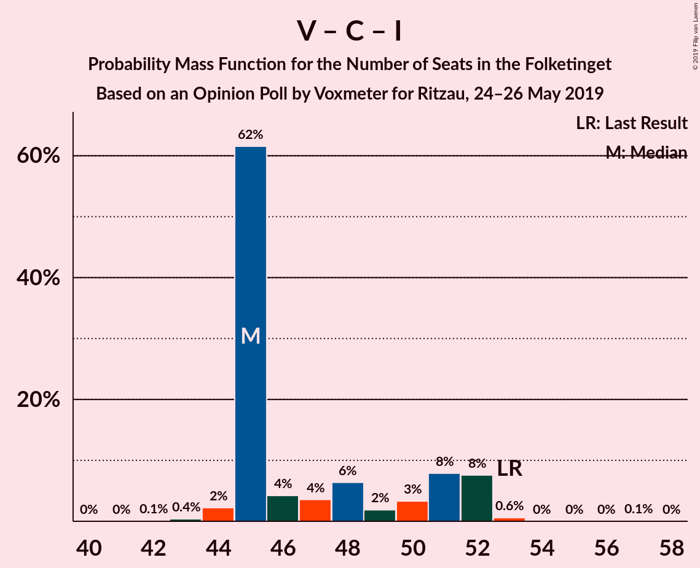

# Opinion Poll by Voxmeter for Ritzau, 24–26 May 2019

<a href="#voting-intentions">Voting Intentions</a> | <a href="#seats">Seats</a> | <a href="#coalitions">Coalitions</a> | <a href="#technical-information">Technical Information</a>

## Voting Intentions

### Confidence Intervals

| Party | Last Result | Poll Result | 80% Confidence Interval | 90% Confidence Interval | 95% Confidence Interval | 99% Confidence Interval |
|:-----:|:-----------:|:-----------:|:-----------------------:|:-----------------------:|:-----------------------:|:-----------------------:|
| Socialdemokraterne | 26.3% | 26.4% | 24.6–28.2% |24.2–28.7% |23.7–29.2% |22.9–30.1% |
| Venstre | 19.5% | 18.1% | 16.6–19.8% |16.2–20.2% |15.9–20.6% |15.2–21.4% |
| Dansk Folkeparti | 21.1% | 11.2% | 10.0–12.6% |9.7–13.0% |9.4–13.4% |8.9–14.0% |
| Radikale Venstre | 4.6% | 8.8% | 7.7–10.0% |7.4–10.4% |7.2–10.7% |6.7–11.3% |
| Enhedslisten–De Rød-Grønne | 7.8% | 8.7% | 7.6–9.9% |7.3–10.3% |7.1–10.6% |6.6–11.2% |
| Socialistisk Folkeparti | 4.2% | 8.7% | 7.6–9.9% |7.3–10.3% |7.1–10.6% |6.6–11.2% |
| Det Konservative Folkeparti | 3.4% | 4.7% | 3.9–5.7% |3.7–5.9% |3.5–6.2% |3.2–6.7% |
| Liberal Alliance | 7.5% | 3.6% | 2.9–4.5% |2.7–4.7% |2.6–4.9% |2.3–5.4% |
| Alternativet | 4.8% | 3.4% | 2.8–4.2% |2.6–4.5% |2.4–4.7% |2.2–5.1% |
| Stram Kurs | 0.0% | 2.4% | 1.9–3.1% |1.7–3.4% |1.6–3.5% |1.4–3.9% |
| Nye Borgerlige | 0.0% | 1.7% | 1.3–2.3% |1.2–2.5% |1.1–2.7% |0.9–3.0% |
| Kristendemokraterne | 0.8% | 1.1% | 0.8–1.6% |0.7–1.8% |0.6–2.0% |0.5–2.3% |
| Klaus Riskær Pedersen | 0.0% | 0.9% | 0.6–1.4% |0.5–1.6% |0.5–1.7% |0.4–2.0% |

*Note:* The poll result column reflects the actual value used in the calculations. Published results may vary slightly, and in addition be rounded to fewer digits.

## Seats

### Confidence Intervals

| Party | Last Result | Median | 80% Confidence Interval | 90% Confidence Interval | 95% Confidence Interval | 99% Confidence Interval |
|:-----:|:-----------:|:------:|:-----------------------:|:-----------------------:|:-----------------------:|:-----------------------:|
| <a href="#socialdemokraterne">Socialdemokraterne</a> | 47 | 47 | 42–47 |42–50 |42–53 |42–54 |
| <a href="#venstre">Venstre</a> | 34 | 33 | 31–33 |30–37 |30–37 |28–37 |
| <a href="#dansk-folkeparti">Dansk Folkeparti</a> | 37 | 20 | 18–22 |18–24 |18–24 |17–24 |
| <a href="#radikale-venstre">Radikale Venstre</a> | 8 | 13 | 13–17 |13–17 |13–17 |12–18 |
| <a href="#enhedslisten–de-rød-grønne">Enhedslisten–De Rød-Grønne</a> | 14 | 17 | 15–17 |15–17 |12–17 |11–19 |
| <a href="#socialistisk-folkeparti">Socialistisk Folkeparti</a> | 7 | 14 | 13–17 |13–17 |13–18 |13–18 |
| <a href="#det-konservative-folkeparti">Det Konservative Folkeparti</a> | 6 | 10 | 7–10 |7–10 |7–10 |6–12 |
| <a href="#liberal-alliance">Liberal Alliance</a> | 13 | 5 | 5–8 |5–8 |5–8 |5–9 |
| <a href="#alternativet">Alternativet</a> | 9 | 7 | 5–8 |5–8 |5–9 |5–9 |
| <a href="#stram-kurs">Stram Kurs</a> | 0 | 5 | 4–5 |4–5 |0–5 |0–8 |
| <a href="#nye-borgerlige">Nye Borgerlige</a> | 0 | 4 | 0–5 |0–5 |0–6 |0–6 |
| <a href="#kristendemokraterne">Kristendemokraterne</a> | 0 | 0 | 0 |0 |0 |0–4 |
| <a href="#klaus-riskær-pedersen">Klaus Riskær Pedersen</a> | 0 | 0 | 0 |0–4 |0–4 |0–4 |

### Socialdemokraterne

*For a full overview of the results for this party, see the [Socialdemokraterne](party-socialdemokraterne.html) page.*

| Number of Seats | Probability | Accumulated | Special Marks |
|:---------------:|:-----------:|:-----------:|:-------------:|
| 41 | 0.2% | 100% |  |
| 42 | 11% | 99.8% |  |
| 43 | 0.3% | 89% |  |
| 44 | 0.2% | 88% |  |
| 45 | 27% | 88% |  |
| 46 | 1.3% | 61% |  |
| 47 | 53% | 60% | Last Result, Median |
| 48 | 0.2% | 7% |  |
| 49 | 0.2% | 7% |  |
| 50 | 4% | 7% |  |
| 51 | 0.1% | 3% |  |
| 52 | 0.2% | 3% |  |
| 53 | 1.4% | 3% |  |
| 54 | 2% | 2% |  |
| 55 | 0.1% | 0.1% |  |
| 56 | 0% | 0% |  |

### Venstre

*For a full overview of the results for this party, see the [Venstre](party-venstre.html) page.*

| Number of Seats | Probability | Accumulated | Special Marks |
|:---------------:|:-----------:|:-----------:|:-------------:|
| 27 | 0.1% | 100% |  |
| 28 | 0.4% | 99.9% |  |
| 29 | 0% | 99.4% |  |
| 30 | 5% | 99.4% |  |
| 31 | 10% | 94% |  |
| 32 | 4% | 84% |  |
| 33 | 72% | 80% | Median |
| 34 | 2% | 9% | Last Result |
| 35 | 0.2% | 7% |  |
| 36 | 0.1% | 7% |  |
| 37 | 7% | 7% |  |
| 38 | 0% | 0.2% |  |
| 39 | 0% | 0.1% |  |
| 40 | 0% | 0.1% |  |
| 41 | 0% | 0.1% |  |
| 42 | 0.1% | 0.1% |  |
| 43 | 0% | 0% |  |

### Dansk Folkeparti

*For a full overview of the results for this party, see the [Dansk Folkeparti](party-danskfolkeparti.html) page.*

| Number of Seats | Probability | Accumulated | Special Marks |
|:---------------:|:-----------:|:-----------:|:-------------:|
| 14 | 0.2% | 100% |  |
| 15 | 0% | 99.8% |  |
| 16 | 0.2% | 99.8% |  |
| 17 | 0.1% | 99.6% |  |
| 18 | 11% | 99.5% |  |
| 19 | 2% | 88% |  |
| 20 | 64% | 86% | Median |
| 21 | 5% | 22% |  |
| 22 | 7% | 17% |  |
| 23 | 3% | 10% |  |
| 24 | 7% | 7% |  |
| 25 | 0% | 0.1% |  |
| 26 | 0% | 0% |  |
| 27 | 0% | 0% |  |
| 28 | 0% | 0% |  |
| 29 | 0% | 0% |  |
| 30 | 0% | 0% |  |
| 31 | 0% | 0% |  |
| 32 | 0% | 0% |  |
| 33 | 0% | 0% |  |
| 34 | 0% | 0% |  |
| 35 | 0% | 0% |  |
| 36 | 0% | 0% |  |
| 37 | 0% | 0% | Last Result |

### Radikale Venstre

*For a full overview of the results for this party, see the [Radikale Venstre](party-radikalevenstre.html) page.*

| Number of Seats | Probability | Accumulated | Special Marks |
|:---------------:|:-----------:|:-----------:|:-------------:|
| 8 | 0% | 100% | Last Result |
| 9 | 0% | 100% |  |
| 10 | 0% | 100% |  |
| 11 | 0% | 100% |  |
| 12 | 1.2% | 100% |  |
| 13 | 56% | 98.8% | Median |
| 14 | 8% | 43% |  |
| 15 | 14% | 34% |  |
| 16 | 0.8% | 20% |  |
| 17 | 18% | 19% |  |
| 18 | 0.8% | 1.0% |  |
| 19 | 0.1% | 0.2% |  |
| 20 | 0.1% | 0.1% |  |
| 21 | 0% | 0% |  |

### Enhedslisten–De Rød-Grønne

*For a full overview of the results for this party, see the [Enhedslisten–De Rød-Grønne](party-enhedslisten–derød-grønne.html) page.*

| Number of Seats | Probability | Accumulated | Special Marks |
|:---------------:|:-----------:|:-----------:|:-------------:|
| 11 | 0.6% | 100% |  |
| 12 | 4% | 99.4% |  |
| 13 | 0.3% | 96% |  |
| 14 | 0.2% | 95% | Last Result |
| 15 | 19% | 95% |  |
| 16 | 8% | 76% |  |
| 17 | 67% | 68% | Median |
| 18 | 0.2% | 0.8% |  |
| 19 | 0.3% | 0.7% |  |
| 20 | 0.3% | 0.4% |  |
| 21 | 0% | 0.1% |  |
| 22 | 0.1% | 0.1% |  |
| 23 | 0% | 0% |  |

### Socialistisk Folkeparti

*For a full overview of the results for this party, see the [Socialistisk Folkeparti](party-socialistiskfolkeparti.html) page.*

| Number of Seats | Probability | Accumulated | Special Marks |
|:---------------:|:-----------:|:-----------:|:-------------:|
| 7 | 0% | 100% | Last Result |
| 8 | 0% | 100% |  |
| 9 | 0% | 100% |  |
| 10 | 0% | 100% |  |
| 11 | 0.1% | 100% |  |
| 12 | 0.1% | 99.9% |  |
| 13 | 11% | 99.8% |  |
| 14 | 48% | 88% | Median |
| 15 | 13% | 40% |  |
| 16 | 4% | 27% |  |
| 17 | 20% | 23% |  |
| 18 | 3% | 3% |  |
| 19 | 0.1% | 0.2% |  |
| 20 | 0.1% | 0.1% |  |
| 21 | 0% | 0% |  |

### Det Konservative Folkeparti

*For a full overview of the results for this party, see the [Det Konservative Folkeparti](party-detkonservativefolkeparti.html) page.*

| Number of Seats | Probability | Accumulated | Special Marks |
|:---------------:|:-----------:|:-----------:|:-------------:|
| 5 | 0.1% | 100% |  |
| 6 | 0.5% | 99.9% | Last Result |
| 7 | 12% | 99.5% |  |
| 8 | 14% | 88% |  |
| 9 | 22% | 74% |  |
| 10 | 49% | 51% | Median |
| 11 | 1.5% | 2% |  |
| 12 | 0.7% | 0.7% |  |
| 13 | 0.1% | 0.1% |  |
| 14 | 0% | 0% |  |

### Liberal Alliance

*For a full overview of the results for this party, see the [Liberal Alliance](party-liberalalliance.html) page.*

| Number of Seats | Probability | Accumulated | Special Marks |
|:---------------:|:-----------:|:-----------:|:-------------:|
| 4 | 0.4% | 100% |  |
| 5 | 50% | 99.6% | Median |
| 6 | 25% | 50% |  |
| 7 | 6% | 24% |  |
| 8 | 17% | 19% |  |
| 9 | 1.2% | 1.4% |  |
| 10 | 0.1% | 0.2% |  |
| 11 | 0% | 0% |  |
| 12 | 0% | 0% |  |
| 13 | 0% | 0% | Last Result |

### Alternativet

*For a full overview of the results for this party, see the [Alternativet](party-alternativet.html) page.*

| Number of Seats | Probability | Accumulated | Special Marks |
|:---------------:|:-----------:|:-----------:|:-------------:|
| 4 | 0.3% | 100% |  |
| 5 | 10% | 99.7% |  |
| 6 | 8% | 90% |  |
| 7 | 67% | 82% | Median |
| 8 | 11% | 15% |  |
| 9 | 3% | 4% | Last Result |
| 10 | 0.1% | 0.1% |  |
| 11 | 0% | 0% |  |

### Stram Kurs

*For a full overview of the results for this party, see the [Stram Kurs](party-stramkurs.html) page.*

| Number of Seats | Probability | Accumulated | Special Marks |
|:---------------:|:-----------:|:-----------:|:-------------:|
| 0 | 4% | 100% | Last Result |
| 1 | 0% | 96% |  |
| 2 | 0% | 96% |  |
| 3 | 0% | 96% |  |
| 4 | 17% | 96% |  |
| 5 | 77% | 79% | Median |
| 6 | 0.4% | 2% |  |
| 7 | 0.7% | 1.3% |  |
| 8 | 0.5% | 0.5% |  |
| 9 | 0% | 0% |  |

### Nye Borgerlige

*For a full overview of the results for this party, see the [Nye Borgerlige](party-nyeborgerlige.html) page.*

| Number of Seats | Probability | Accumulated | Special Marks |
|:---------------:|:-----------:|:-----------:|:-------------:|
| 0 | 20% | 100% | Last Result |
| 1 | 0% | 80% |  |
| 2 | 0% | 80% |  |
| 3 | 0.4% | 80% |  |
| 4 | 63% | 80% | Median |
| 5 | 12% | 16% |  |
| 6 | 5% | 5% |  |
| 7 | 0% | 0% |  |

### Kristendemokraterne

*For a full overview of the results for this party, see the [Kristendemokraterne](party-kristendemokraterne.html) page.*

| Number of Seats | Probability | Accumulated | Special Marks |
|:---------------:|:-----------:|:-----------:|:-------------:|
| 0 | 98% | 100% | Last Result, Median |
| 1 | 0% | 2% |  |
| 2 | 0% | 2% |  |
| 3 | 0% | 2% |  |
| 4 | 2% | 2% |  |
| 5 | 0.1% | 0.1% |  |
| 6 | 0% | 0% |  |

### Klaus Riskær Pedersen

*For a full overview of the results for this party, see the [Klaus Riskær Pedersen](party-klausriskærpedersen.html) page.*

| Number of Seats | Probability | Accumulated | Special Marks |
|:---------------:|:-----------:|:-----------:|:-------------:|
| 0 | 95% | 100% | Last Result, Median |
| 1 | 0% | 5% |  |
| 2 | 0% | 5% |  |
| 3 | 0% | 5% |  |
| 4 | 5% | 5% |  |
| 5 | 0% | 0% |  |

## Coalitions

### Confidence Intervals

| Coalition | Last Result | Median | Majority? | 80% Confidence Interval | 90% Confidence Interval | 95% Confidence Interval | 99% Confidence Interval |
|:---------:|:-----------:|:------:|:---------:|:-----------------------:|:-----------------------:|:-----------------------:|:-----------------------:|
| Socialdemokraterne – Radikale Venstre – Enhedslisten–De Rød-Grønne – Socialistisk Folkeparti – Alternativet | 85 | 98 | 100% | 97–100 | 96–103 | 96–106 | 93–106 |
| Socialdemokraterne – Radikale Venstre – Enhedslisten–De Rød-Grønne – Socialistisk Folkeparti | 76 | 91 | 99.1% | 90–92 | 90–97 | 90–100 | 88–101 |
| Socialdemokraterne – Enhedslisten–De Rød-Grønne – Socialistisk Folkeparti – Alternativet | 77 | 85 | 0.5% | 80–87 | 80–88 | 80–89 | 79–90 |
| Socialdemokraterne – Radikale Venstre – Socialistisk Folkeparti | 62 | 74 | 0.1% | 74–77 | 74–83 | 74–84 | 74–86 |
| Socialdemokraterne – Enhedslisten–De Rød-Grønne – Socialistisk Folkeparti | 68 | 78 | 0% | 73–79 | 73–81 | 73–84 | 73–85 |
| Venstre – Dansk Folkeparti – Det Konservative Folkeparti – Liberal Alliance – Stram Kurs – Nye Borgerlige – Kristendemokraterne – Klaus Riskær Pedersen | 90 | 77 | 0% | 75–78 | 72–79 | 69–79 | 69–82 |
| Venstre – Dansk Folkeparti – Det Konservative Folkeparti – Liberal Alliance – Nye Borgerlige – Kristendemokraterne – Klaus Riskær Pedersen | 90 | 72 | 0% | 71–73 | 69–74 | 69–74 | 63–75 |
| Venstre – Dansk Folkeparti – Det Konservative Folkeparti – Liberal Alliance – Nye Borgerlige – Kristendemokraterne | 90 | 72 | 0% | 69–73 | 67–74 | 67–74 | 63–75 |
| Venstre – Dansk Folkeparti – Det Konservative Folkeparti – Liberal Alliance – Kristendemokraterne | 90 | 68 | 0% | 67–71 | 67–74 | 66–74 | 63–74 |
| Venstre – Dansk Folkeparti – Det Konservative Folkeparti – Liberal Alliance – Nye Borgerlige – Klaus Riskær Pedersen | 90 | 72 | 0% | 71–73 | 69–74 | 65–74 | 63–75 |
| Venstre – Dansk Folkeparti – Det Konservative Folkeparti – Liberal Alliance – Nye Borgerlige | 90 | 72 | 0% | 69–73 | 67–74 | 65–74 | 63–75 |
| Venstre – Dansk Folkeparti – Det Konservative Folkeparti – Liberal Alliance | 90 | 68 | 0% | 67–69 | 67–74 | 65–74 | 63–74 |
| Socialdemokraterne – Radikale Venstre | 55 | 60 | 0% | 57–62 | 57–67 | 57–68 | 57–70 |
| Venstre – Det Konservative Folkeparti – Liberal Alliance | 53 | 48 | 0% | 46–50 | 45–50 | 45–50 | 44–51 |
| Venstre – Det Konservative Folkeparti | 40 | 43 | 0% | 39–43 | 38–44 | 38–44 | 36–45 |
| Venstre | 34 | 33 | 0% | 31–33 | 30–37 | 30–37 | 28–37 |

### Socialdemokraterne – Radikale Venstre – Enhedslisten–De Rød-Grønne – Socialistisk Folkeparti – Alternativet

| Number of Seats | Probability | Accumulated | Special Marks |
|:---------------:|:-----------:|:-----------:|:-------------:|
| 85 | 0% | 100% | Last Result |
| 86 | 0% | 100% |  |
| 87 | 0% | 100% |  |
| 88 | 0% | 100% |  |
| 89 | 0% | 100% |  |
| 90 | 0% | 100% | Majority |
| 91 | 0% | 100% |  |
| 92 | 0% | 99.9% |  |
| 93 | 0.5% | 99.9% |  |
| 94 | 0.2% | 99.5% |  |
| 95 | 0% | 99.3% |  |
| 96 | 6% | 99.3% |  |
| 97 | 16% | 93% |  |
| 98 | 49% | 77% | Median |
| 99 | 17% | 29% |  |
| 100 | 5% | 12% |  |
| 101 | 0.2% | 7% |  |
| 102 | 2% | 7% |  |
| 103 | 1.3% | 5% |  |
| 104 | 0.9% | 4% |  |
| 105 | 0.7% | 3% |  |
| 106 | 2% | 3% |  |
| 107 | 0% | 0.3% |  |
| 108 | 0.2% | 0.3% |  |
| 109 | 0% | 0.1% |  |
| 110 | 0% | 0.1% |  |
| 111 | 0.1% | 0.1% |  |
| 112 | 0% | 0% |  |

### Socialdemokraterne – Radikale Venstre – Enhedslisten–De Rød-Grønne – Socialistisk Folkeparti

| Number of Seats | Probability | Accumulated | Special Marks |
|:---------------:|:-----------:|:-----------:|:-------------:|
| 76 | 0% | 100% | Last Result |
| 77 | 0% | 100% |  |
| 78 | 0% | 100% |  |
| 79 | 0% | 100% |  |
| 80 | 0% | 100% |  |
| 81 | 0% | 100% |  |
| 82 | 0% | 100% |  |
| 83 | 0% | 100% |  |
| 84 | 0% | 100% |  |
| 85 | 0.1% | 100% |  |
| 86 | 0% | 99.9% |  |
| 87 | 0.1% | 99.9% |  |
| 88 | 0.6% | 99.8% |  |
| 89 | 0.2% | 99.3% |  |
| 90 | 17% | 99.1% | Majority |
| 91 | 63% | 82% | Median |
| 92 | 10% | 20% |  |
| 93 | 0.8% | 9% |  |
| 94 | 0.2% | 8% |  |
| 95 | 3% | 8% |  |
| 96 | 0.1% | 5% |  |
| 97 | 0.5% | 5% |  |
| 98 | 2% | 5% |  |
| 99 | 0.5% | 3% |  |
| 100 | 0.2% | 3% |  |
| 101 | 2% | 2% |  |
| 102 | 0% | 0.1% |  |
| 103 | 0% | 0.1% |  |
| 104 | 0% | 0.1% |  |
| 105 | 0.1% | 0.1% |  |
| 106 | 0% | 0% |  |

### Socialdemokraterne – Enhedslisten–De Rød-Grønne – Socialistisk Folkeparti – Alternativet

| Number of Seats | Probability | Accumulated | Special Marks |
|:---------------:|:-----------:|:-----------:|:-------------:|
| 77 | 0% | 100% | Last Result |
| 78 | 0.3% | 100% |  |
| 79 | 0.6% | 99.7% |  |
| 80 | 16% | 99.1% |  |
| 81 | 0.1% | 83% |  |
| 82 | 6% | 83% |  |
| 83 | 1.0% | 77% |  |
| 84 | 11% | 76% |  |
| 85 | 49% | 65% | Median |
| 86 | 5% | 17% |  |
| 87 | 5% | 11% |  |
| 88 | 3% | 6% |  |
| 89 | 2% | 3% |  |
| 90 | 0.1% | 0.5% | Majority |
| 91 | 0% | 0.5% |  |
| 92 | 0.2% | 0.4% |  |
| 93 | 0% | 0.3% |  |
| 94 | 0.2% | 0.3% |  |
| 95 | 0.1% | 0.1% |  |
| 96 | 0% | 0% |  |

### Socialdemokraterne – Radikale Venstre – Socialistisk Folkeparti

| Number of Seats | Probability | Accumulated | Special Marks |
|:---------------:|:-----------:|:-----------:|:-------------:|
| 62 | 0% | 100% | Last Result |
| 63 | 0% | 100% |  |
| 64 | 0% | 100% |  |
| 65 | 0% | 100% |  |
| 66 | 0% | 100% |  |
| 67 | 0% | 100% |  |
| 68 | 0% | 100% |  |
| 69 | 0% | 100% |  |
| 70 | 0.1% | 99.9% |  |
| 71 | 0% | 99.9% |  |
| 72 | 0% | 99.8% |  |
| 73 | 0.1% | 99.8% |  |
| 74 | 64% | 99.7% | Median |
| 75 | 17% | 35% |  |
| 76 | 4% | 19% |  |
| 77 | 5% | 15% |  |
| 78 | 0.2% | 9% |  |
| 79 | 3% | 9% |  |
| 80 | 0.3% | 6% |  |
| 81 | 0.5% | 6% |  |
| 82 | 0% | 6% |  |
| 83 | 1.3% | 6% |  |
| 84 | 2% | 4% |  |
| 85 | 0% | 2% |  |
| 86 | 1.5% | 2% |  |
| 87 | 0.4% | 0.5% |  |
| 88 | 0% | 0.1% |  |
| 89 | 0% | 0.1% |  |
| 90 | 0% | 0.1% | Majority |
| 91 | 0.1% | 0.1% |  |
| 92 | 0% | 0% |  |

### Socialdemokraterne – Enhedslisten–De Rød-Grønne – Socialistisk Folkeparti

| Number of Seats | Probability | Accumulated | Special Marks |
|:---------------:|:-----------:|:-----------:|:-------------:|
| 68 | 0% | 100% | Last Result |
| 69 | 0% | 100% |  |
| 70 | 0.1% | 100% |  |
| 71 | 0% | 99.9% |  |
| 72 | 0.3% | 99.9% |  |
| 73 | 11% | 99.6% |  |
| 74 | 0.7% | 89% |  |
| 75 | 5% | 88% |  |
| 76 | 18% | 83% |  |
| 77 | 0.4% | 66% |  |
| 78 | 51% | 65% | Median |
| 79 | 5% | 14% |  |
| 80 | 2% | 9% |  |
| 81 | 3% | 8% |  |
| 82 | 0.2% | 4% |  |
| 83 | 1.3% | 4% |  |
| 84 | 2% | 3% |  |
| 85 | 0.1% | 0.5% |  |
| 86 | 0.3% | 0.4% |  |
| 87 | 0% | 0.1% |  |
| 88 | 0% | 0.1% |  |
| 89 | 0.1% | 0.1% |  |
| 90 | 0% | 0% | Majority |

### Venstre – Dansk Folkeparti – Det Konservative Folkeparti – Liberal Alliance – Stram Kurs – Nye Borgerlige – Kristendemokraterne – Klaus Riskær Pedersen

| Number of Seats | Probability | Accumulated | Special Marks |
|:---------------:|:-----------:|:-----------:|:-------------:|
| 64 | 0.1% | 100% |  |
| 65 | 0% | 99.9% |  |
| 66 | 0% | 99.9% |  |
| 67 | 0.2% | 99.9% |  |
| 68 | 0% | 99.7% |  |
| 69 | 2% | 99.7% |  |
| 70 | 0.7% | 97% |  |
| 71 | 0.9% | 97% |  |
| 72 | 1.3% | 96% |  |
| 73 | 2% | 95% |  |
| 74 | 0.2% | 93% |  |
| 75 | 5% | 93% |  |
| 76 | 17% | 88% |  |
| 77 | 49% | 71% | Median |
| 78 | 16% | 23% |  |
| 79 | 6% | 7% |  |
| 80 | 0% | 0.7% |  |
| 81 | 0.2% | 0.7% |  |
| 82 | 0.5% | 0.5% |  |
| 83 | 0% | 0.1% |  |
| 84 | 0% | 0.1% |  |
| 85 | 0% | 0% |  |
| 86 | 0% | 0% |  |
| 87 | 0% | 0% |  |
| 88 | 0% | 0% |  |
| 89 | 0% | 0% |  |
| 90 | 0% | 0% | Last Result, Majority |

### Venstre – Dansk Folkeparti – Det Konservative Folkeparti – Liberal Alliance – Nye Borgerlige – Kristendemokraterne – Klaus Riskær Pedersen

| Number of Seats | Probability | Accumulated | Special Marks |
|:---------------:|:-----------:|:-----------:|:-------------:|
| 60 | 0.1% | 100% |  |
| 61 | 0% | 99.9% |  |
| 62 | 0.2% | 99.9% |  |
| 63 | 0.3% | 99.7% |  |
| 64 | 0% | 99.5% |  |
| 65 | 0.6% | 99.4% |  |
| 66 | 0.2% | 98.9% |  |
| 67 | 0% | 98.7% |  |
| 68 | 0.3% | 98.6% |  |
| 69 | 4% | 98% |  |
| 70 | 2% | 94% |  |
| 71 | 9% | 93% |  |
| 72 | 61% | 84% | Median |
| 73 | 16% | 23% |  |
| 74 | 6% | 7% |  |
| 75 | 0.5% | 0.9% |  |
| 76 | 0.2% | 0.5% |  |
| 77 | 0.1% | 0.3% |  |
| 78 | 0.1% | 0.2% |  |
| 79 | 0% | 0.1% |  |
| 80 | 0.1% | 0.1% |  |
| 81 | 0% | 0% |  |
| 82 | 0% | 0% |  |
| 83 | 0% | 0% |  |
| 84 | 0% | 0% |  |
| 85 | 0% | 0% |  |
| 86 | 0% | 0% |  |
| 87 | 0% | 0% |  |
| 88 | 0% | 0% |  |
| 89 | 0% | 0% |  |
| 90 | 0% | 0% | Last Result, Majority |

### Venstre – Dansk Folkeparti – Det Konservative Folkeparti – Liberal Alliance – Nye Borgerlige – Kristendemokraterne

| Number of Seats | Probability | Accumulated | Special Marks |
|:---------------:|:-----------:|:-----------:|:-------------:|
| 60 | 0.1% | 100% |  |
| 61 | 0% | 99.9% |  |
| 62 | 0.2% | 99.9% |  |
| 63 | 0.3% | 99.7% |  |
| 64 | 0% | 99.4% |  |
| 65 | 0.6% | 99.4% |  |
| 66 | 0.2% | 98.8% |  |
| 67 | 5% | 98.6% |  |
| 68 | 0.3% | 93% |  |
| 69 | 4% | 93% |  |
| 70 | 2% | 89% |  |
| 71 | 4% | 88% |  |
| 72 | 61% | 84% | Median |
| 73 | 16% | 23% |  |
| 74 | 6% | 7% |  |
| 75 | 0.5% | 0.8% |  |
| 76 | 0.2% | 0.3% |  |
| 77 | 0% | 0.1% |  |
| 78 | 0% | 0.1% |  |
| 79 | 0% | 0.1% |  |
| 80 | 0% | 0.1% |  |
| 81 | 0% | 0% |  |
| 82 | 0% | 0% |  |
| 83 | 0% | 0% |  |
| 84 | 0% | 0% |  |
| 85 | 0% | 0% |  |
| 86 | 0% | 0% |  |
| 87 | 0% | 0% |  |
| 88 | 0% | 0% |  |
| 89 | 0% | 0% |  |
| 90 | 0% | 0% | Last Result, Majority |

### Venstre – Dansk Folkeparti – Det Konservative Folkeparti – Liberal Alliance – Kristendemokraterne

| Number of Seats | Probability | Accumulated | Special Marks |
|:---------------:|:-----------:|:-----------:|:-------------:|
| 58 | 0.2% | 100% |  |
| 59 | 0% | 99.8% |  |
| 60 | 0.1% | 99.8% |  |
| 61 | 0% | 99.7% |  |
| 62 | 0% | 99.7% |  |
| 63 | 0.3% | 99.7% |  |
| 64 | 0.3% | 99.4% |  |
| 65 | 0.9% | 99.1% |  |
| 66 | 1.4% | 98% |  |
| 67 | 13% | 97% |  |
| 68 | 69% | 84% | Median |
| 69 | 4% | 14% |  |
| 70 | 0.2% | 10% |  |
| 71 | 0.7% | 10% |  |
| 72 | 3% | 9% |  |
| 73 | 0.2% | 6% |  |
| 74 | 6% | 6% |  |
| 75 | 0% | 0.1% |  |
| 76 | 0.1% | 0.1% |  |
| 77 | 0% | 0% |  |
| 78 | 0% | 0% |  |
| 79 | 0% | 0% |  |
| 80 | 0% | 0% |  |
| 81 | 0% | 0% |  |
| 82 | 0% | 0% |  |
| 83 | 0% | 0% |  |
| 84 | 0% | 0% |  |
| 85 | 0% | 0% |  |
| 86 | 0% | 0% |  |
| 87 | 0% | 0% |  |
| 88 | 0% | 0% |  |
| 89 | 0% | 0% |  |
| 90 | 0% | 0% | Last Result, Majority |

### Venstre – Dansk Folkeparti – Det Konservative Folkeparti – Liberal Alliance – Nye Borgerlige – Klaus Riskær Pedersen

| Number of Seats | Probability | Accumulated | Special Marks |
|:---------------:|:-----------:|:-----------:|:-------------:|
| 60 | 0.1% | 100% |  |
| 61 | 0% | 99.9% |  |
| 62 | 0.2% | 99.9% |  |
| 63 | 0.3% | 99.7% |  |
| 64 | 0% | 99.4% |  |
| 65 | 2% | 99.4% |  |
| 66 | 0.2% | 97% |  |
| 67 | 0.1% | 97% |  |
| 68 | 0.3% | 97% |  |
| 69 | 3% | 97% |  |
| 70 | 2% | 94% |  |
| 71 | 9% | 93% |  |
| 72 | 61% | 84% | Median |
| 73 | 16% | 22% |  |
| 74 | 6% | 7% |  |
| 75 | 0.5% | 0.7% |  |
| 76 | 0% | 0.2% |  |
| 77 | 0.1% | 0.2% |  |
| 78 | 0.1% | 0.2% |  |
| 79 | 0% | 0% |  |
| 80 | 0% | 0% |  |
| 81 | 0% | 0% |  |
| 82 | 0% | 0% |  |
| 83 | 0% | 0% |  |
| 84 | 0% | 0% |  |
| 85 | 0% | 0% |  |
| 86 | 0% | 0% |  |
| 87 | 0% | 0% |  |
| 88 | 0% | 0% |  |
| 89 | 0% | 0% |  |
| 90 | 0% | 0% | Last Result, Majority |

### Venstre – Dansk Folkeparti – Det Konservative Folkeparti – Liberal Alliance – Nye Borgerlige

| Number of Seats | Probability | Accumulated | Special Marks |
|:---------------:|:-----------:|:-----------:|:-------------:|
| 60 | 0.1% | 100% |  |
| 61 | 0% | 99.9% |  |
| 62 | 0.2% | 99.9% |  |
| 63 | 0.3% | 99.7% |  |
| 64 | 0% | 99.4% |  |
| 65 | 2% | 99.4% |  |
| 66 | 0.2% | 97% |  |
| 67 | 5% | 97% |  |
| 68 | 0.3% | 92% |  |
| 69 | 3% | 91% |  |
| 70 | 2% | 89% |  |
| 71 | 4% | 87% |  |
| 72 | 61% | 84% | Median |
| 73 | 16% | 22% |  |
| 74 | 6% | 7% |  |
| 75 | 0.5% | 0.6% |  |
| 76 | 0% | 0.1% |  |
| 77 | 0% | 0.1% |  |
| 78 | 0% | 0% |  |
| 79 | 0% | 0% |  |
| 80 | 0% | 0% |  |
| 81 | 0% | 0% |  |
| 82 | 0% | 0% |  |
| 83 | 0% | 0% |  |
| 84 | 0% | 0% |  |
| 85 | 0% | 0% |  |
| 86 | 0% | 0% |  |
| 87 | 0% | 0% |  |
| 88 | 0% | 0% |  |
| 89 | 0% | 0% |  |
| 90 | 0% | 0% | Last Result, Majority |

### Venstre – Dansk Folkeparti – Det Konservative Folkeparti – Liberal Alliance

| Number of Seats | Probability | Accumulated | Special Marks |
|:---------------:|:-----------:|:-----------:|:-------------:|
| 58 | 0.2% | 100% |  |
| 59 | 0% | 99.8% |  |
| 60 | 0.1% | 99.8% |  |
| 61 | 0% | 99.7% |  |
| 62 | 0% | 99.7% |  |
| 63 | 0.3% | 99.7% |  |
| 64 | 0.3% | 99.4% |  |
| 65 | 3% | 99.1% |  |
| 66 | 1.3% | 97% |  |
| 67 | 13% | 95% |  |
| 68 | 69% | 82% | Median |
| 69 | 3% | 13% |  |
| 70 | 0.1% | 10% |  |
| 71 | 0.6% | 10% |  |
| 72 | 3% | 9% |  |
| 73 | 0.1% | 6% |  |
| 74 | 6% | 6% |  |
| 75 | 0% | 0.1% |  |
| 76 | 0% | 0.1% |  |
| 77 | 0% | 0% |  |
| 78 | 0% | 0% |  |
| 79 | 0% | 0% |  |
| 80 | 0% | 0% |  |
| 81 | 0% | 0% |  |
| 82 | 0% | 0% |  |
| 83 | 0% | 0% |  |
| 84 | 0% | 0% |  |
| 85 | 0% | 0% |  |
| 86 | 0% | 0% |  |
| 87 | 0% | 0% |  |
| 88 | 0% | 0% |  |
| 89 | 0% | 0% |  |
| 90 | 0% | 0% | Last Result, Majority |

### Socialdemokraterne – Radikale Venstre

| Number of Seats | Probability | Accumulated | Special Marks |
|:---------------:|:-----------:|:-----------:|:-------------:|
| 55 | 0% | 100% | Last Result |
| 56 | 0% | 100% |  |
| 57 | 11% | 99.9% |  |
| 58 | 6% | 89% |  |
| 59 | 6% | 83% |  |
| 60 | 51% | 77% | Median |
| 61 | 2% | 25% |  |
| 62 | 16% | 23% |  |
| 63 | 0.4% | 8% |  |
| 64 | 0.2% | 7% |  |
| 65 | 0.9% | 7% |  |
| 66 | 0.5% | 6% |  |
| 67 | 2% | 6% |  |
| 68 | 1.1% | 3% |  |
| 69 | 1.2% | 2% |  |
| 70 | 0.4% | 0.9% |  |
| 71 | 0.1% | 0.4% |  |
| 72 | 0.4% | 0.4% |  |
| 73 | 0% | 0% |  |

### Venstre – Det Konservative Folkeparti – Liberal Alliance

| Number of Seats | Probability | Accumulated | Special Marks |
|:---------------:|:-----------:|:-----------:|:-------------:|
| 41 | 0.1% | 100% |  |
| 42 | 0.1% | 99.9% |  |
| 43 | 0.1% | 99.8% |  |
| 44 | 2% | 99.7% |  |
| 45 | 6% | 98% |  |
| 46 | 8% | 92% |  |
| 47 | 5% | 85% |  |
| 48 | 60% | 79% | Median |
| 49 | 0.3% | 20% |  |
| 50 | 18% | 20% |  |
| 51 | 1.2% | 2% |  |
| 52 | 0% | 0.3% |  |
| 53 | 0% | 0.3% | Last Result |
| 54 | 0.2% | 0.3% |  |
| 55 | 0% | 0.1% |  |
| 56 | 0% | 0.1% |  |
| 57 | 0% | 0% |  |

### Venstre – Det Konservative Folkeparti

| Number of Seats | Probability | Accumulated | Special Marks |
|:---------------:|:-----------:|:-----------:|:-------------:|
| 34 | 0% | 100% |  |
| 35 | 0.1% | 99.9% |  |
| 36 | 0.4% | 99.9% |  |
| 37 | 0.2% | 99.5% |  |
| 38 | 6% | 99.3% |  |
| 39 | 6% | 93% |  |
| 40 | 6% | 87% | Last Result |
| 41 | 3% | 82% |  |
| 42 | 23% | 78% |  |
| 43 | 48% | 55% | Median |
| 44 | 6% | 7% |  |
| 45 | 0.5% | 0.7% |  |
| 46 | 0% | 0.2% |  |
| 47 | 0% | 0.2% |  |
| 48 | 0.1% | 0.1% |  |
| 49 | 0% | 0% |  |

### Venstre

| Number of Seats | Probability | Accumulated | Special Marks |
|:---------------:|:-----------:|:-----------:|:-------------:|
| 27 | 0.1% | 100% |  |
| 28 | 0.4% | 99.9% |  |
| 29 | 0% | 99.4% |  |
| 30 | 5% | 99.4% |  |
| 31 | 10% | 94% |  |
| 32 | 4% | 84% |  |
| 33 | 72% | 80% | Median |
| 34 | 2% | 9% | Last Result |
| 35 | 0.2% | 7% |  |
| 36 | 0.1% | 7% |  |
| 37 | 7% | 7% |  |
| 38 | 0% | 0.2% |  |
| 39 | 0% | 0.1% |  |
| 40 | 0% | 0.1% |  |
| 41 | 0% | 0.1% |  |
| 42 | 0.1% | 0.1% |  |
| 43 | 0% | 0% |  |

## Technical Information

### Opinion Poll

+ **Polling firm:** Voxmeter
+ **Commissioner(s):** Ritzau
+ **Fieldwork period:** 24–26 May 2019

### Calculations

+ **Sample size:** 1005
+ **Simulations done:** 131,072
+ **Error estimate:** 2.01%

