# Opinion Poll by Gallup, 28 May 2019

<a href="#voting-intentions">Voting Intentions</a> | <a href="#seats">Seats</a> | <a href="#coalitions">Coalitions</a> | <a href="#technical-information">Technical Information</a>

## Voting Intentions

### Confidence Intervals

| Party | Last Result | Poll Result | 80% Confidence Interval | 90% Confidence Interval | 95% Confidence Interval | 99% Confidence Interval |
|:-----:|:-----------:|:-----------:|:-----------------------:|:-----------------------:|:-----------------------:|:-----------------------:|
| Socialdemokraterne | 26.3% | 25.5% | 24.1–27.0% |23.7–27.5% |23.4–27.8% |22.7–28.6% |
| Venstre | 19.5% | 20.3% | 19.0–21.7% |18.6–22.1% |18.3–22.4% |17.7–23.1% |
| Dansk Folkeparti | 21.1% | 10.9% | 9.9–12.0% |9.6–12.3% |9.4–12.6% |9.0–13.2% |
| Enhedslisten–De Rød-Grønne | 7.8% | 8.5% | 7.7–9.5% |7.4–9.8% |7.2–10.1% |6.8–10.6% |
| Socialistisk Folkeparti | 4.2% | 8.5% | 7.7–9.5% |7.4–9.8% |7.2–10.1% |6.8–10.6% |
| Det Konservative Folkeparti | 3.4% | 6.8% | 6.1–7.8% |5.8–8.0% |5.7–8.3% |5.3–8.7% |
| Radikale Venstre | 4.6% | 6.8% | 6.0–7.7% |5.8–8.0% |5.6–8.2% |5.2–8.6% |
| Liberal Alliance | 7.5% | 3.0% | 2.5–3.6% |2.3–3.8% |2.2–4.0% |2.0–4.3% |
| Alternativet | 4.8% | 2.9% | 2.4–3.6% |2.3–3.7% |2.2–3.9% |2.0–4.2% |
| Nye Borgerlige | 0.0% | 2.9% | 2.4–3.6% |2.3–3.7% |2.2–3.9% |2.0–4.2% |
| Stram Kurs | 0.0% | 1.6% | 1.2–2.1% |1.1–2.2% |1.0–2.3% |0.9–2.6% |
| Kristendemokraterne | 0.8% | 1.4% | 1.1–1.9% |1.0–2.0% |0.9–2.2% |0.8–2.4% |
| Klaus Riskær Pedersen | 0.0% | 0.8% | 0.6–1.2% |0.5–1.3% |0.5–1.4% |0.4–1.6% |

*Note:* The poll result column reflects the actual value used in the calculations. Published results may vary slightly, and in addition be rounded to fewer digits.

## Seats

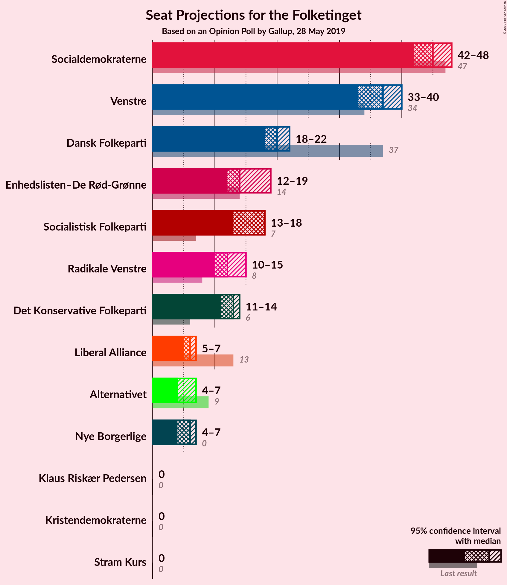

### Confidence Intervals

| Party | Last Result | Median | 80% Confidence Interval | 90% Confidence Interval | 95% Confidence Interval | 99% Confidence Interval |
|:-----:|:-----------:|:------:|:-----------------------:|:-----------------------:|:-----------------------:|:-----------------------:|
| <a href="#socialdemokraterne">Socialdemokraterne</a> | 47 | 45 | 44–47 |43–48 |42–48 |40–50 |
| <a href="#venstre">Venstre</a> | 34 | 37 | 36–37 |35–38 |33–40 |33–41 |
| <a href="#dansk-folkeparti">Dansk Folkeparti</a> | 37 | 20 | 19–20 |19–22 |18–22 |17–23 |
| <a href="#enhedslisten–de-rød-grønne">Enhedslisten–De Rød-Grønne</a> | 14 | 14 | 14–15 |12–17 |12–19 |12–19 |
| <a href="#socialistisk-folkeparti">Socialistisk Folkeparti</a> | 7 | 18 | 15–18 |15–18 |13–18 |12–18 |
| <a href="#det-konservative-folkeparti">Det Konservative Folkeparti</a> | 6 | 13 | 12–14 |11–14 |11–14 |9–16 |
| <a href="#radikale-venstre">Radikale Venstre</a> | 8 | 12 | 12–14 |11–15 |10–15 |10–15 |
| <a href="#liberal-alliance">Liberal Alliance</a> | 13 | 6 | 6 |5–6 |5–7 |4–8 |
| <a href="#alternativet">Alternativet</a> | 9 | 4 | 4–6 |4–6 |4–7 |4–7 |
| <a href="#nye-borgerlige">Nye Borgerlige</a> | 0 | 6 | 5–7 |4–7 |4–7 |0–8 |
| <a href="#stram-kurs">Stram Kurs</a> | 0 | 0 | 0 |0 |0 |0–4 |
| <a href="#kristendemokraterne">Kristendemokraterne</a> | 0 | 0 | 0 |0 |0 |0–4 |
| <a href="#klaus-riskær-pedersen">Klaus Riskær Pedersen</a> | 0 | 0 | 0 |0 |0 |0 |

### Socialdemokraterne

*For a full overview of the results for this party, see the [Socialdemokraterne](party-socialdemokraterne.html) page.*

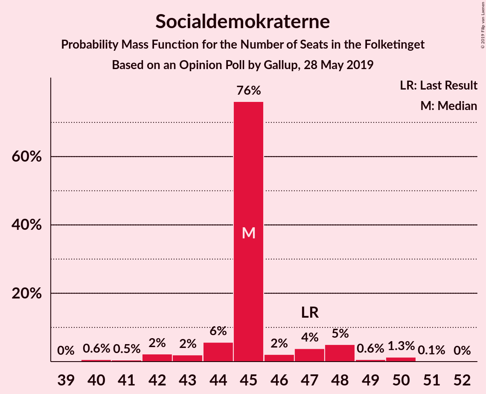

| Number of Seats | Probability | Accumulated | Special Marks |
|:---------------:|:-----------:|:-----------:|:-------------:|
| 40 | 0.6% | 100% |  |
| 41 | 0.5% | 99.4% |  |
| 42 | 2% | 98.9% |  |
| 43 | 2% | 97% |  |
| 44 | 6% | 95% |  |
| 45 | 76% | 89% | Median |
| 46 | 2% | 13% |  |
| 47 | 4% | 11% | Last Result |
| 48 | 5% | 7% |  |
| 49 | 0.6% | 2% |  |
| 50 | 1.3% | 1.4% |  |
| 51 | 0.1% | 0.1% |  |
| 52 | 0% | 0% |  |

### Venstre

*For a full overview of the results for this party, see the [Venstre](party-venstre.html) page.*

| Number of Seats | Probability | Accumulated | Special Marks |
|:---------------:|:-----------:|:-----------:|:-------------:|
| 31 | 0.1% | 100% |  |
| 32 | 0.4% | 99.9% |  |
| 33 | 3% | 99.5% |  |
| 34 | 0.7% | 97% | Last Result |
| 35 | 4% | 96% |  |
| 36 | 9% | 92% |  |
| 37 | 74% | 83% | Median |
| 38 | 5% | 9% |  |
| 39 | 0.4% | 4% |  |
| 40 | 3% | 3% |  |
| 41 | 0.2% | 0.5% |  |
| 42 | 0% | 0.3% |  |
| 43 | 0.2% | 0.2% |  |
| 44 | 0% | 0% |  |

### Dansk Folkeparti

*For a full overview of the results for this party, see the [Dansk Folkeparti](party-danskfolkeparti.html) page.*

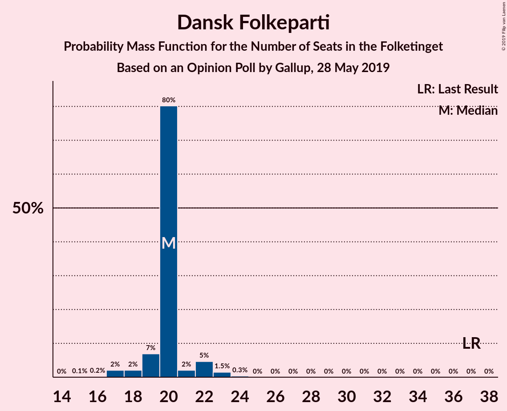

| Number of Seats | Probability | Accumulated | Special Marks |
|:---------------:|:-----------:|:-----------:|:-------------:|
| 15 | 0.1% | 100% |  |
| 16 | 0.2% | 99.9% |  |
| 17 | 2% | 99.8% |  |
| 18 | 2% | 98% |  |
| 19 | 7% | 96% |  |
| 20 | 80% | 89% | Median |
| 21 | 2% | 9% |  |
| 22 | 5% | 6% |  |
| 23 | 1.5% | 2% |  |
| 24 | 0.3% | 0.4% |  |
| 25 | 0% | 0% |  |
| 26 | 0% | 0% |  |
| 27 | 0% | 0% |  |
| 28 | 0% | 0% |  |
| 29 | 0% | 0% |  |
| 30 | 0% | 0% |  |
| 31 | 0% | 0% |  |
| 32 | 0% | 0% |  |
| 33 | 0% | 0% |  |
| 34 | 0% | 0% |  |
| 35 | 0% | 0% |  |
| 36 | 0% | 0% |  |
| 37 | 0% | 0% | Last Result |

### Enhedslisten–De Rød-Grønne

*For a full overview of the results for this party, see the [Enhedslisten–De Rød-Grønne](party-enhedslisten–derød-grønne.html) page.*

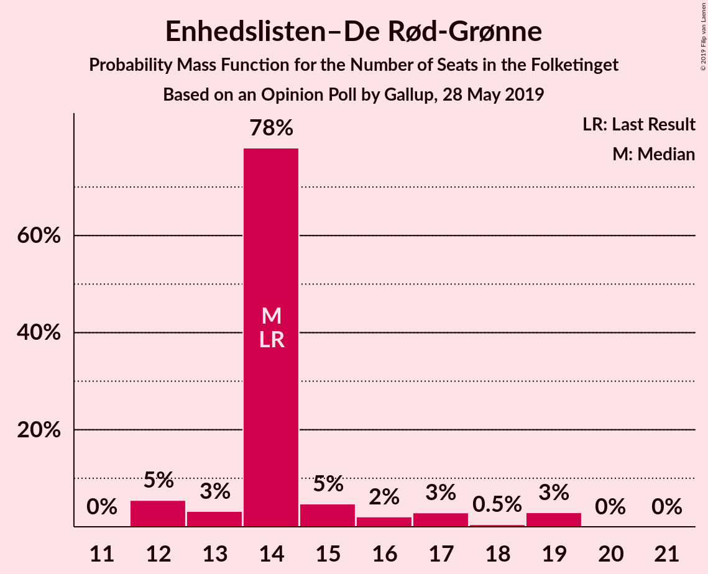

| Number of Seats | Probability | Accumulated | Special Marks |
|:---------------:|:-----------:|:-----------:|:-------------:|
| 12 | 5% | 100% |  |
| 13 | 3% | 94% |  |
| 14 | 78% | 91% | Last Result, Median |
| 15 | 5% | 13% |  |
| 16 | 2% | 8% |  |
| 17 | 3% | 6% |  |
| 18 | 0.5% | 3% |  |
| 19 | 3% | 3% |  |
| 20 | 0% | 0.1% |  |
| 21 | 0% | 0% |  |

### Socialistisk Folkeparti

*For a full overview of the results for this party, see the [Socialistisk Folkeparti](party-socialistiskfolkeparti.html) page.*

| Number of Seats | Probability | Accumulated | Special Marks |
|:---------------:|:-----------:|:-----------:|:-------------:|
| 7 | 0% | 100% | Last Result |
| 8 | 0% | 100% |  |
| 9 | 0% | 100% |  |
| 10 | 0% | 100% |  |
| 11 | 0% | 100% |  |
| 12 | 0.9% | 100% |  |
| 13 | 2% | 99.0% |  |
| 14 | 1.4% | 97% |  |
| 15 | 17% | 96% |  |
| 16 | 3% | 79% |  |
| 17 | 4% | 76% |  |
| 18 | 71% | 72% | Median |
| 19 | 0.2% | 0.3% |  |
| 20 | 0.1% | 0.1% |  |
| 21 | 0% | 0% |  |

### Det Konservative Folkeparti

*For a full overview of the results for this party, see the [Det Konservative Folkeparti](party-detkonservativefolkeparti.html) page.*

| Number of Seats | Probability | Accumulated | Special Marks |
|:---------------:|:-----------:|:-----------:|:-------------:|
| 6 | 0% | 100% | Last Result |
| 7 | 0% | 100% |  |
| 8 | 0.1% | 100% |  |
| 9 | 0.5% | 99.9% |  |
| 10 | 0.4% | 99.4% |  |
| 11 | 5% | 99.0% |  |
| 12 | 7% | 94% |  |
| 13 | 76% | 87% | Median |
| 14 | 9% | 11% |  |
| 15 | 1.3% | 2% |  |
| 16 | 0.6% | 0.6% |  |
| 17 | 0.1% | 0.1% |  |
| 18 | 0% | 0% |  |

### Radikale Venstre

*For a full overview of the results for this party, see the [Radikale Venstre](party-radikalevenstre.html) page.*

| Number of Seats | Probability | Accumulated | Special Marks |
|:---------------:|:-----------:|:-----------:|:-------------:|
| 8 | 0% | 100% | Last Result |
| 9 | 0.1% | 100% |  |
| 10 | 3% | 99.9% |  |
| 11 | 5% | 97% |  |
| 12 | 76% | 92% | Median |
| 13 | 5% | 15% |  |
| 14 | 5% | 10% |  |
| 15 | 5% | 5% |  |
| 16 | 0.3% | 0.4% |  |
| 17 | 0% | 0.1% |  |
| 18 | 0% | 0% |  |

### Liberal Alliance

*For a full overview of the results for this party, see the [Liberal Alliance](party-liberalalliance.html) page.*

| Number of Seats | Probability | Accumulated | Special Marks |
|:---------------:|:-----------:|:-----------:|:-------------:|
| 0 | 0.1% | 100% |  |
| 1 | 0% | 99.9% |  |
| 2 | 0% | 99.9% |  |
| 3 | 0% | 99.9% |  |
| 4 | 2% | 99.9% |  |
| 5 | 7% | 98% |  |
| 6 | 88% | 91% | Median |
| 7 | 0.8% | 3% |  |
| 8 | 2% | 2% |  |
| 9 | 0.1% | 0.1% |  |
| 10 | 0% | 0% |  |
| 11 | 0% | 0% |  |
| 12 | 0% | 0% |  |
| 13 | 0% | 0% | Last Result |

### Alternativet

*For a full overview of the results for this party, see the [Alternativet](party-alternativet.html) page.*

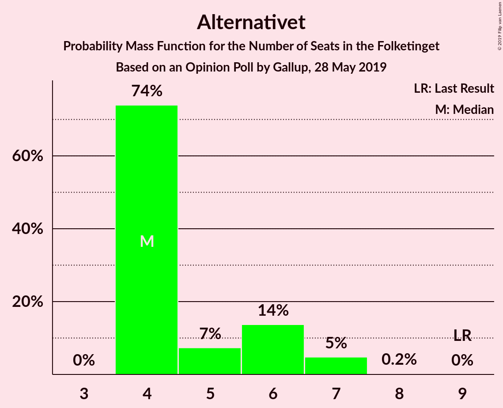

| Number of Seats | Probability | Accumulated | Special Marks |
|:---------------:|:-----------:|:-----------:|:-------------:|
| 4 | 74% | 100% | Median |
| 5 | 7% | 26% |  |
| 6 | 14% | 19% |  |
| 7 | 5% | 5% |  |
| 8 | 0.2% | 0.2% |  |
| 9 | 0% | 0% | Last Result |

### Nye Borgerlige

*For a full overview of the results for this party, see the [Nye Borgerlige](party-nyeborgerlige.html) page.*

| Number of Seats | Probability | Accumulated | Special Marks |
|:---------------:|:-----------:|:-----------:|:-------------:|
| 0 | 1.4% | 100% | Last Result |
| 1 | 0% | 98.6% |  |
| 2 | 0% | 98.6% |  |
| 3 | 0% | 98.6% |  |
| 4 | 4% | 98.6% |  |
| 5 | 5% | 95% |  |
| 6 | 79% | 89% | Median |
| 7 | 8% | 10% |  |
| 8 | 2% | 2% |  |
| 9 | 0% | 0% |  |

### Stram Kurs

*For a full overview of the results for this party, see the [Stram Kurs](party-stramkurs.html) page.*

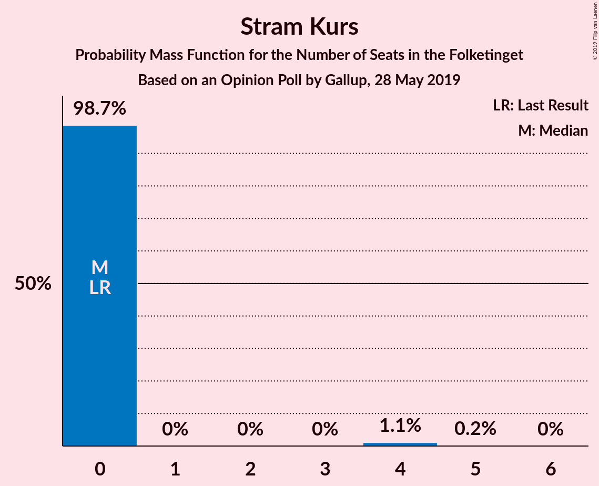

| Number of Seats | Probability | Accumulated | Special Marks |
|:---------------:|:-----------:|:-----------:|:-------------:|
| 0 | 98.7% | 100% | Last Result, Median |
| 1 | 0% | 1.3% |  |
| 2 | 0% | 1.3% |  |
| 3 | 0% | 1.3% |  |
| 4 | 1.1% | 1.3% |  |
| 5 | 0.2% | 0.2% |  |
| 6 | 0% | 0% |  |

### Kristendemokraterne

*For a full overview of the results for this party, see the [Kristendemokraterne](party-kristendemokraterne.html) page.*

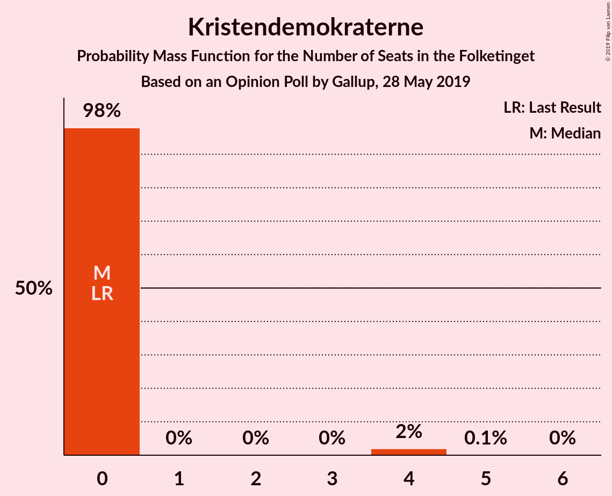

| Number of Seats | Probability | Accumulated | Special Marks |
|:---------------:|:-----------:|:-----------:|:-------------:|
| 0 | 98% | 100% | Last Result, Median |
| 1 | 0% | 2% |  |
| 2 | 0% | 2% |  |
| 3 | 0% | 2% |  |
| 4 | 2% | 2% |  |
| 5 | 0.1% | 0.1% |  |
| 6 | 0% | 0% |  |

### Klaus Riskær Pedersen

*For a full overview of the results for this party, see the [Klaus Riskær Pedersen](party-klausriskærpedersen.html) page.*

| Number of Seats | Probability | Accumulated | Special Marks |
|:---------------:|:-----------:|:-----------:|:-------------:|
| 0 | 100% | 100% | Last Result, Median |

## Coalitions

### Confidence Intervals

| Coalition | Last Result | Median | Majority? | 80% Confidence Interval | 90% Confidence Interval | 95% Confidence Interval | 99% Confidence Interval |
|:---------:|:-----------:|:------:|:---------:|:-----------------------:|:-----------------------:|:-----------------------:|:-----------------------:|
| Socialdemokraterne – Enhedslisten–De Rød-Grønne – Socialistisk Folkeparti – Radikale Venstre – Alternativet | 85 | 93 | 99.5% | 93–95 | 91–96 | 90–98 | 90–100 |
| Socialdemokraterne – Enhedslisten–De Rød-Grønne – Socialistisk Folkeparti – Radikale Venstre | 76 | 89 | 5% | 87–89 | 85–89 | 84–91 | 84–94 |
| Socialdemokraterne – Enhedslisten–De Rød-Grønne – Socialistisk Folkeparti – Alternativet | 77 | 81 | 0% | 80–81 | 79–84 | 78–85 | 77–88 |
| Venstre – Dansk Folkeparti – Det Konservative Folkeparti – Liberal Alliance – Nye Borgerlige – Stram Kurs – Kristendemokraterne – Klaus Riskær Pedersen | 90 | 82 | 0% | 80–82 | 79–84 | 77–85 | 75–85 |
| Venstre – Dansk Folkeparti – Det Konservative Folkeparti – Liberal Alliance – Nye Borgerlige – Kristendemokraterne – Klaus Riskær Pedersen | 90 | 82 | 0% | 80–82 | 79–84 | 77–85 | 75–85 |
| Venstre – Dansk Folkeparti – Det Konservative Folkeparti – Liberal Alliance – Nye Borgerlige – Klaus Riskær Pedersen | 90 | 82 | 0% | 80–82 | 78–84 | 77–85 | 73–85 |
| Venstre – Dansk Folkeparti – Det Konservative Folkeparti – Liberal Alliance – Nye Borgerlige – Kristendemokraterne | 90 | 82 | 0% | 80–82 | 79–84 | 77–85 | 75–85 |
| Venstre – Dansk Folkeparti – Det Konservative Folkeparti – Liberal Alliance – Nye Borgerlige | 90 | 82 | 0% | 80–82 | 78–84 | 77–85 | 73–85 |
| Socialdemokraterne – Enhedslisten–De Rød-Grønne – Socialistisk Folkeparti | 68 | 77 | 0% | 74–77 | 73–79 | 73–79 | 72–82 |
| Venstre – Dansk Folkeparti – Det Konservative Folkeparti – Liberal Alliance – Kristendemokraterne | 90 | 76 | 0% | 74–77 | 73–78 | 71–78 | 69–80 |
| Venstre – Dansk Folkeparti – Det Konservative Folkeparti – Liberal Alliance | 90 | 76 | 0% | 74–77 | 73–78 | 71–78 | 69–79 |
| Socialdemokraterne – Socialistisk Folkeparti – Radikale Venstre | 62 | 75 | 0% | 71–75 | 70–77 | 70–77 | 68–80 |
| Socialdemokraterne – Radikale Venstre | 55 | 57 | 0% | 56–59 | 55–62 | 55–62 | 54–63 |
| Venstre – Det Konservative Folkeparti – Liberal Alliance | 53 | 56 | 0% | 54–56 | 54–57 | 51–58 | 50–59 |
| Venstre – Det Konservative Folkeparti | 40 | 50 | 0% | 49–50 | 48–51 | 45–52 | 45–53 |
| Venstre | 34 | 37 | 0% | 36–37 | 35–38 | 33–40 | 33–41 |

### Socialdemokraterne – Enhedslisten–De Rød-Grønne – Socialistisk Folkeparti – Radikale Venstre – Alternativet

| Number of Seats | Probability | Accumulated | Special Marks |
|:---------------:|:-----------:|:-----------:|:-------------:|
| 85 | 0% | 100% | Last Result |
| 86 | 0% | 100% |  |
| 87 | 0.3% | 100% |  |
| 88 | 0% | 99.7% |  |
| 89 | 0.1% | 99.7% |  |
| 90 | 4% | 99.5% | Majority |
| 91 | 1.3% | 95% |  |
| 92 | 3% | 94% |  |
| 93 | 77% | 91% | Median |
| 94 | 3% | 14% |  |
| 95 | 4% | 11% |  |
| 96 | 3% | 7% |  |
| 97 | 0.3% | 4% |  |
| 98 | 2% | 4% |  |
| 99 | 1.3% | 2% |  |
| 100 | 0.2% | 0.7% |  |
| 101 | 0% | 0.4% |  |
| 102 | 0.4% | 0.4% |  |
| 103 | 0% | 0% |  |

### Socialdemokraterne – Enhedslisten–De Rød-Grønne – Socialistisk Folkeparti – Radikale Venstre

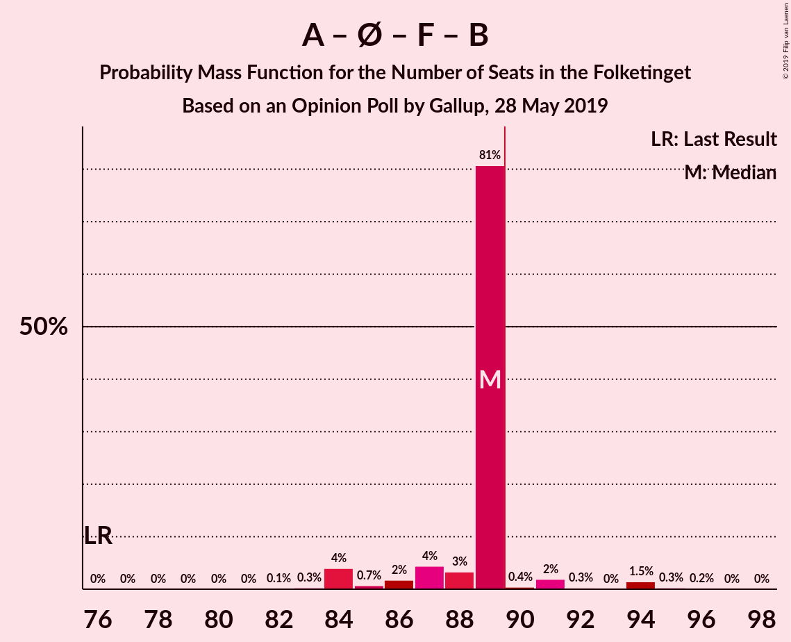

| Number of Seats | Probability | Accumulated | Special Marks |
|:---------------:|:-----------:|:-----------:|:-------------:|
| 76 | 0% | 100% | Last Result |
| 77 | 0% | 100% |  |
| 78 | 0% | 100% |  |
| 79 | 0% | 100% |  |
| 80 | 0% | 100% |  |
| 81 | 0% | 100% |  |
| 82 | 0.1% | 100% |  |
| 83 | 0.3% | 99.9% |  |
| 84 | 4% | 99.6% |  |
| 85 | 0.7% | 96% |  |
| 86 | 2% | 95% |  |
| 87 | 4% | 93% |  |
| 88 | 3% | 89% |  |
| 89 | 81% | 85% | Median |
| 90 | 0.4% | 5% | Majority |
| 91 | 2% | 4% |  |
| 92 | 0.3% | 2% |  |
| 93 | 0% | 2% |  |
| 94 | 1.5% | 2% |  |
| 95 | 0.3% | 0.5% |  |
| 96 | 0.2% | 0.2% |  |
| 97 | 0% | 0% |  |

### Socialdemokraterne – Enhedslisten–De Rød-Grønne – Socialistisk Folkeparti – Alternativet

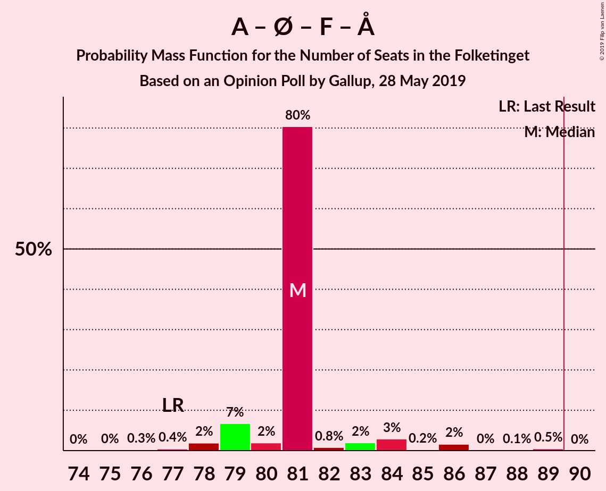

| Number of Seats | Probability | Accumulated | Special Marks |
|:---------------:|:-----------:|:-----------:|:-------------:|
| 74 | 0% | 100% |  |
| 75 | 0% | 99.9% |  |
| 76 | 0.3% | 99.9% |  |
| 77 | 0.4% | 99.6% | Last Result |
| 78 | 2% | 99.2% |  |
| 79 | 7% | 97% |  |
| 80 | 2% | 91% |  |
| 81 | 80% | 89% | Median |
| 82 | 0.8% | 8% |  |
| 83 | 2% | 7% |  |
| 84 | 3% | 5% |  |
| 85 | 0.2% | 3% |  |
| 86 | 2% | 2% |  |
| 87 | 0% | 0.7% |  |
| 88 | 0.1% | 0.6% |  |
| 89 | 0.5% | 0.5% |  |
| 90 | 0% | 0% | Majority |

### Venstre – Dansk Folkeparti – Det Konservative Folkeparti – Liberal Alliance – Nye Borgerlige – Stram Kurs – Kristendemokraterne – Klaus Riskær Pedersen

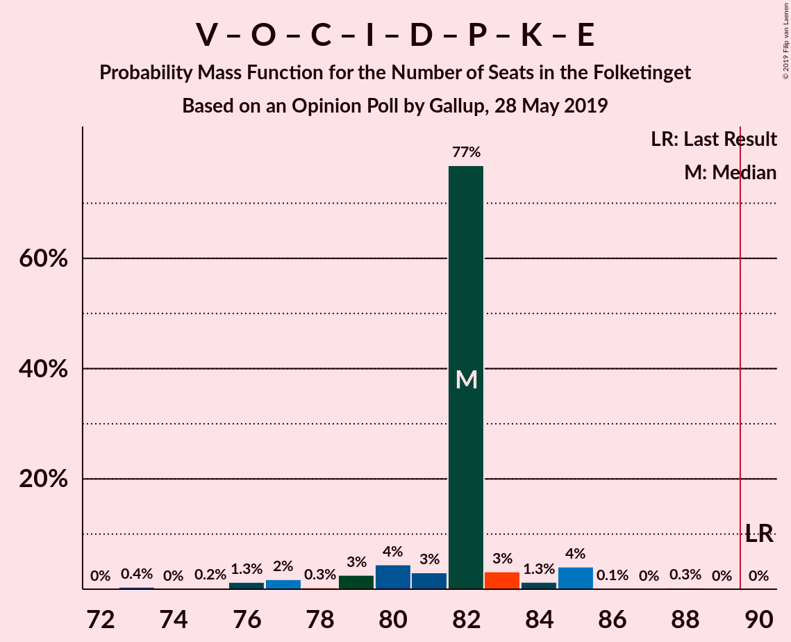

| Number of Seats | Probability | Accumulated | Special Marks |
|:---------------:|:-----------:|:-----------:|:-------------:|
| 73 | 0.4% | 100% |  |
| 74 | 0% | 99.6% |  |
| 75 | 0.2% | 99.6% |  |
| 76 | 1.3% | 99.3% |  |
| 77 | 2% | 98% |  |
| 78 | 0.3% | 96% |  |
| 79 | 3% | 96% |  |
| 80 | 4% | 93% |  |
| 81 | 3% | 89% |  |
| 82 | 77% | 86% | Median |
| 83 | 3% | 9% |  |
| 84 | 1.3% | 6% |  |
| 85 | 4% | 5% |  |
| 86 | 0.1% | 0.5% |  |
| 87 | 0% | 0.3% |  |
| 88 | 0.3% | 0.3% |  |
| 89 | 0% | 0% |  |
| 90 | 0% | 0% | Last Result, Majority |

### Venstre – Dansk Folkeparti – Det Konservative Folkeparti – Liberal Alliance – Nye Borgerlige – Kristendemokraterne – Klaus Riskær Pedersen

| Number of Seats | Probability | Accumulated | Special Marks |
|:---------------:|:-----------:|:-----------:|:-------------:|
| 73 | 0.4% | 100% |  |
| 74 | 0% | 99.6% |  |
| 75 | 0.3% | 99.5% |  |
| 76 | 1.4% | 99.2% |  |
| 77 | 2% | 98% |  |
| 78 | 0.3% | 96% |  |
| 79 | 3% | 96% |  |
| 80 | 4% | 92% |  |
| 81 | 3% | 88% |  |
| 82 | 77% | 85% | Median |
| 83 | 2% | 8% |  |
| 84 | 1.2% | 6% |  |
| 85 | 4% | 4% |  |
| 86 | 0.1% | 0.4% |  |
| 87 | 0% | 0.3% |  |
| 88 | 0.3% | 0.3% |  |
| 89 | 0% | 0% |  |
| 90 | 0% | 0% | Last Result, Majority |

### Venstre – Dansk Folkeparti – Det Konservative Folkeparti – Liberal Alliance – Nye Borgerlige – Klaus Riskær Pedersen

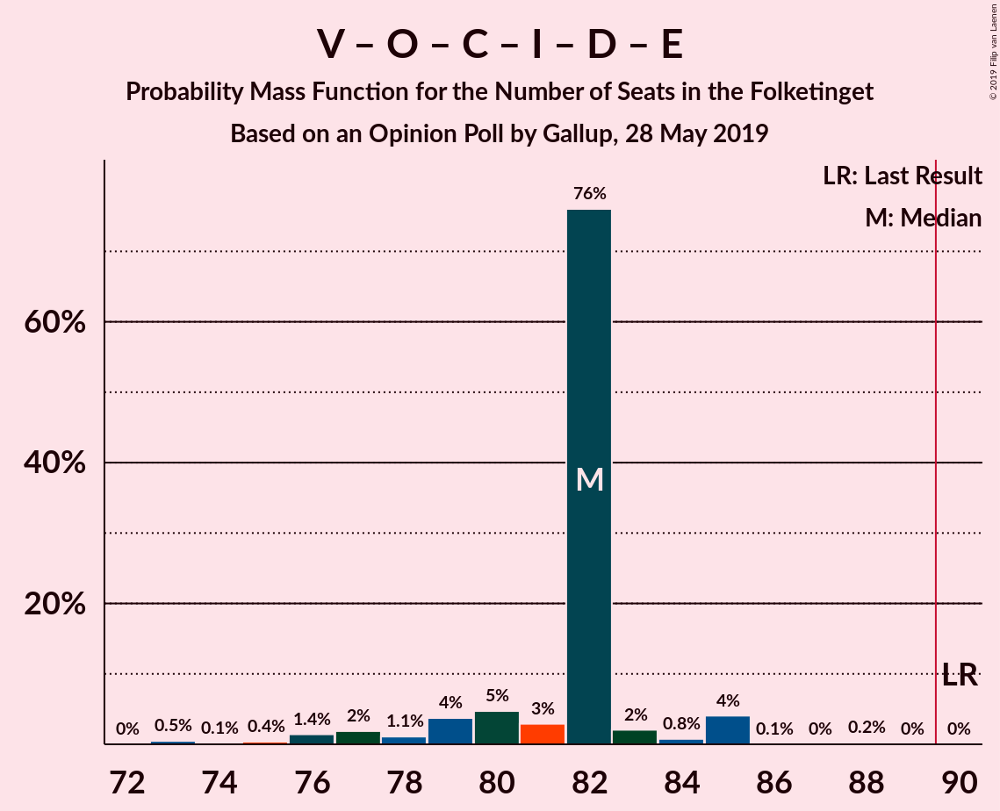

| Number of Seats | Probability | Accumulated | Special Marks |
|:---------------:|:-----------:|:-----------:|:-------------:|
| 73 | 0.5% | 100% |  |
| 74 | 0.1% | 99.5% |  |
| 75 | 0.4% | 99.4% |  |
| 76 | 1.4% | 99.0% |  |
| 77 | 2% | 98% |  |
| 78 | 1.1% | 96% |  |
| 79 | 4% | 95% |  |
| 80 | 5% | 91% |  |
| 81 | 3% | 86% |  |
| 82 | 76% | 83% | Median |
| 83 | 2% | 7% |  |
| 84 | 0.8% | 5% |  |
| 85 | 4% | 4% |  |
| 86 | 0.1% | 0.3% |  |
| 87 | 0% | 0.2% |  |
| 88 | 0.2% | 0.2% |  |
| 89 | 0% | 0% |  |
| 90 | 0% | 0% | Last Result, Majority |

### Venstre – Dansk Folkeparti – Det Konservative Folkeparti – Liberal Alliance – Nye Borgerlige – Kristendemokraterne

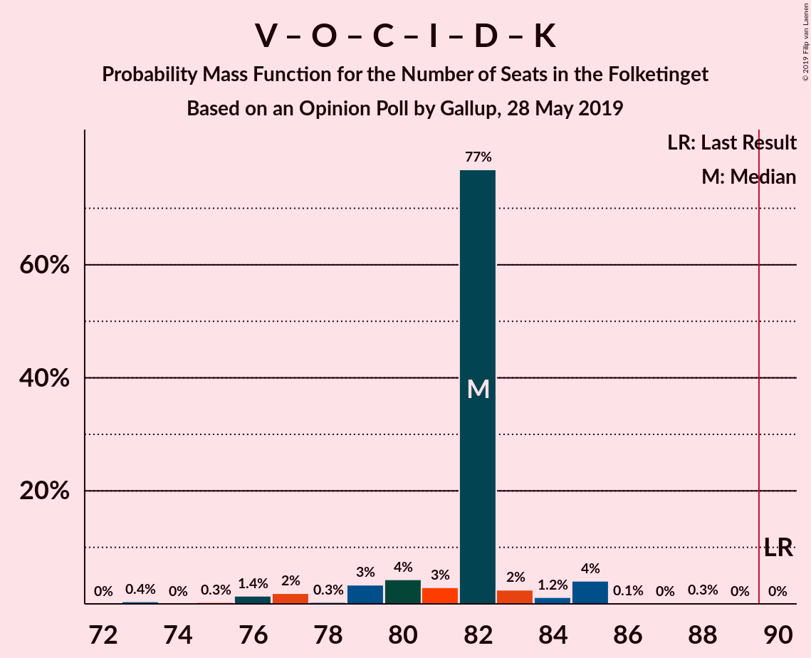

| Number of Seats | Probability | Accumulated | Special Marks |
|:---------------:|:-----------:|:-----------:|:-------------:|
| 73 | 0.4% | 100% |  |
| 74 | 0% | 99.6% |  |
| 75 | 0.3% | 99.5% |  |
| 76 | 1.4% | 99.2% |  |
| 77 | 2% | 98% |  |
| 78 | 0.3% | 96% |  |
| 79 | 3% | 96% |  |
| 80 | 4% | 92% |  |
| 81 | 3% | 88% |  |
| 82 | 77% | 85% | Median |
| 83 | 2% | 8% |  |
| 84 | 1.2% | 6% |  |
| 85 | 4% | 4% |  |
| 86 | 0.1% | 0.4% |  |
| 87 | 0% | 0.3% |  |
| 88 | 0.3% | 0.3% |  |
| 89 | 0% | 0% |  |
| 90 | 0% | 0% | Last Result, Majority |

### Venstre – Dansk Folkeparti – Det Konservative Folkeparti – Liberal Alliance – Nye Borgerlige

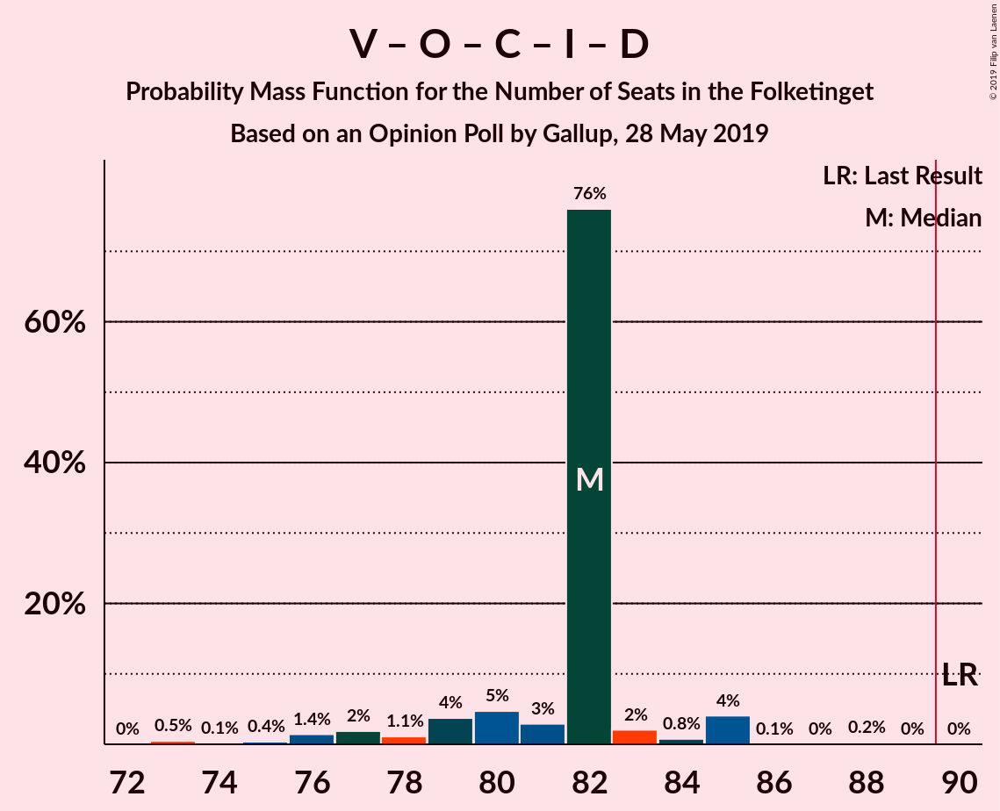

| Number of Seats | Probability | Accumulated | Special Marks |
|:---------------:|:-----------:|:-----------:|:-------------:|
| 73 | 0.5% | 100% |  |
| 74 | 0.1% | 99.5% |  |
| 75 | 0.4% | 99.4% |  |
| 76 | 1.4% | 99.0% |  |
| 77 | 2% | 98% |  |
| 78 | 1.1% | 96% |  |
| 79 | 4% | 95% |  |
| 80 | 5% | 91% |  |
| 81 | 3% | 86% |  |
| 82 | 76% | 83% | Median |
| 83 | 2% | 7% |  |
| 84 | 0.8% | 5% |  |
| 85 | 4% | 4% |  |
| 86 | 0.1% | 0.3% |  |
| 87 | 0% | 0.2% |  |
| 88 | 0.2% | 0.2% |  |
| 89 | 0% | 0% |  |
| 90 | 0% | 0% | Last Result, Majority |

### Socialdemokraterne – Enhedslisten–De Rød-Grønne – Socialistisk Folkeparti

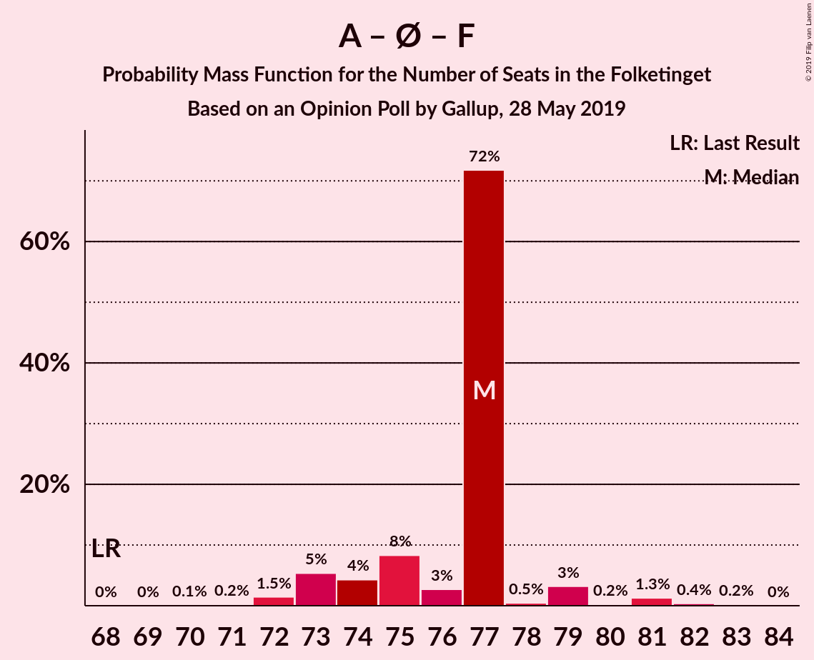

| Number of Seats | Probability | Accumulated | Special Marks |
|:---------------:|:-----------:|:-----------:|:-------------:|
| 68 | 0% | 100% | Last Result |
| 69 | 0% | 100% |  |
| 70 | 0.1% | 99.9% |  |
| 71 | 0.2% | 99.9% |  |
| 72 | 1.5% | 99.7% |  |
| 73 | 5% | 98% |  |
| 74 | 4% | 93% |  |
| 75 | 8% | 89% |  |
| 76 | 3% | 80% |  |
| 77 | 72% | 78% | Median |
| 78 | 0.5% | 6% |  |
| 79 | 3% | 5% |  |
| 80 | 0.2% | 2% |  |
| 81 | 1.3% | 2% |  |
| 82 | 0.4% | 0.6% |  |
| 83 | 0.2% | 0.3% |  |
| 84 | 0% | 0% |  |

### Venstre – Dansk Folkeparti – Det Konservative Folkeparti – Liberal Alliance – Kristendemokraterne

| Number of Seats | Probability | Accumulated | Special Marks |
|:---------------:|:-----------:|:-----------:|:-------------:|
| 68 | 0.4% | 100% |  |
| 69 | 0.1% | 99.5% |  |
| 70 | 0.3% | 99.5% |  |
| 71 | 2% | 99.2% |  |
| 72 | 0.3% | 97% |  |
| 73 | 2% | 97% |  |
| 74 | 7% | 95% |  |
| 75 | 1.0% | 87% |  |
| 76 | 75% | 86% | Median |
| 77 | 5% | 12% |  |
| 78 | 5% | 6% |  |
| 79 | 0.4% | 1.2% |  |
| 80 | 0.5% | 0.8% |  |
| 81 | 0% | 0.3% |  |
| 82 | 0.3% | 0.3% |  |
| 83 | 0% | 0% |  |
| 84 | 0% | 0% |  |
| 85 | 0% | 0% |  |
| 86 | 0% | 0% |  |
| 87 | 0% | 0% |  |
| 88 | 0% | 0% |  |
| 89 | 0% | 0% |  |
| 90 | 0% | 0% | Last Result, Majority |

### Venstre – Dansk Folkeparti – Det Konservative Folkeparti – Liberal Alliance

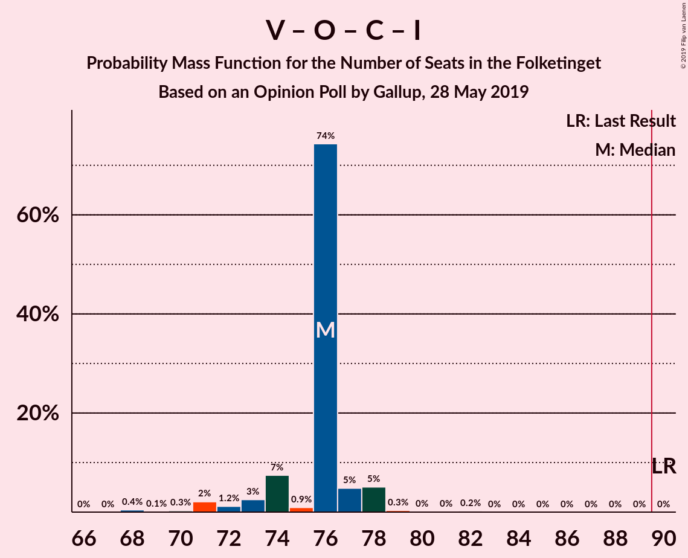

| Number of Seats | Probability | Accumulated | Special Marks |
|:---------------:|:-----------:|:-----------:|:-------------:|
| 68 | 0.4% | 100% |  |
| 69 | 0.1% | 99.5% |  |
| 70 | 0.3% | 99.4% |  |
| 71 | 2% | 99.1% |  |
| 72 | 1.2% | 97% |  |
| 73 | 3% | 96% |  |
| 74 | 7% | 93% |  |
| 75 | 0.9% | 86% |  |
| 76 | 74% | 85% | Median |
| 77 | 5% | 11% |  |
| 78 | 5% | 6% |  |
| 79 | 0.3% | 0.7% |  |
| 80 | 0% | 0.3% |  |
| 81 | 0% | 0.3% |  |
| 82 | 0.2% | 0.3% |  |
| 83 | 0% | 0% |  |
| 84 | 0% | 0% |  |
| 85 | 0% | 0% |  |
| 86 | 0% | 0% |  |
| 87 | 0% | 0% |  |
| 88 | 0% | 0% |  |
| 89 | 0% | 0% |  |
| 90 | 0% | 0% | Last Result, Majority |

### Socialdemokraterne – Socialistisk Folkeparti – Radikale Venstre

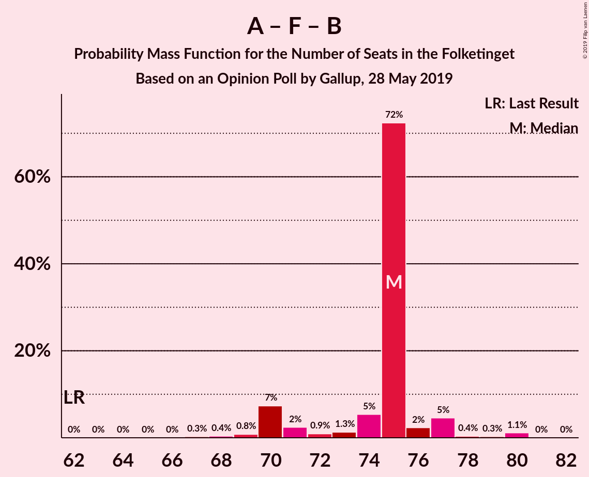

| Number of Seats | Probability | Accumulated | Special Marks |
|:---------------:|:-----------:|:-----------:|:-------------:|
| 62 | 0% | 100% | Last Result |
| 63 | 0% | 100% |  |
| 64 | 0% | 100% |  |
| 65 | 0% | 100% |  |
| 66 | 0% | 100% |  |
| 67 | 0.3% | 100% |  |
| 68 | 0.4% | 99.7% |  |
| 69 | 0.8% | 99.3% |  |
| 70 | 7% | 98.5% |  |
| 71 | 2% | 91% |  |
| 72 | 0.9% | 89% |  |
| 73 | 1.3% | 88% |  |
| 74 | 5% | 87% |  |
| 75 | 72% | 81% | Median |
| 76 | 2% | 9% |  |
| 77 | 5% | 6% |  |
| 78 | 0.4% | 2% |  |
| 79 | 0.3% | 1.4% |  |
| 80 | 1.1% | 1.2% |  |
| 81 | 0% | 0% |  |

### Socialdemokraterne – Radikale Venstre

| Number of Seats | Probability | Accumulated | Special Marks |
|:---------------:|:-----------:|:-----------:|:-------------:|
| 51 | 0.4% | 100% |  |
| 52 | 0% | 99.6% |  |
| 53 | 0.1% | 99.6% |  |
| 54 | 0.8% | 99.5% |  |
| 55 | 7% | 98.7% | Last Result |
| 56 | 2% | 92% |  |
| 57 | 74% | 90% | Median |
| 58 | 1.3% | 15% |  |
| 59 | 5% | 14% |  |
| 60 | 3% | 10% |  |
| 61 | 0.8% | 7% |  |
| 62 | 4% | 6% |  |
| 63 | 1.4% | 2% |  |
| 64 | 0.2% | 0.2% |  |
| 65 | 0% | 0% |  |

### Venstre – Det Konservative Folkeparti – Liberal Alliance

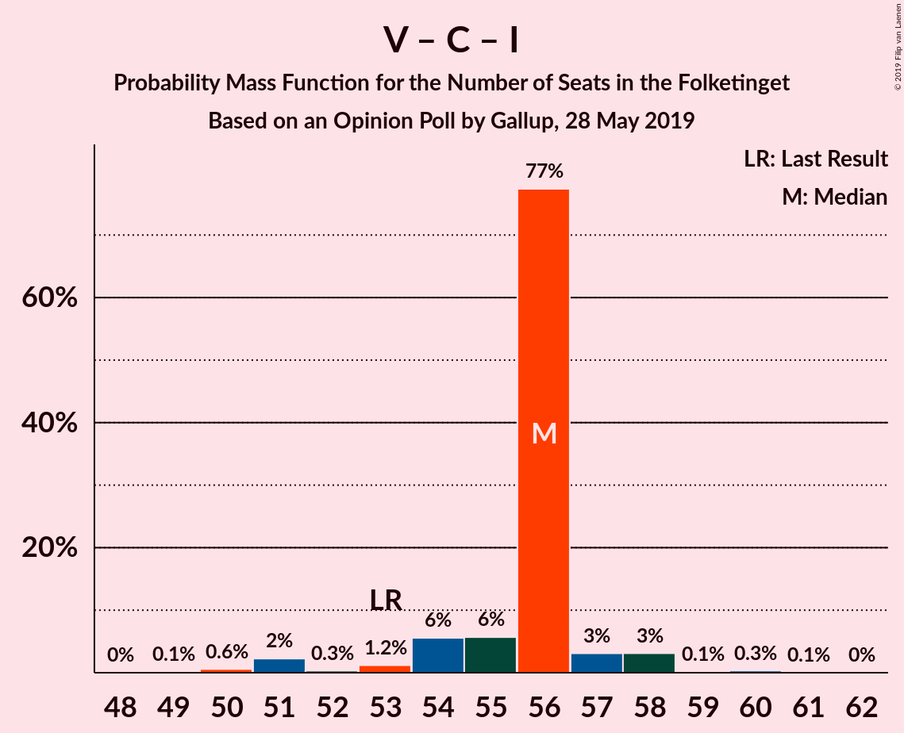

| Number of Seats | Probability | Accumulated | Special Marks |
|:---------------:|:-----------:|:-----------:|:-------------:|
| 49 | 0.1% | 100% |  |
| 50 | 0.6% | 99.8% |  |
| 51 | 2% | 99.3% |  |
| 52 | 0.3% | 97% |  |
| 53 | 1.2% | 97% | Last Result |
| 54 | 6% | 95% |  |
| 55 | 6% | 90% |  |
| 56 | 77% | 84% | Median |
| 57 | 3% | 7% |  |
| 58 | 3% | 4% |  |
| 59 | 0.1% | 0.6% |  |
| 60 | 0.3% | 0.4% |  |
| 61 | 0.1% | 0.1% |  |
| 62 | 0% | 0% |  |

### Venstre – Det Konservative Folkeparti

| Number of Seats | Probability | Accumulated | Special Marks |
|:---------------:|:-----------:|:-----------:|:-------------:|
| 40 | 0% | 100% | Last Result |
| 41 | 0% | 100% |  |
| 42 | 0% | 100% |  |
| 43 | 0% | 99.9% |  |
| 44 | 0.1% | 99.9% |  |
| 45 | 2% | 99.8% |  |
| 46 | 0.3% | 97% |  |
| 47 | 0.7% | 97% |  |
| 48 | 2% | 96% |  |
| 49 | 12% | 95% |  |
| 50 | 78% | 83% | Median |
| 51 | 1.4% | 6% |  |
| 52 | 4% | 4% |  |
| 53 | 0.1% | 0.6% |  |
| 54 | 0.2% | 0.4% |  |
| 55 | 0.2% | 0.3% |  |
| 56 | 0% | 0% |  |

### Venstre

| Number of Seats | Probability | Accumulated | Special Marks |
|:---------------:|:-----------:|:-----------:|:-------------:|
| 31 | 0.1% | 100% |  |
| 32 | 0.4% | 99.9% |  |
| 33 | 3% | 99.5% |  |
| 34 | 0.7% | 97% | Last Result |
| 35 | 4% | 96% |  |
| 36 | 9% | 92% |  |
| 37 | 74% | 83% | Median |
| 38 | 5% | 9% |  |
| 39 | 0.4% | 4% |  |
| 40 | 3% | 3% |  |
| 41 | 0.2% | 0.5% |  |
| 42 | 0% | 0.3% |  |
| 43 | 0.2% | 0.2% |  |
| 44 | 0% | 0% |  |

## Technical Information

### Opinion Poll

+ **Polling firm:** Gallup
+ **Commissioner(s):** —
+ **Fieldwork period:** 28 May 2019

### Calculations

+ **Sample size:** 1476
+ **Simulations done:** 1,048,576
+ **Error estimate:** 1.87%

