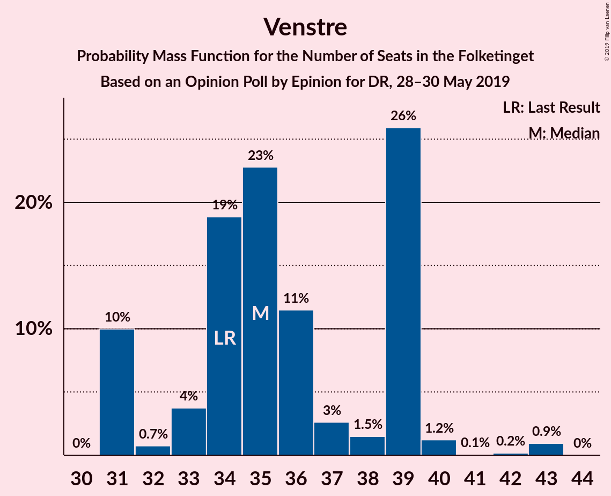
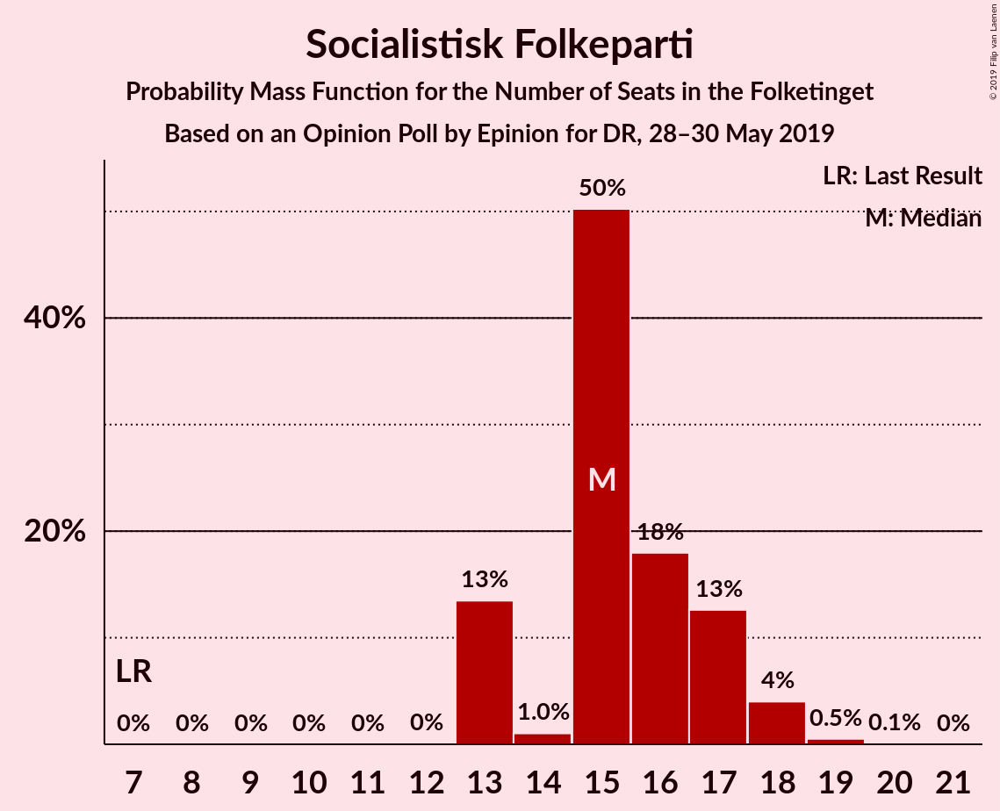
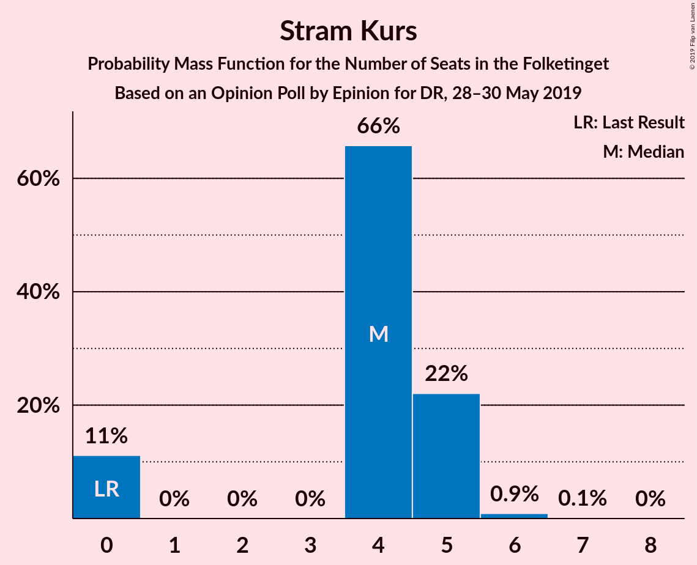
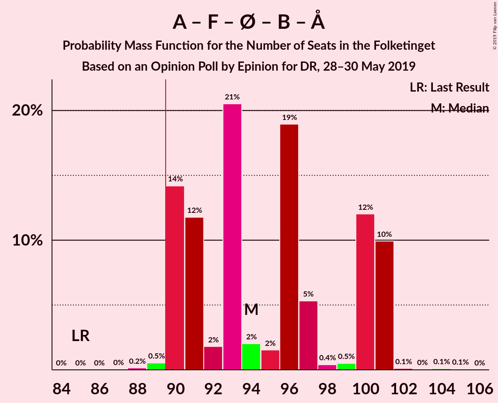
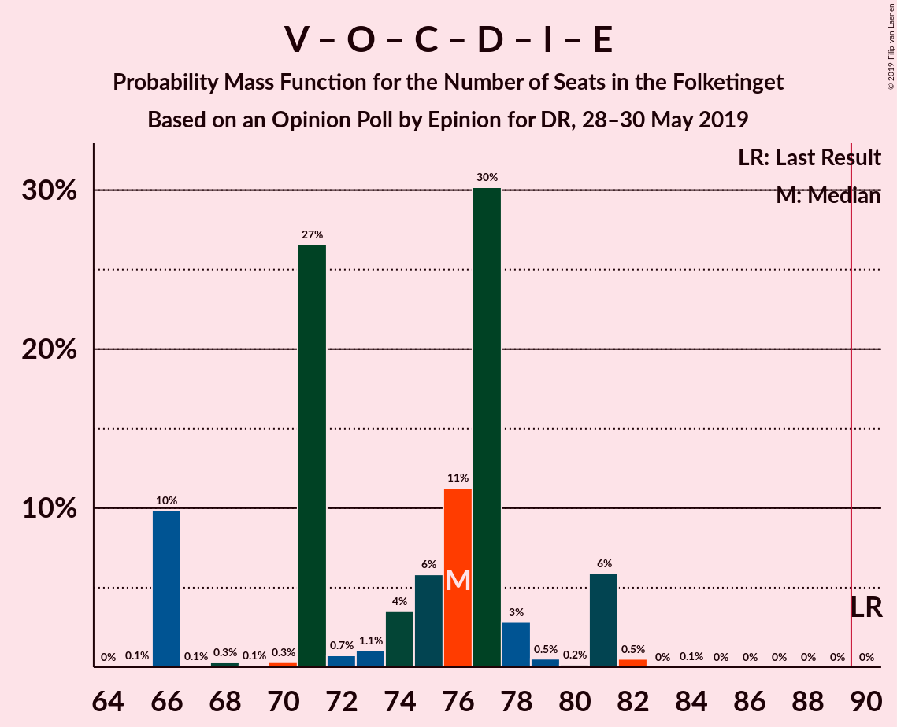
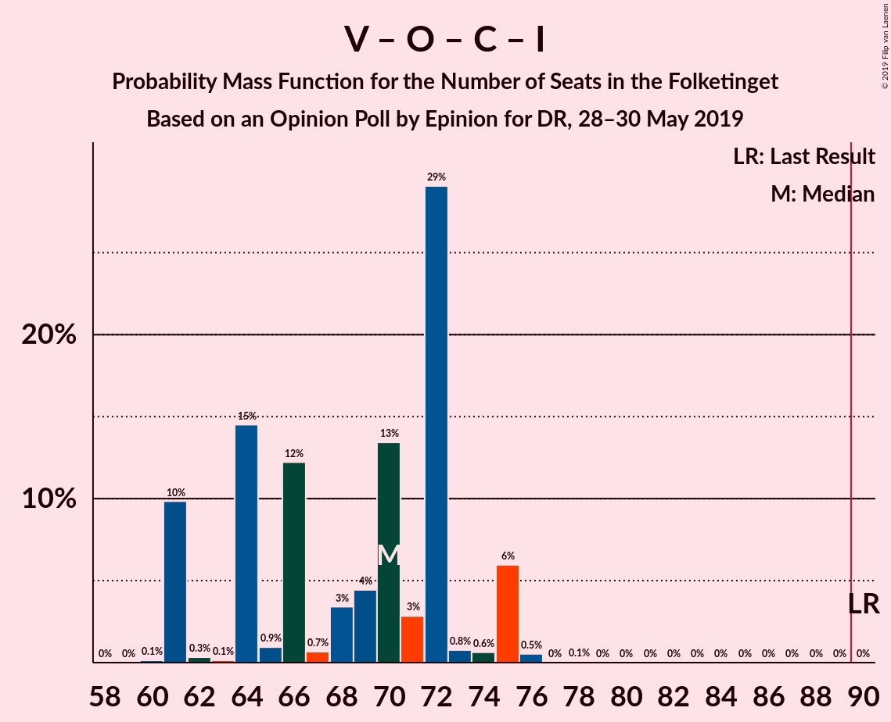
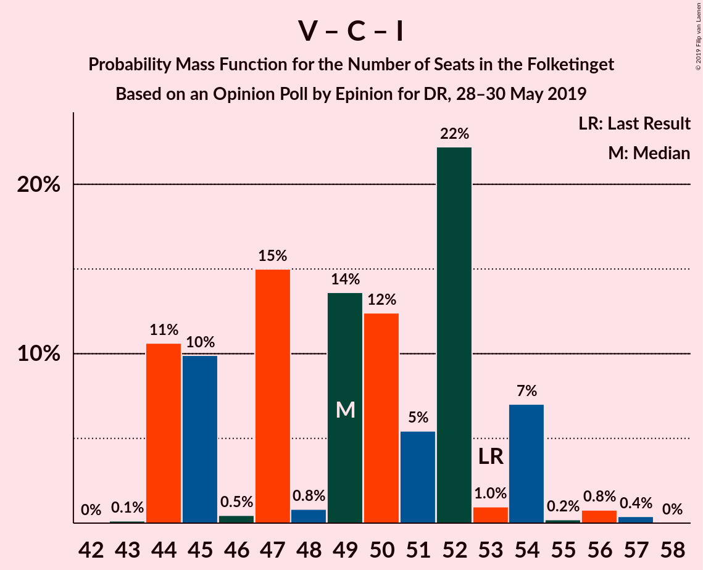

# Opinion Poll by Epinion for DR, 28–30 May 2019

<a href="#voting-intentions">Voting Intentions</a> | <a href="#seats">Seats</a> | <a href="#coalitions">Coalitions</a> | <a href="#technical-information">Technical Information</a>

## Voting Intentions

### Confidence Intervals

| Party | Last Result | Poll Result | 80% Confidence Interval | 90% Confidence Interval | 95% Confidence Interval | 99% Confidence Interval |
|:-----:|:-----------:|:-----------:|:-----------------------:|:-----------------------:|:-----------------------:|:-----------------------:|
| Socialdemokraterne | 26.3% | 26.1% | 24.8–27.5% |24.4–27.9% |24.1–28.3% |23.5–28.9% |
| Venstre | 19.5% | 20.4% | 19.2–21.7% |18.9–22.1% |18.6–22.4% |18.0–23.0% |
| Dansk Folkeparti | 21.1% | 10.6% | 9.7–11.6% |9.4–11.9% |9.2–12.1% |8.8–12.6% |
| Socialistisk Folkeparti | 4.2% | 8.9% | 8.1–9.8% |7.8–10.1% |7.6–10.3% |7.3–10.8% |
| Enhedslisten–De Rød-Grønne | 7.8% | 8.5% | 7.7–9.4% |7.5–9.7% |7.3–9.9% |6.9–10.4% |
| Radikale Venstre | 4.6% | 7.1% | 6.4–8.0% |6.1–8.2% |6.0–8.4% |5.6–8.8% |
| Det Konservative Folkeparti | 3.4% | 5.1% | 4.5–5.9% |4.3–6.1% |4.2–6.3% |3.9–6.6% |
| Nye Borgerlige | 0.0% | 3.1% | 2.6–3.7% |2.5–3.9% |2.4–4.0% |2.1–4.3% |
| Alternativet | 4.8% | 2.8% | 2.3–3.4% |2.2–3.5% |2.1–3.7% |1.9–4.0% |
| Liberal Alliance | 7.5% | 2.7% | 2.2–3.2% |2.1–3.4% |2.0–3.6% |1.8–3.9% |
| Stram Kurs | 0.0% | 2.2% | 1.8–2.7% |1.7–2.9% |1.6–3.0% |1.4–3.3% |
| Kristendemokraterne | 0.8% | 1.8% | 1.4–2.3% |1.4–2.4% |1.3–2.6% |1.1–2.8% |
| Klaus Riskær Pedersen | 0.0% | 0.7% | 0.5–1.0% |0.4–1.1% |0.4–1.2% |0.3–1.4% |

*Note:* The poll result column reflects the actual value used in the calculations. Published results may vary slightly, and in addition be rounded to fewer digits.

## Seats

### Confidence Intervals

| Party | Last Result | Median | 80% Confidence Interval | 90% Confidence Interval | 95% Confidence Interval | 99% Confidence Interval |
|:-----:|:-----------:|:------:|:-----------------------:|:-----------------------:|:-----------------------:|:-----------------------:|
| <a href="#socialdemokraterne">Socialdemokraterne</a> | 47 | 47 | 45–50 |44–50 |43–52 |42–52 |
| <a href="#venstre">Venstre</a> | 34 | 35 | 31–39 |31–39 |31–39 |31–43 |
| <a href="#dansk-folkeparti">Dansk Folkeparti</a> | 37 | 20 | 16–22 |16–23 |16–23 |16–23 |
| <a href="#socialistisk-folkeparti">Socialistisk Folkeparti</a> | 7 | 15 | 13–17 |13–17 |13–18 |13–19 |
| <a href="#enhedslisten–de-rød-grønne">Enhedslisten–De Rød-Grønne</a> | 14 | 15 | 14–17 |13–17 |13–17 |13–19 |
| <a href="#radikale-venstre">Radikale Venstre</a> | 8 | 11 | 10–15 |10–15 |10–15 |10–15 |
| <a href="#det-konservative-folkeparti">Det Konservative Folkeparti</a> | 6 | 9 | 8–11 |8–11 |8–13 |7–13 |
| <a href="#nye-borgerlige">Nye Borgerlige</a> | 0 | 5 | 5–7 |5–7 |4–7 |4–7 |
| <a href="#alternativet">Alternativet</a> | 9 | 5 | 4–6 |4–6 |4–6 |0–7 |
| <a href="#liberal-alliance">Liberal Alliance</a> | 13 | 4 | 0–5 |0–5 |0–7 |0–7 |
| <a href="#stram-kurs">Stram Kurs</a> | 0 | 4 | 0–5 |0–5 |0–5 |0–6 |
| <a href="#kristendemokraterne">Kristendemokraterne</a> | 0 | 4 | 0–4 |0–4 |0–4 |0–5 |
| <a href="#klaus-riskær-pedersen">Klaus Riskær Pedersen</a> | 0 | 0 | 0 |0 |0 |0 |

### Socialdemokraterne

*For a full overview of the results for this party, see the [Socialdemokraterne](party-socialdemokraterne.html) page.*

| Number of Seats | Probability | Accumulated | Special Marks |
|:---------------:|:-----------:|:-----------:|:-------------:|
| 40 | 0.1% | 100% |  |
| 41 | 0.2% | 99.9% |  |
| 42 | 2% | 99.7% |  |
| 43 | 1.4% | 98% |  |
| 44 | 6% | 96% |  |
| 45 | 2% | 90% |  |
| 46 | 30% | 88% |  |
| 47 | 13% | 58% | Last Result, Median |
| 48 | 2% | 45% |  |
| 49 | 24% | 43% |  |
| 50 | 15% | 19% |  |
| 51 | 0.9% | 4% |  |
| 52 | 3% | 3% |  |
| 53 | 0.1% | 0.2% |  |
| 54 | 0.1% | 0.1% |  |
| 55 | 0% | 0% |  |

### Venstre

*For a full overview of the results for this party, see the [Venstre](party-venstre.html) page.*

| Number of Seats | Probability | Accumulated | Special Marks |
|:---------------:|:-----------:|:-----------:|:-------------:|
| 31 | 10% | 100% |  |
| 32 | 0.7% | 90% |  |
| 33 | 4% | 89% |  |
| 34 | 19% | 86% | Last Result |
| 35 | 23% | 67% | Median |
| 36 | 11% | 44% |  |
| 37 | 3% | 32% |  |
| 38 | 1.5% | 30% |  |
| 39 | 26% | 28% |  |
| 40 | 1.2% | 2% |  |
| 41 | 0.1% | 1.2% |  |
| 42 | 0.2% | 1.1% |  |
| 43 | 0.9% | 0.9% |  |
| 44 | 0% | 0% |  |

### Dansk Folkeparti

*For a full overview of the results for this party, see the [Dansk Folkeparti](party-danskfolkeparti.html) page.*

| Number of Seats | Probability | Accumulated | Special Marks |
|:---------------:|:-----------:|:-----------:|:-------------:|
| 15 | 0.1% | 100% |  |
| 16 | 12% | 99.9% |  |
| 17 | 17% | 88% |  |
| 18 | 7% | 71% |  |
| 19 | 4% | 65% |  |
| 20 | 34% | 61% | Median |
| 21 | 6% | 26% |  |
| 22 | 11% | 20% |  |
| 23 | 9% | 9% |  |
| 24 | 0% | 0% |  |
| 25 | 0% | 0% |  |
| 26 | 0% | 0% |  |
| 27 | 0% | 0% |  |
| 28 | 0% | 0% |  |
| 29 | 0% | 0% |  |
| 30 | 0% | 0% |  |
| 31 | 0% | 0% |  |
| 32 | 0% | 0% |  |
| 33 | 0% | 0% |  |
| 34 | 0% | 0% |  |
| 35 | 0% | 0% |  |
| 36 | 0% | 0% |  |
| 37 | 0% | 0% | Last Result |

### Socialistisk Folkeparti

*For a full overview of the results for this party, see the [Socialistisk Folkeparti](party-socialistiskfolkeparti.html) page.*

| Number of Seats | Probability | Accumulated | Special Marks |
|:---------------:|:-----------:|:-----------:|:-------------:|
| 7 | 0% | 100% | Last Result |
| 8 | 0% | 100% |  |
| 9 | 0% | 100% |  |
| 10 | 0% | 100% |  |
| 11 | 0% | 100% |  |
| 12 | 0% | 100% |  |
| 13 | 13% | 100% |  |
| 14 | 1.0% | 86% |  |
| 15 | 50% | 85% | Median |
| 16 | 18% | 35% |  |
| 17 | 13% | 17% |  |
| 18 | 4% | 5% |  |
| 19 | 0.5% | 0.6% |  |
| 20 | 0.1% | 0.1% |  |
| 21 | 0% | 0% |  |

### Enhedslisten–De Rød-Grønne

*For a full overview of the results for this party, see the [Enhedslisten–De Rød-Grønne](party-enhedslisten–derød-grønne.html) page.*

| Number of Seats | Probability | Accumulated | Special Marks |
|:---------------:|:-----------:|:-----------:|:-------------:|
| 11 | 0.1% | 100% |  |
| 12 | 0.3% | 99.9% |  |
| 13 | 7% | 99.6% |  |
| 14 | 30% | 93% | Last Result |
| 15 | 21% | 63% | Median |
| 16 | 7% | 42% |  |
| 17 | 33% | 35% |  |
| 18 | 0.4% | 1.5% |  |
| 19 | 1.0% | 1.1% |  |
| 20 | 0.1% | 0.1% |  |
| 21 | 0% | 0% |  |

### Radikale Venstre

*For a full overview of the results for this party, see the [Radikale Venstre](party-radikalevenstre.html) page.*

| Number of Seats | Probability | Accumulated | Special Marks |
|:---------------:|:-----------:|:-----------:|:-------------:|
| 8 | 0% | 100% | Last Result |
| 9 | 0.2% | 100% |  |
| 10 | 34% | 99.8% |  |
| 11 | 17% | 66% | Median |
| 12 | 16% | 49% |  |
| 13 | 6% | 33% |  |
| 14 | 15% | 27% |  |
| 15 | 12% | 12% |  |
| 16 | 0.4% | 0.4% |  |
| 17 | 0% | 0.1% |  |
| 18 | 0% | 0% |  |

### Det Konservative Folkeparti

*For a full overview of the results for this party, see the [Det Konservative Folkeparti](party-detkonservativefolkeparti.html) page.*

| Number of Seats | Probability | Accumulated | Special Marks |
|:---------------:|:-----------:|:-----------:|:-------------:|
| 6 | 0% | 100% | Last Result |
| 7 | 0.8% | 100% |  |
| 8 | 22% | 99.2% |  |
| 9 | 38% | 77% | Median |
| 10 | 27% | 39% |  |
| 11 | 9% | 13% |  |
| 12 | 0.1% | 4% |  |
| 13 | 3% | 3% |  |
| 14 | 0.1% | 0.1% |  |
| 15 | 0% | 0% |  |

### Nye Borgerlige

*For a full overview of the results for this party, see the [Nye Borgerlige](party-nyeborgerlige.html) page.*

| Number of Seats | Probability | Accumulated | Special Marks |
|:---------------:|:-----------:|:-----------:|:-------------:|
| 0 | 0% | 100% | Last Result |
| 1 | 0% | 100% |  |
| 2 | 0% | 100% |  |
| 3 | 0% | 100% |  |
| 4 | 2% | 100% |  |
| 5 | 55% | 97% | Median |
| 6 | 22% | 43% |  |
| 7 | 21% | 21% |  |
| 8 | 0.2% | 0.3% |  |
| 9 | 0.1% | 0.1% |  |
| 10 | 0% | 0% |  |

### Alternativet

*For a full overview of the results for this party, see the [Alternativet](party-alternativet.html) page.*

| Number of Seats | Probability | Accumulated | Special Marks |
|:---------------:|:-----------:|:-----------:|:-------------:|
| 0 | 0.9% | 100% |  |
| 1 | 0% | 99.1% |  |
| 2 | 0% | 99.1% |  |
| 3 | 0% | 99.1% |  |
| 4 | 25% | 99.1% |  |
| 5 | 58% | 74% | Median |
| 6 | 15% | 16% |  |
| 7 | 0.5% | 1.0% |  |
| 8 | 0.5% | 0.5% |  |
| 9 | 0% | 0% | Last Result |

### Liberal Alliance

*For a full overview of the results for this party, see the [Liberal Alliance](party-liberalalliance.html) page.*

| Number of Seats | Probability | Accumulated | Special Marks |
|:---------------:|:-----------:|:-----------:|:-------------:|
| 0 | 11% | 100% |  |
| 1 | 0% | 89% |  |
| 2 | 0% | 89% |  |
| 3 | 0% | 89% |  |
| 4 | 45% | 89% | Median |
| 5 | 40% | 44% |  |
| 6 | 1.2% | 4% |  |
| 7 | 3% | 3% |  |
| 8 | 0.1% | 0.1% |  |
| 9 | 0% | 0% |  |
| 10 | 0% | 0% |  |
| 11 | 0% | 0% |  |
| 12 | 0% | 0% |  |
| 13 | 0% | 0% | Last Result |

### Stram Kurs

*For a full overview of the results for this party, see the [Stram Kurs](party-stramkurs.html) page.*

| Number of Seats | Probability | Accumulated | Special Marks |
|:---------------:|:-----------:|:-----------:|:-------------:|
| 0 | 11% | 100% | Last Result |
| 1 | 0% | 89% |  |
| 2 | 0% | 89% |  |
| 3 | 0% | 89% |  |
| 4 | 66% | 89% | Median |
| 5 | 22% | 23% |  |
| 6 | 0.9% | 1.0% |  |
| 7 | 0.1% | 0.1% |  |
| 8 | 0% | 0% |  |

### Kristendemokraterne

*For a full overview of the results for this party, see the [Kristendemokraterne](party-kristendemokraterne.html) page.*

| Number of Seats | Probability | Accumulated | Special Marks |
|:---------------:|:-----------:|:-----------:|:-------------:|
| 0 | 45% | 100% | Last Result |
| 1 | 0% | 55% |  |
| 2 | 0% | 55% |  |
| 3 | 1.0% | 55% |  |
| 4 | 53% | 54% | Median |
| 5 | 2% | 2% |  |
| 6 | 0% | 0% |  |

### Klaus Riskær Pedersen

*For a full overview of the results for this party, see the [Klaus Riskær Pedersen](party-klausriskærpedersen.html) page.*

| Number of Seats | Probability | Accumulated | Special Marks |
|:---------------:|:-----------:|:-----------:|:-------------:|
| 0 | 100% | 100% | Last Result, Median |

## Coalitions

### Confidence Intervals

| Coalition | Last Result | Median | Majority? | 80% Confidence Interval | 90% Confidence Interval | 95% Confidence Interval | 99% Confidence Interval |
|:---------:|:-----------:|:------:|:---------:|:-----------------------:|:-----------------------:|:-----------------------:|:-----------------------:|
| Socialdemokraterne – Socialistisk Folkeparti – Enhedslisten–De Rød-Grønne – Radikale Venstre – Alternativet | 85 | 94 | 99.3% | 90–101 | 90–101 | 90–101 | 89–101 |
| Socialdemokraterne – Socialistisk Folkeparti – Enhedslisten–De Rød-Grønne – Radikale Venstre | 76 | 89 | 49% | 85–95 | 85–95 | 85–95 | 85–96 |
| Socialdemokraterne – Socialistisk Folkeparti – Enhedslisten–De Rød-Grønne – Alternativet | 77 | 83 | 0.2% | 79–86 | 79–86 | 79–86 | 77–89 |
| Venstre – Dansk Folkeparti – Det Konservative Folkeparti – Nye Borgerlige – Liberal Alliance – Stram Kurs – Kristendemokraterne – Klaus Riskær Pedersen | 90 | 81 | 0% | 74–85 | 74–85 | 74–85 | 74–86 |
| Venstre – Dansk Folkeparti – Det Konservative Folkeparti – Nye Borgerlige – Liberal Alliance – Kristendemokraterne – Klaus Riskær Pedersen | 90 | 77 | 0% | 70–81 | 70–85 | 70–85 | 70–85 |
| Venstre – Dansk Folkeparti – Det Konservative Folkeparti – Nye Borgerlige – Liberal Alliance – Kristendemokraterne | 90 | 77 | 0% | 70–81 | 70–85 | 70–85 | 70–85 |
| Socialdemokraterne – Socialistisk Folkeparti – Enhedslisten–De Rød-Grønne | 68 | 78 | 0% | 74–81 | 74–81 | 74–81 | 72–84 |
| Socialdemokraterne – Socialistisk Folkeparti – Radikale Venstre | 62 | 74 | 0% | 71–81 | 69–81 | 69–81 | 69–81 |
| Venstre – Dansk Folkeparti – Det Konservative Folkeparti – Nye Borgerlige – Liberal Alliance – Klaus Riskær Pedersen | 90 | 76 | 0% | 67–78 | 66–81 | 66–81 | 66–82 |
| Venstre – Dansk Folkeparti – Det Konservative Folkeparti – Nye Borgerlige – Liberal Alliance | 90 | 76 | 0% | 67–78 | 66–81 | 66–81 | 66–82 |
| Venstre – Dansk Folkeparti – Det Konservative Folkeparti – Liberal Alliance – Kristendemokraterne | 90 | 72 | 0% | 65–76 | 65–79 | 65–79 | 65–79 |
| Venstre – Dansk Folkeparti – Det Konservative Folkeparti – Liberal Alliance | 90 | 70 | 0% | 62–72 | 61–75 | 61–75 | 61–76 |
| Socialdemokraterne – Radikale Venstre | 55 | 59 | 0% | 56–64 | 54–64 | 54–65 | 54–65 |
| Venstre – Det Konservative Folkeparti – Liberal Alliance | 53 | 49 | 0% | 44–52 | 44–54 | 44–54 | 44–56 |
| Venstre – Det Konservative Folkeparti | 40 | 45 | 0% | 40–47 | 40–50 | 40–50 | 40–52 |
| Venstre | 34 | 35 | 0% | 31–39 | 31–39 | 31–39 | 31–43 |

### Socialdemokraterne – Socialistisk Folkeparti – Enhedslisten–De Rød-Grønne – Radikale Venstre – Alternativet

| Number of Seats | Probability | Accumulated | Special Marks |
|:---------------:|:-----------:|:-----------:|:-------------:|
| 85 | 0% | 100% | Last Result |
| 86 | 0% | 100% |  |
| 87 | 0% | 100% |  |
| 88 | 0.2% | 100% |  |
| 89 | 0.5% | 99.8% |  |
| 90 | 14% | 99.3% | Majority |
| 91 | 12% | 85% |  |
| 92 | 2% | 73% |  |
| 93 | 21% | 72% | Median |
| 94 | 2% | 51% |  |
| 95 | 2% | 49% |  |
| 96 | 19% | 47% |  |
| 97 | 5% | 28% |  |
| 98 | 0.4% | 23% |  |
| 99 | 0.5% | 23% |  |
| 100 | 12% | 22% |  |
| 101 | 10% | 10% |  |
| 102 | 0.1% | 0.3% |  |
| 103 | 0% | 0.2% |  |
| 104 | 0.1% | 0.2% |  |
| 105 | 0.1% | 0.1% |  |
| 106 | 0% | 0% |  |

### Socialdemokraterne – Socialistisk Folkeparti – Enhedslisten–De Rød-Grønne – Radikale Venstre

| Number of Seats | Probability | Accumulated | Special Marks |
|:---------------:|:-----------:|:-----------:|:-------------:|
| 76 | 0% | 100% | Last Result |
| 77 | 0% | 100% |  |
| 78 | 0% | 100% |  |
| 79 | 0% | 100% |  |
| 80 | 0% | 100% |  |
| 81 | 0% | 100% |  |
| 82 | 0% | 100% |  |
| 83 | 0% | 100% |  |
| 84 | 0.3% | 100% |  |
| 85 | 14% | 99.7% |  |
| 86 | 11% | 86% |  |
| 87 | 3% | 75% |  |
| 88 | 20% | 71% | Median |
| 89 | 2% | 51% |  |
| 90 | 2% | 49% | Majority |
| 91 | 1.4% | 46% |  |
| 92 | 18% | 45% |  |
| 93 | 4% | 27% |  |
| 94 | 0.8% | 23% |  |
| 95 | 21% | 23% |  |
| 96 | 1.0% | 1.2% |  |
| 97 | 0% | 0.2% |  |
| 98 | 0.2% | 0.2% |  |
| 99 | 0% | 0% |  |

### Socialdemokraterne – Socialistisk Folkeparti – Enhedslisten–De Rød-Grønne – Alternativet

| Number of Seats | Probability | Accumulated | Special Marks |
|:---------------:|:-----------:|:-----------:|:-------------:|
| 75 | 0.2% | 100% |  |
| 76 | 0.1% | 99.8% |  |
| 77 | 2% | 99.7% | Last Result |
| 78 | 0.3% | 98% |  |
| 79 | 11% | 98% |  |
| 80 | 17% | 86% |  |
| 81 | 2% | 70% |  |
| 82 | 2% | 68% | Median |
| 83 | 20% | 66% |  |
| 84 | 7% | 46% |  |
| 85 | 17% | 39% |  |
| 86 | 21% | 22% |  |
| 87 | 0.7% | 2% |  |
| 88 | 0.1% | 1.1% |  |
| 89 | 0.7% | 1.0% |  |
| 90 | 0% | 0.2% | Majority |
| 91 | 0.2% | 0.2% |  |
| 92 | 0% | 0% |  |

### Venstre – Dansk Folkeparti – Det Konservative Folkeparti – Nye Borgerlige – Liberal Alliance – Stram Kurs – Kristendemokraterne – Klaus Riskær Pedersen

| Number of Seats | Probability | Accumulated | Special Marks |
|:---------------:|:-----------:|:-----------:|:-------------:|
| 70 | 0.1% | 100% |  |
| 71 | 0.1% | 99.9% |  |
| 72 | 0% | 99.8% |  |
| 73 | 0.1% | 99.8% |  |
| 74 | 10% | 99.7% |  |
| 75 | 12% | 90% |  |
| 76 | 0.5% | 78% |  |
| 77 | 0.4% | 77% |  |
| 78 | 5% | 77% |  |
| 79 | 19% | 72% |  |
| 80 | 2% | 53% |  |
| 81 | 2% | 51% | Median |
| 82 | 21% | 49% |  |
| 83 | 2% | 28% |  |
| 84 | 12% | 27% |  |
| 85 | 14% | 15% |  |
| 86 | 0.5% | 0.7% |  |
| 87 | 0.2% | 0.2% |  |
| 88 | 0% | 0% |  |
| 89 | 0% | 0% |  |
| 90 | 0% | 0% | Last Result, Majority |

### Venstre – Dansk Folkeparti – Det Konservative Folkeparti – Nye Borgerlige – Liberal Alliance – Kristendemokraterne – Klaus Riskær Pedersen

| Number of Seats | Probability | Accumulated | Special Marks |
|:---------------:|:-----------:|:-----------:|:-------------:|
| 69 | 0.2% | 100% |  |
| 70 | 10% | 99.8% |  |
| 71 | 11% | 90% |  |
| 72 | 0.9% | 79% |  |
| 73 | 0.6% | 78% |  |
| 74 | 3% | 78% |  |
| 75 | 20% | 74% |  |
| 76 | 0.9% | 54% |  |
| 77 | 21% | 53% | Median |
| 78 | 3% | 32% |  |
| 79 | 0.7% | 29% |  |
| 80 | 13% | 29% |  |
| 81 | 9% | 16% |  |
| 82 | 0.6% | 7% |  |
| 83 | 0.4% | 6% |  |
| 84 | 0.1% | 6% |  |
| 85 | 5% | 5% |  |
| 86 | 0% | 0% |  |
| 87 | 0% | 0% |  |
| 88 | 0% | 0% |  |
| 89 | 0% | 0% |  |
| 90 | 0% | 0% | Last Result, Majority |

### Venstre – Dansk Folkeparti – Det Konservative Folkeparti – Nye Borgerlige – Liberal Alliance – Kristendemokraterne

| Number of Seats | Probability | Accumulated | Special Marks |
|:---------------:|:-----------:|:-----------:|:-------------:|
| 69 | 0.2% | 100% |  |
| 70 | 10% | 99.8% |  |
| 71 | 11% | 90% |  |
| 72 | 0.9% | 79% |  |
| 73 | 0.6% | 78% |  |
| 74 | 3% | 78% |  |
| 75 | 20% | 74% |  |
| 76 | 0.9% | 54% |  |
| 77 | 21% | 53% | Median |
| 78 | 3% | 32% |  |
| 79 | 0.7% | 29% |  |
| 80 | 13% | 29% |  |
| 81 | 9% | 16% |  |
| 82 | 0.6% | 7% |  |
| 83 | 0.4% | 6% |  |
| 84 | 0.1% | 6% |  |
| 85 | 5% | 5% |  |
| 86 | 0% | 0% |  |
| 87 | 0% | 0% |  |
| 88 | 0% | 0% |  |
| 89 | 0% | 0% |  |
| 90 | 0% | 0% | Last Result, Majority |

### Socialdemokraterne – Socialistisk Folkeparti – Enhedslisten–De Rød-Grønne

| Number of Seats | Probability | Accumulated | Special Marks |
|:---------------:|:-----------:|:-----------:|:-------------:|
| 68 | 0% | 100% | Last Result |
| 69 | 0% | 100% |  |
| 70 | 0.1% | 100% |  |
| 71 | 0.1% | 99.8% |  |
| 72 | 0.3% | 99.8% |  |
| 73 | 2% | 99.5% |  |
| 74 | 12% | 98% |  |
| 75 | 15% | 86% |  |
| 76 | 3% | 70% |  |
| 77 | 1.4% | 67% | Median |
| 78 | 21% | 66% |  |
| 79 | 0.8% | 45% |  |
| 80 | 16% | 44% |  |
| 81 | 27% | 29% |  |
| 82 | 0.3% | 2% |  |
| 83 | 0.7% | 2% |  |
| 84 | 0.8% | 0.9% |  |
| 85 | 0.1% | 0.1% |  |
| 86 | 0% | 0% |  |

### Socialdemokraterne – Socialistisk Folkeparti – Radikale Venstre

| Number of Seats | Probability | Accumulated | Special Marks |
|:---------------:|:-----------:|:-----------:|:-------------:|
| 62 | 0% | 100% | Last Result |
| 63 | 0% | 100% |  |
| 64 | 0% | 100% |  |
| 65 | 0% | 100% |  |
| 66 | 0% | 100% |  |
| 67 | 0% | 100% |  |
| 68 | 0% | 100% |  |
| 69 | 6% | 100% |  |
| 70 | 1.4% | 94% |  |
| 71 | 29% | 93% |  |
| 72 | 12% | 64% |  |
| 73 | 2% | 52% | Median |
| 74 | 2% | 50% |  |
| 75 | 2% | 48% |  |
| 76 | 1.3% | 46% |  |
| 77 | 17% | 45% |  |
| 78 | 12% | 28% |  |
| 79 | 3% | 17% |  |
| 80 | 3% | 14% |  |
| 81 | 10% | 10% |  |
| 82 | 0% | 0.1% |  |
| 83 | 0% | 0.1% |  |
| 84 | 0.1% | 0.1% |  |
| 85 | 0% | 0% |  |

### Venstre – Dansk Folkeparti – Det Konservative Folkeparti – Nye Borgerlige – Liberal Alliance – Klaus Riskær Pedersen

| Number of Seats | Probability | Accumulated | Special Marks |
|:---------------:|:-----------:|:-----------:|:-------------:|
| 65 | 0.1% | 100% |  |
| 66 | 10% | 99.9% |  |
| 67 | 0.1% | 90% |  |
| 68 | 0.3% | 90% |  |
| 69 | 0.1% | 90% |  |
| 70 | 0.3% | 90% |  |
| 71 | 27% | 89% |  |
| 72 | 0.7% | 63% |  |
| 73 | 1.1% | 62% | Median |
| 74 | 4% | 61% |  |
| 75 | 6% | 57% |  |
| 76 | 11% | 51% |  |
| 77 | 30% | 40% |  |
| 78 | 3% | 10% |  |
| 79 | 0.5% | 7% |  |
| 80 | 0.2% | 7% |  |
| 81 | 6% | 7% |  |
| 82 | 0.5% | 0.6% |  |
| 83 | 0% | 0.1% |  |
| 84 | 0.1% | 0.1% |  |
| 85 | 0% | 0% |  |
| 86 | 0% | 0% |  |
| 87 | 0% | 0% |  |
| 88 | 0% | 0% |  |
| 89 | 0% | 0% |  |
| 90 | 0% | 0% | Last Result, Majority |

### Venstre – Dansk Folkeparti – Det Konservative Folkeparti – Nye Borgerlige – Liberal Alliance

| Number of Seats | Probability | Accumulated | Special Marks |
|:---------------:|:-----------:|:-----------:|:-------------:|
| 65 | 0.1% | 100% |  |
| 66 | 10% | 99.9% |  |
| 67 | 0.1% | 90% |  |
| 68 | 0.3% | 90% |  |
| 69 | 0.1% | 90% |  |
| 70 | 0.3% | 90% |  |
| 71 | 27% | 89% |  |
| 72 | 0.7% | 63% |  |
| 73 | 1.1% | 62% | Median |
| 74 | 4% | 61% |  |
| 75 | 6% | 57% |  |
| 76 | 11% | 51% |  |
| 77 | 30% | 40% |  |
| 78 | 3% | 10% |  |
| 79 | 0.5% | 7% |  |
| 80 | 0.2% | 7% |  |
| 81 | 6% | 7% |  |
| 82 | 0.5% | 0.6% |  |
| 83 | 0% | 0.1% |  |
| 84 | 0.1% | 0.1% |  |
| 85 | 0% | 0% |  |
| 86 | 0% | 0% |  |
| 87 | 0% | 0% |  |
| 88 | 0% | 0% |  |
| 89 | 0% | 0% |  |
| 90 | 0% | 0% | Last Result, Majority |

### Venstre – Dansk Folkeparti – Det Konservative Folkeparti – Liberal Alliance – Kristendemokraterne

| Number of Seats | Probability | Accumulated | Special Marks |
|:---------------:|:-----------:|:-----------:|:-------------:|
| 63 | 0.1% | 100% |  |
| 64 | 0.2% | 99.9% |  |
| 65 | 10% | 99.7% |  |
| 66 | 11% | 90% |  |
| 67 | 0.2% | 78% |  |
| 68 | 18% | 78% |  |
| 69 | 4% | 60% |  |
| 70 | 2% | 56% |  |
| 71 | 3% | 54% |  |
| 72 | 20% | 51% | Median |
| 73 | 2% | 30% |  |
| 74 | 13% | 29% |  |
| 75 | 1.0% | 16% |  |
| 76 | 9% | 15% |  |
| 77 | 0.1% | 6% |  |
| 78 | 0.1% | 6% |  |
| 79 | 5% | 5% |  |
| 80 | 0% | 0% |  |
| 81 | 0% | 0% |  |
| 82 | 0% | 0% |  |
| 83 | 0% | 0% |  |
| 84 | 0% | 0% |  |
| 85 | 0% | 0% |  |
| 86 | 0% | 0% |  |
| 87 | 0% | 0% |  |
| 88 | 0% | 0% |  |
| 89 | 0% | 0% |  |
| 90 | 0% | 0% | Last Result, Majority |

### Venstre – Dansk Folkeparti – Det Konservative Folkeparti – Liberal Alliance

| Number of Seats | Probability | Accumulated | Special Marks |
|:---------------:|:-----------:|:-----------:|:-------------:|
| 60 | 0.1% | 100% |  |
| 61 | 10% | 99.9% |  |
| 62 | 0.3% | 90% |  |
| 63 | 0.1% | 90% |  |
| 64 | 15% | 90% |  |
| 65 | 0.9% | 75% |  |
| 66 | 12% | 74% |  |
| 67 | 0.7% | 62% |  |
| 68 | 3% | 61% | Median |
| 69 | 4% | 58% |  |
| 70 | 13% | 53% |  |
| 71 | 3% | 40% |  |
| 72 | 29% | 37% |  |
| 73 | 0.8% | 8% |  |
| 74 | 0.6% | 7% |  |
| 75 | 6% | 7% |  |
| 76 | 0.5% | 0.6% |  |
| 77 | 0% | 0.1% |  |
| 78 | 0.1% | 0.1% |  |
| 79 | 0% | 0% |  |
| 80 | 0% | 0% |  |
| 81 | 0% | 0% |  |
| 82 | 0% | 0% |  |
| 83 | 0% | 0% |  |
| 84 | 0% | 0% |  |
| 85 | 0% | 0% |  |
| 86 | 0% | 0% |  |
| 87 | 0% | 0% |  |
| 88 | 0% | 0% |  |
| 89 | 0% | 0% |  |
| 90 | 0% | 0% | Last Result, Majority |

### Socialdemokraterne – Radikale Venstre

| Number of Seats | Probability | Accumulated | Special Marks |
|:---------------:|:-----------:|:-----------:|:-------------:|
| 53 | 0.1% | 100% |  |
| 54 | 6% | 99.9% |  |
| 55 | 0.5% | 94% | Last Result |
| 56 | 30% | 93% |  |
| 57 | 2% | 63% |  |
| 58 | 2% | 62% | Median |
| 59 | 13% | 60% |  |
| 60 | 0.8% | 47% |  |
| 61 | 20% | 46% |  |
| 62 | 2% | 26% |  |
| 63 | 10% | 24% |  |
| 64 | 10% | 13% |  |
| 65 | 3% | 3% |  |
| 66 | 0.1% | 0.3% |  |
| 67 | 0% | 0.1% |  |
| 68 | 0.1% | 0.1% |  |
| 69 | 0% | 0% |  |

### Venstre – Det Konservative Folkeparti – Liberal Alliance

| Number of Seats | Probability | Accumulated | Special Marks |
|:---------------:|:-----------:|:-----------:|:-------------:|
| 43 | 0.1% | 100% |  |
| 44 | 11% | 99.9% |  |
| 45 | 10% | 89% |  |
| 46 | 0.5% | 79% |  |
| 47 | 15% | 79% |  |
| 48 | 0.8% | 64% | Median |
| 49 | 14% | 63% |  |
| 50 | 12% | 49% |  |
| 51 | 5% | 37% |  |
| 52 | 22% | 32% |  |
| 53 | 1.0% | 9% | Last Result |
| 54 | 7% | 8% |  |
| 55 | 0.2% | 1.4% |  |
| 56 | 0.8% | 1.2% |  |
| 57 | 0.4% | 0.4% |  |
| 58 | 0% | 0% |  |

### Venstre – Det Konservative Folkeparti

| Number of Seats | Probability | Accumulated | Special Marks |
|:---------------:|:-----------:|:-----------:|:-------------:|
| 39 | 0.2% | 100% |  |
| 40 | 10% | 99.8% | Last Result |
| 41 | 0.4% | 89% |  |
| 42 | 0.3% | 89% |  |
| 43 | 16% | 89% |  |
| 44 | 14% | 73% | Median |
| 45 | 13% | 59% |  |
| 46 | 15% | 46% |  |
| 47 | 21% | 31% |  |
| 48 | 0.8% | 10% |  |
| 49 | 0.8% | 9% |  |
| 50 | 7% | 8% |  |
| 51 | 0.6% | 1.1% |  |
| 52 | 0.2% | 0.5% |  |
| 53 | 0.3% | 0.3% |  |
| 54 | 0% | 0% |  |

### Venstre

| Number of Seats | Probability | Accumulated | Special Marks |
|:---------------:|:-----------:|:-----------:|:-------------:|
| 31 | 10% | 100% |  |
| 32 | 0.7% | 90% |  |
| 33 | 4% | 89% |  |
| 34 | 19% | 86% | Last Result |
| 35 | 23% | 67% | Median |
| 36 | 11% | 44% |  |
| 37 | 3% | 32% |  |
| 38 | 1.5% | 30% |  |
| 39 | 26% | 28% |  |
| 40 | 1.2% | 2% |  |
| 41 | 0.1% | 1.2% |  |
| 42 | 0.2% | 1.1% |  |
| 43 | 0.9% | 0.9% |  |
| 44 | 0% | 0% |  |

## Technical Information

### Opinion Poll

+ **Polling firm:** Epinion
+ **Commissioner(s):** DR
+ **Fieldwork period:** 28–30 May 2019

### Calculations

+ **Sample size:** 1719
+ **Simulations done:** 1,048,576
+ **Error estimate:** 2.76%

