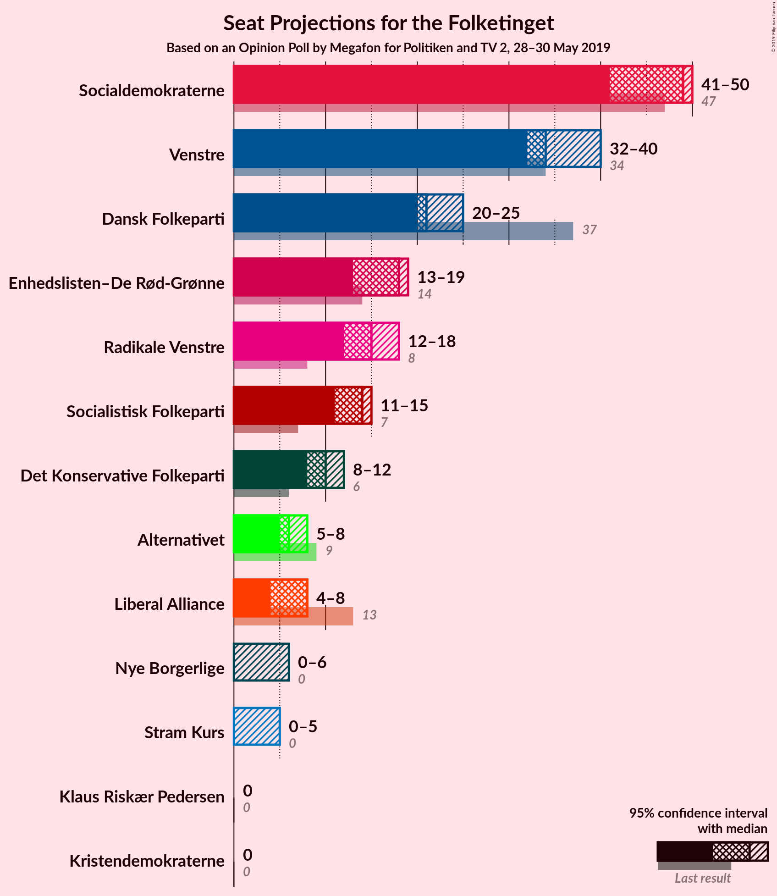
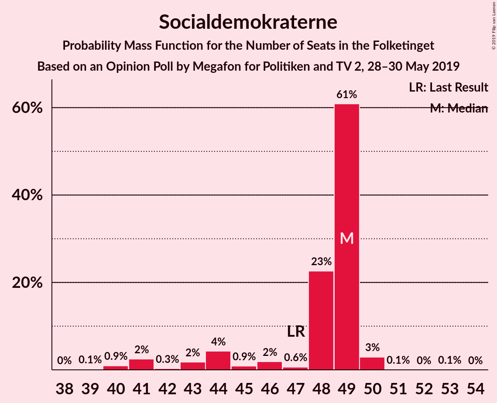
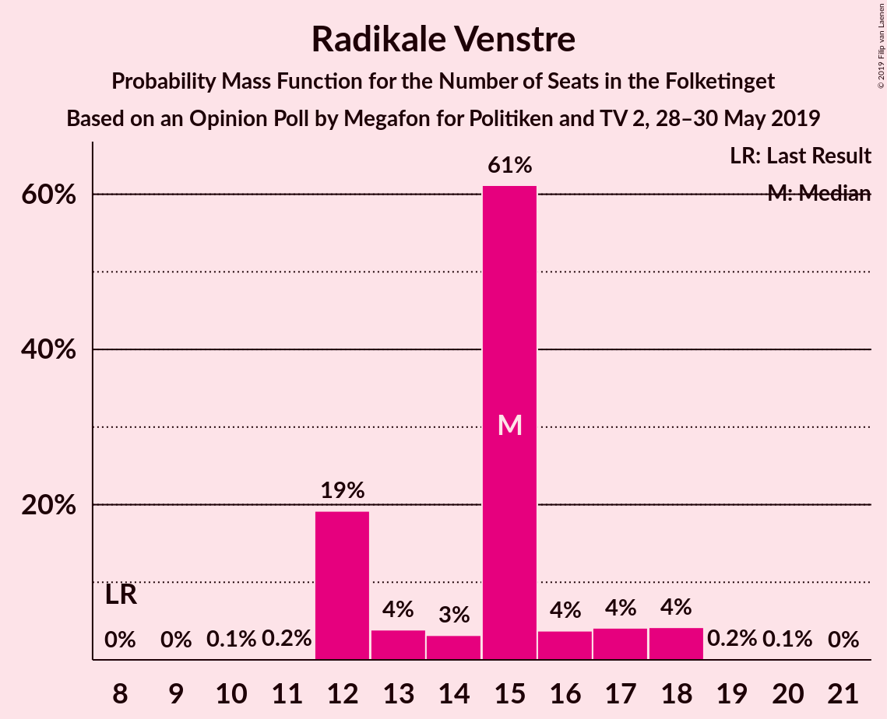
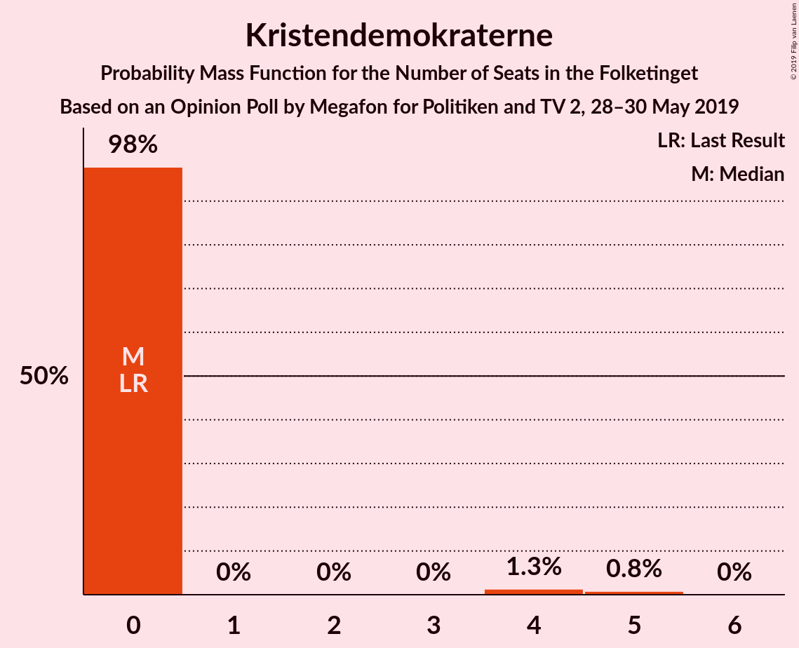
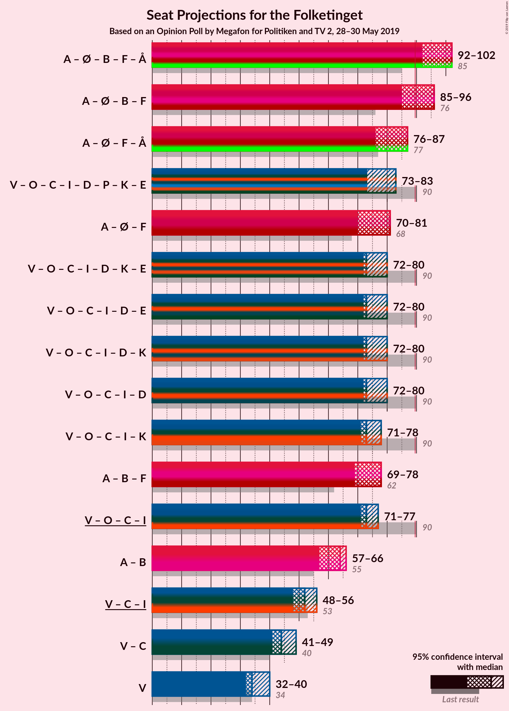
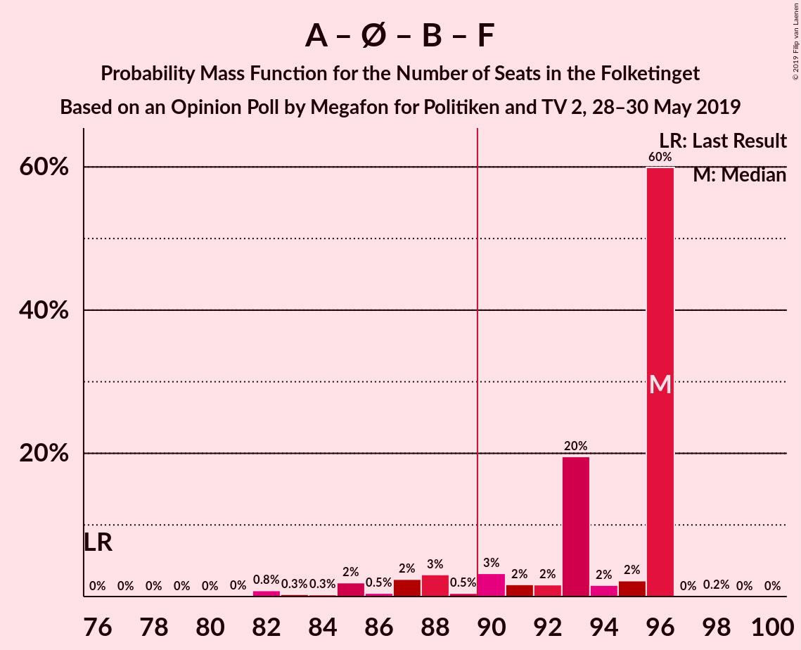
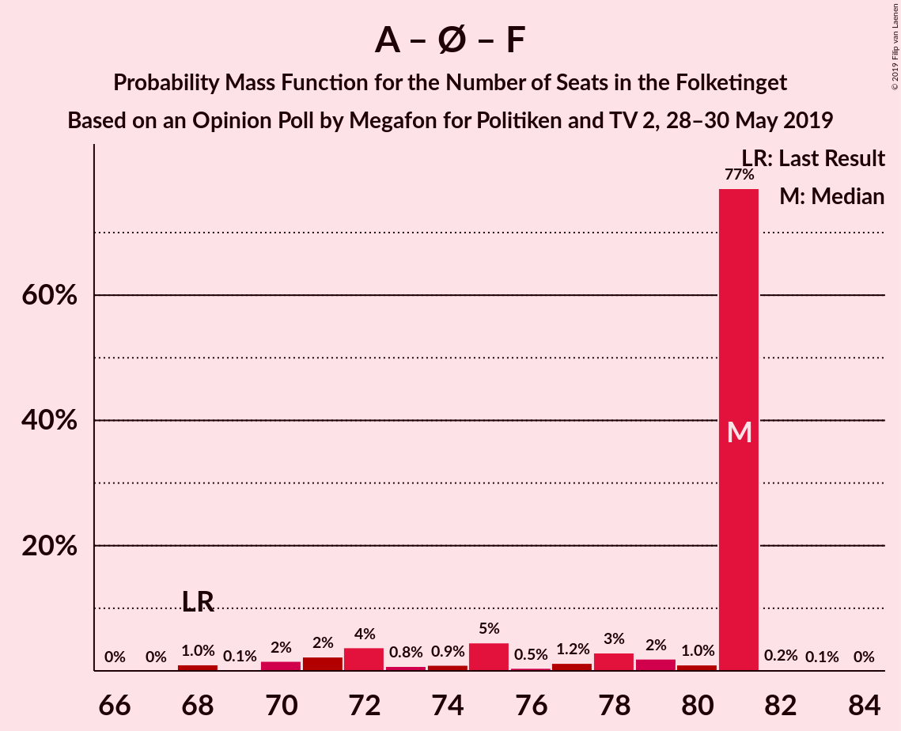
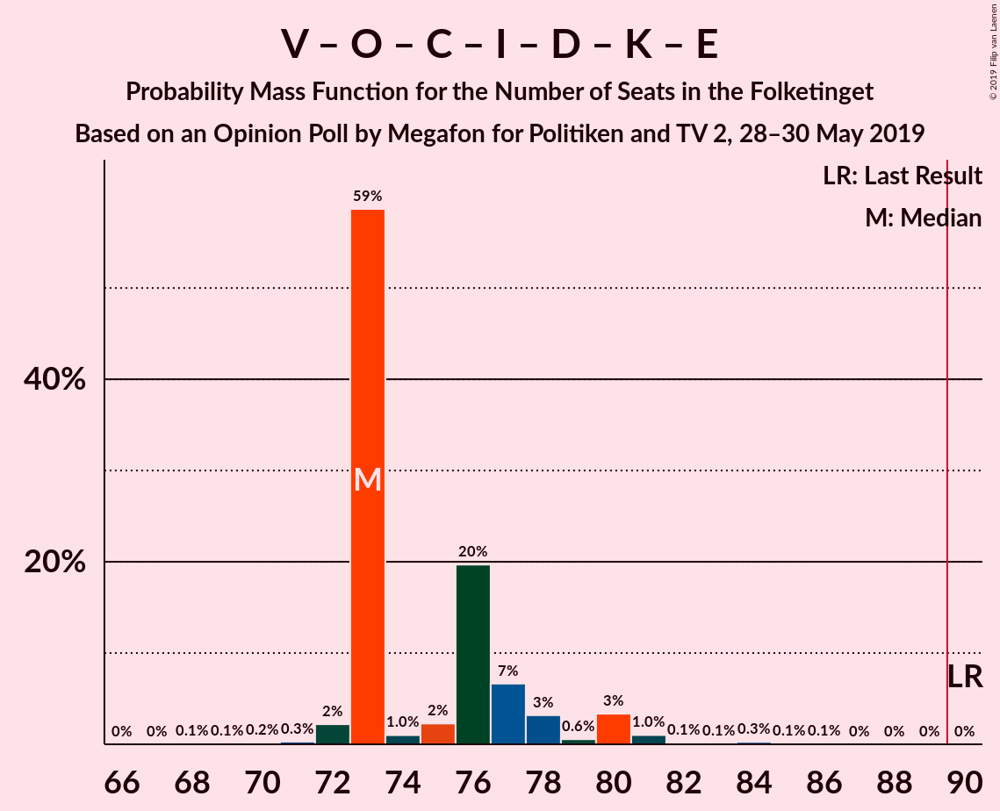
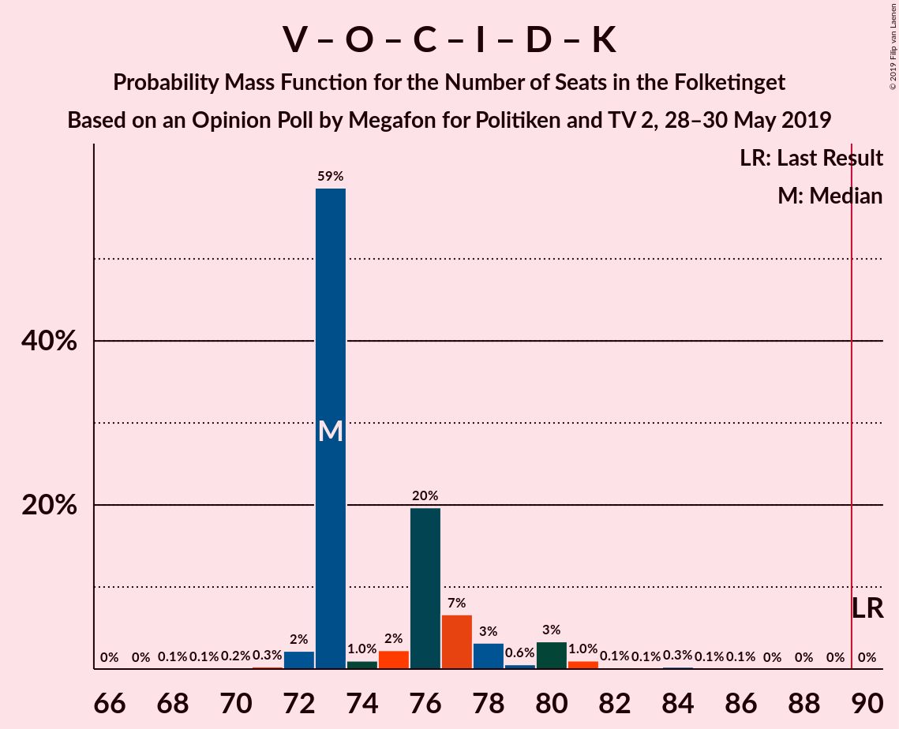
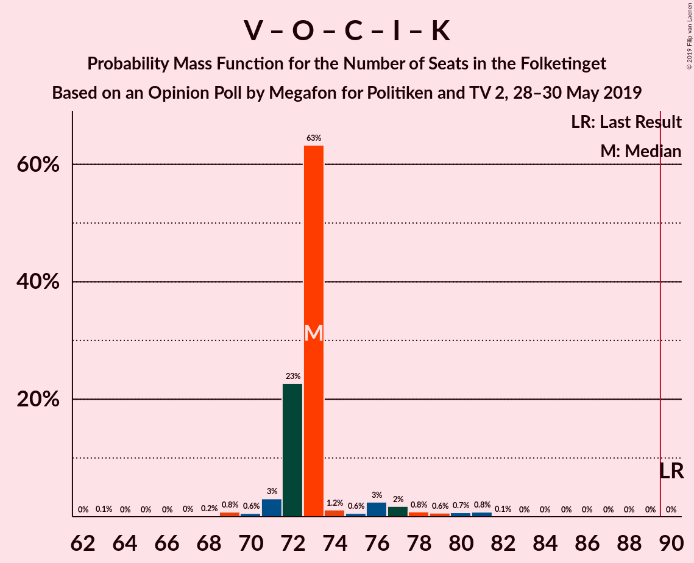

# Opinion Poll by Megafon for Politiken and TV 2, 28–30 May 2019

<a href="#voting-intentions">Voting Intentions</a> | <a href="#seats">Seats</a> | <a href="#coalitions">Coalitions</a> | <a href="#technical-information">Technical Information</a>

## Voting Intentions

### Confidence Intervals

| Party | Last Result | Poll Result | 80% Confidence Interval | 90% Confidence Interval | 95% Confidence Interval | 99% Confidence Interval |
|:-----:|:-----------:|:-----------:|:-----------------------:|:-----------------------:|:-----------------------:|:-----------------------:|
| Socialdemokraterne | 26.3% | 25.7% | 24.0–27.5% |23.5–28.0% |23.1–28.5% |22.3–29.3% |
| Venstre | 19.5% | 19.5% | 18.0–21.2% |17.6–21.7% |17.2–22.1% |16.5–22.9% |
| Dansk Folkeparti | 21.1% | 12.1% | 10.9–13.5% |10.6–14.0% |10.3–14.3% |9.7–15.0% |
| Enhedslisten–De Rød-Grønne | 7.8% | 8.8% | 7.7–10.0% |7.4–10.4% |7.2–10.7% |6.7–11.3% |
| Radikale Venstre | 4.6% | 8.3% | 7.3–9.5% |7.0–9.9% |6.7–10.2% |6.3–10.8% |
| Socialistisk Folkeparti | 4.2% | 7.3% | 6.4–8.5% |6.1–8.8% |5.9–9.1% |5.4–9.7% |
| Det Konservative Folkeparti | 3.4% | 5.3% | 4.5–6.4% |4.3–6.6% |4.1–6.9% |3.7–7.4% |
| Liberal Alliance | 7.5% | 3.5% | 2.8–4.3% |2.6–4.6% |2.5–4.8% |2.2–5.2% |
| Alternativet | 4.8% | 3.5% | 2.8–4.3% |2.6–4.6% |2.5–4.8% |2.2–5.2% |
| Nye Borgerlige | 0.0% | 2.2% | 1.7–2.9% |1.6–3.1% |1.4–3.3% |1.2–3.6% |
| Stram Kurs | 0.0% | 1.9% | 1.4–2.6% |1.3–2.7% |1.2–2.9% |1.0–3.3% |
| Kristendemokraterne | 0.8% | 1.5% | 1.1–2.1% |1.0–2.3% |0.9–2.4% |0.7–2.8% |
| Klaus Riskær Pedersen | 0.0% | 0.3% | 0.2–0.7% |0.1–0.8% |0.1–0.9% |0.1–1.1% |

*Note:* The poll result column reflects the actual value used in the calculations. Published results may vary slightly, and in addition be rounded to fewer digits.

## Seats

### Confidence Intervals

| Party | Last Result | Median | 80% Confidence Interval | 90% Confidence Interval | 95% Confidence Interval | 99% Confidence Interval |
|:-----:|:-----------:|:------:|:-----------------------:|:-----------------------:|:-----------------------:|:-----------------------:|
| <a href="#socialdemokraterne">Socialdemokraterne</a> | 47 | 49 | 45–49 |43–49 |41–50 |40–50 |
| <a href="#venstre">Venstre</a> | 34 | 34 | 34–36 |34–37 |32–40 |31–42 |
| <a href="#dansk-folkeparti">Dansk Folkeparti</a> | 37 | 21 | 21–22 |20–22 |20–25 |18–26 |
| <a href="#enhedslisten–de-rød-grønne">Enhedslisten–De Rød-Grønne</a> | 14 | 18 | 16–18 |14–18 |13–19 |13–20 |
| <a href="#radikale-venstre">Radikale Venstre</a> | 8 | 15 | 12–16 |12–17 |12–18 |12–18 |
| <a href="#socialistisk-folkeparti">Socialistisk Folkeparti</a> | 7 | 14 | 13–15 |12–15 |11–15 |10–16 |
| <a href="#det-konservative-folkeparti">Det Konservative Folkeparti</a> | 6 | 10 | 10 |8–11 |8–12 |7–12 |
| <a href="#liberal-alliance">Liberal Alliance</a> | 13 | 8 | 4–8 |4–8 |4–8 |4–9 |
| <a href="#alternativet">Alternativet</a> | 9 | 6 | 6–7 |5–8 |5–8 |4–10 |
| <a href="#nye-borgerlige">Nye Borgerlige</a> | 0 | 0 | 0–4 |0–5 |0–6 |0–6 |
| <a href="#stram-kurs">Stram Kurs</a> | 0 | 0 | 0 |0–4 |0–5 |0–7 |
| <a href="#kristendemokraterne">Kristendemokraterne</a> | 0 | 0 | 0 |0 |0 |0–5 |
| <a href="#klaus-riskær-pedersen">Klaus Riskær Pedersen</a> | 0 | 0 | 0 |0 |0 |0 |

### Socialdemokraterne

*For a full overview of the results for this party, see the [Socialdemokraterne](party-socialdemokraterne.html) page.*

| Number of Seats | Probability | Accumulated | Special Marks |
|:---------------:|:-----------:|:-----------:|:-------------:|
| 39 | 0.1% | 100% |  |
| 40 | 0.9% | 99.8% |  |
| 41 | 2% | 98.9% |  |
| 42 | 0.3% | 96% |  |
| 43 | 2% | 96% |  |
| 44 | 4% | 94% |  |
| 45 | 0.9% | 90% |  |
| 46 | 2% | 89% |  |
| 47 | 0.6% | 87% | Last Result |
| 48 | 23% | 87% |  |
| 49 | 61% | 64% | Median |
| 50 | 3% | 3% |  |
| 51 | 0.1% | 0.2% |  |
| 52 | 0% | 0.1% |  |
| 53 | 0.1% | 0.1% |  |
| 54 | 0% | 0% |  |

### Venstre

*For a full overview of the results for this party, see the [Venstre](party-venstre.html) page.*

| Number of Seats | Probability | Accumulated | Special Marks |
|:---------------:|:-----------:|:-----------:|:-------------:|
| 29 | 0.1% | 100% |  |
| 30 | 0.2% | 99.9% |  |
| 31 | 2% | 99.6% |  |
| 32 | 1.0% | 98% |  |
| 33 | 2% | 97% |  |
| 34 | 60% | 95% | Last Result, Median |
| 35 | 6% | 35% |  |
| 36 | 21% | 29% |  |
| 37 | 3% | 8% |  |
| 38 | 1.2% | 5% |  |
| 39 | 0.2% | 4% |  |
| 40 | 1.2% | 4% |  |
| 41 | 0.1% | 2% |  |
| 42 | 2% | 2% |  |
| 43 | 0% | 0.1% |  |
| 44 | 0.1% | 0.1% |  |
| 45 | 0% | 0% |  |

### Dansk Folkeparti

*For a full overview of the results for this party, see the [Dansk Folkeparti](party-danskfolkeparti.html) page.*

| Number of Seats | Probability | Accumulated | Special Marks |
|:---------------:|:-----------:|:-----------:|:-------------:|
| 16 | 0.1% | 100% |  |
| 17 | 0.1% | 99.9% |  |
| 18 | 1.2% | 99.9% |  |
| 19 | 0.3% | 98.6% |  |
| 20 | 6% | 98% |  |
| 21 | 64% | 92% | Median |
| 22 | 24% | 28% |  |
| 23 | 2% | 5% |  |
| 24 | 0.3% | 3% |  |
| 25 | 0.7% | 3% |  |
| 26 | 2% | 2% |  |
| 27 | 0.1% | 0.2% |  |
| 28 | 0.1% | 0.1% |  |
| 29 | 0% | 0% |  |
| 30 | 0% | 0% |  |
| 31 | 0% | 0% |  |
| 32 | 0% | 0% |  |
| 33 | 0% | 0% |  |
| 34 | 0% | 0% |  |
| 35 | 0% | 0% |  |
| 36 | 0% | 0% |  |
| 37 | 0% | 0% | Last Result |

### Enhedslisten–De Rød-Grønne

*For a full overview of the results for this party, see the [Enhedslisten–De Rød-Grønne](party-enhedslisten–derød-grønne.html) page.*

| Number of Seats | Probability | Accumulated | Special Marks |
|:---------------:|:-----------:|:-----------:|:-------------:|
| 11 | 0.1% | 100% |  |
| 12 | 0.4% | 99.9% |  |
| 13 | 4% | 99.5% |  |
| 14 | 2% | 95% | Last Result |
| 15 | 1.5% | 94% |  |
| 16 | 10% | 92% |  |
| 17 | 1.1% | 82% |  |
| 18 | 78% | 81% | Median |
| 19 | 3% | 3% |  |
| 20 | 0.4% | 0.6% |  |
| 21 | 0.2% | 0.2% |  |
| 22 | 0% | 0% |  |

### Radikale Venstre

*For a full overview of the results for this party, see the [Radikale Venstre](party-radikalevenstre.html) page.*

| Number of Seats | Probability | Accumulated | Special Marks |
|:---------------:|:-----------:|:-----------:|:-------------:|
| 8 | 0% | 100% | Last Result |
| 9 | 0% | 100% |  |
| 10 | 0.1% | 100% |  |
| 11 | 0.2% | 99.9% |  |
| 12 | 19% | 99.7% |  |
| 13 | 4% | 81% |  |
| 14 | 3% | 77% |  |
| 15 | 61% | 73% | Median |
| 16 | 4% | 12% |  |
| 17 | 4% | 9% |  |
| 18 | 4% | 4% |  |
| 19 | 0.2% | 0.2% |  |
| 20 | 0.1% | 0.1% |  |
| 21 | 0% | 0% |  |

### Socialistisk Folkeparti

*For a full overview of the results for this party, see the [Socialistisk Folkeparti](party-socialistiskfolkeparti.html) page.*

| Number of Seats | Probability | Accumulated | Special Marks |
|:---------------:|:-----------:|:-----------:|:-------------:|
| 7 | 0% | 100% | Last Result |
| 8 | 0% | 100% |  |
| 9 | 0% | 100% |  |
| 10 | 2% | 99.9% |  |
| 11 | 2% | 98% |  |
| 12 | 5% | 96% |  |
| 13 | 2% | 90% |  |
| 14 | 65% | 88% | Median |
| 15 | 21% | 23% |  |
| 16 | 0.9% | 1.3% |  |
| 17 | 0.3% | 0.5% |  |
| 18 | 0.2% | 0.2% |  |
| 19 | 0% | 0% |  |

### Det Konservative Folkeparti

*For a full overview of the results for this party, see the [Det Konservative Folkeparti](party-detkonservativefolkeparti.html) page.*

| Number of Seats | Probability | Accumulated | Special Marks |
|:---------------:|:-----------:|:-----------:|:-------------:|
| 6 | 0% | 100% | Last Result |
| 7 | 0.6% | 99.9% |  |
| 8 | 5% | 99.3% |  |
| 9 | 3% | 94% |  |
| 10 | 85% | 91% | Median |
| 11 | 2% | 6% |  |
| 12 | 4% | 4% |  |
| 13 | 0.4% | 0.4% |  |
| 14 | 0% | 0.1% |  |
| 15 | 0% | 0% |  |

### Liberal Alliance

*For a full overview of the results for this party, see the [Liberal Alliance](party-liberalalliance.html) page.*

| Number of Seats | Probability | Accumulated | Special Marks |
|:---------------:|:-----------:|:-----------:|:-------------:|
| 0 | 0.1% | 100% |  |
| 1 | 0% | 99.9% |  |
| 2 | 0% | 99.9% |  |
| 3 | 0% | 99.9% |  |
| 4 | 22% | 99.9% |  |
| 5 | 3% | 78% |  |
| 6 | 6% | 75% |  |
| 7 | 5% | 69% |  |
| 8 | 64% | 64% | Median |
| 9 | 0.6% | 0.8% |  |
| 10 | 0.2% | 0.2% |  |
| 11 | 0% | 0% |  |
| 12 | 0% | 0% |  |
| 13 | 0% | 0% | Last Result |

### Alternativet

*For a full overview of the results for this party, see the [Alternativet](party-alternativet.html) page.*

| Number of Seats | Probability | Accumulated | Special Marks |
|:---------------:|:-----------:|:-----------:|:-------------:|
| 4 | 2% | 100% |  |
| 5 | 3% | 98% |  |
| 6 | 80% | 94% | Median |
| 7 | 7% | 14% |  |
| 8 | 6% | 7% |  |
| 9 | 0.3% | 0.9% | Last Result |
| 10 | 0.5% | 0.6% |  |
| 11 | 0% | 0% |  |

### Nye Borgerlige

*For a full overview of the results for this party, see the [Nye Borgerlige](party-nyeborgerlige.html) page.*

| Number of Seats | Probability | Accumulated | Special Marks |
|:---------------:|:-----------:|:-----------:|:-------------:|
| 0 | 66% | 100% | Last Result, Median |
| 1 | 0% | 34% |  |
| 2 | 0% | 34% |  |
| 3 | 0% | 34% |  |
| 4 | 27% | 34% |  |
| 5 | 4% | 7% |  |
| 6 | 2% | 3% |  |
| 7 | 0.1% | 0.1% |  |
| 8 | 0% | 0% |  |

### Stram Kurs

*For a full overview of the results for this party, see the [Stram Kurs](party-stramkurs.html) page.*

| Number of Seats | Probability | Accumulated | Special Marks |
|:---------------:|:-----------:|:-----------:|:-------------:|
| 0 | 93% | 100% | Last Result, Median |
| 1 | 0% | 7% |  |
| 2 | 0% | 7% |  |
| 3 | 0% | 7% |  |
| 4 | 4% | 7% |  |
| 5 | 2% | 3% |  |
| 6 | 0.4% | 1.0% |  |
| 7 | 0.6% | 0.6% |  |
| 8 | 0% | 0% |  |

### Kristendemokraterne

*For a full overview of the results for this party, see the [Kristendemokraterne](party-kristendemokraterne.html) page.*

| Number of Seats | Probability | Accumulated | Special Marks |
|:---------------:|:-----------:|:-----------:|:-------------:|
| 0 | 98% | 100% | Last Result, Median |
| 1 | 0% | 2% |  |
| 2 | 0% | 2% |  |
| 3 | 0% | 2% |  |
| 4 | 1.3% | 2% |  |
| 5 | 0.8% | 0.8% |  |
| 6 | 0% | 0% |  |

### Klaus Riskær Pedersen

*For a full overview of the results for this party, see the [Klaus Riskær Pedersen](party-klausriskærpedersen.html) page.*

| Number of Seats | Probability | Accumulated | Special Marks |
|:---------------:|:-----------:|:-----------:|:-------------:|
| 0 | 100% | 100% | Last Result, Median |

## Coalitions

### Confidence Intervals

| Coalition | Last Result | Median | Majority? | 80% Confidence Interval | 90% Confidence Interval | 95% Confidence Interval | 99% Confidence Interval |
|:---------:|:-----------:|:------:|:---------:|:-----------------------:|:-----------------------:|:-----------------------:|:-----------------------:|
| Socialdemokraterne – Enhedslisten–De Rød-Grønne – Radikale Venstre – Socialistisk Folkeparti – Alternativet | 85 | 102 | 99.8% | 97–102 | 92–102 | 92–102 | 90–103 |
| Socialdemokraterne – Enhedslisten–De Rød-Grønne – Radikale Venstre – Socialistisk Folkeparti | 76 | 96 | 90% | 90–96 | 87–96 | 85–96 | 82–96 |
| Socialdemokraterne – Enhedslisten–De Rød-Grønne – Socialistisk Folkeparti – Alternativet | 77 | 87 | 0.1% | 81–87 | 78–87 | 76–87 | 75–87 |
| Venstre – Dansk Folkeparti – Det Konservative Folkeparti – Liberal Alliance – Nye Borgerlige – Stram Kurs – Kristendemokraterne – Klaus Riskær Pedersen | 90 | 73 | 0% | 73–78 | 73–83 | 73–83 | 72–85 |
| Socialdemokraterne – Enhedslisten–De Rød-Grønne – Socialistisk Folkeparti | 68 | 81 | 0% | 74–81 | 71–81 | 70–81 | 68–81 |
| Venstre – Dansk Folkeparti – Det Konservative Folkeparti – Liberal Alliance – Nye Borgerlige – Kristendemokraterne – Klaus Riskær Pedersen | 90 | 73 | 0% | 73–77 | 73–80 | 72–80 | 71–83 |
| Venstre – Dansk Folkeparti – Det Konservative Folkeparti – Liberal Alliance – Nye Borgerlige – Klaus Riskær Pedersen | 90 | 73 | 0% | 73–77 | 73–78 | 72–80 | 71–81 |
| Venstre – Dansk Folkeparti – Det Konservative Folkeparti – Liberal Alliance – Nye Borgerlige – Kristendemokraterne | 90 | 73 | 0% | 73–77 | 73–80 | 72–80 | 71–83 |
| Venstre – Dansk Folkeparti – Det Konservative Folkeparti – Liberal Alliance – Nye Borgerlige | 90 | 73 | 0% | 73–77 | 73–78 | 72–80 | 71–81 |
| Venstre – Dansk Folkeparti – Det Konservative Folkeparti – Liberal Alliance – Kristendemokraterne | 90 | 73 | 0% | 72–73 | 72–76 | 71–78 | 69–81 |
| Socialdemokraterne – Radikale Venstre – Socialistisk Folkeparti | 62 | 78 | 0% | 74–78 | 71–78 | 69–78 | 67–80 |
| Venstre – Dansk Folkeparti – Det Konservative Folkeparti – Liberal Alliance | 90 | 73 | 0% | 72–73 | 71–76 | 71–77 | 68–81 |
| Socialdemokraterne – Radikale Venstre | 55 | 64 | 0% | 60–64 | 58–64 | 57–66 | 54–67 |
| Venstre – Det Konservative Folkeparti – Liberal Alliance | 53 | 52 | 0% | 50–53 | 49–54 | 48–56 | 47–57 |
| Venstre – Det Konservative Folkeparti | 40 | 44 | 0% | 44–46 | 44–47 | 41–49 | 40–52 |
| Venstre | 34 | 34 | 0% | 34–36 | 34–37 | 32–40 | 31–42 |

### Socialdemokraterne – Enhedslisten–De Rød-Grønne – Radikale Venstre – Socialistisk Folkeparti – Alternativet

| Number of Seats | Probability | Accumulated | Special Marks |
|:---------------:|:-----------:|:-----------:|:-------------:|
| 85 | 0% | 100% | Last Result |
| 86 | 0% | 100% |  |
| 87 | 0% | 100% |  |
| 88 | 0.1% | 99.9% |  |
| 89 | 0.1% | 99.9% |  |
| 90 | 0.8% | 99.8% | Majority |
| 91 | 1.3% | 98.9% |  |
| 92 | 3% | 98% |  |
| 93 | 0.8% | 95% |  |
| 94 | 0.6% | 94% |  |
| 95 | 3% | 93% |  |
| 96 | 0.4% | 91% |  |
| 97 | 0.9% | 90% |  |
| 98 | 6% | 89% |  |
| 99 | 19% | 83% |  |
| 100 | 2% | 64% |  |
| 101 | 0.6% | 62% |  |
| 102 | 59% | 61% | Median |
| 103 | 2% | 2% |  |
| 104 | 0.1% | 0.2% |  |
| 105 | 0% | 0.1% |  |
| 106 | 0% | 0.1% |  |
| 107 | 0% | 0% |  |

### Socialdemokraterne – Enhedslisten–De Rød-Grønne – Radikale Venstre – Socialistisk Folkeparti

| Number of Seats | Probability | Accumulated | Special Marks |
|:---------------:|:-----------:|:-----------:|:-------------:|
| 76 | 0% | 100% | Last Result |
| 77 | 0% | 100% |  |
| 78 | 0% | 100% |  |
| 79 | 0% | 100% |  |
| 80 | 0% | 100% |  |
| 81 | 0% | 100% |  |
| 82 | 0.8% | 99.9% |  |
| 83 | 0.3% | 99.1% |  |
| 84 | 0.3% | 98.8% |  |
| 85 | 2% | 98% |  |
| 86 | 0.5% | 97% |  |
| 87 | 2% | 96% |  |
| 88 | 3% | 94% |  |
| 89 | 0.5% | 91% |  |
| 90 | 3% | 90% | Majority |
| 91 | 2% | 87% |  |
| 92 | 2% | 85% |  |
| 93 | 20% | 84% |  |
| 94 | 2% | 64% |  |
| 95 | 2% | 62% |  |
| 96 | 60% | 60% | Median |
| 97 | 0% | 0.2% |  |
| 98 | 0.2% | 0.2% |  |
| 99 | 0% | 0.1% |  |
| 100 | 0% | 0% |  |

### Socialdemokraterne – Enhedslisten–De Rød-Grønne – Socialistisk Folkeparti – Alternativet

| Number of Seats | Probability | Accumulated | Special Marks |
|:---------------:|:-----------:|:-----------:|:-------------:|
| 72 | 0% | 100% |  |
| 73 | 0% | 99.9% |  |
| 74 | 0.1% | 99.9% |  |
| 75 | 0.7% | 99.8% |  |
| 76 | 3% | 99.1% |  |
| 77 | 0.9% | 96% | Last Result |
| 78 | 1.1% | 95% |  |
| 79 | 0.7% | 94% |  |
| 80 | 3% | 94% |  |
| 81 | 1.2% | 90% |  |
| 82 | 4% | 89% |  |
| 83 | 3% | 85% |  |
| 84 | 1.5% | 82% |  |
| 85 | 1.0% | 81% |  |
| 86 | 2% | 80% |  |
| 87 | 77% | 78% | Median |
| 88 | 0.3% | 0.4% |  |
| 89 | 0% | 0.1% |  |
| 90 | 0% | 0.1% | Majority |
| 91 | 0.1% | 0.1% |  |
| 92 | 0% | 0% |  |

### Venstre – Dansk Folkeparti – Det Konservative Folkeparti – Liberal Alliance – Nye Borgerlige – Stram Kurs – Kristendemokraterne – Klaus Riskær Pedersen

| Number of Seats | Probability | Accumulated | Special Marks |
|:---------------:|:-----------:|:-----------:|:-------------:|
| 69 | 0% | 100% |  |
| 70 | 0% | 99.9% |  |
| 71 | 0.1% | 99.9% |  |
| 72 | 2% | 99.8% |  |
| 73 | 59% | 98% | Median |
| 74 | 0.6% | 39% |  |
| 75 | 2% | 38% |  |
| 76 | 19% | 36% |  |
| 77 | 6% | 17% |  |
| 78 | 0.9% | 11% |  |
| 79 | 0.4% | 10% |  |
| 80 | 3% | 9% |  |
| 81 | 0.6% | 7% |  |
| 82 | 0.8% | 6% |  |
| 83 | 3% | 5% |  |
| 84 | 1.3% | 2% |  |
| 85 | 0.8% | 1.1% |  |
| 86 | 0.1% | 0.2% |  |
| 87 | 0.1% | 0.1% |  |
| 88 | 0% | 0.1% |  |
| 89 | 0% | 0% |  |
| 90 | 0% | 0% | Last Result, Majority |

### Socialdemokraterne – Enhedslisten–De Rød-Grønne – Socialistisk Folkeparti

| Number of Seats | Probability | Accumulated | Special Marks |
|:---------------:|:-----------:|:-----------:|:-------------:|
| 66 | 0% | 100% |  |
| 67 | 0% | 99.9% |  |
| 68 | 1.0% | 99.9% | Last Result |
| 69 | 0.1% | 98.9% |  |
| 70 | 2% | 98.7% |  |
| 71 | 2% | 97% |  |
| 72 | 4% | 95% |  |
| 73 | 0.8% | 91% |  |
| 74 | 0.9% | 90% |  |
| 75 | 5% | 89% |  |
| 76 | 0.5% | 85% |  |
| 77 | 1.2% | 84% |  |
| 78 | 3% | 83% |  |
| 79 | 2% | 80% |  |
| 80 | 1.0% | 78% |  |
| 81 | 77% | 77% | Median |
| 82 | 0.2% | 0.3% |  |
| 83 | 0.1% | 0.1% |  |
| 84 | 0% | 0% |  |

### Venstre – Dansk Folkeparti – Det Konservative Folkeparti – Liberal Alliance – Nye Borgerlige – Kristendemokraterne – Klaus Riskær Pedersen

| Number of Seats | Probability | Accumulated | Special Marks |
|:---------------:|:-----------:|:-----------:|:-------------:|
| 68 | 0.1% | 100% |  |
| 69 | 0.1% | 99.9% |  |
| 70 | 0.2% | 99.8% |  |
| 71 | 0.3% | 99.6% |  |
| 72 | 2% | 99.3% |  |
| 73 | 59% | 97% | Median |
| 74 | 1.0% | 38% |  |
| 75 | 2% | 37% |  |
| 76 | 20% | 35% |  |
| 77 | 7% | 15% |  |
| 78 | 3% | 9% |  |
| 79 | 0.6% | 6% |  |
| 80 | 3% | 5% |  |
| 81 | 1.0% | 2% |  |
| 82 | 0.1% | 0.7% |  |
| 83 | 0.1% | 0.6% |  |
| 84 | 0.3% | 0.5% |  |
| 85 | 0.1% | 0.2% |  |
| 86 | 0.1% | 0.1% |  |
| 87 | 0% | 0% |  |
| 88 | 0% | 0% |  |
| 89 | 0% | 0% |  |
| 90 | 0% | 0% | Last Result, Majority |

### Venstre – Dansk Folkeparti – Det Konservative Folkeparti – Liberal Alliance – Nye Borgerlige – Klaus Riskær Pedersen

| Number of Seats | Probability | Accumulated | Special Marks |
|:---------------:|:-----------:|:-----------:|:-------------:|
| 67 | 0.1% | 100% |  |
| 68 | 0.1% | 99.9% |  |
| 69 | 0.1% | 99.8% |  |
| 70 | 0.2% | 99.7% |  |
| 71 | 0.3% | 99.5% |  |
| 72 | 2% | 99.2% |  |
| 73 | 59% | 97% | Median |
| 74 | 1.4% | 38% |  |
| 75 | 3% | 37% |  |
| 76 | 20% | 34% |  |
| 77 | 6% | 14% |  |
| 78 | 3% | 7% |  |
| 79 | 0.2% | 5% |  |
| 80 | 3% | 4% |  |
| 81 | 1.0% | 1.5% |  |
| 82 | 0.1% | 0.5% |  |
| 83 | 0.1% | 0.4% |  |
| 84 | 0.2% | 0.3% |  |
| 85 | 0.1% | 0.1% |  |
| 86 | 0% | 0% |  |
| 87 | 0% | 0% |  |
| 88 | 0% | 0% |  |
| 89 | 0% | 0% |  |
| 90 | 0% | 0% | Last Result, Majority |

### Venstre – Dansk Folkeparti – Det Konservative Folkeparti – Liberal Alliance – Nye Borgerlige – Kristendemokraterne

| Number of Seats | Probability | Accumulated | Special Marks |
|:---------------:|:-----------:|:-----------:|:-------------:|
| 68 | 0.1% | 100% |  |
| 69 | 0.1% | 99.9% |  |
| 70 | 0.2% | 99.8% |  |
| 71 | 0.3% | 99.6% |  |
| 72 | 2% | 99.3% |  |
| 73 | 59% | 97% | Median |
| 74 | 1.0% | 38% |  |
| 75 | 2% | 37% |  |
| 76 | 20% | 35% |  |
| 77 | 7% | 15% |  |
| 78 | 3% | 9% |  |
| 79 | 0.6% | 6% |  |
| 80 | 3% | 5% |  |
| 81 | 1.0% | 2% |  |
| 82 | 0.1% | 0.7% |  |
| 83 | 0.1% | 0.6% |  |
| 84 | 0.3% | 0.5% |  |
| 85 | 0.1% | 0.2% |  |
| 86 | 0.1% | 0.1% |  |
| 87 | 0% | 0% |  |
| 88 | 0% | 0% |  |
| 89 | 0% | 0% |  |
| 90 | 0% | 0% | Last Result, Majority |

### Venstre – Dansk Folkeparti – Det Konservative Folkeparti – Liberal Alliance – Nye Borgerlige

| Number of Seats | Probability | Accumulated | Special Marks |
|:---------------:|:-----------:|:-----------:|:-------------:|
| 67 | 0.1% | 100% |  |
| 68 | 0.1% | 99.9% |  |
| 69 | 0.1% | 99.8% |  |
| 70 | 0.2% | 99.7% |  |
| 71 | 0.3% | 99.5% |  |
| 72 | 2% | 99.2% |  |
| 73 | 59% | 97% | Median |
| 74 | 1.4% | 38% |  |
| 75 | 3% | 37% |  |
| 76 | 20% | 34% |  |
| 77 | 6% | 14% |  |
| 78 | 3% | 7% |  |
| 79 | 0.2% | 5% |  |
| 80 | 3% | 4% |  |
| 81 | 1.0% | 1.5% |  |
| 82 | 0.1% | 0.5% |  |
| 83 | 0.1% | 0.4% |  |
| 84 | 0.2% | 0.3% |  |
| 85 | 0.1% | 0.1% |  |
| 86 | 0% | 0% |  |
| 87 | 0% | 0% |  |
| 88 | 0% | 0% |  |
| 89 | 0% | 0% |  |
| 90 | 0% | 0% | Last Result, Majority |

### Venstre – Dansk Folkeparti – Det Konservative Folkeparti – Liberal Alliance – Kristendemokraterne

| Number of Seats | Probability | Accumulated | Special Marks |
|:---------------:|:-----------:|:-----------:|:-------------:|
| 63 | 0.1% | 100% |  |
| 64 | 0% | 99.9% |  |
| 65 | 0% | 99.9% |  |
| 66 | 0% | 99.9% |  |
| 67 | 0% | 99.8% |  |
| 68 | 0.2% | 99.8% |  |
| 69 | 0.8% | 99.6% |  |
| 70 | 0.6% | 98.8% |  |
| 71 | 3% | 98% |  |
| 72 | 23% | 95% |  |
| 73 | 63% | 72% | Median |
| 74 | 1.2% | 9% |  |
| 75 | 0.6% | 8% |  |
| 76 | 3% | 7% |  |
| 77 | 2% | 5% |  |
| 78 | 0.8% | 3% |  |
| 79 | 0.6% | 2% |  |
| 80 | 0.7% | 2% |  |
| 81 | 0.8% | 0.9% |  |
| 82 | 0.1% | 0.1% |  |
| 83 | 0% | 0% |  |
| 84 | 0% | 0% |  |
| 85 | 0% | 0% |  |
| 86 | 0% | 0% |  |
| 87 | 0% | 0% |  |
| 88 | 0% | 0% |  |
| 89 | 0% | 0% |  |
| 90 | 0% | 0% | Last Result, Majority |

### Socialdemokraterne – Radikale Venstre – Socialistisk Folkeparti

| Number of Seats | Probability | Accumulated | Special Marks |
|:---------------:|:-----------:|:-----------:|:-------------:|
| 62 | 0% | 100% | Last Result |
| 63 | 0% | 100% |  |
| 64 | 0% | 100% |  |
| 65 | 0.1% | 100% |  |
| 66 | 0.3% | 99.9% |  |
| 67 | 0.2% | 99.6% |  |
| 68 | 0.4% | 99.4% |  |
| 69 | 2% | 99.0% |  |
| 70 | 0.9% | 97% |  |
| 71 | 3% | 97% |  |
| 72 | 0.4% | 94% |  |
| 73 | 1.1% | 93% |  |
| 74 | 3% | 92% |  |
| 75 | 21% | 89% |  |
| 76 | 4% | 68% |  |
| 77 | 0.9% | 64% |  |
| 78 | 61% | 63% | Median |
| 79 | 0.1% | 2% |  |
| 80 | 1.4% | 2% |  |
| 81 | 0.1% | 0.2% |  |
| 82 | 0% | 0.1% |  |
| 83 | 0% | 0% |  |

### Venstre – Dansk Folkeparti – Det Konservative Folkeparti – Liberal Alliance

| Number of Seats | Probability | Accumulated | Special Marks |
|:---------------:|:-----------:|:-----------:|:-------------:|
| 63 | 0.1% | 100% |  |
| 64 | 0% | 99.9% |  |
| 65 | 0.1% | 99.9% |  |
| 66 | 0% | 99.8% |  |
| 67 | 0.1% | 99.8% |  |
| 68 | 0.4% | 99.7% |  |
| 69 | 0.9% | 99.2% |  |
| 70 | 0.7% | 98% |  |
| 71 | 3% | 98% |  |
| 72 | 22% | 95% |  |
| 73 | 63% | 72% | Median |
| 74 | 1.2% | 9% |  |
| 75 | 1.4% | 7% |  |
| 76 | 3% | 6% |  |
| 77 | 2% | 4% |  |
| 78 | 0.7% | 2% |  |
| 79 | 0.3% | 1.3% |  |
| 80 | 0.2% | 1.0% |  |
| 81 | 0.8% | 0.8% |  |
| 82 | 0.1% | 0.1% |  |
| 83 | 0% | 0% |  |
| 84 | 0% | 0% |  |
| 85 | 0% | 0% |  |
| 86 | 0% | 0% |  |
| 87 | 0% | 0% |  |
| 88 | 0% | 0% |  |
| 89 | 0% | 0% |  |
| 90 | 0% | 0% | Last Result, Majority |

### Socialdemokraterne – Radikale Venstre

| Number of Seats | Probability | Accumulated | Special Marks |
|:---------------:|:-----------:|:-----------:|:-------------:|
| 52 | 0.1% | 100% |  |
| 53 | 0.3% | 99.9% |  |
| 54 | 0.2% | 99.6% |  |
| 55 | 0.6% | 99.4% | Last Result |
| 56 | 0.3% | 98.8% |  |
| 57 | 2% | 98% |  |
| 58 | 3% | 96% |  |
| 59 | 1.0% | 94% |  |
| 60 | 19% | 93% |  |
| 61 | 5% | 74% |  |
| 62 | 4% | 69% |  |
| 63 | 0.5% | 66% |  |
| 64 | 61% | 65% | Median |
| 65 | 0.2% | 4% |  |
| 66 | 3% | 4% |  |
| 67 | 1.3% | 1.4% |  |
| 68 | 0% | 0.1% |  |
| 69 | 0% | 0.1% |  |
| 70 | 0% | 0% |  |

### Venstre – Det Konservative Folkeparti – Liberal Alliance

| Number of Seats | Probability | Accumulated | Special Marks |
|:---------------:|:-----------:|:-----------:|:-------------:|
| 43 | 0.1% | 100% |  |
| 44 | 0% | 99.9% |  |
| 45 | 0.2% | 99.9% |  |
| 46 | 0.1% | 99.7% |  |
| 47 | 1.2% | 99.6% |  |
| 48 | 1.5% | 98% |  |
| 49 | 3% | 97% |  |
| 50 | 19% | 94% |  |
| 51 | 5% | 76% |  |
| 52 | 60% | 70% | Median |
| 53 | 4% | 10% | Last Result |
| 54 | 2% | 7% |  |
| 55 | 1.3% | 5% |  |
| 56 | 2% | 4% |  |
| 57 | 1.2% | 1.4% |  |
| 58 | 0.1% | 0.2% |  |
| 59 | 0% | 0.1% |  |
| 60 | 0% | 0% |  |

### Venstre – Det Konservative Folkeparti

| Number of Seats | Probability | Accumulated | Special Marks |
|:---------------:|:-----------:|:-----------:|:-------------:|
| 38 | 0% | 100% |  |
| 39 | 0.1% | 99.9% |  |
| 40 | 0.3% | 99.8% | Last Result |
| 41 | 2% | 99.5% |  |
| 42 | 1.3% | 97% |  |
| 43 | 0.5% | 96% |  |
| 44 | 63% | 96% | Median |
| 45 | 4% | 33% |  |
| 46 | 20% | 29% |  |
| 47 | 5% | 9% |  |
| 48 | 0.5% | 4% |  |
| 49 | 1.4% | 4% |  |
| 50 | 0.1% | 2% |  |
| 51 | 0.1% | 2% |  |
| 52 | 2% | 2% |  |
| 53 | 0.1% | 0.1% |  |
| 54 | 0% | 0% |  |

### Venstre

| Number of Seats | Probability | Accumulated | Special Marks |
|:---------------:|:-----------:|:-----------:|:-------------:|
| 29 | 0.1% | 100% |  |
| 30 | 0.2% | 99.9% |  |
| 31 | 2% | 99.6% |  |
| 32 | 1.0% | 98% |  |
| 33 | 2% | 97% |  |
| 34 | 60% | 95% | Last Result, Median |
| 35 | 6% | 35% |  |
| 36 | 21% | 29% |  |
| 37 | 3% | 8% |  |
| 38 | 1.2% | 5% |  |
| 39 | 0.2% | 4% |  |
| 40 | 1.2% | 4% |  |
| 41 | 0.1% | 2% |  |
| 42 | 2% | 2% |  |
| 43 | 0% | 0.1% |  |
| 44 | 0.1% | 0.1% |  |
| 45 | 0% | 0% |  |

## Technical Information

### Opinion Poll

+ **Polling firm:** Megafon
+ **Commissioner(s):** Politiken and TV 2
+ **Fieldwork period:** 28–30 May 2019

### Calculations

+ **Sample size:** 1013
+ **Simulations done:** 1,048,576
+ **Error estimate:** 1.60%

