# Opinion Poll by Megafon for Politiken and TV 2, 28–30 May 2019

<a href="#voting-intentions">Voting Intentions</a> | <a href="#seats">Seats</a> | <a href="#coalitions">Coalitions</a> | <a href="#technical-information">Technical Information</a>

## Voting Intentions

### Confidence Intervals

| Party | Last Result | Poll Result | 80% Confidence Interval | 90% Confidence Interval | 95% Confidence Interval | 99% Confidence Interval |
|:-----:|:-----------:|:-----------:|:-----------------------:|:-----------------------:|:-----------------------:|:-----------------------:|
| Socialdemokraterne | 26.3% | 25.7% | 24.0–27.5% |23.5–28.0% |23.1–28.5% |22.3–29.3% |
| Venstre | 19.5% | 19.5% | 18.0–21.2% |17.6–21.7% |17.2–22.1% |16.5–22.9% |
| Dansk Folkeparti | 21.1% | 12.1% | 10.9–13.5% |10.6–14.0% |10.3–14.3% |9.7–15.0% |
| Enhedslisten–De Rød-Grønne | 7.8% | 8.8% | 7.7–10.0% |7.4–10.4% |7.2–10.7% |6.7–11.3% |
| Radikale Venstre | 4.6% | 8.3% | 7.3–9.5% |7.0–9.9% |6.7–10.2% |6.3–10.8% |
| Socialistisk Folkeparti | 4.2% | 7.3% | 6.4–8.5% |6.1–8.8% |5.9–9.1% |5.4–9.7% |
| Det Konservative Folkeparti | 3.4% | 5.3% | 4.5–6.4% |4.3–6.6% |4.1–6.9% |3.7–7.4% |
| Liberal Alliance | 7.5% | 3.5% | 2.8–4.3% |2.6–4.6% |2.5–4.8% |2.2–5.2% |
| Alternativet | 4.8% | 3.5% | 2.8–4.3% |2.6–4.6% |2.5–4.8% |2.2–5.2% |
| Nye Borgerlige | 0.0% | 2.2% | 1.7–2.9% |1.6–3.1% |1.4–3.3% |1.2–3.6% |
| Stram Kurs | 0.0% | 1.9% | 1.4–2.6% |1.3–2.7% |1.2–2.9% |1.0–3.3% |
| Kristendemokraterne | 0.8% | 1.5% | 1.1–2.1% |1.0–2.3% |0.9–2.4% |0.7–2.8% |
| Klaus Riskær Pedersen | 0.0% | 0.3% | 0.2–0.7% |0.1–0.8% |0.1–0.9% |0.1–1.1% |

*Note:* The poll result column reflects the actual value used in the calculations. Published results may vary slightly, and in addition be rounded to fewer digits.

## Seats

### Confidence Intervals

| Party | Last Result | Median | 80% Confidence Interval | 90% Confidence Interval | 95% Confidence Interval | 99% Confidence Interval |
|:-----:|:-----------:|:------:|:-----------------------:|:-----------------------:|:-----------------------:|:-----------------------:|
| <a href="#socialdemokraterne">Socialdemokraterne</a> | 47 | 47 | 43–48 |41–48 |41–48 |41–53 |
| <a href="#venstre">Venstre</a> | 34 | 32 | 32–35 |30–36 |30–36 |29–38 |
| <a href="#dansk-folkeparti">Dansk Folkeparti</a> | 37 | 22 | 21–23 |19–24 |19–24 |16–26 |
| <a href="#enhedslisten–de-rød-grønne">Enhedslisten–De Rød-Grønne</a> | 14 | 14 | 14–20 |14–20 |13–20 |12–20 |
| <a href="#radikale-venstre">Radikale Venstre</a> | 8 | 13 | 12–15 |12–15 |12–16 |12–18 |
| <a href="#socialistisk-folkeparti">Socialistisk Folkeparti</a> | 7 | 12 | 12–15 |12–16 |10–17 |10–17 |
| <a href="#det-konservative-folkeparti">Det Konservative Folkeparti</a> | 6 | 12 | 9–12 |8–12 |8–12 |6–14 |
| <a href="#liberal-alliance">Liberal Alliance</a> | 13 | 6 | 5–8 |5–8 |5–9 |5–9 |
| <a href="#alternativet">Alternativet</a> | 9 | 10 | 6–10 |6–10 |5–10 |4–10 |
| <a href="#nye-borgerlige">Nye Borgerlige</a> | 0 | 5 | 0–6 |0–6 |0–6 |0–7 |
| <a href="#stram-kurs">Stram Kurs</a> | 0 | 4 | 0–4 |0–5 |0–5 |0–6 |
| <a href="#kristendemokraterne">Kristendemokraterne</a> | 0 | 0 | 0–4 |0–4 |0–5 |0–5 |
| <a href="#klaus-riskær-pedersen">Klaus Riskær Pedersen</a> | 0 | 0 | 0 |0 |0 |0 |

### Socialdemokraterne

*For a full overview of the results for this party, see the [Socialdemokraterne](party-socialdemokraterne.html) page.*

| Number of Seats | Probability | Accumulated | Special Marks |
|:---------------:|:-----------:|:-----------:|:-------------:|
| 40 | 0.1% | 100% |  |
| 41 | 7% | 99.8% |  |
| 42 | 1.0% | 92% |  |
| 43 | 4% | 91% |  |
| 44 | 2% | 88% |  |
| 45 | 25% | 86% |  |
| 46 | 2% | 61% |  |
| 47 | 30% | 60% | Last Result, Median |
| 48 | 28% | 30% |  |
| 49 | 0.5% | 2% |  |
| 50 | 0.4% | 1.5% |  |
| 51 | 0.1% | 1.1% |  |
| 52 | 0% | 1.0% |  |
| 53 | 0.5% | 0.9% |  |
| 54 | 0% | 0.4% |  |
| 55 | 0% | 0.4% |  |
| 56 | 0.4% | 0.4% |  |
| 57 | 0% | 0% |  |

### Venstre

*For a full overview of the results for this party, see the [Venstre](party-venstre.html) page.*

| Number of Seats | Probability | Accumulated | Special Marks |
|:---------------:|:-----------:|:-----------:|:-------------:|
| 28 | 0.1% | 100% |  |
| 29 | 2% | 99.9% |  |
| 30 | 7% | 98% |  |
| 31 | 0.1% | 91% |  |
| 32 | 52% | 91% | Median |
| 33 | 24% | 39% |  |
| 34 | 0.7% | 14% | Last Result |
| 35 | 7% | 14% |  |
| 36 | 5% | 7% |  |
| 37 | 0.5% | 2% |  |
| 38 | 0.8% | 1.2% |  |
| 39 | 0.1% | 0.4% |  |
| 40 | 0.2% | 0.3% |  |
| 41 | 0% | 0.1% |  |
| 42 | 0% | 0% |  |

### Dansk Folkeparti

*For a full overview of the results for this party, see the [Dansk Folkeparti](party-danskfolkeparti.html) page.*

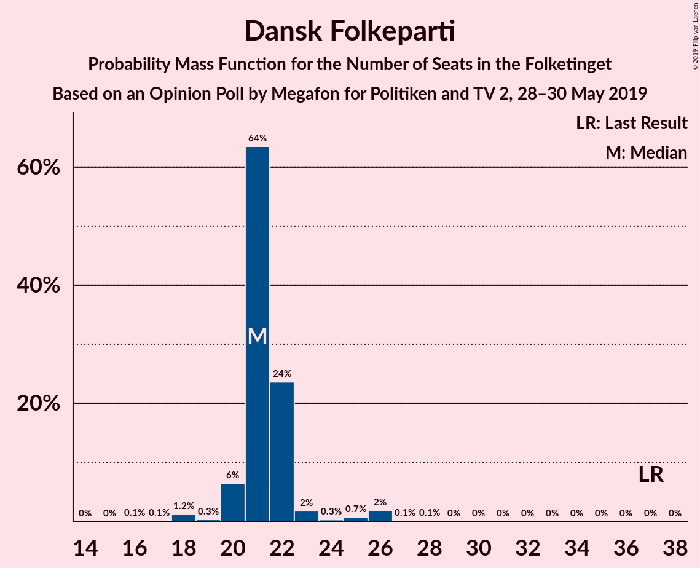

| Number of Seats | Probability | Accumulated | Special Marks |
|:---------------:|:-----------:|:-----------:|:-------------:|
| 16 | 0.5% | 100% |  |
| 17 | 0.1% | 99.5% |  |
| 18 | 0.6% | 99.4% |  |
| 19 | 5% | 98.8% |  |
| 20 | 1.4% | 94% |  |
| 21 | 32% | 92% |  |
| 22 | 31% | 60% | Median |
| 23 | 24% | 29% |  |
| 24 | 3% | 5% |  |
| 25 | 0.4% | 2% |  |
| 26 | 2% | 2% |  |
| 27 | 0.1% | 0.2% |  |
| 28 | 0.1% | 0.1% |  |
| 29 | 0% | 0% |  |
| 30 | 0% | 0% |  |
| 31 | 0% | 0% |  |
| 32 | 0% | 0% |  |
| 33 | 0% | 0% |  |
| 34 | 0% | 0% |  |
| 35 | 0% | 0% |  |
| 36 | 0% | 0% |  |
| 37 | 0% | 0% | Last Result |

### Enhedslisten–De Rød-Grønne

*For a full overview of the results for this party, see the [Enhedslisten–De Rød-Grønne](party-enhedslisten–derød-grønne.html) page.*

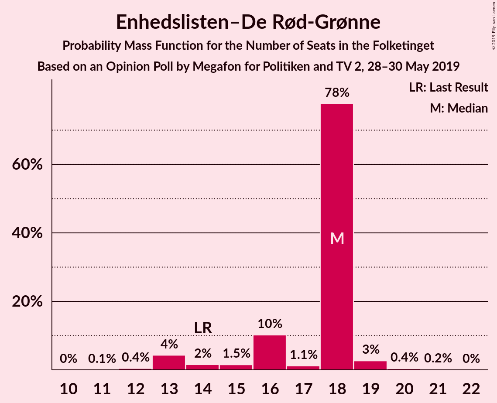

| Number of Seats | Probability | Accumulated | Special Marks |
|:---------------:|:-----------:|:-----------:|:-------------:|
| 11 | 0.1% | 100% |  |
| 12 | 1.0% | 99.9% |  |
| 13 | 2% | 98.9% |  |
| 14 | 55% | 97% | Last Result, Median |
| 15 | 2% | 42% |  |
| 16 | 13% | 40% |  |
| 17 | 1.2% | 27% |  |
| 18 | 5% | 26% |  |
| 19 | 0.2% | 22% |  |
| 20 | 21% | 21% |  |
| 21 | 0% | 0% |  |

### Radikale Venstre

*For a full overview of the results for this party, see the [Radikale Venstre](party-radikalevenstre.html) page.*

| Number of Seats | Probability | Accumulated | Special Marks |
|:---------------:|:-----------:|:-----------:|:-------------:|
| 8 | 0% | 100% | Last Result |
| 9 | 0% | 100% |  |
| 10 | 0.1% | 100% |  |
| 11 | 0.2% | 99.8% |  |
| 12 | 23% | 99.6% |  |
| 13 | 29% | 77% | Median |
| 14 | 14% | 48% |  |
| 15 | 30% | 34% |  |
| 16 | 2% | 4% |  |
| 17 | 0.5% | 2% |  |
| 18 | 0.6% | 1.1% |  |
| 19 | 0.5% | 0.5% |  |
| 20 | 0% | 0% |  |

### Socialistisk Folkeparti

*For a full overview of the results for this party, see the [Socialistisk Folkeparti](party-socialistiskfolkeparti.html) page.*

| Number of Seats | Probability | Accumulated | Special Marks |
|:---------------:|:-----------:|:-----------:|:-------------:|
| 7 | 0% | 100% | Last Result |
| 8 | 0.1% | 100% |  |
| 9 | 0.1% | 99.9% |  |
| 10 | 2% | 99.8% |  |
| 11 | 2% | 97% |  |
| 12 | 51% | 95% | Median |
| 13 | 25% | 45% |  |
| 14 | 2% | 20% |  |
| 15 | 8% | 17% |  |
| 16 | 5% | 10% |  |
| 17 | 5% | 5% |  |
| 18 | 0.2% | 0.2% |  |
| 19 | 0% | 0% |  |

### Det Konservative Folkeparti

*For a full overview of the results for this party, see the [Det Konservative Folkeparti](party-detkonservativefolkeparti.html) page.*

| Number of Seats | Probability | Accumulated | Special Marks |
|:---------------:|:-----------:|:-----------:|:-------------:|
| 5 | 0.1% | 100% |  |
| 6 | 1.3% | 99.9% | Last Result |
| 7 | 0.9% | 98.6% |  |
| 8 | 5% | 98% |  |
| 9 | 26% | 93% |  |
| 10 | 9% | 67% |  |
| 11 | 7% | 58% |  |
| 12 | 50% | 51% | Median |
| 13 | 0% | 1.0% |  |
| 14 | 0.9% | 0.9% |  |
| 15 | 0% | 0% |  |

### Liberal Alliance

*For a full overview of the results for this party, see the [Liberal Alliance](party-liberalalliance.html) page.*

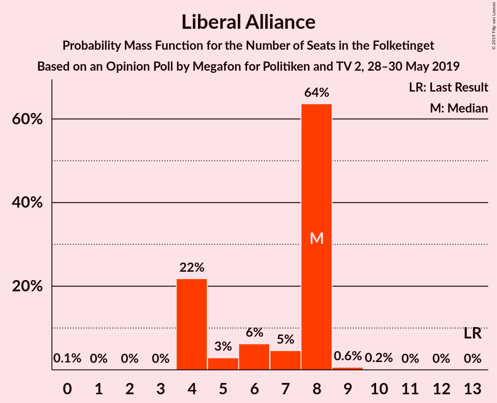

| Number of Seats | Probability | Accumulated | Special Marks |
|:---------------:|:-----------:|:-----------:|:-------------:|
| 4 | 0.1% | 100% |  |
| 5 | 31% | 99.9% |  |
| 6 | 24% | 69% | Median |
| 7 | 9% | 45% |  |
| 8 | 32% | 36% |  |
| 9 | 4% | 4% |  |
| 10 | 0% | 0.2% |  |
| 11 | 0.2% | 0.2% |  |
| 12 | 0.1% | 0.1% |  |
| 13 | 0% | 0% | Last Result |

### Alternativet

*For a full overview of the results for this party, see the [Alternativet](party-alternativet.html) page.*

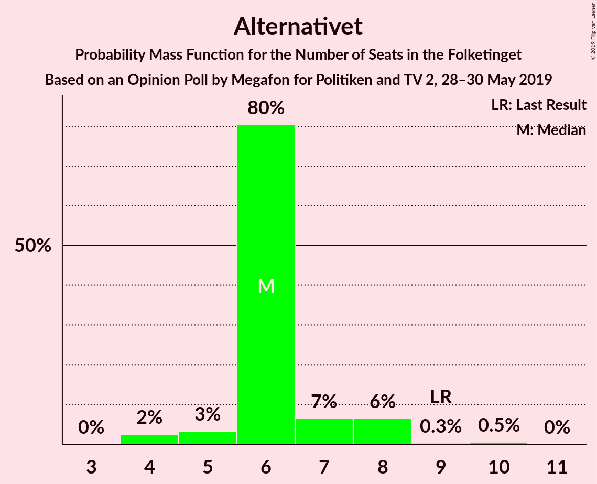

| Number of Seats | Probability | Accumulated | Special Marks |
|:---------------:|:-----------:|:-----------:|:-------------:|
| 0 | 0.1% | 100% |  |
| 1 | 0% | 99.9% |  |
| 2 | 0% | 99.9% |  |
| 3 | 0% | 99.9% |  |
| 4 | 0.9% | 99.8% |  |
| 5 | 2% | 99.0% |  |
| 6 | 32% | 97% |  |
| 7 | 10% | 65% |  |
| 8 | 4% | 55% |  |
| 9 | 0.3% | 51% | Last Result |
| 10 | 50% | 51% | Median |
| 11 | 0.1% | 0.1% |  |
| 12 | 0% | 0% |  |

### Nye Borgerlige

*For a full overview of the results for this party, see the [Nye Borgerlige](party-nyeborgerlige.html) page.*

| Number of Seats | Probability | Accumulated | Special Marks |
|:---------------:|:-----------:|:-----------:|:-------------:|
| 0 | 25% | 100% | Last Result |
| 1 | 0% | 75% |  |
| 2 | 0% | 75% |  |
| 3 | 0% | 75% |  |
| 4 | 16% | 75% |  |
| 5 | 35% | 59% | Median |
| 6 | 24% | 25% |  |
| 7 | 0.3% | 0.7% |  |
| 8 | 0.4% | 0.4% |  |
| 9 | 0% | 0% |  |

### Stram Kurs

*For a full overview of the results for this party, see the [Stram Kurs](party-stramkurs.html) page.*

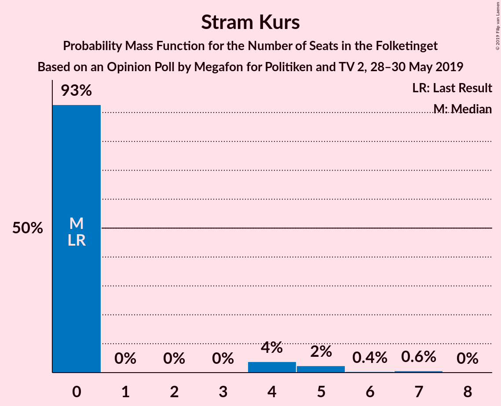

| Number of Seats | Probability | Accumulated | Special Marks |
|:---------------:|:-----------:|:-----------:|:-------------:|
| 0 | 45% | 100% | Last Result |
| 1 | 0% | 55% |  |
| 2 | 0% | 55% |  |
| 3 | 0% | 55% |  |
| 4 | 49% | 55% | Median |
| 5 | 5% | 7% |  |
| 6 | 2% | 2% |  |
| 7 | 0% | 0% |  |

### Kristendemokraterne

*For a full overview of the results for this party, see the [Kristendemokraterne](party-kristendemokraterne.html) page.*

| Number of Seats | Probability | Accumulated | Special Marks |
|:---------------:|:-----------:|:-----------:|:-------------:|
| 0 | 85% | 100% | Last Result, Median |
| 1 | 0% | 15% |  |
| 2 | 0% | 15% |  |
| 3 | 0% | 15% |  |
| 4 | 12% | 15% |  |
| 5 | 3% | 3% |  |
| 6 | 0% | 0.2% |  |
| 7 | 0.2% | 0.2% |  |
| 8 | 0% | 0% |  |

### Klaus Riskær Pedersen

*For a full overview of the results for this party, see the [Klaus Riskær Pedersen](party-klausriskærpedersen.html) page.*

| Number of Seats | Probability | Accumulated | Special Marks |
|:---------------:|:-----------:|:-----------:|:-------------:|
| 0 | 100% | 100% | Last Result, Median |

## Coalitions

### Confidence Intervals

| Coalition | Last Result | Median | Majority? | 80% Confidence Interval | 90% Confidence Interval | 95% Confidence Interval | 99% Confidence Interval |
|:---------:|:-----------:|:------:|:---------:|:-----------------------:|:-----------------------:|:-----------------------:|:-----------------------:|
| Socialdemokraterne – Enhedslisten–De Rød-Grønne – Radikale Venstre – Socialistisk Folkeparti – Alternativet | 85 | 97 | 97% | 94–99 | 92–99 | 86–99 | 85–105 |
| Socialdemokraterne – Enhedslisten–De Rød-Grønne – Radikale Venstre – Socialistisk Folkeparti | 76 | 89 | 36% | 85–91 | 85–92 | 79–92 | 78–96 |
| Venstre – Dansk Folkeparti – Det Konservative Folkeparti – Liberal Alliance – Nye Borgerlige – Stram Kurs – Kristendemokraterne – Klaus Riskær Pedersen | 90 | 78 | 2% | 76–81 | 76–83 | 76–89 | 70–90 |
| Socialdemokraterne – Enhedslisten–De Rød-Grønne – Socialistisk Folkeparti – Alternativet | 77 | 84 | 0.5% | 81–85 | 78–85 | 74–85 | 71–89 |
| Venstre – Dansk Folkeparti – Det Konservative Folkeparti – Liberal Alliance – Nye Borgerlige – Kristendemokraterne – Klaus Riskær Pedersen | 90 | 76 | 0% | 74–79 | 74–81 | 71–85 | 68–85 |
| Venstre – Dansk Folkeparti – Det Konservative Folkeparti – Liberal Alliance – Nye Borgerlige – Kristendemokraterne | 90 | 76 | 0% | 74–79 | 74–81 | 71–85 | 68–85 |
| Venstre – Dansk Folkeparti – Det Konservative Folkeparti – Liberal Alliance – Nye Borgerlige – Klaus Riskær Pedersen | 90 | 76 | 0% | 73–77 | 73–79 | 71–80 | 66–85 |
| Venstre – Dansk Folkeparti – Det Konservative Folkeparti – Liberal Alliance – Nye Borgerlige | 90 | 76 | 0% | 73–77 | 73–79 | 71–80 | 66–85 |
| Venstre – Dansk Folkeparti – Det Konservative Folkeparti – Liberal Alliance – Kristendemokraterne | 90 | 71 | 0% | 70–75 | 70–77 | 68–79 | 64–81 |
| Socialdemokraterne – Enhedslisten–De Rød-Grønne – Socialistisk Folkeparti | 68 | 74 | 0% | 72–79 | 71–79 | 66–79 | 65–83 |
| Socialdemokraterne – Radikale Venstre – Socialistisk Folkeparti | 62 | 71 | 0% | 71–76 | 71–76 | 66–77 | 65–81 |
| Venstre – Dansk Folkeparti – Det Konservative Folkeparti – Liberal Alliance | 90 | 71 | 0% | 70–74 | 69–74 | 68–76 | 62–79 |
| Socialdemokraterne – Radikale Venstre | 55 | 59 | 0% | 57–63 | 54–63 | 54–63 | 53–68 |
| Venstre – Det Konservative Folkeparti – Liberal Alliance | 53 | 49 | 0% | 48–51 | 48–54 | 47–54 | 44–57 |
| Venstre – Det Konservative Folkeparti | 40 | 44 | 0% | 41–45 | 41–46 | 39–46 | 38–49 |
| Venstre | 34 | 32 | 0% | 32–35 | 30–36 | 30–36 | 29–38 |

### Socialdemokraterne – Enhedslisten–De Rød-Grønne – Radikale Venstre – Socialistisk Folkeparti – Alternativet

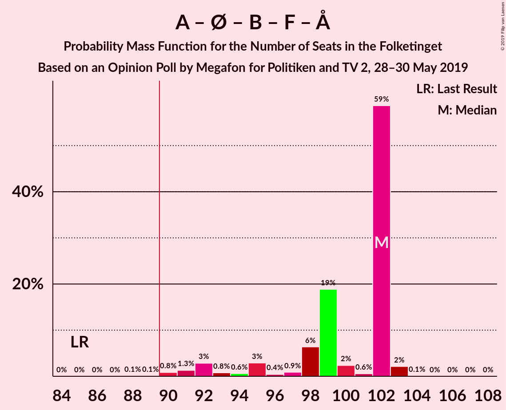

| Number of Seats | Probability | Accumulated | Special Marks |
|:---------------:|:-----------:|:-----------:|:-------------:|
| 85 | 2% | 100% | Last Result |
| 86 | 0.8% | 98% |  |
| 87 | 0.1% | 97% |  |
| 88 | 0.1% | 97% |  |
| 89 | 0.4% | 97% |  |
| 90 | 0.4% | 97% | Majority |
| 91 | 0.3% | 96% |  |
| 92 | 2% | 96% |  |
| 93 | 1.3% | 94% |  |
| 94 | 5% | 92% |  |
| 95 | 23% | 87% |  |
| 96 | 0.8% | 64% | Median |
| 97 | 22% | 63% |  |
| 98 | 10% | 42% |  |
| 99 | 29% | 31% |  |
| 100 | 0.5% | 2% |  |
| 101 | 0.1% | 2% |  |
| 102 | 0.8% | 2% |  |
| 103 | 0.2% | 0.9% |  |
| 104 | 0.1% | 0.6% |  |
| 105 | 0.5% | 0.5% |  |
| 106 | 0.1% | 0.1% |  |
| 107 | 0% | 0% |  |

### Socialdemokraterne – Enhedslisten–De Rød-Grønne – Radikale Venstre – Socialistisk Folkeparti

| Number of Seats | Probability | Accumulated | Special Marks |
|:---------------:|:-----------:|:-----------:|:-------------:|
| 76 | 0% | 100% | Last Result |
| 77 | 0% | 100% |  |
| 78 | 0.8% | 100% |  |
| 79 | 2% | 99.2% |  |
| 80 | 0.1% | 97% |  |
| 81 | 0% | 97% |  |
| 82 | 0.1% | 97% |  |
| 83 | 0.4% | 97% |  |
| 84 | 1.5% | 97% |  |
| 85 | 22% | 95% |  |
| 86 | 0.9% | 73% | Median |
| 87 | 6% | 72% |  |
| 88 | 1.0% | 66% |  |
| 89 | 29% | 65% |  |
| 90 | 0.8% | 36% | Majority |
| 91 | 25% | 35% |  |
| 92 | 7% | 10% |  |
| 93 | 0.8% | 2% |  |
| 94 | 0.1% | 2% |  |
| 95 | 0.8% | 2% |  |
| 96 | 0.4% | 0.7% |  |
| 97 | 0.1% | 0.3% |  |
| 98 | 0% | 0.3% |  |
| 99 | 0.2% | 0.2% |  |
| 100 | 0% | 0% |  |

### Venstre – Dansk Folkeparti – Det Konservative Folkeparti – Liberal Alliance – Nye Borgerlige – Stram Kurs – Kristendemokraterne – Klaus Riskær Pedersen

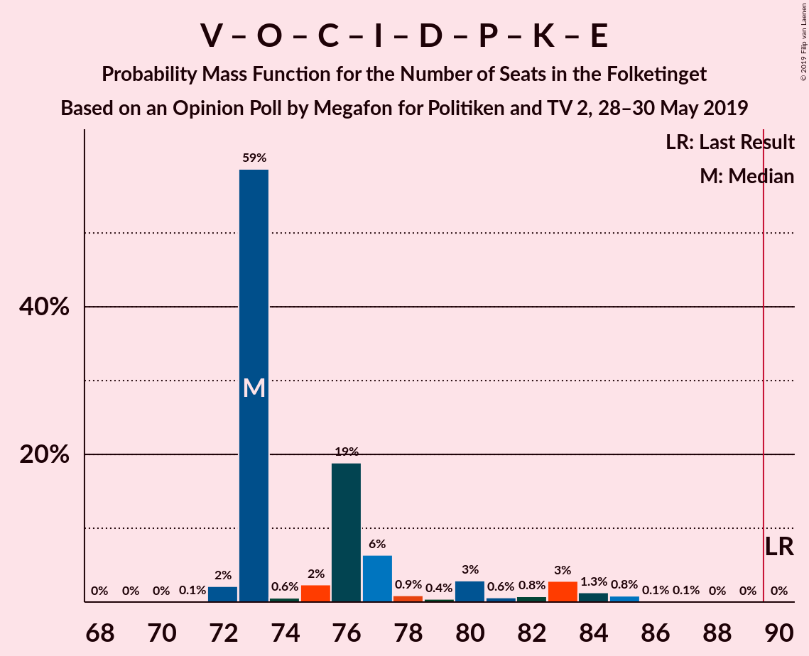

| Number of Seats | Probability | Accumulated | Special Marks |
|:---------------:|:-----------:|:-----------:|:-------------:|
| 69 | 0.1% | 100% |  |
| 70 | 0.5% | 99.9% |  |
| 71 | 0.1% | 99.5% |  |
| 72 | 0.2% | 99.4% |  |
| 73 | 0.8% | 99.1% |  |
| 74 | 0.1% | 98% |  |
| 75 | 0.5% | 98% |  |
| 76 | 29% | 98% |  |
| 77 | 10% | 69% |  |
| 78 | 22% | 58% |  |
| 79 | 0.8% | 37% |  |
| 80 | 23% | 36% |  |
| 81 | 5% | 13% | Median |
| 82 | 1.3% | 8% |  |
| 83 | 2% | 6% |  |
| 84 | 0.3% | 4% |  |
| 85 | 0.4% | 4% |  |
| 86 | 0.4% | 3% |  |
| 87 | 0.1% | 3% |  |
| 88 | 0.1% | 3% |  |
| 89 | 0.8% | 3% |  |
| 90 | 2% | 2% | Last Result, Majority |
| 91 | 0% | 0% |  |

### Socialdemokraterne – Enhedslisten–De Rød-Grønne – Socialistisk Folkeparti – Alternativet

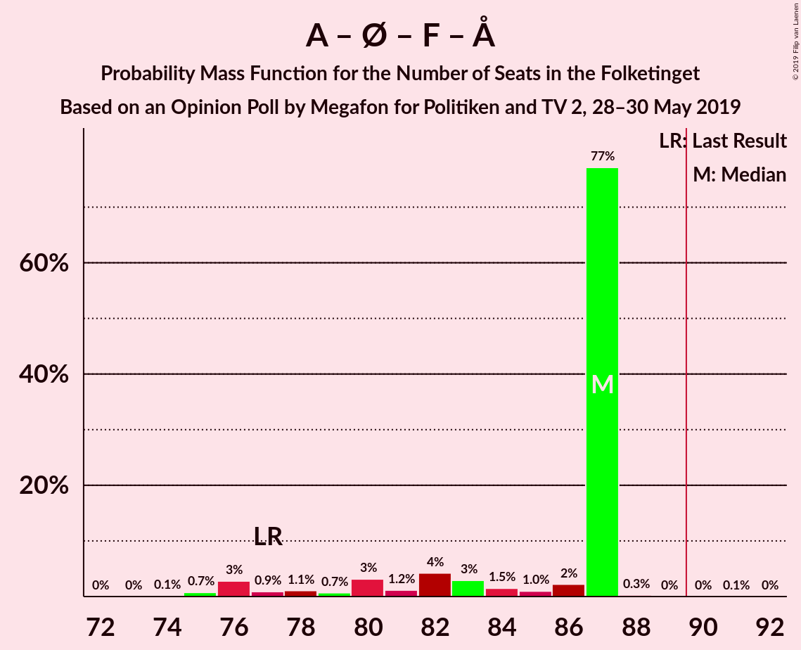

| Number of Seats | Probability | Accumulated | Special Marks |
|:---------------:|:-----------:|:-----------:|:-------------:|
| 71 | 2% | 100% |  |
| 72 | 0% | 98% |  |
| 73 | 0% | 98% |  |
| 74 | 0.8% | 98% |  |
| 75 | 0.5% | 97% |  |
| 76 | 0.6% | 97% |  |
| 77 | 0.5% | 96% | Last Result |
| 78 | 1.2% | 96% |  |
| 79 | 3% | 94% |  |
| 80 | 0.4% | 91% |  |
| 81 | 5% | 91% |  |
| 82 | 23% | 85% |  |
| 83 | 1.1% | 62% | Median |
| 84 | 38% | 61% |  |
| 85 | 22% | 24% |  |
| 86 | 0.1% | 2% |  |
| 87 | 0.5% | 2% |  |
| 88 | 0.2% | 1.2% |  |
| 89 | 0.5% | 1.0% |  |
| 90 | 0% | 0.5% | Majority |
| 91 | 0.5% | 0.5% |  |
| 92 | 0% | 0% |  |

### Venstre – Dansk Folkeparti – Det Konservative Folkeparti – Liberal Alliance – Nye Borgerlige – Kristendemokraterne – Klaus Riskær Pedersen

| Number of Seats | Probability | Accumulated | Special Marks |
|:---------------:|:-----------:|:-----------:|:-------------:|
| 66 | 0.5% | 100% |  |
| 67 | 0% | 99.5% |  |
| 68 | 0% | 99.5% |  |
| 69 | 0.5% | 99.5% |  |
| 70 | 0.6% | 99.0% |  |
| 71 | 1.1% | 98% |  |
| 72 | 1.0% | 97% |  |
| 73 | 0.4% | 96% |  |
| 74 | 23% | 96% |  |
| 75 | 0.1% | 73% |  |
| 76 | 51% | 73% |  |
| 77 | 10% | 22% | Median |
| 78 | 1.0% | 12% |  |
| 79 | 2% | 11% |  |
| 80 | 0.1% | 9% |  |
| 81 | 5% | 9% |  |
| 82 | 0.6% | 4% |  |
| 83 | 0.7% | 4% |  |
| 84 | 0.3% | 3% |  |
| 85 | 3% | 3% |  |
| 86 | 0% | 0.1% |  |
| 87 | 0% | 0.1% |  |
| 88 | 0% | 0.1% |  |
| 89 | 0.1% | 0.1% |  |
| 90 | 0% | 0% | Last Result, Majority |

### Venstre – Dansk Folkeparti – Det Konservative Folkeparti – Liberal Alliance – Nye Borgerlige – Kristendemokraterne

| Number of Seats | Probability | Accumulated | Special Marks |
|:---------------:|:-----------:|:-----------:|:-------------:|
| 66 | 0.5% | 100% |  |
| 67 | 0% | 99.5% |  |
| 68 | 0% | 99.5% |  |
| 69 | 0.5% | 99.5% |  |
| 70 | 0.6% | 99.0% |  |
| 71 | 1.1% | 98% |  |
| 72 | 1.0% | 97% |  |
| 73 | 0.4% | 96% |  |
| 74 | 23% | 96% |  |
| 75 | 0.1% | 73% |  |
| 76 | 51% | 73% |  |
| 77 | 10% | 22% | Median |
| 78 | 1.0% | 12% |  |
| 79 | 2% | 11% |  |
| 80 | 0.1% | 9% |  |
| 81 | 5% | 9% |  |
| 82 | 0.6% | 4% |  |
| 83 | 0.7% | 4% |  |
| 84 | 0.3% | 3% |  |
| 85 | 3% | 3% |  |
| 86 | 0% | 0.1% |  |
| 87 | 0% | 0.1% |  |
| 88 | 0% | 0.1% |  |
| 89 | 0.1% | 0.1% |  |
| 90 | 0% | 0% | Last Result, Majority |

### Venstre – Dansk Folkeparti – Det Konservative Folkeparti – Liberal Alliance – Nye Borgerlige – Klaus Riskær Pedersen

| Number of Seats | Probability | Accumulated | Special Marks |
|:---------------:|:-----------:|:-----------:|:-------------:|
| 66 | 0.6% | 100% |  |
| 67 | 0% | 99.4% |  |
| 68 | 0% | 99.4% |  |
| 69 | 0.5% | 99.4% |  |
| 70 | 0.6% | 98.9% |  |
| 71 | 1.3% | 98% |  |
| 72 | 1.1% | 97% |  |
| 73 | 7% | 96% |  |
| 74 | 24% | 89% |  |
| 75 | 0.1% | 66% |  |
| 76 | 50% | 66% |  |
| 77 | 9% | 15% | Median |
| 78 | 0.8% | 7% |  |
| 79 | 2% | 6% |  |
| 80 | 2% | 4% |  |
| 81 | 0.1% | 2% |  |
| 82 | 0.6% | 2% |  |
| 83 | 0.6% | 2% |  |
| 84 | 0.1% | 0.9% |  |
| 85 | 0.8% | 0.8% |  |
| 86 | 0% | 0.1% |  |
| 87 | 0% | 0.1% |  |
| 88 | 0% | 0.1% |  |
| 89 | 0% | 0.1% |  |
| 90 | 0% | 0% | Last Result, Majority |

### Venstre – Dansk Folkeparti – Det Konservative Folkeparti – Liberal Alliance – Nye Borgerlige

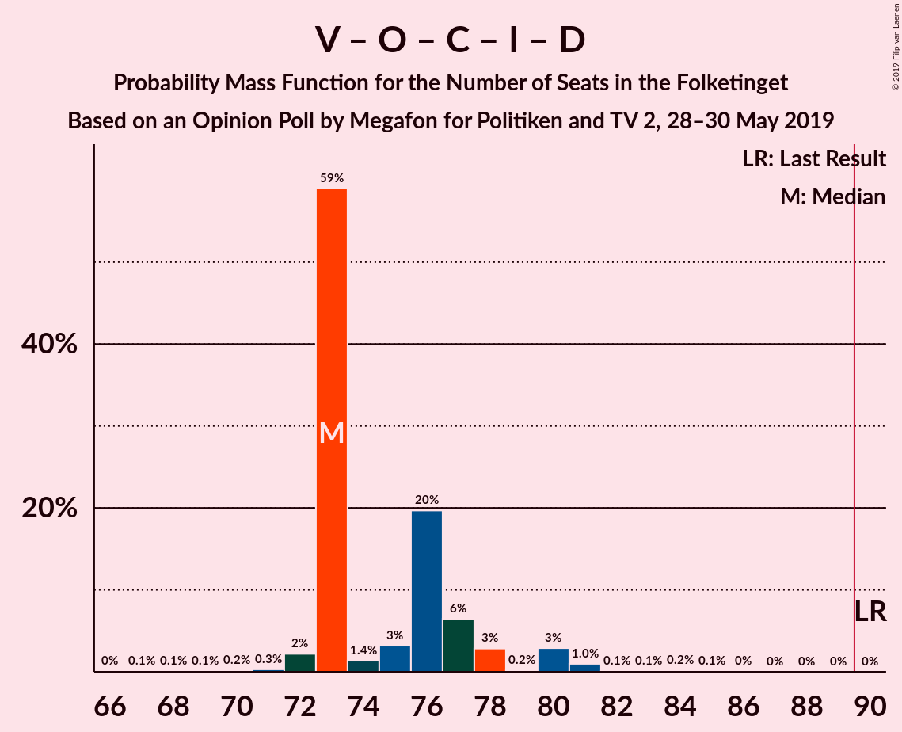

| Number of Seats | Probability | Accumulated | Special Marks |
|:---------------:|:-----------:|:-----------:|:-------------:|
| 66 | 0.6% | 100% |  |
| 67 | 0% | 99.4% |  |
| 68 | 0% | 99.4% |  |
| 69 | 0.5% | 99.4% |  |
| 70 | 0.6% | 98.9% |  |
| 71 | 1.3% | 98% |  |
| 72 | 1.1% | 97% |  |
| 73 | 7% | 96% |  |
| 74 | 24% | 89% |  |
| 75 | 0.1% | 66% |  |
| 76 | 50% | 65% |  |
| 77 | 9% | 15% | Median |
| 78 | 0.8% | 7% |  |
| 79 | 2% | 6% |  |
| 80 | 2% | 4% |  |
| 81 | 0.1% | 2% |  |
| 82 | 0.6% | 2% |  |
| 83 | 0.6% | 2% |  |
| 84 | 0.1% | 0.9% |  |
| 85 | 0.8% | 0.8% |  |
| 86 | 0% | 0.1% |  |
| 87 | 0% | 0.1% |  |
| 88 | 0% | 0.1% |  |
| 89 | 0% | 0.1% |  |
| 90 | 0% | 0% | Last Result, Majority |

### Venstre – Dansk Folkeparti – Det Konservative Folkeparti – Liberal Alliance – Kristendemokraterne

| Number of Seats | Probability | Accumulated | Special Marks |
|:---------------:|:-----------:|:-----------:|:-------------:|
| 62 | 0.5% | 100% |  |
| 63 | 0% | 99.5% |  |
| 64 | 0% | 99.5% |  |
| 65 | 0.1% | 99.5% |  |
| 66 | 1.0% | 99.4% |  |
| 67 | 0.2% | 98% |  |
| 68 | 0.8% | 98% |  |
| 69 | 0.5% | 97% |  |
| 70 | 24% | 97% |  |
| 71 | 28% | 72% |  |
| 72 | 4% | 44% | Median |
| 73 | 7% | 40% |  |
| 74 | 24% | 34% |  |
| 75 | 0.1% | 10% |  |
| 76 | 0.1% | 10% |  |
| 77 | 5% | 10% |  |
| 78 | 1.3% | 5% |  |
| 79 | 1.0% | 3% |  |
| 80 | 0.1% | 2% |  |
| 81 | 2% | 2% |  |
| 82 | 0% | 0.3% |  |
| 83 | 0.3% | 0.3% |  |
| 84 | 0% | 0% |  |
| 85 | 0% | 0% |  |
| 86 | 0% | 0% |  |
| 87 | 0% | 0% |  |
| 88 | 0% | 0% |  |
| 89 | 0% | 0% |  |
| 90 | 0% | 0% | Last Result, Majority |

### Socialdemokraterne – Enhedslisten–De Rød-Grønne – Socialistisk Folkeparti

| Number of Seats | Probability | Accumulated | Special Marks |
|:---------------:|:-----------:|:-----------:|:-------------:|
| 65 | 2% | 100% |  |
| 66 | 0.8% | 98% |  |
| 67 | 0% | 97% |  |
| 68 | 0.1% | 97% | Last Result |
| 69 | 0.7% | 97% |  |
| 70 | 0.2% | 97% |  |
| 71 | 2% | 96% |  |
| 72 | 23% | 95% |  |
| 73 | 2% | 71% | Median |
| 74 | 33% | 69% |  |
| 75 | 1.0% | 36% |  |
| 76 | 2% | 35% |  |
| 77 | 4% | 33% |  |
| 78 | 6% | 29% |  |
| 79 | 21% | 23% |  |
| 80 | 0.4% | 2% |  |
| 81 | 0.6% | 1.3% |  |
| 82 | 0.1% | 0.7% |  |
| 83 | 0.4% | 0.6% |  |
| 84 | 0.2% | 0.2% |  |
| 85 | 0% | 0% |  |

### Socialdemokraterne – Radikale Venstre – Socialistisk Folkeparti

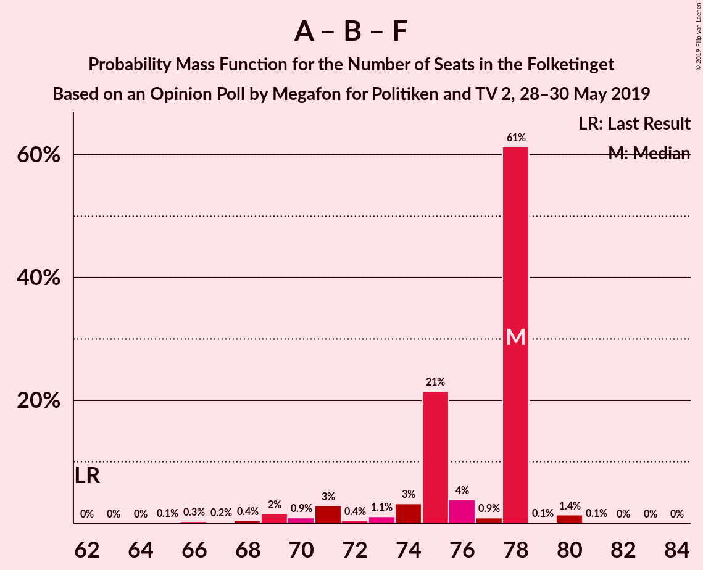

| Number of Seats | Probability | Accumulated | Special Marks |
|:---------------:|:-----------:|:-----------:|:-------------:|
| 62 | 0% | 100% | Last Result |
| 63 | 0% | 100% |  |
| 64 | 0.1% | 100% |  |
| 65 | 2% | 99.9% |  |
| 66 | 0.8% | 98% |  |
| 67 | 0.1% | 97% |  |
| 68 | 0.1% | 97% |  |
| 69 | 0.5% | 97% |  |
| 70 | 1.5% | 97% |  |
| 71 | 51% | 95% |  |
| 72 | 0.4% | 45% | Median |
| 73 | 4% | 44% |  |
| 74 | 1.1% | 40% |  |
| 75 | 29% | 39% |  |
| 76 | 7% | 10% |  |
| 77 | 2% | 4% |  |
| 78 | 0.1% | 2% |  |
| 79 | 0.5% | 2% |  |
| 80 | 0.7% | 1.4% |  |
| 81 | 0.2% | 0.7% |  |
| 82 | 0.5% | 0.5% |  |
| 83 | 0% | 0% |  |

### Venstre – Dansk Folkeparti – Det Konservative Folkeparti – Liberal Alliance

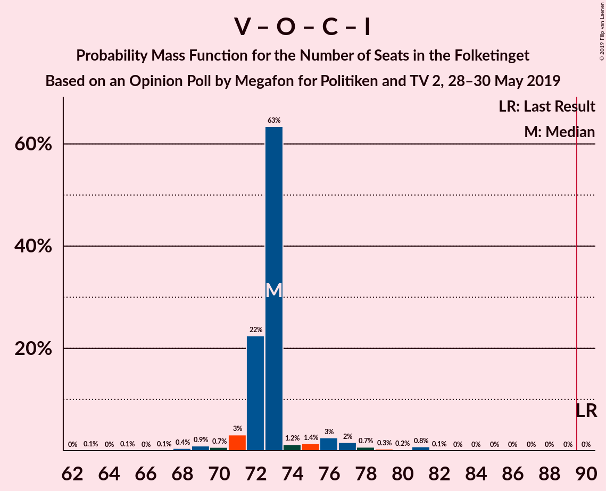

| Number of Seats | Probability | Accumulated | Special Marks |
|:---------------:|:-----------:|:-----------:|:-------------:|
| 61 | 0.1% | 100% |  |
| 62 | 0.5% | 99.9% |  |
| 63 | 0% | 99.4% |  |
| 64 | 0% | 99.4% |  |
| 65 | 0% | 99.4% |  |
| 66 | 1.0% | 99.4% |  |
| 67 | 0.4% | 98% |  |
| 68 | 0.8% | 98% |  |
| 69 | 7% | 97% |  |
| 70 | 25% | 90% |  |
| 71 | 28% | 66% |  |
| 72 | 4% | 37% | Median |
| 73 | 5% | 34% |  |
| 74 | 24% | 28% |  |
| 75 | 0.1% | 4% |  |
| 76 | 2% | 4% |  |
| 77 | 0.3% | 2% |  |
| 78 | 1.1% | 2% |  |
| 79 | 0.8% | 1.1% |  |
| 80 | 0% | 0.2% |  |
| 81 | 0% | 0.2% |  |
| 82 | 0% | 0.2% |  |
| 83 | 0.2% | 0.2% |  |
| 84 | 0% | 0% |  |
| 85 | 0% | 0% |  |
| 86 | 0% | 0% |  |
| 87 | 0% | 0% |  |
| 88 | 0% | 0% |  |
| 89 | 0% | 0% |  |
| 90 | 0% | 0% | Last Result, Majority |

### Socialdemokraterne – Radikale Venstre

| Number of Seats | Probability | Accumulated | Special Marks |
|:---------------:|:-----------:|:-----------:|:-------------:|
| 53 | 0.8% | 100% |  |
| 54 | 5% | 99.1% |  |
| 55 | 2% | 94% | Last Result |
| 56 | 0.1% | 92% |  |
| 57 | 5% | 92% |  |
| 58 | 23% | 87% |  |
| 59 | 22% | 64% |  |
| 60 | 2% | 42% | Median |
| 61 | 8% | 40% |  |
| 62 | 1.3% | 32% |  |
| 63 | 28% | 31% |  |
| 64 | 1.1% | 2% |  |
| 65 | 0.1% | 1.3% |  |
| 66 | 0.1% | 1.2% |  |
| 67 | 0.6% | 1.1% |  |
| 68 | 0.1% | 0.5% |  |
| 69 | 0.4% | 0.4% |  |
| 70 | 0% | 0% |  |

### Venstre – Det Konservative Folkeparti – Liberal Alliance

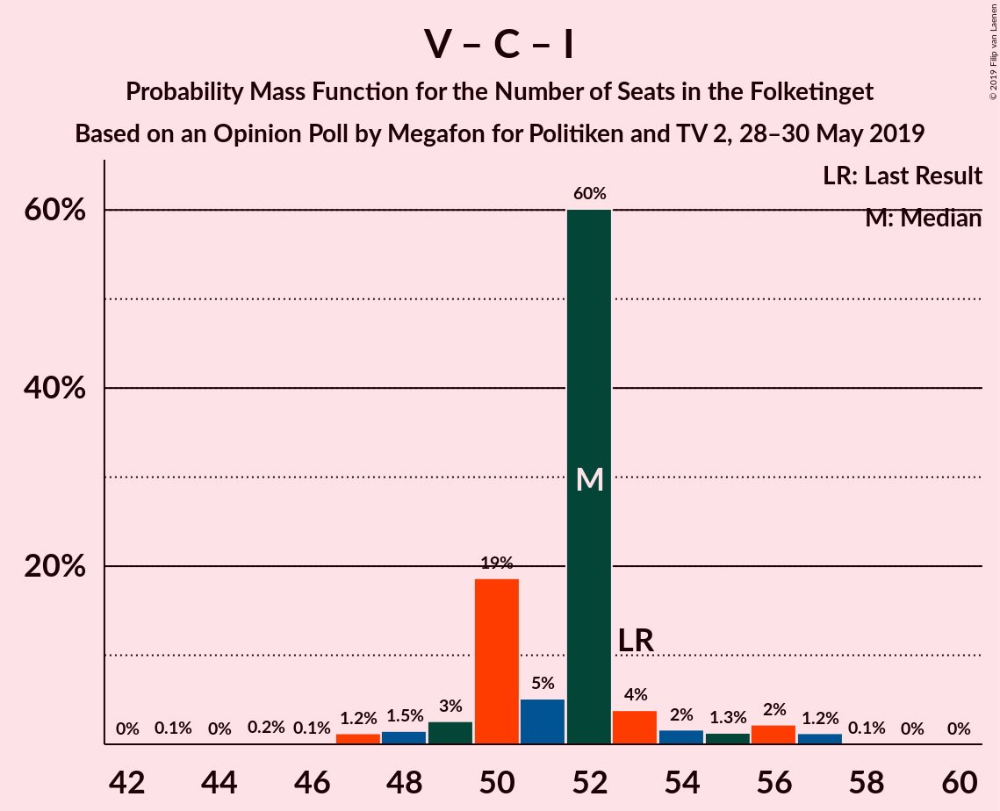

| Number of Seats | Probability | Accumulated | Special Marks |
|:---------------:|:-----------:|:-----------:|:-------------:|
| 42 | 0.2% | 100% |  |
| 43 | 0.2% | 99.8% |  |
| 44 | 1.0% | 99.6% |  |
| 45 | 0.5% | 98.6% |  |
| 46 | 0.6% | 98% |  |
| 47 | 2% | 98% |  |
| 48 | 6% | 96% |  |
| 49 | 51% | 90% |  |
| 50 | 6% | 38% | Median |
| 51 | 25% | 33% |  |
| 52 | 0.2% | 8% |  |
| 53 | 0.4% | 8% | Last Result |
| 54 | 5% | 7% |  |
| 55 | 0.1% | 2% |  |
| 56 | 0.6% | 2% |  |
| 57 | 0.8% | 1.1% |  |
| 58 | 0% | 0.3% |  |
| 59 | 0.1% | 0.3% |  |
| 60 | 0.2% | 0.2% |  |
| 61 | 0% | 0% |  |

### Venstre – Det Konservative Folkeparti

| Number of Seats | Probability | Accumulated | Special Marks |
|:---------------:|:-----------:|:-----------:|:-------------:|
| 37 | 0.2% | 100% |  |
| 38 | 2% | 99.7% |  |
| 39 | 1.1% | 98% |  |
| 40 | 0.7% | 97% | Last Result |
| 41 | 30% | 96% |  |
| 42 | 2% | 66% |  |
| 43 | 3% | 64% |  |
| 44 | 31% | 61% | Median |
| 45 | 23% | 30% |  |
| 46 | 5% | 7% |  |
| 47 | 0.3% | 2% |  |
| 48 | 0.8% | 2% |  |
| 49 | 0.5% | 0.8% |  |
| 50 | 0.1% | 0.3% |  |
| 51 | 0% | 0.3% |  |
| 52 | 0.2% | 0.2% |  |
| 53 | 0% | 0.1% |  |
| 54 | 0.1% | 0.1% |  |
| 55 | 0% | 0% |  |

### Venstre

| Number of Seats | Probability | Accumulated | Special Marks |
|:---------------:|:-----------:|:-----------:|:-------------:|
| 28 | 0.1% | 100% |  |
| 29 | 2% | 99.9% |  |
| 30 | 7% | 98% |  |
| 31 | 0.1% | 91% |  |
| 32 | 52% | 91% | Median |
| 33 | 24% | 39% |  |
| 34 | 0.7% | 14% | Last Result |
| 35 | 7% | 14% |  |
| 36 | 5% | 7% |  |
| 37 | 0.5% | 2% |  |
| 38 | 0.8% | 1.2% |  |
| 39 | 0.1% | 0.4% |  |
| 40 | 0.2% | 0.3% |  |
| 41 | 0% | 0.1% |  |
| 42 | 0% | 0% |  |

## Technical Information

### Opinion Poll

+ **Polling firm:** Megafon
+ **Commissioner(s):** Politiken and TV 2
+ **Fieldwork period:** 28–30 May 2019

### Calculations

+ **Sample size:** 1013
+ **Simulations done:** 131,072
+ **Error estimate:** 1.20%

