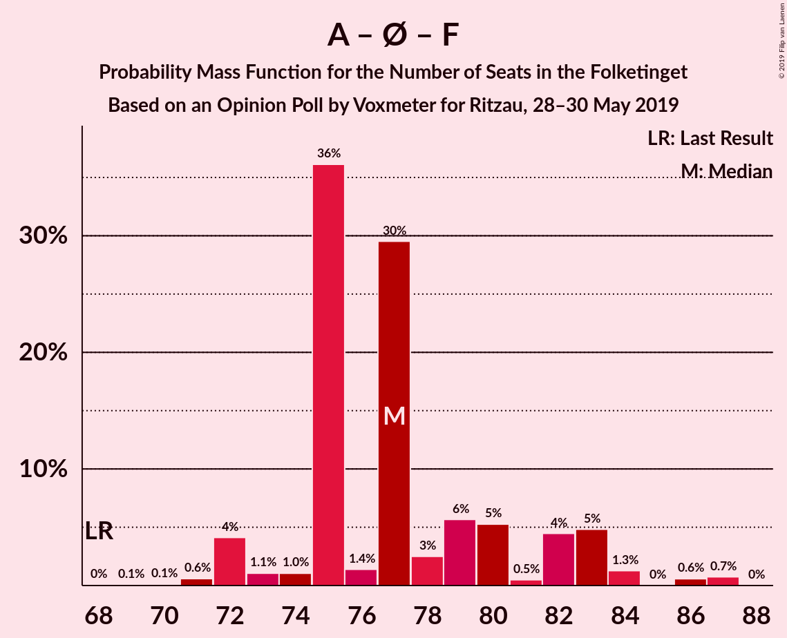
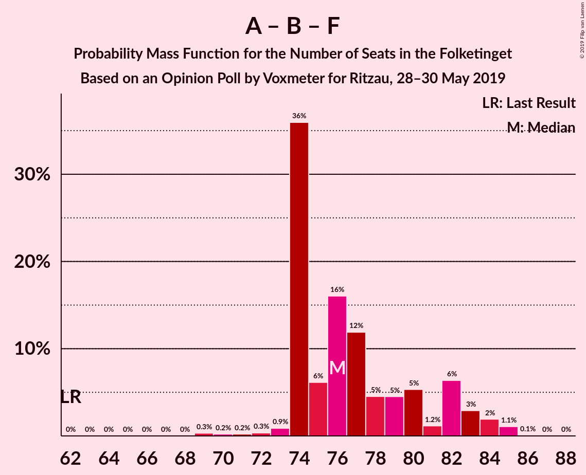
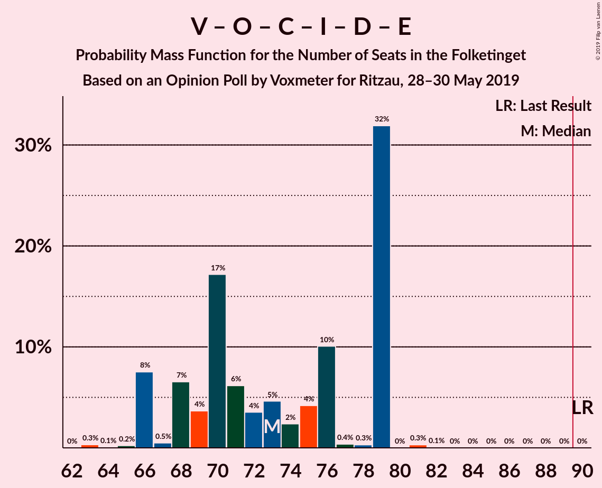
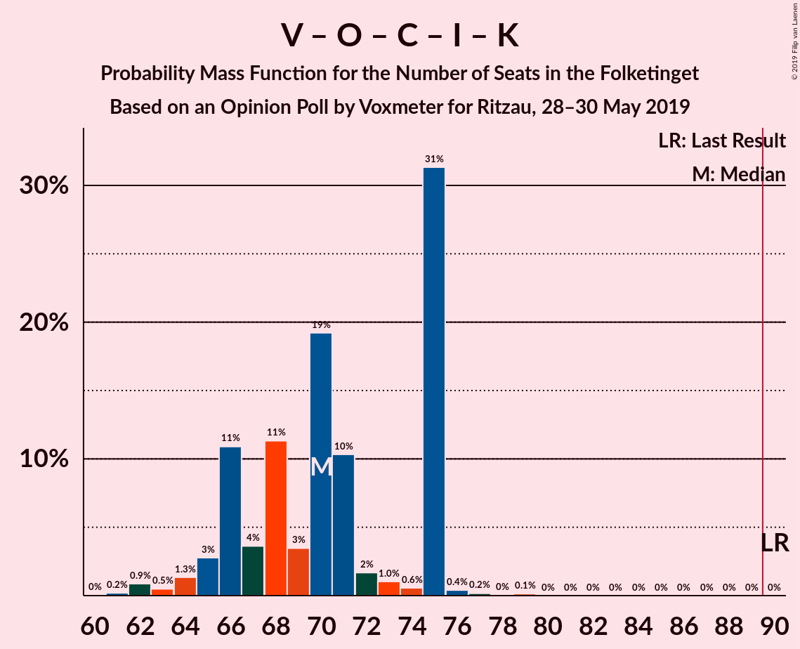
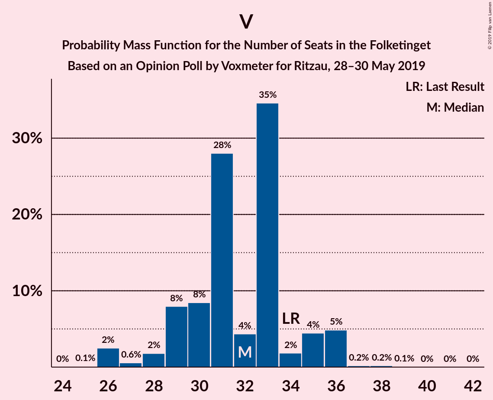

# Opinion Poll by Voxmeter for Ritzau, 28–30 May 2019

<a href="#voting-intentions">Voting Intentions</a> | <a href="#seats">Seats</a> | <a href="#coalitions">Coalitions</a> | <a href="#technical-information">Technical Information</a>

## Voting Intentions

### Confidence Intervals

| Party | Last Result | Poll Result | 80% Confidence Interval | 90% Confidence Interval | 95% Confidence Interval | 99% Confidence Interval |
|:-----:|:-----------:|:-----------:|:-----------------------:|:-----------------------:|:-----------------------:|:-----------------------:|
| Socialdemokraterne | 26.3% | 27.2% | 25.4–29.0% |24.9–29.5% |24.5–30.0% |23.7–30.9% |
| Venstre | 19.5% | 17.9% | 16.5–19.6% |16.0–20.0% |15.7–20.4% |15.0–21.2% |
| Dansk Folkeparti | 21.1% | 11.6% | 10.4–13.0% |10.0–13.4% |9.8–13.7% |9.2–14.4% |
| Enhedslisten–De Rød-Grønne | 7.8% | 8.8% | 7.8–10.1% |7.5–10.4% |7.2–10.7% |6.7–11.4% |
| Radikale Venstre | 4.6% | 8.4% | 7.4–9.6% |7.1–10.0% |6.9–10.3% |6.4–10.9% |
| Socialistisk Folkeparti | 4.2% | 7.6% | 6.6–8.8% |6.4–9.1% |6.1–9.4% |5.7–10.0% |
| Det Konservative Folkeparti | 3.4% | 5.5% | 4.6–6.5% |4.4–6.8% |4.2–7.0% |3.8–7.6% |
| Alternativet | 4.8% | 3.3% | 2.7–4.1% |2.5–4.4% |2.3–4.6% |2.1–5.0% |
| Liberal Alliance | 7.5% | 3.2% | 2.6–4.0% |2.4–4.2% |2.3–4.5% |2.0–4.9% |
| Nye Borgerlige | 0.0% | 2.2% | 1.7–2.9% |1.6–3.1% |1.4–3.3% |1.2–3.7% |
| Stram Kurs | 0.0% | 2.2% | 1.7–2.9% |1.6–3.1% |1.4–3.3% |1.2–3.7% |
| Kristendemokraterne | 0.8% | 1.2% | 0.9–1.8% |0.8–1.9% |0.7–2.1% |0.5–2.4% |
| Klaus Riskær Pedersen | 0.0% | 0.4% | 0.2–0.8% |0.2–0.9% |0.2–1.0% |0.1–1.2% |

*Note:* The poll result column reflects the actual value used in the calculations. Published results may vary slightly, and in addition be rounded to fewer digits.

## Seats

### Confidence Intervals

| Party | Last Result | Median | 80% Confidence Interval | 90% Confidence Interval | 95% Confidence Interval | 99% Confidence Interval |
|:-----:|:-----------:|:------:|:-----------------------:|:-----------------------:|:-----------------------:|:-----------------------:|
| <a href="#socialdemokraterne">Socialdemokraterne</a> | 47 | 46 | 46–47 |46–47 |46–50 |44–53 |
| <a href="#venstre">Venstre</a> | 34 | 31 | 30–31 |30–31 |30–31 |28–35 |
| <a href="#dansk-folkeparti">Dansk Folkeparti</a> | 37 | 21 | 19–21 |19–21 |19–22 |18–25 |
| <a href="#enhedslisten–de-rød-grønne">Enhedslisten–De Rød-Grønne</a> | 14 | 17 | 16–17 |15–17 |14–17 |14–18 |
| <a href="#radikale-venstre">Radikale Venstre</a> | 8 | 16 | 16 |14–16 |13–16 |12–17 |
| <a href="#socialistisk-folkeparti">Socialistisk Folkeparti</a> | 7 | 14 | 14–16 |14–16 |13–16 |12–17 |
| <a href="#det-konservative-folkeparti">Det Konservative Folkeparti</a> | 6 | 11 | 11–12 |11–12 |10–12 |9–13 |
| <a href="#alternativet">Alternativet</a> | 9 | 7 | 6–7 |6–7 |5–7 |5–8 |
| <a href="#liberal-alliance">Liberal Alliance</a> | 13 | 7 | 7 |5–7 |5–7 |4–7 |
| <a href="#nye-borgerlige">Nye Borgerlige</a> | 0 | 0 | 0 |0–4 |0–5 |0–6 |
| <a href="#stram-kurs">Stram Kurs</a> | 0 | 5 | 5–6 |5–6 |4–6 |0–6 |
| <a href="#kristendemokraterne">Kristendemokraterne</a> | 0 | 0 | 0 |0 |0 |0–4 |
| <a href="#klaus-riskær-pedersen">Klaus Riskær Pedersen</a> | 0 | 0 | 0 |0 |0 |0 |

### Socialdemokraterne

*For a full overview of the results for this party, see the [Socialdemokraterne](party-socialdemokraterne.html) page.*

| Number of Seats | Probability | Accumulated | Special Marks |
|:---------------:|:-----------:|:-----------:|:-------------:|
| 39 | 0.1% | 100% |  |
| 40 | 0% | 99.9% |  |
| 41 | 0% | 99.9% |  |
| 42 | 0% | 99.9% |  |
| 43 | 0.1% | 99.9% |  |
| 44 | 1.1% | 99.8% |  |
| 45 | 0.4% | 98.6% |  |
| 46 | 81% | 98% | Median |
| 47 | 13% | 17% | Last Result |
| 48 | 0.2% | 4% |  |
| 49 | 0.1% | 4% |  |
| 50 | 3% | 4% |  |
| 51 | 0% | 1.4% |  |
| 52 | 0.8% | 1.4% |  |
| 53 | 0.2% | 0.6% |  |
| 54 | 0.1% | 0.4% |  |
| 55 | 0% | 0.2% |  |
| 56 | 0% | 0.2% |  |
| 57 | 0.1% | 0.2% |  |
| 58 | 0.1% | 0.1% |  |
| 59 | 0% | 0% |  |

### Venstre

*For a full overview of the results for this party, see the [Venstre](party-venstre.html) page.*

| Number of Seats | Probability | Accumulated | Special Marks |
|:---------------:|:-----------:|:-----------:|:-------------:|
| 25 | 0.1% | 100% |  |
| 26 | 0.1% | 99.9% |  |
| 27 | 0.1% | 99.8% |  |
| 28 | 0.2% | 99.6% |  |
| 29 | 1.4% | 99.4% |  |
| 30 | 14% | 98% |  |
| 31 | 82% | 84% | Median |
| 32 | 0.5% | 2% |  |
| 33 | 0.3% | 2% |  |
| 34 | 0.4% | 2% | Last Result |
| 35 | 1.0% | 1.2% |  |
| 36 | 0.1% | 0.2% |  |
| 37 | 0% | 0.1% |  |
| 38 | 0% | 0.1% |  |
| 39 | 0% | 0.1% |  |
| 40 | 0% | 0.1% |  |
| 41 | 0% | 0% |  |

### Dansk Folkeparti

*For a full overview of the results for this party, see the [Dansk Folkeparti](party-danskfolkeparti.html) page.*

| Number of Seats | Probability | Accumulated | Special Marks |
|:---------------:|:-----------:|:-----------:|:-------------:|
| 17 | 0.1% | 100% |  |
| 18 | 1.0% | 99.9% |  |
| 19 | 15% | 98.8% |  |
| 20 | 0.2% | 84% |  |
| 21 | 81% | 84% | Median |
| 22 | 0.6% | 3% |  |
| 23 | 0.2% | 2% |  |
| 24 | 1.3% | 2% |  |
| 25 | 0.5% | 0.5% |  |
| 26 | 0% | 0.1% |  |
| 27 | 0% | 0.1% |  |
| 28 | 0% | 0.1% |  |
| 29 | 0.1% | 0.1% |  |
| 30 | 0% | 0% |  |
| 31 | 0% | 0% |  |
| 32 | 0% | 0% |  |
| 33 | 0% | 0% |  |
| 34 | 0% | 0% |  |
| 35 | 0% | 0% |  |
| 36 | 0% | 0% |  |
| 37 | 0% | 0% | Last Result |

### Enhedslisten–De Rød-Grønne

*For a full overview of the results for this party, see the [Enhedslisten–De Rød-Grønne](party-enhedslisten–derød-grønne.html) page.*

| Number of Seats | Probability | Accumulated | Special Marks |
|:---------------:|:-----------:|:-----------:|:-------------:|
| 12 | 0% | 100% |  |
| 13 | 0.3% | 99.9% |  |
| 14 | 2% | 99.7% | Last Result |
| 15 | 3% | 97% |  |
| 16 | 13% | 94% |  |
| 17 | 81% | 81% | Median |
| 18 | 0.4% | 0.7% |  |
| 19 | 0.2% | 0.3% |  |
| 20 | 0% | 0.2% |  |
| 21 | 0% | 0.2% |  |
| 22 | 0% | 0.1% |  |
| 23 | 0% | 0.1% |  |
| 24 | 0.1% | 0.1% |  |
| 25 | 0% | 0% |  |

### Radikale Venstre

*For a full overview of the results for this party, see the [Radikale Venstre](party-radikalevenstre.html) page.*

| Number of Seats | Probability | Accumulated | Special Marks |
|:---------------:|:-----------:|:-----------:|:-------------:|
| 8 | 0% | 100% | Last Result |
| 9 | 0% | 100% |  |
| 10 | 0% | 100% |  |
| 11 | 0.1% | 100% |  |
| 12 | 1.3% | 99.9% |  |
| 13 | 2% | 98.6% |  |
| 14 | 2% | 96% |  |
| 15 | 1.3% | 94% |  |
| 16 | 92% | 93% | Median |
| 17 | 0.3% | 0.6% |  |
| 18 | 0.2% | 0.3% |  |
| 19 | 0% | 0.1% |  |
| 20 | 0% | 0% |  |

### Socialistisk Folkeparti

*For a full overview of the results for this party, see the [Socialistisk Folkeparti](party-socialistiskfolkeparti.html) page.*

| Number of Seats | Probability | Accumulated | Special Marks |
|:---------------:|:-----------:|:-----------:|:-------------:|
| 7 | 0% | 100% | Last Result |
| 8 | 0% | 100% |  |
| 9 | 0% | 100% |  |
| 10 | 0.1% | 100% |  |
| 11 | 0.2% | 99.9% |  |
| 12 | 0.8% | 99.7% |  |
| 13 | 4% | 98.9% |  |
| 14 | 79% | 95% | Median |
| 15 | 1.3% | 16% |  |
| 16 | 14% | 15% |  |
| 17 | 1.0% | 1.1% |  |
| 18 | 0% | 0.1% |  |
| 19 | 0.1% | 0.1% |  |
| 20 | 0% | 0% |  |

### Det Konservative Folkeparti

*For a full overview of the results for this party, see the [Det Konservative Folkeparti](party-detkonservativefolkeparti.html) page.*

| Number of Seats | Probability | Accumulated | Special Marks |
|:---------------:|:-----------:|:-----------:|:-------------:|
| 6 | 0% | 100% | Last Result |
| 7 | 0.1% | 100% |  |
| 8 | 0.1% | 99.8% |  |
| 9 | 1.0% | 99.7% |  |
| 10 | 4% | 98.7% |  |
| 11 | 79% | 95% | Median |
| 12 | 14% | 16% |  |
| 13 | 2% | 2% |  |
| 14 | 0% | 0% |  |

### Alternativet

*For a full overview of the results for this party, see the [Alternativet](party-alternativet.html) page.*

| Number of Seats | Probability | Accumulated | Special Marks |
|:---------------:|:-----------:|:-----------:|:-------------:|
| 0 | 0.2% | 100% |  |
| 1 | 0% | 99.8% |  |
| 2 | 0% | 99.8% |  |
| 3 | 0% | 99.8% |  |
| 4 | 0.1% | 99.8% |  |
| 5 | 3% | 99.6% |  |
| 6 | 16% | 96% |  |
| 7 | 79% | 80% | Median |
| 8 | 1.5% | 2% |  |
| 9 | 0.1% | 0.2% | Last Result |
| 10 | 0% | 0% |  |

### Liberal Alliance

*For a full overview of the results for this party, see the [Liberal Alliance](party-liberalalliance.html) page.*

| Number of Seats | Probability | Accumulated | Special Marks |
|:---------------:|:-----------:|:-----------:|:-------------:|
| 4 | 2% | 100% |  |
| 5 | 5% | 98% |  |
| 6 | 0.6% | 94% |  |
| 7 | 93% | 93% | Median |
| 8 | 0.1% | 0.3% |  |
| 9 | 0.1% | 0.1% |  |
| 10 | 0% | 0% |  |
| 11 | 0% | 0% |  |
| 12 | 0% | 0% |  |
| 13 | 0% | 0% | Last Result |

### Nye Borgerlige

*For a full overview of the results for this party, see the [Nye Borgerlige](party-nyeborgerlige.html) page.*

| Number of Seats | Probability | Accumulated | Special Marks |
|:---------------:|:-----------:|:-----------:|:-------------:|
| 0 | 94% | 100% | Last Result, Median |
| 1 | 0% | 6% |  |
| 2 | 0% | 6% |  |
| 3 | 0% | 6% |  |
| 4 | 4% | 6% |  |
| 5 | 0.7% | 3% |  |
| 6 | 2% | 2% |  |
| 7 | 0% | 0.1% |  |
| 8 | 0% | 0.1% |  |
| 9 | 0% | 0% |  |

### Stram Kurs

*For a full overview of the results for this party, see the [Stram Kurs](party-stramkurs.html) page.*

| Number of Seats | Probability | Accumulated | Special Marks |
|:---------------:|:-----------:|:-----------:|:-------------:|
| 0 | 0.9% | 100% | Last Result |
| 1 | 0% | 99.1% |  |
| 2 | 0% | 99.1% |  |
| 3 | 0% | 99.1% |  |
| 4 | 2% | 99.1% |  |
| 5 | 80% | 97% | Median |
| 6 | 17% | 17% |  |
| 7 | 0.1% | 0.1% |  |
| 8 | 0% | 0% |  |

### Kristendemokraterne

*For a full overview of the results for this party, see the [Kristendemokraterne](party-kristendemokraterne.html) page.*

| Number of Seats | Probability | Accumulated | Special Marks |
|:---------------:|:-----------:|:-----------:|:-------------:|
| 0 | 98% | 100% | Last Result, Median |
| 1 | 0% | 2% |  |
| 2 | 0% | 2% |  |
| 3 | 0% | 2% |  |
| 4 | 2% | 2% |  |
| 5 | 0% | 0% |  |

### Klaus Riskær Pedersen

*For a full overview of the results for this party, see the [Klaus Riskær Pedersen](party-klausriskærpedersen.html) page.*

| Number of Seats | Probability | Accumulated | Special Marks |
|:---------------:|:-----------:|:-----------:|:-------------:|
| 0 | 100% | 100% | Last Result, Median |

## Coalitions

### Confidence Intervals

| Coalition | Last Result | Median | Majority? | 80% Confidence Interval | 90% Confidence Interval | 95% Confidence Interval | 99% Confidence Interval |
|:---------:|:-----------:|:------:|:---------:|:-----------------------:|:-----------------------:|:-----------------------:|:-----------------------:|
| Socialdemokraterne – Enhedslisten–De Rød-Grønne – Radikale Venstre – Socialistisk Folkeparti – Alternativet | 85 | 100 | 100% | 100–101 | 98–101 | 96–101 | 93–104 |
| Socialdemokraterne – Enhedslisten–De Rød-Grønne – Radikale Venstre – Socialistisk Folkeparti | 76 | 93 | 98% | 93–95 | 92–95 | 90–95 | 87–99 |
| Socialdemokraterne – Enhedslisten–De Rød-Grønne – Socialistisk Folkeparti – Alternativet | 77 | 84 | 1.1% | 84–85 | 84–85 | 80–86 | 79–91 |
| Socialdemokraterne – Enhedslisten–De Rød-Grønne – Socialistisk Folkeparti | 68 | 77 | 0% | 77–79 | 77–79 | 75–80 | 73–86 |
| Venstre – Dansk Folkeparti – Det Konservative Folkeparti – Liberal Alliance – Nye Borgerlige – Stram Kurs – Kristendemokraterne – Klaus Riskær Pedersen | 90 | 75 | 0% | 74–75 | 74–77 | 74–79 | 71–82 |
| Socialdemokraterne – Radikale Venstre – Socialistisk Folkeparti | 62 | 76 | 0% | 76–79 | 75–79 | 73–79 | 73–82 |
| Venstre – Dansk Folkeparti – Det Konservative Folkeparti – Liberal Alliance – Nye Borgerlige – Kristendemokraterne – Klaus Riskær Pedersen | 90 | 70 | 0% | 68–70 | 68–72 | 68–76 | 67–78 |
| Venstre – Dansk Folkeparti – Det Konservative Folkeparti – Liberal Alliance – Nye Borgerlige – Kristendemokraterne | 90 | 70 | 0% | 68–70 | 68–72 | 68–76 | 67–78 |
| Venstre – Dansk Folkeparti – Det Konservative Folkeparti – Liberal Alliance – Nye Borgerlige – Klaus Riskær Pedersen | 90 | 70 | 0% | 68–70 | 68–72 | 68–72 | 67–78 |
| Venstre – Dansk Folkeparti – Det Konservative Folkeparti – Liberal Alliance – Nye Borgerlige | 90 | 70 | 0% | 68–70 | 68–72 | 68–72 | 67–78 |
| Venstre – Dansk Folkeparti – Det Konservative Folkeparti – Liberal Alliance – Kristendemokraterne | 90 | 70 | 0% | 68–70 | 68–70 | 67–72 | 65–73 |
| Venstre – Dansk Folkeparti – Det Konservative Folkeparti – Liberal Alliance | 90 | 70 | 0% | 68–70 | 68–70 | 67–70 | 65–73 |
| Socialdemokraterne – Radikale Venstre | 55 | 62 | 0% | 62–63 | 62–63 | 60–63 | 59–68 |
| Venstre – Det Konservative Folkeparti – Liberal Alliance | 53 | 49 | 0% | 49 | 49 | 45–49 | 43–54 |
| Venstre – Det Konservative Folkeparti | 40 | 42 | 0% | 42 | 42 | 40–44 | 38–47 |
| Venstre | 34 | 31 | 0% | 30–31 | 30–31 | 30–31 | 28–35 |

### Socialdemokraterne – Enhedslisten–De Rød-Grønne – Radikale Venstre – Socialistisk Folkeparti – Alternativet

| Number of Seats | Probability | Accumulated | Special Marks |
|:---------------:|:-----------:|:-----------:|:-------------:|
| 85 | 0% | 100% | Last Result |
| 86 | 0% | 100% |  |
| 87 | 0% | 100% |  |
| 88 | 0% | 100% |  |
| 89 | 0% | 100% |  |
| 90 | 0% | 100% | Majority |
| 91 | 0% | 100% |  |
| 92 | 0% | 100% |  |
| 93 | 2% | 99.9% |  |
| 94 | 0.1% | 98% |  |
| 95 | 0% | 98% |  |
| 96 | 0.1% | 98% |  |
| 97 | 1.4% | 97% |  |
| 98 | 3% | 96% |  |
| 99 | 0.1% | 93% |  |
| 100 | 79% | 93% | Median |
| 101 | 13% | 14% |  |
| 102 | 0.2% | 2% |  |
| 103 | 0.2% | 1.4% |  |
| 104 | 0.9% | 1.2% |  |
| 105 | 0.2% | 0.3% |  |
| 106 | 0.1% | 0.1% |  |
| 107 | 0% | 0% |  |

### Socialdemokraterne – Enhedslisten–De Rød-Grønne – Radikale Venstre – Socialistisk Folkeparti

| Number of Seats | Probability | Accumulated | Special Marks |
|:---------------:|:-----------:|:-----------:|:-------------:|
| 76 | 0% | 100% | Last Result |
| 77 | 0% | 100% |  |
| 78 | 0% | 100% |  |
| 79 | 0% | 100% |  |
| 80 | 0% | 100% |  |
| 81 | 0% | 100% |  |
| 82 | 0% | 100% |  |
| 83 | 0% | 100% |  |
| 84 | 0% | 100% |  |
| 85 | 0.1% | 100% |  |
| 86 | 0% | 99.9% |  |
| 87 | 2% | 99.9% |  |
| 88 | 0% | 98% |  |
| 89 | 0.1% | 98% |  |
| 90 | 1.4% | 98% | Majority |
| 91 | 0.4% | 96% |  |
| 92 | 1.2% | 96% |  |
| 93 | 80% | 95% | Median |
| 94 | 0.1% | 15% |  |
| 95 | 13% | 15% |  |
| 96 | 0% | 2% |  |
| 97 | 0.4% | 2% |  |
| 98 | 0.2% | 1.2% |  |
| 99 | 0.9% | 1.0% |  |
| 100 | 0% | 0.1% |  |
| 101 | 0% | 0% |  |

### Socialdemokraterne – Enhedslisten–De Rød-Grønne – Socialistisk Folkeparti – Alternativet

| Number of Seats | Probability | Accumulated | Special Marks |
|:---------------:|:-----------:|:-----------:|:-------------:|
| 77 | 0.1% | 100% | Last Result |
| 78 | 0% | 99.9% |  |
| 79 | 2% | 99.9% |  |
| 80 | 0.1% | 98% |  |
| 81 | 0.4% | 97% |  |
| 82 | 1.3% | 97% |  |
| 83 | 0% | 96% |  |
| 84 | 79% | 96% | Median |
| 85 | 14% | 17% |  |
| 86 | 1.5% | 3% |  |
| 87 | 0.1% | 1.5% |  |
| 88 | 0.1% | 1.4% |  |
| 89 | 0.1% | 1.3% |  |
| 90 | 0.3% | 1.1% | Majority |
| 91 | 0.7% | 0.8% |  |
| 92 | 0% | 0.1% |  |
| 93 | 0.1% | 0.1% |  |
| 94 | 0% | 0% |  |

### Socialdemokraterne – Enhedslisten–De Rød-Grønne – Socialistisk Folkeparti

| Number of Seats | Probability | Accumulated | Special Marks |
|:---------------:|:-----------:|:-----------:|:-------------:|
| 68 | 0% | 100% | Last Result |
| 69 | 0% | 100% |  |
| 70 | 0% | 100% |  |
| 71 | 0% | 100% |  |
| 72 | 0.2% | 99.9% |  |
| 73 | 2% | 99.8% |  |
| 74 | 0% | 98% |  |
| 75 | 0.4% | 98% |  |
| 76 | 0.5% | 97% |  |
| 77 | 80% | 97% | Median |
| 78 | 1.3% | 17% |  |
| 79 | 13% | 16% |  |
| 80 | 1.3% | 3% |  |
| 81 | 0.3% | 2% |  |
| 82 | 0% | 1.3% |  |
| 83 | 0.2% | 1.3% |  |
| 84 | 0.3% | 1.1% |  |
| 85 | 0% | 0.8% |  |
| 86 | 0.7% | 0.8% |  |
| 87 | 0% | 0% |  |

### Venstre – Dansk Folkeparti – Det Konservative Folkeparti – Liberal Alliance – Nye Borgerlige – Stram Kurs – Kristendemokraterne – Klaus Riskær Pedersen

| Number of Seats | Probability | Accumulated | Special Marks |
|:---------------:|:-----------:|:-----------:|:-------------:|
| 69 | 0.1% | 100% |  |
| 70 | 0.2% | 99.9% |  |
| 71 | 0.9% | 99.7% |  |
| 72 | 0.2% | 98.8% |  |
| 73 | 0.2% | 98.6% |  |
| 74 | 13% | 98% |  |
| 75 | 79% | 86% | Median |
| 76 | 0.1% | 7% |  |
| 77 | 3% | 7% |  |
| 78 | 1.4% | 4% |  |
| 79 | 0.1% | 3% |  |
| 80 | 0% | 2% |  |
| 81 | 0.1% | 2% |  |
| 82 | 2% | 2% |  |
| 83 | 0% | 0.1% |  |
| 84 | 0% | 0% |  |
| 85 | 0% | 0% |  |
| 86 | 0% | 0% |  |
| 87 | 0% | 0% |  |
| 88 | 0% | 0% |  |
| 89 | 0% | 0% |  |
| 90 | 0% | 0% | Last Result, Majority |

### Socialdemokraterne – Radikale Venstre – Socialistisk Folkeparti

| Number of Seats | Probability | Accumulated | Special Marks |
|:---------------:|:-----------:|:-----------:|:-------------:|
| 62 | 0% | 100% | Last Result |
| 63 | 0% | 100% |  |
| 64 | 0% | 100% |  |
| 65 | 0% | 100% |  |
| 66 | 0% | 100% |  |
| 67 | 0% | 100% |  |
| 68 | 0.1% | 100% |  |
| 69 | 0% | 99.9% |  |
| 70 | 0% | 99.9% |  |
| 71 | 0% | 99.9% |  |
| 72 | 0.1% | 99.8% |  |
| 73 | 3% | 99.8% |  |
| 74 | 0% | 97% |  |
| 75 | 2% | 97% |  |
| 76 | 79% | 95% | Median |
| 77 | 0.3% | 16% |  |
| 78 | 1.2% | 16% |  |
| 79 | 13% | 15% |  |
| 80 | 0.3% | 2% |  |
| 81 | 0.2% | 1.4% |  |
| 82 | 0.9% | 1.2% |  |
| 83 | 0.1% | 0.4% |  |
| 84 | 0.2% | 0.3% |  |
| 85 | 0% | 0% |  |

### Venstre – Dansk Folkeparti – Det Konservative Folkeparti – Liberal Alliance – Nye Borgerlige – Kristendemokraterne – Klaus Riskær Pedersen

| Number of Seats | Probability | Accumulated | Special Marks |
|:---------------:|:-----------:|:-----------:|:-------------:|
| 65 | 0.2% | 100% |  |
| 66 | 0.1% | 99.8% |  |
| 67 | 0.9% | 99.7% |  |
| 68 | 13% | 98.8% |  |
| 69 | 0.2% | 86% |  |
| 70 | 79% | 86% | Median |
| 71 | 1.2% | 7% |  |
| 72 | 2% | 6% |  |
| 73 | 0.4% | 4% |  |
| 74 | 0.2% | 3% |  |
| 75 | 0.1% | 3% |  |
| 76 | 2% | 3% |  |
| 77 | 0.1% | 0.7% |  |
| 78 | 0.4% | 0.7% |  |
| 79 | 0.1% | 0.2% |  |
| 80 | 0% | 0.1% |  |
| 81 | 0% | 0.1% |  |
| 82 | 0% | 0% |  |
| 83 | 0% | 0% |  |
| 84 | 0% | 0% |  |
| 85 | 0% | 0% |  |
| 86 | 0% | 0% |  |
| 87 | 0% | 0% |  |
| 88 | 0% | 0% |  |
| 89 | 0% | 0% |  |
| 90 | 0% | 0% | Last Result, Majority |

### Venstre – Dansk Folkeparti – Det Konservative Folkeparti – Liberal Alliance – Nye Borgerlige – Kristendemokraterne

| Number of Seats | Probability | Accumulated | Special Marks |
|:---------------:|:-----------:|:-----------:|:-------------:|
| 65 | 0.2% | 100% |  |
| 66 | 0.1% | 99.8% |  |
| 67 | 0.9% | 99.7% |  |
| 68 | 13% | 98.8% |  |
| 69 | 0.2% | 86% |  |
| 70 | 79% | 86% | Median |
| 71 | 1.2% | 7% |  |
| 72 | 2% | 6% |  |
| 73 | 0.4% | 4% |  |
| 74 | 0.2% | 3% |  |
| 75 | 0.1% | 3% |  |
| 76 | 2% | 3% |  |
| 77 | 0.1% | 0.7% |  |
| 78 | 0.4% | 0.7% |  |
| 79 | 0.1% | 0.2% |  |
| 80 | 0% | 0.1% |  |
| 81 | 0% | 0.1% |  |
| 82 | 0% | 0% |  |
| 83 | 0% | 0% |  |
| 84 | 0% | 0% |  |
| 85 | 0% | 0% |  |
| 86 | 0% | 0% |  |
| 87 | 0% | 0% |  |
| 88 | 0% | 0% |  |
| 89 | 0% | 0% |  |
| 90 | 0% | 0% | Last Result, Majority |

### Venstre – Dansk Folkeparti – Det Konservative Folkeparti – Liberal Alliance – Nye Borgerlige – Klaus Riskær Pedersen

| Number of Seats | Probability | Accumulated | Special Marks |
|:---------------:|:-----------:|:-----------:|:-------------:|
| 65 | 0.2% | 100% |  |
| 66 | 0.1% | 99.8% |  |
| 67 | 0.9% | 99.7% |  |
| 68 | 13% | 98.8% |  |
| 69 | 0.2% | 86% |  |
| 70 | 79% | 86% | Median |
| 71 | 1.3% | 7% |  |
| 72 | 4% | 6% |  |
| 73 | 0.4% | 1.5% |  |
| 74 | 0.2% | 1.1% |  |
| 75 | 0.1% | 0.9% |  |
| 76 | 0.1% | 0.7% |  |
| 77 | 0.1% | 0.6% |  |
| 78 | 0.4% | 0.6% |  |
| 79 | 0.1% | 0.1% |  |
| 80 | 0% | 0.1% |  |
| 81 | 0% | 0% |  |
| 82 | 0% | 0% |  |
| 83 | 0% | 0% |  |
| 84 | 0% | 0% |  |
| 85 | 0% | 0% |  |
| 86 | 0% | 0% |  |
| 87 | 0% | 0% |  |
| 88 | 0% | 0% |  |
| 89 | 0% | 0% |  |
| 90 | 0% | 0% | Last Result, Majority |

### Venstre – Dansk Folkeparti – Det Konservative Folkeparti – Liberal Alliance – Nye Borgerlige

| Number of Seats | Probability | Accumulated | Special Marks |
|:---------------:|:-----------:|:-----------:|:-------------:|
| 65 | 0.2% | 100% |  |
| 66 | 0.1% | 99.8% |  |
| 67 | 0.9% | 99.7% |  |
| 68 | 13% | 98.8% |  |
| 69 | 0.2% | 86% |  |
| 70 | 79% | 86% | Median |
| 71 | 1.3% | 7% |  |
| 72 | 4% | 6% |  |
| 73 | 0.4% | 1.5% |  |
| 74 | 0.2% | 1.1% |  |
| 75 | 0.1% | 0.9% |  |
| 76 | 0.1% | 0.7% |  |
| 77 | 0.1% | 0.6% |  |
| 78 | 0.4% | 0.6% |  |
| 79 | 0.1% | 0.1% |  |
| 80 | 0% | 0.1% |  |
| 81 | 0% | 0% |  |
| 82 | 0% | 0% |  |
| 83 | 0% | 0% |  |
| 84 | 0% | 0% |  |
| 85 | 0% | 0% |  |
| 86 | 0% | 0% |  |
| 87 | 0% | 0% |  |
| 88 | 0% | 0% |  |
| 89 | 0% | 0% |  |
| 90 | 0% | 0% | Last Result, Majority |

### Venstre – Dansk Folkeparti – Det Konservative Folkeparti – Liberal Alliance – Kristendemokraterne

| Number of Seats | Probability | Accumulated | Special Marks |
|:---------------:|:-----------:|:-----------:|:-------------:|
| 60 | 0% | 100% |  |
| 61 | 0.1% | 99.9% |  |
| 62 | 0% | 99.8% |  |
| 63 | 0.1% | 99.8% |  |
| 64 | 0.1% | 99.7% |  |
| 65 | 0.2% | 99.6% |  |
| 66 | 1.3% | 99.3% |  |
| 67 | 2% | 98% |  |
| 68 | 13% | 96% |  |
| 69 | 0.2% | 83% |  |
| 70 | 79% | 83% | Median |
| 71 | 0.1% | 4% |  |
| 72 | 3% | 4% |  |
| 73 | 0.5% | 0.7% |  |
| 74 | 0% | 0.3% |  |
| 75 | 0.1% | 0.3% |  |
| 76 | 0.1% | 0.1% |  |
| 77 | 0% | 0% |  |
| 78 | 0% | 0% |  |
| 79 | 0% | 0% |  |
| 80 | 0% | 0% |  |
| 81 | 0% | 0% |  |
| 82 | 0% | 0% |  |
| 83 | 0% | 0% |  |
| 84 | 0% | 0% |  |
| 85 | 0% | 0% |  |
| 86 | 0% | 0% |  |
| 87 | 0% | 0% |  |
| 88 | 0% | 0% |  |
| 89 | 0% | 0% |  |
| 90 | 0% | 0% | Last Result, Majority |

### Venstre – Dansk Folkeparti – Det Konservative Folkeparti – Liberal Alliance

| Number of Seats | Probability | Accumulated | Special Marks |
|:---------------:|:-----------:|:-----------:|:-------------:|
| 60 | 0% | 100% |  |
| 61 | 0.1% | 99.9% |  |
| 62 | 0% | 99.8% |  |
| 63 | 0.1% | 99.8% |  |
| 64 | 0.1% | 99.7% |  |
| 65 | 0.2% | 99.5% |  |
| 66 | 1.4% | 99.3% |  |
| 67 | 2% | 98% |  |
| 68 | 15% | 96% |  |
| 69 | 0.3% | 81% |  |
| 70 | 79% | 81% | Median |
| 71 | 0.1% | 2% |  |
| 72 | 1.3% | 2% |  |
| 73 | 0.4% | 0.6% |  |
| 74 | 0% | 0.2% |  |
| 75 | 0.1% | 0.2% |  |
| 76 | 0.1% | 0.1% |  |
| 77 | 0% | 0% |  |
| 78 | 0% | 0% |  |
| 79 | 0% | 0% |  |
| 80 | 0% | 0% |  |
| 81 | 0% | 0% |  |
| 82 | 0% | 0% |  |
| 83 | 0% | 0% |  |
| 84 | 0% | 0% |  |
| 85 | 0% | 0% |  |
| 86 | 0% | 0% |  |
| 87 | 0% | 0% |  |
| 88 | 0% | 0% |  |
| 89 | 0% | 0% |  |
| 90 | 0% | 0% | Last Result, Majority |

### Socialdemokraterne – Radikale Venstre

| Number of Seats | Probability | Accumulated | Special Marks |
|:---------------:|:-----------:|:-----------:|:-------------:|
| 52 | 0.1% | 100% |  |
| 53 | 0% | 99.9% |  |
| 54 | 0% | 99.9% |  |
| 55 | 0% | 99.9% | Last Result |
| 56 | 0% | 99.9% |  |
| 57 | 0.1% | 99.9% |  |
| 58 | 0% | 99.8% |  |
| 59 | 0.9% | 99.8% |  |
| 60 | 2% | 98.9% |  |
| 61 | 0.5% | 96% |  |
| 62 | 80% | 96% | Median |
| 63 | 14% | 16% |  |
| 64 | 0.2% | 2% |  |
| 65 | 0.8% | 2% |  |
| 66 | 0.1% | 0.9% |  |
| 67 | 0.1% | 0.8% |  |
| 68 | 0.3% | 0.7% |  |
| 69 | 0.2% | 0.4% |  |
| 70 | 0.1% | 0.2% |  |
| 71 | 0% | 0.1% |  |
| 72 | 0.1% | 0.1% |  |
| 73 | 0% | 0% |  |

### Venstre – Det Konservative Folkeparti – Liberal Alliance

| Number of Seats | Probability | Accumulated | Special Marks |
|:---------------:|:-----------:|:-----------:|:-------------:|
| 39 | 0% | 100% |  |
| 40 | 0.1% | 99.9% |  |
| 41 | 0.1% | 99.9% |  |
| 42 | 0.1% | 99.7% |  |
| 43 | 1.2% | 99.6% |  |
| 44 | 0.1% | 98% |  |
| 45 | 2% | 98% |  |
| 46 | 0.9% | 97% |  |
| 47 | 0.5% | 96% |  |
| 48 | 0.3% | 95% |  |
| 49 | 94% | 95% | Median |
| 50 | 0% | 1.5% |  |
| 51 | 0.4% | 1.4% |  |
| 52 | 0.1% | 1.1% |  |
| 53 | 0% | 1.0% | Last Result |
| 54 | 0.9% | 1.0% |  |
| 55 | 0.1% | 0.1% |  |
| 56 | 0% | 0% |  |

### Venstre – Det Konservative Folkeparti

| Number of Seats | Probability | Accumulated | Special Marks |
|:---------------:|:-----------:|:-----------:|:-------------:|
| 35 | 0.1% | 100% |  |
| 36 | 0.3% | 99.8% |  |
| 37 | 0% | 99.6% |  |
| 38 | 0.2% | 99.5% |  |
| 39 | 1.2% | 99.3% |  |
| 40 | 1.4% | 98% | Last Result |
| 41 | 1.2% | 97% |  |
| 42 | 92% | 96% | Median |
| 43 | 0.2% | 4% |  |
| 44 | 2% | 4% |  |
| 45 | 0.1% | 1.4% |  |
| 46 | 0.1% | 1.3% |  |
| 47 | 1.1% | 1.2% |  |
| 48 | 0% | 0% |  |

### Venstre

| Number of Seats | Probability | Accumulated | Special Marks |
|:---------------:|:-----------:|:-----------:|:-------------:|
| 25 | 0.1% | 100% |  |
| 26 | 0.1% | 99.9% |  |
| 27 | 0.1% | 99.8% |  |
| 28 | 0.2% | 99.6% |  |
| 29 | 1.4% | 99.4% |  |
| 30 | 14% | 98% |  |
| 31 | 82% | 84% | Median |
| 32 | 0.5% | 2% |  |
| 33 | 0.3% | 2% |  |
| 34 | 0.4% | 2% | Last Result |
| 35 | 1.0% | 1.2% |  |
| 36 | 0.1% | 0.2% |  |
| 37 | 0% | 0.1% |  |
| 38 | 0% | 0.1% |  |
| 39 | 0% | 0.1% |  |
| 40 | 0% | 0.1% |  |
| 41 | 0% | 0% |  |

## Technical Information

### Opinion Poll

+ **Polling firm:** Voxmeter
+ **Commissioner(s):** Ritzau
+ **Fieldwork period:** 28–30 May 2019

### Calculations

+ **Sample size:** 1009
+ **Simulations done:** 131,072
+ **Error estimate:** 1.01%

