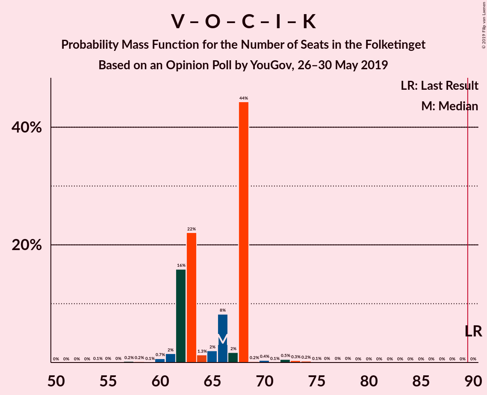

# Opinion Poll by YouGov, 26–30 May 2019

<a href="#voting-intentions">Voting Intentions</a> | <a href="#seats">Seats</a> | <a href="#coalitions">Coalitions</a> | <a href="#technical-information">Technical Information</a>

## Voting Intentions

### Confidence Intervals

| Party | Last Result | Poll Result | 80% Confidence Interval | 90% Confidence Interval | 95% Confidence Interval | 99% Confidence Interval |
|:-----:|:-----------:|:-----------:|:-----------------------:|:-----------------------:|:-----------------------:|:-----------------------:|
| Socialdemokraterne | 26.3% | 28.0% | 26.2–29.9% |25.7–30.5% |25.3–30.9% |24.4–31.8% |
| Venstre | 19.5% | 18.3% | 16.8–20.0% |16.4–20.4% |16.0–20.9% |15.3–21.7% |
| Dansk Folkeparti | 21.1% | 9.5% | 8.4–10.8% |8.1–11.2% |7.8–11.5% |7.3–12.2% |
| Socialistisk Folkeparti | 4.2% | 8.9% | 7.8–10.2% |7.5–10.5% |7.3–10.9% |6.8–11.5% |
| Enhedslisten–De Rød-Grønne | 7.8% | 8.5% | 7.4–9.7% |7.1–10.1% |6.9–10.4% |6.4–11.0% |
| Radikale Venstre | 4.6% | 8.4% | 7.3–9.6% |7.1–10.0% |6.8–10.3% |6.3–10.9% |
| Det Konservative Folkeparti | 3.4% | 5.3% | 4.5–6.4% |4.3–6.6% |4.1–6.9% |3.7–7.4% |
| Nye Borgerlige | 0.0% | 3.5% | 2.8–4.4% |2.7–4.6% |2.5–4.8% |2.2–5.3% |
| Liberal Alliance | 7.5% | 2.6% | 2.0–3.3% |1.9–3.6% |1.7–3.7% |1.5–4.2% |
| Alternativet | 4.8% | 2.6% | 2.0–3.3% |1.9–3.6% |1.7–3.7% |1.5–4.2% |
| Stram Kurs | 0.0% | 2.4% | 1.8–3.1% |1.7–3.3% |1.6–3.5% |1.4–3.9% |
| Kristendemokraterne | 0.8% | 1.3% | 1.0–1.9% |0.9–2.1% |0.8–2.3% |0.6–2.6% |
| Klaus Riskær Pedersen | 0.0% | 0.7% | 0.5–1.2% |0.4–1.3% |0.4–1.5% |0.3–1.8% |

*Note:* The poll result column reflects the actual value used in the calculations. Published results may vary slightly, and in addition be rounded to fewer digits.

## Seats

### Confidence Intervals

| Party | Last Result | Median | 80% Confidence Interval | 90% Confidence Interval | 95% Confidence Interval | 99% Confidence Interval |
|:-----:|:-----------:|:------:|:-----------------------:|:-----------------------:|:-----------------------:|:-----------------------:|
| <a href="#socialdemokraterne">Socialdemokraterne</a> | 47 | 49 | 45–55 |45–55 |45–55 |44–55 |
| <a href="#venstre">Venstre</a> | 34 | 34 | 31–36 |31–36 |29–36 |28–37 |
| <a href="#dansk-folkeparti">Dansk Folkeparti</a> | 37 | 18 | 16–19 |15–21 |15–21 |13–21 |
| <a href="#socialistisk-folkeparti">Socialistisk Folkeparti</a> | 7 | 17 | 14–18 |13–18 |13–19 |12–20 |
| <a href="#enhedslisten–de-rød-grønne">Enhedslisten–De Rød-Grønne</a> | 14 | 16 | 14–18 |13–18 |12–18 |11–19 |
| <a href="#radikale-venstre">Radikale Venstre</a> | 8 | 14 | 13–16 |13–17 |13–17 |12–19 |
| <a href="#det-konservative-folkeparti">Det Konservative Folkeparti</a> | 6 | 9 | 9–10 |9–11 |9–12 |8–13 |
| <a href="#nye-borgerlige">Nye Borgerlige</a> | 0 | 6 | 5–7 |5–7 |5–8 |4–9 |
| <a href="#liberal-alliance">Liberal Alliance</a> | 13 | 4 | 4–5 |0–6 |0–6 |0–7 |
| <a href="#alternativet">Alternativet</a> | 9 | 4 | 0–6 |0–6 |0–6 |0–7 |
| <a href="#stram-kurs">Stram Kurs</a> | 0 | 4 | 4–6 |4–6 |0–6 |0–6 |
| <a href="#kristendemokraterne">Kristendemokraterne</a> | 0 | 0 | 0–4 |0–4 |0–4 |0–4 |
| <a href="#klaus-riskær-pedersen">Klaus Riskær Pedersen</a> | 0 | 0 | 0 |0 |0 |0 |

### Socialdemokraterne

*For a full overview of the results for this party, see the [Socialdemokraterne](party-socialdemokraterne.html) page.*

| Number of Seats | Probability | Accumulated | Special Marks |
|:---------------:|:-----------:|:-----------:|:-------------:|
| 43 | 0.1% | 100% |  |
| 44 | 0.4% | 99.9% |  |
| 45 | 12% | 99.5% |  |
| 46 | 31% | 88% |  |
| 47 | 2% | 57% | Last Result |
| 48 | 2% | 55% |  |
| 49 | 6% | 53% | Median |
| 50 | 2% | 47% |  |
| 51 | 23% | 45% |  |
| 52 | 1.1% | 22% |  |
| 53 | 4% | 21% |  |
| 54 | 2% | 17% |  |
| 55 | 15% | 15% |  |
| 56 | 0.3% | 0.4% |  |
| 57 | 0% | 0.1% |  |
| 58 | 0% | 0.1% |  |
| 59 | 0% | 0.1% |  |
| 60 | 0% | 0% |  |

### Venstre

*For a full overview of the results for this party, see the [Venstre](party-venstre.html) page.*

| Number of Seats | Probability | Accumulated | Special Marks |
|:---------------:|:-----------:|:-----------:|:-------------:|
| 26 | 0.3% | 100% |  |
| 27 | 0.1% | 99.6% |  |
| 28 | 0.5% | 99.6% |  |
| 29 | 2% | 99.0% |  |
| 30 | 2% | 97% |  |
| 31 | 20% | 96% |  |
| 32 | 24% | 76% |  |
| 33 | 2% | 52% |  |
| 34 | 5% | 51% | Last Result, Median |
| 35 | 3% | 46% |  |
| 36 | 42% | 43% |  |
| 37 | 0.6% | 0.9% |  |
| 38 | 0% | 0.3% |  |
| 39 | 0.3% | 0.3% |  |
| 40 | 0% | 0% |  |

### Dansk Folkeparti

*For a full overview of the results for this party, see the [Dansk Folkeparti](party-danskfolkeparti.html) page.*

| Number of Seats | Probability | Accumulated | Special Marks |
|:---------------:|:-----------:|:-----------:|:-------------:|
| 12 | 0.3% | 100% |  |
| 13 | 0.2% | 99.7% |  |
| 14 | 1.1% | 99.4% |  |
| 15 | 6% | 98% |  |
| 16 | 3% | 92% |  |
| 17 | 19% | 89% |  |
| 18 | 21% | 70% | Median |
| 19 | 43% | 49% |  |
| 20 | 0.4% | 6% |  |
| 21 | 5% | 6% |  |
| 22 | 0.1% | 0.3% |  |
| 23 | 0.2% | 0.2% |  |
| 24 | 0% | 0% |  |
| 25 | 0% | 0% |  |
| 26 | 0% | 0% |  |
| 27 | 0% | 0% |  |
| 28 | 0% | 0% |  |
| 29 | 0% | 0% |  |
| 30 | 0% | 0% |  |
| 31 | 0% | 0% |  |
| 32 | 0% | 0% |  |
| 33 | 0% | 0% |  |
| 34 | 0% | 0% |  |
| 35 | 0% | 0% |  |
| 36 | 0% | 0% |  |
| 37 | 0% | 0% | Last Result |

### Socialistisk Folkeparti

*For a full overview of the results for this party, see the [Socialistisk Folkeparti](party-socialistiskfolkeparti.html) page.*

| Number of Seats | Probability | Accumulated | Special Marks |
|:---------------:|:-----------:|:-----------:|:-------------:|
| 7 | 0% | 100% | Last Result |
| 8 | 0% | 100% |  |
| 9 | 0% | 100% |  |
| 10 | 0% | 100% |  |
| 11 | 0.3% | 100% |  |
| 12 | 0.6% | 99.7% |  |
| 13 | 6% | 99.1% |  |
| 14 | 5% | 93% |  |
| 15 | 2% | 88% |  |
| 16 | 32% | 87% |  |
| 17 | 31% | 54% | Median |
| 18 | 21% | 24% |  |
| 19 | 1.1% | 3% |  |
| 20 | 2% | 2% |  |
| 21 | 0.1% | 0.1% |  |
| 22 | 0% | 0% |  |

### Enhedslisten–De Rød-Grønne

*For a full overview of the results for this party, see the [Enhedslisten–De Rød-Grønne](party-enhedslisten–derød-grønne.html) page.*

| Number of Seats | Probability | Accumulated | Special Marks |
|:---------------:|:-----------:|:-----------:|:-------------:|
| 10 | 0.1% | 100% |  |
| 11 | 0.8% | 99.9% |  |
| 12 | 2% | 99.2% |  |
| 13 | 6% | 97% |  |
| 14 | 36% | 92% | Last Result |
| 15 | 4% | 56% |  |
| 16 | 18% | 51% | Median |
| 17 | 1.1% | 33% |  |
| 18 | 31% | 32% |  |
| 19 | 1.1% | 1.3% |  |
| 20 | 0.2% | 0.2% |  |
| 21 | 0% | 0% |  |

### Radikale Venstre

*For a full overview of the results for this party, see the [Radikale Venstre](party-radikalevenstre.html) page.*

| Number of Seats | Probability | Accumulated | Special Marks |
|:---------------:|:-----------:|:-----------:|:-------------:|
| 8 | 0% | 100% | Last Result |
| 9 | 0% | 100% |  |
| 10 | 0.1% | 100% |  |
| 11 | 0.3% | 99.9% |  |
| 12 | 1.2% | 99.5% |  |
| 13 | 19% | 98% |  |
| 14 | 31% | 79% | Median |
| 15 | 8% | 48% |  |
| 16 | 32% | 40% |  |
| 17 | 7% | 8% |  |
| 18 | 0.8% | 1.4% |  |
| 19 | 0.3% | 0.6% |  |
| 20 | 0.2% | 0.2% |  |
| 21 | 0% | 0% |  |

### Det Konservative Folkeparti

*For a full overview of the results for this party, see the [Det Konservative Folkeparti](party-detkonservativefolkeparti.html) page.*

| Number of Seats | Probability | Accumulated | Special Marks |
|:---------------:|:-----------:|:-----------:|:-------------:|
| 6 | 0.2% | 100% | Last Result |
| 7 | 0.2% | 99.8% |  |
| 8 | 2% | 99.5% |  |
| 9 | 86% | 98% | Median |
| 10 | 3% | 12% |  |
| 11 | 4% | 9% |  |
| 12 | 3% | 4% |  |
| 13 | 0.6% | 1.1% |  |
| 14 | 0.4% | 0.5% |  |
| 15 | 0% | 0% |  |

### Nye Borgerlige

*For a full overview of the results for this party, see the [Nye Borgerlige](party-nyeborgerlige.html) page.*

| Number of Seats | Probability | Accumulated | Special Marks |
|:---------------:|:-----------:|:-----------:|:-------------:|
| 0 | 0% | 100% | Last Result |
| 1 | 0% | 100% |  |
| 2 | 0% | 100% |  |
| 3 | 0% | 100% |  |
| 4 | 0.7% | 100% |  |
| 5 | 38% | 99.3% |  |
| 6 | 44% | 61% | Median |
| 7 | 15% | 17% |  |
| 8 | 2% | 3% |  |
| 9 | 0.7% | 1.0% |  |
| 10 | 0.3% | 0.3% |  |
| 11 | 0% | 0% |  |

### Liberal Alliance

*For a full overview of the results for this party, see the [Liberal Alliance](party-liberalalliance.html) page.*

| Number of Seats | Probability | Accumulated | Special Marks |
|:---------------:|:-----------:|:-----------:|:-------------:|
| 0 | 8% | 100% |  |
| 1 | 0% | 92% |  |
| 2 | 0% | 92% |  |
| 3 | 0% | 92% |  |
| 4 | 60% | 92% | Median |
| 5 | 23% | 33% |  |
| 6 | 9% | 9% |  |
| 7 | 0.5% | 0.5% |  |
| 8 | 0% | 0% |  |
| 9 | 0% | 0% |  |
| 10 | 0% | 0% |  |
| 11 | 0% | 0% |  |
| 12 | 0% | 0% |  |
| 13 | 0% | 0% | Last Result |

### Alternativet

*For a full overview of the results for this party, see the [Alternativet](party-alternativet.html) page.*

| Number of Seats | Probability | Accumulated | Special Marks |
|:---------------:|:-----------:|:-----------:|:-------------:|
| 0 | 35% | 100% |  |
| 1 | 0% | 65% |  |
| 2 | 0% | 65% |  |
| 3 | 0% | 65% |  |
| 4 | 37% | 65% | Median |
| 5 | 6% | 27% |  |
| 6 | 20% | 21% |  |
| 7 | 1.3% | 1.4% |  |
| 8 | 0.2% | 0.2% |  |
| 9 | 0% | 0% | Last Result |

### Stram Kurs

*For a full overview of the results for this party, see the [Stram Kurs](party-stramkurs.html) page.*

| Number of Seats | Probability | Accumulated | Special Marks |
|:---------------:|:-----------:|:-----------:|:-------------:|
| 0 | 3% | 100% | Last Result |
| 1 | 0% | 97% |  |
| 2 | 0% | 97% |  |
| 3 | 0% | 97% |  |
| 4 | 57% | 97% | Median |
| 5 | 19% | 40% |  |
| 6 | 21% | 21% |  |
| 7 | 0.1% | 0.2% |  |
| 8 | 0.1% | 0.1% |  |
| 9 | 0% | 0% |  |

### Kristendemokraterne

*For a full overview of the results for this party, see the [Kristendemokraterne](party-kristendemokraterne.html) page.*

| Number of Seats | Probability | Accumulated | Special Marks |
|:---------------:|:-----------:|:-----------:|:-------------:|
| 0 | 89% | 100% | Last Result, Median |
| 1 | 0% | 11% |  |
| 2 | 0% | 11% |  |
| 3 | 0% | 11% |  |
| 4 | 11% | 11% |  |
| 5 | 0.4% | 0.4% |  |
| 6 | 0% | 0% |  |

### Klaus Riskær Pedersen

*For a full overview of the results for this party, see the [Klaus Riskær Pedersen](party-klausriskærpedersen.html) page.*

| Number of Seats | Probability | Accumulated | Special Marks |
|:---------------:|:-----------:|:-----------:|:-------------:|
| 0 | 99.7% | 100% | Last Result, Median |
| 1 | 0% | 0.3% |  |
| 2 | 0% | 0.3% |  |
| 3 | 0% | 0.3% |  |
| 4 | 0.3% | 0.3% |  |
| 5 | 0% | 0% |  |

## Coalitions

### Confidence Intervals

| Coalition | Last Result | Median | Majority? | 80% Confidence Interval | 90% Confidence Interval | 95% Confidence Interval | 99% Confidence Interval |
|:---------:|:-----------:|:------:|:---------:|:-----------------------:|:-----------------------:|:-----------------------:|:-----------------------:|
| Socialdemokraterne – Socialistisk Folkeparti – Enhedslisten–De Rød-Grønne – Radikale Venstre – Alternativet | 85 | 98 | 100% | 95–104 | 95–104 | 95–104 | 94–106 |
| Socialdemokraterne – Socialistisk Folkeparti – Enhedslisten–De Rød-Grønne – Radikale Venstre | 76 | 97 | 89% | 89–100 | 89–100 | 89–100 | 89–101 |
| Socialdemokraterne – Socialistisk Folkeparti – Enhedslisten–De Rød-Grønne – Alternativet | 77 | 84 | 15% | 81–91 | 81–91 | 80–91 | 78–91 |
| Socialdemokraterne – Socialistisk Folkeparti – Enhedslisten–De Rød-Grønne | 68 | 81 | 0.1% | 75–87 | 75–87 | 75–87 | 75–87 |
| Socialdemokraterne – Socialistisk Folkeparti – Radikale Venstre | 62 | 80 | 0.1% | 75–84 | 75–84 | 75–85 | 75–86 |
| Venstre – Dansk Folkeparti – Det Konservative Folkeparti – Nye Borgerlige – Liberal Alliance – Stram Kurs – Kristendemokraterne – Klaus Riskær Pedersen | 90 | 77 | 0% | 71–80 | 71–80 | 71–80 | 69–81 |
| Venstre – Dansk Folkeparti – Det Konservative Folkeparti – Nye Borgerlige – Liberal Alliance – Kristendemokraterne – Klaus Riskær Pedersen | 90 | 72 | 0% | 67–75 | 67–75 | 67–75 | 65–80 |
| Venstre – Dansk Folkeparti – Det Konservative Folkeparti – Nye Borgerlige – Liberal Alliance – Kristendemokraterne | 90 | 72 | 0% | 67–75 | 67–75 | 67–75 | 65–80 |
| Venstre – Dansk Folkeparti – Det Konservative Folkeparti – Nye Borgerlige – Liberal Alliance – Klaus Riskær Pedersen | 90 | 70 | 0% | 67–75 | 67–75 | 66–75 | 64–80 |
| Venstre – Dansk Folkeparti – Det Konservative Folkeparti – Nye Borgerlige – Liberal Alliance | 90 | 70 | 0% | 67–75 | 67–75 | 66–75 | 64–80 |
| Socialdemokraterne – Radikale Venstre | 55 | 64 | 0% | 59–68 | 59–69 | 59–70 | 59–71 |
| Venstre – Dansk Folkeparti – Det Konservative Folkeparti – Liberal Alliance – Kristendemokraterne | 90 | 66 | 0% | 62–68 | 62–68 | 61–68 | 59–73 |
| Venstre – Dansk Folkeparti – Det Konservative Folkeparti – Liberal Alliance | 90 | 63 | 0% | 62–68 | 62–68 | 61–68 | 58–73 |
| Venstre – Det Konservative Folkeparti – Liberal Alliance | 53 | 47 | 0% | 45–49 | 41–51 | 41–51 | 40–54 |
| Venstre – Det Konservative Folkeparti | 40 | 44 | 0% | 40–45 | 40–45 | 39–46 | 37–49 |
| Venstre | 34 | 34 | 0% | 31–36 | 31–36 | 29–36 | 28–37 |

### Socialdemokraterne – Socialistisk Folkeparti – Enhedslisten–De Rød-Grønne – Radikale Venstre – Alternativet

| Number of Seats | Probability | Accumulated | Special Marks |
|:---------------:|:-----------:|:-----------:|:-------------:|
| 85 | 0% | 100% | Last Result |
| 86 | 0% | 100% |  |
| 87 | 0% | 100% |  |
| 88 | 0% | 100% |  |
| 89 | 0% | 100% |  |
| 90 | 0.1% | 100% | Majority |
| 91 | 0% | 99.9% |  |
| 92 | 0.2% | 99.9% |  |
| 93 | 0.1% | 99.8% |  |
| 94 | 0.4% | 99.6% |  |
| 95 | 11% | 99.2% |  |
| 96 | 0.8% | 88% |  |
| 97 | 35% | 88% |  |
| 98 | 5% | 52% |  |
| 99 | 6% | 48% |  |
| 100 | 1.1% | 42% | Median |
| 101 | 20% | 41% |  |
| 102 | 3% | 21% |  |
| 103 | 0.7% | 18% |  |
| 104 | 16% | 18% |  |
| 105 | 0.2% | 1.4% |  |
| 106 | 0.8% | 1.2% |  |
| 107 | 0.2% | 0.4% |  |
| 108 | 0.1% | 0.2% |  |
| 109 | 0.1% | 0.1% |  |
| 110 | 0% | 0% |  |

### Socialdemokraterne – Socialistisk Folkeparti – Enhedslisten–De Rød-Grønne – Radikale Venstre

| Number of Seats | Probability | Accumulated | Special Marks |
|:---------------:|:-----------:|:-----------:|:-------------:|
| 76 | 0% | 100% | Last Result |
| 77 | 0% | 100% |  |
| 78 | 0% | 100% |  |
| 79 | 0% | 100% |  |
| 80 | 0% | 100% |  |
| 81 | 0% | 100% |  |
| 82 | 0% | 100% |  |
| 83 | 0% | 100% |  |
| 84 | 0% | 100% |  |
| 85 | 0% | 100% |  |
| 86 | 0.1% | 100% |  |
| 87 | 0% | 99.9% |  |
| 88 | 0.1% | 99.9% |  |
| 89 | 11% | 99.8% |  |
| 90 | 2% | 89% | Majority |
| 91 | 0.3% | 87% |  |
| 92 | 0.7% | 87% |  |
| 93 | 8% | 86% |  |
| 94 | 1.3% | 78% |  |
| 95 | 0.6% | 77% |  |
| 96 | 3% | 76% | Median |
| 97 | 53% | 73% |  |
| 98 | 0.7% | 19% |  |
| 99 | 2% | 19% |  |
| 100 | 15% | 16% |  |
| 101 | 0.5% | 0.9% |  |
| 102 | 0.1% | 0.5% |  |
| 103 | 0.3% | 0.4% |  |
| 104 | 0% | 0.1% |  |
| 105 | 0% | 0.1% |  |
| 106 | 0% | 0% |  |

### Socialdemokraterne – Socialistisk Folkeparti – Enhedslisten–De Rød-Grønne – Alternativet

| Number of Seats | Probability | Accumulated | Special Marks |
|:---------------:|:-----------:|:-----------:|:-------------:|
| 76 | 0.1% | 100% |  |
| 77 | 0.4% | 99.9% | Last Result |
| 78 | 0.1% | 99.5% |  |
| 79 | 0.2% | 99.4% |  |
| 80 | 3% | 99.3% |  |
| 81 | 42% | 96% |  |
| 82 | 0.8% | 54% |  |
| 83 | 3% | 54% |  |
| 84 | 6% | 51% |  |
| 85 | 6% | 45% |  |
| 86 | 0.6% | 39% | Median |
| 87 | 20% | 38% |  |
| 88 | 0.8% | 18% |  |
| 89 | 2% | 18% |  |
| 90 | 0.3% | 15% | Majority |
| 91 | 15% | 15% |  |
| 92 | 0.3% | 0.4% |  |
| 93 | 0.1% | 0.2% |  |
| 94 | 0% | 0.1% |  |
| 95 | 0.1% | 0.1% |  |
| 96 | 0% | 0% |  |

### Socialdemokraterne – Socialistisk Folkeparti – Enhedslisten–De Rød-Grønne

| Number of Seats | Probability | Accumulated | Special Marks |
|:---------------:|:-----------:|:-----------:|:-------------:|
| 68 | 0% | 100% | Last Result |
| 69 | 0% | 100% |  |
| 70 | 0% | 100% |  |
| 71 | 0% | 100% |  |
| 72 | 0.1% | 100% |  |
| 73 | 0.2% | 99.8% |  |
| 74 | 0.1% | 99.7% |  |
| 75 | 11% | 99.6% |  |
| 76 | 1.4% | 89% |  |
| 77 | 2% | 88% |  |
| 78 | 5% | 85% |  |
| 79 | 3% | 80% |  |
| 80 | 7% | 78% |  |
| 81 | 31% | 71% |  |
| 82 | 0.5% | 40% | Median |
| 83 | 21% | 39% |  |
| 84 | 3% | 18% |  |
| 85 | 0.4% | 16% |  |
| 86 | 0.5% | 15% |  |
| 87 | 15% | 15% |  |
| 88 | 0% | 0.2% |  |
| 89 | 0.1% | 0.2% |  |
| 90 | 0.1% | 0.1% | Majority |
| 91 | 0% | 0% |  |

### Socialdemokraterne – Socialistisk Folkeparti – Radikale Venstre

| Number of Seats | Probability | Accumulated | Special Marks |
|:---------------:|:-----------:|:-----------:|:-------------:|
| 62 | 0% | 100% | Last Result |
| 63 | 0% | 100% |  |
| 64 | 0% | 100% |  |
| 65 | 0% | 100% |  |
| 66 | 0% | 100% |  |
| 67 | 0% | 100% |  |
| 68 | 0% | 100% |  |
| 69 | 0% | 100% |  |
| 70 | 0.1% | 100% |  |
| 71 | 0% | 99.9% |  |
| 72 | 0% | 99.9% |  |
| 73 | 0.2% | 99.9% |  |
| 74 | 0.1% | 99.7% |  |
| 75 | 11% | 99.7% |  |
| 76 | 2% | 89% |  |
| 77 | 0.7% | 87% |  |
| 78 | 4% | 86% |  |
| 79 | 31% | 82% |  |
| 80 | 7% | 51% | Median |
| 81 | 1.2% | 44% |  |
| 82 | 2% | 43% |  |
| 83 | 23% | 41% |  |
| 84 | 15% | 18% |  |
| 85 | 2% | 3% |  |
| 86 | 0.1% | 0.6% |  |
| 87 | 0.1% | 0.4% |  |
| 88 | 0.1% | 0.3% |  |
| 89 | 0.2% | 0.3% |  |
| 90 | 0% | 0.1% | Majority |
| 91 | 0% | 0.1% |  |
| 92 | 0% | 0% |  |

### Venstre – Dansk Folkeparti – Det Konservative Folkeparti – Nye Borgerlige – Liberal Alliance – Stram Kurs – Kristendemokraterne – Klaus Riskær Pedersen

| Number of Seats | Probability | Accumulated | Special Marks |
|:---------------:|:-----------:|:-----------:|:-------------:|
| 66 | 0.1% | 100% |  |
| 67 | 0.1% | 99.9% |  |
| 68 | 0.2% | 99.8% |  |
| 69 | 0.8% | 99.6% |  |
| 70 | 0.2% | 98.8% |  |
| 71 | 16% | 98.6% |  |
| 72 | 0.7% | 82% |  |
| 73 | 3% | 82% |  |
| 74 | 20% | 79% |  |
| 75 | 1.1% | 59% | Median |
| 76 | 6% | 58% |  |
| 77 | 5% | 52% |  |
| 78 | 35% | 48% |  |
| 79 | 0.8% | 12% |  |
| 80 | 11% | 12% |  |
| 81 | 0.4% | 0.8% |  |
| 82 | 0.1% | 0.4% |  |
| 83 | 0.2% | 0.2% |  |
| 84 | 0% | 0.1% |  |
| 85 | 0.1% | 0.1% |  |
| 86 | 0% | 0% |  |
| 87 | 0% | 0% |  |
| 88 | 0% | 0% |  |
| 89 | 0% | 0% |  |
| 90 | 0% | 0% | Last Result, Majority |

### Venstre – Dansk Folkeparti – Det Konservative Folkeparti – Nye Borgerlige – Liberal Alliance – Kristendemokraterne – Klaus Riskær Pedersen

| Number of Seats | Probability | Accumulated | Special Marks |
|:---------------:|:-----------:|:-----------:|:-------------:|
| 62 | 0.1% | 100% |  |
| 63 | 0% | 99.8% |  |
| 64 | 0.2% | 99.8% |  |
| 65 | 0.1% | 99.6% |  |
| 66 | 1.3% | 99.5% |  |
| 67 | 15% | 98% |  |
| 68 | 21% | 83% |  |
| 69 | 1.2% | 62% |  |
| 70 | 2% | 61% |  |
| 71 | 1.0% | 59% | Median |
| 72 | 10% | 58% |  |
| 73 | 1.3% | 48% |  |
| 74 | 35% | 47% |  |
| 75 | 11% | 12% |  |
| 76 | 0.4% | 2% |  |
| 77 | 0.4% | 1.2% |  |
| 78 | 0.1% | 0.8% |  |
| 79 | 0.2% | 0.7% |  |
| 80 | 0.2% | 0.6% |  |
| 81 | 0.3% | 0.4% |  |
| 82 | 0% | 0% |  |
| 83 | 0% | 0% |  |
| 84 | 0% | 0% |  |
| 85 | 0% | 0% |  |
| 86 | 0% | 0% |  |
| 87 | 0% | 0% |  |
| 88 | 0% | 0% |  |
| 89 | 0% | 0% |  |
| 90 | 0% | 0% | Last Result, Majority |

### Venstre – Dansk Folkeparti – Det Konservative Folkeparti – Nye Borgerlige – Liberal Alliance – Kristendemokraterne

| Number of Seats | Probability | Accumulated | Special Marks |
|:---------------:|:-----------:|:-----------:|:-------------:|
| 62 | 0.1% | 100% |  |
| 63 | 0% | 99.8% |  |
| 64 | 0.2% | 99.8% |  |
| 65 | 0.1% | 99.6% |  |
| 66 | 1.3% | 99.5% |  |
| 67 | 15% | 98% |  |
| 68 | 21% | 83% |  |
| 69 | 1.2% | 62% |  |
| 70 | 2% | 61% |  |
| 71 | 1.1% | 59% | Median |
| 72 | 10% | 58% |  |
| 73 | 1.3% | 48% |  |
| 74 | 35% | 47% |  |
| 75 | 11% | 12% |  |
| 76 | 0.4% | 2% |  |
| 77 | 0.4% | 1.2% |  |
| 78 | 0.1% | 0.8% |  |
| 79 | 0.2% | 0.7% |  |
| 80 | 0.2% | 0.6% |  |
| 81 | 0.3% | 0.4% |  |
| 82 | 0% | 0% |  |
| 83 | 0% | 0% |  |
| 84 | 0% | 0% |  |
| 85 | 0% | 0% |  |
| 86 | 0% | 0% |  |
| 87 | 0% | 0% |  |
| 88 | 0% | 0% |  |
| 89 | 0% | 0% |  |
| 90 | 0% | 0% | Last Result, Majority |

### Venstre – Dansk Folkeparti – Det Konservative Folkeparti – Nye Borgerlige – Liberal Alliance – Klaus Riskær Pedersen

| Number of Seats | Probability | Accumulated | Special Marks |
|:---------------:|:-----------:|:-----------:|:-------------:|
| 62 | 0.1% | 100% |  |
| 63 | 0% | 99.8% |  |
| 64 | 0.5% | 99.8% |  |
| 65 | 0.8% | 99.3% |  |
| 66 | 2% | 98.6% |  |
| 67 | 15% | 97% |  |
| 68 | 29% | 82% |  |
| 69 | 0.7% | 53% |  |
| 70 | 3% | 52% |  |
| 71 | 0.8% | 49% | Median |
| 72 | 2% | 49% |  |
| 73 | 1.1% | 47% |  |
| 74 | 34% | 46% |  |
| 75 | 11% | 12% |  |
| 76 | 0.3% | 1.3% |  |
| 77 | 0.4% | 1.0% |  |
| 78 | 0.1% | 0.6% |  |
| 79 | 0% | 0.6% |  |
| 80 | 0.2% | 0.6% |  |
| 81 | 0.3% | 0.4% |  |
| 82 | 0% | 0% |  |
| 83 | 0% | 0% |  |
| 84 | 0% | 0% |  |
| 85 | 0% | 0% |  |
| 86 | 0% | 0% |  |
| 87 | 0% | 0% |  |
| 88 | 0% | 0% |  |
| 89 | 0% | 0% |  |
| 90 | 0% | 0% | Last Result, Majority |

### Venstre – Dansk Folkeparti – Det Konservative Folkeparti – Nye Borgerlige – Liberal Alliance

| Number of Seats | Probability | Accumulated | Special Marks |
|:---------------:|:-----------:|:-----------:|:-------------:|
| 62 | 0.1% | 100% |  |
| 63 | 0% | 99.8% |  |
| 64 | 0.5% | 99.8% |  |
| 65 | 0.8% | 99.3% |  |
| 66 | 2% | 98.6% |  |
| 67 | 15% | 97% |  |
| 68 | 29% | 82% |  |
| 69 | 0.7% | 53% |  |
| 70 | 3% | 52% |  |
| 71 | 0.9% | 49% | Median |
| 72 | 2% | 48% |  |
| 73 | 1.1% | 47% |  |
| 74 | 33% | 45% |  |
| 75 | 11% | 12% |  |
| 76 | 0.3% | 1.3% |  |
| 77 | 0.4% | 1.0% |  |
| 78 | 0.1% | 0.6% |  |
| 79 | 0% | 0.6% |  |
| 80 | 0.2% | 0.6% |  |
| 81 | 0.3% | 0.4% |  |
| 82 | 0% | 0% |  |
| 83 | 0% | 0% |  |
| 84 | 0% | 0% |  |
| 85 | 0% | 0% |  |
| 86 | 0% | 0% |  |
| 87 | 0% | 0% |  |
| 88 | 0% | 0% |  |
| 89 | 0% | 0% |  |
| 90 | 0% | 0% | Last Result, Majority |

### Socialdemokraterne – Radikale Venstre

| Number of Seats | Probability | Accumulated | Special Marks |
|:---------------:|:-----------:|:-----------:|:-------------:|
| 55 | 0.1% | 100% | Last Result |
| 56 | 0% | 99.9% |  |
| 57 | 0.4% | 99.9% |  |
| 58 | 0% | 99.5% |  |
| 59 | 11% | 99.5% |  |
| 60 | 1.1% | 89% |  |
| 61 | 1.0% | 88% |  |
| 62 | 32% | 87% |  |
| 63 | 0.5% | 55% | Median |
| 64 | 9% | 54% |  |
| 65 | 20% | 45% |  |
| 66 | 2% | 25% |  |
| 67 | 2% | 23% |  |
| 68 | 15% | 21% |  |
| 69 | 2% | 6% |  |
| 70 | 3% | 4% |  |
| 71 | 0.3% | 0.8% |  |
| 72 | 0.4% | 0.5% |  |
| 73 | 0.1% | 0.1% |  |
| 74 | 0% | 0% |  |

### Venstre – Dansk Folkeparti – Det Konservative Folkeparti – Liberal Alliance – Kristendemokraterne

| Number of Seats | Probability | Accumulated | Special Marks |
|:---------------:|:-----------:|:-----------:|:-------------:|
| 54 | 0.1% | 100% |  |
| 55 | 0% | 99.9% |  |
| 56 | 0% | 99.9% |  |
| 57 | 0.2% | 99.9% |  |
| 58 | 0.2% | 99.7% |  |
| 59 | 0.1% | 99.5% |  |
| 60 | 0.7% | 99.5% |  |
| 61 | 2% | 98.8% |  |
| 62 | 16% | 97% |  |
| 63 | 22% | 81% |  |
| 64 | 1.3% | 59% |  |
| 65 | 2% | 58% | Median |
| 66 | 8% | 56% |  |
| 67 | 2% | 48% |  |
| 68 | 44% | 46% |  |
| 69 | 0.2% | 2% |  |
| 70 | 0.4% | 2% |  |
| 71 | 0.1% | 1.2% |  |
| 72 | 0.5% | 1.2% |  |
| 73 | 0.3% | 0.6% |  |
| 74 | 0.2% | 0.3% |  |
| 75 | 0.1% | 0.1% |  |
| 76 | 0% | 0% |  |
| 77 | 0% | 0% |  |
| 78 | 0% | 0% |  |
| 79 | 0% | 0% |  |
| 80 | 0% | 0% |  |
| 81 | 0% | 0% |  |
| 82 | 0% | 0% |  |
| 83 | 0% | 0% |  |
| 84 | 0% | 0% |  |
| 85 | 0% | 0% |  |
| 86 | 0% | 0% |  |
| 87 | 0% | 0% |  |
| 88 | 0% | 0% |  |
| 89 | 0% | 0% |  |
| 90 | 0% | 0% | Last Result, Majority |

### Venstre – Dansk Folkeparti – Det Konservative Folkeparti – Liberal Alliance

| Number of Seats | Probability | Accumulated | Special Marks |
|:---------------:|:-----------:|:-----------:|:-------------:|
| 54 | 0.1% | 100% |  |
| 55 | 0% | 99.9% |  |
| 56 | 0.1% | 99.9% |  |
| 57 | 0.2% | 99.9% |  |
| 58 | 0.4% | 99.7% |  |
| 59 | 0.7% | 99.3% |  |
| 60 | 1.0% | 98.5% |  |
| 61 | 2% | 98% |  |
| 62 | 24% | 96% |  |
| 63 | 23% | 72% |  |
| 64 | 1.1% | 50% |  |
| 65 | 2% | 49% | Median |
| 66 | 0.5% | 47% |  |
| 67 | 0.5% | 46% |  |
| 68 | 44% | 46% |  |
| 69 | 0.1% | 2% |  |
| 70 | 0.4% | 1.5% |  |
| 71 | 0% | 1.0% |  |
| 72 | 0.4% | 1.0% |  |
| 73 | 0.3% | 0.6% |  |
| 74 | 0.2% | 0.2% |  |
| 75 | 0.1% | 0.1% |  |
| 76 | 0% | 0% |  |
| 77 | 0% | 0% |  |
| 78 | 0% | 0% |  |
| 79 | 0% | 0% |  |
| 80 | 0% | 0% |  |
| 81 | 0% | 0% |  |
| 82 | 0% | 0% |  |
| 83 | 0% | 0% |  |
| 84 | 0% | 0% |  |
| 85 | 0% | 0% |  |
| 86 | 0% | 0% |  |
| 87 | 0% | 0% |  |
| 88 | 0% | 0% |  |
| 89 | 0% | 0% |  |
| 90 | 0% | 0% | Last Result, Majority |

### Venstre – Det Konservative Folkeparti – Liberal Alliance

| Number of Seats | Probability | Accumulated | Special Marks |
|:---------------:|:-----------:|:-----------:|:-------------:|
| 39 | 0.3% | 100% |  |
| 40 | 0.2% | 99.6% |  |
| 41 | 5% | 99.4% |  |
| 42 | 1.0% | 95% |  |
| 43 | 0.4% | 94% |  |
| 44 | 2% | 93% |  |
| 45 | 34% | 91% |  |
| 46 | 2% | 57% |  |
| 47 | 5% | 54% | Median |
| 48 | 0.4% | 49% |  |
| 49 | 42% | 49% |  |
| 50 | 2% | 7% |  |
| 51 | 4% | 5% |  |
| 52 | 0.4% | 1.5% |  |
| 53 | 0.5% | 1.1% | Last Result |
| 54 | 0.2% | 0.6% |  |
| 55 | 0.4% | 0.4% |  |
| 56 | 0% | 0% |  |

### Venstre – Det Konservative Folkeparti

| Number of Seats | Probability | Accumulated | Special Marks |
|:---------------:|:-----------:|:-----------:|:-------------:|
| 35 | 0.4% | 100% |  |
| 36 | 0.1% | 99.6% |  |
| 37 | 0.1% | 99.5% |  |
| 38 | 2% | 99.5% |  |
| 39 | 0.5% | 98% |  |
| 40 | 20% | 97% | Last Result |
| 41 | 23% | 77% |  |
| 42 | 3% | 54% |  |
| 43 | 1.0% | 51% | Median |
| 44 | 1.1% | 50% |  |
| 45 | 46% | 49% |  |
| 46 | 0.6% | 3% |  |
| 47 | 1.2% | 2% |  |
| 48 | 0.3% | 1.2% |  |
| 49 | 0.5% | 0.9% |  |
| 50 | 0.4% | 0.4% |  |
| 51 | 0% | 0% |  |

### Venstre

| Number of Seats | Probability | Accumulated | Special Marks |
|:---------------:|:-----------:|:-----------:|:-------------:|
| 26 | 0.3% | 100% |  |
| 27 | 0.1% | 99.6% |  |
| 28 | 0.5% | 99.6% |  |
| 29 | 2% | 99.0% |  |
| 30 | 2% | 97% |  |
| 31 | 20% | 96% |  |
| 32 | 24% | 76% |  |
| 33 | 2% | 52% |  |
| 34 | 5% | 51% | Last Result, Median |
| 35 | 3% | 46% |  |
| 36 | 42% | 43% |  |
| 37 | 0.6% | 0.9% |  |
| 38 | 0% | 0.3% |  |
| 39 | 0.3% | 0.3% |  |
| 40 | 0% | 0% |  |

## Technical Information

### Opinion Poll

+ **Polling firm:** YouGov
+ **Commissioner(s):** —
+ **Fieldwork period:** 26–30 May 2019

### Calculations

+ **Sample size:** 978
+ **Simulations done:** 1,048,576
+ **Error estimate:** 2.90%

