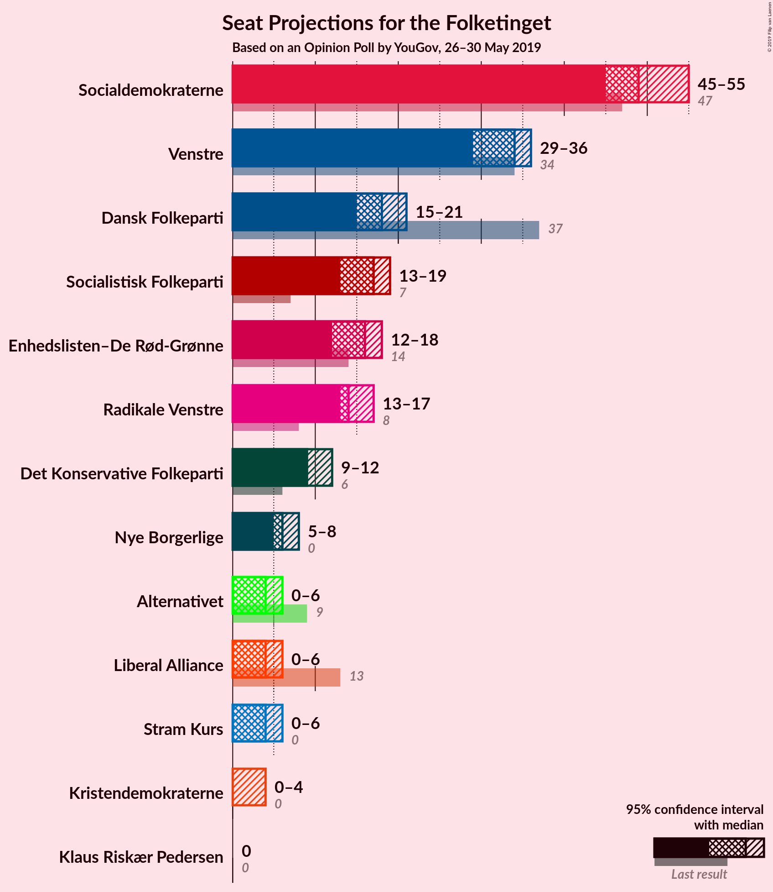
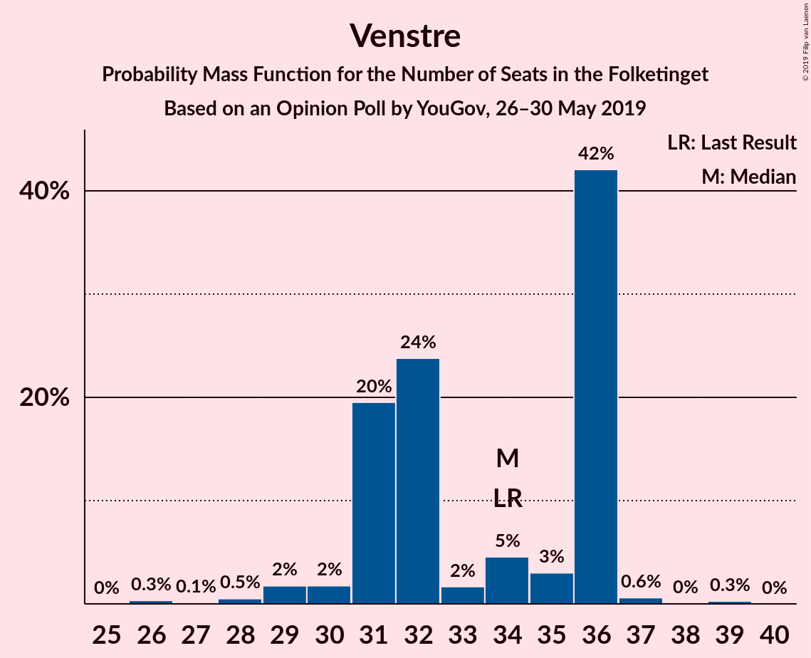
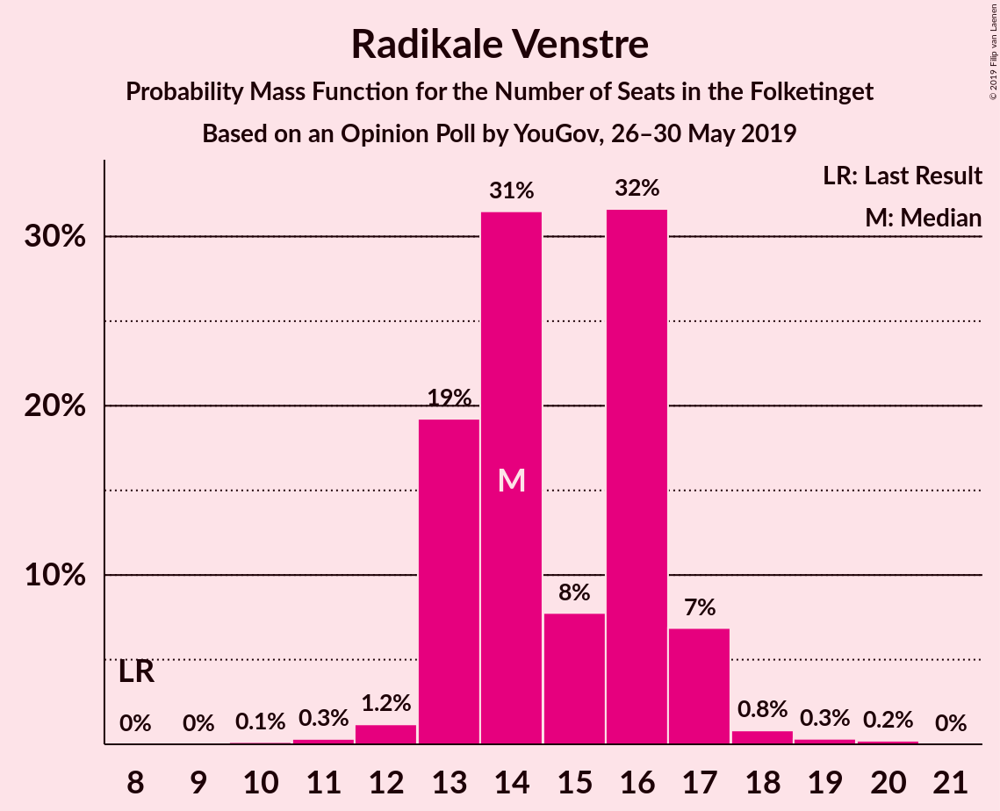
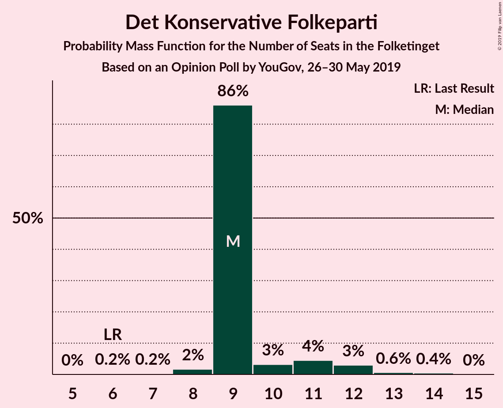
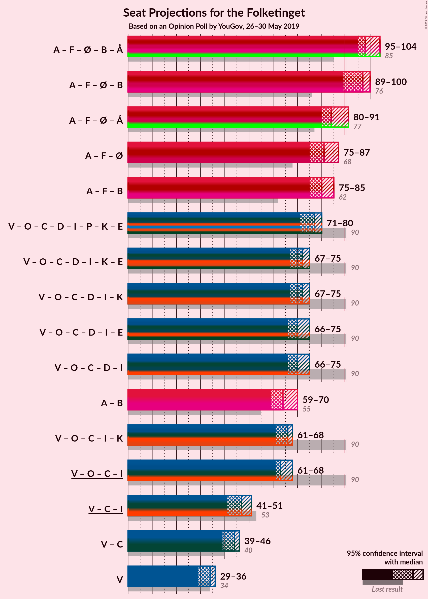
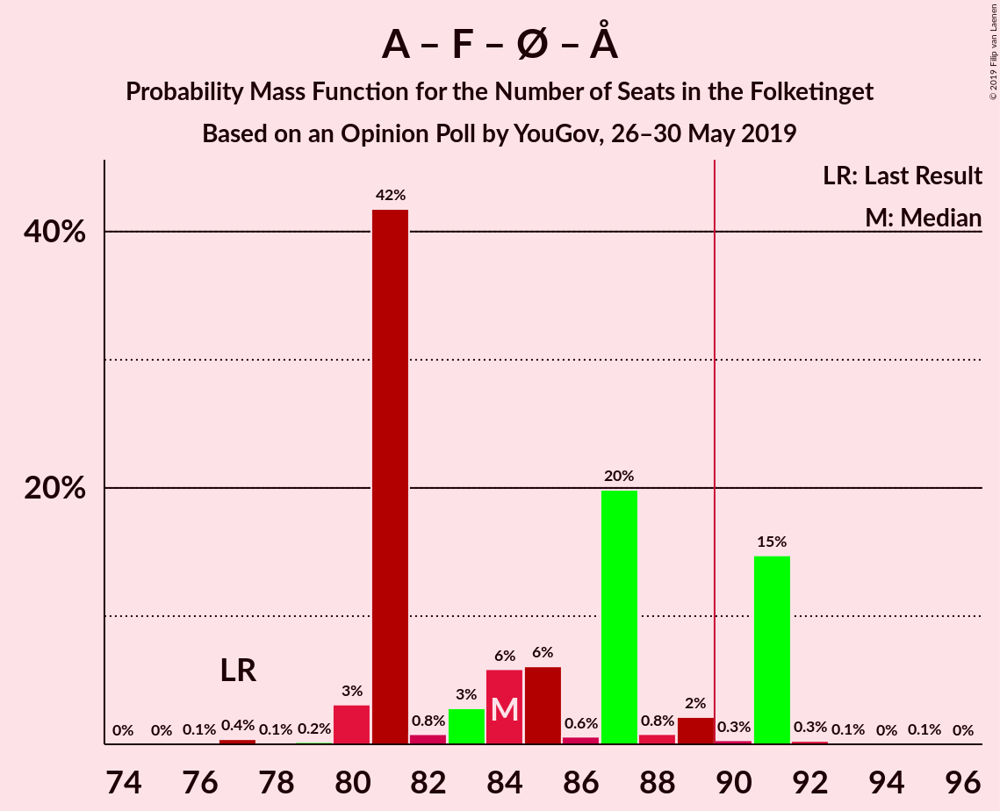
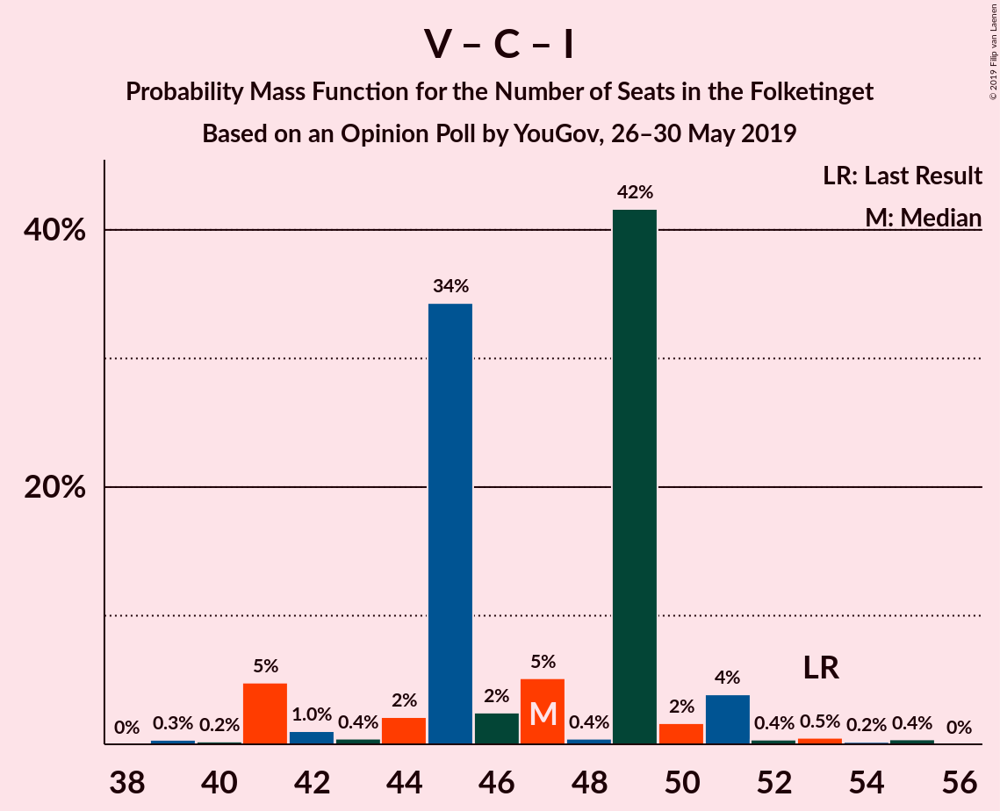

# Opinion Poll by YouGov, 26–30 May 2019

<a href="#voting-intentions">Voting Intentions</a> | <a href="#seats">Seats</a> | <a href="#coalitions">Coalitions</a> | <a href="#technical-information">Technical Information</a>

## Voting Intentions

### Confidence Intervals

| Party | Last Result | Poll Result | 80% Confidence Interval | 90% Confidence Interval | 95% Confidence Interval | 99% Confidence Interval |
|:-----:|:-----------:|:-----------:|:-----------------------:|:-----------------------:|:-----------------------:|:-----------------------:|
| Socialdemokraterne | 26.3% | 28.0% | 26.2–29.9% |25.7–30.5% |25.3–30.9% |24.4–31.8% |
| Venstre | 19.5% | 18.3% | 16.8–20.0% |16.4–20.4% |16.0–20.9% |15.3–21.7% |
| Dansk Folkeparti | 21.1% | 9.5% | 8.4–10.8% |8.1–11.2% |7.8–11.5% |7.3–12.2% |
| Socialistisk Folkeparti | 4.2% | 8.9% | 7.8–10.2% |7.5–10.5% |7.3–10.9% |6.8–11.5% |
| Enhedslisten–De Rød-Grønne | 7.8% | 8.5% | 7.4–9.7% |7.1–10.1% |6.9–10.4% |6.4–11.0% |
| Radikale Venstre | 4.6% | 8.4% | 7.3–9.6% |7.1–10.0% |6.8–10.3% |6.3–10.9% |
| Det Konservative Folkeparti | 3.4% | 5.3% | 4.5–6.4% |4.3–6.6% |4.1–6.9% |3.7–7.4% |
| Nye Borgerlige | 0.0% | 3.5% | 2.8–4.4% |2.7–4.6% |2.5–4.8% |2.2–5.3% |
| Liberal Alliance | 7.5% | 2.6% | 2.0–3.3% |1.9–3.6% |1.7–3.7% |1.5–4.2% |
| Alternativet | 4.8% | 2.6% | 2.0–3.3% |1.9–3.6% |1.7–3.7% |1.5–4.2% |
| Stram Kurs | 0.0% | 2.4% | 1.8–3.1% |1.7–3.3% |1.6–3.5% |1.4–3.9% |
| Kristendemokraterne | 0.8% | 1.3% | 1.0–1.9% |0.9–2.1% |0.8–2.3% |0.6–2.6% |
| Klaus Riskær Pedersen | 0.0% | 0.7% | 0.5–1.2% |0.4–1.3% |0.4–1.5% |0.3–1.8% |

*Note:* The poll result column reflects the actual value used in the calculations. Published results may vary slightly, and in addition be rounded to fewer digits.

## Seats

### Confidence Intervals

| Party | Last Result | Median | 80% Confidence Interval | 90% Confidence Interval | 95% Confidence Interval | 99% Confidence Interval |
|:-----:|:-----------:|:------:|:-----------------------:|:-----------------------:|:-----------------------:|:-----------------------:|
| <a href="#socialdemokraterne">Socialdemokraterne</a> | 47 | 45 | 44–49 |44–50 |44–52 |43–55 |
| <a href="#venstre">Venstre</a> | 34 | 35 | 29–36 |28–36 |28–36 |28–37 |
| <a href="#dansk-folkeparti">Dansk Folkeparti</a> | 37 | 15 | 12–17 |12–17 |12–19 |12–22 |
| <a href="#socialistisk-folkeparti">Socialistisk Folkeparti</a> | 7 | 19 | 13–20 |13–20 |13–20 |12–20 |
| <a href="#enhedslisten–de-rød-grønne">Enhedslisten–De Rød-Grønne</a> | 14 | 14 | 12–19 |12–20 |12–20 |10–20 |
| <a href="#radikale-venstre">Radikale Venstre</a> | 8 | 17 | 13–17 |13–18 |13–19 |12–19 |
| <a href="#det-konservative-folkeparti">Det Konservative Folkeparti</a> | 6 | 10 | 9–11 |9–13 |9–14 |8–14 |
| <a href="#nye-borgerlige">Nye Borgerlige</a> | 0 | 7 | 6–9 |6–9 |5–9 |0–9 |
| <a href="#liberal-alliance">Liberal Alliance</a> | 13 | 5 | 4–5 |4–5 |0–6 |0–7 |
| <a href="#alternativet">Alternativet</a> | 9 | 4 | 4–6 |4–7 |4–7 |0–7 |
| <a href="#stram-kurs">Stram Kurs</a> | 0 | 5 | 4–6 |0–6 |0–6 |0–7 |
| <a href="#kristendemokraterne">Kristendemokraterne</a> | 0 | 0 | 0 |0–4 |0–4 |0–4 |
| <a href="#klaus-riskær-pedersen">Klaus Riskær Pedersen</a> | 0 | 0 | 0 |0 |0 |0 |

### Socialdemokraterne

*For a full overview of the results for this party, see the [Socialdemokraterne](party-socialdemokraterne.html) page.*

| Number of Seats | Probability | Accumulated | Special Marks |
|:---------------:|:-----------:|:-----------:|:-------------:|
| 42 | 0.2% | 100% |  |
| 43 | 0.6% | 99.7% |  |
| 44 | 14% | 99.1% |  |
| 45 | 37% | 85% | Median |
| 46 | 5% | 49% |  |
| 47 | 16% | 44% | Last Result |
| 48 | 0.6% | 28% |  |
| 49 | 21% | 28% |  |
| 50 | 2% | 7% |  |
| 51 | 0.8% | 4% |  |
| 52 | 1.4% | 3% |  |
| 53 | 0.2% | 2% |  |
| 54 | 1.0% | 2% |  |
| 55 | 0.3% | 0.8% |  |
| 56 | 0.3% | 0.5% |  |
| 57 | 0.2% | 0.2% |  |
| 58 | 0% | 0% |  |

### Venstre

*For a full overview of the results for this party, see the [Venstre](party-venstre.html) page.*

| Number of Seats | Probability | Accumulated | Special Marks |
|:---------------:|:-----------:|:-----------:|:-------------:|
| 25 | 0.1% | 100% |  |
| 26 | 0.2% | 99.9% |  |
| 27 | 0% | 99.7% |  |
| 28 | 5% | 99.7% |  |
| 29 | 5% | 95% |  |
| 30 | 0.6% | 89% |  |
| 31 | 4% | 89% |  |
| 32 | 7% | 84% |  |
| 33 | 16% | 78% |  |
| 34 | 1.3% | 62% | Last Result |
| 35 | 48% | 60% | Median |
| 36 | 12% | 13% |  |
| 37 | 0.2% | 0.5% |  |
| 38 | 0.2% | 0.4% |  |
| 39 | 0.1% | 0.2% |  |
| 40 | 0.1% | 0.1% |  |
| 41 | 0% | 0% |  |

### Dansk Folkeparti

*For a full overview of the results for this party, see the [Dansk Folkeparti](party-danskfolkeparti.html) page.*

| Number of Seats | Probability | Accumulated | Special Marks |
|:---------------:|:-----------:|:-----------:|:-------------:|
| 12 | 11% | 100% |  |
| 13 | 1.2% | 89% |  |
| 14 | 19% | 88% |  |
| 15 | 45% | 69% | Median |
| 16 | 1.0% | 24% |  |
| 17 | 20% | 23% |  |
| 18 | 1.3% | 4% |  |
| 19 | 2% | 3% |  |
| 20 | 0.3% | 1.0% |  |
| 21 | 0.2% | 0.7% |  |
| 22 | 0.1% | 0.6% |  |
| 23 | 0.5% | 0.5% |  |
| 24 | 0% | 0% |  |
| 25 | 0% | 0% |  |
| 26 | 0% | 0% |  |
| 27 | 0% | 0% |  |
| 28 | 0% | 0% |  |
| 29 | 0% | 0% |  |
| 30 | 0% | 0% |  |
| 31 | 0% | 0% |  |
| 32 | 0% | 0% |  |
| 33 | 0% | 0% |  |
| 34 | 0% | 0% |  |
| 35 | 0% | 0% |  |
| 36 | 0% | 0% |  |
| 37 | 0% | 0% | Last Result |

### Socialistisk Folkeparti

*For a full overview of the results for this party, see the [Socialistisk Folkeparti](party-socialistiskfolkeparti.html) page.*

| Number of Seats | Probability | Accumulated | Special Marks |
|:---------------:|:-----------:|:-----------:|:-------------:|
| 7 | 0% | 100% | Last Result |
| 8 | 0% | 100% |  |
| 9 | 0% | 100% |  |
| 10 | 0% | 100% |  |
| 11 | 0.2% | 100% |  |
| 12 | 0.3% | 99.8% |  |
| 13 | 12% | 99.4% |  |
| 14 | 2% | 88% |  |
| 15 | 2% | 86% |  |
| 16 | 11% | 84% |  |
| 17 | 1.0% | 73% |  |
| 18 | 16% | 72% |  |
| 19 | 18% | 56% | Median |
| 20 | 38% | 38% |  |
| 21 | 0% | 0% |  |

### Enhedslisten–De Rød-Grønne

*For a full overview of the results for this party, see the [Enhedslisten–De Rød-Grønne](party-enhedslisten–derød-grønne.html) page.*

| Number of Seats | Probability | Accumulated | Special Marks |
|:---------------:|:-----------:|:-----------:|:-------------:|
| 10 | 0.7% | 100% |  |
| 11 | 0.1% | 99.3% |  |
| 12 | 43% | 99.2% |  |
| 13 | 0.1% | 56% |  |
| 14 | 25% | 56% | Last Result, Median |
| 15 | 6% | 30% |  |
| 16 | 2% | 24% |  |
| 17 | 2% | 22% |  |
| 18 | 1.1% | 20% |  |
| 19 | 14% | 19% |  |
| 20 | 5% | 5% |  |
| 21 | 0% | 0% |  |

### Radikale Venstre

*For a full overview of the results for this party, see the [Radikale Venstre](party-radikalevenstre.html) page.*

| Number of Seats | Probability | Accumulated | Special Marks |
|:---------------:|:-----------:|:-----------:|:-------------:|
| 8 | 0% | 100% | Last Result |
| 9 | 0% | 100% |  |
| 10 | 0% | 100% |  |
| 11 | 0.2% | 100% |  |
| 12 | 0.4% | 99.7% |  |
| 13 | 15% | 99.3% |  |
| 14 | 3% | 84% |  |
| 15 | 4% | 81% |  |
| 16 | 17% | 77% |  |
| 17 | 54% | 60% | Median |
| 18 | 0.9% | 5% |  |
| 19 | 4% | 4% |  |
| 20 | 0% | 0% |  |

### Det Konservative Folkeparti

*For a full overview of the results for this party, see the [Det Konservative Folkeparti](party-detkonservativefolkeparti.html) page.*

| Number of Seats | Probability | Accumulated | Special Marks |
|:---------------:|:-----------:|:-----------:|:-------------:|
| 5 | 0.1% | 100% |  |
| 6 | 0.1% | 99.9% | Last Result |
| 7 | 0.1% | 99.8% |  |
| 8 | 0.7% | 99.7% |  |
| 9 | 19% | 99.0% |  |
| 10 | 69% | 80% | Median |
| 11 | 5% | 11% |  |
| 12 | 0.3% | 6% |  |
| 13 | 1.3% | 5% |  |
| 14 | 4% | 4% |  |
| 15 | 0.1% | 0.1% |  |
| 16 | 0% | 0% |  |

### Nye Borgerlige

*For a full overview of the results for this party, see the [Nye Borgerlige](party-nyeborgerlige.html) page.*

| Number of Seats | Probability | Accumulated | Special Marks |
|:---------------:|:-----------:|:-----------:|:-------------:|
| 0 | 1.1% | 100% | Last Result |
| 1 | 0% | 98.9% |  |
| 2 | 0% | 98.9% |  |
| 3 | 0% | 98.9% |  |
| 4 | 1.1% | 98.9% |  |
| 5 | 2% | 98% |  |
| 6 | 6% | 96% |  |
| 7 | 63% | 89% | Median |
| 8 | 12% | 26% |  |
| 9 | 14% | 14% |  |
| 10 | 0.1% | 0.1% |  |
| 11 | 0% | 0% |  |

### Liberal Alliance

*For a full overview of the results for this party, see the [Liberal Alliance](party-liberalalliance.html) page.*

| Number of Seats | Probability | Accumulated | Special Marks |
|:---------------:|:-----------:|:-----------:|:-------------:|
| 0 | 4% | 100% |  |
| 1 | 0% | 96% |  |
| 2 | 0% | 96% |  |
| 3 | 0% | 96% |  |
| 4 | 37% | 96% |  |
| 5 | 57% | 59% | Median |
| 6 | 2% | 3% |  |
| 7 | 0.9% | 1.0% |  |
| 8 | 0.1% | 0.1% |  |
| 9 | 0% | 0% |  |
| 10 | 0% | 0% |  |
| 11 | 0% | 0% |  |
| 12 | 0% | 0% |  |
| 13 | 0% | 0% | Last Result |

### Alternativet

*For a full overview of the results for this party, see the [Alternativet](party-alternativet.html) page.*

| Number of Seats | Probability | Accumulated | Special Marks |
|:---------------:|:-----------:|:-----------:|:-------------:|
| 0 | 1.0% | 100% |  |
| 1 | 0% | 99.0% |  |
| 2 | 0% | 99.0% |  |
| 3 | 0% | 99.0% |  |
| 4 | 55% | 99.0% | Median |
| 5 | 9% | 44% |  |
| 6 | 30% | 36% |  |
| 7 | 5% | 5% |  |
| 8 | 0% | 0.1% |  |
| 9 | 0.1% | 0.1% | Last Result |
| 10 | 0% | 0% |  |

### Stram Kurs

*For a full overview of the results for this party, see the [Stram Kurs](party-stramkurs.html) page.*

| Number of Seats | Probability | Accumulated | Special Marks |
|:---------------:|:-----------:|:-----------:|:-------------:|
| 0 | 7% | 100% | Last Result |
| 1 | 0% | 93% |  |
| 2 | 0% | 93% |  |
| 3 | 0% | 93% |  |
| 4 | 30% | 93% |  |
| 5 | 46% | 62% | Median |
| 6 | 15% | 17% |  |
| 7 | 1.2% | 1.3% |  |
| 8 | 0.2% | 0.2% |  |
| 9 | 0% | 0% |  |

### Kristendemokraterne

*For a full overview of the results for this party, see the [Kristendemokraterne](party-kristendemokraterne.html) page.*

| Number of Seats | Probability | Accumulated | Special Marks |
|:---------------:|:-----------:|:-----------:|:-------------:|
| 0 | 91% | 100% | Last Result, Median |
| 1 | 0% | 9% |  |
| 2 | 0% | 9% |  |
| 3 | 0% | 9% |  |
| 4 | 9% | 9% |  |
| 5 | 0.1% | 0.1% |  |
| 6 | 0% | 0% |  |

### Klaus Riskær Pedersen

*For a full overview of the results for this party, see the [Klaus Riskær Pedersen](party-klausriskærpedersen.html) page.*

| Number of Seats | Probability | Accumulated | Special Marks |
|:---------------:|:-----------:|:-----------:|:-------------:|
| 0 | 99.9% | 100% | Last Result, Median |
| 1 | 0% | 0.1% |  |
| 2 | 0% | 0.1% |  |
| 3 | 0% | 0.1% |  |
| 4 | 0.1% | 0.1% |  |
| 5 | 0.1% | 0.1% |  |
| 6 | 0% | 0% |  |

## Coalitions

### Confidence Intervals

| Coalition | Last Result | Median | Majority? | 80% Confidence Interval | 90% Confidence Interval | 95% Confidence Interval | 99% Confidence Interval |
|:---------:|:-----------:|:------:|:---------:|:-----------------------:|:-----------------------:|:-----------------------:|:-----------------------:|
| Socialdemokraterne – Socialistisk Folkeparti – Enhedslisten–De Rød-Grønne – Radikale Venstre – Alternativet | 85 | 98 | 99.9% | 96–106 | 96–107 | 96–107 | 95–108 |
| Socialdemokraterne – Socialistisk Folkeparti – Enhedslisten–De Rød-Grønne – Radikale Venstre | 76 | 94 | 99.6% | 90–99 | 90–101 | 90–101 | 90–103 |
| Socialdemokraterne – Socialistisk Folkeparti – Enhedslisten–De Rød-Grønne – Alternativet | 77 | 83 | 6% | 81–88 | 81–91 | 81–91 | 78–92 |
| Socialdemokraterne – Socialistisk Folkeparti – Enhedslisten–De Rød-Grønne | 68 | 77 | 0% | 77–84 | 77–85 | 77–85 | 75–86 |
| Socialdemokraterne – Socialistisk Folkeparti – Radikale Venstre | 62 | 82 | 0% | 76–83 | 76–84 | 76–84 | 73–87 |
| Venstre – Dansk Folkeparti – Det Konservative Folkeparti – Nye Borgerlige – Liberal Alliance – Stram Kurs – Kristendemokraterne – Klaus Riskær Pedersen | 90 | 77 | 0% | 69–79 | 68–79 | 68–79 | 67–80 |
| Venstre – Dansk Folkeparti – Det Konservative Folkeparti – Nye Borgerlige – Liberal Alliance – Kristendemokraterne – Klaus Riskær Pedersen | 90 | 72 | 0% | 68–73 | 65–73 | 64–73 | 63–78 |
| Venstre – Dansk Folkeparti – Det Konservative Folkeparti – Nye Borgerlige – Liberal Alliance – Klaus Riskær Pedersen | 90 | 72 | 0% | 68–73 | 65–73 | 64–73 | 62–77 |
| Venstre – Dansk Folkeparti – Det Konservative Folkeparti – Nye Borgerlige – Liberal Alliance – Kristendemokraterne | 90 | 72 | 0% | 68–73 | 65–73 | 64–73 | 63–78 |
| Venstre – Dansk Folkeparti – Det Konservative Folkeparti – Nye Borgerlige – Liberal Alliance | 90 | 72 | 0% | 68–73 | 65–73 | 64–73 | 62–77 |
| Venstre – Dansk Folkeparti – Det Konservative Folkeparti – Liberal Alliance – Kristendemokraterne | 90 | 64 | 0% | 60–65 | 58–66 | 58–68 | 56–71 |
| Socialdemokraterne – Radikale Venstre | 55 | 62 | 0% | 57–66 | 57–66 | 57–68 | 57–73 |
| Venstre – Dansk Folkeparti – Det Konservative Folkeparti – Liberal Alliance | 90 | 64 | 0% | 60–65 | 58–65 | 58–67 | 56–71 |
| Venstre – Det Konservative Folkeparti – Liberal Alliance | 53 | 49 | 0% | 43–50 | 43–50 | 43–50 | 42–54 |
| Venstre – Det Konservative Folkeparti | 40 | 45 | 0% | 39–45 | 38–45 | 38–45 | 37–48 |
| Venstre | 34 | 35 | 0% | 29–36 | 28–36 | 28–36 | 28–37 |

### Socialdemokraterne – Socialistisk Folkeparti – Enhedslisten–De Rød-Grønne – Radikale Venstre – Alternativet

| Number of Seats | Probability | Accumulated | Special Marks |
|:---------------:|:-----------:|:-----------:|:-------------:|
| 85 | 0% | 100% | Last Result |
| 86 | 0% | 100% |  |
| 87 | 0% | 100% |  |
| 88 | 0% | 100% |  |
| 89 | 0.1% | 100% |  |
| 90 | 0% | 99.9% | Majority |
| 91 | 0.1% | 99.8% |  |
| 92 | 0.1% | 99.7% |  |
| 93 | 0.1% | 99.6% |  |
| 94 | 0% | 99.6% |  |
| 95 | 0.6% | 99.5% |  |
| 96 | 14% | 98.9% |  |
| 97 | 1.1% | 85% |  |
| 98 | 37% | 83% |  |
| 99 | 7% | 47% | Median |
| 100 | 0.1% | 39% |  |
| 101 | 13% | 39% |  |
| 102 | 12% | 27% |  |
| 103 | 4% | 15% |  |
| 104 | 0.1% | 10% |  |
| 105 | 0.2% | 10% |  |
| 106 | 5% | 10% |  |
| 107 | 5% | 6% |  |
| 108 | 0.6% | 0.7% |  |
| 109 | 0% | 0% |  |

### Socialdemokraterne – Socialistisk Folkeparti – Enhedslisten–De Rød-Grønne – Radikale Venstre

| Number of Seats | Probability | Accumulated | Special Marks |
|:---------------:|:-----------:|:-----------:|:-------------:|
| 76 | 0% | 100% | Last Result |
| 77 | 0% | 100% |  |
| 78 | 0% | 100% |  |
| 79 | 0% | 100% |  |
| 80 | 0% | 100% |  |
| 81 | 0% | 100% |  |
| 82 | 0% | 100% |  |
| 83 | 0.1% | 100% |  |
| 84 | 0% | 99.9% |  |
| 85 | 0% | 99.9% |  |
| 86 | 0.1% | 99.9% |  |
| 87 | 0% | 99.7% |  |
| 88 | 0% | 99.7% |  |
| 89 | 0.1% | 99.7% |  |
| 90 | 15% | 99.6% | Majority |
| 91 | 1.1% | 85% |  |
| 92 | 0.3% | 84% |  |
| 93 | 0.3% | 84% |  |
| 94 | 43% | 83% |  |
| 95 | 0.2% | 40% | Median |
| 96 | 11% | 40% |  |
| 97 | 14% | 29% |  |
| 98 | 0.1% | 15% |  |
| 99 | 8% | 15% |  |
| 100 | 0.1% | 7% |  |
| 101 | 5% | 7% |  |
| 102 | 0.7% | 1.4% |  |
| 103 | 0.6% | 0.7% |  |
| 104 | 0% | 0% |  |

### Socialdemokraterne – Socialistisk Folkeparti – Enhedslisten–De Rød-Grønne – Alternativet

| Number of Seats | Probability | Accumulated | Special Marks |
|:---------------:|:-----------:|:-----------:|:-------------:|
| 75 | 0.1% | 100% |  |
| 76 | 0.1% | 99.9% |  |
| 77 | 0% | 99.7% | Last Result |
| 78 | 0.3% | 99.7% |  |
| 79 | 0.2% | 99.4% |  |
| 80 | 0% | 99.3% |  |
| 81 | 36% | 99.2% |  |
| 82 | 8% | 63% | Median |
| 83 | 14% | 55% |  |
| 84 | 1.2% | 41% |  |
| 85 | 23% | 39% |  |
| 86 | 0.5% | 17% |  |
| 87 | 5% | 16% |  |
| 88 | 5% | 12% |  |
| 89 | 1.0% | 7% |  |
| 90 | 0.1% | 6% | Majority |
| 91 | 5% | 6% |  |
| 92 | 0.1% | 0.5% |  |
| 93 | 0% | 0.5% |  |
| 94 | 0.5% | 0.5% |  |
| 95 | 0% | 0% |  |

### Socialdemokraterne – Socialistisk Folkeparti – Enhedslisten–De Rød-Grønne

| Number of Seats | Probability | Accumulated | Special Marks |
|:---------------:|:-----------:|:-----------:|:-------------:|
| 68 | 0% | 100% | Last Result |
| 69 | 0.1% | 100% |  |
| 70 | 0% | 99.9% |  |
| 71 | 0.1% | 99.9% |  |
| 72 | 0% | 99.7% |  |
| 73 | 0.1% | 99.7% |  |
| 74 | 0% | 99.6% |  |
| 75 | 0.2% | 99.6% |  |
| 76 | 0.4% | 99.4% |  |
| 77 | 57% | 99.0% |  |
| 78 | 1.1% | 41% | Median |
| 79 | 11% | 40% |  |
| 80 | 4% | 29% |  |
| 81 | 12% | 25% |  |
| 82 | 0.1% | 13% |  |
| 83 | 2% | 13% |  |
| 84 | 4% | 11% |  |
| 85 | 6% | 7% |  |
| 86 | 0.4% | 0.9% |  |
| 87 | 0% | 0.5% |  |
| 88 | 0% | 0.5% |  |
| 89 | 0.5% | 0.5% |  |
| 90 | 0% | 0% | Majority |

### Socialdemokraterne – Socialistisk Folkeparti – Radikale Venstre

| Number of Seats | Probability | Accumulated | Special Marks |
|:---------------:|:-----------:|:-----------:|:-------------:|
| 62 | 0% | 100% | Last Result |
| 63 | 0% | 100% |  |
| 64 | 0% | 100% |  |
| 65 | 0% | 100% |  |
| 66 | 0% | 100% |  |
| 67 | 0% | 100% |  |
| 68 | 0% | 100% |  |
| 69 | 0% | 100% |  |
| 70 | 0% | 100% |  |
| 71 | 0.1% | 100% |  |
| 72 | 0.1% | 99.9% |  |
| 73 | 0.6% | 99.7% |  |
| 74 | 0.2% | 99.1% |  |
| 75 | 0.7% | 98.9% |  |
| 76 | 14% | 98% |  |
| 77 | 11% | 85% |  |
| 78 | 0.3% | 74% |  |
| 79 | 0.3% | 73% |  |
| 80 | 5% | 73% |  |
| 81 | 6% | 68% | Median |
| 82 | 44% | 62% |  |
| 83 | 12% | 18% |  |
| 84 | 5% | 6% |  |
| 85 | 0% | 0.8% |  |
| 86 | 0.1% | 0.7% |  |
| 87 | 0.5% | 0.6% |  |
| 88 | 0% | 0.1% |  |
| 89 | 0% | 0% |  |

### Venstre – Dansk Folkeparti – Det Konservative Folkeparti – Nye Borgerlige – Liberal Alliance – Stram Kurs – Kristendemokraterne – Klaus Riskær Pedersen

| Number of Seats | Probability | Accumulated | Special Marks |
|:---------------:|:-----------:|:-----------:|:-------------:|
| 67 | 0.6% | 100% |  |
| 68 | 5% | 99.3% |  |
| 69 | 5% | 94% |  |
| 70 | 0.2% | 90% |  |
| 71 | 0.1% | 90% |  |
| 72 | 4% | 90% |  |
| 73 | 12% | 85% |  |
| 74 | 13% | 73% |  |
| 75 | 0.1% | 61% |  |
| 76 | 7% | 61% |  |
| 77 | 37% | 53% | Median |
| 78 | 1.1% | 17% |  |
| 79 | 14% | 15% |  |
| 80 | 0.6% | 1.1% |  |
| 81 | 0% | 0.5% |  |
| 82 | 0.1% | 0.4% |  |
| 83 | 0.1% | 0.4% |  |
| 84 | 0.1% | 0.3% |  |
| 85 | 0% | 0.2% |  |
| 86 | 0.1% | 0.1% |  |
| 87 | 0% | 0% |  |
| 88 | 0% | 0% |  |
| 89 | 0% | 0% |  |
| 90 | 0% | 0% | Last Result, Majority |

### Venstre – Dansk Folkeparti – Det Konservative Folkeparti – Nye Borgerlige – Liberal Alliance – Kristendemokraterne – Klaus Riskær Pedersen

| Number of Seats | Probability | Accumulated | Special Marks |
|:---------------:|:-----------:|:-----------:|:-------------:|
| 62 | 0.5% | 100% |  |
| 63 | 0% | 99.5% |  |
| 64 | 4% | 99.5% |  |
| 65 | 0.8% | 95% |  |
| 66 | 0.3% | 95% |  |
| 67 | 3% | 94% |  |
| 68 | 6% | 91% |  |
| 69 | 12% | 86% |  |
| 70 | 12% | 73% |  |
| 71 | 0.4% | 62% |  |
| 72 | 44% | 61% | Median |
| 73 | 15% | 17% |  |
| 74 | 0.5% | 2% |  |
| 75 | 0.1% | 1.5% |  |
| 76 | 0.8% | 1.4% |  |
| 77 | 0% | 0.6% |  |
| 78 | 0.1% | 0.6% |  |
| 79 | 0.1% | 0.4% |  |
| 80 | 0.1% | 0.3% |  |
| 81 | 0.1% | 0.2% |  |
| 82 | 0% | 0.1% |  |
| 83 | 0.1% | 0.1% |  |
| 84 | 0% | 0% |  |
| 85 | 0% | 0% |  |
| 86 | 0% | 0% |  |
| 87 | 0% | 0% |  |
| 88 | 0% | 0% |  |
| 89 | 0% | 0% |  |
| 90 | 0% | 0% | Last Result, Majority |

### Venstre – Dansk Folkeparti – Det Konservative Folkeparti – Nye Borgerlige – Liberal Alliance – Klaus Riskær Pedersen

| Number of Seats | Probability | Accumulated | Special Marks |
|:---------------:|:-----------:|:-----------:|:-------------:|
| 62 | 0.6% | 100% |  |
| 63 | 0% | 99.4% |  |
| 64 | 4% | 99.4% |  |
| 65 | 2% | 95% |  |
| 66 | 0.2% | 94% |  |
| 67 | 3% | 93% |  |
| 68 | 13% | 90% |  |
| 69 | 12% | 77% |  |
| 70 | 12% | 66% |  |
| 71 | 0.3% | 54% |  |
| 72 | 37% | 54% | Median |
| 73 | 15% | 16% |  |
| 74 | 0.1% | 2% |  |
| 75 | 0.1% | 1.4% |  |
| 76 | 0.7% | 1.3% |  |
| 77 | 0.1% | 0.6% |  |
| 78 | 0.2% | 0.4% |  |
| 79 | 0.1% | 0.3% |  |
| 80 | 0.1% | 0.1% |  |
| 81 | 0% | 0.1% |  |
| 82 | 0% | 0.1% |  |
| 83 | 0.1% | 0.1% |  |
| 84 | 0% | 0% |  |
| 85 | 0% | 0% |  |
| 86 | 0% | 0% |  |
| 87 | 0% | 0% |  |
| 88 | 0% | 0% |  |
| 89 | 0% | 0% |  |
| 90 | 0% | 0% | Last Result, Majority |

### Venstre – Dansk Folkeparti – Det Konservative Folkeparti – Nye Borgerlige – Liberal Alliance – Kristendemokraterne

| Number of Seats | Probability | Accumulated | Special Marks |
|:---------------:|:-----------:|:-----------:|:-------------:|
| 62 | 0.5% | 100% |  |
| 63 | 0% | 99.5% |  |
| 64 | 4% | 99.5% |  |
| 65 | 0.8% | 95% |  |
| 66 | 0.3% | 95% |  |
| 67 | 3% | 94% |  |
| 68 | 6% | 91% |  |
| 69 | 12% | 85% |  |
| 70 | 12% | 73% |  |
| 71 | 0.4% | 61% |  |
| 72 | 44% | 61% | Median |
| 73 | 15% | 17% |  |
| 74 | 0.5% | 2% |  |
| 75 | 0.1% | 1.5% |  |
| 76 | 0.8% | 1.3% |  |
| 77 | 0% | 0.6% |  |
| 78 | 0.1% | 0.6% |  |
| 79 | 0.1% | 0.4% |  |
| 80 | 0.1% | 0.3% |  |
| 81 | 0.1% | 0.2% |  |
| 82 | 0% | 0.1% |  |
| 83 | 0.1% | 0.1% |  |
| 84 | 0% | 0% |  |
| 85 | 0% | 0% |  |
| 86 | 0% | 0% |  |
| 87 | 0% | 0% |  |
| 88 | 0% | 0% |  |
| 89 | 0% | 0% |  |
| 90 | 0% | 0% | Last Result, Majority |

### Venstre – Dansk Folkeparti – Det Konservative Folkeparti – Nye Borgerlige – Liberal Alliance

| Number of Seats | Probability | Accumulated | Special Marks |
|:---------------:|:-----------:|:-----------:|:-------------:|
| 62 | 0.6% | 100% |  |
| 63 | 0% | 99.4% |  |
| 64 | 4% | 99.4% |  |
| 65 | 2% | 95% |  |
| 66 | 0.2% | 94% |  |
| 67 | 3% | 93% |  |
| 68 | 13% | 90% |  |
| 69 | 12% | 77% |  |
| 70 | 12% | 66% |  |
| 71 | 0.3% | 54% |  |
| 72 | 37% | 53% | Median |
| 73 | 15% | 16% |  |
| 74 | 0.1% | 2% |  |
| 75 | 0.1% | 1.4% |  |
| 76 | 0.7% | 1.3% |  |
| 77 | 0.1% | 0.6% |  |
| 78 | 0.2% | 0.4% |  |
| 79 | 0.1% | 0.3% |  |
| 80 | 0.1% | 0.1% |  |
| 81 | 0% | 0.1% |  |
| 82 | 0% | 0.1% |  |
| 83 | 0.1% | 0.1% |  |
| 84 | 0% | 0% |  |
| 85 | 0% | 0% |  |
| 86 | 0% | 0% |  |
| 87 | 0% | 0% |  |
| 88 | 0% | 0% |  |
| 89 | 0% | 0% |  |
| 90 | 0% | 0% | Last Result, Majority |

### Venstre – Dansk Folkeparti – Det Konservative Folkeparti – Liberal Alliance – Kristendemokraterne

| Number of Seats | Probability | Accumulated | Special Marks |
|:---------------:|:-----------:|:-----------:|:-------------:|
| 56 | 0.5% | 100% |  |
| 57 | 0.1% | 99.5% |  |
| 58 | 5% | 99.4% |  |
| 59 | 0.2% | 94% |  |
| 60 | 8% | 94% |  |
| 61 | 0.4% | 86% |  |
| 62 | 11% | 86% |  |
| 63 | 11% | 75% |  |
| 64 | 21% | 64% |  |
| 65 | 37% | 43% | Median |
| 66 | 2% | 6% |  |
| 67 | 2% | 4% |  |
| 68 | 0.8% | 3% |  |
| 69 | 0.9% | 2% |  |
| 70 | 0.1% | 1.1% |  |
| 71 | 0.6% | 0.9% |  |
| 72 | 0% | 0.3% |  |
| 73 | 0% | 0.3% |  |
| 74 | 0% | 0.3% |  |
| 75 | 0% | 0.3% |  |
| 76 | 0.2% | 0.3% |  |
| 77 | 0.1% | 0.1% |  |
| 78 | 0% | 0% |  |
| 79 | 0% | 0% |  |
| 80 | 0% | 0% |  |
| 81 | 0% | 0% |  |
| 82 | 0% | 0% |  |
| 83 | 0% | 0% |  |
| 84 | 0% | 0% |  |
| 85 | 0% | 0% |  |
| 86 | 0% | 0% |  |
| 87 | 0% | 0% |  |
| 88 | 0% | 0% |  |
| 89 | 0% | 0% |  |
| 90 | 0% | 0% | Last Result, Majority |

### Socialdemokraterne – Radikale Venstre

| Number of Seats | Probability | Accumulated | Special Marks |
|:---------------:|:-----------:|:-----------:|:-------------:|
| 55 | 0% | 100% | Last Result |
| 56 | 0% | 100% |  |
| 57 | 14% | 100% |  |
| 58 | 0.1% | 86% |  |
| 59 | 0.1% | 86% |  |
| 60 | 0.4% | 85% |  |
| 61 | 0.8% | 85% |  |
| 62 | 37% | 84% | Median |
| 63 | 6% | 48% |  |
| 64 | 15% | 42% |  |
| 65 | 16% | 27% |  |
| 66 | 7% | 11% |  |
| 67 | 0.2% | 4% |  |
| 68 | 3% | 3% |  |
| 69 | 0.2% | 0.8% |  |
| 70 | 0% | 0.6% |  |
| 71 | 0% | 0.6% |  |
| 72 | 0% | 0.6% |  |
| 73 | 0.5% | 0.5% |  |
| 74 | 0% | 0% |  |

### Venstre – Dansk Folkeparti – Det Konservative Folkeparti – Liberal Alliance

| Number of Seats | Probability | Accumulated | Special Marks |
|:---------------:|:-----------:|:-----------:|:-------------:|
| 56 | 0.5% | 100% |  |
| 57 | 0.2% | 99.5% |  |
| 58 | 5% | 99.3% |  |
| 59 | 0.3% | 94% |  |
| 60 | 15% | 94% |  |
| 61 | 0.6% | 79% |  |
| 62 | 11% | 79% |  |
| 63 | 12% | 68% |  |
| 64 | 14% | 56% |  |
| 65 | 37% | 42% | Median |
| 66 | 1.4% | 4% |  |
| 67 | 1.1% | 3% |  |
| 68 | 0.8% | 2% |  |
| 69 | 0% | 1.1% |  |
| 70 | 0.1% | 1.0% |  |
| 71 | 0.6% | 0.9% |  |
| 72 | 0.1% | 0.3% |  |
| 73 | 0% | 0.1% |  |
| 74 | 0% | 0.1% |  |
| 75 | 0% | 0.1% |  |
| 76 | 0.1% | 0.1% |  |
| 77 | 0.1% | 0.1% |  |
| 78 | 0% | 0% |  |
| 79 | 0% | 0% |  |
| 80 | 0% | 0% |  |
| 81 | 0% | 0% |  |
| 82 | 0% | 0% |  |
| 83 | 0% | 0% |  |
| 84 | 0% | 0% |  |
| 85 | 0% | 0% |  |
| 86 | 0% | 0% |  |
| 87 | 0% | 0% |  |
| 88 | 0% | 0% |  |
| 89 | 0% | 0% |  |
| 90 | 0% | 0% | Last Result, Majority |

### Venstre – Det Konservative Folkeparti – Liberal Alliance

| Number of Seats | Probability | Accumulated | Special Marks |
|:---------------:|:-----------:|:-----------:|:-------------:|
| 40 | 0.1% | 100% |  |
| 41 | 0% | 99.9% |  |
| 42 | 1.0% | 99.8% |  |
| 43 | 10% | 98.8% |  |
| 44 | 0.4% | 89% |  |
| 45 | 3% | 89% |  |
| 46 | 7% | 85% |  |
| 47 | 16% | 78% |  |
| 48 | 1.2% | 63% |  |
| 49 | 12% | 61% |  |
| 50 | 48% | 50% | Median |
| 51 | 0% | 2% |  |
| 52 | 0.3% | 2% |  |
| 53 | 0.4% | 2% | Last Result |
| 54 | 0.9% | 1.1% |  |
| 55 | 0% | 0.3% |  |
| 56 | 0.2% | 0.3% |  |
| 57 | 0% | 0.1% |  |
| 58 | 0.1% | 0.1% |  |
| 59 | 0% | 0.1% |  |
| 60 | 0.1% | 0.1% |  |
| 61 | 0% | 0% |  |

### Venstre – Det Konservative Folkeparti

| Number of Seats | Probability | Accumulated | Special Marks |
|:---------------:|:-----------:|:-----------:|:-------------:|
| 36 | 0.2% | 100% |  |
| 37 | 0.4% | 99.8% |  |
| 38 | 6% | 99.4% |  |
| 39 | 4% | 93% |  |
| 40 | 0.7% | 89% | Last Result |
| 41 | 0.2% | 88% |  |
| 42 | 9% | 88% |  |
| 43 | 14% | 79% |  |
| 44 | 2% | 66% |  |
| 45 | 62% | 64% | Median |
| 46 | 0.2% | 2% |  |
| 47 | 1.2% | 2% |  |
| 48 | 0.5% | 0.9% |  |
| 49 | 0% | 0.4% |  |
| 50 | 0.2% | 0.4% |  |
| 51 | 0% | 0.2% |  |
| 52 | 0.2% | 0.2% |  |
| 53 | 0% | 0% |  |

### Venstre

| Number of Seats | Probability | Accumulated | Special Marks |
|:---------------:|:-----------:|:-----------:|:-------------:|
| 25 | 0.1% | 100% |  |
| 26 | 0.2% | 99.9% |  |
| 27 | 0% | 99.7% |  |
| 28 | 5% | 99.7% |  |
| 29 | 5% | 95% |  |
| 30 | 0.6% | 89% |  |
| 31 | 4% | 89% |  |
| 32 | 7% | 84% |  |
| 33 | 16% | 78% |  |
| 34 | 1.3% | 62% | Last Result |
| 35 | 48% | 60% | Median |
| 36 | 12% | 13% |  |
| 37 | 0.2% | 0.5% |  |
| 38 | 0.2% | 0.4% |  |
| 39 | 0.1% | 0.2% |  |
| 40 | 0.1% | 0.1% |  |
| 41 | 0% | 0% |  |

## Technical Information

### Opinion Poll

+ **Polling firm:** YouGov
+ **Commissioner(s):** —
+ **Fieldwork period:** 26–30 May 2019

### Calculations

+ **Sample size:** 978
+ **Simulations done:** 131,072
+ **Error estimate:** 2.58%

