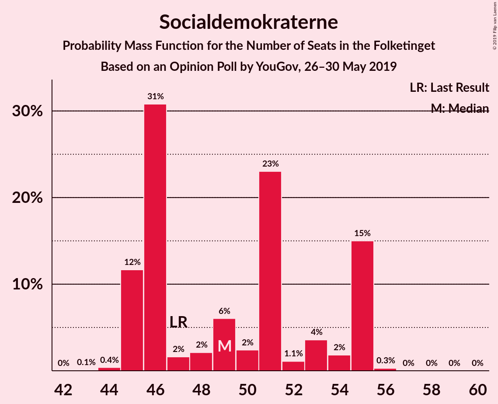
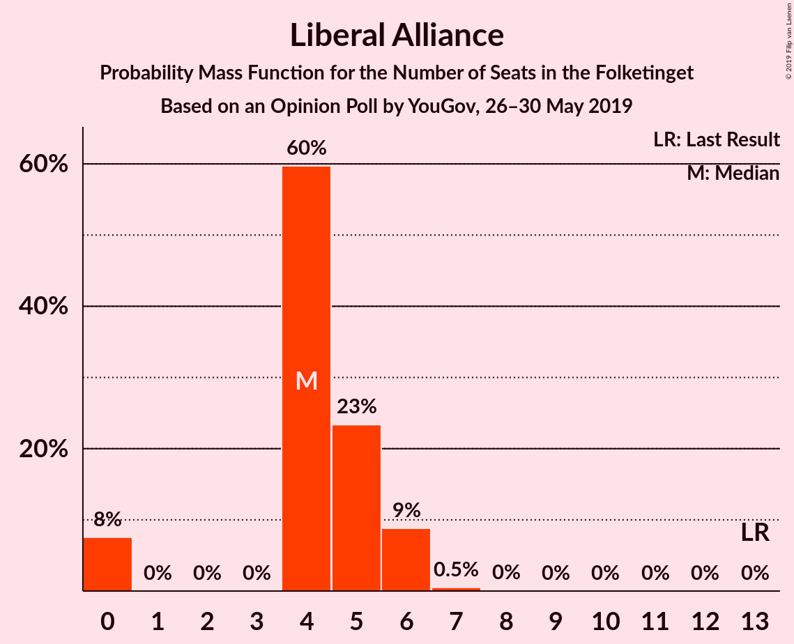
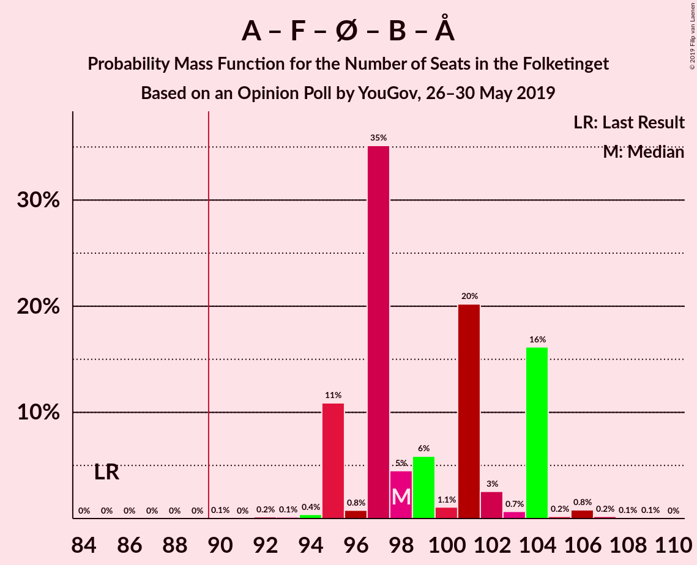
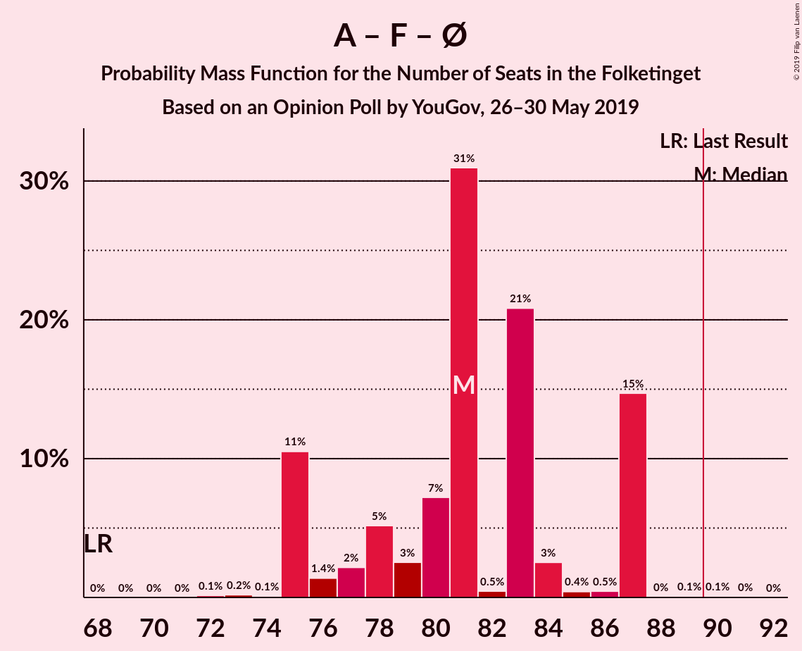
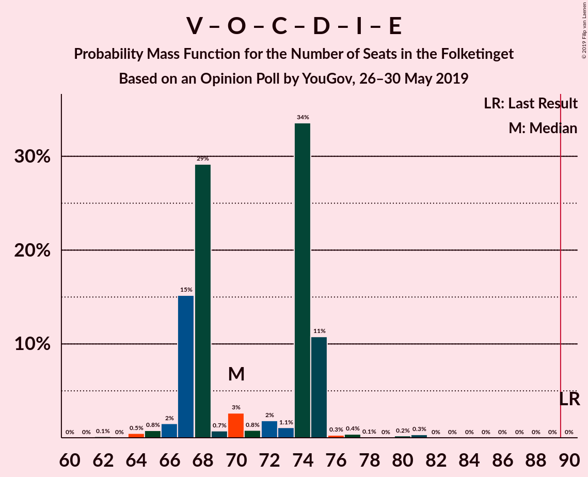

# Opinion Poll by YouGov, 26–30 May 2019

<a href="#voting-intentions">Voting Intentions</a> | <a href="#seats">Seats</a> | <a href="#coalitions">Coalitions</a> | <a href="#technical-information">Technical Information</a>

## Voting Intentions

### Confidence Intervals

| Party | Last Result | Poll Result | 80% Confidence Interval | 90% Confidence Interval | 95% Confidence Interval | 99% Confidence Interval |
|:-----:|:-----------:|:-----------:|:-----------------------:|:-----------------------:|:-----------------------:|:-----------------------:|
| Socialdemokraterne | 26.3% | 28.0% | 26.2–29.9% |25.7–30.5% |25.3–30.9% |24.4–31.8% |
| Venstre | 19.5% | 18.3% | 16.8–20.0% |16.4–20.4% |16.0–20.9% |15.3–21.7% |
| Dansk Folkeparti | 21.1% | 9.5% | 8.4–10.8% |8.1–11.2% |7.8–11.5% |7.3–12.2% |
| Socialistisk Folkeparti | 4.2% | 8.9% | 7.8–10.2% |7.5–10.5% |7.3–10.9% |6.8–11.5% |
| Enhedslisten–De Rød-Grønne | 7.8% | 8.5% | 7.4–9.7% |7.1–10.1% |6.9–10.4% |6.4–11.0% |
| Radikale Venstre | 4.6% | 8.4% | 7.3–9.6% |7.1–10.0% |6.8–10.3% |6.3–10.9% |
| Det Konservative Folkeparti | 3.4% | 5.3% | 4.5–6.4% |4.3–6.6% |4.1–6.9% |3.7–7.4% |
| Nye Borgerlige | 0.0% | 3.5% | 2.8–4.4% |2.7–4.6% |2.5–4.8% |2.2–5.3% |
| Liberal Alliance | 7.5% | 2.6% | 2.0–3.3% |1.9–3.6% |1.7–3.7% |1.5–4.2% |
| Alternativet | 4.8% | 2.6% | 2.0–3.3% |1.9–3.6% |1.7–3.7% |1.5–4.2% |
| Stram Kurs | 0.0% | 2.4% | 1.8–3.1% |1.7–3.3% |1.6–3.5% |1.4–3.9% |
| Kristendemokraterne | 0.8% | 1.3% | 1.0–1.9% |0.9–2.1% |0.8–2.3% |0.6–2.6% |
| Klaus Riskær Pedersen | 0.0% | 0.7% | 0.5–1.2% |0.4–1.3% |0.4–1.5% |0.3–1.8% |

*Note:* The poll result column reflects the actual value used in the calculations. Published results may vary slightly, and in addition be rounded to fewer digits.

## Seats

### Confidence Intervals

| Party | Last Result | Median | 80% Confidence Interval | 90% Confidence Interval | 95% Confidence Interval | 99% Confidence Interval |
|:-----:|:-----------:|:------:|:-----------------------:|:-----------------------:|:-----------------------:|:-----------------------:|
| <a href="#socialdemokraterne">Socialdemokraterne</a> | 47 | 51 | 45–55 |45–55 |45–55 |44–55 |
| <a href="#venstre">Venstre</a> | 34 | 32 | 31–36 |31–36 |29–36 |28–37 |
| <a href="#dansk-folkeparti">Dansk Folkeparti</a> | 37 | 18 | 17–19 |16–21 |15–21 |12–21 |
| <a href="#socialistisk-folkeparti">Socialistisk Folkeparti</a> | 7 | 16 | 16–18 |13–18 |13–20 |12–20 |
| <a href="#enhedslisten–de-rød-grønne">Enhedslisten–De Rød-Grønne</a> | 14 | 14 | 13–16 |13–16 |13–18 |12–19 |
| <a href="#radikale-venstre">Radikale Venstre</a> | 8 | 14 | 13–15 |13–17 |13–17 |12–18 |
| <a href="#det-konservative-folkeparti">Det Konservative Folkeparti</a> | 6 | 9 | 9 |9–10 |9–10 |8–13 |
| <a href="#nye-borgerlige">Nye Borgerlige</a> | 0 | 5 | 5–7 |5–7 |5–8 |4–9 |
| <a href="#liberal-alliance">Liberal Alliance</a> | 13 | 4 | 4–5 |0–5 |0–6 |0–6 |
| <a href="#alternativet">Alternativet</a> | 9 | 4 | 4–6 |4–6 |4–6 |0–6 |
| <a href="#stram-kurs">Stram Kurs</a> | 0 | 5 | 4–6 |4–6 |4–6 |0–6 |
| <a href="#kristendemokraterne">Kristendemokraterne</a> | 0 | 0 | 0 |0–4 |0–4 |0–4 |
| <a href="#klaus-riskær-pedersen">Klaus Riskær Pedersen</a> | 0 | 0 | 0 |0 |0 |0 |

### Socialdemokraterne

*For a full overview of the results for this party, see the [Socialdemokraterne](party-socialdemokraterne.html) page.*

| Number of Seats | Probability | Accumulated | Special Marks |
|:---------------:|:-----------:|:-----------:|:-------------:|
| 43 | 0.1% | 100% |  |
| 44 | 0.7% | 99.9% |  |
| 45 | 20% | 99.2% |  |
| 46 | 1.1% | 79% |  |
| 47 | 1.0% | 78% | Last Result |
| 48 | 1.0% | 77% |  |
| 49 | 10% | 76% |  |
| 50 | 3% | 65% |  |
| 51 | 35% | 62% | Median |
| 52 | 0.3% | 27% |  |
| 53 | 0.3% | 27% |  |
| 54 | 0.2% | 27% |  |
| 55 | 26% | 26% |  |
| 56 | 0.1% | 0.2% |  |
| 57 | 0% | 0.1% |  |
| 58 | 0% | 0.1% |  |
| 59 | 0% | 0.1% |  |
| 60 | 0.1% | 0.1% |  |
| 61 | 0% | 0% |  |

### Venstre

*For a full overview of the results for this party, see the [Venstre](party-venstre.html) page.*

| Number of Seats | Probability | Accumulated | Special Marks |
|:---------------:|:-----------:|:-----------:|:-------------:|
| 27 | 0.1% | 100% |  |
| 28 | 0.6% | 99.9% |  |
| 29 | 3% | 99.3% |  |
| 30 | 0.5% | 96% |  |
| 31 | 35% | 96% |  |
| 32 | 36% | 61% | Median |
| 33 | 0.9% | 25% |  |
| 34 | 1.0% | 24% | Last Result |
| 35 | 2% | 23% |  |
| 36 | 20% | 21% |  |
| 37 | 0.5% | 0.7% |  |
| 38 | 0% | 0.2% |  |
| 39 | 0.1% | 0.1% |  |
| 40 | 0% | 0% |  |

### Dansk Folkeparti

*For a full overview of the results for this party, see the [Dansk Folkeparti](party-danskfolkeparti.html) page.*

| Number of Seats | Probability | Accumulated | Special Marks |
|:---------------:|:-----------:|:-----------:|:-------------:|
| 12 | 0.6% | 100% |  |
| 13 | 0.2% | 99.4% |  |
| 14 | 1.1% | 99.2% |  |
| 15 | 3% | 98% |  |
| 16 | 1.3% | 96% |  |
| 17 | 27% | 94% |  |
| 18 | 35% | 67% | Median |
| 19 | 23% | 32% |  |
| 20 | 0.6% | 10% |  |
| 21 | 9% | 9% |  |
| 22 | 0.2% | 0.5% |  |
| 23 | 0.3% | 0.3% |  |
| 24 | 0% | 0% |  |
| 25 | 0% | 0% |  |
| 26 | 0% | 0% |  |
| 27 | 0% | 0% |  |
| 28 | 0% | 0% |  |
| 29 | 0% | 0% |  |
| 30 | 0% | 0% |  |
| 31 | 0% | 0% |  |
| 32 | 0% | 0% |  |
| 33 | 0% | 0% |  |
| 34 | 0% | 0% |  |
| 35 | 0% | 0% |  |
| 36 | 0% | 0% |  |
| 37 | 0% | 0% | Last Result |

### Socialistisk Folkeparti

*For a full overview of the results for this party, see the [Socialistisk Folkeparti](party-socialistiskfolkeparti.html) page.*

| Number of Seats | Probability | Accumulated | Special Marks |
|:---------------:|:-----------:|:-----------:|:-------------:|
| 7 | 0% | 100% | Last Result |
| 8 | 0% | 100% |  |
| 9 | 0% | 100% |  |
| 10 | 0% | 100% |  |
| 11 | 0% | 100% |  |
| 12 | 0.7% | 100% |  |
| 13 | 4% | 99.3% |  |
| 14 | 0.9% | 95% |  |
| 15 | 0.6% | 94% |  |
| 16 | 54% | 93% | Median |
| 17 | 0.3% | 39% |  |
| 18 | 35% | 39% |  |
| 19 | 1.0% | 4% |  |
| 20 | 3% | 3% |  |
| 21 | 0% | 0% |  |

### Enhedslisten–De Rød-Grønne

*For a full overview of the results for this party, see the [Enhedslisten–De Rød-Grønne](party-enhedslisten–derød-grønne.html) page.*

| Number of Seats | Probability | Accumulated | Special Marks |
|:---------------:|:-----------:|:-----------:|:-------------:|
| 10 | 0.1% | 100% |  |
| 11 | 0% | 99.9% |  |
| 12 | 2% | 99.9% |  |
| 13 | 9% | 98% |  |
| 14 | 55% | 88% | Last Result, Median |
| 15 | 0.8% | 34% |  |
| 16 | 29% | 33% |  |
| 17 | 0.9% | 3% |  |
| 18 | 1.0% | 3% |  |
| 19 | 1.2% | 2% |  |
| 20 | 0.4% | 0.4% |  |
| 21 | 0% | 0% |  |

### Radikale Venstre

*For a full overview of the results for this party, see the [Radikale Venstre](party-radikalevenstre.html) page.*

| Number of Seats | Probability | Accumulated | Special Marks |
|:---------------:|:-----------:|:-----------:|:-------------:|
| 8 | 0% | 100% | Last Result |
| 9 | 0% | 100% |  |
| 10 | 0% | 100% |  |
| 11 | 0.2% | 100% |  |
| 12 | 0.9% | 99.7% |  |
| 13 | 27% | 98.9% |  |
| 14 | 54% | 72% | Median |
| 15 | 10% | 18% |  |
| 16 | 1.3% | 8% |  |
| 17 | 6% | 6% |  |
| 18 | 0.5% | 0.8% |  |
| 19 | 0.2% | 0.3% |  |
| 20 | 0.1% | 0.1% |  |
| 21 | 0% | 0% |  |

### Det Konservative Folkeparti

*For a full overview of the results for this party, see the [Det Konservative Folkeparti](party-detkonservativefolkeparti.html) page.*

| Number of Seats | Probability | Accumulated | Special Marks |
|:---------------:|:-----------:|:-----------:|:-------------:|
| 6 | 0% | 100% | Last Result |
| 7 | 0.1% | 100% |  |
| 8 | 0.7% | 99.9% |  |
| 9 | 92% | 99.2% | Median |
| 10 | 5% | 7% |  |
| 11 | 0.5% | 2% |  |
| 12 | 0.2% | 1.3% |  |
| 13 | 0.9% | 1.2% |  |
| 14 | 0.3% | 0.3% |  |
| 15 | 0% | 0% |  |

### Nye Borgerlige

*For a full overview of the results for this party, see the [Nye Borgerlige](party-nyeborgerlige.html) page.*

| Number of Seats | Probability | Accumulated | Special Marks |
|:---------------:|:-----------:|:-----------:|:-------------:|
| 0 | 0.1% | 100% | Last Result |
| 1 | 0% | 99.9% |  |
| 2 | 0% | 99.9% |  |
| 3 | 0% | 99.9% |  |
| 4 | 0.8% | 99.9% |  |
| 5 | 64% | 99.1% | Median |
| 6 | 10% | 35% |  |
| 7 | 22% | 26% |  |
| 8 | 2% | 3% |  |
| 9 | 1.1% | 1.3% |  |
| 10 | 0.2% | 0.2% |  |
| 11 | 0% | 0% |  |

### Liberal Alliance

*For a full overview of the results for this party, see the [Liberal Alliance](party-liberalalliance.html) page.*

| Number of Seats | Probability | Accumulated | Special Marks |
|:---------------:|:-----------:|:-----------:|:-------------:|
| 0 | 9% | 100% |  |
| 1 | 0% | 91% |  |
| 2 | 0% | 91% |  |
| 3 | 0% | 91% |  |
| 4 | 48% | 91% | Median |
| 5 | 38% | 42% |  |
| 6 | 4% | 4% |  |
| 7 | 0.3% | 0.3% |  |
| 8 | 0% | 0% |  |
| 9 | 0% | 0% |  |
| 10 | 0% | 0% |  |
| 11 | 0% | 0% |  |
| 12 | 0% | 0% |  |
| 13 | 0% | 0% | Last Result |

### Alternativet

*For a full overview of the results for this party, see the [Alternativet](party-alternativet.html) page.*

| Number of Seats | Probability | Accumulated | Special Marks |
|:---------------:|:-----------:|:-----------:|:-------------:|
| 0 | 2% | 100% |  |
| 1 | 0% | 98% |  |
| 2 | 0% | 98% |  |
| 3 | 0% | 98% |  |
| 4 | 64% | 98% | Median |
| 5 | 2% | 34% |  |
| 6 | 32% | 32% |  |
| 7 | 0.3% | 0.4% |  |
| 8 | 0.1% | 0.1% |  |
| 9 | 0% | 0% | Last Result |

### Stram Kurs

*For a full overview of the results for this party, see the [Stram Kurs](party-stramkurs.html) page.*

| Number of Seats | Probability | Accumulated | Special Marks |
|:---------------:|:-----------:|:-----------:|:-------------:|
| 0 | 2% | 100% | Last Result |
| 1 | 0% | 98% |  |
| 2 | 0% | 98% |  |
| 3 | 0% | 98% |  |
| 4 | 37% | 98% |  |
| 5 | 24% | 61% | Median |
| 6 | 36% | 36% |  |
| 7 | 0.1% | 0.3% |  |
| 8 | 0.1% | 0.1% |  |
| 9 | 0% | 0% |  |

### Kristendemokraterne

*For a full overview of the results for this party, see the [Kristendemokraterne](party-kristendemokraterne.html) page.*

| Number of Seats | Probability | Accumulated | Special Marks |
|:---------------:|:-----------:|:-----------:|:-------------:|
| 0 | 90% | 100% | Last Result, Median |
| 1 | 0% | 10% |  |
| 2 | 0% | 10% |  |
| 3 | 0% | 10% |  |
| 4 | 9% | 10% |  |
| 5 | 0.3% | 0.3% |  |
| 6 | 0% | 0% |  |

### Klaus Riskær Pedersen

*For a full overview of the results for this party, see the [Klaus Riskær Pedersen](party-klausriskærpedersen.html) page.*

| Number of Seats | Probability | Accumulated | Special Marks |
|:---------------:|:-----------:|:-----------:|:-------------:|
| 0 | 99.9% | 100% | Last Result, Median |
| 1 | 0% | 0.1% |  |
| 2 | 0% | 0.1% |  |
| 3 | 0% | 0.1% |  |
| 4 | 0.1% | 0.1% |  |
| 5 | 0% | 0% |  |

## Coalitions

### Confidence Intervals

| Coalition | Last Result | Median | Majority? | 80% Confidence Interval | 90% Confidence Interval | 95% Confidence Interval | 99% Confidence Interval |
|:---------:|:-----------:|:------:|:---------:|:-----------------------:|:-----------------------:|:-----------------------:|:-----------------------:|
| Socialdemokraterne – Socialistisk Folkeparti – Enhedslisten–De Rød-Grønne – Radikale Venstre – Alternativet | 85 | 101 | 100% | 95–104 | 95–104 | 95–104 | 94–106 |
| Socialdemokraterne – Socialistisk Folkeparti – Enhedslisten–De Rød-Grønne – Radikale Venstre | 76 | 97 | 81% | 89–100 | 89–100 | 89–100 | 89–101 |
| Socialdemokraterne – Socialistisk Folkeparti – Enhedslisten–De Rød-Grønne – Alternativet | 77 | 87 | 27% | 81–91 | 81–91 | 81–91 | 78–91 |
| Socialdemokraterne – Socialistisk Folkeparti – Enhedslisten–De Rød-Grønne | 68 | 83 | 0% | 75–87 | 75–87 | 75–87 | 75–87 |
| Socialdemokraterne – Socialistisk Folkeparti – Radikale Venstre | 62 | 83 | 0% | 75–84 | 75–84 | 75–84 | 75–85 |
| Venstre – Dansk Folkeparti – Det Konservative Folkeparti – Nye Borgerlige – Liberal Alliance – Stram Kurs – Kristendemokraterne – Klaus Riskær Pedersen | 90 | 74 | 0% | 71–80 | 71–80 | 71–80 | 69–81 |
| Venstre – Dansk Folkeparti – Det Konservative Folkeparti – Nye Borgerlige – Liberal Alliance – Kristendemokraterne – Klaus Riskær Pedersen | 90 | 68 | 0% | 67–75 | 67–75 | 67–75 | 65–79 |
| Venstre – Dansk Folkeparti – Det Konservative Folkeparti – Nye Borgerlige – Liberal Alliance – Klaus Riskær Pedersen | 90 | 68 | 0% | 67–75 | 67–75 | 67–75 | 64–77 |
| Venstre – Dansk Folkeparti – Det Konservative Folkeparti – Nye Borgerlige – Liberal Alliance – Kristendemokraterne | 90 | 68 | 0% | 67–75 | 67–75 | 67–75 | 65–79 |
| Venstre – Dansk Folkeparti – Det Konservative Folkeparti – Nye Borgerlige – Liberal Alliance | 90 | 68 | 0% | 67–75 | 67–75 | 67–75 | 64–77 |
| Venstre – Dansk Folkeparti – Det Konservative Folkeparti – Liberal Alliance – Kristendemokraterne | 90 | 63 | 0% | 62–68 | 62–68 | 62–68 | 58–74 |
| Venstre – Dansk Folkeparti – Det Konservative Folkeparti – Liberal Alliance | 90 | 63 | 0% | 62–68 | 62–68 | 62–68 | 58–72 |
| Socialdemokraterne – Radikale Venstre | 55 | 65 | 0% | 59–68 | 59–68 | 59–68 | 57–69 |
| Venstre – Det Konservative Folkeparti – Liberal Alliance | 53 | 45 | 0% | 44–49 | 41–49 | 41–50 | 41–53 |
| Venstre – Det Konservative Folkeparti | 40 | 41 | 0% | 40–45 | 40–45 | 38–45 | 38–49 |
| Venstre | 34 | 32 | 0% | 31–36 | 31–36 | 29–36 | 28–37 |

### Socialdemokraterne – Socialistisk Folkeparti – Enhedslisten–De Rød-Grønne – Radikale Venstre – Alternativet

| Number of Seats | Probability | Accumulated | Special Marks |
|:---------------:|:-----------:|:-----------:|:-------------:|
| 85 | 0% | 100% | Last Result |
| 86 | 0% | 100% |  |
| 87 | 0% | 100% |  |
| 88 | 0% | 100% |  |
| 89 | 0% | 100% |  |
| 90 | 0.1% | 100% | Majority |
| 91 | 0% | 99.9% |  |
| 92 | 0.1% | 99.9% |  |
| 93 | 0.2% | 99.8% |  |
| 94 | 0.4% | 99.6% |  |
| 95 | 19% | 99.2% |  |
| 96 | 0.9% | 80% |  |
| 97 | 0.6% | 79% |  |
| 98 | 2% | 79% |  |
| 99 | 10% | 77% | Median |
| 100 | 0.6% | 66% |  |
| 101 | 35% | 66% |  |
| 102 | 3% | 31% |  |
| 103 | 0.3% | 27% |  |
| 104 | 26% | 27% |  |
| 105 | 0.1% | 0.8% |  |
| 106 | 0.3% | 0.7% |  |
| 107 | 0.2% | 0.5% |  |
| 108 | 0.1% | 0.2% |  |
| 109 | 0% | 0.1% |  |
| 110 | 0% | 0% |  |

### Socialdemokraterne – Socialistisk Folkeparti – Enhedslisten–De Rød-Grønne – Radikale Venstre

| Number of Seats | Probability | Accumulated | Special Marks |
|:---------------:|:-----------:|:-----------:|:-------------:|
| 76 | 0% | 100% | Last Result |
| 77 | 0% | 100% |  |
| 78 | 0% | 100% |  |
| 79 | 0% | 100% |  |
| 80 | 0% | 100% |  |
| 81 | 0% | 100% |  |
| 82 | 0% | 100% |  |
| 83 | 0% | 100% |  |
| 84 | 0% | 100% |  |
| 85 | 0% | 100% |  |
| 86 | 0.1% | 100% |  |
| 87 | 0.1% | 99.9% |  |
| 88 | 0.2% | 99.8% |  |
| 89 | 19% | 99.7% |  |
| 90 | 1.2% | 81% | Majority |
| 91 | 0.1% | 80% |  |
| 92 | 0.9% | 80% |  |
| 93 | 9% | 79% |  |
| 94 | 2% | 70% |  |
| 95 | 0.4% | 68% | Median |
| 96 | 4% | 68% |  |
| 97 | 35% | 64% |  |
| 98 | 0.7% | 29% |  |
| 99 | 1.4% | 28% |  |
| 100 | 26% | 27% |  |
| 101 | 0.3% | 0.7% |  |
| 102 | 0.2% | 0.4% |  |
| 103 | 0.1% | 0.1% |  |
| 104 | 0% | 0.1% |  |
| 105 | 0% | 0.1% |  |
| 106 | 0% | 0% |  |

### Socialdemokraterne – Socialistisk Folkeparti – Enhedslisten–De Rød-Grønne – Alternativet

| Number of Seats | Probability | Accumulated | Special Marks |
|:---------------:|:-----------:|:-----------:|:-------------:|
| 76 | 0.1% | 100% |  |
| 77 | 0.3% | 99.9% | Last Result |
| 78 | 0.1% | 99.6% |  |
| 79 | 0.1% | 99.5% |  |
| 80 | 0% | 99.4% |  |
| 81 | 21% | 99.4% |  |
| 82 | 0.8% | 79% |  |
| 83 | 2% | 78% |  |
| 84 | 10% | 76% |  |
| 85 | 4% | 67% | Median |
| 86 | 0.1% | 62% |  |
| 87 | 35% | 62% |  |
| 88 | 0.3% | 27% |  |
| 89 | 0.1% | 27% |  |
| 90 | 0.2% | 27% | Majority |
| 91 | 26% | 27% |  |
| 92 | 0% | 0.1% |  |
| 93 | 0% | 0.1% |  |
| 94 | 0% | 0.1% |  |
| 95 | 0% | 0.1% |  |
| 96 | 0% | 0% |  |

### Socialdemokraterne – Socialistisk Folkeparti – Enhedslisten–De Rød-Grønne

| Number of Seats | Probability | Accumulated | Special Marks |
|:---------------:|:-----------:|:-----------:|:-------------:|
| 68 | 0% | 100% | Last Result |
| 69 | 0% | 100% |  |
| 70 | 0% | 100% |  |
| 71 | 0% | 100% |  |
| 72 | 0% | 100% |  |
| 73 | 0.3% | 100% |  |
| 74 | 0.2% | 99.7% |  |
| 75 | 19% | 99.5% |  |
| 76 | 0.4% | 81% |  |
| 77 | 3% | 80% |  |
| 78 | 9% | 78% |  |
| 79 | 4% | 69% |  |
| 80 | 0.9% | 65% |  |
| 81 | 0.7% | 64% | Median |
| 82 | 0.5% | 63% |  |
| 83 | 35% | 63% |  |
| 84 | 1.2% | 28% |  |
| 85 | 0.5% | 27% |  |
| 86 | 0.1% | 26% |  |
| 87 | 26% | 26% |  |
| 88 | 0% | 0.1% |  |
| 89 | 0% | 0.1% |  |
| 90 | 0% | 0% | Majority |

### Socialdemokraterne – Socialistisk Folkeparti – Radikale Venstre

| Number of Seats | Probability | Accumulated | Special Marks |
|:---------------:|:-----------:|:-----------:|:-------------:|
| 62 | 0% | 100% | Last Result |
| 63 | 0% | 100% |  |
| 64 | 0% | 100% |  |
| 65 | 0% | 100% |  |
| 66 | 0% | 100% |  |
| 67 | 0% | 100% |  |
| 68 | 0% | 100% |  |
| 69 | 0% | 100% |  |
| 70 | 0.1% | 100% |  |
| 71 | 0% | 99.9% |  |
| 72 | 0% | 99.9% |  |
| 73 | 0.3% | 99.9% |  |
| 74 | 0.1% | 99.6% |  |
| 75 | 19% | 99.5% |  |
| 76 | 0.7% | 80% |  |
| 77 | 1.2% | 80% |  |
| 78 | 0.1% | 78% |  |
| 79 | 0.8% | 78% |  |
| 80 | 12% | 78% |  |
| 81 | 1.4% | 66% | Median |
| 82 | 2% | 64% |  |
| 83 | 35% | 62% |  |
| 84 | 26% | 27% |  |
| 85 | 0.3% | 0.6% |  |
| 86 | 0.1% | 0.3% |  |
| 87 | 0% | 0.2% |  |
| 88 | 0% | 0.1% |  |
| 89 | 0.1% | 0.1% |  |
| 90 | 0% | 0% | Majority |

### Venstre – Dansk Folkeparti – Det Konservative Folkeparti – Nye Borgerlige – Liberal Alliance – Stram Kurs – Kristendemokraterne – Klaus Riskær Pedersen

| Number of Seats | Probability | Accumulated | Special Marks |
|:---------------:|:-----------:|:-----------:|:-------------:|
| 66 | 0% | 100% |  |
| 67 | 0.1% | 99.9% |  |
| 68 | 0.2% | 99.8% |  |
| 69 | 0.3% | 99.5% |  |
| 70 | 0.1% | 99.3% |  |
| 71 | 26% | 99.2% |  |
| 72 | 0.3% | 73% |  |
| 73 | 3% | 73% | Median |
| 74 | 35% | 69% |  |
| 75 | 0.6% | 34% |  |
| 76 | 10% | 34% |  |
| 77 | 2% | 23% |  |
| 78 | 0.6% | 21% |  |
| 79 | 0.9% | 21% |  |
| 80 | 19% | 20% |  |
| 81 | 0.4% | 0.8% |  |
| 82 | 0.2% | 0.4% |  |
| 83 | 0.1% | 0.2% |  |
| 84 | 0% | 0.1% |  |
| 85 | 0.1% | 0.1% |  |
| 86 | 0% | 0% |  |
| 87 | 0% | 0% |  |
| 88 | 0% | 0% |  |
| 89 | 0% | 0% |  |
| 90 | 0% | 0% | Last Result, Majority |

### Venstre – Dansk Folkeparti – Det Konservative Folkeparti – Nye Borgerlige – Liberal Alliance – Kristendemokraterne – Klaus Riskær Pedersen

| Number of Seats | Probability | Accumulated | Special Marks |
|:---------------:|:-----------:|:-----------:|:-------------:|
| 62 | 0.2% | 100% |  |
| 63 | 0% | 99.8% |  |
| 64 | 0.2% | 99.8% |  |
| 65 | 0.1% | 99.5% |  |
| 66 | 0% | 99.4% |  |
| 67 | 26% | 99.4% |  |
| 68 | 37% | 73% | Median |
| 69 | 1.0% | 36% |  |
| 70 | 2% | 35% |  |
| 71 | 0.4% | 33% |  |
| 72 | 11% | 33% |  |
| 73 | 1.0% | 22% |  |
| 74 | 0.6% | 21% |  |
| 75 | 19% | 21% |  |
| 76 | 0.6% | 2% |  |
| 77 | 0.6% | 1.2% |  |
| 78 | 0.1% | 0.6% |  |
| 79 | 0.1% | 0.5% |  |
| 80 | 0% | 0.4% |  |
| 81 | 0.4% | 0.4% |  |
| 82 | 0% | 0% |  |
| 83 | 0% | 0% |  |
| 84 | 0% | 0% |  |
| 85 | 0% | 0% |  |
| 86 | 0% | 0% |  |
| 87 | 0% | 0% |  |
| 88 | 0% | 0% |  |
| 89 | 0% | 0% |  |
| 90 | 0% | 0% | Last Result, Majority |

### Venstre – Dansk Folkeparti – Det Konservative Folkeparti – Nye Borgerlige – Liberal Alliance – Klaus Riskær Pedersen

| Number of Seats | Probability | Accumulated | Special Marks |
|:---------------:|:-----------:|:-----------:|:-------------:|
| 62 | 0.2% | 100% |  |
| 63 | 0% | 99.8% |  |
| 64 | 0.7% | 99.8% |  |
| 65 | 0.2% | 99.1% |  |
| 66 | 0% | 98.9% |  |
| 67 | 26% | 98.9% |  |
| 68 | 46% | 73% | Median |
| 69 | 0.6% | 27% |  |
| 70 | 2% | 26% |  |
| 71 | 0.5% | 24% |  |
| 72 | 2% | 24% |  |
| 73 | 0.9% | 22% |  |
| 74 | 0.6% | 21% |  |
| 75 | 19% | 20% |  |
| 76 | 0.4% | 2% |  |
| 77 | 0.6% | 1.1% |  |
| 78 | 0% | 0.5% |  |
| 79 | 0% | 0.4% |  |
| 80 | 0% | 0.4% |  |
| 81 | 0.4% | 0.4% |  |
| 82 | 0% | 0% |  |
| 83 | 0% | 0% |  |
| 84 | 0% | 0% |  |
| 85 | 0% | 0% |  |
| 86 | 0% | 0% |  |
| 87 | 0% | 0% |  |
| 88 | 0% | 0% |  |
| 89 | 0% | 0% |  |
| 90 | 0% | 0% | Last Result, Majority |

### Venstre – Dansk Folkeparti – Det Konservative Folkeparti – Nye Borgerlige – Liberal Alliance – Kristendemokraterne

| Number of Seats | Probability | Accumulated | Special Marks |
|:---------------:|:-----------:|:-----------:|:-------------:|
| 62 | 0.2% | 100% |  |
| 63 | 0% | 99.8% |  |
| 64 | 0.2% | 99.8% |  |
| 65 | 0.1% | 99.5% |  |
| 66 | 0.1% | 99.4% |  |
| 67 | 26% | 99.4% |  |
| 68 | 37% | 73% | Median |
| 69 | 1.0% | 36% |  |
| 70 | 2% | 35% |  |
| 71 | 0.4% | 33% |  |
| 72 | 11% | 33% |  |
| 73 | 1.0% | 22% |  |
| 74 | 0.6% | 21% |  |
| 75 | 19% | 20% |  |
| 76 | 0.6% | 2% |  |
| 77 | 0.6% | 1.2% |  |
| 78 | 0.1% | 0.6% |  |
| 79 | 0.1% | 0.5% |  |
| 80 | 0% | 0.4% |  |
| 81 | 0.4% | 0.4% |  |
| 82 | 0% | 0% |  |
| 83 | 0% | 0% |  |
| 84 | 0% | 0% |  |
| 85 | 0% | 0% |  |
| 86 | 0% | 0% |  |
| 87 | 0% | 0% |  |
| 88 | 0% | 0% |  |
| 89 | 0% | 0% |  |
| 90 | 0% | 0% | Last Result, Majority |

### Venstre – Dansk Folkeparti – Det Konservative Folkeparti – Nye Borgerlige – Liberal Alliance

| Number of Seats | Probability | Accumulated | Special Marks |
|:---------------:|:-----------:|:-----------:|:-------------:|
| 62 | 0.2% | 100% |  |
| 63 | 0% | 99.8% |  |
| 64 | 0.7% | 99.8% |  |
| 65 | 0.2% | 99.1% |  |
| 66 | 0.1% | 98.9% |  |
| 67 | 26% | 98.9% |  |
| 68 | 46% | 73% | Median |
| 69 | 0.6% | 27% |  |
| 70 | 2% | 26% |  |
| 71 | 0.5% | 24% |  |
| 72 | 2% | 24% |  |
| 73 | 1.0% | 22% |  |
| 74 | 0.6% | 21% |  |
| 75 | 19% | 20% |  |
| 76 | 0.4% | 1.5% |  |
| 77 | 0.6% | 1.0% |  |
| 78 | 0% | 0.5% |  |
| 79 | 0% | 0.4% |  |
| 80 | 0% | 0.4% |  |
| 81 | 0.4% | 0.4% |  |
| 82 | 0% | 0% |  |
| 83 | 0% | 0% |  |
| 84 | 0% | 0% |  |
| 85 | 0% | 0% |  |
| 86 | 0% | 0% |  |
| 87 | 0% | 0% |  |
| 88 | 0% | 0% |  |
| 89 | 0% | 0% |  |
| 90 | 0% | 0% | Last Result, Majority |

### Venstre – Dansk Folkeparti – Det Konservative Folkeparti – Liberal Alliance – Kristendemokraterne

| Number of Seats | Probability | Accumulated | Special Marks |
|:---------------:|:-----------:|:-----------:|:-------------:|
| 54 | 0.1% | 100% |  |
| 55 | 0% | 99.9% |  |
| 56 | 0% | 99.9% |  |
| 57 | 0.1% | 99.9% |  |
| 58 | 0.3% | 99.7% |  |
| 59 | 0.1% | 99.4% |  |
| 60 | 0.5% | 99.4% |  |
| 61 | 0.2% | 98.8% |  |
| 62 | 28% | 98.7% |  |
| 63 | 38% | 71% | Median |
| 64 | 1.1% | 33% |  |
| 65 | 2% | 32% |  |
| 66 | 9% | 30% |  |
| 67 | 0.2% | 21% |  |
| 68 | 19% | 21% |  |
| 69 | 0.1% | 2% |  |
| 70 | 0.6% | 2% |  |
| 71 | 0.1% | 1.3% |  |
| 72 | 0.7% | 1.3% |  |
| 73 | 0% | 0.5% |  |
| 74 | 0.4% | 0.5% |  |
| 75 | 0.1% | 0.1% |  |
| 76 | 0% | 0% |  |
| 77 | 0% | 0% |  |
| 78 | 0% | 0% |  |
| 79 | 0% | 0% |  |
| 80 | 0% | 0% |  |
| 81 | 0% | 0% |  |
| 82 | 0% | 0% |  |
| 83 | 0% | 0% |  |
| 84 | 0% | 0% |  |
| 85 | 0% | 0% |  |
| 86 | 0% | 0% |  |
| 87 | 0% | 0% |  |
| 88 | 0% | 0% |  |
| 89 | 0% | 0% |  |
| 90 | 0% | 0% | Last Result, Majority |

### Venstre – Dansk Folkeparti – Det Konservative Folkeparti – Liberal Alliance

| Number of Seats | Probability | Accumulated | Special Marks |
|:---------------:|:-----------:|:-----------:|:-------------:|
| 54 | 0.1% | 100% |  |
| 55 | 0% | 99.9% |  |
| 56 | 0% | 99.9% |  |
| 57 | 0.1% | 99.8% |  |
| 58 | 0.7% | 99.7% |  |
| 59 | 0.1% | 99.0% |  |
| 60 | 0.8% | 98.9% |  |
| 61 | 0.2% | 98% |  |
| 62 | 36% | 98% |  |
| 63 | 38% | 62% | Median |
| 64 | 0.8% | 24% |  |
| 65 | 2% | 23% |  |
| 66 | 0.4% | 21% |  |
| 67 | 0.2% | 21% |  |
| 68 | 19% | 21% |  |
| 69 | 0% | 2% |  |
| 70 | 0.6% | 2% |  |
| 71 | 0% | 1.2% |  |
| 72 | 0.7% | 1.1% |  |
| 73 | 0% | 0.4% |  |
| 74 | 0.3% | 0.4% |  |
| 75 | 0.1% | 0.1% |  |
| 76 | 0% | 0% |  |
| 77 | 0% | 0% |  |
| 78 | 0% | 0% |  |
| 79 | 0% | 0% |  |
| 80 | 0% | 0% |  |
| 81 | 0% | 0% |  |
| 82 | 0% | 0% |  |
| 83 | 0% | 0% |  |
| 84 | 0% | 0% |  |
| 85 | 0% | 0% |  |
| 86 | 0% | 0% |  |
| 87 | 0% | 0% |  |
| 88 | 0% | 0% |  |
| 89 | 0% | 0% |  |
| 90 | 0% | 0% | Last Result, Majority |

### Socialdemokraterne – Radikale Venstre

| Number of Seats | Probability | Accumulated | Special Marks |
|:---------------:|:-----------:|:-----------:|:-------------:|
| 55 | 0.1% | 100% | Last Result |
| 56 | 0% | 99.9% |  |
| 57 | 0.7% | 99.9% |  |
| 58 | 0% | 99.2% |  |
| 59 | 19% | 99.2% |  |
| 60 | 0.4% | 81% |  |
| 61 | 2% | 80% |  |
| 62 | 2% | 78% |  |
| 63 | 0.3% | 77% |  |
| 64 | 9% | 76% |  |
| 65 | 36% | 67% | Median |
| 66 | 1.3% | 31% |  |
| 67 | 3% | 30% |  |
| 68 | 26% | 27% |  |
| 69 | 0.5% | 0.7% |  |
| 70 | 0% | 0.2% |  |
| 71 | 0% | 0.2% |  |
| 72 | 0.1% | 0.2% |  |
| 73 | 0.1% | 0.1% |  |
| 74 | 0% | 0.1% |  |
| 75 | 0% | 0% |  |

### Venstre – Det Konservative Folkeparti – Liberal Alliance

| Number of Seats | Probability | Accumulated | Special Marks |
|:---------------:|:-----------:|:-----------:|:-------------:|
| 38 | 0% | 100% |  |
| 39 | 0% | 99.9% |  |
| 40 | 0.2% | 99.9% |  |
| 41 | 9% | 99.7% |  |
| 42 | 0.4% | 91% |  |
| 43 | 0.6% | 91% |  |
| 44 | 3% | 90% |  |
| 45 | 61% | 87% | Median |
| 46 | 2% | 27% |  |
| 47 | 1.1% | 25% |  |
| 48 | 0.3% | 24% |  |
| 49 | 19% | 24% |  |
| 50 | 2% | 4% |  |
| 51 | 1.0% | 2% |  |
| 52 | 0.1% | 1.1% |  |
| 53 | 0.6% | 1.0% | Last Result |
| 54 | 0.3% | 0.4% |  |
| 55 | 0.1% | 0.1% |  |
| 56 | 0% | 0% |  |

### Venstre – Det Konservative Folkeparti

| Number of Seats | Probability | Accumulated | Special Marks |
|:---------------:|:-----------:|:-----------:|:-------------:|
| 36 | 0.1% | 100% |  |
| 37 | 0% | 99.9% |  |
| 38 | 3% | 99.8% |  |
| 39 | 0.6% | 96% |  |
| 40 | 35% | 96% | Last Result |
| 41 | 35% | 61% | Median |
| 42 | 2% | 27% |  |
| 43 | 0.8% | 25% |  |
| 44 | 0.2% | 24% |  |
| 45 | 22% | 24% |  |
| 46 | 0.6% | 2% |  |
| 47 | 0.1% | 1.1% |  |
| 48 | 0.3% | 1.0% |  |
| 49 | 0.6% | 0.7% |  |
| 50 | 0.1% | 0.1% |  |
| 51 | 0% | 0% |  |

### Venstre

| Number of Seats | Probability | Accumulated | Special Marks |
|:---------------:|:-----------:|:-----------:|:-------------:|
| 27 | 0.1% | 100% |  |
| 28 | 0.6% | 99.9% |  |
| 29 | 3% | 99.3% |  |
| 30 | 0.5% | 96% |  |
| 31 | 35% | 96% |  |
| 32 | 36% | 61% | Median |
| 33 | 0.9% | 25% |  |
| 34 | 1.0% | 24% | Last Result |
| 35 | 2% | 23% |  |
| 36 | 20% | 21% |  |
| 37 | 0.5% | 0.7% |  |
| 38 | 0% | 0.2% |  |
| 39 | 0.1% | 0.1% |  |
| 40 | 0% | 0% |  |

## Technical Information

### Opinion Poll

+ **Polling firm:** YouGov
+ **Commissioner(s):** —
+ **Fieldwork period:** 26–30 May 2019

### Calculations

+ **Sample size:** 978
+ **Simulations done:** 524,288
+ **Error estimate:** 1.63%

