# Opinion Poll by Voxmeter for Ritzau, 29–31 May 2019

<a href="#voting-intentions">Voting Intentions</a> | <a href="#seats">Seats</a> | <a href="#coalitions">Coalitions</a> | <a href="#technical-information">Technical Information</a>

## Voting Intentions

### Confidence Intervals

| Party | Last Result | Poll Result | 80% Confidence Interval | 90% Confidence Interval | 95% Confidence Interval | 99% Confidence Interval |
|:-----:|:-----------:|:-----------:|:-----------------------:|:-----------------------:|:-----------------------:|:-----------------------:|
| Socialdemokraterne | 26.3% | 27.5% | 25.7–29.3% |25.2–29.9% |24.8–30.3% |24.0–31.2% |
| Venstre | 19.5% | 17.8% | 16.3–19.4% |15.9–19.9% |15.6–20.3% |14.9–21.1% |
| Dansk Folkeparti | 21.1% | 11.1% | 10.0–12.5% |9.6–12.9% |9.3–13.2% |8.8–13.9% |
| Enhedslisten–De Rød-Grønne | 7.8% | 8.9% | 7.8–10.1% |7.5–10.5% |7.3–10.8% |6.8–11.4% |
| Radikale Venstre | 4.6% | 8.7% | 7.6–9.9% |7.3–10.3% |7.1–10.6% |6.6–11.2% |
| Socialistisk Folkeparti | 4.2% | 7.8% | 6.8–9.0% |6.5–9.3% |6.3–9.6% |5.8–10.2% |
| Det Konservative Folkeparti | 3.4% | 5.2% | 4.4–6.2% |4.1–6.5% |4.0–6.7% |3.6–7.2% |
| Liberal Alliance | 7.5% | 3.4% | 2.8–4.2% |2.6–4.5% |2.4–4.7% |2.2–5.1% |
| Alternativet | 4.8% | 2.9% | 2.3–3.7% |2.1–3.9% |2.0–4.1% |1.8–4.5% |
| Nye Borgerlige | 0.0% | 2.5% | 2.0–3.2% |1.8–3.5% |1.7–3.7% |1.5–4.1% |
| Stram Kurs | 0.0% | 1.8% | 1.4–2.5% |1.2–2.7% |1.1–2.8% |1.0–3.2% |
| Kristendemokraterne | 0.8% | 1.4% | 1.0–2.0% |0.9–2.2% |0.8–2.3% |0.7–2.7% |
| Klaus Riskær Pedersen | 0.0% | 0.3% | 0.2–0.7% |0.1–0.8% |0.1–0.9% |0.1–1.1% |

*Note:* The poll result column reflects the actual value used in the calculations. Published results may vary slightly, and in addition be rounded to fewer digits.

## Seats

### Confidence Intervals

| Party | Last Result | Median | 80% Confidence Interval | 90% Confidence Interval | 95% Confidence Interval | 99% Confidence Interval |
|:-----:|:-----------:|:------:|:-----------------------:|:-----------------------:|:-----------------------:|:-----------------------:|
| <a href="#socialdemokraterne">Socialdemokraterne</a> | 47 | 47 | 47–52 |45–55 |44–56 |44–56 |
| <a href="#venstre">Venstre</a> | 34 | 31 | 31–34 |30–36 |28–36 |27–38 |
| <a href="#dansk-folkeparti">Dansk Folkeparti</a> | 37 | 23 | 19–23 |19–23 |17–24 |16–25 |
| <a href="#enhedslisten–de-rød-grønne">Enhedslisten–De Rød-Grønne</a> | 14 | 16 | 15–17 |15–18 |14–18 |12–20 |
| <a href="#radikale-venstre">Radikale Venstre</a> | 8 | 15 | 15–16 |14–17 |13–18 |11–21 |
| <a href="#socialistisk-folkeparti">Socialistisk Folkeparti</a> | 7 | 12 | 12–17 |12–17 |12–18 |10–18 |
| <a href="#det-konservative-folkeparti">Det Konservative Folkeparti</a> | 6 | 9 | 9–12 |8–12 |8–12 |6–13 |
| <a href="#liberal-alliance">Liberal Alliance</a> | 13 | 6 | 5–7 |4–9 |4–9 |4–9 |
| <a href="#alternativet">Alternativet</a> | 9 | 6 | 4–6 |0–7 |0–7 |0–9 |
| <a href="#nye-borgerlige">Nye Borgerlige</a> | 0 | 6 | 4–6 |0–7 |0–7 |0–7 |
| <a href="#stram-kurs">Stram Kurs</a> | 0 | 4 | 0–4 |0–4 |0–5 |0–6 |
| <a href="#kristendemokraterne">Kristendemokraterne</a> | 0 | 0 | 0 |0 |0–4 |0–5 |
| <a href="#klaus-riskær-pedersen">Klaus Riskær Pedersen</a> | 0 | 0 | 0 |0 |0 |0 |

### Socialdemokraterne

*For a full overview of the results for this party, see the [Socialdemokraterne](party-socialdemokraterne.html) page.*

| Number of Seats | Probability | Accumulated | Special Marks |
|:---------------:|:-----------:|:-----------:|:-------------:|
| 41 | 0% | 100% |  |
| 42 | 0.1% | 99.9% |  |
| 43 | 0.3% | 99.8% |  |
| 44 | 3% | 99.5% |  |
| 45 | 2% | 96% |  |
| 46 | 0.8% | 95% |  |
| 47 | 58% | 94% | Last Result, Median |
| 48 | 11% | 36% |  |
| 49 | 1.0% | 25% |  |
| 50 | 7% | 24% |  |
| 51 | 3% | 17% |  |
| 52 | 5% | 14% |  |
| 53 | 2% | 9% |  |
| 54 | 2% | 7% |  |
| 55 | 0.3% | 5% |  |
| 56 | 4% | 5% |  |
| 57 | 0.2% | 0.4% |  |
| 58 | 0.2% | 0.3% |  |
| 59 | 0.1% | 0.1% |  |
| 60 | 0% | 0% |  |

### Venstre

*For a full overview of the results for this party, see the [Venstre](party-venstre.html) page.*

| Number of Seats | Probability | Accumulated | Special Marks |
|:---------------:|:-----------:|:-----------:|:-------------:|
| 24 | 0.1% | 100% |  |
| 25 | 0% | 99.9% |  |
| 26 | 0.1% | 99.8% |  |
| 27 | 0.7% | 99.8% |  |
| 28 | 2% | 99.1% |  |
| 29 | 2% | 97% |  |
| 30 | 4% | 96% |  |
| 31 | 67% | 92% | Median |
| 32 | 2% | 25% |  |
| 33 | 9% | 23% |  |
| 34 | 6% | 14% | Last Result |
| 35 | 1.4% | 8% |  |
| 36 | 5% | 7% |  |
| 37 | 1.1% | 2% |  |
| 38 | 0.5% | 0.8% |  |
| 39 | 0% | 0.3% |  |
| 40 | 0.3% | 0.3% |  |
| 41 | 0% | 0% |  |

### Dansk Folkeparti

*For a full overview of the results for this party, see the [Dansk Folkeparti](party-danskfolkeparti.html) page.*

| Number of Seats | Probability | Accumulated | Special Marks |
|:---------------:|:-----------:|:-----------:|:-------------:|
| 15 | 0.1% | 100% |  |
| 16 | 0.8% | 99.9% |  |
| 17 | 2% | 99.0% |  |
| 18 | 1.3% | 97% |  |
| 19 | 17% | 96% |  |
| 20 | 10% | 79% |  |
| 21 | 6% | 70% |  |
| 22 | 3% | 64% |  |
| 23 | 58% | 61% | Median |
| 24 | 2% | 3% |  |
| 25 | 0.5% | 0.8% |  |
| 26 | 0.3% | 0.3% |  |
| 27 | 0% | 0% |  |
| 28 | 0% | 0% |  |
| 29 | 0% | 0% |  |
| 30 | 0% | 0% |  |
| 31 | 0% | 0% |  |
| 32 | 0% | 0% |  |
| 33 | 0% | 0% |  |
| 34 | 0% | 0% |  |
| 35 | 0% | 0% |  |
| 36 | 0% | 0% |  |
| 37 | 0% | 0% | Last Result |

### Enhedslisten–De Rød-Grønne

*For a full overview of the results for this party, see the [Enhedslisten–De Rød-Grønne](party-enhedslisten–derød-grønne.html) page.*

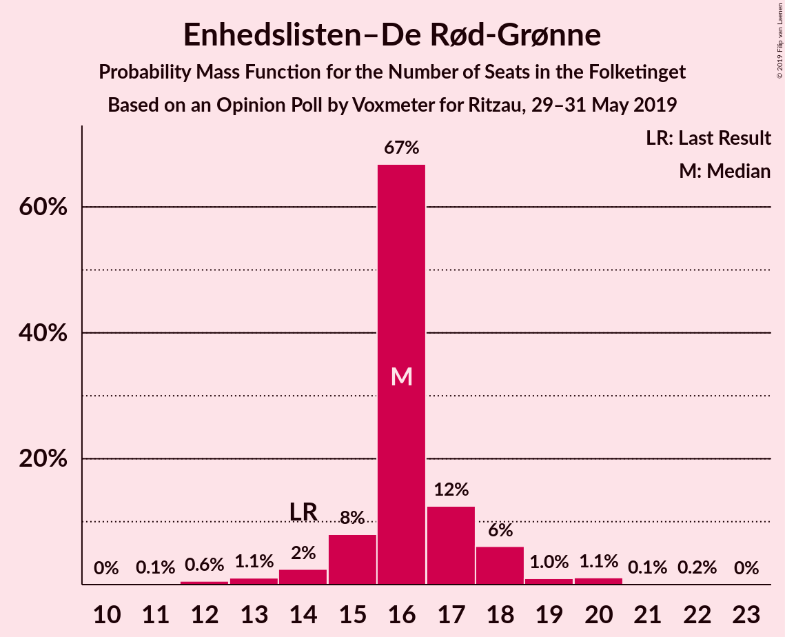

| Number of Seats | Probability | Accumulated | Special Marks |
|:---------------:|:-----------:|:-----------:|:-------------:|
| 11 | 0.1% | 100% |  |
| 12 | 0.6% | 99.9% |  |
| 13 | 1.1% | 99.3% |  |
| 14 | 2% | 98% | Last Result |
| 15 | 8% | 96% |  |
| 16 | 67% | 88% | Median |
| 17 | 12% | 21% |  |
| 18 | 6% | 8% |  |
| 19 | 1.0% | 2% |  |
| 20 | 1.1% | 1.4% |  |
| 21 | 0.1% | 0.3% |  |
| 22 | 0.2% | 0.2% |  |
| 23 | 0% | 0% |  |

### Radikale Venstre

*For a full overview of the results for this party, see the [Radikale Venstre](party-radikalevenstre.html) page.*

| Number of Seats | Probability | Accumulated | Special Marks |
|:---------------:|:-----------:|:-----------:|:-------------:|
| 8 | 0% | 100% | Last Result |
| 9 | 0% | 100% |  |
| 10 | 0% | 100% |  |
| 11 | 1.1% | 100% |  |
| 12 | 0.7% | 98.9% |  |
| 13 | 1.1% | 98% |  |
| 14 | 4% | 97% |  |
| 15 | 70% | 93% | Median |
| 16 | 17% | 23% |  |
| 17 | 2% | 6% |  |
| 18 | 2% | 3% |  |
| 19 | 0.6% | 1.5% |  |
| 20 | 0.4% | 0.9% |  |
| 21 | 0.4% | 0.5% |  |
| 22 | 0.1% | 0.1% |  |
| 23 | 0% | 0% |  |

### Socialistisk Folkeparti

*For a full overview of the results for this party, see the [Socialistisk Folkeparti](party-socialistiskfolkeparti.html) page.*

| Number of Seats | Probability | Accumulated | Special Marks |
|:---------------:|:-----------:|:-----------:|:-------------:|
| 7 | 0% | 100% | Last Result |
| 8 | 0% | 100% |  |
| 9 | 0% | 100% |  |
| 10 | 0.5% | 100% |  |
| 11 | 0.7% | 99.4% |  |
| 12 | 58% | 98.7% | Median |
| 13 | 9% | 40% |  |
| 14 | 10% | 32% |  |
| 15 | 4% | 21% |  |
| 16 | 7% | 17% |  |
| 17 | 6% | 10% |  |
| 18 | 4% | 4% |  |
| 19 | 0.2% | 0.3% |  |
| 20 | 0.1% | 0.1% |  |
| 21 | 0% | 0% |  |

### Det Konservative Folkeparti

*For a full overview of the results for this party, see the [Det Konservative Folkeparti](party-detkonservativefolkeparti.html) page.*

| Number of Seats | Probability | Accumulated | Special Marks |
|:---------------:|:-----------:|:-----------:|:-------------:|
| 6 | 0.7% | 100% | Last Result |
| 7 | 1.1% | 99.2% |  |
| 8 | 4% | 98% |  |
| 9 | 72% | 94% | Median |
| 10 | 8% | 22% |  |
| 11 | 4% | 14% |  |
| 12 | 10% | 11% |  |
| 13 | 0.7% | 0.8% |  |
| 14 | 0.1% | 0.1% |  |
| 15 | 0% | 0% |  |

### Liberal Alliance

*For a full overview of the results for this party, see the [Liberal Alliance](party-liberalalliance.html) page.*

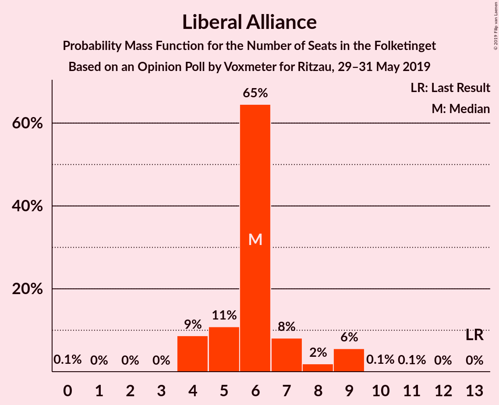

| Number of Seats | Probability | Accumulated | Special Marks |
|:---------------:|:-----------:|:-----------:|:-------------:|
| 0 | 0.1% | 100% |  |
| 1 | 0% | 99.9% |  |
| 2 | 0% | 99.9% |  |
| 3 | 0% | 99.9% |  |
| 4 | 9% | 99.9% |  |
| 5 | 11% | 91% |  |
| 6 | 65% | 80% | Median |
| 7 | 8% | 16% |  |
| 8 | 2% | 8% |  |
| 9 | 6% | 6% |  |
| 10 | 0.1% | 0.2% |  |
| 11 | 0.1% | 0.1% |  |
| 12 | 0% | 0% |  |
| 13 | 0% | 0% | Last Result |

### Alternativet

*For a full overview of the results for this party, see the [Alternativet](party-alternativet.html) page.*

| Number of Seats | Probability | Accumulated | Special Marks |
|:---------------:|:-----------:|:-----------:|:-------------:|
| 0 | 9% | 100% |  |
| 1 | 0% | 91% |  |
| 2 | 0% | 91% |  |
| 3 | 0% | 91% |  |
| 4 | 7% | 91% |  |
| 5 | 10% | 84% |  |
| 6 | 64% | 74% | Median |
| 7 | 8% | 10% |  |
| 8 | 0.7% | 1.5% |  |
| 9 | 0.6% | 0.8% | Last Result |
| 10 | 0.1% | 0.1% |  |
| 11 | 0% | 0% |  |

### Nye Borgerlige

*For a full overview of the results for this party, see the [Nye Borgerlige](party-nyeborgerlige.html) page.*

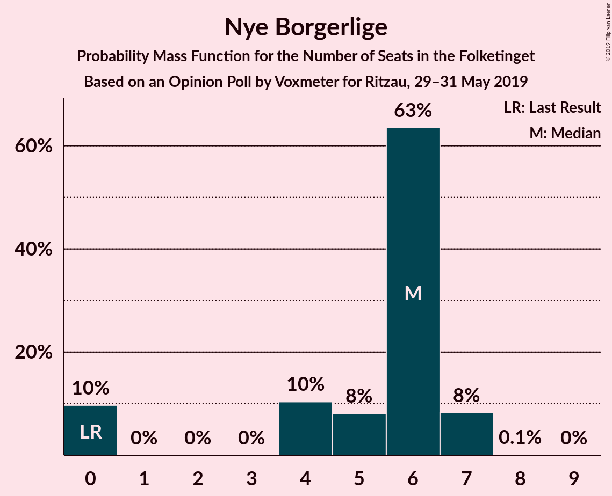

| Number of Seats | Probability | Accumulated | Special Marks |
|:---------------:|:-----------:|:-----------:|:-------------:|
| 0 | 10% | 100% | Last Result |
| 1 | 0% | 90% |  |
| 2 | 0% | 90% |  |
| 3 | 0% | 90% |  |
| 4 | 10% | 90% |  |
| 5 | 8% | 80% |  |
| 6 | 63% | 72% | Median |
| 7 | 8% | 8% |  |
| 8 | 0.1% | 0.1% |  |
| 9 | 0% | 0% |  |

### Stram Kurs

*For a full overview of the results for this party, see the [Stram Kurs](party-stramkurs.html) page.*

| Number of Seats | Probability | Accumulated | Special Marks |
|:---------------:|:-----------:|:-----------:|:-------------:|
| 0 | 36% | 100% | Last Result |
| 1 | 0% | 64% |  |
| 2 | 0% | 64% |  |
| 3 | 0% | 64% |  |
| 4 | 61% | 64% | Median |
| 5 | 2% | 3% |  |
| 6 | 0.9% | 0.9% |  |
| 7 | 0% | 0% |  |

### Kristendemokraterne

*For a full overview of the results for this party, see the [Kristendemokraterne](party-kristendemokraterne.html) page.*

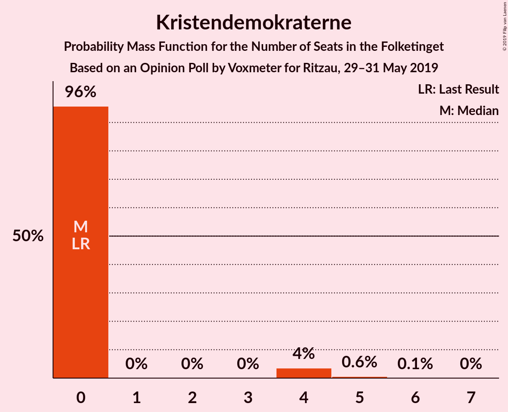

| Number of Seats | Probability | Accumulated | Special Marks |
|:---------------:|:-----------:|:-----------:|:-------------:|
| 0 | 96% | 100% | Last Result, Median |
| 1 | 0% | 4% |  |
| 2 | 0% | 4% |  |
| 3 | 0% | 4% |  |
| 4 | 4% | 4% |  |
| 5 | 0.6% | 0.7% |  |
| 6 | 0.1% | 0.1% |  |
| 7 | 0% | 0% |  |

### Klaus Riskær Pedersen

*For a full overview of the results for this party, see the [Klaus Riskær Pedersen](party-klausriskærpedersen.html) page.*

| Number of Seats | Probability | Accumulated | Special Marks |
|:---------------:|:-----------:|:-----------:|:-------------:|
| 0 | 100% | 100% | Last Result, Median |

## Coalitions

### Confidence Intervals

| Coalition | Last Result | Median | Majority? | 80% Confidence Interval | 90% Confidence Interval | 95% Confidence Interval | 99% Confidence Interval |
|:---------:|:-----------:|:------:|:---------:|:-----------------------:|:-----------------------:|:-----------------------:|:-----------------------:|
| Socialdemokraterne – Enhedslisten–De Rød-Grønne – Radikale Venstre – Socialistisk Folkeparti – Alternativet | 85 | 96 | 100% | 96–104 | 96–105 | 96–106 | 94–107 |
| Socialdemokraterne – Enhedslisten–De Rød-Grønne – Radikale Venstre – Socialistisk Folkeparti | 76 | 90 | 98% | 90–99 | 90–102 | 90–104 | 87–104 |
| Socialdemokraterne – Enhedslisten–De Rød-Grønne – Socialistisk Folkeparti – Alternativet | 77 | 81 | 5% | 81–88 | 81–89 | 80–90 | 78–92 |
| Socialdemokraterne – Enhedslisten–De Rød-Grønne – Socialistisk Folkeparti | 68 | 75 | 0% | 75–84 | 75–86 | 74–88 | 72–88 |
| Socialdemokraterne – Radikale Venstre – Socialistisk Folkeparti | 62 | 74 | 0% | 74–84 | 74–86 | 74–88 | 71–88 |
| Venstre – Dansk Folkeparti – Det Konservative Folkeparti – Liberal Alliance – Nye Borgerlige – Stram Kurs – Kristendemokraterne – Klaus Riskær Pedersen | 90 | 79 | 0% | 71–79 | 70–79 | 69–79 | 68–81 |
| Venstre – Dansk Folkeparti – Det Konservative Folkeparti – Liberal Alliance – Nye Borgerlige – Kristendemokraterne – Klaus Riskær Pedersen | 90 | 75 | 0% | 71–76 | 68–77 | 67–79 | 65–81 |
| Venstre – Dansk Folkeparti – Det Konservative Folkeparti – Liberal Alliance – Nye Borgerlige – Kristendemokraterne | 90 | 75 | 0% | 71–76 | 68–77 | 67–79 | 65–81 |
| Venstre – Dansk Folkeparti – Det Konservative Folkeparti – Liberal Alliance – Nye Borgerlige – Klaus Riskær Pedersen | 90 | 75 | 0% | 71–75 | 68–76 | 66–79 | 64–80 |
| Venstre – Dansk Folkeparti – Det Konservative Folkeparti – Liberal Alliance – Nye Borgerlige | 90 | 75 | 0% | 71–75 | 68–76 | 66–79 | 64–80 |
| Venstre – Dansk Folkeparti – Det Konservative Folkeparti – Liberal Alliance – Kristendemokraterne | 90 | 69 | 0% | 66–71 | 65–72 | 64–73 | 59–77 |
| Venstre – Dansk Folkeparti – Det Konservative Folkeparti – Liberal Alliance | 90 | 69 | 0% | 66–71 | 65–72 | 62–73 | 59–77 |
| Socialdemokraterne – Radikale Venstre | 55 | 62 | 0% | 62–68 | 60–70 | 60–72 | 58–72 |
| Venstre – Det Konservative Folkeparti – Liberal Alliance | 53 | 46 | 0% | 45–51 | 45–52 | 43–52 | 40–56 |
| Venstre – Det Konservative Folkeparti | 40 | 40 | 0% | 40–45 | 39–46 | 38–46 | 35–49 |
| Venstre | 34 | 31 | 0% | 31–34 | 30–36 | 28–36 | 27–38 |

### Socialdemokraterne – Enhedslisten–De Rød-Grønne – Radikale Venstre – Socialistisk Folkeparti – Alternativet

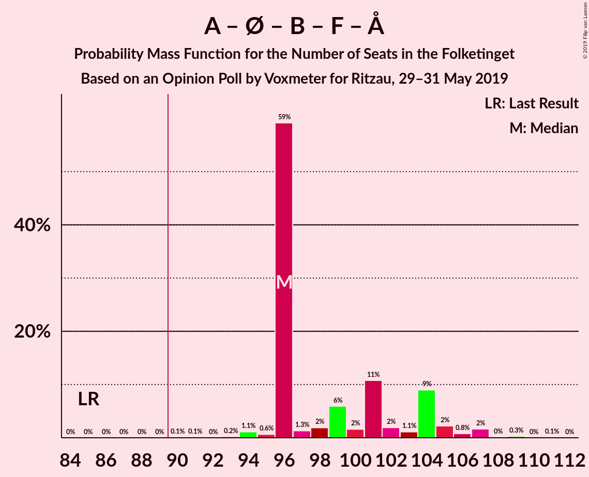

| Number of Seats | Probability | Accumulated | Special Marks |
|:---------------:|:-----------:|:-----------:|:-------------:|
| 85 | 0% | 100% | Last Result |
| 86 | 0% | 100% |  |
| 87 | 0% | 100% |  |
| 88 | 0% | 100% |  |
| 89 | 0% | 100% |  |
| 90 | 0.1% | 100% | Majority |
| 91 | 0.1% | 99.9% |  |
| 92 | 0% | 99.8% |  |
| 93 | 0.2% | 99.8% |  |
| 94 | 1.1% | 99.6% |  |
| 95 | 0.6% | 98% |  |
| 96 | 59% | 98% | Median |
| 97 | 1.3% | 39% |  |
| 98 | 2% | 37% |  |
| 99 | 6% | 35% |  |
| 100 | 2% | 30% |  |
| 101 | 11% | 28% |  |
| 102 | 2% | 17% |  |
| 103 | 1.1% | 15% |  |
| 104 | 9% | 14% |  |
| 105 | 2% | 5% |  |
| 106 | 0.8% | 3% |  |
| 107 | 2% | 2% |  |
| 108 | 0% | 0.5% |  |
| 109 | 0.3% | 0.4% |  |
| 110 | 0% | 0.1% |  |
| 111 | 0.1% | 0.1% |  |
| 112 | 0% | 0% |  |

### Socialdemokraterne – Enhedslisten–De Rød-Grønne – Radikale Venstre – Socialistisk Folkeparti

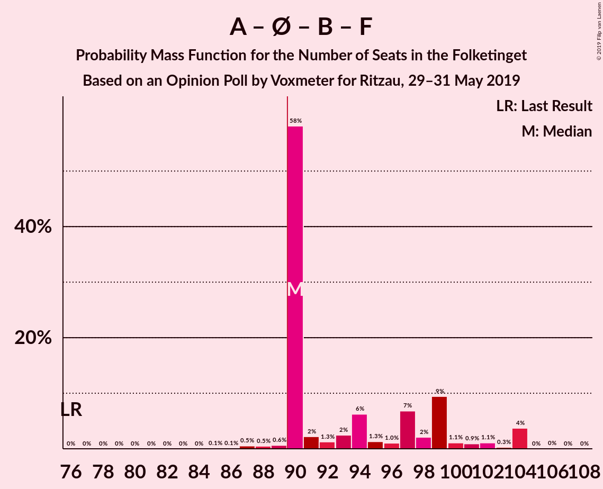

| Number of Seats | Probability | Accumulated | Special Marks |
|:---------------:|:-----------:|:-----------:|:-------------:|
| 76 | 0% | 100% | Last Result |
| 77 | 0% | 100% |  |
| 78 | 0% | 100% |  |
| 79 | 0% | 100% |  |
| 80 | 0% | 100% |  |
| 81 | 0% | 100% |  |
| 82 | 0% | 100% |  |
| 83 | 0% | 100% |  |
| 84 | 0% | 100% |  |
| 85 | 0.1% | 100% |  |
| 86 | 0.1% | 99.9% |  |
| 87 | 0.5% | 99.8% |  |
| 88 | 0.5% | 99.3% |  |
| 89 | 0.6% | 98.8% |  |
| 90 | 58% | 98% | Median, Majority |
| 91 | 2% | 40% |  |
| 92 | 1.3% | 38% |  |
| 93 | 2% | 37% |  |
| 94 | 6% | 34% |  |
| 95 | 1.3% | 28% |  |
| 96 | 1.0% | 27% |  |
| 97 | 7% | 26% |  |
| 98 | 2% | 19% |  |
| 99 | 9% | 17% |  |
| 100 | 1.1% | 7% |  |
| 101 | 0.9% | 6% |  |
| 102 | 1.1% | 5% |  |
| 103 | 0.3% | 4% |  |
| 104 | 4% | 4% |  |
| 105 | 0% | 0.1% |  |
| 106 | 0% | 0.1% |  |
| 107 | 0% | 0% |  |

### Socialdemokraterne – Enhedslisten–De Rød-Grønne – Socialistisk Folkeparti – Alternativet

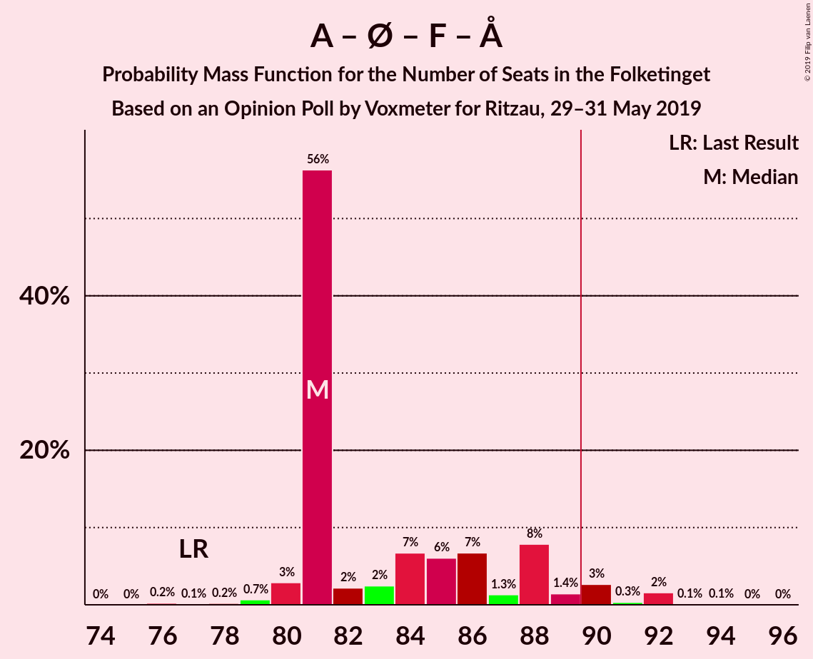

| Number of Seats | Probability | Accumulated | Special Marks |
|:---------------:|:-----------:|:-----------:|:-------------:|
| 75 | 0% | 100% |  |
| 76 | 0.2% | 99.9% |  |
| 77 | 0.1% | 99.7% | Last Result |
| 78 | 0.2% | 99.6% |  |
| 79 | 0.7% | 99.4% |  |
| 80 | 3% | 98.8% |  |
| 81 | 56% | 96% | Median |
| 82 | 2% | 40% |  |
| 83 | 2% | 37% |  |
| 84 | 7% | 35% |  |
| 85 | 6% | 28% |  |
| 86 | 7% | 22% |  |
| 87 | 1.3% | 15% |  |
| 88 | 8% | 14% |  |
| 89 | 1.4% | 6% |  |
| 90 | 3% | 5% | Majority |
| 91 | 0.3% | 2% |  |
| 92 | 2% | 2% |  |
| 93 | 0.1% | 0.2% |  |
| 94 | 0.1% | 0.1% |  |
| 95 | 0% | 0% |  |

### Socialdemokraterne – Enhedslisten–De Rød-Grønne – Socialistisk Folkeparti

| Number of Seats | Probability | Accumulated | Special Marks |
|:---------------:|:-----------:|:-----------:|:-------------:|
| 68 | 0% | 100% | Last Result |
| 69 | 0% | 100% |  |
| 70 | 0.1% | 100% |  |
| 71 | 0.2% | 99.9% |  |
| 72 | 0.3% | 99.7% |  |
| 73 | 0.1% | 99.4% |  |
| 74 | 2% | 99.2% |  |
| 75 | 57% | 97% | Median |
| 76 | 2% | 40% |  |
| 77 | 3% | 38% |  |
| 78 | 2% | 35% |  |
| 79 | 6% | 34% |  |
| 80 | 2% | 27% |  |
| 81 | 6% | 25% |  |
| 82 | 3% | 19% |  |
| 83 | 4% | 17% |  |
| 84 | 6% | 12% |  |
| 85 | 0.5% | 6% |  |
| 86 | 0.8% | 6% |  |
| 87 | 0.8% | 5% |  |
| 88 | 4% | 4% |  |
| 89 | 0.1% | 0.1% |  |
| 90 | 0% | 0% | Majority |

### Socialdemokraterne – Radikale Venstre – Socialistisk Folkeparti

| Number of Seats | Probability | Accumulated | Special Marks |
|:---------------:|:-----------:|:-----------:|:-------------:|
| 62 | 0% | 100% | Last Result |
| 63 | 0% | 100% |  |
| 64 | 0% | 100% |  |
| 65 | 0% | 100% |  |
| 66 | 0% | 100% |  |
| 67 | 0% | 100% |  |
| 68 | 0% | 100% |  |
| 69 | 0% | 100% |  |
| 70 | 0.1% | 99.9% |  |
| 71 | 0.6% | 99.9% |  |
| 72 | 0.3% | 99.3% |  |
| 73 | 0.2% | 99.0% |  |
| 74 | 58% | 98.8% | Median |
| 75 | 2% | 40% |  |
| 76 | 7% | 39% |  |
| 77 | 2% | 32% |  |
| 78 | 2% | 30% |  |
| 79 | 2% | 28% |  |
| 80 | 6% | 26% |  |
| 81 | 3% | 20% |  |
| 82 | 5% | 17% |  |
| 83 | 2% | 13% |  |
| 84 | 5% | 11% |  |
| 85 | 0.1% | 5% |  |
| 86 | 0.8% | 5% |  |
| 87 | 0.2% | 4% |  |
| 88 | 4% | 4% |  |
| 89 | 0.1% | 0.1% |  |
| 90 | 0% | 0% | Majority |

### Venstre – Dansk Folkeparti – Det Konservative Folkeparti – Liberal Alliance – Nye Borgerlige – Stram Kurs – Kristendemokraterne – Klaus Riskær Pedersen

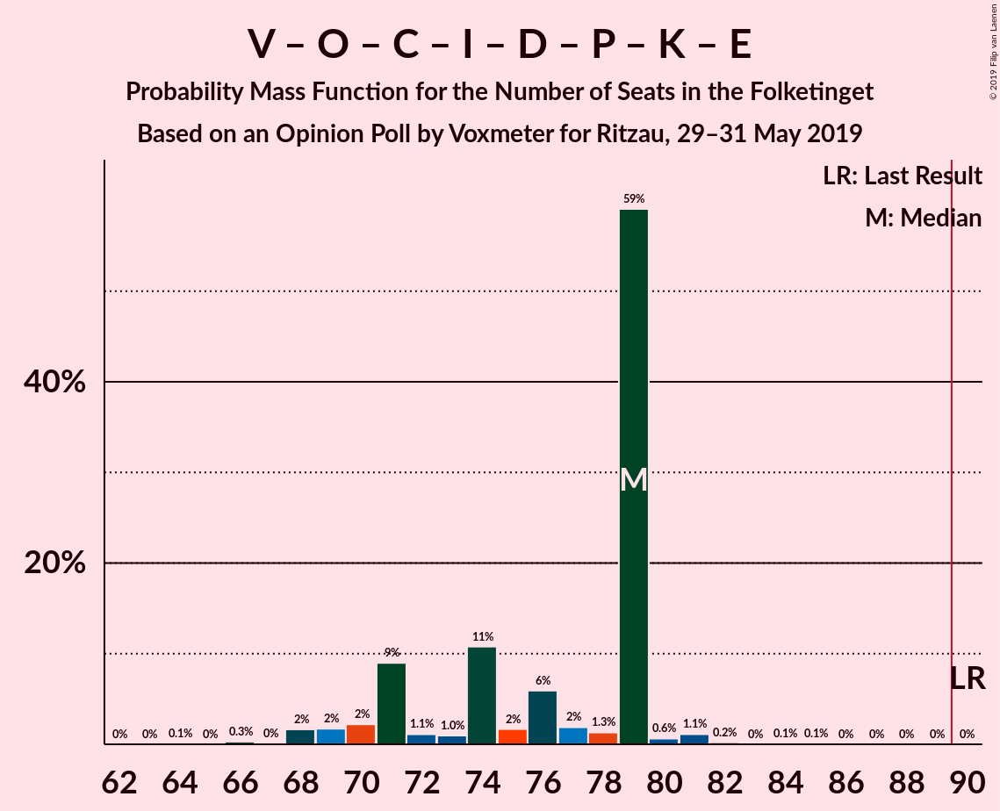

| Number of Seats | Probability | Accumulated | Special Marks |
|:---------------:|:-----------:|:-----------:|:-------------:|
| 64 | 0.1% | 100% |  |
| 65 | 0% | 99.9% |  |
| 66 | 0.3% | 99.9% |  |
| 67 | 0% | 99.6% |  |
| 68 | 2% | 99.5% |  |
| 69 | 2% | 98% |  |
| 70 | 2% | 96% |  |
| 71 | 9% | 94% |  |
| 72 | 1.1% | 85% |  |
| 73 | 1.0% | 84% |  |
| 74 | 11% | 83% |  |
| 75 | 2% | 72% |  |
| 76 | 6% | 70% |  |
| 77 | 2% | 64% |  |
| 78 | 1.3% | 63% |  |
| 79 | 59% | 61% | Median |
| 80 | 0.6% | 2% |  |
| 81 | 1.1% | 2% |  |
| 82 | 0.2% | 0.4% |  |
| 83 | 0% | 0.2% |  |
| 84 | 0.1% | 0.2% |  |
| 85 | 0.1% | 0.1% |  |
| 86 | 0% | 0% |  |
| 87 | 0% | 0% |  |
| 88 | 0% | 0% |  |
| 89 | 0% | 0% |  |
| 90 | 0% | 0% | Last Result, Majority |

### Venstre – Dansk Folkeparti – Det Konservative Folkeparti – Liberal Alliance – Nye Borgerlige – Kristendemokraterne – Klaus Riskær Pedersen

| Number of Seats | Probability | Accumulated | Special Marks |
|:---------------:|:-----------:|:-----------:|:-------------:|
| 63 | 0% | 100% |  |
| 64 | 0.1% | 99.9% |  |
| 65 | 1.2% | 99.8% |  |
| 66 | 0.7% | 98.6% |  |
| 67 | 0.7% | 98% |  |
| 68 | 2% | 97% |  |
| 69 | 1.2% | 95% |  |
| 70 | 2% | 94% |  |
| 71 | 9% | 92% |  |
| 72 | 2% | 83% |  |
| 73 | 1.2% | 81% |  |
| 74 | 11% | 80% |  |
| 75 | 57% | 69% | Median |
| 76 | 6% | 12% |  |
| 77 | 2% | 6% |  |
| 78 | 0.3% | 4% |  |
| 79 | 3% | 3% |  |
| 80 | 0.3% | 0.8% |  |
| 81 | 0.4% | 0.6% |  |
| 82 | 0.2% | 0.2% |  |
| 83 | 0% | 0% |  |
| 84 | 0% | 0% |  |
| 85 | 0% | 0% |  |
| 86 | 0% | 0% |  |
| 87 | 0% | 0% |  |
| 88 | 0% | 0% |  |
| 89 | 0% | 0% |  |
| 90 | 0% | 0% | Last Result, Majority |

### Venstre – Dansk Folkeparti – Det Konservative Folkeparti – Liberal Alliance – Nye Borgerlige – Kristendemokraterne

| Number of Seats | Probability | Accumulated | Special Marks |
|:---------------:|:-----------:|:-----------:|:-------------:|
| 63 | 0% | 100% |  |
| 64 | 0.1% | 99.9% |  |
| 65 | 1.2% | 99.8% |  |
| 66 | 0.7% | 98.6% |  |
| 67 | 0.7% | 98% |  |
| 68 | 2% | 97% |  |
| 69 | 1.2% | 95% |  |
| 70 | 2% | 94% |  |
| 71 | 9% | 92% |  |
| 72 | 2% | 83% |  |
| 73 | 1.2% | 81% |  |
| 74 | 11% | 80% |  |
| 75 | 57% | 69% | Median |
| 76 | 6% | 12% |  |
| 77 | 2% | 6% |  |
| 78 | 0.3% | 4% |  |
| 79 | 3% | 3% |  |
| 80 | 0.3% | 0.8% |  |
| 81 | 0.4% | 0.6% |  |
| 82 | 0.2% | 0.2% |  |
| 83 | 0% | 0% |  |
| 84 | 0% | 0% |  |
| 85 | 0% | 0% |  |
| 86 | 0% | 0% |  |
| 87 | 0% | 0% |  |
| 88 | 0% | 0% |  |
| 89 | 0% | 0% |  |
| 90 | 0% | 0% | Last Result, Majority |

### Venstre – Dansk Folkeparti – Det Konservative Folkeparti – Liberal Alliance – Nye Borgerlige – Klaus Riskær Pedersen

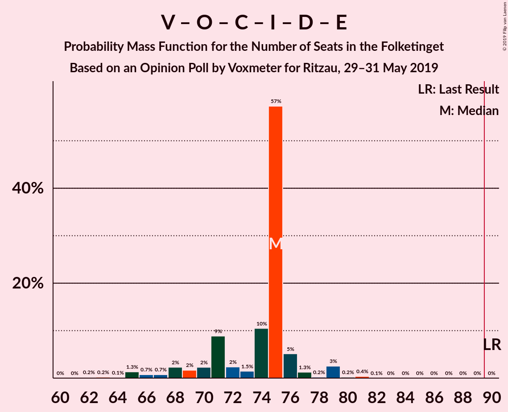

| Number of Seats | Probability | Accumulated | Special Marks |
|:---------------:|:-----------:|:-----------:|:-------------:|
| 62 | 0.2% | 100% |  |
| 63 | 0.2% | 99.8% |  |
| 64 | 0.1% | 99.6% |  |
| 65 | 1.3% | 99.4% |  |
| 66 | 0.7% | 98% |  |
| 67 | 0.7% | 97% |  |
| 68 | 2% | 97% |  |
| 69 | 2% | 94% |  |
| 70 | 2% | 93% |  |
| 71 | 9% | 90% |  |
| 72 | 2% | 81% |  |
| 73 | 1.5% | 79% |  |
| 74 | 10% | 78% |  |
| 75 | 57% | 67% | Median |
| 76 | 5% | 10% |  |
| 77 | 1.3% | 5% |  |
| 78 | 0.2% | 3% |  |
| 79 | 3% | 3% |  |
| 80 | 0.2% | 0.7% |  |
| 81 | 0.4% | 0.4% |  |
| 82 | 0.1% | 0.1% |  |
| 83 | 0% | 0% |  |
| 84 | 0% | 0% |  |
| 85 | 0% | 0% |  |
| 86 | 0% | 0% |  |
| 87 | 0% | 0% |  |
| 88 | 0% | 0% |  |
| 89 | 0% | 0% |  |
| 90 | 0% | 0% | Last Result, Majority |

### Venstre – Dansk Folkeparti – Det Konservative Folkeparti – Liberal Alliance – Nye Borgerlige

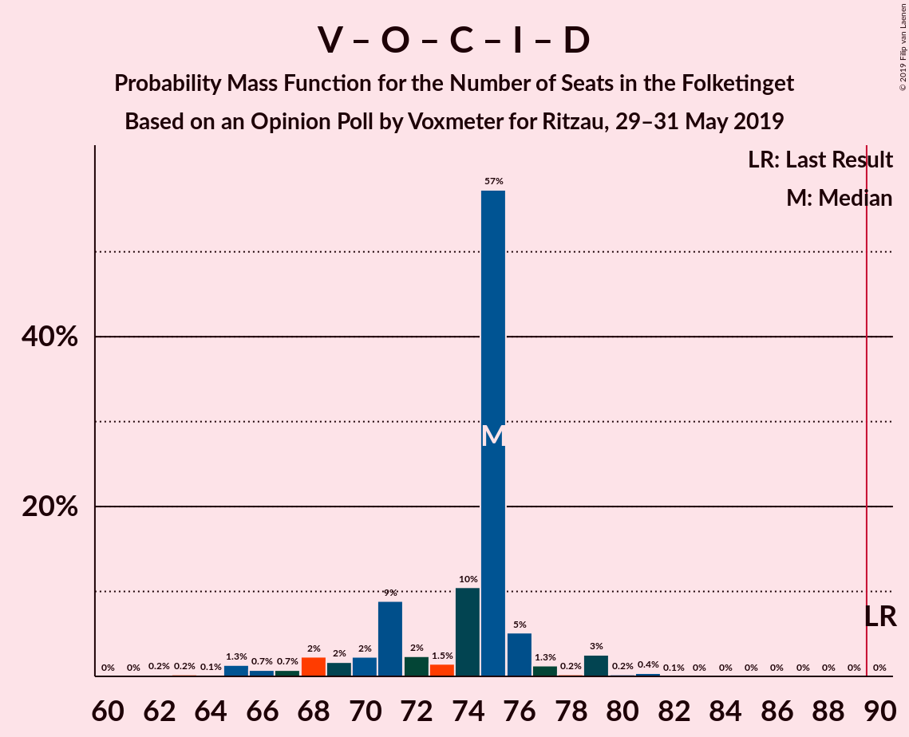

| Number of Seats | Probability | Accumulated | Special Marks |
|:---------------:|:-----------:|:-----------:|:-------------:|
| 62 | 0.2% | 100% |  |
| 63 | 0.2% | 99.8% |  |
| 64 | 0.1% | 99.6% |  |
| 65 | 1.3% | 99.4% |  |
| 66 | 0.7% | 98% |  |
| 67 | 0.7% | 97% |  |
| 68 | 2% | 97% |  |
| 69 | 2% | 94% |  |
| 70 | 2% | 93% |  |
| 71 | 9% | 90% |  |
| 72 | 2% | 81% |  |
| 73 | 1.5% | 79% |  |
| 74 | 10% | 78% |  |
| 75 | 57% | 67% | Median |
| 76 | 5% | 10% |  |
| 77 | 1.3% | 5% |  |
| 78 | 0.2% | 3% |  |
| 79 | 3% | 3% |  |
| 80 | 0.2% | 0.7% |  |
| 81 | 0.4% | 0.4% |  |
| 82 | 0.1% | 0.1% |  |
| 83 | 0% | 0% |  |
| 84 | 0% | 0% |  |
| 85 | 0% | 0% |  |
| 86 | 0% | 0% |  |
| 87 | 0% | 0% |  |
| 88 | 0% | 0% |  |
| 89 | 0% | 0% |  |
| 90 | 0% | 0% | Last Result, Majority |

### Venstre – Dansk Folkeparti – Det Konservative Folkeparti – Liberal Alliance – Kristendemokraterne

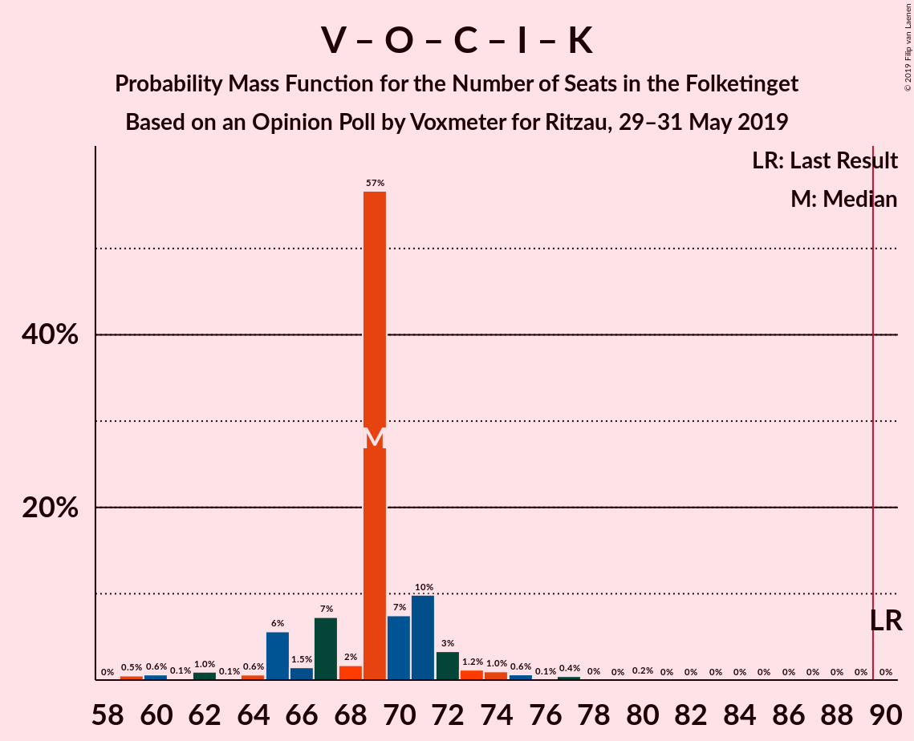

| Number of Seats | Probability | Accumulated | Special Marks |
|:---------------:|:-----------:|:-----------:|:-------------:|
| 59 | 0.5% | 100% |  |
| 60 | 0.6% | 99.5% |  |
| 61 | 0.1% | 98.8% |  |
| 62 | 1.0% | 98.7% |  |
| 63 | 0.1% | 98% |  |
| 64 | 0.6% | 98% |  |
| 65 | 6% | 97% |  |
| 66 | 1.5% | 91% |  |
| 67 | 7% | 90% |  |
| 68 | 2% | 83% |  |
| 69 | 57% | 81% | Median |
| 70 | 7% | 24% |  |
| 71 | 10% | 17% |  |
| 72 | 3% | 7% |  |
| 73 | 1.2% | 4% |  |
| 74 | 1.0% | 2% |  |
| 75 | 0.6% | 1.4% |  |
| 76 | 0.1% | 0.8% |  |
| 77 | 0.4% | 0.7% |  |
| 78 | 0% | 0.2% |  |
| 79 | 0% | 0.2% |  |
| 80 | 0.2% | 0.2% |  |
| 81 | 0% | 0% |  |
| 82 | 0% | 0% |  |
| 83 | 0% | 0% |  |
| 84 | 0% | 0% |  |
| 85 | 0% | 0% |  |
| 86 | 0% | 0% |  |
| 87 | 0% | 0% |  |
| 88 | 0% | 0% |  |
| 89 | 0% | 0% |  |
| 90 | 0% | 0% | Last Result, Majority |

### Venstre – Dansk Folkeparti – Det Konservative Folkeparti – Liberal Alliance

| Number of Seats | Probability | Accumulated | Special Marks |
|:---------------:|:-----------:|:-----------:|:-------------:|
| 58 | 0.1% | 100% |  |
| 59 | 0.5% | 99.9% |  |
| 60 | 0.8% | 99.3% |  |
| 61 | 0.4% | 98.6% |  |
| 62 | 1.1% | 98% |  |
| 63 | 0.7% | 97% |  |
| 64 | 0.7% | 96% |  |
| 65 | 6% | 96% |  |
| 66 | 1.5% | 90% |  |
| 67 | 8% | 89% |  |
| 68 | 2% | 81% |  |
| 69 | 57% | 79% | Median |
| 70 | 7% | 22% |  |
| 71 | 9% | 15% |  |
| 72 | 2% | 6% |  |
| 73 | 1.1% | 3% |  |
| 74 | 0.7% | 2% |  |
| 75 | 0.6% | 1.2% |  |
| 76 | 0% | 0.6% |  |
| 77 | 0.4% | 0.6% |  |
| 78 | 0% | 0.2% |  |
| 79 | 0% | 0.2% |  |
| 80 | 0.2% | 0.2% |  |
| 81 | 0% | 0% |  |
| 82 | 0% | 0% |  |
| 83 | 0% | 0% |  |
| 84 | 0% | 0% |  |
| 85 | 0% | 0% |  |
| 86 | 0% | 0% |  |
| 87 | 0% | 0% |  |
| 88 | 0% | 0% |  |
| 89 | 0% | 0% |  |
| 90 | 0% | 0% | Last Result, Majority |

### Socialdemokraterne – Radikale Venstre

| Number of Seats | Probability | Accumulated | Special Marks |
|:---------------:|:-----------:|:-----------:|:-------------:|
| 55 | 0% | 100% | Last Result |
| 56 | 0% | 99.9% |  |
| 57 | 0% | 99.9% |  |
| 58 | 0.7% | 99.9% |  |
| 59 | 0.8% | 99.2% |  |
| 60 | 4% | 98% |  |
| 61 | 2% | 95% |  |
| 62 | 56% | 93% | Median |
| 63 | 6% | 36% |  |
| 64 | 5% | 30% |  |
| 65 | 2% | 25% |  |
| 66 | 8% | 23% |  |
| 67 | 5% | 15% |  |
| 68 | 3% | 10% |  |
| 69 | 1.4% | 7% |  |
| 70 | 2% | 6% |  |
| 71 | 0.2% | 4% |  |
| 72 | 4% | 4% |  |
| 73 | 0% | 0.4% |  |
| 74 | 0.1% | 0.4% |  |
| 75 | 0.2% | 0.3% |  |
| 76 | 0.1% | 0.2% |  |
| 77 | 0% | 0% |  |

### Venstre – Det Konservative Folkeparti – Liberal Alliance

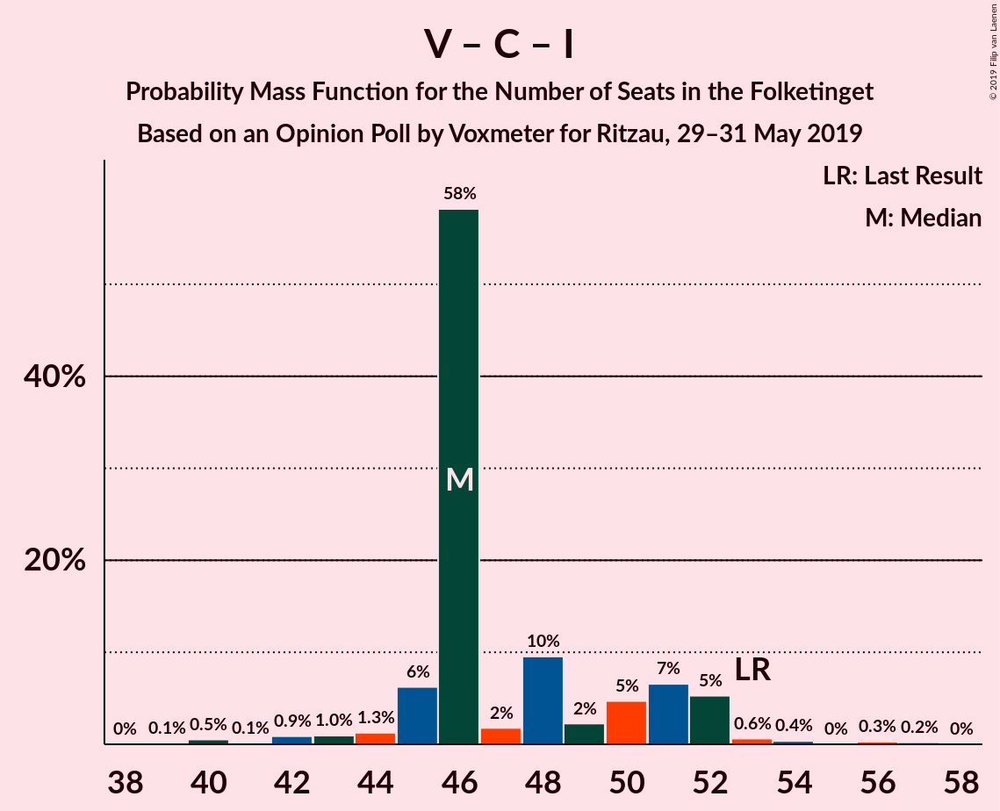

| Number of Seats | Probability | Accumulated | Special Marks |
|:---------------:|:-----------:|:-----------:|:-------------:|
| 39 | 0.1% | 100% |  |
| 40 | 0.5% | 99.9% |  |
| 41 | 0.1% | 99.3% |  |
| 42 | 0.9% | 99.3% |  |
| 43 | 1.0% | 98% |  |
| 44 | 1.3% | 97% |  |
| 45 | 6% | 96% |  |
| 46 | 58% | 90% | Median |
| 47 | 2% | 32% |  |
| 48 | 10% | 30% |  |
| 49 | 2% | 20% |  |
| 50 | 5% | 18% |  |
| 51 | 7% | 13% |  |
| 52 | 5% | 7% |  |
| 53 | 0.6% | 2% | Last Result |
| 54 | 0.4% | 0.9% |  |
| 55 | 0% | 0.6% |  |
| 56 | 0.3% | 0.5% |  |
| 57 | 0.2% | 0.2% |  |
| 58 | 0% | 0% |  |

### Venstre – Det Konservative Folkeparti

| Number of Seats | Probability | Accumulated | Special Marks |
|:---------------:|:-----------:|:-----------:|:-------------:|
| 33 | 0.1% | 100% |  |
| 34 | 0.1% | 99.9% |  |
| 35 | 0.8% | 99.8% |  |
| 36 | 0.6% | 99.0% |  |
| 37 | 0.5% | 98% |  |
| 38 | 3% | 98% |  |
| 39 | 2% | 95% |  |
| 40 | 57% | 93% | Last Result, Median |
| 41 | 6% | 36% |  |
| 42 | 10% | 30% |  |
| 43 | 6% | 20% |  |
| 44 | 2% | 14% |  |
| 45 | 5% | 11% |  |
| 46 | 5% | 7% |  |
| 47 | 0.7% | 2% |  |
| 48 | 0.6% | 1.1% |  |
| 49 | 0.5% | 0.5% |  |
| 50 | 0% | 0% |  |

### Venstre

| Number of Seats | Probability | Accumulated | Special Marks |
|:---------------:|:-----------:|:-----------:|:-------------:|
| 24 | 0.1% | 100% |  |
| 25 | 0% | 99.9% |  |
| 26 | 0.1% | 99.8% |  |
| 27 | 0.7% | 99.8% |  |
| 28 | 2% | 99.1% |  |
| 29 | 2% | 97% |  |
| 30 | 4% | 96% |  |
| 31 | 67% | 92% | Median |
| 32 | 2% | 25% |  |
| 33 | 9% | 23% |  |
| 34 | 6% | 14% | Last Result |
| 35 | 1.4% | 8% |  |
| 36 | 5% | 7% |  |
| 37 | 1.1% | 2% |  |
| 38 | 0.5% | 0.8% |  |
| 39 | 0% | 0.3% |  |
| 40 | 0.3% | 0.3% |  |
| 41 | 0% | 0% |  |

## Technical Information

### Opinion Poll

+ **Polling firm:** Voxmeter
+ **Commissioner(s):** Ritzau
+ **Fieldwork period:** 29–31 May 2019

### Calculations

+ **Sample size:** 1005
+ **Simulations done:** 1,048,576
+ **Error estimate:** 2.36%

