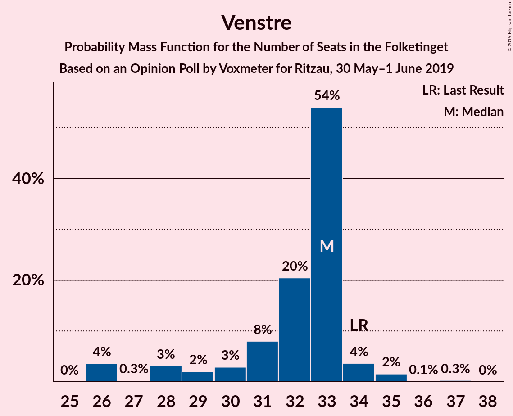
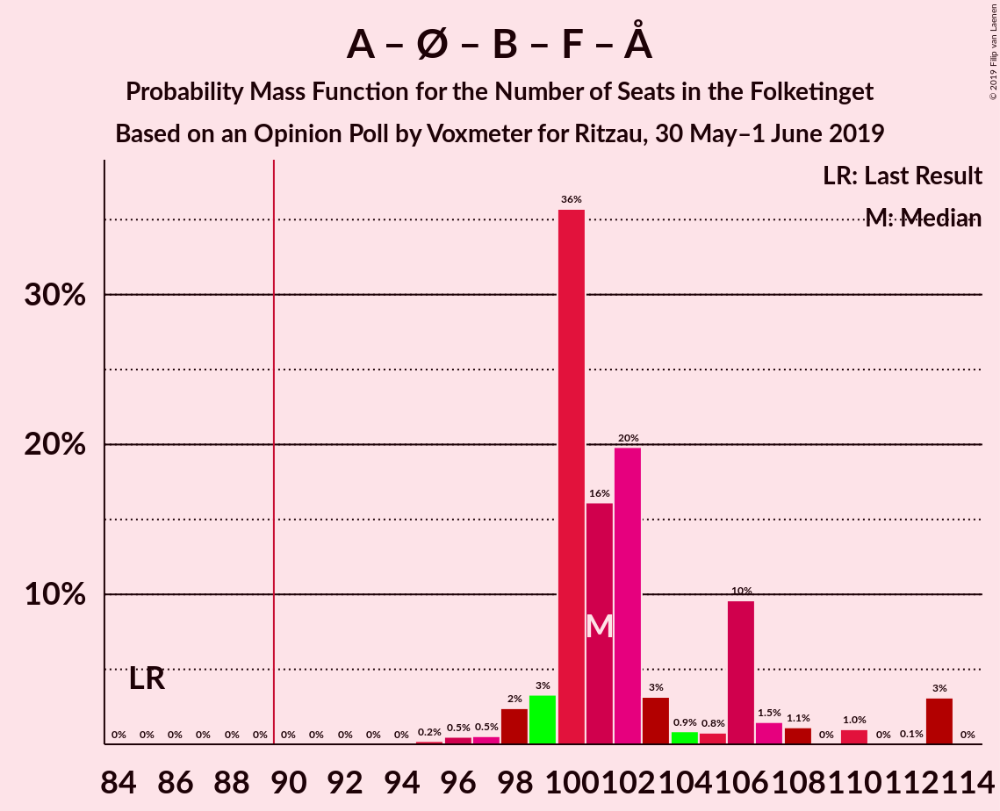
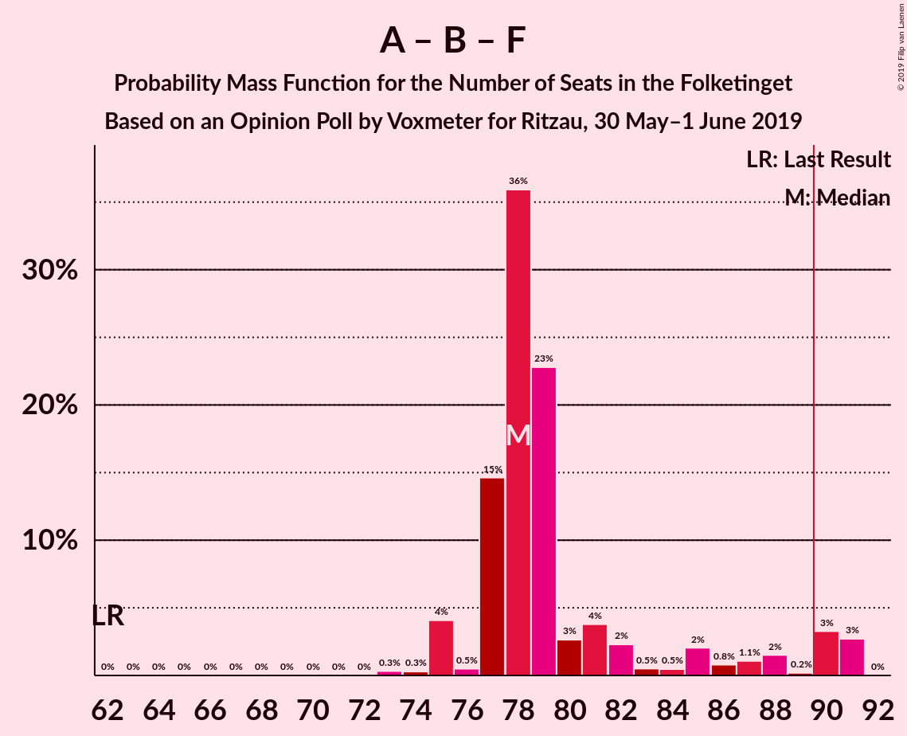
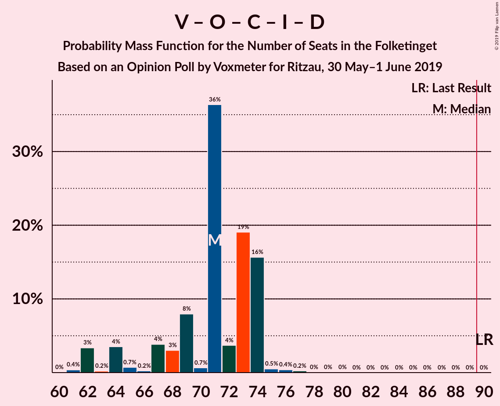

# Opinion Poll by Voxmeter for Ritzau, 30 May–1 June 2019

<a href="#voting-intentions">Voting Intentions</a> | <a href="#seats">Seats</a> | <a href="#coalitions">Coalitions</a> | <a href="#technical-information">Technical Information</a>

## Voting Intentions

### Confidence Intervals

| Party | Last Result | Poll Result | 80% Confidence Interval | 90% Confidence Interval | 95% Confidence Interval | 99% Confidence Interval |
|:-----:|:-----------:|:-----------:|:-----------------------:|:-----------------------:|:-----------------------:|:-----------------------:|
| Socialdemokraterne | 26.3% | 28.3% | 26.6–30.2% |26.1–30.7% |25.6–31.2% |24.8–32.1% |
| Venstre | 19.5% | 17.4% | 15.9–19.0% |15.5–19.5% |15.2–19.9% |14.5–20.7% |
| Dansk Folkeparti | 21.1% | 10.7% | 9.6–12.1% |9.2–12.5% |9.0–12.8% |8.4–13.5% |
| Enhedslisten–De Rød-Grønne | 7.8% | 9.5% | 8.4–10.8% |8.1–11.2% |7.9–11.5% |7.4–12.2% |
| Radikale Venstre | 4.6% | 8.4% | 7.4–9.7% |7.1–10.0% |6.9–10.3% |6.4–11.0% |
| Socialistisk Folkeparti | 4.2% | 8.3% | 7.2–9.5% |7.0–9.8% |6.7–10.1% |6.2–10.7% |
| Det Konservative Folkeparti | 3.4% | 5.0% | 4.2–6.0% |4.0–6.2% |3.8–6.5% |3.4–7.0% |
| Liberal Alliance | 7.5% | 3.0% | 2.4–3.8% |2.2–4.0% |2.1–4.2% |1.8–4.6% |
| Alternativet | 4.8% | 2.7% | 2.1–3.5% |2.0–3.7% |1.8–3.9% |1.6–4.3% |
| Nye Borgerlige | 0.0% | 2.5% | 2.0–3.2% |1.8–3.5% |1.7–3.7% |1.5–4.0% |
| Kristendemokraterne | 0.8% | 1.8% | 1.4–2.5% |1.2–2.7% |1.1–2.8% |1.0–3.2% |
| Stram Kurs | 0.0% | 1.6% | 1.2–2.2% |1.1–2.4% |1.0–2.6% |0.8–2.9% |
| Klaus Riskær Pedersen | 0.0% | 0.3% | 0.2–0.7% |0.1–0.8% |0.1–0.9% |0.1–1.1% |

*Note:* The poll result column reflects the actual value used in the calculations. Published results may vary slightly, and in addition be rounded to fewer digits.

## Seats

### Confidence Intervals

| Party | Last Result | Median | 80% Confidence Interval | 90% Confidence Interval | 95% Confidence Interval | 99% Confidence Interval |
|:-----:|:-----------:|:------:|:-----------------------:|:-----------------------:|:-----------------------:|:-----------------------:|
| <a href="#socialdemokraterne">Socialdemokraterne</a> | 47 | 50 | 49–50 |45–50 |45–53 |43–56 |
| <a href="#venstre">Venstre</a> | 34 | 31 | 31–32 |31–32 |30–35 |26–36 |
| <a href="#dansk-folkeparti">Dansk Folkeparti</a> | 37 | 20 | 20 |18–22 |17–22 |16–24 |
| <a href="#enhedslisten–de-rød-grønne">Enhedslisten–De Rød-Grønne</a> | 14 | 20 | 17–20 |16–20 |15–20 |13–21 |
| <a href="#radikale-venstre">Radikale Venstre</a> | 8 | 14 | 14 |14–16 |12–17 |10–20 |
| <a href="#socialistisk-folkeparti">Socialistisk Folkeparti</a> | 7 | 15 | 15 |15–16 |14–16 |12–18 |
| <a href="#det-konservative-folkeparti">Det Konservative Folkeparti</a> | 6 | 7 | 7–8 |7–9 |7–9 |6–12 |
| <a href="#liberal-alliance">Liberal Alliance</a> | 13 | 6 | 6 |5–7 |5–8 |0–8 |
| <a href="#alternativet">Alternativet</a> | 9 | 7 | 5–7 |5–7 |4–7 |4–7 |
| <a href="#nye-borgerlige">Nye Borgerlige</a> | 0 | 5 | 4–5 |4–5 |4–5 |0–8 |
| <a href="#kristendemokraterne">Kristendemokraterne</a> | 0 | 0 | 0–4 |0–4 |0–5 |0–6 |
| <a href="#stram-kurs">Stram Kurs</a> | 0 | 0 | 0 |0–4 |0–4 |0–5 |
| <a href="#klaus-riskær-pedersen">Klaus Riskær Pedersen</a> | 0 | 0 | 0 |0 |0 |0 |

### Socialdemokraterne

*For a full overview of the results for this party, see the [Socialdemokraterne](party-socialdemokraterne.html) page.*

| Number of Seats | Probability | Accumulated | Special Marks |
|:---------------:|:-----------:|:-----------:|:-------------:|
| 43 | 2% | 100% |  |
| 44 | 0.3% | 98% |  |
| 45 | 5% | 98% |  |
| 46 | 0.5% | 92% |  |
| 47 | 0.4% | 92% | Last Result |
| 48 | 0.2% | 92% |  |
| 49 | 2% | 91% |  |
| 50 | 86% | 89% | Median |
| 51 | 0.6% | 3% |  |
| 52 | 0.2% | 3% |  |
| 53 | 1.2% | 3% |  |
| 54 | 0.1% | 1.4% |  |
| 55 | 0% | 1.3% |  |
| 56 | 0.9% | 1.3% |  |
| 57 | 0.1% | 0.4% |  |
| 58 | 0.3% | 0.3% |  |
| 59 | 0.1% | 0.1% |  |
| 60 | 0% | 0% |  |

### Venstre

*For a full overview of the results for this party, see the [Venstre](party-venstre.html) page.*

| Number of Seats | Probability | Accumulated | Special Marks |
|:---------------:|:-----------:|:-----------:|:-------------:|
| 26 | 0.9% | 100% |  |
| 27 | 0.1% | 99.1% |  |
| 28 | 0.1% | 99.0% |  |
| 29 | 0.2% | 98.9% |  |
| 30 | 3% | 98.7% |  |
| 31 | 85% | 96% | Median |
| 32 | 6% | 10% |  |
| 33 | 0.5% | 4% |  |
| 34 | 0.1% | 3% | Last Result |
| 35 | 2% | 3% |  |
| 36 | 0.8% | 0.8% |  |
| 37 | 0% | 0.1% |  |
| 38 | 0% | 0% |  |

### Dansk Folkeparti

*For a full overview of the results for this party, see the [Dansk Folkeparti](party-danskfolkeparti.html) page.*

| Number of Seats | Probability | Accumulated | Special Marks |
|:---------------:|:-----------:|:-----------:|:-------------:|
| 14 | 0.1% | 100% |  |
| 15 | 0.4% | 99.9% |  |
| 16 | 2% | 99.5% |  |
| 17 | 0.3% | 98% |  |
| 18 | 4% | 97% |  |
| 19 | 0.5% | 94% |  |
| 20 | 83% | 93% | Median |
| 21 | 0.6% | 10% |  |
| 22 | 7% | 9% |  |
| 23 | 0.5% | 2% |  |
| 24 | 1.4% | 1.4% |  |
| 25 | 0% | 0% |  |
| 26 | 0% | 0% |  |
| 27 | 0% | 0% |  |
| 28 | 0% | 0% |  |
| 29 | 0% | 0% |  |
| 30 | 0% | 0% |  |
| 31 | 0% | 0% |  |
| 32 | 0% | 0% |  |
| 33 | 0% | 0% |  |
| 34 | 0% | 0% |  |
| 35 | 0% | 0% |  |
| 36 | 0% | 0% |  |
| 37 | 0% | 0% | Last Result |

### Enhedslisten–De Rød-Grønne

*For a full overview of the results for this party, see the [Enhedslisten–De Rød-Grønne](party-enhedslisten–derød-grønne.html) page.*

| Number of Seats | Probability | Accumulated | Special Marks |
|:---------------:|:-----------:|:-----------:|:-------------:|
| 12 | 0.1% | 100% |  |
| 13 | 1.4% | 99.9% |  |
| 14 | 0.9% | 98.5% | Last Result |
| 15 | 0.5% | 98% |  |
| 16 | 3% | 97% |  |
| 17 | 6% | 94% |  |
| 18 | 4% | 88% |  |
| 19 | 0.3% | 85% |  |
| 20 | 83% | 84% | Median |
| 21 | 0.7% | 0.8% |  |
| 22 | 0.1% | 0.1% |  |
| 23 | 0% | 0% |  |

### Radikale Venstre

*For a full overview of the results for this party, see the [Radikale Venstre](party-radikalevenstre.html) page.*

| Number of Seats | Probability | Accumulated | Special Marks |
|:---------------:|:-----------:|:-----------:|:-------------:|
| 8 | 0% | 100% | Last Result |
| 9 | 0% | 100% |  |
| 10 | 2% | 100% |  |
| 11 | 0.1% | 98% |  |
| 12 | 0.6% | 98% |  |
| 13 | 0.4% | 97% |  |
| 14 | 88% | 97% | Median |
| 15 | 3% | 8% |  |
| 16 | 2% | 5% |  |
| 17 | 1.4% | 3% |  |
| 18 | 0.1% | 2% |  |
| 19 | 0.8% | 2% |  |
| 20 | 0.9% | 1.1% |  |
| 21 | 0% | 0.2% |  |
| 22 | 0% | 0.2% |  |
| 23 | 0.2% | 0.2% |  |
| 24 | 0% | 0% |  |

### Socialistisk Folkeparti

*For a full overview of the results for this party, see the [Socialistisk Folkeparti](party-socialistiskfolkeparti.html) page.*

| Number of Seats | Probability | Accumulated | Special Marks |
|:---------------:|:-----------:|:-----------:|:-------------:|
| 7 | 0% | 100% | Last Result |
| 8 | 0% | 100% |  |
| 9 | 0% | 100% |  |
| 10 | 0% | 100% |  |
| 11 | 0.1% | 100% |  |
| 12 | 1.1% | 99.9% |  |
| 13 | 1.1% | 98.8% |  |
| 14 | 2% | 98% |  |
| 15 | 90% | 96% | Median |
| 16 | 4% | 6% |  |
| 17 | 0.1% | 2% |  |
| 18 | 2% | 2% |  |
| 19 | 0.1% | 0.3% |  |
| 20 | 0.1% | 0.3% |  |
| 21 | 0.2% | 0.2% |  |
| 22 | 0.1% | 0.1% |  |
| 23 | 0% | 0% |  |

### Det Konservative Folkeparti

*For a full overview of the results for this party, see the [Det Konservative Folkeparti](party-detkonservativefolkeparti.html) page.*

| Number of Seats | Probability | Accumulated | Special Marks |
|:---------------:|:-----------:|:-----------:|:-------------:|
| 6 | 1.0% | 100% | Last Result |
| 7 | 85% | 99.0% | Median |
| 8 | 5% | 14% |  |
| 9 | 7% | 9% |  |
| 10 | 0.3% | 2% |  |
| 11 | 1.0% | 2% |  |
| 12 | 0.4% | 0.6% |  |
| 13 | 0.2% | 0.2% |  |
| 14 | 0% | 0% |  |

### Liberal Alliance

*For a full overview of the results for this party, see the [Liberal Alliance](party-liberalalliance.html) page.*

| Number of Seats | Probability | Accumulated | Special Marks |
|:---------------:|:-----------:|:-----------:|:-------------:|
| 0 | 0.8% | 100% |  |
| 1 | 0% | 99.2% |  |
| 2 | 0% | 99.2% |  |
| 3 | 0% | 99.2% |  |
| 4 | 0.9% | 99.2% |  |
| 5 | 4% | 98% |  |
| 6 | 86% | 95% | Median |
| 7 | 4% | 9% |  |
| 8 | 5% | 5% |  |
| 9 | 0.1% | 0.1% |  |
| 10 | 0% | 0% |  |
| 11 | 0% | 0% |  |
| 12 | 0% | 0% |  |
| 13 | 0% | 0% | Last Result |

### Alternativet

*For a full overview of the results for this party, see the [Alternativet](party-alternativet.html) page.*

| Number of Seats | Probability | Accumulated | Special Marks |
|:---------------:|:-----------:|:-----------:|:-------------:|
| 0 | 0.2% | 100% |  |
| 1 | 0% | 99.8% |  |
| 2 | 0% | 99.8% |  |
| 3 | 0% | 99.8% |  |
| 4 | 4% | 99.8% |  |
| 5 | 8% | 96% |  |
| 6 | 4% | 88% |  |
| 7 | 84% | 85% | Median |
| 8 | 0% | 0.1% |  |
| 9 | 0.1% | 0.1% | Last Result |
| 10 | 0% | 0% |  |

### Nye Borgerlige

*For a full overview of the results for this party, see the [Nye Borgerlige](party-nyeborgerlige.html) page.*

| Number of Seats | Probability | Accumulated | Special Marks |
|:---------------:|:-----------:|:-----------:|:-------------:|
| 0 | 2% | 100% | Last Result |
| 1 | 0% | 98% |  |
| 2 | 0% | 98% |  |
| 3 | 0% | 98% |  |
| 4 | 10% | 98% |  |
| 5 | 87% | 88% | Median |
| 6 | 1.0% | 1.5% |  |
| 7 | 0% | 0.5% |  |
| 8 | 0.3% | 0.5% |  |
| 9 | 0.2% | 0.3% |  |
| 10 | 0% | 0% |  |

### Kristendemokraterne

*For a full overview of the results for this party, see the [Kristendemokraterne](party-kristendemokraterne.html) page.*

| Number of Seats | Probability | Accumulated | Special Marks |
|:---------------:|:-----------:|:-----------:|:-------------:|
| 0 | 89% | 100% | Last Result, Median |
| 1 | 0% | 11% |  |
| 2 | 0% | 11% |  |
| 3 | 0% | 11% |  |
| 4 | 8% | 11% |  |
| 5 | 2% | 3% |  |
| 6 | 0.4% | 0.8% |  |
| 7 | 0.3% | 0.4% |  |
| 8 | 0% | 0% |  |

### Stram Kurs

*For a full overview of the results for this party, see the [Stram Kurs](party-stramkurs.html) page.*

| Number of Seats | Probability | Accumulated | Special Marks |
|:---------------:|:-----------:|:-----------:|:-------------:|
| 0 | 93% | 100% | Last Result, Median |
| 1 | 0% | 7% |  |
| 2 | 0% | 7% |  |
| 3 | 0.2% | 7% |  |
| 4 | 6% | 7% |  |
| 5 | 1.0% | 1.0% |  |
| 6 | 0.1% | 0.1% |  |
| 7 | 0% | 0% |  |

### Klaus Riskær Pedersen

*For a full overview of the results for this party, see the [Klaus Riskær Pedersen](party-klausriskærpedersen.html) page.*

| Number of Seats | Probability | Accumulated | Special Marks |
|:---------------:|:-----------:|:-----------:|:-------------:|
| 0 | 100% | 100% | Last Result, Median |

## Coalitions

### Confidence Intervals

| Coalition | Last Result | Median | Majority? | 80% Confidence Interval | 90% Confidence Interval | 95% Confidence Interval | 99% Confidence Interval |
|:---------:|:-----------:|:------:|:---------:|:-----------------------:|:-----------------------:|:-----------------------:|:-----------------------:|
| Socialdemokraterne – Enhedslisten–De Rød-Grønne – Radikale Venstre – Socialistisk Folkeparti – Alternativet | 85 | 106 | 100% | 99–106 | 96–106 | 96–106 | 95–110 |
| Socialdemokraterne – Enhedslisten–De Rød-Grønne – Radikale Venstre – Socialistisk Folkeparti | 76 | 99 | 98% | 94–99 | 91–99 | 91–101 | 89–106 |
| Socialdemokraterne – Enhedslisten–De Rød-Grønne – Socialistisk Folkeparti – Alternativet | 77 | 92 | 86% | 85–92 | 82–92 | 82–92 | 80–94 |
| Socialdemokraterne – Enhedslisten–De Rød-Grønne – Socialistisk Folkeparti | 68 | 85 | 0.4% | 80–85 | 77–85 | 76–86 | 74–89 |
| Socialdemokraterne – Radikale Venstre – Socialistisk Folkeparti | 62 | 79 | 1.0% | 79 | 74–80 | 74–82 | 73–92 |
| Venstre – Dansk Folkeparti – Det Konservative Folkeparti – Liberal Alliance – Nye Borgerlige – Kristendemokraterne – Stram Kurs – Klaus Riskær Pedersen | 90 | 69 | 0% | 69–76 | 69–79 | 69–79 | 65–80 |
| Venstre – Dansk Folkeparti – Det Konservative Folkeparti – Liberal Alliance – Nye Borgerlige – Kristendemokraterne – Klaus Riskær Pedersen | 90 | 69 | 0% | 69–73 | 69–76 | 67–79 | 65–79 |
| Venstre – Dansk Folkeparti – Det Konservative Folkeparti – Liberal Alliance – Nye Borgerlige – Kristendemokraterne | 90 | 69 | 0% | 69–73 | 69–76 | 67–79 | 65–79 |
| Venstre – Dansk Folkeparti – Det Konservative Folkeparti – Liberal Alliance – Nye Borgerlige – Klaus Riskær Pedersen | 90 | 69 | 0% | 69–71 | 69–75 | 65–75 | 63–75 |
| Venstre – Dansk Folkeparti – Det Konservative Folkeparti – Liberal Alliance – Nye Borgerlige | 90 | 69 | 0% | 69–71 | 69–75 | 65–75 | 63–75 |
| Venstre – Dansk Folkeparti – Det Konservative Folkeparti – Liberal Alliance – Kristendemokraterne | 90 | 64 | 0% | 64–68 | 64–75 | 63–75 | 61–75 |
| Venstre – Dansk Folkeparti – Det Konservative Folkeparti – Liberal Alliance | 90 | 64 | 0% | 64–67 | 64–70 | 61–71 | 58–71 |
| Socialdemokraterne – Radikale Venstre | 55 | 64 | 0% | 61–64 | 59–66 | 59–68 | 58–76 |
| Venstre – Det Konservative Folkeparti – Liberal Alliance | 53 | 44 | 0% | 44–45 | 44–49 | 43–50 | 40–50 |
| Venstre – Det Konservative Folkeparti | 40 | 38 | 0% | 38–40 | 38–41 | 38–43 | 34–43 |
| Venstre | 34 | 31 | 0% | 31–32 | 31–32 | 30–35 | 26–36 |

### Socialdemokraterne – Enhedslisten–De Rød-Grønne – Radikale Venstre – Socialistisk Folkeparti – Alternativet

| Number of Seats | Probability | Accumulated | Special Marks |
|:---------------:|:-----------:|:-----------:|:-------------:|
| 85 | 0% | 100% | Last Result |
| 86 | 0% | 100% |  |
| 87 | 0% | 100% |  |
| 88 | 0% | 100% |  |
| 89 | 0% | 100% |  |
| 90 | 0% | 100% | Majority |
| 91 | 0% | 100% |  |
| 92 | 0% | 100% |  |
| 93 | 0% | 100% |  |
| 94 | 0% | 100% |  |
| 95 | 2% | 99.9% |  |
| 96 | 5% | 98% |  |
| 97 | 0% | 93% |  |
| 98 | 2% | 93% |  |
| 99 | 2% | 91% |  |
| 100 | 0% | 89% |  |
| 101 | 0.2% | 89% |  |
| 102 | 1.0% | 88% |  |
| 103 | 0% | 87% |  |
| 104 | 1.4% | 87% |  |
| 105 | 0.3% | 86% |  |
| 106 | 84% | 86% | Median |
| 107 | 0% | 2% |  |
| 108 | 0% | 2% |  |
| 109 | 0.1% | 2% |  |
| 110 | 1.0% | 1.4% |  |
| 111 | 0.3% | 0.4% |  |
| 112 | 0.1% | 0.1% |  |
| 113 | 0% | 0% |  |

### Socialdemokraterne – Enhedslisten–De Rød-Grønne – Radikale Venstre – Socialistisk Folkeparti

| Number of Seats | Probability | Accumulated | Special Marks |
|:---------------:|:-----------:|:-----------:|:-------------:|
| 76 | 0% | 100% | Last Result |
| 77 | 0% | 100% |  |
| 78 | 0% | 100% |  |
| 79 | 0% | 100% |  |
| 80 | 0% | 100% |  |
| 81 | 0% | 100% |  |
| 82 | 0% | 100% |  |
| 83 | 0% | 100% |  |
| 84 | 0% | 100% |  |
| 85 | 0% | 100% |  |
| 86 | 0% | 100% |  |
| 87 | 0% | 100% |  |
| 88 | 0% | 100% |  |
| 89 | 2% | 100% |  |
| 90 | 0.2% | 98% | Majority |
| 91 | 5% | 98% |  |
| 92 | 0% | 93% |  |
| 93 | 2% | 93% |  |
| 94 | 2% | 91% |  |
| 95 | 0.3% | 89% |  |
| 96 | 0.3% | 89% |  |
| 97 | 2% | 88% |  |
| 98 | 0% | 87% |  |
| 99 | 84% | 87% | Median |
| 100 | 0.2% | 3% |  |
| 101 | 0.9% | 3% |  |
| 102 | 0.1% | 2% |  |
| 103 | 0.2% | 2% |  |
| 104 | 0% | 1.4% |  |
| 105 | 0.2% | 1.4% |  |
| 106 | 1.1% | 1.2% |  |
| 107 | 0% | 0.1% |  |
| 108 | 0% | 0.1% |  |
| 109 | 0% | 0.1% |  |
| 110 | 0% | 0.1% |  |
| 111 | 0.1% | 0.1% |  |
| 112 | 0% | 0% |  |

### Socialdemokraterne – Enhedslisten–De Rød-Grønne – Socialistisk Folkeparti – Alternativet

| Number of Seats | Probability | Accumulated | Special Marks |
|:---------------:|:-----------:|:-----------:|:-------------:|
| 77 | 0% | 100% | Last Result |
| 78 | 0% | 100% |  |
| 79 | 0% | 100% |  |
| 80 | 2% | 99.9% |  |
| 81 | 0.3% | 98% |  |
| 82 | 6% | 98% |  |
| 83 | 0.4% | 92% |  |
| 84 | 0.4% | 91% |  |
| 85 | 1.1% | 91% |  |
| 86 | 0.9% | 90% |  |
| 87 | 0% | 89% |  |
| 88 | 3% | 89% |  |
| 89 | 0.1% | 86% |  |
| 90 | 1.0% | 86% | Majority |
| 91 | 0.7% | 85% |  |
| 92 | 84% | 85% | Median |
| 93 | 0% | 0.7% |  |
| 94 | 0.2% | 0.7% |  |
| 95 | 0.1% | 0.5% |  |
| 96 | 0.3% | 0.4% |  |
| 97 | 0.1% | 0.1% |  |
| 98 | 0% | 0% |  |

### Socialdemokraterne – Enhedslisten–De Rød-Grønne – Socialistisk Folkeparti

| Number of Seats | Probability | Accumulated | Special Marks |
|:---------------:|:-----------:|:-----------:|:-------------:|
| 68 | 0% | 100% | Last Result |
| 69 | 0% | 100% |  |
| 70 | 0% | 100% |  |
| 71 | 0% | 100% |  |
| 72 | 0% | 100% |  |
| 73 | 0.1% | 100% |  |
| 74 | 2% | 99.9% |  |
| 75 | 0.2% | 98% |  |
| 76 | 2% | 98% |  |
| 77 | 5% | 96% |  |
| 78 | 1.2% | 91% |  |
| 79 | 0% | 90% |  |
| 80 | 0.2% | 90% |  |
| 81 | 1.1% | 90% |  |
| 82 | 0% | 89% |  |
| 83 | 0.1% | 89% |  |
| 84 | 2% | 89% |  |
| 85 | 84% | 86% | Median |
| 86 | 2% | 3% |  |
| 87 | 0.6% | 1.3% |  |
| 88 | 0.1% | 0.7% |  |
| 89 | 0.3% | 0.6% |  |
| 90 | 0% | 0.4% | Majority |
| 91 | 0.3% | 0.4% |  |
| 92 | 0% | 0.1% |  |
| 93 | 0% | 0.1% |  |
| 94 | 0% | 0.1% |  |
| 95 | 0% | 0.1% |  |
| 96 | 0.1% | 0.1% |  |
| 97 | 0% | 0% |  |

### Socialdemokraterne – Radikale Venstre – Socialistisk Folkeparti

| Number of Seats | Probability | Accumulated | Special Marks |
|:---------------:|:-----------:|:-----------:|:-------------:|
| 62 | 0% | 100% | Last Result |
| 63 | 0% | 100% |  |
| 64 | 0% | 100% |  |
| 65 | 0% | 100% |  |
| 66 | 0% | 100% |  |
| 67 | 0% | 100% |  |
| 68 | 0% | 100% |  |
| 69 | 0% | 100% |  |
| 70 | 0% | 100% |  |
| 71 | 0% | 100% |  |
| 72 | 0.4% | 100% |  |
| 73 | 2% | 99.6% |  |
| 74 | 5% | 98% |  |
| 75 | 0% | 93% |  |
| 76 | 2% | 93% |  |
| 77 | 0% | 91% |  |
| 78 | 0.6% | 91% |  |
| 79 | 84% | 90% | Median |
| 80 | 2% | 6% |  |
| 81 | 0.9% | 3% |  |
| 82 | 0.2% | 3% |  |
| 83 | 0.7% | 2% |  |
| 84 | 0% | 2% |  |
| 85 | 0.3% | 2% |  |
| 86 | 0% | 1.5% |  |
| 87 | 0.3% | 1.5% |  |
| 88 | 0.2% | 1.1% |  |
| 89 | 0% | 1.0% |  |
| 90 | 0% | 1.0% | Majority |
| 91 | 0% | 1.0% |  |
| 92 | 0.9% | 0.9% |  |
| 93 | 0% | 0.1% |  |
| 94 | 0.1% | 0.1% |  |
| 95 | 0% | 0% |  |

### Venstre – Dansk Folkeparti – Det Konservative Folkeparti – Liberal Alliance – Nye Borgerlige – Kristendemokraterne – Stram Kurs – Klaus Riskær Pedersen

| Number of Seats | Probability | Accumulated | Special Marks |
|:---------------:|:-----------:|:-----------:|:-------------:|
| 63 | 0.1% | 100% |  |
| 64 | 0.3% | 99.9% |  |
| 65 | 1.0% | 99.6% |  |
| 66 | 0.1% | 98.6% |  |
| 67 | 0% | 98% |  |
| 68 | 0% | 98% |  |
| 69 | 84% | 98% | Median |
| 70 | 0.3% | 14% |  |
| 71 | 1.4% | 14% |  |
| 72 | 0% | 13% |  |
| 73 | 1.0% | 13% |  |
| 74 | 0.2% | 12% |  |
| 75 | 0% | 11% |  |
| 76 | 2% | 11% |  |
| 77 | 2% | 9% |  |
| 78 | 0% | 7% |  |
| 79 | 5% | 7% |  |
| 80 | 2% | 2% |  |
| 81 | 0% | 0.1% |  |
| 82 | 0% | 0% |  |
| 83 | 0% | 0% |  |
| 84 | 0% | 0% |  |
| 85 | 0% | 0% |  |
| 86 | 0% | 0% |  |
| 87 | 0% | 0% |  |
| 88 | 0% | 0% |  |
| 89 | 0% | 0% |  |
| 90 | 0% | 0% | Last Result, Majority |

### Venstre – Dansk Folkeparti – Det Konservative Folkeparti – Liberal Alliance – Nye Borgerlige – Kristendemokraterne – Klaus Riskær Pedersen

| Number of Seats | Probability | Accumulated | Special Marks |
|:---------------:|:-----------:|:-----------:|:-------------:|
| 62 | 0% | 100% |  |
| 63 | 0.1% | 99.9% |  |
| 64 | 0.3% | 99.9% |  |
| 65 | 2% | 99.6% |  |
| 66 | 0.1% | 98% |  |
| 67 | 0.9% | 98% |  |
| 68 | 0.9% | 97% |  |
| 69 | 84% | 96% | Median |
| 70 | 0.3% | 13% |  |
| 71 | 0.6% | 12% |  |
| 72 | 0.1% | 12% |  |
| 73 | 2% | 11% |  |
| 74 | 0.2% | 9% |  |
| 75 | 0% | 9% |  |
| 76 | 4% | 9% |  |
| 77 | 0% | 5% |  |
| 78 | 0.1% | 5% |  |
| 79 | 5% | 5% |  |
| 80 | 0% | 0% |  |
| 81 | 0% | 0% |  |
| 82 | 0% | 0% |  |
| 83 | 0% | 0% |  |
| 84 | 0% | 0% |  |
| 85 | 0% | 0% |  |
| 86 | 0% | 0% |  |
| 87 | 0% | 0% |  |
| 88 | 0% | 0% |  |
| 89 | 0% | 0% |  |
| 90 | 0% | 0% | Last Result, Majority |

### Venstre – Dansk Folkeparti – Det Konservative Folkeparti – Liberal Alliance – Nye Borgerlige – Kristendemokraterne

| Number of Seats | Probability | Accumulated | Special Marks |
|:---------------:|:-----------:|:-----------:|:-------------:|
| 62 | 0% | 100% |  |
| 63 | 0.1% | 99.9% |  |
| 64 | 0.3% | 99.9% |  |
| 65 | 2% | 99.6% |  |
| 66 | 0.1% | 98% |  |
| 67 | 0.9% | 98% |  |
| 68 | 0.9% | 97% |  |
| 69 | 84% | 96% | Median |
| 70 | 0.3% | 13% |  |
| 71 | 0.6% | 12% |  |
| 72 | 0.1% | 12% |  |
| 73 | 2% | 11% |  |
| 74 | 0.2% | 9% |  |
| 75 | 0% | 9% |  |
| 76 | 4% | 9% |  |
| 77 | 0% | 5% |  |
| 78 | 0.1% | 5% |  |
| 79 | 5% | 5% |  |
| 80 | 0% | 0% |  |
| 81 | 0% | 0% |  |
| 82 | 0% | 0% |  |
| 83 | 0% | 0% |  |
| 84 | 0% | 0% |  |
| 85 | 0% | 0% |  |
| 86 | 0% | 0% |  |
| 87 | 0% | 0% |  |
| 88 | 0% | 0% |  |
| 89 | 0% | 0% |  |
| 90 | 0% | 0% | Last Result, Majority |

### Venstre – Dansk Folkeparti – Det Konservative Folkeparti – Liberal Alliance – Nye Borgerlige – Klaus Riskær Pedersen

| Number of Seats | Probability | Accumulated | Special Marks |
|:---------------:|:-----------:|:-----------:|:-------------:|
| 60 | 0.4% | 100% |  |
| 61 | 0% | 99.6% |  |
| 62 | 0.1% | 99.6% |  |
| 63 | 0.1% | 99.5% |  |
| 64 | 0.9% | 99.5% |  |
| 65 | 2% | 98.6% |  |
| 66 | 0.6% | 97% |  |
| 67 | 1.1% | 96% |  |
| 68 | 0.1% | 95% |  |
| 69 | 84% | 95% | Median |
| 70 | 0.7% | 11% |  |
| 71 | 2% | 11% |  |
| 72 | 1.4% | 9% |  |
| 73 | 2% | 8% |  |
| 74 | 0.1% | 5% |  |
| 75 | 5% | 5% |  |
| 76 | 0.3% | 0.3% |  |
| 77 | 0% | 0% |  |
| 78 | 0% | 0% |  |
| 79 | 0% | 0% |  |
| 80 | 0% | 0% |  |
| 81 | 0% | 0% |  |
| 82 | 0% | 0% |  |
| 83 | 0% | 0% |  |
| 84 | 0% | 0% |  |
| 85 | 0% | 0% |  |
| 86 | 0% | 0% |  |
| 87 | 0% | 0% |  |
| 88 | 0% | 0% |  |
| 89 | 0% | 0% |  |
| 90 | 0% | 0% | Last Result, Majority |

### Venstre – Dansk Folkeparti – Det Konservative Folkeparti – Liberal Alliance – Nye Borgerlige

| Number of Seats | Probability | Accumulated | Special Marks |
|:---------------:|:-----------:|:-----------:|:-------------:|
| 60 | 0.4% | 100% |  |
| 61 | 0% | 99.6% |  |
| 62 | 0.1% | 99.6% |  |
| 63 | 0.1% | 99.5% |  |
| 64 | 0.9% | 99.5% |  |
| 65 | 2% | 98.6% |  |
| 66 | 0.6% | 97% |  |
| 67 | 1.1% | 96% |  |
| 68 | 0.1% | 95% |  |
| 69 | 84% | 95% | Median |
| 70 | 0.7% | 11% |  |
| 71 | 2% | 11% |  |
| 72 | 1.4% | 9% |  |
| 73 | 2% | 8% |  |
| 74 | 0.1% | 5% |  |
| 75 | 5% | 5% |  |
| 76 | 0.3% | 0.3% |  |
| 77 | 0% | 0% |  |
| 78 | 0% | 0% |  |
| 79 | 0% | 0% |  |
| 80 | 0% | 0% |  |
| 81 | 0% | 0% |  |
| 82 | 0% | 0% |  |
| 83 | 0% | 0% |  |
| 84 | 0% | 0% |  |
| 85 | 0% | 0% |  |
| 86 | 0% | 0% |  |
| 87 | 0% | 0% |  |
| 88 | 0% | 0% |  |
| 89 | 0% | 0% |  |
| 90 | 0% | 0% | Last Result, Majority |

### Venstre – Dansk Folkeparti – Det Konservative Folkeparti – Liberal Alliance – Kristendemokraterne

| Number of Seats | Probability | Accumulated | Special Marks |
|:---------------:|:-----------:|:-----------:|:-------------:|
| 60 | 0.2% | 100% |  |
| 61 | 0.8% | 99.8% |  |
| 62 | 1.1% | 98.9% |  |
| 63 | 0.8% | 98% |  |
| 64 | 84% | 97% | Median |
| 65 | 0.8% | 13% |  |
| 66 | 0.9% | 13% |  |
| 67 | 0.3% | 12% |  |
| 68 | 2% | 11% |  |
| 69 | 0.2% | 9% |  |
| 70 | 0.1% | 9% |  |
| 71 | 0% | 9% |  |
| 72 | 3% | 9% |  |
| 73 | 0% | 5% |  |
| 74 | 0.1% | 5% |  |
| 75 | 5% | 5% |  |
| 76 | 0.2% | 0.2% |  |
| 77 | 0% | 0% |  |
| 78 | 0% | 0% |  |
| 79 | 0% | 0% |  |
| 80 | 0% | 0% |  |
| 81 | 0% | 0% |  |
| 82 | 0% | 0% |  |
| 83 | 0% | 0% |  |
| 84 | 0% | 0% |  |
| 85 | 0% | 0% |  |
| 86 | 0% | 0% |  |
| 87 | 0% | 0% |  |
| 88 | 0% | 0% |  |
| 89 | 0% | 0% |  |
| 90 | 0% | 0% | Last Result, Majority |

### Venstre – Dansk Folkeparti – Det Konservative Folkeparti – Liberal Alliance

| Number of Seats | Probability | Accumulated | Special Marks |
|:---------------:|:-----------:|:-----------:|:-------------:|
| 58 | 0.9% | 100% |  |
| 59 | 0.2% | 99.1% |  |
| 60 | 0.6% | 98.9% |  |
| 61 | 1.4% | 98% |  |
| 62 | 0.3% | 97% |  |
| 63 | 0.9% | 97% |  |
| 64 | 83% | 96% | Median |
| 65 | 0.8% | 12% |  |
| 66 | 0.4% | 11% |  |
| 67 | 2% | 11% |  |
| 68 | 4% | 9% |  |
| 69 | 0.4% | 5% |  |
| 70 | 0.1% | 5% |  |
| 71 | 5% | 5% |  |
| 72 | 0% | 0% |  |
| 73 | 0% | 0% |  |
| 74 | 0% | 0% |  |
| 75 | 0% | 0% |  |
| 76 | 0% | 0% |  |
| 77 | 0% | 0% |  |
| 78 | 0% | 0% |  |
| 79 | 0% | 0% |  |
| 80 | 0% | 0% |  |
| 81 | 0% | 0% |  |
| 82 | 0% | 0% |  |
| 83 | 0% | 0% |  |
| 84 | 0% | 0% |  |
| 85 | 0% | 0% |  |
| 86 | 0% | 0% |  |
| 87 | 0% | 0% |  |
| 88 | 0% | 0% |  |
| 89 | 0% | 0% |  |
| 90 | 0% | 0% | Last Result, Majority |

### Socialdemokraterne – Radikale Venstre

| Number of Seats | Probability | Accumulated | Special Marks |
|:---------------:|:-----------:|:-----------:|:-------------:|
| 55 | 0% | 100% | Last Result |
| 56 | 0% | 100% |  |
| 57 | 0.3% | 100% |  |
| 58 | 2% | 99.7% |  |
| 59 | 5% | 98% |  |
| 60 | 2% | 93% |  |
| 61 | 1.1% | 91% |  |
| 62 | 0.4% | 90% |  |
| 63 | 0.1% | 89% |  |
| 64 | 83% | 89% | Median |
| 65 | 0.7% | 6% |  |
| 66 | 1.5% | 5% |  |
| 67 | 0.6% | 4% |  |
| 68 | 1.4% | 3% |  |
| 69 | 0.3% | 2% |  |
| 70 | 0% | 1.3% |  |
| 71 | 0% | 1.3% |  |
| 72 | 0% | 1.3% |  |
| 73 | 0.4% | 1.3% |  |
| 74 | 0.1% | 0.9% |  |
| 75 | 0% | 0.9% |  |
| 76 | 0.8% | 0.8% |  |
| 77 | 0% | 0% |  |

### Venstre – Det Konservative Folkeparti – Liberal Alliance

| Number of Seats | Probability | Accumulated | Special Marks |
|:---------------:|:-----------:|:-----------:|:-------------:|
| 39 | 0.3% | 100% |  |
| 40 | 0.9% | 99.7% |  |
| 41 | 0% | 98.8% |  |
| 42 | 0.2% | 98.8% |  |
| 43 | 1.3% | 98.6% |  |
| 44 | 85% | 97% | Median |
| 45 | 3% | 12% |  |
| 46 | 0.2% | 9% |  |
| 47 | 1.0% | 9% |  |
| 48 | 0% | 8% |  |
| 49 | 5% | 8% |  |
| 50 | 3% | 3% |  |
| 51 | 0% | 0.1% |  |
| 52 | 0% | 0.1% |  |
| 53 | 0% | 0% | Last Result |

### Venstre – Det Konservative Folkeparti

| Number of Seats | Probability | Accumulated | Special Marks |
|:---------------:|:-----------:|:-----------:|:-------------:|
| 34 | 0.9% | 100% |  |
| 35 | 0% | 99.1% |  |
| 36 | 0% | 99.1% |  |
| 37 | 1.5% | 99.1% |  |
| 38 | 84% | 98% | Median |
| 39 | 0.7% | 13% |  |
| 40 | 3% | 13% | Last Result |
| 41 | 6% | 10% |  |
| 42 | 0.5% | 4% |  |
| 43 | 3% | 3% |  |
| 44 | 0.2% | 0.3% |  |
| 45 | 0% | 0.1% |  |
| 46 | 0% | 0% |  |

### Venstre

| Number of Seats | Probability | Accumulated | Special Marks |
|:---------------:|:-----------:|:-----------:|:-------------:|
| 26 | 0.9% | 100% |  |
| 27 | 0.1% | 99.1% |  |
| 28 | 0.1% | 99.0% |  |
| 29 | 0.2% | 98.9% |  |
| 30 | 3% | 98.7% |  |
| 31 | 85% | 96% | Median |
| 32 | 6% | 10% |  |
| 33 | 0.5% | 4% |  |
| 34 | 0.1% | 3% | Last Result |
| 35 | 2% | 3% |  |
| 36 | 0.8% | 0.8% |  |
| 37 | 0% | 0.1% |  |
| 38 | 0% | 0% |  |

## Technical Information

### Opinion Poll

+ **Polling firm:** Voxmeter
+ **Commissioner(s):** Ritzau
+ **Fieldwork period:** 30 May–1 June 2019

### Calculations

+ **Sample size:** 1006
+ **Simulations done:** 65,536
+ **Error estimate:** 3.54%

