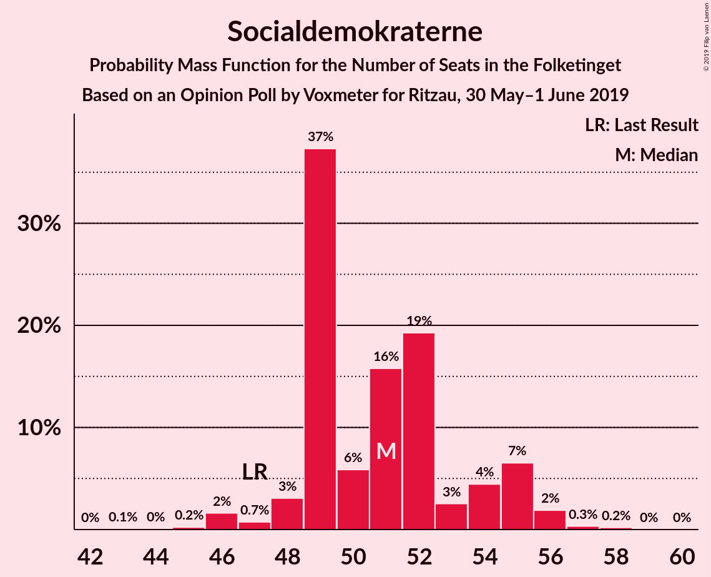
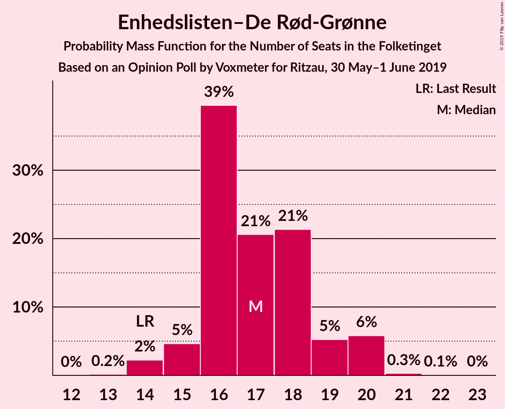
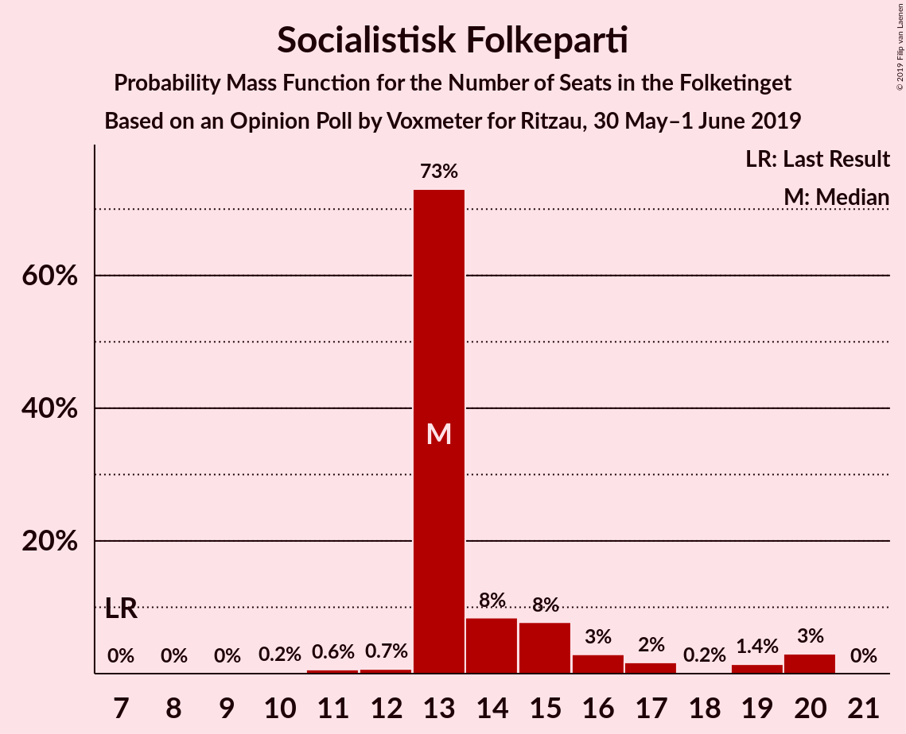
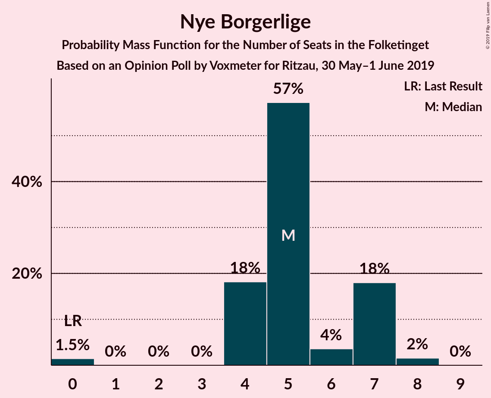
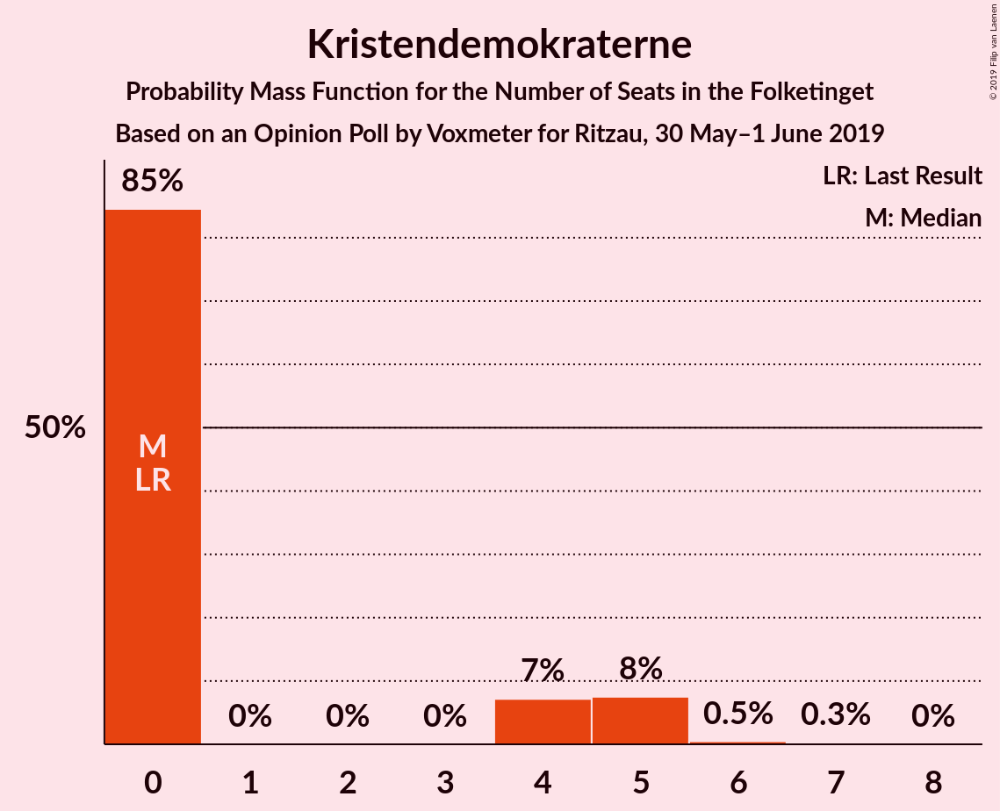
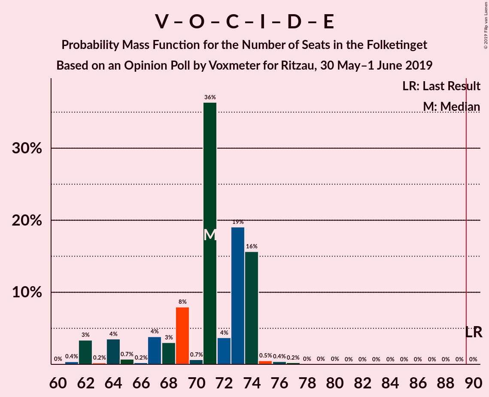

# Opinion Poll by Voxmeter for Ritzau, 30 May–1 June 2019

<a href="#voting-intentions">Voting Intentions</a> | <a href="#seats">Seats</a> | <a href="#coalitions">Coalitions</a> | <a href="#technical-information">Technical Information</a>

## Voting Intentions

### Confidence Intervals

| Party | Last Result | Poll Result | 80% Confidence Interval | 90% Confidence Interval | 95% Confidence Interval | 99% Confidence Interval |
|:-----:|:-----------:|:-----------:|:-----------------------:|:-----------------------:|:-----------------------:|:-----------------------:|
| Socialdemokraterne | 26.3% | 28.3% | 26.6–30.2% |26.1–30.7% |25.6–31.2% |24.8–32.1% |
| Venstre | 19.5% | 17.4% | 15.9–19.0% |15.5–19.5% |15.2–19.9% |14.5–20.7% |
| Dansk Folkeparti | 21.1% | 10.7% | 9.6–12.1% |9.2–12.5% |9.0–12.8% |8.4–13.5% |
| Enhedslisten–De Rød-Grønne | 7.8% | 9.5% | 8.4–10.8% |8.1–11.2% |7.9–11.5% |7.4–12.2% |
| Radikale Venstre | 4.6% | 8.4% | 7.4–9.7% |7.1–10.0% |6.9–10.3% |6.4–11.0% |
| Socialistisk Folkeparti | 4.2% | 8.3% | 7.2–9.5% |7.0–9.8% |6.7–10.1% |6.2–10.7% |
| Det Konservative Folkeparti | 3.4% | 5.0% | 4.2–6.0% |4.0–6.2% |3.8–6.5% |3.4–7.0% |
| Liberal Alliance | 7.5% | 3.0% | 2.4–3.8% |2.2–4.0% |2.1–4.2% |1.8–4.6% |
| Alternativet | 4.8% | 2.7% | 2.1–3.5% |2.0–3.7% |1.8–3.9% |1.6–4.3% |
| Nye Borgerlige | 0.0% | 2.5% | 2.0–3.2% |1.8–3.5% |1.7–3.7% |1.5–4.0% |
| Kristendemokraterne | 0.8% | 1.8% | 1.4–2.5% |1.2–2.7% |1.1–2.8% |1.0–3.2% |
| Stram Kurs | 0.0% | 1.6% | 1.2–2.2% |1.1–2.4% |1.0–2.6% |0.8–2.9% |
| Klaus Riskær Pedersen | 0.0% | 0.3% | 0.2–0.7% |0.1–0.8% |0.1–0.9% |0.1–1.1% |

*Note:* The poll result column reflects the actual value used in the calculations. Published results may vary slightly, and in addition be rounded to fewer digits.

## Seats

### Confidence Intervals

| Party | Last Result | Median | 80% Confidence Interval | 90% Confidence Interval | 95% Confidence Interval | 99% Confidence Interval |
|:-----:|:-----------:|:------:|:-----------------------:|:-----------------------:|:-----------------------:|:-----------------------:|
| <a href="#socialdemokraterne">Socialdemokraterne</a> | 47 | 56 | 49–65 |49–65 |49–65 |49–65 |
| <a href="#venstre">Venstre</a> | 34 | 31 | 29–35 |29–35 |29–35 |29–35 |
| <a href="#dansk-folkeparti">Dansk Folkeparti</a> | 37 | 20 | 16–23 |16–23 |16–23 |16–23 |
| <a href="#enhedslisten–de-rød-grønne">Enhedslisten–De Rød-Grønne</a> | 14 | 16 | 15–18 |15–18 |15–18 |15–19 |
| <a href="#radikale-venstre">Radikale Venstre</a> | 8 | 16 | 12–19 |12–19 |12–19 |12–19 |
| <a href="#socialistisk-folkeparti">Socialistisk Folkeparti</a> | 7 | 12 | 12–16 |12–16 |12–16 |12–16 |
| <a href="#det-konservative-folkeparti">Det Konservative Folkeparti</a> | 6 | 7 | 6–12 |6–12 |6–12 |6–12 |
| <a href="#liberal-alliance">Liberal Alliance</a> | 13 | 6 | 0–8 |0–8 |0–8 |0–8 |
| <a href="#alternativet">Alternativet</a> | 9 | 0 | 0 |0 |0 |0 |
| <a href="#nye-borgerlige">Nye Borgerlige</a> | 0 | 4 | 4–7 |4–7 |4–7 |4–7 |
| <a href="#kristendemokraterne">Kristendemokraterne</a> | 0 | 0 | 0–6 |0–6 |0–6 |0–6 |
| <a href="#stram-kurs">Stram Kurs</a> | 0 | 0 | 0–4 |0–4 |0–4 |0–6 |
| <a href="#klaus-riskær-pedersen">Klaus Riskær Pedersen</a> | 0 | 0 | 0 |0 |0 |0 |

### Socialdemokraterne

*For a full overview of the results for this party, see the [Socialdemokraterne](party-socialdemokraterne.html) page.*

| Number of Seats | Probability | Accumulated | Special Marks |
|:---------------:|:-----------:|:-----------:|:-------------:|
| 42 | 0.1% | 100% |  |
| 43 | 0% | 99.9% |  |
| 44 | 0% | 99.9% |  |
| 45 | 0% | 99.8% |  |
| 46 | 0.1% | 99.8% |  |
| 47 | 0% | 99.7% | Last Result |
| 48 | 0% | 99.7% |  |
| 49 | 50% | 99.7% |  |
| 50 | 0% | 50% |  |
| 51 | 0% | 50% |  |
| 52 | 0% | 50% |  |
| 53 | 0% | 50% |  |
| 54 | 0% | 50% |  |
| 55 | 0% | 50% |  |
| 56 | 32% | 50% | Median |
| 57 | 0% | 19% |  |
| 58 | 0% | 19% |  |
| 59 | 0% | 19% |  |
| 60 | 0% | 19% |  |
| 61 | 1.3% | 19% |  |
| 62 | 0% | 17% |  |
| 63 | 0% | 17% |  |
| 64 | 0% | 17% |  |
| 65 | 17% | 17% |  |
| 66 | 0% | 0% |  |

### Venstre

*For a full overview of the results for this party, see the [Venstre](party-venstre.html) page.*

| Number of Seats | Probability | Accumulated | Special Marks |
|:---------------:|:-----------:|:-----------:|:-------------:|
| 26 | 0% | 100% |  |
| 27 | 0% | 99.9% |  |
| 28 | 0% | 99.9% |  |
| 29 | 49% | 99.9% |  |
| 30 | 0.1% | 50% |  |
| 31 | 1.4% | 50% | Median |
| 32 | 17% | 49% |  |
| 33 | 0% | 32% |  |
| 34 | 0% | 32% | Last Result |
| 35 | 32% | 32% |  |
| 36 | 0% | 0% |  |

### Dansk Folkeparti

*For a full overview of the results for this party, see the [Dansk Folkeparti](party-danskfolkeparti.html) page.*

| Number of Seats | Probability | Accumulated | Special Marks |
|:---------------:|:-----------:|:-----------:|:-------------:|
| 14 | 0% | 100% |  |
| 15 | 0.1% | 99.9% |  |
| 16 | 17% | 99.8% |  |
| 17 | 1.3% | 82% |  |
| 18 | 0% | 81% |  |
| 19 | 0% | 81% |  |
| 20 | 32% | 81% | Median |
| 21 | 0% | 49% |  |
| 22 | 0% | 49% |  |
| 23 | 49% | 49% |  |
| 24 | 0% | 0% |  |
| 25 | 0% | 0% |  |
| 26 | 0% | 0% |  |
| 27 | 0% | 0% |  |
| 28 | 0% | 0% |  |
| 29 | 0% | 0% |  |
| 30 | 0% | 0% |  |
| 31 | 0% | 0% |  |
| 32 | 0% | 0% |  |
| 33 | 0% | 0% |  |
| 34 | 0% | 0% |  |
| 35 | 0% | 0% |  |
| 36 | 0% | 0% |  |
| 37 | 0% | 0% | Last Result |

### Enhedslisten–De Rød-Grønne

*For a full overview of the results for this party, see the [Enhedslisten–De Rød-Grønne](party-enhedslisten–derød-grønne.html) page.*

| Number of Seats | Probability | Accumulated | Special Marks |
|:---------------:|:-----------:|:-----------:|:-------------:|
| 14 | 0% | 100% | Last Result |
| 15 | 49% | 100% |  |
| 16 | 32% | 51% | Median |
| 17 | 0.1% | 19% |  |
| 18 | 17% | 19% |  |
| 19 | 1.2% | 1.3% |  |
| 20 | 0% | 0.1% |  |
| 21 | 0% | 0% |  |

### Radikale Venstre

*For a full overview of the results for this party, see the [Radikale Venstre](party-radikalevenstre.html) page.*

| Number of Seats | Probability | Accumulated | Special Marks |
|:---------------:|:-----------:|:-----------:|:-------------:|
| 8 | 0% | 100% | Last Result |
| 9 | 0% | 100% |  |
| 10 | 0% | 100% |  |
| 11 | 0% | 100% |  |
| 12 | 19% | 100% |  |
| 13 | 0% | 81% |  |
| 14 | 0% | 81% |  |
| 15 | 0.2% | 81% |  |
| 16 | 32% | 81% | Median |
| 17 | 0.1% | 50% |  |
| 18 | 0% | 50% |  |
| 19 | 50% | 50% |  |
| 20 | 0% | 0% |  |

### Socialistisk Folkeparti

*For a full overview of the results for this party, see the [Socialistisk Folkeparti](party-socialistiskfolkeparti.html) page.*

| Number of Seats | Probability | Accumulated | Special Marks |
|:---------------:|:-----------:|:-----------:|:-------------:|
| 7 | 0% | 100% | Last Result |
| 8 | 0% | 100% |  |
| 9 | 0% | 100% |  |
| 10 | 0% | 100% |  |
| 11 | 0% | 100% |  |
| 12 | 51% | 100% | Median |
| 13 | 17% | 49% |  |
| 14 | 0% | 32% |  |
| 15 | 0% | 32% |  |
| 16 | 32% | 32% |  |
| 17 | 0.1% | 0.1% |  |
| 18 | 0% | 0% |  |

### Det Konservative Folkeparti

*For a full overview of the results for this party, see the [Det Konservative Folkeparti](party-detkonservativefolkeparti.html) page.*

| Number of Seats | Probability | Accumulated | Special Marks |
|:---------------:|:-----------:|:-----------:|:-------------:|
| 6 | 17% | 100% | Last Result |
| 7 | 51% | 83% | Median |
| 8 | 0.2% | 32% |  |
| 9 | 0.1% | 32% |  |
| 10 | 0% | 32% |  |
| 11 | 0% | 32% |  |
| 12 | 32% | 32% |  |
| 13 | 0% | 0% |  |

### Liberal Alliance

*For a full overview of the results for this party, see the [Liberal Alliance](party-liberalalliance.html) page.*

| Number of Seats | Probability | Accumulated | Special Marks |
|:---------------:|:-----------:|:-----------:|:-------------:|
| 0 | 32% | 100% |  |
| 1 | 0% | 68% |  |
| 2 | 0% | 68% |  |
| 3 | 0% | 68% |  |
| 4 | 0% | 68% |  |
| 5 | 17% | 68% |  |
| 6 | 1.4% | 51% | Median |
| 7 | 0.1% | 50% |  |
| 8 | 50% | 50% |  |
| 9 | 0% | 0% |  |
| 10 | 0% | 0% |  |
| 11 | 0% | 0% |  |
| 12 | 0% | 0% |  |
| 13 | 0% | 0% | Last Result |

### Alternativet

*For a full overview of the results for this party, see the [Alternativet](party-alternativet.html) page.*

| Number of Seats | Probability | Accumulated | Special Marks |
|:---------------:|:-----------:|:-----------:|:-------------:|
| 0 | 99.6% | 100% | Median |
| 1 | 0% | 0.4% |  |
| 2 | 0% | 0.4% |  |
| 3 | 0% | 0.4% |  |
| 4 | 0% | 0.4% |  |
| 5 | 0% | 0.4% |  |
| 6 | 0% | 0.3% |  |
| 7 | 0% | 0.3% |  |
| 8 | 0.2% | 0.3% |  |
| 9 | 0% | 0% | Last Result |

### Nye Borgerlige

*For a full overview of the results for this party, see the [Nye Borgerlige](party-nyeborgerlige.html) page.*

| Number of Seats | Probability | Accumulated | Special Marks |
|:---------------:|:-----------:|:-----------:|:-------------:|
| 0 | 0% | 100% | Last Result |
| 1 | 0% | 100% |  |
| 2 | 0% | 100% |  |
| 3 | 0% | 100% |  |
| 4 | 50% | 100% | Median |
| 5 | 0.3% | 50% |  |
| 6 | 0% | 49% |  |
| 7 | 49% | 49% |  |
| 8 | 0% | 0% |  |

### Kristendemokraterne

*For a full overview of the results for this party, see the [Kristendemokraterne](party-kristendemokraterne.html) page.*

| Number of Seats | Probability | Accumulated | Special Marks |
|:---------------:|:-----------:|:-----------:|:-------------:|
| 0 | 50% | 100% | Last Result, Median |
| 1 | 0% | 50% |  |
| 2 | 0% | 50% |  |
| 3 | 0% | 50% |  |
| 4 | 0% | 50% |  |
| 5 | 0.1% | 50% |  |
| 6 | 49% | 50% |  |
| 7 | 0.2% | 0.3% |  |
| 8 | 0% | 0% |  |

### Stram Kurs

*For a full overview of the results for this party, see the [Stram Kurs](party-stramkurs.html) page.*

| Number of Seats | Probability | Accumulated | Special Marks |
|:---------------:|:-----------:|:-----------:|:-------------:|
| 0 | 81% | 100% | Last Result, Median |
| 1 | 0% | 19% |  |
| 2 | 0% | 19% |  |
| 3 | 0% | 19% |  |
| 4 | 18% | 19% |  |
| 5 | 0% | 1.2% |  |
| 6 | 1.2% | 1.2% |  |
| 7 | 0% | 0% |  |

### Klaus Riskær Pedersen

*For a full overview of the results for this party, see the [Klaus Riskær Pedersen](party-klausriskærpedersen.html) page.*

| Number of Seats | Probability | Accumulated | Special Marks |
|:---------------:|:-----------:|:-----------:|:-------------:|
| 0 | 100% | 100% | Last Result, Median |

## Coalitions

### Confidence Intervals

| Coalition | Last Result | Median | Majority? | 80% Confidence Interval | 90% Confidence Interval | 95% Confidence Interval | 99% Confidence Interval |
|:---------:|:-----------:|:------:|:---------:|:-----------------------:|:-----------------------:|:-----------------------:|:-----------------------:|
| Socialdemokraterne – Enhedslisten–De Rød-Grønne – Radikale Venstre – Socialistisk Folkeparti – Alternativet | 85 | 104 | 100% | 95–108 | 95–108 | 95–108 | 95–108 |
| Socialdemokraterne – Enhedslisten–De Rød-Grønne – Radikale Venstre – Socialistisk Folkeparti | 76 | 104 | 100% | 95–108 | 95–108 | 95–108 | 95–108 |
| Socialdemokraterne – Enhedslisten–De Rød-Grønne – Socialistisk Folkeparti – Alternativet | 77 | 88 | 19% | 76–96 | 76–96 | 76–96 | 76–96 |
| Socialdemokraterne – Enhedslisten–De Rød-Grønne – Socialistisk Folkeparti | 68 | 88 | 19% | 76–96 | 76–96 | 76–96 | 76–96 |
| Socialdemokraterne – Radikale Venstre – Socialistisk Folkeparti | 62 | 85 | 17% | 80–90 | 80–90 | 80–90 | 80–90 |
| Venstre – Dansk Folkeparti – Det Konservative Folkeparti – Liberal Alliance – Nye Borgerlige – Kristendemokraterne – Stram Kurs – Klaus Riskær Pedersen | 90 | 71 | 0% | 67–80 | 67–80 | 67–80 | 67–80 |
| Venstre – Dansk Folkeparti – Det Konservative Folkeparti – Liberal Alliance – Nye Borgerlige – Kristendemokraterne – Klaus Riskær Pedersen | 90 | 71 | 0% | 63–80 | 63–80 | 63–80 | 63–80 |
| Venstre – Dansk Folkeparti – Det Konservative Folkeparti – Liberal Alliance – Nye Borgerlige – Kristendemokraterne | 90 | 71 | 0% | 63–80 | 63–80 | 63–80 | 63–80 |
| Socialdemokraterne – Radikale Venstre | 55 | 72 | 0% | 68–77 | 68–77 | 68–77 | 68–77 |
| Venstre – Dansk Folkeparti – Det Konservative Folkeparti – Liberal Alliance – Nye Borgerlige – Klaus Riskær Pedersen | 90 | 71 | 0% | 63–74 | 63–74 | 63–74 | 63–74 |
| Venstre – Dansk Folkeparti – Det Konservative Folkeparti – Liberal Alliance – Nye Borgerlige | 90 | 71 | 0% | 63–74 | 63–74 | 63–74 | 63–74 |
| Venstre – Dansk Folkeparti – Det Konservative Folkeparti – Liberal Alliance – Kristendemokraterne | 90 | 67 | 0% | 59–73 | 59–73 | 59–73 | 59–73 |
| Venstre – Dansk Folkeparti – Det Konservative Folkeparti – Liberal Alliance | 90 | 67 | 0% | 59–67 | 59–67 | 59–67 | 59–67 |
| Venstre – Det Konservative Folkeparti – Liberal Alliance | 53 | 44 | 0% | 43–47 | 43–47 | 43–47 | 43–47 |
| Venstre – Det Konservative Folkeparti | 40 | 38 | 0% | 36–47 | 36–47 | 36–47 | 36–47 |
| Venstre | 34 | 31 | 0% | 29–35 | 29–35 | 29–35 | 29–35 |

### Socialdemokraterne – Enhedslisten–De Rød-Grønne – Radikale Venstre – Socialistisk Folkeparti – Alternativet

| Number of Seats | Probability | Accumulated | Special Marks |
|:---------------:|:-----------:|:-----------:|:-------------:|
| 85 | 0% | 100% | Last Result |
| 86 | 0% | 100% |  |
| 87 | 0% | 100% |  |
| 88 | 0% | 100% |  |
| 89 | 0% | 100% |  |
| 90 | 0% | 100% | Majority |
| 91 | 0% | 100% |  |
| 92 | 0% | 100% |  |
| 93 | 0% | 100% |  |
| 94 | 0% | 100% |  |
| 95 | 49% | 100% |  |
| 96 | 0% | 51% |  |
| 97 | 0% | 51% |  |
| 98 | 0.1% | 51% |  |
| 99 | 0% | 50% |  |
| 100 | 0% | 50% | Median |
| 101 | 0% | 50% |  |
| 102 | 0.1% | 50% |  |
| 103 | 0% | 50% |  |
| 104 | 33% | 50% |  |
| 105 | 0% | 17% |  |
| 106 | 0% | 17% |  |
| 107 | 0% | 17% |  |
| 108 | 17% | 17% |  |
| 109 | 0% | 0% |  |

### Socialdemokraterne – Enhedslisten–De Rød-Grønne – Radikale Venstre – Socialistisk Folkeparti

| Number of Seats | Probability | Accumulated | Special Marks |
|:---------------:|:-----------:|:-----------:|:-------------:|
| 76 | 0% | 100% | Last Result |
| 77 | 0% | 100% |  |
| 78 | 0% | 100% |  |
| 79 | 0% | 100% |  |
| 80 | 0% | 100% |  |
| 81 | 0% | 100% |  |
| 82 | 0% | 100% |  |
| 83 | 0% | 100% |  |
| 84 | 0% | 100% |  |
| 85 | 0% | 100% |  |
| 86 | 0% | 100% |  |
| 87 | 0% | 100% |  |
| 88 | 0% | 100% |  |
| 89 | 0% | 100% |  |
| 90 | 0.1% | 100% | Majority |
| 91 | 0% | 99.9% |  |
| 92 | 0% | 99.8% |  |
| 93 | 0% | 99.8% |  |
| 94 | 0.1% | 99.8% |  |
| 95 | 50% | 99.7% |  |
| 96 | 0% | 50% |  |
| 97 | 0% | 50% |  |
| 98 | 0% | 50% |  |
| 99 | 0% | 50% |  |
| 100 | 0% | 50% | Median |
| 101 | 0% | 50% |  |
| 102 | 0% | 50% |  |
| 103 | 0% | 50% |  |
| 104 | 33% | 50% |  |
| 105 | 0% | 17% |  |
| 106 | 0% | 17% |  |
| 107 | 0% | 17% |  |
| 108 | 17% | 17% |  |
| 109 | 0% | 0% |  |

### Socialdemokraterne – Enhedslisten–De Rød-Grønne – Socialistisk Folkeparti – Alternativet

| Number of Seats | Probability | Accumulated | Special Marks |
|:---------------:|:-----------:|:-----------:|:-------------:|
| 76 | 49% | 100% |  |
| 77 | 0% | 51% | Last Result |
| 78 | 0% | 51% |  |
| 79 | 0% | 51% |  |
| 80 | 0% | 51% |  |
| 81 | 0% | 51% |  |
| 82 | 0% | 51% |  |
| 83 | 0.1% | 51% |  |
| 84 | 0% | 50% | Median |
| 85 | 0% | 50% |  |
| 86 | 0% | 50% |  |
| 87 | 0.1% | 50% |  |
| 88 | 32% | 50% |  |
| 89 | 0% | 19% |  |
| 90 | 0% | 19% | Majority |
| 91 | 0% | 19% |  |
| 92 | 1.2% | 19% |  |
| 93 | 0% | 17% |  |
| 94 | 0% | 17% |  |
| 95 | 0% | 17% |  |
| 96 | 17% | 17% |  |
| 97 | 0% | 0% |  |

### Socialdemokraterne – Enhedslisten–De Rød-Grønne – Socialistisk Folkeparti

| Number of Seats | Probability | Accumulated | Special Marks |
|:---------------:|:-----------:|:-----------:|:-------------:|
| 68 | 0% | 100% | Last Result |
| 69 | 0% | 100% |  |
| 70 | 0% | 100% |  |
| 71 | 0% | 100% |  |
| 72 | 0% | 100% |  |
| 73 | 0% | 100% |  |
| 74 | 0% | 100% |  |
| 75 | 0.1% | 100% |  |
| 76 | 49% | 99.9% |  |
| 77 | 0% | 50% |  |
| 78 | 0% | 50% |  |
| 79 | 0.1% | 50% |  |
| 80 | 0% | 50% |  |
| 81 | 0% | 50% |  |
| 82 | 0% | 50% |  |
| 83 | 0% | 50% |  |
| 84 | 0% | 50% | Median |
| 85 | 0% | 50% |  |
| 86 | 0% | 50% |  |
| 87 | 0% | 50% |  |
| 88 | 32% | 50% |  |
| 89 | 0% | 19% |  |
| 90 | 0% | 19% | Majority |
| 91 | 0% | 19% |  |
| 92 | 1.2% | 19% |  |
| 93 | 0% | 17% |  |
| 94 | 0% | 17% |  |
| 95 | 0% | 17% |  |
| 96 | 17% | 17% |  |
| 97 | 0% | 0% |  |

### Socialdemokraterne – Radikale Venstre – Socialistisk Folkeparti

| Number of Seats | Probability | Accumulated | Special Marks |
|:---------------:|:-----------:|:-----------:|:-------------:|
| 62 | 0% | 100% | Last Result |
| 63 | 0% | 100% |  |
| 64 | 0% | 100% |  |
| 65 | 0% | 100% |  |
| 66 | 0% | 100% |  |
| 67 | 0% | 100% |  |
| 68 | 0% | 100% |  |
| 69 | 0% | 100% |  |
| 70 | 0% | 100% |  |
| 71 | 0% | 100% |  |
| 72 | 0% | 100% |  |
| 73 | 0.1% | 100% |  |
| 74 | 0% | 99.9% |  |
| 75 | 0% | 99.9% |  |
| 76 | 0% | 99.8% |  |
| 77 | 0% | 99.8% |  |
| 78 | 0.1% | 99.8% |  |
| 79 | 0% | 99.7% |  |
| 80 | 49% | 99.7% |  |
| 81 | 0% | 50% |  |
| 82 | 0% | 50% |  |
| 83 | 0% | 50% |  |
| 84 | 0% | 50% | Median |
| 85 | 1.2% | 50% |  |
| 86 | 0% | 49% |  |
| 87 | 0% | 49% |  |
| 88 | 32% | 49% |  |
| 89 | 0% | 17% |  |
| 90 | 17% | 17% | Majority |
| 91 | 0% | 0% |  |

### Venstre – Dansk Folkeparti – Det Konservative Folkeparti – Liberal Alliance – Nye Borgerlige – Kristendemokraterne – Stram Kurs – Klaus Riskær Pedersen

| Number of Seats | Probability | Accumulated | Special Marks |
|:---------------:|:-----------:|:-----------:|:-------------:|
| 67 | 17% | 100% |  |
| 68 | 0% | 83% | Median |
| 69 | 0% | 83% |  |
| 70 | 0% | 83% |  |
| 71 | 33% | 83% |  |
| 72 | 0% | 50% |  |
| 73 | 0.1% | 50% |  |
| 74 | 0% | 50% |  |
| 75 | 0% | 50% |  |
| 76 | 0% | 50% |  |
| 77 | 0.1% | 50% |  |
| 78 | 0% | 49% |  |
| 79 | 0% | 49% |  |
| 80 | 49% | 49% |  |
| 81 | 0% | 0% |  |
| 82 | 0% | 0% |  |
| 83 | 0% | 0% |  |
| 84 | 0% | 0% |  |
| 85 | 0% | 0% |  |
| 86 | 0% | 0% |  |
| 87 | 0% | 0% |  |
| 88 | 0% | 0% |  |
| 89 | 0% | 0% |  |
| 90 | 0% | 0% | Last Result, Majority |

### Venstre – Dansk Folkeparti – Det Konservative Folkeparti – Liberal Alliance – Nye Borgerlige – Kristendemokraterne – Klaus Riskær Pedersen

| Number of Seats | Probability | Accumulated | Special Marks |
|:---------------:|:-----------:|:-----------:|:-------------:|
| 63 | 17% | 100% |  |
| 64 | 0% | 83% |  |
| 65 | 1.2% | 83% |  |
| 66 | 0% | 81% |  |
| 67 | 0% | 81% |  |
| 68 | 0% | 81% | Median |
| 69 | 0% | 81% |  |
| 70 | 0% | 81% |  |
| 71 | 32% | 81% |  |
| 72 | 0% | 50% |  |
| 73 | 0.2% | 50% |  |
| 74 | 0% | 49% |  |
| 75 | 0% | 49% |  |
| 76 | 0% | 49% |  |
| 77 | 0% | 49% |  |
| 78 | 0% | 49% |  |
| 79 | 0% | 49% |  |
| 80 | 49% | 49% |  |
| 81 | 0% | 0% |  |
| 82 | 0% | 0% |  |
| 83 | 0% | 0% |  |
| 84 | 0% | 0% |  |
| 85 | 0% | 0% |  |
| 86 | 0% | 0% |  |
| 87 | 0% | 0% |  |
| 88 | 0% | 0% |  |
| 89 | 0% | 0% |  |
| 90 | 0% | 0% | Last Result, Majority |

### Venstre – Dansk Folkeparti – Det Konservative Folkeparti – Liberal Alliance – Nye Borgerlige – Kristendemokraterne

| Number of Seats | Probability | Accumulated | Special Marks |
|:---------------:|:-----------:|:-----------:|:-------------:|
| 63 | 17% | 100% |  |
| 64 | 0% | 83% |  |
| 65 | 1.2% | 83% |  |
| 66 | 0% | 81% |  |
| 67 | 0% | 81% |  |
| 68 | 0% | 81% | Median |
| 69 | 0% | 81% |  |
| 70 | 0% | 81% |  |
| 71 | 32% | 81% |  |
| 72 | 0% | 50% |  |
| 73 | 0.2% | 50% |  |
| 74 | 0% | 49% |  |
| 75 | 0% | 49% |  |
| 76 | 0% | 49% |  |
| 77 | 0% | 49% |  |
| 78 | 0% | 49% |  |
| 79 | 0% | 49% |  |
| 80 | 49% | 49% |  |
| 81 | 0% | 0% |  |
| 82 | 0% | 0% |  |
| 83 | 0% | 0% |  |
| 84 | 0% | 0% |  |
| 85 | 0% | 0% |  |
| 86 | 0% | 0% |  |
| 87 | 0% | 0% |  |
| 88 | 0% | 0% |  |
| 89 | 0% | 0% |  |
| 90 | 0% | 0% | Last Result, Majority |

### Socialdemokraterne – Radikale Venstre

| Number of Seats | Probability | Accumulated | Special Marks |
|:---------------:|:-----------:|:-----------:|:-------------:|
| 55 | 0% | 100% | Last Result |
| 56 | 0% | 100% |  |
| 57 | 0.1% | 100% |  |
| 58 | 0% | 99.9% |  |
| 59 | 0% | 99.9% |  |
| 60 | 0% | 99.9% |  |
| 61 | 0.1% | 99.9% |  |
| 62 | 0% | 99.7% |  |
| 63 | 0% | 99.7% |  |
| 64 | 0% | 99.7% |  |
| 65 | 0% | 99.7% |  |
| 66 | 0.1% | 99.7% |  |
| 67 | 0% | 99.6% |  |
| 68 | 49% | 99.6% |  |
| 69 | 0% | 50% |  |
| 70 | 0% | 50% |  |
| 71 | 0% | 50% |  |
| 72 | 32% | 50% | Median |
| 73 | 1.2% | 19% |  |
| 74 | 0% | 17% |  |
| 75 | 0% | 17% |  |
| 76 | 0% | 17% |  |
| 77 | 17% | 17% |  |
| 78 | 0% | 0% |  |

### Venstre – Dansk Folkeparti – Det Konservative Folkeparti – Liberal Alliance – Nye Borgerlige – Klaus Riskær Pedersen

| Number of Seats | Probability | Accumulated | Special Marks |
|:---------------:|:-----------:|:-----------:|:-------------:|
| 56 | 0.1% | 100% |  |
| 57 | 0% | 99.9% |  |
| 58 | 0% | 99.9% |  |
| 59 | 0% | 99.9% |  |
| 60 | 0% | 99.9% |  |
| 61 | 0% | 99.9% |  |
| 62 | 0% | 99.9% |  |
| 63 | 17% | 99.9% |  |
| 64 | 0% | 83% |  |
| 65 | 1.3% | 83% |  |
| 66 | 0.2% | 81% |  |
| 67 | 0% | 81% |  |
| 68 | 0% | 81% | Median |
| 69 | 0% | 81% |  |
| 70 | 0% | 81% |  |
| 71 | 32% | 81% |  |
| 72 | 0% | 49% |  |
| 73 | 0% | 49% |  |
| 74 | 49% | 49% |  |
| 75 | 0% | 0% |  |
| 76 | 0% | 0% |  |
| 77 | 0% | 0% |  |
| 78 | 0% | 0% |  |
| 79 | 0% | 0% |  |
| 80 | 0% | 0% |  |
| 81 | 0% | 0% |  |
| 82 | 0% | 0% |  |
| 83 | 0% | 0% |  |
| 84 | 0% | 0% |  |
| 85 | 0% | 0% |  |
| 86 | 0% | 0% |  |
| 87 | 0% | 0% |  |
| 88 | 0% | 0% |  |
| 89 | 0% | 0% |  |
| 90 | 0% | 0% | Last Result, Majority |

### Venstre – Dansk Folkeparti – Det Konservative Folkeparti – Liberal Alliance – Nye Borgerlige

| Number of Seats | Probability | Accumulated | Special Marks |
|:---------------:|:-----------:|:-----------:|:-------------:|
| 56 | 0.1% | 100% |  |
| 57 | 0% | 99.9% |  |
| 58 | 0% | 99.9% |  |
| 59 | 0% | 99.9% |  |
| 60 | 0% | 99.9% |  |
| 61 | 0% | 99.9% |  |
| 62 | 0% | 99.9% |  |
| 63 | 17% | 99.9% |  |
| 64 | 0% | 83% |  |
| 65 | 1.3% | 83% |  |
| 66 | 0.2% | 81% |  |
| 67 | 0% | 81% |  |
| 68 | 0% | 81% | Median |
| 69 | 0% | 81% |  |
| 70 | 0% | 81% |  |
| 71 | 32% | 81% |  |
| 72 | 0% | 49% |  |
| 73 | 0% | 49% |  |
| 74 | 49% | 49% |  |
| 75 | 0% | 0% |  |
| 76 | 0% | 0% |  |
| 77 | 0% | 0% |  |
| 78 | 0% | 0% |  |
| 79 | 0% | 0% |  |
| 80 | 0% | 0% |  |
| 81 | 0% | 0% |  |
| 82 | 0% | 0% |  |
| 83 | 0% | 0% |  |
| 84 | 0% | 0% |  |
| 85 | 0% | 0% |  |
| 86 | 0% | 0% |  |
| 87 | 0% | 0% |  |
| 88 | 0% | 0% |  |
| 89 | 0% | 0% |  |
| 90 | 0% | 0% | Last Result, Majority |

### Venstre – Dansk Folkeparti – Det Konservative Folkeparti – Liberal Alliance – Kristendemokraterne

| Number of Seats | Probability | Accumulated | Special Marks |
|:---------------:|:-----------:|:-----------:|:-------------:|
| 59 | 17% | 100% |  |
| 60 | 0% | 83% |  |
| 61 | 1.2% | 83% |  |
| 62 | 0% | 81% |  |
| 63 | 0% | 81% |  |
| 64 | 0% | 81% | Median |
| 65 | 0% | 81% |  |
| 66 | 0% | 81% |  |
| 67 | 32% | 81% |  |
| 68 | 0.2% | 50% |  |
| 69 | 0% | 49% |  |
| 70 | 0% | 49% |  |
| 71 | 0% | 49% |  |
| 72 | 0% | 49% |  |
| 73 | 49% | 49% |  |
| 74 | 0% | 0% |  |
| 75 | 0% | 0% |  |
| 76 | 0% | 0% |  |
| 77 | 0% | 0% |  |
| 78 | 0% | 0% |  |
| 79 | 0% | 0% |  |
| 80 | 0% | 0% |  |
| 81 | 0% | 0% |  |
| 82 | 0% | 0% |  |
| 83 | 0% | 0% |  |
| 84 | 0% | 0% |  |
| 85 | 0% | 0% |  |
| 86 | 0% | 0% |  |
| 87 | 0% | 0% |  |
| 88 | 0% | 0% |  |
| 89 | 0% | 0% |  |
| 90 | 0% | 0% | Last Result, Majority |

### Venstre – Dansk Folkeparti – Det Konservative Folkeparti – Liberal Alliance

| Number of Seats | Probability | Accumulated | Special Marks |
|:---------------:|:-----------:|:-----------:|:-------------:|
| 51 | 0.1% | 100% |  |
| 52 | 0% | 99.9% |  |
| 53 | 0% | 99.9% |  |
| 54 | 0% | 99.9% |  |
| 55 | 0% | 99.9% |  |
| 56 | 0% | 99.9% |  |
| 57 | 0% | 99.9% |  |
| 58 | 0% | 99.9% |  |
| 59 | 17% | 99.9% |  |
| 60 | 0% | 83% |  |
| 61 | 1.5% | 83% |  |
| 62 | 0% | 81% |  |
| 63 | 0% | 81% |  |
| 64 | 0% | 81% | Median |
| 65 | 0% | 81% |  |
| 66 | 0% | 81% |  |
| 67 | 81% | 81% |  |
| 68 | 0% | 0% |  |
| 69 | 0% | 0% |  |
| 70 | 0% | 0% |  |
| 71 | 0% | 0% |  |
| 72 | 0% | 0% |  |
| 73 | 0% | 0% |  |
| 74 | 0% | 0% |  |
| 75 | 0% | 0% |  |
| 76 | 0% | 0% |  |
| 77 | 0% | 0% |  |
| 78 | 0% | 0% |  |
| 79 | 0% | 0% |  |
| 80 | 0% | 0% |  |
| 81 | 0% | 0% |  |
| 82 | 0% | 0% |  |
| 83 | 0% | 0% |  |
| 84 | 0% | 0% |  |
| 85 | 0% | 0% |  |
| 86 | 0% | 0% |  |
| 87 | 0% | 0% |  |
| 88 | 0% | 0% |  |
| 89 | 0% | 0% |  |
| 90 | 0% | 0% | Last Result, Majority |

### Venstre – Det Konservative Folkeparti – Liberal Alliance

| Number of Seats | Probability | Accumulated | Special Marks |
|:---------------:|:-----------:|:-----------:|:-------------:|
| 39 | 0% | 100% |  |
| 40 | 0% | 99.9% |  |
| 41 | 0% | 99.9% |  |
| 42 | 0% | 99.9% |  |
| 43 | 17% | 99.9% |  |
| 44 | 51% | 83% | Median |
| 45 | 0.1% | 32% |  |
| 46 | 0.1% | 32% |  |
| 47 | 32% | 32% |  |
| 48 | 0% | 0% |  |
| 49 | 0% | 0% |  |
| 50 | 0% | 0% |  |
| 51 | 0% | 0% |  |
| 52 | 0% | 0% |  |
| 53 | 0% | 0% | Last Result |

### Venstre – Det Konservative Folkeparti

| Number of Seats | Probability | Accumulated | Special Marks |
|:---------------:|:-----------:|:-----------:|:-------------:|
| 34 | 0% | 100% |  |
| 35 | 0% | 99.9% |  |
| 36 | 49% | 99.9% |  |
| 37 | 0% | 50% |  |
| 38 | 19% | 50% | Median |
| 39 | 0% | 32% |  |
| 40 | 0.1% | 32% | Last Result |
| 41 | 0% | 32% |  |
| 42 | 0% | 32% |  |
| 43 | 0% | 32% |  |
| 44 | 0% | 32% |  |
| 45 | 0% | 32% |  |
| 46 | 0% | 32% |  |
| 47 | 32% | 32% |  |
| 48 | 0% | 0% |  |

### Venstre

| Number of Seats | Probability | Accumulated | Special Marks |
|:---------------:|:-----------:|:-----------:|:-------------:|
| 26 | 0% | 100% |  |
| 27 | 0% | 99.9% |  |
| 28 | 0% | 99.9% |  |
| 29 | 49% | 99.9% |  |
| 30 | 0.1% | 50% |  |
| 31 | 1.4% | 50% | Median |
| 32 | 17% | 49% |  |
| 33 | 0% | 32% |  |
| 34 | 0% | 32% | Last Result |
| 35 | 32% | 32% |  |
| 36 | 0% | 0% |  |

## Technical Information

### Opinion Poll

+ **Polling firm:** Voxmeter
+ **Commissioner(s):** Ritzau
+ **Fieldwork period:** 30 May–1 June 2019

### Calculations

+ **Sample size:** 1006
+ **Simulations done:** 1,024
+ **Error estimate:** 3.43%

