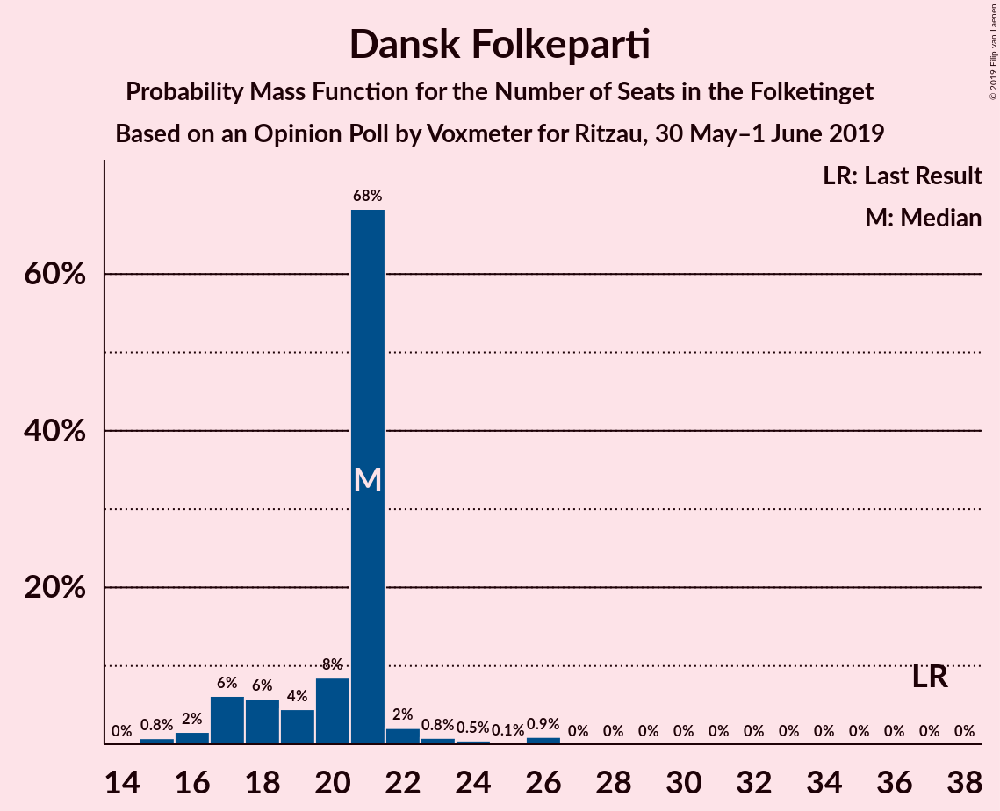
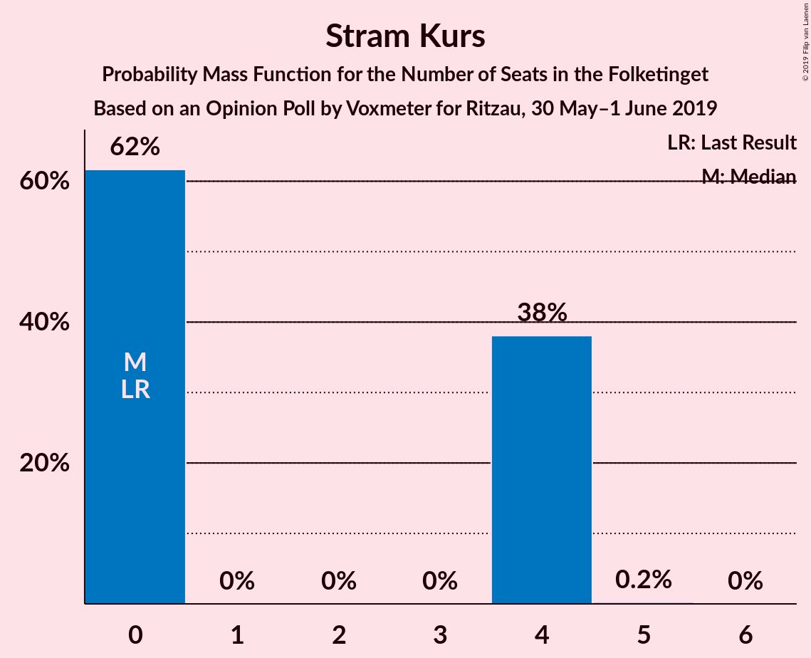
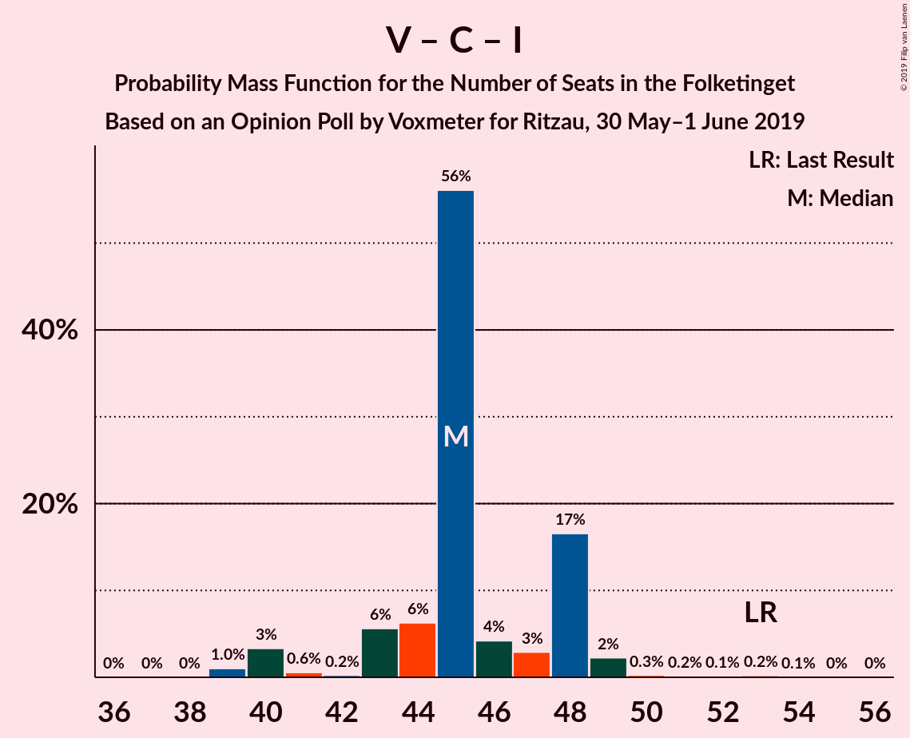

# Opinion Poll by Voxmeter for Ritzau, 30 May–1 June 2019

<a href="#voting-intentions">Voting Intentions</a> | <a href="#seats">Seats</a> | <a href="#coalitions">Coalitions</a> | <a href="#technical-information">Technical Information</a>

## Voting Intentions

### Confidence Intervals

| Party | Last Result | Poll Result | 80% Confidence Interval | 90% Confidence Interval | 95% Confidence Interval | 99% Confidence Interval |
|:-----:|:-----------:|:-----------:|:-----------------------:|:-----------------------:|:-----------------------:|:-----------------------:|
| Socialdemokraterne | 26.3% | 28.3% | 26.6–30.2% |26.1–30.7% |25.6–31.2% |24.8–32.1% |
| Venstre | 19.5% | 17.4% | 15.9–19.0% |15.5–19.5% |15.2–19.9% |14.5–20.7% |
| Dansk Folkeparti | 21.1% | 10.7% | 9.6–12.1% |9.2–12.5% |9.0–12.8% |8.4–13.5% |
| Enhedslisten–De Rød-Grønne | 7.8% | 9.5% | 8.4–10.8% |8.1–11.2% |7.9–11.5% |7.4–12.2% |
| Radikale Venstre | 4.6% | 8.4% | 7.4–9.7% |7.1–10.0% |6.9–10.3% |6.4–11.0% |
| Socialistisk Folkeparti | 4.2% | 8.3% | 7.2–9.5% |7.0–9.8% |6.7–10.1% |6.2–10.7% |
| Det Konservative Folkeparti | 3.4% | 5.0% | 4.2–6.0% |4.0–6.2% |3.8–6.5% |3.4–7.0% |
| Liberal Alliance | 7.5% | 3.0% | 2.4–3.8% |2.2–4.0% |2.1–4.2% |1.8–4.6% |
| Alternativet | 4.8% | 2.7% | 2.1–3.5% |2.0–3.7% |1.8–3.9% |1.6–4.3% |
| Nye Borgerlige | 0.0% | 2.5% | 2.0–3.2% |1.8–3.5% |1.7–3.7% |1.5–4.0% |
| Kristendemokraterne | 0.8% | 1.8% | 1.4–2.5% |1.2–2.7% |1.1–2.8% |1.0–3.2% |
| Stram Kurs | 0.0% | 1.6% | 1.2–2.2% |1.1–2.4% |1.0–2.6% |0.8–2.9% |
| Klaus Riskær Pedersen | 0.0% | 0.3% | 0.2–0.7% |0.1–0.8% |0.1–0.9% |0.1–1.1% |

*Note:* The poll result column reflects the actual value used in the calculations. Published results may vary slightly, and in addition be rounded to fewer digits.

## Seats

### Confidence Intervals

| Party | Last Result | Median | 80% Confidence Interval | 90% Confidence Interval | 95% Confidence Interval | 99% Confidence Interval |
|:-----:|:-----------:|:------:|:-----------------------:|:-----------------------:|:-----------------------:|:-----------------------:|
| <a href="#socialdemokraterne">Socialdemokraterne</a> | 47 | 51 | 49–54 |48–55 |47–55 |46–57 |
| <a href="#venstre">Venstre</a> | 34 | 33 | 30–33 |28–34 |26–34 |26–35 |
| <a href="#dansk-folkeparti">Dansk Folkeparti</a> | 37 | 21 | 18–21 |17–21 |17–22 |15–26 |
| <a href="#enhedslisten–de-rød-grønne">Enhedslisten–De Rød-Grønne</a> | 14 | 17 | 16–19 |15–20 |15–20 |14–20 |
| <a href="#radikale-venstre">Radikale Venstre</a> | 8 | 15 | 13–16 |13–18 |13–20 |11–20 |
| <a href="#socialistisk-folkeparti">Socialistisk Folkeparti</a> | 7 | 13 | 13–15 |13–17 |13–20 |11–20 |
| <a href="#det-konservative-folkeparti">Det Konservative Folkeparti</a> | 6 | 7 | 6–9 |6–10 |6–11 |6–12 |
| <a href="#liberal-alliance">Liberal Alliance</a> | 13 | 6 | 5–7 |4–7 |4–8 |0–8 |
| <a href="#alternativet">Alternativet</a> | 9 | 6 | 4–7 |0–7 |0–7 |0–7 |
| <a href="#nye-borgerlige">Nye Borgerlige</a> | 0 | 5 | 4–7 |4–7 |4–7 |0–8 |
| <a href="#kristendemokraterne">Kristendemokraterne</a> | 0 | 0 | 0–4 |0–5 |0–5 |0–6 |
| <a href="#stram-kurs">Stram Kurs</a> | 0 | 0 | 0–4 |0–4 |0–4 |0–4 |
| <a href="#klaus-riskær-pedersen">Klaus Riskær Pedersen</a> | 0 | 0 | 0 |0 |0 |0 |

### Socialdemokraterne

*For a full overview of the results for this party, see the [Socialdemokraterne](party-socialdemokraterne.html) page.*

| Number of Seats | Probability | Accumulated | Special Marks |
|:---------------:|:-----------:|:-----------:|:-------------:|
| 43 | 0.1% | 100% |  |
| 44 | 0% | 99.9% |  |
| 45 | 0.2% | 99.9% |  |
| 46 | 2% | 99.6% |  |
| 47 | 0.7% | 98% | Last Result |
| 48 | 3% | 97% |  |
| 49 | 37% | 94% |  |
| 50 | 6% | 57% |  |
| 51 | 16% | 51% | Median |
| 52 | 19% | 35% |  |
| 53 | 3% | 16% |  |
| 54 | 4% | 13% |  |
| 55 | 7% | 9% |  |
| 56 | 2% | 2% |  |
| 57 | 0.3% | 0.6% |  |
| 58 | 0.2% | 0.2% |  |
| 59 | 0% | 0% |  |

### Venstre

*For a full overview of the results for this party, see the [Venstre](party-venstre.html) page.*

| Number of Seats | Probability | Accumulated | Special Marks |
|:---------------:|:-----------:|:-----------:|:-------------:|
| 26 | 4% | 100% |  |
| 27 | 0.3% | 96% |  |
| 28 | 3% | 96% |  |
| 29 | 2% | 93% |  |
| 30 | 3% | 91% |  |
| 31 | 8% | 88% |  |
| 32 | 20% | 80% |  |
| 33 | 54% | 60% | Median |
| 34 | 4% | 6% | Last Result |
| 35 | 2% | 2% |  |
| 36 | 0.1% | 0.4% |  |
| 37 | 0.3% | 0.3% |  |
| 38 | 0% | 0% |  |

### Dansk Folkeparti

*For a full overview of the results for this party, see the [Dansk Folkeparti](party-danskfolkeparti.html) page.*

| Number of Seats | Probability | Accumulated | Special Marks |
|:---------------:|:-----------:|:-----------:|:-------------:|
| 15 | 0.8% | 100% |  |
| 16 | 2% | 99.2% |  |
| 17 | 6% | 98% |  |
| 18 | 6% | 91% |  |
| 19 | 4% | 86% |  |
| 20 | 8% | 81% |  |
| 21 | 68% | 73% | Median |
| 22 | 2% | 4% |  |
| 23 | 0.8% | 2% |  |
| 24 | 0.5% | 2% |  |
| 25 | 0.1% | 1.1% |  |
| 26 | 0.9% | 0.9% |  |
| 27 | 0% | 0% |  |
| 28 | 0% | 0% |  |
| 29 | 0% | 0% |  |
| 30 | 0% | 0% |  |
| 31 | 0% | 0% |  |
| 32 | 0% | 0% |  |
| 33 | 0% | 0% |  |
| 34 | 0% | 0% |  |
| 35 | 0% | 0% |  |
| 36 | 0% | 0% |  |
| 37 | 0% | 0% | Last Result |

### Enhedslisten–De Rød-Grønne

*For a full overview of the results for this party, see the [Enhedslisten–De Rød-Grønne](party-enhedslisten–derød-grønne.html) page.*

| Number of Seats | Probability | Accumulated | Special Marks |
|:---------------:|:-----------:|:-----------:|:-------------:|
| 12 | 0% | 100% |  |
| 13 | 0.2% | 99.9% |  |
| 14 | 2% | 99.8% | Last Result |
| 15 | 5% | 98% |  |
| 16 | 39% | 93% |  |
| 17 | 21% | 53% | Median |
| 18 | 21% | 33% |  |
| 19 | 5% | 11% |  |
| 20 | 6% | 6% |  |
| 21 | 0.3% | 0.4% |  |
| 22 | 0.1% | 0.1% |  |
| 23 | 0% | 0% |  |

### Radikale Venstre

*For a full overview of the results for this party, see the [Radikale Venstre](party-radikalevenstre.html) page.*

| Number of Seats | Probability | Accumulated | Special Marks |
|:---------------:|:-----------:|:-----------:|:-------------:|
| 8 | 0% | 100% | Last Result |
| 9 | 0% | 100% |  |
| 10 | 0.2% | 100% |  |
| 11 | 0.4% | 99.8% |  |
| 12 | 1.1% | 99.4% |  |
| 13 | 20% | 98% |  |
| 14 | 22% | 78% |  |
| 15 | 8% | 56% | Median |
| 16 | 39% | 48% |  |
| 17 | 4% | 10% |  |
| 18 | 0.5% | 5% |  |
| 19 | 0.1% | 5% |  |
| 20 | 4% | 5% |  |
| 21 | 0.4% | 0.4% |  |
| 22 | 0% | 0% |  |

### Socialistisk Folkeparti

*For a full overview of the results for this party, see the [Socialistisk Folkeparti](party-socialistiskfolkeparti.html) page.*

| Number of Seats | Probability | Accumulated | Special Marks |
|:---------------:|:-----------:|:-----------:|:-------------:|
| 7 | 0% | 100% | Last Result |
| 8 | 0% | 100% |  |
| 9 | 0% | 100% |  |
| 10 | 0.2% | 100% |  |
| 11 | 0.6% | 99.8% |  |
| 12 | 0.7% | 99.1% |  |
| 13 | 73% | 98% | Median |
| 14 | 8% | 25% |  |
| 15 | 8% | 17% |  |
| 16 | 3% | 9% |  |
| 17 | 2% | 6% |  |
| 18 | 0.2% | 5% |  |
| 19 | 1.4% | 4% |  |
| 20 | 3% | 3% |  |
| 21 | 0% | 0% |  |

### Det Konservative Folkeparti

*For a full overview of the results for this party, see the [Det Konservative Folkeparti](party-detkonservativefolkeparti.html) page.*

| Number of Seats | Probability | Accumulated | Special Marks |
|:---------------:|:-----------:|:-----------:|:-------------:|
| 6 | 38% | 100% | Last Result |
| 7 | 27% | 62% | Median |
| 8 | 8% | 35% |  |
| 9 | 19% | 27% |  |
| 10 | 5% | 8% |  |
| 11 | 2% | 3% |  |
| 12 | 1.3% | 2% |  |
| 13 | 0.2% | 0.2% |  |
| 14 | 0% | 0.1% |  |
| 15 | 0% | 0% |  |

### Liberal Alliance

*For a full overview of the results for this party, see the [Liberal Alliance](party-liberalalliance.html) page.*

| Number of Seats | Probability | Accumulated | Special Marks |
|:---------------:|:-----------:|:-----------:|:-------------:|
| 0 | 1.2% | 100% |  |
| 1 | 0% | 98.8% |  |
| 2 | 0% | 98.8% |  |
| 3 | 0% | 98.8% |  |
| 4 | 7% | 98.8% |  |
| 5 | 25% | 91% |  |
| 6 | 44% | 66% | Median |
| 7 | 17% | 22% |  |
| 8 | 4% | 5% |  |
| 9 | 0.5% | 0.5% |  |
| 10 | 0% | 0% |  |
| 11 | 0% | 0% |  |
| 12 | 0% | 0% |  |
| 13 | 0% | 0% | Last Result |

### Alternativet

*For a full overview of the results for this party, see the [Alternativet](party-alternativet.html) page.*

| Number of Seats | Probability | Accumulated | Special Marks |
|:---------------:|:-----------:|:-----------:|:-------------:|
| 0 | 5% | 100% |  |
| 1 | 0% | 95% |  |
| 2 | 0% | 95% |  |
| 3 | 0% | 95% |  |
| 4 | 7% | 95% |  |
| 5 | 25% | 88% |  |
| 6 | 44% | 63% | Median |
| 7 | 18% | 18% |  |
| 8 | 0.3% | 0.4% |  |
| 9 | 0% | 0% | Last Result |

### Nye Borgerlige

*For a full overview of the results for this party, see the [Nye Borgerlige](party-nyeborgerlige.html) page.*

| Number of Seats | Probability | Accumulated | Special Marks |
|:---------------:|:-----------:|:-----------:|:-------------:|
| 0 | 1.5% | 100% | Last Result |
| 1 | 0% | 98.5% |  |
| 2 | 0% | 98.5% |  |
| 3 | 0% | 98.5% |  |
| 4 | 18% | 98.5% |  |
| 5 | 57% | 80% | Median |
| 6 | 4% | 23% |  |
| 7 | 18% | 20% |  |
| 8 | 2% | 2% |  |
| 9 | 0% | 0% |  |

### Kristendemokraterne

*For a full overview of the results for this party, see the [Kristendemokraterne](party-kristendemokraterne.html) page.*

| Number of Seats | Probability | Accumulated | Special Marks |
|:---------------:|:-----------:|:-----------:|:-------------:|
| 0 | 85% | 100% | Last Result, Median |
| 1 | 0% | 15% |  |
| 2 | 0% | 15% |  |
| 3 | 0% | 15% |  |
| 4 | 7% | 15% |  |
| 5 | 8% | 8% |  |
| 6 | 0.5% | 0.8% |  |
| 7 | 0.3% | 0.3% |  |
| 8 | 0% | 0% |  |

### Stram Kurs

*For a full overview of the results for this party, see the [Stram Kurs](party-stramkurs.html) page.*

| Number of Seats | Probability | Accumulated | Special Marks |
|:---------------:|:-----------:|:-----------:|:-------------:|
| 0 | 62% | 100% | Last Result, Median |
| 1 | 0% | 38% |  |
| 2 | 0% | 38% |  |
| 3 | 0% | 38% |  |
| 4 | 38% | 38% |  |
| 5 | 0.2% | 0.2% |  |
| 6 | 0% | 0% |  |

### Klaus Riskær Pedersen

*For a full overview of the results for this party, see the [Klaus Riskær Pedersen](party-klausriskærpedersen.html) page.*

| Number of Seats | Probability | Accumulated | Special Marks |
|:---------------:|:-----------:|:-----------:|:-------------:|
| 0 | 100% | 100% | Last Result, Median |

## Coalitions

### Confidence Intervals

| Coalition | Last Result | Median | Majority? | 80% Confidence Interval | 90% Confidence Interval | 95% Confidence Interval | 99% Confidence Interval |
|:---------:|:-----------:|:------:|:---------:|:-----------------------:|:-----------------------:|:-----------------------:|:-----------------------:|
| Socialdemokraterne – Enhedslisten–De Rød-Grønne – Radikale Venstre – Socialistisk Folkeparti – Alternativet | 85 | 101 | 100% | 100–106 | 99–108 | 98–113 | 96–113 |
| Socialdemokraterne – Enhedslisten–De Rød-Grønne – Radikale Venstre – Socialistisk Folkeparti | 76 | 94 | 99.9% | 94–102 | 93–106 | 92–109 | 91–109 |
| Socialdemokraterne – Enhedslisten–De Rød-Grønne – Socialistisk Folkeparti – Alternativet | 77 | 88 | 13% | 84–92 | 84–93 | 83–93 | 82–93 |
| Socialdemokraterne – Radikale Venstre – Socialistisk Folkeparti | 62 | 78 | 6% | 77–85 | 76–90 | 75–91 | 74–91 |
| Socialdemokraterne – Enhedslisten–De Rød-Grønne – Socialistisk Folkeparti | 68 | 81 | 0.3% | 78–88 | 78–89 | 77–89 | 76–89 |
| Venstre – Dansk Folkeparti – Det Konservative Folkeparti – Liberal Alliance – Nye Borgerlige – Kristendemokraterne – Stram Kurs – Klaus Riskær Pedersen | 90 | 74 | 0% | 69–75 | 67–76 | 62–77 | 62–79 |
| Venstre – Dansk Folkeparti – Det Konservative Folkeparti – Liberal Alliance – Nye Borgerlige – Kristendemokraterne – Klaus Riskær Pedersen | 90 | 71 | 0% | 69–74 | 67–76 | 62–76 | 62–79 |
| Venstre – Dansk Folkeparti – Det Konservative Folkeparti – Liberal Alliance – Nye Borgerlige – Kristendemokraterne | 90 | 71 | 0% | 69–74 | 67–76 | 62–76 | 62–79 |
| Socialdemokraterne – Radikale Venstre | 55 | 65 | 0% | 64–70 | 62–71 | 62–75 | 59–75 |
| Venstre – Dansk Folkeparti – Det Konservative Folkeparti – Liberal Alliance – Nye Borgerlige – Klaus Riskær Pedersen | 90 | 71 | 0% | 67–74 | 64–74 | 62–74 | 62–76 |
| Venstre – Dansk Folkeparti – Det Konservative Folkeparti – Liberal Alliance – Nye Borgerlige | 90 | 71 | 0% | 67–74 | 64–74 | 62–74 | 62–76 |
| Venstre – Dansk Folkeparti – Det Konservative Folkeparti – Liberal Alliance – Kristendemokraterne | 90 | 66 | 0% | 65–69 | 61–70 | 58–71 | 58–74 |
| Venstre – Dansk Folkeparti – Det Konservative Folkeparti – Liberal Alliance | 90 | 66 | 0% | 62–69 | 60–69 | 58–69 | 58–71 |
| Venstre – Det Konservative Folkeparti – Liberal Alliance | 53 | 45 | 0% | 43–48 | 41–48 | 40–49 | 39–51 |
| Venstre – Det Konservative Folkeparti | 40 | 39 | 0% | 38–41 | 36–41 | 35–43 | 35–45 |
| Venstre | 34 | 33 | 0% | 30–33 | 28–34 | 26–34 | 26–35 |

### Socialdemokraterne – Enhedslisten–De Rød-Grønne – Radikale Venstre – Socialistisk Folkeparti – Alternativet

| Number of Seats | Probability | Accumulated | Special Marks |
|:---------------:|:-----------:|:-----------:|:-------------:|
| 85 | 0% | 100% | Last Result |
| 86 | 0% | 100% |  |
| 87 | 0% | 100% |  |
| 88 | 0% | 100% |  |
| 89 | 0% | 100% |  |
| 90 | 0% | 100% | Majority |
| 91 | 0% | 100% |  |
| 92 | 0% | 100% |  |
| 93 | 0% | 100% |  |
| 94 | 0% | 99.9% |  |
| 95 | 0.2% | 99.9% |  |
| 96 | 0.5% | 99.7% |  |
| 97 | 0.5% | 99.2% |  |
| 98 | 2% | 98.7% |  |
| 99 | 3% | 96% |  |
| 100 | 36% | 93% |  |
| 101 | 16% | 57% |  |
| 102 | 20% | 41% | Median |
| 103 | 3% | 21% |  |
| 104 | 0.9% | 18% |  |
| 105 | 0.8% | 17% |  |
| 106 | 10% | 16% |  |
| 107 | 1.5% | 7% |  |
| 108 | 1.1% | 5% |  |
| 109 | 0% | 4% |  |
| 110 | 1.0% | 4% |  |
| 111 | 0% | 3% |  |
| 112 | 0.1% | 3% |  |
| 113 | 3% | 3% |  |
| 114 | 0% | 0% |  |

### Socialdemokraterne – Enhedslisten–De Rød-Grønne – Radikale Venstre – Socialistisk Folkeparti

| Number of Seats | Probability | Accumulated | Special Marks |
|:---------------:|:-----------:|:-----------:|:-------------:|
| 76 | 0% | 100% | Last Result |
| 77 | 0% | 100% |  |
| 78 | 0% | 100% |  |
| 79 | 0% | 100% |  |
| 80 | 0% | 100% |  |
| 81 | 0% | 100% |  |
| 82 | 0% | 100% |  |
| 83 | 0% | 100% |  |
| 84 | 0% | 100% |  |
| 85 | 0% | 100% |  |
| 86 | 0% | 100% |  |
| 87 | 0% | 100% |  |
| 88 | 0% | 100% |  |
| 89 | 0.1% | 99.9% |  |
| 90 | 0.2% | 99.9% | Majority |
| 91 | 0.7% | 99.6% |  |
| 92 | 3% | 98.9% |  |
| 93 | 2% | 96% |  |
| 94 | 51% | 94% |  |
| 95 | 0.1% | 43% |  |
| 96 | 3% | 43% | Median |
| 97 | 19% | 40% |  |
| 98 | 1.1% | 21% |  |
| 99 | 3% | 20% |  |
| 100 | 2% | 17% |  |
| 101 | 4% | 15% |  |
| 102 | 2% | 12% |  |
| 103 | 2% | 10% |  |
| 104 | 0.4% | 7% |  |
| 105 | 0.5% | 7% |  |
| 106 | 3% | 6% |  |
| 107 | 0.1% | 3% |  |
| 108 | 0% | 3% |  |
| 109 | 3% | 3% |  |
| 110 | 0% | 0% |  |

### Socialdemokraterne – Enhedslisten–De Rød-Grønne – Socialistisk Folkeparti – Alternativet

| Number of Seats | Probability | Accumulated | Special Marks |
|:---------------:|:-----------:|:-----------:|:-------------:|
| 77 | 0% | 100% | Last Result |
| 78 | 0% | 100% |  |
| 79 | 0% | 100% |  |
| 80 | 0.1% | 99.9% |  |
| 81 | 0.1% | 99.8% |  |
| 82 | 0.5% | 99.7% |  |
| 83 | 2% | 99.2% |  |
| 84 | 38% | 97% |  |
| 85 | 1.1% | 59% |  |
| 86 | 2% | 57% |  |
| 87 | 2% | 56% | Median |
| 88 | 35% | 54% |  |
| 89 | 5% | 18% |  |
| 90 | 1.2% | 13% | Majority |
| 91 | 1.2% | 12% |  |
| 92 | 3% | 11% |  |
| 93 | 7% | 7% |  |
| 94 | 0.3% | 0.4% |  |
| 95 | 0% | 0.1% |  |
| 96 | 0% | 0% |  |

### Socialdemokraterne – Radikale Venstre – Socialistisk Folkeparti

| Number of Seats | Probability | Accumulated | Special Marks |
|:---------------:|:-----------:|:-----------:|:-------------:|
| 62 | 0% | 100% | Last Result |
| 63 | 0% | 100% |  |
| 64 | 0% | 100% |  |
| 65 | 0% | 100% |  |
| 66 | 0% | 100% |  |
| 67 | 0% | 100% |  |
| 68 | 0% | 100% |  |
| 69 | 0% | 100% |  |
| 70 | 0% | 100% |  |
| 71 | 0% | 100% |  |
| 72 | 0% | 100% |  |
| 73 | 0.3% | 99.9% |  |
| 74 | 0.3% | 99.6% |  |
| 75 | 4% | 99.3% |  |
| 76 | 0.5% | 95% |  |
| 77 | 15% | 95% |  |
| 78 | 36% | 80% |  |
| 79 | 23% | 44% | Median |
| 80 | 3% | 21% |  |
| 81 | 4% | 19% |  |
| 82 | 2% | 15% |  |
| 83 | 0.5% | 13% |  |
| 84 | 0.5% | 12% |  |
| 85 | 2% | 12% |  |
| 86 | 0.8% | 10% |  |
| 87 | 1.1% | 9% |  |
| 88 | 2% | 8% |  |
| 89 | 0.2% | 6% |  |
| 90 | 3% | 6% | Majority |
| 91 | 3% | 3% |  |
| 92 | 0% | 0% |  |

### Socialdemokraterne – Enhedslisten–De Rød-Grønne – Socialistisk Folkeparti

| Number of Seats | Probability | Accumulated | Special Marks |
|:---------------:|:-----------:|:-----------:|:-------------:|
| 68 | 0% | 100% | Last Result |
| 69 | 0% | 100% |  |
| 70 | 0% | 100% |  |
| 71 | 0% | 100% |  |
| 72 | 0% | 100% |  |
| 73 | 0% | 100% |  |
| 74 | 0.1% | 100% |  |
| 75 | 0.1% | 99.9% |  |
| 76 | 0.4% | 99.8% |  |
| 77 | 3% | 99.4% |  |
| 78 | 37% | 97% |  |
| 79 | 0.4% | 59% |  |
| 80 | 1.4% | 59% |  |
| 81 | 15% | 58% | Median |
| 82 | 3% | 42% |  |
| 83 | 20% | 39% |  |
| 84 | 1.0% | 19% |  |
| 85 | 3% | 18% |  |
| 86 | 0.8% | 15% |  |
| 87 | 2% | 14% |  |
| 88 | 5% | 11% |  |
| 89 | 6% | 6% |  |
| 90 | 0.2% | 0.3% | Majority |
| 91 | 0% | 0% |  |

### Venstre – Dansk Folkeparti – Det Konservative Folkeparti – Liberal Alliance – Nye Borgerlige – Kristendemokraterne – Stram Kurs – Klaus Riskær Pedersen

| Number of Seats | Probability | Accumulated | Special Marks |
|:---------------:|:-----------:|:-----------:|:-------------:|
| 62 | 3% | 100% |  |
| 63 | 0.1% | 97% |  |
| 64 | 0% | 97% |  |
| 65 | 1.0% | 97% |  |
| 66 | 0% | 96% |  |
| 67 | 1.1% | 96% |  |
| 68 | 1.5% | 95% |  |
| 69 | 10% | 93% |  |
| 70 | 0.8% | 84% |  |
| 71 | 0.9% | 83% |  |
| 72 | 3% | 82% | Median |
| 73 | 20% | 79% |  |
| 74 | 16% | 59% |  |
| 75 | 36% | 43% |  |
| 76 | 3% | 7% |  |
| 77 | 2% | 4% |  |
| 78 | 0.5% | 1.3% |  |
| 79 | 0.5% | 0.8% |  |
| 80 | 0.2% | 0.3% |  |
| 81 | 0% | 0.1% |  |
| 82 | 0% | 0.1% |  |
| 83 | 0% | 0% |  |
| 84 | 0% | 0% |  |
| 85 | 0% | 0% |  |
| 86 | 0% | 0% |  |
| 87 | 0% | 0% |  |
| 88 | 0% | 0% |  |
| 89 | 0% | 0% |  |
| 90 | 0% | 0% | Last Result, Majority |

### Venstre – Dansk Folkeparti – Det Konservative Folkeparti – Liberal Alliance – Nye Borgerlige – Kristendemokraterne – Klaus Riskær Pedersen

| Number of Seats | Probability | Accumulated | Special Marks |
|:---------------:|:-----------:|:-----------:|:-------------:|
| 61 | 0.1% | 100% |  |
| 62 | 3% | 99.8% |  |
| 63 | 0.1% | 97% |  |
| 64 | 0.1% | 97% |  |
| 65 | 0.9% | 96% |  |
| 66 | 0.3% | 96% |  |
| 67 | 1.4% | 95% |  |
| 68 | 2% | 94% |  |
| 69 | 10% | 92% |  |
| 70 | 0.6% | 83% |  |
| 71 | 36% | 82% |  |
| 72 | 3% | 47% | Median |
| 73 | 21% | 43% |  |
| 74 | 16% | 22% |  |
| 75 | 0.6% | 6% |  |
| 76 | 3% | 5% |  |
| 77 | 0.9% | 2% |  |
| 78 | 0.4% | 0.9% |  |
| 79 | 0.4% | 0.5% |  |
| 80 | 0.1% | 0.1% |  |
| 81 | 0% | 0% |  |
| 82 | 0% | 0% |  |
| 83 | 0% | 0% |  |
| 84 | 0% | 0% |  |
| 85 | 0% | 0% |  |
| 86 | 0% | 0% |  |
| 87 | 0% | 0% |  |
| 88 | 0% | 0% |  |
| 89 | 0% | 0% |  |
| 90 | 0% | 0% | Last Result, Majority |

### Venstre – Dansk Folkeparti – Det Konservative Folkeparti – Liberal Alliance – Nye Borgerlige – Kristendemokraterne

| Number of Seats | Probability | Accumulated | Special Marks |
|:---------------:|:-----------:|:-----------:|:-------------:|
| 61 | 0.1% | 100% |  |
| 62 | 3% | 99.8% |  |
| 63 | 0.1% | 97% |  |
| 64 | 0.1% | 97% |  |
| 65 | 0.9% | 96% |  |
| 66 | 0.3% | 96% |  |
| 67 | 1.4% | 95% |  |
| 68 | 2% | 94% |  |
| 69 | 10% | 92% |  |
| 70 | 0.6% | 83% |  |
| 71 | 36% | 82% |  |
| 72 | 3% | 47% | Median |
| 73 | 21% | 43% |  |
| 74 | 16% | 22% |  |
| 75 | 0.6% | 6% |  |
| 76 | 3% | 5% |  |
| 77 | 0.9% | 2% |  |
| 78 | 0.4% | 0.9% |  |
| 79 | 0.4% | 0.5% |  |
| 80 | 0.1% | 0.1% |  |
| 81 | 0% | 0% |  |
| 82 | 0% | 0% |  |
| 83 | 0% | 0% |  |
| 84 | 0% | 0% |  |
| 85 | 0% | 0% |  |
| 86 | 0% | 0% |  |
| 87 | 0% | 0% |  |
| 88 | 0% | 0% |  |
| 89 | 0% | 0% |  |
| 90 | 0% | 0% | Last Result, Majority |

### Socialdemokraterne – Radikale Venstre

| Number of Seats | Probability | Accumulated | Special Marks |
|:---------------:|:-----------:|:-----------:|:-------------:|
| 55 | 0% | 100% | Last Result |
| 56 | 0% | 100% |  |
| 57 | 0.2% | 100% |  |
| 58 | 0.2% | 99.8% |  |
| 59 | 0.2% | 99.6% |  |
| 60 | 0.7% | 99.4% |  |
| 61 | 1.2% | 98.7% |  |
| 62 | 3% | 98% |  |
| 63 | 0.3% | 94% |  |
| 64 | 17% | 94% |  |
| 65 | 41% | 77% |  |
| 66 | 17% | 36% | Median |
| 67 | 2% | 19% |  |
| 68 | 6% | 17% |  |
| 69 | 0.7% | 11% |  |
| 70 | 0.5% | 10% |  |
| 71 | 5% | 10% |  |
| 72 | 1.4% | 5% |  |
| 73 | 0.3% | 4% |  |
| 74 | 0% | 3% |  |
| 75 | 3% | 3% |  |
| 76 | 0% | 0% |  |

### Venstre – Dansk Folkeparti – Det Konservative Folkeparti – Liberal Alliance – Nye Borgerlige – Klaus Riskær Pedersen

| Number of Seats | Probability | Accumulated | Special Marks |
|:---------------:|:-----------:|:-----------:|:-------------:|
| 60 | 0% | 100% |  |
| 61 | 0.4% | 99.9% |  |
| 62 | 3% | 99.6% |  |
| 63 | 0.2% | 96% |  |
| 64 | 4% | 96% |  |
| 65 | 0.7% | 92% |  |
| 66 | 0.2% | 92% |  |
| 67 | 4% | 91% |  |
| 68 | 3% | 88% |  |
| 69 | 8% | 85% |  |
| 70 | 0.7% | 77% |  |
| 71 | 36% | 76% |  |
| 72 | 4% | 40% | Median |
| 73 | 19% | 36% |  |
| 74 | 16% | 17% |  |
| 75 | 0.5% | 1.2% |  |
| 76 | 0.4% | 0.7% |  |
| 77 | 0.2% | 0.3% |  |
| 78 | 0% | 0.1% |  |
| 79 | 0% | 0% |  |
| 80 | 0% | 0% |  |
| 81 | 0% | 0% |  |
| 82 | 0% | 0% |  |
| 83 | 0% | 0% |  |
| 84 | 0% | 0% |  |
| 85 | 0% | 0% |  |
| 86 | 0% | 0% |  |
| 87 | 0% | 0% |  |
| 88 | 0% | 0% |  |
| 89 | 0% | 0% |  |
| 90 | 0% | 0% | Last Result, Majority |

### Venstre – Dansk Folkeparti – Det Konservative Folkeparti – Liberal Alliance – Nye Borgerlige

| Number of Seats | Probability | Accumulated | Special Marks |
|:---------------:|:-----------:|:-----------:|:-------------:|
| 60 | 0% | 100% |  |
| 61 | 0.4% | 99.9% |  |
| 62 | 3% | 99.6% |  |
| 63 | 0.2% | 96% |  |
| 64 | 4% | 96% |  |
| 65 | 0.7% | 92% |  |
| 66 | 0.2% | 92% |  |
| 67 | 4% | 91% |  |
| 68 | 3% | 88% |  |
| 69 | 8% | 85% |  |
| 70 | 0.7% | 77% |  |
| 71 | 36% | 76% |  |
| 72 | 4% | 40% | Median |
| 73 | 19% | 36% |  |
| 74 | 16% | 17% |  |
| 75 | 0.5% | 1.2% |  |
| 76 | 0.4% | 0.7% |  |
| 77 | 0.2% | 0.3% |  |
| 78 | 0% | 0.1% |  |
| 79 | 0% | 0% |  |
| 80 | 0% | 0% |  |
| 81 | 0% | 0% |  |
| 82 | 0% | 0% |  |
| 83 | 0% | 0% |  |
| 84 | 0% | 0% |  |
| 85 | 0% | 0% |  |
| 86 | 0% | 0% |  |
| 87 | 0% | 0% |  |
| 88 | 0% | 0% |  |
| 89 | 0% | 0% |  |
| 90 | 0% | 0% | Last Result, Majority |

### Venstre – Dansk Folkeparti – Det Konservative Folkeparti – Liberal Alliance – Kristendemokraterne

| Number of Seats | Probability | Accumulated | Special Marks |
|:---------------:|:-----------:|:-----------:|:-------------:|
| 57 | 0% | 100% |  |
| 58 | 3% | 99.9% |  |
| 59 | 0.2% | 97% |  |
| 60 | 0.4% | 97% |  |
| 61 | 1.4% | 96% |  |
| 62 | 0.1% | 95% |  |
| 63 | 0.2% | 95% |  |
| 64 | 4% | 94% |  |
| 65 | 8% | 91% |  |
| 66 | 53% | 83% |  |
| 67 | 2% | 30% | Median |
| 68 | 5% | 28% |  |
| 69 | 18% | 23% |  |
| 70 | 1.0% | 5% |  |
| 71 | 3% | 4% |  |
| 72 | 0.6% | 1.3% |  |
| 73 | 0.1% | 0.7% |  |
| 74 | 0.3% | 0.6% |  |
| 75 | 0.2% | 0.3% |  |
| 76 | 0% | 0.1% |  |
| 77 | 0% | 0.1% |  |
| 78 | 0% | 0% |  |
| 79 | 0% | 0% |  |
| 80 | 0% | 0% |  |
| 81 | 0% | 0% |  |
| 82 | 0% | 0% |  |
| 83 | 0% | 0% |  |
| 84 | 0% | 0% |  |
| 85 | 0% | 0% |  |
| 86 | 0% | 0% |  |
| 87 | 0% | 0% |  |
| 88 | 0% | 0% |  |
| 89 | 0% | 0% |  |
| 90 | 0% | 0% | Last Result, Majority |

### Venstre – Dansk Folkeparti – Det Konservative Folkeparti – Liberal Alliance

| Number of Seats | Probability | Accumulated | Special Marks |
|:---------------:|:-----------:|:-----------:|:-------------:|
| 56 | 0.1% | 100% |  |
| 57 | 0.2% | 99.9% |  |
| 58 | 3% | 99.8% |  |
| 59 | 0.2% | 97% |  |
| 60 | 4% | 96% |  |
| 61 | 2% | 93% |  |
| 62 | 1.4% | 91% |  |
| 63 | 3% | 90% |  |
| 64 | 6% | 87% |  |
| 65 | 6% | 81% |  |
| 66 | 53% | 75% |  |
| 67 | 3% | 22% | Median |
| 68 | 1.2% | 19% |  |
| 69 | 16% | 17% |  |
| 70 | 0.4% | 1.2% |  |
| 71 | 0.6% | 0.8% |  |
| 72 | 0.1% | 0.2% |  |
| 73 | 0.1% | 0.1% |  |
| 74 | 0.1% | 0.1% |  |
| 75 | 0% | 0% |  |
| 76 | 0% | 0% |  |
| 77 | 0% | 0% |  |
| 78 | 0% | 0% |  |
| 79 | 0% | 0% |  |
| 80 | 0% | 0% |  |
| 81 | 0% | 0% |  |
| 82 | 0% | 0% |  |
| 83 | 0% | 0% |  |
| 84 | 0% | 0% |  |
| 85 | 0% | 0% |  |
| 86 | 0% | 0% |  |
| 87 | 0% | 0% |  |
| 88 | 0% | 0% |  |
| 89 | 0% | 0% |  |
| 90 | 0% | 0% | Last Result, Majority |

### Venstre – Det Konservative Folkeparti – Liberal Alliance

| Number of Seats | Probability | Accumulated | Special Marks |
|:---------------:|:-----------:|:-----------:|:-------------:|
| 37 | 0% | 100% |  |
| 38 | 0% | 99.9% |  |
| 39 | 1.0% | 99.9% |  |
| 40 | 3% | 98.9% |  |
| 41 | 0.6% | 96% |  |
| 42 | 0.2% | 95% |  |
| 43 | 6% | 95% |  |
| 44 | 6% | 89% |  |
| 45 | 56% | 83% |  |
| 46 | 4% | 27% | Median |
| 47 | 3% | 23% |  |
| 48 | 17% | 20% |  |
| 49 | 2% | 3% |  |
| 50 | 0.3% | 0.8% |  |
| 51 | 0.2% | 0.6% |  |
| 52 | 0.1% | 0.4% |  |
| 53 | 0.2% | 0.3% | Last Result |
| 54 | 0.1% | 0.1% |  |
| 55 | 0% | 0% |  |

### Venstre – Det Konservative Folkeparti

| Number of Seats | Probability | Accumulated | Special Marks |
|:---------------:|:-----------:|:-----------:|:-------------:|
| 34 | 0.3% | 100% |  |
| 35 | 3% | 99.7% |  |
| 36 | 1.3% | 96% |  |
| 37 | 2% | 95% |  |
| 38 | 7% | 93% |  |
| 39 | 40% | 86% |  |
| 40 | 20% | 46% | Last Result, Median |
| 41 | 22% | 26% |  |
| 42 | 1.3% | 4% |  |
| 43 | 1.3% | 3% |  |
| 44 | 0.7% | 1.2% |  |
| 45 | 0.2% | 0.6% |  |
| 46 | 0.3% | 0.4% |  |
| 47 | 0% | 0.1% |  |
| 48 | 0.1% | 0.1% |  |
| 49 | 0% | 0% |  |

### Venstre

| Number of Seats | Probability | Accumulated | Special Marks |
|:---------------:|:-----------:|:-----------:|:-------------:|
| 26 | 4% | 100% |  |
| 27 | 0.3% | 96% |  |
| 28 | 3% | 96% |  |
| 29 | 2% | 93% |  |
| 30 | 3% | 91% |  |
| 31 | 8% | 88% |  |
| 32 | 20% | 80% |  |
| 33 | 54% | 60% | Median |
| 34 | 4% | 6% | Last Result |
| 35 | 2% | 2% |  |
| 36 | 0.1% | 0.4% |  |
| 37 | 0.3% | 0.3% |  |
| 38 | 0% | 0% |  |

## Technical Information

### Opinion Poll

+ **Polling firm:** Voxmeter
+ **Commissioner(s):** Ritzau
+ **Fieldwork period:** 30 May–1 June 2019

### Calculations

+ **Sample size:** 1006
+ **Simulations done:** 1,048,576
+ **Error estimate:** 3.22%

