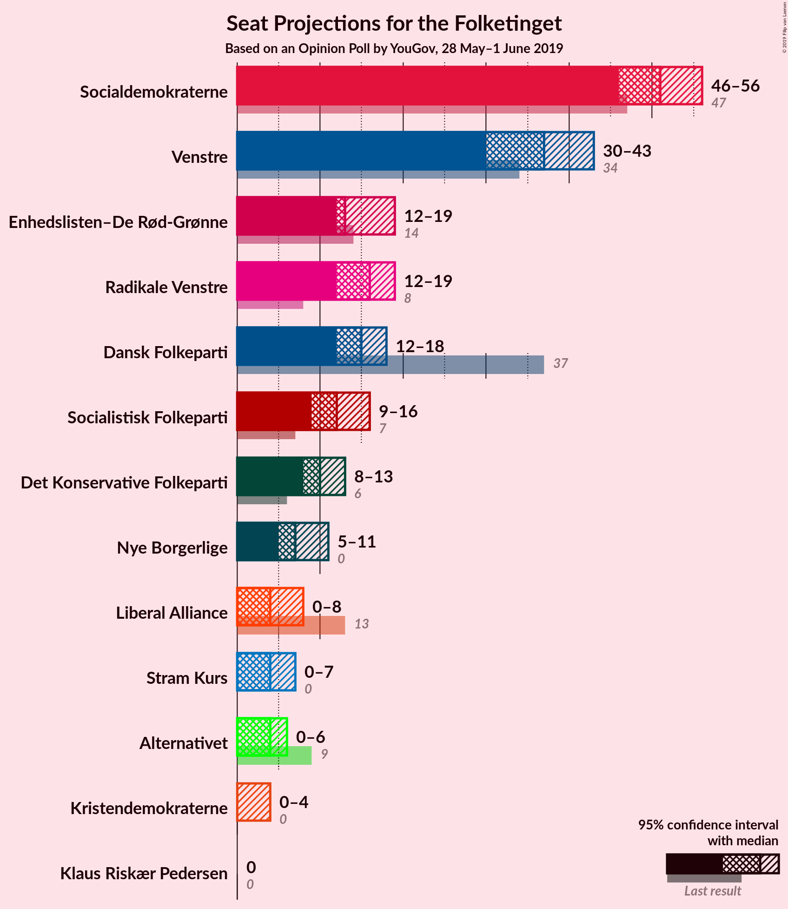
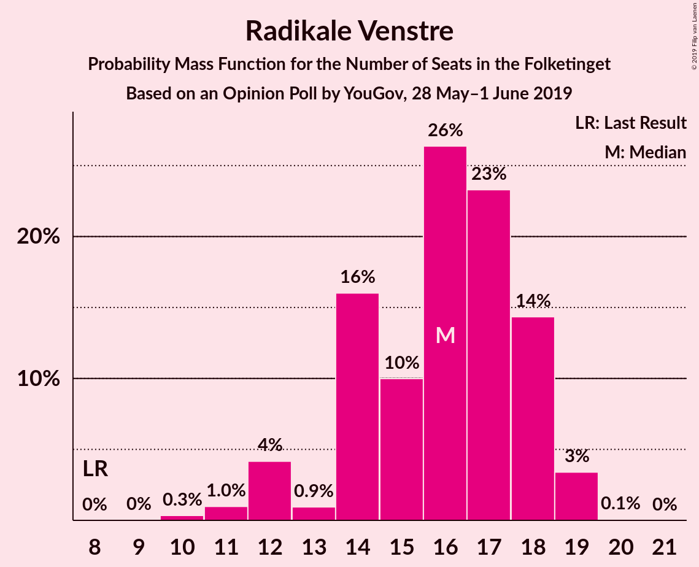
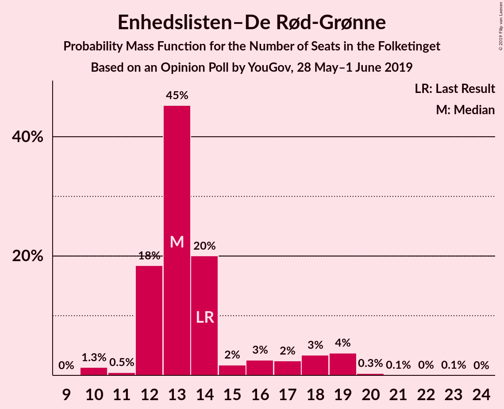
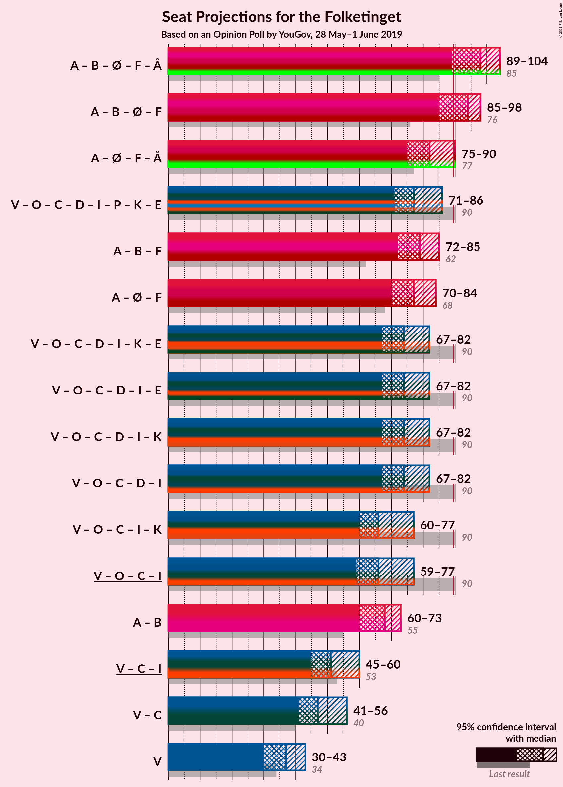
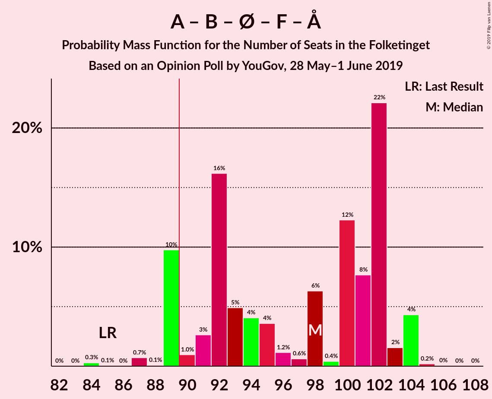
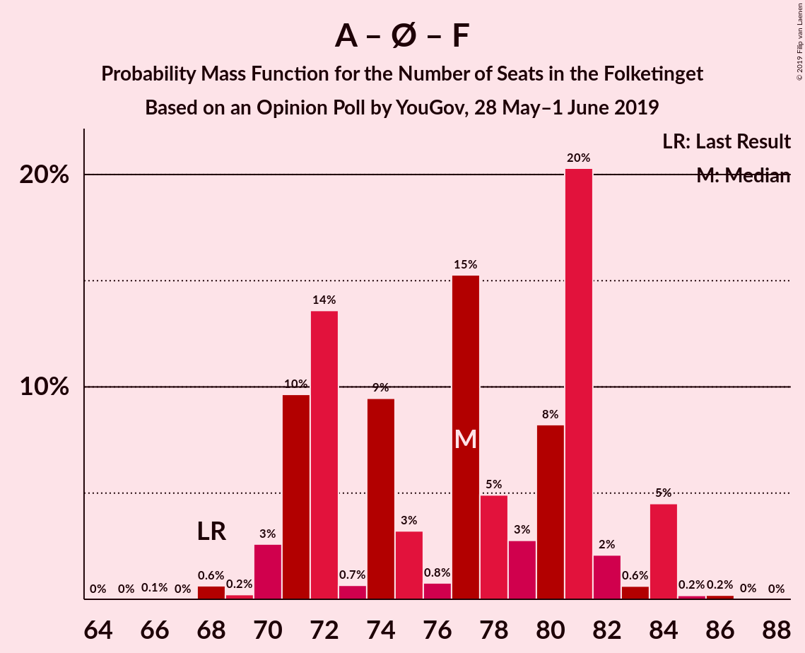
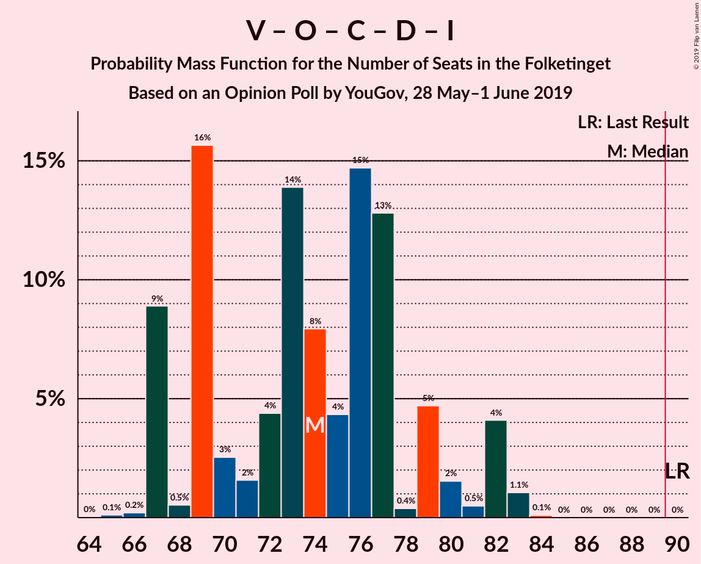
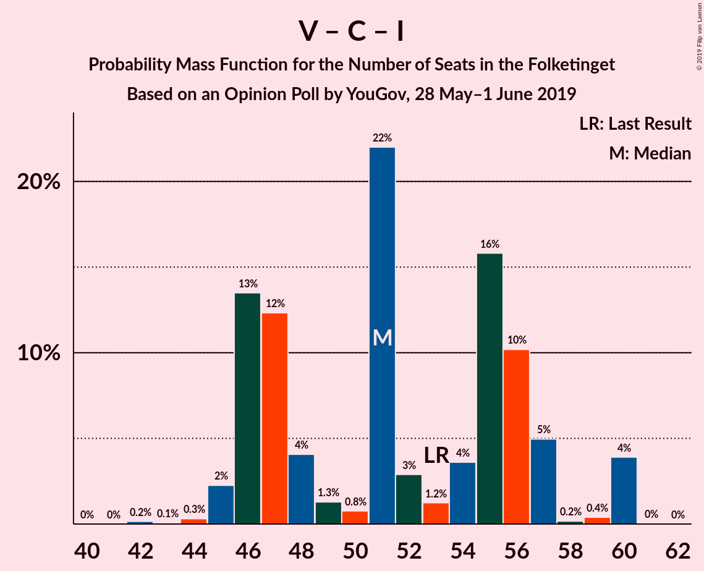
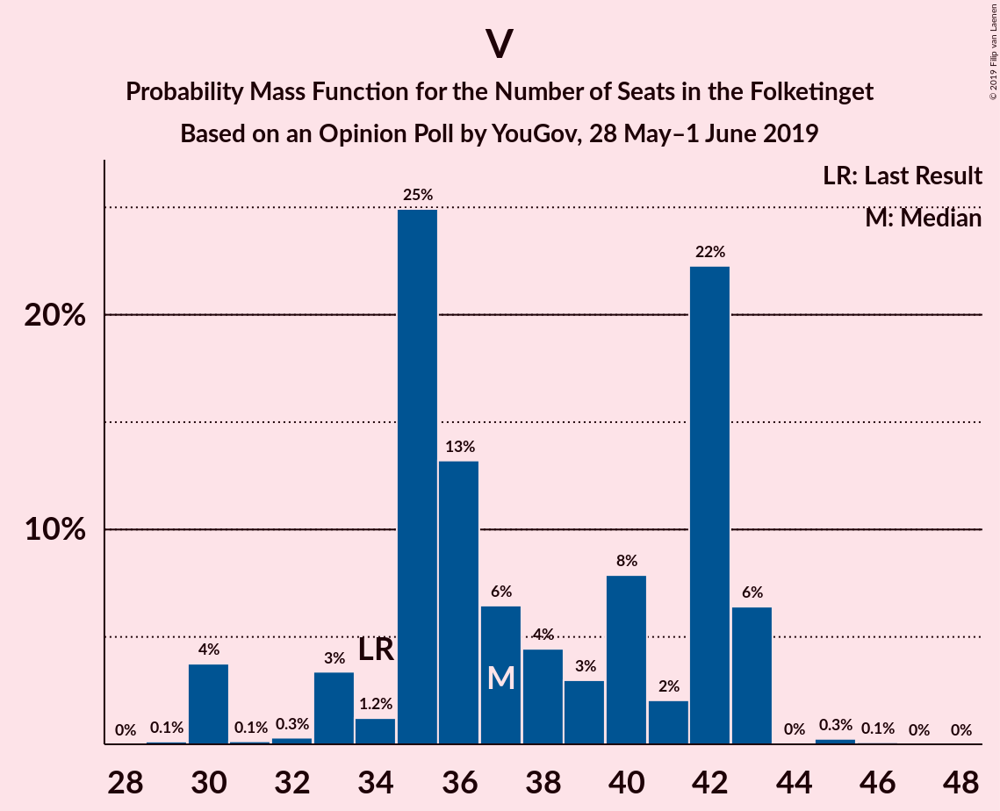

# Opinion Poll by YouGov, 28 May–1 June 2019

<a href="#voting-intentions">Voting Intentions</a> | <a href="#seats">Seats</a> | <a href="#coalitions">Coalitions</a> | <a href="#technical-information">Technical Information</a>

## Voting Intentions

### Confidence Intervals

| Party | Last Result | Poll Result | 80% Confidence Interval | 90% Confidence Interval | 95% Confidence Interval | 99% Confidence Interval |
|:-----:|:-----------:|:-----------:|:-----------------------:|:-----------------------:|:-----------------------:|:-----------------------:|
| Socialdemokraterne | 26.3% | 28.5% | 26.6–30.5% |26.1–31.1% |25.6–31.6% |24.7–32.6% |
| Venstre | 19.5% | 20.9% | 19.2–22.8% |18.7–23.3% |18.3–23.8% |17.6–24.7% |
| Dansk Folkeparti | 21.1% | 8.5% | 7.4–9.8% |7.1–10.2% |6.8–10.6% |6.3–11.2% |
| Radikale Venstre | 4.6% | 8.4% | 7.3–9.7% |7.0–10.1% |6.7–10.4% |6.2–11.1% |
| Enhedslisten–De Rød-Grønne | 7.8% | 8.3% | 7.2–9.6% |6.9–10.0% |6.6–10.3% |6.1–11.0% |
| Socialistisk Folkeparti | 4.2% | 6.7% | 5.7–7.9% |5.4–8.2% |5.2–8.5% |4.8–9.1% |
| Det Konservative Folkeparti | 3.4% | 5.4% | 4.5–6.5% |4.3–6.8% |4.1–7.1% |3.7–7.7% |
| Nye Borgerlige | 0.0% | 4.3% | 3.5–5.3% |3.3–5.6% |3.1–5.8% |2.8–6.3% |
| Liberal Alliance | 7.5% | 2.8% | 2.2–3.6% |2.0–3.9% |1.9–4.1% |1.6–4.5% |
| Stram Kurs | 0.0% | 2.4% | 1.9–3.2% |1.7–3.5% |1.6–3.7% |1.4–4.1% |
| Alternativet | 4.8% | 2.3% | 1.8–3.1% |1.6–3.3% |1.5–3.5% |1.3–3.9% |
| Kristendemokraterne | 0.8% | 1.4% | 1.0–2.0% |0.9–2.2% |0.8–2.4% |0.6–2.8% |
| Klaus Riskær Pedersen | 0.0% | 0.2% | 0.1–0.6% |0.1–0.7% |0.1–0.8% |0.0–1.1% |

*Note:* The poll result column reflects the actual value used in the calculations. Published results may vary slightly, and in addition be rounded to fewer digits.

## Seats

### Confidence Intervals

| Party | Last Result | Median | 80% Confidence Interval | 90% Confidence Interval | 95% Confidence Interval | 99% Confidence Interval |
|:-----:|:-----------:|:------:|:-----------------------:|:-----------------------:|:-----------------------:|:-----------------------:|
| <a href="#socialdemokraterne">Socialdemokraterne</a> | 47 | 51 | 51 |47–56 |47–56 |47–56 |
| <a href="#venstre">Venstre</a> | 34 | 35 | 34–35 |32–35 |32–35 |32–35 |
| <a href="#dansk-folkeparti">Dansk Folkeparti</a> | 37 | 17 | 17–18 |17–19 |17–19 |17–19 |
| <a href="#radikale-venstre">Radikale Venstre</a> | 8 | 17 | 17 |16–17 |16–17 |16–17 |
| <a href="#enhedslisten–de-rød-grønne">Enhedslisten–De Rød-Grønne</a> | 14 | 16 | 16 |15–16 |15–16 |15–16 |
| <a href="#socialistisk-folkeparti">Socialistisk Folkeparti</a> | 7 | 9 | 9 |9–10 |9–10 |9–10 |
| <a href="#det-konservative-folkeparti">Det Konservative Folkeparti</a> | 6 | 13 | 13 |7–13 |7–13 |7–13 |
| <a href="#nye-borgerlige">Nye Borgerlige</a> | 0 | 7 | 7 |6–7 |6–7 |6–7 |
| <a href="#liberal-alliance">Liberal Alliance</a> | 13 | 4 | 4–5 |4–6 |4–6 |4–6 |
| <a href="#stram-kurs">Stram Kurs</a> | 0 | 6 | 6 |5–7 |5–7 |5–7 |
| <a href="#alternativet">Alternativet</a> | 9 | 0 | 0 |0–5 |0–5 |0–5 |
| <a href="#kristendemokraterne">Kristendemokraterne</a> | 0 | 0 | 0 |0 |0 |0 |
| <a href="#klaus-riskær-pedersen">Klaus Riskær Pedersen</a> | 0 | 0 | 0 |0 |0 |0 |

### Socialdemokraterne

*For a full overview of the results for this party, see the [Socialdemokraterne](party-socialdemokraterne.html) page.*

| Number of Seats | Probability | Accumulated | Special Marks |
|:---------------:|:-----------:|:-----------:|:-------------:|
| 47 | 10% | 100% | Last Result |
| 48 | 0% | 90% |  |
| 49 | 0% | 90% |  |
| 50 | 0% | 90% |  |
| 51 | 84% | 90% | Median |
| 52 | 0.2% | 6% |  |
| 53 | 0% | 6% |  |
| 54 | 0% | 6% |  |
| 55 | 0% | 6% |  |
| 56 | 6% | 6% |  |
| 57 | 0% | 0% |  |

### Venstre

*For a full overview of the results for this party, see the [Venstre](party-venstre.html) page.*

| Number of Seats | Probability | Accumulated | Special Marks |
|:---------------:|:-----------:|:-----------:|:-------------:|
| 31 | 0.2% | 100% |  |
| 32 | 10% | 99.8% |  |
| 33 | 0% | 90% |  |
| 34 | 6% | 90% | Last Result |
| 35 | 85% | 85% | Median |
| 36 | 0% | 0% |  |

### Dansk Folkeparti

*For a full overview of the results for this party, see the [Dansk Folkeparti](party-danskfolkeparti.html) page.*

| Number of Seats | Probability | Accumulated | Special Marks |
|:---------------:|:-----------:|:-----------:|:-------------:|
| 17 | 85% | 100% | Median |
| 18 | 10% | 15% |  |
| 19 | 6% | 6% |  |
| 20 | 0.2% | 0.2% |  |
| 21 | 0% | 0% |  |
| 22 | 0% | 0% |  |
| 23 | 0% | 0% |  |
| 24 | 0% | 0% |  |
| 25 | 0% | 0% |  |
| 26 | 0% | 0% |  |
| 27 | 0% | 0% |  |
| 28 | 0% | 0% |  |
| 29 | 0% | 0% |  |
| 30 | 0% | 0% |  |
| 31 | 0% | 0% |  |
| 32 | 0% | 0% |  |
| 33 | 0% | 0% |  |
| 34 | 0% | 0% |  |
| 35 | 0% | 0% |  |
| 36 | 0% | 0% |  |
| 37 | 0% | 0% | Last Result |

### Radikale Venstre

*For a full overview of the results for this party, see the [Radikale Venstre](party-radikalevenstre.html) page.*

| Number of Seats | Probability | Accumulated | Special Marks |
|:---------------:|:-----------:|:-----------:|:-------------:|
| 8 | 0% | 100% | Last Result |
| 9 | 0% | 100% |  |
| 10 | 0% | 100% |  |
| 11 | 0% | 100% |  |
| 12 | 0% | 100% |  |
| 13 | 0% | 100% |  |
| 14 | 0% | 100% |  |
| 15 | 0% | 100% |  |
| 16 | 10% | 100% |  |
| 17 | 90% | 90% | Median |
| 18 | 0% | 0% |  |

### Enhedslisten–De Rød-Grønne

*For a full overview of the results for this party, see the [Enhedslisten–De Rød-Grønne](party-enhedslisten–derød-grønne.html) page.*

| Number of Seats | Probability | Accumulated | Special Marks |
|:---------------:|:-----------:|:-----------:|:-------------:|
| 14 | 0% | 100% | Last Result |
| 15 | 6% | 100% |  |
| 16 | 94% | 94% | Median |
| 17 | 0% | 0% |  |

### Socialistisk Folkeparti

*For a full overview of the results for this party, see the [Socialistisk Folkeparti](party-socialistiskfolkeparti.html) page.*

| Number of Seats | Probability | Accumulated | Special Marks |
|:---------------:|:-----------:|:-----------:|:-------------:|
| 7 | 0% | 100% | Last Result |
| 8 | 0% | 100% |  |
| 9 | 90% | 100% | Median |
| 10 | 10% | 10% |  |
| 11 | 0% | 0% |  |

### Det Konservative Folkeparti

*For a full overview of the results for this party, see the [Det Konservative Folkeparti](party-detkonservativefolkeparti.html) page.*

| Number of Seats | Probability | Accumulated | Special Marks |
|:---------------:|:-----------:|:-----------:|:-------------:|
| 6 | 0% | 100% | Last Result |
| 7 | 6% | 100% |  |
| 8 | 0% | 94% |  |
| 9 | 0% | 94% |  |
| 10 | 0% | 94% |  |
| 11 | 0% | 94% |  |
| 12 | 0% | 94% |  |
| 13 | 94% | 94% | Median |
| 14 | 0% | 0% |  |

### Nye Borgerlige

*For a full overview of the results for this party, see the [Nye Borgerlige](party-nyeborgerlige.html) page.*

| Number of Seats | Probability | Accumulated | Special Marks |
|:---------------:|:-----------:|:-----------:|:-------------:|
| 0 | 0% | 100% | Last Result |
| 1 | 0% | 100% |  |
| 2 | 0% | 100% |  |
| 3 | 0% | 100% |  |
| 4 | 0% | 100% |  |
| 5 | 0% | 100% |  |
| 6 | 10% | 100% |  |
| 7 | 90% | 90% | Median |
| 8 | 0% | 0% |  |

### Liberal Alliance

*For a full overview of the results for this party, see the [Liberal Alliance](party-liberalalliance.html) page.*

| Number of Seats | Probability | Accumulated | Special Marks |
|:---------------:|:-----------:|:-----------:|:-------------:|
| 4 | 85% | 100% | Median |
| 5 | 10% | 15% |  |
| 6 | 6% | 6% |  |
| 7 | 0.2% | 0.2% |  |
| 8 | 0% | 0% |  |
| 9 | 0% | 0% |  |
| 10 | 0% | 0% |  |
| 11 | 0% | 0% |  |
| 12 | 0% | 0% |  |
| 13 | 0% | 0% | Last Result |

### Stram Kurs

*For a full overview of the results for this party, see the [Stram Kurs](party-stramkurs.html) page.*

| Number of Seats | Probability | Accumulated | Special Marks |
|:---------------:|:-----------:|:-----------:|:-------------:|
| 0 | 0% | 100% | Last Result |
| 1 | 0% | 100% |  |
| 2 | 0% | 100% |  |
| 3 | 0% | 100% |  |
| 4 | 0% | 100% |  |
| 5 | 6% | 100% |  |
| 6 | 85% | 94% | Median |
| 7 | 10% | 10% |  |
| 8 | 0% | 0% |  |

### Alternativet

*For a full overview of the results for this party, see the [Alternativet](party-alternativet.html) page.*

| Number of Seats | Probability | Accumulated | Special Marks |
|:---------------:|:-----------:|:-----------:|:-------------:|
| 0 | 90% | 100% | Median |
| 1 | 0% | 10% |  |
| 2 | 0% | 10% |  |
| 3 | 0% | 10% |  |
| 4 | 0% | 10% |  |
| 5 | 10% | 10% |  |
| 6 | 0% | 0% |  |
| 7 | 0% | 0% |  |
| 8 | 0% | 0% |  |
| 9 | 0% | 0% | Last Result |

### Kristendemokraterne

*For a full overview of the results for this party, see the [Kristendemokraterne](party-kristendemokraterne.html) page.*

| Number of Seats | Probability | Accumulated | Special Marks |
|:---------------:|:-----------:|:-----------:|:-------------:|
| 0 | 100% | 100% | Last Result, Median |

### Klaus Riskær Pedersen

*For a full overview of the results for this party, see the [Klaus Riskær Pedersen](party-klausriskærpedersen.html) page.*

| Number of Seats | Probability | Accumulated | Special Marks |
|:---------------:|:-----------:|:-----------:|:-------------:|
| 0 | 100% | 100% | Last Result, Median |

## Coalitions

### Confidence Intervals

| Coalition | Last Result | Median | Majority? | 80% Confidence Interval | 90% Confidence Interval | 95% Confidence Interval | 99% Confidence Interval |
|:---------:|:-----------:|:------:|:---------:|:-----------------------:|:-----------------------:|:-----------------------:|:-----------------------:|
| Socialdemokraterne – Radikale Venstre – Enhedslisten–De Rød-Grønne – Socialistisk Folkeparti – Alternativet | 85 | 93 | 100% | 93–94 | 93–97 | 93–97 | 93–97 |
| Socialdemokraterne – Radikale Venstre – Enhedslisten–De Rød-Grønne – Socialistisk Folkeparti | 76 | 93 | 90% | 93 | 89–97 | 89–97 | 89–97 |
| Venstre – Dansk Folkeparti – Det Konservative Folkeparti – Nye Borgerlige – Liberal Alliance – Stram Kurs – Kristendemokraterne – Klaus Riskær Pedersen | 90 | 82 | 0% | 81–82 | 78–82 | 78–82 | 78–82 |
| Socialdemokraterne – Radikale Venstre – Socialistisk Folkeparti | 62 | 77 | 0% | 77 | 73–82 | 73–82 | 73–82 |
| Socialdemokraterne – Enhedslisten–De Rød-Grønne – Socialistisk Folkeparti – Alternativet | 77 | 76 | 0% | 76–78 | 76–80 | 76–80 | 76–80 |
| Socialdemokraterne – Enhedslisten–De Rød-Grønne – Socialistisk Folkeparti | 68 | 76 | 0% | 76 | 73–80 | 73–80 | 73–80 |
| Venstre – Dansk Folkeparti – Det Konservative Folkeparti – Nye Borgerlige – Liberal Alliance – Kristendemokraterne – Klaus Riskær Pedersen | 90 | 76 | 0% | 74–76 | 73–76 | 73–76 | 73–76 |
| Venstre – Dansk Folkeparti – Det Konservative Folkeparti – Nye Borgerlige – Liberal Alliance – Klaus Riskær Pedersen | 90 | 76 | 0% | 74–76 | 73–76 | 73–76 | 73–76 |
| Venstre – Dansk Folkeparti – Det Konservative Folkeparti – Nye Borgerlige – Liberal Alliance – Kristendemokraterne | 90 | 76 | 0% | 74–76 | 73–76 | 73–76 | 73–76 |
| Venstre – Dansk Folkeparti – Det Konservative Folkeparti – Nye Borgerlige – Liberal Alliance | 90 | 76 | 0% | 74–76 | 73–76 | 73–76 | 73–76 |
| Socialdemokraterne – Radikale Venstre | 55 | 68 | 0% | 68 | 63–73 | 63–73 | 63–73 |
| Venstre – Dansk Folkeparti – Det Konservative Folkeparti – Liberal Alliance – Kristendemokraterne | 90 | 69 | 0% | 68–69 | 66–69 | 66–69 | 66–69 |
| Venstre – Dansk Folkeparti – Det Konservative Folkeparti – Liberal Alliance | 90 | 69 | 0% | 68–69 | 66–69 | 66–69 | 66–69 |
| Venstre – Det Konservative Folkeparti – Liberal Alliance | 53 | 52 | 0% | 50–52 | 47–52 | 47–52 | 47–52 |
| Venstre – Det Konservative Folkeparti | 40 | 48 | 0% | 45–48 | 41–48 | 41–48 | 41–48 |
| Venstre | 34 | 35 | 0% | 34–35 | 32–35 | 32–35 | 32–35 |

### Socialdemokraterne – Radikale Venstre – Enhedslisten–De Rød-Grønne – Socialistisk Folkeparti – Alternativet

| Number of Seats | Probability | Accumulated | Special Marks |
|:---------------:|:-----------:|:-----------:|:-------------:|
| 85 | 0% | 100% | Last Result |
| 86 | 0% | 100% |  |
| 87 | 0% | 100% |  |
| 88 | 0% | 100% |  |
| 89 | 0% | 100% |  |
| 90 | 0% | 100% | Majority |
| 91 | 0% | 100% |  |
| 92 | 0% | 100% |  |
| 93 | 84% | 100% | Median |
| 94 | 10% | 16% |  |
| 95 | 0% | 6% |  |
| 96 | 0% | 6% |  |
| 97 | 6% | 6% |  |
| 98 | 0.2% | 0.2% |  |
| 99 | 0% | 0% |  |

### Socialdemokraterne – Radikale Venstre – Enhedslisten–De Rød-Grønne – Socialistisk Folkeparti

| Number of Seats | Probability | Accumulated | Special Marks |
|:---------------:|:-----------:|:-----------:|:-------------:|
| 76 | 0% | 100% | Last Result |
| 77 | 0% | 100% |  |
| 78 | 0% | 100% |  |
| 79 | 0% | 100% |  |
| 80 | 0% | 100% |  |
| 81 | 0% | 100% |  |
| 82 | 0% | 100% |  |
| 83 | 0% | 100% |  |
| 84 | 0% | 100% |  |
| 85 | 0% | 100% |  |
| 86 | 0% | 100% |  |
| 87 | 0% | 100% |  |
| 88 | 0% | 100% |  |
| 89 | 10% | 100% |  |
| 90 | 0% | 90% | Majority |
| 91 | 0% | 90% |  |
| 92 | 0% | 90% |  |
| 93 | 85% | 90% | Median |
| 94 | 0% | 6% |  |
| 95 | 0% | 6% |  |
| 96 | 0% | 6% |  |
| 97 | 6% | 6% |  |
| 98 | 0% | 0% |  |

### Venstre – Dansk Folkeparti – Det Konservative Folkeparti – Nye Borgerlige – Liberal Alliance – Stram Kurs – Kristendemokraterne – Klaus Riskær Pedersen

| Number of Seats | Probability | Accumulated | Special Marks |
|:---------------:|:-----------:|:-----------:|:-------------:|
| 77 | 0.2% | 100% |  |
| 78 | 6% | 99.8% |  |
| 79 | 0% | 94% |  |
| 80 | 0% | 94% |  |
| 81 | 10% | 94% |  |
| 82 | 84% | 84% | Median |
| 83 | 0% | 0% |  |
| 84 | 0% | 0% |  |
| 85 | 0% | 0% |  |
| 86 | 0% | 0% |  |
| 87 | 0% | 0% |  |
| 88 | 0% | 0% |  |
| 89 | 0% | 0% |  |
| 90 | 0% | 0% | Last Result, Majority |

### Socialdemokraterne – Radikale Venstre – Socialistisk Folkeparti

| Number of Seats | Probability | Accumulated | Special Marks |
|:---------------:|:-----------:|:-----------:|:-------------:|
| 62 | 0% | 100% | Last Result |
| 63 | 0% | 100% |  |
| 64 | 0% | 100% |  |
| 65 | 0% | 100% |  |
| 66 | 0% | 100% |  |
| 67 | 0% | 100% |  |
| 68 | 0% | 100% |  |
| 69 | 0% | 100% |  |
| 70 | 0% | 100% |  |
| 71 | 0% | 100% |  |
| 72 | 0% | 100% |  |
| 73 | 10% | 100% |  |
| 74 | 0% | 90% |  |
| 75 | 0% | 90% |  |
| 76 | 0% | 90% |  |
| 77 | 84% | 90% | Median |
| 78 | 0.2% | 6% |  |
| 79 | 0% | 6% |  |
| 80 | 0% | 6% |  |
| 81 | 0% | 6% |  |
| 82 | 6% | 6% |  |
| 83 | 0% | 0% |  |

### Socialdemokraterne – Enhedslisten–De Rød-Grønne – Socialistisk Folkeparti – Alternativet

| Number of Seats | Probability | Accumulated | Special Marks |
|:---------------:|:-----------:|:-----------:|:-------------:|
| 76 | 84% | 100% | Median |
| 77 | 0% | 16% | Last Result |
| 78 | 10% | 16% |  |
| 79 | 0% | 6% |  |
| 80 | 6% | 6% |  |
| 81 | 0% | 0.2% |  |
| 82 | 0.2% | 0.2% |  |
| 83 | 0% | 0% |  |

### Socialdemokraterne – Enhedslisten–De Rød-Grønne – Socialistisk Folkeparti

| Number of Seats | Probability | Accumulated | Special Marks |
|:---------------:|:-----------:|:-----------:|:-------------:|
| 68 | 0% | 100% | Last Result |
| 69 | 0% | 100% |  |
| 70 | 0% | 100% |  |
| 71 | 0% | 100% |  |
| 72 | 0% | 100% |  |
| 73 | 10% | 100% |  |
| 74 | 0% | 90% |  |
| 75 | 0% | 90% |  |
| 76 | 84% | 90% | Median |
| 77 | 0.2% | 6% |  |
| 78 | 0% | 6% |  |
| 79 | 0% | 6% |  |
| 80 | 6% | 6% |  |
| 81 | 0% | 0% |  |

### Venstre – Dansk Folkeparti – Det Konservative Folkeparti – Nye Borgerlige – Liberal Alliance – Kristendemokraterne – Klaus Riskær Pedersen

| Number of Seats | Probability | Accumulated | Special Marks |
|:---------------:|:-----------:|:-----------:|:-------------:|
| 71 | 0.2% | 100% |  |
| 72 | 0% | 99.8% |  |
| 73 | 6% | 99.8% |  |
| 74 | 10% | 94% |  |
| 75 | 0% | 84% |  |
| 76 | 84% | 84% | Median |
| 77 | 0% | 0% |  |
| 78 | 0% | 0% |  |
| 79 | 0% | 0% |  |
| 80 | 0% | 0% |  |
| 81 | 0% | 0% |  |
| 82 | 0% | 0% |  |
| 83 | 0% | 0% |  |
| 84 | 0% | 0% |  |
| 85 | 0% | 0% |  |
| 86 | 0% | 0% |  |
| 87 | 0% | 0% |  |
| 88 | 0% | 0% |  |
| 89 | 0% | 0% |  |
| 90 | 0% | 0% | Last Result, Majority |

### Venstre – Dansk Folkeparti – Det Konservative Folkeparti – Nye Borgerlige – Liberal Alliance – Klaus Riskær Pedersen

| Number of Seats | Probability | Accumulated | Special Marks |
|:---------------:|:-----------:|:-----------:|:-------------:|
| 71 | 0.2% | 100% |  |
| 72 | 0% | 99.8% |  |
| 73 | 6% | 99.8% |  |
| 74 | 10% | 94% |  |
| 75 | 0% | 84% |  |
| 76 | 84% | 84% | Median |
| 77 | 0% | 0% |  |
| 78 | 0% | 0% |  |
| 79 | 0% | 0% |  |
| 80 | 0% | 0% |  |
| 81 | 0% | 0% |  |
| 82 | 0% | 0% |  |
| 83 | 0% | 0% |  |
| 84 | 0% | 0% |  |
| 85 | 0% | 0% |  |
| 86 | 0% | 0% |  |
| 87 | 0% | 0% |  |
| 88 | 0% | 0% |  |
| 89 | 0% | 0% |  |
| 90 | 0% | 0% | Last Result, Majority |

### Venstre – Dansk Folkeparti – Det Konservative Folkeparti – Nye Borgerlige – Liberal Alliance – Kristendemokraterne

| Number of Seats | Probability | Accumulated | Special Marks |
|:---------------:|:-----------:|:-----------:|:-------------:|
| 71 | 0.2% | 100% |  |
| 72 | 0% | 99.8% |  |
| 73 | 6% | 99.8% |  |
| 74 | 10% | 94% |  |
| 75 | 0% | 84% |  |
| 76 | 84% | 84% | Median |
| 77 | 0% | 0% |  |
| 78 | 0% | 0% |  |
| 79 | 0% | 0% |  |
| 80 | 0% | 0% |  |
| 81 | 0% | 0% |  |
| 82 | 0% | 0% |  |
| 83 | 0% | 0% |  |
| 84 | 0% | 0% |  |
| 85 | 0% | 0% |  |
| 86 | 0% | 0% |  |
| 87 | 0% | 0% |  |
| 88 | 0% | 0% |  |
| 89 | 0% | 0% |  |
| 90 | 0% | 0% | Last Result, Majority |

### Venstre – Dansk Folkeparti – Det Konservative Folkeparti – Nye Borgerlige – Liberal Alliance

| Number of Seats | Probability | Accumulated | Special Marks |
|:---------------:|:-----------:|:-----------:|:-------------:|
| 71 | 0.2% | 100% |  |
| 72 | 0% | 99.8% |  |
| 73 | 6% | 99.8% |  |
| 74 | 10% | 94% |  |
| 75 | 0% | 84% |  |
| 76 | 84% | 84% | Median |
| 77 | 0% | 0% |  |
| 78 | 0% | 0% |  |
| 79 | 0% | 0% |  |
| 80 | 0% | 0% |  |
| 81 | 0% | 0% |  |
| 82 | 0% | 0% |  |
| 83 | 0% | 0% |  |
| 84 | 0% | 0% |  |
| 85 | 0% | 0% |  |
| 86 | 0% | 0% |  |
| 87 | 0% | 0% |  |
| 88 | 0% | 0% |  |
| 89 | 0% | 0% |  |
| 90 | 0% | 0% | Last Result, Majority |

### Socialdemokraterne – Radikale Venstre

| Number of Seats | Probability | Accumulated | Special Marks |
|:---------------:|:-----------:|:-----------:|:-------------:|
| 55 | 0% | 100% | Last Result |
| 56 | 0% | 100% |  |
| 57 | 0% | 100% |  |
| 58 | 0% | 100% |  |
| 59 | 0% | 100% |  |
| 60 | 0% | 100% |  |
| 61 | 0% | 100% |  |
| 62 | 0% | 100% |  |
| 63 | 10% | 100% |  |
| 64 | 0% | 90% |  |
| 65 | 0% | 90% |  |
| 66 | 0% | 90% |  |
| 67 | 0% | 90% |  |
| 68 | 85% | 90% | Median |
| 69 | 0% | 6% |  |
| 70 | 0% | 6% |  |
| 71 | 0% | 6% |  |
| 72 | 0% | 6% |  |
| 73 | 6% | 6% |  |
| 74 | 0% | 0% |  |

### Venstre – Dansk Folkeparti – Det Konservative Folkeparti – Liberal Alliance – Kristendemokraterne

| Number of Seats | Probability | Accumulated | Special Marks |
|:---------------:|:-----------:|:-----------:|:-------------:|
| 65 | 0.2% | 100% |  |
| 66 | 6% | 99.8% |  |
| 67 | 0% | 94% |  |
| 68 | 10% | 94% |  |
| 69 | 84% | 84% | Median |
| 70 | 0% | 0% |  |
| 71 | 0% | 0% |  |
| 72 | 0% | 0% |  |
| 73 | 0% | 0% |  |
| 74 | 0% | 0% |  |
| 75 | 0% | 0% |  |
| 76 | 0% | 0% |  |
| 77 | 0% | 0% |  |
| 78 | 0% | 0% |  |
| 79 | 0% | 0% |  |
| 80 | 0% | 0% |  |
| 81 | 0% | 0% |  |
| 82 | 0% | 0% |  |
| 83 | 0% | 0% |  |
| 84 | 0% | 0% |  |
| 85 | 0% | 0% |  |
| 86 | 0% | 0% |  |
| 87 | 0% | 0% |  |
| 88 | 0% | 0% |  |
| 89 | 0% | 0% |  |
| 90 | 0% | 0% | Last Result, Majority |

### Venstre – Dansk Folkeparti – Det Konservative Folkeparti – Liberal Alliance

| Number of Seats | Probability | Accumulated | Special Marks |
|:---------------:|:-----------:|:-----------:|:-------------:|
| 65 | 0.2% | 100% |  |
| 66 | 6% | 99.8% |  |
| 67 | 0% | 94% |  |
| 68 | 10% | 94% |  |
| 69 | 84% | 84% | Median |
| 70 | 0% | 0% |  |
| 71 | 0% | 0% |  |
| 72 | 0% | 0% |  |
| 73 | 0% | 0% |  |
| 74 | 0% | 0% |  |
| 75 | 0% | 0% |  |
| 76 | 0% | 0% |  |
| 77 | 0% | 0% |  |
| 78 | 0% | 0% |  |
| 79 | 0% | 0% |  |
| 80 | 0% | 0% |  |
| 81 | 0% | 0% |  |
| 82 | 0% | 0% |  |
| 83 | 0% | 0% |  |
| 84 | 0% | 0% |  |
| 85 | 0% | 0% |  |
| 86 | 0% | 0% |  |
| 87 | 0% | 0% |  |
| 88 | 0% | 0% |  |
| 89 | 0% | 0% |  |
| 90 | 0% | 0% | Last Result, Majority |

### Venstre – Det Konservative Folkeparti – Liberal Alliance

| Number of Seats | Probability | Accumulated | Special Marks |
|:---------------:|:-----------:|:-----------:|:-------------:|
| 45 | 0.2% | 100% |  |
| 46 | 0% | 99.8% |  |
| 47 | 6% | 99.8% |  |
| 48 | 0% | 94% |  |
| 49 | 0% | 94% |  |
| 50 | 10% | 94% |  |
| 51 | 0% | 85% |  |
| 52 | 84% | 84% | Median |
| 53 | 0% | 0% | Last Result |

### Venstre – Det Konservative Folkeparti

| Number of Seats | Probability | Accumulated | Special Marks |
|:---------------:|:-----------:|:-----------:|:-------------:|
| 38 | 0.2% | 100% |  |
| 39 | 0% | 99.8% |  |
| 40 | 0% | 99.8% | Last Result |
| 41 | 6% | 99.8% |  |
| 42 | 0% | 94% |  |
| 43 | 0% | 94% |  |
| 44 | 0% | 94% |  |
| 45 | 10% | 94% |  |
| 46 | 0% | 85% |  |
| 47 | 0% | 85% |  |
| 48 | 84% | 84% | Median |
| 49 | 0% | 0% |  |

### Venstre

| Number of Seats | Probability | Accumulated | Special Marks |
|:---------------:|:-----------:|:-----------:|:-------------:|
| 31 | 0.2% | 100% |  |
| 32 | 10% | 99.8% |  |
| 33 | 0% | 90% |  |
| 34 | 6% | 90% | Last Result |
| 35 | 85% | 85% | Median |
| 36 | 0% | 0% |  |

## Technical Information

### Opinion Poll

+ **Polling firm:** YouGov
+ **Commissioner(s):** —
+ **Fieldwork period:** 28 May–1 June 2019

### Calculations

+ **Sample size:** 870
+ **Simulations done:** 1,024
+ **Error estimate:** 3.32%

