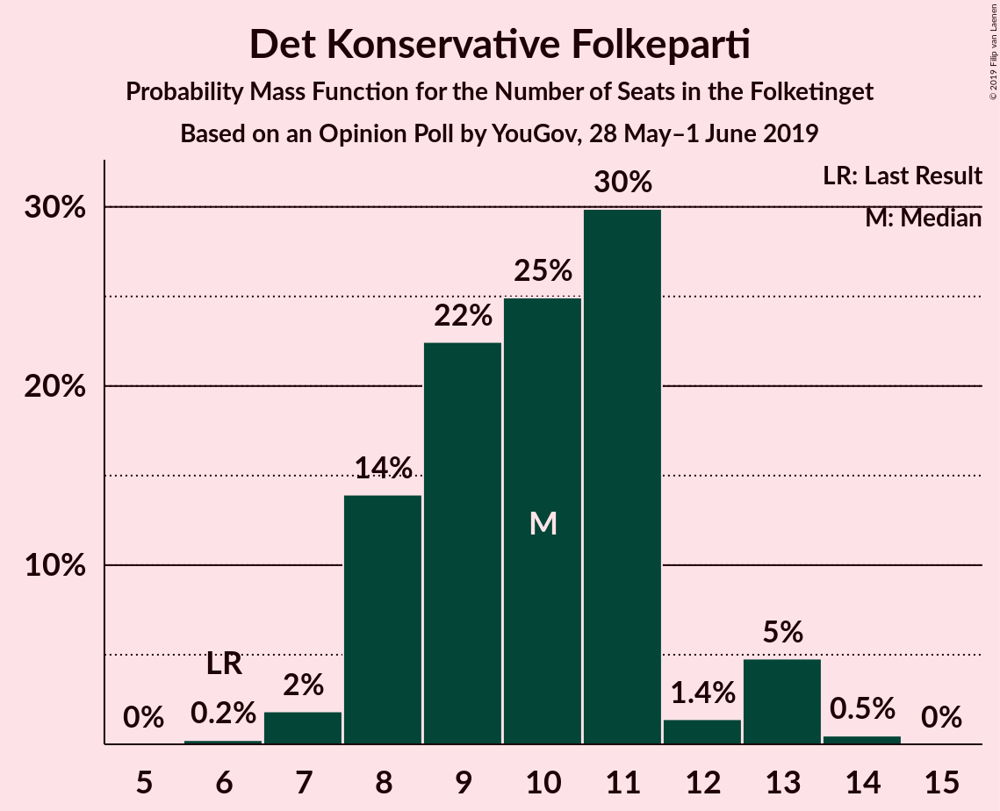
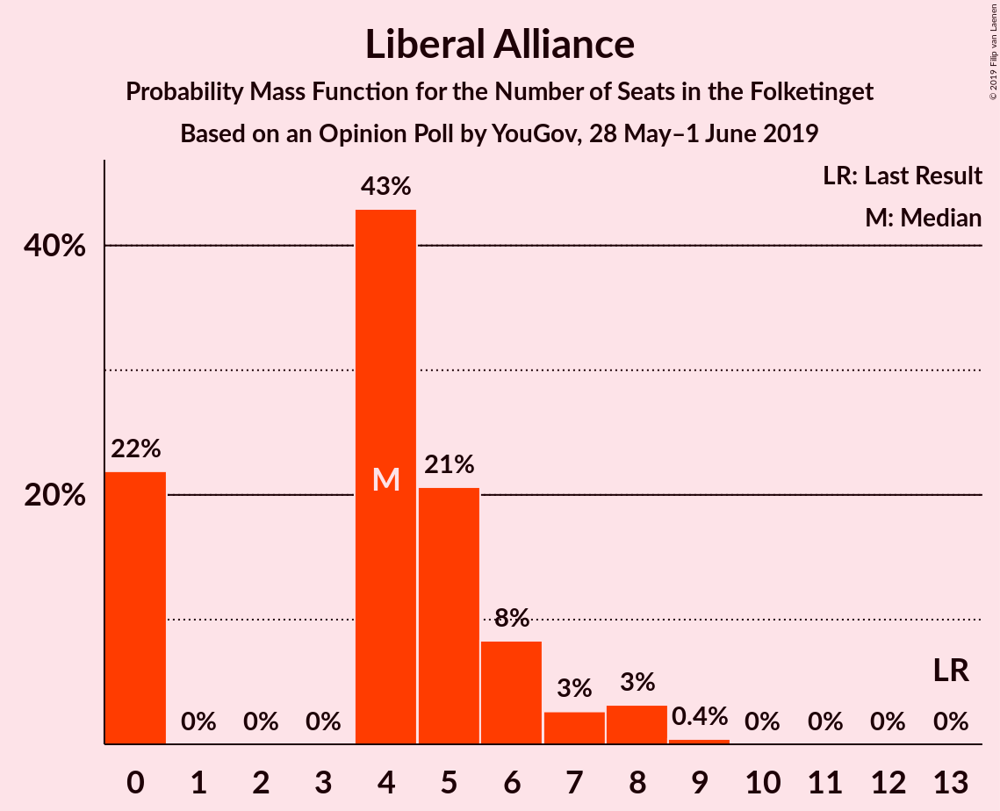
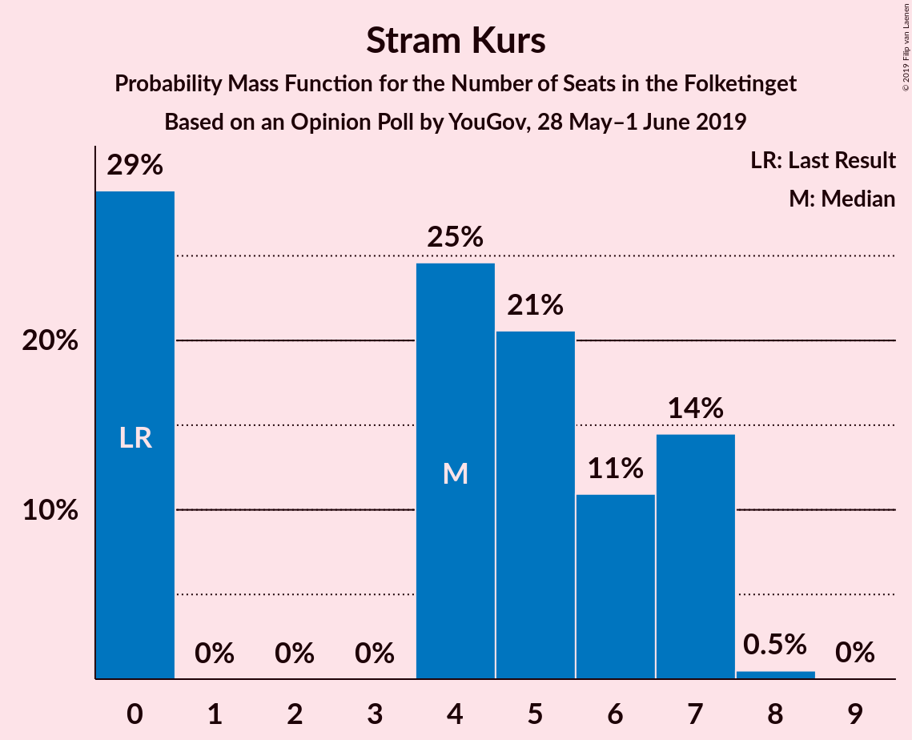
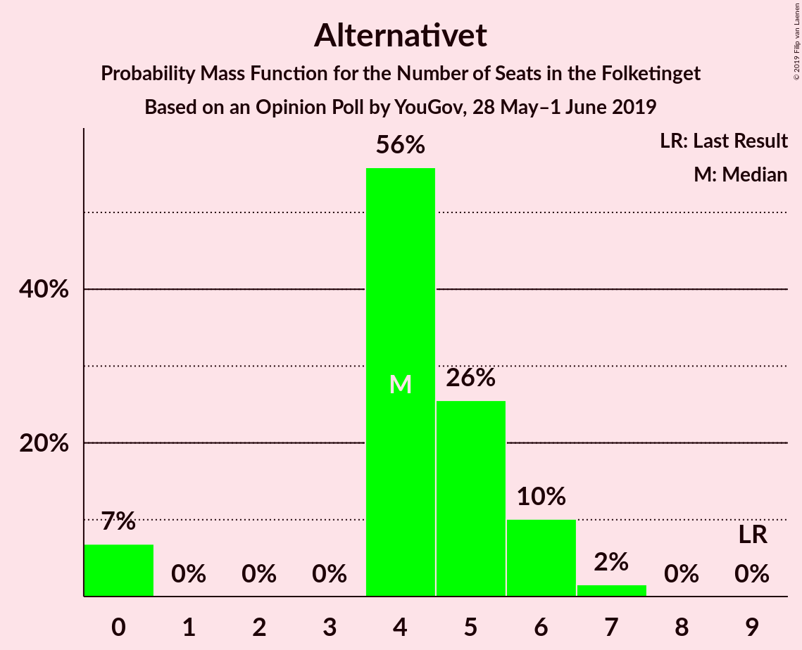
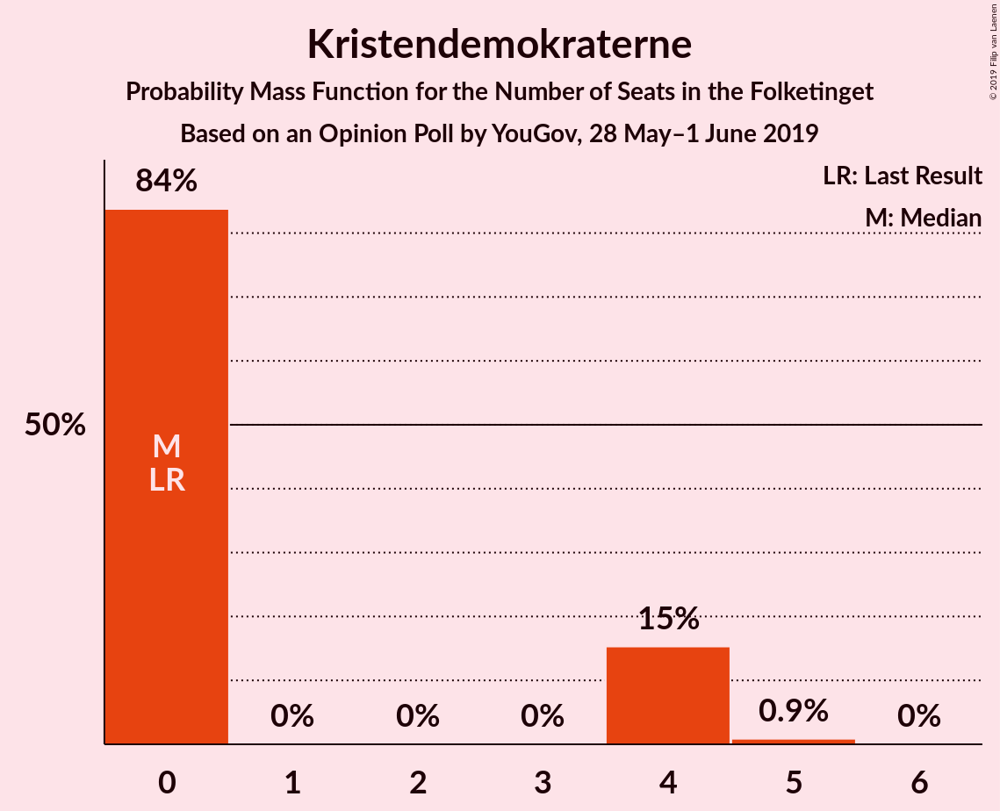
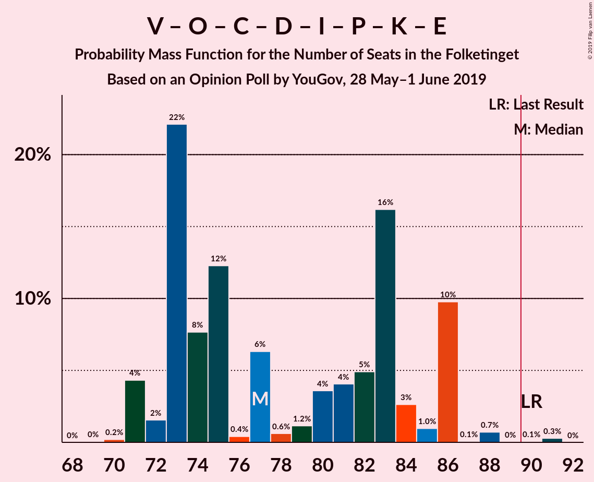
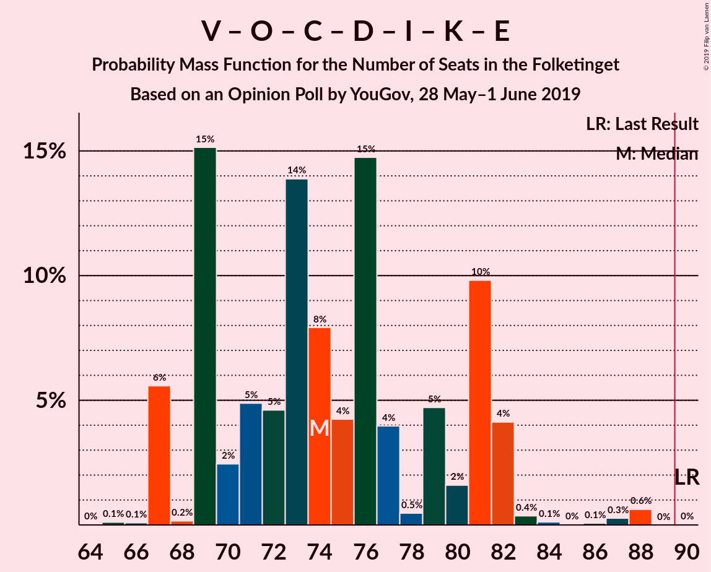

# Opinion Poll by YouGov, 28 May–1 June 2019

<a href="#voting-intentions">Voting Intentions</a> | <a href="#seats">Seats</a> | <a href="#coalitions">Coalitions</a> | <a href="#technical-information">Technical Information</a>

## Voting Intentions

### Confidence Intervals

| Party | Last Result | Poll Result | 80% Confidence Interval | 90% Confidence Interval | 95% Confidence Interval | 99% Confidence Interval |
|:-----:|:-----------:|:-----------:|:-----------------------:|:-----------------------:|:-----------------------:|:-----------------------:|
| Socialdemokraterne | 26.3% | 28.5% | 26.6–30.5% |26.1–31.1% |25.6–31.6% |24.7–32.6% |
| Venstre | 19.5% | 20.9% | 19.2–22.8% |18.7–23.3% |18.3–23.8% |17.6–24.7% |
| Dansk Folkeparti | 21.1% | 8.5% | 7.4–9.8% |7.1–10.2% |6.8–10.6% |6.3–11.2% |
| Radikale Venstre | 4.6% | 8.4% | 7.3–9.7% |7.0–10.1% |6.7–10.4% |6.2–11.1% |
| Enhedslisten–De Rød-Grønne | 7.8% | 8.3% | 7.2–9.6% |6.9–10.0% |6.6–10.3% |6.1–11.0% |
| Socialistisk Folkeparti | 4.2% | 6.7% | 5.7–7.9% |5.4–8.2% |5.2–8.5% |4.8–9.1% |
| Det Konservative Folkeparti | 3.4% | 5.4% | 4.5–6.5% |4.3–6.8% |4.1–7.1% |3.7–7.7% |
| Nye Borgerlige | 0.0% | 4.3% | 3.5–5.3% |3.3–5.6% |3.1–5.8% |2.8–6.3% |
| Liberal Alliance | 7.5% | 2.8% | 2.2–3.6% |2.0–3.9% |1.9–4.1% |1.6–4.5% |
| Stram Kurs | 0.0% | 2.4% | 1.9–3.2% |1.7–3.5% |1.6–3.7% |1.4–4.1% |
| Alternativet | 4.8% | 2.3% | 1.8–3.1% |1.6–3.3% |1.5–3.5% |1.3–3.9% |
| Kristendemokraterne | 0.8% | 1.4% | 1.0–2.0% |0.9–2.2% |0.8–2.4% |0.6–2.8% |
| Klaus Riskær Pedersen | 0.0% | 0.2% | 0.1–0.6% |0.1–0.7% |0.1–0.8% |0.0–1.1% |

*Note:* The poll result column reflects the actual value used in the calculations. Published results may vary slightly, and in addition be rounded to fewer digits.

## Seats

### Confidence Intervals

| Party | Last Result | Median | 80% Confidence Interval | 90% Confidence Interval | 95% Confidence Interval | 99% Confidence Interval |
|:-----:|:-----------:|:------:|:-----------------------:|:-----------------------:|:-----------------------:|:-----------------------:|
| <a href="#socialdemokraterne">Socialdemokraterne</a> | 47 | 51 | 48–55 |47–56 |46–56 |44–57 |
| <a href="#venstre">Venstre</a> | 34 | 37 | 35–42 |33–43 |30–43 |30–43 |
| <a href="#dansk-folkeparti">Dansk Folkeparti</a> | 37 | 15 | 13–17 |13–18 |12–18 |12–20 |
| <a href="#radikale-venstre">Radikale Venstre</a> | 8 | 16 | 14–18 |12–18 |12–19 |11–19 |
| <a href="#enhedslisten–de-rød-grønne">Enhedslisten–De Rød-Grønne</a> | 14 | 13 | 12–17 |12–18 |12–19 |10–20 |
| <a href="#socialistisk-folkeparti">Socialistisk Folkeparti</a> | 7 | 12 | 10–15 |10–16 |9–16 |8–16 |
| <a href="#det-konservative-folkeparti">Det Konservative Folkeparti</a> | 6 | 10 | 8–11 |8–13 |8–13 |7–13 |
| <a href="#nye-borgerlige">Nye Borgerlige</a> | 0 | 7 | 6–9 |5–11 |5–11 |4–12 |
| <a href="#liberal-alliance">Liberal Alliance</a> | 13 | 4 | 0–6 |0–7 |0–8 |0–8 |
| <a href="#stram-kurs">Stram Kurs</a> | 0 | 4 | 0–7 |0–7 |0–7 |0–8 |
| <a href="#alternativet">Alternativet</a> | 9 | 4 | 4–6 |0–6 |0–6 |0–7 |
| <a href="#kristendemokraterne">Kristendemokraterne</a> | 0 | 0 | 0–4 |0–4 |0–4 |0–5 |
| <a href="#klaus-riskær-pedersen">Klaus Riskær Pedersen</a> | 0 | 0 | 0 |0 |0 |0 |

### Socialdemokraterne

*For a full overview of the results for this party, see the [Socialdemokraterne](party-socialdemokraterne.html) page.*

| Number of Seats | Probability | Accumulated | Special Marks |
|:---------------:|:-----------:|:-----------:|:-------------:|
| 41 | 0.1% | 100% |  |
| 42 | 0.1% | 99.9% |  |
| 43 | 0.1% | 99.8% |  |
| 44 | 0.6% | 99.7% |  |
| 45 | 0.6% | 99.1% |  |
| 46 | 2% | 98.5% |  |
| 47 | 2% | 97% | Last Result |
| 48 | 26% | 95% |  |
| 49 | 1.3% | 69% |  |
| 50 | 7% | 68% |  |
| 51 | 15% | 61% | Median |
| 52 | 12% | 46% |  |
| 53 | 18% | 34% |  |
| 54 | 5% | 15% |  |
| 55 | 1.3% | 11% |  |
| 56 | 8% | 9% |  |
| 57 | 0.9% | 1.2% |  |
| 58 | 0.1% | 0.2% |  |
| 59 | 0.2% | 0.2% |  |
| 60 | 0% | 0% |  |

### Venstre

*For a full overview of the results for this party, see the [Venstre](party-venstre.html) page.*

| Number of Seats | Probability | Accumulated | Special Marks |
|:---------------:|:-----------:|:-----------:|:-------------:|
| 29 | 0.1% | 100% |  |
| 30 | 4% | 99.9% |  |
| 31 | 0.1% | 96% |  |
| 32 | 0.3% | 96% |  |
| 33 | 3% | 96% |  |
| 34 | 1.2% | 92% | Last Result |
| 35 | 25% | 91% |  |
| 36 | 13% | 66% |  |
| 37 | 6% | 53% | Median |
| 38 | 4% | 46% |  |
| 39 | 3% | 42% |  |
| 40 | 8% | 39% |  |
| 41 | 2% | 31% |  |
| 42 | 22% | 29% |  |
| 43 | 6% | 7% |  |
| 44 | 0% | 0.4% |  |
| 45 | 0.3% | 0.4% |  |
| 46 | 0.1% | 0.1% |  |
| 47 | 0% | 0% |  |

### Dansk Folkeparti

*For a full overview of the results for this party, see the [Dansk Folkeparti](party-danskfolkeparti.html) page.*

| Number of Seats | Probability | Accumulated | Special Marks |
|:---------------:|:-----------:|:-----------:|:-------------:|
| 10 | 0% | 100% |  |
| 11 | 0.4% | 99.9% |  |
| 12 | 2% | 99.5% |  |
| 13 | 15% | 97% |  |
| 14 | 25% | 82% |  |
| 15 | 34% | 56% | Median |
| 16 | 12% | 23% |  |
| 17 | 5% | 11% |  |
| 18 | 4% | 6% |  |
| 19 | 1.0% | 2% |  |
| 20 | 0.4% | 0.7% |  |
| 21 | 0% | 0.2% |  |
| 22 | 0.1% | 0.2% |  |
| 23 | 0.1% | 0.1% |  |
| 24 | 0% | 0% |  |
| 25 | 0% | 0% |  |
| 26 | 0% | 0% |  |
| 27 | 0% | 0% |  |
| 28 | 0% | 0% |  |
| 29 | 0% | 0% |  |
| 30 | 0% | 0% |  |
| 31 | 0% | 0% |  |
| 32 | 0% | 0% |  |
| 33 | 0% | 0% |  |
| 34 | 0% | 0% |  |
| 35 | 0% | 0% |  |
| 36 | 0% | 0% |  |
| 37 | 0% | 0% | Last Result |

### Radikale Venstre

*For a full overview of the results for this party, see the [Radikale Venstre](party-radikalevenstre.html) page.*

| Number of Seats | Probability | Accumulated | Special Marks |
|:---------------:|:-----------:|:-----------:|:-------------:|
| 8 | 0% | 100% | Last Result |
| 9 | 0% | 100% |  |
| 10 | 0.3% | 100% |  |
| 11 | 1.0% | 99.6% |  |
| 12 | 4% | 98.6% |  |
| 13 | 0.9% | 94% |  |
| 14 | 16% | 94% |  |
| 15 | 10% | 78% |  |
| 16 | 26% | 68% | Median |
| 17 | 23% | 41% |  |
| 18 | 14% | 18% |  |
| 19 | 3% | 3% |  |
| 20 | 0.1% | 0.1% |  |
| 21 | 0% | 0% |  |

### Enhedslisten–De Rød-Grønne

*For a full overview of the results for this party, see the [Enhedslisten–De Rød-Grønne](party-enhedslisten–derød-grønne.html) page.*

| Number of Seats | Probability | Accumulated | Special Marks |
|:---------------:|:-----------:|:-----------:|:-------------:|
| 10 | 1.3% | 100% |  |
| 11 | 0.5% | 98.6% |  |
| 12 | 18% | 98% |  |
| 13 | 45% | 80% | Median |
| 14 | 20% | 34% | Last Result |
| 15 | 2% | 14% |  |
| 16 | 3% | 13% |  |
| 17 | 2% | 10% |  |
| 18 | 3% | 8% |  |
| 19 | 4% | 4% |  |
| 20 | 0.3% | 0.5% |  |
| 21 | 0.1% | 0.2% |  |
| 22 | 0% | 0.1% |  |
| 23 | 0.1% | 0.1% |  |
| 24 | 0% | 0% |  |

### Socialistisk Folkeparti

*For a full overview of the results for this party, see the [Socialistisk Folkeparti](party-socialistiskfolkeparti.html) page.*

| Number of Seats | Probability | Accumulated | Special Marks |
|:---------------:|:-----------:|:-----------:|:-------------:|
| 7 | 0.5% | 100% | Last Result |
| 8 | 0.1% | 99.5% |  |
| 9 | 3% | 99.4% |  |
| 10 | 29% | 97% |  |
| 11 | 11% | 68% |  |
| 12 | 28% | 57% | Median |
| 13 | 3% | 30% |  |
| 14 | 3% | 27% |  |
| 15 | 16% | 24% |  |
| 16 | 8% | 9% |  |
| 17 | 0.1% | 0.1% |  |
| 18 | 0% | 0% |  |

### Det Konservative Folkeparti

*For a full overview of the results for this party, see the [Det Konservative Folkeparti](party-detkonservativefolkeparti.html) page.*

| Number of Seats | Probability | Accumulated | Special Marks |
|:---------------:|:-----------:|:-----------:|:-------------:|
| 6 | 0.2% | 100% | Last Result |
| 7 | 2% | 99.7% |  |
| 8 | 14% | 98% |  |
| 9 | 22% | 84% |  |
| 10 | 25% | 62% | Median |
| 11 | 30% | 37% |  |
| 12 | 1.4% | 7% |  |
| 13 | 5% | 5% |  |
| 14 | 0.5% | 0.5% |  |
| 15 | 0% | 0% |  |

### Nye Borgerlige

*For a full overview of the results for this party, see the [Nye Borgerlige](party-nyeborgerlige.html) page.*

| Number of Seats | Probability | Accumulated | Special Marks |
|:---------------:|:-----------:|:-----------:|:-------------:|
| 0 | 0% | 100% | Last Result |
| 1 | 0% | 100% |  |
| 2 | 0% | 100% |  |
| 3 | 0% | 100% |  |
| 4 | 2% | 100% |  |
| 5 | 4% | 98% |  |
| 6 | 22% | 94% |  |
| 7 | 34% | 72% | Median |
| 8 | 12% | 38% |  |
| 9 | 18% | 26% |  |
| 10 | 2% | 7% |  |
| 11 | 3% | 5% |  |
| 12 | 2% | 2% |  |
| 13 | 0.1% | 0.1% |  |
| 14 | 0% | 0% |  |

### Liberal Alliance

*For a full overview of the results for this party, see the [Liberal Alliance](party-liberalalliance.html) page.*

| Number of Seats | Probability | Accumulated | Special Marks |
|:---------------:|:-----------:|:-----------:|:-------------:|
| 0 | 22% | 100% |  |
| 1 | 0% | 78% |  |
| 2 | 0% | 78% |  |
| 3 | 0% | 78% |  |
| 4 | 43% | 78% | Median |
| 5 | 21% | 35% |  |
| 6 | 8% | 15% |  |
| 7 | 3% | 6% |  |
| 8 | 3% | 4% |  |
| 9 | 0.4% | 0.4% |  |
| 10 | 0% | 0% |  |
| 11 | 0% | 0% |  |
| 12 | 0% | 0% |  |
| 13 | 0% | 0% | Last Result |

### Stram Kurs

*For a full overview of the results for this party, see the [Stram Kurs](party-stramkurs.html) page.*

| Number of Seats | Probability | Accumulated | Special Marks |
|:---------------:|:-----------:|:-----------:|:-------------:|
| 0 | 29% | 100% | Last Result |
| 1 | 0% | 71% |  |
| 2 | 0% | 71% |  |
| 3 | 0% | 71% |  |
| 4 | 25% | 71% | Median |
| 5 | 21% | 47% |  |
| 6 | 11% | 26% |  |
| 7 | 14% | 15% |  |
| 8 | 0.5% | 0.5% |  |
| 9 | 0% | 0% |  |

### Alternativet

*For a full overview of the results for this party, see the [Alternativet](party-alternativet.html) page.*

| Number of Seats | Probability | Accumulated | Special Marks |
|:---------------:|:-----------:|:-----------:|:-------------:|
| 0 | 7% | 100% |  |
| 1 | 0% | 93% |  |
| 2 | 0% | 93% |  |
| 3 | 0% | 93% |  |
| 4 | 56% | 93% | Median |
| 5 | 26% | 37% |  |
| 6 | 10% | 12% |  |
| 7 | 2% | 2% |  |
| 8 | 0% | 0.1% |  |
| 9 | 0% | 0% | Last Result |

### Kristendemokraterne

*For a full overview of the results for this party, see the [Kristendemokraterne](party-kristendemokraterne.html) page.*

| Number of Seats | Probability | Accumulated | Special Marks |
|:---------------:|:-----------:|:-----------:|:-------------:|
| 0 | 84% | 100% | Last Result, Median |
| 1 | 0% | 16% |  |
| 2 | 0% | 16% |  |
| 3 | 0% | 16% |  |
| 4 | 15% | 16% |  |
| 5 | 0.9% | 0.9% |  |
| 6 | 0% | 0% |  |

### Klaus Riskær Pedersen

*For a full overview of the results for this party, see the [Klaus Riskær Pedersen](party-klausriskærpedersen.html) page.*

| Number of Seats | Probability | Accumulated | Special Marks |
|:---------------:|:-----------:|:-----------:|:-------------:|
| 0 | 100% | 100% | Last Result, Median |

## Coalitions

### Confidence Intervals

| Coalition | Last Result | Median | Majority? | 80% Confidence Interval | 90% Confidence Interval | 95% Confidence Interval | 99% Confidence Interval |
|:---------:|:-----------:|:------:|:---------:|:-----------------------:|:-----------------------:|:-----------------------:|:-----------------------:|
| Socialdemokraterne – Radikale Venstre – Enhedslisten–De Rød-Grønne – Socialistisk Folkeparti – Alternativet | 85 | 98 | 89% | 89–102 | 89–103 | 89–104 | 87–104 |
| Socialdemokraterne – Radikale Venstre – Enhedslisten–De Rød-Grønne – Socialistisk Folkeparti | 76 | 94 | 67% | 85–98 | 85–98 | 85–98 | 83–100 |
| Socialdemokraterne – Enhedslisten–De Rød-Grønne – Socialistisk Folkeparti – Alternativet | 77 | 82 | 4% | 75–86 | 75–88 | 75–90 | 72–90 |
| Venstre – Dansk Folkeparti – Det Konservative Folkeparti – Nye Borgerlige – Liberal Alliance – Stram Kurs – Kristendemokraterne – Klaus Riskær Pedersen | 90 | 77 | 0.4% | 73–86 | 72–86 | 71–86 | 71–88 |
| Socialdemokraterne – Radikale Venstre – Socialistisk Folkeparti | 62 | 79 | 0% | 72–85 | 72–85 | 72–85 | 70–86 |
| Socialdemokraterne – Enhedslisten–De Rød-Grønne – Socialistisk Folkeparti | 68 | 77 | 0% | 71–81 | 71–83 | 70–84 | 68–84 |
| Venstre – Dansk Folkeparti – Det Konservative Folkeparti – Nye Borgerlige – Liberal Alliance – Kristendemokraterne – Klaus Riskær Pedersen | 90 | 74 | 0% | 69–81 | 67–82 | 67–82 | 67–88 |
| Venstre – Dansk Folkeparti – Det Konservative Folkeparti – Nye Borgerlige – Liberal Alliance – Klaus Riskær Pedersen | 90 | 74 | 0% | 69–79 | 67–82 | 67–82 | 67–83 |
| Venstre – Dansk Folkeparti – Det Konservative Folkeparti – Nye Borgerlige – Liberal Alliance – Kristendemokraterne | 90 | 74 | 0% | 69–81 | 67–82 | 67–82 | 67–88 |
| Venstre – Dansk Folkeparti – Det Konservative Folkeparti – Nye Borgerlige – Liberal Alliance | 90 | 74 | 0% | 69–79 | 67–82 | 67–82 | 67–83 |
| Venstre – Dansk Folkeparti – Det Konservative Folkeparti – Liberal Alliance – Kristendemokraterne | 90 | 66 | 0% | 60–74 | 60–75 | 60–77 | 60–78 |
| Venstre – Dansk Folkeparti – Det Konservative Folkeparti – Liberal Alliance | 90 | 66 | 0% | 60–71 | 60–73 | 59–77 | 59–77 |
| Socialdemokraterne – Radikale Venstre | 55 | 68 | 0% | 62–73 | 61–73 | 60–73 | 58–73 |
| Venstre – Det Konservative Folkeparti – Liberal Alliance | 53 | 51 | 0% | 46–56 | 46–57 | 45–60 | 44–60 |
| Venstre – Det Konservative Folkeparti | 40 | 47 | 0% | 43–52 | 42–52 | 41–56 | 40–56 |
| Venstre | 34 | 37 | 0% | 35–42 | 33–43 | 30–43 | 30–43 |

### Socialdemokraterne – Radikale Venstre – Enhedslisten–De Rød-Grønne – Socialistisk Folkeparti – Alternativet

| Number of Seats | Probability | Accumulated | Special Marks |
|:---------------:|:-----------:|:-----------:|:-------------:|
| 84 | 0.3% | 100% |  |
| 85 | 0.1% | 99.7% | Last Result |
| 86 | 0% | 99.6% |  |
| 87 | 0.7% | 99.6% |  |
| 88 | 0.1% | 98.9% |  |
| 89 | 10% | 98.8% |  |
| 90 | 1.0% | 89% | Majority |
| 91 | 3% | 88% |  |
| 92 | 16% | 85% |  |
| 93 | 5% | 69% |  |
| 94 | 4% | 64% |  |
| 95 | 4% | 60% |  |
| 96 | 1.2% | 57% | Median |
| 97 | 0.6% | 56% |  |
| 98 | 6% | 55% |  |
| 99 | 0.4% | 49% |  |
| 100 | 12% | 48% |  |
| 101 | 8% | 36% |  |
| 102 | 22% | 28% |  |
| 103 | 2% | 6% |  |
| 104 | 4% | 5% |  |
| 105 | 0.2% | 0.3% |  |
| 106 | 0% | 0.1% |  |
| 107 | 0% | 0% |  |

### Socialdemokraterne – Radikale Venstre – Enhedslisten–De Rød-Grønne – Socialistisk Folkeparti

| Number of Seats | Probability | Accumulated | Special Marks |
|:---------------:|:-----------:|:-----------:|:-------------:|
| 76 | 0% | 100% | Last Result |
| 77 | 0% | 100% |  |
| 78 | 0% | 100% |  |
| 79 | 0% | 100% |  |
| 80 | 0% | 100% |  |
| 81 | 0.1% | 100% |  |
| 82 | 0% | 99.9% |  |
| 83 | 0.7% | 99.9% |  |
| 84 | 0.4% | 99.2% |  |
| 85 | 10% | 98.8% |  |
| 86 | 0.4% | 89% |  |
| 87 | 2% | 89% |  |
| 88 | 15% | 86% |  |
| 89 | 5% | 71% |  |
| 90 | 4% | 67% | Majority |
| 91 | 5% | 62% |  |
| 92 | 4% | 57% | Median |
| 93 | 1.4% | 53% |  |
| 94 | 3% | 52% |  |
| 95 | 9% | 49% |  |
| 96 | 5% | 40% |  |
| 97 | 16% | 34% |  |
| 98 | 17% | 18% |  |
| 99 | 0.3% | 1.5% |  |
| 100 | 0.8% | 1.2% |  |
| 101 | 0.2% | 0.4% |  |
| 102 | 0% | 0.2% |  |
| 103 | 0.1% | 0.2% |  |
| 104 | 0% | 0.1% |  |
| 105 | 0.1% | 0.1% |  |
| 106 | 0% | 0% |  |

### Socialdemokraterne – Enhedslisten–De Rød-Grønne – Socialistisk Folkeparti – Alternativet

| Number of Seats | Probability | Accumulated | Special Marks |
|:---------------:|:-----------:|:-----------:|:-------------:|
| 70 | 0.1% | 100% |  |
| 71 | 0.3% | 99.9% |  |
| 72 | 0.6% | 99.6% |  |
| 73 | 0.2% | 99.0% |  |
| 74 | 0.5% | 98.8% |  |
| 75 | 12% | 98% |  |
| 76 | 14% | 86% |  |
| 77 | 2% | 72% | Last Result |
| 78 | 6% | 70% |  |
| 79 | 4% | 64% |  |
| 80 | 4% | 60% | Median |
| 81 | 5% | 57% |  |
| 82 | 11% | 52% |  |
| 83 | 3% | 41% |  |
| 84 | 10% | 38% |  |
| 85 | 12% | 27% |  |
| 86 | 9% | 15% |  |
| 87 | 2% | 7% |  |
| 88 | 1.0% | 5% |  |
| 89 | 0.4% | 4% |  |
| 90 | 4% | 4% | Majority |
| 91 | 0% | 0.1% |  |
| 92 | 0.1% | 0.1% |  |
| 93 | 0% | 0% |  |

### Venstre – Dansk Folkeparti – Det Konservative Folkeparti – Nye Borgerlige – Liberal Alliance – Stram Kurs – Kristendemokraterne – Klaus Riskær Pedersen

| Number of Seats | Probability | Accumulated | Special Marks |
|:---------------:|:-----------:|:-----------:|:-------------:|
| 69 | 0% | 100% |  |
| 70 | 0.2% | 99.9% |  |
| 71 | 4% | 99.7% |  |
| 72 | 2% | 95% |  |
| 73 | 22% | 94% |  |
| 74 | 8% | 72% |  |
| 75 | 12% | 64% |  |
| 76 | 0.4% | 52% |  |
| 77 | 6% | 51% | Median |
| 78 | 0.6% | 45% |  |
| 79 | 1.2% | 44% |  |
| 80 | 4% | 43% |  |
| 81 | 4% | 40% |  |
| 82 | 5% | 36% |  |
| 83 | 16% | 31% |  |
| 84 | 3% | 15% |  |
| 85 | 1.0% | 12% |  |
| 86 | 10% | 11% |  |
| 87 | 0.1% | 1.2% |  |
| 88 | 0.7% | 1.1% |  |
| 89 | 0% | 0.4% |  |
| 90 | 0.1% | 0.4% | Last Result, Majority |
| 91 | 0.3% | 0.3% |  |
| 92 | 0% | 0% |  |

### Socialdemokraterne – Radikale Venstre – Socialistisk Folkeparti

| Number of Seats | Probability | Accumulated | Special Marks |
|:---------------:|:-----------:|:-----------:|:-------------:|
| 62 | 0% | 100% | Last Result |
| 63 | 0% | 100% |  |
| 64 | 0% | 100% |  |
| 65 | 0% | 100% |  |
| 66 | 0% | 100% |  |
| 67 | 0% | 100% |  |
| 68 | 0.3% | 100% |  |
| 69 | 0.1% | 99.7% |  |
| 70 | 1.4% | 99.6% |  |
| 71 | 0.4% | 98% |  |
| 72 | 12% | 98% |  |
| 73 | 1.3% | 86% |  |
| 74 | 2% | 85% |  |
| 75 | 3% | 83% |  |
| 76 | 17% | 80% |  |
| 77 | 0.9% | 63% |  |
| 78 | 8% | 62% |  |
| 79 | 6% | 54% | Median |
| 80 | 3% | 48% |  |
| 81 | 9% | 46% |  |
| 82 | 3% | 37% |  |
| 83 | 13% | 34% |  |
| 84 | 8% | 21% |  |
| 85 | 12% | 13% |  |
| 86 | 1.2% | 1.2% |  |
| 87 | 0% | 0.1% |  |
| 88 | 0% | 0.1% |  |
| 89 | 0% | 0.1% |  |
| 90 | 0% | 0% | Majority |

### Socialdemokraterne – Enhedslisten–De Rød-Grønne – Socialistisk Folkeparti

| Number of Seats | Probability | Accumulated | Special Marks |
|:---------------:|:-----------:|:-----------:|:-------------:|
| 66 | 0.1% | 100% |  |
| 67 | 0% | 99.9% |  |
| 68 | 0.6% | 99.9% | Last Result |
| 69 | 0.2% | 99.3% |  |
| 70 | 3% | 99.1% |  |
| 71 | 10% | 96% |  |
| 72 | 14% | 87% |  |
| 73 | 0.7% | 73% |  |
| 74 | 9% | 73% |  |
| 75 | 3% | 63% |  |
| 76 | 0.8% | 60% | Median |
| 77 | 15% | 59% |  |
| 78 | 5% | 44% |  |
| 79 | 3% | 39% |  |
| 80 | 8% | 36% |  |
| 81 | 20% | 28% |  |
| 82 | 2% | 8% |  |
| 83 | 0.6% | 6% |  |
| 84 | 5% | 5% |  |
| 85 | 0.2% | 0.4% |  |
| 86 | 0.2% | 0.3% |  |
| 87 | 0% | 0.1% |  |
| 88 | 0% | 0% |  |

### Venstre – Dansk Folkeparti – Det Konservative Folkeparti – Nye Borgerlige – Liberal Alliance – Kristendemokraterne – Klaus Riskær Pedersen

| Number of Seats | Probability | Accumulated | Special Marks |
|:---------------:|:-----------:|:-----------:|:-------------:|
| 65 | 0.1% | 100% |  |
| 66 | 0.1% | 99.9% |  |
| 67 | 6% | 99.8% |  |
| 68 | 0.2% | 94% |  |
| 69 | 15% | 94% |  |
| 70 | 2% | 79% |  |
| 71 | 5% | 76% |  |
| 72 | 5% | 72% |  |
| 73 | 14% | 67% | Median |
| 74 | 8% | 53% |  |
| 75 | 4% | 45% |  |
| 76 | 15% | 41% |  |
| 77 | 4% | 26% |  |
| 78 | 0.5% | 22% |  |
| 79 | 5% | 22% |  |
| 80 | 2% | 17% |  |
| 81 | 10% | 15% |  |
| 82 | 4% | 6% |  |
| 83 | 0.4% | 1.5% |  |
| 84 | 0.1% | 1.1% |  |
| 85 | 0% | 1.0% |  |
| 86 | 0.1% | 1.0% |  |
| 87 | 0.3% | 0.9% |  |
| 88 | 0.6% | 0.6% |  |
| 89 | 0% | 0% |  |
| 90 | 0% | 0% | Last Result, Majority |

### Venstre – Dansk Folkeparti – Det Konservative Folkeparti – Nye Borgerlige – Liberal Alliance – Klaus Riskær Pedersen

| Number of Seats | Probability | Accumulated | Special Marks |
|:---------------:|:-----------:|:-----------:|:-------------:|
| 65 | 0.1% | 100% |  |
| 66 | 0.2% | 99.8% |  |
| 67 | 9% | 99.6% |  |
| 68 | 0.5% | 91% |  |
| 69 | 16% | 90% |  |
| 70 | 3% | 75% |  |
| 71 | 2% | 72% |  |
| 72 | 4% | 70% |  |
| 73 | 14% | 66% | Median |
| 74 | 8% | 52% |  |
| 75 | 4% | 44% |  |
| 76 | 15% | 40% |  |
| 77 | 13% | 25% |  |
| 78 | 0.4% | 12% |  |
| 79 | 5% | 12% |  |
| 80 | 2% | 7% |  |
| 81 | 0.5% | 6% |  |
| 82 | 4% | 5% |  |
| 83 | 1.1% | 1.2% |  |
| 84 | 0.1% | 0.1% |  |
| 85 | 0% | 0% |  |
| 86 | 0% | 0% |  |
| 87 | 0% | 0% |  |
| 88 | 0% | 0% |  |
| 89 | 0% | 0% |  |
| 90 | 0% | 0% | Last Result, Majority |

### Venstre – Dansk Folkeparti – Det Konservative Folkeparti – Nye Borgerlige – Liberal Alliance – Kristendemokraterne

| Number of Seats | Probability | Accumulated | Special Marks |
|:---------------:|:-----------:|:-----------:|:-------------:|
| 65 | 0.1% | 100% |  |
| 66 | 0.1% | 99.9% |  |
| 67 | 6% | 99.8% |  |
| 68 | 0.2% | 94% |  |
| 69 | 15% | 94% |  |
| 70 | 2% | 79% |  |
| 71 | 5% | 76% |  |
| 72 | 5% | 72% |  |
| 73 | 14% | 67% | Median |
| 74 | 8% | 53% |  |
| 75 | 4% | 45% |  |
| 76 | 15% | 41% |  |
| 77 | 4% | 26% |  |
| 78 | 0.5% | 22% |  |
| 79 | 5% | 22% |  |
| 80 | 2% | 17% |  |
| 81 | 10% | 15% |  |
| 82 | 4% | 6% |  |
| 83 | 0.4% | 1.5% |  |
| 84 | 0.1% | 1.1% |  |
| 85 | 0% | 1.0% |  |
| 86 | 0.1% | 1.0% |  |
| 87 | 0.3% | 0.9% |  |
| 88 | 0.6% | 0.6% |  |
| 89 | 0% | 0% |  |
| 90 | 0% | 0% | Last Result, Majority |

### Venstre – Dansk Folkeparti – Det Konservative Folkeparti – Nye Borgerlige – Liberal Alliance

| Number of Seats | Probability | Accumulated | Special Marks |
|:---------------:|:-----------:|:-----------:|:-------------:|
| 65 | 0.1% | 100% |  |
| 66 | 0.2% | 99.8% |  |
| 67 | 9% | 99.6% |  |
| 68 | 0.5% | 91% |  |
| 69 | 16% | 90% |  |
| 70 | 3% | 75% |  |
| 71 | 2% | 72% |  |
| 72 | 4% | 70% |  |
| 73 | 14% | 66% | Median |
| 74 | 8% | 52% |  |
| 75 | 4% | 44% |  |
| 76 | 15% | 40% |  |
| 77 | 13% | 25% |  |
| 78 | 0.4% | 12% |  |
| 79 | 5% | 12% |  |
| 80 | 2% | 7% |  |
| 81 | 0.5% | 6% |  |
| 82 | 4% | 5% |  |
| 83 | 1.1% | 1.2% |  |
| 84 | 0.1% | 0.1% |  |
| 85 | 0% | 0% |  |
| 86 | 0% | 0% |  |
| 87 | 0% | 0% |  |
| 88 | 0% | 0% |  |
| 89 | 0% | 0% |  |
| 90 | 0% | 0% | Last Result, Majority |

### Venstre – Dansk Folkeparti – Det Konservative Folkeparti – Liberal Alliance – Kristendemokraterne

| Number of Seats | Probability | Accumulated | Special Marks |
|:---------------:|:-----------:|:-----------:|:-------------:|
| 57 | 0.1% | 100% |  |
| 58 | 0.1% | 99.9% |  |
| 59 | 0.2% | 99.8% |  |
| 60 | 10% | 99.6% |  |
| 61 | 7% | 89% |  |
| 62 | 7% | 82% |  |
| 63 | 4% | 76% |  |
| 64 | 2% | 72% |  |
| 65 | 11% | 70% |  |
| 66 | 15% | 59% | Median |
| 67 | 5% | 45% |  |
| 68 | 0.4% | 39% |  |
| 69 | 1.2% | 39% |  |
| 70 | 16% | 38% |  |
| 71 | 5% | 22% |  |
| 72 | 1.3% | 17% |  |
| 73 | 0.5% | 16% |  |
| 74 | 10% | 15% |  |
| 75 | 0.5% | 5% |  |
| 76 | 0.3% | 5% |  |
| 77 | 4% | 5% |  |
| 78 | 0.6% | 0.9% |  |
| 79 | 0% | 0.3% |  |
| 80 | 0.3% | 0.3% |  |
| 81 | 0% | 0% |  |
| 82 | 0% | 0% |  |
| 83 | 0% | 0% |  |
| 84 | 0% | 0% |  |
| 85 | 0% | 0% |  |
| 86 | 0% | 0% |  |
| 87 | 0% | 0% |  |
| 88 | 0% | 0% |  |
| 89 | 0% | 0% |  |
| 90 | 0% | 0% | Last Result, Majority |

### Venstre – Dansk Folkeparti – Det Konservative Folkeparti – Liberal Alliance

| Number of Seats | Probability | Accumulated | Special Marks |
|:---------------:|:-----------:|:-----------:|:-------------:|
| 57 | 0.2% | 100% |  |
| 58 | 0.1% | 99.8% |  |
| 59 | 3% | 99.7% |  |
| 60 | 11% | 96% |  |
| 61 | 7% | 85% |  |
| 62 | 7% | 78% |  |
| 63 | 0.4% | 71% |  |
| 64 | 2% | 71% |  |
| 65 | 11% | 69% |  |
| 66 | 14% | 58% | Median |
| 67 | 6% | 44% |  |
| 68 | 0.5% | 38% |  |
| 69 | 0.9% | 38% |  |
| 70 | 25% | 37% |  |
| 71 | 4% | 12% |  |
| 72 | 1.3% | 7% |  |
| 73 | 1.0% | 6% |  |
| 74 | 0.3% | 5% |  |
| 75 | 0.4% | 5% |  |
| 76 | 0.5% | 4% |  |
| 77 | 4% | 4% |  |
| 78 | 0% | 0% |  |
| 79 | 0% | 0% |  |
| 80 | 0% | 0% |  |
| 81 | 0% | 0% |  |
| 82 | 0% | 0% |  |
| 83 | 0% | 0% |  |
| 84 | 0% | 0% |  |
| 85 | 0% | 0% |  |
| 86 | 0% | 0% |  |
| 87 | 0% | 0% |  |
| 88 | 0% | 0% |  |
| 89 | 0% | 0% |  |
| 90 | 0% | 0% | Last Result, Majority |

### Socialdemokraterne – Radikale Venstre

| Number of Seats | Probability | Accumulated | Special Marks |
|:---------------:|:-----------:|:-----------:|:-------------:|
| 55 | 0% | 100% | Last Result |
| 56 | 0.1% | 100% |  |
| 57 | 0.3% | 99.8% |  |
| 58 | 0.4% | 99.5% |  |
| 59 | 0.7% | 99.2% |  |
| 60 | 3% | 98% |  |
| 61 | 1.3% | 96% |  |
| 62 | 10% | 95% |  |
| 63 | 2% | 85% |  |
| 64 | 16% | 83% |  |
| 65 | 5% | 67% |  |
| 66 | 4% | 63% |  |
| 67 | 8% | 59% | Median |
| 68 | 14% | 51% |  |
| 69 | 8% | 36% |  |
| 70 | 13% | 28% |  |
| 71 | 3% | 15% |  |
| 72 | 0.3% | 12% |  |
| 73 | 12% | 12% |  |
| 74 | 0.1% | 0.2% |  |
| 75 | 0% | 0% |  |

### Venstre – Det Konservative Folkeparti – Liberal Alliance

| Number of Seats | Probability | Accumulated | Special Marks |
|:---------------:|:-----------:|:-----------:|:-------------:|
| 42 | 0.2% | 100% |  |
| 43 | 0.1% | 99.8% |  |
| 44 | 0.3% | 99.8% |  |
| 45 | 2% | 99.5% |  |
| 46 | 13% | 97% |  |
| 47 | 12% | 84% |  |
| 48 | 4% | 71% |  |
| 49 | 1.3% | 67% |  |
| 50 | 0.8% | 66% |  |
| 51 | 22% | 65% | Median |
| 52 | 3% | 43% |  |
| 53 | 1.2% | 40% | Last Result |
| 54 | 4% | 39% |  |
| 55 | 16% | 35% |  |
| 56 | 10% | 20% |  |
| 57 | 5% | 9% |  |
| 58 | 0.2% | 5% |  |
| 59 | 0.4% | 4% |  |
| 60 | 4% | 4% |  |
| 61 | 0% | 0% |  |

### Venstre – Det Konservative Folkeparti

| Number of Seats | Probability | Accumulated | Special Marks |
|:---------------:|:-----------:|:-----------:|:-------------:|
| 38 | 0.1% | 100% |  |
| 39 | 0.2% | 99.9% |  |
| 40 | 0.2% | 99.7% | Last Result |
| 41 | 4% | 99.5% |  |
| 42 | 0.5% | 95% |  |
| 43 | 12% | 95% |  |
| 44 | 6% | 82% |  |
| 45 | 2% | 77% |  |
| 46 | 22% | 74% |  |
| 47 | 4% | 52% | Median |
| 48 | 3% | 48% |  |
| 49 | 6% | 45% |  |
| 50 | 1.1% | 39% |  |
| 51 | 24% | 38% |  |
| 52 | 10% | 14% |  |
| 53 | 0.3% | 5% |  |
| 54 | 0.4% | 5% |  |
| 55 | 0.1% | 4% |  |
| 56 | 4% | 4% |  |
| 57 | 0.4% | 0.4% |  |
| 58 | 0% | 0% |  |

### Venstre

| Number of Seats | Probability | Accumulated | Special Marks |
|:---------------:|:-----------:|:-----------:|:-------------:|
| 29 | 0.1% | 100% |  |
| 30 | 4% | 99.9% |  |
| 31 | 0.1% | 96% |  |
| 32 | 0.3% | 96% |  |
| 33 | 3% | 96% |  |
| 34 | 1.2% | 92% | Last Result |
| 35 | 25% | 91% |  |
| 36 | 13% | 66% |  |
| 37 | 6% | 53% | Median |
| 38 | 4% | 46% |  |
| 39 | 3% | 42% |  |
| 40 | 8% | 39% |  |
| 41 | 2% | 31% |  |
| 42 | 22% | 29% |  |
| 43 | 6% | 7% |  |
| 44 | 0% | 0.4% |  |
| 45 | 0.3% | 0.4% |  |
| 46 | 0.1% | 0.1% |  |
| 47 | 0% | 0% |  |

## Technical Information

### Opinion Poll

+ **Polling firm:** YouGov
+ **Commissioner(s):** —
+ **Fieldwork period:** 28 May–1 June 2019

### Calculations

+ **Sample size:** 870
+ **Simulations done:** 1,048,576
+ **Error estimate:** 4.59%

