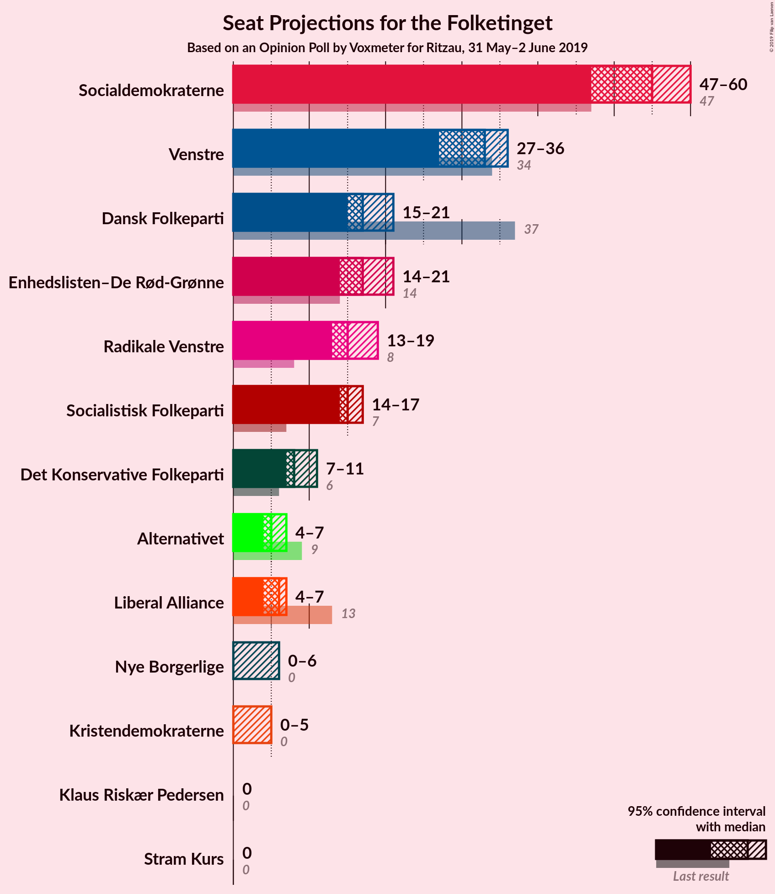
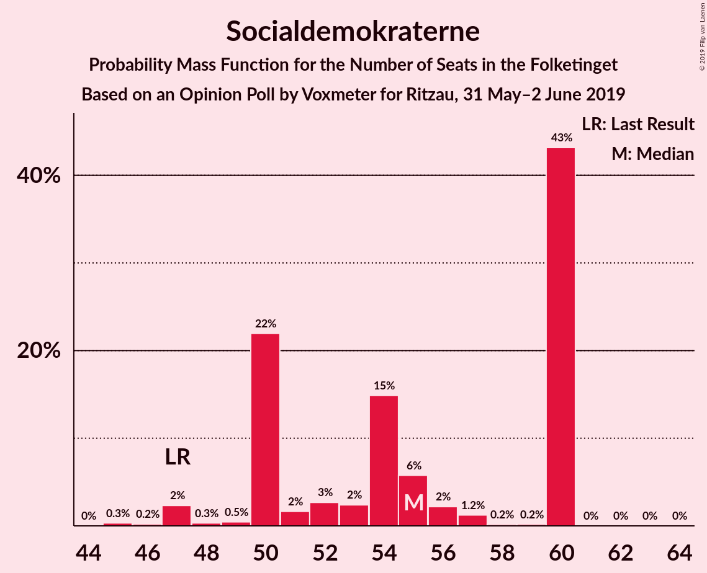
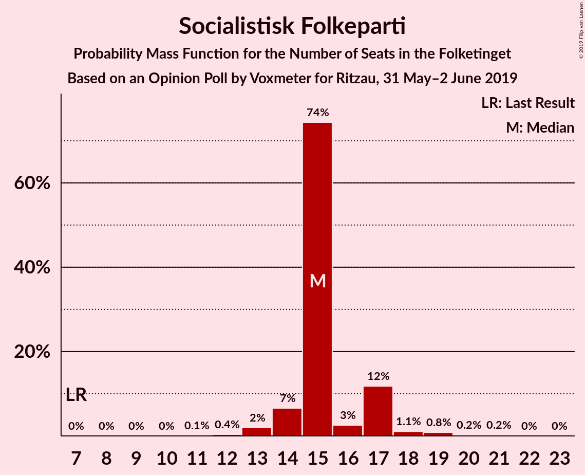
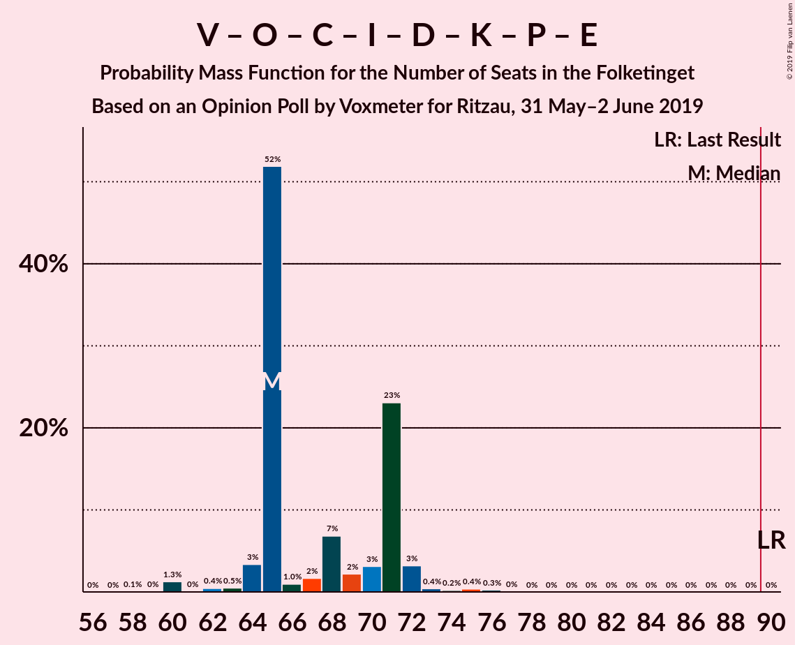
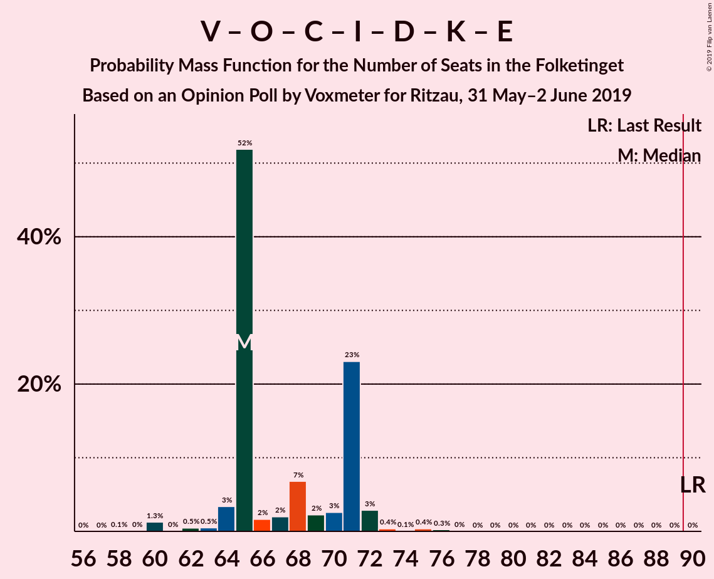
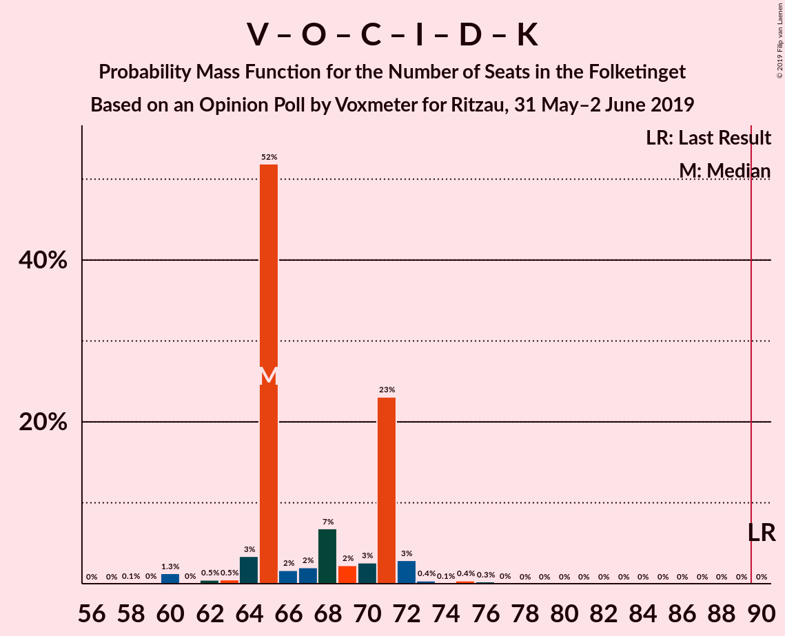
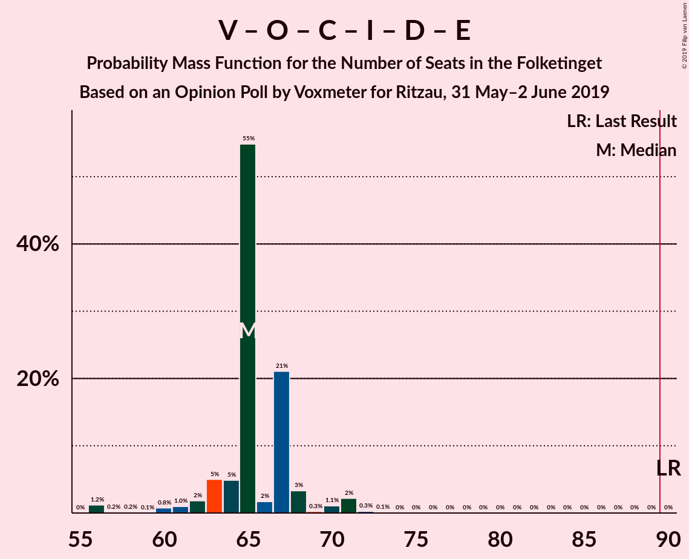
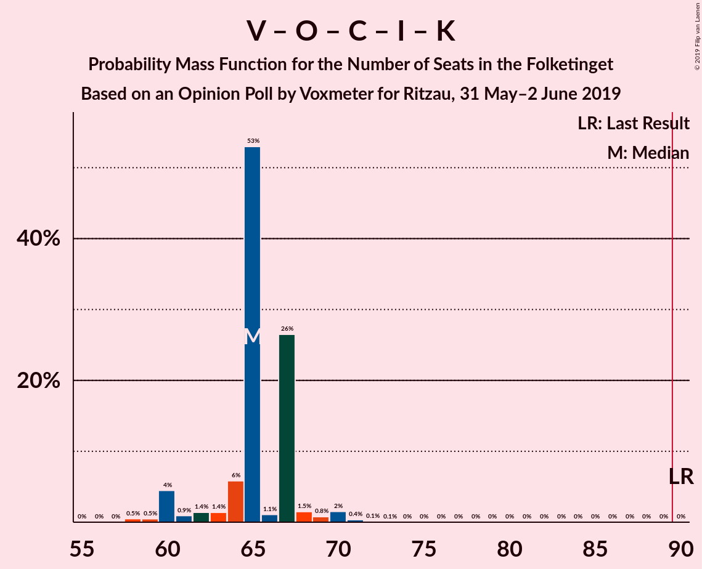

# Opinion Poll by Voxmeter for Ritzau, 31 May–2 June 2019

<a href="#voting-intentions">Voting Intentions</a> | <a href="#seats">Seats</a> | <a href="#coalitions">Coalitions</a> | <a href="#technical-information">Technical Information</a>

## Voting Intentions

### Confidence Intervals

| Party | Last Result | Poll Result | 80% Confidence Interval | 90% Confidence Interval | 95% Confidence Interval | 99% Confidence Interval |
|:-----:|:-----------:|:-----------:|:-----------------------:|:-----------------------:|:-----------------------:|:-----------------------:|
| Socialdemokraterne | 26.3% | 29.7% | 27.9–31.6% |27.4–32.2% |27.0–32.6% |26.1–33.5% |
| Venstre | 19.5% | 17.7% | 16.2–19.3% |15.8–19.8% |15.5–20.2% |14.8–21.0% |
| Dansk Folkeparti | 21.1% | 9.9% | 8.8–11.2% |8.5–11.6% |8.2–11.9% |7.7–12.6% |
| Enhedslisten–De Rød-Grønne | 7.8% | 9.1% | 8.1–10.4% |7.8–10.8% |7.5–11.1% |7.0–11.7% |
| Radikale Venstre | 4.6% | 8.8% | 7.8–10.1% |7.5–10.5% |7.2–10.8% |6.8–11.4% |
| Socialistisk Folkeparti | 4.2% | 8.7% | 7.7–10.0% |7.4–10.3% |7.1–10.7% |6.7–11.3% |
| Det Konservative Folkeparti | 3.4% | 4.6% | 3.8–5.5% |3.6–5.8% |3.4–6.1% |3.1–6.6% |
| Alternativet | 4.8% | 2.9% | 2.3–3.7% |2.1–3.9% |2.0–4.1% |1.8–4.5% |
| Liberal Alliance | 7.5% | 2.8% | 2.2–3.6% |2.1–3.8% |1.9–4.0% |1.7–4.4% |
| Nye Borgerlige | 0.0% | 2.1% | 1.6–2.8% |1.5–3.0% |1.4–3.2% |1.2–3.6% |
| Kristendemokraterne | 0.8% | 1.9% | 1.4–2.6% |1.3–2.8% |1.2–2.9% |1.0–3.3% |
| Stram Kurs | 0.0% | 1.2% | 0.9–1.8% |0.8–1.9% |0.7–2.1% |0.5–2.4% |
| Klaus Riskær Pedersen | 0.0% | 0.4% | 0.2–0.8% |0.2–0.9% |0.2–1.0% |0.1–1.2% |

*Note:* The poll result column reflects the actual value used in the calculations. Published results may vary slightly, and in addition be rounded to fewer digits.

## Seats

### Confidence Intervals

| Party | Last Result | Median | 80% Confidence Interval | 90% Confidence Interval | 95% Confidence Interval | 99% Confidence Interval |
|:-----:|:-----------:|:------:|:-----------------------:|:-----------------------:|:-----------------------:|:-----------------------:|
| <a href="#socialdemokraterne">Socialdemokraterne</a> | 47 | 55 | 50–60 |50–60 |47–60 |46–60 |
| <a href="#venstre">Venstre</a> | 34 | 33 | 28–36 |28–36 |27–36 |26–38 |
| <a href="#dansk-folkeparti">Dansk Folkeparti</a> | 37 | 17 | 16–18 |15–20 |15–21 |14–21 |
| <a href="#enhedslisten–de-rød-grønne">Enhedslisten–De Rød-Grønne</a> | 14 | 17 | 15–19 |15–21 |14–21 |13–21 |
| <a href="#radikale-venstre">Radikale Venstre</a> | 8 | 15 | 13–17 |13–18 |13–19 |13–19 |
| <a href="#socialistisk-folkeparti">Socialistisk Folkeparti</a> | 7 | 15 | 15–17 |14–17 |14–17 |13–19 |
| <a href="#det-konservative-folkeparti">Det Konservative Folkeparti</a> | 6 | 8 | 8–10 |7–10 |7–11 |6–12 |
| <a href="#alternativet">Alternativet</a> | 9 | 5 | 5–6 |4–7 |4–7 |3–9 |
| <a href="#liberal-alliance">Liberal Alliance</a> | 13 | 6 | 5–7 |4–7 |4–7 |0–8 |
| <a href="#nye-borgerlige">Nye Borgerlige</a> | 0 | 0 | 0–4 |0–5 |0–6 |0–6 |
| <a href="#kristendemokraterne">Kristendemokraterne</a> | 0 | 0 | 0–4 |0–5 |0–5 |0–6 |
| <a href="#stram-kurs">Stram Kurs</a> | 0 | 0 | 0 |0 |0 |0–4 |
| <a href="#klaus-riskær-pedersen">Klaus Riskær Pedersen</a> | 0 | 0 | 0 |0 |0 |0 |

### Socialdemokraterne

*For a full overview of the results for this party, see the [Socialdemokraterne](party-socialdemokraterne.html) page.*

| Number of Seats | Probability | Accumulated | Special Marks |
|:---------------:|:-----------:|:-----------:|:-------------:|
| 45 | 0.3% | 100% |  |
| 46 | 0.2% | 99.7% |  |
| 47 | 2% | 99.5% | Last Result |
| 48 | 0.3% | 97% |  |
| 49 | 0.5% | 97% |  |
| 50 | 22% | 96% |  |
| 51 | 2% | 74% |  |
| 52 | 3% | 73% |  |
| 53 | 2% | 70% |  |
| 54 | 15% | 68% |  |
| 55 | 6% | 53% | Median |
| 56 | 2% | 47% |  |
| 57 | 1.2% | 45% |  |
| 58 | 0.2% | 44% |  |
| 59 | 0.2% | 43% |  |
| 60 | 43% | 43% |  |
| 61 | 0% | 0.1% |  |
| 62 | 0% | 0.1% |  |
| 63 | 0% | 0.1% |  |
| 64 | 0% | 0% |  |

### Venstre

*For a full overview of the results for this party, see the [Venstre](party-venstre.html) page.*

| Number of Seats | Probability | Accumulated | Special Marks |
|:---------------:|:-----------:|:-----------:|:-------------:|
| 25 | 0% | 100% |  |
| 26 | 1.1% | 99.9% |  |
| 27 | 3% | 98.9% |  |
| 28 | 8% | 96% |  |
| 29 | 2% | 88% |  |
| 30 | 25% | 86% |  |
| 31 | 2% | 60% |  |
| 32 | 0.8% | 58% |  |
| 33 | 43% | 58% | Median |
| 34 | 3% | 15% | Last Result |
| 35 | 0.2% | 11% |  |
| 36 | 9% | 11% |  |
| 37 | 0.6% | 2% |  |
| 38 | 1.0% | 1.2% |  |
| 39 | 0% | 0.1% |  |
| 40 | 0.1% | 0.1% |  |
| 41 | 0% | 0% |  |

### Dansk Folkeparti

*For a full overview of the results for this party, see the [Dansk Folkeparti](party-danskfolkeparti.html) page.*

| Number of Seats | Probability | Accumulated | Special Marks |
|:---------------:|:-----------:|:-----------:|:-------------:|
| 13 | 0.2% | 100% |  |
| 14 | 2% | 99.8% |  |
| 15 | 6% | 98% |  |
| 16 | 12% | 91% |  |
| 17 | 47% | 79% | Median |
| 18 | 25% | 33% |  |
| 19 | 2% | 8% |  |
| 20 | 3% | 5% |  |
| 21 | 2% | 3% |  |
| 22 | 0.3% | 0.5% |  |
| 23 | 0.1% | 0.1% |  |
| 24 | 0% | 0% |  |
| 25 | 0% | 0% |  |
| 26 | 0% | 0% |  |
| 27 | 0% | 0% |  |
| 28 | 0% | 0% |  |
| 29 | 0% | 0% |  |
| 30 | 0% | 0% |  |
| 31 | 0% | 0% |  |
| 32 | 0% | 0% |  |
| 33 | 0% | 0% |  |
| 34 | 0% | 0% |  |
| 35 | 0% | 0% |  |
| 36 | 0% | 0% |  |
| 37 | 0% | 0% | Last Result |

### Enhedslisten–De Rød-Grønne

*For a full overview of the results for this party, see the [Enhedslisten–De Rød-Grønne](party-enhedslisten–derød-grønne.html) page.*

| Number of Seats | Probability | Accumulated | Special Marks |
|:---------------:|:-----------:|:-----------:|:-------------:|
| 12 | 0.2% | 100% |  |
| 13 | 0.3% | 99.7% |  |
| 14 | 4% | 99.5% | Last Result |
| 15 | 10% | 96% |  |
| 16 | 6% | 86% |  |
| 17 | 66% | 80% | Median |
| 18 | 3% | 14% |  |
| 19 | 0.7% | 11% |  |
| 20 | 0.5% | 10% |  |
| 21 | 9% | 10% |  |
| 22 | 0% | 0.1% |  |
| 23 | 0% | 0% |  |

### Radikale Venstre

*For a full overview of the results for this party, see the [Radikale Venstre](party-radikalevenstre.html) page.*

| Number of Seats | Probability | Accumulated | Special Marks |
|:---------------:|:-----------:|:-----------:|:-------------:|
| 8 | 0% | 100% | Last Result |
| 9 | 0% | 100% |  |
| 10 | 0% | 100% |  |
| 11 | 0.1% | 100% |  |
| 12 | 0.2% | 99.9% |  |
| 13 | 43% | 99.7% |  |
| 14 | 2% | 56% |  |
| 15 | 11% | 54% | Median |
| 16 | 27% | 43% |  |
| 17 | 6% | 16% |  |
| 18 | 6% | 10% |  |
| 19 | 3% | 3% |  |
| 20 | 0.2% | 0.5% |  |
| 21 | 0.2% | 0.2% |  |
| 22 | 0% | 0% |  |

### Socialistisk Folkeparti

*For a full overview of the results for this party, see the [Socialistisk Folkeparti](party-socialistiskfolkeparti.html) page.*

| Number of Seats | Probability | Accumulated | Special Marks |
|:---------------:|:-----------:|:-----------:|:-------------:|
| 7 | 0% | 100% | Last Result |
| 8 | 0% | 100% |  |
| 9 | 0% | 100% |  |
| 10 | 0% | 100% |  |
| 11 | 0.1% | 100% |  |
| 12 | 0.4% | 99.9% |  |
| 13 | 2% | 99.6% |  |
| 14 | 7% | 98% |  |
| 15 | 74% | 91% | Median |
| 16 | 3% | 17% |  |
| 17 | 12% | 14% |  |
| 18 | 1.1% | 2% |  |
| 19 | 0.8% | 1.3% |  |
| 20 | 0.2% | 0.5% |  |
| 21 | 0.2% | 0.3% |  |
| 22 | 0% | 0.1% |  |
| 23 | 0% | 0% |  |

### Det Konservative Folkeparti

*For a full overview of the results for this party, see the [Det Konservative Folkeparti](party-detkonservativefolkeparti.html) page.*

| Number of Seats | Probability | Accumulated | Special Marks |
|:---------------:|:-----------:|:-----------:|:-------------:|
| 5 | 0.2% | 100% |  |
| 6 | 2% | 99.8% | Last Result |
| 7 | 3% | 98% |  |
| 8 | 55% | 95% | Median |
| 9 | 25% | 39% |  |
| 10 | 9% | 14% |  |
| 11 | 3% | 5% |  |
| 12 | 1.4% | 1.4% |  |
| 13 | 0% | 0% |  |

### Alternativet

*For a full overview of the results for this party, see the [Alternativet](party-alternativet.html) page.*

| Number of Seats | Probability | Accumulated | Special Marks |
|:---------------:|:-----------:|:-----------:|:-------------:|
| 0 | 0.5% | 100% |  |
| 1 | 0% | 99.5% |  |
| 2 | 0% | 99.5% |  |
| 3 | 0.1% | 99.5% |  |
| 4 | 9% | 99.4% |  |
| 5 | 58% | 91% | Median |
| 6 | 26% | 33% |  |
| 7 | 4% | 6% |  |
| 8 | 1.2% | 2% |  |
| 9 | 0.5% | 0.6% | Last Result |
| 10 | 0.1% | 0.1% |  |
| 11 | 0% | 0% |  |

### Liberal Alliance

*For a full overview of the results for this party, see the [Liberal Alliance](party-liberalalliance.html) page.*

| Number of Seats | Probability | Accumulated | Special Marks |
|:---------------:|:-----------:|:-----------:|:-------------:|
| 0 | 2% | 100% |  |
| 1 | 0% | 98% |  |
| 2 | 0% | 98% |  |
| 3 | 0% | 98% |  |
| 4 | 6% | 98% |  |
| 5 | 18% | 92% |  |
| 6 | 29% | 74% | Median |
| 7 | 45% | 45% |  |
| 8 | 0.5% | 0.6% |  |
| 9 | 0.1% | 0.1% |  |
| 10 | 0% | 0% |  |
| 11 | 0% | 0% |  |
| 12 | 0% | 0% |  |
| 13 | 0% | 0% | Last Result |

### Nye Borgerlige

*For a full overview of the results for this party, see the [Nye Borgerlige](party-nyeborgerlige.html) page.*

| Number of Seats | Probability | Accumulated | Special Marks |
|:---------------:|:-----------:|:-----------:|:-------------:|
| 0 | 58% | 100% | Last Result, Median |
| 1 | 0% | 42% |  |
| 2 | 0% | 42% |  |
| 3 | 0.4% | 42% |  |
| 4 | 34% | 41% |  |
| 5 | 5% | 7% |  |
| 6 | 3% | 3% |  |
| 7 | 0.1% | 0.1% |  |
| 8 | 0% | 0% |  |

### Kristendemokraterne

*For a full overview of the results for this party, see the [Kristendemokraterne](party-kristendemokraterne.html) page.*

| Number of Seats | Probability | Accumulated | Special Marks |
|:---------------:|:-----------:|:-----------:|:-------------:|
| 0 | 60% | 100% | Last Result, Median |
| 1 | 0% | 40% |  |
| 2 | 0% | 40% |  |
| 3 | 0% | 40% |  |
| 4 | 30% | 40% |  |
| 5 | 9% | 9% |  |
| 6 | 0.4% | 0.5% |  |
| 7 | 0.1% | 0.1% |  |
| 8 | 0% | 0% |  |

### Stram Kurs

*For a full overview of the results for this party, see the [Stram Kurs](party-stramkurs.html) page.*

| Number of Seats | Probability | Accumulated | Special Marks |
|:---------------:|:-----------:|:-----------:|:-------------:|
| 0 | 98.7% | 100% | Last Result, Median |
| 1 | 0% | 1.3% |  |
| 2 | 0% | 1.3% |  |
| 3 | 0% | 1.3% |  |
| 4 | 1.0% | 1.3% |  |
| 5 | 0.4% | 0.4% |  |
| 6 | 0% | 0% |  |

### Klaus Riskær Pedersen

*For a full overview of the results for this party, see the [Klaus Riskær Pedersen](party-klausriskærpedersen.html) page.*

| Number of Seats | Probability | Accumulated | Special Marks |
|:---------------:|:-----------:|:-----------:|:-------------:|
| 0 | 100% | 100% | Last Result, Median |

## Coalitions

### Confidence Intervals

| Coalition | Last Result | Median | Majority? | 80% Confidence Interval | 90% Confidence Interval | 95% Confidence Interval | 99% Confidence Interval |
|:---------:|:-----------:|:------:|:---------:|:-----------------------:|:-----------------------:|:-----------------------:|:-----------------------:|
| Socialdemokraterne – Enhedslisten–De Rød-Grønne – Radikale Venstre – Socialistisk Folkeparti – Alternativet | 85 | 110 | 100% | 104–110 | 104–111 | 103–111 | 100–115 |
| Socialdemokraterne – Enhedslisten–De Rød-Grønne – Radikale Venstre – Socialistisk Folkeparti | 76 | 105 | 100% | 98–105 | 98–105 | 98–105 | 94–109 |
| Socialdemokraterne – Enhedslisten–De Rød-Grønne – Socialistisk Folkeparti – Alternativet | 77 | 95 | 68% | 88–97 | 87–97 | 86–97 | 84–97 |
| Socialdemokraterne – Enhedslisten–De Rød-Grønne – Socialistisk Folkeparti | 68 | 90 | 53% | 82–92 | 82–92 | 81–92 | 79–92 |
| Socialdemokraterne – Radikale Venstre – Socialistisk Folkeparti | 62 | 88 | 2% | 81–88 | 81–89 | 81–89 | 79–94 |
| Socialdemokraterne – Radikale Venstre | 55 | 72 | 0% | 66–73 | 66–73 | 64–74 | 63–78 |
| Venstre – Dansk Folkeparti – Det Konservative Folkeparti – Liberal Alliance – Nye Borgerlige – Kristendemokraterne – Stram Kurs – Klaus Riskær Pedersen | 90 | 65 | 0% | 65–71 | 64–71 | 64–72 | 60–75 |
| Venstre – Dansk Folkeparti – Det Konservative Folkeparti – Liberal Alliance – Nye Borgerlige – Kristendemokraterne – Klaus Riskær Pedersen | 90 | 65 | 0% | 65–71 | 64–71 | 64–72 | 60–75 |
| Venstre – Dansk Folkeparti – Det Konservative Folkeparti – Liberal Alliance – Nye Borgerlige – Kristendemokraterne | 90 | 65 | 0% | 65–71 | 64–71 | 64–72 | 60–75 |
| Venstre – Dansk Folkeparti – Det Konservative Folkeparti – Liberal Alliance – Nye Borgerlige – Klaus Riskær Pedersen | 90 | 65 | 0% | 63–67 | 62–68 | 61–71 | 56–71 |
| Venstre – Dansk Folkeparti – Det Konservative Folkeparti – Liberal Alliance – Nye Borgerlige | 90 | 65 | 0% | 63–67 | 62–68 | 61–71 | 56–71 |
| Venstre – Dansk Folkeparti – Det Konservative Folkeparti – Liberal Alliance – Kristendemokraterne | 90 | 65 | 0% | 64–67 | 60–67 | 60–69 | 58–71 |
| Venstre – Dansk Folkeparti – Det Konservative Folkeparti – Liberal Alliance | 90 | 65 | 0% | 59–65 | 59–65 | 57–67 | 56–70 |
| Venstre – Det Konservative Folkeparti – Liberal Alliance | 53 | 48 | 0% | 44–49 | 42–49 | 40–49 | 36–51 |
| Venstre – Det Konservative Folkeparti | 40 | 41 | 0% | 38–44 | 37–44 | 36–44 | 36–47 |
| Venstre | 34 | 33 | 0% | 28–36 | 28–36 | 27–36 | 26–38 |

### Socialdemokraterne – Enhedslisten–De Rød-Grønne – Radikale Venstre – Socialistisk Folkeparti – Alternativet

| Number of Seats | Probability | Accumulated | Special Marks |
|:---------------:|:-----------:|:-----------:|:-------------:|
| 85 | 0% | 100% | Last Result |
| 86 | 0% | 100% |  |
| 87 | 0% | 100% |  |
| 88 | 0% | 100% |  |
| 89 | 0% | 100% |  |
| 90 | 0% | 100% | Majority |
| 91 | 0% | 100% |  |
| 92 | 0% | 100% |  |
| 93 | 0% | 100% |  |
| 94 | 0% | 100% |  |
| 95 | 0% | 100% |  |
| 96 | 0% | 100% |  |
| 97 | 0% | 100% |  |
| 98 | 0% | 100% |  |
| 99 | 0.3% | 100% |  |
| 100 | 0.4% | 99.7% |  |
| 101 | 0.2% | 99.3% |  |
| 102 | 0.4% | 99.1% |  |
| 103 | 3% | 98.7% |  |
| 104 | 23% | 95% |  |
| 105 | 3% | 72% |  |
| 106 | 2% | 69% |  |
| 107 | 7% | 67% | Median |
| 108 | 2% | 60% |  |
| 109 | 1.0% | 59% |  |
| 110 | 52% | 58% |  |
| 111 | 3% | 6% |  |
| 112 | 0.5% | 2% |  |
| 113 | 0.4% | 2% |  |
| 114 | 0% | 1.4% |  |
| 115 | 1.3% | 1.4% |  |
| 116 | 0% | 0.1% |  |
| 117 | 0.1% | 0.1% |  |
| 118 | 0% | 0% |  |

### Socialdemokraterne – Enhedslisten–De Rød-Grønne – Radikale Venstre – Socialistisk Folkeparti

| Number of Seats | Probability | Accumulated | Special Marks |
|:---------------:|:-----------:|:-----------:|:-------------:|
| 76 | 0% | 100% | Last Result |
| 77 | 0% | 100% |  |
| 78 | 0% | 100% |  |
| 79 | 0% | 100% |  |
| 80 | 0% | 100% |  |
| 81 | 0% | 100% |  |
| 82 | 0% | 100% |  |
| 83 | 0% | 100% |  |
| 84 | 0% | 100% |  |
| 85 | 0% | 100% |  |
| 86 | 0% | 100% |  |
| 87 | 0% | 100% |  |
| 88 | 0% | 100% |  |
| 89 | 0% | 100% |  |
| 90 | 0% | 100% | Majority |
| 91 | 0% | 100% |  |
| 92 | 0% | 100% |  |
| 93 | 0.2% | 100% |  |
| 94 | 0.4% | 99.8% |  |
| 95 | 0.1% | 99.4% |  |
| 96 | 1.2% | 99.3% |  |
| 97 | 0.2% | 98% |  |
| 98 | 23% | 98% |  |
| 99 | 4% | 75% |  |
| 100 | 2% | 71% |  |
| 101 | 3% | 69% |  |
| 102 | 2% | 67% | Median |
| 103 | 7% | 64% |  |
| 104 | 4% | 58% |  |
| 105 | 52% | 54% |  |
| 106 | 0.7% | 2% |  |
| 107 | 0.1% | 2% |  |
| 108 | 0% | 2% |  |
| 109 | 1.3% | 1.5% |  |
| 110 | 0% | 0.2% |  |
| 111 | 0% | 0.1% |  |
| 112 | 0.1% | 0.1% |  |
| 113 | 0% | 0% |  |

### Socialdemokraterne – Enhedslisten–De Rød-Grønne – Socialistisk Folkeparti – Alternativet

| Number of Seats | Probability | Accumulated | Special Marks |
|:---------------:|:-----------:|:-----------:|:-------------:|
| 77 | 0% | 100% | Last Result |
| 78 | 0% | 100% |  |
| 79 | 0% | 100% |  |
| 80 | 0% | 100% |  |
| 81 | 0% | 100% |  |
| 82 | 0.4% | 100% |  |
| 83 | 0.1% | 99.6% |  |
| 84 | 0.1% | 99.5% |  |
| 85 | 0.8% | 99.5% |  |
| 86 | 4% | 98.7% |  |
| 87 | 0.8% | 95% |  |
| 88 | 23% | 94% |  |
| 89 | 3% | 72% |  |
| 90 | 2% | 68% | Majority |
| 91 | 6% | 66% |  |
| 92 | 2% | 60% | Median |
| 93 | 4% | 58% |  |
| 94 | 0.9% | 55% |  |
| 95 | 10% | 54% |  |
| 96 | 0.4% | 44% |  |
| 97 | 43% | 44% |  |
| 98 | 0.1% | 0.5% |  |
| 99 | 0.3% | 0.4% |  |
| 100 | 0% | 0.1% |  |
| 101 | 0.1% | 0.1% |  |
| 102 | 0% | 0% |  |

### Socialdemokraterne – Enhedslisten–De Rød-Grønne – Socialistisk Folkeparti

| Number of Seats | Probability | Accumulated | Special Marks |
|:---------------:|:-----------:|:-----------:|:-------------:|
| 68 | 0% | 100% | Last Result |
| 69 | 0% | 100% |  |
| 70 | 0% | 100% |  |
| 71 | 0% | 100% |  |
| 72 | 0% | 100% |  |
| 73 | 0% | 100% |  |
| 74 | 0% | 100% |  |
| 75 | 0% | 100% |  |
| 76 | 0.3% | 100% |  |
| 77 | 0% | 99.7% |  |
| 78 | 0.1% | 99.6% |  |
| 79 | 0.8% | 99.5% |  |
| 80 | 0.9% | 98.8% |  |
| 81 | 0.5% | 98% |  |
| 82 | 24% | 97% |  |
| 83 | 2% | 73% |  |
| 84 | 3% | 71% |  |
| 85 | 2% | 67% |  |
| 86 | 5% | 65% |  |
| 87 | 6% | 61% | Median |
| 88 | 0.3% | 55% |  |
| 89 | 0.9% | 54% |  |
| 90 | 10% | 53% | Majority |
| 91 | 2% | 44% |  |
| 92 | 42% | 42% |  |
| 93 | 0.1% | 0.3% |  |
| 94 | 0.1% | 0.2% |  |
| 95 | 0% | 0.1% |  |
| 96 | 0.1% | 0.1% |  |
| 97 | 0% | 0% |  |

### Socialdemokraterne – Radikale Venstre – Socialistisk Folkeparti

| Number of Seats | Probability | Accumulated | Special Marks |
|:---------------:|:-----------:|:-----------:|:-------------:|
| 62 | 0% | 100% | Last Result |
| 63 | 0% | 100% |  |
| 64 | 0% | 100% |  |
| 65 | 0% | 100% |  |
| 66 | 0% | 100% |  |
| 67 | 0% | 100% |  |
| 68 | 0% | 100% |  |
| 69 | 0% | 100% |  |
| 70 | 0% | 100% |  |
| 71 | 0% | 100% |  |
| 72 | 0% | 100% |  |
| 73 | 0% | 100% |  |
| 74 | 0% | 100% |  |
| 75 | 0% | 100% |  |
| 76 | 0% | 100% |  |
| 77 | 0.2% | 99.9% |  |
| 78 | 0.2% | 99.7% |  |
| 79 | 0.3% | 99.6% |  |
| 80 | 0.9% | 99.3% |  |
| 81 | 24% | 98% |  |
| 82 | 2% | 75% |  |
| 83 | 1.3% | 73% |  |
| 84 | 11% | 71% |  |
| 85 | 3% | 60% | Median |
| 86 | 2% | 57% |  |
| 87 | 2% | 55% |  |
| 88 | 48% | 53% |  |
| 89 | 3% | 5% |  |
| 90 | 0.4% | 2% | Majority |
| 91 | 0.1% | 2% |  |
| 92 | 0.3% | 2% |  |
| 93 | 0% | 1.3% |  |
| 94 | 1.2% | 1.3% |  |
| 95 | 0% | 0.1% |  |
| 96 | 0.1% | 0.1% |  |
| 97 | 0% | 0% |  |

### Socialdemokraterne – Radikale Venstre

| Number of Seats | Probability | Accumulated | Special Marks |
|:---------------:|:-----------:|:-----------:|:-------------:|
| 55 | 0% | 100% | Last Result |
| 56 | 0% | 100% |  |
| 57 | 0% | 100% |  |
| 58 | 0% | 100% |  |
| 59 | 0% | 100% |  |
| 60 | 0.1% | 100% |  |
| 61 | 0.1% | 99.9% |  |
| 62 | 0.1% | 99.8% |  |
| 63 | 0.6% | 99.7% |  |
| 64 | 3% | 99.1% |  |
| 65 | 0.1% | 97% |  |
| 66 | 23% | 96% |  |
| 67 | 1.1% | 73% |  |
| 68 | 1.3% | 72% |  |
| 69 | 11% | 71% |  |
| 70 | 3% | 60% | Median |
| 71 | 6% | 57% |  |
| 72 | 4% | 51% |  |
| 73 | 43% | 46% |  |
| 74 | 2% | 4% |  |
| 75 | 0.3% | 2% |  |
| 76 | 0.3% | 2% |  |
| 77 | 0% | 1.3% |  |
| 78 | 1.2% | 1.3% |  |
| 79 | 0.1% | 0.1% |  |
| 80 | 0% | 0% |  |

### Venstre – Dansk Folkeparti – Det Konservative Folkeparti – Liberal Alliance – Nye Borgerlige – Kristendemokraterne – Stram Kurs – Klaus Riskær Pedersen

| Number of Seats | Probability | Accumulated | Special Marks |
|:---------------:|:-----------:|:-----------:|:-------------:|
| 58 | 0.1% | 100% |  |
| 59 | 0% | 99.9% |  |
| 60 | 1.3% | 99.9% |  |
| 61 | 0% | 98.6% |  |
| 62 | 0.4% | 98.6% |  |
| 63 | 0.5% | 98% |  |
| 64 | 3% | 98% | Median |
| 65 | 52% | 94% |  |
| 66 | 1.0% | 42% |  |
| 67 | 2% | 41% |  |
| 68 | 7% | 40% |  |
| 69 | 2% | 33% |  |
| 70 | 3% | 31% |  |
| 71 | 23% | 28% |  |
| 72 | 3% | 5% |  |
| 73 | 0.4% | 1.3% |  |
| 74 | 0.2% | 0.9% |  |
| 75 | 0.4% | 0.7% |  |
| 76 | 0.3% | 0.3% |  |
| 77 | 0% | 0% |  |
| 78 | 0% | 0% |  |
| 79 | 0% | 0% |  |
| 80 | 0% | 0% |  |
| 81 | 0% | 0% |  |
| 82 | 0% | 0% |  |
| 83 | 0% | 0% |  |
| 84 | 0% | 0% |  |
| 85 | 0% | 0% |  |
| 86 | 0% | 0% |  |
| 87 | 0% | 0% |  |
| 88 | 0% | 0% |  |
| 89 | 0% | 0% |  |
| 90 | 0% | 0% | Last Result, Majority |

### Venstre – Dansk Folkeparti – Det Konservative Folkeparti – Liberal Alliance – Nye Borgerlige – Kristendemokraterne – Klaus Riskær Pedersen

| Number of Seats | Probability | Accumulated | Special Marks |
|:---------------:|:-----------:|:-----------:|:-------------:|
| 58 | 0.1% | 100% |  |
| 59 | 0% | 99.9% |  |
| 60 | 1.3% | 99.9% |  |
| 61 | 0% | 98.6% |  |
| 62 | 0.5% | 98.6% |  |
| 63 | 0.5% | 98% |  |
| 64 | 3% | 98% | Median |
| 65 | 52% | 94% |  |
| 66 | 2% | 42% |  |
| 67 | 2% | 41% |  |
| 68 | 7% | 39% |  |
| 69 | 2% | 32% |  |
| 70 | 3% | 30% |  |
| 71 | 23% | 27% |  |
| 72 | 3% | 4% |  |
| 73 | 0.4% | 1.1% |  |
| 74 | 0.1% | 0.7% |  |
| 75 | 0.4% | 0.7% |  |
| 76 | 0.3% | 0.3% |  |
| 77 | 0% | 0% |  |
| 78 | 0% | 0% |  |
| 79 | 0% | 0% |  |
| 80 | 0% | 0% |  |
| 81 | 0% | 0% |  |
| 82 | 0% | 0% |  |
| 83 | 0% | 0% |  |
| 84 | 0% | 0% |  |
| 85 | 0% | 0% |  |
| 86 | 0% | 0% |  |
| 87 | 0% | 0% |  |
| 88 | 0% | 0% |  |
| 89 | 0% | 0% |  |
| 90 | 0% | 0% | Last Result, Majority |

### Venstre – Dansk Folkeparti – Det Konservative Folkeparti – Liberal Alliance – Nye Borgerlige – Kristendemokraterne

| Number of Seats | Probability | Accumulated | Special Marks |
|:---------------:|:-----------:|:-----------:|:-------------:|
| 58 | 0.1% | 100% |  |
| 59 | 0% | 99.9% |  |
| 60 | 1.3% | 99.9% |  |
| 61 | 0% | 98.6% |  |
| 62 | 0.5% | 98.6% |  |
| 63 | 0.5% | 98% |  |
| 64 | 3% | 98% | Median |
| 65 | 52% | 94% |  |
| 66 | 2% | 42% |  |
| 67 | 2% | 41% |  |
| 68 | 7% | 39% |  |
| 69 | 2% | 32% |  |
| 70 | 3% | 30% |  |
| 71 | 23% | 27% |  |
| 72 | 3% | 4% |  |
| 73 | 0.4% | 1.1% |  |
| 74 | 0.1% | 0.7% |  |
| 75 | 0.4% | 0.7% |  |
| 76 | 0.3% | 0.3% |  |
| 77 | 0% | 0% |  |
| 78 | 0% | 0% |  |
| 79 | 0% | 0% |  |
| 80 | 0% | 0% |  |
| 81 | 0% | 0% |  |
| 82 | 0% | 0% |  |
| 83 | 0% | 0% |  |
| 84 | 0% | 0% |  |
| 85 | 0% | 0% |  |
| 86 | 0% | 0% |  |
| 87 | 0% | 0% |  |
| 88 | 0% | 0% |  |
| 89 | 0% | 0% |  |
| 90 | 0% | 0% | Last Result, Majority |

### Venstre – Dansk Folkeparti – Det Konservative Folkeparti – Liberal Alliance – Nye Borgerlige – Klaus Riskær Pedersen

| Number of Seats | Probability | Accumulated | Special Marks |
|:---------------:|:-----------:|:-----------:|:-------------:|
| 56 | 1.2% | 100% |  |
| 57 | 0.2% | 98.8% |  |
| 58 | 0.2% | 98.6% |  |
| 59 | 0.1% | 98% |  |
| 60 | 0.8% | 98% |  |
| 61 | 1.0% | 98% |  |
| 62 | 2% | 97% |  |
| 63 | 5% | 95% |  |
| 64 | 5% | 90% | Median |
| 65 | 55% | 85% |  |
| 66 | 2% | 30% |  |
| 67 | 21% | 28% |  |
| 68 | 3% | 7% |  |
| 69 | 0.3% | 4% |  |
| 70 | 1.1% | 4% |  |
| 71 | 2% | 3% |  |
| 72 | 0.3% | 0.4% |  |
| 73 | 0.1% | 0.2% |  |
| 74 | 0% | 0.1% |  |
| 75 | 0% | 0.1% |  |
| 76 | 0% | 0% |  |
| 77 | 0% | 0% |  |
| 78 | 0% | 0% |  |
| 79 | 0% | 0% |  |
| 80 | 0% | 0% |  |
| 81 | 0% | 0% |  |
| 82 | 0% | 0% |  |
| 83 | 0% | 0% |  |
| 84 | 0% | 0% |  |
| 85 | 0% | 0% |  |
| 86 | 0% | 0% |  |
| 87 | 0% | 0% |  |
| 88 | 0% | 0% |  |
| 89 | 0% | 0% |  |
| 90 | 0% | 0% | Last Result, Majority |

### Venstre – Dansk Folkeparti – Det Konservative Folkeparti – Liberal Alliance – Nye Borgerlige

| Number of Seats | Probability | Accumulated | Special Marks |
|:---------------:|:-----------:|:-----------:|:-------------:|
| 56 | 1.2% | 100% |  |
| 57 | 0.2% | 98.8% |  |
| 58 | 0.2% | 98.6% |  |
| 59 | 0.1% | 98% |  |
| 60 | 0.8% | 98% |  |
| 61 | 1.0% | 98% |  |
| 62 | 2% | 97% |  |
| 63 | 5% | 95% |  |
| 64 | 5% | 90% | Median |
| 65 | 55% | 85% |  |
| 66 | 2% | 30% |  |
| 67 | 21% | 28% |  |
| 68 | 3% | 7% |  |
| 69 | 0.3% | 4% |  |
| 70 | 1.1% | 4% |  |
| 71 | 2% | 3% |  |
| 72 | 0.3% | 0.4% |  |
| 73 | 0.1% | 0.2% |  |
| 74 | 0% | 0.1% |  |
| 75 | 0% | 0.1% |  |
| 76 | 0% | 0% |  |
| 77 | 0% | 0% |  |
| 78 | 0% | 0% |  |
| 79 | 0% | 0% |  |
| 80 | 0% | 0% |  |
| 81 | 0% | 0% |  |
| 82 | 0% | 0% |  |
| 83 | 0% | 0% |  |
| 84 | 0% | 0% |  |
| 85 | 0% | 0% |  |
| 86 | 0% | 0% |  |
| 87 | 0% | 0% |  |
| 88 | 0% | 0% |  |
| 89 | 0% | 0% |  |
| 90 | 0% | 0% | Last Result, Majority |

### Venstre – Dansk Folkeparti – Det Konservative Folkeparti – Liberal Alliance – Kristendemokraterne

| Number of Seats | Probability | Accumulated | Special Marks |
|:---------------:|:-----------:|:-----------:|:-------------:|
| 55 | 0% | 100% |  |
| 56 | 0% | 99.9% |  |
| 57 | 0% | 99.9% |  |
| 58 | 0.5% | 99.9% |  |
| 59 | 0.5% | 99.4% |  |
| 60 | 4% | 98.9% |  |
| 61 | 0.9% | 94% |  |
| 62 | 1.4% | 94% |  |
| 63 | 1.4% | 92% |  |
| 64 | 6% | 91% | Median |
| 65 | 53% | 85% |  |
| 66 | 1.1% | 32% |  |
| 67 | 26% | 31% |  |
| 68 | 1.5% | 4% |  |
| 69 | 0.8% | 3% |  |
| 70 | 2% | 2% |  |
| 71 | 0.4% | 0.6% |  |
| 72 | 0.1% | 0.2% |  |
| 73 | 0.1% | 0.1% |  |
| 74 | 0% | 0% |  |
| 75 | 0% | 0% |  |
| 76 | 0% | 0% |  |
| 77 | 0% | 0% |  |
| 78 | 0% | 0% |  |
| 79 | 0% | 0% |  |
| 80 | 0% | 0% |  |
| 81 | 0% | 0% |  |
| 82 | 0% | 0% |  |
| 83 | 0% | 0% |  |
| 84 | 0% | 0% |  |
| 85 | 0% | 0% |  |
| 86 | 0% | 0% |  |
| 87 | 0% | 0% |  |
| 88 | 0% | 0% |  |
| 89 | 0% | 0% |  |
| 90 | 0% | 0% | Last Result, Majority |

### Venstre – Dansk Folkeparti – Det Konservative Folkeparti – Liberal Alliance

| Number of Seats | Probability | Accumulated | Special Marks |
|:---------------:|:-----------:|:-----------:|:-------------:|
| 54 | 0.1% | 100% |  |
| 55 | 0.1% | 99.9% |  |
| 56 | 2% | 99.8% |  |
| 57 | 1.0% | 98% |  |
| 58 | 0.7% | 97% |  |
| 59 | 6% | 96% |  |
| 60 | 4% | 90% |  |
| 61 | 2% | 86% |  |
| 62 | 2% | 84% |  |
| 63 | 24% | 82% |  |
| 64 | 2% | 59% | Median |
| 65 | 53% | 57% |  |
| 66 | 0.9% | 4% |  |
| 67 | 2% | 3% |  |
| 68 | 0.1% | 0.9% |  |
| 69 | 0.2% | 0.7% |  |
| 70 | 0.2% | 0.6% |  |
| 71 | 0.3% | 0.4% |  |
| 72 | 0% | 0.1% |  |
| 73 | 0% | 0% |  |
| 74 | 0% | 0% |  |
| 75 | 0% | 0% |  |
| 76 | 0% | 0% |  |
| 77 | 0% | 0% |  |
| 78 | 0% | 0% |  |
| 79 | 0% | 0% |  |
| 80 | 0% | 0% |  |
| 81 | 0% | 0% |  |
| 82 | 0% | 0% |  |
| 83 | 0% | 0% |  |
| 84 | 0% | 0% |  |
| 85 | 0% | 0% |  |
| 86 | 0% | 0% |  |
| 87 | 0% | 0% |  |
| 88 | 0% | 0% |  |
| 89 | 0% | 0% |  |
| 90 | 0% | 0% | Last Result, Majority |

### Venstre – Det Konservative Folkeparti – Liberal Alliance

| Number of Seats | Probability | Accumulated | Special Marks |
|:---------------:|:-----------:|:-----------:|:-------------:|
| 36 | 0.6% | 100% |  |
| 37 | 0% | 99.3% |  |
| 38 | 0.1% | 99.3% |  |
| 39 | 0.1% | 99.2% |  |
| 40 | 2% | 99.0% |  |
| 41 | 1.3% | 97% |  |
| 42 | 5% | 96% |  |
| 43 | 1.3% | 91% |  |
| 44 | 6% | 90% |  |
| 45 | 24% | 84% |  |
| 46 | 4% | 60% |  |
| 47 | 2% | 56% | Median |
| 48 | 42% | 54% |  |
| 49 | 9% | 11% |  |
| 50 | 0.9% | 2% |  |
| 51 | 0.6% | 0.9% |  |
| 52 | 0.1% | 0.3% |  |
| 53 | 0% | 0.2% | Last Result |
| 54 | 0.2% | 0.2% |  |
| 55 | 0% | 0% |  |

### Venstre – Det Konservative Folkeparti

| Number of Seats | Probability | Accumulated | Special Marks |
|:---------------:|:-----------:|:-----------:|:-------------:|
| 32 | 0% | 100% |  |
| 33 | 0.1% | 99.9% |  |
| 34 | 0.2% | 99.9% |  |
| 35 | 0.1% | 99.6% |  |
| 36 | 3% | 99.6% |  |
| 37 | 5% | 96% |  |
| 38 | 6% | 91% |  |
| 39 | 23% | 85% |  |
| 40 | 2% | 61% | Last Result |
| 41 | 43% | 59% | Median |
| 42 | 4% | 16% |  |
| 43 | 1.2% | 13% |  |
| 44 | 10% | 11% |  |
| 45 | 0.8% | 2% |  |
| 46 | 0.5% | 1.1% |  |
| 47 | 0.3% | 0.6% |  |
| 48 | 0.1% | 0.3% |  |
| 49 | 0.2% | 0.2% |  |
| 50 | 0% | 0% |  |

### Venstre

| Number of Seats | Probability | Accumulated | Special Marks |
|:---------------:|:-----------:|:-----------:|:-------------:|
| 25 | 0% | 100% |  |
| 26 | 1.1% | 99.9% |  |
| 27 | 3% | 98.9% |  |
| 28 | 8% | 96% |  |
| 29 | 2% | 88% |  |
| 30 | 25% | 86% |  |
| 31 | 2% | 60% |  |
| 32 | 0.8% | 58% |  |
| 33 | 43% | 58% | Median |
| 34 | 3% | 15% | Last Result |
| 35 | 0.2% | 11% |  |
| 36 | 9% | 11% |  |
| 37 | 0.6% | 2% |  |
| 38 | 1.0% | 1.2% |  |
| 39 | 0% | 0.1% |  |
| 40 | 0.1% | 0.1% |  |
| 41 | 0% | 0% |  |

## Technical Information

### Opinion Poll

+ **Polling firm:** Voxmeter
+ **Commissioner(s):** Ritzau
+ **Fieldwork period:** 31 May–2 June 2019

### Calculations

+ **Sample size:** 1006
+ **Simulations done:** 1,048,576
+ **Error estimate:** 3.31%

