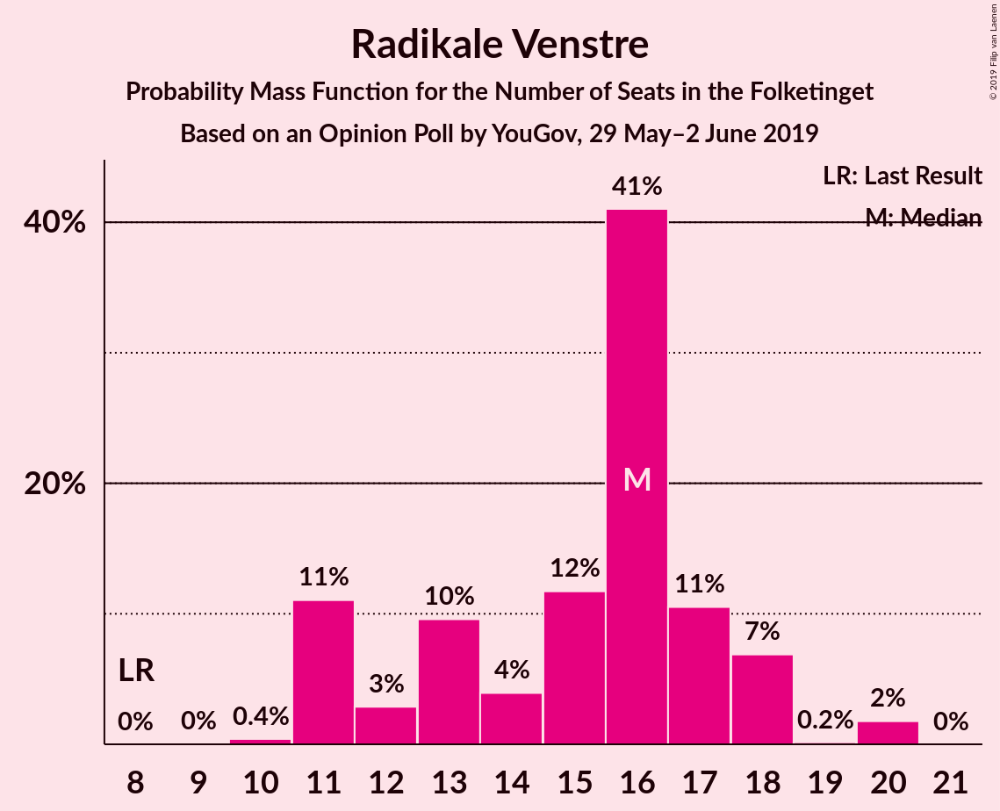
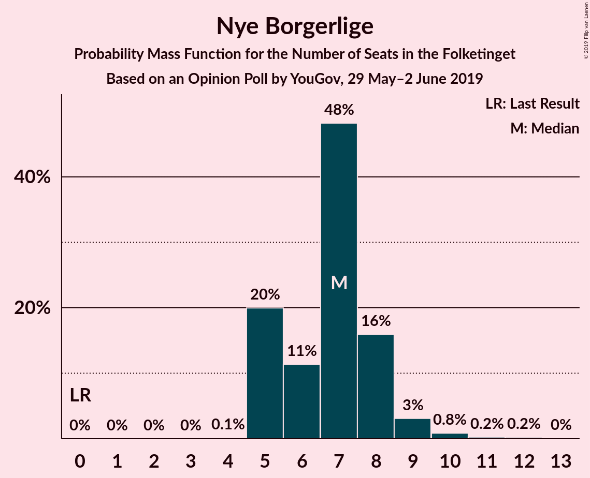
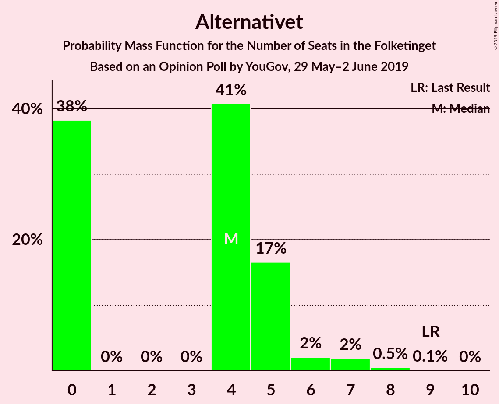
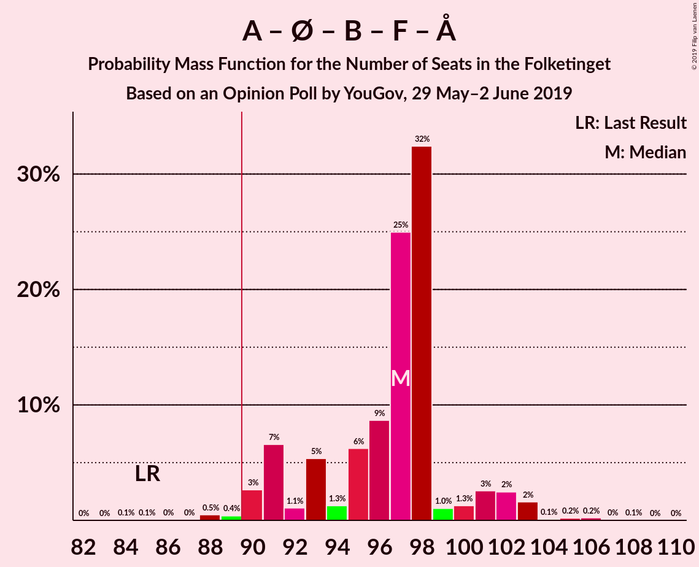
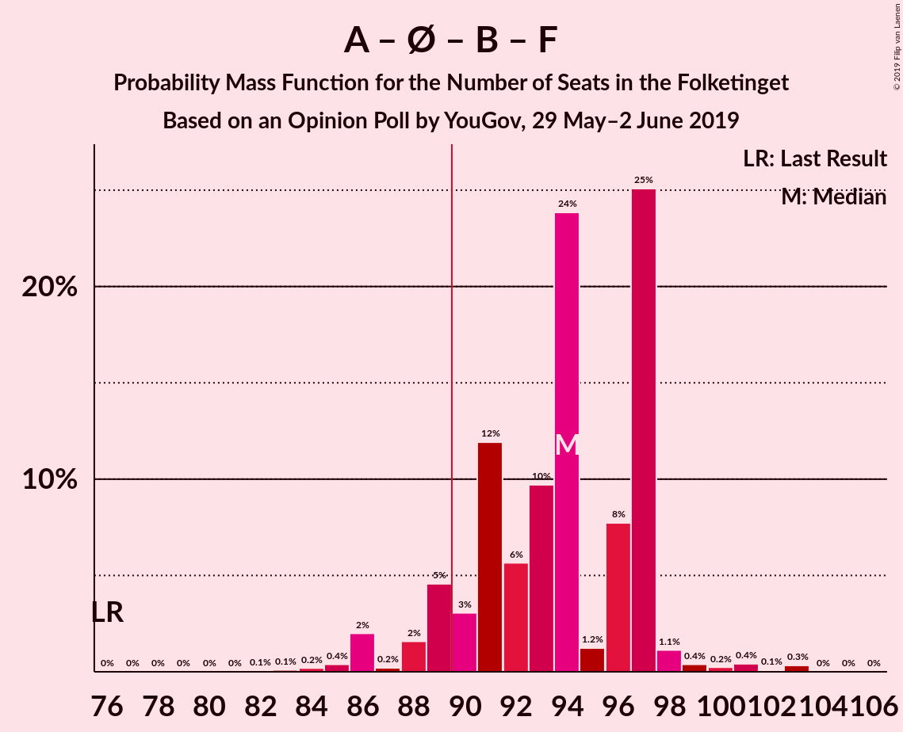
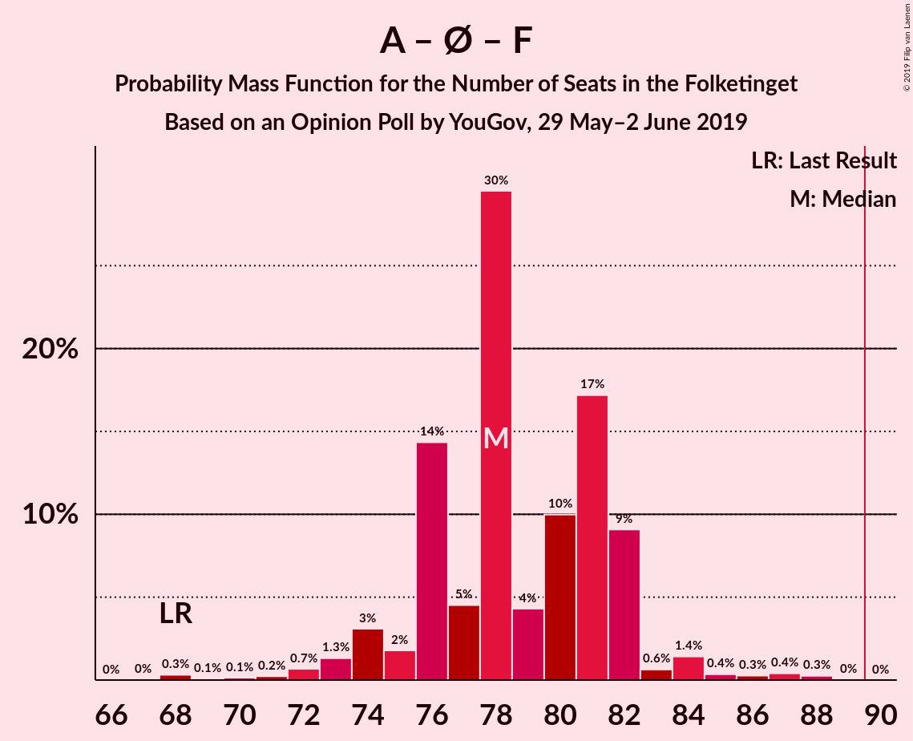
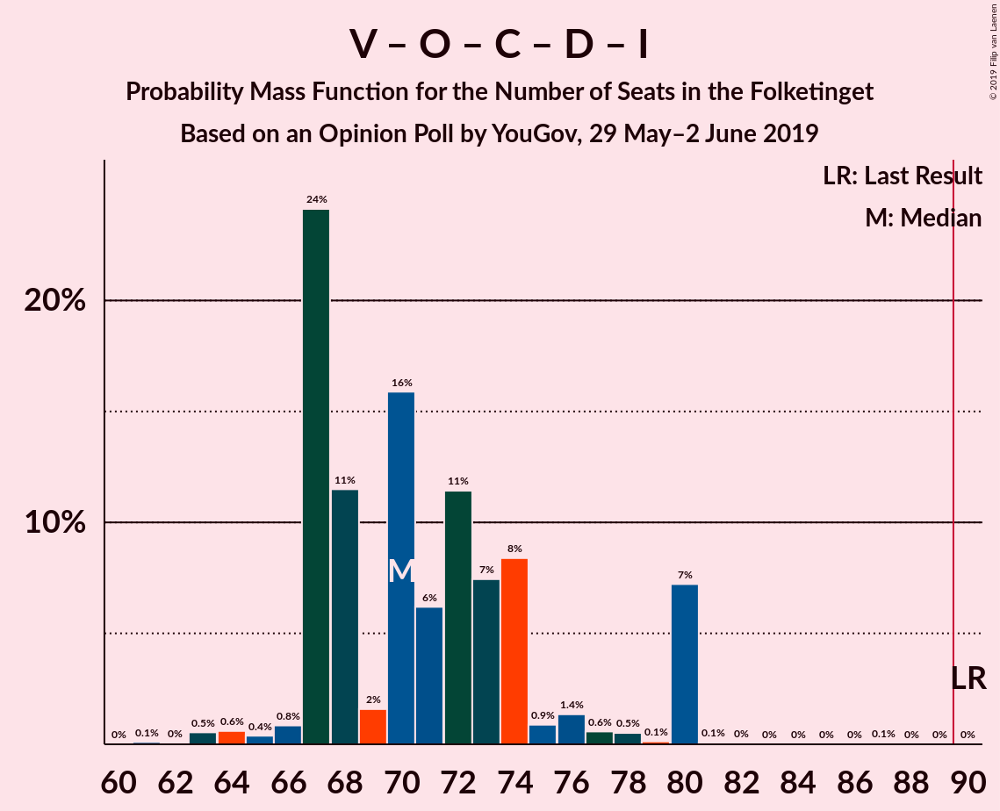
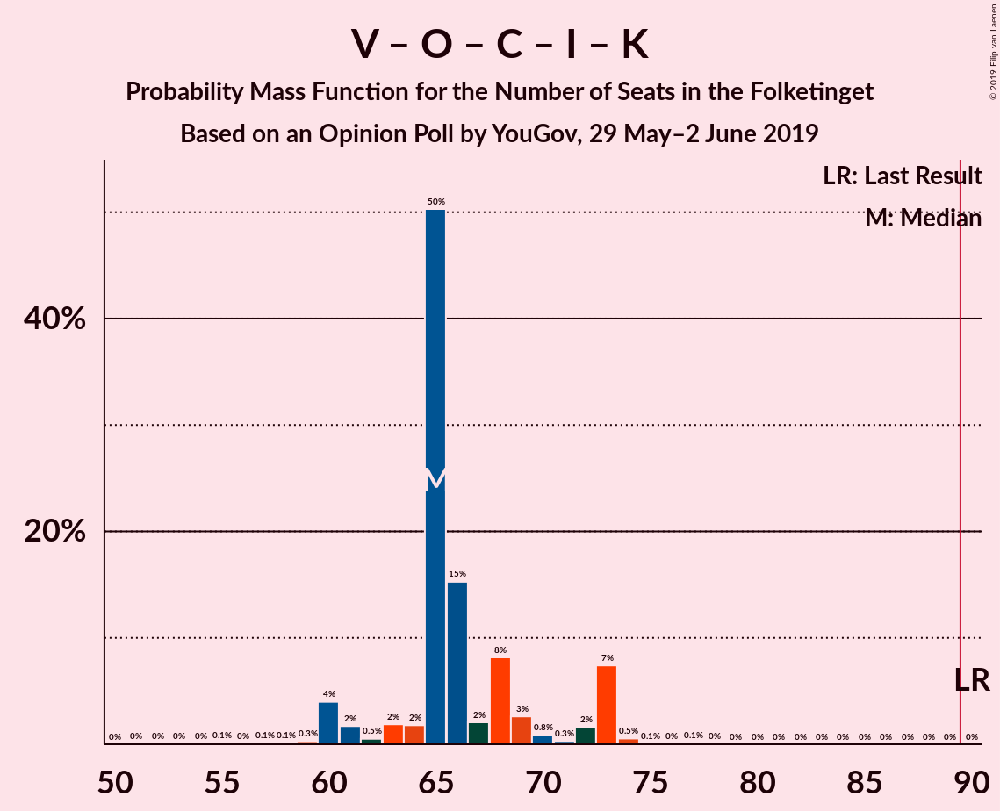
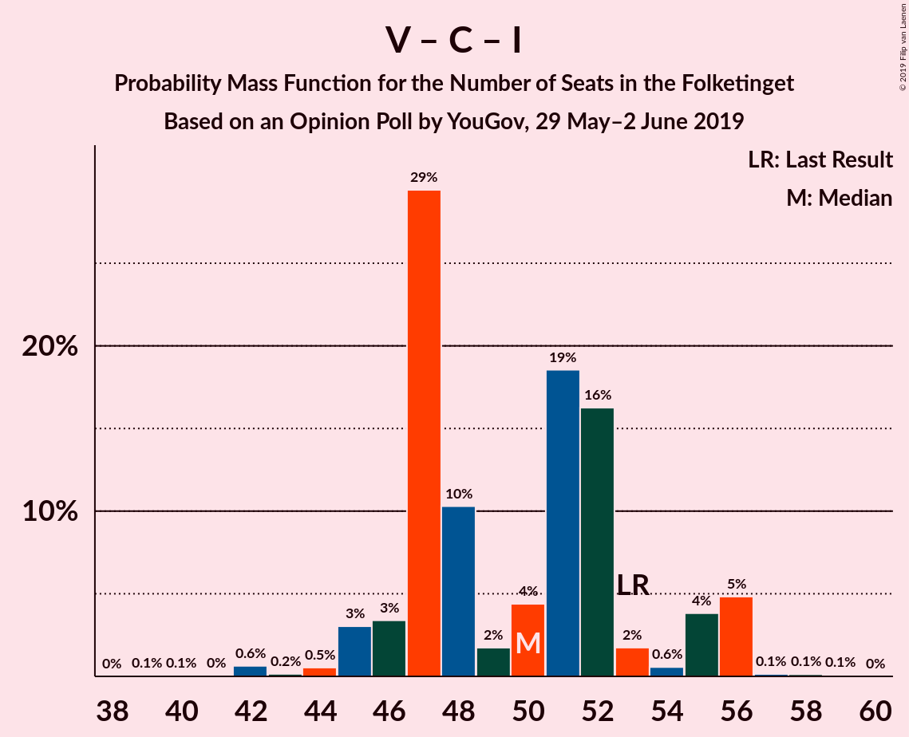

# Opinion Poll by YouGov, 29 May–2 June 2019

<a href="#voting-intentions">Voting Intentions</a> | <a href="#seats">Seats</a> | <a href="#coalitions">Coalitions</a> | <a href="#technical-information">Technical Information</a>

## Voting Intentions

### Confidence Intervals

| Party | Last Result | Poll Result | 80% Confidence Interval | 90% Confidence Interval | 95% Confidence Interval | 99% Confidence Interval |
|:-----:|:-----------:|:-----------:|:-----------------------:|:-----------------------:|:-----------------------:|:-----------------------:|
| Socialdemokraterne | 26.3% | 29.0% | 27.0–31.2% |26.4–31.8% |25.9–32.3% |25.0–33.3% |
| Venstre | 19.5% | 20.7% | 19.0–22.7% |18.5–23.3% |18.0–23.7% |17.2–24.7% |
| Enhedslisten–De Rød-Grønne | 7.8% | 9.5% | 8.3–11.0% |8.0–11.4% |7.7–11.8% |7.1–12.6% |
| Dansk Folkeparti | 21.1% | 8.2% | 7.1–9.6% |6.8–10.0% |6.5–10.4% |6.0–11.1% |
| Radikale Venstre | 4.6% | 7.9% | 6.7–9.2% |6.4–9.6% |6.2–10.0% |5.7–10.7% |
| Socialistisk Folkeparti | 4.2% | 5.9% | 5.0–7.2% |4.7–7.5% |4.5–7.8% |4.1–8.5% |
| Det Konservative Folkeparti | 3.4% | 5.2% | 4.3–6.3% |4.0–6.7% |3.8–7.0% |3.4–7.5% |
| Nye Borgerlige | 0.0% | 4.1% | 3.3–5.2% |3.1–5.5% |2.9–5.8% |2.6–6.3% |
| Stram Kurs | 0.0% | 2.8% | 2.2–3.8% |2.0–4.0% |1.9–4.3% |1.6–4.8% |
| Alternativet | 4.8% | 2.4% | 1.9–3.3% |1.7–3.6% |1.6–3.8% |1.3–4.3% |
| Liberal Alliance | 7.5% | 2.2% | 1.6–3.0% |1.5–3.3% |1.4–3.5% |1.1–3.9% |
| Kristendemokraterne | 0.8% | 1.7% | 1.2–2.4% |1.1–2.7% |1.0–2.9% |0.8–3.3% |

*Note:* The poll result column reflects the actual value used in the calculations. Published results may vary slightly, and in addition be rounded to fewer digits.

## Seats

### Confidence Intervals

| Party | Last Result | Median | 80% Confidence Interval | 90% Confidence Interval | 95% Confidence Interval | 99% Confidence Interval |
|:-----:|:-----------:|:------:|:-----------------------:|:-----------------------:|:-----------------------:|:-----------------------:|
| <a href="#socialdemokraterne">Socialdemokraterne</a> | 47 | 50 | 50–51 |50–51 |50–54 |49–54 |
| <a href="#venstre">Venstre</a> | 34 | 38 | 38 |38 |28–43 |28–43 |
| <a href="#enhedslisten–de-rød-grønne">Enhedslisten–De Rød-Grønne</a> | 14 | 13 | 13–18 |13–18 |13–19 |13–23 |
| <a href="#dansk-folkeparti">Dansk Folkeparti</a> | 37 | 12 | 12–16 |12–16 |11–18 |11–22 |
| <a href="#radikale-venstre">Radikale Venstre</a> | 8 | 14 | 14–15 |11–15 |10–15 |10–15 |
| <a href="#socialistisk-folkeparti">Socialistisk Folkeparti</a> | 7 | 12 | 11–12 |11–12 |7–12 |7–12 |
| <a href="#det-konservative-folkeparti">Det Konservative Folkeparti</a> | 6 | 14 | 10–14 |10–14 |8–14 |8–14 |
| <a href="#nye-borgerlige">Nye Borgerlige</a> | 0 | 11 | 7–11 |6–11 |5–11 |5–11 |
| <a href="#stram-kurs">Stram Kurs</a> | 0 | 4 | 4–5 |4–5 |4–5 |4–5 |
| <a href="#alternativet">Alternativet</a> | 9 | 7 | 4–7 |4–7 |4–7 |4–7 |
| <a href="#liberal-alliance">Liberal Alliance</a> | 13 | 0 | 0 |0–4 |0–6 |0–6 |
| <a href="#kristendemokraterne">Kristendemokraterne</a> | 0 | 0 | 0 |0 |0 |0–4 |

### Socialdemokraterne

*For a full overview of the results for this party, see the [Socialdemokraterne](party-socialdemokraterne.html) page.*

| Number of Seats | Probability | Accumulated | Special Marks |
|:---------------:|:-----------:|:-----------:|:-------------:|
| 41 | 0.1% | 100% |  |
| 42 | 0% | 99.9% |  |
| 43 | 0.3% | 99.9% |  |
| 44 | 0% | 99.6% |  |
| 45 | 0% | 99.6% |  |
| 46 | 0% | 99.6% |  |
| 47 | 0.1% | 99.6% | Last Result |
| 48 | 0% | 99.6% |  |
| 49 | 0.4% | 99.5% |  |
| 50 | 62% | 99.1% | Median |
| 51 | 34% | 37% |  |
| 52 | 0.1% | 3% |  |
| 53 | 0.1% | 3% |  |
| 54 | 2% | 3% |  |
| 55 | 0% | 0.2% |  |
| 56 | 0.2% | 0.2% |  |
| 57 | 0% | 0% |  |

### Venstre

*For a full overview of the results for this party, see the [Venstre](party-venstre.html) page.*

| Number of Seats | Probability | Accumulated | Special Marks |
|:---------------:|:-----------:|:-----------:|:-------------:|
| 28 | 3% | 100% |  |
| 29 | 0.1% | 97% |  |
| 30 | 0% | 97% |  |
| 31 | 0% | 97% |  |
| 32 | 0% | 97% |  |
| 33 | 0% | 97% |  |
| 34 | 0.2% | 97% | Last Result |
| 35 | 0% | 97% |  |
| 36 | 0.3% | 97% |  |
| 37 | 0% | 97% |  |
| 38 | 92% | 97% | Median |
| 39 | 0.1% | 5% |  |
| 40 | 0.3% | 5% |  |
| 41 | 0.1% | 4% |  |
| 42 | 0% | 4% |  |
| 43 | 4% | 4% |  |
| 44 | 0% | 0% |  |

### Enhedslisten–De Rød-Grønne

*For a full overview of the results for this party, see the [Enhedslisten–De Rød-Grønne](party-enhedslisten–derød-grønne.html) page.*

| Number of Seats | Probability | Accumulated | Special Marks |
|:---------------:|:-----------:|:-----------:|:-------------:|
| 13 | 58% | 100% | Median |
| 14 | 0% | 42% | Last Result |
| 15 | 0.4% | 42% |  |
| 16 | 0.2% | 42% |  |
| 17 | 0% | 42% |  |
| 18 | 39% | 41% |  |
| 19 | 2% | 3% |  |
| 20 | 0% | 0.6% |  |
| 21 | 0% | 0.6% |  |
| 22 | 0% | 0.6% |  |
| 23 | 0.1% | 0.6% |  |
| 24 | 0.1% | 0.5% |  |
| 25 | 0.4% | 0.4% |  |
| 26 | 0% | 0% |  |

### Dansk Folkeparti

*For a full overview of the results for this party, see the [Dansk Folkeparti](party-danskfolkeparti.html) page.*

| Number of Seats | Probability | Accumulated | Special Marks |
|:---------------:|:-----------:|:-----------:|:-------------:|
| 10 | 0.3% | 100% |  |
| 11 | 5% | 99.7% |  |
| 12 | 58% | 95% | Median |
| 13 | 0% | 37% |  |
| 14 | 0.1% | 37% |  |
| 15 | 0.3% | 37% |  |
| 16 | 34% | 37% |  |
| 17 | 0% | 3% |  |
| 18 | 0.2% | 3% |  |
| 19 | 0% | 2% |  |
| 20 | 0.1% | 2% |  |
| 21 | 0% | 2% |  |
| 22 | 2% | 2% |  |
| 23 | 0% | 0% |  |
| 24 | 0% | 0% |  |
| 25 | 0% | 0% |  |
| 26 | 0% | 0% |  |
| 27 | 0% | 0% |  |
| 28 | 0% | 0% |  |
| 29 | 0% | 0% |  |
| 30 | 0% | 0% |  |
| 31 | 0% | 0% |  |
| 32 | 0% | 0% |  |
| 33 | 0% | 0% |  |
| 34 | 0% | 0% |  |
| 35 | 0% | 0% |  |
| 36 | 0% | 0% |  |
| 37 | 0% | 0% | Last Result |

### Radikale Venstre

*For a full overview of the results for this party, see the [Radikale Venstre](party-radikalevenstre.html) page.*

| Number of Seats | Probability | Accumulated | Special Marks |
|:---------------:|:-----------:|:-----------:|:-------------:|
| 8 | 0% | 100% | Last Result |
| 9 | 0% | 100% |  |
| 10 | 5% | 100% |  |
| 11 | 0.4% | 95% |  |
| 12 | 2% | 95% |  |
| 13 | 0.1% | 92% |  |
| 14 | 58% | 92% | Median |
| 15 | 34% | 34% |  |
| 16 | 0% | 0.1% |  |
| 17 | 0.1% | 0.1% |  |
| 18 | 0% | 0.1% |  |
| 19 | 0.1% | 0.1% |  |
| 20 | 0% | 0% |  |

### Socialistisk Folkeparti

*For a full overview of the results for this party, see the [Socialistisk Folkeparti](party-socialistiskfolkeparti.html) page.*

| Number of Seats | Probability | Accumulated | Special Marks |
|:---------------:|:-----------:|:-----------:|:-------------:|
| 7 | 3% | 100% | Last Result |
| 8 | 0.5% | 97% |  |
| 9 | 0% | 97% |  |
| 10 | 0.1% | 97% |  |
| 11 | 38% | 97% |  |
| 12 | 58% | 58% | Median |
| 13 | 0.1% | 0.3% |  |
| 14 | 0% | 0.2% |  |
| 15 | 0% | 0.2% |  |
| 16 | 0.2% | 0.2% |  |
| 17 | 0% | 0% |  |

### Det Konservative Folkeparti

*For a full overview of the results for this party, see the [Det Konservative Folkeparti](party-detkonservativefolkeparti.html) page.*

| Number of Seats | Probability | Accumulated | Special Marks |
|:---------------:|:-----------:|:-----------:|:-------------:|
| 6 | 0.1% | 100% | Last Result |
| 7 | 0.1% | 99.9% |  |
| 8 | 2% | 99.9% |  |
| 9 | 0.3% | 97% |  |
| 10 | 34% | 97% |  |
| 11 | 0.2% | 63% |  |
| 12 | 0.5% | 63% |  |
| 13 | 0% | 62% |  |
| 14 | 62% | 62% | Median |
| 15 | 0% | 0% |  |

### Nye Borgerlige

*For a full overview of the results for this party, see the [Nye Borgerlige](party-nyeborgerlige.html) page.*

| Number of Seats | Probability | Accumulated | Special Marks |
|:---------------:|:-----------:|:-----------:|:-------------:|
| 0 | 0% | 100% | Last Result |
| 1 | 0% | 100% |  |
| 2 | 0% | 100% |  |
| 3 | 0% | 100% |  |
| 4 | 0.2% | 100% |  |
| 5 | 4% | 99.8% |  |
| 6 | 0.5% | 95% |  |
| 7 | 34% | 95% |  |
| 8 | 2% | 61% |  |
| 9 | 0% | 58% |  |
| 10 | 0.1% | 58% |  |
| 11 | 58% | 58% | Median |
| 12 | 0% | 0.2% |  |
| 13 | 0.2% | 0.2% |  |
| 14 | 0% | 0% |  |

### Stram Kurs

*For a full overview of the results for this party, see the [Stram Kurs](party-stramkurs.html) page.*

| Number of Seats | Probability | Accumulated | Special Marks |
|:---------------:|:-----------:|:-----------:|:-------------:|
| 0 | 0.1% | 100% | Last Result |
| 1 | 0% | 99.9% |  |
| 2 | 0% | 99.9% |  |
| 3 | 0% | 99.9% |  |
| 4 | 62% | 99.9% | Median |
| 5 | 37% | 37% |  |
| 6 | 0.1% | 0.3% |  |
| 7 | 0% | 0.2% |  |
| 8 | 0% | 0.2% |  |
| 9 | 0.1% | 0.2% |  |
| 10 | 0.1% | 0.1% |  |
| 11 | 0% | 0% |  |

### Alternativet

*For a full overview of the results for this party, see the [Alternativet](party-alternativet.html) page.*

| Number of Seats | Probability | Accumulated | Special Marks |
|:---------------:|:-----------:|:-----------:|:-------------:|
| 0 | 0.2% | 100% |  |
| 1 | 0% | 99.8% |  |
| 2 | 0% | 99.8% |  |
| 3 | 0% | 99.8% |  |
| 4 | 34% | 99.8% |  |
| 5 | 5% | 66% |  |
| 6 | 3% | 61% |  |
| 7 | 58% | 58% | Median |
| 8 | 0% | 0% |  |
| 9 | 0% | 0% | Last Result |

### Liberal Alliance

*For a full overview of the results for this party, see the [Liberal Alliance](party-liberalalliance.html) page.*

| Number of Seats | Probability | Accumulated | Special Marks |
|:---------------:|:-----------:|:-----------:|:-------------:|
| 0 | 92% | 100% | Median |
| 1 | 0% | 8% |  |
| 2 | 0% | 8% |  |
| 3 | 0% | 8% |  |
| 4 | 5% | 8% |  |
| 5 | 0% | 3% |  |
| 6 | 3% | 3% |  |
| 7 | 0.1% | 0.1% |  |
| 8 | 0% | 0% |  |
| 9 | 0% | 0% |  |
| 10 | 0% | 0% |  |
| 11 | 0% | 0% |  |
| 12 | 0% | 0% |  |
| 13 | 0% | 0% | Last Result |

### Kristendemokraterne

*For a full overview of the results for this party, see the [Kristendemokraterne](party-kristendemokraterne.html) page.*

| Number of Seats | Probability | Accumulated | Special Marks |
|:---------------:|:-----------:|:-----------:|:-------------:|
| 0 | 99.2% | 100% | Last Result, Median |
| 1 | 0% | 0.8% |  |
| 2 | 0% | 0.8% |  |
| 3 | 0% | 0.8% |  |
| 4 | 0.3% | 0.8% |  |
| 5 | 0.4% | 0.5% |  |
| 6 | 0% | 0.1% |  |
| 7 | 0% | 0.1% |  |
| 8 | 0% | 0% |  |

## Coalitions

### Confidence Intervals

| Coalition | Last Result | Median | Majority? | 80% Confidence Interval | 90% Confidence Interval | 95% Confidence Interval | 99% Confidence Interval |
|:---------:|:-----------:|:------:|:---------:|:-----------------------:|:-----------------------:|:-----------------------:|:-----------------------:|
| Socialdemokraterne – Enhedslisten–De Rød-Grønne – Radikale Venstre – Socialistisk Folkeparti – Alternativet | 85 | 96 | 99.6% | 96–99 | 96–99 | 94–99 | 94–103 |
| Socialdemokraterne – Enhedslisten–De Rød-Grønne – Radikale Venstre – Socialistisk Folkeparti | 76 | 89 | 37% | 89–95 | 89–95 | 89–95 | 89–97 |
| Socialdemokraterne – Enhedslisten–De Rød-Grønne – Socialistisk Folkeparti – Alternativet | 77 | 82 | 0.3% | 82–84 | 82–84 | 82–86 | 82–89 |
| Socialdemokraterne – Enhedslisten–De Rød-Grønne – Socialistisk Folkeparti | 68 | 75 | 0% | 75–80 | 75–80 | 75–80 | 75–82 |
| Venstre – Dansk Folkeparti – Det Konservative Folkeparti – Nye Borgerlige – Liberal Alliance – Kristendemokraterne | 90 | 75 | 0% | 71–75 | 71–75 | 71–77 | 68–77 |
| Venstre – Dansk Folkeparti – Det Konservative Folkeparti – Nye Borgerlige – Liberal Alliance | 90 | 75 | 0% | 71–75 | 71–75 | 71–77 | 66–77 |
| Socialdemokraterne – Radikale Venstre – Socialistisk Folkeparti | 62 | 76 | 0% | 76–77 | 71–77 | 71–77 | 68–77 |
| Venstre – Dansk Folkeparti – Det Konservative Folkeparti – Liberal Alliance – Kristendemokraterne | 90 | 64 | 0% | 64 | 64–66 | 64–72 | 64–72 |
| Venstre – Dansk Folkeparti – Det Konservative Folkeparti – Liberal Alliance | 90 | 64 | 0% | 64 | 64 | 64–72 | 60–72 |
| Socialdemokraterne – Radikale Venstre | 55 | 64 | 0% | 64–66 | 60–66 | 60–66 | 60–66 |
| Venstre – Det Konservative Folkeparti – Liberal Alliance | 53 | 52 | 0% | 48–52 | 48–52 | 44–61 | 42–61 |
| Venstre – Det Konservative Folkeparti | 40 | 52 | 0% | 48–52 | 48–52 | 38–57 | 36–57 |
| Venstre | 34 | 38 | 0% | 38 | 38 | 28–43 | 28–43 |

### Socialdemokraterne – Enhedslisten–De Rød-Grønne – Radikale Venstre – Socialistisk Folkeparti – Alternativet

| Number of Seats | Probability | Accumulated | Special Marks |
|:---------------:|:-----------:|:-----------:|:-------------:|
| 82 | 0.2% | 100% |  |
| 83 | 0% | 99.8% |  |
| 84 | 0% | 99.8% |  |
| 85 | 0.2% | 99.8% | Last Result |
| 86 | 0% | 99.6% |  |
| 87 | 0% | 99.6% |  |
| 88 | 0% | 99.6% |  |
| 89 | 0% | 99.6% |  |
| 90 | 0% | 99.6% | Majority |
| 91 | 0% | 99.6% |  |
| 92 | 0% | 99.6% |  |
| 93 | 0% | 99.6% |  |
| 94 | 4% | 99.6% |  |
| 95 | 0.1% | 95% |  |
| 96 | 58% | 95% | Median |
| 97 | 0.2% | 37% |  |
| 98 | 2% | 37% |  |
| 99 | 34% | 35% |  |
| 100 | 0% | 0.6% |  |
| 101 | 0% | 0.6% |  |
| 102 | 0% | 0.6% |  |
| 103 | 0.3% | 0.6% |  |
| 104 | 0.2% | 0.3% |  |
| 105 | 0% | 0.1% |  |
| 106 | 0.1% | 0.1% |  |
| 107 | 0% | 0% |  |

### Socialdemokraterne – Enhedslisten–De Rød-Grønne – Radikale Venstre – Socialistisk Folkeparti

| Number of Seats | Probability | Accumulated | Special Marks |
|:---------------:|:-----------:|:-----------:|:-------------:|
| 76 | 0.2% | 100% | Last Result |
| 77 | 0% | 99.8% |  |
| 78 | 0% | 99.8% |  |
| 79 | 0% | 99.8% |  |
| 80 | 0.1% | 99.8% |  |
| 81 | 0% | 99.7% |  |
| 82 | 0% | 99.7% |  |
| 83 | 0% | 99.7% |  |
| 84 | 0% | 99.7% |  |
| 85 | 0.1% | 99.7% |  |
| 86 | 0.1% | 99.6% |  |
| 87 | 0% | 99.6% |  |
| 88 | 0% | 99.6% |  |
| 89 | 62% | 99.5% | Median |
| 90 | 0% | 37% | Majority |
| 91 | 0% | 37% |  |
| 92 | 2% | 37% |  |
| 93 | 0.2% | 35% |  |
| 94 | 0% | 35% |  |
| 95 | 34% | 35% |  |
| 96 | 0% | 0.6% |  |
| 97 | 0.2% | 0.6% |  |
| 98 | 0.2% | 0.4% |  |
| 99 | 0.1% | 0.2% |  |
| 100 | 0% | 0.1% |  |
| 101 | 0% | 0.1% |  |
| 102 | 0% | 0.1% |  |
| 103 | 0.1% | 0.1% |  |
| 104 | 0% | 0% |  |

### Socialdemokraterne – Enhedslisten–De Rød-Grønne – Socialistisk Folkeparti – Alternativet

| Number of Seats | Probability | Accumulated | Special Marks |
|:---------------:|:-----------:|:-----------:|:-------------:|
| 71 | 0.2% | 100% |  |
| 72 | 0.1% | 99.8% |  |
| 73 | 0.1% | 99.7% |  |
| 74 | 0% | 99.6% |  |
| 75 | 0% | 99.6% |  |
| 76 | 0% | 99.6% |  |
| 77 | 0% | 99.6% | Last Result |
| 78 | 0% | 99.6% |  |
| 79 | 0% | 99.6% |  |
| 80 | 0% | 99.5% |  |
| 81 | 0% | 99.5% |  |
| 82 | 58% | 99.5% | Median |
| 83 | 0% | 42% |  |
| 84 | 39% | 42% |  |
| 85 | 0% | 3% |  |
| 86 | 3% | 3% |  |
| 87 | 0% | 0.5% |  |
| 88 | 0% | 0.5% |  |
| 89 | 0.2% | 0.5% |  |
| 90 | 0% | 0.3% | Majority |
| 91 | 0% | 0.3% |  |
| 92 | 0.1% | 0.3% |  |
| 93 | 0.2% | 0.2% |  |
| 94 | 0% | 0% |  |

### Socialdemokraterne – Enhedslisten–De Rød-Grønne – Socialistisk Folkeparti

| Number of Seats | Probability | Accumulated | Special Marks |
|:---------------:|:-----------:|:-----------:|:-------------:|
| 65 | 0.2% | 100% |  |
| 66 | 0% | 99.8% |  |
| 67 | 0% | 99.8% |  |
| 68 | 0.1% | 99.8% | Last Result |
| 69 | 0% | 99.7% |  |
| 70 | 0% | 99.7% |  |
| 71 | 0% | 99.7% |  |
| 72 | 0.1% | 99.7% |  |
| 73 | 0% | 99.6% |  |
| 74 | 0% | 99.6% |  |
| 75 | 58% | 99.6% | Median |
| 76 | 0% | 42% |  |
| 77 | 0% | 42% |  |
| 78 | 0.1% | 42% |  |
| 79 | 4% | 42% |  |
| 80 | 36% | 37% |  |
| 81 | 0% | 0.8% |  |
| 82 | 0.4% | 0.8% |  |
| 83 | 0% | 0.4% |  |
| 84 | 0.1% | 0.4% |  |
| 85 | 0.1% | 0.3% |  |
| 86 | 0% | 0.2% |  |
| 87 | 0% | 0.2% |  |
| 88 | 0.2% | 0.2% |  |
| 89 | 0% | 0% |  |

### Venstre – Dansk Folkeparti – Det Konservative Folkeparti – Nye Borgerlige – Liberal Alliance – Kristendemokraterne

| Number of Seats | Probability | Accumulated | Special Marks |
|:---------------:|:-----------:|:-----------:|:-------------:|
| 66 | 0.3% | 100% |  |
| 67 | 0% | 99.6% |  |
| 68 | 0.2% | 99.6% |  |
| 69 | 0.1% | 99.4% |  |
| 70 | 0% | 99.4% |  |
| 71 | 34% | 99.4% |  |
| 72 | 2% | 65% |  |
| 73 | 0.2% | 63% |  |
| 74 | 0.1% | 63% |  |
| 75 | 58% | 63% | Median |
| 76 | 0% | 5% |  |
| 77 | 4% | 5% |  |
| 78 | 0% | 0.4% |  |
| 79 | 0% | 0.4% |  |
| 80 | 0.1% | 0.4% |  |
| 81 | 0.1% | 0.3% |  |
| 82 | 0% | 0.2% |  |
| 83 | 0% | 0.2% |  |
| 84 | 0% | 0.2% |  |
| 85 | 0% | 0.2% |  |
| 86 | 0% | 0.2% |  |
| 87 | 0% | 0.2% |  |
| 88 | 0.2% | 0.2% |  |
| 89 | 0% | 0% |  |
| 90 | 0% | 0% | Last Result, Majority |

### Venstre – Dansk Folkeparti – Det Konservative Folkeparti – Nye Borgerlige – Liberal Alliance

| Number of Seats | Probability | Accumulated | Special Marks |
|:---------------:|:-----------:|:-----------:|:-------------:|
| 63 | 0.2% | 100% |  |
| 64 | 0% | 99.8% |  |
| 65 | 0% | 99.8% |  |
| 66 | 0.3% | 99.8% |  |
| 67 | 0% | 99.4% |  |
| 68 | 0% | 99.4% |  |
| 69 | 0.3% | 99.4% |  |
| 70 | 0.1% | 99.2% |  |
| 71 | 34% | 99.1% |  |
| 72 | 2% | 65% |  |
| 73 | 0% | 63% |  |
| 74 | 0% | 63% |  |
| 75 | 58% | 63% | Median |
| 76 | 0.1% | 5% |  |
| 77 | 4% | 5% |  |
| 78 | 0% | 0.3% |  |
| 79 | 0% | 0.3% |  |
| 80 | 0% | 0.3% |  |
| 81 | 0.1% | 0.3% |  |
| 82 | 0% | 0.2% |  |
| 83 | 0.2% | 0.2% |  |
| 84 | 0% | 0% |  |
| 85 | 0% | 0% |  |
| 86 | 0% | 0% |  |
| 87 | 0% | 0% |  |
| 88 | 0% | 0% |  |
| 89 | 0% | 0% |  |
| 90 | 0% | 0% | Last Result, Majority |

### Socialdemokraterne – Radikale Venstre – Socialistisk Folkeparti

| Number of Seats | Probability | Accumulated | Special Marks |
|:---------------:|:-----------:|:-----------:|:-------------:|
| 61 | 0.2% | 100% |  |
| 62 | 0% | 99.8% | Last Result |
| 63 | 0% | 99.8% |  |
| 64 | 0% | 99.8% |  |
| 65 | 0.1% | 99.8% |  |
| 66 | 0% | 99.7% |  |
| 67 | 0% | 99.7% |  |
| 68 | 0.2% | 99.7% |  |
| 69 | 0% | 99.5% |  |
| 70 | 0.1% | 99.5% |  |
| 71 | 4% | 99.4% |  |
| 72 | 0.2% | 95% |  |
| 73 | 2% | 95% |  |
| 74 | 0% | 92% |  |
| 75 | 0% | 92% |  |
| 76 | 58% | 92% | Median |
| 77 | 34% | 34% |  |
| 78 | 0% | 0.3% |  |
| 79 | 0% | 0.3% |  |
| 80 | 0% | 0.3% |  |
| 81 | 0% | 0.3% |  |
| 82 | 0.2% | 0.3% |  |
| 83 | 0% | 0.1% |  |
| 84 | 0% | 0.1% |  |
| 85 | 0.1% | 0.1% |  |
| 86 | 0% | 0% |  |

### Venstre – Dansk Folkeparti – Det Konservative Folkeparti – Liberal Alliance – Kristendemokraterne

| Number of Seats | Probability | Accumulated | Special Marks |
|:---------------:|:-----------:|:-----------:|:-------------:|
| 59 | 0.1% | 100% |  |
| 60 | 0.3% | 99.9% |  |
| 61 | 0% | 99.6% |  |
| 62 | 0% | 99.6% |  |
| 63 | 0% | 99.6% |  |
| 64 | 95% | 99.6% | Median |
| 65 | 0% | 5% |  |
| 66 | 0.2% | 5% |  |
| 67 | 0% | 5% |  |
| 68 | 0% | 5% |  |
| 69 | 0% | 5% |  |
| 70 | 0% | 5% |  |
| 71 | 0% | 5% |  |
| 72 | 4% | 5% |  |
| 73 | 0.1% | 0.4% |  |
| 74 | 0.1% | 0.3% |  |
| 75 | 0.2% | 0.2% |  |
| 76 | 0% | 0% |  |
| 77 | 0% | 0% |  |
| 78 | 0% | 0% |  |
| 79 | 0% | 0% |  |
| 80 | 0% | 0% |  |
| 81 | 0% | 0% |  |
| 82 | 0% | 0% |  |
| 83 | 0% | 0% |  |
| 84 | 0% | 0% |  |
| 85 | 0% | 0% |  |
| 86 | 0% | 0% |  |
| 87 | 0% | 0% |  |
| 88 | 0% | 0% |  |
| 89 | 0% | 0% |  |
| 90 | 0% | 0% | Last Result, Majority |

### Venstre – Dansk Folkeparti – Det Konservative Folkeparti – Liberal Alliance

| Number of Seats | Probability | Accumulated | Special Marks |
|:---------------:|:-----------:|:-----------:|:-------------:|
| 59 | 0.3% | 100% |  |
| 60 | 0.4% | 99.7% |  |
| 61 | 0% | 99.3% |  |
| 62 | 0.2% | 99.3% |  |
| 63 | 0% | 99.1% |  |
| 64 | 94% | 99.1% | Median |
| 65 | 0% | 5% |  |
| 66 | 0.1% | 5% |  |
| 67 | 0% | 5% |  |
| 68 | 0% | 5% |  |
| 69 | 0% | 5% |  |
| 70 | 0.3% | 5% |  |
| 71 | 0% | 4% |  |
| 72 | 4% | 4% |  |
| 73 | 0.1% | 0.1% |  |
| 74 | 0% | 0% |  |
| 75 | 0% | 0% |  |
| 76 | 0% | 0% |  |
| 77 | 0% | 0% |  |
| 78 | 0% | 0% |  |
| 79 | 0% | 0% |  |
| 80 | 0% | 0% |  |
| 81 | 0% | 0% |  |
| 82 | 0% | 0% |  |
| 83 | 0% | 0% |  |
| 84 | 0% | 0% |  |
| 85 | 0% | 0% |  |
| 86 | 0% | 0% |  |
| 87 | 0% | 0% |  |
| 88 | 0% | 0% |  |
| 89 | 0% | 0% |  |
| 90 | 0% | 0% | Last Result, Majority |

### Socialdemokraterne – Radikale Venstre

| Number of Seats | Probability | Accumulated | Special Marks |
|:---------------:|:-----------:|:-----------:|:-------------:|
| 53 | 0.1% | 100% |  |
| 54 | 0.2% | 99.9% |  |
| 55 | 0% | 99.7% | Last Result |
| 56 | 0% | 99.7% |  |
| 57 | 0% | 99.7% |  |
| 58 | 0% | 99.7% |  |
| 59 | 0% | 99.6% |  |
| 60 | 5% | 99.6% |  |
| 61 | 0% | 95% |  |
| 62 | 0% | 95% |  |
| 63 | 0% | 95% |  |
| 64 | 58% | 95% | Median |
| 65 | 0% | 37% |  |
| 66 | 37% | 37% |  |
| 67 | 0% | 0.1% |  |
| 68 | 0% | 0.1% |  |
| 69 | 0% | 0.1% |  |
| 70 | 0% | 0.1% |  |
| 71 | 0% | 0.1% |  |
| 72 | 0.1% | 0.1% |  |
| 73 | 0% | 0% |  |

### Venstre – Det Konservative Folkeparti – Liberal Alliance

| Number of Seats | Probability | Accumulated | Special Marks |
|:---------------:|:-----------:|:-----------:|:-------------:|
| 42 | 2% | 100% |  |
| 43 | 0% | 98% |  |
| 44 | 0.3% | 98% |  |
| 45 | 0.1% | 97% |  |
| 46 | 0% | 97% |  |
| 47 | 0% | 97% |  |
| 48 | 34% | 97% |  |
| 49 | 0% | 63% |  |
| 50 | 0.3% | 63% |  |
| 51 | 0% | 63% |  |
| 52 | 58% | 63% | Median |
| 53 | 0.1% | 5% | Last Result |
| 54 | 0% | 5% |  |
| 55 | 0.3% | 5% |  |
| 56 | 0% | 4% |  |
| 57 | 0% | 4% |  |
| 58 | 0% | 4% |  |
| 59 | 0% | 4% |  |
| 60 | 0% | 4% |  |
| 61 | 4% | 4% |  |
| 62 | 0% | 0% |  |

### Venstre – Det Konservative Folkeparti

| Number of Seats | Probability | Accumulated | Special Marks |
|:---------------:|:-----------:|:-----------:|:-------------:|
| 36 | 2% | 100% |  |
| 37 | 0% | 98% |  |
| 38 | 0.2% | 98% |  |
| 39 | 0% | 97% |  |
| 40 | 0.1% | 97% | Last Result |
| 41 | 0% | 97% |  |
| 42 | 0% | 97% |  |
| 43 | 0% | 97% |  |
| 44 | 0% | 97% |  |
| 45 | 0.1% | 97% |  |
| 46 | 0.3% | 97% |  |
| 47 | 0% | 97% |  |
| 48 | 34% | 97% |  |
| 49 | 0.2% | 63% |  |
| 50 | 0% | 62% |  |
| 51 | 0.1% | 62% |  |
| 52 | 58% | 62% | Median |
| 53 | 0.1% | 4% |  |
| 54 | 0% | 4% |  |
| 55 | 0% | 4% |  |
| 56 | 0% | 4% |  |
| 57 | 4% | 4% |  |
| 58 | 0% | 0% |  |

### Venstre

| Number of Seats | Probability | Accumulated | Special Marks |
|:---------------:|:-----------:|:-----------:|:-------------:|
| 28 | 3% | 100% |  |
| 29 | 0.1% | 97% |  |
| 30 | 0% | 97% |  |
| 31 | 0% | 97% |  |
| 32 | 0% | 97% |  |
| 33 | 0% | 97% |  |
| 34 | 0.2% | 97% | Last Result |
| 35 | 0% | 97% |  |
| 36 | 0.3% | 97% |  |
| 37 | 0% | 97% |  |
| 38 | 92% | 97% | Median |
| 39 | 0.1% | 5% |  |
| 40 | 0.3% | 5% |  |
| 41 | 0.1% | 4% |  |
| 42 | 0% | 4% |  |
| 43 | 4% | 4% |  |
| 44 | 0% | 0% |  |

## Technical Information

### Opinion Poll

+ **Polling firm:** YouGov
+ **Commissioner(s):** —
+ **Fieldwork period:** 29 May–2 June 2019

### Calculations

+ **Sample size:** 776
+ **Simulations done:** 1,024
+ **Error estimate:** 5.20%

