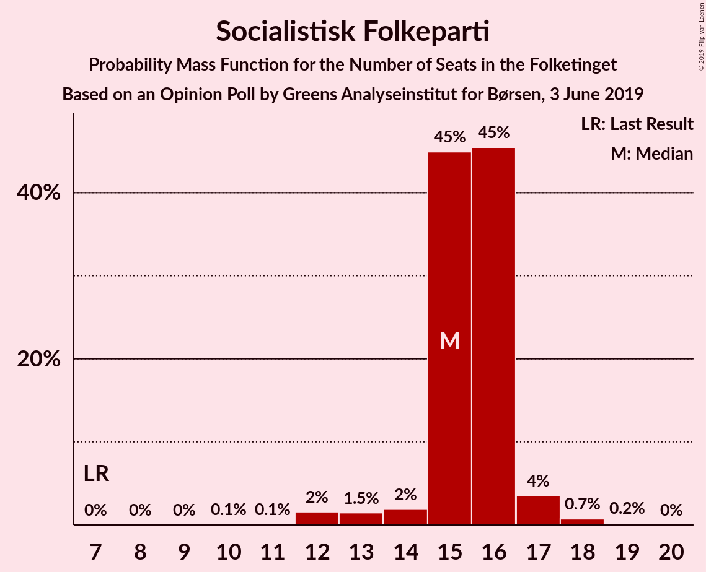
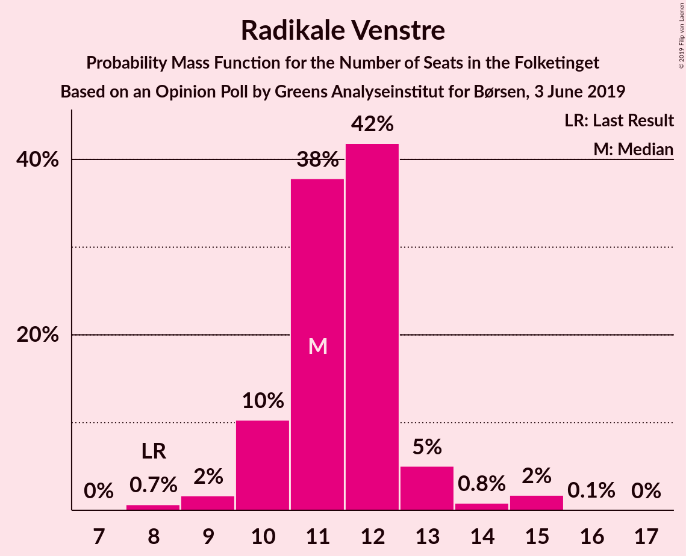
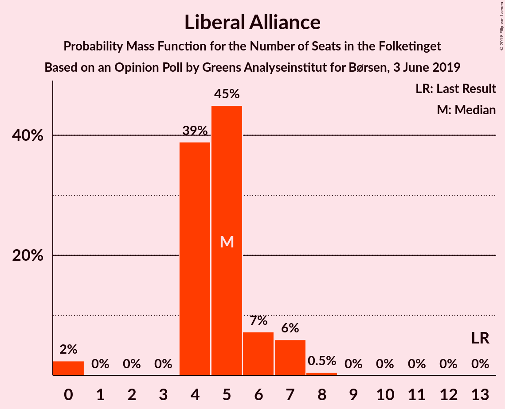
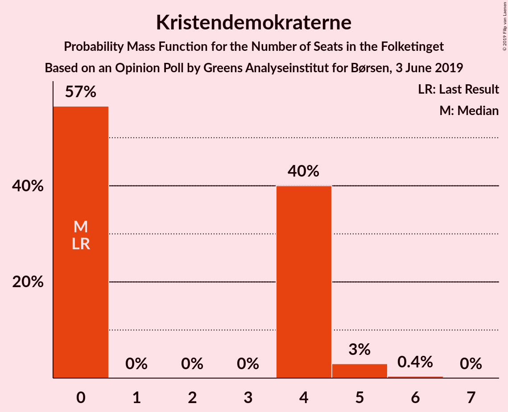
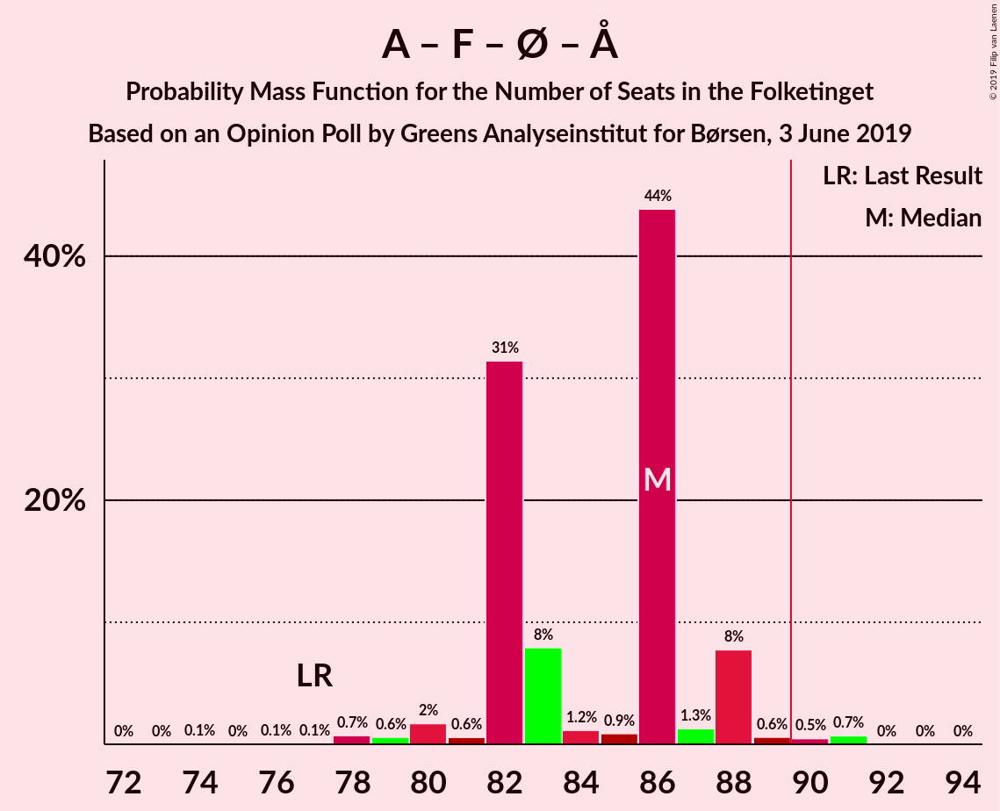
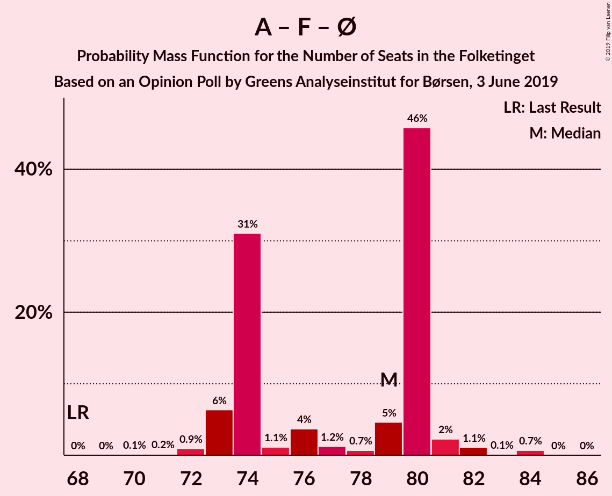
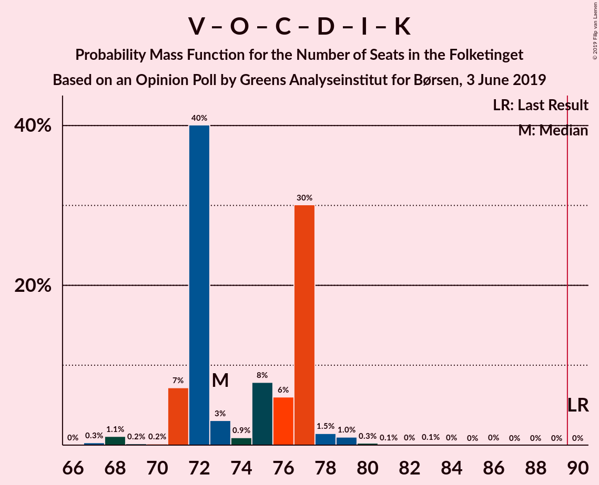
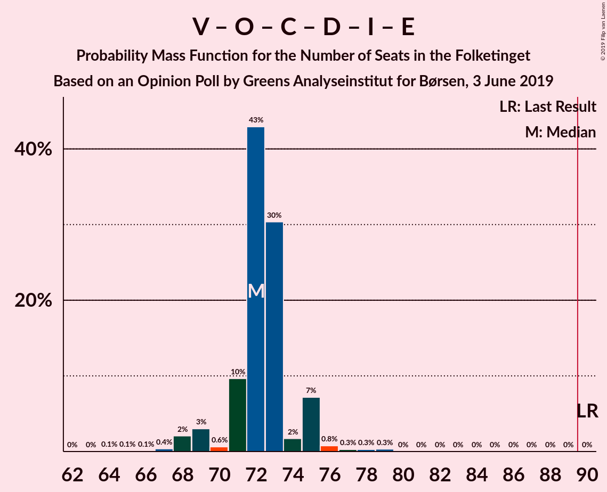
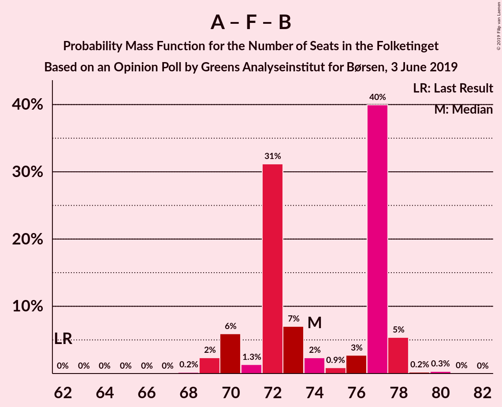

# Opinion Poll by Greens Analyseinstitut for Børsen, 3 June 2019

<a href="#voting-intentions">Voting Intentions</a> | <a href="#seats">Seats</a> | <a href="#coalitions">Coalitions</a> | <a href="#technical-information">Technical Information</a>

## Voting Intentions

### Confidence Intervals

| Party | Last Result | Poll Result | 80% Confidence Interval | 90% Confidence Interval | 95% Confidence Interval | 99% Confidence Interval |
|:-----:|:-----------:|:-----------:|:-----------------------:|:-----------------------:|:-----------------------:|:-----------------------:|
| Socialdemokraterne | 26.3% | 26.2% | 24.6–27.9% |24.1–28.3% |23.7–28.8% |23.0–29.6% |
| Venstre | 19.5% | 18.7% | 17.3–20.2% |16.9–20.7% |16.5–21.0% |15.9–21.8% |
| Dansk Folkeparti | 21.1% | 10.5% | 9.4–11.7% |9.1–12.1% |8.9–12.4% |8.4–13.0% |
| Socialistisk Folkeparti | 4.2% | 8.4% | 7.5–9.6% |7.2–9.9% |7.0–10.2% |6.5–10.7% |
| Enhedslisten–De Rød-Grønne | 7.8% | 8.3% | 7.3–9.4% |7.0–9.7% |6.8–10.0% |6.4–10.6% |
| Radikale Venstre | 4.6% | 6.5% | 5.7–7.6% |5.5–7.9% |5.3–8.1% |4.9–8.6% |
| Det Konservative Folkeparti | 3.4% | 5.2% | 4.4–6.1% |4.2–6.4% |4.0–6.6% |3.7–7.1% |
| Alternativet | 4.8% | 4.0% | 3.3–4.8% |3.1–5.0% |3.0–5.2% |2.7–5.7% |
| Nye Borgerlige | 0.0% | 3.3% | 2.7–4.1% |2.5–4.3% |2.4–4.5% |2.1–4.9% |
| Liberal Alliance | 7.5% | 2.8% | 2.3–3.6% |2.1–3.8% |2.0–4.0% |1.8–4.3% |
| Stram Kurs | 0.0% | 2.8% | 2.3–3.6% |2.1–3.8% |2.0–4.0% |1.8–4.3% |
| Kristendemokraterne | 0.8% | 2.0% | 1.5–2.6% |1.4–2.8% |1.3–3.0% |1.1–3.3% |
| Klaus Riskær Pedersen | 0.0% | 0.5% | 0.3–0.9% |0.3–1.0% |0.2–1.1% |0.2–1.3% |

*Note:* The poll result column reflects the actual value used in the calculations. Published results may vary slightly, and in addition be rounded to fewer digits.

## Seats

### Confidence Intervals

| Party | Last Result | Median | 80% Confidence Interval | 90% Confidence Interval | 95% Confidence Interval | 99% Confidence Interval |
|:-----:|:-----------:|:------:|:-----------------------:|:-----------------------:|:-----------------------:|:-----------------------:|
| <a href="#socialdemokraterne">Socialdemokraterne</a> | 47 | 48 | 44–50 |44–50 |44–50 |43–52 |
| <a href="#venstre">Venstre</a> | 34 | 34 | 30–34 |30–35 |30–35 |30–38 |
| <a href="#dansk-folkeparti">Dansk Folkeparti</a> | 37 | 19 | 17–20 |17–20 |17–20 |15–21 |
| <a href="#socialistisk-folkeparti">Socialistisk Folkeparti</a> | 7 | 15 | 15–16 |13–16 |13–16 |12–18 |
| <a href="#enhedslisten–de-rød-grønne">Enhedslisten–De Rød-Grønne</a> | 14 | 14 | 14–15 |14–15 |13–15 |12–17 |
| <a href="#radikale-venstre">Radikale Venstre</a> | 8 | 11 | 10–13 |10–15 |10–15 |10–15 |
| <a href="#det-konservative-folkeparti">Det Konservative Folkeparti</a> | 6 | 9 | 9–10 |8–10 |8–12 |7–13 |
| <a href="#alternativet">Alternativet</a> | 9 | 7 | 5–10 |5–10 |5–10 |5–10 |
| <a href="#nye-borgerlige">Nye Borgerlige</a> | 0 | 6 | 6–7 |4–7 |4–8 |4–8 |
| <a href="#liberal-alliance">Liberal Alliance</a> | 13 | 6 | 5–7 |4–7 |4–7 |0–7 |
| <a href="#stram-kurs">Stram Kurs</a> | 0 | 6 | 0–6 |0–6 |0–6 |0–7 |
| <a href="#kristendemokraterne">Kristendemokraterne</a> | 0 | 4 | 0–4 |0–4 |0–4 |0–5 |
| <a href="#klaus-riskær-pedersen">Klaus Riskær Pedersen</a> | 0 | 0 | 0 |0 |0 |0 |

### Socialdemokraterne

*For a full overview of the results for this party, see the [Socialdemokraterne](party-socialdemokraterne.html) page.*

| Number of Seats | Probability | Accumulated | Special Marks |
|:---------------:|:-----------:|:-----------:|:-------------:|
| 41 | 0.1% | 100% |  |
| 42 | 0.3% | 99.9% |  |
| 43 | 2% | 99.7% |  |
| 44 | 45% | 98% |  |
| 45 | 1.0% | 53% |  |
| 46 | 1.1% | 52% |  |
| 47 | 0.4% | 51% | Last Result |
| 48 | 0.5% | 50% | Median |
| 49 | 33% | 50% |  |
| 50 | 14% | 16% |  |
| 51 | 0.1% | 2% |  |
| 52 | 2% | 2% |  |
| 53 | 0% | 0.1% |  |
| 54 | 0.1% | 0.1% |  |
| 55 | 0% | 0% |  |

### Venstre

*For a full overview of the results for this party, see the [Venstre](party-venstre.html) page.*

| Number of Seats | Probability | Accumulated | Special Marks |
|:---------------:|:-----------:|:-----------:|:-------------:|
| 28 | 0.1% | 100% |  |
| 29 | 0.2% | 99.9% |  |
| 30 | 15% | 99.7% |  |
| 31 | 2% | 85% |  |
| 32 | 28% | 83% |  |
| 33 | 0.6% | 54% |  |
| 34 | 46% | 54% | Last Result, Median |
| 35 | 6% | 8% |  |
| 36 | 0.3% | 1.4% |  |
| 37 | 0.1% | 1.1% |  |
| 38 | 0.9% | 1.0% |  |
| 39 | 0% | 0.1% |  |
| 40 | 0% | 0.1% |  |
| 41 | 0% | 0% |  |

### Dansk Folkeparti

*For a full overview of the results for this party, see the [Dansk Folkeparti](party-danskfolkeparti.html) page.*

| Number of Seats | Probability | Accumulated | Special Marks |
|:---------------:|:-----------:|:-----------:|:-------------:|
| 14 | 0.1% | 100% |  |
| 15 | 1.0% | 99.9% |  |
| 16 | 0.4% | 98.9% |  |
| 17 | 21% | 98.5% |  |
| 18 | 27% | 78% |  |
| 19 | 2% | 50% | Median |
| 20 | 47% | 48% |  |
| 21 | 1.0% | 1.2% |  |
| 22 | 0.1% | 0.2% |  |
| 23 | 0% | 0.1% |  |
| 24 | 0% | 0% |  |
| 25 | 0% | 0% |  |
| 26 | 0% | 0% |  |
| 27 | 0% | 0% |  |
| 28 | 0% | 0% |  |
| 29 | 0% | 0% |  |
| 30 | 0% | 0% |  |
| 31 | 0% | 0% |  |
| 32 | 0% | 0% |  |
| 33 | 0% | 0% |  |
| 34 | 0% | 0% |  |
| 35 | 0% | 0% |  |
| 36 | 0% | 0% |  |
| 37 | 0% | 0% | Last Result |

### Socialistisk Folkeparti

*For a full overview of the results for this party, see the [Socialistisk Folkeparti](party-socialistiskfolkeparti.html) page.*

| Number of Seats | Probability | Accumulated | Special Marks |
|:---------------:|:-----------:|:-----------:|:-------------:|
| 7 | 0% | 100% | Last Result |
| 8 | 0% | 100% |  |
| 9 | 0% | 100% |  |
| 10 | 0% | 100% |  |
| 11 | 0.1% | 100% |  |
| 12 | 1.3% | 99.9% |  |
| 13 | 6% | 98.6% |  |
| 14 | 0.9% | 92% |  |
| 15 | 45% | 91% | Median |
| 16 | 45% | 47% |  |
| 17 | 1.1% | 2% |  |
| 18 | 0.2% | 0.5% |  |
| 19 | 0.3% | 0.3% |  |
| 20 | 0% | 0% |  |

### Enhedslisten–De Rød-Grønne

*For a full overview of the results for this party, see the [Enhedslisten–De Rød-Grønne](party-enhedslisten–derød-grønne.html) page.*

| Number of Seats | Probability | Accumulated | Special Marks |
|:---------------:|:-----------:|:-----------:|:-------------:|
| 11 | 0.1% | 100% |  |
| 12 | 1.4% | 99.8% |  |
| 13 | 2% | 98% |  |
| 14 | 78% | 96% | Last Result, Median |
| 15 | 16% | 18% |  |
| 16 | 0.2% | 2% |  |
| 17 | 1.2% | 1.3% |  |
| 18 | 0.1% | 0.1% |  |
| 19 | 0% | 0.1% |  |
| 20 | 0% | 0% |  |

### Radikale Venstre

*For a full overview of the results for this party, see the [Radikale Venstre](party-radikalevenstre.html) page.*

| Number of Seats | Probability | Accumulated | Special Marks |
|:---------------:|:-----------:|:-----------:|:-------------:|
| 8 | 0% | 100% | Last Result |
| 9 | 0.1% | 100% |  |
| 10 | 16% | 99.8% |  |
| 11 | 45% | 83% | Median |
| 12 | 2% | 38% |  |
| 13 | 28% | 36% |  |
| 14 | 2% | 8% |  |
| 15 | 6% | 6% |  |
| 16 | 0% | 0% |  |

### Det Konservative Folkeparti

*For a full overview of the results for this party, see the [Det Konservative Folkeparti](party-detkonservativefolkeparti.html) page.*

| Number of Seats | Probability | Accumulated | Special Marks |
|:---------------:|:-----------:|:-----------:|:-------------:|
| 6 | 0% | 100% | Last Result |
| 7 | 0.6% | 100% |  |
| 8 | 7% | 99.3% |  |
| 9 | 72% | 93% | Median |
| 10 | 17% | 21% |  |
| 11 | 1.1% | 4% |  |
| 12 | 1.1% | 3% |  |
| 13 | 2% | 2% |  |
| 14 | 0.1% | 0.1% |  |
| 15 | 0% | 0% |  |

### Alternativet

*For a full overview of the results for this party, see the [Alternativet](party-alternativet.html) page.*

| Number of Seats | Probability | Accumulated | Special Marks |
|:---------------:|:-----------:|:-----------:|:-------------:|
| 5 | 15% | 100% |  |
| 6 | 8% | 85% |  |
| 7 | 29% | 77% | Median |
| 8 | 3% | 48% |  |
| 9 | 0.4% | 45% | Last Result |
| 10 | 44% | 44% |  |
| 11 | 0% | 0% |  |

### Nye Borgerlige

*For a full overview of the results for this party, see the [Nye Borgerlige](party-nyeborgerlige.html) page.*

| Number of Seats | Probability | Accumulated | Special Marks |
|:---------------:|:-----------:|:-----------:|:-------------:|
| 0 | 0.1% | 100% | Last Result |
| 1 | 0% | 99.9% |  |
| 2 | 0% | 99.9% |  |
| 3 | 0% | 99.9% |  |
| 4 | 7% | 99.9% |  |
| 5 | 1.2% | 93% |  |
| 6 | 72% | 92% | Median |
| 7 | 16% | 20% |  |
| 8 | 4% | 4% |  |
| 9 | 0.3% | 0.3% |  |
| 10 | 0% | 0% |  |

### Liberal Alliance

*For a full overview of the results for this party, see the [Liberal Alliance](party-liberalalliance.html) page.*

| Number of Seats | Probability | Accumulated | Special Marks |
|:---------------:|:-----------:|:-----------:|:-------------:|
| 0 | 2% | 100% |  |
| 1 | 0% | 98% |  |
| 2 | 0% | 98% |  |
| 3 | 0% | 98% |  |
| 4 | 4% | 98% |  |
| 5 | 22% | 94% |  |
| 6 | 45% | 72% | Median |
| 7 | 27% | 27% |  |
| 8 | 0.1% | 0.1% |  |
| 9 | 0% | 0% |  |
| 10 | 0% | 0% |  |
| 11 | 0% | 0% |  |
| 12 | 0% | 0% |  |
| 13 | 0% | 0% | Last Result |

### Stram Kurs

*For a full overview of the results for this party, see the [Stram Kurs](party-stramkurs.html) page.*

| Number of Seats | Probability | Accumulated | Special Marks |
|:---------------:|:-----------:|:-----------:|:-------------:|
| 0 | 27% | 100% | Last Result |
| 1 | 0% | 73% |  |
| 2 | 0% | 73% |  |
| 3 | 0% | 73% |  |
| 4 | 1.2% | 73% |  |
| 5 | 10% | 72% |  |
| 6 | 61% | 62% | Median |
| 7 | 0.9% | 1.0% |  |
| 8 | 0.1% | 0.2% |  |
| 9 | 0% | 0% |  |

### Kristendemokraterne

*For a full overview of the results for this party, see the [Kristendemokraterne](party-kristendemokraterne.html) page.*

| Number of Seats | Probability | Accumulated | Special Marks |
|:---------------:|:-----------:|:-----------:|:-------------:|
| 0 | 49% | 100% | Last Result |
| 1 | 0% | 51% |  |
| 2 | 0% | 51% |  |
| 3 | 0% | 51% |  |
| 4 | 49% | 51% | Median |
| 5 | 1.3% | 1.4% |  |
| 6 | 0.1% | 0.1% |  |
| 7 | 0% | 0% |  |

### Klaus Riskær Pedersen

*For a full overview of the results for this party, see the [Klaus Riskær Pedersen](party-klausriskærpedersen.html) page.*

| Number of Seats | Probability | Accumulated | Special Marks |
|:---------------:|:-----------:|:-----------:|:-------------:|
| 0 | 100% | 100% | Last Result, Median |

## Coalitions

### Confidence Intervals

| Coalition | Last Result | Median | Majority? | 80% Confidence Interval | 90% Confidence Interval | 95% Confidence Interval | 99% Confidence Interval |
|:---------:|:-----------:|:------:|:---------:|:-----------------------:|:-----------------------:|:-----------------------:|:-----------------------:|
| Socialdemokraterne – Socialistisk Folkeparti – Enhedslisten–De Rød-Grønne – Radikale Venstre – Alternativet | 85 | 96 | 99.8% | 94–99 | 94–99 | 91–99 | 91–101 |
| Socialdemokraterne – Socialistisk Folkeparti – Enhedslisten–De Rød-Grønne – Radikale Venstre | 76 | 90 | 50% | 84–92 | 84–92 | 84–92 | 84–93 |
| Socialdemokraterne – Socialistisk Folkeparti – Enhedslisten–De Rød-Grønne – Alternativet | 77 | 83 | 0.3% | 82–86 | 82–86 | 81–86 | 78–89 |
| Venstre – Dansk Folkeparti – Det Konservative Folkeparti – Nye Borgerlige – Liberal Alliance – Stram Kurs – Kristendemokraterne – Klaus Riskær Pedersen | 90 | 79 | 0% | 76–81 | 76–81 | 76–84 | 74–84 |
| Socialdemokraterne – Socialistisk Folkeparti – Enhedslisten–De Rød-Grønne | 68 | 76 | 0% | 73–81 | 73–81 | 73–81 | 72–81 |
| Venstre – Dansk Folkeparti – Det Konservative Folkeparti – Nye Borgerlige – Liberal Alliance – Kristendemokraterne – Klaus Riskær Pedersen | 90 | 75 | 0% | 73–76 | 73–76 | 72–79 | 68–79 |
| Venstre – Dansk Folkeparti – Det Konservative Folkeparti – Nye Borgerlige – Liberal Alliance – Kristendemokraterne | 90 | 75 | 0% | 73–76 | 73–76 | 72–79 | 68–79 |
| Venstre – Dansk Folkeparti – Det Konservative Folkeparti – Nye Borgerlige – Liberal Alliance – Klaus Riskær Pedersen | 90 | 72 | 0% | 69–75 | 69–75 | 69–78 | 68–79 |
| Venstre – Dansk Folkeparti – Det Konservative Folkeparti – Nye Borgerlige – Liberal Alliance | 90 | 72 | 0% | 69–75 | 69–75 | 69–78 | 68–79 |
| Socialdemokraterne – Socialistisk Folkeparti – Radikale Venstre | 62 | 76 | 0% | 70–78 | 70–78 | 69–78 | 68–80 |
| Venstre – Dansk Folkeparti – Det Konservative Folkeparti – Liberal Alliance – Kristendemokraterne | 90 | 69 | 0% | 66–70 | 66–70 | 66–71 | 60–74 |
| Venstre – Dansk Folkeparti – Det Konservative Folkeparti – Liberal Alliance | 90 | 66 | 0% | 62–69 | 62–69 | 62–71 | 60–74 |
| Socialdemokraterne – Radikale Venstre | 55 | 60 | 0% | 55–62 | 55–64 | 55–64 | 53–64 |
| Venstre – Det Konservative Folkeparti – Liberal Alliance | 53 | 48 | 0% | 45–49 | 45–49 | 45–51 | 41–53 |
| Venstre – Det Konservative Folkeparti | 40 | 43 | 0% | 40–43 | 40–43 | 40–47 | 40–48 |
| Venstre | 34 | 34 | 0% | 30–34 | 30–35 | 30–35 | 30–38 |

### Socialdemokraterne – Socialistisk Folkeparti – Enhedslisten–De Rød-Grønne – Radikale Venstre – Alternativet

| Number of Seats | Probability | Accumulated | Special Marks |
|:---------------:|:-----------:|:-----------:|:-------------:|
| 85 | 0% | 100% | Last Result |
| 86 | 0% | 100% |  |
| 87 | 0.1% | 100% |  |
| 88 | 0.1% | 99.9% |  |
| 89 | 0% | 99.9% |  |
| 90 | 0.1% | 99.8% | Majority |
| 91 | 2% | 99.8% |  |
| 92 | 2% | 97% |  |
| 93 | 0.1% | 96% |  |
| 94 | 44% | 96% |  |
| 95 | 0.2% | 51% | Median |
| 96 | 14% | 51% |  |
| 97 | 7% | 37% |  |
| 98 | 0.1% | 30% |  |
| 99 | 27% | 30% |  |
| 100 | 0.1% | 2% |  |
| 101 | 2% | 2% |  |
| 102 | 0% | 0.2% |  |
| 103 | 0% | 0.1% |  |
| 104 | 0% | 0.1% |  |
| 105 | 0% | 0.1% |  |
| 106 | 0.1% | 0.1% |  |
| 107 | 0% | 0% |  |

### Socialdemokraterne – Socialistisk Folkeparti – Enhedslisten–De Rød-Grønne – Radikale Venstre

| Number of Seats | Probability | Accumulated | Special Marks |
|:---------------:|:-----------:|:-----------:|:-------------:|
| 76 | 0% | 100% | Last Result |
| 77 | 0% | 100% |  |
| 78 | 0% | 100% |  |
| 79 | 0% | 100% |  |
| 80 | 0.1% | 100% |  |
| 81 | 0% | 99.9% |  |
| 82 | 0.1% | 99.9% |  |
| 83 | 0% | 99.8% |  |
| 84 | 46% | 99.8% |  |
| 85 | 1.2% | 54% |  |
| 86 | 0.9% | 53% |  |
| 87 | 0.3% | 52% |  |
| 88 | 0.2% | 51% | Median |
| 89 | 1.0% | 51% |  |
| 90 | 0.2% | 50% | Majority |
| 91 | 21% | 50% |  |
| 92 | 27% | 29% |  |
| 93 | 2% | 2% |  |
| 94 | 0% | 0.3% |  |
| 95 | 0.2% | 0.3% |  |
| 96 | 0% | 0.1% |  |
| 97 | 0% | 0.1% |  |
| 98 | 0% | 0.1% |  |
| 99 | 0.1% | 0.1% |  |
| 100 | 0% | 0% |  |

### Socialdemokraterne – Socialistisk Folkeparti – Enhedslisten–De Rød-Grønne – Alternativet

| Number of Seats | Probability | Accumulated | Special Marks |
|:---------------:|:-----------:|:-----------:|:-------------:|
| 76 | 0.1% | 100% |  |
| 77 | 0.1% | 99.9% | Last Result |
| 78 | 0.9% | 99.8% |  |
| 79 | 0.3% | 98.9% |  |
| 80 | 1.0% | 98.6% |  |
| 81 | 2% | 98% |  |
| 82 | 7% | 96% |  |
| 83 | 45% | 90% |  |
| 84 | 0.1% | 44% | Median |
| 85 | 0.3% | 44% |  |
| 86 | 41% | 44% |  |
| 87 | 0.1% | 2% |  |
| 88 | 0% | 2% |  |
| 89 | 2% | 2% |  |
| 90 | 0% | 0.3% | Majority |
| 91 | 0.1% | 0.3% |  |
| 92 | 0% | 0.1% |  |
| 93 | 0% | 0.1% |  |
| 94 | 0.1% | 0.1% |  |
| 95 | 0% | 0% |  |

### Venstre – Dansk Folkeparti – Det Konservative Folkeparti – Nye Borgerlige – Liberal Alliance – Stram Kurs – Kristendemokraterne – Klaus Riskær Pedersen

| Number of Seats | Probability | Accumulated | Special Marks |
|:---------------:|:-----------:|:-----------:|:-------------:|
| 69 | 0.1% | 100% |  |
| 70 | 0% | 99.9% |  |
| 71 | 0% | 99.9% |  |
| 72 | 0% | 99.9% |  |
| 73 | 0.1% | 99.9% |  |
| 74 | 2% | 99.8% |  |
| 75 | 0.1% | 98% |  |
| 76 | 27% | 98% |  |
| 77 | 0% | 70% |  |
| 78 | 7% | 70% |  |
| 79 | 14% | 63% |  |
| 80 | 0.2% | 49% |  |
| 81 | 44% | 49% |  |
| 82 | 0.1% | 4% |  |
| 83 | 2% | 4% |  |
| 84 | 2% | 3% | Median |
| 85 | 0.1% | 0.2% |  |
| 86 | 0% | 0.2% |  |
| 87 | 0.1% | 0.1% |  |
| 88 | 0.1% | 0.1% |  |
| 89 | 0% | 0% |  |
| 90 | 0% | 0% | Last Result, Majority |

### Socialdemokraterne – Socialistisk Folkeparti – Enhedslisten–De Rød-Grønne

| Number of Seats | Probability | Accumulated | Special Marks |
|:---------------:|:-----------:|:-----------:|:-------------:|
| 68 | 0% | 100% | Last Result |
| 69 | 0.2% | 100% |  |
| 70 | 0.2% | 99.8% |  |
| 71 | 0.1% | 99.7% |  |
| 72 | 0.7% | 99.5% |  |
| 73 | 44% | 98.8% |  |
| 74 | 3% | 55% |  |
| 75 | 1.3% | 52% |  |
| 76 | 6% | 50% |  |
| 77 | 0.1% | 44% | Median |
| 78 | 0.1% | 44% |  |
| 79 | 27% | 44% |  |
| 80 | 0.1% | 17% |  |
| 81 | 16% | 17% |  |
| 82 | 0% | 0.4% |  |
| 83 | 0% | 0.3% |  |
| 84 | 0% | 0.3% |  |
| 85 | 0.1% | 0.3% |  |
| 86 | 0% | 0.1% |  |
| 87 | 0.1% | 0.1% |  |
| 88 | 0% | 0% |  |

### Venstre – Dansk Folkeparti – Det Konservative Folkeparti – Nye Borgerlige – Liberal Alliance – Kristendemokraterne – Klaus Riskær Pedersen

| Number of Seats | Probability | Accumulated | Special Marks |
|:---------------:|:-----------:|:-----------:|:-------------:|
| 63 | 0.1% | 100% |  |
| 64 | 0% | 99.9% |  |
| 65 | 0% | 99.9% |  |
| 66 | 0% | 99.9% |  |
| 67 | 0% | 99.9% |  |
| 68 | 2% | 99.8% |  |
| 69 | 0.2% | 98% |  |
| 70 | 0.1% | 98% |  |
| 71 | 0% | 98% |  |
| 72 | 0% | 98% |  |
| 73 | 21% | 97% |  |
| 74 | 1.0% | 77% |  |
| 75 | 45% | 76% |  |
| 76 | 28% | 31% |  |
| 77 | 0.1% | 4% |  |
| 78 | 0.8% | 3% | Median |
| 79 | 2% | 3% |  |
| 80 | 0% | 0.2% |  |
| 81 | 0% | 0.2% |  |
| 82 | 0.1% | 0.2% |  |
| 83 | 0% | 0.1% |  |
| 84 | 0.1% | 0.1% |  |
| 85 | 0% | 0% |  |
| 86 | 0% | 0% |  |
| 87 | 0% | 0% |  |
| 88 | 0% | 0% |  |
| 89 | 0% | 0% |  |
| 90 | 0% | 0% | Last Result, Majority |

### Venstre – Dansk Folkeparti – Det Konservative Folkeparti – Nye Borgerlige – Liberal Alliance – Kristendemokraterne

| Number of Seats | Probability | Accumulated | Special Marks |
|:---------------:|:-----------:|:-----------:|:-------------:|
| 63 | 0.1% | 100% |  |
| 64 | 0% | 99.9% |  |
| 65 | 0% | 99.9% |  |
| 66 | 0% | 99.9% |  |
| 67 | 0% | 99.9% |  |
| 68 | 2% | 99.8% |  |
| 69 | 0.2% | 98% |  |
| 70 | 0.1% | 98% |  |
| 71 | 0% | 98% |  |
| 72 | 0% | 98% |  |
| 73 | 21% | 97% |  |
| 74 | 1.0% | 77% |  |
| 75 | 45% | 76% |  |
| 76 | 28% | 31% |  |
| 77 | 0.1% | 4% |  |
| 78 | 0.8% | 3% | Median |
| 79 | 2% | 3% |  |
| 80 | 0% | 0.2% |  |
| 81 | 0% | 0.2% |  |
| 82 | 0.1% | 0.2% |  |
| 83 | 0% | 0.1% |  |
| 84 | 0.1% | 0.1% |  |
| 85 | 0% | 0% |  |
| 86 | 0% | 0% |  |
| 87 | 0% | 0% |  |
| 88 | 0% | 0% |  |
| 89 | 0% | 0% |  |
| 90 | 0% | 0% | Last Result, Majority |

### Venstre – Dansk Folkeparti – Det Konservative Folkeparti – Nye Borgerlige – Liberal Alliance – Klaus Riskær Pedersen

| Number of Seats | Probability | Accumulated | Special Marks |
|:---------------:|:-----------:|:-----------:|:-------------:|
| 63 | 0.1% | 100% |  |
| 64 | 0% | 99.9% |  |
| 65 | 0.2% | 99.8% |  |
| 66 | 0% | 99.7% |  |
| 67 | 0% | 99.7% |  |
| 68 | 2% | 99.6% |  |
| 69 | 21% | 98% |  |
| 70 | 0.3% | 76% |  |
| 71 | 0.2% | 76% |  |
| 72 | 28% | 76% |  |
| 73 | 0.1% | 48% |  |
| 74 | 0.7% | 48% | Median |
| 75 | 44% | 47% |  |
| 76 | 0% | 3% |  |
| 77 | 0.1% | 3% |  |
| 78 | 0.2% | 3% |  |
| 79 | 2% | 2% |  |
| 80 | 0% | 0% |  |
| 81 | 0% | 0% |  |
| 82 | 0% | 0% |  |
| 83 | 0% | 0% |  |
| 84 | 0% | 0% |  |
| 85 | 0% | 0% |  |
| 86 | 0% | 0% |  |
| 87 | 0% | 0% |  |
| 88 | 0% | 0% |  |
| 89 | 0% | 0% |  |
| 90 | 0% | 0% | Last Result, Majority |

### Venstre – Dansk Folkeparti – Det Konservative Folkeparti – Nye Borgerlige – Liberal Alliance

| Number of Seats | Probability | Accumulated | Special Marks |
|:---------------:|:-----------:|:-----------:|:-------------:|
| 63 | 0.1% | 100% |  |
| 64 | 0% | 99.9% |  |
| 65 | 0.2% | 99.8% |  |
| 66 | 0% | 99.7% |  |
| 67 | 0% | 99.7% |  |
| 68 | 2% | 99.6% |  |
| 69 | 21% | 98% |  |
| 70 | 0.3% | 76% |  |
| 71 | 0.2% | 76% |  |
| 72 | 28% | 76% |  |
| 73 | 0.1% | 48% |  |
| 74 | 0.7% | 48% | Median |
| 75 | 44% | 47% |  |
| 76 | 0% | 3% |  |
| 77 | 0.1% | 3% |  |
| 78 | 0.2% | 3% |  |
| 79 | 2% | 2% |  |
| 80 | 0% | 0% |  |
| 81 | 0% | 0% |  |
| 82 | 0% | 0% |  |
| 83 | 0% | 0% |  |
| 84 | 0% | 0% |  |
| 85 | 0% | 0% |  |
| 86 | 0% | 0% |  |
| 87 | 0% | 0% |  |
| 88 | 0% | 0% |  |
| 89 | 0% | 0% |  |
| 90 | 0% | 0% | Last Result, Majority |

### Socialdemokraterne – Socialistisk Folkeparti – Radikale Venstre

| Number of Seats | Probability | Accumulated | Special Marks |
|:---------------:|:-----------:|:-----------:|:-------------:|
| 62 | 0% | 100% | Last Result |
| 63 | 0% | 100% |  |
| 64 | 0% | 100% |  |
| 65 | 0% | 100% |  |
| 66 | 0% | 100% |  |
| 67 | 0% | 99.9% |  |
| 68 | 1.0% | 99.9% |  |
| 69 | 2% | 98.9% |  |
| 70 | 44% | 97% |  |
| 71 | 0.2% | 53% |  |
| 72 | 1.2% | 53% |  |
| 73 | 0.5% | 52% |  |
| 74 | 0.2% | 51% | Median |
| 75 | 0.1% | 51% |  |
| 76 | 14% | 51% |  |
| 77 | 7% | 37% |  |
| 78 | 27% | 29% |  |
| 79 | 0.1% | 2% |  |
| 80 | 2% | 2% |  |
| 81 | 0% | 0.2% |  |
| 82 | 0.1% | 0.1% |  |
| 83 | 0% | 0% |  |

### Venstre – Dansk Folkeparti – Det Konservative Folkeparti – Liberal Alliance – Kristendemokraterne

| Number of Seats | Probability | Accumulated | Special Marks |
|:---------------:|:-----------:|:-----------:|:-------------:|
| 56 | 0.1% | 100% |  |
| 57 | 0% | 99.9% |  |
| 58 | 0% | 99.9% |  |
| 59 | 0% | 99.9% |  |
| 60 | 2% | 99.9% |  |
| 61 | 0% | 98% |  |
| 62 | 0% | 98% |  |
| 63 | 0.2% | 98% |  |
| 64 | 0.1% | 98% |  |
| 65 | 0% | 98% |  |
| 66 | 14% | 98% |  |
| 67 | 1.0% | 83% |  |
| 68 | 0.2% | 82% |  |
| 69 | 51% | 82% |  |
| 70 | 28% | 31% |  |
| 71 | 2% | 3% |  |
| 72 | 0.1% | 1.2% | Median |
| 73 | 0% | 1.2% |  |
| 74 | 1.0% | 1.2% |  |
| 75 | 0% | 0.2% |  |
| 76 | 0.1% | 0.1% |  |
| 77 | 0.1% | 0.1% |  |
| 78 | 0% | 0% |  |
| 79 | 0% | 0% |  |
| 80 | 0% | 0% |  |
| 81 | 0% | 0% |  |
| 82 | 0% | 0% |  |
| 83 | 0% | 0% |  |
| 84 | 0% | 0% |  |
| 85 | 0% | 0% |  |
| 86 | 0% | 0% |  |
| 87 | 0% | 0% |  |
| 88 | 0% | 0% |  |
| 89 | 0% | 0% |  |
| 90 | 0% | 0% | Last Result, Majority |

### Venstre – Dansk Folkeparti – Det Konservative Folkeparti – Liberal Alliance

| Number of Seats | Probability | Accumulated | Special Marks |
|:---------------:|:-----------:|:-----------:|:-------------:|
| 56 | 0.1% | 100% |  |
| 57 | 0% | 99.9% |  |
| 58 | 0% | 99.9% |  |
| 59 | 0.1% | 99.8% |  |
| 60 | 2% | 99.7% |  |
| 61 | 0% | 98% |  |
| 62 | 15% | 98% |  |
| 63 | 0.2% | 83% |  |
| 64 | 0.1% | 82% |  |
| 65 | 7% | 82% |  |
| 66 | 28% | 76% |  |
| 67 | 0.2% | 48% |  |
| 68 | 0.2% | 47% | Median |
| 69 | 44% | 47% |  |
| 70 | 0.1% | 3% |  |
| 71 | 2% | 3% |  |
| 72 | 0.1% | 1.0% |  |
| 73 | 0% | 0.9% |  |
| 74 | 0.9% | 0.9% |  |
| 75 | 0% | 0% |  |
| 76 | 0% | 0% |  |
| 77 | 0% | 0% |  |
| 78 | 0% | 0% |  |
| 79 | 0% | 0% |  |
| 80 | 0% | 0% |  |
| 81 | 0% | 0% |  |
| 82 | 0% | 0% |  |
| 83 | 0% | 0% |  |
| 84 | 0% | 0% |  |
| 85 | 0% | 0% |  |
| 86 | 0% | 0% |  |
| 87 | 0% | 0% |  |
| 88 | 0% | 0% |  |
| 89 | 0% | 0% |  |
| 90 | 0% | 0% | Last Result, Majority |

### Socialdemokraterne – Radikale Venstre

| Number of Seats | Probability | Accumulated | Special Marks |
|:---------------:|:-----------:|:-----------:|:-------------:|
| 51 | 0% | 100% |  |
| 52 | 0% | 99.9% |  |
| 53 | 2% | 99.9% |  |
| 54 | 0.1% | 98% |  |
| 55 | 44% | 98% | Last Result |
| 56 | 1.0% | 54% |  |
| 57 | 0.2% | 53% |  |
| 58 | 1.2% | 53% |  |
| 59 | 0.2% | 51% | Median |
| 60 | 16% | 51% |  |
| 61 | 0.1% | 36% |  |
| 62 | 27% | 35% |  |
| 63 | 0% | 8% |  |
| 64 | 8% | 8% |  |
| 65 | 0% | 0.1% |  |
| 66 | 0.1% | 0.1% |  |
| 67 | 0% | 0% |  |

### Venstre – Det Konservative Folkeparti – Liberal Alliance

| Number of Seats | Probability | Accumulated | Special Marks |
|:---------------:|:-----------:|:-----------:|:-------------:|
| 36 | 0.1% | 100% |  |
| 37 | 0% | 99.9% |  |
| 38 | 0% | 99.9% |  |
| 39 | 0% | 99.9% |  |
| 40 | 0% | 99.9% |  |
| 41 | 2% | 99.9% |  |
| 42 | 0.1% | 98% |  |
| 43 | 0.1% | 98% |  |
| 44 | 0.1% | 98% |  |
| 45 | 14% | 98% |  |
| 46 | 0.9% | 83% |  |
| 47 | 1.2% | 82% |  |
| 48 | 33% | 81% |  |
| 49 | 45% | 48% | Median |
| 50 | 0.1% | 3% |  |
| 51 | 2% | 3% |  |
| 52 | 0.1% | 1.1% |  |
| 53 | 0.9% | 1.0% | Last Result |
| 54 | 0% | 0.1% |  |
| 55 | 0.1% | 0.1% |  |
| 56 | 0% | 0% |  |

### Venstre – Det Konservative Folkeparti

| Number of Seats | Probability | Accumulated | Special Marks |
|:---------------:|:-----------:|:-----------:|:-------------:|
| 36 | 0.1% | 100% |  |
| 37 | 0.1% | 99.9% |  |
| 38 | 0% | 99.7% |  |
| 39 | 0.2% | 99.7% |  |
| 40 | 14% | 99.5% | Last Result |
| 41 | 29% | 85% |  |
| 42 | 1.1% | 56% |  |
| 43 | 52% | 55% | Median |
| 44 | 0.2% | 3% |  |
| 45 | 0.5% | 3% |  |
| 46 | 0.1% | 3% |  |
| 47 | 2% | 3% |  |
| 48 | 0.9% | 1.0% |  |
| 49 | 0% | 0.1% |  |
| 50 | 0% | 0.1% |  |
| 51 | 0% | 0% |  |

### Venstre

| Number of Seats | Probability | Accumulated | Special Marks |
|:---------------:|:-----------:|:-----------:|:-------------:|
| 28 | 0.1% | 100% |  |
| 29 | 0.2% | 99.9% |  |
| 30 | 15% | 99.7% |  |
| 31 | 2% | 85% |  |
| 32 | 28% | 83% |  |
| 33 | 0.6% | 54% |  |
| 34 | 46% | 54% | Last Result, Median |
| 35 | 6% | 8% |  |
| 36 | 0.3% | 1.4% |  |
| 37 | 0.1% | 1.1% |  |
| 38 | 0.9% | 1.0% |  |
| 39 | 0% | 0.1% |  |
| 40 | 0% | 0.1% |  |
| 41 | 0% | 0% |  |

## Technical Information

### Opinion Poll

+ **Polling firm:** Greens Analyseinstitut
+ **Commissioner(s):** Børsen
+ **Fieldwork period:** 3 June 2019

### Calculations

+ **Sample size:** 1162
+ **Simulations done:** 131,072
+ **Error estimate:** 4.19%

